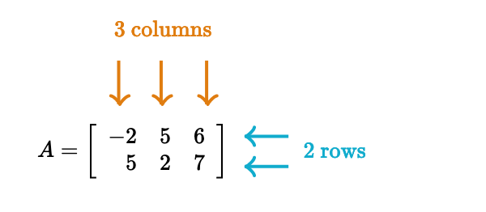
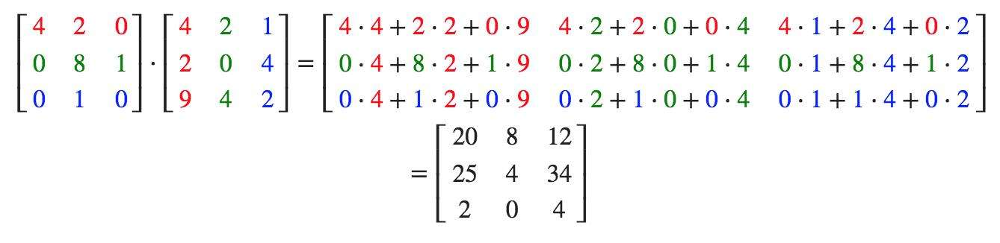

# [JavaScript WebGL 矩阵](https://segmentfault.com/a/1190000041612644)

## 引子

本以为可以开始尝试三维的效果了，查了一下资料之后发现要先了解矩阵。在这里集中收集一下相关基础知识点。

- [Origin](https://link.segmentfault.com/?enc=E%2F6CaXZtYTfq0HfRi1yN9g%3D%3D.bU9%2FrKg4cDM9HUzWPp1pUoe2Rtgj6cbs5QIIHriG0GsNIVb2W0l97d3QoaXy8HTh)
- [My GitHub](https://link.segmentfault.com/?enc=L2RrkfpaAjbMR9P1MBryVg%3D%3D.kqoGbX3u6c4NJ061zn6Zye7Duziu61vNRjwMEDonGFA%3D)

## 简介

简单来说，矩阵（Matrix）是数字按行和列的矩形排列。一般描述先行后列，例如下面 2×3 矩阵：



矩阵中每个元素表示也可以根据行和列标记，例如 a1,2 表示第 1 行的第 2 列元素。

- 在应用数学学科中，矩阵常见于统计分析。
- 在物理学中，矩阵于电路学、力学、光学和量子物理中都有应用。
- 计算机科学中，三维动画制作需要用到矩阵。

## 单位矩阵

单位矩阵有如下特点：

- 行数和列数相等。
- 对角线全是 1，其它全是 0 。
- 符号为大写字母 I 。
- 与任何矩阵相乘不会产生改变，例如 A × I = A。

下面是 3×3 单位矩阵：


## 负矩阵

简单来说就是矩阵里面每个元素求反。

例如矩阵 A 如下：


对应负矩阵就是：


## 转置

转置就是把矩阵的列和行对换。在右上角放一个 T 表示转置：


转置满足以下运算律：

- (AT)T = A
- (λA)T = λAT
- (AB)T = ATBT

## 基本运算

### 加法

只有同型（行数和列数对应相等）矩阵才能进行相加。相加时，对应的位置数进行相加。示例如下：


加法满足以下运算律：

- A + B = B + A
- (A + B) + C = A + (B + C)

### 减法

减法实际上就是与负矩阵相加。前提条件是两个为同型矩阵。示例如下：


### 矩阵与数相乘

矩阵与一个数相乘，矩阵中每个元素与数相乘。示例如下：


数乘满足以下运算律：

- λ(μA) = μ(λA)
- λ(μA) = (λμ)A
- (λ + μ)A = λA + λμ
- λ(A + B) = λA + λB

### 矩阵与矩阵相乘

两个矩阵能相乘的前置条件是：第一个矩阵的**列数**必须等于第二个矩阵的**行数**。

m×n 矩阵 A 乘以 n×p 矩阵 B 得到的是一个 m×p 矩阵 C 。矩阵 C 中每个元素的计算方式为：




[这里](https://link.segmentfault.com/?enc=xA88CCem4GQvXsuEonD%2FnQ%3D%3D.sEr3RX%2FcDE58zdgjcO%2Bg3t%2Bu5npLZRuo6F7uCW%2FRpwm%2BDpCDDfODW6BrRk7H6snfHMqQmor748HXLrUiTbrRlQ%3D%3D)有个结合实例的解释，下面是计算示例：


- c1,1 = a1,1 × b1,1 + a1,2 × b2,1 + a1,3 × b3,1 = 0×1 + 1×2 + 2×3 = 8
- c1,2 = a1,1 × b1,2 + a1,2 × b2,2 + a1,3 × b3,2 = 0×4 + 1×5 + 2×6 = 17
- c2,1 = a2,1 × b1,1 + a2,2 × b2,1 + a2,3 × b3,1 = 2×1 + 1×2 + 0×3 = 4
- c2,2 = a2,1 × b1,2 + a2,2 × b2,2 + a2,3 × b3,2 = 2×4 + 1×5 + 0×6 = 13

矩阵相乘满足以下运算律：

- (AB)C = A(BC)
- (A + B)C = AC + BC
- C(A + B) = CA + CB

这里需要注意矩阵相乘不满足互换律，也就是 AB != BA 。

### 逆矩阵

数有倒数，矩阵有类似的概念，叫**逆矩阵**，表示形式为 A-1 。数与倒数的乘积为 1 ，类似的，矩阵与逆矩阵相乘结果是单位矩阵：AA-1 = I 。

行数和列数相等的矩阵才可能有逆矩阵。更详细的讲解见[这里](https://link.segmentfault.com/?enc=XLOHKgKm4wPrYoVm1LiApQ%3D%3D.KCgmEaGwWkruloyWTNC9cJdXjJZgQj8zwm4T5sPd7qNfpYJ%2BfryFPkPQza5IbnNV%2BN9nOBCD7YNkq%2Bn3rkPpKA%3D%3D)。

计算逆矩阵的方式是：

- [用初等行运算](https://link.segmentfault.com/?enc=O2KEWWtJ%2FX3SELfSHI32cw%3D%3D.6DOlMKiM7%2BJ3%2FkVSG0DdUW7nERUIfcf3YXWXxfNyNUzjyhfbvPHSunH9qN%2BbPG87fG9aVcldTXn5kFcZ7OTYadj63FwuiNWIa%2FTiQKXqpwtCsPCg4AT7r9L%2FW87tpH47)
- [用余子式、代数余子式和伴随矩阵](https://link.segmentfault.com/?enc=5IhZc19Q5xZs6K2nZT6PeQ%3D%3D.cvyvz5ZminHOSV%2F75USSwXTh9xK20yL%2FqJtFmUGct8%2FQof0isqMWaGzTqEXQy6EP%2B2hdW4fiyytaufFYn2jQsGNiFD6t8%2BSoxaG79F%2BRWwk%3D)

这个在下面除法中会用到。

### 矩阵与矩阵相除

在矩阵中是没有除的概念，乘以逆矩阵，这和除是相同的效果。

假设已知矩阵 A 和 B ，且 A 存在逆矩阵，需要求矩阵 X ：

```abnf
XA = B
```

可以这样做：

- XAA-1 = BA-1

前面有提到 AA-1 = I，所以：

- XI = BA-1

单位矩阵相乘是不会改变原矩阵的，所以：

- X = BA-1

## 矩阵与向量相乘

矩阵与向量相乘是方程组的一种解释方式，具体解释看[这里](https://link.segmentfault.com/?enc=P45tUsnUOOr2Rx9cVLRlgg%3D%3D.o7%2BYJx0vVs9uFMc%2FqPuV1rCjibP25b1tLjrKziMn69wksW56VL9np9DQz8FKmFnl)，有两条重要的规律：

- 矩阵乘以右侧列向量可看成矩阵各列向量的线性组合，结果为列向量。
- 左侧行向量乘以矩阵可看成矩阵各行向量的线性组合，结果为行向量。

WebGL 中的顶点坐标都可以转换为向量的形式，进行变换时，向量和矩阵相乘是一种高效的方式。先看看二维变换：位移、缩放和旋转。

## 二维变换

以下是纯数学理论计算，跟实际编程应用可能有些出入。

### 位移

先看下不使用矩阵的实现方式，坐标(x, y)，分量对应位移 Tx 和 Ty，那么新坐标：

- newX = x + Tx
- newY = y + Ty

单位矩阵通常是生成其它变换矩阵的起点，向量与单位矩阵相乘不会改变向量：


两种计算方式对比：

- 非矩阵方式：newX = x + Tx
- 矩阵方式：newX = x

发现用 2×2 矩阵变换不行，需要 3×3 矩阵 。向量也要多一个分量才能相乘，这里设置为 `z` ，再来看下计算：


可以发现当 `z = 1` 时得到的结果就符合了位移效果。

### 缩放

缩放量为 Sx 和 Sy ，2×2 矩阵就可以满足缩放的效果：


### 旋转

先看下不使用矩阵的实现方式。为了描述旋转，需要指明：

- 旋转轴
- 旋转方向
- 旋转角度

这里设定旋转绕 Z 轴，旋转方向是逆时针，旋转角度是 β 。点 (x, y) 旋转 β 角度后变成了点(newX, newY)，结合三角函数可得：

- newX = xcos(β) - ysin(β)
- newY = xsin(β) + ycos(β)

再看下使用矩阵的实现方式：


两种计算方式对比：

- 非矩阵方式：newX = xcos(β) - ysin(β)
- 矩阵方式：newX = ax + by

如果 a = cos(β)，b = -sin(β)，两个等式就相同了。类似的对 y 坐标转换后，最终得到的矩阵为：


## WebGL 二维变换

在数学约定中，横着是行，竖着是列，基于这样进行构造矩阵。但在 WebGL 编程中，由于一些[原因](https://link.segmentfault.com/?enc=nK%2BNLE1tAHKESmwf0WIFNg%3D%3D.5v%2FzfkD0OJm2kzZHcxK0cJWbpU6KyHJsYlLgMz2%2BBlMi1l5vxY7NHcGOpmdT2BirXwxhJ2d3%2FkCGHkuOp3PxWIeRJvFy%2BWx6O7CZDSZQOMo%3D)，程序会把视觉上的行解析为列。

### 位移

这是数学意义的位移矩阵形式：

```javascript
const m3 = [
  1,  0,  tx, // 行
  0,  1,  ty, // 行
  0,  0,  1,  // 行
]
```

这是在 WebGL 编程中能正确解析的位移矩阵：

```javascript
const m3 = [
  1,  0,  0, // 列
  0,  1,  0, // 列
  tx, ty, 1, // 列
]
```

来分别看看这两个位移矩阵的示例：

- [编程使用 WebGL 角度位移矩阵示例](https://link.segmentfault.com/?enc=Tj3rU3hqRoW9d5SNmy26ow%3D%3D.V%2F4Azp7P7Gx0KdJ5sBxtwfAFFhXMU2LxtZhFLPpD%2FXbaE5krs0Q5MlByFV%2BsH9yUxqRPomZGjW9Sw8c2fmX5nQ%3D%3D)
- [编程使用数学角度位移矩阵示例](https://link.segmentfault.com/?enc=XaYYKINgemtj8Zs8flLmTA%3D%3D.693EoI%2B5ExGk%2BlGI7Au02w8mv90R9JG1Q9C7iB%2FtlQuMKIMpl32HudvbGNMjVVwYSN4Tq%2B%2BnpugT1m1L6NozOg%3D%3D)

程序中使用数学角度的矩阵形式，对应数学角度上会导致计算结果都到 Z 分量上了，二维是用不到 Z 分量的，不会产生任何变化，示例也是这样的结果。

### 缩放

WebGL 中缩放矩阵：

```javascript
function getTransform (x, y) {
  return [
    x, 0, 0,
    0, y, 0,
    0, 0, 1,
  ];
}
```

这是[示例](https://link.segmentfault.com/?enc=jqaKLMS743yMMvUJlmrQuQ%3D%3D.vwxnl%2FgETwkhoi8UVLkM8%2FvzlozZnzi7FnWXbxQ%2Bfme2i1sbggDZv7ckdybVAMDIcn4ayjQjKtKKcjEeQhW4hw%3D%3D)。

### 旋转

WebGL 中旋转矩阵：

```javascript
function getTransform (angle) {
  const radian = (Math.PI * angle) / 180;
  const cosA = Math.cos(radian);
  const sinA = Math.sin(radian);
  return [
    cosA, sinA, 0,
    -sinA, cosA, 0,
    0, 0, 1,
  ];
}
```

这是[示例](https://link.segmentfault.com/?enc=8U2QGTUf0GppLb1IWjgCfw%3D%3D.z%2BiI05pkc4QwQc%2FXgp7hsZI9nuBNUmPjey1Wi2Cp0VI48Hw2nXibMreq451Fj4%2FTFy0z%2BMn7evNNUluADDZBhw%3D%3D)。

## 参考资料

- [矩阵百科](https://link.segmentfault.com/?enc=W%2BHDlu3xtV2hoVPFhjiUKQ%3D%3D.0v%2FRtoxr5ycUXhDoy6UgqxW9EOV8GXYfmfDPR2uL0tvgZ6vb4bJXW7ytNSkw1FYyPJ80Of%2Bs%2FJqmBiUt69ExoyxKPUPvrYvBhH58P9hxxIE%3D)
- [矩阵](https://link.segmentfault.com/?enc=CgPk0AuuNv%2FERPQwEA%2FpoQ%3D%3D.Eh3oPG7ONVi0clJoek%2B8m4d%2BtT9pUelCUdEdNoCuxyN9B6e3L1I%2B7fYrTnlL4xiKMQd4JjbBhEs6xZ1tv1LNPQ%3D%3D)
- [WebGL 二维矩阵](https://link.segmentfault.com/?enc=O3K%2FEZROFG489JyThHYUjg%3D%3D.OS2ccH2Zcvov6SFD3sF3cSsOy6Onre%2Bahl977yU6UFi1iwYZzPIfxmZKzHNHGffL5NNzGSRSkOMfhT8Y4lNIIpLgyUL4sEn8myNHXcryHR4%3D)