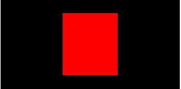
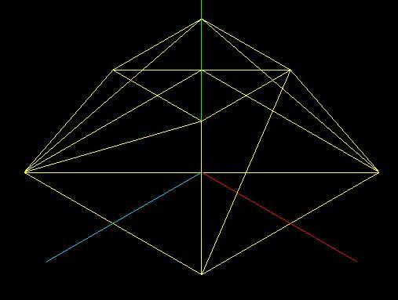
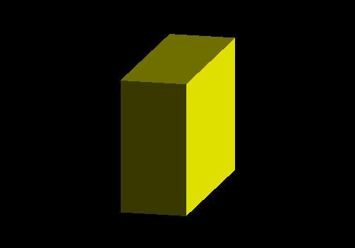

# [three.js 入门详解](https://segmentfault.com/a/1190000012238576)

## 1. 概述

### 1.1 什么是WebGL？

> WebGL是在浏览器中实现三维效果的一套规范

- 想要使用WebGL原生的API来写3D效果的话，很吃力。three.js是WebGL的一个开源框架，它省去了很多麻烦的细节。

### 1.2 初识three.js

> 什么是threejs，很简单，你将它理解成`three+js`就可以了。`three表示3D的意思`，`js表示javascript的意思`。那么合起来，`three.js`就是使用`javascript `来写`3D程序`的意思。

- Javascript是运行在网页端的脚本语言，那么毫无疑问`Three.js`也是运行在`浏览器`上的。

### 1.3 前期准备

#### 1.3.1 下载地址

- three.js [下载地址](https://github.com/mrdoob/three.js)

#### 1.3.2 目录结构


- **Build目录：** 包含两个文件，three.js 和three.min.js 。这是three.js最终被引用的文件。一个已经压缩，一个没有压缩的js文件。
- **Docs目录：** 这里是three.js的帮助文档，里面是各个函数的api，可惜并没有详细的解释。试图用这些文档来学会three.js是不可能的。
- **Editor目录：** 一个类似3D-max的简单编辑程序，它能创建一些三维物体。
- **Examples目录：** 一些很有趣的例子demo，可惜没有文档介绍。对图像学理解不深入的同学，学习成本非常高。
- **Src目录：** 源代码目录，里面是所有源代码。
- **Test目录：** 一些测试代码，基本没用。
- **Utils目录：** 存放一些脚本，python文件的工具目录。例如将3D-Max格式的模型转换为three.js特有的json模型。
- **.gitignore文件：** git工具的过滤规则文件，没有用。
- **CONTRIBUTING.md文件：** 一个怎么报bug，怎么获得帮助的说明文档。
- **LICENSE文件：** 版权信息。
- **README.md文件：** 介绍three.js的一个文件，里面还包含了各个版本的更新内容列表。

#### 1.3.3 配置开发环境

- **浏览器：** 推荐使用高版本的浏览器，谷歌、火狐、360等，对于前端开发者来说，chrome是不二的选择
- **js 开发工具：** VS-code、Webstorm 都可以，为了方便下面的学习，这里使用Webstorm
- **Three.js 调试：** 利用谷歌浏览器的调试窗口，使用断点调试的方法

## 2. 开始使用Three.js

> 使用Three.js之前，首先在`<head>`部分，需要引入外部文件`Three.js`。

```
<head>
    <script type="text/javascript" src="three.js"></script>
</head>
```

> WebGL 的渲染是需要HTML5 中的`Canvas`元素的，你可以手动在HTML的`<body>`部分中使用canvas标签，或者让Three.js帮你生成。这两种选择，一般没有多大差别。我们先手动定义一个canvas标签：

```
<body onload="init();">
    <canvas id="canvasId" width="800" height="600"></canvas>
</body>
```

> 在js里面定义一个函数，将所有执行的代码放在函数里，在html加载完成后，执行该函数

```
function init{
    // 所有需要执行的代码
}
```

一个典型的Three.js程序，至少应该包括四个部分：`渲染器(renderer)`、`场景(scene)`、`相机(camera)`、`以及场景中创建的物体`。

### 2.1 渲染器(renderer)

> ```
> 渲染器
> ```
>
> 决定了
>
> ```
> 渲染的结果
> ```
>
> 应该画在
>
> ```
> 页面的什么元素上面
> ```
>
> ，并且
>
> ```
> 以怎样的方式来绘制
> ```
>
> 。
>
> 渲染器将会和canvas元素进行绑定，如果之前`<html>`标签中，定义了`id为canvasId的canvas标签`，那么renderer可以这样写：

```
var renderer = new THREE.WebGLRenderer({
    canvas : document.getElementById('canvasId');
});
```

> 如果想要`Three.js生成Canvas元素`的时候，在html中就不需要在定义一个canvas标签了，直接在javascript代码中写道：

```
var renderer = new THREE.WebGLRenderer();
renderer.setSize = (800,600);
document.body.appendChild(renderer.domElement);
```

- 上面的代码`setSize`是为canvas元素设置宽高，`document.body.appendChild(renderer.domElement)`是将渲染器对应的Canvas元素添加到`body`中。

> 我们可以使用下面的代码(用于清除画面的颜色)将背景色设置为黑色：

```
renderer.setClearColor(0x000000);
```

### 2.2 场景(scene)

> 在Three.js中`添加物体`都是添加到`场景`中的，因此它相当于一个大容器。一般说，场景里没有很复杂的操作，只要new一个对象就可以了，然后将物体添加到场景中即可。

```
var scene = new THREE.Scene();
```

### 2.3 照相机(camera)

> 在介绍照相机之前，我们先来介绍一下坐标系。

- three.js中使用的是右手坐标系，X轴水平向右，y轴垂直向上，Z轴的方向就是屏幕由里往外的方向


> 这里我们定义一个`透视相机`(相机也需要添加到场景中)：

```
var camera = new THREE.PerspectiveCamera(45, 4 / 3, 1, 1000);
// 设置相机的位置
camera.position.set(0,0,5);
// 将相机添加到场景中
scene.add(camera);
```

### 2.4 创建一个物体

> 这里我们先介绍一个长方体，创建一个x、y、z方向长度分别为1、2、3的长方体，并设置为红色。

```
var geometry = new THREE.CubeGeometry(1,2,3);
var material = new THREE.MeshBasicMaterial({
    color: 0xff0000;
});
var cube = new THREE.Mesh(geometry,material);
scene.add(cube);
```

- **new THREE.CubeGeometry(); 表示调用一个几何体**
  - Cube : 立方体 Geometry : 几何;
  - `CubeGeometry`是一个`正方体`或者`长方体`，究竟是什么，由它的3个参数所决定

```
CubeGeometry(width, height, depth, segmentsWidth, segmentsHeight, segmentsDepth, materials, sides)
width：立方体x轴的长度

height：立方体y轴的长度

depth：立方体z轴的深度，也就是长度

想一想大家就明白，以上3个参数就能够确定一个立方体。

剩下的几个参数就要费解和复杂一些了，不过后面我们会自己来写一个立方体，到时候，你会更明白这些参数的意义，这里你可以将这些参数省略。
```

- **new THREE.MeshBasicMaterial(); 表示的是物体的材质**
  - 你可以在里面设置物体的颜色

```
var material = new THREE.MeshBasicMaterial({
    color: 0xff0000;
});
```

- **`一定不要忘了，将物体添加到场景`**

### 2.5 渲染

> 在定义了场景中的物体，设置好的照相机之后，渲染器就知道如何渲染出二维的结果了。这时候，我们只需要调用渲染器的渲染函数，就能使其渲染一次了。

```
renderer.render(scene, camera);
```

### 2.6 完整代码

```html
<html lang="en">
<head>
    <meta charset="UTF-8">
    <title>长方体</title>
    <script src="three.js"></script>
</head>

<body onload="init();">
    <script>
        function init() {
            // 渲染器
            var renderer = new THREE.WebGLRenderer();
            // canvas元素设置宽高
            renderer.setSize = (800, 600);
            // 渲染器对应的Canvas元素添加到<body>中。
            document.body.appendChild(renderer.domElement);
            // 清除画面的颜色
            renderer.setClearColor(0x000000);

            // 场景
            var scene = new THREE.Scene();

            // 相机
            // 定义一个透视相机
            var camera = new THREE.PerspectiveCamera(45, 4 / 3, 1, 1000);
            // 设定相机的位置
            camera.position.set(0, 0, 5);
            // 将相机添加到场景中
            scene.add(camera);

            // 物体
            var cube = new THREE.Mesh(new THREE.CubeGeometry(1, 2, 3), new THREE.MeshBasicMaterial({
                color: 0xff0000
            }));
            scene.add(cube);

            // 渲染
            renderer.render(scene, camera);
        }
    </script>
</body>
</html>
```

- 效果图



*canvas元素的默认宽高为300/150*

## 3. Three.js功能概览

> 下面介绍下Three.js官网文档中的一些重要的对象，在你需要寻求帮助时，就能够知道关键词是什么。

- **Cameras（照相机，控制投影方式）**
  - Camera
  - OrthographicCamera
  - PerspectiveCamera
- **Core（核心对象）**
  - BufferGeometry
  - Clock（用来记录时间）
  - EventDispatcher
  - Face3
  - Face4
  - Geometry
  - Object3D
  - Projector
  - Raycaster（计算鼠标拾取物体时很有用的对象）
- **Lights（光照）**
  - Light
  - AmbientLight
  - AreaLight
  - DirectionalLight
  - HemisphereLight
  - PointLight
  - SpotLight
- **Loaders(加载器，用来加载特定文件)**
  - Loader
  - BinaryLoader
  - GeometryLoader
  - ImageLoader
  - JSONLoader
  - LoadingMonitor
  - SceneLoader
  - TextureLoader
- **Materials(材质，控制物体的颜色、纹理等)**
  - Material
  - LineBasicMaterial
  - LineDashedMaterial
  - MeshBasicMaterial
  - MeshDepthMaterial
  - MeshFaceMaterial
  - MeshLambertMaterial
  - MeshNormalMaterial
  - MeshPhongMaterial
  - ParticleBasicMaterial
  - ParticleCanvasMaterial
  - ParticleDOMMaterial
  - ShaderMaterial
  - SpriteMaterial
- **Math(和数学相关的对象)**
  - Box2
  - Box3
  - Color
  - Frustum
  - Math
  - Matrix3
  - Matrix4
  - Plane
  - Quaternion
  - Ray
  - Sphere
  - Spline
  - Triangle
  - Vector2
  - Vector3
  - Vector4
- **Objects(物体)**
  - Bone
  - Line
  - LOD
  - Mesh（网格，最常用的物体）
  - MorphAnimMesh
  - Particle
  - ParticleSystem
  - Ribbon
  - SkinnedMesh
  - Sprite
- **Renderers(渲染器，可以渲染到不同对象上)**
  - CanvasRenderer
  - WebGLRenderer（使用WebGL渲染，这是本书中最常用的方式）
  - WebGLRenderTarget
  - WebGLRenderTargetCube
  - WebGLShaders（着色器，在最后一章作介绍）
- **Renderers / Renderables**
  - RenderableFace3
  - RenderableFace4
  - RenderableLine
  - RenderableObject
  - RenderableParticle
  - RenderableVertex
- **Scenes（场景）**
  - Fog
  - FogExp2
  - Scene
- **Textures(纹理)**
  - CompressedTexture
  - DataTexture
  - Texture
- **Extras**
  - FontUtils
  - GeometryUtils
  - ImageUtils
  - SceneUtils
- **Extras / Animation**
  - Animation
  - AnimationHandler
  - AnimationMorphTarget
  - KeyFrameAnimation
- **Extras / Cameras**
  - CombinedCamera
  - CubeCamera
- **Extras / Core**
  - Curve
  - CurvePath
  - Gyroscope
  - Path
  - Shape
- **Extras / Geometries（几何形状）**
  - CircleGeometry
  - ConvexGeometry
  - CubeGeometry
  - CylinderGeometry
  - ExtrudeGeometry
  - IcosahedronGeometry
  - LatheGeometry
  - OctahedronGeometry
  - ParametricGeometry
  - PlaneGeometry
  - PolyhedronGeometry
  - ShapeGeometry
  - SphereGeometry
  - TetrahedronGeometry
  - TextGeometry
  - TorusGeometry
  - TorusKnotGeometry
  - TubeGeometry
- **Extras / Helpers**
  - ArrowHelper
  - AxisHelper
  - CameraHelper
  - DirectionalLightHelper
  - HemisphereLightHelper
  - PointLightHelper
  - SpotLightHelper
- **Extras / Objects**
  - ImmediateRenderObject
  - LensFlare
  - MorphBlendMesh
- **Extras / Renderers / Plugins**
  - DepthPassPlugin
  - LensFlarePlugin
  - ShadowMapPlugin
  - SpritePlugin
- **Extras / Shaders**
  - ShaderFlares
  - ShaderSprite

我们看到，Three.js功能是十分丰富的，一时间想全部掌握有些困难。在接下来的章节中，我们将会先详细介绍照相机、几何形状、材质、物体等入门级知识；然后介绍使用动画、模型导入、加入光照等功能；最后，对于学有余力的读者，我们将介绍着色器，用于更高级的图形渲染。

## 4. 照相机

> 本章将介绍照相机的概念，以及如何使用Three.js设置相应的参数。

### 4.1 什么是照相机？

> 在图形学中，照相机可没有生活中的照相机那么简单

- 我们使用的Three.js创建的场景是三维的，而通常情况下显示器是二维的，那么三维的场景怎么在二维的显示器上显示呢？照相机就是一个抽象，它定义了三维空间到二维屏幕投影的方式，用“照相机”这样一个类比，可以使我们直观地理解这一投影方式。
- 而针对`投影方式`的不同，照相机又分为`正交投影照相机`与`透视投影照相机`。我们需要为自己的程序选择合适的照相机。这两者分别是什么，以及两者有何差异，我们将在下节中作介绍。

### 4.2 正交投影和透视投影

> 举个简单的例子来说明正交投影与透视投影照相机的区别。使用`透视投影照相`机获得的结果是`类似人眼在真实世界中看到的有“近大远小”`的效果（如下图中的(a)）；而使用`正交投影照相机`获得的结果就像我们在数学几何学课上老师教我们画的效果，对于`三维空间内平行的线`，投影到`二维空间中也一定是平行的`（如下图中的(b)）。


一般说来，对于`制图、建模软`通常使`正交投影`，这样不会因为投影而改变物体比例；而`对于其他大多数应用`，通常使用` 透视投影`，因为这更接近人眼的观察效果。当然，照相机的选择并没有对错之分，你可以更具应用的特性，选择一个效果更佳的照相机。

### 4.3 正交投影照相机

#### 4.3.1 参数介绍

> 正交投影照相机(`Orthographic Camera`)

```
THREE.OrthographicCamera(left, right, top, bottom, near, far)
```

> 这六个参数分别代表正交投影照相机拍摄到的空间的六个面的位置，这六个面围成一个长方体，我们称其`视景体(Frustum)`。只有在视景体内部（下图中的灰色部分）的物体才可能显示在屏幕上，而视景体外的物体会在显示之前被裁减掉。


> 为了保持照相机的横竖比例，需要保证`(right - left)与(top - bottom)`的比例与`Canvas宽度与高度的比例(800/600)`一致。

```
// [2-(-2)] / [1.5-(-1.5)] = canvas.width/canvas.height
var camera = new THREE.OrthographicCamera(-2, 2, 1.5, -1.5, 1, 10) // left right top bottom near far
```

`near与far`都是指到照相机位置在深度平面的位置，而照相机不应该拍摄到其后方的物体，因此这两个值应该均为`正值`。为了保证场景中的物体不会因为太近或太远而被照相机忽略，一般`near的值设置得较小`，`far的值设置得较大`，具体值视场景中物体的位置等决定。

#### 4.3.2 示例代码

> 下面我们通过一个具体的例子来了解正交投影照相机的设置

**基本设置**

- 设置照相机：

```
var camera = new THREE.OrthographicCamera(-2, 2, 1.5, -1.5, 1, 10);
camera.poaition.set(0,0,5);
scene.add(camera);
```

- 在原点处创建一个边长为1的正方体，为了和透视效果做对比，这里我们使用`wireframe`而不是实心的材质，以便看到正方体后方的边：

```
var cube = new THREE.Mesh(new THREE.CubeGeometry(1, 1, 1), 
    new THREE.MeshBasicMaterial({
        color: 0xff0000,
        wireframe: true
    })
);
scene.add(cube);
```

- 效果图：


- 我们看到正交投影的结果是一个正方形，后面的边与前面完全重合了，这也就是正交投影与透视投影的区别所在。

**长宽比例**

> 这里，我们的Canvas宽度是800px，高度是600px，照相机水平方向距离4，垂直方向距离3，因此长宽比例保持不变。为了试验长宽比例变化时的效果，我们将照相机水平方向的距离减小为2(right-left = 2)：

```
var camera = new THREE.OrthographicCamera(-1, 1, 1.5, -1.5, 1, 10);
```

- 效果图(此时水平方向的距离就被拉长了)：


**照相机位置**

> 接下来，我们来看看照相机位置对渲染结果的影响。在之前的例子中，我们将照相机设置在(0, 0, 5)位置，而由于照相机默认是`面向z轴负方向`放置的，所以能看到在原点处的正方体。现在，如果我们将照相机`向右移动1个`单位：

```
var camera = new THREE.OrthographicCamera(-2, 2, 1.5, -1.5, 1, 10);
// 向右移动一个单位的位置
camera.position.set(1, 0, 5);
```

- 效果图(物体看上去向左移动了)


- 其实照相机就好比人的眼睛，当我们身体往右移动的时候，看到的物体就好像向左移了。

> 正交投影摄像机在设置时，是否需要保证`left 和 right 互为相反数`呢？

- 下面，我们将原本的参数`(-2, 2, 1.5, -1.5, 1, 10)`改为`(-1, 1, 1.5, -1.5, 1, 10)`，即，将视景体设置得更靠右：

```
var camera = new THREE.OrthographicCamera(-1, 3, 1.5, -1.5, 1, 10);
camera.position.set(0, 0, 5);
```

- 效果图(与之前相机向右的效果是一样的)


**换个角度**

> 到目前为止，我们使用照相机，都是`沿着Z轴负方向`观察的，因此看到的都是一个正方形，现在我们尝试一下`仰望`这个正方体，改变照相机的位置：

```
// x轴：4；  y轴：-3；  z轴：5
camera.position.set(4, -3, 5);
```

> 照相机默认是沿着z轴的负方向观察的，因此观察不到正方体，只看到一片黑。我们可以通过`lookAt函数`指定它`看着原点方向`：


```
camera.lookAt(new THREE.Vector3(0, 0, 0));
```

- 效果图：


- 注意：`lookAt函数`接收的是一个`THREE.Vector3`的实例千万不能写成`camera.lookAt(0,0,0)`。

### 4.4 透视投影照相机

#### 4.4.1 参数介绍

> 透视投影照相机(`Perspective Camera`)

```
THREE.PerspectiveCamera(fov, aspect, near, far)
```

> 让我们通过一张透视照相机投影的图来了解这些参数。


- 透视图中，`灰色`的部分是`视景体`，是`可能被渲染`的物体所在的区域。`fov`是视景体`竖直方向上`的`张角`（是角度制而非弧度制），如侧视图所示。
- `aspect`等于`width / height`，是照相机`水平方向和竖直方向长度的比值`，通常设为Canvas的`横纵比例`。
- `near和far`分别是照相机到`视景体` `最近、最远`的距离，均为`正值`，且`far应大于near`。

#### 4.4.2 示例代码

> 下面我们通过一个例子来学习透视投影照相机

**基本设置**

- 设置透视投影照相机，这里Canvas长`800px`，宽`600px`，所以`aspect`设为`800 / 600`：

```
var camera = new THREE.PerspectiveCamera(45, 800 / 600, 1, 10);
camera.position.set(0, 0, 5);
scene.add(camera);
```

- 设置一个在原点处的边长为1的正方体：

```
var cube = new THREE.Mesh(new THREE.CubeGeometry(1, 1, 1),
        new THREE.MeshBasicMaterial({
            color: 0xff0000,
            wireframe: true
        })
);
scene.add(cube);
```

- 效果图：


- 对比正交透视照相机下正方形的效果，透视投影可以看到`全部的12条边`，而且有`近大远小`的效果，这也就是与正交投影的区别。

**竖直张角**

- 接下来，我们来看下`fov`的改变对渲染效果的影响。我们将原来的`45改为60`：

```
var camera = new THREE.PerspectiveCamera(60, 800 / 600, 1, 10);
camera.position.set(0, 0, 5);
scene.add(camera);
```

- 效果图：


- 为什么正方体显得更小了呢？我们从下面的侧视图来看，虽然正方体的实际大小并未改变，但是将照相机的`竖直张角`设置得`更大`时，`视景体变大了`，因而`正方体`相对于`整个视景体`的大小就`变小`了，看起来正方形就显得变小了。


- 注意，`改变fov`并`不会`引`起画面横竖比例`的变化，而`改变aspect`则`会`改变横竖比例。

## 5. 点、线、面

### 5.1 3D世界的组成

> 在计算机世界里，3D世界由点组成，两个点能组成一条直线，三个不在一条直线上的点，就能组成一个三角面，`无数的三角面`就能组成`各种各样的物体`，如下图：


我们通常把这种`网络模型`叫做`Mesh模型`。给物体`贴上皮肤`，或者专业点就叫做`纹理`，那么这个物体就活灵活现了。最后无数的物体就组成了我们的3D世界。

### 5.2 在Three.js中定义一个点

> 在三维空间中的某一个点可以用一个坐标点来表示。一个坐标点由`x`，`y`，`z` 三个分量构成。在three.js中，点可以在右手坐标系中表示：
>
> 空间几何中，点可以用一个向量来表示，在Three.js中也是用一个`向量`来表示的

```js
THREE.Vector3 = function ( x, y, z ) {

this.x = x || 0;
this.y = y || 0;
this.z = z || 0;

};
```

我们来分析这段代码：前面我们已经知道了THREE是Three.js引擎的一个全局变量。只要你想用它，就可以在任何地方用它。

那么THREE.Vector3呢，就是表示`Vector3`是定义在`THREE`下面的一个`类`。以后要用`Vector3`，就必须`要加THREE前缀`。当然Three.js的设计者，也可以不加THREE这个前缀，但是他们预见到，Three.js引擎中会有很多类型，最好给这些类型加一个前缀，以免与开发者的代码产生冲突。

THREE.Vector3被赋值为一个`函数`。这个函数有`3个参数`，分别代表`x坐标`，`y坐标`和`z坐标`的分量。函数体内的代码将他们分别赋值给`成员变量x，y，z`。看看上面的代码，中间使用了一个`“||”（或）运算符`，就是当`x=null或者undefine`时，`this.x`的值应该`取0`。

### 5.3 点的操作

> 在3D世界中`点`可以用`THREE.Vector3D`来表示。

**现在来看看怎么定义个点，假设有一个点x=4，y=8，z=9。你可以这样定义它：**

```
var point1 = new THREE.Vecotr3(4,8,9);
```

**另外你也可以使用`set`方法，代码如下：**

```
var point1 = new THREE.Vector3();

point1.set(4,8,9);
```

### 5.4 绘制一条线段

> 两个不重合的点能够决定一条直线。在three.js中，也可以通过定义两个点，来画一条直线。

**1、首先，声明一个几何体geometry**

几何体里面有个`vertices变量`，可以用来`存放点`

```
var geometry = new THREE.Geometry();
// 几何体里面有个vertices变量，可以用来存放点
```

**2、定义一种线条的材质，使用`THREE.LineBasicMaterial`类型来定义，它接受一个`集合作为参数`，其原型如下：**

```
THREE.LineBasicMaterial(parameters);
```

`parameters` 是定义材质外观的对象，它包含多个属性来定义材质，这些属性是：

- **Color** 线条的`颜色`，用16进制表示，默认都是白色
- **Linewidth** 线条的`宽度`，默认是1个单位宽度
- **Linecap** 线条`两端的外`观，默认是`圆角端点`，当线条较粗的时候才能看到效果
- **Linejoin** 两个线条的`连接点处的外观`，默认是“round”，表示圆角。
- **VertexColors** 定义`线条材质`是否使用`顶点颜色`，这是一个boolean值。意思是，线条各部分的颜色会根据顶点的颜色来进行插值。
- **Fog** 定义材质的颜色是否受全局雾效的影响。

我们这里使用了`顶点颜色` `vertexColors: THREE.VertexColors`，就是`线条的颜色`会根据`顶点`来计算。

```
var material = new THREE.LineBasicMaterial( { vertexColors: THREE.VertexColors } );
```

**注意**: 关于线宽的坑，`WebGLRender`渲染方式是不之持绘制线宽的，要想支持，需要将渲染方式设置为`CanvasRenderer`

**3、接下来，定义两种颜色，分别表示线条两个端点的颜色，**

```
var color1 = new THREE.Color( 0x444444 ),
    color2 = new THREE.Color( 0xFF0000 );
```

**4、定义2个顶点的位置，并放到`geometry`中，代码如下：**

```
var p1 = new THREE.Vector3(-100,0,100);
var p2 = new THREE.Vector3(100,0,-100);

geometry.vertices.push(p1);
geometry.vertices.push(p2);
```

**5、为4中定义的2个顶点，设置不同的颜色，代码如下所示：**

```
geometry.colors.push( color1, color2 );
```

`geometry中colors表示顶点的颜色`，必须材质中`vertexColors等于THREE.VertexColors`时，颜色才`有效`，如果vertexColors等于THREE.NoColors时，颜色就没有效果了。那么就会去取材质中color的值，这个很重要。

**6、定义一条线。**

定义线条，使用`THREE.Line类`，代码如下所示：

```
var line = new THREE.Line( geometry, material, THREE.LinePieces );
```

- 第一个参数是几何体`geometry`，里面包含了`2个顶`点和顶点的`颜色`。
- 第二个参数是线条的`材质`，或者是线条的属性，表示线条以哪种方式取色。
- 第三个参数是一组点的连接方式。

**7、然后，将这条线加入到场景中，代码如下：**

```
scene.add(line);
```

**8、整体代码：**

```html
<!DOCTYPE html PUBLIC "-//W3C//DTD XHTML 1.0 Strict//EN" "http://www.w3.org/TR/xhtml1/DTD/xhtml1-strict.dtd">
<html>

<head>
    <script type="text/javascript" src="three.js"></script>

    <script type="text/javascript">
        function init() {
            // 渲染器
            var renderer = new THREE.WebGLRenderer();
            // 设定渲染器尺寸
            renderer.setSize(800, 600);
            // 添加到dom
            document.body.appendChild(renderer.domElement);
            // 重绘时颜色
            renderer.setClearColor(0xffffff);

            // 场景
            var scene = new THREE.Scene();

            // 相机
            var camera = new THREE.OrthographicCamera(-5, 5, 3.75, -3.75, 0.1, 100);
            // 设定相机位置
            camera.position.set(0, -25, 0);
            // 相机看向
            camera.lookAt(new THREE.Vector3(0, 0, 0));
            scene.add(camera);

            // 定义一个物体
            // new 一个模型
            var geometry = new THREE.Geometry();
            // 定义模型的类型是线段  并且设置其材质
            var material = new THREE.LineBasicMaterial({
                // 使用顶点颜色
                vertexColors: true
            });
            // 定义两个颜色
            var color1 = new THREE.Color(0x444444),
                color2 = new THREE.Color(0xff0000);

            // 新建两个点
            var p1 = new THREE.Vector3(-1, 0, 1);
            var p2 = new THREE.Vector3(1, 0, -1);

            // 将新建的两个点添加到几何体中
            geometry.vertices.push(p1);
            geometry.vertices.push(p2);

            // 将两个颜色添加到几何体中
            geometry.colors.push(color1, color2);

            // new 一条线
            var line = new THREE.Line(geometry, material, THREE.LinePieces);
            scene.add(line);

            // 渲染
            renderer.render(scene, camera);
        }
    </script>
</head>
<body onload="init()">
</body>
</html>
```

- 效果图：


### 5.5 线条的深度理解

> 在Threejs中，一条线由点，材质和颜色组成。

点由`THREE.Vector3`表示，Threejs中没有提供单独画点的函数，它必须被放到一个`THREE.Geometry`形状中，这个结构中包含一个`数组vertices`，这个`vertices就是存放无数的点（THREE.Vector3）的数组`。

**1、为了绘制一条直线，首先我们需要定义两个点**

```
var p1 = new THREE.Vector3( -1, 0, 1 );
var p2 = new THREE.Vector3( 1, 0, -1 );
```

**2、声明一个`THREE.Geometry`，并把点加进去**

```
var geometry = new THREE.Geometry();
geometry.vertices.push(p1);
geometry.vertices.push(p2);
```

geometry.vertices的能够使用`push方法`，是因为`geometry.vertices`是一个`数组`。这样geometry中就有了2个点了。

**3、然后我们需要给线加一种材质，`THREE.LineBasicMaterial`。**

```
var material = new THREE.LineBasicMaterial();
```

**4、最终我们通过`THREE.Line`绘制了一条线:**

```
var line = new THREE.Line( geometry, material, THREE.LinePieces );
```

### 5.6 绘制网格线

> 我们要画一个网格的坐标，那么我们就应该找到线的点。把网格虚拟成正方形，在正方形边界上找到几个等分点，用这些点两两连接，就能够画出整个网格来。

**1、定义两个点**

```
// 在x轴上定义两个点p1(-500,0,0)，p2(500,0,0)。
geometry.vertices.push( new THREE.Vector3( - 500, 0, 0 ));
geometry.vertices.push( new THREE.Vector3( 500, 0, 0 ));
```

**2、算法**

这两个点决定了x轴上的一条线段，将这条线段复制20次，分别平行移动到z轴的不同位置，就能够形成一组平行的线段。

同理，将p1p2这条线先围绕y轴旋转90度，然后再复制20份，平行于z轴移动到不同的位置，也能形成一组平行线。

```js
for ( var i = 0; i <-= 20; i ++ ) {
    var line = new THREE.Line( geometry, new THREE.LineBasicMaterial({ color: 0x000000, opacity: 0.2 }));
    line.position.z = ( i * 50 ) - 500;
    scene.add( line );

    var line = new THREE.Line( geometry, new THREE.LineBasicMaterial( { color: 0x000000, opacity: 0.2 } ));
    line.position.x = ( i * 50 ) - 500;
    line.rotation.y = 90 * Math.PI / 180;   //  旋转90度
    scene.add( line );

}
```

**3、完整代码**

```html
<!DOCTYPE html PUBLIC "-//W3C//DTD XHTML 1.0 Strict//EN" "http://www.w3.org/TR/xhtml1/DTD/xhtml1-strict.dtd">
<html>

<head>
    <script type="text/javascript" src="three.js"></script>

    <script type="text/javascript">
        function init() {
            // 渲染器
            var renderer = new THREE.WebGLRenderer();
            // 设定渲染器尺寸
            renderer.setSize(800, 600);
            // 添加到dom
            document.body.appendChild(renderer.domElement);
            // 重绘时颜色
            renderer.setClearColor(0x000000);

            // 场景
            var scene = new THREE.Scene();

            // 相机
            var camera = new THREE.OrthographicCamera(-5, 5, 3.75, -3.75, 0.1, 100);
            // 设定相机位置
            camera.position.set(0, -25, 0);
            // 相机看向
            camera.lookAt(new THREE.Vector3(0, 0, 0));
            scene.add(camera);

            // 定义一个几何体
            var geometry = new THREE.Geometry();
            geometry.vertices.push(new THREE.Vector3(-2, 0, 0));
            geometry.vertices.push(new THREE.Vector3(2, 0, 0));
            // for循环出来六条线段
            for (var i = 0; i <= 5; i++) {
                // 定义竖着的线段
                var line = new THREE.Line(geometry, new THREE.LineBasicMaterial({
                    color: 0xffffff,
                }));
                // 每条线段之间的间隔为0.8，-2是为了达到田字格的效果
                line.position.z = (i * 0.8) - 2;
                scene.add(line);

                // 定义横着的线段
                var line = new THREE.Line(geometry, new THREE.LineBasicMaterial({
                    color: 0xffffff,
                    opacity: 0.2
                }));
                line.position.x = (i * 0.8) - 2;
                line.rotation.y = 90 * Math.PI / 180;
                scene.add(line);

                // 渲染
                renderer.render(scene, camera);

            }
        }
    </script>
</head>
<body onload="init()">
</body>
</html>
```

效果图：


## 6. 几何形状

> 在创建物体时，需要传入两个参数，一个是`几何形状(Geometry)`，另一个是`材质(Material)`，这一章将着重介绍几何形状的创建，第6章介绍材质，第7章介绍如何使用两者创建网格。

- 几何形状(Geometry)最主要的功能是储存了一个物体的`顶点信息`。WebGL需要程序员指定每个顶点的位置，而在Three.js中，可以通过指定一些`特征`来创建几何形状，例如使用`半径`创建一个`球体`，从而省去程序员一个个指定顶点的工作量。
- 本章节将分别介绍立方体、平面、球体、圆柱体、四面体、八面体等几何形状，以及以三维文字作为几何形状的方法。本节还会介绍通过`手动定义` `顶点位置`和`面片信息`组成几何形状。

### 6.1 基本几何形状

#### 6.1.1 立方体

> 虽然这形状的名字叫做立方体(`CubeGeometry`)，但其实是长方体，也就是长宽高可以设置不同的值：

```
new THREE.CubeGeometry(width, height, depth, widthSegments, heightSegments, depthSegments)
```

- 这里，`width`是`x方向`上的长度；`height`是`y方向`上的长度；`depth`是`z方向上`的长度；后三个参数分别是在`三个方向上的分段数`，如`widthSegments为3`的话，代表`x方向上水平分为三份`。一般情况下不需要分段的话，可以不设置后三个参数，后三个参数的缺省值为1。其他几何形状中的分段也是类似的，下面不做说明。

**长宽高**

- 创建立方体直观简单，如：`new THREE.CubeGeometry(1, 2, 3);`可以创建一个x方向长度为`1`，y方向长度为`2`，z方向长度为`3`的立方体。

```
// 调用渲染器
var renderer = new THREE.WebGLRenderer();
renderer.setSize(800, 600);
document.body.appendChild(renderer.domElement);
renderer.setClearColor(0x000000);

// 调用场景
var scene = new THREE.Scene();

// 调用相机
var camera = new THREE.OrthographicCamera(-5, 5, 3.75, -3.75, 0.1, 100);
camera.position.set(25, 25, 25);
camera.lookAt(new THREE.Vector3(0, 0, 0));
scene.add(camera);

// 新建一个几何体(长方体)
var cube = new THREE.Mesh(new THREE.CubeGeometry(1, 2, 3), new THREE.MeshBasicMaterial({
    color: 0xffff00,
    wireframe: true
}));

scene.add(cube);
```

- 为了更好地表现参数效果，我们在场景中用`长度为3`的`红、绿、蓝`线段分别表示`x、y、z`三个轴(这里不需要深究，后面会详细介绍)：

```
// 封装一个坐标系函数
function drawAxes(scene) {
    // x-axis
    var xGeo = new THREE.Geometry();
    xGeo.vertices.push(new THREE.Vector3(0, 0, 0));
    xGeo.vertices.push(new THREE.Vector3(3, 0, 0));
    var xMat = new THREE.LineBasicMaterial({
        color: 0xff0000
    });
    var xAxis = new THREE.Line(xGeo, xMat);
    scene.add(xAxis);

    // y-axis
    var yGeo = new THREE.Geometry();
    yGeo.vertices.push(new THREE.Vector3(0, 0, 0));
    yGeo.vertices.push(new THREE.Vector3(0, 3, 0));
    var yMat = new THREE.LineBasicMaterial({
        color: 0x00ff00
    });
    var yAxis = new THREE.Line(yGeo, yMat);
    scene.add(yAxis);

    // z-axis
    var zGeo = new THREE.Geometry();
    zGeo.vertices.push(new THREE.Vector3(0, 0, 0));
    zGeo.vertices.push(new THREE.Vector3(0, 0, 3));
    var zMat = new THREE.LineBasicMaterial({
        color: 0x00ccff
    });
    var zAxis = new THREE.Line(zGeo, zMat);
    scene.add(zAxis);
}

// 在init 函数里调用这个函数 即可在屏幕上显示一个坐标系了
drawAxes(scene);
```

- 在设置材质，并添加到场景之后具体的效果是：


- 物体的`默认位置`是`原点`，对于立方体而言，是其几何中心在原点的位置。

**分段**

- 根据`THREE.CubeGeometry(width, height, depth, widthSegments, heightSegments, depthSegments)`，的后三个参数，为这个长方体分段：

```
// x轴分两段  y轴分两段 z轴分三段
new THREE.CubeGeometry(1, 2, 3, 2, 2, 3)
```

- 效果图：


- 注意这个分段是对`六个面`进行分段，而不是对立方体的体素分段，因此在立方体的`中间是不分段`的，只有`六个侧面`被分段。

#### 6.1.2 平面

> 这里的平面(`PlaneGeometry`)其实是一个长方形，而并非是数学意义上无限大的平面：

```
new THREE.PlaneGeometry(width, height, widthSegments, heightSegments)
```

- 其中，`width`是`x方向`上的长度；`height`是`y方向`上的长度；后两个参数同样表示`分段`。
- `new THREE.PlaneGeometry(2, 4);`创建的平面在x轴和y轴所在平面内：

```
var plane = new THREE.Mesh(
    new THREE.PlaneGeometry(2, 4), 
    new THREE.MeshBasicMaterial({
        color: 0xffff00,
        wireframe: true
    })
);
scene.add(plane);
```

- 效果图：


- 如果需要创建的平面在`x轴和z轴`所在的平面内，可以通过`物体的旋转`来实现，具体的做法将在下面章节介绍到。

#### 6.1.3 球体

> 球体(`SphereGeometry`)的构造函数是：

```
new THREE.SphereGeometry(radius, segmentsWidth, segmentsHeight, phiStart, phiLength, thetaStart, thetaLength)
```

- 其中，`radius`是`半径`；`segmentsWidth`表示`经度上的切片数`；`segmentsHeight`表示`纬度上的切片数`；`phiStart`表示`经度开始的弧度`；`phiLength`表示`经度跨过的弧度`；`thetaStart`表示`纬度开始的弧度`；`thetaLength`表示`纬度跨过的弧度`。

**分段**

- 首先，我们来理解下`segmentsWidth`和`segmentsHeight`。使用`var sphere = new THREE.SphereGeometry(2, 8, 6)`可以创建一个`半径为2`，`经度`划分成`8`份，`纬度`划分成`6`份的`球体`：

```js
var sphere = new THREE.Mesh(
    new THREE.SphereGeometry(2, 8, 6), 
    new THREE.MeshBasicMaterial({
        color: 0xffff00,
        wireframe: true
    })
);
scene.add(sphere);
```

- 效果图：


- `new THREE.SphereGeometry(2, 8, 16)`的效果如图：


- `new THREE.SphereGeometry(3, 18, 12)`的效果如图：


- `segmentsWidth`相当于经度被`切成了几瓣`，而`segmentsHeight`相当于纬度被`切成了几层`。因为在图形底层的实现中，并`没有曲线`的概念，曲线都是由`多个折线近似`构成的。对于球体而言，当这`两个值较大`的时候，形成的`多面体`就可以`近似`看做是球体了。

**经度弧度**

- `new THREE.SphereGeometry(2, 8, 6, Math.PI / 2, Math.PI / 3)`表示起始经度为`Math.PI / 6`，经度跨度为`Math.PI / 3`。

```js
var sphere = new THREE.Mesh(
    new THREE.SphereGeometry(2, 8, 6, Math.PI / 2, Math.PI / 3), 
    new THREE.MeshBasicMaterial({
        color: 0xffff00,
        wireframe: true
    })
);
scene.add(sphere);
```

- 效果图：


- 值得注意的是，这里的`SegmentsWidth`为`8`意味着对于经度从`Math.PI / 2`跨过`Math.PI / 3`的`区域内`划分为`8`块，而不是整个球体的经度划分成8块后再判断在此经度范围内的部分。

**纬度弧度**

- 理解了经度之后，纬度可以同理理解。`new THREE.SphereGeometry(2, 8, 6, 0, Math.PI * 2, Math.PI / 6, Math.PI / 3)`意味着纬度从`Math.PI / 6`跨过`Math.PI / 3`：

```
var sphere = new THREE.Mesh(
    // 经度起始弧度为0度，经度跨度为 180*2
    new THREE.SphereGeometry(2, 8, 6, 0, Math.PI * 2, Math.PI / 6, Math.PI / 3), 
    new THREE.MeshBasicMaterial({
        color: 0xffff00,
        wireframe: true
    })
);
scene.add(sphere);
```

- 效果图：


- 我们再来看一个`经度纬度`都改变了`起始位置和跨度`的例子：`new THREE.SphereGeometry(2, 8, 6, Math.PI / 2, Math.PI, Math.PI / 6, Math.PI / 2)`：

```
var sphere = new THREE.Mesh(
    new THREE.SphereGeometry(2, 8, 6, Math.PI / 2, Math.PI, Math.PI / 6, Math.PI / 2), 
    new THREE.MeshBasicMaterial({
        color: 0xffff00,
        wireframe: true
    })
);
scene.add(sphere);
```

- 效果图：


#### 6.1.4 圆形

> 圆形(`CircleGeometry`)可以创建`圆形或者扇形`，其构造函数是：

```
new THREE.CircleGeometry(radius, segments, thetaStart, thetaLength)
```

- 这里的参数跟绘制圆是一样的，我们再来熟悉一下。`radius`是半径；`segments`表示切片数；`thetaStart`表示纬度`开始的弧度`；`thetaLength`表示纬度`跨过的弧度`。
- **看个例子：** `new THREE.CircleGeometry(3, 18, Math.PI / 3, Math.PI / 3 * 4)`可以创建一个在x轴和y轴所在平面的三分之二圆的扇形：

```
var circle = new THREE.Mesh(
    new THREE.CircleGeometry(2, 18, Math.PI / 3, Math.PI / 3 * 4), 
    new THREE.MeshBasicMaterial({
        color: 0xffff00,
        wireframe: true
    })
);
scene.add(circle);
```

- 效果图：


#### 6.1.5 圆柱体

> 圆柱体(`CylinderGeometry`)的构造函数是：

```
new THREE.CylinderGeometry(radiusTop, radiusBottom, height, radiusSegments, heightSegments, openEnded)
```

- 其中，`radiusTop`与`radiusBottom`分别是顶面和底面的`半径`，由此可知，当这两个参数设置为不同的值时，实际上创建的是一个圆台；`height`是圆柱体的`高度`；`radiusSegments`与`heightSegments`可类比球体中的`分段`，一个表示底面、顶面的分段，另一个表示环面的分段；`openEnded`是一个布尔值，表示是否没有顶面和底面，缺省值为`false`，表示有顶面和底面。

**标准圆柱体**

- `new THREE.CylinderGeometry(1.5, 1.5, 3, 18, 3)`创建一个顶面与底面半径都为2，高度为4的圆柱体：

```
var cylinder = new THREE.Mesh(
    new THREE.CylinderGeometry(1.5, 1.5, 3, 18, 3), 
    new THREE.MeshBasicMaterial({
        color: 0xffff00,
        wireframe: true
    })
);
scene.add(cylinder);
```

- 效果图：


**圆台**

- 顶面、底面半径不一致的时候，即是一个圆台。将底面半径设为`2`创建一个圆台：`new THREE.CylinderGeometry(1.5, 2, 3, 18, 3)`：

```
var cylinder = new THREE.Mesh(
    new THREE.CylinderGeometry(1.5, 2, 3, 18, 3), 
    new THREE.MeshBasicMaterial({
        color: 0xffff00,
        wireframe: true
    })
);
scene.add(cylinder);
```

- 效果图：


**无底面、顶面**

- `openEnded`为`true`的时候，将无底面、顶面。`new THREE.CylinderGeometry(1.5, 1.5, 3, 18, 3, true)`将创建一个没有顶面与底面的圆柱：

```
var cylinder = new THREE.Mesh(
    new THREE.CylinderGeometry(1.5, 1.5, 3, 18, 3, true), 
    new THREE.MeshBasicMaterial({
        color: 0xffff00,
        wireframe: true
    })
);
scene.add(cylinder);
```

- 效果图：


#### 6.1.6 正四面体、正八面体、正二十面体

> 正四面体(`TetrahedronGeometry`)、正八面体(`OctahedronGeometry`)、正二十面体(`IcosahedronGeometry`)的构造函数较为类似，分别为：

```
// 正四面体
new THREE.TetrahedronGeometry(radius, detail)
// 正八面体
new THREE.OctahedronGeometry(radius, detail)
// 正二十面体
new THREE.IcosahedronGeometry(radius, detail)
```

- 其中，`radius`是半径；`detail`是细节层次(`Level of Detail`)的层数，对于大面片数模型，可以控制在视角靠近物体时，显示面片数多的精细模型，而在离物体较远时，显示面片数较少的粗略模型。这里我们不对detail多作展开，一般可以对这个值缺省。

**正四面体**

- `new THREE.TetrahedronGeometry(2.5)`创建一个`半径`为`2.5`的正四面体：

```
var tetrahedron = new THREE.Mesh(
    new THREE.TetrahedronGeometry(2.5), 
    new THREE.MeshBasicMaterial({
        color: 0xffff00,
        wireframe: true
    })
);
scene.add(tetrahedron);
```

- 效果图：


**正八面体**

- `new THREE.OctahedronGeometry(2.5)`创建一个半径为`2.5`的正八面体：

```
var octahedron = new THREE.Mesh(
    new THREE.OctahedronGeometry(2.5), 
    new THREE.MeshBasicMaterial({
        color: 0xffff00,
        wireframe: true
    })
);
scene.add(octahedron);
```

- 效果图：


**正二十面体**

- `new THREE.IcosahedronGeometry(2.5)`创建一个半径为`2.5`的正二十面体：

```
var icosahedron = new THREE.Mesh(
    new THREE.IcosahedronGeometry(2.5), 
    new THREE.MeshBasicMaterial({
        color: 0xffff00,
        wireframe: true
    })
);
scene.add(icosahedron);
```

- 效果图：


#### 6.1.7 圆环面

> 圆环面(`TorusGeometry`)就是甜甜圈的形状，其构造函数是：

```
new THREE.TorusGeometry(radius, tube, radialSegments, tubularSegments, arc)
```


- 其中，`radius`是圆环半径；`tube`是管道半径；`radialSegments`与`tubularSegments`分别是两个分段数，详见上图；`arc`是圆环面的弧度，缺省值为`Math.PI * 2`。

**粗糙圆环面**

- `new THREE.TorusGeometry(2, 0.7, 4, 8)`创建一个粗糙的圆环面：

```
var torus = new THREE.Mesh(
    new THREE.TorusGeometry(2, 0.7, 4, 8),
    new THREE.MeshBasicMaterial({
        color: 0xffff00,
        wireframe: true
    })
);
scene.add(torus);
```

- 效果图：


**精细圆环面**

- `new THREE.TorusGeometry(2, 0.7, 12, 18)`创建一个较为精细的圆环面：

```
var torus = new THREE.Mesh(
    new THREE.TorusGeometry(2, 0.7, 12, 18),
    new THREE.MeshBasicMaterial({
        color: 0xffff00,
        wireframe: true
    })
);
scene.add(torus);
```

- 效果图：


**部分圆环面**

- `new THREE.TorusGeometry(2, 0.7, 4, 8, Math.PI / 3 * 2)`创建部分圆环面：

```
var torus = new THREE.Mesh(
    new THREE.TorusGeometry(2, 0.7, 4, 8, Math.PI / 3 * 2),
    new THREE.MeshBasicMaterial({
        color: 0xffff00,
        wireframe: true
    })
);
scene.add(torus);
```

效果图：


#### 6.1.8 圆环结

> 如果说圆环面是甜甜圈，那么圆环结(`TorusKnotGeometry`)就是打了结的甜甜圈，其构造参数为：

```
new THREE.TorusKnotGeometry(radius, tube, radialSegments, tubularSegments, p, q, heightScale)
```

前四个参数在圆环面中已经有所介绍，`p`和`q`是控制其`样式`的参数，一般可以缺省，如果需要详细了解，请[学习圆环结的相关知识](https://en.wikipedia.org/wiki/Torus_knot)；`heightScale`是在`z轴`方向上的缩放。

`new THREE.TorusKnotGeometry(2, 0.5, 32, 8)` 默认样式的圆环结：

```js
var torus = new THREE.Mesh(
    new THREE.TorusKnotGeometry(1.6, 0.4, 32, 8),
    new THREE.MeshBasicMaterial({
        color: 0xffff00,
        wireframe: true
    })
);
scene.add(torus);
```

效果图：


### 6.2 文字形状

> 文字形状(`TextGeometry`)可以用来创建三维的文字形状。

#### 6.2.1 下载使用

> 使用文字前，需要下载和引用额外的字体库。字体库在[three.js Github master/examples/fonts](https://github.com/mrdoob/three.js/tree/master/examples/fonts)目录下，下载里面的`json`文件，放在你的目录下，然后加载。


- 这里，我们就以`helvetiker字体`为例。我们在刚刚的字体库目录下，下载`helvetiker_regular.typeface.json`文件放在你的目录下，然后用以下方法加载：

```
// 调用一个字体加载函数
var loader = new THREE.FontLoader();
loader.load('helvetiker_regular.typeface.json', function(font) {
    var mesh = new THREE.Mesh(
        new THREE.TextGeometry('Hello', {
            font: font,
            size: 1,
            height: 1
        }), 
        new THREE.MeshBasicMaterial({
            color: 0xffff00,
            wireframe: true
        })
    );
    scene.add(mesh);
    // 写在loader函数里面 否则不显示
    renderer.render(scene,camera);
});
```

- 注意：
  - 之前用的`73dev`版本的three.js，执行代码的时候发现报错，可能是还没有添加这个功能，所以建议去下载[最新版本的three.js](https://github.com/mrdoob/three.js/tree/master)。
  - json配置文件，需要在本地服务器打开，推荐使用`webstorm`编辑器，因为它打开html文件时，就是以本地服务器的方式打开的。或者在cmd命令行中输入`live-server`，但需要配置，具体方法[请点这里](https://segmentfault.com/a/1190000012238576?utm_source=sf-similar-article#jump)。

#### 6.2.2 参数介绍

> 创建文字形状的流程和之前介绍的基本几何形状是类似的，其构造函数是：

```
new THREE.TextGeometry(text, parameters)
```

- 其中，`text`是要显示的文字字符串，`parameters`是以下参数组成的对象：
  - `size`：字号大小，一般为大写字母的高度
  - `height`：文字的厚度
  - `curveSegments`：弧线分段数，使得文字的曲线更加光滑
  - `font`：字体，默认是`'helvetiker'`，需对应引用的字体文件
  - `weight`：值为`'normal'`或`'bold'`，表示是否加粗
  - `style`：值为`'normal'`或`'italics'`，表示是否斜体
  - `bevelEnabled`：布尔值，是否使用倒角，意为在边缘处斜切
  - `bevelThickness`：倒角厚度
  - `bevelSize`：倒角宽度

#### 6.2.3 示例代码

> 创建一个三维文字`new THREE.TextGeometry("hello", {size: 1, height: 1})`

```
<!DOCTYPE html>
<html lang="en">

<head>
    <meta charset="UTF-8">
    <title>hello</title>
    <script type="text/javascript" src="js/three.js"></script>
</head>

<body onload="init()">
    <script>
        function init() {
            // 调用一个渲染器
            var renderer = new THREE.WebGLRenderer();
            renderer.setSize(800, 600);
            document.body.appendChild(renderer.domElement);
            renderer.setClearColor(0x000000);

            // 调用场景
            var scene = new THREE.Scene();

            // 调用相机
            var camera = new THREE.OrthographicCamera(-4, 4, 3, -3, 0.1, 100);
            camera.position.set(5, 5, 20);
            camera.lookAt(new THREE.Vector3(1.1, 0, 0));
            scene.add(camera);

            // 定义材质
            var material = new THREE.MeshBasicMaterial({
                color: 0xffff00,
                wireframe: true
            });

            // 加载文字模板
            var loader = new THREE.FontLoader();
            loader.load('helvetiker_regular.typeface.json', function(font) {
                // 中文字符不能解析
                var mesh = new THREE.Mesh(new THREE.TextGeometry('hello', {
                    font: font,
                    size: 1,
                    height: 1
                }), material);
                scene.add(mesh);
                // 渲染一定要在load函数里面
                renderer.render(scene, camera);
            })
        }
    </script>
</body>
</html>
```

- 效果图：


- 我们可以改变材质和添加光照来改变显示效果(灯光、材质不必深究，后面会细讲)

```
// 将材质改为lambert材质
var material = new THREE.MeshLambertMaterial({
    color: 0xffff00
});

// 加上一束方向光
var light = new THREE.DirectionalLight(0xffffff, 1);
light.position.set(1, 0, 0.5);
scene.add(light);
```

- 效果图：


- 这里只是给大家看了一个效果，具体材质、灯光的原理不要去深究，直接跳过，看下面的知识点。

### 6.3 自定义形状

> 对于Three.js没有提供的形状，可以通过自定义形状来创建。

- 由于自定义形状需要手动指定每个顶点位置，以及顶点连接情况，如果该形状非常复杂，程序员计算量就会比较大。这种情况，建议使用建模工具，创建好之后，再通过three.js导入到场景中，这样会十分高效、方便。
- 自定义形状使用的是`Geometry`类，它是其他如CubeGeometry、SphereGeometry等几何形状的父类，其构造函数是：

```
new THREE.Geometry()
```

- 我们以创建一个梯台为例，首先，初始化一个几何形状，然后设置顶点位置以及顶点连接情况。
  - 顶面创建4个点，底面创建4个点，按照顺时针的顺序逐个创建
  - `geometry`创建点的时候都是`push`到数组`vertices`里面的
  - 所以这8个点，按照顺序都有一个对应的索引值
  - 利用`Face3`的方法将`3`点连成一个`三角面`


- 看代码

```
// 初始化几何形状
var geometry = new THREE.Geometry();

// 设置顶点的位置 
// 顶部4个点
geometry.vertices.push(new THREE.Vector3(-1, 2, -1));
geometry.vertices.push(new THREE.Vector3(1, 2, -1));
geometry.vertices.push(new THREE.Vector3(1, 2, 1));
geometry.vertices.push(new THREE.Vector3(-1, 2, 1));
// 底部4顶点
geometry.vertices.push(new THREE.Vector3(-2, 0, -2));
geometry.vertices.push(new THREE.Vector3(2, 0, -2));
geometry.vertices.push(new THREE.Vector3(2, 0, 2));
geometry.vertices.push(new THREE.Vector3(-2, 0, 2));

// 设置顶点连接情况
// 顶面
geometry.faces.push(new THREE.Face3(0, 1, 3));
geometry.faces.push(new THREE.Face3(1, 2, 3));
// 底面
geometry.faces.push(new THREE.Face3(4, 5, 6));
geometry.faces.push(new THREE.Face3(5, 6, 7));
// 四个侧面
geometry.faces.push(new THREE.Face3(1, 5, 6));
geometry.faces.push(new THREE.Face3(6, 2, 1));
geometry.faces.push(new THREE.Face3(2, 6, 7));
geometry.faces.push(new THREE.Face3(7, 3, 2));
geometry.faces.push(new THREE.Face3(3, 7, 0));
geometry.faces.push(new THREE.Face3(7, 4, 0));
geometry.faces.push(new THREE.Face3(0, 4, 5));
geometry.faces.push(new THREE.Face3(0, 5, 1));
```

- 效果图：



- 总结：
  - 需要注意的是，`new THREE.Vector3(-1, 2, -1)`创建一个`矢量`，作为顶点位置追加到`geometry.vertices`数组中。
  - 而由`new THREE.Face3(0, 1, 3)`创建一个三个顶点组成的`面片`，追加到`geometry.faces`数组中。三个参数分别是四个顶点在`geometry.vertices`中的序号。

## 7. 材质

> 材质(`material`)，是独立于物体顶点信息之外的与渲染效果相关的属性。通过设置材质可以改变物体颜色、纹理贴图、光照模式等。

- 下面将会为大家介绍`基本材质`、`两种基于光照模型材质`、`法向量作为材质`、 `图像作为材质`。

### 7.1 基本材质

> 使用基本材质(`BasicMaterial`)的物体，渲染后物体的颜色，始终为`该材质的颜色`，不会由于光照产生明暗、阴影效果。如果没有指定材质的颜色，则颜色是随机的，构造函数如下：

```
new THREE.MeshBasicMaterial(opt)
```

- 其中参数`opt`可以缺省，或者为包含各属性的值。如，为一个黄色正方体添加一个1`不透明度 (opacity)`：

```
new THREE.MeshBasicMaterial({
    color: 0xffff00,
    opacity: 0.75
});
```

- 示例代码：

```
<!DOCTYPE html>
<html lang="en">

<head>
    <meta charset="UTF-8">
    <title>基本材质</title>
    <script type="text/javascript" src="js/three.js"></script>
</head>

<body onload="init();">
    <script>
        function init() {
            // 渲染器
            var renderer = new THREE.WebGLRenderer();
            renderer.setSize(800, 600);
            document.body.appendChild(renderer.domElement);
            renderer.setClearColor(0x000000);

            // 场景
            var scene = new THREE.Scene();
            
            // 相机
            var camera = new THREE.OrthographicCamera(-5, 5, 3.75, -3.75, 0.1, 100);
            camera.position.set(25, 25, 25);
            camera.lookAt(new THREE.Vector3(0, 0, 0));
            scene.add(camera);

            // 光
            var light = new THREE.PointLight(0xffffff, 1, 100);
            light.position.set(10, 15, 5);
            scene.add(light);
            
            // 材质
            var material = new THREE.MeshBasicMaterial({
                color: 0xffff00,
                opacity: 0.75
            });

            // 几何体
            var cube = new THREE.Mesh(new THREE.CubeGeometry(2, 2, 2), material);
            scene.add(cube);
            
            // 渲染
            renderer.render(scene, camera);
        }
    </script>
</body>

</html>
```

- 效果图：


- 下面，介绍几个常用的属性
  - `visible`：是否可见，默认为true
  - `side`：渲染面片正面或是反面，默认为`正面THREE.FrontSide`，可设置为`反面THREE.BackSide`，或`双面THREE.DoubleSide`
  - `wireframe`：是否渲染线而非面，默认为`false`
  - `color`：十六进制RGB颜色，如红色表示为0xff0000
  - `map`：使用纹理贴图(下面会着重讲解)
- 对于`基本材质`，即使改变场景中的光源，使用该材质的物体也始终为颜色处处相同的效果。当然，这不是很具有真实感，因此，接下来我们将介绍更为真实的光照模型：Lambert光照模型以及Phong光照模型。

### 7.2 Lambert 材质

> Lambert材质(`MeshLambertMaterial`)是符合Lambert光照模型的材质。Lambert光照模型的主要特点是只考虑`漫反射`而不考虑`镜面反射`的效果，因而对于金属、镜子等需要镜面反射效果的物体就`不适应`，对于其他大部分物体的漫反射效果都是适用的。

- 它的光照模型的公式为：

```
Idiffuse = Kd * Id * cos(theta)
```

- 其中，`Idiffuse`是漫反射光强，`Kd`是物体表面的漫反射属性，`Id`是光强，`theta`是光的入射角弧度。
- 当然，对于使用Three.js的Lambert材质，不需要了解以上公式就可以直接使用。创建Lambert材质的构造函数如下：

```
new THREE.MeshLambertMaterial()
```

- 示例代码(创建一个黄色并使用光照的立方体)：
  - 光照这里不细讲，后面会着重讲解，这里大家只需要知道是干什么用的就行

```
<!DOCTYPE html>
<html lang="en">
<head>
    <meta charset="UTF-8">
    <title>Lambert材质</title>
    <script type="text/javascript" src="js/three.js"></script>
</head>

<body onload="init();">
    <script>
        function init() {
            // 渲染
            var renderer = new THREE.WebGLRenderer();
            renderer.setSize(800, 600);
            document.body.appendChild(renderer.domElement);
            renderer.setClearColor(0x000000);

            // 场景
            var scene = new THREE.Scene();
            
            // 相机
            var camera = new THREE.OrthographicCamera(-5, 5, 3.75, -3.75, 0.1, 100);
            camera.position.set(25, 25, 25);
            camera.lookAt(new THREE.Vector3(0, 0, 0));
            scene.add(camera);
            
            // 添加光照
            var light = new THREE.PointLight(0xffffff, 1, 100);
            light.position.set(10, 15, 5);
            scene.add(light);

            // Lambert材质
            var material = new THREE.MeshLambertMaterial({
                color: 0xffff00,
            });
            
            // 几何体
            var cube = new THREE.Mesh(new THREE.CubeGeometry(2, 2, 2), material);
            scene.add(cube);
            
            // 渲染
            renderer.render(scene, camera);
        }
    </script>
</body>

</html>
```

- 效果图：


- 下面，介绍几个常用的属性：
  - `color`是用来表现材质对散射光的反射能力，也是最常用来设置材质颜色的属性。除此之外，还可以用`ambient`和`emissive`控制材质的颜色。
  - `ambient`表示对`环境光`的`反射能力`，只有当设置`了AmbientLight`后，该值才是有效的，材质对环境光的反射能力与环境光强相乘后得到材质实际表现的颜色。
  - `emissive`是材质的`自发光`颜色，可以用来表现光源的颜色。
- 单独使用红色自发光：

```
var material = new THREE.MeshLambertMaterial({
    emissive: 0xff0000
})
```

效果图：


如果同时使用红色的自发光与黄色的散射光：

```
var material = new THREE.MeshLambertMaterial({
    color: 0xffff00,
    emissive: 0xff0000
})
```

效果图：


这样就会出现一个渐变色的效果，我们可以新建一个球体：

```
var material = new THREE.MeshLambertMaterial({
    color: 0xffff00,
    emissive: 0xff0000
});

var sphere = new THREE.Mesh(new THREE.SphereGeometry(1.6, 40, 16), material);
scene.add(sphere);
```

效果图：


### 7.3 Phong材质

> Phong材质(`MeshPhongMaterial`)是符合Phong光照模型的材质。和Lambert不同的是，Phong模型考虑了`镜面反射`的效果，因此对于金属、镜面的表现尤为适合。

- 漫反射部分和Lambert光照模型是相同的，镜面反射模型的公式为：

```
Ispecular = Ks * Is * (cos(alpha)) ^ n
```

- 其中，`Ispecular`是镜面反射的`光强`，`Ks`是材质表面镜面`反射系数`，`Is`是光源`强度`，`alpha`是反射光与视线的`夹角`，`n`是`高光指数`，越大则高光光斑越小。
- 由于漫反射部分与Lambert模型是一致的，因此，如果不指定镜面反射系数，而只设定漫反射，其效果与Lambert是相同的：

```
new THREE.MeshPhongMaterial({
    color: 0xffff00
});
```

- 完整代码：

```
<!DOCTYPE html>
<html lang="en">

<head>
    <meta charset="UTF-8">
    <title>Phong材质</title>
    <script type="text/javascript" src="js/three.js"></script>
</head>

<body onload="init();">
    <script>
        function init() {
            // 渲染器
            var renderer = new THREE.WebGLRenderer();
            renderer.setSize(800, 600);
            document.body.appendChild(renderer.domElement);
            renderer.setClearColor(0x000000);

            // 场景
            var scene = new THREE.Scene();
            
            // 相机
            var camera = new THREE.OrthographicCamera(-5, 5, 3.75, -3.75, 0.1, 100);
            camera.position.set(25, 25, 25);
            camera.lookAt(new THREE.Vector3(0, 0, 0));
            scene.add(camera);
            
            // 光照
            var light = new THREE.PointLight(0xffffff, 1, 200);
            light.position.set(10, 15, 25);
            scene.add(light);
            
            // 材质
            var material = new THREE.MeshPhongMaterial({
                color: 0xffff00,
                //specular: 0xffff00,
                //shininess: 1000
            });
            // 几何体
            var cube = new THREE.Mesh(new THREE.CubeGeometry(2, 2, 2), material);
            scene.add(cube);
            //var sphere = new THREE.Mesh(new THREE.SphereGeometry(1.6, 40, 16), material);
            //scene.add(sphere);
            
            // 渲染
            renderer.render(scene, camera);
        }
    </script>
</body>

</html>
```

- 效果图：


- 下面，介绍几个常用的属性：
  - 同样地，可以指定`emissive`和`ambient`值，这里不再说明。
  - 下面就`specular`值指定镜面反射系数作说明。
- 首先，我们只使用镜面反射(`specular`)，将高光设为红色，应用于一个球体：

```
var material = new THREE.MeshPhongMaterial({
    specular: 0xff0000
});

var sphere = new THREE.Mesh(new THREE.SphereGeometry(1.6, 40, 16), material);
scene.add(sphere);
```

- 效果图：


- 可以通过`shininess`属性控制光照模型中的`n值*(高光指数，光斑)`，当`shininess`值越大时，高光的光斑`越小`，默认值为`30`。我们将其设置为`1000`时：

```
var material = new THREE.MeshPhongMaterial({
    specular: 0xff0000,
    shininess: 1000
});
```

- 效果图：


- 使用黄色的镜面光，红色的散射光：

```
material = new THREE.MeshPhongMaterial({
    color: 0xff0000,
    specular: 0xffff00,
    shininess: 1000
});
```

- 效果图：


### 7.4 法向材质

> 法向材质可以将材质的颜色设置为其`法向量的方向`，有时候对于调试很有帮助。

- 法向材质的设定很简单，不需要设置参数。构造函数如下：

```
new THREE.MeshNormalMaterial()
```

**材质的颜色与照相机与该物体的角度相关，下面我们只改变照相机位置，观察两个角度的颜色变化：**

- 示例代码：

```
<!DOCTYPE html>
<html lang="en">

<head>
    <meta charset="UTF-8">
    <title>法向材质</title>
    <script type="text/javascript" src="js/three.js"></script>
</head>

<body onload="init();">
    <script>
        function init() {
            // 渲染器
            var renderer = new THREE.WebGLRenderer();
            renderer.setSize(800, 600);
            document.body.appendChild(renderer.domElement);
            renderer.setClearColor(0x000000);

            // 场景
            var scene = new THREE.Scene();

            // 相机
            var camera = new THREE.OrthographicCamera(-5, 5, 3.75, -3.75, 0.1, 100);
            /* 修改这里以下的值 */ 
            camera.position.set(25, 25, 25);
            /* 修改这里以上的值 */
            camera.lookAt(new THREE.Vector3(0, 0, 0));
            scene.add(camera);

            // 光照
            var light = new THREE.PointLight(0xffffff, 1, 200);
            light.position.set(10, 15, 25);
            scene.add(light);

            // 材质
            var material = new THREE.MeshNormalMaterial();

            // 几何体
            var cube = new THREE.Mesh(new THREE.CubeGeometry(2, 2, 2), material);
            scene.add(cube);

            // 渲染
            renderer.render(scene, camera);
        }
    </script>
</body>

</html>
```

- `camera.position.set(5, 25, 25);`的效果图：


`camera.position.set(25, 25, 25);`的效果图：


我们观察的是同样的三个面，但是由于观察的角度不同，物体的颜色就不同了。因此，在调试时，要知道物体的法向量，使用法向材质就很有效。

### 7.5 材质的纹理贴图

> 在此之前，我们使用的材质都是单一颜色的，有时候，我们却希望使用图像作为材质。这时候，就需要导入图像作为纹理贴图，并添加到相应的材质中。

#### 7.5.1 单张图像应用于长方体

- 首先，我们需要选择一张长宽均为128像素的图像：


- 将其导入到纹理`texture`中：

```
var texture = THREE.ImageUtils.loadTexture('images/01.jpg');
```

- 然后，将材质的`map`属性设置为`texture`：

```
var material = new THREE.MeshLambertMaterial({
    map: texture
});
```

- 这样就完成了将图片应用于材质的基本步骤。但是由于现在我们还没使用动画，画面只被渲染了一次，而在导入纹理之前，已经完成了这次渲染，因此看到的只是一片黑。所以，如果没有重绘函数（将在下一章介绍），就需要在完成导入纹理的步骤后，重新绘制画面，这是在回调函数中实现的：

```
var texture = THREE.ImageUtils.loadTexture('images/01.jpg', {}, function() {
    renderer.render(scene, camera);
});
var material = new THREE.MeshLambertMaterial({
    map: texture
});
```

- **注意**：需要在本地服务器运行。

- 完整代码：

```
<!DOCTYPE html>
<html lang="en">

<head>
    <meta charset="UTF-8">
    <title>纹理贴图</title>
    <script type="text/javascript" src="js/three.js"></script>
</head>

<body onload="init();">
    <script>
        function init() {
            // 渲染器
            var renderer = new THREE.WebGLRenderer();
            renderer.setSize(800, 600);
            document.body.appendChild(renderer.domElement);
            renderer.setClearColor(0x000000);

            // 场景
            var scene = new THREE.Scene();

            // 相机
            var camera = new THREE.OrthographicCamera(-5, 5, 3.75, -3.75, 0.1, 1000);
            camera.position.set(25, 25, 25);
            camera.lookAt(new THREE.Vector3(0, 0, 0));
            scene.add(camera);

            // 光照
            var light = new THREE.PointLight(0xffffff, 1, 200);
            light.position.set(10, 15, 25);
            scene.add(light);

            // 纹理(需要重绘函数)
            var texture = THREE.ImageUtils.loadTexture('images/01.jpg', {}, function() {
                renderer.render(scene, camera);
            });

            // 材质
            var material = new THREE.MeshLambertMaterial({
                map: texture
            });

            // 几何体
            var cube = new THREE.Mesh(new THREE.CubeGeometry(2, 2, 2), material);
            scene.add(cube);
            // var sphere = new THREE.Mesh(new THREE.SphereGeometry(1.6, 40, 16), material);
            // scene.add(sphere);

            // 渲染
            renderer.render(scene, camera);
        }
    </script>
</body>

</html>
```

- 现在，就能看到这样的效果了：


- 类似地，如果将其应用于球体，将会把整个球体应用该图像：


#### 7.5.2 六张图像应用于长方体

> 有时候，我们希望长方体的六面各种的贴图都不同。因此，我们首先准备了六张颜色各异的图像，分别写了数字01到06。然后，分别导入图像到六个纹理，并设置到六个材质中：

```
var materials = [];
for (var i = 1; i < 7; ++i) {
    materials.push(new THREE.MeshBasicMaterial({
        map: THREE.ImageUtils.loadTexture('images/0' + i + '.jpg', {}, function() {
            renderer.render(scene, camera);
        }),
        overdraw: true
    }));
}

var cube = new THREE.Mesh(
    new THREE.CubeGeometry(2, 2, 2),
    new THREE.MeshFaceMaterial(materials));
scene.add(cube);
```

效果为：


#### 7.5.3 棋盘

> 用黑白相间的图片绘制一副棋盘


- 实现代码：

```html
<!DOCTYPE html>
<html lang="en">

<head>
    <meta charset="UTF-8">
    <title>棋盘</title>
    <script type="text/javascript" src="js/three.js"></script>
</head>

<body onload="init();">
    <script>
        function init() {
            // 渲染器
            var renderer = new THREE.WebGLRenderer();
            renderer.setSize(800, 600);
            document.body.appendChild(renderer.domElement);
            renderer.setClearColor(0xffffff);

            // 场景
            var scene = new THREE.Scene();

            // 相机
            var camera = new THREE.OrthographicCamera(-10, 10, 7.5, -7.5, 0.1, 100);
            camera.position.set(0, 0, 25);
            camera.lookAt(new THREE.Vector3(0, 0, 0));
            scene.add(camera);

            // 光照
            var light = new THREE.PointLight(0xffffff, 1, 1000);
            light.position.set(10, 15, 25);
            scene.add(light);

            var texture = THREE.ImageUtils.loadTexture('images/chess.png', {}, function() {
                renderer.render(scene, camera);
            });
            // texture.wrapS = texture.wrapT = THREE.RepeatWrapping;
            // texture.repeat.set(4, 4);
            var material = new THREE.MeshLambertMaterial({
                map: texture
            });
            
            // 平面
            var plane = new THREE.Mesh(new THREE.PlaneGeometry(12, 12), material);
            scene.add(plane);

            // 渲染
            renderer.render(scene, camera);
        }
    </script>
</body>

</html>
```

- 效果图：


**可是，棋盘格是8横8纵`64`个小方格组成的，那应该怎么办呢？**

- 首先，我们需要指定重复方式为两个方向(`wrapS`和`wrapT`)都重复：

```
texture.wrapS = texture.wrapT = THREE.RepeatWrapping;
```

- 然后，设置两个方向上都重复4次，由于我们的图像本来是有2行2列，所以重复4次即为8行8列：

```
texture.repeat.set(4, 4);
```

- 效果图：


## 8. 网格

> 在学习了几何形状和材质之后，我们就能使用他们来创建物体了。最常用的一种物体就是网格（Mesh），网格是由顶点、边、面等组成的物体；其他物体包括线段(`Line`)、骨骼(`Bone`)、粒子系统(`ParticleSystem`)等。创建物体需要指定几何形状和材质，其中，几何形状决定了物体的`顶点位置`等信息，材质决定了物体的`颜色、纹理`等信息。

- 本章将介绍创建较为常用的物体：网格，然后介绍如何修改物体的属性。

### 8.1 创建网格

> 在上两节中，我们学习了如何创建几何形状与材质，而网格的创建非常简单，只要把几何形状与材质传入其构造函数。最常用的物体是网格(`Mesh`)，它代表包含`点、线、面`的几何体，其构造函数是：

```
// geometry : 定义的几何体
// material : 材质
new THREE.Mesh(geometry,material)
```

- 下面，让我们通过一个具体的例子了解如何创建网格：

```
// 几何体(长方体)
var geometry = new THREE.CubeGeometry(0.6, 1.2, 1.8);

// 材质
var material = new THREE.MeshLambertMaterial({
    color: 0xffff00
});

// 网格
var mesh = new THREE.Mesh(geometry, material);
scene.add(mesh);
```

- 如果`material`和`geometry`之后不会`复用`的话，也可以合在一起写为：

```
var mesh = new THREE.Mesh(new THREE.CubeGeometry(0.6, 1.2, 1.8), 
    new THREE.MeshLambertMaterial({
        color: 0xffff00
    })
);
scene.add(mesh);
```

- 完整代码：

```
<!DOCTYPE html>
<html lang="en">

<head>
    <meta charset="UTF-8">
    <title>网格</title>
    <script type="text/javascript" src="js/three.js"></script>
</head>

<body onload="init();">
    <script>
        function init() {
            // 渲染器
            var renderer = new THREE.WebGLRenderer();
            renderer.setSize(800, 600);
            document.body.appendChild(renderer.domElement);
            renderer.setClearColor(0x000000);

            // 场景
            var scene = new THREE.Scene();

            // 相机
            var camera = new THREE.OrthographicCamera(-2.5, 2.5, 1.875, -1.875, 0.1, 100);
            camera.position.set(5, 5, 20);
            camera.lookAt(new THREE.Vector3(0, 0, 0));
            scene.add(camera);

            // 光照 
            var light = new THREE.DirectionalLight(0xffffff);
            light.position.set(20, 10, 5);
            scene.add(light);

            // 材质
            var material = new THREE.MeshLambertMaterial({
                color: 0xffff00
            });

            // 几何体
            var geometry = new THREE.CubeGeometry(0.6, 1.2, 1.8);

            // 网格
            var mesh = new THREE.Mesh(geometry, material);
            scene.add(mesh);

            // render
            renderer.render(scene, camera);
        }
    </script>
</body>

</html>
```

- 效果图：



### 8.2 修改属性

#### 8.2.1 材质

> 除了在构造函数中指定材质，在网格被创建后，也能对材质进行修改：

示例代码：

```
var material = new THREE.MeshLambertMaterial({
    color: 0xffff00
});
var geometry = new THREE.CubeGeometry(1, 2, 3);
var mesh = new THREE.Mesh(geometry, material);
scene.add(mesh);

// 重新赋值
mesh.material = new THREE.MeshLambertMaterial({
    color: 0xff0000
});
```

最终会显示红色，原因很简单，在js语言预解析中，下面材质重新赋值后，就覆盖了上面定义的材质。

效果图


#### 8.2.2 位置、缩放、旋转

> 位置、缩放、旋转是物体三个常用属性。由于`THREE.Mesh`基础自`THREE.Object3D`，因此包含`scale、rotation、position`三个属性。它们都是`THREE.Vector3`实例，因此修改其值的方法是相同的，这里以`位置`为例。

`THREE.Vector3`有`x、y、z`三个属性，如果只设置其中一个属性，则可以用以下方法：

```
mesh.position.z = 1;
```

如果需要`同时`设置`多个`属性，可以使用以下两种方法：

```
mesh.position.set(1.5, -0.5, 0);
```

或

```
mesh.position = new THREE.Vector3(1.5, -0.5, 0);
```

示例代码(修改位置)：

```html
<!DOCTYPE html>
<html lang="en">

<head>
    <meta charset="UTF-8">
    <title>修改位置</title>
    <script type="text/javascript" src="js/three.js"></script>
</head>

<body onload="init();">
    <script>
        function init() {
            // 渲染器
            var renderer = new THREE.WebGLRenderer();
            renderer.setSize(800, 600);
            document.body.appendChild(renderer.domElement);
            renderer.setClearColor(0x000000);

            // 场景
            var scene = new THREE.Scene();

            // 相机
            var camera = new THREE.OrthographicCamera(-2.5, 2.5, 1.875, -1.875, 0.1, 100);
            camera.position.set(5, 5, 10);
            camera.lookAt(new THREE.Vector3(0, 0, 0));
            scene.add(camera);

            var material = new THREE.MeshLambertMaterial({
                color: 0xffff00
            });
            var geometry = new THREE.CubeGeometry(0.6, 1.2, 1.8);
            var mesh = new THREE.Mesh(geometry, material);
            scene.add(mesh);

            // 修改位置属性
            mesh.position.set(1, 0, 0);
            // mesh.position = new THREE.Vector3(1.5, -0.5, 0);
            // mesh.position.x = 1;

            var light = new THREE.DirectionalLight(0xffffff);
            light.position.set(20, 10, 5);
            scene.add(light);

            // 坐标轴
            drawAxes(scene);

            // 渲染
            renderer.render(scene, camera);


            function drawAxes(scene) {
                // x-axis
                var xGeo = new THREE.Geometry();
                xGeo.vertices.push(new THREE.Vector3(0, 0, 0));
                xGeo.vertices.push(new THREE.Vector3(3, 0, 0));
                var xMat = new THREE.LineBasicMaterial({
                    color: 0xff0000
                });
                var xAxis = new THREE.Line(xGeo, xMat);
                scene.add(xAxis);

                // y-axis
                var yGeo = new THREE.Geometry();
                yGeo.vertices.push(new THREE.Vector3(0, 0, 0));
                yGeo.vertices.push(new THREE.Vector3(0, 3, 0));
                var yMat = new THREE.LineBasicMaterial({
                    color: 0x00ff00
                });
                var yAxis = new THREE.Line(yGeo, yMat);
                scene.add(yAxis);

                // z-axis
                var zGeo = new THREE.Geometry();
                zGeo.vertices.push(new THREE.Vector3(0, 0, 0));
                zGeo.vertices.push(new THREE.Vector3(0, 0, 3));
                var zMat = new THREE.LineBasicMaterial({
                    color: 0x00ccff
                });
                var zAxis = new THREE.Line(zGeo, zMat);
                scene.add(zAxis);
            }
        }
    </script>
</body>

</html>
```

效果图


`缩放`对应的属性是`scale`，`旋转`对应的属性是`rotation`，具体方法与上例相同，分别表示沿`x、y、z`三轴缩放或旋转。

## 9. 动画

> 在本章之前，所有画面都是静止的，本章将介绍如果使用Three.js进行动态画面的渲染。此外，将会介绍一个Three.js作者写的另外一个库，用来观测每秒帧数(`FPS`)。

### 9.1 实现动画效果

#### 9.1.1 动画原理

- 在这里，我们将动态画面简称为动画(`animation`)。正如动画片的原理一样，动画的本质是利用了人眼的视觉暂留特性，快速地变换画面，从而产生物体在运动的假象。而对于Three.js程序而言，动画的实现也是通过在`每秒钟多次重绘`画面实现的。
- 为了衡量画面切换速度，引入了每秒帧数`FPS(Frames Per Second)`的概念，是指`每秒画面重绘的次数`。FPS越`大`，则动画效果越`平滑`，当FPS小于`20`时，一般就能明显感受到画面的`卡滞`现象。
- 那么FPS是不是越大越好呢？其实也未必。当FPS足够大(`比如达到60`)，再增加帧数人眼也不会感受到明显的变化，反而相应地就要消耗更多资源(比如电影的胶片就需要更长了，或是电脑刷新画面需要消耗计算资源等等)。因此，选择一个适中的FPS即可。
- NTSC标准的电视FPS是30，PAL标准的电视FPS是25，电影的FPS标准为24。而对于Three.js动画而言，一般FPS在`30`到`60`之间都是可取的。

#### 9.1.2 setInterval方法

> 如果要设置特定的FPS(虽然严格来说，即使使用这种方法，JavaScript也不能保证帧数精确性)，可以使用JavaScript DOM定义的方法：

```
setInterval(fn,mesc)
```

- 其中，`fn`是每过`msec`毫秒执行的`函数`，如果将`fn`定义为重绘画面的函数，就能实现动画效果。`setInterval`函数返回一个变量`timer`，如果需要停止重绘，需要使用`clearInterval`方法，并传入该变量`timer`，具体的做法为：
- 1、首先，在`init`函数中定义每`20毫秒`执行`draw`函数的`setInterval`，返回值记录在全局变量`timer`中：

```
timer = setInterval(draw,20);
```

- 2、在`draw`函数中，我们首先设定在每帧中的变化(毕竟，如果每帧都是相同的，即使重绘再多次，还是不会有动画的效果)，这里我们让场景中的长方体绕`y`轴转动。然后，执行渲染：

```
function draw() {
    // 每过20ms 就会执行一次这个函数，rotation.y就会加0.01
    // 转完360度就会进行取余，所以就会一直转下去
    mesh.rotation.y = (mesh.rotation.y + 0.01) % (Math.PI * 2);
    renderer.render(scene, camera);
}
```

- 这样，每`20`毫秒就会调用一次`draw`函数，改变长方体的旋转值，然后进行重绘。最终得到的效果就是`FPS`为`50`的旋转长方体。
- 3、我们在HTML中添加两个按钮，一个是按下后停止动画，另一个是按下后继续动画：

```
<button id="stopBtn" onclick="stop()">Stop</button> 
<button id="startBtn" onclick="start()">Start</button>
```

- 4、对应的`stop`和`start`函数为：

```
function stop() {
    if (timer !== null) {
        clearInterval(timer);
        timer = null;
    }
}

function start() {
    if (timer == null) {
        clearInterval(timer);
        timer = setInterval(draw, 20);
    }
}
```

- 完整代码：

```
<!DOCTYPE html>
<html lang="en">

<head>
    <meta charset="UTF-8">
    <title>动画效果</title>
    <script type="text/javascript" src="js/three.js"></script>

    <script type="text/javascript">
        var scene = null;
        var camera = null;
        var renderer = null;

        var mesh = null;
        var timer = null;

        function init() {
            renderer = new THREE.WebGLRenderer({
                canvas: document.getElementById('mainCanvas')
            });
            renderer.setClearColor(0x000000);
            scene = new THREE.Scene();

            camera = new THREE.OrthographicCamera(-5, 5, 3.75, -3.75, 0.1, 100);
            camera.position.set(5, 5, 20);
            camera.lookAt(new THREE.Vector3(0, 0, 0));
            scene.add(camera);

            mesh = new THREE.Mesh(new THREE.CubeGeometry(1, 2, 3),
                new THREE.MeshLambertMaterial({
                    color: 0xffff00
                }));
            scene.add(mesh);

            var light = new THREE.DirectionalLight(0xffffff);
            light.position.set(20, 10, 5);
            scene.add(light);

            timer = setInterval(draw, 20);
        }

        function draw() {
            mesh.rotation.y = (mesh.rotation.y + 0.01) % (Math.PI * 2);
            renderer.render(scene, camera);
        }

        function stop() {
            if (timer !== null) {
                clearInterval(timer);
                timer = null;
            }
        }

        function start() {
            if (timer == null) {
                clearInterval(timer);
                timer = setInterval(draw, 20);

            }
        }
    </script>
</head>

<body onload="init()">
    <canvas id="mainCanvas" width="800px" height="600px"></canvas>
    <button id="stopBtn" onclick="stop()">Stop</button>
    <button id="startBtn" onclick="start()">Start</button>
</body>

</html>
```

- 效果图：


#### 9.1.3 requestAnimationFrame方法

> 大多数时候，我们并不在意多久重绘一次，这时候就适合用`requestAnimationFrame`方法了。它告诉浏览器在合适的时候调用指定函数，通常可能达到`60FPS`。

- `requestAnimationFrame`同样有对应的`cancelAnimationFrame`取消动画：

```
function stop() {
    if (timer !== null) {
        cancelAnimationFrame(timer);
        timer = null;
    }
}
```

- 和`setInterval`不同的是，由于`requestAnimationFrame`只请求一帧画面，因此，除了在`init`函数中需要调用，在被其调用的函数中需要再次调用`requestAnimationFrame`：

```
function draw() {
    mesh.rotation.y = (mesh.rotation.y + 0.01) % (Math.PI * 2);
    renderer.render(scene, camera);
    timer = requestAnimationFrame(draw);
}
```

- 因为`requestAnimationFrame`较为“年轻”，因而一些老的浏览器使用的是试验期的名字：`mozRequestAnimationFrame`、`webkitRequestAnimationFrame`、`msRequestAnimationFrame`，为了支持这些浏览器，我们最好在调用之前，先判断是否定义了`requestAnimationFrame`以及上述函数：

```
var requestAnimationFrame = window.requestAnimationFrame 
        || window.mozRequestAnimationFrame
        || window.webkitRequestAnimationFrame
        || window.msRequestAnimationFrame;
window.requestAnimationFrame = requestAnimationFrame;
```

- 完整代码：

```html
<!DOCTYPE html>
<html lang="en">

<head>
    <meta charset="UTF-8">
    <title>动画效果</title>
    <script type="text/javascript" src="js/three.js"></script>

    <script type="text/javascript">
        var requestAnimationFrame = window.requestAnimationFrame ||
            window.mozRequestAnimationFrame ||
            window.webkitRequestAnimationFrame ||
            window.msRequestAnimationFrame;
        window.requestAnimationFrame = requestAnimationFrame;

        var scene = null;
        var camera = null;
        var renderer = null;

        var mesh = null;
        var timer = null;

        function init() {
            renderer = new THREE.WebGLRenderer({
                canvas: document.getElementById('mainCanvas')
            });
            renderer.setClearColor(0x000000);
            scene = new THREE.Scene();

            camera = new THREE.OrthographicCamera(-5, 5, 3.75, -3.75, 0.1, 100);
            camera.position.set(5, 5, 20);
            camera.lookAt(new THREE.Vector3(0, 0, 0));
            scene.add(camera);

            mesh = new THREE.Mesh(new THREE.CubeGeometry(1, 2, 3),
                new THREE.MeshLambertMaterial({
                    color: 0xffff00
                }));
            scene.add(mesh);

            var light = new THREE.DirectionalLight(0xffffff);
            light.position.set(20, 10, 5);
            scene.add(light);

            id = requestAnimationFrame(draw);
        }

        function draw() {
            mesh.rotation.y = (mesh.rotation.y + 0.01) % (Math.PI * 2);
            renderer.render(scene, camera);
            timer = requestAnimationFrame(draw);
        }

        function stop() {
            if (timer !== null) {
                cancelAnimationFrame(timer);
                timer = null;
            }
        }

        function start() {
            if (timer == null) {
                timer = requestAnimationFrame(draw);
            }
        }
    </script>
</head>

<body onload="init()">
    <canvas id="mainCanvas" width="800px" height="600px"></canvas>
    <button id="stopBtn" onclick="stop()">Stop</button>
    <button id="startBtn" onclick="start()">Start</button>
</body>

</html>
```

**setInterval和requestAnimationFrame的区别：**

- `setInterval`方法与`requestAnimationFrame`方法的区别较为微妙。一方面，最明显的差别表现在`setInterval`可以手动设定`FPS`，而`requestAnimationFrame`则会自动设定`FPS`；但另一方面，即使是`setInterval`也不能保证按照给定的FPS执行，在浏览器处理繁忙时，很可能低于设定值。当浏览器达不到设定的调用周期时，`requestAnimationFrame`采用跳过某些帧的方式来表现动画，虽然会有卡滞的效果但是整体速度不会拖慢，而`setInterval`会因此使整个程序放慢运行，但是每一帧都会绘制出来；
- 总而言之，`requestAnimationFrame`适用于对于`时间较为敏感`的环境（但是动画逻辑更加复杂），而`setInterval`则可在保证程序的运算不至于导致延迟的情况下提供更加简洁的逻辑（无需自行处理时间）。

### 9.2 使用stat.js记录FPS

> `stat.js`是Three.js的作者`Mr.Doob`的另一个有用的JavaScript库。很多情况下，我们希望知道`实时的FPS`信息，从而更好地监测动画效果。这时候，stat.js就能提供一个很好的帮助，它占据屏幕中的一小块位置(如左上角)，效果为：，单击后显示每帧渲染时间：。

- 首先，我们需要下载`stat.js`文件，可以在https://github.com/mrdoob/stats.js/blob/master/build/stats.min.js找到。下载后，将其放在项目文件夹下，然后在HTML中引用：

```
<script type="text/javascript" src="stat.js"></script>
```

- 在页面初始化的时候，对其初始化并将其添加至屏幕一角。这里，我们以左上角为例：

```
var stat = null;

function init() {
    stat = new Stats();
    stat.domElement.style.position = 'absolute';
    stat.domElement.style.left = '0px';
    stat.domElement.style.top = '0px';
    document.body.appendChild(stat.domElement);

    // Three.js init ...
}
```

- 然后，在上一节介绍的动画重绘函数`draw`中调用`stat.begin();`与`stat.end();`分别表示一帧的开始与结束：

```
function draw() {
    stat.begin();

    mesh.rotation.y = (mesh.rotation.y + 0.01) % (Math.PI * 2);
    renderer.render(scene, camera);

    stat.end();
}
```

- 完整代码：

```
<!DOCTYPE html>
<html lang="en">

<head>
    <meta charset="UTF-8">
    <title>stats</title>
    <script type="text/javascript" src="js/three.js"></script>
    <script type="text/javascript" src="Stats.js"></script>

    <script type="text/javascript">
        var requestAnimationFrame = window.requestAnimationFrame ||
            window.mozRequestAnimationFrame ||
            window.webkitRequestAnimationFrame ||
            window.msRequestAnimationFrame;
        window.requestAnimationFrame = requestAnimationFrame;

        var scene = null;
        var camera = null;
        var renderer = null;

        var mesh = null;
        var id = null;

        var stat = null;

        function init() {
            stat = new Stats();
            stat.domElement.style.position = 'absolute';
            stat.domElement.style.left = '0px';
            stat.domElement.style.top = '0px';
            document.body.appendChild(stat.domElement);

            renderer = new THREE.WebGLRenderer({
                canvas: document.getElementById('mainCanvas')
            });
            renderer.setClearColor(0x000000);
            scene = new THREE.Scene();

            camera = new THREE.OrthographicCamera(-5, 5, 3.75, -3.75, 0.1, 100);
            camera.position.set(5, 5, 20);
            camera.lookAt(new THREE.Vector3(0, 0, 0));
            scene.add(camera);

            mesh = new THREE.Mesh(new THREE.CubeGeometry(1, 2, 3),
                new THREE.MeshLambertMaterial({
                    color: 0xffff00
                }));
            scene.add(mesh);

            var light = new THREE.DirectionalLight(0xffffff);
            light.position.set(20, 10, 5);
            scene.add(light);

            timer = requestAnimationFrame(draw);
        }

        function draw() {
            stat.begin();

            mesh.rotation.y = (mesh.rotation.y + 0.01) % (Math.PI * 2);
            renderer.render(scene, camera);
            timer = requestAnimationFrame(draw);

            stat.end();
        }

        function stop() {
            if (timer !== null) {
                cancelAnimationFrame(timer);
                timer = null;
            }
        }
    </script>
</head>

<body onload="init()">
    <canvas id="mainCanvas" width="800px" height="600px"></canvas>
    <button id="stopBtn" onclick="stop()">Stop</button>

</body>

</html>
```

### 9.3 弹球案例

> 本节我们将使用一个弹球的例子来完整地学习使用动画效果。

- 1、首先，我们把通用的框架部分写好，按照之前的方法实现动画重绘函数，并加入stat.js库：

```
var requestAnimationFrame = window.requestAnimationFrame 
        || window.mozRequestAnimationFrame
        || window.webkitRequestAnimationFrame
        || window.msRequestAnimationFrame;
window.requestAnimationFrame = requestAnimationFrame;

var stat;
var renderer;
var scene;
var camera;
var light;

function init() {
    stat = new Stats();
    stat.domElement.style.position = 'absolute';
    stat.domElement.style.left= '0px';
    stat.domElement.style.top = '0px';
    document.body.appendChild(stat.domElement);

    renderer = new THREE.WebGLRenderer({
        canvas: document.getElementById('mainCanvas')
    });
    scene = new THREE.Scene();

    timer = requestAnimationFrame(draw);
}

function draw() {
    stat.begin();

    renderer.render(scene, camera);

    timer = requestAnimationFrame(draw);

    stat.end();
}

function stop() {
    if (timer !== null) {
        cancelAnimationFrame(timer);
        timer = null;
    }
}
```

- 2、然后，为了实现弹球弹动的效果，我们创建一个`球体`作为弹球模型，创建一个`平面`作为弹球反弹的平面。为了在`draw`函数中改变弹球的位置，我们可以声明一个全局变量`ballMesh`，以及弹球半径`ballRadius`。

```
var ballMesh;
var ballRadius = 0.5;
```

- 3、在`init`函数中添加`球体`和`平面`，使弹球位于平面上，平面采用棋盘格图像作材质：

```
// 加载贴图
texture = THREE.ImageUtils.loadTexture('images/chess.png', {}, function() {
    renderer.render(scene, camera);
});
texture.wrapS = texture.wrapT = THREE.RepeatWrapping;
texture.repeat.set(4, 4);

// 平面模型
var plane = new THREE.Mesh(new THREE.PlaneGeometry(8, 8),
    new THREE.MeshLambertMaterial({
        map: texture
    }));
// 沿x轴旋转-90度
plane.rotation.x = Math.PI / -2;
scene.add(plane);

// 球模型
ballMesh = new THREE.Mesh(new THREE.SphereGeometry(ballRadius, 40, 16),
    new THREE.MeshLambertMaterial({
        color: 0xffff00
    }));
```

- 4、为了记录弹球的状态，我们至少需要`位置`、`速度`、`加速度`三个矢量，为了简单起见，这里弹球只做竖直方向上的自由落体运动，因此位置、速度、加速度只要各用一个变量表示。其中，位置就是`ballMesh.position.y`，不需要额外的变量，因此我们在全局声明`速度v`和`加速度a`：

```
var v = 0;
var a = -0.01;
```

- 这里，`a = -0.01`代表每帧小球向`y`方向`负方向`移动`0.01`个单位。
- 5、一开始，弹球从高度为`maxHeight`(自己定义的一个高度)处自由下落，掉落到平面上时会`反弹`，并且速度有`损耗`。当速度很小的时候，弹球会在平面上作振幅微小的抖动，所以，当速度足够小时，我们需要让弹球停止跳动。因此，定义一个全局变量表示是否在运动，初始值为`false`：

```
var isMoving = false;
```

- 6、在HTML中定义一个按钮，点击按钮时，弹球从最高处下落：

```
<button id="dropBtn" onclick="drop()">Drop</button>

<script>
    function drop() {
        isMoving = true;
        ballMesh.position.y = maxHeight;
        v = 0;
    }
</script>
```

- 7、下面就是最关键的函数了，在draw函数中，需要判断当前的isMoving值，并且更新小球的速度和位置：

```
function draw() {
    stat.begin();
    if (isMoving) {
        ballMesh.position.y += v;
        // a= -0.01
        v += a;
        // 当小球从定义的高度落到小球停在平面时的高度的时候
        if (ballMesh.position.y <= ballRadius) {
            // 让小球弹起来
            v = -v * 0.9;
        }
        // 当小球的速度小于设定值的时候
        if (Math.abs(v) < 0.001) {
            // 让它停下来
            isMoving = false;
            ballMesh.position.y = ballRadius;
        }
    }
    renderer.render(scene, camera);
    requestAnimationFrame(draw);
    stat.end();
}
```

- **完整代码：**

```html
<!DOCTYPE html>
<html lang="en">

<head>
    <meta charset="UTF-8">
    <title>弹弹弹</title>
    <script type="text/javascript" src="js/three.js"></script>
    <script type="text/javascript" src="Stats.js"></script>
    <style>
        * {
            margin: 0;
            padding: 0;
        }
        
        body {
            position: fixed;
        }
        
        button {
            position: fixed;
            left: 50%;
            margin-left: -50px;
            bottom: 20%;
            width: 100px;
            height: 30px;
            background-color: #d3d3d3;
            border: none;
            border-radius: 15px;
            outline: none;
            font-size: 18px;
            font-weight: 700;
            color: #333;
            box-shadow: -1px -1px 1px #fff, 1px 1px 1px #000;
        }
    </style>
    <script>
        var stat;
        var renderer;
        var scene;
        var camera;
        var light;
        var texture;
        var ballMesh;
        var ballRadius = 0.5;

        var isMoving = false;
        var maxHeight = 5;
        var v = 0;
        var a = -0.01;

        function init() {
            // 处理requireAnimationFrame兼容性
            var requestAnimationFrame = window.requestAnimationFrame ||
                window.mozRequestAnimationFrame ||
                window.webkitRequestAnimationFrame ||
                window.msRequestAnimationFrame;
            window.requestAnimationFrame = requestAnimationFrame;

            // FPS 插件
            stat = new Stats();
            stat.domElement.style.position = 'absolute';
            stat.domElement.style.left = '0px';
            stat.domElement.style.top = '0px';
            document.body.appendChild(stat.domElement);

            // 渲染器
            renderer = new THREE.WebGLRenderer({
                antialias: true
            });
            width = window.innerWidth;
            height = window.innerHeight;
            renderer.setSize(width, height);
            document.body.appendChild(renderer.domElement);
            renderer.setClearColor(0xd3d3d3);

            // 场景
            scene = new THREE.Scene();

            // 相机
            camera = new THREE.OrthographicCamera(width / -128, width / 128, height / 128, height / -128, 1, 1000);
            camera.position.set(10, 15, 25);
            camera.lookAt(new THREE.Vector3(0, 0, 0));
            scene.add(camera);

            // 添加光照
            light = new THREE.DirectionalLight(0xffffff);
            light.position.set(-10, 30, 25);
            scene.add(light);

            // 加载贴图
            texture = THREE.ImageUtils.loadTexture('images/chess.png', {}, function() {
                renderer.render(scene, camera);
            });
            texture.wrapS = texture.wrapT = THREE.RepeatWrapping;
            texture.repeat.set(4, 4);

            // 平面模型
            var plane = new THREE.Mesh(new THREE.PlaneGeometry(8, 8),
                new THREE.MeshLambertMaterial({
                    map: texture
                }));
            // 沿x轴旋转-90度
            plane.rotation.x = Math.PI / -2;
            scene.add(plane);

            // 球模型
            ballMesh = new THREE.Mesh(new THREE.SphereGeometry(ballRadius, 40, 16),
                new THREE.MeshLambertMaterial({
                    color: 0xffff00
                }));
            // 设置球的位置
            ballMesh.position.y = ballRadius;
            scene.add(ballMesh);

            // 坐标轴
            /* drawAxes(scene);
            function drawAxes(scene) {
                // x-axis
                var xGeo = new THREE.Geometry();
                xGeo.vertices.push(new THREE.Vector3(0, 0, 0));
                xGeo.vertices.push(new THREE.Vector3(7, 0, 0));
                var xMat = new THREE.LineBasicMaterial({
                    color: 0xff0000
                });
                var xAxis = new THREE.Line(xGeo, xMat);
                scene.add(xAxis);

                // y-axis
                var yGeo = new THREE.Geometry();
                yGeo.vertices.push(new THREE.Vector3(0, 0, 0));
                yGeo.vertices.push(new THREE.Vector3(0, 7, 0));
                var yMat = new THREE.LineBasicMaterial({
                    color: 0x00ff00
                });
                var yAxis = new THREE.Line(yGeo, yMat);
                scene.add(yAxis);

                // z-axis
                var zGeo = new THREE.Geometry();
                zGeo.vertices.push(new THREE.Vector3(0, 0, 0));
                zGeo.vertices.push(new THREE.Vector3(0, 0, 7));
                var zMat = new THREE.LineBasicMaterial({
                    color: 0x00ccff
                });
                var zAxis = new THREE.Line(zGeo, zMat);
                scene.add(zAxis);

            } */
            requestAnimationFrame(draw);
        }

        // 计算球运动的速度和位置
        function draw() {
            stat.begin();
            if (isMoving) {
                ballMesh.position.y += v;
                // a= -0.01
                v += a;
                // 当小球从定义的高度落到小球停在平面时的高度的时候
                if (ballMesh.position.y <= ballRadius) {
                    // 让小球弹起来
                    v = -v * 0.9;
                }
                // 当小球的速度小于设定值的时候
                if (Math.abs(v) < 0.001) {
                    // 让它停下来
                    isMoving = false;
                    ballMesh.position.y = ballRadius;
                }
            }
            renderer.render(scene, camera);
            requestAnimationFrame(draw);
            stat.end();
        }
        // 触发函数
        function drop() {
            isMoving = true;
            // 小球起落位置
            ballMesh.position.y = maxHeight;
            // 加速度为0
            v = 0;
        }
    </script>
</head>

<body onload="init();">
    <button id="dropBtn" onclick="drop();">Drop</button>
</body>

</html>
```

效果图：


## 10. 外部模型

> 前面我们了解到，使用Three.js创建常见几何体是十分方便的，但是对于人或者动物这样非常复杂的模型使用几何体组合就非常麻烦了。因此，Three.js允许用户导入由3ds Max等工具制作的三维模型，并添加到场景中。

- 本章以3ds Max为例，介绍如何导入外部模型。

### 10.1 支持格式

> Three.js有一系列导入外部文件的辅助函数，是在`three.js`之外的，使用前需要额外下载，在https://github.com/mrdoob/three.js/tree/master/examples/js/loaders可以找到,选择对应的模型加载器，系在下来。

- `*.obj`是最常用的模型格式，导入`*.obj`文件需要`OBJLoader.js`；导入带`*.mtl`材质的`*.obj`文件需要`MTLLoader.js`以及`OBJMTLLoader.js`。另有`PLYLoader.js`、`STLLoader.js`等分别对应不同格式的加载器，可以根据模型格式自行选择。
- 目前，支持的模型格式有：
  - `*.obj`
  - `*.obj, *.mtl`
  - `*.dae`
  - `*.ctm`
  - `*.ply`
  - `*.stl`
  - `*.wrl`
  - `*.vtk`

### 10.2 无材质的模型

> 本节中，我们将将导出的没有材质的模型使用Three.js导入场景中。

- 首先，下载[OBJLoader.js](https://raw.githubusercontent.com/mrdoob/three.js/master/examples/js/loaders/OBJLoader.js)并在HTML的<head>中使用：

```
<script type="text/javascript" src="OBJLoader.js"></script>
```

- 然后，我们需要准备一个`*.obj`模型，在`init`函数中，创建`loader`变量，用于导入模型：

```
var loader = new THREE.OBJLoader();
```

- `loader`导入模型的时候，接受两个参数，第一个表示`模型路径`，第二个表示`完成导入后的回调函数`，一般我们需要在这个回调函数中将导入的模型`添加`到场景中。

```
loader.load('../lib/port.obj', function(obj) {
    //储存到全局变量中
    mesh = obj; 
    scene.add(obj);
});
```

- 可以看到一个没有材质的茶壶


- 我们在重绘函数中让茶壶旋转：

```
function draw() {
    renderer.render(scene, camera);

    mesh.rotation.y += 0.01;
    if (mesh.rotation.y > Math.PI * 2) {
        mesh.rotation.y -= Math.PI * 2;
    }
}
```

- 可以看到在某些角度时，好像有些面片没有被绘制出来，因而后方的茶嘴似乎穿越到前方了：


- 这是由于默认的情况下，只有正面的面片被绘制，而如果需要`双面绘制`，需要这样设置：

```
var loader = new THREE.OBJLoader();
loader.load('port.obj', function(obj) {
    obj.traverse(function(child) {
        if (child instanceof THREE.Mesh) {
            child.material.side = THREE.DoubleSide;
        }
    });

    mesh = obj;
    scene.add(obj);
});
```

- 完整代码：

```
<!DOCTYPE html>
<html lang="en">

<head>
    <script type="text/javascript" src="js/three.js"></script>
    <script type="text/javascript" src="OBJLoader.js"></script>
    <style>
        * {
            margin: 0;
            padding: 0;
        }
        
        body {
            position: fixed;
        }
    </style>
    <script type="text/javascript">
        var scene = null;
        var camera = null;
        var renderer = null;

        var mesh = null;
        var id = null;

        function init() {
            renderer = new THREE.WebGLRenderer();
            renderer.setSize(800, 600);
            document.body.appendChild(renderer.domElement);
            renderer.setClearColor(0x000000);
            scene = new THREE.Scene();

            camera = new THREE.OrthographicCamera(-8, 8, 6, -6, 0.1, 100);
            camera.position.set(15, 25, 25);
            camera.lookAt(new THREE.Vector3(0, 2, 0));
            scene.add(camera);

            var loader = new THREE.OBJLoader();
            loader.load('port.obj', function(obj) {
                obj.traverse(function(child) {
                    if (child instanceof THREE.Mesh) {
                        child.material.side = THREE.DoubleSide;
                    }
                });

                mesh = obj;
                scene.add(obj);
            });

            var light = new THREE.DirectionalLight(0xffffff);
            light.position.set(20, 10, 5);
            scene.add(light);

            id = setInterval(draw, 20);
        }

        function draw() {
            renderer.render(scene, camera);

            mesh.rotation.y += 0.01;
            if (mesh.rotation.y > Math.PI * 2) {
                mesh.rotation.y -= Math.PI * 2;
            }
        }
    </script>
</head>

<body onload="init()">

</body>

</html>
```

- 效果图：


### 10.3 有材质的模型

> 模型的材质可以有两种定义方式，一种是在`代码中`导入模型后设置材质，另一种是在建模软件中`导出材质`信息。下面，我们将分别介绍这两种方法。

#### 10.3.1 代码中设置材质

> 这种方法与上一节类似，不同之处在于回调函数中设置模型的材质：

```
var loader = new THREE.OBJLoader();
loader.load('port.obj', function(obj) {
    obj.traverse(function(child) {
        if (child instanceof THREE.Mesh) {
            /* 修改这里以下的代码 */
            child.material = new THREE.MeshLambertMaterial({
                color: 0xffff00,
                side: THREE.DoubleSide
            });
            /* 修改这里以上的代码 */
        }
    });

    mesh = obj;
    scene.add(obj);
});
```

- 效果图：


#### 10.3.2 建模软件中设置材质

> 导出3D模型的时候，选择导出`port.obj`模型文件以及`port.mtl`材质文件。

- 现在，我们不再使用`OBJLoader.js`，而是使用`MTLLoader.js`与`OBJMTLLoader.js`，并且要按该`顺序`引用：

```
<script type="text/javascript" src="MTLLoader.js"></script>
<script type="text/javascript" src="OBJMTLLoader.js"></script>
```

- 调用的方法也略有不同：

```
var mtlLoader = new THREE.MTLLoader();
mtlLoader.setPath('');
mtlLoader.load('port.mtl', function(materials) {
    materials.preload();
    // model loader
    var objLoader = new THREE.OBJLoader();
    objLoader.setMaterials(materials);
    objLoader.setPath('');
    objLoader.load('port.obj', function(object) {
        object.position.y = -95;
        // if has object, add to scene
        if (object.children.length > 0) {
            scene.add(object.children[0]);
        }
    });
});
```

- 完整代码：

```html
<html>

<head>
    <script type="text/javascript" src="js/three.js"></script>
    <script type="text/javascript" src="MTLLoader.js"></script>
    <script type="text/javascript" src="OBJLoader.js"></script>

    <script type="text/javascript">
        var scene = null;
        var camera = null;
        var renderer = null;

        var mesh = null;
        var id = null;

        function init() {
            renderer = new THREE.WebGLRenderer();
            renderer.setSize(800, 600);
            document.body.appendChild(renderer.domElement);
            renderer.setClearColor(0x000000);
            scene = new THREE.Scene();

            camera = new THREE.OrthographicCamera(-8, 8, 6, -6, 0.1, 100);
            camera.position.set(15, 25, 25);
            camera.lookAt(new THREE.Vector3(0, 2, 0));
            scene.add(camera);

            // material loader
            var mtlLoader = new THREE.MTLLoader();
            mtlLoader.setPath('');
            mtlLoader.load('port.mtl', function(materials) {
                materials.preload();
                // model loader
                var objLoader = new THREE.OBJLoader();
                objLoader.setMaterials(materials);
                objLoader.setPath('');
                objLoader.load('port.obj', function(object) {
                    object.position.y = -95;
                    // if has object, add to scene
                    if (object.children.length > 0) {
                        scene.add(object.children[0]);
                    }

                });
                mesh = materials;
                console.log(mesh);
            });
            var light = new THREE.DirectionalLight(0xffffff);
            light.position.set(20, 10, 5);
            scene.add(light);

            id = setInterval(draw, 20);
        }

        function draw() {
            renderer.render(scene, camera);
        }
    </script>
</head>

<body onload="init()">
</body>

</html>
```

导出时自带的效果图：


## 11. 光与影

> 图像渲染的丰富效果很大程度上也要归功于光与影的利用。真实世界中的光影效果非常复杂，但是其本质—光的传播原理却又是非常单一的，这便是自然界繁简相成的又一例证。为了使计算机模拟丰富的光照效果，人们提出了几种不同的光源模型（`环境光`、`平行光`、`点光源`、`聚光灯`等），在不同场合下组合利用，将能达到很好的光照效果。

在Three.js中，光源与阴影的创建和使用是十分方便的。在学会了如何控制光影的基本方法之后，如果能将其灵活应用，将能使场景的渲染效果更加丰富逼真。在本章中，我们将探讨四种常用的光源（环境光、点光源、平行光、聚光灯）和阴影带来的效果，以及如何去创建使用光影。

### 11.1 环境光(AmbientLight)

> 环境光是指`场景整体`的光照效果，是由于场景内若干光源的多次反射形成的亮度一致的效果，通常用来为整个场景指定一个基础亮度。因此，环境光没有明确的光源位置，在各处形成的亮度也是一致的。

- 在设置环境光时，只需指定光的颜色：

```
var light = new THREE.AmbientLight(hex);
scene.add(light);
```

其中`hex`是十六进制的RGB颜色信息，如红色表示为`0xff0000`

但是，如果此时场景中没有物体，只添加了这个环境光，那么渲染的结果仍然是一片黑。所以，我们添加两个长方体看下效果：

```js
// 创建一个绿色的正方体
var greenCube = new THREE.Mesh(new THREE.CubeGeometry(2, 2, 2),
        new THREE.MeshLambertMaterial({color: 0x00ff00}));
greenCube.position.x = 3;
scene.add(greenCube);

// 创建一个白色的正方体
var whiteCube = new THREE.Mesh(new THREE.CubeGeometry(2, 2, 2),
        new THREE.MeshLambertMaterial({color: 0xffffff}));
whiteCube.position.x = -3;
scene.add(whiteCube);
```

效果如图：


如果想让环境光暗些，可以将其设置为`new THREE.AmbientLight(0xcccccc)`等，效果为：


### 11.2 点光源(PointLight)

> 点光源是不计光源大小，可以看作一个点发出的光源。点光源照到不同物体表面的亮度是线性递减的，因此，离点光源距离越`远`的物体会显得越`暗`。

点光源的构造函数是：

```
THREE.PointLight(hex, intensity, distance);
```

其中，`hex`是光源十六进制的颜色值；`intensity`是亮度，缺省值为`1`，表示`100%`亮度；`distance`是光源最远照射到的距离，缺省值为`0`。

创建点光源并将其添加到场景中的完整做法是：

```
var light = new THREE.PointLight(0xffffff, 2, 100);
light.position.set(0, 1.5, 2);
scene.add(light);
```

效果图：


注意，这里光在每个面上的亮度是不同的，对于每个三角面片，将根据三个顶点的亮度进行插值。

### 11.3 平行光(DirectionalLight)

> 我们都知道，太阳光常常被看作平行光，这是因为相对地球上物体的尺度而言，太阳离我们的距离足够远。对于任意平行的平面，平行光照射的亮度都是相同的，而与平面所在位置无关。

平行光的构造函数是：

```
THREE.DirectionalLight(hex, intensity)
```

其中，`hex`是光源十六进制的颜色值；`intensity`是亮度，缺省值为`1`，表示`100%`亮度。

此外，对于平行光而言，设置光源`位置`尤为重要。

```
var light = new THREE.DirectionalLight();
light.position.set(2, 5, 3);
scene.add(light);
```

注意，这里设置光源位置并不意味着所有光从`(2, 5, 3)`点射出（如果是的话，就成了点光源），而是意味着，平行光将以`矢量(-2, -5, -3)`的方向照射到所有平面。因此，平面亮度与平面的位置无关，而只与平面的`法向量`相关。只要平面是平行的，那么得到的光照也一定是相同的。

示例代码：

```html
<!DOCTYPE html>
<html lang="en">

<head>
    <meta charset="UTF-8">
    <script type="text/javascript" src="js/three.js"></script>
    <script>
        var stat;
        var renderer;
        var scene;
        var camera;

        function init() {

            // 渲染器
            renderer = new THREE.WebGLRenderer({
                antialias: true
            });
            renderer.setSize(800, 600);
            document.body.appendChild(renderer.domElement);
            renderer.setClearColor(0x000000);

            // 场景
            scene = new THREE.Scene();

            // 相机
            var camera = new THREE.OrthographicCamera(-5, 5, 3.75, -3.75, 0.1, 100);
            camera.position.set(5, 15, 25);
            camera.lookAt(new THREE.Vector3(0, 0, 0));
            scene.add(camera);

            // 平行光
            var light = new THREE.DirectionalLight();
            light.position.set(2, 5, 3);
            scene.add(light);
            
            // 右侧正方体
            var rightCube = new THREE.Mesh(new THREE.CubeGeometry(1, 1, 1),
                new THREE.MeshLambertMaterial({
                    color: 0x00ff00
                }));
            rightCube.position.x = 1;
            rightCube.position.y = -1;
            scene.add(rightCube);
            
            // 左侧正方体
            var leftCube = new THREE.Mesh(new THREE.CubeGeometry(1, 1, 1),
                new THREE.MeshLambertMaterial({
                    color: 0x00ff00
                }));
            leftCube.position.x = -1;
            scene.add(leftCube);

            // 渲染
            renderer.render(scene, camera);
        }
    </script>
</head>

<body onload="init();">

</body>

</html>
```

效果图：


### 11.4 聚光灯(SpotLight)

> 可以看出，聚光灯是一种特殊的点光源，它能够朝着一个方向投射光线。聚光灯投射出的是类似`圆锥形`的光线，这与我们现实中看到的聚光灯是一致的。

其构造函数为：

```
THREE.SpotLight(hex, intensity, distance, angle, exponent)
```

相比点光源，多了`angle`和`exponent`两个参数。`angle`是聚光灯的张角，缺省值是`Math.PI / 3`，最大值是`Math.PI / 2`；`exponent`是光强在偏离`target`的衰减指数（target需要在之后定义，缺省值为`(0, 0, 0)`），缺省值是`10`。

在调用构造函数之后，除了设置光源本身的位置，一般还需要设置`target`：

```
light.position.set(x1, y1, z1);
light.target.position.set(x2, y2, z2);
```

除了设置`light.target.position`的方法外，如果想让聚光灯跟着某一物体移动（就像真的聚光灯！），可以`target`指定为`该物体`：

```
var cube = new THREE.Mesh(new THREE.CubeGeometry(1, 1, 1),
                    new THREE.MeshLambertMaterial({color: 0x00ff00}));

var light = new THREE.SpotLight(0xffff00, 1, 100, Math.PI / 6, 25);
light.target = cube;
```

示例代码：

```html
<!DOCTYPE html>
<html lang="en">

<head>
    <meta charset="UTF-8">
    <script type="text/javascript" src="js/three.js"></script>
    <script type="text/javascript">
        var scene = null;
        var camera = null;
        var renderer = null;

        var cube = null;
        var alpha = 0;

        function init() {
            renderer = new THREE.WebGLRenderer();
            renderer.setSize(800, 600);

            document.body.appendChild(renderer.domElement);

            scene = new THREE.Scene();

            camera = new THREE.OrthographicCamera(-5, 5, 3.75, -3.75, 0.1, 100);
            camera.position.set(5, 15, 25);
            camera.lookAt(new THREE.Vector3(0, 0, 0));
            scene.add(camera);

            // 平面
            var plane = new THREE.Mesh(new THREE.PlaneGeometry(8, 8, 16, 16),
                new THREE.MeshLambertMaterial({
                    color: 0xcccccc
                }));
            plane.rotation.x = -Math.PI / 2;
            plane.position.y = -1;
            plane.receiveShadow = true;
            scene.add(plane);

            // 立方体
            cube = new THREE.Mesh(new THREE.CubeGeometry(1, 1, 1),
                new THREE.MeshLambertMaterial({
                    color: 0x00ff00,
                }));
            cube.position.x = 2;
            scene.add(cube);

            // 聚光灯
            var light = new THREE.SpotLight(0xffff00, 1, 100, Math.PI / 6, 25);
            light.position.set(2, 5, 3);
            light.target = cube;
            scene.add(light);

            // 环境光
            var ambient = new THREE.AmbientLight(0x666666);
            scene.add(ambient);

            requestAnimationFrame(draw);
        }

        function draw() {
            alpha += 0.01;
            if (alpha > Math.PI * 2) {
                alpha -= Math.PI * 2;
            }

            cube.position.set(2 * Math.cos(alpha), 0, 2 * Math.sin(alpha));

            renderer.render(scene, camera);

            requestAnimationFrame(draw);
        }
    </script>
</head>

<body onload="init();">

</body>

</html>
```

效果图：


### 11.5 阴影

> 明暗是相对的，阴影的形成也就是因为比周围获得的光照更少。因此，要形成阴影，光源必不可少。

- 在Three.js中，能形成阴影的光源只有`THREE.DirectionalLight`与`THREE.SpotLight`；而相对地，能表现阴影效果的材质只有`THREE.LambertMaterial`与`THREE.PhongMaterial`。因而在设置光源和材质的时候，一定要注意这一点。
- **下面，我们以聚光灯为例，在之前的基础上增加阴影效果。**
- 首先，我们需要在初始化时，告诉渲染器渲染阴影：

```
renderer.shadowMapEnabled = true;
```

- 然后，对于光源以及所有要产生阴影的物体调用：

```
// 上面的案例，产生阴影的物体是正方体
cube.castShadow = true;
```

对于接收阴影的物体调用：

```
// 接收阴影的物体是平面
plan.receiveShadow = true;
```

比如场景中一个`平面`上有一个`正方体`，想要让聚光灯照射在正方体上，产生的阴影投射在平面上，那么就需要对聚光灯和正方体调用`castShadow = true`，对于平面调用`receiveShadow = true`。

以上就是产生阴影效果的必要步骤了，不过通常还需要设置光源的阴影相关属性，才能正确显示出阴影效果。

对于`聚光灯`，需要设置`shadowCameraNear`、`shadowCameraFar`、`shadowCameraFov`三个值，类比我们在第二章学到的透视投影照相机，只有介于`shadowCameraNear`与`shadowCameraFar`之间的物体将产生阴影，`shadowCameraFov`表示张角。

对于`平行光`，需要设置`shadowCameraNear`、`shadowCameraFar`、`shadowCameraLeft`、`shadowCameraRight`、`shadowCameraTop`以及`shadowCameraBottom`六个值，相当于正交投影照相机的六个面。同样，只有在这六个面围成的长方体内的物体才会产生阴影效果。

为了看到阴影照相机的位置，通常可以在调试时开启`light.shadowCameraVisible = true`。

如果想要修改阴影的深浅，可以通过设置`shadowDarkness`，该值的范围是`0`到`1`，越小越浅。

另外，这里实现阴影效果的方法是`Shadow Mapping`，即阴影是作为渲染前计算好的贴图贴上去的，因而会受到贴图`像素大小`的限制。所以可以通过设置`shadowMapWidth`与`shadowMapHeight`值控制贴图的大小，来改变阴影的精确度。

而如果想实现`软阴影`的效果，可以通过`renderer.shadowMapSoft = true;`方便地实现。

完整代码：

```html
<!DOCTYPE html>
<html lang="en">

<head>
    <meta charset="UTF-8">
    <script type="text/javascript" src="js/three.js"></script>
    <script type="text/javascript">
        var scene = null;
        var camera = null;
        var renderer = null;

        var cube = null;
        var alpha = 0;

        function init() {
            renderer = new THREE.WebGLRenderer();
            renderer.setSize(800, 600);

            document.body.appendChild(renderer.domElement);
            renderer.shadowMapEnabled = true;


            scene = new THREE.Scene();

            camera = new THREE.OrthographicCamera(-5, 5, 3.75, -3.75, 0.1, 100);
            camera.position.set(5, 15, 25);
            camera.lookAt(new THREE.Vector3(0, 0, 0));
            scene.add(camera);

            var plane = new THREE.Mesh(new THREE.PlaneGeometry(8, 8, 16, 16),
                new THREE.MeshLambertMaterial({
                    color: 0xcccccc
                }));
            plane.rotation.x = -Math.PI / 2;
            plane.position.y = -1;
            plane.receiveShadow = true;
            scene.add(plane);

            cube = new THREE.Mesh(new THREE.CubeGeometry(1, 1, 1),
                new THREE.MeshLambertMaterial({
                    color: 0x00ff00
                }));
            cube.position.x = 2;
            cube.castShadow = true;
            scene.add(cube);

            var light = new THREE.SpotLight(0xffff00, 1, 100, Math.PI / 6, 25);
            light.position.set(2, 5, 3);
            light.target = cube;
            light.castShadow = true;

            light.shadowCameraNear = 2;
            light.shadowCameraFar = 10;
            light.shadowCameraFov = 30;

            light.shadowMapWidth = 1024;
            light.shadowMapHeight = 1024;
            light.shadowDarkness = 0.3;

            scene.add(light);

            // ambient light
            var ambient = new THREE.AmbientLight(0x666666);
            scene.add(ambient);

            requestAnimationFrame(draw);
        }

        function draw() {
            alpha += 0.01;
            if (alpha > Math.PI * 2) {
                alpha -= Math.PI * 2;
            }

            cube.position.set(2 * Math.cos(alpha), 0, 2 * Math.sin(alpha));

            renderer.render(scene, camera);

            requestAnimationFrame(draw);
        }
    </script>
</head>

<body onload="init();">

</body>

</html>
```

效果图：


## 补充问题

### 本地服务器

- 1、[下载安装](https://nodejs.org/en/)node.js，因为node.js自带npm
- 2、打开电脑命令行工具，输入`npm install -g live-server` 全局安装
- 3、在需要运行文件的文件夹下，按住shift键，点击鼠标右键`在此处打开命令窗口`
- 4、输入`live-server`回车