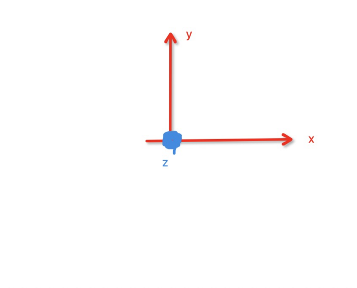
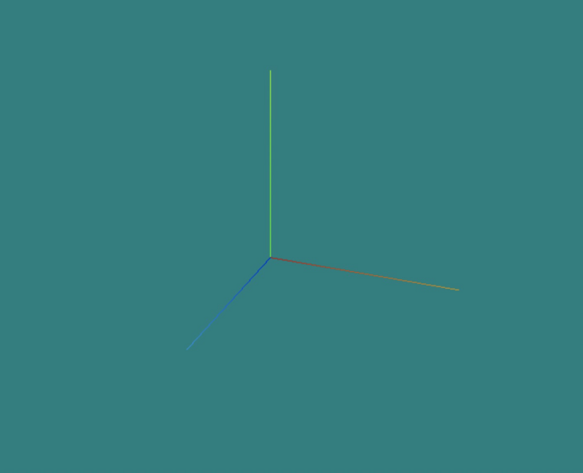
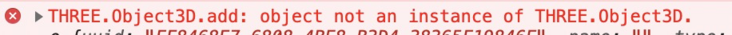
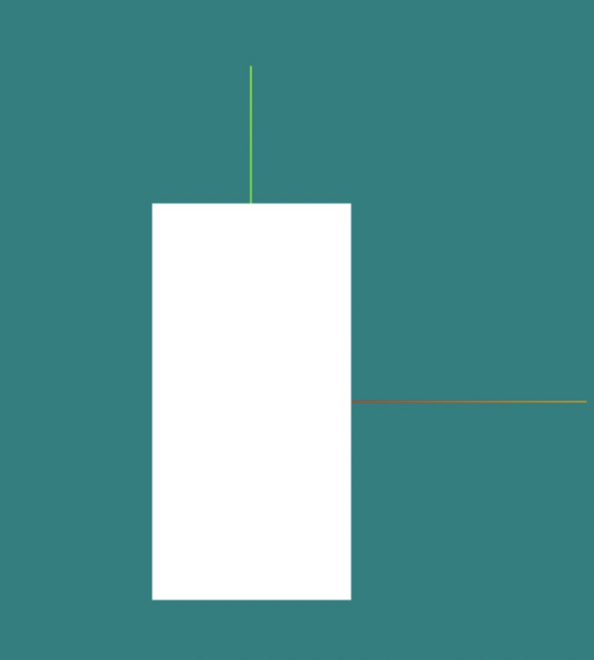
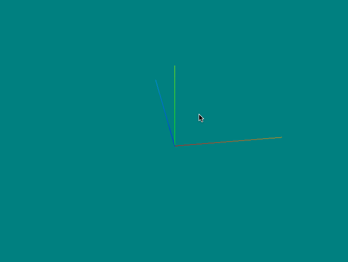
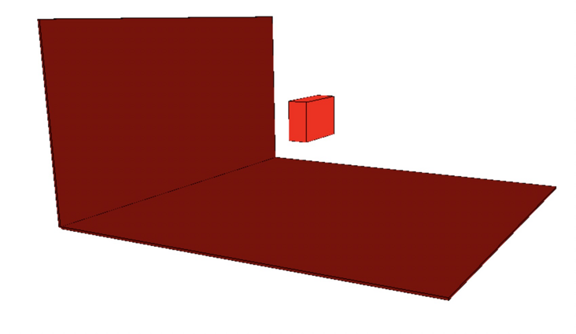
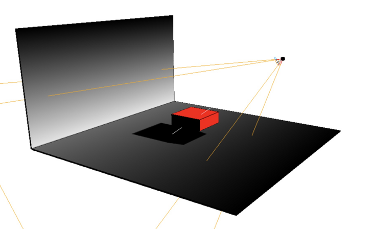
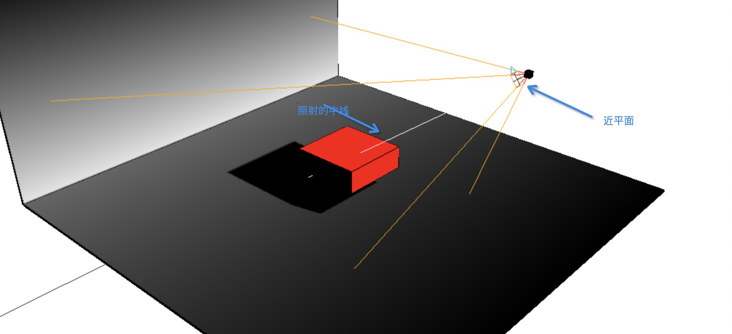

# [从入门three.js到做出3d地球](https://segmentfault.com/a/1190000039724667)

## 第一篇：

### 开篇介绍

    如果你没接触过3d可视化技术, 你也许会认为可视化非常难, 光是一个物体的阴影要如何计算就相当复杂, 但是告诉你个好消息, 阴影的计算都是集成好的, 而我们只要设置好光源的位置,绘制好物体就可以了, 真的没有想象中那么复杂, 本文面向有前端基础,但零可视化基础的同学, 我会从最基础的入门知识说起。

    学习可视化方面的技术会让我们对计算机, 对前端技术有更深的理解, 还可以做出更多有趣味的东西来, 本文是我踩了好多坑后总结出来的, 我更清楚一个初入门的小白哪里不懂。

    `three.js`是 `webgl`的第三方库, 它更适合不太复杂的可视化项目, 而我们要做的3d地球项目使用它来做会更简单, 所以选择了它, 放心后面也会说`webgl`相关知识 。

当前效果如下：


### 一. 关于此系列文章

1. `自食其力:`不管是在公司还是网上都有类似的库, 但是当遇到bug或是缺少功能的情况时就会很麻烦, 例如我们公司的FGL库(一个内网绘制3d景象的技术), 它官网上的例子很多都是错的, 使用起来也是一堆问题, 比如无法精准选择某个国家, 点击事件消融等bug。
   还比如说`Echarts`的地球, 它太注重真实感并且用起来有点卡, 以及交互做的不太好。
2. `直指核心:` 去年我通过看书、看文章、看视频认真的学习`three.js`, 并做出了3d地球这个项目, 而这个系列文章将会直指做出3d地图的核心知识, 尽量不随意扩散知识面。
3. `更好入门:` 网上的教学文章千篇一律, 点进去阅读完感觉其对于一个`three.js`零基础的同学来说都不太好懂, 教学视频里的知识点太广泛, 事无巨细的罗列, 而这个系列文章将更突出绘制3d地球这个重点。
4. `同道中人:` 我学习`three.js`就是为了做出3d地球, 期间走了不少弯路, 被某些问题卡了很久, 所以我更懂一个刚入门的人困惑的点在哪里。
5. `专注vue:` 市面上较少专门针对`vue`做到开箱即用的3d地球插件, 而我们就要编写这样一款产品。
6. `不断学习:` 编写文章也是我提高自己能力的一种方法, 死磕每个知识点让自己的理解更上一层楼。

### 二. 任务目标

1. 入门`three.js`技术。
2. 绘制出3d地球。
3. 做成专门`vue`使用的库。
4. 后期也会介绍`着色器`的概念与基本的使用技巧。
5. 会介绍少量`webgl`的相关用法, 并且会有部分数学知识。

### 三. 文章主线剧情与支线任务

- 主线剧情: 围绕着如何做出3d地球, 这部分在vue工程里面进行。
- 支线任务: 每个分散的知识点, 可能与3d地球没关系, 但是它能帮助我们更好的理解3d技术, 而这些知识点我就不在vue项目里面演示了, 会单独创建一个html文件来演示说明。

### 四. 理解坐标系: 别着急写代码先有基本模型

     像绘制图形这类技术, 最基本的概念就坐标系, 下图是`二维坐标系`, 我们的故事就从这个家伙开始。


我们用`(0, 0)`表示坐标的中心点, 绘制一条起点为中心点长度为1的线段可以使用 `(0, 0) (1, 0)`这两个点相连表示。

###### 关于向量的概念后面需要用数学知识的时候再介绍, 前几篇文章就越通俗越好。

     在`three.js`中我们要打交道的就是下面这位`三维坐标系`


     他的坐标原点就是`(0, 0, 0)`, 绘制一条起点为中心点的长度为1的线段可以是 `(0, 0, 0) (1, 0, 0)`。

     这里要记住, `three.js`里面设置的默认坐标系就是这种形式`x向右, y向上, z向前`, 之所以说是默是因为它可以修改。

     上图中, 观看这个三维坐标系的目光其实是在斜上方, 正常情况下在我们开发的时候`z轴`是正对着我们的眼睛的, 所以你只能看到`z轴`是一个点



###### 在开发与学习的时候, 最好先把坐标系绘制到页面上, 方便我们更好的绘制。

### 五. 相机的概念

     假设现在我们的正前方有一个`三维坐标系`的全息投影, 那么此时你的眼睛就相当于一架相机, 你看到的 `坐标系`景象取决于你站的位置。

     在`three.js`中就有这样一个对象, 他就是负责从哪个角度观察我们绘制的3d世界, 也就是`相机`这个概念的由来。

     相机分为两种, 正投影相机和透视投影相机, 正投影相机就是你站的多远你看到的物体的大小都不变, 透视投影相机就是物体会`近大远小`, 下面是张引用图 (图片来自网络)。


正投影相机可以用在`工程制图`上, 或者可以做一些视觉欺骗小游戏。

###### 本文主要目的是绘制3d地球所以主要使用透视投影相机

### 六. 绘制坐标系, 安放摄像机 (代码安排上)

引入`three.js`, 可以把包下载到本地, 也可以直接获取在cdn上的资源, 引入之后全局会出现`THREE`对象, 我们就可以开始编程之旅了。

```
<script src="https://cdn.bootcdn.net/ajax/libs/three.js/r122/three.min.js"></script>
```

一个普普通通的html空文件的script标签里面, 发生着这样的故事: 让我们逐句解析

###### 第一步:创建场景, 也就是虚拟的空间

     我们之后绘制的`3d物体`都要放入这个空间里面, 你可以把它当做一个鸿蒙空间神器, 里面有一个小世界, 而我们是掌控者(很中二)。

```
const scene = new THREE.Scene();
```

###### 第二步:创建相机

     相机的概念上面讲述过了, `PerspectiveCamera`这个类就是`透视投影相机`, 我们来逐个攻破他参数的意思。

1. `35`: `视角`也就是我们左眼与右眼可以看到的横向角度, 其越小物体则越大, 因为目光变狭窄会突出物体, 你可以做一个实验, 聚精会神的盯着看一个物体, 你就会发现此时你左右两边本来靠余光可以看到的物体你现在看不清, 这个就是你的视角变小了, 变小视角还可以使目标物体比例变大, 我们知道这些就够理解这个数字了, 后期可以利用这个原理做一些令人惊讶的动画特效。
2. `window.innerWidth / window.innerHeight`: 纵横比`宽/高`, 这里宽高不会去写`px`这种单位, 坐标系里面是一种抽象的长度单位, 所以要告诉浏览器咱们当前显示图像的区域的宽高比例(可以当它是百分比布局, 就像我们写css布局时使用`vh` `vw`为单位)。
3. `1`: `近平面`, 简单理解就是当一个`图像`距离`相机`的距离小于1的时候, 就不显示这个图像了。
4. `1000`: `远平面`, 简单理解就是当一个`图像`距离`相机`的距离大于1000的时候, 就不显示这个图像了。
5. `camera.position.z = 10;` 相机的坐标不设置的话, 默认就是(0, 0, 0)坐标原点, 这样类似脑袋在坐标轴原点上看坐标轴, 所以这里要设置距离坐标中心有一定距离, 也就是远距离观察这个坐标系。

```
const camera = new THREE.PerspectiveCamera(35, window.innerWidth / window.innerHeight, 1, 1000);
camera.position.z = 10;
```

- 无聊的知识: 我们在玩`3d游戏`的时候, 是不是有时候与另一个游戏人物距离太近了就会出现`人物中空`的效果, 这些很可能就是他的某些部分距离你相机的距离, 小于了`近平面`的距离导致的。
- 物体距离眼睛越近越大, 越远越小, 因为一个物品无限大与无限远没有意义, 显示起来浪费性能, 所以才会设置近平面与远平面。
- 

###### 第三步:生成渲染实例

1. `WebGLRenderer`生成一个渲染实例, 用来渲染我们所有的3d效果。
2. `setSize`设置场景的宽高。
3. `setClearColor`设置背景色, 这个背景色不是平面的, 是全方位的, 你可以想想成你在一个屋子里, 这个颜色就是屋子墙壁、地板、天花板的颜色(.5是透明度)。
4. `renderer.domElement`生成的渲染的实例, 这个要放到对应的dom容器里面(是个canvas标签)。

```js
const renderer = new THREE.WebGLRenderer();
renderer.setSize(window.innerWidth, window.innerHeight);
renderer.setClearColor(0x00FFFF, .5)
document.body.appendChild(renderer.domElement);
```

- 知识点: `setClearColor`不写就是黑色
- 知识点: `setClearColor`可以直接写"red"这种, 不用必须16进制。

###### 第四步:插入坐标系实例

1. `AxisHelper`: 用于生成辅助坐标实例, `2`代表这个坐标系的长度, 因为我们不一定需要多长的辅助线。
2. `scene`: 老朋友`场景`, 它的`add`方法就是把某某某加入到场景中来。

```
const axisHelper = new THREE.AxisHelper(2)
scene.add(axisHelper)
```

###### 第五步:渲染出来

1. 第一个参数是`场景`, 第二个参数是`相机`。

```
renderer.render(scene, camera);
```

下面是效果图, z轴正对着我们所以看不到：


在斜上方看到是如下的效果, 之后的章节会说如何调整相机的位置与角度



完整的代码如下

```html
<html>
<body>
    <script src="https://cdn.bootcdn.net/ajax/libs/three.js/r122/three.min.js"></script>
    <script>
        const scene = new THREE.Scene();
        const camera = new THREE.PerspectiveCamera(35, window.innerWidth / window.innerHeight, 1, 1000);
        camera.position.z = 10;
        const renderer = new THREE.WebGLRenderer();
        renderer.setSize(window.innerWidth, window.innerHeight);
        renderer.setClearColor(0x00FFFF, .5)
        document.body.appendChild(renderer.domElement);
        const axisHelper = new THREE.AxisHelper(2)
        scene.add(axisHelper)
        renderer.render(scene, camera);
    </script>
</body>
</html>
```

### 七. 第一个立方体

     不画一个立方体感觉对不起 `第一篇`这个题目, 要注意了在`three.js`中你可以理解为绘制一个几何体需要两部分, 一个是`几何体`本身, 比如这个几何体的长宽高, 另一个就是`材质`可以简单理解为表面的颜色样式。
     `geometry`这个单词我们会经常打交道的, 来一起记下它吧。


###### `BoxGeometry` 长方体

```
const geometry = new THREE.BoxGeometry(1, 2, 3);
```

1. `1:` '长', 也可以理解为在不设置坐标的时候在x轴上的长度。
2. `2:` '高', 也可以理解为在不设置坐标的时候在y轴上的长度。
3. `3:` '宽', 也可以理解为在不设置坐标的时候在z轴上的长度。

new出来的实例上面会有这个几何体的点的信息, 面的信息等等, 这个后面再详细说这次主要入门。

###### `MeshBasicMaterial` 材质

颜色与上面设置`setClearColor`一样, 什么写法都行的, 下面是我设置了一个红色的材质。
`const material = new THREE.MeshBasicMaterial({ color: 'red' });`

###### 生成'网格' `Mesh`

`const cube = new THREE.Mesh(geometry, material);`
网格上含有位置信息、旋转信息、缩放信息等等, 他需要用`几何体`与`材质`两个参数, 但其实并不像网上说的必须要有材质, 不传材质也能显示。

###### 放入场景

也就是场景对象`scene`本身有个`add`方法。
`scene.add(cube);`


右上方视角


###### 放入场景的几种方式

1: 我直接放入`geometry`
`scene.add(geometry);` 会报错了, 可以理解为不是网格对象所以报错了。
以后遇到这类报错一定要考虑类型问题。


2: 未设置`材质`

```
const cube = new THREE.Mesh(geometry);

scene.add(cube);
```




白白的一片, 并且控制台没有报错。

### 八. 全部代码

```html
<html>
<body>
    <script src="https://cdn.bootcdn.net/ajax/libs/three.js/r122/three.min.js"></script>
    <script src="./utils/OrbitControls.js"></script>
    <script>
        const scene = new THREE.Scene();
        const camera = new THREE.PerspectiveCamera(35, window.innerWidth / window.innerHeight, 1, 1000);
        camera.position.z = 10;
        const renderer = new THREE.WebGLRenderer();
        renderer.setSize(window.innerWidth, window.innerHeight);
        renderer.setClearColor(0x00FFFF, .5)
        document.body.appendChild(renderer.domElement);
        const axisHelper = new THREE.AxisHelper(2)
        scene.add(axisHelper)

        const geometry = new THREE.BoxGeometry(1, 2, 3);
        const material = new THREE.MeshBasicMaterial({ color: 'red' });
        const cube = new THREE.Mesh(geometry, material);
        scene.add(cube);

        renderer.render(scene, camera);
    </script>
</body>

</html>
```

### end

     第一篇写的内容并不多, 等基本知识储备够了就可以开始编写`3d地球`了, 那里将会很有意思。
**希望与你一起进步。**

## 第二篇: 开发必备的辅助技能

### 本篇介绍

     开发`3d`效果的时候, 不能每次都通过刷新页面来更新图像, 我们工程师当然会发明出相应的工具辅助开发工作, 这一篇我们一起学习三个好用的工具, 让我们的开发更畅快。

     上篇我们讲解了`three.js`的基本配置代码, 想看的同学可以访问这个链接: [关于从入门three.js到做出3d地球这件事(第一篇: 通俗易懂的入门)](https://segmentfault.com/a/1190000039647481)

### 一. 相机的配置

- **这里介绍的是`透视相机`**

     介绍工具之前我们先把相机的关键概念系统的学一遍, 因为以后我们要利用相机做很多有趣的事。
     这里以上一篇绘制的最基本的坐标系为例进行说明, 如下图:


###### 第一: `position` 相机位置

     位置属性很重要很常用, 不同的位置呈现出不同的景色, 我们可以把相机理解为我们在3d世界中的眼睛, 而调整相机的位置就相当于我们走到不同的角度去看这个3d世界。
     看过上一篇你会知道我们的相机实例叫`camera`, 我们对他的`position`属性进行设置就可以调整位置。

- **第一种设置方式**

```
    camera.position.x = 2;
    camera.position.y = 2;
    camera.position.z = 10;
```

上面就是分别调节了相机的x, y, z轴的距离, 我们看到的景象变成了下面的样子。


- **第二种设置方式**

     `position`身上有`set`方法可以设置, 三个参数对应的是x, y, z。

```
camera.position.set(2, 2, 10)
```

     效果与上面的一样。

- **第三种设置方式**

     `position`可以直接设置x, y, z属性, 本身又有`set`方法, 那么`position`属性本身到底是个什么那? 让我们打印出来看看。

`isVector3: true`也就是说它是一个`Vector`实例, 那么`Vector`是什么?
我们以后会经常和这个单词打交道, 让我们一起记住它。


- **先不细聊向量**

因为`向量`是个很重要的概念, 我们后面会单独大篇幅的详谈, 这里咱们单纯的理解为`new THREE.Vector3(2, 2, 10)`是生成了一个`点`, 参数就是这个点的xyz坐标, 而我们相机的position属性就是这样一个对象。

- **注意: 直接赋值是无效的**

`camera.position = new THREE.Vector3(2, 2, 10)` 无效

需要利用add方法来实现
`camera.position.add(new THREE.Vector3(2, 2, 10))` 有效

- **别被唬住**

上面展示了大部分常用的设置`position`的方法, 我在初学`three.js`的时候被网上各种写法弄晕了所以这里特意列出大部分写法, 希望当你再看其它资料的时候就不会被乱七八糟的写法唬住了。

###### 第二: `lookAt` 相机看向哪里

     这个概念简直太重要了, 如其字面意思就是看向哪里, 上面相机位置已经调整完毕, 那么我们要调整相机拍摄哪里了。

默认是(0,0,0)的位置如下图：


当我们看向坐标系的 (3, 3, 0)位置也就是右上角：


     从它的效果我们可以发现, 这个属性非常适合在3d游戏中调整人物的方向时改变图像, 如果你要做`第一人称游戏`一个人在城市里奔跑的效果, 那无非就是不断的改变相机的`position`与`lookAt`就能做到了。

- **设置方式**

这里可以直接设置: `camera.lookAt(3, 3, 0)`;
还可以利用`向量`来设置: `camera.lookAt(new THREE.Vector3(3, 3, 0))`;

###### 第三: `up` 谁为相机上方

先来一张默认的情况, 不难看出绿的是y, 红的是x, z正对着我们所以暂时看不到:


我们设置一下`camera.up.set(1, 0, 0);`


上面x的值成为了最大, 所以他变成了`上方`的坐标轴, 当然如我们设一个乱乱的值`camera.up.set(1, 0.5, 0);` 那么效果如下:


这个属性的设置方式就是`set`方法或者`camera.up = new THREE.Vector3(1, 0.5, 0)`;

可以利用这个属性模拟`第一人称`游戏里任务摔倒了看这个世界....

###### 坑点

我当前版本的`three.js`想要up属性生效需要在设置完up属性之后再主动指定一下`camera.lookAt(0, 0, 0);`否则up属性不生效;

### 二. GUI的使用

     上面讲了这么多, 我们现在想让场景动起来, 所以需要不断的渲染出3d图像, 我们利用`requestAnimationFrame`反复调用渲染函数就能实现动画效果了。

```
const animate = function () {
        requestAnimationFrame(animate);
        renderer.render(scene, camera);
    };
animate();
```

-**全名dat.gui.js**
他的功能是为属性生成一个可调节值的面板, 方便我们不断修改数值而不用刷新页面如下图:

鼠标拖动调节


-**引入GUI**
`<script src="https://cdn.bootcdn.net/ajax/libs/dat-gui/0.7.7/dat.gui.min.js"></script>`
引入之后我们全局多了一个`dat`属性。

```
const gui = new dat.GUI();
// 1: 定义一个我们要改变的对象
const pames = {
  x: 0
}
// 2: 把这个值放入控制器
gui.add(pames, "x", 0, 5).name("x轴的距离")
```

参数解答

1. 传入要改变的对象。
2. 要改变这个对象身上的哪个属性。
3. 最小值
4. 最大值
5. .name('显示在调节栏的名称')

在每次渲染的时候更新一下相机的x轴位置。

```
const animate = function () {
    camera.position.x = pames.x
    requestAnimationFrame(animate);
    renderer.render(scene, camera);
}
animate();
```

知道上面这些就可以应付很多的场景了, 一个工具而已不用深究啦。

###### 全部代码

```
<html>
    <script src="https://cdn.bootcdn.net/ajax/libs/three.js/r122/three.min.js"></script>
    <script src="https://cdn.bootcdn.net/ajax/libs/dat-gui/0.7.7/dat.gui.min.js"></script>
    <script>
        const scene = new THREE.Scene();
        const camera = new THREE.PerspectiveCamera(35, window.innerWidth / window.innerHeight, 1, 1000);
        camera.position.z = 20;
        const renderer = new THREE.WebGLRenderer();
        renderer.setSize(window.innerWidth, window.innerHeight);
        renderer.setClearColor(0x00FFFF, .5);
        document.body.appendChild(renderer.domElement);
        const axisHelper = new THREE.AxisHelper(2)
        scene.add(axisHelper)
        const pames = {
            x: 0
        }
        function createUI() {
            var gui = new dat.GUI();
            gui.add(pames, "x", 0, 5).name("x轴的距离")
        }
        const animate = function () {
            camera.position.x = pames.x
            requestAnimationFrame(animate);
            renderer.render(scene, camera);
        }
        createUI()
        animate();
    </script>
</body>
</html>
```

### 三. tween的使用

     `tween.js`是用来做流畅动画的库, 比我们自己写动画方便多了[tween官网地址](http://www.createjs.cc/tweenjs/docs/classes/Ticker.html)。

下面编写了一个相机平滑的向右上角移动的代码。

```
const tween = new TWEEN.Tween(camera.position).to({
    x: 10,
    y: 10
}, 2000).repeat(Infinity).start();

 // tween.stop() // 可以停止动画
 
const animate = function () {
    TWEEN.update();
    requestAnimationFrame(animate);
    renderer.render(scene, camera);
}
animate();
```

1. `new TWEEN.Tween("这里传入要改变的对象")`。
2. `.to( x: 10 y: 10}, 2000)`, 在2000毫秒时将x与y属性变成10。
3. `.repeat(Infinity)`, 这个动无限循环。
4. `.start();`, 开始执行动画。
5. `.stop();`, 停止动画。
6. `TWEEN.update();`, 每次调用渲染函数都要调用一下动画的更新函数。

效果如下(思否暂时无法传gif图片, 但我已经向高老板反应了)：


下面是动图，显示可能有问题。


这个库大概的原理就是每次调用`update`方法的时候判断一下该动画已经执行了多久时间, 然后算出当前时间`目标对象`的值应该变为多少, 当然它还会对性能有所优化。

###### 全部代码如下:

```html
<html>
<style>
    * {
        padding: 0;
        margin: 0;
    }
</style>

<body>
    <script src="https://cdn.bootcdn.net/ajax/libs/three.js/r122/three.min.js"></script>
    <script src="https://cdn.bootcdn.net/ajax/libs/tween.js/18.6.4/tween.umd.js"></script>
    <script>
        const scene = new THREE.Scene();
        const camera = new THREE.PerspectiveCamera(35, window.innerWidth / window.innerHeight, 1, 1000);
        camera.position.z = 20;
        const renderer = new THREE.WebGLRenderer();
        renderer.setSize(window.innerWidth, window.innerHeight);
        renderer.setClearColor(0x00FFFF, .5);
        document.body.appendChild(renderer.domElement);
        const axisHelper = new THREE.AxisHelper(2)
        scene.add(axisHelper)

        const tween = new TWEEN.Tween(camera.position).to({
            x: 10,
            y: 10
        }, 2000).repeat(Infinity).start()
        const animate = function () {
            TWEEN.update()
            requestAnimationFrame(animate);
            renderer.render(scene, camera);
        }
        animate();
    </script>
</body>

</html>
```

### 四. 轨道控制器的使用

     这个就厉害了, 让我们可以使用鼠标转动我们的相机, 仿若进入到3d世界一般。



随着我们按住鼠标并且移动, 视角就随之变化仿佛身临其境一般。

```
// 将轨道控制器的代码放在对应的文件夹里面, 如果你没找到就用下面我分享的文件。
<script src="./utils/OrbitControls.js"></script>
```

引入成功页面THREE身上会出现`OrbitControls`方法, 我们需要传入`相机`与渲染的容器。

```
  const orbitControls = new THREE.OrbitControls(camera, renderer.domElement);
  orbitControls.target = new THREE.Vector3(0, 0, 0);//控制焦点
```

     cdn上我没查到, 想要获取代码的同学可以复制我的笔记内容到项目中 [three.js轨道控制器](https://segmentfault.com/n/1330000039676837)点击预览

###### 直接在页面引入与通过npm包的方式引入有区别, 到了讲在vue里的使用的时候我们再详细说。

###### 全部代码如下: (要有`./utils/OrbitControls.js`的代码, 没有的话来我笔记下载)

```html
<html>

<body>
    <script src="https://cdn.bootcdn.net/ajax/libs/three.js/r122/three.min.js"></script>
    <script src="./utils/OrbitControls.js"></script>
    <script>
        const scene = new THREE.Scene();
        const camera = new THREE.PerspectiveCamera(35, window.innerWidth / window.innerHeight, 1, 1000);
        camera.position.z = 10;
        const renderer = new THREE.WebGLRenderer();
        renderer.setSize(window.innerWidth, window.innerHeight);
        renderer.setClearColor(0x00FFFF, .5)
        // 轨道控制器
        orbitControls = new THREE.OrbitControls(camera, renderer.domElement);
        // orbitControls.target = new THREE.Vector3(0, 0, 0);
        // 轨道控制器
        document.body.appendChild(renderer.domElement);
        const axisHelper = new THREE.AxisHelper(2)
        scene.add(axisHelper)
        var animate = function () {
            requestAnimationFrame(animate);
            renderer.render(scene, camera);
        };
        animate();
    </script>
</body>

</html>
```

### end.

下一篇将会介绍 `光源`, 与 `阴影`的玩法了, 希望与你一起进步。

## 第三篇: 光与影

### 本篇介绍

     通过前面几篇我们了解了坐标系、相机、物体等概念, 这一篇我们要让3d世界里的物体, 更像我们的现实世界的物体, 我们要为3d世界绘制光与影。

### 1. 高级材料

     如果你看过前两篇文章, 你会发现在生成物体`材质`的时候我们用的是`MeshBasicMaterial`, `basic`这单词意思是`基本的`,那也就是说与其相对还会有高级属性, `MeshLambertMaterial`就是高级属性中的一种。

     使用这个属性创建出来的物体, 会产生暗淡不光亮的表面(你可以理解为需要光照时, 它的颜色才会被看到), 本篇我们一起看看它的神奇之处。

### 2. 物体、墙面、地面

     绘制`光源`之前, 我们先搭建一套环境, 这个环境很简单有物体、墙面、地面, 我们通过上一篇已经学过如何绘制一个`长方体`, 那么我们就以薄薄的长方体作为墙面, 最终效果如下。


     物体、墙面、地面他们身上会有`辅助线`, 这个是使用的:

```
const edges = new THREE.BoxHelper(cube, 0x00000);
scene.add(edges);
```

1. `BoxHelper`给立方体设置边框。
2. `cube`需要设置边框的物体, 后面紧跟着边框的`颜色`。
3. `edges`将实例放入场景中。

全部代码如下(`../utils/OrbitControls.js`的内容在我[笔记](https://segmentfault.com/n/1330000039676837)点击预览里):

```
<html>
<body>
    <script src="https://cdn.bootcdn.net/ajax/libs/three.js/r122/three.min.js"></script>
    <script src="../utils/OrbitControls.js"></script>
    <script>
        const scene = new THREE.Scene();
        const camera = new THREE.PerspectiveCamera(35, window.innerWidth / window.innerHeight, 1, 1000);
        camera.position.z = 40;
        const renderer = new THREE.WebGLRenderer();
        renderer.setSize(window.innerWidth, window.innerHeight);
        renderer.setClearColor(0xffffff)
        orbitControls = new THREE.OrbitControls(camera, renderer.domElement);
        document.body.appendChild(renderer.domElement);

        const cube = initCube({
            color: 'red',
            len: [1, 2, 3],
            position: [-0.5, 5, 1.5]
        })
        const wall = initCube({
            color: 'gray',
            len: [0.1, 10, 20],
            position: [-10.1, 5, 0]
        })
        const land = initCube({
            color: 'gray',
            len: [20, 0.1, 20],
            position: [0, 0, 0]
        })
        scene.add(cube);
        scene.add(wall);
        scene.add(land);

        var animate = function () {
            requestAnimationFrame(animate);
            renderer.render(scene, camera);
        };
        animate();

        function initCube(options) {
            const geometry = new THREE.BoxGeometry(...options.len);
            const material = new THREE.MeshBasicMaterial({ color: options.color });
            const cube = new THREE.Mesh(geometry, material);
            cube.position.add(new THREE.Vector3(...options.position))
            scene.add(new THREE.BoxHelper(cube, 0x00000));
            return cube
        }
    </script>
</body>
</html>
```

代码与之前几篇的代码没什么区别, 就是封装了一个`initCube`方法来创建立方体。

当我们把代码里的`MeshBasicMaterial`替换为``时如图:


### 3. `AmbientLight` 自然光 or 环境光

    我们的第一个主角终于登场了, 下面介绍把光源加入场景的方法。

```
const light = new THREE.AmbientLight('blue');
scene.add(light)
```

1. `new THREE.AmbientLight('blue')`生成实例时传入光的颜色, 上面是蓝色的光。
2. 放入场景中。

效果就变成了下面怪异的样子:


地面与墙壁变为了蓝色, 但是在蓝色的光照耀下红色的立方体却是黑色的。

###### 光的颜色符合物理学

红色的物体不能反射蓝色的光, 灰色的物体却能反射蓝色的光。

1. 自然光符合物理学, 不好计算。
2. 自然光源没有特别的来源方向，不会产生阴影。
3. 不能将其作为场景中唯一的光源, 但可以配合其他光源, 起到弱化阴影或给场景添加一些额外的颜色的作用。
4. 自然光不需要指定位置它会应用到全局。

我们使用红光的时候:


**所以要记住, 一些文章说与自然光颜色不同的物体都变为黑色是错的!!!**

### 4. `PointLight`点光源

     顾名思义他是一个`光点`, 有人把它比喻成引火虫或是小灯泡, 它向四面八方发射光芒, `光源本身`是不可见的所以在我们绘制的时候会在点光源的位置放置一个立方体表示其位置信息。

```
const light = new THREE.PointLight('white');
light.intensity = 1.8;
light.distance = 30;
light.position.set(2, 8, -5);
scene.add(light)
```

点光源的属性介绍:

1. `intensity`光强, 想要成为最亮的星。
2. `distance`光源照射的距离, 默认值为`0`也就是无限。
3. `visible`布尔值, 是否打开光源。
4. `decay`衰减值, 越大衰减速度越快。

面上代码的效果如图:

换个角度看看:

当我们把光强加大到`3`, 明显可以看到区别:


###### 点光源照耀四面八方, 如果生成阴影的话计算量太大, 所以不建议开启阴影。

全部代码:

```
<html>

<body>
    <script src="https://cdn.bootcdn.net/ajax/libs/three.js/r122/three.min.js"></script>
    <script src="../utils/OrbitControls.js"></script>
    <script>
        const scene = new THREE.Scene();
        const camera = new THREE.PerspectiveCamera(35, window.innerWidth / window.innerHeight, 1, 1000);
        camera.position.z = 40;
        const renderer = new THREE.WebGLRenderer();
        renderer.setSize(window.innerWidth, window.innerHeight);
        renderer.setClearColor(0xffffff)
        orbitControls = new THREE.OrbitControls(camera, renderer.domElement);
        document.body.appendChild(renderer.domElement);

        const cube = initCube({
            color: 'red',
            len: [1, 2, 3],
            position: [-0.5, 5, 1.5]
        })
        const wall = initCube({
            color: 'gray',
            len: [0.1, 10, 20],
            position: [-10.1, 5, 0]
        })
        const land = initCube({
            color: 'gray',
            len: [20, 0.1, 20],
            position: [0, 0, 0]
        })
        scene.add(cube);
        scene.add(wall);
        scene.add(land);

        const light = new THREE.PointLight('white');
        light.intensity = 3; // 光强
        light.distance = 30; // 衰减距离
        light.position.set(2, 8, -5);
        scene.add(light)

        const edges = initCube({
            color: 'red',
            len: [0.2, 0.2, 0.2],
            position: [2, 8, -5]
        })
        scene.add(edges);

        const animate = function () {
            requestAnimationFrame(animate);
            renderer.render(scene, camera);
        };
        animate();

        function initCube(options) {
            const geometry = new THREE.BoxGeometry(...options.len);
            const material = new THREE.MeshLambertMaterial({ color: options.color });
            const cube = new THREE.Mesh(geometry, material);
            cube.position.add(new THREE.Vector3(...options.position))
            scene.add(new THREE.BoxHelper(cube, 0x00000));
            return cube
        }
    </script>
</body>
</html>
```

### 5. 生成影子的定义

     想要生成影子可不是那么简单的, 因为可想而知在数学方面影子的计算量必然很大的, 在`three.js`中物体是否可以显示影子是需要单独定义的。

###### 第一步: 渲染器支持

如果使用的WebGLRender 渲染器, 需要如下开启渲染器支持。

```
const renderer = new THREE.WebGLRenderer();
renderer.shadowMap.enabled = true;
```

###### 第二步: 为`光`设置`可生成阴影`属性

```
light.castShadow = true;
```

###### 第三步: 为`物体`设置`可生成阴影`属性

```
cube.castShadow = true;
```

###### 第四步: 为`物体`设置`可接收阴影`属性

```
cube.receiveShadow = true;
```

这里注意了, 比如说a物体产生阴影, 阴影映在b物体上, 那么a与b都要设置上述的属性。

### 6. SpotLight 聚光灯(有方向的光)

     这个光源是有方向的, 也就是说他可以指定照向谁, 并且可以产生阴影。

```
let light = new THREE.SpotLight("#ffffff");
    light.position.set(1, 1, 1);
    light.target = cube
    scene.add(light);
```

可配置的属性与上面的基本相似, 多了一个target:
`target`指定`照谁`, `target`必须是一个`THREE.Object3D`对象, 所以我们经常会先创建一个`Object3D`对象, 让它不可见然后光源就可以通过照射它, 从而实现任意方向。

我们先看一下光源在上方照射, 下方物体产生阴影的效果:


### 7. SpotLight 模拟手电(锥形光)

    开发中我们会用`SpotLight`模拟手电与灯光, 可以利用他的`angle`角度属性。

```
const light = new THREE.SpotLight("#ffffff");
scene.add(light);
```


当我们把背景颜色换成黑色的效果:

上图就如同黑夜里手电照射的效果了。

###### 为了方便调试聚光灯,官方给了我们专属的辅助线。

```
const helper = new THREE.CameraHelper(light.shadow.camera);
    scene.add(helper);
```



下面我们标注一下都有哪些知识点:


    重要的是有了这些辅助线我们就知道如何优化自己的项目了, 比如减小光源的远平面。

完整代码

```
<html>
<body>
    <script src="https://cdn.bootcdn.net/ajax/libs/three.js/r122/three.min.js"></script>
    <script src="../utils/OrbitControls.js"></script>
    <script>
        const scene = new THREE.Scene();
        const camera = new THREE.PerspectiveCamera(35, window.innerWidth / window.innerHeight, 1, 1000);
        camera.position.z = 40;
        const renderer = new THREE.WebGLRenderer();
        renderer.setSize(window.innerWidth, window.innerHeight);
        renderer.setClearColor(0xffffff)
        renderer.shadowMap.enabled = true;
        orbitControls = new THREE.OrbitControls(camera, renderer.domElement);
        document.body.appendChild(renderer.domElement);
        const cube = initCube({
            color: 'red',
            len: [3, 1, 3],
            position: [0, 2, 0]
        })
        const wall = initCube({
            color: 'gray',
            len: [0.1, 10, 20],
            position: [-10.1, 5, 0]
        })
        const land = initCube({
            color: 'gray',
            len: [20, 0.1, 20],
            position: [0, 0, 0]
        })
        scene.add(cube);
        scene.add(wall);
        scene.add(land);
        const arr = [8, 8, 0]
        const light = new THREE.SpotLight("#ffffff", 1);
        light.intensity = 2.5;
        light.position.set(...arr);
        light.castShadow = true;
        light.target = cube
        light.decay = 2;
        light.distance = 350;
        light.angle = Math.PI / 5
        light.penumbra = 0.05;
        scene.add(light);
        // 聚光灯助手
        const helper = new THREE.CameraHelper(light.shadow.camera);
        scene.add(helper);
        const edges = initCube({
            color: 'red',
            len: [0.2, 0.2, 0.2],
            position: [...arr]
        })
        scene.add(edges);

        const animate = function () {
            requestAnimationFrame(animate);
            renderer.render(scene, camera);
        };
        animate();

        function initCube(options) {
            const geometry = new THREE.BoxGeometry(...options.len);
            const material = new THREE.MeshLambertMaterial({ color: options.color });
            const cube = new THREE.Mesh(geometry, material);
            cube.castShadow = true;
            cube.receiveShadow = true;
            cube.position.add(new THREE.Vector3(...options.position))
            scene.add(new THREE.BoxHelper(cube, 0x00000));
            return cube
        }
    </script>
</body>
</html>
```

### 8. DirectionalLight 平型光

     经常被举例子的就是太阳光, 实际上太阳光也不是平行的, 只是距离太远了几乎可以算是平行。
     这个光源与其他的不同的点是, 他它所照耀的区域接收到的光强是一样的。

```
const light = new THREE.DirectionalLight("#ffffff");
scene.add(light);
```

介绍几个新属性:

```
light.shadow.camera.near = 5; //产生阴影的最近距离
light.shadow.camera.far = 50; //产生阴影的最远距离
light.shadow.camera.left = -3; //产生阴影距离位置的最左边位置
light.shadow.camera.right = 3; //最右边
light.shadow.camera.top = 3; //最上边
light.shadow.camera.bottom = -3; //最下面
```


通过上图我们可以得知, 这个光源是完全平行的。

完整代码如下:

```html
<html
<body>
    <script src="https://cdn.bootcdn.net/ajax/libs/three.js/r122/three.min.js"></script>
    <script src="../utils/OrbitControls.js"></script>
    <script>
        const scene = new THREE.Scene();
        const camera = new THREE.PerspectiveCamera(35, window.innerWidth / window.innerHeight, 1, 1000);
        camera.position.z = 40;
        const renderer = new THREE.WebGLRenderer();
        renderer.setSize(window.innerWidth, window.innerHeight);
        renderer.setClearColor(0x000)
        renderer.shadowMap.enabled = true;
        orbitControls = new THREE.OrbitControls(camera, renderer.domElement);
        document.body.appendChild(renderer.domElement);

        const cube = initCube({
            color: 'red',
            len: [3, 1, 3],
            position: [0, 2, 0]
        })
        const wall = initCube({
            color: 'gray',
            len: [0.1, 10, 20],
            position: [-10.1, 5, 0]
        })
        const land = initCube({
            color: 'gray',
            len: [20, 0.1, 20],
            position: [0, 0, 0]
        })
        scene.add(cube);
        scene.add(wall);
        scene.add(land);

        const light = new THREE.DirectionalLight("#ffffff");
        light.intensity = 1.5;
        light.position.set(8, 8, 0);
        light.castShadow = true;
        light.target = cube
        light.shadow.camera.near = 5; //产生阴影的最近距离
        light.shadow.camera.far = 50; //产生阴影的最远距离
        light.shadow.camera.left = -3; //产生阴影距离位置的最左边位置
        light.shadow.camera.right = 3; //最右边
        light.shadow.camera.top = 3; //最上边
        light.shadow.camera.bottom = -3; //最下面
        scene.add(light);
        // 聚光灯助手
        const helper = new THREE.CameraHelper(light.shadow.camera);
        scene.add(helper);

        const animate = function () {
            requestAnimationFrame(animate);
            renderer.render(scene, camera);
        };
        animate();

        function initCube(options) {
            const geometry = new THREE.BoxGeometry(...options.len);
            const material = new THREE.MeshLambertMaterial({ color: options.color });
            const cube = new THREE.Mesh(geometry, material);
            cube.castShadow = true;
            cube.receiveShadow = true;
            cube.position.add(new THREE.Vector3(...options.position))
            scene.add(new THREE.BoxHelper(cube, 0x00000));
            return cube
        }
    </script>
</body>
</html>
```

### 9. 光源要配合使用

     一般情况下不会只有单一光源, 比如我们会先放一个环境光, 然后在灯的模型中放上其他光源, 一些rpg游戏会用`聚光灯`处理用户视角。

     我们可以同时使用多个光源, 利用`gui.js`查看各种绚丽的效果, 比如我们可以用束平型光模拟舞台效果。

### end.

下章会从绘制一个`木块`开始, 最后绘制一个`贴图地球`, 这次就是这样希望与你一起进步。

## [第四篇: 贴图地球](https://segmentfault.com/a/1190000039807438)

### 本篇介绍

     通过前三篇的学习基础知识我们已经储备差不多了, 这一篇我们要做一个`贴图地球`, 这种地球也是不少公司现在在使用的方案, 但缺点也比较明显就是它无法精准的选中某个国家, 所以一些精细的操作它做不到, 但是学习这个技术依旧是一件令人愉快的事情, 也没准你不需要选中国家的功能, 闲言少叙我们全军出击吧。

### 1. 绘制一个木块

     我们这一篇只讨论规则的矩形木块, 生活中更常见的不规则木块我们在`3d模型`篇再聊, 绘制木块的原理就是先生成`geometry`, 把它的材质定义为木头图片, 使其材质均匀有规则的分布在`geometry`表面, 这样在我们眼里就成了木块。

###### 下载一个木块的图片

     我是直接百度的一张木头纹理图片, 你也可以用我这张, 同时新建一个`img`文件夹用来存放图片。


###### 新的概念 "加载器"

```
const loader = new THREE.TextureLoader();
```

     上面代码我们生成了一个加载器, 可以用这个实例进行一系列的加载操作, 内部使用`ImageLoader`来加载文件, 顾名思义`Texture`是纹理的意思所以可以叫它`纹理加载器`,后面章节降到加载3d模型的时候还会介绍更多的`加载器`。

```js
const loader = new THREE.TextureLoader();
        loader.load(
            './img/木块.jpeg',
            (texture) => {
                const material = new THREE.MeshBasicMaterial({
                    map: texture
                })
                const geometry = new THREE.BoxGeometry(2, 2, 1);
                // 加入纹理
                const mesh = new THREE.Mesh(geometry, material)
                // 放入几何
                scene.add(mesh);
            },
            (xhr) => {
                // 进度
                console.log(`${xhr.loaded / xhr.total * 100}%`)
            },
            (err) => {
                // 错误
                console.log(err)
            }
        )
```

1. `第一个参数`要加载的资源的路径。
2. `第二个参数`加载成功后的回调, 会返回纹理对象。
3. `第三个参数`进度, 将在加载过程中进行调用。参数为XMLHttpRequest实例，实例包含total和loaded字节, 请注意three.js r84遗弃了TextureLoader进度事件, 我们其实可以填`undefined`。
4. `第四个参数`错误的回调。

当前我们直接打开我们的`html`文件他会报如下的错误:


     每次遇到这种跨域报错, 我们第一时间应该想到把资源放在服务器上, 但是当前有更简洁的方式。

###### 配置`vscode`插件


在我们的项目页面点击右下角的 `Go live` 启动一个服务。


此时我们就可以得到如下的效果：


完整代码:

```js
<html>
<body>
    <script src="https://cdn.bootcdn.net/ajax/libs/three.js/r122/three.min.js"></script>
    <script src="../utils/OrbitControls.js"></script>
    <script>
        const scene = new THREE.Scene();
        const camera = new THREE.PerspectiveCamera(35, window.innerWidth / window.innerHeight, 1, 1000);
        camera.position.z = 20;
        const renderer = new THREE.WebGLRenderer();
        renderer.setSize(window.innerWidth, window.innerHeight);
        renderer.setClearColor(0xffffff)
        orbitControls = new THREE.OrbitControls(camera, renderer.domElement);
        document.body.appendChild(renderer.domElement);

        const axisHelper = new THREE.AxisHelper(4)
        scene.add(axisHelper)

        // 为物体增加材质
        const loader = new THREE.TextureLoader();
        loader.load(
            './img/木块.jpeg',
            (texture) => {
                console.log(texture)
                const material = new THREE.MeshBasicMaterial({
                    map: texture
                })
                const geometry = new THREE.BoxGeometry(2, 2, 1);
                // 加入纹理
                const mesh = new THREE.Mesh(geometry, material)
                // 放入几何
                scene.add(mesh);
            },
            (xhr) => {
                // 进度(已废弃)
                console.log(`${xhr.loaded / xhr.total * 100}%`)
            },
            (err) => {
                // 错误
                console.log(err)
            }
        )

        const animate = function () {
            requestAnimationFrame(animate);
            renderer.render(scene, camera);
        };
        animate();

    </script>
</body>

</html>
```

### 2. 纹理属性的详谈

     我们来谈谈纹理的几个属性吧, 木块的图片想看出差别不明显, 我们在`img`文件夹里面再放一张`鸣人`的图片。


代码里面我们只改路径即可。

```
loader.load(
    './img/螺旋丸.jpeg',
    (texture) => {
    ...//
```


     从上图我们可以看出, 六个面上都是完整的图片, 但是由于宽高比的不同图像被相应的压缩, 接下来我们就介绍几个比较常用的属性。

###### 重复`repeat`

     我们把加载到的纹理进行处理`texture.repeat.x = 0.5`定义他的x轴重复值。


把它的数值调大至5。


从上面的效果可以看得出, 这个`repeat.x`类似在物体x轴方向的画面个数, 也就是说0.5就是x轴方向铺满需要0.5个图片, 5就是需要5张图片才能充满, 那么与之相对的就是y轴的重复正如下图：


这看起来像个礼品盒的绳子, 那么接下来我们让这个图铺满表面。

###### 回环`wrapS` `wrapT`

t 是图片的y轴我们设置一下:

```
texture.wrapT = THREE.RepeatWrapping;
```


同理设置x轴, 注意x轴叫`s`:

```
textureObj.wrapS = THREE.RepeatWrapping
```


**纹理不是我们这个系列的重点就不扩展了, 有兴趣的同学自己玩一玩**
完整代码如下:

```js
<html>
<body>
    <script src="https://cdn.bootcdn.net/ajax/libs/three.js/r122/three.min.js"></script>
    <script src="https://cdn.bootcdn.net/ajax/libs/dat-gui/0.7.7/dat.gui.min.js"></script>
    <script src="../utils/OrbitControls.js"></script>
    <script>
        const scene = new THREE.Scene();
        const camera = new THREE.PerspectiveCamera(35, window.innerWidth / window.innerHeight, 1, 1000);
        camera.position.z = 14;
        const renderer = new THREE.WebGLRenderer();
        renderer.setSize(window.innerWidth, window.innerHeight);
        renderer.setClearColor(0xffffff)
        orbitControls = new THREE.OrbitControls(camera, renderer.domElement);
        document.body.appendChild(renderer.domElement);
        const axisHelper = new THREE.AxisHelper(4)
        scene.add(axisHelper)
        // 为物体增加材质
        let textureObj = null;
        const loader = new THREE.TextureLoader();
        loader.load(
            './img/螺旋丸.jpeg',
            (texture) => {
                textureObj = texture;
                const material = new THREE.MeshBasicMaterial({
                    map: texture
                })
                const geometry = new THREE.BoxGeometry(2, 2, 1);
                // 加入纹理
                const mesh = new THREE.Mesh(geometry, material)
                // 放入几何
                scene.add(mesh);
            },
            (xhr) => {
                // 进度(已废弃)
                console.log(`${xhr.loaded / xhr.total * 100}%`)
            },
            (err) => {
                // 错误
                console.log(err)
            }
        )
        const pames = {
            repeatx: 5,
            repeaty: 5,
        }
        function createUI() {
            const gui = new dat.GUI();
            gui.add(pames, "repeatx", 0, 5).name("repeatx")
            gui.add(pames, "repeaty", 0, 5).name("repeaty")
        }
        const animate = function () {
            if (textureObj) {
                textureObj.repeat.x = pames.repeatx
                textureObj.repeat.y = pames.repeaty
                textureObj.wrapT = THREE.RepeatWrapping;
                textureObj.wrapS = THREE.RepeatWrapping
            }
            requestAnimationFrame(animate);
            renderer.render(scene, camera);
        };
        createUI()
        animate();
    </script>
</body>
</html>
```

### 3. 搭建vue项目(`主线任务`终于开始)

     初始化一个干净的`vue`项目, 这个过程我就不在这里说了, 我们就从引入`three.js`开始, 这里要十分注意`three.js`的版本很重要, 同样的逻辑在不同版本里面效果竟然不一样, 所以想要和本篇一样编写代码的同学可以和我暂时统一版本:

```
yarn add three@0.123.2
```

把`App.vue`改装成如下的样子

```vue
<template>
  <div id="app">
    <cc-map id="map"></cc-map>
  </div>
</template>

<script>
import ccMap from "./components/cc_map.vue";
export default {
  name: "App",
  components: {
    ccMap,
  },
};
</script>

<style>
#app {
  overflow: hidden;
  border: 1px solid #ccc;
  width: 700px;
  height: 600px;
  margin: 20px auto;
}
</style>
```

从上面代码可以看出, `<cc-map></cc-map>`这个就是我`第一篇文章`里提到的专门的`vue组件`, 接下来的篇章里我们就都是围绕着开发这个组件的功能了, 除非零散的知识点我会单开一个`html`文件讲, 大部分都是主线任务了。

暂时新建这样三个文件夹与文件。


### 4. 要使用的贴图

`思否`不让上传超过`4M`的图, 所以下面是个模糊的截图, 想看原图的盆友可以看我项目里的, 这里的图片处于`assets > images`的位置。


`config > earth.config.js`内配置两个参数。

```js
export default {
    r: 80, // 半径
    earthBg: require("../assets/images/地图.png"), // 贴图路径
}
```

当前初步`components > cc_map.vue`的模板结构, 注意习惯引入'three'的方式。

```vue
<template>
  <div class="map" ref="map"></div>
</template>

<script>
import * as THREE from "three";
import envConifg from "../config/earth.config";

export default {
  name: "ccMap",
  data() {
    return {
    };
  },
  methods: {
  },
  mounted() {
  },
};
</script>

<style scoped>
.map {
  box-sizing: border-box;
  width: 100%;
  height: 100%;
}
</style>
```

### 5. 把基础环境的搭建抽成方法

**都是之前篇章提到的方法, 先把data数据初始化好**

```js
data() {
    return {
      scene: null,
      camera: null,
      mapDom: null,
      renderer: null,
      orbitControls: null,
      object: new THREE.Object3D(),
      axisHelper: new THREE.AxesHelper(120),
      textureLoader: new THREE.TextureLoader(),
    };
  },
```

###### 第一步: 初始`场景`使用`initTHREE` (之后基本不改)

```js
initTHREE() {
  this.renderer = new THREE.WebGLRenderer({
    antialias: true,
  });
  this.mapDom = this.$refs.map;
  this.renderer.setSize(this.mapDom.clientWidth, this.mapDom.clientHeight);
  this.renderer.setClearColor(0xffffff, 1.0);
  this.mapDom.appendChild(this.renderer.domElement);
},
```

###### 第二步: 初始`相机`使用`initCamera`(之后基本不改)

```js
initCamera() {
  this.camera = new THREE.PerspectiveCamera(
    45,
    this.mapDom.clientWidth / this.mapDom.clientHeight,
    1,
    2000
  );
  this.camera.position.z = 300;
  this.camera.up.set(0, 1, 0);
  this.camera.lookAt(0, 0, 0);
},
```

###### 第三步: 初始`容器`使用`initScene`(之后基本不改)

```js
this.scene = new THREE.Scene();
```

###### 第四步: 初始`辅助线`使用`initAxisHelper`(之后基本不改)

```js
this.scene.add(this.axisHelper);
```

###### 第五步: 初始`光源`使用`initLight`(之后基本不改)

```js
const ambientLight = new THREE.AmbientLight(0xffffff);
this.scene.add(ambientLight);
```

后期可以模拟太阳光照射, 到时候我们加个平型光就很像回事了。

###### 第六步: 初始`轨道`使用`initOrbitControls`(之后基本不改)

```js
import { OrbitControls } from "three/examples/jsm/controls/OrbitControls.js";
// ...
initOrbitControls() {
  const os = new OrbitControls(this.camera, this.renderer.domElement);
  os.target = new THREE.Vector3(0, 0, 0); //控制焦点
  os.autoRotate = false; //将自动旋转关闭
  os.enablePan = false; // 不禁止鼠标平移, 可以用键盘来平移
  os.maxDistance = 1000; // 最大外移动
  os.minDistance = 100; // 向内最小外移动
  this.orbitControls = os;
},
```

###### 第七步: 初始`地球背景`使用`initBg`

- **之后会有一张专门讲物体的绘制的, 到时候我们再详聊圆形**

  ```js
  initBg() {
    // 把背景图加载过来当做纹理。
    const texture = this.textureLoader.load(envConifg.earthBg);
    // 这个绘制球体
    const geometry = new THREE.SphereGeometry(envConifg.r, 50, 50);
    // 放入纹理
    const material = new THREE.MeshLambertMaterial({
      map: texture,
    });
    const mesh = new THREE.Mesh(geometry, material);
    this.scene.add(mesh);
  },
  ```

###### 第八步: 初始`渲染函数`使用`glRender`

```js
this.renderer.render(this.scene, this.camera);
requestAnimationFrame(this.glRender);
```

这里肯定不能直接叫`render`

###### end: 开关模式

```js
  mounted() {
    this.initTHREE();
    this.initCamera();
    this.initScene();
    this.initAxisHelper();
    this.initLight();
    this.initOrbitControls();
    this.initBg();
    this.glRender();
  },
```


     这里的贴图地图其实已经可以满足部分的需求场景了, 不要看它简单它也可以很炫的。

### 6. ps加文字, 但会扭曲

     贴图地球有它的局限性, 比如上面地图上现在是空空的没有相应的国家名, 但是如果我在图片中ps上国家名, 让我们看看效果。


     ps上终究不是最灵活的办法, 而且如果你仔细看会发现文字有点向上弯曲, 因为图片是附着在球体上的, 所以越靠近南北极越会聚成一个点, 所以这样加文字的模式只针对少数面积大并在赤道附近的国家有用。

### 7. 有意思的球体

上面我们设置的球体我们单独拿出来玩一下, 这里我们只聊前三个参数, 后面会有`专门介绍几何体的文章`。

```

```

1. r就是半径, 这个决定了球体的大小。
2. 水平分段数（沿着经线分段），最小值为3，默认值为8, 比如说一个圆圈由100个点互相线段链接组成, 那么这参数就是这个100。
3. 垂直分段数（沿着纬线分段），最小值为2，默认值为6。

来吧展示: 当我把水平分段数变成5`new THREE.SphereGeometry(envConifg.r, 5, 50);`


来吧展示: 当我把垂直分段数变成5`new THREE.SphereGeometry(envConifg.r, 50, 5);`


### 8. 贴图地球的局限性

1. 如上面所说, 很难为国家区域加名称。
2. 无法具体的选中某个国家。
3. 无法让某个地区高亮或者出现红色边框。
4. 视角拉近之后有些失真。
5. 无法悬停显示详情信息

###### 这里是发的对比

1x


2x


3x


### end.

     下一篇开始正式绘制我们的矢量`3d地球`了, 会涉及一些数学知识, 比如三角函数你是否已经不会背了, 那我就带你研究?
     这次就是这样, 希望和你一起进步。