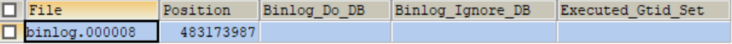

# [mysql基于binlog进行数据恢复](https://segmentfault.com/a/1190000041920325)

## 前言

偶然的机会朋友说他部门的数据库误删了，想恢复回来，他百度了一些资料，也跟着试了。但发现会报一些错，于是他就找我帮忙看一下。对于我来说，因为公司的数据库都是DBA在管控，平时都没机会操作，基本上都停留在理论上。

但为了维持我在他心中的光辉形象，不能让他看出我是个半吊子，我就装逼让他把错误的信息发给我一下，我好百度一下。于是就有今天这么一篇水文出现。

朋友的数据库是基于docker搭建的，朋友一度怀疑是因为docker原因导致他恢复不成功。

## 数据恢复之binlog前置知识

**注：** 本文的例子为demo示例，mysql基于docker搭建。版本为mysql 8.0

> 1、先确认mysql是否已经开启binlog

```gams
SHOW VARIABLES LIKE '%log_bin%';
```


**注：** mysql8.0默认就已经开启binlog，且binlog-format为row格式。如果是mysql8.0以下，需通过/etc/my.cnf进行配置开启。配置内容如下

```ini
##配置binlog日志路径以及日志文件名前缀、生成的日志格式为：binlog.000001
log-bin=/var/lib/mysql/binlog
##注意配置server-id，保证唯一性
server-id=1
##binlog格式，有3种statement,row,mixed
binlog-format=row
```

> 2、查看binlog日志列表

```crmsh
SHOW MASTER LOGS;
```


> 3、查看当前binlog以及当前位置

```crmsh
SHOW MASTER STATUS; 
```



> 4、查看binlog内容

```1c
SHOW BINLOG EVENTS IN 'binlog.000008'; 
```


> 5、指定位点查询，比如从pos为746开始查询

```sql
SHOW BINLOG EVENTS IN 'binlog.000008' FROM 746;
```


> 6、指定位点分页查询

```apache
SHOW BINLOG EVENTS IN 'binlog.000008' FROM 746 LIMIT 0,5
```


> 7、刷新产生新binlog

```abnf
FLUSH LOGS; 
```


### 数据恢复案例

有这么一张用户表


假设我们误删了lisi这条记录

现在我们想把lisi恢复回来。

> 1、查看binlog

```crmsh
SHOW MASTER LOGS; 
```


> 2、查看binlog事件

```1c
SHOW BINLOG EVENTS IN 'binlog.000010'; 
```


> 3、通过指定位置恢复数据

```awk
/usr/bin/mysqlbinlog  --start-position=65945--stop-position=66150 --database=demo_test  /var/lib/mysql/binlog.000010 | /usr/bin/mysql -uroot -p123456 -v demo_test
```

**注：**

```xml
/usr/bin/mysqlbinlog 为binlog命令
--start-position=65945为恢复的开始位置
--stop-position=66150为恢复的结束位置
--database=demo_test 指定数据库为demo_test
/var/lib/mysql/binlog.000010 为binlog日志

| /usr/bin/mysql -uroot -p123456 -v demo_test
通过管道连接数据库，并通过-v显示详细信息
```

此时执行下去就会可能会出现

```subunit
ERROR 1062 (23000) at line 19: Duplicate entry '1' for key 't_user.PRIMARY'
```

这个报错也是朋友出现的问题。这种看字面的意思就是出现主键冲突了，此时的办法有2种

**a、** 方法一：将数据库产生冲突的记录删除，然后再执行恢复语句。此时查看数据库


就会发现数据已经恢复回来了

**b、** 方法二：就是将binlog导出成sql语句，将insert语句改成replace into。

具体操作如下：

1、将binlog内容输入到一个sql文件

```awk
/usr/bin/mysqlbinlog  --start-position=65945 --stop-position=66150 --database=demo_test --base64-output=decode-rows -v  /var/lib/mysql/binlog.000010 --result-file=/var/lib/mysql/binlog000010.sql
```

2、将生成的sql文件拷贝到宿主机

```awk
docker cp e0b7fb702f75:/var/lib/mysql/binlog000010.sql /
```

3、导出来的文件内容如下


**注：** 如果不加--base64-output=decode-rows，则输出来的内容为base64加密内容

4、将insert into 改成replace into

5、将改好的sql语句重新导入到docker里面

```awk
docker cp /binlog000010.sql  e0b7fb702f75:/var/lib/mysql
```

6、执行sql语句

```awk
mysql -uroot -p123456 -f </var/lib/mysql/binlog000010.sql
```

> 4、通过时间恢复数据

先通过如下命令，查看时间点

```awk
/usr/bin/mysqlbinlog --no-defaults /var/lib/mysql/binlog.000010 > /var/lib/mysql/bin_log000010.sql
```

**注：** 因日志比较多，就先导入到文件再查看


执行如下语句进行恢复

```awk
/usr/bin/mysqlbinlog --no-defaults --start-datetime="2022-04-25 16:10:00" --stop-datetime="2022-04-25 16:11:00" --database=demo_test /var/lib/mysql/binlog.000010 | /usr/bin/mysql -uroot -p123456 -v demo_test
```

**注：**

```ini
--start-datetime="2022-04-25 16:10:00" 为恢复的开始时间
-stop-datetime="2022-04-25 16:11:00" 为恢复的结束时间
```

执行语句，观察数据库，可以发现数据同样恢复回来


## 总结

虽然以前就看过基于mysqlbinlog恢复数据的八股文，但一直没有去尝试。刚好借朋友这次机会，尝试了一把。本文算是一次记录吧。真的应了一句话纸上得来终觉浅,绝知此事要躬行。