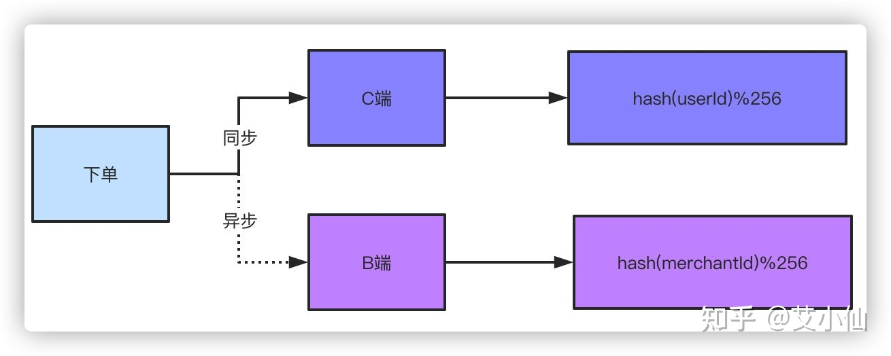

# 百亿级数据分表后怎么分页查询

当业务规模达到一定规模之后，像淘宝日订单量在5000万单以上，美团3000万单以上。数据库面对海量的数据压力，分库分表就是必须进行的操作了。而分库分表之后一些常规的查询可能都会产生问题，最常见的就是比如分页查询的问题。一般我们把分表的字段称作shardingkey，比如订单表按照用户ID作为shardingkey，那么如果查询条件中不带用户ID查询怎么做分页？又比如更多的多维度的查询都没有shardingkey又怎么查询？

### **唯一主键**

一般我们数据库的主键都是自增的，那么分表之后主键冲突的问题就是一个无法避免的问题，最简单的办法就是以一个唯一的业务字段作为唯一的主键，比如订单表的订单号肯定是全局唯一的。

常见的分布式生成唯一ID的方式很多，最常见的雪花算法Snowflake、滴滴Tinyid、美团Leaf。以雪花算法举例来说，一毫秒可以生成**4194304**多个ID。

**第一位**不使用，默认都是0，**41位时间戳**精确到毫秒，可以容纳69年的时间，**10位工作机器ID**高5位是数据中心ID，低5位是节点ID，**12位序列号**每个节点每毫秒累加，累计可以达到2^12 4096个ID。

### **分表**

第一步，分表后要怎么保证订单号的唯一搞定了，现在考虑下分表的问题。首先根据自身的业务量和增量来考虑分表的大小。

举个例子，现在我们日单量是10万单，预估一年后可以达到日100万单，根据业务属性，一般我们就支持查询半年内的订单，超过半年的订单需要做归档处理。

那么以日订单100万半年的数量级来看，不分表的话我们订单量将达到100万X180=1.8亿，以这个数据量级部分表的话肯定单表是扛不住的，就算你能扛RT的时间你也根本无法接受吧。根据经验单表几百万的数量对于数据库是没什么压力的，那么只要分256张表就足够了，1.8亿/256≈70万，如果为了保险起见，也可以分到512张表。那么考虑一下，如果业务量再增长10倍达到1000万单每天，分表1024就是比较合适的选择。

通过分表加上超过半年的数据归档之后，单表70万的数据就足以应对大部分场景了。接下来对订单号hash，然后对256取模的就可以落到具体的哪张表了。

那么，因为唯一主键都是以订单号作为依据，以前你写的那些根据主键ID做查询的就不能用了，这就涉及到了历史一些查询功能的修改。不过这都不是事儿对吧，都改成以订单号来查就行了。这都不是问题，问题在我们的标题说的点上。

### **C端查询**

说了半天，总算到了正题了，那么分表之后查询和分页查询的问题怎么解决？

首先说带shardingkey的查询，比如就通过订单号查询，不管你分页还是怎么样都是能直接定位到具体的表来查询的，显然查询是不会有什么问题的。

如果不是shardingkey的话，上面举例说的以订单号作为shardingkey的话，像APP、小程序这种一般都是通过用户ID查询，那这时候我们通过订单号做的sharding怎么办？很多公司订单表直接用用户ID做shardingkey，那么很简单，直接查就完了。那么订单号怎么办，一个很简单的办法就是在订单号上带上用户ID的属性。举个很简单的例子，原本41位的时间戳你觉得用不完，用户ID是10位的，订单号的生成规则带上用户ID，落具体表的时候根据订单号中10位用户ID hash取模，这样无论根据订单号还是用户ID查询效果都是一样的。

*当然，这种方式只是举例，具体的订单号生成的规则，多少位，包含哪些因素根据自己的业务和实现机制来决定。*

好，那么无论你是订单号还是用户ID作为shardingkey，按照以上的两种方式都可以解决问题了。那么还有一个问题就是如果既不是订单号又不是用户ID查询怎么办？最直观的例子就是来自商户端或者后台的查询，商户端都是以商户或者说卖家的ID作为查询条件来查的，后台的查询条件可能就更复杂了，像我碰到的有些后台查询条件能有几十个，这怎么查？？？别急，接下来分开说B端和后台的复杂查询。

现实中真正的流量大头都是来自于用户端C端，所以本质上解决了用户端的问题，这个问题就解了大半，剩下来自商户卖家端B端、后台支持运营业务的查询流量并不会很大，这个问题就好解。

### **其他端查询**

针对B端的非shardingkey的查询有两个办法解决。

**双写**，双写就是下单的数据落两份，C端和B端的各自保存一份，C端用你可以用单号、用户ID做shardingkey都行，B端就用商家卖家的ID作为shardingkey就好了。有些同学会说了，你双写不影响性能吗？因为对于B端来说轻微的延迟是可以接受的，所以可以采取异步的方式去落B端订单。你想想你去淘宝买个东西下单了，卖家稍微延迟个一两秒收到这个订单的消息有什么关系吗？你点个外卖商户晚一两秒收到这个订单有什么太大影响吗？

这是一个解决方案，另外一个方案就是走**离线数仓或者ES**查询，订单数据落库之后，不管你通过binlog还是MQ消息的形式，把数据同步到数仓或者ES，他们支持的数量级对于这种查询条件来说就很简单了。同样这种方式肯定是稍微有延迟的，但是这种可控范围的延迟是可以接受的。

而针对管理后台的查询，比如运营、业务、产品需要看数据，他们天然需要复杂的查询条件，同样走ES或者数仓都可以做得到。如果不用这个方案，又要不带shardingkey的分页查询，兄弟，这就只能扫全表查询聚合数据，然后手动做分页了，但是这样查出来的结果是有限制的。

比如你256个片，查询的时候循环扫描所有的分片，每个片取20条数据，最后聚合数据手工分页，那必然是不可能查到全量的数据的。

### **总结**

分库分表后的查询问题，对于有经验的同学来说其实这个问题都知道，但是我相信其实大部分同学做的业务可能都没来到这个数量级，分库分表可能都停留在概念阶段，面试被问到后就手足无措了，因为没有经验不知道怎么办。

分库分表首先是基于现有的业务量和未来的增量做出判断，比如拼多多这种日单量5000万的，半年数据得有百亿级别了，那都得分到4096张表了对吧，但是实际的操作是一样的，对于你们的业务分4096那就没有必要了，根据业务做出合理的选择。

对于基于shardingkey的查询我们可以很简单的解决，对于非shardingkey的查询可以通过落双份数据和数仓、ES的方案来解决，当然，如果分表后数据量很小的话，建好索引，扫全表查询其实也不是什么问题。