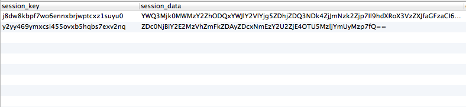

Associating Django users with their sessions
============================================

When writing a Django application that authenticates users using sessions, you’ll often want to have some way of finding all of the active sessions for a particular user. An example use case might be finding all existing user sessions and deleting them after a password change, ensuring there isn’t anyone still able to access your site via an old login session.

Ultimately, you’d want to be able to do something like this:

    def delete_user_sessions(user):
        user.sessions.delete()

This is a bit difficult with out-of-the-box Django, as session data is stored as a serialised hash, with no direct association with a particular user.

  

Example data from the default \`django_session\` table.

One solution is to iterate through every single stored session, deserialise the data it contains, and search the user ID from the extracted data against the ID of the user we’re concerned with. This method is obviously quite inefficient and on a system with many concurrent sessions, things can get pretty slow - we’re doing a full table scan every time.

Possible solutions
------------------

A couple of alternate solutions were proposed in [this Stack Overflow thread](http://stackoverflow.com/questions/235950/how-to-lookup-django-session-for-a-particular-user):

1.  Use the user’s `last_login_date` to restrict the scope of the full table scan when searching for matching sessions; or
2.  Add a `user_id` parameter to the `django_session` table (through forking the `django.contrib.session` code).

The first solution doesn’t really solve the performance issue of iterating and deserialising. It also feels like we could run in to trouble if we make a mistake calculating the date range to search across, or if we decided to change the expiration length for our sessions.

The second solution is better, but it’s a bit of a code smell as we’re duplicating core Django code. Not only is the duplication itself poor coding practice, we’re going to be overriding any future updates to `django.contrib.session` that are shipping with newer versions of Django.

Proposed solution
-----------------

My solution for this works on the assumption that you’re only concerned with logged-in user sessions (ie, you’re not worried about anonymous user sessions), which should be the most common case.

It’s also assumes that you’re using either `django.contrib.sessions.backends.db` or `django.contrib.sessions.backends.cached_db` as your `SESSION_ENGINE`. `django.contrib.sessions.backends.db` is the default with Django, so if you haven’t changed anything on this front, you’re all set.

First, we create a database model to link a `User` to a `Session`:

    from django.conf import settings
    from django.db import models
    
    from django.contrib.sessions.models import Session

​    
    class UserSession(models.Model):
        user = models.ForeignKey(settings.AUTH_USER_MODEL)
        session = models.ForeignKey(Session)    

Then, we simply save an instance of this mapping model every time a user logs in, through the use of Django’s `user_logged_in` signal.

    from django.contrib.auth.signals import user_logged_in

​    
    def user_logged_in_handler(sender, request, user, **kwargs):
        UserSession.objects.get_or_create(
            user = user,
            session_id = request.session.session_key
        )

​    
    user_logged_in.connect(user_logged_in_handler)

That’s really all we need to do to keep the user associated with their sessions. Now, we can implement `delete_user_sessions()` like this:

    from .models import UserSession
    
    def delete_user_sessions(user):
        user_sessions = UserSession.objects.filter(user = user)
        for user_session in user_sessions:
            user_session.session.delete()

Because of the way Django’s `ForeignKey` relations work on deletion, calling `user_session.session.delete()` will also remove the associated `UserSession` object. This will also be the case if you’re cleaning up expired sessions through a cron job or similar.