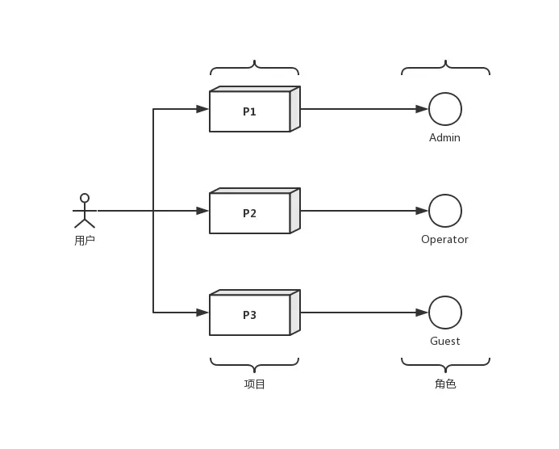
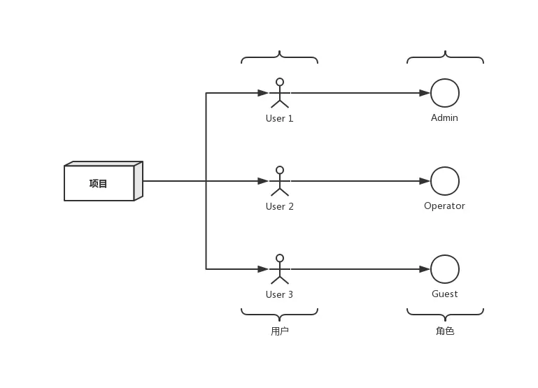
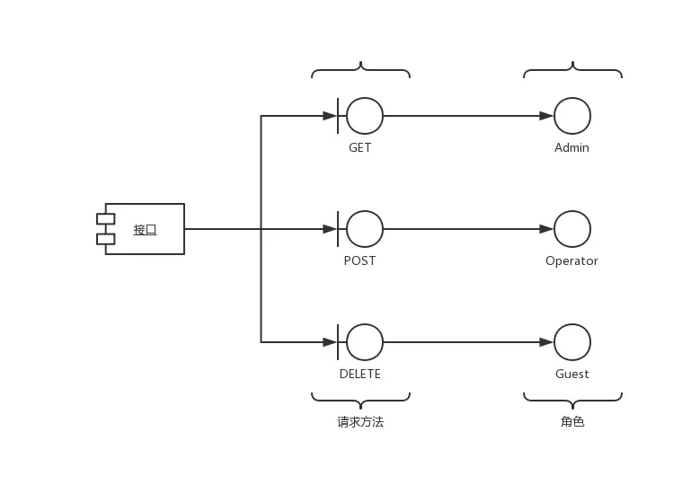

# Django - 权限系统设计与实现

## 背景

权限系统在后台中不可避免，本文分享一下我们的权限系统实现方案。

在分享前先简单介绍一下我们的平台业务。我们是质量部，我们的平台对接了多个业务部门，因此需要实现：

- 多用户
- 多项目
- 3 种角色

不同用户在不同部门的项目中拥有一种角色，每种角色对不同的接口有不同的操作权限，例如：

- 只有 Admin 能够删除数据
- 所有用户都有数据查看权限
- 只有 Operator 能够修改数据

以上就是简化后的权限系统的需求，下面讲讲实现方案。

## 设计与实现

在 [Django - 模型序列化返回自然主键值](https://juejin.im/post/5cfcaac1e51d4510835e0272#heading-3) 一文中我们了解过 DRF 的序列化模块，除了序列化，DRF 还封装好了很多好用的功能，比如我们目前平台的 `APIView` 就是继承自 DRF 的 `APIView` 类，还有分页类（Pagination）和权限控制类（Permission）等等。

我们实现权限控制的方案就借鉴了 DRF 的 `DjangoModelPermission` 类。

> Django 的权限模块其实已经有 `User`，`Group`，`Permission` 数据模型以及关联关系，之所以不用官方的权限也不直接用 DRF 的权限模块是因为这两者都基于数据模型的 CURD 做判断，可配置但配置与数据迁移相对麻烦，重点是业务不需要精细与灵活的权限配置，因此没有采用。

### 角色关系

用户在不同项目中拥有不同角色，同时一个项目也会有多个用户，因此用户、项目与角色的关系为：由**用户与项目组成组合主键**，对应一个角色。

用户-项目-角色关系：



项目-用户-角色关系：



一张表可以输出一个用户在不同产品中的角色，以及一个产品中的所有用户与对应的权限两个维度信息，方便从两种维度对角色进行配置。

#### 数据模型

```python
from django.db import models
from django.conf import settings
from myapp.codes import role

class UserProjectRole(models.Model):
    """用户-项目-角色关系表"""
    user = models.ForeignKey(settings.AUTH_USER_MODEL, on_delete=models.CASCADE)
    project = models.ForeignKey('myapp.Project', on_delete=models.CASCADE)
    role = models.IntegerField(default=role.GUEST)

    class Meta:
        db_table = 'myapp_user_project_role'
        unique_together = ['user', 'project']
```

### 角色与 Session

虽然一个用户在不同的项目拥有不同的角色，但是用户同时只能访问一个项目，所以可以直接将当前产品以及对应的角色直接存于该用户的 Session 中，减少频繁查询数据库的过程。

#### 代码实现

```python
def get_or_create_role(user_id, project_id, session, default_role=role.GUEST):
    """根据session获取当前用户的角色"""
    role = session.get('role')
    if not role:
        role_rel_obj, _ = AuthGroup.objects.get_or_create(
                              user_id=user_id,
                              project_id=project_id,
                              default={'role': default_role})
        session['role'] = role_rel_obj.role
        
    return role
```

### 角色初始化

在用户首次选择某项目时，向 `myapp_user_project_role` 表中插入一条数据。

值得注意的是，Django 的 `auth_user` 表中有现成的字段可以用于判断用户是否为管理员。我以 `auth_user.is_staff == 1` 为管理员，管理员权限只可通过 Django 的 `admin` 站点进行修改，确保管理员用户不会被随便升级降级。

用户若是管理员，则插入 `admin` 角色；否则插入 `guest` 角色。`Operator` 角色通过配置接口进行创建。

#### 代码实现

```python
class SelectProject(MyAPIView):
    def post(self, request, project_id):
        """选择项目"""
        default_role = role.ADMIN if is_admin(request.user) else role.GUEST
        role_rel_obj, _ = UserProjectRole.objects.get_or_create(
                              user=request.user,
                              project_id=project_id,
                              defaults={'role': default_role})
        request.session['role'] = role_rel_obj.role
        ...
```

### 权限关系

权限主要指对各接口发送到不同请求方法的操作权限。

接口-请求方法-角色关系：

  

#### DRF 的 DjangoModelPermission 类

`DjangoModelPermission` 完整源码可访问其 [源码](https://github.com/encode/django-rest-framework/blob/master/rest_framework/permissions.py#L162)。

现在我们分析一下这个类的实现。

首先是 docstring 中的描述：It ensures that the user is authenticated, and has the appropriate `add`/`change`/`delete` permissions on the model.，以及一个请求类型与权限的映射关系结构：

```python
perms_map = {
    'GET': [],
    'OPTIONS': [],
    'HEAD': [],
    'POST': ['%(app_label)s.add_%(model_name)s'],
    'PUT': ['%(app_label)s.change_%(model_name)s'],
    'PATCH': ['%(app_label)s.change_%(model_name)s'],
    'DELETE': ['%(app_label)s.delete_%(model_name)s'],
}
```

可以看到，这个权限类是根据数据模型的 CURD 与请求类型的关系进行权限控制。

然后看看两个类方法的定义：

- `get_required_permissions`：给出一个请求类型，返回该请求类型需要的权限列表
- `has_permission`：判断用户是否有权限执行本次请求

`has_permission` 方法在父类 `BasePermission` 中定义，返回 `True` 则表示有权限，否则会在 `APIView` 中被捕获，返回 `403` 。

有了大概的逻辑，我们就能重写一个 `RolePermissions` 类。

#### 代码实现

我们既然直接针对接口的不同请求方法做控制，那么我们就需要定义每个请求方法对应的权限列表。为简化写法，我把列表改为最小需要的权限：

```python
class MyAPI(MyAPIView):
    min_perms_map = {
        'POST': role.OPERATOR,
        'DELETE': role.ADMIN,
    }
```

将 `get_required_permissions` 改写为根据最小权限返回一个权限列表：

```python
def get_required_permissions(perms_map, allowed_methods, method):
    """
    接收 APIView 配置的 min_perms_map 以及发送的请求方法(Method)，返回允许请求的
    角色列表。如果 APIView 中未对 method 进行权限配置，则视为所有角色都用户该
    method 的权限。
    """
    if method not in perms_map:
        if method not in allowed_methods:
            raise exceptions.MethodNotAllowed(method)
        return list(range(1, role.GUEST + 1))
    return list(range(1, perms_map[method] + 1))
```

`has_perms` 方法在 Django的 User 数据模型中定义，无法重写。直接新建一个普通方法 `has_perms` 去获取本次请求对应的权限是否符合：

```python
def has_perms(request, perms: list):
    """判断用户在项目中的权限"""
    try:
        role = get_or_create_role(request.user.pk, request.session)
        if not role:
            return False
        if not perms or role in perms:
            return True
        return False
    except:
        return False
```

#### 设置为默认 permission 类

因为 `RolePermission` 类在我们的应用生成之后才初始化，因此不能配置在 `settings.py` 中。

我的解决方案是重写一个 `MyAPIView` 类，继承自 DRF 的 `APIView` 类。在该类中配置：

```python
from rest_framework.views import APIView
from myapp.permissions import RolePermissions

class MyAPIView(APIView):
    permission_class = [RolePermissions]
```

然后每一个接口都继承自 `MyAPIView` 即可。

### 单元测试

在不关注角色的用例中，我们可以为 `MyAPIView` 类写一个开关，例如在变量 `RUN_TEST` 为 `True` 时不配置 `permission_class` 来绕过权限判断的限制：

```python
class MyAPIView(APIView):
    if RUN_TEST is False:
        permission_class = [RolePermissions]
```

## 总结

业务不同，基于角色的权限控制（RBAC）也有不同的实现方案。对于更精细化的权限管理，还需要设计更复杂的权限关系。选择适合自己业务的方案。