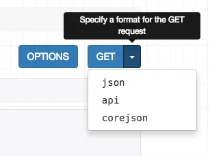

#  Django REST framework 教程

## 〇、快速开始

我们将要构建一个简单的API，用来允许管理员用户查看和编辑系统中的用户或用户组。

### 启动项目

新建一个Django项目，命名为 `tutorial`, 然后启动一个新的app, 命名为 `quickstart`。

```shell
# Create the project directory
mkdir tutorial
cd tutorial

# Create a virtualenv to isolate our package dependencies locally
virtualenv env
source env/bin/activate  # On Windows use `env\Scripts\activate`

# Install Django and Django REST framework into the virtualenv
pip install django
pip install djangorestframework

# Set up a new project with a single application
django-admin startproject tutorial .  # Note the trailing '.' character
cd tutorial
django-admin startapp quickstart
cd ..
```

项目目录结构如下:

```shell
$ pwd
<some path>/tutorial
$ find .
.
./manage.py
./tutorial
./tutorial/__init__.py
./tutorial/quickstart
./tutorial/quickstart/__init__.py
./tutorial/quickstart/admin.py
./tutorial/quickstart/apps.py
./tutorial/quickstart/migrations
./tutorial/quickstart/migrations/__init__.py
./tutorial/quickstart/models.py
./tutorial/quickstart/tests.py
./tutorial/quickstart/views.py
./tutorial/settings.py
./tutorial/urls.py
./tutorial/wsgi.py
```

使用项目的命名空间，以避免与其他外部模块产生冲突（这一点，将在其他部分提到）。

现在，同步你的数据库:

```bash
python manage.py migrate
```

接下来，创建一个初始用户，名称为 `admin`，密码是`password123`。在稍后的示例中，我们将为该用户进行身份认证。

```bash
python manage.py createsuperuser --email admin@example.com --username admin
```

确保你已经设置完数据库和初始用户后，我们将开始继续编码...

### 序列化器

第一步，我们将要定义一些序列化器。新建一个模块，名为 `tutorial/quickstart/serializers.py`。

```python
from django.contrib.auth.models import User, Group
from rest_framework import serializers


class UserSerializer(serializers.HyperlinkedModelSerializer):
    class Meta:
        model = User
        fields = ('url', 'username', 'email', 'groups')


class GroupSerializer(serializers.HyperlinkedModelSerializer):
    class Meta:
        model = Group
        fields = ('url', 'name')
```

注意到在上面的case中，我们使用了超链接关系 -- `HyperlinkedModelSerializer`。 你也可以使用主键或其他各种关系，但超链接是一种很好的RESTful设计。

### 视图

下面，编写一些视图。打开`tutorial/quickstart/views.py` ，输入下面的内容：

```python
from django.contrib.auth.models import User, Group
from rest_framework import viewsets
from tutorial.quickstart.serializers import UserSerializer, GroupSerializer


class UserViewSet(viewsets.ModelViewSet):
    """
    API endpoint that allows users to be viewed or edited.
    """
    queryset = User.objects.all().order_by('-date_joined')
    serializer_class = UserSerializer


class GroupViewSet(viewsets.ModelViewSet):
    """
    API endpoint that allows groups to be viewed or edited.
    """
    queryset = Group.objects.all()
    serializer_class = GroupSerializer
```

与单纯的编写很多视图相比，我们更倾向于将所有通用的行为组织到`ViewSets`中。

如果需要的话，我们很容易把它分散到单独的视图中。但使用视图集可以使逻辑更有组织性，并显得更简洁。

### URLs

接下来，开始组织API URLs。打开 `tutorial/urls.py`...

```python
from django.urls import include, path
from rest_framework import routers
from tutorial.quickstart import views

router = routers.DefaultRouter()
router.register(r'users', views.UserViewSet)
router.register(r'groups', views.GroupViewSet)

# Wire up our API using automatic URL routing.
# Additionally, we include login URLs for the browsable API.
urlpatterns = [
    path('', include(router.urls)),
    path('api-auth/', include('rest_framework.urls', namespace='rest_framework'))
]
```

因为我们使用时图集代替了视图，所以只需要把视图集注册到router类中，就可以为API自动生成URL conf。

同样，如果需要对API URLs进行更多的控制，可以直接使用常规的基于类的视图，并显式地编写url conf。

最后，我们将包含默认的登录和注销视图，以用于可浏览的API。这是可选的，但是如果您的API需要身份验证，并且您想要使用可浏览的API，那么这很有用。

### 分页器

分页器允许你控制每页返回的数据条数。添加以下配置到 `tutorial/settings.py`中使之生效。

```python
REST_FRAMEWORK = {
    'DEFAULT_PAGINATION_CLASS': 'rest_framework.pagination.PageNumberPagination',
    'PAGE_SIZE': 10
}
```

### 设置

添加 `'rest_framework'` 到 `INSTALLED_APPS`中。这项配置位于 `tutorial/settings.py`中。

```python
INSTALLED_APPS = (
    ...
    'rest_framework',
)
```

好了，到这里我们就完成了。

### 测试我们的 API

接下来我们准备测试刚刚构建的API。 键入以下命令启动server。

```
python manage.py runserver
```

我们可以通过类似`curl`的命令行工具访问接口...

```bash
bash: curl -H 'Accept: application/json; indent=4' -u admin:password123 http://127.0.0.1:8000/users/
{
    "count": 2,
    "next": null,
    "previous": null,
    "results": [
        {
            "email": "admin@example.com",
            "groups": [],
            "url": "http://127.0.0.1:8000/users/1/",
            "username": "admin"
        },
        {
            "email": "tom@example.com",
            "groups": [                ],
            "url": "http://127.0.0.1:8000/users/2/",
            "username": "tom"
        }
    ]
}
```

或者使用[httpie](https://github.com/jakubroztocil/httpie#installation), ...

```bash
bash: http -a admin:password123 http://127.0.0.1:8000/users/

HTTP/1.1 200 OK
...
{
    "count": 2,
    "next": null,
    "previous": null,
    "results": [
        {
            "email": "admin@example.com",
            "groups": [],
            "url": "http://localhost:8000/users/1/",
            "username": "paul"
        },
        {
            "email": "tom@example.com",
            "groups": [                ],
            "url": "http://127.0.0.1:8000/users/2/",
            "username": "tom"
        }
    ]
}
```

再或者直接通过浏览器访问 `http://127.0.0.1:8000/users/`...

  

如果你通过浏览器访问接口，确保再右上角先登录。

Great, that was easy!

如果你想要对 REST framework 怎样工作有更深刻的理解，查看教程部分, 或者查看 [API 指南](http://www.sinodocs.cn/#api-guide)部分。

## 一、 序列化

### 介绍

该教程将为你演示如何构建一个类似于pastebin的代码高亮的web API。在这个过程中，我们将会向你介绍构成REST framework的各种组件，并帮助你更深刻的理解它是怎样工作的。

教程或许有一点深度，所以在你开始之前，可以先准备一些饼干和啤酒。如果你只是想要快速的浏览一下，你可以直接查看 [快速开始](http://www.sinodocs.cn/quickstart/)章节。

> **注意**: 本教程中的代码，可以直接到GitHub上的 [encode/rest-framework-tutorial](https://github.com/encode/rest-framework-tutorial)仓库查看。 完整版的实现将被作为一个线上的沙盒版本用于测试，你可以[在这里](https://restframework.herokuapp.com/)查看。

### 构造一个新的环境

首先，我们使用[virtualenv](http://www.virtualenv.org/en/latest/index.html)构建一个新的虚拟环境。它可以使我们的包配置与其他正在使用的项目很好的隔离。

```bash
virtualenv env
source env/bin/activate
```

Now that we're inside a virtualenv environment, we can install our package requirements.

```bash
pip install django
pip install djangorestframework
pip install pygments  # We'll be using this for the code highlighting
```

**注意:** 想要退出虚拟环境，只需要键入 `deactivate`命令即可。更多信息可以参考 [virtualenv documentation](http://www.virtualenv.org/en/latest/index.html).

### 开始

Okay，现在我们可以开始了 首先，新建一个项目。

```bash
cd ~
django-admin startproject tutorial
cd tutorial
```

然后新建一个app。我们将基于这个app构建Web api。

```
python manage.py startapp snippets
```

将新的app `snippets` 和 `rest_framework` app 添加到 `INSTALLED_APPS`中。 编辑`tutorial/settings.py` 文件，添加以下内容:

```python
INSTALLED_APPS = (
    ...
    'rest_framework',
    'snippets.apps.SnippetsConfig',
)
```

### 创建一个model

接下来，我们将创建一个简单的 `Snippet` 模型，用来存储code片段。编辑 `snippets/models.py` 文件，注意: 好的编码应该及时添加注释，关于这一点，你在我们的Github仓库上也可以看到。这里为了更好的关注代码本身，我们将注释先省略掉了。

```python
from django.db import models
from pygments.lexers import get_all_lexers
from pygments.styles import get_all_styles

LEXERS = [item for item in get_all_lexers() if item[1]]
LANGUAGE_CHOICES = sorted([(item[1][0], item[0]) for item in LEXERS])
STYLE_CHOICES = sorted((item, item) for item in get_all_styles())


class Snippet(models.Model):
    created = models.DateTimeField(auto_now_add=True)
    title = models.CharField(max_length=100, blank=True, default='')
    code = models.TextField()
    linenos = models.BooleanField(default=False)
    language = models.CharField(choices=LANGUAGE_CHOICES, default='python', max_length=100)
    style = models.CharField(choices=STYLE_CHOICES, default='friendly', max_length=100)

    class Meta:
        ordering = ('created',)
```

我们还需要为snippet model创建一个初始化的migration，然后与数据库关联并同步。

```bash
python manage.py makemigrations snippets
python manage.py migrate
```

### 新建一个Serializer class

构造Web API，第一件事情就是提供一个为snippet 实例序列化和反序列化的方法，比如将它序列化为`json`。我们可以通过声明一个serializers来达成目的，这种方式和Django's forms很类似。在`snippets` 路径下，创建文件 `serializers.py` ，并添加下面的内容。

```python
from rest_framework import serializers
from snippets.models import Snippet, LANGUAGE_CHOICES, STYLE_CHOICES

class SnippetSerializer(serializers.Serializer):
    id = serializers.IntegerField(read_only=True)
    title = serializers.CharField(required=False, allow_blank=True, max_length=100)
    code = serializers.CharField(style={'base_template': 'textarea.html'})
    linenos = serializers.BooleanField(required=False)
    language = serializers.ChoiceField(choices=LANGUAGE_CHOICES, default='python')
    style = serializers.ChoiceField(choices=STYLE_CHOICES, default='friendly')

    def create(self, validated_data):
        """
        Create and return a new `Snippet` instance, given the validated data.
        """
        return Snippet.objects.create(**validated_data)

    def update(self, instance, validated_data):
        """
        Update and return an existing `Snippet` instance, given the validated data.
        """
        instance.title = validated_data.get('title', instance.title)
        instance.code = validated_data.get('code', instance.code)
        instance.linenos = validated_data.get('linenos', instance.linenos)
        instance.language = validated_data.get('language', instance.language)
        instance.style = validated_data.get('style', instance.style)
        instance.save()
        return instance
```

`SnippetSerializer class`中的第一部分定义了有哪些字段需要被序列化/反序列化。方法 `create()` 和 `update()` 定义了当调用`serializer.save()`方法时，`serializer`应该怎样构造实例。

一个serializer class 和Django 的`Form` class是很相似的。这其中包括一些校验标志也是很相似的，比如：`required`, `max_length` 和 `default`等。

这些字段标志可以控制特定情形下serializer的表现，比如应该在什么时候渲染HTML。 配置 `{'base_template': 'textarea.html'}` 字段和在Django `Form` class上使用 `widget=widgets.Textarea` 是等价的。这对于控制 browsable API 应该怎样表现是非常有用的，这一点在后面的教程中也可以看到。

我们也可以直接使用 `ModelSerializer` class来节省我们的时间，它的具体用法，在教程后面的部分将会有介绍。现在我们先使用定制化的serializer。

### 使用 serializer

在更近一步之前，我们先来熟悉一下Serializer class。键入命令，进入Django shell环境：

```
python manage.py shell
```

导入一些必要的依赖，然后构建两个snippet实例。

```python
from snippets.models import Snippet
from snippets.serializers import SnippetSerializer
from rest_framework.renderers import JSONRenderer
from rest_framework.parsers import JSONParser

snippet = Snippet(code='foo = "bar"\n')
snippet.save()

snippet = Snippet(code='print("hello, world")\n')
snippet.save()
```

现在，我们获得了两个snippet的实例对象，可以操作。让我们先来把其中一个实例化。

```python
serializer = SnippetSerializer(snippet)
serializer.data
# {'id': 2, 'title': '', 'code': 'print("hello, world")\n', 'linenos': False, 'language': 'python', 'style': 'friendly'}
```

可以看到，我们已经将snippet实例转化成了Python原生数据类型。进一步将数据转化成 `json`。

```python
content = JSONRenderer().render(serializer.data)
content
# b'{"id": 2, "title": "", "code": "print(\\"hello, world\\")\\n", "linenos": false, "language": "python", "style": "friendly"}'
```

反序列化的过程和序列化过程是相似的。首先我们将一个流解析成Python原始数据类型...

```python
import io

stream = io.BytesIO(content)
data = JSONParser().parse(stream)
```

...然后将数据存储成一个对象实例。

```python
serializer = SnippetSerializer(data=data)
serializer.is_valid()
# True
serializer.validated_data
# OrderedDict([('title', ''), ('code', 'print("hello, world")\n'), ('linenos', False), ('language', 'python'), ('style', 'friendly')])
serializer.save()
# <Snippet: Snippet object>
```

注意这些API的工作方式和Django forms是非常相似的。当我们开始编写视图代码的时候，会更加体会到这种相似性。

我们也可以将一个查询集合进行序列化。只需要添加`many=True` 字段作为serializer的参数。

```python
serializer = SnippetSerializer(Snippet.objects.all(), many=True)
serializer.data
# [OrderedDict([('id', 1), ('title', ''), ('code', 'foo = "bar"\n'), ('linenos', False), ('language', 'python'), ('style', 'friendly')]), OrderedDict([('id', 2), ('title', ''), ('code', 'print("hello, world")\n'), ('linenos', False), ('language', 'python'), ('style', 'friendly')]), OrderedDict([('id', 3), ('title', ''), ('code', 'print("hello, world")'), ('linenos', False), ('language', 'python'), ('style', 'friendly')])]
```

### 使用 ModelSerializer

`SnippetSerializer` class 复制了大量的信息，这些信息同样存在于`Snippet`模型中。如果可以让我们的代码再简洁一点，就更好了。

与Django 提供了`Form` classes 和 `ModelForm` classes一样， REST framework 也提供了`Serializer` classes, 和 `ModelSerializer` classes。

让我们使用`ModelSerializer` class 重构序列化的过程。 编辑文件 `snippets/serializers.py`，使用以下内容代替原来的`SnippetSerializer` class：

```python
class SnippetSerializer(serializers.ModelSerializer):
    class Meta:
        model = Snippet
        fields = ('id', 'title', 'code', 'linenos', 'language', 'style')
```

序列化的一个很大的好处就在于，可以让你通过打印它来查看这个对象实例的所有字段。打开 Django shell， `python manage.py shell`，尝试以下操作：

```python
from snippets.serializers import SnippetSerializer
serializer = SnippetSerializer()
print(repr(serializer))
# SnippetSerializer():
#    id = IntegerField(label='ID', read_only=True)
#    title = CharField(allow_blank=True, max_length=100, required=False)
#    code = CharField(style={'base_template': 'textarea.html'})
#    linenos = BooleanField(required=False)
#    language = ChoiceField(choices=[('Clipper', 'FoxPro'), ('Cucumber', 'Gherkin'), ('RobotFramework', 'RobotFramework'), ('abap', 'ABAP'), ('ada', 'Ada')...
#    style = ChoiceField(choices=[('autumn', 'autumn'), ('borland', 'borland'), ('bw', 'bw'), ('colorful', 'colorful')...
```

其实，`ModelSerializer` classes 并没有做什么特殊的事情，它只是提供了创建一个序列化类的替代和简写方式：

- 自动确定的字段集。
- 简单的默认的`create()` and `update()` 方法实现。

### 使用Serializer编写常规的 Django视图

下面，我们将使用新的Serializer class来编写一些API。 我们暂时不会使用REST framework 的任何其他特性，只是编写一个常规的Django 视图。

编辑文件 `snippets/views.py` ，并添加下列内容：

```python
from django.http import HttpResponse, JsonResponse
from django.views.decorators.csrf import csrf_exempt
from rest_framework.parsers import JSONParser
from snippets.models import Snippet
from snippets.serializers import SnippetSerializer
```

API的目的是构造一个视图，可以支持列举和新建snippet对象。

```python
@csrf_exempt
def snippet_list(request):
    """
    List all code snippets, or create a new snippet.
    """
    if request.method == 'GET':
        snippets = Snippet.objects.all()
        serializer = SnippetSerializer(snippets, many=True)
        return JsonResponse(serializer.data, safe=False)

    elif request.method == 'POST':
        data = JSONParser().parse(request)
        serializer = SnippetSerializer(data=data)
        if serializer.is_valid():
            serializer.save()
            return JsonResponse(serializer.data, status=201)
        return JsonResponse(serializer.errors, status=400)
```

注意到如果在用户端没有CSRF token的情况下，使用POST方法，需要将我们的视图添加一个装饰器 `csrf_exempt`。这并不是正确和常规的做法，这里只是为了提供演示。事实上，REST framework 视图提供了灵敏的安全校验功能供使用。

我们还需要创建一个视图用户对单个snippet对象的检索、更新和删除操作。

```python
@csrf_exempt
def snippet_detail(request, pk):
    """
    Retrieve, update or delete a code snippet.
    """
    try:
        snippet = Snippet.objects.get(pk=pk)
    except Snippet.DoesNotExist:
        return HttpResponse(status=404)

    if request.method == 'GET':
        serializer = SnippetSerializer(snippet)
        return JsonResponse(serializer.data)

    elif request.method == 'PUT':
        data = JSONParser().parse(request)
        serializer = SnippetSerializer(snippet, data=data)
        if serializer.is_valid():
            serializer.save()
            return JsonResponse(serializer.data)
        return JsonResponse(serializer.errors, status=400)

    elif request.method == 'DELETE':
        snippet.delete()
        return HttpResponse(status=204)
```

最后我们需要配置路由，新建文件`snippets/urls.py`：

```python
from django.urls import path
from snippets import views

urlpatterns = [
    path('snippets/', views.snippet_list),
    path('snippets/<int:pk>/', views.snippet_detail),
]
```

同时，我们需要在项目根域目录下配置文件`tutorial/urls.py`，引入snippet app的URL配置。

```python
from django.urls import path, include

urlpatterns = [
    path('', include('snippets.urls')),
]
```

上面的示例中，有许多边界情况并没有处理，这并不影响我们将基本面展示给你。如果我们发送一个非预期的`json`字符串， 或者接收到了一个并不支持的请求，将会返回一个500 "server error" 的响应。

### 测试我们的 Web API

现在我们将启动一个简单的server，

首先退出shell...

```
quit()
```

...然后启动一个 Django server

```python
python manage.py runserver

Validating models...

0 errors found
Django version 1.11, using settings 'tutorial.settings'
Development server is running at http://127.0.0.1:8000/
Quit the server with CONTROL-C.
```

在另一个终端窗口中，我们来测试我们的服务。

测试工具，可以选用[curl](https://curl.haxx.se/) 或者 [httpie](https://github.com/jakubroztocil/httpie#installation)。Httpie 是一个用Python编写的用户友好的http库。执行命令安装：

```
pip install httpie
```

最后，我们可以获得snippets的列表：

```bash
http http://127.0.0.1:8000/snippets/

HTTP/1.1 200 OK
...
[
  {
    "id": 1,
    "title": "",
    "code": "foo = \"bar\"\n",
    "linenos": false,
    "language": "python",
    "style": "friendly"
  },
  {
    "id": 2,
    "title": "",
    "code": "print(\"hello, world\")\n",
    "linenos": false,
    "language": "python",
    "style": "friendly"
  }
]
```

或者我们可以通过指定id来检测特定的snippet实例详情：

```bash
http http://127.0.0.1:8000/snippets/2/

HTTP/1.1 200 OK
...
{
  "id": 2,
  "title": "",
  "code": "print(\"hello, world\")\n",
  "linenos": false,
  "language": "python",
  "style": "friendly"
}
```

你将会看到一个json格式的响应数据，像你在浏览器里直接访问接口看到的一样。

### 小结

到目前为止，我们进展的一切顺利。我们已经体验了类似于 Django's Forms API的序列化和反序列化的方法，还有视图的基本情况。

我们的API views并没有做什么特殊的事情，只是提供了一个 `json` 响应，并且还有一些对临界的错误和异常并没有处理，但它已经具备了一个接口的基本功能了。

接下来，我们将会在[part 2 of the tutorial](http://www.sinodocs.cn/2-requests-and-responses/)中看到很多可以做的更好的东西。

## 二、请求和响应

从现在开始，我们将真正开始覆盖REST框架的核心。我们来介绍几个基本的构建块。

### **请求对象（Request object）**

REST框架引入了Request对象,它继承自普通的HttpRequest，但能够更加灵活的解析收到的请求。Request对象的核心功能是request.data属性，这与request.POST很像，但对我们的Web API来说，更加的有用。

```python
request.POST # 只能处理表单(form)数据，只能处理“POST”方法.
request.data # 处理任意数据.可以处理'POST', 'PUT' 和 'PATCH'方法.
```

### **响应对象（Response object）**

REST框架还引入了一个Response对象，是一种TemplateResponse，它采用未呈现的内容，通过内容协商来确定正确的内容类型以返回给客户端。

```python
return Response(data) # 根据客户端的要求，把内容，生成对应的形式.
```

### **状态码（Status codes）**

在您的视图中使用数字HTTP状态代码并不利于代码的阅读，如果写错代码，也不很容易就不发现到。REST框架为每一个状态码更明确的标识符，如HTTP_400_BAD_REQUEST中的status模块。相对于使用数字标识符更好。

### **包装API视图（wrapping API views）**

REST框架提供了两种编写API视图的封装。

1. @api_view装饰器，基于方法的视图。

2. 继承APIView类，基于类的视图。


这些视图封装提供了一些功能，例如确保你的视图能够Request接收实例，并将上下文添加到Response对象，使得 内容协商（content negotiation) 可以正常的运作。

试图封装，内置了一些行为，比如：在遇到错误请求时，自动响应405 Method Not Allowed，在处理request.data时，因为输入的格式不正确，而发生的任何ParseError异常，

### 把它拉在一起

现在，让我们开始使用这些新的组件来写几个视图。

我们不再需要在views.py文件中使用JSONResponse类，所以可以删除它。然后，我们可以稍微重构我们的代码。

```python
from rest_framework import status
from rest_framework.decorators import api_view
from rest_framework.response import Response
from snippets.models import Snippet
from snippets.serializers import SnippetSerializer

@api_view(['GET', 'POST'])
def snippet_list(request):
    """
    List all code snippets, or create a new snippet.
    """
    if request.method == 'GET':
        snippets = Snippet.objects.all()
        serializer = SnippetSerializer(snippets, many=True)
        return Response(serializer.data)

    elif request.method == 'POST':
        serializer = SnippetSerializer(data=request.data)
        if serializer.is_valid():
            serializer.save()
            return Response(serializer.data, status=status.HTTP_201_CREATED)
        return Response(serializer.errors, status=status.HTTP_400_BAD_REQUEST)
```

当前的实例，相比之前的例子，有了改进：它变得，简洁了一点，并且，如果你曾经使用过Forms API，你会发现，它们非常的相识。我们也用了命名式的状态码，这让响应的状态，易于阅读。

以下是snippet的详细视图，它是views.py模块中。

```python
@api_view(['GET', 'PUT', 'DELETE'])
def snippet_detail(request, pk):
    """
    Retrieve, update or delete a code snippet.
    """
    try:
        snippet = Snippet.objects.get(pk=pk)
    except Snippet.DoesNotExist:
        return Response(status=status.HTTP_404_NOT_FOUND)

    if request.method == 'GET':
        serializer = SnippetSerializer(snippet)
        return Response(serializer.data)

    elif request.method == 'PUT':
        serializer = SnippetSerializer(snippet, data=request.data)
        if serializer.is_valid():
            serializer.save()
            return Response(serializer.data)
        return Response(serializer.errors, status=status.HTTP_400_BAD_REQUEST)

    elif request.method == 'DELETE':
        snippet.delete()
        return Response(status=status.HTTP_204_NO_CONTENT)
```

读取, 更新 或 删除读取, 更新 或 删除目前为止，你应该感觉到很熟悉——它跟一般的Django视图，没多大的区别。

值得一提的是，我们已经不再明确地，解析/定义视图中 Request/Response的内容类型。request.data会自行处理输入的json请求，当然，也能处理别的格式。同样的，我们只需返回响应对象以及数据，REST framework会帮我们，将响应内容，渲染（render）成正确的格式。

### 向我们的网址添加可选的格式后缀

现在，我们的响应，不再硬性绑定在，某一种返回格式上，利用这点优势，我们可以为API端，添加格式的后缀。使用格式后缀，可以定制我们的URLs，使它明确的指向指定的格式，这意味着，我们的API可以处理一些URLs，类似这样的格式`http://example.com/api/items/4.json`。

首先，需要添加一个format关键字参数，如下所示：

```python
def snippet_list(request, format=None):
```

还有：

```python
def snippet_detail(request, pk, format=None):
```

然后对urls.py文件，做一些修改。在现有的urls基础上，追加一套format_suffix_patterns

```python
from django.urls import path
from rest_framework.urlpatterns import format_suffix_patterns
from snippets import views

urlpatterns = [
    path('snippets/', views.snippet_list),
    path('snippets/<int:pk>', views.snippet_detail),
]

urlpatterns = format_suffix_patterns(urlpatterns)
```

我们不需要逐一地，添加对格式支持的 url 样式（patterns），这是一个简洁的方法，来快速支持特定的格式。

### 效果如何

接着，我们可以从命令行中测试我们的API，[在教程第1部分](http://www.chenxm.cc/post/289.html)中的操作一样。尽管我们对一些无效的请求，提供了很好的处理，但仍然没有太大的改变。

我们可以获取所有snippet的列表，就跟之前一样。

```bash
http http://127.0.0.1:8000/snippets/

HTTP/1.1 200 OK
...
[
  {
    "id": 1,
    "title": "",
    "code": "foo = \"bar\"\n",
    "linenos": false,
    "language": "python",
    "style": "friendly"
  },
  {
    "id": 2,
    "title": "",
    "code": "print(\"hello, world\")\n",
    "linenos": false,
    "language": "python",
    "style": "friendly"
  }
]
```

我们也可以控制响应内容的格式，通过Http中的Accept头：

```bash
http http://127.0.0.1:8000/snippets/ Accept:application/json # 请求 JSON
http http://127.0.0.1:8000/snippets/ Accept:text/html     # 请求 HTML
```

我们也可以控制响应内容的格式，通过Http中的

```bash
http http://127.0.0.1:8000/snippets.json # JSON 后缀
http://127.0.0.1:8000/snippets.api  # 可视化 API 后缀
```

同样的，我们可以控制，发送的请求类型，通过http中的用Content-Type头(header)：

```bash
# POST using form data
http --form POST http://127.0.0.1:8000/snippets/ code="print(123)"
{
  "id": 3,
  "title": "",
  "code": "print(123)",
  "linenos": false,
  "language": "python",
  "style": "friendly"
}

# POST using JSON
http --json POST http://127.0.0.1:8000/snippets/ code="print(456)"
{
    "id": 4,
    "title": "",
    "code": "print(456)",
    "linenos": false,
    "language": "python",
    "style": "friendly"
}
```

如果您--debug向上述http请求添加切换器，则可以在请求标头中查看请求类型。

现在，在Web浏览器中打开API，访问`http://127.0.0.1:8000/snippets/`。

### **可视化**

由于 API 选择响应格式，是基于客户端发起的请求，因此，当接收到来着浏览器的请求时，会默认以HTML格式来描述数据。这让API能够返回，可以网页浏览（web-browsable）的HTML表现。

拥有网页浏览（web-browsable）的API，实在是非常的有用，使得开发和使用API，变成非常便利。这也大大降低了使用壁垒，让其它开发者，更加容易的查看和使用，你的API。

## 三、基于类的视图

其实，与其使用基于方法（function based）的视图，我们更加倾向使用基于类（class based）的视图。接下来，你将看到这是一个强大的模式，是我们能够重用公共的功能，并且，帮我们保持代码[DRY](http://en.wikipedia.org/wiki/Don't_repeat_yourself)。

### 使用基于类的视图 重写我们的API

我们现在开始了。首先，重写根视图（root view），变成基于类的视图。所涉及的，只是对 views.py文件的一点重构。

```python
from snippets.models import Snippet
from snippets.serializers import SnippetSerializer
from django.http import Http404
from rest_framework.views import APIView
from rest_framework.response import Response
from rest_framework import status

class SnippetList(APIView):
    # APIView实际继承django总的View
    """
    List all snippets, or create a new snippet.
    """
    def get(self, request, format=None):
        snippets = Snippet.objects.all()
        # manay=True 用于querySet对象
        serializer = SnippetSerializer(snippets, many=True)
        return Response(serializer.data)

    def post(self, request, format=None):
        serializer = SnippetSerializer(data=request.data)
        if serializer.is_valid():
            # .save()是调用SnippetSerializer中的create()方法
            serializer.save()
            return Response(serializer.data, status=status.HTTP_201_CREATED)
        return Response(serializer.errors, status=status.HTTP_400_BAD_REQUEST)
```

至此为止，一切顺利。看起来，跟之前的案例差别不大，但我们将各个HTTP请求方法之间，做了更好的分离。接着，我们将同样的更改我们，处理片段详细的视图，继续我们的 views.py 文件：

```python
class SnippetDetail(APIView):
    """
    Retrieve, update or delete a snippet instance.
    """
    def get_object(self, pk):
        try:
            return Snippet.objects.get(pk=pk)
        except Snippet.DoesNotExist:
            raise Http404

    def get(self, request, pk, format=None):
        snippet = self.get_object(pk)
        serializer = SnippetSerializer(snippet)
        return Response(serializer.data)

    def put(self, request, pk, format=None):
        snippet = self.get_object(pk)
        serializer = SnippetSerializer(snippet, data=request.data)
        if serializer.is_valid():
            serializer.save()
            return Response(serializer.data)
        return Response(serializer.errors, status=status.HTTP_400_BAD_REQUEST)

    def delete(self, request, pk, format=None):
        snippet = self.get_object(pk)
        snippet.delete()
        return Response(status=status.HTTP_204_NO_CONTENT)
```

这看起来不错。 同样，它现在仍然非常像基于方法的视图。

我们还需要稍微重构我们的snippets/urls.py，因为我们正在使用基于类的视图。

```python
from django.urls import path
from rest_framework.urlpatterns import format_suffix_patterns
from snippets import views

urlpatterns = [
    path('snippets/', views.SnippetList.as_view()),
    path('snippets/<int:pk>/', views.SnippetDetail.as_view()),
]

urlpatterns = format_suffix_patterns(urlpatterns)
```

好的，我们完成了。 如果你运行开发服务器，一切都应该像以前一样工作。

### **使用混入mixins**

使用基于类的视图的好处是，我们可以很容易组成可重复使用的代码。

到目前为止，我们使用的创建/检索/更新/删除操作，对于我们创建的，任何模型支持的API视图将非常相似。 这些常见的行为是在REST框架的mixin类中都已经实现的。

我们来看看如何使用mixin类来构建视图。 这是我们的views.py模块了。

```python
from snippets.models import Snippet
from snippets.serializers import SnippetSerializer
from rest_framework import mixins
from rest_framework import generics

# mixins.CreateModelMixin 可以保存数据                  
# generics.GenericAPIView 继承了APIView
class SnippetList(mixins.ListModelMixin,
                  mixins.CreateModelMixin,
                  generics.GenericAPIView):
    queryset = Snippet.objects.all()
    serializer_class = SnippetSerializer

    def get(self, request, *args, **kwargs):
        # self.list是ListModelMixin的list函数
        # 功能是过滤、分页、调用serializer,将数据序列化
        return self.list(request, *args, **kwargs)

    def post(self, request, *args, **kwargs):
        return self.create(request, *args, **kwargs)
```

我们将花一点时间仔细检查这里发生的事情。我们用GenericAPIView建一个视图，并添加`ListModelMixin`和`CreateModelMixin`。

到目前为止足够简单。基类提供核心功能，mixin类提供.list()和.create()操作。然后，我们明确的将get和post方法绑定到适当的操作上。

```python
class SnippetDetail(mixins.RetrieveModelMixin,
                    mixins.UpdateModelMixin,
                    mixins.DestroyModelMixin,
                    generics.GenericAPIView):
    queryset = Snippet.objects.all()
    serializer_class = SnippetSerializer

    def get(self, request, *args, **kwargs):
        return self.retrieve(request, *args, **kwargs)

    def put(self, request, *args, **kwargs):
        return self.update(request, *args, **kwargs)

    def delete(self, request, *args, **kwargs):
        return self.destroy(request, *args, **kwargs)
```

很相似，我们再次使用GenericAPIView类来提供核心功能，并在mixin中添加.retrieve()，.update()和.destroy()方法。

### 使用通用的基于类的视图

使用mixin类，我们重写了视图，使用比以前稍少的代码，但是我们可以更进一步。 REST框架提供了一组已经混合的通用视图，我们可以使用这些通用视图来重构我们的views.py模块。

```python
from snippets.models import Snippet
from snippets.serializers import SnippetSerializer
from rest_framework import generics

class SnippetList(generics.ListCreateAPIView):
    queryset = Snippet.objects.all()
    serializer_class = SnippetSerializer

class SnippetDetail(generics.RetrieveUpdateDestroyAPIView):
    queryset = Snippet.objects.all()
    serializer_class = SnippetSerializer
```

哇，这很简洁。我们的代码看起来非常优雅。

接下来，我们将介绍本教程的第4部分，在这里我们将看看如何处理我们的API的身份验证和权限。

## 四、验证和权限

目前，我们的API对谁可以编辑或删除代码段没有任何限制。我们想要一些更高级的行为，以确保：

- 代码段始终与创建者相关联。

- 只有身份验证的用户可以创建片段。

- 只有片段的创建者可以更新或删除它。

- 未经身份验证的请求应具有完全只读访问权限。


### 将信息添加到我们的模型

我们将对我们的Snippet模型类进行一些更改。首先，我们添加几个字段。其中一个字段将用于表示创建代码段的用户。另一个字段将用于存储代码的突出显示的HTML表示。

将以下两个字段添加到Snippet模型中models.py。

```python
owner = models.ForeignKey('auth.User', related_name='snippets', on_delete=models.CASCADE)
highlighted = models.TextField()
```

我们还需要确保在保存模型时，使用pygments代码突出显示库填充突出显示的字段。

我们需要一些额外的导入：

```python
from pygments.lexers import get_lexer_by_name
from pygments.formatters.html import HtmlFormatter
from pygments import highlight
```

现在我们可以在模型类中添加一个.save()方法：

```python
def save(self, *args, **kwargs):
    """
    Use the `pygments` library to create a highlighted HTML
    representation of the code snippet.
    """
    lexer = get_lexer_by_name(self.language)
    linenos = 'table' if self.linenos else False
    options = {'title': self.title} if self.title else {}
    formatter = HtmlFormatter(style=self.style, linenos=linenos,
                              full=True, **options)
    self.highlighted = highlight(self.code, lexer, formatter)
    super(Snippet, self).save(*args, **kwargs)
```

完成这些工作后，我们需要更新我们的数据库表。通常我们将创建一个数据库迁移，为了做到这一点，但是为了本教程的目的，我们只需删除数据库并重新开始

```shell
rm -f db.sqlite3
rm -r snippets/migrations
python manage.py makemigrations snippets
python manage.py migrate
```

您可能还需要创建几个不同的用户，以用于测试API。执行此操作的最快方法是使用createsuperuser命令。

```shell
python manage.py createsuperuser
```

### 为我们的用户模型添加端点

现在我们有一些用户可以使用，我们最好将这些用户的表示添加到我们的API中。创建一个新的serializer很容易。在serializers.py添加：

```python
from django.contrib.auth.models import User

class UserSerializer(serializers.ModelSerializer):
    snippets = serializers.PrimaryKeyRelatedField(many=True, queryset=Snippet.objects.all())

    class Meta:
        model = User
        fields = ('id', 'username', 'snippets')
```

因为在User模型上'snippets'是一个*反向*关系，所以在使用ModelSerializer该类时它不会被默认包含，所以我们需要为它添加一个显式字段。

我们还会添加几个视图views.py。我们希望只使用只读视图为用户表示，所以我们将使用ListAPIView和RetrieveAPIView通用的基于类的意见。

```python
from django.contrib.auth.models import User

class UserList(generics.ListAPIView):
    queryset = User.objects.all()
    serializer_class = UserSerializer


class UserDetail(generics.RetrieveAPIView):
    queryset = User.objects.all()
    serializer_class = UserSerializer
```

确保也导入UserSerializer类

```python
from snippets.serializers import UserSerializer
```

最后，我们需要通过从URL conf引用它们将这些视图添加到API中。将以下内容添加到其中的模式中urls.py。

```python
path('users/', views.UserList.as_view()),
path('users/<int:pk>/', views.UserDetail.as_view()),
```

### 将片段与用户关联

现在，如果我们创建了一个代码片段，那么将无法将创建该代码段的用户与代码段实例相关联。用户不是作为序列化表示的一部分发送的，而是传入请求的属性。

我们处理的方式是覆盖.perform_create()我们的代码片段视图上的方法，这样我们可以修改实例保存的管理方式，并处理传入请求或请求的URL中隐含的任何信息。

在SnippetList视图类中，添加以下方法：

```python
def perform_create(self, serializer):
    serializer.save(owner=self.request.user)
```

create()我们的串行器的方法现在将被传递一个附加'owner'字段，以及请求中验证的数据。

### 更新我们的serializer

现在，这些片段与创建它们的用户相关联，我们更新我们SnippetSerializer来反映这一点。将以下字段添加到序列化器定义中serializers.py：

```python
owner = serializers.ReadOnlyField(source='owner.username')
```

**注意**：确保您还添加'owner',到内部Meta类的字段列表。

这个领域正在做一些很有趣的事情。的source哪个属性参数控制用于填充的字段，并且可以在对串行化实例的任何属性点。它也可以采用上面显示的点划线，在这种情况下，它将以与Django模板语言一起使用的相似方式遍历给定的属性。

我们添加了字段是类型化ReadOnlyField类，相对于其他类型的字段，如CharField，BooleanField等...类型化ReadOnlyField始终是只读的，并且将用于序列化表示形式，但不会被用于更新模型他们被反序列化的实例。我们也可以CharField(read_only=True)在这里使用。

### 添加视图所需的权限

现在，代码片段与用户相关联，我们希望确保只有经过身份验证的用户才能创建，更新和删除代码段。

REST框架包括许多权限类，我们可以使用它们来限制谁可以访问给定的视图。在这种情况下，我们正在寻找的是IsAuthenticatedOrReadOnly，这将确保经过身份验证的请求获得读写访问权限，未经身份验证的请求将获得只读访问权限。

首先在视图模块中添加以下导入

```
from rest_framework import permissions
```

接着，下面的属性添加到**都**在SnippetList和SnippetDetail视图类。

```
permission_classes = (permissions.IsAuthenticatedOrReadOnly,)
```


### [添加登录到Browsable API](http://www.django-rest-framework.org/tutorial/4-authentication-and-permissions/#adding-login-to-the-browsable-api)

如果您打开浏览器并导航到目前可浏览的API，那么您将发现无法再创建新的代码段。为了做到这一点，我们需要能够以用户身份登录。

我们可以通过编辑项目级urls.py文件中的URLconf来添加可浏览API使用的登录视图。

在文件顶部添加以下导入：

```
from django.conf.urls import include
```

并且，在文件末尾，添加一个模式以包括可浏览的API的登录和注销视图。

```
urlpatterns += [
    path('api-auth/', include('rest_framework.urls')),
]
```

r'^api-auth/'模式的一部分实际上可以是您要使用的任何URL。唯一的限制是所包含的URL必须使用'rest_framework'命名空间。在Django 1.9+中，REST框架将设置命名空间，因此您可以将其删除。

现在，如果再次打开浏览器并刷新页面，您将在页面右上角看到一个“登录”链接。如果您以您之前创建的用户身份登录，则可以再次创建代码段。

创建几个代码片段后，导航到“/ users /”端点，并注意到该表示包含每个用户的“片段”字段中与每个用户相关联的代码段的列表。

### 对象级权限

我们希望所有的代码片段都可以被任何人看到，但也要确保只有创建代码段的用户才能更新或删除它。

要做到这一点，我们将需要创建一个自定义权限。

在片段应用中，创建一个新文件，permissions.py

```python
from rest_framework import permissions

class IsOwnerOrReadOnly(permissions.BasePermission):
    """
    Custom permission to only allow owners of an object to edit it.
    """

    def has_object_permission(self, request, view, obj):
        # Read permissions are allowed to any request,
        # so we'll always allow GET, HEAD or OPTIONS requests.
        if request.method in permissions.SAFE_METHODS:
            return True

        # Write permissions are only allowed to the owner of the snippet.
        return obj.owner == request.user
```

现在，我们可以通过编辑视图类中的permission_classes属性将该自定义权限添加到我们的代码段实例端点SnippetDetail：

```python
permission_classes = (permissions.IsAuthenticatedOrReadOnly,
                      IsOwnerOrReadOnly,)
```

确保也导入IsOwnerOrReadOnly类。

```python
from snippets.permissions import IsOwnerOrReadOnly
```

现在，如果再次打开浏览器，您会发现如果您以与创建代码段相同的用户身份登录，“DELETE”和“PUT”操作只会显示在代码段实例端点上。

### 使用API进行身份验证

因为我们现在有一组API的权限，如果我们要编辑任何片段，我们需要验证我们的请求。我们还没有设置任何[身份验证类](http://www.django-rest-framework.org/api-guide/authentication/)，所以默认值现在被应用，哪些是SessionAuthentication和BasicAuthentication。

当我们通过Web浏览器与API进行交互时，我们可以登录，然后浏览器会话将为请求提供所需的身份验证。

如果我们以编程方式与API交互，我们需要在每个请求上显式提供身份验证凭据。

如果我们尝试创建一个没有验证的代码段，我们会收到一个错误：

```
http POST http://127.0.0.1:8000/snippets/ code="print(123)"
{
    "detail": "Authentication credentials were not provided."
}
```

我们可以通过包括我们之前创建的一个用户的用户名和密码来成功提出请求。

```
http -a admin:password123 POST http://127.0.0.1:8000/snippets/ code="print(789)"

{
    "id": 1,
    "owner": "admin",
    "title": "foo",
    "code": "print(789)",
    "linenos": false,
    "language": "python",
    "style": "friendly"
}
```

### 概要

我们现在已经在我们的Web API上获得了一个相当精细的权限，并为系统的用户和他们创建的代码段提供了终点。

在本教程的[第5部分](http://www.chenxm.cc/post/293.html)中，我们将介绍如何通过为突出显示的片段创建一个HTML端点来将所有内容联结在一起，并通过为系统中的关系使用超链接来提高API的凝聚力。

## 五、关系和超链接API

目前我们的API中的关系通过使用主键来表示。在本教程的这一部分中，我们将改进API的内聚力和可发现性，而不是使用超链接来进行关系。

### 为我们的API的根创建一个端点

现在我们有'snippets'和'users'的端点，但是我们的API没有一个入口点。要创建一个，我们将使用一个常规的基于函数的视图和@api_view我们之前介绍的装饰器。在你的snippets/views.py添加：

```python
from rest_framework.decorators import api_view
from rest_framework.response import Response
from rest_framework.reverse import reverse

@api_view(['GET'])
def api_root(request, format=None):
    return Response({
        'users': reverse('user-list', request=request, format=format),
        'snippets': reverse('snippet-list', request=request, format=format)
    })
```

这里应该注意两件事情。首先，我们使用REST框架的reverse功能来返回完全限定的URL; 第二，URL模式是通过方便的名称来识别的，我们稍后会在此声明snippets/urls.py。

### 为突出显示的片段创建端点

我们的pastebin API中仍然缺少的另一个明显的事情是代码突出显示端点。

与所有其他API端点不同，我们不想使用JSON，而只是呈现HTML表示。REST框架提供了两种HTML渲染器样式，一种用于处理使用模板呈现的HTML，另一种用于处理预呈现的HTML。第二个渲染器是我们要用于此端点的渲染器。

在创建代码高亮度视图时，我们需要考虑的另一件事是，我们可以使用现有的具体通用视图。我们不是返回一个对象实例，而是一个对象实例的属性。

而不是使用具体的通用视图，我们将使用基类来表示实例，并创建我们自己的.get()方法。在你的`snippets/views.py`添加：

```python
from rest_framework import renderers
from rest_framework.response import Response

class SnippetHighlight(generics.GenericAPIView):
    queryset = Snippet.objects.all()
    renderer_classes = (renderers.StaticHTMLRenderer,)

    def get(self, request, *args, **kwargs):
        snippet = self.get_object()
        return Response(snippet.highlighted)
```

像往常一样，我们需要添加我们在URLconf中创建的新视图。我们将为我们的新API根添加一个url模式`snippets/urls.py`：

```python
url(r'^$', views.api_root),
```

然后为代码片段添加一个url模式：

```python
url(r'^snippets/(?P[0-9]+)/highlight/$', views.SnippetHighlight.as_view()),
```

### 超链接我们的API

处理实体之间的关系是Web API设计中更具挑战性的方面之一。我们可以选择代表关系的一些不同的方式：

- 使用主键
- 在实体之间使用超链接。
- 在相关实体上使用唯一的标识字段。
- 使用相关实体的默认字符串表示形式。
- 将相关实体嵌套在父表示内。
- 一些其他自定义表示。

REST框架支持所有这些样式，并且可以将它们应用于正向或反向关系，也可以在诸如通用外键之类的自定义管理器上应用。

在这种情况下，我们希望在实体之间使用超链接样式。为了这样做，我们将修改我们的序列化程序来扩展 `HyperlinkedModelSerializer` 而不是现有的`ModelSerializer`。

在`HyperlinkedModelSerializer`有以下区别`ModelSerializer`：

- id默认情况下不包括该字段。
- 它包括一个url字段，使用`HyperlinkedIdentityField`。
- 关系使用`HyperlinkedRelatedField`，而不是PrimaryKeyRelatedField。

我们可以轻松地重新编写我们现有的序列化程序来使用超链接。在你的`snippets/serializers.py`添加：

```python
class SnippetSerializer(serializers.HyperlinkedModelSerializer):
    owner = serializers.ReadOnlyField(source='owner.username')
    highlight = serializers.HyperlinkedIdentityField(view_name='snippet-highlight', format='html')

    class Meta:
        model = Snippet
        fields = ('url', 'id', 'highlight', 'owner',
                  'title', 'code', 'linenos', 'language', 'style')


class UserSerializer(serializers.HyperlinkedModelSerializer):
    snippets = serializers.HyperlinkedRelatedField(many=True, view_name='snippet-detail', read_only=True)

    class Meta:
        model = User
        fields = ('url', 'id', 'username', 'snippets')
```

请注意，我们还添加了一个新的'highlight'字段。该字段与url字段的类型相同，只是它指向'snippet-highlight'url模式，而不是'snippet-detail'url模式。

因为我们已经包括格式后缀的URL'.json'，所以我们还需要在highlight字段上指出任何格式后缀的超链接它应该使用'.html'后缀。

### 确保我们的URL模式被命名

如果我们要有一个超链接的API，我们需要确保我们命名我们的URL模式。我们来看看我们需要命名的URL模式。

- 我们的API的根源是指'user-list'和'snippet-list'。
- 我们的片段序列化程序包括一个引用的字段'snippet-highlight'。
- 我们的用户串行器包括一个引用的字段'snippet-detail'。
- 我们的片段和用户序列化程序包括'url'默认情况下将引用的字段，'{model_name}-detail'在这种情况下将是'snippet-detail'和'user-detail'。

将所有这些名字添加到我们的URLconf中后，我们的最终snippets/urls.py文件应该如下所示：

```python
from django.urls import path
from rest_framework.urlpatterns import format_suffix_patterns
from snippets import views

# API endpoints
urlpatterns = format_suffix_patterns([
    path('', views.api_root),
    path('snippets/',
        views.SnippetList.as_view(),
        name='snippet-list'),
    path('snippets/<int:pk>/',
        views.SnippetDetail.as_view(),
        name='snippet-detail'),
    path('snippets/<int:pk>/highlight/',
        views.SnippetHighlight.as_view(),
        name='snippet-highlight'),
    path('users/',
        views.UserList.as_view(),
        name='user-list'),
    path('users/<int:pk>/',
        views.UserDetail.as_view(),
        name='user-detail')
])
```

### 添加分页

用户和代码段的列表视图可能会返回相当多的实例，因此我们希望确保分页结果，并允许API客户端逐步浏览每个单独的页面。

我们可以通过tutorial/settings.py稍微修改我们的文件来更改默认列表样式来使用分页。添加以下设置：

```python
REST_FRAMEWORK = {
    'DEFAULT_PAGINATION_CLASS': 'rest_framework.pagination.PageNumberPagination',
    'PAGE_SIZE': 10
}
```

请注意，REST框架中的设置都命名为单个字典设置，名为“REST_FRAMEWORK”，这有助于保持与其他项目设置的良好分离。

我们也可以自定义分页风格，如果我们也需要，但在这种情况下，我们将坚持默认。

### 浏览API

如果我们打开浏览器并导航到可浏览的API，那么您将发现您现在可以通过以下链接了解API的方法。

您还可以在代码段实例上看到“突出显示”链接，这将使您转到突出显示的代码HTML表示。

在教程的第6部分中，我们将介绍如何使用ViewSets和路由器来减少构建API所需的代码量。

## 六、视图集和路由

REST框架包括一个处理的抽象`ViewSets`，它允许开发人员集中精力对API的状态和交互进行建模，并根据常规约定使URL构造自动处理。

ViewSet类是几乎同样的事情View类，但他们提供诸如操作read，或者update，而不是方法处理，如get或put。

一个ViewSet类在最后一刻被绑定到一组方法处理程序，当它被实例化成一组视图时，通常通过使用一个Router类来处理为你定义URL conf的复杂性。

### 重构使用ViewSets

我们来看一下我们目前的观点，并把它们重构成视图集。

首先，让我们来重构我们UserList和UserDetail意见纳入一个单一的UserViewSet。我们可以删除这两个视图，并将其替换为单个类：

```python
from rest_framework import viewsets

class UserViewSet(viewsets.ReadOnlyModelViewSet):
    """
    This viewset automatically provides `list` and `detail` actions.
    """
    queryset = User.objects.all()
    serializer_class = UserSerializer
```

在这里，我们使用`ReadOnlyModelViewSet`该类来自动提供默认的“只读”操作。我们仍然正如我们使用常规视图一样设置`queryset`和`serializer_class`属性，但是我们不再需要向两个不同的类提供相同的信息。

接下来我们要更换`SnippetList`，`SnippetDetail`和`SnippetHighlight`视图类。我们可以删除三个视图，并再次替换为单个类。

```python
from rest_framework.decorators import action
from rest_framework.response import Response

class SnippetViewSet(viewsets.ModelViewSet):
    """
    This viewset automatically provides `list`, `create`, `retrieve`,
    `update` and `destroy` actions.

    Additionally we also provide an extra `highlight` action.
    """
    queryset = Snippet.objects.all()
    serializer_class = SnippetSerializer
    permission_classes = (permissions.IsAuthenticatedOrReadOnly,
                          IsOwnerOrReadOnly,)

    @action(detail=True, renderer_classes=[renderers.StaticHTMLRenderer])
    def highlight(self, request, *args, **kwargs):
        snippet = self.get_object()
        return Response(snippet.highlighted)

    def perform_create(self, serializer):
        serializer.save(owner=self.request.user)
```

这一次，我们已经使用了ModelViewSet类来获取完整的默认读写操作。

请注意，我们还使用@detail_route装饰器创建一个名为的自定义操作highlight。此装饰器可用于添加不适合标准create/update/delete样式的任何自定义端点。

默认情况下，使用@detail_route装饰器的自定义操作将响应GET请求。methods如果我们想要一个响应POST请求的动作，我们可以使用该参数。

默认情况下，自定义操作的URL取决于方法名称本身。如果要更改url应该构造的方式，可以将url_path作为decorator的关键字参数。

### 明确地将ViewSets绑定到URL

当我们定义URLConf时，处理程序方法只会被绑定到动作上。看看发生什么事情，让我们首先从ViewSets中明确创建一组视图。

在`urls.py`文件中，我们将我们的`ViewSet`类绑定到一组具体的视图中。

```python
from snippets.views import SnippetViewSet, UserViewSet, api_root
from rest_framework import renderers

snippet_list = SnippetViewSet.as_view({
    'get': 'list',
    'post': 'create'
})
snippet_detail = SnippetViewSet.as_view({
    'get': 'retrieve',
    'put': 'update',
    'patch': 'partial_update',
    'delete': 'destroy'
})
snippet_highlight = SnippetViewSet.as_view({
    'get': 'highlight'
}, renderer_classes=[renderers.StaticHTMLRenderer])
user_list = UserViewSet.as_view({
    'get': 'list'
})
user_detail = UserViewSet.as_view({
    'get': 'retrieve'
})
```

请注意，我们如何ViewSet通过将http方法绑定到每个视图所需的操作，从每个类创建多个视图。

现在我们将资源绑定到具体的视图中，我们可以像往常一样使用URL conf注册视图。

```python
urlpatterns = format_suffix_patterns([
    path('', api_root),
    path('snippets/', snippet_list, name='snippet-list'),
    path('snippets/<int:pk>/', snippet_detail, name='snippet-detail'),
    path('snippets/<int:pk>/highlight/', snippet_highlight, name='snippet-highlight'),
    path('users/', user_list, name='user-list'),
    path('users/<int:pk>/', user_detail, name='user-detail')
])
```

### 使用路由器

因为我们使用ViewSet类而不是View类，我们实际上不需要设计自己的URL。将资源连接到视图和网址的约定可以使用Router类自动处理。我们需要做的就是使用路由器注册相应的视图集，然后让它执行其余操作。

这是我们的重新连线的`urls.py`文件。

```python
from django.urls import path, include
from rest_framework.routers import DefaultRouter
from snippets import views

# Create a router and register our viewsets with it.
router = DefaultRouter()
router.register(r'snippets', views.SnippetViewSet)
router.register(r'users', views.UserViewSet)

# The API URLs are now determined automatically by the router.
urlpatterns = [
    path('', include(router.urls)),
]
```

与路由器注册视图与提供urlpattern类似。我们包括两个参数 - 视图的URL前缀和视图本身。

`DefaultRouter` 我们使用的类也会自动为我们创建API根视图，因此我们现在可以`api_root`从我们的`views`模块中删除该方法。

### 视图vs视图之间的权衡

使用视图可以是一个非常有用的抽象。它有助于确保您的API中的URL约定是一致的，最大限度地减少您需要编写的代码量，并允许您专注于API提供的交互和表示，而不是URL conf的具体内容。

这并不意味着总是采取正确的方法。在使用基于类的视图而不是基于函数的视图时，需要考虑一组类似的权衡。使用viewsets比单独构建视图不太明确。

在本教程的第7部分中，我们将介绍如何添加API模式，并使用客户端库或命令行工具与API进行交互。

## 七、模式和客户端库

模式是一种机器可读文档，用于描述可用的API端点，其URLS以及它们支持的操作。

模式可以是自动生成的文档的有用工具，也可以用于驱动可以与API进行交互的动态客户端库。

### 核心API

为了提供模式支持REST框架使用[Core API](http://www.coreapi.org/)。

Core API是用于描述API的文档规范。它用于提供可用端点的内部表示格式以及API暴露的可能交互。它可以用于服务器端或客户端。

当使用服务器端时，Core API允许API支持各种模式或超媒体格式的渲染。

当客户端使用时，Core API允许动态驱动的客户端库可以与暴露支持的模式或超媒体格式的任何API进行交互。

### 添加模式

REST框架支持明确定义的模式视图或自动生成的模式。由于我们使用的是视图和路由器，我们可以简单地使用自动模式生成。

您需要安装coreapipython包才能包含API模式。

```
$ pip install coreapi
```

现在我们可以通过在URL配置中包含一个自动生成的模式视图来为API添加模式。

```python
from rest_framework.schemas import get_schema_view

schema_view = get_schema_view(title='Pastebin API')
urlpatterns = [
    path('schema/', schema_view),
    ...
]
```

如果您在浏览器中访问API根端点，则现在应该可以看到corejson 表示形式作为选项可用。



我们还可以通过在Accept标题中指定所需的内容类型从命令行请求模式。

```bash
$ http http://127.0.0.1:8000/schema/ Accept:application/coreapi+json
HTTP/1.0 200 OK
Allow: GET, HEAD, OPTIONS
Content-Type: application/coreapi+json

{
    "_meta": {
        "title": "Pastebin API"
    },
    "_type": "document",
    ...
```

默认输出样式是使用[Core JSON](http://www.coreapi.org/specification/encoding/#core-json-encoding)编码。

还支持其他架构格式，如[Open API](https://openapis.org/)（以前称为Swagger）。

### 使用命令行客户端

现在我们的API暴露了架构端点，我们可以使用动态客户端库来与API进行交互。为了证明这一点，我们来使用Core API命令行客户端。

命令行客户端可用作coreapi-cli包：

```shell
$ pip install coreapi-cli
```

现在检查它在命令行上可用...

```shell
$ coreapi
Usage: coreapi [OPTIONS] COMMAND [ARGS]...

  Command line client for interacting with CoreAPI services.

  Visit https://www.coreapi.org/ for more information.

Options:
  --version  Display the package version number.
  --help     Show this message and exit.

Commands:
...
```

首先，我们将使用命令行客户机加载API模式。

```shell
$ coreapi get http://127.0.0.1:8000/schema/
<Pastebin API "http://127.0.0.1:8000/schema/">
    snippets: {
        highlight(id)
        list()
        read(id)
    }
    users: {
        list()
        read(id)
    }
```

我们还没有认证，所以现在我们只能看到只读端点，这与我们如何设置API的权限一致。

我们尝试列出现有的片段，使用命令行客户端：

```shell
$ coreapi action snippets list
[
    {
        "url": "http://127.0.0.1:8000/snippets/1/",
        "id": 1,
        "highlight": "http://127.0.0.1:8000/snippets/1/highlight/",
        "owner": "lucy",
        "title": "Example",
        "code": "print('hello, world!')",
        "linenos": true,
        "language": "python",
        "style": "friendly"
    },
    ...
```

一些API端点需要命名参数。例如，要获取特定代码段的高亮度HTML，我们需要提供一个id。

```shell
$ coreapi action snippets highlight --param id=1
<!DOCTYPE html PUBLIC "-//W3C//DTD HTML 4.01//EN" "http://www.w3.org/TR/html4/strict.dtd">

<html>
<head>
  <title>Example</title>
  ...
```

### 认证我们的客户

如果我们想要创建，编辑和删除片段，我们需要作为有效用户进行身份验证。在这种情况下，我们只需使用基本的auth。

确保更换，并与您的实际用户名和密码下面。

```
$ coreapi credentials add 127.0.0.1 <username>:<password> --auth basic
Added credentials
127.0.0.1 "Basic <...>"
```

现在，如果我们再次获取架构，我们应该能够看到一整套可用的交互。

```shell
$ coreapi reload
Pastebin API "http://127.0.0.1:8000/schema/">
    snippets: {
        create(code, [title], [linenos], [language], [style])
        delete(id)
        highlight(id)
        list()
        partial_update(id, [title], [code], [linenos], [language], [style])
        read(id)
        update(id, code, [title], [linenos], [language], [style])
    }
    users: {
        list()
        read(id)
    }
```

我们现在可以与这些端点进行交互。例如，要创建新的代码片段：

```
$ coreapi action snippets create --param title="Example" --param code="print('hello, world')"
{
    "url": "http://127.0.0.1:8000/snippets/7/",
    "id": 7,
    "highlight": "http://127.0.0.1:8000/snippets/7/highlight/",
    "owner": "lucy",
    "title": "Example",
    "code": "print('hello, world')",
    "linenos": false,
    "language": "python",
    "style": "friendly"
}
```

并删除片段：

```
$ coreapi action snippets delete --param id=7
```

除了命令行客户端，开发人员还可以使用客户端库与您的API进行交互。Python客户端库是第一个可用的，并且计划很快发布一个Javascript客户端库。

有关定制模式生成和使用Core API客户端库的更多详细信息，您需要参考完整的文档。

### 回顾我们的工作

我们拥有非常少量的代码，现在拥有一个完整的可以浏览网页的完整的pastebin Web API，它包含一个模式驱动的客户端库，并且具有身份验证，每个对象权限和多个渲染器格式。

我们已经走过了设计过程的每一步，并且看到了如何自定义任何我们可以逐渐工作的方式来简单地使用常规的Django视图。

您可以查看GitHub上的最终[教程代码](https://github.com/encode/rest-framework-tutorial)，或者尝试[沙盒中的](http://restframework.herokuapp.com/)实例。

### 向前和向上

我们已经完成了我们的教程。如果您想要更多地参与到REST框架项目中，以下是您可以开始的几个地方：

通过审查和提交问题，提出请求，为[GitHub](https://github.com/encode/django-rest-framework)做出贡献。

加入[REST框架讨论组](https://groups.google.com/forum/?fromgroups#!forum/django-rest-framework)，并帮助构建社区。

跟随Twitter上[的作者](https://twitter.com/_tomchristie)，并说你好。

**现在去构建真棒的东西。**