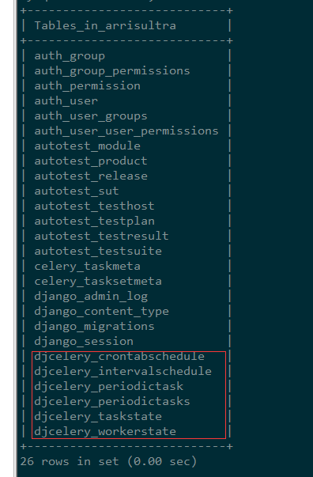

# Django+Celery+Redis

## 一、Redis在CentOS和Windows安装过程

redis是一种key-value高效的内存数据库。

key-value是什么？json懂吧？字典懂吧？这些都是key-value结构的数据，每个key对应1个value。

那这个数据库和我们网站在使用的数据库有什么区别？我网站既然已经有数据库，为什么还要用其他数据库？

redis是内存数据库，则数据读写和存储都在内存中。该操作不用写入硬盘，读写效率很高。

我们可用它作为服务器缓存，对经常读写或不经常更新的数据预先读到内存中。使用该数据时，直接从内存中读取。也可以每隔一段时间再将内存中的数据写入到硬盘。减少与硬盘读写数据的操作，效率自然可以大大提高。

我网站有个阅读排行榜，每次打开页面都需要从数据库中统计获取。效率稍慢，所以我寻思使用redis。

### 1、在CentOS安装Redis

redis安装过程，其官网有说明：[https://redis.io/download](https://redis.io/download)

我服务器是CentOS Linux系统，根据官网指导。如下执行shell命令：

    wget http://download.redis.io/releases/redis-3.2.8.tar.gz
    tar xzf redis-3.2.8.tar.gz
    cd redis-3.2.8
    make

第1句是下载redis；第2句是解压；第3句是进入解压的目录；第4句是编译。

若在编译过程中发生gcc或tcl等错误，多半缺少gcc和tcl，安装它们即可。

编译完成之后，在redis解压目录中，多了src目录。执行如下命令进入该目录：

    cd src
    ls

你可以先测试看是否可以打开redis：

    ./redis-server

若出现运行界面，则没问题。

我们使用redis数据库需要开启redis-server。为了使用方便，我们编译完成之后，还需要安装对应的命令。执行如下命令：

	make install

执行该命令需要root权限。若没有root权限则无法执行。

我服务器是Webfaction，没有root权限。手工将必要的文件复制到我用户的bin目录：

	cp redis-benchmark redis-check-aof redis-check-rdb redis-cli redis-sentinel redis-server ~/bin

这里复制了src目录下6个文件，对应6个命令。分别作用如下：
| 命令            | 作用                             |
| --------------- | ------------------------------- |
| redis-benchmark | 压力测试工具                    |
| redis-check-aof | 检查redis持久化命令文件的完整性 |
| redis-check-rdb | 检查redis持久化数据文件的完整性 |
| redis-cli       | redis客户端                     |
| redis-sentinel  | 集群管理工具,主要负责主从切换   |
| redis-server    | edis服务器的daemon启动程序      |


另外，既然是服务器，作为生产环境总不能手动打开redis-server。这里有两种方法，也是针对可否拿到root权限。

1）可以拿到root权限的话，就将redis注册成服务。

redis解压目录中，utils文件夹的redis_init_script是服务安装的脚本。打开并修改如下参数：

```
# 服务端所处位置，需要修改

EXEC=/usr/local/bin/redis-server

# 客户端位置，需要修改

CLIEXEC=/usr/local/bin/redis-cli

# 配置文件位置，需要修改

CONF="/etc/redis/redis.conf"
```

分别修改这3个参数指定具体位置。redis.conf配置文件一般不需要修改，可直接使用。

修改保存之后，复制该文件到/etc/init.d目录下：

	cp redis_init_script /etc/init.d/redisd

可通过如下3个命令控制该服务：

```
# 设置为开机自启动服务器

chkconfig redisd on

# 打开服务

service redisd start

# 关闭服务

service redisd stop
```

2）没有root权限，让redis-server后台运行

该方法也比较简单。打开redis.conf配置文件，找到daemonize参数将其设置为yes。该参数是让redis-server后台运行。

再使用redis-server 打开并使用该配置文件：

```
redis-server redis.conf
```

执行之后，可以进入redis客户端查看redis-server是否开启：

```
redis-cli
```

若没有显示not connect等字样，显示IP地址加端口则已经开启。

可以输入如下命令测试redis：

```
# 写入数据

set s 123

# 获取数据

get s

# 列举全部key

keys *

# 删除数据

del s
```

关闭redis-server后台运行，可用redis-cli的命令：

	redis-cli shutdown

为了方便管理，可以将redis开启和关闭写成脚本。

例如，启动脚本：

    #!/bin/bash
    redis-server ~/webapps/yshblog_app/lib/redis-3.2.8/redis.conf

停止脚本：

    #!/bin/bash
    redis-cli shutdown

重启脚本：

    #!/bin/bash
    redis-cli shutdown
    redis-server ~/webapps/yshblog_app/lib/redis-3.2.8/redis.conf

具体的redis.conf自己指定即可，而且还需要给这些脚本执行权限。

### 2、在Windows安装redis

Redis不支持Windows！在它官网写得很清楚。

问题，我开发环境有时是Windows系统。为了方便开发和调试，需要在Windows中安装Redis。

微软自己弄了Redis的Windows版本。

打开[https://github.com/MSOpenTech/redis/releases](https://github.com/MSOpenTech/redis/releases)下载msi安装包。

该版本是64位。32位版本自行找一下。

安装msi过程中，有个选项是否加入系统环境变量，记得勾上。

一路下一步，安装。完成之后打开cmd，输入redis-server命令查看是否可以使用。不可以则重启一下即可。

直接输入redis-server命令使用的配置文件是安装目录下的redis.windows.conf文件。

若提示错误 “ConnectionError: Error 10061 connecting to None:6379”，可以如下操作，打开cmd输入如下命令：

```
redis-cli shutdown
```

再执行redis-server即可。

本地开发我懒得将Redis设置开机自启或弄成服务。正式发布使用时记得，将其打开即可。

后面我网站开发会提到如何使用Redis

## 二、Django初步使用Celery

继上回安装和使用Redis之后，看看如何在Django中使用Celery。Celery是Python开发分布式任务列队的处理库。可以异步分布式地异步处理任务，也可定时执行任务等等。通常我们可以在Django执行一些比较耗时的任务（例如发邮件）和后台任务（例如爬虫和更新服务器缓存）。

研究发现，在Django中使用有两种方式：

1）使用django-celery应用；

2）直接使用Celery。

### 1、Celery方式的选择

这里Celery的中间人，我采用Redis。也可以用Django自身和mongodb等。Celery的中间人你可以理解为在Celery执行过程中的数据支持。保存列队记录、执行记录等等。安装Redis，可参考[Redis在CentOS和Windows安装过程](http://yshblog.com/blog/155)。

这里还需要安装celery-with-redis，执行命令：

```
pip install celery-with-redis
```

该命令会自动安装redis(python库)、celery、kombu、billiard、amqp、vine和celery-with-redis相关库。注意，这里pip安装的redis是python操作redis的库，非redis数据库。redis数据库需要独立安装。

先说说django-celery的方式吧。这种方式就是通过manage.py启动celery。通常先被提到的方案是不会采用。用pip安装django-celery，在settings引用djcelery应用。再更新数据库：

```
python manage.py makemigrations djcelery
python manage.py migrate djcelery
```

查看数据库，会发现多了很多相关的表。

 

稍稍有些强迫症的我，不能接受这些表脏我的数据库。另外djcelery还有个用途是在admin后台动态添加定时任务。这个功能也是比较鸡肋，维护不方便而且可能造成各种不可预知的问题。

所以建议直接使用Celery管理Django中的任务。这种方式也是Celery官网推荐的方式，可看官网的示例：[Celery官网(Celery 3.x版)](http://docs.celeryproject.org/en/latest/whatsnew-3.1.html#django-supported-out-of-the-box)

### 2、Django简单项目准备

这里我也简单做一个示例。

首先，确保celery和redis已经安装好了，并且已经启动了Redis服务。

另外，有个已经搭建好了Django项目。作为示例，简单project和简单app如下：


左边侧边栏是该django的目录结构，右边是myapp中的Blog模型。再进入后台随便加了两条数据：


为了测试，一切从简。views.py写了一个响应方法：

```
#coding:utf-8
from django.shortcuts import render
from django.http import HttpResponse

from .models import Blog
import json

def home(request):
    data = list(Blog.objects.values('caption'))
    return HttpResponse(json.dumps(data), content_type = 'application/json')
```

django项目的urls.py加了一条首页的url路由设置：

```
#coding:utf-8
from django.conf.urls import url
from django.contrib import admin
from myapp.

urlpatterns = [
    url(r'^admin/', admin.site.urls),
    url(r'^/pre>, 'myapp.views.home', name='home')
]
```

运行django项目：

	python manage.py runserver

打开http://localhost:8000/，如下效果：


### 3、Django加入Celery

现打开首页要执行一个收集访客数据，发送邮件等操作。这是一个耗时任务，若放在home处理方法中执行，用户打开首页会很慢。用户体验不好，很可能不会等到页面打开。

通常这个耗时任务可以多线程处理或者异步处理。我们模拟一个耗时任务，丢给Celery异步处理。

先模拟耗时任务，打开views.py，修改如下：

```
#coding:utf-8
from django.shortcuts import render
from django.http import HttpResponse

from .models import Blog
import json
import time

def sendmail(email):
    print('start send email to %s' % email)
    time.sleep(5) #休息5秒
    print('success')
    return True

def home(request):
    #耗时任务，发送邮件
    sendmail('test@test.com')

    #其他行为
    data = list(Blog.objects.values('caption'))
    return HttpResponse(json.dumps(data), content_type = 'application/json')
```

如此一来，至少需要再多等待5秒，才可以打开网页。

打开settings.py所在的文件夹，新建celery.py文件。加入如下代码(注意，因为celery-with-django版本限制，我安装的celery版本为3.1.25。可能celery4.x的版本代码不同)：

```
#coding:utf-8
from __future__ import absolute_import, unicode_literals

from celery import Celery
from django.conf import settings
import os

#获取当前文件夹名，即为该Django的项目名
project_name = os.path.split(os.path.abspath('.'))[-1]
project_settings = '%s.settings' % project_name

#设置环境变量
os.environ.setdefault('DJANGO_SETTINGS_MODULE', project_settings)

#实例化Celery
app = Celery(project_name)

#使用django的settings文件配置celery
app.config_from_object('django.conf:settings')

#Celery加载所有注册的应用
app.autodiscover_tasks(lambda: settings.INSTALLED_APPS)
```

这个文件还没被加载，接着打开settings.py同个目录下的__init__.py文件。让运行该Django项目的时候，加载该文件配置Celery。修改代码如下：

```
#coding:utf-8
from __future__ import absolute_import, unicode_literals

#引入celery实例对象
from .celery import app as celery_app
```

还需在settings.py中设置celery，尤其是中间人的设置。若不设置中间人，会提示无法连接中间人的错误。在settings.py文件中添加如下设置：

```
#celery settings
#celery中间人 redis://redis服务所在的ip地址:端口/数据库号
BROKER_URL = 'redis://localhost:6379/0'
#celery结果返回，可用于跟踪结果
CELERY_RESULT_BACKEND = 'redis://localhost:6379/0'

#celery内容等消息的格式设置
CELERY_ACCEPT_CONTENT = ['application/json',]
CELERY_TASK_SERIALIZER = 'json'
CELERY_RESULT_SERIALIZER = 'json'

#celery时区设置，使用settings中TIME_ZONE同样的时区
CELERY_TIMEZONE = TIME_ZONE
```

### 4、把耗时任务丢给celery处理

上面views.py中有个耗时任务sendmail。在myapp应用中新建文件tasks.py，将sendmail方法剪切到该文件中并用定义为celery任务。tasks.py文件如下代码：

```
#coding:utf-8
from celery.decorators import task 
import time

@task
def sendmail(email):
    print('start send email to %s' % email)
    time.sleep(5) #休息5秒
    print('success')
    return True
```

在原有的方法上加上celery装饰器task。或者也可以通过前面添加的celery_app给sendmail方法加装饰器：

```
#coding:utf-8
#myproject是当前django的项目名
from myproject import celery_app
import time

@celery_app.task
def sendmail(email):
    print('start send email to %s' % email)
    time.sleep(5) #休息5秒
    print('success')
    return True
```

另外原先的views.py修改如下：

```python
#coding:utf-8
from django.shortcuts import render
from django.http import HttpResponse

from .models import Blog
from .tasks import sendmail #引用tasks.py文件的中sendmail方法
import json

def home(request):
    #耗时任务，发送邮件（用delay执行方法）
    sendmail.delay('test@test.com')

    #其他行为
    data = list(Blog.objects.values('caption'))
    return HttpResponse(json.dumps(data), content_type = 'application/json')
```

### 5、本地启动celery并测试

启动celery之前，确保已经安装redis和启动redis服务，可参考[Redis在CentOS和Windows安装过程](http://yshblog.com/blog/155)。

本地开发环境运行redis-cli看是否可以正常连接，若不行，再手工执行redis-server命令并保持窗口即可。


接着，启动celery worker。这个worker是用于异步执行任务的“工作者”。进入manage.py文件所在的目录，执行如下命令：

```
Celery -A myproject worker -l info
```

出现如下窗口和消息，则正常执行。


celery worker会扫描django项目中有哪些task任务，并加入进来。见上图的蓝色字下[tasks]字样。

最后，再启动django服务器。这个大家熟悉的python manage.py runserver。

打开首页，可以发现没有5秒等待立即得到首页内容。查看celery worker，可看到执行sendmail方法的消息。


基本初步使用celery讲解到这，该测试已上传到Github。

大家自行下载测试：[https://github.com/HaddyYang/django-celery-redis-simple](https://github.com/HaddyYang/django-celery-redis-simple)

还有定时任务以及生产环境中使用celery，这些后面讲解。

## 三、Django Celery定时任务和时间设置

继上篇文章[Django初步使用Celery](http://yshblog.com/blog/163)，我们接着使用celery在Django项目中执行定时任务。Celery的安装和Django项目代码我就不多说明了，可看[刚刚的文章链接](http://yshblog.com/blog/163)。

### 1、Celery加入定时任务

Celery除了可以异步执行任务之外，还可以定时执行任务。在实例代码的基础上写个测试方法：

```
# coding:utf-8

from celery.task.schedules import crontab  
from celery.decorators import periodic_task

@periodic_task(run_every=crontab())
def some_task():
    print('periodic task test!!!!!')
    time.sleep(5)
    print('success')
    return True
```

该代码是每分钟执行一次some_task方法。

[上篇文章](http://yshblog.com/blog/163)启动celery是使用worker。但worker不能启动定时任务。启动方式如下：

1）先确保中间人是否打开，我使用redis作为中间人。可参考[Redis在CentOS和Windows安装过程](http://yshblog.com/blog/155)。

2）进入django项目的根目录执行如下代码启动celery的worker：

```celery -A myproject worker -l info```

其中，myproject是我的django项目名称。如下图，看蓝色字体下的tasks列表。


有两个任务，其中一个myapp.tasks.sendmail是[上篇文章](http://yshblog.com/blog/163)添加的异步处理任务。myapp.tasks.some_task是本次的定时任务。

3）同样在django项目的根目录下再打开一个命令行界面，执行如下代码：

```celery -A myproject beat -l info```

这个beat是检查定时任务，并启动定时任务丢给worker执行。如下图：


可以稍微等待几分钟，多执行几次任务。如下图：


上面的窗口是beat，下面的窗口是worker。可看到print的信息在worker中输出。

我们甚至不用打开Django项目的服务器，就可以执行定时任务。

### 2、Celery定时任务时间设置

若你觉得1分钟等待时间太长。可以设置为每10秒执行一次定时任务。将上面的periodic_task修改如下：

```
@periodic_task(run_every=10)
```

**修改代码，需要重启Celery的worker和beat。**

这个run_every参数是设置定时任务的时间间隔或执行的时间。该参数设置有3种方式。

**1）直接设置秒数**

例如刚刚所说的10秒间隔，run_every=10，每10秒执行一次任务。1分钟即是60秒；1小时即是3600秒。

**2）通过datetime设置时间间隔**

有时直接设置秒数不方便，需要通过计算得到具体秒数。

例如，1小时15分钟40秒 = 1*60*60 + 15*60 + 40。这种情况可读性也不高。

可以采用datetime设置，代码如下：

```
from celery.decorators import periodic_task
import datetime

@periodic_task(run_every=datetime.timedelta(hours=1, minutes=15, seconds=40))
def some_task():
    print('periodic task test!!!!!')
```

代码可读性明显提升，而且设置方便。

但这种不能满足定时定点的时间设置。假如我想固定每天12点15分的时候，执行一次任务。datetime和直接设置秒数的方式都无法实现。这时得使用第3种方式。

**3）celery的crontab表达式**

crontab是比较完善，且稍微有点复杂（相对前面两种方式而言）的方式。可以实现我们各种设置时间的需求。

例如，前面给出的代码：

```#coding:utf-8
from celery.task.schedules import crontab  
from celery.decorators import periodic_task

@periodic_task(run_every=crontab())
def some_task():
    print('periodic task test!!!!!')
```

表示每分钟0秒时刻执行一次（后面不提这个0秒，大家都知道就行了，省点口水）。

其中，crontab()实例化的时候没设置任何参数，都是使用默认值。crontab一共有7个参数，常用有5个参数分别为：

**minute**：分钟，范围0-59；

**hour**：小时，范围0-23；

**day_of_week**：星期几，范围0-6。以星期天为开始，即0为星期天。这个星期几还可以使用英文缩写表示，例如“sun”表示星期天；

**day_of_month**：每月第几号，范围1-31；

**month_of_year**：月份，范围1-12。

**a、默认参数**

这些参数可以设置表达式，表达稍微复杂的设置。默认值都是"*"星号，代表任意时刻。即crontab()相当与：

```
crontab(minute='*', hour='*', day_of_week='*', day_of_month='*', month_of_year='*')
```

含义是每天、每小时、每分钟执行一次任务。这说法太反人类语言习惯，简单说就是每1分钟执行一次任务。

**b、具体某个值**

上面提到这些参数的取值范围。我们可以直接设置某个值。例如：

```
crontab(minute=15)
```

即每小时的15分时刻执行一次任务。直接指定某个时刻。以此类推可以设置每天0点0分时刻执行任务的设置如下：

```
crontab(minute=0, hour=0)
```

当然，也可以设置多个值。例如0分和30分执行一次任务：

```
crontab(minute='0,30')
```

这里使用字符串，用逗号隔开数值。这里的逗号是表示多个表达式or逻辑关系。

**c、设置范围**

设置范围也是设置多个值，例如指定9点到12点每个小时的每分钟执行任务。

```
crontab(minute='*', hour='9-12')
```

这里*号是默认值，可以省略如下：

```crontab(hour='9-12')```

上面提到逗号是or逻辑关系。拓展一下，指定9点到12点和20点中每分钟执行任务：

```crontab(hour='9-12,20')```

crontab的表达式越来越复杂了。celery还提供了一个类得到表达式解析结果，代码如下：

```
from celery.task.schedules import crontab_parser
r = crontab_parser(23, 0).parse('9-12,20')
print(r)
```

其中，crontab_parse是一个解析类。第1个参数是范围的最大值；第2个参数是范围的最小值。通过parse输入表达式，可得到表达式的解析结果：

```
set([9, 10, 11, 12, 20])
```

下面很多地方我们都可以通过该方法验证解析结果。

**d、设置间隔步长**

假如我要设置1、3、5、7、9、11月份每天每分钟执行任务，按照上面的做法可以设置如下：

```crontab(day_of_month='1,3,5,7,9,11')```

观察数据可以发现，都是间隔2的步长。需要设置的数字比较少，若数字比较多显得很麻烦。例如我想每间隔2分钟就执行一次任务，要写30个数字想想就觉得很麻烦。crontab表达式还提供了间隔的处理，例如：

```
crontab(minute='*/2')
crontab(minute='0-59/2') #效果等同上面
```

这个/号不是除以的意思。相当与range的第3个参数，例如：

```range(0, 59+1, 2)```

差不多crontab表达式就这些，多举几个例子：

```
#每2个小时中每分钟执行1次任务
crontab(hour='*/2')

#每3个小时的0分时刻执行1次任务
#即[0,3,6,9,12,15,18,21]点0分
crontab(minute=0, hour='*/3')

#每3个小时或8点到12点的0分时刻执行1次任务
#即[0,3,6,9,12,15,18,21]+[8,9,10,11,12]点0分
crontab(minute=0, hour='*/3,8-12')

#每个季度的第1个月中，每天每分钟执行1次任务
#月份范围是1-12，每3个月为[1,4,7,10]
crontab(month_of_year='*/3')

#每月偶数天数的0点0分时刻执行1次任务
crontab(minute=0, hour=0, day_of_month='2-31/2')

#每年5月11号的0点0分时刻执行1次任务
crontab(0, 0, day_of_month='11', month_of_year='5')
```

这些表达式设置都可以用crontab_parser验证。

演示代码已经更新到Github，若有需要可自行下载：[https://github.com/HaddyYang/django-celery-redis-simple](https://github.com/HaddyYang/django-celery-redis-simple)

## 四、服务器使用Supervisor后台运行Celery

前面写的Celery文章都是在开发环境中测试。可以发现为了运行Django+Celery+Redis这一套程序，需要打开好几个窗口：Redis服务、Celery worker、Celery beat和Django服务器。然而在生产环境即服务器，肯定不能这么处理。我们需要这些进程在后台中运行（也叫守护进程或者daemonize模式）。

这里借助Supervisor进行管理程序，将非后台运行的程序变成后台运行。包括Redis也可以丢给Supervisor管理。

至于，怎么安装和使用Celery、Redis可看[Django+Celery+Redis专题](http://yshblog.com/subject/7)。

相关的代码也上传到Github：[https://github.com/HaddyYang/django-celery-redis-simple](https://github.com/HaddyYang/django-celery-redis-simple)

### 1、安装Supervisor

Supervisor是Python开发的，用于在Linux服务器中管理进程。

除了可以讲上面转换程序为后台程序之外，还可以监控进程。若进程崩溃关闭，它可以自动重启进程等等。更多相关介绍可以查看Supervior的官网：[http://supervisord.org](http://supervisord.org)。

Supervisor安装很简单，使用pip即可安装：

```pip install supervisor```

目前我安装使用的版本是3.3.1。安装完成之后多了3个命令：echo_supervisord_conf、supervisorctl和supervisord。这3个命令下面都会使用到。

### 2、Supervisor配置

我们可以使用echo_supervisord_conf命令得到supervisor配置模板，打开终端执行如下Linux shell命令：

```echo_supervisord_conf > supervisord.conf```

该命令输出文件到当前目录下（当然，你也可以指定绝对路径到具体位置），文件名为supervisord.conf。

再使用vim命令打开该文件并编辑：

```vim supervisord.conf```

相关的配置信息该文件都有写明，只不过都是英文。别担心，下面开始讲解如何配置。

直接把光标移动到文件底部。vim的使用自行搜索。主要使用如下：

1）输入i开启编辑；

2）输入esc退出编辑进入命令模式；

3）命令模式输入:wq保存并退出；

4）命令模式输入:q!不保存强制退出。

新行输入如下配置信息（以celery worker为例，具体含义看注释）：

```
[program:celery.worker] 
;指定运行目录 
directory=/home/xxx/webapps/yshblog_app/yshblog
;运行目录下执行命令
command=celery -A yshblog worker --loglevel info --logfile celery_worker.log

;启动设置 
numprocs=1          ;进程数
autostart=true      ;当supervisor启动时,程序将会自动启动 
autorestart=true    ;自动重启

;停止信号,默认TERM 
;中断:INT (类似于Ctrl+C)(kill -INT pid)，退出后会将写文件或日志(推荐) 
;终止:TERM (kill -TERM pid) 
;挂起:HUP (kill -HUP pid),注意与Ctrl+Z/kill -stop pid不同 
;从容停止:QUIT (kill -QUIT pid) 
stopsignal=INT
```

其中第一行是必须的，设置该程序的名称（可自行修改，不要和其他program重复）。

这里没提到的参数配置不是必须的，可以参考Supervisor的官网。

还需说明日志的问题。原本我设置了日志配置，而不是通过celery命令设置--logfile参数：

```
;输出日志 
stdout_logfile=celery_worker.log 
stdout_logfile_maxbytes=10MB  ;默认最大50M 
stdout_logfile_backups=10     ;日志文件备份数，默认为10 

;错误日志 
redirect_stderr=false         ;为true表示禁止监听错误 
stderr_logfile=celery_worker_err.log 
stderr_logfile_maxbytes=10MB 
stderr_logfile_backups=10
```

可能是celery版本（3.1.25）的缘故，无法显示全部的日志内容。而且日志内容被写入两个文件celery_worker.log和celery_worker_err.log中，显得冗余。所以改为celery命令设置--logfile参数。

另外，在celery.worker下设置celery.beat定时任务的进程：

```
[program:celery.beat] 
;指定运行目录 
directory=/home/xxx/webapps/yshblog_app/yshblog
;运行目录下执行命令
command=celery -A yshblog worker --loglevel info --logfile celery_beat.log

;启动设置 
numprocs=1          ;进程数
autostart=true      ;当supervisor启动时,程序将会自动启动 
autorestart=true    ;自动重启

;停止信号
stopsignal=INT
```

你也可以把redis添加进来，给supervisor管理。将redis配置写在celery.worker前面。先打开redis服务，再执行celery.worker，最后轮到celery.beat。如下redis配置：

```
[program:redis]
;指定运行目录 
directory=~/webapps/yshblog_app/lib/redis-3.2.8/
;执行命令（redis-server redis配置文件路径）
command=redis-server redis.conf

;启动设置 
numprocs=1          ;进程数
autostart=true      ;当supervisor启动时,程序将会自动启动 
autorestart=true    ;自动重启

;停止信号
stopsignal=INT
```

### 3、启动和关闭Supervisor

启动supervisor输入如下命令，使用具体的配置文件执行：

```supervisord -c supervisord.conf```

关闭supervisord需要通过supervisor的控制器：

```supervisorctl -c supervisord.conf shutdown```

重启supervisord也是通过supervisor的控制器：

```supervisorctl -c supervisord.conf reload```

这些可以保存为shell脚本，并赋予执行权限方便管理。当然，平常也可以进入supervisor控制器，输入命令supervisorctl即可。再输入help得到相关帮助。

## 五、我的网站搭建(第52天) 使用Redis缓存提速

昨天在服务器和本地都安装了Redis数据库，具体可看[Redis在CentOS和Windows安装过程](http://yshblog.com/blog/155)。

安装该数据库是为了做服务器缓存。以下两种情况都适合使用服务器缓存：

1）数据非经常更新。若每次都从硬盘读取一次，浪费服务器资源、拖慢响应速度。

2）数据更新频率较高，服务器负担比较大。

我网站就有这么一些数据：阅读排行榜和7日阅读变化。

这些数据只需每天更新一次。而我每次都从数据库获取相应的数据，计算统计排行情况和阅读数。很明显浪费服务器资源，浪费时间。解决方法是定时统计一次数据，保存到数据库或文件中。每次读取数据从中获取。

若保存到数据库，还需要额外建立一张对应的表存储数据。在Django中建立表通常做法是建立一个模型。看似简单，问题调试麻烦、开发时长久。所以我一直拖着没处理该问题。毕竟一开始访问量不是很多。后来不少网友访客打开慢（当然服务器在国外也是个原因），查了资料发现Redis内存数据库。可以将数据写入到内存，再进行读写。减少计算量，可以有效提高服务器响应速度。

这么一来，我就不用创建新表创建模型。直接将数据写入缓存，定时更新。获取数据从服务器缓存获取即可。

啰嗦了这么多，看看如何实现Redis数据库作服务器缓存。

### 1、安装redis

具体安装过程，见[Redis在CentOS和Windows安装过程](http://yshblog.com/blog/155)。

我安装的版本是3.2.8。读写数据之前，记得开启redis服务。否则会显示No connect未连接错误。

### 2、安装django-redis和settings配置

执行命令，即可安装：

```pip install django-redis```

目前django-redis已更新到4.7.0版本。安装完毕之后，给Django项目的settings.py文件添加如下配置。

```
CACHES = {
    'default': {
        'BACKEND': 'django_redis.cache.RedisCache',
        'LOCATION': '127.0.0.1:6379',
        "OPTIONS": {
            "CLIENT_CLASS": "django_redis.client.DefaultClient",
        },
    },
}
```

网上大部分文章该部分配置有误（可能是旧版的redis库对应配置），都是写成如下：

```
CACHES = {
    'default': {
        'BACKEND': 'redis_cache.cache.RedisCache',
        'LOCATION': '127.0.0.1:6379',
        "OPTIONS": {
            "CLIENT_CLASS": "redis_cache.client.DefaultClient",
        },
    },
}
```

都是抄来抄去的文章，错得一模一样。这么写会报错：InvalidCacheBackendError: Could not find backend redis_cache.cache.RedisCache': No module named redis_cache.cache。找不到对应的模块。

另外，LOCATION参数和你的redis.conf文件中IP地址和端口要一致。redis服务才能监听到你的读写操作。

### 3、测试redis缓存

该步骤非必须，只是为了测试看可否正常使用redis。

进入django的后台命令模式：

```python manage.py shell```

逐条输入如下命令测试：

```
from django.core.cache import cache #引入缓存模块
cache.set('k', '12314', 30*60)      #写入key为k，值为12314的缓存，有效期30分钟
cache.has_key('k') #判断key为k是否存在
cache.get('k')     #获取key为k的缓存
```

测试没问题，则说明可正常使用。

若出现错误：ConnectionError: Error 10061 connecting to None:6379。说明没开启redis。

### 4、redis缓存功能开发

这里需要考虑两个问题：

1）写入redis的数据是什么形式？

2）缓存时效多长？

redis支持字符串、列表、集合、字典等数据结构。经测试，可将Python的字典和列表直接存储。你也可以用json模块对字典和列表转化成字符串再存储。

至于缓存时效看具体情况，建议30分钟或者1小时更新一次。原本我考虑1天更新1次数据，但全球有很多个时区。不是每个时区都和我一样在0点的时候看到更新结果。我们是东八区，我们0点的时候，东九区是1点。所以，每1小时更新一次的频率较为合适，你可以直接设置60*60秒。而我需要整点的时候更新，需要再多一步计算到下一个整点还有多少秒。

获取多少天之前的阅读排行榜代码如下（**该部分可以不看**）：

```
#coding:utf-8
import datetime
from blog.models import Blog

#获取阅读排行榜
def readed_list(date_end, days, item_num):
    date_start = date_end - datetime.timedelta(days)

    qs = Blog.objects.values('id', 'caption')
    qs = qs.filter(view_recorder__view_time__range=[date_start, date_end])
    qs = qs.annotate(read_num=models.Count('view_recorder'))
    qs = qs.order_by('-read_num')[:item_num]
    return qs
```

这是我自己项目的具体代码，主要获取博客id，博客标题，和博客在这段时间内的阅读数。每一项数据都是字典，再添加到一个列表中。

读写redis缓存代码（**敲黑板，这是重点**）：

```
#coding:utf-8
from django.core.cache import cache
import time

def get_readed_cache():
    #判断键是否存在
    key = 'readed'
    if cache.has_key(key):
        data = cache.get(key)
    else:
        #不存在，则获取数据，并写入缓存
        data = get_readed_data()

        #写入缓存
        cache.set(key, data, 3600-int(time.time() % 3600))
    return data

def get_readed_data():
    #日期处理
    now = datetime.datetime.now()
    date_end = datetime.datetime(now.year, now.month, now.day, 0, 0) 
    item_num = 14

    #阅读排行
    readed_1 = readed_list(date_end, 1, item_num)
    readed_7 = readed_list(date_end, 7, item_num)
    readed_30 = readed_list(date_end, 30, item_num)
    data = [readed_1, readed_7, readed_30]

    return data
```

使用has_key方法判断键是否存在；get方法获取数据；set方法设置缓存。

写入缓存中的时间是以秒为单位。time.time()得到当前时间，取1小时(3600秒)的余数得到当前小时跑了多少秒。3600减去该值得到距离下个整点还剩多少秒。

得到该数据，再返回给前端页面：

```
#coding:utf-8
from django.shortcuts import render_to_response

def test(request):
    data = {}
    data["read_lists"] = get_readed_cache()
    return render_to_response('index.html', data)
```

该方法是示例代码，还需要设置url路由，令其可在前端打开。

前端页面可以用for循环遍历列表，可用键名当作属性获取字典的值。例如：

```

    
        <p>{{blog.caption}}</p>
    

```

其中，blog变量是一个字典，键有id、caption、read_num。上面代码有写。在模版中，可用属性的方法获取键值。

若你想看看redis保存该数据的样子，可进入redis客户端查看。输入命令redis-cli进入客户端。

再分别输入keys * 查看有那些键，再输入get命令获取数据。

当然，这里我写入redis缓存是被动写入。需要打开前端页面触发该行为。

所以打开页面正好需要写入缓存时，该页面打开速度相对慢一点。有了缓存之后，后面打开速度飞快。经测试，这一点改动，打开首页足足加快了0.5-1秒。

后面，我将采用celery定时任务主动更新缓存。

## 六、用装饰器优化Redis缓存代码

[使用Redis缓存提速](http://yshblog.com/blog/156)的效果不错，但回顾代码发现有不少冗余和麻烦的地方。

每一个需要使用缓存的数据，我都写一个方法获取数据，再写一个方法处理缓存。如下代码：

```
#coding:utf-8
from django.core.cache import cache
import time

#获取readed缓存
def get_readed_cache():
    #判断键是否存在
    key = 'readed'
    if cache.has_key(key):
        data = cache.get(key)
    else:
        #不存在，则获取数据，并写入缓存
        data = get_readed_data()

        #写入缓存
        cache.set(key, data, 3600-int(time.time() % 3600))
    return data

#获取readed数据
def get_readed_data():
    #获取相关数据，这里省略
    data = ''
    return data
```

使用的时候，直接调用get_readed_cahce方法即可。但这么一来，若需要用到缓存的地方越来越多。每一个都需要这么写一套代码。而其中每个获取缓存的方法都很固定，都是判断键值是否存在。若存在则返回缓存中的数据；若不存在则获取数据再写入缓存。不同的地方是键值、写入缓存超时的时间和获取数据的方法。

重复类似的代码将被写很多遍。这很明显可以将获取缓存的数据写成一个[带参数的装饰器](http://yshblog.com/blog/53)。可将键值和超时时间作为装饰器的参数。如下代码：

```
#coding:utf-8
from django.core.cache import cache

#获取redis缓存的装饰器
def redis_cache(key, timeout):
    def __redis_cache(func):
        def warpper(*args, **kw):
            #判断缓存是否存在
            if cache.has_key(key):
                data = cache.get(key)
            else:
                #若不存在则执行获取数据的方法
                #注意返回数据的类型(字符串，数字，字典，列表均可)
                data = func(*args, **kw)
                cache.set(key, data, timeout)
            return data
        return warpper
    return __redis_cache
```

为了方便测试，可加入print输出信息，观察执行过程。

```
#coding:utf-8
from django.core.cache import cache

#获取redis缓存的装饰器
def redis_cache(key, timeout):
    def __redis_cache(func):
        def warpper(*args, **kw):
            #判断缓存是否存在
            print('check key: %s' % key)
            if cache.has_key(key):
                print('get cache')
                data = cache.get(key)
            else:
                #若不存在则执行获取数据的方法
                #注意返回数据的类型(字符串，数字，字典，列表均可)
                print('get data')
                data = func(*args, **kw)
                print('set cache')
                cache.set(key, data, timeout)
            return data
        return warpper
    return __redis_cache
```

使用装饰器方法如下：

```
#键值为test，超时时间为60秒
@redis_cache('test', 60)
def get_test_data():
    # 获取Blog模型随机排序前3条数据
    # (Blog模型是我自己的模型，具体代码根据自己需求获取数据)
    # values执行结果，将返回一个字典。字典可以直接存入redis
    data = Blog.objects.values('id', 'caption').order_by('?')[:3]
    return data
```

进入django shell后台，第1次执行get_test_data方法。


由于从未执行过该方法，没有键值为test的缓存数据。则执行被加装饰器的方法，获取具体的数据。再执行1次get_test_data方法。


第2次执行，检查发现有缓存，则直接获取缓存，不执行获取数据的方法。

你可以等60秒后，再执行一次get_test_data方法。由于设置缓存超时时间为60秒，该缓存将被清除。再执行一次方法将会重新获取数据，写入缓存。

测试执行无误，可将装饰器单独放到一个Python脚本文件，以供Django或其他Web、脚本等使用。

## 七、我的网站搭建(第53天) 定时刷新服务器缓存

为了提高页面响应速度，使用[Redis作为服务器缓存](http://yshblog.com/blog/156)。但该缓存是被动刷新。

在没有缓存的情况下，第1次获取数据没有缓存，会先写入缓存。后面访客访问页面才有缓存可以直接使用。

于是又[安装和学习Celery](http://yshblog.com/subject/7)，想使用Celery定时更新服务器缓存。

相关的Celery和Redis安装使用可看[Django+Celery+Redis专题](http://yshblog.com/subject/7)。这里不在赘述，直接进入主题。

前面为了方便使用缓存代码开发，写了[缓存装饰器](http://yshblog.com/blog/161)加在获取数据的方法上。可获取数据时自动判断是否有缓存。若有缓存，返回缓存的数据；若没缓存，获取数据写入缓存。

但该缓存装饰器和准备加入的Celery定时任务装饰器逻辑有冲突。

若定时任务的装饰器加在缓存装饰器上，无法执行也无法主动更新缓存；若定时任务的装饰器加载获取数据方法上，只是执行获取数据方法无法写入缓存。so~需要改造代码。添加缓存处理类，代码如下：

```
#coding:utf-8
from django.core.cache import cache

#获取和设置缓存的类
class RedisCache():
    def __init__(self, key, timeout, get_data_method, args=None, kw=None):
        self.key = key
        self.timeout = timeout
        self.get_data_method = get_data_method
        self.args = [] if args is None else args
        self.kw = {} if kw is None else kw

    def get_cache(self):
        try:
            #判断缓存是否存在
            if cache.has_key(self.key):
                data = cache.get(self.key)
            else:
                data = self.set_cache()
        except Exception as e:
            #使用缓存出错，可能是没开启redis
            data = self.get_data_method(*self.args, **self.kw)
        finally:
            return data

    def set_cache(self):
        data = self.get_data_method(*self.args, **self.kw)
        cache.set(self.key, data, self.timeout)
        return data
```

该类初始化时，需要传入参数key(缓存键名)、timeout(缓存超时时间)、get_data_method(获取数据的方法)。后面两个参数args和kw是执行get_data_method所需的参数。若该方法没参数则无需填写。

这么一来，就可以在实例化的对象中调用执行该获取数据的方法。

去掉原先加载获取数据方法上的装饰器，修改代码如下（该app下新建cache.py文件）：

```
#目前有两个需要使用缓存的数据
#获取数据的方法简单结果如下，具体代码省略
def get_readed_data(item_num):
    data = []
    # ....
    retrun data

def get_chart_data():
    data = []
    # .... 
    return data

#获取一个缓存字典，可方便获取
def get_caches():
    #缓存超时时间设置1小时1分钟
    readed_list_cache = RedisCache('readed_list', 3660, get_readed_data, args=[14,])
    chart_cache = RedisCache('chart', 3660, get_chart_data)

    caches = {}
    caches[readed_list_cache.key] = readed_list_cache
    caches[chart_cache.key] = chart_cache
    return caches

#执行获取缓存管理器，以便被引用
caches = get_caches()
```

原先views.py文件返回数据可以引入caches，获取数据：

```
from .caches import caches

#某响应方法
def index(request):
    data = {}
    data['readed_list'] = caches['readed_list'].get_cache()
    data['chart'] = caches['chart'].get_cache()

    #... 将data返回给模版页面即可
```

好了，上面处理了获取缓存的方法。接下来就可以愉快的刷新缓存。同样在该目录下创建tasks.py文件，写入代码：

```
#coding:utf-8
from __future__ import absolute_import

from celery.task.schedules import crontab  
from celery.decorators import periodic_task, task

#缓存
from .caches import caches

#定时更新缓存
@periodic_task(run_every=crontab(minute=0))
def update_caches():
    for cache in caches.values():
        cache.set_cache()
```

引入缓存管理器，让celery在每小时0分时刻执行一次update_caches方法，刷新caches中的缓存。

本地测试正常，接着更新服务器。利用[supervisor后台运行celery](http://yshblog.com/blog/165)，但又出现问题了。开发就是这样，经常会碰到各种问题。遇到问题就尝试分析原因并找方法解决。

问题描述：可以正常执行supervisor打开celery worker 和 beat。但过一段时间之后服务器崩溃重启。

使用ps aux 命令发现运行了20个 celery worker。又输入top查了内存和CPU的使用情况（忘了截图，现在不想重现这个问题。会把服务器搞挂掉）发现内存不够用导致服务器崩溃。

重新打开django项目的settings.py文件。添加Celery如下设置：

```
#worker并发数，相当于--concurrency参数
CELERYD_CONCURRENCY = 4

#每次取任务的数量
CELERYD_PREFETCH_MULTIPLIER = 10

#每个worker执行多少次任务之后就销毁，防止内存泄漏。相当于--maxtasksperchild参数
CELERYD_MAX_TASKS_PER_CHILD = 64

#防止死锁
CELERYD_FORCE_EXECV = True

#任务发出后，经过一段时间还未收到acknowledge , 就将任务重新交给其他worker执行  
CELERY_DISABLE_RATE_LIMITS = True
```

重点是设置celery worker的并发数和执行多少次任务后销毁。这样服务器的内容就不再被爆掉。

再次运行supervisor。过了一段时间服务器还是正常运行，说明该解决方案可行。

打开celery日志，如下图：


分别执行了3次刷新缓存的任务。第1次是刚执行Celery时运行一次定时任务，后面两次都是在0分时刻运行。

更多相关的Django-Celery-Redis文章可参考专题：[http://yshblog.com/subject/7](http://yshblog.com/subject/7)

## 八、我的网站搭建(第54天) Celery异步发送邮件

发送邮件是一个很耗时的操作。若不异步处理的话，会严重造成阻塞现象。 之前有关异步发送邮件先使用多线程异步处理，可参考[我的网站搭建(第29天) 多线程异步发送邮件](http://yshblog.com/blog/69)。 现在已经安装Redis和Celery，那么进一步完善修改异步发送邮件功能。 有关Redis和Celery的安装和使用可参考专题：[Django+Celery+Redis](http://yshblog.com/subject/7)。 为了讲解方便，先给出发送邮件的方法：

```
#coding:utf-8
from django.core.mail import EmailMessage

def send_email_by_celery(subject, html_content, send_from, to_list, fail_silently=False):
    msg = EmailMessage(subject, html_content, send_from, to_list)
    msg.content_subtype = "html"
    msg.send(fail_silently)
```

Django发送邮件需要在Settings.py文件中配置。配置在上面多线程的链接有讲，这里不再赘述。 引入celery，修改代码如下：

```
#coding:utf-8
from __future__ import absolute_import
from django.core.mail import EmailMessage
from celery.decorators import task

@task
def send_email_by_celery(subject, html_content, send_from, to_list, fail_silently=False):
    msg = EmailMessage(subject, html_content, send_from, to_list)
    msg.content_subtype = "html"
    msg.send(fail_silently)
```

在需要发送邮件的地方使用delay方法，例如：

```
send_email_by_celery.delay(subject, html_content, send_from, to_list)
```

由于我前面开发过程中，无论是激活邮件还是评论邮件。最终都会调用一个send_html_email发送邮件的方法。在[我的网站搭建(第29天) 多线程异步发送邮件](http://yshblog.com/blog/69)中会使用多线程执行发送邮件代码。 将该部分代码修改为上面send_email_by_celery.delay即可。 这篇文章就结束了？当然没有！ 之所以使用Celery来异步发送邮件还有个好处：可以在任务出错时，重新再执行一次。修改代码如下：

```
#coding:utf-8
from __future__ import absolute_import
from django.core.mail import EmailMessage
from celery.decorators import task

@task(bind=True, max_retries=3, default_retry_delay=10)
def send_email_by_celery(self, subject, html_content, send_from, to_list, fail_silently=False):
    try:
        msg = EmailMessage(subject, html_content, send_from, to_list)
        msg.content_subtype = "html"
        msg.send(fail_silently)
    except Exception as e:
        #出错尝试重新执行1次任务
        raise self.retry(exc=e)
```

在task装饰器中加入3个参数，分别含义如下： 

1. bind：是否绑定到Celery类中。绑定到类中，可以使用其他相关的方法
2. max_retries：最多尝试执行的次数 
3. default_retry_delay：尝试执行的等待时间

这样，我们可以实现发送邮件出错了。再等10秒之后，重新发送一次。最多尝试执行3次。 还有要注意：send_email_by_celery加了self参数。 不过，绑定类的方法在执行过程中稍微会有点阻塞大概1~2秒。要求不是很严格的话，这点时间不算什么。
ps：之前有些网友反馈收不到用户激活邮件。我修改了用户中心，加入未验证邮箱的重新发送一次邮件的功能。该功能实现不难，判断是否绑定邮箱、是否激活，再发送一次邮件即可。同时可以写入缓存，限制发送邮件的频率。总不能一直让用户点发送，消耗服务器的资源。
再ps：后面考虑加入站内信功能。即使收不到评论和回复这种类型的邮件，可以通过站内信发送通知。