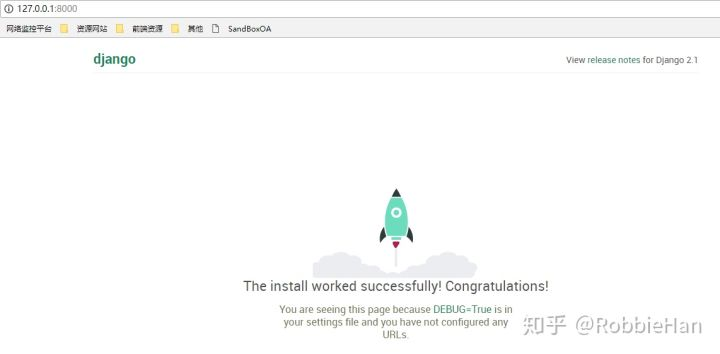

# Django实战1-权限管理功能实现

# 01：搭建开发环境

## 1 项目开发环境

- 语言环境： python3.6.2 , django-2.1.2
- 数据库环境：sqlite3(开发环境使用，部署环境使用mysql5.6)
- 开发工具：pycharm

## 2 安装python

说明：已经安装过python3.6环境的可以跳过此步。
python安装包下载地址：[https://www.python.org/downloads/windows/](https://link.zhihu.com/?target=https%3A//www.python.org/downloads/windows/)
访问上面地址，找到Python 3.6.2rc2 - 2017-07-07,点击 Windows x86-64 executable installer下载安装文件：python-3.6.2-amd64.exe
双击运行安装包 python-3.6.2-amd64.exe运行安装程序(如果安装报告权限问题，可以右键按转包，选择“以管理员身份运行”)，勾选【Add Python 3.6 to PATH】后，点击【customize installation】


在下面窗口中选择【Next】:


设置安装路径，点击【Install】等待安装完成


## 3 安装python虚拟环境：virtualenv

使用 virtualenv工具来创建python虚拟开发环境，每一个项目使用的都是独立的python开发环境，可解决不同项目对环境的依赖，和版本之间的问题。

**安装 virstualenv :** pip install virtualenv

完成安装后就可以使用virstualenv来创建激活虚拟环境了，接下安装一个扩展工具 virtualenvwrapper ，该工具可以更便捷管理我们的虚拟环境

**安装virtualenvwrapper**： pip install virtualenvwrapper-win

**创建虚拟环境：**
打开CMD窗口，按照下面操作创建虚拟环境：

```python
C:\Users\RobbieHan>mkvirtualenv -p "C:\Program Files\Python\Python36\python.exe" sandboxMP
(sandboxMP) C:\Users\RobbieHan>   # 创建虚拟环境后系统自动激活虚拟环境，
(sandboxMP) C:\Users\RobbieHan> deactivate  # 关闭虚拟环境
C:\Users\RobbieHan>
C:\Users\RobbieHan>workon  # 列出所有虚拟环境
Pass a name to activate one of the following virtualenvs:
==============================================================================
platform-env
sandboxMP
C:\Users\RobbieHan>workon sandboxMP # 激活虚拟环境
```

## 4 在虚拟环境中安装Django

```python
C:\Users\RobbieHan>workon sandboxMP
(sandboxMP) C:\Users\RobbieHan> pip install django==2.1.2
```

## 5 使用pycharm创建项目

pycharm的安装配置这里不做介绍了，运行pycharm，选择File→New Project 在弹出窗口左侧选择Django，在Location选项下设置项目存放路径


展开 Project Interpreter: 选择Exisiting interperter，点后面的设置按钮，选择Add Local


在新的弹窗左侧，选择Virtualenv Environment， 右侧Interpreter中指定python虚拟环境路径，虚拟环境默认存放在用户目录下的Envs目录. 我的创建的虚拟环境路径是：C:\Users\RobbieHan\Envs\sandboxMP\Scripts\python.exe


完成以上设置后，选择【Create】创建项目，项目创建完成后，点击pycharm右上角运行按钮运行项目，测试项目运行正常，可以访问django欢迎页面：



> 文档配套项目地址：[https://github.com/RobbieHan/sandboxMP](https://link.zhihu.com/?target=https%3A//github.com/RobbieHan/sandboxMP)

# 02：项目设置

## 1 模板和静态文件设置

## 1.1 下载模板和静态文件

- 使用pycharm打开项目：sandboxMP， 在sandboxMP项目目录下新建两个文件夹：static和media;
- 下载模板和静态文件（下载地址：[![YPSuperKey Unlocked](data:image/png;base64,iVBORw0KGgoAAAANSUhEUgAAADAAAAAwCAYAAABXAvmHAAAABHNCSVQICAgIfAhkiAAAAAlwSFlzAAADYgAAA2IByzwVFAAAABx0RVh0U29mdHdhcmUAQWRvYmUgRmlyZXdvcmtzIENTNui8sowAAAb7SURBVGiB7ZlrbFTHFcd/M/fu2uvXetcG24ChvIt4mHcIaUlaNVJRH6nUV1K1kapKkSqlVdu0pUqrSG1p+yFIUZt8SdqqrdKWUIkIpZQgEgKYQIAkxhTiAPHbXvxk117vrr17H6cf1jaFALtr8PpL/tKV7p2dc+b855w5c2ZWiQgzBaXUJuAbQB2wGvACl4GzwB4ROZxRiYjk/QHuBV4GegEBpMxfLoFgUAzDkPG2MHAE+CZg3EqXmgEPmKvXrj8c6urctuUT2/js5x9iwaLFlJX60YYmHo/R1dFB/eFDvPbqfgb6+wDeBR4TkYYPacvjrG8FGp781e+aLoYi8mbjJWkdjMuVmCtXYiKhmCuhEWf825WuqCVvnW+Wx3+0Q7xerwBx4Osz4gGl1DrgjUKfr/wvL+1j4z1bMDweUmNJzp9roOHt03S2t+I6LnNr51O3YRNr12/EXx5Aa039kdd54rvfoedKCOALIrI/bx4ASoD2wsJC+dM/90rrYELaBhPy0r8PydZtD0zEuwBJYHTiu279Rnn+xT3SOpiQjqGUHKg/I4FghQBRYPmk/jwQ2AXIU795WrpHbGm7mpBf7/q9mKYpgAX8EXgQWAosAj45LjMMyONP/Eya+0ekM5KUF/7+rwmy+/NCAFgIWOs33SMXQxFpvzoqf3jhbxNGXAY2ZpA9CciOp3ZK29WEdESS8rkvfXlCfms+CPwUkGf//KJ0R205ce6SBCsqhXT6nJ+FfCnQZBimvPLGCekcSsnLh46J1lqA56aVAKCAU7OqquTUe63SHbXlBzt+MTF7385Bz/2A+5VHviXtkTFp6hqUlWvWCnABKNN3mmFuAz+weOXqOqqqa4hGhzn6+kGAHmB3tkpE5BjQcKL+CP29vZSVl7Nh8xaAOcC66SRQDpRXz5mL1pro8BCd7e0AZ0VkLEddpwb6eunv7UFrg6qaOQA+YP50EggAZrCiEm0YjI2OMppIAFydgq5B27ZJJBIgQiAQBCgEqqaTgAZQWqNgIp4hvQZyRVpmQoeaNFtPJwGuG/Qa1BS03CBzTef0E5hmfERgpvERgZnGdBKIA3i8XopLDIqKiifarakq9Pl8lBQrCgoKJttMAKXUUtIbjztlc6+HACsAQl2dnKw/TVdHO67rAlQppTaMjx0Ske4s9GmAC/9txPR4aGn+4Lr2rwEJrh0s8vl0A4EsCrqf30L++yawDPA9sryWDdUBHOduOYHJHVjG35VSCGCaJnve7+BMX2Q2ac9HMqh6gfRJrIh0lBjAFWCfCaQAHl42jy+uXwJjUw7R7FFUSGs4ypm+iEUWYSsiA8CzN/vNnHiJWTaMpiCZAwGtAJUuFz5cMtwaSpG8S56eWhYyNBR6cR2XkbFUOj4KvaCmUubcGczMXf4PAnhNhhJJdh5t5D8tIfoTYywqL+XRVYv43rolgIK7uI4yITcCXpO2cJQH9x6nZTgOvjIK/UHeCQ/yzpFGDrb3su+h+/BoBW5+bvyyJ6AUtuvy6KtnaBmOM3/Nfcxa8HGUNnCsJN1Nb3OgrYlfnrjAzk+tg2RqGs2+huzXgMekvq2XN3vCVCxYQc3SOlzXwbGSKMNg/pqteEuDPNNwmUg0ll4neUD2oxia98JRAAJVtTi2NZl5xHEwDBP/7LkkHKF1OJ6XsxLklIWEMq8HANtKom80UIGVSgKM98vPGsiegOWwbd4sFNDb2oRtpdCmB0QwC3zEIwMMhdpYGShhUbA0b5koewK2w8JZfp7ctJyx4QEunzzA6HAYw1NAJNTCpbcOgmvx9LY6DI+ZtyyUW6CmbHbeX8dPNiwjFu7jygdnQSlaG4+jx+Ls3r6Z7ctrc9vN7xC5ERABj8G9NUEASoPVmB4vxcFq0IoH5laCm79NDNIEvABWVgMrsF2eP9cMKMqra3Edm9nzFpNyhb++3wGmMa0G3wgNHJtX4rtcV+nPvPBMTSgc5Uj3IEWVcygo9mNbSUora8D0sudiJ6SsvNZEWkSOd/34q8+trakAy759b4/JK609pARqPrYcw/SilKawxE9w7mIar45wvi+SVy9opdSWJc/sfexCXwQ8t6kslMK1bP5xsRPQKMNkeKCbWKSf6GAPRSVlAOy+1AVm/u4KTOAzLcPxVe/2D7FqTgXYzs17asVQbJQTPWEAmk8fumm317oG+K3tpsMolzPCFDF5IvPoDHHruvh9XnZv38zF8MhNJ9kR+HTt7HQmyoPxkEs1KumD6MOrF6YLtZvZpwDLgZQ9tSvcKWCSgKlV2rBMRZjlpJ/bIVMlamj0XcpUJuNzNZKyiY0mcZMZMtFdgKEg6WSYhCyhgB8CuwIFHl3sMXHzELtaKcJjKRK2EwNWZHm5dUvUAc3MzMXWUcBzJ/+G/g/y7+AhkzE2IwAAAABJRU5ErkJggg==)https://pan.baidu.com/s/1LbIv2uXwSt9SZy7HwiL9wg](https://link.zhihu.com/?target=https%3A//pan.baidu.com/s/1LbIv2uXwSt9SZy7HwiL9wg) 提取码：cn4t）
- 将下载的文件中media、static、templates目录中的文件复制到项目对应目录

**注意：如果百度网盘中的静态文件出现无法下载问题，可以使用git工具直接克隆本节对应的tag版本 v1.02，该版本已经包含本节所有设置内容，克隆方法：**

```bash
# 首先你要安装了git工具，在git bash命令行运行下面克隆命令
# 克隆完成后，你可以直接使用这个版本，也可以只拷贝这个版本中media、static和templates目录中的文件到你上节创建的项目中
git clone --branch v1.02 git@github.com:RobbieHan/sandboxMP.git
```

完成以上设置后的项目文件目录结构如下：

```python
sandboxMP/
    |-- media/                    # 文件上传目录
    |-- sandboxMP/
        |-- __init__.py           # 空文件，python包的声明文件
        |-- settings.py           # 项目配置
        |-- urls.py               # 项目路由，用来做url声明
        |-- wsgi.py               # wsgi兼容接口
    |-- static                    # 静态文件存放目录
    |-- templates/                # 用来存放模板文件（html）
            |-- base-layer.html       # 项目中弹窗页面需要继承基础模板页
            |-- base-left.html        # 左侧导航
            |-- base-static.html      # 静态文件页面，包含全局的css和javascripts
            |-- head-footer.html      # 头部导航和底部版权信息
            |-- index.html            # 初始页面，后面项目会多次基于这个页面进行布局
            |-- page404.html          # 404页面
    |-- db.sqlite3                # sqlite3数据库文件        
    |-- manage.py                 # 命令行工具，可用来运行项目、创建app等
```

模板的继承关系：

```python
base-static.html → head-footer.html → base-left.html → index.html
```

## 1.2 模板和静态文件配

**设置模板访问路径**

我们创建了templates用来存放模板页面，要想让Django能够顺利找到模板，还需要再settings.py配置TEMPLATES，加入：'DIRS': [os.path.join(BASE_DIR, 'templates')] 来指定一个查找模板的目录列表。

```python
TEMPLATES = [
    {
        'BACKEND': 'django.template.backends.django.DjangoTemplates',
        'DIRS': [os.path.join(BASE_DIR, 'templates')],
        'APP_DIRS': True,
        'OPTIONS': {
            'context_processors': [
                'django.template.context_processors.debug',
                'django.template.context_processors.request',
                'django.contrib.auth.context_processors.auth',
                'django.contrib.messages.context_processors.messages',
            ],
        },
    },
]
```

**设置静态文件访问路径**

网站中用到的图片、JavaScript和CSS这些统称为静态文件，Django提供了django.contrib.staticfile来帮助我们管理它们。

我们在项目根目录下创建了一个static目录用来存放静态文件，要想使用它还需要在sandboxMP/sandboxMP/settings.py中添加如下配置：

```python
STATIC_URL = '/static/'  # 创建django项目时已经默认添加
STATICFILES_DIRS = [os.path.join(BASE_DIR, 'static')]
```

## 2 修改显示语言和时区

打开sandboxMP/sandboxMP/settings.py文件，找到LANGUAGE_CODE 修改如下：

```python
LANGUAGE_CODE = 'zh-hans'
TIME_ZONE = 'Asia/Shanghai'
USE_I18N = True
USE_L10N = True
USE_TZ = False
```

# 03：用户认证

## 1 权限管理模型设计

## 1.1 创建app

新建一个app, 名称叫system包含用户管理、菜单管理和权限管理等系统基础模块。

- 使用pycharm打开我们的项目，右键项目根目录，选择 New → Python Package, 在弹出的窗口输入apps，这个包就用来存放项目中创建的所有app.
- 选择pycharm上方Tools，点击Run manage.py Task..., 这时在pycharm下方会打开一个窗口，输入startapp system 回车创建app, 如下图：


- 将刚刚创建的system 移动到 apps下
- 为了能够顺利访问到我们新建的app，右键apps，选择Mark Directory as → Sources root
- 修改sandboxMP/sandboxMP/settings.py 加入如下内容：

```python
import sys
sys.path.insert(0, os.path.join(BASE_DIR, 'apps'))
```

## 1.2 创建权限认证模型

sandboxMP项目使用的是自定义权限认证模型，模型说明：

```python
Menu: 菜单管理，用来存储系统可用的URL
Role: 角色组，通过外键关联Menu，角色组中的用户将继承Role关联菜单的访问权限
Structure：组织架构，包含单位和部门信息
UserProfile： 自定义用户认证模型，替换系统原有的User模型
```

下面内容就是权限认证的模型详细内容，将如下内容复制到apps/system/models.py

```python
from django.db import models
from django.contrib.auth.models import AbstractUser


class Menu(models.Model):
    """
    菜单
    """
    name = models.CharField(max_length=30, unique=True, verbose_name="菜单名")  # unique=True, 这个字段在表中必须有唯一值.
    parent = models.ForeignKey("self", null=True, blank=True, on_delete=models.SET_NULL, verbose_name="父菜单")
    icon = models.CharField(max_length=50, null=True, blank=True, verbose_name="图标")
    code = models.CharField(max_length=50, null=True, blank=True, verbose_name="编码")
    url = models.CharField(max_length=128, unique=True, null=True, blank=True)

    def __str__(self):
        return self.name

    class Meta:
        verbose_name = '菜单'
        verbose_name_plural = verbose_name

    @classmethod
    def get_menu_by_request_url(cls, url):
        return dict(menu=Menu.objects.get(url=url))


class Role(models.Model):
    """
    角色：用于权限绑定
    """
    name = models.CharField(max_length=32, unique=True, verbose_name="角色")
    permissions = models.ManyToManyField("Menu", blank=True, verbose_name="URL授权")
    desc = models.CharField(max_length=50, blank=True, null=True, verbose_name="描述")


class Structure(models.Model):
    """
    组织架构
    """
    type_choices = (("unit", "单位"), ("department", "部门"))
    name = models.CharField(max_length=60, verbose_name="名称")
    type = models.CharField(max_length=20, choices=type_choices, default="department", verbose_name="类型")
    parent = models.ForeignKey("self", null=True, blank=True, on_delete=models.SET_NULL, verbose_name="父类架构")

    class Meta:
        verbose_name = "组织架构"
        verbose_name_plural = verbose_name

    def __str__(self):
        return self.name


class UserProfile(AbstractUser):
    name = models.CharField(max_length=20, default="", verbose_name="姓名")
    birthday = models.DateField(null=True, blank=True, verbose_name="出生日期")
    gender = models.CharField(max_length=10, choices=(("male", "男"), ("female", "女")),
                              default="male", verbose_name="性别")
    mobile = models.CharField(max_length=11, default="", verbose_name="手机号码")
    email = models.EmailField(max_length=50, verbose_name="邮箱")
    image = models.ImageField(upload_to="image/%Y/%m", default="image/default.jpg",
                              max_length=100, null=True, blank=True)
    department = models.ForeignKey("Structure", null=True, blank=True, on_delete=models.SET_NULL, verbose_name="部门")
    post = models.CharField(max_length=50, null=True, blank=True, verbose_name="职位")
    superior = models.ForeignKey("self", null=True, blank=True, on_delete=models.SET_NULL, verbose_name="上级主管")
    roles = models.ManyToManyField("Role", verbose_name="角色", blank=True)

    class Meta:
        verbose_name = "用户信息"
        verbose_name_plural = verbose_name
        ordering = ['id']

    def __str__(self):
        return self.name
```

## 1.3 使用模型

定义好模型后，还要告诉Django使用这些模型，我们需要修改settings.py文件，在INSTALLED_APPS中添加models.py所在应用的名称:

```python
INSTALLED_APPS = [
     ...原内容省略...
     'system',
]
```

想要使用自定义的认证模型UserProfile, 还需要在setting.py中添加下面内容：

```python
AUTH_USER_MODEL = 'system.UserProfile'
```

**注意：**
在定义用户模型的时候使用到了ImageField字段类型，在执行makemigrations前需要安装依赖包：pillow，打开CMD窗口，进入本项目的python虚拟环境，然后安装pillow:

```python
C:\Users\RobbieHan>workon sandboxMP
(sandboxMP) C:\Users\RobbieHan>pip install pillow
```

也可以在pycharm 的Terminal终端窗口执行安装命令： pip install pillow

最后执行makemigrations 和 migrate来生成数据表, 使用pycharm Tools，点击Run manage.py Task..., 在manage.py窗口输入下面命令：

```python
makemigrations
migrate
```

## 1.4 模型（Models）相关知识点

**字段类型：**

在权限认证模型中使用到的字段类型如下：

```python
CharField: 用来存储字符串，必须制定一个参数 max_length用来限定字段最大长度
Foreignkey： 是一个关联字段，创建多表之间的多对一关系，如果创建同表之间的递归关联关系，可以使用models.ForeignKey('self')
ManyToManyField: 用来实现多对多的关联关系
DateField： 日期时间字段
EmailField： email字段，用来检查email地址是否合法
ImageField： 图片字段，用来定义图片上传和图片检查，需要安装pillow库
```

**字段选项：**

```python
unique: 设置为True, 则表示这个字段必须有唯一值，这是从数据库级别来强制数据唯一，后面我们还会介绍通过form验证来确保数据输入的唯一
verbose_name:
blank: 默认值是False, 设置为True，则该字段允许为空
null: 默认值是False，如果为True，Django会在数据库中将空值转存为NULL
choices: 是一个可迭代结构（元祖），每个元组中的第一个元素，是存储在数据库中的值；第二个元素是使人容易理解的描述。
```

on_delete :在django2.0版本以前，定关联字段时，on_delete选项并不是必须的，而在django2.0版本后，在定义关联字段时on_delete是必须要定义的，常用参数如下：

```python
on_delete=models.CASCADE,     # 删除关联数据,与之关联也删除
on_delete=models.DO_NOTHING,  # 删除关联数据,什么也不做
on_delete=models.PROTECT,     # 删除关联数据,引发错误ProtectedError
on_delete=models.SET_NULL,    # 删除关联数据,与之关联的值设置为null
on_delete=models.SET_DEFAULT, # 删除关联数据,与之关联的值设置为默认值
```

需要注意的是在使用SET_NULL的时候，该字段在模型定义的时候需要设置可为空，例如：

```python
user = models.ForeignKey(User, on_delete=models.SET_NULL, blank=True, null=True)
```

同样在使用SET_DEFAULT的时候，需要预先定义default：

```python
user = models.ForeignKey(User, on_delete=models.SET_DEFAULT, default='默认值')
```

更多字段类型和字段选项请参考：
[https://docs.djangoproject.com/en/1.11/ref/models/fields/#model-field-types](https://link.zhihu.com/?target=https%3A//docs.djangoproject.com/en/1.11/ref/models/fields/%23model-field-types)

## 2 用户认证和访问限制

用户登录认证的需求如下： - 用户登陆系统才可以访问某些页面， - 如果用户没有登陆而直接访问就会跳转到登陆界面， - 用户在跳转的登陆界面中完成登陆后，自动访问跳转到之前访问的地址， - 用户可以使用用户名、手机号码或者其他字段作为登陆用户名。

在pycharm中，选中sandboxMP/apps/system，右键，选择 New → Python File, 在弹出的窗口输入名称：views_user，在刚创建的页面中导入需要的模块：

```python
from django.shortcuts import render
from django.views.generic.base import View
from django.http import HttpResponseRedirect
from django.contrib.auth import authenticate, login, logout
from django.urls import reverse
```

说明: 以下创建的视图，都是写在sandboxMP/apps/system/views_user.py文件中

## 2.1 创建index页面视图

index页面视图，是本项目创建的第一个视图：

```python
class IndexView(View):

    def get(self, request):
        return render(request, 'index.html')
```

**知识点介绍：**

**1、视图：** Django官方文档对“视图”的介绍是用来封装处理用户请求和返回响应的逻辑。
我们可以定义视图函数，用来接受Web请求并返回Web响应，也可以使用基于类的视图对象，本项目的视图实现都是基于类创建的视图，和基于函数的视图相比据有一定的区别和优势： - 可以通过单独的方法编写与HTTP方法相关的代码（GET, POST等），无需通过条件分支来判断HTTP方法 - 可将代码分解成可重用的组件，例如Mixin(多继承)，发挥面向对象技术优势，使用更加灵活，易于扩展

**2、render函数：** Django的快捷函数，结合给定的模板和一个给定的上下文字典，并返回一个渲染后的HttpRespose对象，语法：render(request, template_name, context=None, content_type=None, status=None, using=None)，其中 request 和template_name必须参数，其它为可选参数。

## 2.2 创建用户登陆视图

在创建用户登陆视图前，先创建一个sandboxMP/apps/system/forms.py文件，用来做登陆用户的输入验证，内容如下：

```python
from django import forms


class LoginForm(forms.Form):
    username = forms.CharField(required=True, error_messages={"requeired": "请填写用户名"})
    password = forms.CharField(required=True, error_messages={"requeired": "请填写密码"})
```

创建用户登陆视图：

```python
from .forms import LoginForm


class LoginView(View):

    def get(self, request):
        if not request.user.is_authenticated:
            return render(request, 'system/users/login.html')
        else:
            return HttpResponseRedirect('/')

    def post(self, request):
        redirect_to = request.GET.get('next', '/')
        login_form = LoginForm(request.POST)
        ret = dict(login_form=login_form)
        if login_form.is_valid():
            user_name = request.POST['username']
            pass_word = request.POST['password']
            user = authenticate(username=user_name, password=pass_word)
            if user is not None:
                if user.is_active:
                    login(request, user)
                    return HttpResponseRedirect(redirect_to)
                else:
                    ret['msg'] = '用户未激活！'
            else:
                ret['msg'] = '用户名或密码错误！'
        else:
            ret['msg'] = '用户和密码不能为空！'
        return render(request, 'system/users/login.html', ret)
```

**知识点介绍：**
Django使用会话和中间件来拦截认证系统中的请求对象。它们在每一个请求上提供一个request.user属性，表示当前的用户。如果当前的用户没有登入，该属性将设置成AnonymousUser的一个实例，否则将会是User实例。
**1、request.user.is_authenticated:** 用来判断用户是否登入，如LoginView中：

```python
# 当用户访问登陆页面时，判断用户如果未登入则访问登陆页面，如果登入则跳转到首页
if not request.user.is_authenticated:
    return render(request, 'system/users/login.html')
else:
    return HttpResponseRedirect('/')
```

**2、is_valid():** Form实例的一个方法，用来做字段验证，当输入字段值合法时，它将返回True，同时将表单的数据存放到cleaned_data属性中。
**3、authenticate(request=None, \**credentials):** 用来认证用户，credentials为关键字参数，默认为username和password，如果通过认证后端检查，则返回一个User对象。
**4、login(request, user, backend=None):** 用来从视图中登陆一个用户，同时将用户的ID保存在session表中。注意：在调用login()之前必须使用authenticate()成功认证这个用户。
**5、HttpResponseRedirect[source]:** 用来重定向访问，参数是重定向的地址，可以是完整的URL，也可以相想读与项目的绝对路径。

## 2.3 创建用户登出视图

```python
class LogoutView(View):

    def get(self, request):
        logout(request)
        return HttpResponseRedirect(reverse('login'))
```

**知识点介绍：**
**1、logout(request):** 登出用户。
**2、reverse(viewname):** 根据url name来进行url的反向解析。

## 2.4 配置用户URL路由

想要通过URL来访问视图应用，还需要配置URL路由，修改sandboxMP/sandboxMP/urls.py：

```python
from django.contrib import admin
from django.urls import path

from system.views_user import IndexView, LoginView, LogoutView

urlpatterns = [
    path('admin/', admin.site.urls),
    path('', IndexView.as_view(), name='index'),
    path('login/', LoginView.as_view(), name='login'),
    path('logout/', LogoutView.as_view(), name='logout'),
]
```

## 2.5 创建认证用户

在pycharm选择 Tools，点击Run manage.py Task..., 在打开的窗口中输入createsuperuser，根据提示输入用户名，邮箱和密码,操作过程如下：

```python
manage.py@sandboxMP > createsuperuser
"C:\Program Files\JetBrains\PyCharm2017.3.2\bin\runnerw.exe" C:\Users\RobbieHan\Envs\sandboxMP\Scripts\python.exe "C:\Program Files\JetBrains\PyCharm2017.3.2\helpers\pycharm\django_manage.py" createsuperuser D:/ProjectFile/sandboxMP
用户名:  admin
邮箱:  robbie_han@outlook.com
Warning: Password input may be echoed.
Password:  !qaz@wsx
Warning: Password input may be echoed.
Password (again):  !qaz@wsx
Superuser created successfully.
```

运行项目，访问系统：[http://127.0.0.1:8000](https://link.zhihu.com/?target=http%3A//127.0.0.1%3A8000)，我们并没有登入用户，直接可以访问首页，这和我们的要求不符。接下来实现页面访问限制，要求必须登入用户才能访问。

## 2.6 页面访问限制

页面访问限制的实现需求：
\- 用户登录系统才可以访问某些页面 - 如果用户没有登陆而直接访问就会跳转到登陆界面 - 用户在跳转的登陆页面完成登陆后，自动访问跳转前的访问地址

新建sandboxMP/apps/system/mixin.py，写入如下内容：

```python
from django.contrib.auth.decorators import login_required


class LoginRequiredMixin(object):
    @classmethod
    def as_view(cls, **init_kwargs):
        view = super(LoginRequiredMixin, cls).as_view(**init_kwargs)
        return login_required(view)
```

修改sandboxMP/sandboxMP/settings.py, 加入LOGIN_URL

```python
LOGIN_URL = '/login/'
```

需要登入用户才能访问的视图，只需要继承LoginRequiredMixin即可，修改后的IndexView视图如下：

```python
from .mixin import LoginRequiredMixin

class IndexView(LoginRequiredMixin, View): 

    def get(self, request):
        return render(request, 'index.html')
```

注意：LoginRequiredMixin位于继承列表最左侧位置

重启项目，我们再次访问首页，打开浏览器，输入[http://127.0.0.1:8000](https://link.zhihu.com/?target=http%3A//127.0.0.1%3A8000)，这时我们会发现，浏览器中的URL会变成：[http://127.0.0.1:8000/login/?next=/](https://link.zhihu.com/?target=http%3A//127.0.0.1%3A8000/login/%3Fnext%3D/)， 需要我们先登陆后才会跳转到首页。
使用我们在2.5小节中创建的用户：admin，密码: !qaz@wsx登陆系统

## 2.7 媒体文件的访问

尽管在创建用户时设置了默认头像，并且已经放置了默认头像使用的图片，但是用户登录后还是无法显示头像，所以还需要配置媒体文件的访问。


媒体文件是由用户上传的文件，路径是变化的，比如用户上传的头像文件。
设置文件上传目录

修改sandboxMP/sandboxMP/settings.py文件，添加如下配置：

```python
MEDIA_URL = '/media/'

MEDIA_ROOT = os.path.join(BASE_DIR, 'media')
```

打开sandboxMP/sandboxMP/urls.py，新增如下配置：

```python
from django.conf import settings
from django.urls import re_path
from django.views.static import serve

if settings.DEBUG:
    urlpatterns += [
        re_path(r'^media/(?P<path>.*)$', serve, {"document_root": settings.MEDIA_ROOT}),

    ]
```

刷新页面就可以看到用户头像了，需要注意的是，这里之所以使用if settings.DEBUG，是因为这种配置模式应该仅限用于开发模式，在生产环境应该通过web前端来处理这些媒体文件的访问。

# 04：系统入口

## 1 系统入口

我们在项目中已经创建了system app，本套文档要实现的权限管理功能全部隶属于系统管理。先来实现系统模块的访问入口，效果如下图：


## 1.1 创建系统管理视图

系统管理视图是整个系统模块入口，除了本次文档中介绍的权限管理隶属于系统管理外，系统配置、登陆日志等这些常用功能都可以纳入系统管理中。
复制sandboxMP/templates/index.html 到 /sandboxMP/templates/system/system_index.html，并修改system_index.html内容：

```python




    <!-- Main content -->
  <section class="content">
    系统管理首页：system_index，content是页面定义的主要区域，
    头部和底部内容以及导航栏都是通过模板继承的，之后的所有
    功能前端页面都是在content内进行编辑。
  </section>
    <!-- /.content -->




```

在sandboxMP/apps/system/views.py中写入系统管理视图SystemView，内容如下：

```python
from django.shortcuts import render
from django.views.generic.base import View
from .mixin import LoginRequiredMixin


class SystemView(LoginRequiredMixin, View):
    def get(self, request):
        return render(request, 'system/system_index.html')
```

## 1.2 URL配置

新建sandboxMP/apps/system/urls.py，内容如下：

```python
from django.urls import path
from .views import SystemView

app_name = 'system'
urlpatterns = [
    path('', SystemView.as_view(), name='system'),
]
```

修改sandboxMP/sandboxMP/urls.py, 新增内容：

```python
from django.urls import include

urlpatterns = [
    ...原有内容省略...
    path('system/', include('system.urls', namespace='system')),

]
```

这是就可以访问：[http://127.0.0.1:8000/system](https://link.zhihu.com/?target=http%3A//127.0.0.1%3A8000/system) （如果未登陆将会重定向到登陆页面，登陆后跳转到/system/）


**知识点介绍：**
**1、include：** urlpatterns可以包含其他的URLconf,当我们访问一个URL时，当Django遇到include时，它会去掉URL中匹配的部分，并将剩余的字符串发送给包含的URLconf继续处理，例如我们访问：/system/users/时，匹配并去掉system后，将users/字符串发给system.urls处理。
**2、namespace：** 在使用include时，可以通过namespace参数指定实例的命名空间，如果未指定，则实例命名空间默认为URLconf的应用名称。namespace可用于URL的反向查询，项目中用到时我们在进一步介绍。

## 2、扩展知识点：基本视图类

项目开始，我们就一直在使用基本视图类：View（django.views.generic.base.View）, 所有的视图类都是继承自View类，它负责将视图连接到URL、HTTP方法调度等功能。 基本视图类还包括RedirectView用于HTTP重定向，TempateView扩展基类来渲染模板。

修改sandboxMP/apps/system/views.py中SystemView继承TempateView类来实现1.1中的功能：

```python
from django.shortcuts import render
from django.views.generic.base import TemplateView
from .mixin import LoginRequiredMixin

class SystemView(LoginRequiredMixin, TemplateView):
    template_name = 'system/system_index.html'
```

修改后的SystemView继承了TemplateView，无需再重写get()方法，只需要重新定义template_name属性，就实现了1.1中相同的功能，代码更加简洁，更多关于基本视图类的使用方法，我们会在项目中逐步介绍，你也可以参考官方文档。

# 05：组织架构的添加

组织架构主要是权限管理模块中人员的层级架构，可以是公司的组织结构、部分、小组等。

## 1 新建组织架构功能实现

## 1.1 组织架构模板页

组织架构模板页，是管理组织架构，对组织架构进行增、改、删、查操作时用户所访问的页面。
1、新建文件夹sandboxMP/templates/system/structure用来存放组织架构相关的所有模板
2、复制sandboxMP/templates/index.html到刚创建的structure目录，重命名为structure.html
3、打开刚复制的structure.html文件，添加代码中的汉字内容：

```python


    <!-- Main content -->
  <section class="content">

    组织架构页：文字部分是新增内容，这里是组织架构的基础页面，有关组织架构的操作查询都是在这里完成的。
  </section>

    <!-- /.content -->


```

## 1.2 组织架构基础视图

1、新建文件sandboxMP/apps/system/views_structure.py，有关组织架构的所有操作视图都在views_structure.py中定义。
2、在刚创建的views_structure.py文件中定义组织架构基础视图：

```python
from django.views.generic.base import TemplateView

from .mixin import LoginRequiredMixin


class StructureView(LoginRequiredMixin, TemplateView):

    template_name = 'system/structure/structure.html'
```

## 1.3 组织架构访问URL

修改sandboxMP/apps/system/urls.py ， 添加下面内容：

```python
from . import views_structure

app_name = 'system'

urlpatterns = [
    '''原有内容省略'
    path('basic/structure/', views_structure.StructureView.as_view(), name='basic-structure'),
]
```

运行项目，就可以访问组织架构页面了 [http://127.0.0.1:8000/system/basic/structure/](https://link.zhihu.com/?target=http%3A//127.0.0.1%3A8000/system/basic/structure/)

## 2 添加组织架构功能实现

## 2.1 组织架构的添加视图

添加视图实现的功能有：渲染一个添加页面，接收添加页面提交的数据并保存到数据库
1、修改sandboxMP/apps/system/forms.py，添加如下内容：

```python
from .models import Structure

class StructureForm(forms.ModelForm):
    class Meta:
        model = Structure
        fields = ['type', 'name', 'parent']
```

2、修改sandboxMP/apps/system/views_structure.py，新增如下内容：

```python
import json

from django.views.generic.base import View
from django.shortcuts import render
from django.shortcuts import HttpResponse

from .models import Structure
from .forms import StructureForm


class StructureCreateView(LoginRequiredMixin, View):

    def get(self, request):
        ret = dict(structure_all=Structure.objects.all())
        return render(request, 'system/structure/structure_create.html', ret)

    def post(self, request):
        res = dict(result=False)
        structure = Structure()
        structure_form = StructureForm(request.POST, instance=structure)
        if structure_form.is_valid():
            structure_form.save()
            res['result'] = True
        return HttpResponse(json.dumps(res), content_type='application/json')
```

## 2.2 组织架构添加功能的URL配置：

修改sandboxMP/apps/system/urls.py, 在urlpatterns中添加新的内容：

```python
urlpatterns = [
    '''原有内容省略'''
    path('basic/structure/create/', views_structure.StructureCreateView.as_view(), name='basic-structure-create'),
]
```

## 2.3 组织架构的添加页模板

组织架构的添加页，是一个弹窗页面，继承了sandboxMP/templates/base_layer.html，页面效果：


1、在sandboxMP/templates/system/structure目录中新建组织架构的添加模板：structure_create.html
2、删除structure_create.html原有内容，添加下面内容：

```python




    <link rel="stylesheet" href="">



    <div class="box box-danger">
        <form class="form-horizontal" id="addForm" method="post">
            
            <div class="box-body">
                <fieldset>
                    <legend>
                        <h4>组织架构信息</h4>
                    </legend>
                    <div class="form-group has-feedback">
                        <label class="col-sm-2 control-label">名称</label>
                        <div class="col-sm-3">
                            <input class="form-control" name="name" type="text" />
                        </div>
                        <label class="col-sm-2 control-label">类别</label>
                        <div class="col-sm-3">
                            <select class="form-control" name="type">
                                <option value="unit">单位</option>
                                <option value="department">部门</option>
                            </select>
                        </div>

                    </div>

                    <div class="form-group has-feedback">
                        <label class="col-sm-2 control-label">所属</label>
                        <div class="col-sm-3">
                            <select class="form-control" name="parent">
                                <option></option>
                                
                                    <option value={{ stru.id }}> {{ stru.name }} </option>
                                
                            </select>
                        </div>
                    </div>
                </fieldset>

            </div>
            <div class="box-footer ">
                <div class="row span7 text-center ">
                    <button type="button" id="btnCancel" class="btn btn-default margin-right ">重置</button>
                    <button type="button" id="btnSave" class="btn btn-info margin-right ">保存</button>
                </div>
            </div>

        </form>
    </div>




    <script type="text/javascript">

        $("#btnSave").click(function () {
            var data = $("#addForm").serialize();
            $.ajax({
                type: $("#addForm").attr('method'),
                url: "",
                data: data,
                cache: false,
                success: function (msg) {
                    if (msg.result) {
                        layer.alert('数据保存成功！', {icon: 1}, function (index) {
                            parent.layer.closeAll(); //关闭所有弹窗
                        });
                    } else {
                        layer.alert('数据保存失败', {icon: 5});
                        //$('errorMessage').html(msg.message)
                    }
                    return;
                }
            });
        });


        /*点取消刷新新页面*/
        $("#btnCancel").click(function () {
            window.location.reload();

        });

    </script>


```

完成上面配置，运行项目，就可以访问组织架构的添加页面了：[http://127.0.0.1:8000/system/basic/structure/create/](https://link.zhihu.com/?target=http%3A//127.0.0.1%3A8000/system/basic/structure/create/)


## 2.4 创建添加按钮

接下来我们需要在组织架构的管理页面添加一个按钮，通过按钮来调用添加页面，完成数据的添加操作。
1、修改sandboxMP/templates/system/structure.html，删除section标签中原来写的临时文字，添加新的内容：

```python
<!-- 以下内容添加到<section class="content">标签下 -->
<div id="devlist">
    <div class="box box-primary" id="liebiao">
        <div class="box-header">
            <div class="btn-group pull-left">
                <button type="button" id="btnCreate" class="btn btn-default">
                    <i class="glyphicon glyphicon-plus"></i>新增
                </button>

            </div>
            <div class="btn-group pull-left">&nbsp</div>
            <div class="btn-group pull-left">
                <button type="button" id="btnDelete" class="btn btn-default">
                    <i class="glyphicon glyphicon-trash"></i>删除
                </button>
            </div>
        </div>
        <div class="box-body">
            <table id="dtbList" class="display" cellspacing="0" width="100%">
                <thead>
                <tr valign="middle">
                    <th><input type="checkbox" id="checkAll"></th>
                    <th>ID</th>
                    <th>名称</th>
                    <th>类别</th>
                    <th>所属</th>
                    <th>操作</th>
                </tr>
                </thead>
                <tbody>
                </tbody>
            </table>
            <br> <br>
        </div>
    </div>
</div>
```

访问：[http://127.0.0.1:8000/system/basic/structure/](https://link.zhihu.com/?target=http%3A//127.0.0.1%3A8000/system/basic/structure/) 就可以看到组织架构管理页面上多出了两个按钮和表头。


## 2.5 为按钮绑定事件

实现效果：点击【新增】按钮，弹出组织架构添加窗口，输入信息后保存数据，返回保存结果。这里使用了一个jQuery弹窗插件：layer ([https://layer.layui.com/](https://link.zhihu.com/?target=https%3A//layer.layui.com/))
1、修改sandboxMP/templates/system/structure.html，在标签后面添加下面内容：

```python
<!-- 引用layer样式文件 -->

    <link rel="stylesheet" href="">

```

2、修改sandboxMP/templates/system/structure.html，在标签中添加下面内容：

```python
<script src=""></script>

<script type="text/javascript">
    $("#btnCreate").click(function () {
        layer.open({
            type: 2,
            title: '新增',
            shadeClose: false,
            maxmin: true,
            area: ['800px', '400px'],
            content: "",
            end: function () {

            }
        });
    });
</script>
```

通过上面操作，我们引用了layer的css文件和js文件，并通过按钮id (btnCreate)为按钮绑定了弹窗事件，调用添加页面，访问：[http://127.0.0.1:8000/system/basic/structure/](https://link.zhihu.com/?target=http%3A//127.0.0.1%3A8000/system/basic/structure/) ， 点击【新增】按钮，效果如下：


输入组织架构数据，点击保存，数据将被保存到数据库中。

## 2.6 安装Navicat

本节开始需要多数据库操作了，为了方便查看数据库中的数据可以安装一个Navicat客户端，安装文件下载地址

```python
链接：https://pan.baidu.com/s/1fvUBE9d8C-0lv9ClZmM0_Q 
提取码：g35w
```

1、安装完成后，打开 Navicat软件，依次选择【文件】→ 【新建连接】→ 【SQLite】，在弹出窗口输入连接名称，类型选择【现有的数据库文件】， 数据库文件路径选择项目中的db.sqlite3，点击【确定】


2、在Navicat客户端窗口左侧双击刚刚添加的数据库【sandboxMP】，双击【main】后在右侧窗口就可以看到项目的数据表，打开system_structure表，就可以看到我们添加的数据：


# 06：知识扩展-Django表单

在项目中我们已经使用到Django Form和ModelForm的验证功能，这一节我通过一些例子来了解更多Django表单的用法（本节代码非项目代码，测试完后既可删除）。

## 1 使用表单

在【Django实战1-权限管理功能实现-03：用户认证】一节，已经使用到HTML表单功能，通过HTML表单向后台提交用户信息，完成用户的登陆认证。
我们来看下sandboxMP/templates/system/users/login.html内容：

```python



<!-- /.login-logo -->
<div class="login-box-body form-">
    <p class="login-box-msg"></p>
    <p></p>
    <form action="" method="post">
      <div class="form-group has-feedback has-error">
        <input name="username" class="form-control" placeholder="用户名或手机号" value="{{ login_form.username.value }}">  <!--type="email"前端控制email输入验证-->
        <span class="glyphicon glyphicon-envelope form-control-feedback"></span>
      </div>
      <div class="form-group has-feedback has-error">
        <input name="password" type="password" class="form-control" placeholder="密码"
               value="{{ login_form.password.value }}">
        <span class="glyphicon glyphicon-lock form-control-feedback"></span>
      </div>
      <div class="row">
        <div class="col-xs-8">
        </div>
        <!-- /.col -->
        <div class="col-xs-4">
          <button type="submit" class="btn btn-primary btn-block btn-flat">登录</button>
        </div>
        <!-- /.col -->
      </div>
        
    </form>
     <!--判断如果后端返回用户验证错误信息,前端页面输出错误信息-->

        <p class="text-red">{{ msg }}</p>

    

  </div>
  <!-- /.login-box-body -->
</div>
<!-- /.login-box -->

```

登陆页面标签说明：

```python
1、<form action="" method="post"> ：定义了form的HTTP方法为POST, 和请求地址为当前页
2、<input name="username"> ：input类型，用户接收用户输入内容，其中name属性定义了input元素的名称，用于对提交到服务器后的表单数据进行识别。
3、<button type="submit">登录</button>：提交按钮
4、：当提交一个启用CSRF防护的POST表单时，必须使用上面的csrf_token 模板标签
```

## 1.1 在django中创建表单

前面使用到的表单，是通过在模板中创建的HTML表单，我们还可以使用Djang提供的Form类来自动生成表单，并渲染到HTML中。
1、修改sandboxMP/apps/system/forms.py，加入如下内容：

```python
from django import forms
class UserTestForm(forms.Form):
    username = forms.CharField(label='用户名', max_length=10)
    password = forms.CharField(label='密码'， max_length=10)
```

上面通过Form类定义了两个字段，max_length定义了输入字段的最大长度。
Form的实例具有一个is_valid()方法，可以对输入的字段进行验证，当调用这个方法时，如果所有字段输入都合法，它将返回True，并将表单的数据存放到cleaned_data属性中。

## 1.2 视图处理

通过视图将定义好的表单数据进行实例化，实现如下功能：
1、如果访问视图的是一个GET请求，创建一个空的表单，并将它渲染到模板中
2、如果是POST请求提交表单，接收表单数据，并使用is_valid()方法进行验证
3、数据验证合法则执行正常业务逻辑，数据不合法则返回错误信息
修改sandboxMP/apps/system/tests.py，加入下面内容：

```python
from django.shortcuts import render, HttpResponseRedirect
from django.views.generic.base import View
from .forms import UserTestForm

class FormTestView(View):
    def get(self, request):
        test_form = UserTestForm()
        return render(request, 'system/users/form_test.html', {'test_form': test_form})

    def post(self, request):
        test_form = UserTestForm(request.POST)
        ret = dict(test_form=test_form)
        if test_form.is_valid():
            # form验证通过后，重定向到项目首页，由于项目IndexView限制登陆访问了，如果系统没有登陆，这个重定向会先跳到登陆页面。
            return HttpResponseRedirect('/')

        return render(request, 'system/users/form_test.html', ret)
```

请注意：视图中只是为了演示Form类渲染和验证功能，只要输入数据合法即跳转到首页，并未对用户的登陆进行认证。

## 1.3 URL配置

修改sandboxMP/sandboxMP/urls.py，添加Form类测视图访问的URL:

```python
from system.tests import FormTestView
urlpatterns = [
    '''原有内容省略'''
    path('form_test/', FormTestView.as_view()),
]
```

## 1.4 模板的配置

新建模板：sandboxMP/templates/users/form_test.html，内容如下：

```python
<form action="" method="post" novalidate>
    
    {{ test_form }}
    <input type="submit" value="Submit" />
</form>
```

运行项目，访问[http://127.0.0.1:8000/form_test](https://link.zhihu.com/?target=http%3A//127.0.0.1%3A8000/form_test), 可以看到Django会根据模型类的字段和属性，在HTML中自动生成对应表单标签和标签属性。生成的标签会被放置到{{ test_form }}所在的位置。


## 1.5 表单字段

除了上面演示的forms.CharField字段外，Django的表单内置了很多的表单字段，表单内建字段查询：[https://docs.djangoproject.com/en/2.1/ref/forms/fields/](https://link.zhihu.com/?target=https%3A//docs.djangoproject.com/en/2.1/ref/forms/fields/)

## 1.6 获取表单数据

通过表单提交的数据，一旦通过调用is_valid()成功验证，然后表单的数据将存放到form.cleaned_data字典中。当然，我们依然可以从reques.POST中直接获取到未验证的数据。
1、修改sandboxMP/apps/system/tests.py，分别通过form.cleaned_data和request.POST来获取表单输入的数据：

```python
class FormTestView(View):

    def get(self, request):
        test_form = UserTestForm()
        return render(request, 'system/users/form_test.html', {'test_form': test_form})

    def post(self, request):
        test_form = UserTestForm(request.POST)
        ret = dict(test_form=test_form)
        ret['errors'] = test_form.errors.as_json()
        if test_form.is_valid():
            # 通过form.cleaned_data获取通过表单验证的数据
            username = test_form.cleaned_data['username']
            password = test_form.cleaned_data['password']
            # 依然可以通过request.POST来获取数据
            username1= request.POST['username']
            return HttpResponseRedirect('/')

        return render(request, 'system/users/form_test.html', ret)
```

2、运行调试，参照下图进行运行调试：

```python
- 在pycharm中开启debug模式
- 在form.is_valid()验证位置打上断点
- 打开浏览器访问http://127.0.0.1:8000/form_test
- 在网页中输入用户名，密码，点击【Submit】提交表单数据
- 在pycharm中按F6进行程序调试，可以看到通过is_valid()验证后，可以通过clean_data来获取表单数据，同样也可以通过request.POST来获取表单数据
- 最后记得去掉debug断点
```


善用debug调可以有效的查找、分析程序存在的问题。

## 1.7 其他

表单还支持手动渲染和渲染错误消息，本项目中不会用到表单的渲染功能，这部分内容不再过多介绍，有兴趣的可以查阅官方文档。

## 2、模型表单ModelForm

## 2.1 使用ModelForm

在【Django实战1-权限管理功能实现-05：组织架构的添加】一节中我们已经使用到了ModelForm, 通过ModelForm可以创建与Djang模型紧密映射的表单。ModelForm的优势在于，我们已经在ORM中定义好了model模型，不用再写一个forms.Form类来一个一个定义表单中的字段。
。 例如：sandboxMP/apps/system/forms.py中的StructureForm：

```python
from django import forms
from .models import Structure

class StructureForm(forms.ModelForm):
    class Meta:
        model = Structure
        fields = ['type', 'name', 'parent']
```

上面的例子中
1、创建一个类：StructureForm，它继承了forms.ModelForm；
2、在StructureForm中设置了元类Meta，设置了model属性关联到ORM模型中的Structure;
3、在Meta中设置了fields属性，定义在表单中使用的字段列表，列表里面的值是ORM模型Structure中的字段名。

## 2.2 ModelForm的字段选择

2.1中我们通过ModelForm的fields属性，通过列表的形式，添加了要使用的字段。然而有的时候要使用的字段过多，可以将fields属性设置为**all**，将映射的模型中的全部字段都添加到表单中。

```python
from django import forms
from .models import Structure

class StructureForm(forms.ModelForm):
    class Meta:
        model = Structure
        fields = '__all__'
```

当然也可以使用exclude属性排除某些字段，然后将剩下的字段作为表单字段。

```python
from django import forms
from .models import Structure

class StructureForm(forms.ModelForm):
    class Meta:
        model = Structure
        exclude = ['parent', ]
```

## 2.3 ModelForm的验证

与普通的表单验证类似，模型表单也可以调用is_valid()方法。

## 2.4 save()方法的使用

ModelForm有一个save()方法，这个方法根据表单绑定的数据创建并保存数据库对象。ModelForm的子类可以接受现有的模型实例作为关键字参数instance；如果提供了实力，则save()将更新该实例。 如果没有提供，save() 将创建模型的一个新实例。
在【Django实战1-权限管理功能实现-05：组织架构的添加】一节中，我们已经使用过ModelForm的save()方法。

```python
# sandboxMP/apps/system/views_structure.py中 save()方法的使用
class StructureCreateView(LoginRequiredMixin, View):

    def get(self, request):
        ret = dict(structure_all=Structure.objects.all())
        return render(request, 'system/structure/structure_create.html', ret)

    def post(self, request):
        res = dict(result=False)
        structure = Structure()
        structure_form = StructureForm(request.POST, instance=structure)
        if structure_form.is_valid():
            # 表单提交的组织架构信息数据通过structure_form验证后，调用save()方法保存到数据库对象中。
            structure_form.save()
            res['result'] = True
        return HttpResponse(json.dumps(res), content_type='application/json')
```

更多ModelForm的用法请参考官方文档。

# 07：组织架构列表展示

## 1 组织架构列表实现

我们需要在项目中可以查看所有组织建构的数据，数据以列表的形式在页面上展示，效果如下：


## 1.1 组织架构列表视图

打开sandboxMP/apps/system/views_structure.py, 添加列表视图：

```python
class StructureListView(LoginRequiredMixin, View):

    def get(self, request):
        fields = ['id', 'name', 'type', 'parent__name']
        ret = dict(data=list(Structure.objects.values(*fields)))
        return HttpResponse(json.dumps(ret), content_type='application/json')
```

**知识点介绍：**

```python
1、parent__name： parent是一个外键，数据库里面存储的字段是parent_id, 我们可以通过parent__name来获取parent外键关联数据的name字段内容。<br>
2、*fields：学过python应该清楚 *arg和**kwargs这两个魔法变量，通过这两个魔法变量我们可以将不定数量的参数传递给一个函数，这里我们通过*fields将需要查询字段列表传递给QuerySet的values
```

## 1.2 组织架构列表URL

打开sandboxMP/system/urls.py，添加列表URL：

```python
urlpatterns = [
    '''原有内容省略'''
    path('basic/structure/list/', views_structure.StructureListView.as_view(), name='basic-structure-list'),
]
```

运行项目访问：[http://127.0.0.1:8000/system/basic/structure/list/](https://link.zhihu.com/?target=http%3A//127.0.0.1%3A8000/system/basic/structure/list/) 来访问组织架构数据列表，如果用户未认证，会先跳转到登陆页面，登入后的请求效果如下（我的浏览器安装了JSON viewer插件，所以会和你看到的实际列表样式不一样）：


## 2 通过datatables展示列表数据

我们通过接口已经可以请求到组织架构的数据列表，接下来需要在前端，通过databalse来展示数据。

## 2.1 使用datatables

Datatables是一款jquery表格插件，使用灵活，可以将任何HTML表格添加高级的交互功能，包括： - 分页，即时搜索和排序 - 支持多种数据源：DOM, javascript, ajax 和服务器处理 - 支持不同主题：DataTables, jQuery, Bootstrap, Foundation - 丰富多样的option和强大的API 1、添加样式文件：打开sandboxMP/templates/system/structure/structure.html文件

```django
# 在标签中添加添加css文件
<link rel="stylesheet" href="">

# 在{% block javascripts %>标签中添加js文件
<script src=""></script>
<script src=""></script>
```

2、初始化数据表格：通过ajax来获取数据列表，在structure.html的标签中添加数据表格初始化内容：

```python
<script type="text/javascript">
    var oDataTable = null;
    $(function () {
        oDataTable = initTable();
        function initTable() {
            var oTable = $('#dtbList').DataTable($.extend(true, {},
                DATATABLES_CONSTANT.DATA_TABLES.DEFAULT_OPTION, //获取datatables默认配置
                {
                    ajax: {
                        "url": "",
                        // 通过ajax请求数据
                    },
                    columns: [ //初始化表格数据列，和structure.html里面定义的表头要对应
                        DATATABLES_CONSTANT.DATA_TABLES.COLUMN.CHECKBOX,
                        {
                            data: "id",
                            width: "5%",
                        },
                        {
                            data: "name",//parent
                            width: "20%",
                        },
                        {
                            data: "type",
                            render: function (data, type, row, meta) {
                                if (data == 'unit') {
                                    return "单位";
                                } else if (data == 'department') {
                                    return "部门";
                                }
                            }
                        },
                        {
                            data: "parent__name",
                        },
                        {
                            data: "id",
                            width: "12%",
                            bSortable: "false",
                            render: function (data, type, row, meta) {
                                var ret = "";
                                var ret = "<button title='详情-编辑' onclick='doUpdate("
                                    + data + ")'><i class='glyphicon glyphicon-pencil'></i></button>";
                                ret = ret + "<button title='关联用户' onclick='doAddUser("
                                    + data + ")'><i class='glyphicon glyphicon-user'></i></button>";
                                ret = ret + "<button title='删除' onclick='doDelete("
                                    + data + ")'><i class='glyphicon glyphicon-trash'></i></button>";
                                return ret;
                            }
                        }],
                    "order": [
                        [1, 'id']
                    ],
                }));
            return oTable;
        }
    });

</script>
```

运行项目访问：[http://127.0.0.1:8000/system/basic/structure/](https://link.zhihu.com/?target=http%3A//127.0.0.1%3A8000/system/basic/structure/) 可以看到组织架构数据表格：


2.2 完善数据添加

通过点击【新增】按钮可以添加新的组织架构数据，但是表格中的数据不会自动刷新，我们想要在添加完数据口自动刷新表格，让新添加的数据在表格中显示。
修改sandboxMP/templates/system/structure/structure.html中javascripts新建按钮的点击事件：

```js
$("#btnCreate").click(function () {
    layer.open({
        type: 2,
        title: '新增',
        shadeClose: false,
        maxmin: true,
        area: ['800px', '400px'],
        content: "",
        end: function () {
            //新增内容，弹窗关闭后刷新oDatable
            oDataTable.ajax.reload();
        }
    });
});
```

Ctrl + F5刷新页面，点击【新增】按钮，添加组织架构信息后会自动刷新表格，显示新的数据。

# 08：组织架构修改和删除

## 1 组织架构的修改

实现思路：
1、请求：前台通过修改按钮，请求修改页面，同时传递修改数据的id到后台，后台通过reques.GET方法获取id，返回数据，并将数据渲染到修改页面
2、执行：前台修改完数据后，提交保存，后台通过ID获取数据实例，通过form.is_valid()成功验证数据想信息后，调用form.save()方法将数据保存到数据库。

## 1.1 组织架构修改视图

修改和添加操作很类似，添加是在数据库中插入一条新的纪录，修改是修改数据库已有实例，因此组织架构修改视图，可以和添加使用同一个视图。
打开sandboxMP/apps/system/views_structure.py, 修改StructureCreateView视图：

```python
from django.shortcuts import get_object_or_404

class StructureCreateView(LoginRequiredMixin, View):
    def get(self, request):
        ret = dict(structure_all=Structure.objects.all())
        # 判断如果request.GET中包含id,则返回该条数据信息
        if 'id' in request.GET and request.GET['id']:
            structure = get_object_or_404(Structure, pk=request.GET['id'])
            ret['structure'] = structure
        return render(request, 'system/structure/structure_create.html', ret)

    def post(self, request):
        res = dict(result=False)
        # 如果 request.POST中包含id则查找该实例，并传递给ModelForm关键字参数instance，通过调用save()方法，将修改信息保存到该实例。
        if 'id' in request.POST and request.POST['id']:
            structure = get_object_or_404(Structure, pk=request.POST['id'])
        # 如果request.POST中ID值不存在，则使用空的模型作为instance关键参数，调用save()方法，保存新建的数据。
        else:
            structure = Structure()
        structure_form = StructureForm(request.POST, instance=structure)
        if structure_form.is_valid():
            structure_form.save()
            res['result'] = True
        return HttpResponse(json.dumps(res), content_type='application/json')
```

组织架构修改的URL不用变动，修改数据时，直接调用create的url即可。

## 1.2 模板的配置

打开sandboxMP/templates/system/structure.html，查看下datatables表格初始化的js内容(在标签内容)，在表格的最后一列定义了一组按钮，内容如下：

```django


...前面内容省略...
{
    data: "id",
    width: "12%",
    bSortable: "false",
    render: function (data, type, row, meta) {
        var ret = "";
        var ret = "<button title='详情-编辑' onclick='doUpdate("
            + data + ")'><i class='glyphicon glyphicon-pencil'></i></button>";
        ret = ret + "<button title='关联用户' onclick='doAddUser("
            + data + ")'><i class='glyphicon glyphicon-user'></i></button>";
        ret = ret + "<button title='删除' onclick='doDelete("
            + data + ")'><i class='glyphicon glyphicon-trash'></i></button>";
        return ret;
    }
}
...后面内容省略...

```

1、在表格初始化的时候，定义了一组按钮，其中【title='详情-编辑'】的按钮就是我们修改数据的按钮，在点击时调用了doUpdate()函数，并将并通过data变量，将id传递给该函数。
2、在structure.html模板中 标签下添加doUpdate()函数：

```django
<script type="text/javascript">
    $("#btnCreate").click(function () {
        '''原有内容省略'''
    });

   // 下面是新增的 doUpdate函数，添加在$("#btnCreate")代码段后面。
    function doUpdate(id) {
        layer.open({
            type: 2,
            title: '编辑',
            shadeClose: false,
            maxmin: true,
            area: ['800px', '400px'],
            content: ["" + '?id=' + id, 'no'],
            end: function () {
                oDataTable.ajax.reload();
            }
        });
    }
    // 新增内容结束
</script>
```

3、运行Debug模式，在下图位置打上断点:


4、打开浏览器访问：[http://127.0.0.1:8000/system/basic/structure/](https://link.zhihu.com/?target=http%3A//127.0.0.1%3A8000/system/basic/structure/)， 点击表格后面操作栏里面的铅笔状的按钮，弹出弹窗口，查看pycharm的Debug数据：


可以看到，前端通过编辑按钮，调用doUpdate()函数，将组织架构id传到后台，后台通过id查询到该实例数据。
5、按F8完成Debug，这时系统页面已经成功调用添加的模板页，但是页面上并没有数据，我们想要修改数据，还需要将查询到的实例渲染到添加模板，打开sandboxMP/templates/system/structure/structure_create.html，渲染实例数据（**原有代码不变，具体修改内容请查看注释**）：

```django
<!--注释1：增加input标签，type属性为hidden，value值是structure.id，用来像后台POST提交数据时，传递id参数-->
<input type="hidden" name="id" value="{{ structure.id }}" />
<div class="form-group has-feedback">
    <label class="col-sm-2 control-label">名称</label>
    <div class="col-sm-3">
        <!--注释2: 添加value值-->
        <input class="form-control" name="name" type="text" value="{{ structure.name }}" />
    </div>
    <label class="col-sm-2 control-label">类别</label>
    <div class="col-sm-3">
        <select class="form-control" name="type">
        <!--注释3: 添加option选项，渲染组织架构类型数，组织架构type字段是choices，所以这里想要显示具体内容需要使用get_type_display-->
            <option value={{ structure.type }}> {{ structure.get_type_display|default:"--类别--" }} </option>
            <option value="unit">单位</option>
            <option value="department">部门</option>
        </select>
    </div>

</div>

<div class="form-group has-feedback">
    <label class="col-sm-2 control-label">所属</label>
    <div class="col-sm-3">
        <select class="form-control" name="parent">
            <!--注释4：新增option，parent是组织架构外键，保存到数据库里的是parent_id, 显示在页面上的是structure.parent.name-->
            <option value={{ structure.parent_id|default_if_none:"" }}> {{ structure.parent.name|default:"" }}
            <option></option>
            
                <option value={{ stru.id }}> {{ stru.name }} </option>
            
        </select>
    </div>
</div>
```

6、去掉原来的Debug断点，访问structure页面点击修改按钮，就可以看到弹窗中已经渲染了我们点击的数据实例信息，修改数据信息点击【保存】完成数据修改操作。


当然，你也可以通过后台去Debug一下查看数据修改提交的过程。

## 2 组织架构的删除

组织架构删除功能需支持批量删除和单条数据删除。

## 2.1 组织架构删除视图

打开sandboxMP/apps/system/views_structure.py，添加删除视图：

```python
class StructureDeleteView(LoginRequiredMixin, View):
    def post(self, request):
        ret = dict(result=False)
        if 'id' in request.POST and request.POST['id']:
            id_list = map(int, request.POST['id'].split(','))
            Structure.objects.filter(id__in=id_list).delete()
            ret['result'] = True
        return HttpResponse(json.dumps(ret), content_type='application/json')
```

思路： 1、通过request.POST方法获取需要删除的实例数据id信息，组合id列表；
2、通过Django的QuerySet中filter()方法，查找id列表中的所有数据，然后调用delete()方法删除数据。

## 2.2 组织架构删除URL配置

修改sandboxMP/apps/system/urls.py， 添加新的url:

```python
urlpatterns = [
    '''原有内容省略'''
    path('basic/structure/delete/', views_structure.StructureDeleteView.as_view(), name='basic-structure-delete'),
]
```

## 2.3 模板配置

在sandboxMP/templates/system/structure/structure.html模板中 标签下添加如下内容：

```js
<script type="text/javascript">
    $("#btnCreate").click(function () {
        '''原有内容省略'''
    });

// 新添加内容，添加在$("#btnCreate")代码段后面。
//checkbox全选
    $("#checkAll").on("click", function () {
        if ($(this).prop("checked") === true) {
            $("input[name='checkList']").prop("checked", $(this).prop("checked"));
            $('#example tbody tr').addClass('selected');
        } else {
            $("input[name='checkList']").prop("checked", false);
            $('#example tbody tr').removeClass('selected');
        }
    });

        //批量删除
        $("#btnDelete").click(function () {
            if ($("input[name='checkList']:checked").length == 0) {
                layer.msg("请选择要删除的记录");
                return;
            }

            var arrId = new Array();
            $("input[name='checkList']:checked").each(function () {
                //alert($(this).val());
                arrId.push($(this).val());
            });

            sId = arrId.join(',');

            layer.alert('确定删除吗？', {
                title: '提示'
                , icon: 3 //0:感叹号 1：对号 2：差号 3：问号 4：小锁 5：哭脸 6：笑脸
                , time: 0 //不自动关闭
                , btn: ['YES', 'NO']
                , yes: function (index) {
                    layer.close(index);
                    $.ajax({
                        type: "POST",
                        url: "",
                        data: {"id": sId, csrfmiddlewaretoken: '{{ csrf_token }}'},
                        cache: false,
                        success: function (msg) {
                            if (msg.result) {
                                layer.alert("操作成功", {icon: 1});
                                oDataTable.ajax.reload();
                            } else {
                                //alert(msg.message);
                                layer.alert("操作失败", {icon: 2});
                            }
                            return;
                        }
                    });
                }
            });
        });

        //删除单个数据
        function doDelete(id) {
            layer.alert('确定删除吗？', {
                title: '提示'
                , icon: 3 //0:感叹号 1：对号 2：差号 3：问号 4：小锁 5：哭脸 6：笑脸
                , time: 0 //不自动关闭
                , btn: ['YES', 'NO']
                , yes: function (index) {
                    layer.close(index);
                    $.ajax({
                        type: "POST",
                        url: "",
                        data: {"id": id, csrfmiddlewaretoken: '{{ csrf_token }}'},  //防止post数据时报 csrf_token 403
                        cache: false,
                        success: function (msg) {
                            if (msg.result) {
                                layer.alert('删除成功', {icon: 1});
                                oDataTable.ajax.reload();
                            } else {
                                //alert(msg.message);
                                layer.alert('删除失败', {icon: 2});
                            }
                            return;
                        }
                    });
                }
            });
        }

//新增内容结束        
</script>
```

完成以上配置，访问structure管理页面，可以通过头部复选框选中多条数据，然后点上面的删除按钮，进行批量删除。点击单条数据后面的删除按钮可以删除单条记录。

# 09：组织架构关联用户

实现组织架构和用户绑定，通过绑定按钮设置组织架构和用户之间一对多的关联关系。

## 1 关联用户

## 1.1 关联用户的视图实现

打开sandboxMP/apps/system/views_structure.py，添加如下内容：

```python
from django.contrib.auth import get_user_model
User = get_user_model()

class Structure2UserView(LoginRequiredMixin, View):
    def get(self, request):
        if 'id' in request.GET and request.GET['id']:
           # 通过id获取需要绑定用户的组织架构实例
            structure = get_object_or_404(Structure, pk=int(request.GET['id']))
           # 通过外键的反向查找（_set），找到已经绑定到该组织架构的所有用户信息
            added_users = structure.userprofile_set.all()
           # 查找系统中所有用户信息，User = get_user_object()使用自定义用户模型都是通过这种模式
            all_users = User.objects.all()
           # 通集合获取差集set().difference()，得出还未绑定的用户
            un_add_users = set(all_users).difference(added_users)
           # 将这些数据返回给前端，用来渲染数据，形成一个复选框，左边是未绑定用户，右边是已经绑定的用户
            ret = dict(structure=structure, added_users=added_users, un_add_users=list(un_add_users))
        return render(request, 'system/structure/structure_user.html', ret)

    def post(self, request):
        res = dict(result=False)
        id_list = None
        # 通过id获取structure实列
        structure = get_object_or_404(Structure, pk=int(request.POST['id']))
        # 获取需要绑定到structure实例的用户id
        if 'to' in request.POST and request.POST.getlist('to', []):
            id_list = map(int, request.POST.getlist('to', []))
        # 清空组织架构原有用户绑定信息    
        structure.userprofile_set.clear()
        if id_list:
            # 绑定新的用户数据
            for user in User.objects.filter(id__in=id_list):
                structure.userprofile_set.add(user)
        res['result'] = True
        return HttpResponse(json.dumps(res), content_type='application/json')
```

视图实现思路：参照代码中的注释。

## 1.2 关联用户URL配置

打开sandboxMP/apps/system/urls.py, 新增URL配置：

```python
urlpatterns = [
    '''原有内容省略'''
    path('basic/structure/add_user/', views_structure.Structure2UserView.as_view(), name='basic-structure-add_user'),
]
```

## 1.3 新增用户关联的模板页

新建sandboxMP/templates/system/structure/structure_user.html，内容如下：

```django




    <link rel="stylesheet" href="">


    <div class="box box-danger">
        <form class="form-horizontal" id="selectUsersForm" action="" method="post">
            
            <input type="hidden" name='id' value="{{ structure.id }}"/>
            <div class="box-body">
                <div class="row">
                    <div class="col-xs-5">
                        <label class="control-label">可选用户:</label>
                        <select name="from" id="multiselect" class="form-control" size="18" multiple="multiple">
                            
                                <option value="{{ item.id }}">{{ item.name }}({{ item.username }})</option>
                            
                        </select>
                    </div>
                    <div class="col-xs-2">
                        <br><br><br><br><br><br>
                        <button type="button" id="multiselect_rightAll" class="btn btn-block"><i
                                class="glyphicon glyphicon-forward"></i></button>
                        <button type="button" id="multiselect_rightSelected" class="btn btn-block"><i
                                class="glyphicon glyphicon-chevron-right"></i></button>
                        <button type="button" id="multiselect_leftSelected" class="btn btn-block"><i
                                class="glyphicon glyphicon-chevron-left"></i></button>
                        <button type="button" id="multiselect_leftAll" class="btn btn-block"><i
                                class="glyphicon glyphicon-backward"></i></button>
                    </div>
                    <div class="col-xs-5">
                        <label class="control-label">编辑：{{structure.name}}-已绑定用户:</label>
                        <select name="to" id="multiselect_to" class="form-control" size="18" multiple="multiple">
                            
                                <option value="{{ item.id }}">{{ item.name }}({{ item.username }})</option>
                            
                        </select>
                    </div>
                </div>
                <div class="row">
                    <div class="col-xs-12 margin-top-5">
                        <p class="text-maroon">*注意：一个用户只能隶属一个部门，如果选择的用户已存在部门，用户将会从原有部门移出</p>
                    </div>
                </div>
            </div>
            <div class="box-footer ">
                <div class="row span7 text-center ">
                    <button type="button" id="btnCancel" class="btn btn-default margin-right ">重置</button>
                    <button type="button" id="btnSave" class="btn btn-info margin-right ">保存</button>
                </div>
            </div>
        </form>
    </div>



    <script src=""></script>
    <script type="text/javascript">
        $(document).ready(function () {
            //初始化多选列表
            $('#multiselect').multiselect({
                search: {
                    left: '<input type="text" class="form-control" placeholder="Search..." />',
                    right: '<input type="text" class="form-control" placeholder="Search..." />',
                },
                fireSearch: function (value) {
                    return value.length > 3;
                }
            });
        });

        $("#btnSave").click(function () {
            $('#multiselect_to option').prop('selected', true);
            var data = $("#selectUsersForm").serialize();
            console.log(data);
            $.ajax({
                type: $("#selectUsersForm").attr('method'),
                url: "",
                data: data,
                cache: false,
                success: function (msg) {
                    if (msg.result) {
                        layer.alert('操作成功', {icon: 1});
                    } else {
                        //alert(msg.message);
                        layer.alert('操作失败', {icon: 2});
                    }
                    return;
                }
            });
        });

        /*点取消刷新新页面*/
        $("#btnCancel").click(function () {
            window.location.reload();

        });
    </script>

```

组织架构关联用户模板页使用了一个jQuery多选框组建：[http://crlcu.github.io/multiselect/](https://link.zhihu.com/?target=http%3A//crlcu.github.io/multiselect/)， 具体用法可以参考官方网址，网址中也有使用案例，没有太高要求的直接参考案例里面的用法就可以了。

## 1.4 为关联用户的按钮添加点击事件

我们需要在组织架构管理页面点击关联按钮调用关联弹窗，完成组织架构和用户的绑定。 在sandboxMP/templates/system/structure/structure.html模板中 标签下添加如下内容：

```js
//删除单个数据
    function doDelete(id) {
        '''原有内容省略'''

    }
    //新增的关联用户，放到doDelete()函数后面
    function doAddUser(id) {
        layer.open({
            type: 2,
            title: '编辑：{{structure.name}}',
            shadeClose: false,
            maxmin: true,
            area: ['800px', '600px'],
            content: ["" + '?id=' + id, 'no'],
            end: function () {
                window.location.reload();
            }
        });
    }
    //关联用户的函数到这里就结束了
</script>
```

最终运行效果：


有关组织架构的完整操作到这里就结束了，datatables初始化的时候已经启用了搜索功能，组织架构没有单独配置查询所有的功能，有兴趣可以自行完成。

完成以上配置，访问structure管理页面，可以通过头部复选框选中多条数据，然后点上面的删除按钮，进行批量删除。点击单条数据后面的删除按钮可以删除单条记录。

# 10：用户管理

> 这节将会介绍用户管理功能的实现，包括用户信息浏览、添加、删除和修改等操作，从这一节开始很多功能实现都是和前面组织架构管理功能实现类似，所以通过这一节我们将完整实现用户管理功能。

**因为知乎篇幅限制：权限管理功能实现-10 拆分为四部分 本节是第一部分**

## 1 用户列表展示

为了能够在列表中展示所有的用户信息，我们需要写两个视图，一个是用来提供模板页的基础视图，另外一个是用来访问用户数据列表的接口视图，然后通过使用ajax将数据组合填充到datatables中进行展示。

## 1.1 视图配置

打开sandboxMP/apps/system/views_user.py， 添加如下内容

```python
import json

from django.views.generic.base import TemplateView
from django.shortcuts import HttpResponse
from django.contrib.auth import get_user_model

User = get_user_model()

class UserView(LoginRequiredMixin, TemplateView):
    template_name = 'system/users/user.html'


class UserListView(LoginRequiredMixin, View):
    def get(self, request):
        fields = ['id', 'name', 'gender', 'mobile', 'email', 'department__name', 'post', 'superior__name', 'is_active']
        ret = dict(data=list(User.objects.values(*fields)))
        return HttpResponse(json.dumps(ret), content_type='application/json')
```

**知识点介绍：**

> 1、UserView：继承了TemplateView基本类视图，通过template_name指定返回的模板页
> 2、UserListView：通过QuerySet的values方法来获取指定字段列的数据内容，转换QuerySet类型最终序列化成json串，返回数据访问接口
> 3、User = get_user_model()：使用自定义用户模型的方法
> 4、department__name：departent是外键，默认存储在数据库里面的是department_id, 使用这种写法可以直接通过QuerySet的values方法获取department的name值，类似的还有superior__name

## 1.2 URL配置

打开 sandboxMP/apps/system/urls.py, 添加新的url：

```python
from . import views_user

app_name = 'system'

urlpatterns = [
    ...原有内容省略...
    path('basic/user/', views_user.UserView.as_view(), name='basic-user'),
    path('basic/user/list/', views_user.UserListView.as_view(), name='basic-user-list'),
]

# 完成以上配置第一个url : http://127.0.0.1:8000/system/basic/user/是会报错的，
# 错误信息：TemplageDoesNotExist，因为我肯还没有配置模板；
# 第二个URL是可以访问的：http://127.0.0.1:8000/system/basic/user/list/
# 因为UserListView返回的是一个json数据接口
```

## 1.3 模板配置

复制sandboxMP/template/index.html 文件到sandboxMP/template/system/users/目录下，重命名为user.html, 并修改内容如下：

```django






    <!-- Main content -->
  <section class="content">

    当前访问页：用户管理， 这里是用户管理的基本页，用户管理所有模板页内容将会在这里添加
  </section>
    <!-- /.content -->




```

这时候就可以访问我们的用户管理页面了：[http://127.0.0.1:8000/system/basic/user/](https://link.zhihu.com/?target=http%3A//127.0.0.1%3A8000/system/basic/user/)
接下来继续修改我们的user.html模板页，使用datatables来展示我们的用户数列表

1、修改user.html文件，删除section标签中刚才添加的临时内容，然后在section标签中写入下面的内容：

```django
<div id="devlist">
    <div class="box box-primary" id="liebiao">
        <div class="box-header">
            <div class="btn-group pull-left">
                <button type="button" id="btnRefresh" class="btn btn-default">
                    <i class="glyphicon glyphicon-repeat"></i>刷新
                </button>
            </div>
            <div class="btn-group pull-left">&nbsp</div>
            <div class="btn-group pull-left">
                <button type="button" id="btnCreate" class="btn btn-default">
                    <i class="glyphicon glyphicon-plus"></i>新增
                </button>
            </div>
            <div class="btn-group pull-left">&nbsp</div>
            <div class="btn-group pull-left">
                <button type="button" id="btnDelete" class="btn btn-default">
                    <i class="glyphicon glyphicon-trash"></i>删除
                </button>
            </div>
            <div class="btn-group pull-left">&nbsp</div>
            <div class="btn-group pull-left">
                <button type="button" id="btnEnable" class="btn btn-default">
                    <i class="glyphicon glyphicon-ok-circle"></i>启用
                </button>
                <button type="button" id="btnDisable" class="btn btn-default">
                    <i class="glyphicon glyphicon-ban-circle"></i>禁用
                </button>
            </div>
            <div class="btn-group pull-right">
                <form class="form-inline">
                    <div class="form-group">
                        <label>用户状态：</label>
                        <select id="select" name="select" class="form-control">
                            <option style='text-align:center' value=''>-----所有-----</option>
                            <option value="True">启用</option>
                            <option value="False">禁用</option>
                        </select>
                    </div>
                </form>
            </div>
        </div>
        <div class="box-body">
            <table id="dtbList" class="display" cellspacing="0" width="100%">
                <thead>
                <tr valign="middle">
                    <th><input type="checkbox" id="checkAll"></th>
                    <th>ID</th>
                    <th>姓名</th>
                    <th>性别</th>
                    <th>手机</th>
                    <th>邮箱</th>
                    <th>部门</th>
                    <th>职位</th>
                    <th>上级</th>
                    <th>状态</th>
                    <th>操作</th>
                </tr>
                </thead>
                <tbody>
                </tbody>
            </table>
            <br> <br>
        </div>
    </div>
</div>
```

模板内容说明：
\- 定义了用户管理的一些操作按钮，包含 新建、删除、启用、停用等，按钮都定义了id，用来关联js方法 - 定义了用户列表基本表格，表头和UserListView中的fields内容是一致的

页面访问效果([http://127.0.0.1:8000/system/basic/user/](https://link.zhihu.com/?target=http%3A//127.0.0.1%3A8000/system/basic/user/))：


2、接着修改user.html文件，使用datatables来展示用户数据：

引用样式文件，写到标签下：

```django
<link rel="stylesheet" href="">
<link rel="stylesheet" href="">
```

引用js文件并进行表格初始化，写到标签下：

```django
<script src=""></script>
<script src=""></script>
<script src=""></script>

<script type="text/javascript">
    var oDataTable = null;
    $(function () {
        oDataTable = initTable();

        function initTable() {
            var oTable = $('#dtbList').DataTable($.extend(true, {},
                DATATABLES_CONSTANT.DATA_TABLES.DEFAULT_OPTION,
                {
                    ajax: {
                        "url": "",
                    },
                    columns: [
                        DATATABLES_CONSTANT.DATA_TABLES.COLUMN.CHECKBOX,
                        {
                            data: "id",
                            width: "5%",
                        },
                        {
                            data: "name",//parent
                            width: "10%",
                        },
                        {
                            data: "gender",
                            width: "10%",
                            render: function (data, type, row, meta) {
                                if (data == 'male') {
                                    return "男";
                                } else {
                                    return "女";
                                }
                            }
                        },
                        {
                            data: "mobile",
                        },
                        {
                            data: "email",
                        },
                        {
                            data: "department__name",
                        },

                        {
                            data: "post",
                        },
                        {
                            data: "superior__name",
                        },
                        {
                            data: "is_active",
                            render: function (data) {
                                if (data == true) {
                                    return "启用";
                                } else {
                                    return "禁用";
                                }
                            }
                        },
                        {
                            data: "id",
                            width: "12%",
                            bSortable: "false",
                            render: function (data, type, row, meta) {
                                var ret = "";
                                var ret = "<button title='详情-编辑' onclick='doUpdate("
                                    + data + ")'><i class='glyphicon glyphicon-pencil'></i></button>";
                                ret = ret + "<button name='btnChangepasswd' title='修改密码' onclick='doChangepasswd("
                                    + data + ")'><i class='glyphicon glyphicon-asterisk'></i></button>";
                                ret = ret + "<button name='btnConfig' title='删除' onclick='doDelete("
                                    + data + ")'><i class='glyphicon glyphicon-trash'></i></button>";
                                return ret;
                            }
                        }],
                    "order": [
                        [2, 'desc']
                    ],
                }));
            return oTable;
        }
    });
</script>
```

Ctrl+F5刷新用户管理页面，就可以看到用户数据已经通过datatables在页面上展示了。

**知识点介绍：**

> 我们在初始化datatables配置的js中写到：
> ajax: {
>     "url": "",
> },
> 1、通过ajax请求/system/base/user/userlist接口来获取数据；
> 2、： 是使用了DJANGO URL的反向解析功能，避免URL的硬编码，URL变更，不会影响到模板中的URL解析
> 3、在django后台也可以使用reverse()函数来进行URL的反响解析，实际上我们在用户登出的LogoutView视图已经使用到了reverse()函数
> 4、columns：datatables的一个属性方法，用来将通过ajax获取到的json数据渲染到表格中去，其中data指定的字段需和后台传递过来的数据字段名称一致，并和html中定义的表头顺寻一致

## 2 添加用户

在添加用户时，我们需要对输入的数据进行有效性验证，包括：密码长度和有效性验证、关键字段的有效性验证、用户名重复性验证、手机号码有效性验证、手机号码重复性验证等等，同时还要对错误输入提供有效的错误提示信息，看起来要求很多，不过好在django表单功能提供了各种验证方法。

## 2.1 创建UserCreateForm

打开sandboxMP/apps/system/forms.py, 添加如下内容：

```python
import re

from django.contrib.auth import get_user_model

User = get_user_model()


class UserCreateForm(forms.ModelForm):
    password = forms.CharField(
        required=True,
        min_length=6,
        max_length=20,
        error_messages={
            "required": "密码不能为空",
            "min_length": "密码长度最少6位数",
        }
    )

    confirm_password = forms.CharField(
        required=True,
        min_length=6,
        max_length=20,
        error_messages={
            "required": "确认密码不能为空",
            "min_length": "密码长度最少6位数",
        }
    )

    class Meta:
        model = User
        fields = [
            'name', 'gender', 'birthday', 'username', 'mobile', 'email',
            'department', 'post', 'superior', 'is_active', 'roles', 'password'
        ]

        error_messages = {
            "name": {"required": "姓名不能为空"},
            "username": {"required": "用户名不能为空"},
            "email": {"required": "邮箱不能为空"},
            "mobile": {
                "required": "手机号码不能为空",
                "max_length": "输入有效的手机号码",
                "min_length": "输入有效的手机号码"
            }
         }

    def clean(self):
        cleaned_data = super(UserCreateForm, self).clean()
        username = cleaned_data.get("username")
        mobile = cleaned_data.get("mobile", "")
        email = cleaned_data.get("email")
        password = cleaned_data.get("password")
        confirm_password = cleaned_data.get("confirm_password")

        if User.objects.filter(username=username).count():
            raise forms.ValidationError('用户名：{}已存在'.format(username))

        if password != confirm_password:
            raise forms.ValidationError("两次密码输入不一致")

        if User.objects.filter(mobile=mobile).count():
            raise forms.ValidationError('手机号码：{}已存在'.format(mobile))

        REGEX_MOBILE = "^1[3578]\d{9}$|^147\d{8}$|^176\d{8}$"
        if not re.match(REGEX_MOBILE, mobile):
            raise forms.ValidationError("手机号码非法")

        if User.objects.filter(email=email).count():
            raise forms.ValidationError('邮箱：{}已存在'.format(email))
```

**知识点介绍：**

```python
1、error_messages：表单字段的关键参数，通过覆盖字段引发的异常中的默认信息，实现自定义错误提示信息。
2、clean()方法：重写clean()方法可以实现额外的验证功能。
3、ValidationError：当form验证的数据有问题都会引发ValidationError，并将相关的错误信息传递给
ValidationError，项目中通过重写clean()方法对输入的数据进行额外验证，不合规的数据输入将会触发ValidationError，返回错误信息。
```

## 2.2 用户添加视图

```python
import re

from django.contrib.auth.hashers import make_password

from .forms import UserCreateForm
from .models import Structure, Role


class UserCreateView(LoginRequiredMixin, View):

    def get(self, request):
        users = User.objects.exclude(username='admin')
        structures = Structure.objects.values()
        roles = Role.objects.values()

        ret = {
            'users': users,
            'structures': structures,
            'roles': roles,
        }
        return render(request, 'system/users/user_create.html', ret)

    def post(self, request):
        user_create_form = UserCreateForm(request.POST)
        if user_create_form.is_valid():
            new_user = user_create_form.save(commit=False)
            new_user.password = make_password(user_create_form.cleaned_data['password'])
            new_user.save()
            user_create_form.save_m2m()
            ret = {'status': 'success'}
        else:
            pattern = '<li>.*?<ul class=.*?><li>(.*?)</li>'
            errors = str(user_create_form.errors)
            user_create_form_errors = re.findall(pattern, errors)
            ret = {
                'status': 'fail',
                'user_create_form_errors': user_create_form_errors[0]
            }
        return HttpResponse(json.dumps(ret), content_type='application/json')
```

**知识点介绍：**

- 通过get()方法返回添加用户的模板页，同时传递了ret上下文内容，用来作为添加用户时的选择字段。
- exclude(**kwargs)：QuerySet方法，排除给定的对象,返回不包含给定对象的QuerySet。
- user_create_form.save(commit=False)：在添加组织架构一节，已经使用到form.save()方法来存储数据，这里使用save(commit=False)，指定commit=False，当通过表单获取模型数据后，在调用save()方法时不会将数据存储到数据库，而是返回一个当前对象，这样我们就可以添加表单以外的数据，然后在一再存储到数据库。
- make_password：django自带加密模块，这里使用时为了将密码以密文形式存储到数据库。
- save_m2m(): 用来存储多对多的关系，添加用户时绑定的角色组为多对多关系，实际上使用form.save()方法是可以直接存储多对多关系的，因为我们前面使用了save(commit=False)方法，所以这里要使用save_m2m()方法。
- user_create_form.errors：获取表单验证的错误信息，默认获得一个错误信息的字典格式，也可以使用form.errors.as_json()来返回JSON序列化后的错误信息。
- user_create_form_errors[0]：这里对错误信息进行了处理，只返回文字信息,并且每次只返回一个错误信息。

## 2.3 URL配置

打开sandboxMP/apps/system/urls.py，添加新增用户的URL：

```python
urlpatterns = [
    '''原有内容省略'''
    path('basic/user/create/', views_user.UserCreateView.as_view(), name='basic-user-create'),
]
```

## 2.4 添加用户的模板配置

新建添加模板：sandboxMP/templates/system/users/user_create.html，内容如下：

```python




    <link rel="stylesheet" href="">
    <link rel="stylesheet" href="">
    <link rel="stylesheet" href="">



    <div class="box box-danger">
        <form class="form-horizontal" id="addForm" method="post">
            
            <input type="hidden" name='id' value="{{ user.id }}"/>
            <input type="hidden" name='user' value="save"/>
            <div class="box-body">
                <fieldset>
                    <legend>
                        <h4>基本信息</h4>
                    </legend>
                    <div class="form-group has-feedback">
                        <label class="col-sm-2 control-label">姓名</label>
                        <div class="col-sm-3">
                            <input class="form-control" name="name" type="text" value=""/>
                        </div>
                        <label class="col-sm-2 control-label">性别</label>
                        <div class="col-sm-3">
                            <select class="form-control" name="gender">
                                <option value="male">男</option>
                                <option value="female">女</option>
                            </select>
                        </div>

                    </div>

                    <div class="form-group has-feedback">
                        <label class="col-sm-2 control-label">生日</label>
                        <div class="col-sm-3">
                            <input type="text" class="form-control pull-right form_datetime" name="birthday"/>
                        </div>
                        <label class="col-sm-2 control-label">用户名</label>
                        <div class="col-sm-3">
                            <input type="text" class="form-control" name="username"/>
                        </div>
                    </div>
                    <div class="form-group has-feedback">
                        <label class="col-sm-2 control-label">状态</label>
                        <div class="col-sm-6">
                            <label class="control-label">
                                <input type="radio" class="minimal" name="is_active" value="True" checked>启用
                            </label>
                            <label class="control-label">
                                <input type="radio" class="minimal" name="is_active" value="False">禁用
                            </label>
                        </div>
                    </div>
                    <legend>
                        <h4>密码信息</h4>
                    </legend>
                    <div class="form-group has-feedback">
                        <label class="col-sm-2 control-label">密码</label>
                        <div class="col-sm-3">
                            <input class="form-control" name="password" type="password" value=""/>
                        </div>
                        <label class="col-sm-2 control-label">确认密码</label>
                        <div class="col-sm-3">
                            <input class="form-control" name="confirm_password" type="password" value=""/>
                        </div>
                    </div>
                    <legend>
                        <h4>联系信息</h4>
                    </legend>
                    <div class="form-group has-feedback">
                        <label class="col-sm-2 control-label">手机</label>
                        <div class="col-sm-3">
                            <input class="form-control" name="mobile" type="text"/>
                        </div>
                        <label class="col-sm-2 control-label">邮箱</label>
                        <div class="col-sm-3">
                            <input class="form-control" name="email" type="text"/>
                        </div>
                    </div>
                    <legend>
                        <h4>职员信息</h4>
                    </legend>
                    <div class="form-group has-feedback">
                        <label class="col-sm-2 control-label">入职日期</label>
                        <div class="col-sm-3">
                            <input type="text" class="form-control pull-right form_datetime" name="joined_date"/>
                        </div>
                        <label class="col-sm-2 control-label">部门</label>
                        <div class="col-sm-3">
                            <select class="form-control select2" style="width:100%;" name="department">
                                <option value="">--部门--</option>
                                
                                    <option value="{{ structure.id }}">{{ structure.name }}</option>
                                
                            </select>
                        </div>

                    </div>
                    <div class="form-group has-feedback">
                        <label class="col-sm-2 control-label">岗位</label>
                        <div class="col-sm-3">
                            <input class="form-control" name="post" type="text"/>
                        </div>
                        <label class="col-sm-2 control-label">上级</label>
                        <div class="col-sm-3">
                            <select class="form-control select2" style="width:100%;" name="superior">
                                <option value="">--上级--</option>
                                
                                    <option value="{{ user.id }}">{{ user.name }}</option>
                                
                            </select>
                        </div>

                    </div>

                    <div class="form-group has-feedback">
                        <label class="col-sm-2 control-label">所属角色组</label>
                        <div class="col-sm-6">
                            
                                <label class="control-label">
                                    <input type="checkbox" class="minimal" name="roles" value="{{ role.id }}"
                                           checked>
                                    {{ role.name }}
                                </label>
                            
                        </div>
                    </div>
                </fieldset>

            </div>
            <div class="box-footer ">
                <div class="row span7 text-center ">
                    <button type="button" id="btnCancel" class="btn btn-default margin-right ">重置</button>
                    <button type="button" id="btnSave" class="btn btn-info margin-right ">保存</button>
                </div>
            </div>

        </form>
    </div>




    <script src=""></script>
    <script src=""></script>
    <script type="text/javascript">

        $("#btnSave").click(function () {
            var data = $("#addForm").serialize();
            $.ajax({
                type: $("#addForm").attr('method'),
                url: "",
                data: data,
                cache: false,
                success: function (msg) {
                    if (msg.status == 'success') {
                        layer.alert('用户添加成功！', {icon: 1}, function (index) {
                            parent.layer.closeAll(); //关闭所有弹窗
                        });
                    } else if (msg.status == 'fail') {
                        layer.alert(msg.user_create_form_errors, {icon: 5});
                        //$('errorMessage').html(msg.message)
                    }
                    return;
                }
            });
        });


        /*点取消刷新新页面*/
        $("#btnCancel").click(function () {
            window.location.reload();

        })

        /*input 时间输入选择*/
        $(".form_datetime").datetimepicker({
            language: 'zh',
            minView: 'month', //选择范围只到日期，不选择时分
            //weekStart: 1,
            //todayBtn:  1,
            autoclose: 1,
            todayHighlight: 1,
            //startView: 2,
            forceParse: 0,
            showMeridian: 1,
            format: 'yyyy-mm-dd'
        }).on('changeDate', function (ev) {
            $(this).datetimepicker('hide');
        });

        $(function () {
            //Initialize Select2 Elements
            $(".select2").select2();
        });

    </script>


```

**知识点介绍：** - 该模板用户添加弹窗，继承了base-layer.html模板，定义了条件用户的form表单 - $("#btnSave").click(function ()：定义了保存按钮的点击事件，通过判断后端返回的status来提示响应信息。

## 2.5 为添加按钮绑定事件

我们在用户管理页面已经定义了添加用户的按钮，打开sandboxMP/templates/system/users/user.html，在 标签下添加如下内容（放到datatables初始化配置的后面）：

```js
<script type="text/javascript">
    $("#btnCreate").click(function () {
        var div = layer.open({
            type: 2,
            title: '新增',
            shadeClose: false,
            maxmin: true,
            area: ['800px', '720px'],
            content: '/system/basic/user/create',
            end: function () {
                //关闭时做的事情
                oDataTable.ajax.reload();
            }
        });
        layer.full(div)
    });
</script>
```

至此，访问用户管理页面：[http://127.0.0.1:8000/system/basic/user/](https://link.zhihu.com/?target=http%3A//127.0.0.1%3A8000/system/basic/user/)， 点击新增按钮就可以添加新的用户了，大家也可以在添加用户的时候打上断点Debug一下，了解form验证和错误信息的提示效果。


## 3 用户详情

用户详情页用于查看用户详情信息和修改用户信息。

## 3.1 用户详情视图

打开sandboxMP/apps/system/views_user.py，添加下面内容：

```python
from django.shortcuts import get_object_or_404
from django.db.models import Q

class UserDetailView(LoginRequiredMixin, View):

    def get(self, request):
        user = get_object_or_404(User, pk=int(request.GET['id']))
        users = User.objects.exclude(Q(id=int(request.GET['id'])) | Q(username='admin'))
        structures = Structure.objects.values()
        roles = Role.objects.values()
        user_roles = user.roles.values()
        ret = {
            'user': user,
            'structures': structures,
            'users': users,
            'roles': roles,
            'user_roles': user_roles
        }
        return render(request, 'system/users/user_detail.html', ret)
```

**知识点介绍：** - 用户详情视图同时也用于用户数据的更新视图，上下文数据除了包括选中用户的详情信息外，同时还传递了，修改用户数据时的一些选择项，例如角色组，组织架构等. - UserDetailView视图中只定义了get()方法，并未定义用来接收前端传递的修改数据信息和存储修改数据的post()方法，这是因为用户数据修改分为两种类型：一种是管理员通过用户管理来修改指定的用户信息，另外一种是已登录用户通过用户中心修改个人用户信息，所以这里把post()方法拿出去单独新建了一个更新的视图. - users = User.objects.exclude(Q(id=int(request.GET['id'])) | Q(username='admin'))：修改用户数据时，可以通过select选择用户的上级，这里在做查询的时候我们使用exclude()方法排除了当前选中的用户和系统的默认用户，其中Q()对象就是用来构建负载的数据库查询他，它支持使用 | (OR) 和 & (AND).

## 3.2 用户详情URL配置

打开sandboxMP/apps/system/urls.py，添加用户详情访问URL:

```python
urlpatterns = [
    '''原有内容省略'''
    path('basic/user/detail/', views_user.UserDetailView.as_view(), name='basic-user-detail'),
]
```

## 3.3 用户详情页模板配置

修建用户详情页模板：sandboxMP/templates/system/users/user_detail.html，内容如下：

```python




    <link rel="stylesheet" href="">
    <link rel="stylesheet" href="">



    <div class="box box-danger">
        <form class="form-horizontal" id="addForm" method="post">
            
            <!-- 请查看下面知识点介绍中注释1：-->
            <input type="hidden" name='id' value="{{ user.id }}"/>
            <input type="hidden" name='user' value="save"/>
            <div class="box-body">
                <fieldset>
                    <legend>
                        <h4>基本信息</h4>
                    </legend>
                    <div class="form-group has-feedback">
                        <label class="col-sm-2 control-label">姓名</label>
                        <div class="col-sm-3">
                            <input class="form-control" name="name" type="text" value="{{ user.name }}"/>
                        </div>
                        <label class="col-sm-2 control-label">性别</label>
                        <div class="col-sm-3">
                            <select class="form-control" name="gender">
                                <option value={{ user.gender }}> {{ user.get_gender_display }} </option>
                                <option value="male">男</option>
                                <option value="female">女</option>
                            </select>
                        </div>

                    </div>

                    <div class="form-group has-feedback">
                        <label class="col-sm-2 control-label">生日</label>
                        <div class="col-sm-3">
                            <input type="text" class="form-control pull-right form_datetime" name="birthday"
                                   value="{{ user.birthday|date:"Y-m-d" }}"/>
                        </div>
                        <label class="col-sm-2 control-label">用户名</label>
                        <div class="col-sm-3">
                            <input type="text" class="form-control" name="username" readonly="readonly"
                                   value="{{ user.username }}"/>
                        </div>
                    </div>
                    <div class="form-group has-feedback">
                        <label class="col-sm-2 control-label">状态</label>
                        <div class="col-sm-6">
                            <label class="control-label">
                                <input type="radio" class="minimal" name="is_active" value="True"
                                       checked>启用
                            </label>
                            <label class="control-label">
                                <input type="radio" class="minimal" name="is_active" value="False"
                                       checked>禁用
                            </label>
                        </div>
                    </div>
                    <legend>
                        <h4 clase="">联系信息</h4>
                    </legend>
                    <div class="form-group has-feedback">
                        <label class="col-sm-2 control-label">手机</label>
                        <div class="col-sm-3">
                            <input class="form-control" name="mobile" readonly="readonly" type="text"
                                   value="{{ user.mobile }}"/>
                        </div>
                        <label class="col-sm-2 control-label">邮箱</label>
                        <div class="col-sm-3">
                            <input class="form-control" name="email" type="text" value="{{ user.email }}"/>
                        </div>
                    </div>
                    <legend>
                        <h4>职员信息</h4>
                    </legend>
                    <div class="form-group has-feedback">
                        <label class="col-sm-2 control-label">入职日期</label>
                        <div class="col-sm-3">
                        <!-- 请查看下面知识点介绍中注释2：-->
                            <input type="text" class="form-control pull-right form_datetime" name="joined_date"
                                   value="{{ user.joined_date|date:"Y-m-d" }}"/>
                        </div>
                        <label class="col-sm-2 control-label">部门</label>
                        <div class="col-sm-3">
                            <select class="form-control select2" style="width:100%;" name="department">
                                <option value="{{ user.department.id }}">{{ user.department.name|default:"--部门--" }}</option>
                                
                                    <option value="{{ structure.id }}">{{ structure.name }}</option>
                                
                            </select>
                        </div>

                    </div>
                    <div class="form-group has-feedback">
                        <label class="col-sm-2 control-label">岗位</label>
                        <div class="col-sm-3">
                            <input class="form-control" name="post" type="text"
                                   value="{{ user.post|default_if_none:"" }}"/>
                        </div>
                        <label class="col-sm-2 control-label">上级</label>
                        <div class="col-sm-3">
                            <select class="form-control select2" style="width:100%;" name="superior">
                                <option value="{{ user.superior.id }}">{{ user.superior.name|default:"--上级--" }}</option>
                                
                                    <option value="{{ user.id }}">{{ user.name }}</option>
                                
                            </select>
                        </div>

                    </div>

                    <div class="form-group has-feedback">
                        <label class="col-sm-2 control-label">所属角色组</label>
                        <div class="col-sm-6">
                            
                                <label class="control-label">
                                    <input type="checkbox" class="minimal" name="roles" value="{{ role.id }}"
                                           checked>
                                    {{ role.name }}
                                </label>
                            
                        </div>
                    </div>
                </fieldset>

            </div>
            <div class="box-footer ">
                <div class="row span7 text-center ">
                    <button type="button" id="btnCancel" class="btn btn-default margin-right ">重置</button>
                    <button type="button" id="btnSave" class="btn btn-info margin-right ">保存</button>
                </div>
            </div>

        </form>
    </div>




    <script src=""></script>
    <script src=""></script>
   <script type="text/javascript">
        /*点取消刷新新页面*/
        $("#btnCancel").click(function () {
            window.location.reload();

        })

        /*input 时间输入选择*/
        $(".form_datetime").datetimepicker({
            language: 'zh',
            minView: 'month',
            //weekStart: 1,
            //todayBtn:  1,
            autoclose: 1,
            todayHighlight: 1,
            //startView: 2,
            forceParse: 0,
            showMeridian: 1,
            format: 'yyyy-mm-dd'
        }).on('changeDate', function (ev) {
            $(this).datetimepicker('hide');
        });

        $(function () {
            //Initialize Select2 Elements
            $(".select2").select2();
        });

    </script>

```

**知识点介绍（对应代码中注释部分）：** - 注释1：我们在所有修改数据信息的视图都会写一条隐藏的input用来向后台传递修改数据条目的id, 然后后台通过POST方法获取到id，在通过QuerySet查询到该id对应的实例，保存修改信息。 - 注释2：这里使用了django模板内置的过滤器date根据给定的格式对一个date变量进行格式化，上面代码中我们还使用了default_if_none过滤器，当value为None，则使用给定的默认值，django还提供了很多好用的过滤器，有兴趣可以查看下官方文档。

## 3.4 为用户详情-修改按钮绑定点击事件

打开sandboxMP/templates/system/users/user.html，在标签中的$("#btnCreate")方法后面添加如下内容：

```python
// 跳转到用户详情页面
function doUpdate(id) {
    var div = layer.open({
        type: 2,
        title: '编辑',
        shadeClose: false,
        maxmin: true,
        area: ['800px', '650px'],
        content: ["" + '?id=' + id, 'no'],
        end: function () {
            oDataTable.ajax.reload();
        }
    });
    layer.full(div)
}
```

在datatables初始化配置的时候，已经为表格中每一条数据生成了【详情-修改】按钮，同时绑定了doUpdate()函数，同时将选中数据id传递给改函数，当我们点击该按钮时候，系统会把当前选中用户数据id传递到后台，获取用户详细数据。
运行系统，访问用户管理页面：[http://127.0.0.1:8000/system/basic/user/](https://link.zhihu.com/?target=http%3A//127.0.0.1%3A8000/system/basic/user/) ：


点击数据条目后面的详情-编辑按钮就可以访问用户详情页面：


## 4 用户更新

前面已经实现用户详情信息的访问，并且在详情页可以修改用户信息，接下来还需要写一个更新视图，用来接收用户修改信息，保存到数据库

## 4.1 创建UserUpdateForm

打开sandboxMP/apps/system/forms.py，添加如下内容：

```python
class UserUpdateForm(forms.ModelForm):
    class Meta:
        model = User
        fields = [
            'name', 'gender', 'birthday', 'username', 'mobile', 'email',
            'department', 'post', 'superior', 'is_active', 'roles'
        ]
```

我们定义了一个form类用来验证用户更新输入的数据，比起添加用户的验证要简单的多，因为我们将会在前端限制关键字段的修改，包括：用户名、手机号码和邮箱等

## 4.2 用户更新视图

打开sandboxMP/apps/system/views_user.py，新增用户更新视图

```python
from .forms import UserUpdateForm

class UserUpdateView(LoginRequiredMixin, View):

    def post(self, request):
        if 'id' in request.POST and request.POST['id']:
            user = get_object_or_404(User, pk=int(request.POST['id']))
        else:
            user = get_object_or_404(User, pk=int(request.user.id))
        user_update_form = UserUpdateForm(request.POST, instance=user)
        if user_update_form.is_valid():
            user_update_form.save()
            ret = {"status": "success"}
        else:
            ret = {"status": "fail", "message": user_update_form.errors}
        return HttpResponse(json.dumps(ret), content_type="application/json")
```

实现思路：
1、从request.POST中获取前端传递过来的需要修改的用户id
2、从用户模型中通过id查找改用户实例
3、将该用户实例出传递给UserUpdateForm
4、通过form.is_valid()方法验证输入数据是否合法
5、使用form.save()方法保存数据
6、返回最终执行结果

注意：如果request.POST中没有传递用户id，则默认用户是修改当前登陆的用户信息，所以会查找当前登陆用户的实例，这样做是为了让用户更新视图同时可以用于用户中心，修改个人信息。

## 4.3 添加用户更新URL

打开sandboxMP/apps/system/urls.py，添加用户更新URL

```python3
urlpatterns = [
    '''原有内容省略'''
    path('basic/user/update/', views_user.UserUpdateView.as_view(), name='basic-user-update'),

]
```

## 4.3 为用户详情页的保存按钮绑定事件

用户信息修改和用户详情页使用的是同一个页面，在用户详情页已经定义好了保存按钮，接下来只需要当定提交事件即可，修改 sandboxMP/templates/system/users/user_detail.html，在标签下添加如下内容：

```python
$(function () {
    //Initialize Select2 Elements
    $(".select2").select2();
});

//分界线，下面是新添加的内容
$("#btnSave").click(function () {
    var data = $("#addForm").serialize();
    $.ajax({
        type: $("#addForm").attr('method'),
        url: "/system/basic/user/update/",
        data: data,
        cache: false,
        success: function (msg) {
            if (msg.status == 'success') {
                layer.alert('数据保存成功！', {icon: 1}, function (index) {
                    parent.layer.closeAll(); //关闭所有弹窗
                });
            } else if (msg.status == 'fail') {
                layer.alert('数据保存失败', {icon: 5});
                //$('errorMessage').html(msg.message)
            }
            return;
        }
    });
});
```

到这里运行系统，访问用户管理页:[http://127.0.0.1:8000/system/basic/user/](https://link.zhihu.com/?target=http%3A//127.0.0.1%3A8000/system/basic/user/), 选择表格中的 【详情-修改】按钮，在打开的弹窗中就可以修改我们的用户信息，然后通过保存按钮来保存数据。
注意：系统一开始创建的admin用户是没法修改的, 因为关键参数手机字段在前端是禁止修改的，admin用户添加的时候没有写入手机号码，所以提交的时候这个字段是空的，数据无法保存，可以通过数据库先添加下手机号码。

## 5 修改用户密码

用户管理页表格最后一列中间一个按钮是用来修改密码的按钮，管理员可以通过这个按钮来修改对应用户的密码。

## 5.1 创建PasswordChangeForm

在sandboxMP/apps/system/forms.py中创建PasswordChangeForm用来验证密码数据：

```python
class PasswordChangeForm(forms.Form):

    password = forms.CharField(
        required=True,
        min_length=6,
        max_length=20,
        error_messages={
            "required": u"密码不能为空"
        })

    confirm_password = forms.CharField(
        required=True,
        min_length=6,
        max_length=20,
        error_messages={
            "required": u"确认密码不能为空"
        })

    def clean(self):
        cleaned_data = super(PasswordChangeForm, self).clean()
        password = cleaned_data.get("password")
        confirm_password = cleaned_data.get("confirm_password")
        if password != confirm_password:
            raise forms.ValidationError("两次密码输入不一致")
```

实现思路：
1、使用django表单功能对用户两次输入的密码进行验证，包括空值验证和长度验证
2、通过重写clean()方法类定义额外的验证功能，判断两次输入密码如果不一样则触发ValidationError

## 5.2 密码修改视图

```python
from .forms import PasswordChangeForm


class PasswordChangeView(LoginRequiredMixin, View):

    def get(self, request):
        ret = dict()
        if 'id' in request.GET and request.GET['id']:
            user = get_object_or_404(User, pk=int(request.GET.get('id')))
            ret['user'] = user
        return render(request, 'system/users/passwd_change.html', ret)

    def post(self, request):
        if 'id' in request.POST and request.POST['id']:
            user = get_object_or_404(User, pk=int(request.POST['id']))
            form = PasswordChangeForm(request.POST)
            if form.is_valid():
                new_password = request.POST['password']
                user.set_password(new_password)
                user.save()
                ret = {'status': 'success'}
            else:
                pattern = '<li>.*?<ul class=.*?><li>(.*?)</li>'
                errors = str(form.errors)
                password_change_form_errors = re.findall(pattern, errors)
                ret = {
                    'status': 'fail',
                    'password_change_form_errors': password_change_form_errors[0]
                }
        return HttpResponse(json.dumps(ret), content_type='application/json')
```

实现思路：
1、通过get()方法返回用户修改的模板页
2、通过post()方法来验证保存新的密码信息
3、通过request.POST获取前端传递过来的用户id，通过id查找用户模型中的实例
4、通过form.is_valid()方法验证密码有效性
5、调用set_password()方法修改用户密码
6、调用save()方法保存密码信息到数据库
7、返回执行结果

## 5.3 修改密码URL配置

在sandboxMP/apps/system/urls.py文件中添加修改密码的url:

```python
urlpatterns = [
    '''原有内容省略'''
    path('basic/user/password_change/', views_user.PasswordChangeView.as_view(), name='basic-user-password_change'),
]
```

## 5.4 模板配置

1、新建sandboxMP/templates/system/users/passwd_change.html, 内容如下：

```python







    <div class="box box-danger">
        <form class="form-horizontal" id="addForm" method="post">
            
            <input type="hidden" name='id' value="{{ user.id }}"/>
            <input type="hidden" name='user' value="save"/>
            <div class="box-body">
                <fieldset>
                    <legend>
                        <h4>基本信息</h4>
                    </legend>
                    <div class="form-group has-feedback">
                        <label class="col-sm-2 control-label">姓名</label>
                        <div class="col-sm-3">
                            <input class="form-control" name="name" type="text" readonly="readonly"
                                   value="{{ user.name }}"/>
                        </div>
                        <label class="col-sm-2 control-label">用户名</label>
                        <div class="col-sm-3">
                            <input type="text" class="form-control" name="username" readonly="readonly"
                                   value="{{ user.username }}"/>
                        </div>
                    </div>

                        <h4>密码信息</h4>
                    </legend>
                    <div class="form-group has-feedback">
                        <label class="col-sm-2 control-label">密码</label>
                        <div class="col-sm-3">
                            <input class="form-control" name="password" type="password" value=""/>
                        </div>
                        <label class="col-sm-2 control-label">确认密码</label>
                        <div class="col-sm-3">
                            <input class="form-control" name="confirm_password" type="password" value=""/>
                        </div>
                    </div>

                </fieldset>

            </div>
            <div class="box-footer ">
                <div class="row span7 text-center ">
                    <button type="button" id="btnCancel" class="btn btn-default margin-right ">重置</button>
                    <button type="button" id="btnSave" class="btn btn-info margin-right ">确定</button>
                </div>
            </div>

        </form>
    </div>




    <script src=""></script>
    <script src=""></script>
    <script type="text/javascript">

        $("#btnSave").click(function () {
            var data = $("#addForm").serialize();
            $.ajax({
                type: $("#addForm").attr('method'),
                url: "",
                data: data,
                cache: false,
                success: function (msg) {
                    if (msg.status == 'success') {
                        layer.alert('密码修改成功！', {icon: 1}, function (index) {
                            parent.layer.closeAll();
                        });
                    } else if (msg.status == 'fail') {
                        layer.alert(msg.password_change_form_errors, {icon: 5});
                        //$('errorMessage').html(msg.message)
                    }
                    return;
                }
            });
        });


        /*点取消刷新页面*/
        $("#btnCancel").click(function () {
            window.location.reload();

        })


    </script>


```

注意：密码和确认密码的input标签中name字段值是和form里面定义的一样。

2、修改用户管理页面模板sandboxMP/templates/system/users/user.html，在标签中添加密码按钮绑定的函数：

```python
// 新增内容放到doUpdate()函数后面
function doChangepasswd(id) {
    layer.open({
        type: 2,
        title: '修改密码',
        shadeClose: false,
        maxmin: true,
        area: ['850px', '350px'],
        content: ["" + '?id=' + id, 'no'],
        end: function () {
            oDataTable.ajax.reload();
        }
    });
}
```

在项目中我们弹窗组建使用的是layer，一个jquery弹窗组建，有关layer更多使用方法可以参考官方网站：[https://layer.layui.com/](https://link.zhihu.com/?target=https%3A//layer.layui.com/)

## 6、用户启用、禁用和删除

用户的启用、禁用和删除（支持批量操作），这个三部分功能的实现是一样的，所以这里把它们放到一起。

## 6.1 视图实现

打开sandboxMP/apps/system/views_user.py, 添加如下内容

```python
class UserDeleteView(LoginRequiredMixin, View):
    """
    删除数据：支持删除单条记录和批量删除
    """

    def post(self, request):
        ret = dict(result=False)
        if 'id' in request.POST and request.POST['id']:
            id_list = map(int, request.POST['id'].split(','))
            User.objects.filter(id__in=id_list).delete()
            ret['result'] = True
        return HttpResponse(json.dumps(ret), content_type='application/json')


class UserEnableView(LoginRequiredMixin, View):
    """
    启用用户：单个或批量启用
    """

    def post(self, request):
        if 'id' in request.POST and request.POST['id']:
            id_nums = request.POST.get('id')
            queryset = User.objects.extra(where=["id IN(" + id_nums + ")"])
            queryset.filter(is_active=False).update(is_active=True)
            ret = {'result': 'True'}
        return HttpResponse(json.dumps(ret), content_type='application/json')


class UserDisableView(LoginRequiredMixin, View):
    """
   禁用用户：单个或批量禁用
    """

    def post(self, request):
        if 'id' in request.POST and request.POST['id']:
            id_nums = request.POST.get('id')
            queryset = User.objects.extra(where=["id IN(" + id_nums + ")"])
            queryset.filter(is_active=True).update(is_active=False)
            ret = {'result': 'True'}
        return HttpResponse(json.dumps(ret), content_type='application/json')
```

这三个视图实现的逻辑是一样的，首先通过request.POST获取前端提交过来的一组用户id,然后进行批量查找后进行删除或更新用户状态。
为了更多的让大家了解django QuerySet方法，上面三个视图中使用了两种方法进行批量查找： 1、User.objects.filter(id__in=id_list)：使用filter方法查找数据时，在查找字段后加上双下划线和in，后面可以跟上列表，在给定的列表中进行查找，效果等同于SQL：SELECT...where in id_list; 2、extra(): 可以用来实现django查询语法难以表达的复杂的WHERE子句

## 6.2 URL配置

打开sandboxMP/apps/system/urls.py，添加新的URL：

```python
urlpatterns = [
    '''原有内容省略'''
    path('basic/user/delete/', views_user.UserDeleteView.as_view(), name='basic-user-delete'),
    path('basic/user/enable/', views_user.UserEnableView.as_view(), name='basic-user-enable'),
    path('basic/user/disable/', views_user.UserDisableView.as_view(), name='basic-user-disable'),
]
```

## 6.3 模板配置

在用户管理的模板页中，已经添加了删除、启用、停用按钮，现在只需要给按钮绑定事件，将请求传递给对应的接口即可。
打开sandboxMP/templates/system/users/user.html，在标签中添加如下代码：

```python
// 以下代码添加到 doChangepasswd()函数后面

//checkbox全选
$("#checkAll").on("click", function () {
    if ($(this).prop("checked") === true) {
        $("input[name='checkList']").prop("checked", $(this).prop("checked"));
        $('#example tbody tr').addClass('selected');
    } else {
        $("input[name='checkList']").prop("checked", false);
        $('#example tbody tr').removeClass('selected');
    }
});

//批量删除
$("#btnDelete").click(function () {
    if ($("input[name='checkList']:checked").length == 0) {
        layer.msg("请选择要删除的记录");
        return;
    }

    var arrId = new Array();
    $("input[name='checkList']:checked").each(function () {
        //alert($(this).val());
        arrId.push($(this).val());
    });

    sId = arrId.join(',');

    layer.alert('确定删除吗？', {
        title: '提示'
        , icon: 3 //0:感叹号 1：对号 2：差号 3：问号 4：小锁 5：哭脸 6：笑脸
        , time: 0 //不自动关闭
        , btn: ['YES', 'NO']
        , yes: function (index) {
            layer.close(index);
            $.ajax({
                type: "POST",
                url: "",
                data: {"id": sId, csrfmiddlewaretoken: '{{ csrf_token }}'},
                cache: false,
                success: function (msg) {
                    if (msg.result) {
                        layer.alert("操作成功");
                        oDataTable.ajax.reload();
                    } else {
                        //alert(msg.message);
                        layer.alert("操作失败");
                    }
                    return;
                }
            });
        }
    });
});

//批量启用
$("#btnEnable").click(function () {
    if ($("input[name='checkList']:checked").length == 0) {
        layer.msg("请选择要启用的用户");
        return;
    }

    var arrId = new Array();
    $("input[name='checkList']:checked").each(function () {
        //alert($(this).val());
        arrId.push($(this).val());
    });

    sId = arrId.join(',');

    layer.alert('确定启用吗？', {
        title: '提示'
        , icon: 3 //0:感叹号 1：对号 2：差号 3：问号 4：小锁 5：哭脸 6：笑脸
        , time: 0 //不自动关闭
        , btn: ['YES', 'NO']
        , yes: function (index) {
            layer.close(index);
            $.ajax({
                type: "POST",
                url: "",
                data: {"id": sId, csrfmiddlewaretoken: '{{ csrf_token }}'},
                cache: false,
                success: function (msg) {
                    if (msg.result) {
                        layer.alert("启用用户成功", {icon: 1});
                        oDataTable.ajax.reload();
                    } else {
                        //alert(msg.message);
                        layer.alert("启用用户失败", {icon: 5});
                    }
                    return;
                }
            });
        }
    });
});

//批量禁用
$("#btnDisable").click(function () {
    if ($("input[name='checkList']:checked").length == 0) {
        layer.msg("请选择要禁用的用户");
        return;
    }

    var arrId = new Array();
    $("input[name='checkList']:checked").each(function () {
        //alert($(this).val());
        arrId.push($(this).val());
    });

    sId = arrId.join(',');

    layer.alert('确定禁用吗？', {
        title: '提示'
        , icon: 3 //0:感叹号 1：对号 2：差号 3：问号 4：小锁 5：哭脸 6：笑脸
        , time: 0 //不自动关闭
        , btn: ['YES', 'NO']
        , yes: function (index) {
            layer.close(index);
            $.ajax({
                type: "POST",
                url: "",
                data: {"id": sId, csrfmiddlewaretoken: '{{ csrf_token }}'},
                cache: false,
                success: function (msg) {
                    if (msg.result) {
                        layer.alert("禁用用户成功", {icon: 1});
                        oDataTable.ajax.reload();
                    } else {
                        //alert(msg.message);
                        layer.alert("禁用用户失败", {icon: 5});
                    }
                    return;
                }
            });
        }
    });
});

//删除单个用户
function doDelete(id) {
    layer.alert('确定删除吗？', {
        title: '提示'
        , icon: 3 //0:感叹号 1：对号 2：差号 3：问号 4：小锁 5：哭脸 6：笑脸
        , time: 0 //不自动关闭
        , btn: ['YES', 'NO']
        , yes: function (index) {
            layer.close(index);
            $.ajax({
                type: "POST",
                url: "",
                data: {"id": id, csrfmiddlewaretoken: '{{ csrf_token }}'},  //防止post数据时报 csrf_token 403
                cache: false,
                success: function (msg) {
                    if (msg.result) {
                        layer.alert('删除成功', {icon: 1});
                        oDataTable.ajax.reload();
                    } else {
                        //alert(msg.message);
                        layer.alert('删除失败', {icon: 5});
                    }
                    return;
                }
            });
        }
    });

}
```

项目中大部分操作都是通过jquery-ajax和后端进行交互的，这里只需要掌握项目中的几种常用写法，在使用的时候会套用即可，当然如果你对jquery感兴趣，可以深入学习下。
运行项目，访问用户管理页就可以对用户进行批量删除、启用、停用操作了，你也可以通过表格中最后一列删除按钮来删除单个用户。

## 7 用户状态过滤

在用户管理也提供了一个用户状态过滤功能，可以快速通过状态过滤用户信息。


## 7.1 修改UserListView视图

打开sandboxMP/apps/system/views_user.py，用户信息都是通过UserListView视图接口获取的，视图内容如下：

```python
class UserListView(LoginRequiredMixin, View):
    def get(self, request):
        fields = ['id', 'name', 'gender', 'mobile', 'email', 'department__name', 'post', 'superior__name', 'is_active']
        ret = dict(data=list(User.objects.values(*fields)))
        return HttpResponse(json.dumps(ret), content_type='application/json')
```

UserListView 通过QuserSet查询返回了用户模型中所有实例信息，想要查询状态为启用或者禁用的用户信息，可以通过filter方法来实现，下面是改写后的代码：

```python
class UserListView(LoginRequiredMixin, View):
    def get(self, request):
        fields = ['id', 'name', 'gender', 'mobile', 'email', 'department__name', 'post', 'superior__name', 'is_active']
        filters = dict()
        if 'select' in request.GET and request.GET['select']:
            filters['is_active'] = request.GET['select']
        ret = dict(data=list(User.objects.filter(**filters).values(*fields)))
        return HttpResponse(json.dumps(ret), content_type='application/json')
```

判断request.POST中是否包含'select'数据，如果包含则获取'select'值赋值给'is_active'（数据库中用户状态字段），通过filter方法查询符合的用户信息。

## 7.2 模板配置

1、先来看下sandboxMP/templates/system/users/user.html中用户状态过滤选择框的代码内容（user.html第42行开始）：

```python
<div class="btn-group pull-right">
    <form class="form-inline">
        <div class="form-group">
            <label>用户状态：</label>
            <select id="select" name="select" class="form-control">
                <option style='text-align:center' value=''>-----所有-----</option>
                <option value="True">启用</option>
                <option value="False">禁用</option>
            </select>
        </div>
    </form>
</div>
```

定义了一个form表单，表单提供过了一个select选择框，id和name为select，其中name名称也就是我们在后台通过request.GET['select']捕获该字段值时使用的内容，option标签中value值是实际传递到后台的数据。

2、打开sandboxMP/templates/system/users/user.html，在标签中添中 datatables初始化配置的 ajax:代码段中添加下面内容：

```python
$(function () {
    oDataTable = initTable();

    function initTable() {
        var oTable = $('#dtbList').DataTable($.extend(true, {},
            DATATABLES_CONSTANT.DATA_TABLES.DEFAULT_OPTION,
            {
                ajax: {
                    "url": "",
                    // 下面三行是新增加的内容，
                    "data": function (d) {
                        d.select = $("#select").val();
                    }
                },
```

上面的ajax中 url为请求的地址，data为传递的参数，这个参数是通过$("#select").val()来获取用户状态过滤框中的内容，这个时候选择用户状态，表格中的数据是不会变化的，我们还需要将请求发送给后台，重新获取用户列表。

3、监控select选择框的变化 将下面代码放到user.html文件标签中doDelete()函数后面

```python
$("#select").change(function () {
    //alert($("#select").val())
    oDataTable.ajax.reload();
});
```

这样我们只要在用户状态框中选中用户状态，通过$("#select").change()方法监控到select状态变化了刷新datatables，这样datatables就通过ajax重新去用列表接口请求数据，同时传递select值，后端视图接收到请求，获取request.GET['select']值，通过filter查询返回数据结果。

到这里完整的用户操作就全部实现了，通过上面方法你也可以尝试下做一些组合查询功能的实现。

# 11：知识扩展-基于类的视图

> 群里有位朋友问我，为什么项目中都是写基于类的视图，我说为了让你们觉得我很厉害（笑脸图），当然只是开个玩笑。其实和大部分朋友一样，开始的时候，需要新功能了，我也是比较喜欢编写单块视图函数，来实现功能。学习基于类的视图和根据应用来扩展他们确实需要花费一些时间，不过还是有收获的，使用基于类的视图能够避免大量代码重复，便于重用。

**本节内容为测试内容非项目代码，为了了解基于类视图的使用，请跟着文档中的知识点，在项目中修改对应代码，运行项目并体验实际效果。知识扩展章节的目的就是将django官方零散的知识点和项目中使用到的技术相结合，让你更快的掌握这些知识点**

## 1、基于类视图的基本知识

从项目开始就一直在使用基于类的视图，文档看到这里，想必大家也多半已了解简单的基于类视图的使用。

## 1.1 使用基于类的视图

看下sandboxMP/apps/system/views_user.py文件中，用户登录视图：

```python
class LoginView(View):

    def get(self, request):
        if not request.user.is_authenticated:
            return render(request, 'system/users/login.html')
        else:
            return HttpResponseRedirect('/')

    def post(self, request):
        redirect_to = request.GET.get('next', '/')
        login_form = LoginForm(request.POST)
        ret = dict(login_form=login_form)
        if login_form.is_valid():
            user_name = request.POST['username']
            pass_word = request.POST['password']
            user = authenticate(username=user_name, password=pass_word)
            '''部分内容省略'''
        return render(request, 'system/users/login.html', ret)
```

sandboxMP/sandboxMP/urls.py中登陆URL配置如下：

```python
urlpatterns = [
    '''省略'''
    path('login/', LoginView.as_view(), name='login'),

]
```

在了解基于类视图的工作原理前，先来看下View视图(使用pycharm可以很方便的查看源码)：


我们再来看下视图的请求流程：


## 1.2 使用mixins

mixin是多继承的一种形式，来自多个父类的行为和属性可以组合在一起使用。
例如为了实现基于类视图登陆访问限制，只允许登陆用户访问视图，我们在sandboxMP/apps/system/mixin.py中定义了LoginRequiredMixin

```python
from django.contrib.auth.decorators import login_required


class LoginRequiredMixin(object):
    @classmethod
    def as_view(cls, **init_kwargs):
        view = super(LoginRequiredMixin, cls).as_view(**init_kwargs)
        return login_required(view)
```

我们在定义视图的时候继承了LoginRequiredMixin达到限制登陆用户才能访问的目的，例如sandboxMP/apps/system/views_user.py中的IndexView视图：

```python
# IndexView是通过多继承得到的新类
class IndexView(LoginRequiredMixin, View):

    def get(self, request):
        return render(request, 'index.html')
```

LoginRequiredMixin就是Mixin类，我们在类中定义了as_view()方法，它调用了super().as_view()方法，有趣的是我们在定义的这个Mixin类时除了继承object类之外，没有继承任何父类，而object类并没有as_view()方法，那么LoginRequiredMixin类究竟是调用谁的as_view()方法呢？
这个问题相当的奇怪，朋友们可以先思考下。

为了解决上面的问题，接下来分析下访问这个IndexView视图时触发的行为：

看下URL配置(sandboxMP/sandboxMP/urls.py)：

```python
urlpatterns = [
    '''内容省略'''
    path('', IndexView.as_view(), name='index'),

]
```

1. 我们访问系统首页时，请求转给 IndexView.as_view()，因为继承链上的两个父类，LoginRequiredMixin是最近的，所以IndexView.as_view()方法会调用LoginRequiredMixin.as_view()方法。
2. LoginRequiredMixin.as_view()方法调用super().as_view()，而super().as_view()方法调用了View的as_view()方法（黑人脸+问号）。

上面的解释解释是不是非常的绕，你可以这样理解：LoginRequiredMixin.as_view()方法调用super().as_view()它会寻找当前类IndexView的继承链，先是找LoginRequiredMixin因为他的父类中没有super().as_view()方法，所以接下来会找到View的as_view()方法。

更通俗点讲，LoginRequiredMixin被称作Mixin，是因为它没法单独使用，必须要和一个拥有as_view()方法的类混合使用

Django内置通用视图都是用了这种多继承，有兴趣的可以作为扩展去了解下。

## 1.3 装饰基于类的视图

我们已经了解了使用Mixin来扩展基于类的视图，我们还可以使用装饰器。

1、在URLconf中进行装饰
装饰基于类视图的最简单方法就是在URLconf中装饰as_view()方法，首先修改sandboxMP/apps/system/views_user.py中的IndexView视图，取消继承LoginRequiredMixin：

```python
class IndexView(View):

    def get(self, request):
        return render(request, 'index.html')
```

这个时候访问系统首页[http://127.0.0.1:8000](https://link.zhihu.com/?target=http%3A//127.0.0.1%3A8000) 是不需要登陆的（注销用户后可以直接访问首页），接下来我们可以通过装饰器来限制只有登陆用户才可以访问，修改sandboxMP/sandboxMP/urls.py 中URL配置：

```python
from django.contrib.auth.decorators import login_required

urlpatterns = [
    '''内容省略'''
    path('', login_required(IndexView.as_view()), name='index'),

]
```

通过装饰器我们实现了LoginRequiredMixin相同功能。

## 1.4 装饰类

回去看下本节1.1中基于类视图的请求流程as_view()接受到请求以后会转给dispatch()，所以可以直接将装饰器运用到类的dispatch()方法。
我们还是用sandboxMP/apps/system/views_user.py中的IndexView为例：

```python
from django.contrib.auth.decorators import login_required
from django.utils.decorators import method_decorator

class IndexView(View):
    @method_decorator(login_required)
    def dispatch(self, *args, **kwargs):
        return super(IndexView, self).dispatch(*args, **kwargs)

    def get(self, request):
        return render(request, 'index.html')
```

将sandboxMP/sandboxMP/urls.py 中URL配置恢复成原来内容：

```python
urlpatterns = [
    '''内容省略'''
    path('', IndexView.as_view(), name='index'),

]
```

完成上面配置，使用装饰类同样可以实现限制视图只有登陆用户才可以访问。
**注意：** 类的方法和独立的函数不完全相同，所以你不可以直接将函数装饰器运用到方法上 ，首先需要使用method_decorator将它转换成一个方法装饰器。
当然你可以直接装饰到get()方法上，但是如果这个视图还有post()方法，还要再装饰一遍。
上面的装饰类方法还可以再优化下，直接将要装饰的方法dispatch()作为关键字参数传递。

```python
@method_decorator(login_required, name='dispatch')
class IndexView(View):

    def get(self, request):
        return render(request, 'index.html')
```

## 2 TemplateView

在项目中已经使用过了TemplateView，它可以渲染一个给定的模板，包含传递上下文内容，同时TemplateView包含了get()方法，不需要再单独定义get()方法，回忆下第5节组织架构管理页的视图：

```python
class StructureView(LoginRequiredMixin, TemplateView):

    template_name = 'system/structure/structure.html'
```

视图中并没有定义get()方法，只是给定了一个模板，然后定义好URL就可以访问这个视图了，因为TemplateView包含了get()方法。

## 2.1 TemplateView属性和方法

**TemplateView继承的类有**(以下按照继承链的顺序排列)： - TemplateResponseMixin - ContextMixin - View

**TemplateView的属性:**


**TemplateView的方法：**
在本节1.1中已经介绍过View视图的方法，TmplateView继承了View的所有方法，包括：as_view、dispatch等，这里不再介绍。


## 2.2 TemplateView的使用

## 2.2.1 创建一个测试视图

我们先利用View视图来写一个功能，提供一个页面来展示数据库中的用户信息。 打开sandboxMP/apps/system/test.py，新建一个测试视图，内容如下：

```python
from django.views.generic.base import View
from django.template.response import TemplateResponse
from django.contrib.auth import get_user_model

User = get_user_model()

class TestView(View):

    def get(self, request):
        ret = dict(user_all=User.objects.all())
        return TemplateResponse(request, 'system/test.html', ret)
```

打开sandboxMP/sandboxMP/urls.py, 添加访问URL：

```python
urlpatterns = [
    '''原有内容省略'''
    path('test/', TestView.as_view(), name='test'),

]
```

新建sandboxMP/templates/system/test.html，内容如下：

```python




    <link rel="stylesheet" href="">




    <!-- Main content -->
    <section class="content">

        <div class="box">
            <div class="box-header">
                <h3 class="box-title">用户信息</h3>
            </div>
            <!-- /.box-header -->
            <div class="box-body">
                <table id="example2" class="table table-bordered table-hover">
                    <thead>
                    <tr>
                        <th>ID</th>
                        <th>姓名</th>
                        <th>性别</th>
                        <th>用户名</th>
                        <th>手机号码</th>
                        <th>邮箱</th>
                    </tr>
                    </thead>
                    <tbody>
                    
                    <tr>
                        <td>{{ user.id }}</td>
                        <td>{{ user.name }}</td>
                        <td>{{ user.get_gender_display }}</td>
                        <td>{{ user.username }}</td>
                        <td>{{ user.mobile }}</td>
                        <td>{{ user.email }}</td>
                    </tr>
                    
                    </tbody>
                </table>
            </div>
            <!-- /.box-body -->
        </div>
        <!-- /.box -->
    </section>

    <!-- /.content -->





    <script src=""></script>

```

运行项目，访问test页：[http://127.0.0.1:8000/test](https://link.zhihu.com/?target=http%3A//127.0.0.1%3A8000/test)


## 2.2.2 使用TemplateView修改测试视图

修改2.2.1中创建的测试视图

```python
from django.views.generic.base import TemplateView
from django.contrib.auth import get_user_model

User = get_user_model()

class TestView(TemplateView):
    template_name = 'system/test.html'
    extra_context = dict(user_all=User.objects.all())
```

这个视图和2.2.1中实现了相同功能，也许你会困惑，为什么TestView既没有定义get()方法用来接收HTTP请求，也没有使用TemplateResponse对象或者是render快捷函数来渲染和返回实例对象，究竟它是怎样工作的呢？
TestView继承了TemplateView，通过 template_name属性传递了模板信息，通过extra_context属性传递了上下文（2.1中已介绍过）。

TestView视图的访问流程(我们从请求到达get()方法开始)：


## 3 ListView

除了上面演示的基本视图外，Django还提供了很多内置的通用视图，这些视图提供了一些简单的接口可以快速完成大多数常见任务。
我们在学习一个内置通用视图时，都可以按照第2节中TemplateView的方法，首先熟悉视图中包含的属性、方法以及它们之间的继承关系，然后多去用它们写项目，在写的过程中逐步了解多重继承，和各类方法的使用。

## 3.1 使用ListView

使用ListView改写上节创建的TestView，这里只做使用演示，不再对ListView中的方法展开讲述，大家需要掌握的是学习方法，而不是填充给你的知识。
打开sandboxMP/apps/system/test.py，修改TestView视图：

```python
from django.views.generic import ListView
from django.contrib.auth import get_user_model

User = get_user_model()


class TestView(ListView):
    template_name = 'system/test.html'
    model = User
```

修改sandboxMP/templates/test.html中，改成 

运行程序，访问测试页面:[http://127.0.0.1:8000/test/](https://link.zhihu.com/?target=http%3A//127.0.0.1%3A8000/test/) 仍然可以访问到用户列表数据，我们通过ListView实现了前面使用View和TemplateView的相同功能。
在代码中我们定义了model（也可以定义queryset）指定这个视图将要显示数据的模型，同时通过template_name指定了要使用的模板。

如果我们在创建app对象和模板的时候遵循一定的命名规范，上面的代码还可以再简化一下：

```python
from django.views.generic import ListView
from django.contrib.auth import get_user_model

User = get_user_model()

class TestView(ListView):
    model = User
```

把sandboxMP/templates/system/中的test.html 重命名为userprofile_list.html，运行项目，可以发现访问测试页面：[http://127.0.0.1:8000/test](https://link.zhihu.com/?target=http%3A//127.0.0.1%3A8000/test) 仍然可以请求到用户列表页面。
**思考下这是为什么呢？ 我们并没有定义template_name，Django是怎么找到模板的呢？你可以查看下ListView继承的一些方法，按图索骥，了解Django是如何获取到模板的，多动手多思考，你会更了解它们的实现机制。**

在没有定义template_name时，Django会从对象的名称中推断出一个模板，上面例子中推断出的模板是“system/userprofile_list.html” ，其中system来自定义模型的应用程序名称，userprofile是自定义用户模型的名称小写。

## 3.2 自定义上下文变量名

3.1中TestView将用户数据保存在object_list变量中，在模板中展示的时候是通过遍历object_list ，你可以都过定义context_object_name属性来修改上下文变量名称：

```python
from django.views.generic import ListView
from django.contrib.auth import get_user_model

User = get_user_model()

class TestView(ListView):
    model = User
    context_object_name = 'user_all'
```

这时通过在模板中遍历'user_all'也可以获取并展示用户数据信息。

## 3.3 添加额外的上下文

项目中，除了要展示用户信息，还有可能需要展示其他的额外信息，比如我要在测试页面上展示所有组织架构信息，这个时候就可以使用get_context_data()方法来实现，（TemplateView时已经介绍并使用过extra_context）
修改sandboxMP/apps/system/test.py 中TestView视图：

```python
from django.views.generic import ListView
from django.contrib.auth import get_user_model
from .models import Structure

User = get_user_model()


class TestView(ListView):
    model = User
    context_object_name = 'user_all'

    def get_context_data(self, **kwargs):
        context = super(TestView, self).get_context_data(**kwargs)
        context['structure_all'] = Structure.objects.all()
        return context
```

在sandboxMP/templates/system/userprofile_list.html渲染组织架构的数据：

```python
<!-- 下面内容放到模板页：<section class="content">标签中-->
<div class="box">
    <div class="box-header">
        <h3 class="box-title">组织架构信息</h3>
    </div>
    <!-- /.box-header -->
    <div class="box-body">
        <table id="example2" class="table table-bordered table-hover">
            <thead>
            <tr>
                <th>ID</th>
                <th>组织架构</th>
                <th>类型</th>
                <th>所属</th>
            </tr>
            </thead>
            <tbody>
            
            <tr>
                <td>{{ structure.id}}</td>
                <td>{{ structure.name }}</td>
                <td>{{ structure.get_type_display }}</td>
                <td>{{ structure.parent.name }}</td>
            </tr>
            
            </tbody>
        </table>
    </div>
    <!-- /.box-body -->
</div>
<!-- /.box -->
```

访问测试页面：[http://127.0.0.1:8000/test](https://link.zhihu.com/?target=http%3A//127.0.0.1%3A8000/test)， 可以看到组织架构列表和用户列表：


使用get_context_data()我们还可以追加好多上下文内容。

## 3.4 动态过滤

在测试页面，已经展示了用户列表信息，现在希望能够对用户列表进行动态过滤，根据URL中的关键字来进行过略，比如在用户列表中，我想根据性别来进行过略，实现方法如下：

```python
# 以下内容还是修改sandboxMP/apps/system/tests.py中修改TestView
from django.views.generic import ListView
from django.contrib.auth import get_user_model

User = get_user_model()


class TestView(ListView):
    context_object_name = 'user_all'

    def get_queryset(self):
        return User.objects.filter(gender=self.kwargs['gender'])
```

修改sandboxMP/sandboxMP/urls.py 中的URL配置：

```python
urlpatterns = [
    '''原有内容省略'''
    path('test/<gender>/', TestView.as_view(), name='test'),

]
```

修改sandboxMP/templates/system/userprofile_list.html，在用户信息表格中

标签下添加如下内容：

```python
<!-- 以下内容添加在用户信息下面<div class="box-body">和<table id="example2"....之间
<div class="box-header">
    <div class="btn-group pull-left">
        <a href="">
            <button type="button" class="btn btn-default">男</button>
        </a>
    </div>
    <div class="btn-group pull-left">&nbsp</div>
    <div class="btn-group pull-left">
        <a href="">
            <button type="button" class="btn btn-default">女</button>
        </a>
    </div>
</div>
```

运行系统，首先在用户管理页（[http://127.0.0.1:8000/system/basic/user/）](https://link.zhihu.com/?target=http%3A//127.0.0.1%3A8000/system/basic/user/%EF%BC%89) 添加几个用户，设置不同性别。
访问male页面：[http://127.0.0.1:8000/test/male/，](https://link.zhihu.com/?target=http%3A//127.0.0.1%3A8000/test/male/%EF%BC%8C) 只显示男性用户信息
访问female页面：[http://127.0.0.1:8000/test/female/，](https://link.zhihu.com/?target=http%3A//127.0.0.1%3A8000/test/female/%EF%BC%8C) 只显示女性用户信息
点击页面上的按钮也是可以进行过滤的
这里重写了ListView中的get_queryset()方法，通过动态URL形式，来获取URL中变量gender的值，然后get_queryset()中自定义的查询方法来查找数据。
在项目中这种数据查询过略的功能，更多使用的是ajax方式进行提交查询的，动态过滤也是Django比较常用的方法，可以了解下。

## 3.5 作业

在3.4中实现的动态过滤中，只有男，女两个性别，所以过滤的按钮和对应的url都是写死的，如果过滤的字段有数十个甚至更多指，例如我想过滤UserProfile模型中的部门（department），该如何实现？
部门（department）字段是通过外键关联到组织架构（Structure）模型的，试着去创建多个组织架构然后来动手实现上面的过滤功能。

# 12：菜单URL添加实现

菜单管理是用来管理系统中的URL信息，将系统URL全部存储到数据库，绑定角色，通过角色组来控制系统导航菜单的显示和URL的访问权限。
**为了让大家能够熟悉Django基于类视图的使用，本节将通过ajax调用接口请求json数据的方式改为Django普通数据渲染的方式，同时将会使用到更多Django通用类视图。**

## 1 菜单的添加视图

## 1.1 普通实现

按照通常方法，我们先要在sandboxMP/apps/system/forms.py中新建MenuForm，用于对提交的数据进行验证和保存：

```python
from .models import Structure, Menu

class MenuForm(forms.ModelForm):
    class Meta:
        model = Menu
        fields = '__all__'
```

然后在sandboxMP/apps/system/目录下创建新的文件views_menu.py，添加MenuCreateView：

```python
import json

from django.views.generic.base import View
from django.shortcuts import render
from django.shortcuts import HttpResponse

from .mixin import LoginRequiredMixin
from .models import Menu
from .forms import MenuForm


class MenuCreateView(LoginRequiredMixin, View):

    def get(self, request):
        ret = dict(menu_all=Menu.objects.all())
        return render(request, 'system/rbac/menu_create.html', ret)

    def post(self, request):
        res = dict(result=False)
        menu = Menu()
        menu_form = MenuForm(request.POST, instance=menu)
        if menu_form.is_valid():
            menu_form.save()
            res['result'] = True
        return HttpResponse(json.dumps(res), content_type='application/json')
```

最后配置URL和模板页，菜单的填加功能就完成了。

## 1.2 CreateView

1.1中是比较常用的添加视图的写法，接下来我们要在项目中使用CreateView来实现菜单的添加视图。在使用CreateView前先来了解下它的继承关系、数据以及方法

## 1.2.1 CreateView的继承关系

CreateView是通过多重继承组成的新类，它的继承关系如下图所示（其中打勾的是前面已经学习并使用过的类）：


## 1.2.2 CreateView继承的属性


## 1.2.3 CreateView继承的方法


上面罗列出来的多重类继承关系、属性和方法，有空的时候建议看看源码，了解下具体实现和功能，梳理完CreateView的属性和方法后我们就开始使用CreateView重写MenuCreateView

## 1.3 使用CreateView实现菜单添加功能

1、修改sandboxMP/apps/system/views_create.py 内容：

```python
from django.views.generic import CreateView

from .mixin import LoginRequiredMixin
from .models import Menu


class MenuCreateView(LoginRequiredMixin, CreateView):
    model = Menu
    fields = '__all__'
    success_url = '/system/rbac/menu/create'
```

这样菜单添加视图就完成了，对比下1.1中的实现方式，代码精简了许多，同时这里也没有使用自定义的form。

知识点介绍(知识点中涉及的方法和属性，请对照前面统计表中内容，了解方法的继承来源)：

- model：指定了模型：Menu
- fields： 设置为all，将Menu模型所有字段都映射到了ModelForm
- success_url：定义数据添加成功后跳转到的页面
- get_template_names(self)：获取模板信息，如果没有指定template_name，则会根据规则推断出模板为："system/menu_form.html"，其中system来自模型的应用程序名称，menu是Memu模型的名称小写，_form是从template_name_suffix属性中获取的，当然我们也可以通过这个属性指定自己想要的名称，需要注意的是，在创建模板的时候一定要符合这个规则。
- form_class：使用自定义form作为要实例化的form类，使用form_class时候，fields放在form类中定义，不可再放到视图中定义
- get_form_class: 检索要实例化的表单类。 如果提供form_class，那么将使用该类。 否则，将使用与queryset或model关联的模型实例化ModelForm，上面代码中是通过Menu模型实例化的ModelForm

2、打开sandboxMP/apps/system/urls.py，添加新的url配置：

```python
urlpatterns = [
    '''原有内容省略'''
    path('rbac/menu/create/', views_menu.MenuCreateView.as_view(), name='rbac-menu-create'),
]
```

3、模板配置 新建 sandboxMP/templates/system/menu_form.html，内容如下：

```python









    <!-- Main content -->
  <section class="content">
    <form action="" method="post">
    {{ form.as_p }}
    <input type="submit" value="Save" />
</form>

  </section>

    <!-- /.content -->






```

**知识点介绍：**

- menu_form.html : 第11节中使用ListView的时候，没有定义template_name，视图根据规则自动生成了模板的路径和名称，这里也是同样的用法，按照一定的路径和规则放置和定义模板，通用视图会自动查找模板并进行渲染。
- {{ form.as_p }} : 使用django form进行前端表单数据的渲染（06：知识扩展-Django表单 一节已经介绍过这种用法）。

运行项目，访问菜单添加页面，可以看到，通过Django form已经成功渲染了一个表单，按照图中的内容，添加数据：


系统URL的配置请一定要跟着我的配置，不可随意修改，不然后面渲染导航按钮的时候就会出问题了。
保存数据后，使用navicat连接数据库，可以看到菜单数据已经添加到数据库system_menu表中：


## 1.4 菜单添加功能的优化

现在使用的Django form渲染的添加表单，样式比较丑陋，同时添加数据后还是跳转到添加页面，没有提示信息，接下来我们来优化下。

## 1.4.1 视图的优化

我想数据添加成功后，不是跳转页面，而是将添加成功或失败的结果序列化为Json格式返回，该怎么办呢？
答案是：我们可以重写post()方法，当然，更深入一层，你也可以去重写form_valid()方法。<

```python
import json

from django.views.generic import CreateView
from django.shortcuts import HttpResponse

from .mixin import LoginRequiredMixin
from .models import Menu


class MenuCreateView(LoginRequiredMixin, CreateView):
    model = Menu
    fields = '__all__'

    def post(self, request, *args, **kwargs):
        res = dict(result=False)
        form = self.get_form()
        if form.is_valid():
            form.save()
            res['result'] = True
        return HttpResponse(json.dumps(res), content_type='application/json')
```

这样就完成了视图的修改，我们也可以把重写的post方法单独拿出来，作为扩展的通用类，这样后面项目中所有需要添加数据的视图都可以继承我们自己扩展的通用类。

## 1.4.2 通用视图的扩展

我们把具有共同特性的代码抽象出来，扩展通用视图，达到可复用的目的，回顾项目前面几节，组织架构的添加、用户的添加。在项目中写添加功能的时候我采用了两种模式，一种是根据添加结果返回True或者False，前端根据结果提示 “添加成功”或者“添加失败”，另一种是添加失败时候，返回form表单中的自定义错误信息，后面还会多次使用到添加视图，这里先把共性拿出来扩展通用视图。
新建 sandboxMP/apps/custom.py，扩展的自定义视图都放到这里面，我们先写第一个我们自定义扩展视图：

```python
import json

from django.views.generic import CreateView
from django.shortcuts import HttpResponse

from system.mixin import LoginRequiredMixin


class SimpleInfoCreateView(LoginRequiredMixin, CreateView):

    def post(self, request, *args, **kwargs):
        res = dict(result=False)
        form = self.get_form()
        if form.is_valid():
            form.save()
            res['result'] = True
        return HttpResponse(json.dumps(res), content_type='application/json')
```

删除sandboxMP/apps/system/views_menu.py 里面原有内容，替换成下面内容：

```python
from apps.custom import SimpleInfoCreateView
from .models import Menu


class MenuCreateView(SimpleInfoCreateView):
    model = Menu
    fields = '__all__'
```

是不是很简单了，后面所有的只需要简单返回True或False结果的添加视图，都这么写就OK啦！
上面的视图还需要稍作修饰，Menu模型中有一个外键parent(父菜单)，我们在添加的时候希望能够通过列表来选择父菜单，所有还需要传递额外的上下文，前面已经介绍过了，你是否已经掌握了呢？

```python
from apps.custom import SimpleInfoCreateView
from .models import Menu

class MenuCreateView(SimpleInfoCreateView):
    model = Menu
    fields = '__all__'
    extra_context = dict(menu_all=Menu.objects.all())
```

这就是我们最终菜单管理功能中的添加视图啦。

## 1.4.3 模板的配置

接下来优化我们的模板配置吧，在模板中使用自定义的html form， 同时通过ajax提交数据到添加视图，更具后端返回的状态，提示相应的信息。
打开 sandboxMP/templates/system/menu_form.html，清空原有内容，添加如下内容：

```django



    <link rel="stylesheet" href="">
    <!-- iCheck for checkboxes and radio inputs -->


    <div class="box box-danger">
        <form class="form-horizontal" id="addForm" method="post">
            
            <div class="box-body">
                <fieldset>
                    <legend>
                        <h4>添加菜单</h4>
                    </legend>
                    <div class="form-group has-feedback">
                        <label class="col-sm-2 control-label">名称</label>
                        <div class="col-sm-3">
                            <input class="form-control" name="name" type="text"/>
                        </div>
                        <label class="col-sm-2 control-label">代码</label>
                        <div class="col-sm-3">
                            <input class="form-control" name="code" type="text"/>
                        </div>
                    </div>
                    <div class="form-group has-feedback">
                        <label class="col-sm-2 control-label">图标</label>
                        <div class="col-sm-3">
                            <input class="form-control" name="icon" type="text" />
                        </div>
                        <label class="col-sm-2 control-label">父菜单</label>
                        <div class="col-sm-3">
                            <select class="form-control select2" name="parent">
                                <option value="{{ menu.parent.id }}">{{ menu.parent.name }}</option>
                                
                                    <option value={{ parent_menu.id }}> {{ parent_menu.name }} </option>
                                
                            </select>
                        </div>
                    </div>
                    <div class="form-group has-feedback">
                        <label class="col-sm-2 control-label">URL</label>
                        <div class="col-sm-8">
                            <input class="form-control" name="url" type="text" />
                        </div>
                    </div>
                </fieldset>
            </div>
            <div class="box-footer ">
                <div class="row span7 text-center ">
                    <button type="button" id="btnCancel" class="btn btn-default margin-right ">重置</button>
                    <button type="button" id="btnSave" class="btn btn-info margin-right ">保存</button>
                </div>
            </div>
        </form>
    </div>



    <script src=""></script>
    <script type="text/javascript">
        $("#btnSave").click(function () {
            var data = $("#addForm").serialize();
            $.ajax({
                type: $("#addForm").attr('method'),
                url: "",
                data: data,
                cache: false,
                success: function (msg) {
                    if (msg.result) {
                        layer.alert('数据保存成功！', {icon: 1}, function (index) {
                            parent.layer.closeAll(); //关闭所有弹窗
                        });
                    } else {
                        layer.alert('数据保存失败', {icon: 5});
                        //$('errorMessage').html(msg.message)
                    }
                    return;
                }
            });
        });

        /*点取消刷新新页面*/
        $("#btnCancel").click(function () {
            window.location.reload();
        });

        $(function () {
            //Initialize Select2 Elements
            $(".select2").select2();
        });

    </script>

```

运行项目，访问菜单添加页面：[http://127.0.0.1:8000/system/rbac/menu/create/](https://link.zhihu.com/?target=http%3A//127.0.0.1%3A8000/system/rbac/menu/create/)， 效果如下：


经过测试，菜单添加共功能可以正常使用，同时会返回提示信息，至此菜单管理中的添加功能已经完成，后面添加页面会被作为弹窗调用。

# 13：菜单列表页

> 前面实现的组织架构管理和用户管理中，数据列表的展示一共使用了两个视图，一个用来显示模板，一个用来提供数据列表的访问接口，然后通过ajax请求数据列表接口，填充到datatables中，本节我们使用Django通用视图：ListView来实现。
> **作业：** 开始本节前，请按照前面章节的思路，梳理下ListView和UpdateView的继承关系，统计包含的方法和属性，对比CreateView和UpdateView继承的父类，梳理的过程也是理解的过程。

## 1 菜单列表页功能实现

## 1.1 使用ListView创建视图

打开sandboxMP/apps/system/views_menu.py，添加MenuListView：

```python
class MenuListView(LoginRequiredMixin, ListView):
    model = Menu
    context_object_name = 'menu_all'
```

MenuListView视图中使用到的属性，在11节已经介绍过。

## 1.2 添加菜单列表页的URL

因为模板和list是通过一个视图来传递的，所有我们把URL定义为三级菜单，URL只写到menu
在sandboxMP/apps/system/urls.py添加下面内容：

```python
urlpatterns = [
    '''原有内容省略'''
    path('rbac/menu/', views_menu.MenuList.as_view(), name='rbac-menu'),

]
```

## 1.3 创建菜单管理模板页

数据展示我们依然使用datatables，不同的是这次datatables对象（Objects）的数据来源是通过Django模板语言来遍历上下文传递过来的QuerySet，而不是前面通过ajax访问数据接口列表来获取数据。
浏览完本节内容，你可以和组织架构、用户管理的展示实现进行对比，了解两种不同的用法。

遵循通用类视图查找模板的规则，我们在sandboxMP/templates/system/目录下创建新的模板文件，文件名称：menu_list.html (**ListView**中属性template_name_suffix = '_list')
模板内容：

```python




    <link rel="stylesheet" href="">
    <link rel="stylesheet" href="">
    <!-- iCheck for checkboxes and radio inputs -->



    <!-- Main content -->
    <section class="content">
        <div id="devlist">
            <div class="box box-primary" id="liebiao">
                <div class="box-header">
                    <div class="btn-group pull-left">
                        <button type="button" id="btnRefresh" class="btn btn-default">
                            <i class="glyphicon glyphicon-repeat"></i>刷新
                        </button>
                    </div>
                    <div class="btn-group pull-left">&nbsp</div>
                    <div class="btn-group pull-left">
                        <button type="button" id="btnCreate" class="btn btn-default">
                            <i class="glyphicon glyphicon-plus"></i>新增
                        </button>
                    </div>
                </div>
                <div class="box-body">
                    <table id="dtbList" class="display" cellspacing="0" width="100%">
                        <thead>
                        <tr valign="middle">
                            <th><input type="checkbox" id="checkAll"></th>
                            <th>ID</th>
                            <th>名称</th>
                            <th>代码</th>
                            <th>URL</th>
                            <th>图标</th>
                            <th>父菜单</th>
                            <th>操作</th>

                        </tr>
                        </thead>
                        <tbody>
                        </tbody>
                    </table>
                    <br> <br>
                </div>
            </div>
        </div>
    </section>

    <!-- /.content -->




    <script src=""></script>
    <script src=""></script>
    <script src=""></script>
    <!-- iCheck 1.0.1 -->
    <script type="text/javascript">
        $(function () {
            $('#SYSTEM-RBAC').addClass('active');
            $('#SYSTEM-RBAC-MENU').addClass('active');

        });
    </script>

    <script type="text/javascript">
        var oDataTable = null;
        var data = [
            
            {
                "id": "{{ menu.id }}",
                "name": "{{ menu.name }}",
                "code": "{{ menu.code }}",
                "url":  "{{ menu.url | default_if_none:'' }}",
                "icon": "{{ menu.icon | default_if_none:'' }}",
                "parent": "{{ menu.parent.name }}"
            },
            
        ];

        $(function () {
            oDataTable = initTable();

            function initTable() {
                var oTable = $('#dtbList').DataTable($.extend(true, {},
                    DATATABLES_CONSTANT.DATA_TABLES.DEFAULT_OPTION,
                    {
                        data: data,
                        columns: [
                            DATATABLES_CONSTANT.DATA_TABLES.COLUMN.CHECKBOX,
                            {
                                data: "id",
                                width: "5%",
                            },
                            {
                                data: "name",
                            },
                            {
                                data: "code",
                            },
                            {
                                data: "url",
                            },
                            {
                                data: "icon",
                            },
                            {
                                data: "parent",
                            },
                            {
                                data: "id",
                                bSortable: "false",
                                render: function (data, type, row, meta) {
                                    var ret = "";
                                    var ret = "<button title='详情-编辑' onclick='doUpdate("
                                        + data + ")'><i class='glyphicon glyphicon-pencil'></i></button>";
                                    return ret;
                                }
                            }
                        ],
                    }));
                return oTable;
            }

        });

   // 后面需要新增加的方法和函数都写在本行下面

    </script>

```

**知识点介绍：**
1、var data = [] : 我们通过遍历Django上下文传递过来的QuerySet组合成对象数据，然后在datatables初始化配置中进行数据的渲染。
2、data中定义的字段值和columns使用的字段值是一致的，同时columns 中的data顺序和表格标题是一一对应的。

运行项目， 访问菜单列表页面：[http://127.0.0.1:8000/system/rbac/menu/](https://link.zhihu.com/?target=http%3A//127.0.0.1%3A8000/system/rbac/menu/) 就可以看到菜单管理的列表页面啦。

## 1.4 给【新增】按钮绑定点击事件

在1.3列表页模板定义中，已经创建了【新增】按钮，在12节也写完了新增的功能，现在将它们做下绑定，实现通过点击【新增】按钮来添加菜单。

在sandboxMP/templates/system/menu_list.html文件中datatables初始化配置的js后面添加下面内容：

```python
$("#btnRefresh").click(function () {
        window.location.reload();
    });

$("#btnCreate").click(function () {
    layer.open({
        type: 2,
        title: '新增',
        shadeClose: false,
        maxmin: true,
        area: ['800px', '400px'],
        content: "",
        end: function () {
            //关闭时做的事情
            window.location.reload();
        }
    });
});
```

**知识点介绍：**

> window.location.reload()：用来重新加载数据，通过添加按钮，添加了新的数据后，页面不会立马显示新添加的菜单，你需要刷新下页面，才能看的到，使用window.location.reload()添加数据后会自动刷新（structure章节的添加刷新使用的是oDataTable.json.reload()是刷新的数据请求接口）。

# 14：菜单修改功能实现

> 开始本节内容前，默认你已经完成上节作业，梳理了UpdateView的属性和方法，同时和CreateView做了对比，本节将开始使用UpdateView来实现菜单修改的功能，先是通过动态URL传参的形式来获取要修改的实例数据，然后重写get_object()方法通过HTTP方法来获取需要需要修改的实例数据。

## 1 使用UpdateView实现菜单修改功能

## 1.1 菜单修改视图的实现

在使用UpdateView来实现菜单的修改功能前，请先回顾下第8节【组织架构修改和删除】中，使用View类视图的实现，在你了解它的实现机制后，开始来创建菜单修改视图MenuUpdateView。
打开sandboxMP/apps/system/views_menu.py ， 添加下面内容：

```python
from django.views.generic import UpdateView


class MenuUpdateView(LoginRequiredMixin, UpdateView):
    model = Menu
    fields = '__all__'
    template_name_suffix = '_update'
    success_url = '/system/rbac/menu/'
```

实现思路：

\- model :定义了视图中要显示的模型为Menu，效果等同于queryset = Menu.objects.all()。

\- fields : 字段名称列表。 用来指定映射到ModelForm的模型字段，等同于自定义ModelForm时设置的ModelForm的Meta.fields属性，没有指定form_class属性时，这个字段是必须的。

\- template_name_suffix：自动生成模板名称时使用的后缀，默认是'_form'，第12节就是使用的默认值，这里设置为'_update'，所以在创建模板时，必须命名为：'menu_update.html' - success_url： 数据添加成功后的跳转页面

## 1.2 菜单修改功能的URL

在创建URL前，先来思考一个问题：在定义MenuUpdateView时，我们只定义了model属性，那么我们如何来获取想要修改的数据信息呢？在组织架构修改一节中使用的是通过HTTP的GET方法，在request请求中传递想要获取的数据id，访问的形式：structure/create/?id=3(组织架构修改和新建使用的是同一个视图)，这里我们将使用动态URL来获取数据（第11节已经演示过动态过滤功能，其中就使用到了动态URL）
URL配置（sandboxMP/apps/system/urls.py）：

```python
urlpatterns = [
    path('rbac/menu/update/<pk>/', views_menu.MenuUpdateView.as_view(), name='rbac-menu-update'),

]
```

**知识点介绍：**

```python
- Django2.0中要捕获url中的值，需要写成尖括号，不再是圆括号
- 可以转换捕获值为制定类型，例如int类型，写法<int:pk>
- 其中pk是用来作为捕获到的数据的键，捕获到的数据将会被以键值对的形式存到kwargs中
- pk 是可以自定义的：url中如果改成<num>，在视图中自定义属性pk_url_kwarg = 'num'
- get_queryset()方法会通捕获到的pk查找对应实例，查找的是数据库中的自增列（id）
- 如果想要通过其他字段来查找实例，只需要重写get_object()方法即可
```

## 1.3 菜单修改的模板页

在视图中没有指定template_name，所以模板页的位置和名称要遵循规则，在sandboxMP/templates/system/目录下新建模板menu_update.html，内容如下：

```python








    <!-- Main content -->
  <section class="content">
    <form action="" method="post">
    {{ form.as_p }}
    <input type="submit" value="保存修改" />
</form>
  </section>

    <!-- /.content -->






```

知识点介绍：

```python
- 通过django form表单渲染了修改数据的form
- 模板页的路径是UpdateView 调用get_template_names方法自动生成
```

1、运行项目，访问我们的菜单列表页，确认数据库中有菜单数据，你也可以临时多添加几个菜单数据：

```python
http://127.0.0.1:8000/system/rbac/menu/
```

2、访问菜单修改页面：

```python
http://127.0.0.1:8000/system/rbac/menu/update/1/
```

django会捕获到url中的1，通过get_queryset()方法获取实例，如果数据库中存在数据将显示数据信息，如果不存在将返回404页面，我们可以通过修改后面的数字来获取不同的实例信息。
3、获取到数据信息后，在页面上修改数据，点保存按钮后，会跳转到菜单列表页（由success_url属性定义）。

> **作业：** 利用菜单列表页中的修改按钮，绑定数据修改页，通过点击按钮，跳转到当前数据条目的修改页，完成数据修改。

## 2 完善菜单修改功能

项目中的权限管理模块是基于角色组的URL访问权限控制，在本项目中不适合使用动态URL，如果你写新的项目可以多尝试下动态URL的写法，可以很方便的实现查看数据详情和修改数据。

## 2.1 修改视图实现

> **实现要求：**
> 1、从request中获获取id信息，通过id查询实例，并返回实例数据
> 2、数据修改成功不采用跳转方式。修改成功或失败，以JSON格式返回修改结果提示信息
> 3、优化修改页面，菜单修改采用弹窗形式，在菜单列表页通过按钮，调用修改页面

## 2.1.1 从request中获取id查找实例

修改sandboxMP/apps/system/views_menu.py中MenuUpdateView

```python
from django.views.generic import UpdateView
from django.http import Http404

class MenuUpdateView(LoginRequiredMixin, UpdateView):
    model = Menu
    fields = '__all__'
    template_name_suffix = '_update'
    success_url = '/system/rbac/menu'
    extra_context = dict(menu_all=Menu.objects.all())

    def get_object(self, queryset=None):

        if queryset is None:
            queryset = self.get_queryset()
        if 'id' in self.request.GET and self.request.GET['id']:
            queryset = queryset.filter(id=int(self.request.GET['id']))
        elif 'id' in self.request.POST and self.request.POST['id']:
            queryset = queryset.filter(id=int(self.request.POST['id']))
        else:
            raise AttributeError("Generic detail view %s must be called with id. "
                                 % self.__class__.__name__)
        try:
            obj = queryset.get()
        except queryset.model.DoesNotExist:
            raise Http404("No %(verbose_name)s found matching the query" %
                          {'verbose_name': queryset.model._meta.verbose_name})
        return obj
```

这段代码如果你看不明白的话，说明UpdateView的方法和属性你还没有梳理清楚，不过先别着急，修改下url配置，马上回来说明这段代码的作用。
修改sandboxMP/apps/system/urls.py中菜单修改的访问URL配置：

```python
urlpatterns = [
    '''原有内容省略'''
    path('rbac/menu/update/', views_menu.MenuUpdateView.as_view(), name='rbac-menu-update'),
]
```

运行项目，依次访问下面三个链接：

```python
1、http://127.0.0.1:8000/system/rbac/menu/update/?id=1 # 需确认系统中存在id为1的菜单数据
2、http://127.0.0.1:8000/system/rbac/menu/update/
3、http://127.0.0.1:8000/system/rbac/menu/update/?id=100
备注1、数据库中存在id=1的数据第一个链接可以打开菜单修改页面
备注2、访问菜单修改页面时没有传递id，触发AttributeError错误，抛出自定义错误信息
备注3、请求中传递了id，但是数据库没找到，触发Http404，抛出自定义错误信息
```

以上就是我们重写get_object实现的功能，获取HTTP请求中的id，id存在执行queryset查找实例；id不存在，触发AttributeError错误，抛出错误信息；id存在但是数据库中查找不到该数据，触发Http404，抛出异常。

## 2.1.2 定制操作结果返回信息

在第12节写菜单添加视图MenuUpdateView时，实现了定制操作结果返回信息，我们采用的是重写post方法，这里也是同样用法，接着修改sandboxMP/apps/system/views_menu.py中MenuUpdateView视图：

```python
import json
from django.http import Http404
from django.shortcuts import HttpResponse


class MenuUpdateView(LoginRequiredMixin, UpdateView):
    model = Menu
    fields = '__all__'
    template_name_suffix = '_update'

    def get_object(self, queryset=None):

        if queryset is None:
            queryset = self.get_queryset()
        if 'id' in self.request.GET and self.request.GET['id']:
            queryset = queryset.filter(id=int(self.request.GET['id']))
        elif 'id' in self.request.POST and self.request.POST['id']:
            queryset = queryset.filter(id=int(self.request.POST['id']))
        else:
            raise AttributeError("Generic detail view %s must be called with id. "
                                 % self.__class__.__name__)
        try:
            obj = queryset.get()
        except queryset.model.DoesNotExist:
            raise Http404("No %(verbose_name)s found matching the query" %
                          {'verbose_name': queryset.model._meta.verbose_name})
        return obj

    def post(self, request, *args, **kwargs):

        self.object = self.get_object()
        res = dict(result=False)
        form = self.get_form()
        if form.is_valid():
            form.save()
            res['result'] = True
        return HttpResponse(json.dumps(res), content_type='application/json')
```

运行项目，访问菜单修改页面，修改菜单数据，提交信息后，页面会返回JSON格式的提示信息，告诉我们数据修改的执行结果。


## 2.1.3 完善模板页配置

1、菜单修改模板配置：删除sandboxMP/templates/system/menu_update.html内容，添加如下内容：

```python



    <link rel="stylesheet" href="">


    <div class="box box-danger">
        <form class="form-horizontal" id="addForm" method="post">
            
            <input type="hidden" name='id' value="{{ menu.id }}"/>
            <div class="box-body">
                <fieldset>
                    <legend>
                        <h4>修改菜单</h4>
                    </legend>
                    <div class="form-group has-feedback">
                        <label class="col-sm-2 control-label">名称</label>
                        <div class="col-sm-3">
                            <input class="form-control" name="name" type="text" value="{{ menu.name }}"/>
                        </div>
                        <label class="col-sm-2 control-label">代码</label>
                        <div class="col-sm-3">
                            <input class="form-control" name="code" type="text" value="{{ menu.code }}"/>
                        </div>
                    </div>
                    <div class="form-group has-feedback">
                        <label class="col-sm-2 control-label">图标</label>
                        <div class="col-sm-3">
                            <input class="form-control" name="icon" type="text" value="{{ menu.icon | default:'' }}"/>
                        </div>
                        <label class="col-sm-2 control-label">父菜单</label>
                        <div class="col-sm-3">
                            <select class="form-control select2" name="parent">
                                <option value="{{ menu.parent.id }}">{{ menu.parent.name }}</option>
                                
                                    <option value={{ parent_menu.id }}> {{ parent_menu.name }} </option>
                                
                            </select>
                        </div>
                    </div>
                    <div class="form-group has-feedback">
                        <label class="col-sm-2 control-label">URL</label>
                        <div class="col-sm-8">
                            <input class="form-control" name="url" type="text" value="{{ menu.url | default:'' }}"/>
                        </div>
                    </div>
                </fieldset>
            </div>
            <div class="box-footer ">
                <div class="row span7 text-center ">
                    <button type="button" id="btnCancel" class="btn btn-default margin-right ">重置</button>
                    <button type="button" id="btnSave" class="btn btn-info margin-right ">保存</button>
                </div>
            </div>

        </form>
    </div>




    <script src=""></script>
    <script type="text/javascript">

        $("#btnSave").click(function () {
            var data = $("#addForm").serialize();
            $.ajax({
                type: $("#addForm").attr('method'),
                url: "",
                data: data,
                cache: false,
                success: function (msg) {
                    if (msg.result) {
                        layer.alert('数据保存成功！', {icon: 1}, function (index) {
                            parent.layer.closeAll(); //关闭所有弹窗
                        });
                    } else {
                        layer.alert('数据保存失败', {icon: 5});
                        //$('errorMessage').html(msg.message)
                    }
                    return;
                }
            });
        });


        /*点取消刷新新页面*/
        $("#btnCancel").click(function () {
            window.location.reload();

        });

        $(function () {
            //Initialize Select2 Elements
            $(".select2").select2();
        });

    </script>


```

2、菜单添加关联事件

打开sandboxMP/templates/system/menu_list.html， 在标签中$("#btnCreate")代码段后面添加如下内容：

```python
function doUpdate(id) {
    layer.open({
        type: 2,
        title: '编辑',
        shadeClose: false,
        maxmin: true,
        area: ['800px', '400px'],
        content: ["" + '?id=' + id, 'no'],
        end: function () {
            //关闭时做的事情
            window.location.reload();
        }
    });
}
```

运行项目访问菜单管理页面，通过点击列表中的修改按钮，可以修改当前菜单数据：

```python
http://127.0.0.1:8000/system/rbac/menu/
```


> **作业：** 抄一遍代码，只是做了一次搬运工，作业的目的是为了让你自己去思考总结，加深对知识的理解，一份文档不足以涵盖全部知识，你需要掌握的不光是文档里面的知识点，还要去思考掌握学习知识的方法。 在MenuUpdateView视图中，并没有定义上下文对象名称context_object_name，但是在menu_update.html模板中我们使用了变量menu来渲染菜单数据,例如:menu.name，思考一下这是如何实现的？

## 3 扩展通用类

> 前面已经完成了菜单管理的所有功能，菜单管理是项目开发初期才会需要添加数据，作为权限的核心数据，平时基本不会做变更，所以菜单管理只提供了浏览、添加和修改的功能。系统使用过程中，能过够涉及到核心权限模块的也就只有少数管理人员。虽然功能已经实现，但是我们应该发挥精益求精的精神，扩展通用类，把共性抽象出来，写成自定义类，增强代码的复用性。

## 3.1 自定义数据更新类

在MenuUpdateView中我们重写了post()方法，自定义了数据保存后的返回信息，接下来我们把post()方法提取出来，写到自定义类中。 打开sandboxMP/apps/custom.py，写入如下内容：

```python
from django.views.generic import UpdateView


class SandboxUpdateView(LoginRequiredMixin, UpdateView):

    def post(self, request, *args, **kwargs):
        self.object = self.get_object()
        res = dict(result=False)
        form = self.get_form()
        if form.is_valid():
            form.save()
            res['result'] = True
        return HttpResponse(json.dumps(res), content_type='application/json')
```

## 3.2 将post()方法抽象作为混合类

在第12节中我们自定义过一个类：SimpleInfoCreateView()，对比下两个自定义类，内容基本上是重复的，我们再来优化一下，把重复的内容抽象出来，作为minix使用，custom.py中最终内容如下（覆盖原有所有内容）：

```python
import json

from django.views.generic import CreateView, UpdateView
from django.shortcuts import HttpResponse

from system.mixin import LoginRequiredMixin


class SandboxEditViewMixin:

    def post(self, request, *args, **kwargs):
        res = dict(result=False)
        form = self.get_form()
        if form.is_valid():
            form.save()
            res['result'] = True
        return HttpResponse(json.dumps(res), content_type='application/json')


class SandboxCreateView(LoginRequiredMixin, SandboxEditViewMixin, CreateView):
    """"
    View for create an object, with a response rendered by a template.
    Returns information with Json when the data is created successfully or fails.
    """


class SandboxUpdateView(LoginRequiredMixin, SandboxEditViewMixin, UpdateView):

    def post(self, request, *args, **kwargs):
        self.object = self.get_object()
        return super().post(request, *args, **kwargs)
```

## 3.3 将get_object()方法抽象作为混合类

在sandboxMP/apps/system/views_menu.py文件中MenuUpdateView还重写了get_object()方法，实现从request方法中获取数据的id，然后根据id查找实例。回想下在组织架构管理和用户管理章节，修改和查看详情都是通过使用HTTP方法传递id来获取数据实例的，所以在MenuUpdateView中重写的get_object()方法也可以抽象出来，作为minix继承使用。
打开sandboxMP/apps/custom.py , 添加如下内容：

```python
from django.http import Http404


class SandboxGetObjectMixin:
    def get_object(self, queryset=None):

        if queryset is None:
            queryset = self.get_queryset()
        if 'id' in self.request.GET and self.request.GET['id']:
            queryset = queryset.filter(id=int(self.request.GET['id']))
        elif 'id' in self.request.POST and self.request.POST['id']:
            queryset = queryset.filter(id=int(self.request.POST['id']))
        else:
            raise AttributeError("Generic detail view %s must be called with id. "
                                 % self.__class__.__name__)
        try:
            obj = queryset.get()
        except queryset.model.DoesNotExist:
            raise Http404("No %(verbose_name)s found matching the query" %
                          {'verbose_name': queryset.model._meta.verbose_name})
        return obj
```

修改sandboxMP/apps/custom.py中的SandboxUpdateView()， 添加继承sandboxGetObjectMixin：

```python
class SandboxUpdateView(LoginRequiredMixin, SandboxEditViewMixin, SandboxGetObjectMixin, UpdateView):

    def post(self, request, *args, **kwargs):
        self.object = self.get_object()
        return super().post(request, *args, **kwargs)
```

修改sandboxMP/apps/system/views_menu.py文件，删除无用的导入模块，MenuCreateView和MenuUpdateView，最终内容如下：

```python
from django.views.generic import ListView
from .mixin import LoginRequiredMixin
from apps.custom import SandboxCreateView, SandboxUpdateView
from .models import Menu

class MenuCreateView(SandboxCreateView):
    model = Menu
    fields = '__all__'
    extra_context = dict(menu_all=Menu.objects.all())

class MenuListView(LoginRequiredMixin, ListView):
    model = Menu
    context_object_name = 'menu_all'

class MenuUpdateView(SandboxUpdateView):
    model = Menu
    fields = '__all__'
    template_name_suffix = '_update'
    extra_context = dict(menu_all=Menu.objects.all())
```

好啦！到这里菜单管理功能最终完成了，三个视图实现了菜单管理的新增、浏览、和修改功能。运行系统访问菜单管理页，测试下URL 的添加、修改功能吧。访问地址：

```python
http://127.0.0.1:8000/system/rbac/menu/
```

## 4 UpdateView梳理图

上一节留下来的作业，不知道大家有没有去梳理UpdataView，下面是我做的一个树立图，提供给大家作为参考，打勾部分是在本节前已经接触过的内容（**大图如果看不清楚，可到群文件下载UpdateView图片**）。


## 5 作业回顾

2.1.3中留下了一道作业：在menu_update.html模板中为什么可以直接通过变量menu来渲染菜单数据？ 为了解决这个问题，我们先来梳理请求的流程，请求访问模板页和数据使用的是HTTP的GET方法，所以我们从请求到达get()方法开始梳理（至于请求如何转到get()方法的第11节已经做过详细介绍）
UpdateView GET请求响应流程（**如果文档图片不清楚可以到群里面下载原图**）：


上图中很清楚的展示了整个请求的实现过程，作业中的问题，主要来看super.get_context_data()方法， 该方法中定义了context['object'] = self.object，同时调用get_context_object_name()方法，返回上下文对象的名称。 如果context_object_name没有被设置，上下文对象的名字将被设置为构成queryset的模型的model_name，项目中返回的是菜单模型的model_name(menu)，所以在模板上可以使用menu来渲染菜单数据，同时也可以使用object来渲染数据。

# 15：角色组新建、列表和修改

> 文档中使用了很大的篇幅来介绍Django类的使用，从基本类到通用类，再到重写类方法，然后使用自定义类，最后提取共性写成Mixin类。采用了层层递进的方式，逐级介绍各种使用方法，分别对CreateView和UpdateView进行了梳理，希望朋友们能够掌握对新知识梳理和学习的方法，本节开始将直接使用自定义类来实现功能视图，不再逐级分解介绍。

## 1 角色管理页

角色管理页面还是采用单图一个视图来渲染模板实例，同时使用datatables通过ajax请求数据列表。

## 1.1 角色管理主页的视图配置

新建sandboxMP/apps/system/views_role.py , 创建RoleView视图，内容如下：

```python
from django.views.generic import TemplateView

from .mixin import LoginRequiredMixin


class RoleView(LoginRequiredMixin, TemplateView):

    template_name = 'system/role.html'
```

## 1.2 角色管理主页URL配置

在sandboxMP/apps/system/urls.py中添加新的URL配置：

```python
from . import views_role

urlpatterns = [
    '''原有内容省略'''
    path('rbac/role/', views_role.RoleView.as_view(), name='rbac-role'),
]
```

## 1.3 角色管理模板页配置

新建模板页：sandboxMP/templates/system/role.html，内容如下：

```python




    <link rel="stylesheet" href="">
    <link rel="stylesheet" href="">




    <!-- Main content -->
    <section class="content">
        <div id="devlist">
            <div class="box box-primary" id="liebiao">
                <div class="box-header">
                    <div class="btn-group pull-left">
                        <button type="button" id="btnRefresh" class="btn btn-default">
                            <i class="glyphicon glyphicon-repeat"></i>刷新
                        </button>
                    </div>
                    <div class="btn-group pull-left">&nbsp</div>
                    <div class="btn-group pull-left">
                        <button type="button" id="btnCreate" class="btn btn-default">
                            <i class="glyphicon glyphicon-plus"></i>新增
                        </button>

                    </div>
                    <div class="btn-group pull-left">&nbsp</div>
                    <div class="btn-group pull-left">
                        <button type="button" id="btnDelete" class="btn btn-default">
                            <i class="glyphicon glyphicon-trash"></i>删除
                        </button>
                    </div>
                </div>
                <div class="box-body">
                    <table id="dtbList" class="display" cellspacing="0" width="100%">
                        <thead>
                        <tr valign="middle">
                            <th><input type="checkbox" id="checkAll"></th>
                            <th>ID</th>
                            <th>名称</th>
                            <th>说明</th>
                            <th>操作</th>
                        </tr>
                        </thead>
                        <tbody>
                        </tbody>
                    </table>
                    <br> <br>
                </div>
            </div>
        </div>
    </section>

    <!-- /.content -->




    <script src=""></script>
    <script src=""></script>
    <script src=""></script>



```

模板页中配置了基本表格，后面使用datatables来渲染数据，设置了操作按钮。 运行项目，访问角色管理URL，可以看到角色管理主页面已经可以成功显示。

```python
http://127.0.0.1:8000/system/rbac/role/
```

## 2 角色组添加功能实现

## 2.1 创建角色添加功能视图

打开sandboxMP/apps/system/views_role.py , 创建RoleCreateView视图，内容如下：

```python
from .models import Role
from custom import SandboxCreateView


class RoleCreateView(SandboxCreateView):
    model = Role
    fields = '__all__'
```

没错，添加角色组的功能视图就这几行，前面章节花费的功夫进行的抽象Mixin类和自定义类，现在是不是体会到复用的妙处啦！

## 2.2 配置角色添加的URL

在sandboxMP/apps/system/urls.py中添加新的URL配置：

```python
urlpatterns = [
    '''原有内容省略'''
    path('rbac/role/create', views_role.RoleCreateView.as_view(), name='rbac-role-create'),
]
```

## 2.3 角色添加功能的模板配置

```python




    <div class="box box-danger">
        <form class="form-horizontal" id="addForm" method="post">
            
            <div class="box-body">
                <fieldset>
                    <legend>
                        <h4>新建角色</h4>
                    </legend>
                    <div class="form-group has-feedback">
                        <label class="col-sm-2 control-label">名称</label>
                        <div class="col-sm-8">
                            <input class="form-control" name="name" type="text" />
                        </div>
                    </div>
                    <div class="form-group has-feedback">
                        <label class="col-sm-2 control-label">描述</label>
                        <div class="col-sm-8">
                            <input class="form-control" name="desc" type="text" />
                        </div>
                    </div>
                </fieldset>

            </div>
            <div class="box-footer ">
                <div class="row span7 text-center ">
                    <button type="button" id="btnCancel" class="btn btn-default margin-right ">重置</button>
                    <button type="button" id="btnSave" class="btn btn-info margin-right ">保存</button>
                </div>
            </div>

        </form>
    </div>




    <script src=""></script>
    <script src=""></script>
    <script type="text/javascript">

        $("#btnSave").click(function () {
            var data = $("#addForm").serialize();
            $.ajax({
                type: $("#addForm").attr('method'),
                url: "",
                data: data,
                cache: false,
                success: function (msg) {
                    if (msg.result) {
                        layer.alert('数据保存成功！', {icon: 1}, function (index) {
                            parent.layer.closeAll(); //关闭所有弹窗
                        });
                    } else {
                        layer.alert('数据保存失败', {icon: 5});
                        //$('errorMessage').html(msg.message)
                    }
                    return;
                }
            });
        });


        /*点取消刷新新页面*/
        $("#btnCancel").click(function () {
            window.location.reload();

        });

        /*select 支持输入检索*/
        $(function () {
            $('select').comboSelect();
        });

    </script>


```

此时直接访问添加接口，就可以向系统中添加角色组数据：

```python
http://127.0.0.1:8000/system/rbac/role/create
```

还需要一步配置，在角色管理主页给按钮绑定事件，通过按钮来调用添加页面。
打开模板页：sandboxMP/templates/system/role.html，在标签中 引用js配置文件的配置下面添加如下代码：

```python
<script type="text/javascript">
    $("#btnCreate").click(function () {
        layer.open({
            type: 2,
            title: '新增',
            shadeClose: false,
            maxmin: true,
            area: ['800px', '300px'],
            content: "",
            end: function () {
                //关闭时做的事情
                oDataTable.ajax.reload();
            }
        });
    });

    $("#btnRefresh").click(function () {
        oDataTable.ajax.reload();
    });
</script>
```

运行项目，访问角色管理页面，点击页面上的【新增】按钮，就可添加新的角色数据：

```python
http://127.0.0.1:8000/system/rbac/role/
```

## 3 角色组数据的显示

## 3.1 视图配置

打开sandboxMP/apps/system/views_role.py , 创建RoleListView视图，内容如下：

```python
import json

from django.views.generic.base import View
from django.shortcuts import HttpResponse


class RoleListView(LoginRequiredMixin, View):

    def get(self, reqeust):
        fields = ['id', 'name', 'desc']
        ret = dict(data=list(Role.objects.values(*fields)))
        return HttpResponse(json.dumps(ret), content_type='application/json')
```

这种以接口模式返回json串格式数据列表的写法，在项目中已经多次用到，有兴趣的可以对比下前面组织架构和用户管理中，取出共性部分来写自己的自定义类，然后继承。
运行项目，访问角色组列表页，可以看到角色组json串：

```python
http://127.0.0.1:8000/system/rbac/role/list
```

## 3.2 URL配置

在sandboxMP/apps/system/urls.py中添加新的URL配置：

```python
urlpatterns = [
    '''原有内容省略'''
    path('rbac/role/list', views_role.RoleListView.as_view(), name='rbac-role-list'),
]
```

## 3.3 模板配置

打开sandboxMP/templates/system/role.html，在中的$("btnCreate")方法上面一行填入datatables初始化配置：

```python
var oDataTable = null;
    $(function () {
        oDataTable = initTable();

        function initTable() {
            var oTable = $('#dtbList').DataTable($.extend(true, {},
                DATATABLES_CONSTANT.DATA_TABLES.DEFAULT_OPTION,
                {
                    ajax: {
                        "url": "",
                    },
                    columns: [
                        DATATABLES_CONSTANT.DATA_TABLES.COLUMN.CHECKBOX,
                        {
                            data: "id",
                            width: "5%",
                        },
                        {
                            data: "name",
                            //width : "20%",
                        },
                        {
                            data: "desc",
                            //width : "20%",
                        },

                        {
                            data: "id",
                            width: "16%",
                            bSortable: "false",
                            render: function (data, type, row, meta) {
                                var ret = "";
                                var ret = "<button title='详情-编辑' onclick='doUpdate("
                                    + data + ")'><i class='glyphicon glyphicon-pencil'></i></button>";
                                ret = ret + "<button title='关联用户' onclick='doUpdateUser("
                                    + data + ")'><i class='glyphicon glyphicon-user'></i></button>";
                                ret = ret + "<button title='关联菜单' onclick='doUpdateMenu("
                                    + data + ")'><i class='glyphicon glyphicon-tree-conifer'></i></button>";
                                ret = ret + "<button title='删除' onclick='doDelete("
                                    + data + ")'><i class='glyphicon glyphicon-trash'></i></button>";
                                return ret;
                            }
                        }],
                    }));
                return oTable;
            }

        });
```

运行项目，访问角色管理页面，就可以看到datatables初始化后的表格和通过ajax请求到的数据信息。

```python
http://127.0.0.1:8000/system/rbac/role/
```

## 4 角色组修改功能实现

## 4.1 角色组修改视图

打开sandboxMP/apps/system/views_role.py , 创建RoleUpdateView视图，内容如下：

```python
class RoleUpdateView(SandboxUpdateView):
    model = Role
    fields = '__all__'
    template_name_suffix = '_update.html'
```

## 4.2 URL配置

在sandboxMP/apps/system/urls.py中添加新的URL配置：

```python
urlpatterns = [
    '''原有内容省略'''
    path('rbac/role/update', views_role.RoleUpdateView.as_view(), name='rbac-role-update'),
]
```

## 4.3 模板配置

1、新建角色修改模板sandboxMP/templates/system/role_update.html，内容如下：

```python




    <div class="box box-danger">
        <form class="form-horizontal" id="addForm" method="post">
            
            <input type="hidden" name='id' value="{{ role.id }}"/>
            <div class="box-body">
                <fieldset>
                    <legend>
                        <h4>修改角色</h4>
                    </legend>
                    <div class="form-group has-feedback">
                        <label class="col-sm-2 control-label">名称</label>
                        <div class="col-sm-8">
                            <input class="form-control" name="name" type="text" value="{{ role.name }}"/>
                        </div>
                    </div>
                    <div class="form-group has-feedback">
                        <label class="col-sm-2 control-label">描述</label>
                        <div class="col-sm-8">
                            <input class="form-control" name="desc" type="text" value="{{ role.desc }}"/>
                        </div>
                    </div>
                </fieldset>

            </div>
            <div class="box-footer ">
                <div class="row span7 text-center ">
                    <button type="button" id="btnCancel" class="btn btn-default margin-right ">重置</button>
                    <button type="button" id="btnSave" class="btn btn-info margin-right ">保存</button>
                </div>
            </div>

        </form>
    </div>




    <script src=""></script>
    <script src=""></script>
    <script type="text/javascript">

        $("#btnSave").click(function () {
            var data = $("#addForm").serialize();
            $.ajax({
                type: $("#addForm").attr('method'),
                url: "",
                data: data,
                cache: false,
                success: function (msg) {
                    if (msg.result) {
                        layer.alert('数据保存成功！', {icon: 1}, function (index) {
                            parent.layer.closeAll(); //关闭所有弹窗
                        });
                    } else {
                        layer.alert('数据保存失败', {icon: 5});
                        //$('errorMessage').html(msg.message)
                    }
                    return;
                }
            });
        });


        /*点取消刷新新页面*/
        $("#btnCancel").click(function () {
            window.location.reload();

        });

        /*select 支持输入检索*/
        $(function () {
            $('select').comboSelect();
        });

    </script>


```

2、给修改按钮绑定事件 打开sandboxMP/templates/system/role.html，在标签下的$("#btnRefresh")方法后面添加下面内容：

```python
function doUpdate(id) {
    layer.open({
        type: 2,
        title: '编辑',
        shadeClose: false,
        maxmin: true,
        area: ['800px', '400px'],
        content: ["" + '?id=' + id, 'no'],
        end: function () {
            oDataTable.ajax.reload();
        }
    });

}
```

运行项目，访问角色管理页，点击数据表格最后一列中的第一个铅笔状按钮，在打开的窗口里面可以完成角色组数据的修改。`http://127.0.0.1:8000/system/rbac/role/`

# 16：角色组的删除和关联用户

## 1 角色组删除功能的实现

在前面章节已经写了多次删除视图，项目中的删除视图支持批量删除和单个删除，而且代码已经很精简了，当然你也可以把删除视图中的共性抽象出来写成Mixin，然后继承使用。

## 1.1 角色组删除视图的实现

在sandboxMP/apps/system/views_role.py中添加删除视图RoleDeteView:

```python
class RoleDeleteView(LoginRequiredMixin, View):

    def post(self, request):
        ret = dict(result=False)
        if 'id' in request.POST and request.POST['id']:
            id_list = map(int, request.POST['id'].split(','))
            Role.objects.filter(id__in=id_list).delete()
            ret['result'] = True
        return HttpResponse(json.dumps(ret), content_type='application/json')
```

删除视图的功能实现在地第8节2.1中已经做过介绍。

## 1.2 角色组删除URL配置

在sandboxMP/apps/system/urls.py文件中添加新的URL配置：

```python
urlpatterns = [
    '''原有URL配置略'''
    path('rbac/role/delete/', views_role.RoleDeleteView.as_view(), name='rbac-role-delete'),
]
```

## 1.3 给删除按钮绑定事件

1、批量删除 打开sandboxMP/templates/system/role.html文件，在标签下的doUpdate函数后面添加如下内容（注意不要添加到doUpdate函数的括弧离去了）：

```python
//checkbox全选
    $("#checkAll").on("click", function () {
        if ($(this).prop("checked") === true) {
            $("input[name='checkList']").prop("checked", $(this).prop("checked"));
            $('#example tbody tr').addClass('selected');
        } else {
            $("input[name='checkList']").prop("checked", false);
            $('#example tbody tr').removeClass('selected');
        }
    });

    //批量删除
    $("#btnDelete").click(function () {
        if ($("input[name='checkList']:checked").length == 0) {
            layer.msg("请选择要删除的记录");
            return;
        }

        var arrId = new Array();
        $("input[name='checkList']:checked").each(function () {
            //alert($(this).val());
            arrId.push($(this).val());
        });

        sId = arrId.join(',');

        layer.alert('确定删除吗？', {
            title: '提示'
            , icon: 3 //0:感叹号 1：对号 2：差号 3：问号 4：小锁 5：哭脸 6：笑脸
            , time: 0 //不自动关闭
            , btn: ['YES', 'NO']
            , yes: function (index) {
                layer.close(index);
                $.ajax({
                    type: "POST",
                    url: "",
                    data: {"id": sId, csrfmiddlewaretoken: '{{ csrf_token }}'},
                    cache: false,
                    success: function (msg) {
                        if (msg.result) {
                            layer.alert("操作成功", {icon: 1});
                            oDataTable.ajax.reload();
                        } else {
                            //alert(msg.message);
                            layer.alert("操作失败", {icon: 2});
                        }
                        return;
                    }
                });
            }
        });
    });
```

上面代码实现了给表格头部的复选框绑定全选事件，同时给上面的删除按钮绑定了批量删除操作，选中数据，点击删除按钮后，将会把选中的数据id传递到视图完成批量删除操作。
运行项目，访问据角色管理页面，测试下批量选择和删除的操作。

```python
http://127.0.0.1:8000/system/rbac/role/
```

2、删除单条数据 接着上一步操作，在批量删除的代码段后面添加下面的代码：

```python
//删除单个数据
function doDelete(id) {
    layer.alert('确定删除吗？', {
        title: '提示'
        , icon: 3 //0:感叹号 1：对号 2：差号 3：问号 4：小锁 5：哭脸 6：笑脸
        , time: 0 //不自动关闭
        , btn: ['YES', 'NO']
        , yes: function (index) {
            layer.close(index);
            $.ajax({
                type: "POST",
                url: "",
                data: {"id": id, csrfmiddlewaretoken: '{{ csrf_token }}'},  //防止post数据时报 csrf_token 403
                cache: false,
                success: function (msg) {
                    if (msg.result) {
                        layer.alert('删除成功', {icon: 1});
                        oDataTable.ajax.reload();
                    } else {
                        //alert(msg.message);
                        layer.alert('删除失败', {icon: 2});
                    }
                    return;
                }
            });
        }
    });

}
```

Ctrl+F5 刷新页面，点击表格操作栏中的最后一个删除按钮可删除当前数据。

## 2 角色组关联用户

在第9节已经实现了组织架构管理用户，角色组关联用户和第8节内容类似。

## 2.1 通过用户管理来绑定角色

在第10节用户管理一节中其实已经实现了用户绑定角色组的设置，访问角色管理页面添加几个角色：

```python
http://127.0.0.1:8000/system/rbac/role/
```

然后访问用户管理页面同样多添加几个用户，在用户添加窗口最下面有个所属角色组，可以看到上面刚刚添加的角色组，勾选要绑定的角色（可多选）组保存。

```python
http://127.0.0.1:8000/system/basic/user/
```


当然，已经创建的用户也可以通过编辑用户来修改关联的角色。

## 2.2 角色关联用户的视图实现

在sandboxMP/apps/system/views_role.py中添加删除视图Role2UserView:

```python
from django.shortcuts import get_object_or_404
from django.contrib.auth import get_user_model
from django.shortcuts import render

User = get_user_model()


class Role2UserView(LoginRequiredMixin, View):
    """
    角色关联用户
    """

    def get(self, request):
        if 'id' in request.GET and request.GET['id']:
            # 通过id获取需要绑定用户的角色组构实例
            role = get_object_or_404(Role, pk=int(request.GET.get('id')))
            通过外键的反向查找（_set），找到已经绑定到该角色组的所有用户信息
            added_users = role.userprofile_set.all()
            # 查找系统中所有用户信息
            all_users = User.objects.all()
            # 通过集合获取差集set().difference()，得出还未绑定的用户
            un_add_users = set(all_users).difference(added_users)
            # 将这些数据返回给前端，用来渲染数据，形成一个复选框，左边是未绑定用户，右边是已经绑定的用户
            ret = dict(role=role, added_users=added_users, un_add_users=list(un_add_users))
        return render(request, 'system/role_role2user.html', ret)

    def post(self, request):
        res = dict(result=False)
        id_list = None
        # 通过id获取角色组实列
        role = get_object_or_404(Role, pk=int(request.POST.get('id')))
        # 获取需要绑定到role实例的用户id
        if 'to' in request.POST and request.POST['to']:
            id_list = map(int, request.POST.getlist('to', []))
        # 清空角色组原有用户绑定信息 
        role.userprofile_set.clear()
        if id_list:
            for user in User.objects.filter(id__in=id_list):
                # 绑定新的用户数据
                role.userprofile_set.add(user)
        res['result'] = True
        return HttpResponse(json.dumps(res), content_type='application/json')
```

## 2.3 角色组关联用户URL配置

打开sandboxMP/apps/system/urls.py, 新增URL配置：

```python
urlpatterns = [
    '''原有内容省略'''
    path('rbac/role/role2user/', views_role.Role2UserView.as_view(), name="rbac-role-role2user"),
]
```

## 2.4 角色组关联用户模板配置

新建模板文件：sandboxMP/templates/system/role_role2user.html，内容如下：

```python




    <link rel="stylesheet" href="">


    <div class="box box-danger">
        <form class="form-horizontal" id="selectUsersForm" action="" method="post">
            
            <input type="hidden" name='id' value="{{ role.id }}"/>
            <div class="box-body">
                <div class="row">
                    <div class="col-xs-5">
                        <label class="control-label">可选用户:</label>
                        <select name="from" id="multiselect" class="form-control" size="18" multiple="multiple">
                            
                                <option value="{{ item.id }}">{{ item.name }}({{ item.username }})</option>
                            
                        </select>
                    </div>
                    <div class="col-xs-2">
                        <br><br><br><br><br><br>
                        <button type="button" id="multiselect_rightAll" class="btn btn-block"><i
                                class="glyphicon glyphicon-forward"></i></button>
                        <button type="button" id="multiselect_rightSelected" class="btn btn-block"><i
                                class="glyphicon glyphicon-chevron-right"></i></button>
                        <button type="button" id="multiselect_leftSelected" class="btn btn-block"><i
                                class="glyphicon glyphicon-chevron-left"></i></button>
                        <button type="button" id="multiselect_leftAll" class="btn btn-block"><i
                                class="glyphicon glyphicon-backward"></i></button>
                    </div>
                    <div class="col-xs-5">
                        <label class="control-label">{{ role.name }}-已绑定用户:</label>
                        <select name="to" id="multiselect_to" class="form-control" size="18" multiple="multiple">
                            
                                <option value="{{ item.id }}">{{ item.name }}({{ item.username }})</option>
                            
                        </select>
                    </div>
                </div>
                <div class="row">
                    <div class="col-xs-12 margin-top-5">
                        <p class="text-maroon">*注意：一个用户可以添加到多个角色中,继承多个角色的权限</p>
                    </div>
                </div>
            </div>
            <div class="box-footer ">
                <div class="row span7 text-center ">
                    <button type="button" id="btnCancel" class="btn btn-default margin-right ">重置</button>
                    <button type="button" id="btnSave" class="btn btn-info margin-right ">保存</button>
                </div>
            </div>
        </form>
    </div>



    <script src=""></script>
    <script type="text/javascript">
        $(document).ready(function () {
            //初始化多选列表
            $('#multiselect').multiselect({
                search: {
                    left: '<input type="text" class="form-control" placeholder="Search..." />',
                    right: '<input type="text" class="form-control" placeholder="Search..." />',
                },
                fireSearch: function (value) {
                    return value.length > 3;
                }
            });


        });

        $("#btnSave").click(function () {
            $('#multiselect_to option').prop('selected', true);
            var data = $("#selectUsersForm").serialize();
            console.log(data);
            $.ajax({
                type: $("#selectUsersForm").attr('method'),
                url: "",
                data: data,
                cache: false,
                success: function (msg) {
                    if (msg.result) {
                        layer.alert('操作成功！', {icon: 1}, function (index) {
                            parent.layer.closeAll();
                        });
                    } else {
                        //alert(msg.message);
                        layer.alert('操作失败', {icon: 2});
                    }
                    return;
                }
            });
        });

        /*点取消刷新新页面*/
        $("#btnCancel").click(function () {
            window.location.reload();
        });
    </script>

```

## 2.5 给关联按钮绑定事件

打开sandboxMP/templates/system/role.html文件，在标签下的doDelete函数后面添加绑定按钮执行的事件：

```python
//关联用户
function doUpdateUser(id) {
    layer.open({
        type: 2,
        title: '绑定用户',
        shadeClose: false,
        maxmin: true,
        area: ['800px', '600px'],
        content: ["" + '?id=' + id, 'no'],
    });
}
```

运行项目，访问角色管理页面，选择表格中对应角色组最后一列的第二个按钮（人头形状），在弹出的窗口中，可以选择和取消用户关联到当前角色组。`http://127.0.0.1:8000/system/rbac/role/`

# 17：角色组绑定菜单

> 本节是Django实战1-权限管理功能实现文档中权限关联的三元组（用户、角色、菜单）实现的最后一节。完整的权限管理模块的运行，和以权限管理为基础增加新应用的方法即将完整呈现。

## 1 角色绑定菜单的功能实现

## 1.1 角色绑定菜单视图

角色绑定菜单的视图一共包含两个视图，一个是Role2MenuView用来提供模板访问实例和保存提交的菜单绑定信息；另外一个是Role2MenuListView用来提供菜单列表访问接口，生成树形菜单选择数据。

在sandboxMP/apps/system/views_role.py文件中添加如下两个视图：

```python
from .model import Menu


class Role2MenuView(LoginRequiredMixin, View):
    """
    角色绑定菜单
    """
    // 用于返回权限绑定的模板页和选中的角色组实例
    def get(self, request):
        if 'id' in request.GET and request.GET['id']:
            role = get_object_or_404(Role, pk=request.GET['id'])
            ret = dict(role=role)
            return render(request, 'system/role_role2menu.html', ret)
    //用于接收权限配置信息
    def post(self, request):
        res = dict(result=False)
        role = get_object_or_404(Role, pk=request.POST['id'])
        tree = json.loads(self.request.POST['tree'])
        //清除原有的权限信息（如果前端点了生成按钮，并没有选中菜单，则该角色组权限将被清空）
        role.permissions.clear()
        //遍历前端传回来的绑定菜单，根据id查找菜单实例，然后将菜单添加到当前角色组
        for menu in tree:
            if menu['checked'] is True:
                menu_checked = get_object_or_404(Menu, pk=menu['id'])
                role.permissions.add(menu_checked)
        res['result'] = True
        return HttpResponse(json.dumps(res), content_type='application/json')


class Role2MenuListView(LoginRequiredMixin, View):
    """
    zTree在生成带单树状结构时，会通过该接口获取菜单列表数据
    """
    def get(self, request):
        fields = ['id', 'name', 'parent']
        if 'id' in request.GET and request.GET['id']:
            role = Role.objects.get(id=request.GET.get('id'))
            role_menus = role.permissions.values(*fields)
            ret = dict(data=list(role_menus))
        else:
            menus = Menu.objects.all()
            ret = dict(data=list(menus.values(*fields)))
        return HttpResponse(json.dumps(ret), content_type='application/json')
```

## 1.2 角色组绑定菜单URL配置

```python
urlpatterns = [
    '''原有内容省略'''
    path('rbac/role/role2menu/', views_role.Role2MenuView.as_view(), name="rbac-role-role2menu"),
    path('rbac/role/role2menu_list/', views_role.Role2MenuListView.as_view(), name="rbac-role-role2menu_list"),
]
```

## 1.3 角色绑定菜单模板配置

1、绑定操作模板：是配置角色和菜单绑定的操作模板，模板中使用了ztree组件来生成菜单属性结构。
在sandboxMP/templates/system目录下新建模板文件role_role2menu.html，内容如下：

```python
 


    <link rel="stylesheet" href="" type="text/css">
    <link rel="stylesheet" href="" type="text/css">
    <link rel="stylesheet" href="" type="text/css">



    <style type="text/css">
        .ztree li span.button.switch.level0 {
            visibility: hidden;
            width: 1px;
        }

        .ztree li ul.level0 {
            padding: 0;
            background: none;
        }


    </style>
    <div class="box box-danger">
        <div class="box-body">
            <form class="form-horizontal" id="addTreeForm" action="" method="post">
                
                <!-- 注释1：页面实例是由Role2MenuView视图返回的，同时传递了上下文role,这里使用role.id时用来提交POST请求时向后台传递的id-->
                <input type="hidden" name='id' value="{{ role.id }}"/>
                <input type="hidden" name="tree" id="tree" value=""/>
                <div class="box-body">
                    <div class="row">
                        <div class="col-xs-5">
                            <div class="row span7 text-center ">
                                <label class="control-label"><h5>所有菜单</h5></label>

                            </div>
                            <div style="zTreeDemoBackground:left">
                                <ul id="left_tree" class="ztree"></ul>
                            </div>
                        </div>
                        <div class="col-xs-2">
                            <br><br><br><br><br><br>
                            <div class="text-center">
                                <button type="button" id="btnSave" class="btn btn-info margin-right ">生成</button>
                            </div>
                            <div class="text-center text-gray margin-top-5">{{ role.name }}权限</div>

                        </div>
                        <div class="col-xs-5">
                            <div class="row span7 text-center">
                                <label class="control-label"><h5>已选菜单</h5></label>
                            </div>
                            <ul id="right_tree" class="ztree"></ul>
                        </div>
                    </div>
                </div>
            </form>
        </div>
    </div>



    <script type="text/javascript" src=""></script>
    <script type="text/javascript" src=""></script>
    <script type="text/javascript">
        $(document).ready(function () {
            var zTree;
            var demoIframe;

            var left_tree_setting = {
                view: {
                    dblClickExpand: false,
                    showLine: true,
                    selectedMulti: true
                },
                check: {
                    enable: true,
                    //chkboxType : { "Y" : "", "N" : "" }
                },
                //注释2：初始化zTree的数据结构，key里面的设置的是菜单显示的数据
                data: {
                    key: {
                        name: "name",
                        //title:"title",
                    },
                    simpleData: {
                        enable: true,
                        idKey: "id",
                        pIdKey: "parent",
                        rootPId: ""
                    },
                }
            };

            var right_tree_setting = {
                view: {
                    dblClickExpand: false,
                    showLine: true,
                    selectedMulti: true
                },
                check: {
                    enable: false,
                    //chkboxType : { "Y" : "", "N" : "" }
                },
                data: {
                    key: {
                        name: "name",
                        //title:"title",
                    },
                    simpleData: {
                        enable: true,
                        idKey: "id",
                        pIdKey: "parent",
                        rootPId: ""
                    },
                }
            };
            // 注释3：通过菜单列表接口获取左面窗口菜单数据（全部菜单）
            $.ajax({
                type: "GET",
                url: "",
                cache: false,
                success: function (msg) {
                    layer.close();
                    var t = $("#left_tree");
                    t = $.fn.zTree.init(t, left_tree_setting, msg.data);
                    var treeObj = $.fn.zTree.getZTreeObj("left_tree");
                    treeObj.expandAll(true);
                    return;
                }
            });
            // 注释4：通过菜单列表接口获取右面窗口菜单数据（当前角色组已绑定的数据）
            $.ajax({
                type: "GET",
                url: "",
                data: {"id":{{role.id}}},
                cache: false,
                success: function (msg) {
                    layer.close();
                    var t = $("#right_tree");
                    t = $.fn.zTree.init(t, right_tree_setting, msg.data);
                    var treeObj = $.fn.zTree.getZTreeObj("right_tree");
                    treeObj.expandAll(true);
                    return;
                }
            });

            $("#btnSave").click(function () {
                var treeObj = $.fn.zTree.getZTreeObj("left_tree");
                var nodes = treeObj.getCheckedNodes(true);
                $("#tree").val(JSON.stringify(nodes));
                var data = $("#addTreeForm").serialize();
                $.ajax({
                    type: $("#addTreeForm").attr('method'),
                    url: "",
                    data: data,
                    cache: false,
                    beforeSend: function () {
                        this.layerIndex = layer.load(1, {
                            shade: [0.1, '#fff']
                        });
                    },
                    success: function (msg) {
                        if (msg.result) {
                            layer.alert('操作成功', {icon: 1}, function (index) {
                                parent.layer.closeAll();
                            });
                        } else {
                            //alert(msg.message);
                            layer.alert('操作失败', {icon: 2});
                        }
                        return;
                    }
                });
            });
        });


    </script>

```

2、给绑定按钮关联事件，通过绑定按钮，完成菜单绑定操作。
打开sandboxMP/templates/system/role.html，在标签下doUpdateUser函数下添加如下内容：

```python
//关联菜单
function doUpdateMenu(id) {
    layer.open({
        type: 2,
        title: '权限分配',
        shadeClose: false,
        maxmin: true,
        area: ['600px', '480px'],
        content: ["" + '?id=' + id, 'no'],

});
}
```

代码中写入了注释，具体内容看注释部分，了解更多ztree的用法可以上网查阅资料。
运行项目，访问角色管理页面，表格最后一列第三个树形按钮就是用来绑定菜单的，测试下绑定功能。

```python
http://127.0.0.1:8000/system/rbac/role/
```


**至此，权限管理部分的三元组（用户、角色、菜单）全部完结。**

# 18：RBAC权限模型最终实现

> 前面章节已经完成了权限三元组（用户、角色、菜单）的功能实现，本节将会完成权限数据的配置、权限验证、导航菜单的生成和其他优化配置。

## 1、权限三元组初始化数据配置

权限三元组（用户、角色、菜单）初始数据是保障系统权限管理功能正常运行的基础数据，无论是将系统部署上线，还是对系统进行扩展移植，都应该保障三元组初始数据的完整性。

## 1.1 删除三元组中的测试数据

测试数据的删除有两种方法，第一种是删除三元组和关联三元组的数据表中数据
使用Navicat连接数据库文件（第5节已介绍过Navicat的使用），依次删除下列表中数据： - 删除system_userprofile_roles 表中所有测试数据 - 删除system_userprofile 表中除admin以外的用户数据 - 删除system_role_permissions 表中所有数据 - 删除system_role 表中所有数据 - 删除system_menu 表中所有数据

第二种方法是使用Navicat连接数据库，删除数据库中所有表，重新migrate，然后使用python manage.py createsuperuser创建admin用户。
我使用的是第二种方法，因为我需要保持权限数据初始数据的干净，同时还要给菜单模型新增加一个字段，详细操作方法如下： - 使用Navicat连接数据库文件，删除数据库中所有表，因为表中的关联关系，删除时会报错，多删几遍。(使用sqlite数据库的，sqlite_sequence表不用删除) - 打开sandboxMP/apps/system/models.py文件，在Menu模型中添加一个新的字段number:

```python
number = models.FloatField(null=True, blank=True, verbose_name="编号")
```

- 打开sandboxMP/apps/system/models.py，修改Menu模下的Meta和get_menu_by_request_url

```python
class Meta:
    verbose_name = '菜单'
    verbose_name_plural = verbose_name
    ordering = ['number']  

@classmethod
def get_menu_by_request_url(cls, url):
    try:
        return dict(menu=Menu.objects.get(url=url))
    except:
        return None
```

- 在pycharm中打开【Tools】→【Run manage.py Task...】，在manage.py窗口中运行：makemigrations 和migrate
- 接着在manage.py窗口运行createsuperuser创建admin用户

## 1.2 菜单管理模板修改

菜单模型中新增加了一个number字段，我们需要在添加和修改的时候可以操作该字段。
打开sandboxMP/templates/system/menu_form.html， 根据下面备注替换内容：

```python
<!-- 替换说明：以下内容用来替换form标签下的原有的<div class="box-body">内容，一直到<div class="box-footer"> -->
 <div class="box-body">
    <fieldset>
        <legend>
            <h4>添加菜单</h4>
        </legend>
        <div class="form-group has-feedback">
            <label class="col-sm-2 control-label">名称</label>
            <div class="col-sm-3">
                <input class="form-control" name="name" type="text"/>
            </div>
            <label class="col-sm-2 control-label">编号</label>
            <div class="col-sm-3">
                <input class="form-control" name="number" type="text"/>
            </div>
        </div>
        <div class="form-group has-feedback">
            <label class="col-sm-2 control-label">图标</label>
            <div class="col-sm-3">
                <input class="form-control" name="icon" type="text" />
            </div>
            <label class="col-sm-2 control-label">父菜单</label>
            <div class="col-sm-3">
                <select class="form-control select2" name="parent">
                    <option value="{{ menu.parent.id }}">{{ menu.parent.name }}</option>
                    
                        <option value={{ parent_menu.id }}> {{ parent_menu.name }} </option>
                    
                </select>
            </div>
        </div>
        <div class="form-group has-feedback">
            <label class="col-sm-2 control-label">URL</label>
            <div class="col-sm-8">
                <input class="form-control" name="url" type="text" />
            </div>
        </div>
        <div class="form-group has-feedback">
            <label class="col-sm-2 control-label">代码</label>
            <div class="col-sm-8">
                <input class="form-control" name="code" type="text"/>
            </div>
        </div>
    </fieldset>
</div>
```

打开sandboxMP/templates/system/menu_update.html， 根据下面备注替换内容：

```python
<!-- 替换说明：以下内容用来替换form标签下的原有的<div class="box-body">内容，一直到<div class="box-footer"> -->
<div class="box-body">
    <fieldset>
        <legend>
            <h4>修改菜单</h4>
        </legend>
        <div class="form-group has-feedback">
            <label class="col-sm-2 control-label">名称</label>
            <div class="col-sm-3">
                <input class="form-control" name="name" type="text" value="{{ menu.name }}"/>
            </div>
            <label class="col-sm-2 control-label">编号</label>
            <div class="col-sm-3">
                <input class="form-control" name="number" type="text" value="{{ menu.number }}"/>
            </div>
        </div>
        <div class="form-group has-feedback">
            <label class="col-sm-2 control-label">图标</label>
            <div class="col-sm-3">
                <input class="form-control" name="icon" type="text" value="{{ menu.icon | default:'' }}"/>
            </div>
            <label class="col-sm-2 control-label">父菜单</label>
            <div class="col-sm-3">
                <select class="form-control select2" name="parent">
                    <option value="{{ menu.parent.id }}">{{ menu.parent.name }}</option>
                    <option value=""> </option>
                    
                        <option value={{ parent_menu.id }}> {{ parent_menu.name }} </option>
                    
                </select>
            </div>
        </div>
        <div class="form-group has-feedback">
            <label class="col-sm-2 control-label">URL</label>
            <div class="col-sm-8">
                <input class="form-control" name="url" type="text" value="{{ menu.url | default:'' }}"/>
            </div>
        </div>
        <div class="form-group has-feedback">
            <label class="col-sm-2 control-label">代码</label>
            <div class="col-sm-8">
                <input class="form-control" name="code" type="text" value="{{ menu.code | default:'' }}"/>
            </div>
        </div>
    </fieldset>
</div>
```

## 1.3 修改菜单管理的视图

打开sandboxMP/apps/system/views_menu.py， 删除MenuCreateView和MenuUpdateView中的extra_context，改成通过get_context_data来添加额外的上下文：

```python
class MenuCreateView(SandboxCreateView):
    model = Menu
    fields = '__all__'

    def get_context_data(self, **kwargs):
        kwargs['menu_all'] = Menu.objects.all()
        return super().get_context_data(**kwargs)

'''中间内容省略'''


class MenuUpdateView(SandboxUpdateView):
    model = Menu
    fields = '__all__'
    template_name_suffix = '_update'

    def get_context_data(self, **kwargs):
        kwargs['menu_all'] = Menu.objects.all()
        return super().get_context_data(**kwargs)
```

## 1.4 完善admin用户信息

使用Navicat工具连接数据库，打开system_userprofile表，修改刚刚创建的admin用户，在name字段输入'管理员'，mobile字段添加手机号码'13800000000' 手机号随便满足11位数，最后点击Navicat 左下角的对号，保存修改。

## 1.5 添加URL数据

为了实现基于角色组权限的访问控制和动态导航生成，项目中所有的URL数据都是录入数据库的，除了权限管理包含的三元组的访问URL之外，项目中每次新增应用，都需要将URL录入数据库，并绑定授权访问的角色组。

## 1.5.1 URL数据录入规范

看图说话：


在项目中URL的定义是遵循一定规范的，具体规范如下：
**1、一级菜单：** 使用 app名称来命名的，看下sandboxMP/sandboxMP/urls.py中配置：

```python
path('system/', include('system.urls', namespace='system')),
```

**2、二级菜单：** 是在具体app应用的urls.py中配置，通过include导入一级菜单定义的URLconf文件，二级菜单可以是一个功能URL也可以是一个分组，项目中把菜单管理和角色管理两个功能划分到一个分组rbac ，看下sandboxMP/apps/system/urls.py中配置：

```python
path('rbac/menu/', views_menu.MenuListView.as_view(), name='rbac-menu'),
path('rbac/role/', views_role.RoleView.as_view(), name='rbac-role'),
```

菜单管理和角色管理两个功能都划分到rbac分组，rbac就是我们的二级菜单，它在导航栏中是一个折叠菜单，录入数据库时URL字段是空的。二级菜单通过外键绑定到一级菜单

**3、三级菜单：** 三级菜单是具体的功能菜单，通过三级菜单可以跳转到具体功能页面。三级菜单通过外键关联到二级菜单，注意：如果功能菜单直接关联到一级菜单，它将直接在左侧导航栏显示，不再属于任何折叠的菜单分组。当二级菜单是一个功能菜单，而不是分组时，录入系统时需要配置功能菜单的访问URL。

**4、四级菜单：** 具体的功能操作菜单，它属于某一个功能菜单，例如下面角色创建，列表，更新，和删除这些菜单都属于角色管理：

```python
path('rbac/role/create/', views_role.RoleCreateView.as_view(), name='rbac-role-create'),
path('rbac/role/list/', views_role.RoleListView.as_view(), name='rbac-role-list'),
path('rbac/role/update/', views_role.RoleUpdateView.as_view(), name='rbac-role-update'),
path('rbac/role/delete/', views_role.RoleDeleteView.as_view(), name='rbac-role-delete'),
```

功能操作菜单通过外键关联到功能菜单，当功能菜单被定义为二级菜单时，该功能菜单下对应的操作菜单就是三级。

**5、菜单编号：** 用来作为菜单排序使用 - 一级菜单编号为1，2，3，4等，例如系统管理编号为1，工程项目编号为2 - 二级菜单编号以一级菜单编号开头，例如基础设置编号为1.1， 权限管理编号为1.2 - 三级菜单编号以二级菜单编号开头，例如菜单管理编号为1.21， 角色管理编号为1.22 - 四级菜单编号以三级菜单编号开头，例如菜单管理中的添加功能编号为1.211 ，修改功能编号为1.212

**6、菜单图标：** 导航上菜单显示的图标
只有二级菜单才会定义图标，图标使用的是Font Awesome图标库，具体图标案例可访问官方网站查询：

```python
http://fontawesome.dashgame.com/
```

**7、菜单名称：** 用来标识菜单具体作用，角色绑定时菜单树形结构显示的具体名称。
**8、父菜单：** 定义菜单层级关系，输入菜单时一定不要搞错层级。
**9、菜单编码:** 前端通过菜单编码来给当前访问的菜单添加激活的高亮样式

## 1.5.2 录入菜单数据

我对当前系统已经存在的菜单做了下统计，请根据统计内容，访问菜单管理页面，将以下菜单内容添加到数据库(注意不要有空格)：

```python
http://127.0.0.1:8000/system/rbac/menu/
```

看到这么多菜单需要添加，不要慌，我都添加好了，你只需要在github上本节对应的代码中找到db.sqlite3下载下来，替换你项目中的db.sqlite3即可，下载地址：

```python
# 访问下面连接，选择Download按钮，下载已经输入菜单db.sqlite3
https://github.com/RobbieHan/sandboxMP/blob/v1.18/db.sqlite3
```


URL添加需要注意的地方: 明确层级划分的菜单，父菜单关联关系不要出错；如果功能访问没有问题，但是通过菜单渲染的导航使用有问题，检查菜单录入的是否正确。
新增加app的时候按照以上规范添加到数据库中。

## 2 根据角色组权限生成导航菜单

菜单的生成和权限的验证时通过中间件middleware来完成的，有关中间件的内容，文档中没有专门介绍，有兴趣的可以去查阅官方文档，下面两个博文也做了细致介绍：

```python
https://www.cnblogs.com/forsaken627/p/8550826.html
https://www.cnblogs.com/felo/p/5600549.html
```

## 2.1 创建角色组和用户

1、在用户管理里面添加几个测试用户：

```python
http://127.0.0.1:8000/system/basic/user/
```

2、在角色管理里面添加几个不同的角色，并将给角色绑定不同菜单权限，同时关联用户

```python
http://127.0.0.1:8000/system/rbac/role/
```

如果你是从github上下载本节对应的数据库文件的话，里面已经创建好了用户和角色，关系如下：

用户 | 密码 | 角色 | 权限

---|---|---|---|

admin | !qaz@wsx | 系统管理员 | 全部权限

zhenglu | 000000 | 用户管理员 | 用户管理和组织架构管理

当然，你也可以创建更多的用户，划分更多的角色，然后给没给角色分配不同的权限，一个用户可以绑定多个角色，继承它们全部权限。

## 2.2 根据角色生成导航菜单

## 2.2.1 自定义middleware

项目中已经创建了28个URL，同时所有菜单信息已经全部录入到数据库，前面一直都是通过手动指定要访问的URL来访问系统，接下来就来实现导航菜单的生成。
新建sandboxMP/apps/system/middleware.py ，内容如下：

```python
import re

from django.utils.deprecation import MiddlewareMixin


class MenuCollection(MiddlewareMixin):

    def get_user(self, request):
        return request.user
    # 注释1：
    def get_menu_from_role(self, request, user=None):
        if user is None:
            user = self.get_user(request)
        try:
            menus = user.roles.values(
                'permissions__id',
                'permissions__name',
                'permissions__url',
                'permissions__icon',
                'permissions__code',
                'permissions__parent'
            ).distinct()
            return [menu for menu in menus if menu['permissions__id'] is not None]
        except AttributeError:
            return None
    # 注释2：
    def get_permission_url(self, request):
        role_menus = self.get_menu_from_role(request)
        if role_menus is not None:
            permission_url_list = [menu['permissions__url'] for menu in role_menus]
            return permission_url_list
    #注释3：
    def get_permission_menu(self, request):
        permission_menu_list = []
        role_menus = self.get_menu_from_role(request)
        if role_menus is not None:
            for item in role_menus:
                menu = {
                    'id': item['permissions__id'],
                    'name': item['permissions__name'],
                    'url': item['permissions__url'],
                    'icon': item['permissions__icon'],
                    'code': item['permissions__code'],
                    'parent': item['permissions__parent'],
                    'status': False,
                    'sub_menu': [],
                }
                permission_menu_list.append(menu)
            return permission_menu_list
    # 注释4：
    def get_top_reveal_menu(self, request):
        top_menu = []
        permission_menu_dict = {}
        request_url = request.path_info
        permission_menu_list = self.get_permission_menu(request)
        if permission_menu_list is not None:
            for menu in permission_menu_list:

                url = menu['url']
                if url and re.match(url, request_url):
                    menu['status'] = True
                if menu['parent'] is None:
                    top_menu.insert(0, menu)
                permission_menu_dict[menu['id']] = menu

            menu_data = []
            for i in permission_menu_dict:
                if permission_menu_dict[i]['parent']:
                    pid = permission_menu_dict[i]['parent']
                    parent_menu = permission_menu_dict[pid]
                    parent_menu['sub_menu'].append(permission_menu_dict[i])
                else:
                    menu_data.append(permission_menu_dict[i])
            if [menu['sub_menu'] for menu in menu_data if menu['url'] in request_url]:
                reveal_menu = [menu['sub_menu'] for menu in menu_data if menu['url'] in request_url][0]
            else:
                reveal_menu = None
            return top_menu, reveal_menu
    # 注释5：
    def process_request(self, request):

        if self.get_top_reveal_menu(request):
            request.top_menu, request.reveal_menu = self.get_top_reveal_menu(request)
            request.permission_url_list = self.get_permission_url(request)
```

上面代码主要实现了从登陆用户角色组中获取菜单数据，然后对菜单进行组合排列，提取出头部（一级菜单），侧边栏菜单和角色组中的URL数据。这段代码逻辑有些乱，如果有好的实现方法，朋友们可以进行优化下。

> **注释1：** 从request中获取用户信息，获取用户角色组绑定的菜单信息，其中distinct()是用来去重，因为用户可继承多个角色组权限，有可能多个角色组都绑定了同一个菜单。后面的列表推到式是用来排除空角色组的菜单信息。如果用户没有登陆，则返回None，最终获取的数据格式是一个包含菜单字典的列表：
> [{'permissions**id': 1, 'permissions**name': '系统管理', 'permissions**url': '/system/', 'permissions**icon': None, 'permissions**code': 'SYSTEM', 'permissions**parent': None}, ...]。
> **注释2：** 从1中获取的列表中提取出url生成一个新的列表，这个列表中是从用户角色中获取的所有URL，用来比对用户访问的URL是否在这个列表中。获取的内容如下：
> ['/system/', None, '/system/basic/structure/', '/system/basic/structure/list', '/system/basic/structure/create', '/system/basic/structure/delete', ...]
> **注释3：** 对1中获取的列表重新组合，替换原有键的名称，换成和数据库中对应的字段名称，同时添加了两个新的键值对: status用来标识头部一级菜单的选中状态，默认False；sub_menu默认是一个列表，用来存放下级菜单数据。
> **注释4：** 获取头部导航和侧边栏导航数据，更具层级进行组合，最后返回数据格式如下：
> ([{'id': 1, 'name': '系统管理', 'url': '/system/', 'icon': None, 'code': 'SYSTEM', 'parent': None, 'status': True, 'sub_menu': [{'id': 2, 'name': '基础设置', 'url': None, 'icon': 'fa fa-gg', 'code': 'SYSTEM-BASIC', 'parent': 1, 'status': False, 'sub_menu': [{'id': 3, 'name': '组织架构', 'url': '/system/basic/structure/', 'icon': None, 'code': 'SYSTEM-BASIC-STRUCTURE', 'parent': 2, 'status': False, 'sub_menu': [{'id': 4, 'name': '组织架构：列表', 'url': '/system/basic/structure/list', 'icon': None, 'code': 'SYSTEM-BASIC-STRUCTURE-LIST', 'parent': 3, 'status': False, 'sub_menu': []}, {'id': 5, 'name': '组织架构：创建', 'url': '/system/basic/structure/create', 'icon': None, 'code': 'SYSTEM-BASIC-STRUCTURE-CREATE', 'parent': 3, 'status': False, 'sub_menu': []}, {'id': 6, 'name': '组织架构：删除', 'url': '/system/basic/structure/delete', 'icon': None, 'code': 'SYSTEM-BASIC-STRUCTURE-DELETE', 'parent': 3, 'status': False, 'sub_menu': []}, {'id': 7, 'name': '组织架构：关联用户', 'url': '/system/basic/structure/add_user', 'icon': None, 'code': 'SYSTEM-BASIC-STRUCTURE-ADD_USER', 'parent': 3, 'status': False, 'sub_menu': []}]}, }])
> **注释5：** process_request()是在将request请求传递给view前执行，所有在这里我们把整理组合好的菜单数据写入request。

## 2.2.2 使用自定义middleware

修改sandboxMP/sandboxMP/settings.py，在MIDDLEWARE配置项最后一行添加如下内容：

```python
MIDDLEWARE = [
    '''原有内容省略'''
    'apps.system.middleware.MenuCollection',
]
```

## 2.2.3 导航模板配置

配置模板将菜单数据渲染到导航栏
打开sandboxMP/templates/head-footer.html，按照备注修改：

```python
# 删除 <div class="collapse navbar-collapse pull-left" ...> 标签下的<ul ...></ul>内容，替换成下面内容

    <ul class="nav navbar-nav">
        <li class="active" >
            <a href="{{ menu.url }}" id="{{ menu.code }}">{{ menu.name | default_if_none:"" }}</a>
        </li>
    </ul>

```

打开sandboxMP/templates/base-left.html，按照备注修改：

```python
# 删除 <li class="header"></li>到 </ul>标签之间的内容，替换成下面内容
 
     
    <!--如果菜单没有url则这个二级菜单是一个菜单组，样式设置为treeview-->
        <li class="treeview" id="{{ menu.code }}">
            <a href="">
                <i class="{{ menu.icon }}"></i><span>{{ menu.name }}</span>
                <span class="pull-right-container"><i class="fa fa-angle-left pull-right"></i>
                </span>
            </a>
            <ul class="treeview-menu">
                
                <!--获取二级菜单的子菜单，作为折叠组中的三级菜单 -->
                    <li id="{{ sub.code }}">
                        <a href="{{ sub.url }}"><i class="fa fa-caret-right"></i>{{ sub.name }}</a>
                    </li>
                
            </ul>
        </li>
    
    <!-- 如果二级菜单有URL，则这是一个功能菜单，直接作为导航菜单，不再添加折叠样式 -->
        <li id="{{ menu.code }}">
            <a href="{{ menu.url }}"><i class="{{ menu.icon }}"></i><span>{{ menu.name }}</span>
            </a>
        </li>
    

```

## 2.2.4 导航的展开和高亮

在项目中一共创建了四个功能页面：组织架构管理、用户管理、菜单管理、角色管理，我们想在选中不同导航时可以展开折叠菜单和当前导航高亮显示。
sandboxMP/templates/system/menu_list.html 中在 下已经添加了菜单展开好高亮的配置，内容如下：

```python
<script type="text/javascript">
    $(function () {
        $('#SYSTEM-RBAC').addClass('active');
        $('#SYSTEM-RBAC-MENU').addClass('active');
    });
</script>
```

接下来需要在其它三个功能页添加相同配置，具体添加位置参照menu_list.html。
在sandboxMP/templates/system/structure/structure.html 中 标签下添加如下内容：

```python
<script type="text/javascript">
    $(function () {
        $('#SYSTEM-BASIC').addClass('active');
        $('#SYSTEM-BASIC-STRUCTURE').addClass('active');
    });
</script>
```

在sandboxMP/templates/system/users/user.html 中 标签下添加如下内容：

```python
<script type="text/javascript">
    $(function () {
        $('#SYSTEM-BASIC').addClass('active');
        $('#SYSTEM-BASIC-USER').addClass('active');
    });
</script>
```

在sandboxMP/templates/system/role.html 中 标签下添加如下内容：

```python
<script type="text/javascript">
    $(function () {
        $('#SYSTEM-RBAC').addClass('active');
        $('#SYSTEM-RBAC-ROLE').addClass('active');
    });
</script>
```

运行系统，使用上面给出的两个不同权限的用户分别登陆系统，点击头部的【系统】导航，进入系统模块，你将会看到不同的导航栏信息。
现在已经可以根据用户角色组权限生成导航菜单，但是我们还没有做访问权限验证，也就是说虽然登陆的用户看不到自己角色组中没有的URL导航信息，但是他可以直接访问对应的URL。

## 3 用户权限的验证

## 3.1 配置URL白名单

URL白名单的作用是针对系统中不适合做权限验证的一些访问URL，例如媒体文件的访问，每次上传文件URL都是不固定的，还有登陆、登出的URL，下面定义的所有URL白名单请务必不要改动。
将下面内容添加到sandboxMP/sandboxMP/settings.py中：

```python
# safe url
SAFE_URL = [r'^/$',
            '/login/',
            '/logout',
            '/index/',
            '/media/',
            '/admin/',
            '/ckeditor/',
            ]
```

## 3.2 RbacMiddleware

打开sandboxMP/apps/system/middleware.py ，添加如下内容：

```python
import re

from django.utils.deprecation import MiddlewareMixin
from django.conf import settings
from django.shortcuts import render


class RbacMiddleware(MiddlewareMixin):

    def process_request(self, request):
        if hasattr(request, 'permission_url_list'):
            request_url = request.path_info
            permission_url = request.permission_url_list
            for url in settings.SAFE_URL:
                if re.match(url, request_url):
                    return None
            if request_url in permission_url:
                return None
            else:
                return render(request, 'page404.html')
```

通过上面代码检验用户访问的URL， 如果URL在白名单或者在permission_url中返回None，如果不在则跳返回404页面

打开sandboxMP/sandboxMP/settings.py文件，在MIDDLEWARE最后一行添加如下内容：

```python
MIDDLEWARE = [
    '''原有内容省略'''
    'apps.system.middleware.RbacMiddleware',
    ]
```

运行系统，不同用户登陆后只能看到自己权限范围内的导航菜单，如果通过URL访问非授权数据，则会转到404页面。

**到这里完整的权限管理功能便实现了，如果你需要在原有app（system）基础上添加新的功能，参考权限管理三元组功能的实现和URL的配置，最后把URL添加到菜单管理中，并且绑定角色授权给需要使用的用户，注意一定要遵循菜单管理中URL层级关系，和添加规范。增加一个新的应用就和开始创建system应用方法一样**

# 19：优化配置（完结）

> 权限管理功能已经完整实现了，本节来做一些基本的优化配置，包括添加面包导航和系统入口页面的一些内容。

## 1、增加面包屑导航

随着项目进展，系统功能页面会越来越多，如果在每个功能模板页中都去添加面包屑导航，这样做实在是太笨拙了，我们通过获取用户访问的url信息，从数据库中查询url实例，然后在功能页模板继承的父模板中通过实例来渲染面包屑导航。

## 1.1 视图配置

1、几乎每个功能主页都需要用到面包屑导航，所以我们写一个mixin类用来获取当前访问URL实例，并添加到上下文中，打开sandboxMP/apps/custom.py，添加如下内容：

```python
from system.models import Menu


class BreadcrumbMixin:

    def get_context_data(self, **kwargs):
        menu = Menu.get_menu_by_request_url(url=self.request.path_info)
        if menu is not None:
            kwargs.update(menu)
        return super().get_context_data(**kwargs)
```

2、先从system应用系统访入口开始，打开sandboxMP/apps/system/views.py，修改SystemView:

```python
from django.views.generic import TemplateView

from .mixin import LoginRequiredMixin
from custom import BreadcrumbMixin


class SystemView(LoginRequiredMixin, BreadcrumbMixin, TemplateView):

    template_name = 'system/system_index.html'
```

3、打开sandboxMP/apps/system/views_menu.py 修改MenuListView:

```python
from apps.custom import BreadcrumbMixin

class MenuListView(LoginRequiredMixin, BreadcrumbMixin, ListView):
    model = Menu
    context_object_name = 'menu_all'
```

3、打开sandboxMP/apps/system/views_role.py 修改RoleView：

```python
from apps.custom import BreadcrumbMixin

class RoleView(LoginRequiredMixin, BreadcrumbMixin, TemplateView):
    template_name = 'system/role.html'
    
    
```

4、打开sandboxMP/apps/system/views_structure.py 修改StructureView：

```python
from apps.custom import BreadcrumbMixin

class StructureView(LoginRequiredMixin, BreadcrumbMixin, TemplateView):

    template_name = 'system/structure/structure.html'
```

5、打开sandboxMP/apps/system/views_user.py 修改UserView：

```python
from apps.custom import BreadcrumbMixin
class UserView(LoginRequiredMixin, BreadcrumbMixin, TemplateView):
    template_name = 'system/users/user.html'
    
```

## 1.2 模板配置

打开sandboxMP/templates/base-left.html，在模板最下面 标签上面添加如下内容：

```python
<!-- 注意这段内容是加在<div class="content-wrapper">下面，的上面 -->
<section class="content-header margin-bottom">
    <ol class="breadcrumb">
        
        <li class="active"><a href="{{ menu.parent.url | default:'' }}">{{ menu.parent.name }}</a></li>
        
        <li class="active"><a href="{{ menu.url }}">{{ menu.name }}</a></li>
    </ol>
</section>
```

完成以上配置，运行项目，访问各个功能页面，就可以看到右上角的面包屑导航。


## 2 完善系统入口模板页

系统模块（system）入口页是一个空白页面，我们来写入一些静态内容，完善入口页面。具体内容你可以自己选择。
删除sandboxMP/templates/system/system_index.html里面全部内容，替换成下面内容：

```django




    <div class="pad margin no-print">
        <div class="callout callout-info" style="margin-bottom: 0!important;">
            <h4><i class="fa  fa-info-circle"></i>系统管理:</h4>
            系统管理模块包含：系统权限管理和系统设置，系统权限管理可实现基于角色组的权限管理，可根据角色组权限动态生成URL导航菜单。
        </div>
    </div>
    <!-- Main content -->
    <section class="invoice">
        <div class="row">
            <div class="col-xs-12">
                <h2 class="page-header">
                    <i class="fa fa-github"></i> RBAC权限管理历史版本
                </h2>
            </div>
            <!-- /.col -->
        </div>
        <div class="row">

            <div class="col-xs-12 table-responsive">
          <table class="table table-striped">
            <thead>
            <tr>
              <th>编号</th>
              <th>TAG</th>
              <th>发布日期</th>
              <th>TAG地址</th>
              <th>Commit</th>
            </tr>
            </thead>
            <tbody>
            <tr>
              <td>1</td>
              <td>v1.19</td>
              <td>2018-11-16</td>
              <td>https://github.com/RobbieHan/sandboxMP/tree/v1.19</td>
              <td>system config</td>
            </tr>
            <tr>
              <td>2</td>
              <td>v1.18</td>
              <td>2018-11-16</td>
              <td>https://github.com/RobbieHan/sandboxMP/tree/v1.18</td>
              <td>rbac config</td>
            </tr>
            <tr>
              <td>3</td>
              <td>v1.17</td>
              <td>2018-11-14</td>
              <td>https://github.com/RobbieHan/sandboxMP/tree/v1.17</td>
              <td>role2menu</td>
            </tr>
            <tr>
              <td>4</td>
              <td>v1.16</td>
              <td>2018-11-14</td>
              <td>https://github.com/RobbieHan/sandboxMP/tree/v1.17</td>
              <td>role2user</td>
            </tr>
            </tbody>
          </table>
        </div>
        <!-- /.col -->
        </div>
      <!-- /.row -->
        <div class="row">
            <!-- accepted payments column -->
            <div class="col-xs-12">
              <p class="lead">其他信息：</p>

              <p class="text-muted well well-sm no-shadow" style="margin-top: 10px;">
                <strong>权限管理开发文档获取地址（知识星球）：</strong> https://t.zsxq.com/a6IqBMr (微信中打开链接)<br>
                <strong>知识星球快捷入口：</strong>微信公众号搜索[知识星球]，关注后发送52824366，获取星球连接。<br>
                <strong>知乎专栏SandBox：</strong>https://zhuanlan.zhihu.com/sandbox <br>
                <strong>轻量级办公管理系统项目开源地址：</strong>https://github.com/RobbieHan/gistandard <br>
              </p>
            </div>
            <!-- /.col -->
        </div>
    </section>
    <!-- /.content -->
    <div class="clearfix"></div>




```

## 3 添加requirements文件

给项目添加requirements文件，用来记录项目开发和部署所需要的依赖环境。
在项目根目录创建一个新的文件夹，名称叫做：requirements，在目录中创建两个文件dev.txt和pro.txt，在文件中写入项目现在已经安装的依赖包：

```python
django==2.1.2
pillow==5.3.0
```

## 4 设置登录超时时间

在sandboxMP/sandboxMP/settings.py中添加如下配置：

```python
# session timeout
SESSION_COOKIE_AGE = 60 * 20 # session有效时间为20分钟
SESSION_EXPIRE_AT_BROWSER_CLOSE = True # 关闭浏览器Cookie失效
SESSION_SAVE_EVERY_REQUEST = True # 以上两个配置需要配合这一条才能够生效
```

至此基于角色组的权限管理功能全部完结。你可以尝试在权限管理模块的基础上扩展自己的app。

# 附1  基于Django实现的RBAC权限管理系统模块使用说明

## 1 这套权限管理系统主要功能是什么？

这套系统是采用RBAC权限模型建立的权限管理模块，权限管理包含了三元组：用户、角色、菜单。用户关联角色，角色绑定菜单，用户会继承对应角色的菜单访问权限，同时根据用户继承的权限动态成导航菜单。


在系统中，可以灵活的划分角色组，可以根据功能特性来划分： - 比如设置系统管理员角色，绑定系统所有菜单，该角色享有系统全部管理功能； - 也可以根据工作职能来划分角色，比如设置行政管理角色，绑定流程管理功能； - 权限的划分可以细致到 数据的浏览、新建、删除、修改等操作行为 - 用户可以关联多个角色组，并继承多个角色组的权限

## 2 如何设置系统权限？

系统运行后，使用管理员用户登录系统，点击头部【系统】导航，计入系统应用：

- 点击左侧导航栏【基础设置】→【用户管理】在用户管理功能页可以修改用户信息，添加新用户（在添加或修改用户信息的时候可以直接关联角色，继承角色权限）
- 点击左侧当行栏【权限管理】→【角色管理】在角色管理里面可以添加新的角色，可以修改角色信息，可以关联用户，可以配置角色绑定的菜单。


上图表格中第一个按钮是修改角色信息、第二个是关联用户、第三个是绑定菜单


在角色绑定菜单窗口左侧勾选需要绑定到角色组的菜单，然后点击生成按钮，完成菜单绑定。需要注意的是：如果左侧没有勾选任何菜单，点击生成按钮，系统将会清空当前角色所有权限。

## 3、如何获取该套权限系统的源代码？

源码下载地址：[https://github.com/RobbieHan/sandboxMP](https://link.zhihu.com/?target=https%3A//github.com/RobbieHan/sandboxMP)
完整的权限管理系统对应的分支是 1-rbac，你可以使用git克隆项目，然后切换都1-rbac分支

```python
# 在本地运行git bash，然后克隆项目，再切换到1-rbac分支
git clone git@github.com:RobbieHan/sandboxMP.git
cd sandboxMP # 进入项目目录
git branch  # 查看分支
git checkout 1-rbac # 切换到1-rbac分支，当然你也可以使用1-rbac分支来生成新的分支
```

**备注：** 1-rbac分支只包含了完整的权限管理模块，你可以在此基础上扩展自己的应用，比如建设一套CMDB系统，比如写一套流程管理系统，比如自动化运维管理等等，只要遵循权限管理的规则即可。

## 4、如何运行项目？

为了方便本地环境运行，项目中使用的db.sqlite3数据库文件，权限三元组基础数据都已经保存在数据库中，项目克隆下来后，切换到1-rbac分支，安装python环境（python3.6），安装项目依赖包，依赖包路径：sandboxMP/requirements/dev(可使用记事本打开)

```python
pip install -r dev
```

有关python环境的安装，和虚拟环境安装可以参考下面链接，唯一区别是5中不是新建项目而是要运行克隆的项目。

```python
https://zhuanlan.zhihu.com/p/48419374
```

## 5、如何在权限管理基础上扩展自己的应用？

## 5.1 如何扩展权限系统

应用的扩展分为两部分： 1. 在现有的app(system)先新增加自己的功能 2. 在权限基础上创建新的app

无论是新增应用还是新建app，参考知乎发布的权限管理功能实现的文章，了解权限管理三元组的创建过程，按照这个流程你可以随意在权限系统的基础上进行扩建自己的应用。

```python
Django实战系列文档说明：https://zhuanlan.zhihu.com/p/49057373
```

在扩展的过程中唯一需要注意的是要遵循权限管理模块URL的定义规则，创建新的功能后要把URL按照层级录入数据库，绑定角色组，分配给对应的用户即可。

## 5.2 URL数据录入规范

为了实现基于角色组权限的访问控制和动态导航生成，项目中所有的URL数据都是录入数据库的，除了权限管理包含的三元组的访问URL之外，项目中每次新增应用，都需要将URL录入数据库，并绑定授权访问的角色组。

看图说话：


在项目中URL的定义是遵循一定规范的，具体规范如下：
**1、一级菜单：** 使用 app名称来命名的，看下sandboxMP/sandboxMP/urls.py中配置：

```python
path('system/', include('system.urls', namespace='system')),
```

**2、二级菜单：** 是在具体app应用的urls.py中配置，通过include导入一级菜单定义的URLconf文件，二级菜单可以是一个功能URL也可以是一个分组，项目中把菜单管理和角色管理两个功能划分到一个分组rbac ，看下sandboxMP/apps/system/urls.py中配置：

```python
path('rbac/menu/', views_menu.MenuListView.as_view(), name='rbac-menu'),
path('rbac/role/', views_role.RoleView.as_view(), name='rbac-role'),
```

菜单管理和角色管理两个功能都划分到rbac分组，rbac就是我们的二级菜单，它在导航栏中是一个折叠菜单，录入数据库时URL字段是空的。二级菜单通过外键绑定到一级菜单

**3、三级菜单：** 三级菜单是具体的功能菜单，通过三级菜单可以跳转到具体功能页面。三级菜单通过外键关联到二级菜单，注意：如果功能菜单直接关联到一级菜单，它将直接在左侧导航栏显示，不再属于任何折叠的菜单分组。当二级菜单是一个功能菜单，而不是分组时，录入系统时需要配置功能菜单的访问URL。

**4、四级菜单：** 具体的功能操作菜单，它属于某一个功能菜单，例如下面角色创建，列表，更新，和删除这些菜单都属于角色管理：

```python
path('rbac/role/create/', views_role.RoleCreateView.as_view(), name='rbac-role-create'),
path('rbac/role/list/', views_role.RoleListView.as_view(), name='rbac-role-list'),
path('rbac/role/update/', views_role.RoleUpdateView.as_view(), name='rbac-role-update'),
path('rbac/role/delete/', views_role.RoleDeleteView.as_view(), name='rbac-role-delete'),
```

功能操作菜单通过外键关联到功能菜单，当功能菜单被定义为二级菜单时，该功能菜单下对应的操作菜单就是三级。

**5、菜单编号：** 用来作为菜单排序使用

- 一级菜单编号为1，2，3，4等，例如系统管理编号为1，工程项目编号为2 ；
- 二级菜单编号以一级菜单编号开头，例如基础设置编号为1.1， 权限管理编号为1.2 ；
- 三级菜单编号以二级菜单编号开头，例如菜单管理编号为1.21， 角色管理编号为1.22 ；
- 四级菜单编号以三级菜单编号开头，例如菜单管理中的添加功能编号为1.211 ，修改功能编号为1.212。

**6、菜单图标：** 导航上菜单显示的图标
只有二级菜单才会定义图标，图标使用的是Font Awesome图标库，具体图标案例可访问官方网站查询：

```python
http://fontawesome.dashgame.com/
```

**7、菜单名称：** 用来标识菜单具体作用，角色绑定时菜单树形结构显示的具体名称。
**8、父菜单：** 定义菜单层级关系，输入菜单时一定不要搞错层级。
**9、菜单编码:** 前端通过菜单编码来给当前访问的菜单添加激活的高亮样式

# 附2 Django记录ORM操作历史-Create-Update-Delete

> 最近在整理《Django实战2-自动化运维平台之配置管理》系列文档，配置管理是自动化运维的基础架构，包含IT架构中设备的基础信息管理。在设备管理中实现了记录设备变更的历史数据，包含Create、Update、Delete操作。这套文档还未正式对外发布，所以本节文档将会通过一个实例来介绍具体实现过程。在项目中经常会碰到需要记录ORM操作的历史纪录的需求。本节使用单独一节文档来介绍历史纪录的具体实现，可记录ORM模型的create、update、delete操作。可进行历史纪录差异化对比，可使用历史纪录还原数据实例。

**文档直接从新建Django项目开始，项目中使用到的环境是 python3.6.2 , django-2.1.2，如果不清楚环境的搭建方法可以参考我之前的一篇文档：**

```python
Django实战1-权限管理功能实现-01：搭建开发环境
https://zhuanlan.zhihu.com/p/48419374
```

## 1 设备管理历史纪录功能展示

《Django实战2-自动化运维平台之配置管理》中实现的日志功能效果如下：


接下来我们就通过一个测试项目来介绍ORM历史纪录的具体实现。

## 2 ORM日志记录实现

在创建项目前，先在项目运行的python环境中安装依赖包：

```python
(sandboxtest) C:\Users\RobbieHan>pip install django
(sandboxtest) C:\Users\RobbieHan>pip install django-simple-history
(sandboxtest) C:\Users\RobbieHan>pip install ipython
```

其中django-simple-history是用来记录历史纪录的模块。

## 2.1 创建项目

打开Pycharm工具，选择File→New Project 在弹出窗口左侧选择Django，在Location选项下设置项目存放路径


展开 Project Interpreter: 选择Exisiting interperter，点后面的设置按钮，选择Add Local


在新的弹窗左侧，选择Virtualenv Environment， 右侧Interpreter中指定python虚拟环境路径，虚拟环境默认存放在用户目录下的Envs目录. 我的创建的虚拟环境路径是：C:\Users\RobbieHan\Envs\sandboxtest\Scripts\python.exe


完成以上设置后，选择【Create】创建项目，项目创建完成后，点击pycharm右上角运行按钮运行项目，测试项目运行正常，可以访问django欢迎页面。

## 2.2 修改显示语言和时区

打开sandboxtest/sandboxtest/settings.py文件，找到LANGUAGE_CODE 修改如下：

```python
LANGUAGE_CODE = 'zh-hans'

TIME_ZONE = 'Asia/Shanghai'

USE_I18N = True

USE_L10N = True

USE_TZ = False
```

## 2.3 创建资产管理APP

选择pycharm上方Tools，点击Run manage.py Task..., 这时在pycharm下方会打开一个窗口，输入startapp asset 回车创建资产管理app。

## 修改配置文件

打开sandboxtest/sandboxtest/settings.py文件 将simple_history 和 asset 添加到INSTALLED_APP ，同时将simple_history.middleware.HistoryRequestMiddleware添加到MIDDLEWARE

```python
INSTALLED_APPS = [
    # ...
    'simple_history',
    'asset',
]

# ...

MIDDLEWARE = [
    # ...
    'simple_history.middleware.HistoryRequestMiddleware',
]
```

## 2.4 创建资产管理模型

打开sandboxtest/asset/models.py，添加如下内容：

```python
from django.db import models
from simple_history.models import HistoricalRecords


class Asset(models.Model):
    number = models.CharField(max_length=100, verbose_name='资产编号')
    type = models.CharField(max_length=100, verbose_name='资产类型')
    ip_address = models.CharField(max_length=100, verbose_name='IP地址')
    add_time = models.DateTimeField(auto_now_add=True, verbose_name="添加时间")
    modify_time = models.DateTimeField(auto_now=True, verbose_name="更新时间")
    changed_by = models.ForeignKey('auth.User',  null=True, blank=True, on_delete=models.SET_NULL,)
    history = HistoricalRecords(excluded_fields=['add_time', 'modify_time'])

    class Meta:
        verbose_name = '资产管理'
        verbose_name_plural = verbose_name

    def __str__(self):
        return self.number

    @property
    def _history_user(self):
        return self.changed_by

    @_history_user.setter
    def _history_user(self, value):
        self.changed_by = value
```

执行makemigrations 和 migrate来生成数据表, 使用pycharm Tools，点击Run manage.py Task..., 在manage.py窗口输入下面命令：

```python
makemigrations
migrate
```

使用Navicat 客户端工具打开sandboxtest/db.sqlite3数据库文件，查看生成的数据库表：


**知识点介绍：**
1、在创建asset模型时定义了一个history字段，创建了一个实例simple_history.models.HistoricalRecords，用来跟踪记录asset模型中数据实例的所有更改；
2、在history字段中使用了exclude_fields 用来排除不做操作记录的字段；
3、asset模型中创建了一个changed_by用来记录上次更改模型的用户，并通过_history_user来引用changed_by字段属性；
4、asset模型使用了记录实例，生成数据库文件的时候将会在数据库中创建一个日志文件asset_historicalasset（如上面所示），这个表的命名规则是[app_name]_historical[model_name]。比如还有一个asset app下还有一个模型叫做 device也配置了日志记录实例，则数据库中会多处一个日志表asset_historicaldevice；
5、查看上面的图片对别两张表中的数据，日志表中记录asset_asset表中被排除的字段之外的字段内容，当我们对数据做create，update，create操作时，这些数据都会被写入日志表；
6、当asset_asset中的实例数据被删除时，日志表中的数据还是保存的，可以通过日志来进行数据恢复；
7、如果想要在删除asset实例数据时，同时删除对应日志数据，只需要在history字段中配置cascade_delete_history=True。

## 2.4 将模型注册到后台

我们将使用djang admin后台管理来操作数据，生成数据操作日志信息。
打开sandboxtest/asset/admin.py，输入如下内容：

```python
from django.contrib import admin
from .models import Asset

class AssetAdmin(admin.ModelAdmin):
    list_display = ['number', 'type', 'ip_address', 'add_time', 'changed_by']

admin.site.register(Asset, AssetAdmin)
```

使用pycharm Tools，点击Run manage.py Task..., 在manage.py窗口输入下面命令来创建管理员用户：

```python
manage.py@sandboxtest > createsuperuser

用户名 (leave blank to use 'robbiehan'):  admin
电子邮件地址:  robbie_han@outlook.com
Warning: Password input may be echoed.
Password:  !qaz@wsx
Warning: Password input may be echoed.
Password (again):  !qaz@wsx
Superuser created successfully.

Following files were affected 
manage.py@sandboxtest >
```

运行项目访问后台管理页面，使用刚刚创建的用户登陆系统：`http://127.0.0.1:8000/admin/`

可以看到系统中admin后台已经可以显示 资产管理 ，点击【新增】添加一条数据，保存数据后，可以在 资产管理页面选择这条数据查看详情，修改数据。


在数据详情修改页面，点击右上角的【历史】按钮，可以查看历史纪录(现在查看的是django admin自带的日志信息)


## 2.5 在Django Admin中使用simple_history

在2.4中我们将模型注册到后台，使用的是django admin默认的历史纪录，接下来将介绍如何在Django Admin中集成simple_history。
打开sandboxtest/asset/admin.py，注销掉原来的代码，添加如下内容：

```python
from django.contrib import admin
from simple_history.admin import SimpleHistoryAdmin
from .models import Asset

class AssetHistoryAdmin(SimpleHistoryAdmin):
    list_display = ['number', 'type', 'ip_address', 'changed_by']

admin.site.register(Asset, AssetHistoryAdmin)
```

**知识点介绍：** 上面使用simple_history.admin.SimpleHistoryAdmin作为注册模型的继承类，将simple_history集成到Django Admin。

运行项目，访问后台管理页面刚才添加的数据，你可以对数据做些修改，比如修改资产类型，修改IP地址，保存后查看 历史：


通过点击历史记录中的OBJECT可以查看当前历史纪录的内容：


通过点击【REVERT】按钮，可以将历史纪录恢复到当前数据。

## 2.6 历史纪录的查询

在目中我们需要通过视图来展示历史纪录，接下来介绍下历史纪录的查询和数据的差异化对比，通过这些操作你可以获取想要的历史纪录，然后通过视图传递给模板来进行展示。
在Pycharm Terminal 终端中启用Django shell：

```python
(sandboxtest) D:\ProjectFile\sandboxtest>python manage.py shell
Python 3.6.2 (v3.6.2:5fd33b5, Jul  8 2017, 04:57:36) [MSC v.1900 64 bit (AMD64)]
Type 'copyright', 'credits' or 'license' for more information
IPython 7.2.0 -- An enhanced Interactive Python. Type '?' for help.
In [1]:
```

以下操作都将在在Pycharm Terminal终端的Django shell下完成。

查询所有历史纪录：

```python
In [1]: from asset.models import Asset
# 需要确保刚才通过django admin创建的数据还在，不然找不到数据会报错
In [2]: asset = Asset.objects.get(id=1)
In [3]: asset.history.all()
Out[3]: <QuerySet [<HistoricalAsset: sandbox01 as of 2018-12-20 17:07:56.843888>, <HistoricalAsset: sandbox01 as of 2018-12-20 16:46:02.288606>, <HistoricalAsset: sandbox01 as of 2018-12-20 16:45:41.492591>, <HistoricalAsset: san
dbox01 as of 2018-12-20 16:45:35.975759>]>
```

使用历史纪录来恢复模型（可以使用任意一条历史对象来恢复模型）：

```python
# 获取最早的历史记录（创建数据时生成的记录）来回复数据
In [4]: earliest_recode = asset.history.earliest()
In [5]: earliest_recode.instance.save()
```

刷新下数据库可以看到asset数据已经恢复到一开始创建时的内容。

可以在视图中将所有日志信息作为上下文传递给模板，然后进行遍历展示。也可以通过历史纪录组合自己想要的资产变更日志信息，例如一个简单的日志操作信息，记录操作日期、操作类型、操作时间：

```python
In [6]: all_record = []
In [7]: ope_type = {'~': 'update', '+': 'create', '-': 'delete'}
In [8]: for history in asset.history.all():
    ...:     record = {
    ...:         'history_user': history.history_user.username,
    ...:         'history_type': ope_type[history.history_type],
    ...:         'history_date': history.history_date
    ...:     }
    ...:     all_record.append(record)
    ...: 

In [9]: all_record
Out[10]: 
[{'history_user': 'admin',
  'history_type': 'update',
  'history_date': datetime.datetime(2018, 12, 20, 17, 36, 1, 190021)},
 {'history_user': 'admin',
  'history_type': 'update',
  'history_date': datetime.datetime(2018, 12, 20, 17, 7, 56, 843888)},
 {'history_user': 'admin',
  'history_type': 'update',
  'history_date': datetime.datetime(2018, 12, 20, 16, 46, 2, 288606)},
 {'history_user': 'admin',
  'history_type': 'update',
  'history_date': datetime.datetime(2018, 12, 20, 16, 45, 41, 492591)},
 {'history_user': 'admin',
  'history_type': 'create',
  'history_date': datetime.datetime(2018, 12, 20, 16, 45, 35, 975759)}]
```

你也可以写成一个函数，只需要给这个函数传递一个实例数据，就可以获取该实例的组合日志。

## 2.7 数据差异化对比

除了在2.6中演示的输出所有原始历史记录和自定义的组合历史纪录外，还可以对历史纪录进行差异化对比，来获取字段变更内容：

```python
In [11]: new_record, old_record, *_ = asset.history.all()
In [12]: delta = new_record.diff_against(old_record)
In [13]: for change in delta.changes:
    ...:     print("{} changed from {} to {}".format(change.field, change.old, change.new))
    ...: 
type changed from 路由器 to 服务器
ip_address changed from 192.168.100.100 to 172.16.3.100
```

知识点介绍：
1、上面代码从历史纪录中获取了最近两条历史纪录new_record, old_record，其中*_ 用来做占位，把历史纪录中的其他数据全部解压给它；
2、diff_against()通过使用这个方法来获取new_record和old_record的差异数据；
3、通过遍历组合打印出有变化的字段数据。

**到这里你就可以在项目中使用django-simple-history去记录ORM的操作历史，实现文档开头展示的日志内容。**