# Django实战2-自动化运维之配置管理

# 01：环境配置和远程调试

> 本章文档主要介绍配置管理（CMDB）功能的具体实现，配置管理是自动化运维的基础架构，包含IT架构中设备的基础信息，与运维服务和应用交付流程紧密相连。配置管理是整个自动化运维体系中的数据基础，它包含了主机信息、网络信息、存储信息、应用信息以及对应的监控数据和日志管理等。
> 本章文档内容和运维相关，涉及到的技术比较多，文档使用者除了要有Django基础外，还需了解网络、linux系统、shell基本命令。本章文档中包含的知识点有：datatables结合django实现后端分页和过滤查询、使用logging记录日志、celery分布式任务队列、ansible集中管理实现、集成zabbix监控......

**本章内容是接着Django实战1-权限管理功能的实现，开始前请确认你已经完整完成实战1部分的文档内容。或者你也可以从github上下载项目代码，使用1-rbac分支来生成新的分支然后跟着文档来完成项目。**

本节开始会涉及到Linux系统的一些操作，所以在开始文档学习前，请先了解下linux系统基本操作和vim的使用：`http://www.runoob.com/linux/linux-vim.html`

## 1 安装虚拟机环境

在项目开始前，我们需要模拟一个小型的网络环境，因环境限制，只能使用VmwareWorkstation来搭建我们的系统环境。

## 1.1 安装VmwareWorkstation

vmware版本是12，vmware的安装很简单，网上也有非常多的安装文档。

## 1.2 安装secureCRT

CRT是一个SSH登陆终端，支持windows下登陆管理linux服务器和网络设备，下面有下载连接，直接安装，然后根据说明进行激活，安装激活后可以根据个人喜好做一些个性化配置。

```text
链接：https://pan.baidu.com/s/1HiK7SAyOwA2zkJvfhWB3JQ 
提取码：g9q9
```

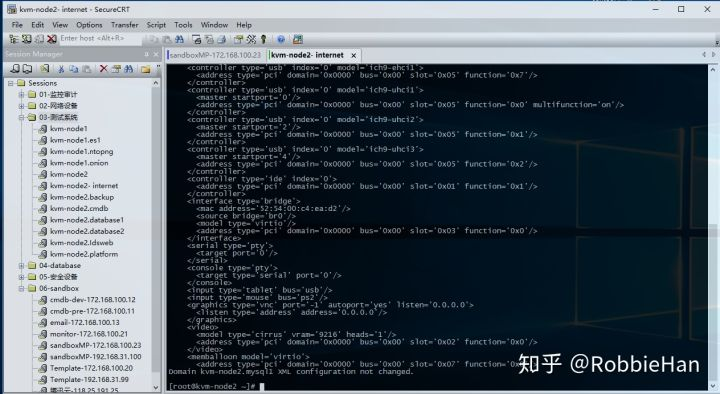

## 1.3 安装Centos7虚拟系统

使用vmware在本地安装centos7系统，网上有很多安装文档，下面提供一份说明作为参考：

```text
https://blog.csdn.net/hellboy0621/article/details/80392273
```

**建议：** 下载我上传在网盘已经安装好的centos7系统，和我的环境保持一致。文件大小943 M，下载时间比较长。下载到本地解压后，使用vmware打开，然后按照1.4中的步骤进行配置。

## 1.4 克隆虚拟机

我们需要准备至少三台虚拟机系统作为本次项目开发测试环境使用，vmware网络配置模式为桥接模式，虚拟机地址配置和物理机地址在同一网段，==虚拟机配置的地址要和我的配置做好对应==，不然后面操作虚拟机系统时，对不上号。

1、下载虚拟机模板系统，下载地址：

```text
链接：https://pan.baidu.com/s/1ILplqC1LEX67kpbVkHkRmg 
提取码：ebsz
```

2、将下载的虚拟机系统文件解压到你存放虚拟机系统的目录，打开vmware，选择【文件】→【打开】，在弹出的窗口中找到存放虚拟机模板系统根目录，选择CentOS7-template文件，点【打开】按钮
3、完成第二部操作后，在vmware管理窗口可以看到左侧多了一个Centos7-template虚拟机文件

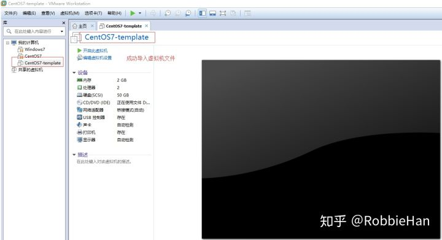

4、右键左侧虚拟机列表中的CentOS7-template，选择【管理】→【克隆】，在弹出窗口中点击【下一步】再次点【下一步】，克隆类型选择【创建完整克隆】→【下一步】，输入新建虚拟机名称，和虚拟机文件存放路径（单独一个目录）。例如下图，我所有的虚拟机都存放在D:\Virtual Machines\，新克隆的虚拟机名称叫做sandboxMP，位置在D:\Virtual Machines\sandboxMP

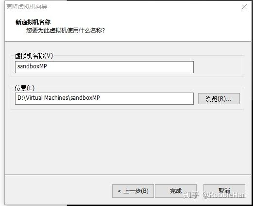

点击完成按钮等待虚拟机克隆结束。

5、克隆完成后在vmware管理窗口左侧会有我们新克隆的虚拟机sandboxMP，点击sandboxMP虚拟机，在sandboxMP虚拟机管理窗口，选择【编辑虚拟机设置】

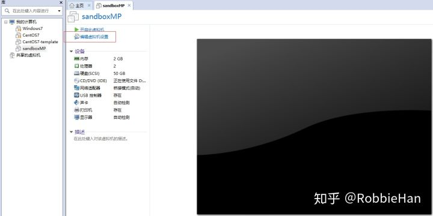

在弹出的窗口中选中【内存】将虚拟机内存设为4G，选择【确定】按钮。

> sandboxMP虚拟机是程序的运行端，如果你机器内存足够的话就分4G内存给虚拟机，另外两台虚拟机每台分1G就行，三台虚拟机一共分6G内存。

6、选择sandboxMP虚拟机管理界面上的【开启虚拟机】，vmware可能会弹出提示说：此虚拟机可能已被移动或复制......。你只要选择【我已复制该虚拟机】即可。

7、虚拟机启动完成后，在vmware中登陆虚拟机，用户名 root， 密码 1234@abcd.com
8、登陆系统后，执行下面命令修改系统ip地址，虚拟机是桥接的，ip地址和你物理机地址同段。

```text
# 使用vim打开编辑ifcfg-eth0文件，然后按字母 o , 窗口下面会出现 -- INSERT -- ,这时候已经进入编辑模式。
# 使用键盘方向键可以移动光标，移动光标到对应位置，修改IP地址（IPADDR）、网关（GATEWAY）和DNS配置（DNS1）
# 完成修改后，按ESC退出编辑模式（窗口下方--INSERT--会消失）。
# 按shift 和：键，进入命令行模式，窗口下方会出现: 输入wq，回车，保存修改退出vim
[root@template ~]# vim /etc/sysconfig/network-scripts/ifcfg-eth0
TYPE="Ethernet"
BOOTPROTO="static"
DEFROUTE="yes"
IPV4_FAILURE_FATAL="no"
NAME="eth0"
UUID="a6129c04-c5b0-4d9e-99f1-645f275b37d8"
DEVICE="eth0"
ONBOOT="yes"
IPADDR="172.16.3.200"
PREFIX="24"
GATEWAY="172.16.3.1"
DNS1="172.16.3.1"
```

9、完成以上配置，回到命令行，重启网卡，让新修改的地址生效，查看地址信息，测试网络连接：

```text
[root@template ~]# systemctl restart network
[root@template ~]# ifconfig
eth0: flags=4163<UP,BROADCAST,RUNNING,MULTICAST>  mtu 1500
        inet 192.168.31.100  netmask 255.255.255.0  broadcast 192.168.31.255
        inet6 fe80::20c:29ff:fecd:6350  prefixlen 64  scopeid 0x20<link>
        ether 00:0c:29:cd:63:50  txqueuelen 1000  (Ethernet)
        '''省略'''

# 测试虚拟机到网关的连通性，ctrl + c 终止命令        
[root@template ~]# ping 172.16.3.1
PING 192.168.31.1 (192.168.31.1) 56(84) bytes of data.
64 bytes from 172.16.3.1: icmp_seq=1 ttl=64 time=0.653 ms
64 bytes from 172.16.3.1: icmp_seq=2 ttl=64 time=0.805 ms

# 测试虚拟机到互联网连通性，ctrl + c 终止命令
[root@template ~]# ping 8.8.8.8
PING 8.8.8.8 (8.8.8.8) 56(84) bytes of data.
64 bytes from 8.8.8.8: icmp_seq=1 ttl=41 time=46.9 ms
64 bytes from 8.8.8.8: icmp_seq=2 ttl=41 time=46.8 m

# 测试虚拟机是否可以解析域名，ctrl + c 终止命令
[root@template ~]# ping www.sina.com.cn
PING spool.grid.sinaedge.com (101.71.100.123) 56(84) bytes of data.
64 bytes from 101.71.100.123 (101.71.100.123): icmp_seq=1 ttl=57 time=9.99 ms
64 bytes from 101.71.100.123 (101.71.100.123): icmp_seq=2 ttl=57 time=10.1 ms
```

如果以上测试有问题，请检查虚拟机IP地址配置，虚拟机网络接入模式和DNS配置是否正确。

**重复4到9步骤，再克隆两个虚拟机，名称(IP)分别为server1（172.16.3.101），server2（172.16.3.102）内存设置1G即可。**

## 2 虚拟机系统配置

上面已经完成了虚拟机克隆工作，现在vmware中的虚拟机开启，项目中提供的系统模板已经做了一些基础配置，接下来完成一些基础软件安装工作。

## 2.1 使用secureCRT工具SSH连接系统

1、打开CRT工具，选择【File】→【Quick Connect】在弹出的窗口中输入sandboxMP虚拟机地址：172.16.3.100，点【Connect】按钮；
2、在Enter SSH Username窗口输入用户名: root ，勾选【Save username】，点【OK】；
3、在Enter Secure Shell Password窗口输入密码：1234@abce.com，勾选【Save password】，点【OK】成功登陆系统，接下来就可以在CRT中操作系统了。

4、在CRT左侧Session Manager管理窗口，右键刚刚添加的连接172.16.3.100，选择 Propertise，设置连接name，修改终端模式，备注信息等：

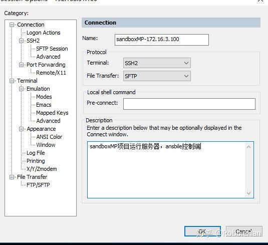

修改终端仿真模式为Linux，这项系统中的命令、代码和文件都会有linux高亮的效果

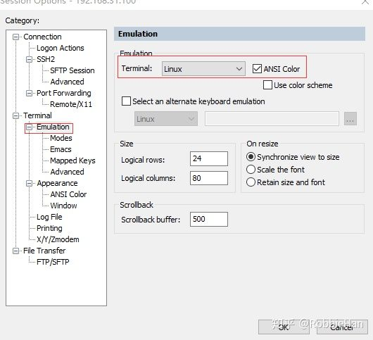

按照上面方法将另外两台虚拟机也添加到secureCRT，也可以复制刚才建立好的链接，然后修改名称和SSH2中的 hostname信息。

## 2.2 sandboxMP虚拟机环境配置

1、基础配置：使用secureCRT登陆sandboxMP虚拟机终端，完成以下配置：

```text
# 1.修改系统登陆后的提示信息。
# vim修改模式切换和编辑保存操作，前面在修改IP地址时已经使用过；
# 将motd内容改为：sandboxMP 172.16.3.100 （上下各空一行）；
# 这样在登陆系统是的时候就可以看到提示上面的提示信息。
[root@template ~]# vim /etc/motd

sandboxMP 172.16.3.100

# 2.修改主机名，exit退出系统，按回车重新连接系统，就可以看到新的提示信息和主机名
[root@template ~]# hostnamectl set-hostname sandboxmp
[root@template ~]# exit
```

另外两台虚拟机的主机名和登陆信息按照上面进行修改

2、安装python3.6：系统中默认带有python2.7，项目中使用的是python3.6.6

```text
# 1.可以去官网下载python3.6.6(Source release Gzip)，也可以在linux下使用wget下载
[root@sandboxmp ~]# yum -y install wget
[root@sandboxmp ~]# wget https://www.python.org/ftp/python/3.6.6/Python-3.6.6.tgz

# 2.安装pip和环境依赖包
[root@sandboxmp ~]# yum -y install epel-release
[root@sandboxmp ~]# yum -y install python-pip
[root@sandboxmp ~]# pip install --upgrade pip
[root@sandboxmp ~]# yum -y install zlib zlib-devel bzip2 bzip2-devel openssl openssl-devel ncurses ncurses-devel sqlite sqlite-devel readline readline-devel gcc make python-devel

# 3.安装python3.6(编译安装完成执行 echo $? 返回0安装成功，否则安装出错)
[root@sandboxmp ~]# tar -zvxf Python-3.6.6.tgz
[root@sandboxmp ~]# cd Python-3.6.6
[root@sandboxmp Python-3.6.6 ~]# ./configure
[root@sandboxmp Python-3.6.6 ~]# make && make install
[root@sandboxmp Python-3.6.6 ~]# echo $?
0

# 4.安装成功后，就可以使用python3环境
[root@sandboxmp ~]# python3
Python 3.6.6 (default, Nov 26 2018, 16:19:34) 
''''''
```

3、安装python虚拟环境：在项目中还是使用虚拟环境，项目环境互不影响

```text
# 1.安装 virtualenv virtualenvwrapper
[root@sandboxmp ~]# pip install virtualenv virtualenvwrapper

# 2.设置环境变量，使用vim编辑.bashrc在最后面添加最后两行内容
[root@sandboxmp ~]# vim ~/.bashrc
# .bashrc

# User specific aliases and functions

alias rm='rm -i'
alias cp='cp -i'
alias mv='mv -i'

# Source global definitions
if [ -f /etc/bashrc ]; then
        . /etc/bashrc
fi
# 下面两行是新增加内容
export WORKON_HOME=$HOME/.virtualenvs
source /usr/bin/virtualenvwrapper.sh

# 3.保存修改，退出vim，运行命令让变量生效
[root@sandboxmp ~]# source ~/.bashrc

# 4.现在可以在bash窗口使用mkvirtualnev来创建虚拟环境了
[root@sandboxmp ~]# mkvirtualenv -p /usr/local/bin/python3.6 sandboxMP
Running virtualenv with interpreter /usr/local/bin/python3.6
Using base prefix '/usr/local'
New python executable in /root/.virtualenvs/sandboxMP/bin/python3.6
Also creating executable in /root/.virtualenvs/sandboxMP/bin/python
Installing setuptools, pip, wheel...
done.
......

# 5.创建完成系统自动进入了虚拟环境sandboxMP
(sandboxMP) [root@sandboxmp ~]# 

# 6.离开虚拟环境
(sandboxMP) [root@sandboxmp ~]# deactivate 
[root@sandboxmp ~]# 

# 7.查看虚拟环境
[root@sandboxmp ~]# workon
sandboxMP
[root@sandboxmp ~]# 

# 8.激活虚拟环境
[root@sandboxmp ~]# workon sandboxMP
(sandboxMP) [root@sandboxmp ~]#
```

通过上面配置，指定使用python3.6来创建一个虚拟环境，虚拟环境名称为sandboxMP，虚拟环境存放的目录在/root/.virtualenvs目录下，这个是由上一步环境变量设置的。

## 2.3 Pycharm远程调试

在Django实战1中，一直使windws本地开发环境，后续项目中使用的部分依赖包不支持windows系统，但是个人工作原因又必须使用windows，所以本节将会介绍使用Pycharm远程调试功能，注意只有Pycharm专业版才具有远程调试功能。

## 2.3.1 远程部署配置

通过远程部署功能，可以将本地代码与服务器上的代码进行同步，在本地做完代码修改后，可以同步到远程服务器，使用服务器上的环境运行代码，进行代码调试。前面部署的sandboxMP虚拟机就是用来作为远程部署调试的服务器。

1、使用pycharm打开项目sandboxMP 2、选择Tools → Deployment → Configuration...

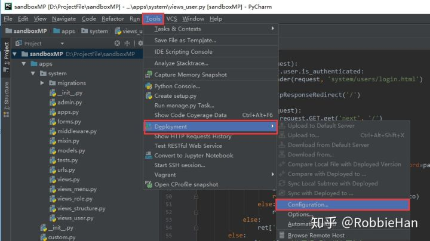

3、点击 + 添加一个新的Deployment配置

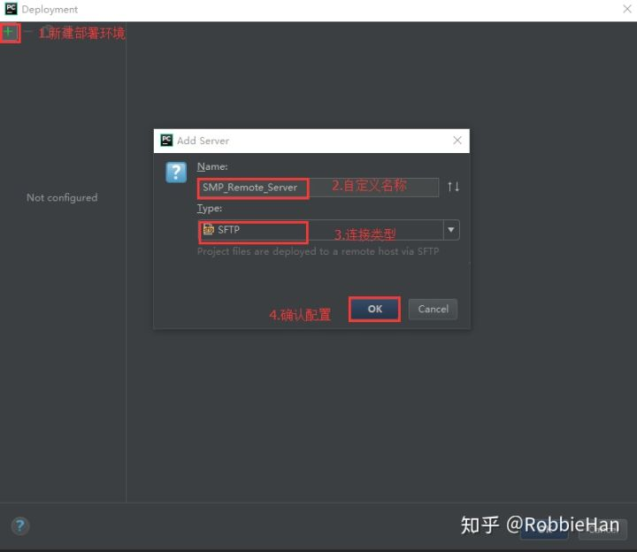

4、在Connection选项中配置远程服务器连接信息和文件同步目录

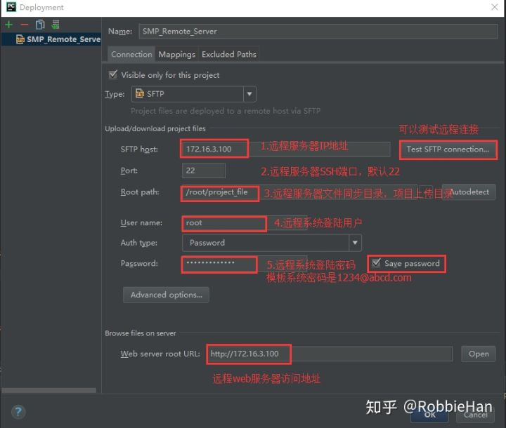

5、选择选项卡中的Mappings，配置映射关系

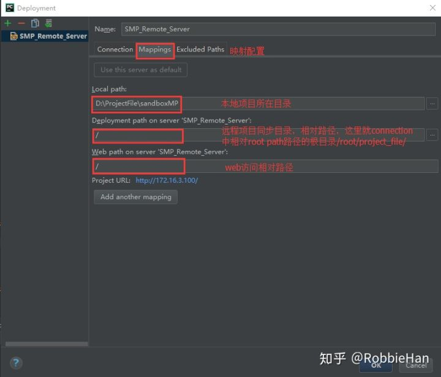

6、在Excluded Paths选项下可以配置排除同步的文件

7、完成以上配置点击【ok】按钮，保存配置信息。

8、相中左边项目根目录，选择Tools → Deployment 可以看到多处了很多可用选项，其中作用分别是：

> Upload to SMP_Remote_Server: 同步项目文件到远程目录；
> Download from SMP_Remote_Server: 从远程目录下载项目文件到本地；
> Automatic Upload: 启用自动上传，启用后我们在本地修改项目文件，会自动上传到远程服务器；
> Browser Remote Host：浏览远程服务器，可以打开一个窗口查看远程服务器上的代码。

9、第4步设置了远程同步目录是：/root/project_file，需要在远程服务器创建这个目录，使用CRT连接sandboxMP虚拟机，创建新的目录：

```text
[root@sandboxmp ~]# mkdir project_file
```

10、手动同步项目到远程服务器，项目中没有启用自动同步，采用手动同步，手动同步方式可以使用第8步中介绍的Upload to SMP_Remote_server ，也可以在pycharm左侧右键项目更目录，选择Upload to SMP_Remote_server

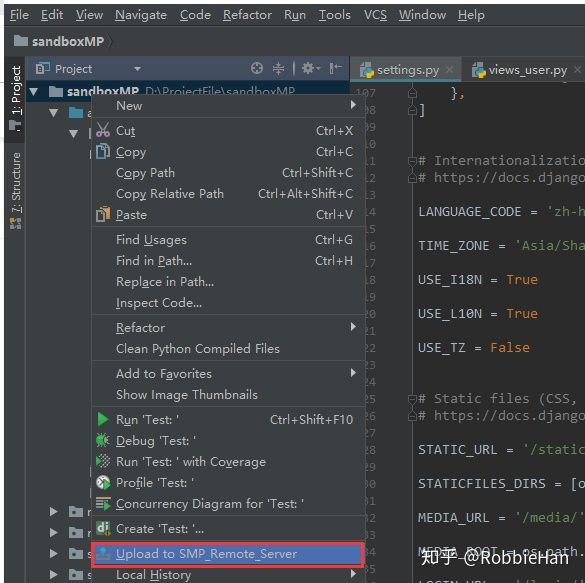

选中同步操作后，pycharm下方会有一个File Transfer 窗口会显示同步信息：

```text
[2018/11/26 18:35] Upload to SMP_Remote_Server
[2018/11/26 18:35] Upload to SMP_Remote_Server completed in less than a minute: 1,206 files transferred (2.8 Mbit/s)
```

完成同步操作，使用CRT登陆sandboxMP虚拟机，在project_file目录中就可以看到我们的项目文件了：

```text
[root@sandboxmp ~]# ls -l /root/project_file/
total 244
drwxr-xr-x 3 root root   4096 Nov 26 18:35 apps
-rw-r--r-- 1 root root 221184 Nov 26 17:11 db.sqlite3
-rw-r--r-- 1 root root    556 Oct 15 15:43 manage.py
drwxr-xr-x 3 root root   4096 Nov 26 18:35 media
drwxr-xr-x 2 root root   4096 Nov 26 18:35 requirements
drwxr-xr-x 2 root root   4096 Nov 26 18:35 sandboxMP
drwxr-xr-x 7 root root   4096 Nov 26 18:35 static
drwxr-xr-x 3 root root   4096 Nov 26 18:35 templates
```

## 2.3.2 使用远程环境

远程部署，并不仅仅是将项目代码同步到远程服务器，而是要使用远程解释器来运行和调试项目，远程环境配置如下：
1、安装项目依赖包：使用CRT连接sandboxMP虚拟机，在虚拟环境中安装项目依赖包：

```text
[root@sandboxmp ~]# workon sandboxMP
(sandboxMP) [root@sandboxmp ~]# pip install -r /root/project_file/requirements/dev.txt
```

虚拟机将会安装dev.txt文件中的django和pillow环境，注意：要确认你已经按照django实战1中第19节内容设置了dev.txt文件内容。
下面是后面章节中都会使用到的环境依赖包，可以在虚拟环境一次安装：

```text
# 把下面内容写到本地项目sandboxMP/requirements/dev.txt文件中
# 然后右键该文件选择：Upload to SMP_Remote_Server
# 最后再到远程服务器虚拟环境中执行上面的安装命令
django==2.1.2
pillow==5.3.0
ipython==7.1.1
pyyaml==3.13
ruamel.yaml==0.15.80
python-nmap==0.6.1
redis==3.0.1
pymongo==3.7.1
paramiko==2.4.2
```

2、在pycharm窗口左上角，选择 File → settings... → Project：sandboxMP → Project Interpreter → Add Remote...

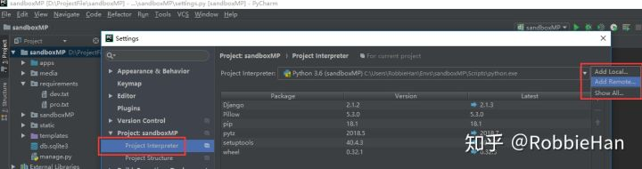

3、在弹出窗口选中SSH Credentials，填写远程服务器IP地址，用户名，密码（默认1234@abcd），选择远程环境路径（sandboxMP虚拟机中配置的虚拟python环境），配置完成点OK确认。

```text
# Python Interpreter path
/root/.virtualenvs/sandboxMP/bin/python
```

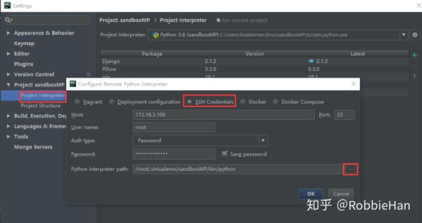

4、设置运行参数：现在项目是在远程服务器上运行，所以需要修改运行参数，保障项目运行后可以正常访问，在pycharm右上角运行按钮旁下拉窗口，选择Edit Configurations

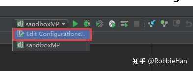

5、在弹出窗口中，选择 + 新建一个运行环境，选择Django server

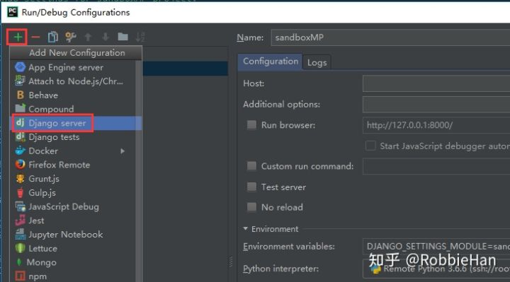

6、配置Name 为SMP_Remote ，配置Host为172.16.3.100，点OK保存配置

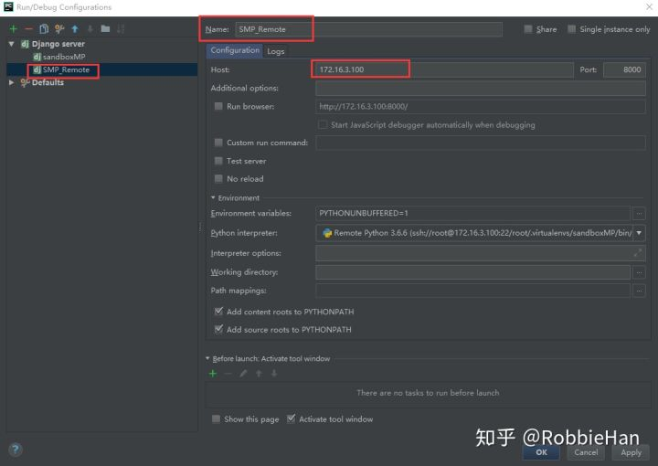

7、选择SMP_Remote ，点击项目运行按钮

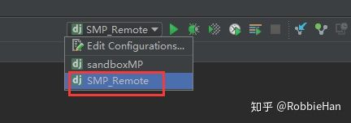

8、查看运行结果：可以看到pycharm使用的是远程解释器，运行的是远程服务器上的项目

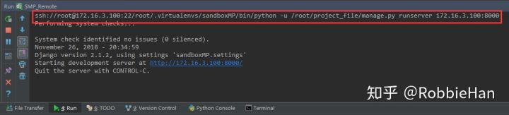

9、访问项目：这时访问项目，是会报错的

```text
# 项目访问地址
http://172.16.3.100:8000

# 错误信息
Invalid HTTP_HOST header: '172.16.3.100:8000'. You may need to add '172.16.3.100' to ALLOWED_HOSTS.
```

10、修改项目文件，解决上面错误，并同步到远程服务器

```text
# 修改sandboxMP/sandboxMP/settings.py中的ALLOWED_HOSTS = []内容
ALLOWED_HOSTS = ['*']
```

右键项目根目录sandboxMP，选择Upload to SMP_Remote_Server，上传完成项目会自动重启，这时再访问项目就不会再报错了。

**如果觉得每次修改配置后手动同步比较麻烦，可以参考文档中配置，启用自动同步功能。如果项目可以运行，却无法访问请确认系统是否启用了防火墙**

> 本节文档对应源码版本： [https://github.com/RobbieHan/sandboxMP/tree/v2.01](https://link.zhihu.com/?target=https%3A//github.com/RobbieHan/sandboxMP/tree/v2.01)

# 02：更换数据库和数据迁移

> 上节搭建了虚拟机环境，部署了远程调试模式，所以本节将把数据库从sqlite3换到mysql，并把权限管理的基础数据导入mysql。

## 1 安装数据库

## 1.1 安装Mysql

使用CRT连接sandboxMP虚拟机系统，更新yum源文件，并安装mysql，操作过程如下：

```text
# 1.安装Mysql
[root@sandboxmp ~]$ wget http://repo.mysql.com/mysql-community-release-el7-5.noarch.rpm
[root@sandboxmp ~]$ rpm -ivh mysql-community-release-el7-5.noarch.rpm
[root@sandboxmp ~]$ yum -y update
[root@sandboxmp ~]$ yum install mysql-server

# 2.修改配置文/etc/my.cnf，在[mysql]标签下添加后面三行内容，保存退出vim
[root@sandboxmp ~]$ vim /etc/my.cnf
[mysqld]
collation-server = utf8_unicode_ci  
character_set_server=utf8
init_connect='SET NAMES utf8'

# 3.启动mysql，设置开机启动，为root用户设置密码
[root@sandboxmp ~]$ systemctl start mysqld
[root@sandboxmp ~]$ systemctl enable mysqld
[root@sandboxmp ~]$ mysql

mysql> set password for 'root'@'localhost'=password('1234@abcd.com');
mysql> exit

# 4.再次连接Mysql会提示要使用密码，连接方式如下，回车，根据提示输入密码
[root@sandboxmp ~]$ mysql -uroot -p
Enter password: 
Welcome to the MySQL monitor.  Commands end with ; or \g.
''''''
mysql> 

# 5.创建数据库，添加用户和访问授权
mysql> CREATE DATABASE sandboxMP;
mysql> GRANT ALL PRIVILEGES ON sandboxMP.* TO 'ddadmin'@'%' IDENTIFIED BY '1234@abcd.com';
mysql> GRANT ALL PRIVILEGES ON sandboxMP.* TO 'ddadmin'@'localhost' IDENTIFIED BY '1234@abcd.com';
```

==**备注：项目中是使用root用户登录的Linux系统，系统默认提示符是#号结尾，例如：[root@sandboxmp ~]#。因在文档代码段中，#被识别成了注释信息，所以在代码段中，涉及Linux系统操作的命令，我会把提示符写成$ 。**==

## 1.2 设置数据库连接

## 1.2.1 从SQLite3中导出权限管理的相关数据

使用CRT连接sandboxMP虚拟机系统，执行如下操作：

```text
[root@sandboxmp ~]# workon sandboxMP
(sandboxMP) [root@sandboxmp ~]$ cd /root/project_file/
(sandboxMP) [root@sandboxmp project_file]$ python manage.py dumpdata system > system_data.json
(sandboxMP) [root@sandboxmp project_file]$ ls -l
```

> **知识点介绍：** django提供了dumpdata方法可以用来简单执行数据导出，命令格式：python manage.py dumpdata [app_name] 后面跟的是app 的名字。

## 1.2.2 设置数据库连接

使用pycharm打开本地项目，修改sandboxMP/sandboxMP/settings.py配置文件中数据库配置：

```text
DATABASES = {
    'default': {
        'ENGINE': 'django.db.backends.mysql',
        'NAME': 'sandboxMP',
        'HOST': '127.0.0.1',
        'USER': 'ddadmin',
        'PASSWORD': '1234@abcd.com',
        'PORT': '3306'
    }
}
```

## 1.2.3将改动同步到远程服务器

- Pycharm远程部署支持自动上传，只需要在 Tools → Deployment 下选中Automatic Upload，完成配置后你在Pycharm中对项目做的修改都会自动上传到远程服务器。
- 也可以采用手动上传，选择项目根目录上传整个项目，选择项目文件上传单个文件。例如在Pycharm左侧项目列表中找到刚刚修改的settings.py文件，右键settings.py，选择Upload to SMP_Remote_Server，将修改后的文件上传到服务器。

## 1.2.4 设置保存项目后自动上传

在项目中修改了多个文件后采用手动一个一个上传还是挺麻烦的，上传整个项目又没有必要，但是又不想自动同步的频率太高，这时候就可以设置成按ctrl+s键 后自动上传修改的文件。
选择Tools → Deployment → Automatic Upload，启用自动上传功能。

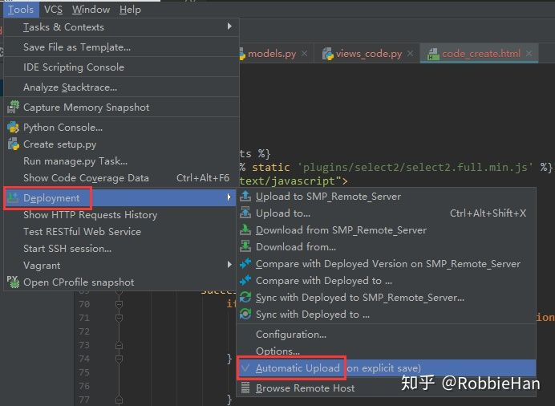

选择Tools → Deployment → Options...，配置自动上传模式为：On explicit save(Ctrl+S)

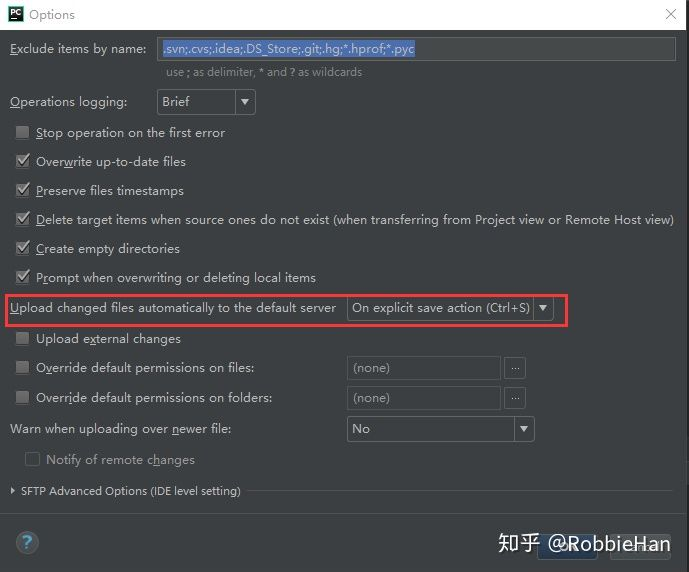

完成以上配置，在本地修改完代码后，按下Ctrl+S Pycharm会自动将代码上传到远程服务器。

==**注意：因为项目是在远程服务器上部署运行，所以当修改项目代码后，想要查看运行效果，记得按下Ctrl+S 保存代码并自动上传到远程服务器，如果pycharm中项目是运行状态，当代码上传成功后，pycharm会自动重启项目，运行更新后的代码。**==

## 1.2.5 将数据导入mysql 

回到CRT命令终端（保留了上面操作的虚拟环境和目录，如果你已经退出了，请重新进入用虚拟环境和进入项目目录）

```text
# 1.防止安装mysqlclient报错：EnvironmentError: mysql_config not found，先安装下面两个包
(sandboxMP) [root@sandboxmp project_file]$ yum -y install mysql-devel libmysqlclient-dev 

# 2.使用mysql数据库，需要安装mysqlclient
(sandboxMP) [root@sandboxmp project_file]$ pip install mysqlclient

# 3.生成数据表，导入数据库
(sandboxMP) [root@sandboxmp project_file]$ python manage.py migrate
(sandboxMP) [root@sandboxmp project_file]$ python manage.py loaddata system_data.json
```

完成以上操作可以使用Navicat连接我们的mysql数据库（172.16.3.100）查看有没有数据信息，或者运行项目，测试是否可以登陆系统和查看系统权限数据。

## 2.安装redis

项目中会使用celery来做分布式任务队列，用来处理比较耗时的操作，例如发送邮件，资产扫描等操作。我们使用redis来做中间人，用来存储任务队列和接受返回值。
使用CRT连接sandboxMP虚拟机系统，执行下面命令安装redis:

```text
# 1.安装扩展源（前面我们已经安装过扩展源epel-release）和redise
[root@sandboxmp ~]$ yum install epel-release
[root@sandboxmp ~]$ yum install redis

# 2.修改redis配置文件找到bind去掉前面的注释符号，ip改为0.0.0.0,保存退出
[root@sandboxmp ~]$ vim /etc/redis.conf
bind 0.0.0.0

# 3.启动redise和设置开机启动
[root@sandboxmp ~]$ systemctl start redis
[root@sandboxmp ~]$ systemctl enable redis
```

redis基础入门参考资料：

```text
http://www.runoob.com/redis/redis-tutorial.html
```

## 3.安装mongodb

项目中mongodb用来存储日志信息，安装方法如下：

使用CRT连接sandboxMP虚拟机系统，执行下面命令安装mongodb:

```text
# 1.配置yum源文件，添加mongo安装源，保存退出
[root@sandboxmp ~]$ vim /etc/yum.repos.d/mongo.repo
[mongodb-org-3.4]
name=MongoDB 3.4 Repository
baseurl=https://repo.mongodb.org/yum/redhat/$releasever/mongodb-org/3.4/x86_64/
gpgcheck=0
enabled=1

# 2.安装mongodb， 修改bindIp(把地址改成0.0.0.0后，保存退出)
[root@sandboxmp ~]$ yum install mongodb-org
[root@sandboxmp ~]$ vim /etc/mongod.conf
bindIp 0.0.0.0 # 修改bindIp

# 3.启动mongodb，设置开始启动
[root@sandboxmp ~]$ systemctl start mongod
[root@sandboxmp ~]$ systemctl enable mongod
```

**关于mysql、redis、mongodb网上有好多入门教程，有兴趣的朋友可以找来学习下。**

> 本节文档对应源码版本： [https://github.com/RobbieHan/sasandboxMP/tree/v2.02](https://link.zhihu.com/?target=https%3A//github.com/RobbieHan/sandboxMP/tree/v2.02)

# 03：创建配置管理APP

> 本节主要介绍如何在权限管理的基础上创建新的APP和URL配置以及权限授权，同时创建字典管理模型，这里的字典并不是python中的数据类型，而是项目中需要用到基础数据，例如：网络类型、服务类型、业务类型等基础资源数据。

==**因为项目已经迁移到远程环境部署，所以每节内容开始前，请确保远程服务器sandboxMP(172.16.3.100)是开启的且可访问的。**==

## 1 配置管理app的创建和设置

## 1.1 创建新的app

使用pycharm打开本地项目，选择工具栏中 Tools → Run manage.py Task...，在运行窗口中输入 startapp cmdb

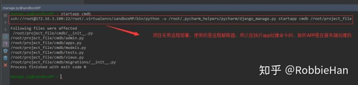

注意：项目中采用的是远程部署，使用的是远程解释器，所以在执行startapp，新的app是在服务端创建的。

## 1.2 将服务端创建的app同步到本地

1、在pycharm中选择 Tools → Deplorment → Browse Remote host，这时在pycharm右侧会打开远程服务器sandboxMP(172.16.3.100)上的项目文件。
2、右键pycharm右侧远程服务器项目中新建的app目录：cmdb，选择Download from here，可以将app下载到本地，如果在pycharm右侧远程目录看不到新建的app，可以点右窗口上的刷新按钮（看图说话）。

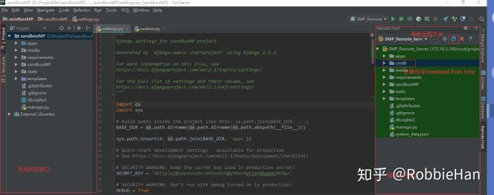

3、在pycharm左侧本地项目文件窗口中拖动刚刚下载的app文件目录：cmdb，拖动到apps目录下。

4、按下CTRL + S 将本地改动同步到远程服务器sandboxMP(172.16.3.100)，完成项目创建。（==注意你的上传模式一定要和我的保持一致，具体设置参考第二节中1.2.4==）

## 1.3 将新建app加到配置文件

打开本地项目文件sandboxMP/sandboxMP/settings.py，将新建的app添加到INSTALLED_APPS：

```text
INSTALLED_APPS = [
    '...原有内容省略...'
    'cmdb',
]
```

按下CTRL + S 保存并上传项目。

## 1.4 创建字典管理模型

打开本地项目文中sandboxMP/apps/cmdb/models.py，写入如下内容：

```text
class AbstractMode(models.Model):
    parent = models.ForeignKey(
        'self', blank=True, null=True, on_delete=models.SET_NULL, related_name='child'
    )

    class Meta:
        abstract = True


class Code(AbstractMode):
    key = models.CharField(max_length=80, verbose_name='键')
    value = models.CharField(max_length=80, verbose_name='值')
    desc = models.CharField(max_length=100, blank=True, default='', verbose_name='备注')

    class Meta:
        verbose_name = '字典'
        verbose_name_plural = verbose_name
```

在pycharm中按下CTRL + S 保存上传配置到远程服务器，pycharm底部窗口中有个File Transfer窗口会显示文件上传情况。
在pycharm中选择工具栏中 Tools → Run manage.py Task...，在运行窗口中输入下面命令，将模型生成数据库内容：

```text
makemigration cmdb
migrate cmdb
```

知识点介绍：
1、在上面我们创建了一个模型Code用来存储基础字典数据，它有三个自定义字段：key、value、desc，还有一个通过模型继承获得的parent字段，这是一个外键，关联关系指向self。
2、模型继承：在上面创建的模型中，使用了模型继承中的抽象基类实现，Django中的模型继承与python中普通继承方式基本相同，在模型中可以将一些特有信息放到父类中，子模型通过继承来获取这些信息。
3、抽象基类：抽象基类在模型继承中是非常有用的，可以将一些共有信息放到一个基类，这个基类需要在Meta类中设置abstract=True，这样这个模型不会被用来创建任何数据表，只能作为父类继承。子类和抽象基类中的字段不能重名，否则将会触发异常错误。

## 2 配置管理入口实现

## 2.1 创建配置管理入口访问视图

打开sandboxMP/apps/cmdb/views.py，输入下面内容：

```text
from django.views.generic import TemplateView

from system.mixin import LoginRequiredMixin
from custom import BreadcrumbMixin


class CmdbView(LoginRequiredMixin, BreadcrumbMixin, TemplateView):

    template_name = 'cmdb/cmdb_index.html'
```

视图中继承了用户用户登录验证的Mixin类：LoginRequiredMixin， 返回面包屑导航的Mixin类：BreadcrumbMixin，Django的通用视图类TemplateView，这些类在第一阶段文档中已经完成了定义和介绍。

## 2.2 配置访问URL

新建URL文件：sandboxMP/apps/cmdb/urls.py，输入如下内容：

```text
from django.urls import path

from .views import CmdbView

app_name = 'cmdb'

urlpatterns = [
    path('', CmdbView.as_view(), name='index'),
]
```

修改 sandboxMP/sandboxMP/urls.py， 添加下面内容：

```text
urlpatterns = [
    '''原有内容省略'''
    path('cmdb/', include('cmdb.urls', namespace='cmdb')),

]
```

## 2.3 配置管入口模板页

新建文件夹：sandboxMP/templates/cmdb，在目录中添加模板文件：cmdb_index.html，模板内容如下：

```text






    <!-- Main content -->
  <section class="content">
    这里是配置管理首页（临时内容）

  </section>

    <!-- /.content -->







```

完成以上配置，在pycharm中按下CTRL + S 保存上传项目文件，运行项目，注意选择pycharm右上角运行按钮旁边的运行环境配置：SMP_Remote。

这时候访问配置管理入口的URL是会报告404的，因为新建的访问URL并不在权限授权内。

```text
http://172.16.3.100:8000/cmdb/
用户名：admin  密码：!qaz@wsx
```

## 2.4 权限管理配置

在 《Django实战1-权限管理功能实现-18：RBAC权限模型最终实现》一节介绍了权限管理URL添加的规范和权限分配方法。本节中新建了一个APP，同时创建了APP入口访问URL，想要在页面显示和访问APP内容，需要把它添加到权限管理中。

名称 | 编号 | 图标 | 父菜单 | URL | 代码 ---|---|---|---|---|--- 配置管理|2.0| | |/cmdb/|CMDB|

**每次写完新的视图，配置权限内容的时候请按照上面表格记录URL数据信息，保证菜单添加无误，否则会影响权限系统的使用。**

登陆系统，访问菜单管理页【系统】→ 【权限管理】→ 【菜单管理】，按照上面URL内容，将数据添加到菜单管理中：

```text
http://172.16.3.100:8000/system/rbac/menu/
```

访问角色管理页【系统】→ 【权限管理】→ 【角色管理】，选择【系统管理】后面第三个树形按钮配置权限信息，将新配置的URL授权给角色组：系统管理 （注意将左侧所有菜单折叠全选，别遗漏了），选择好菜单后点【生成】按钮

```text
http://172.16.3.100:8000/system/rbac/role/
```

刷新页面，在头部就可以看到一个新的导航菜单【配置管理】

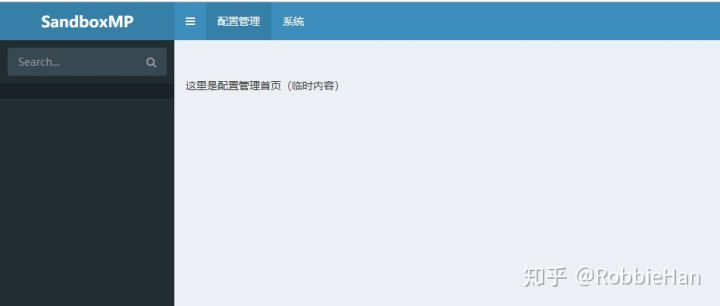

> 本节文档对应源码版本： [https://github.com/RobbieHan/sandboxMP/tree/v2.03](https://link.zhihu.com/?target=https%3A//github.com/RobbieHan/sandboxMP/tree/v2.03)

# 04：知识扩展-logging日志模块

> 日志在程序开发中是非常重要的。在生产环境下，通过日志我们可以查看程序错误信息，处理程序异常。Django利用了python提供的logging模块来记录系统日志。

**本节内容参考自Django官方文档，并结合实例进行功能实现演示，必要时请查阅python标准库有关logging模块的使用说明，确保你能够完全理解本节内容，然后才能进入下一节。**

## 1 日志模块logging基本介绍

## 1.1 logging的组成

python的logging模块由四部分组成： - Loggers ：用户使用的直接接口，将日志传递给Handler - Handlers：控制日志输出到哪里，console，file… ，一个logger可以有多个Handler - Filters：控制哪些日志可以从logger流向Handler - Formatters：控制日志的格式

**Loggers**

Logger是日志系统的入口。每个logger都是一个带有名称的bucket，你可以通过这个bucket写入需要处理的日志信息。
每个logger都有一个日志级别，日志级别表示该logger将要处理的消息的严重性。python定义的日志级别有：

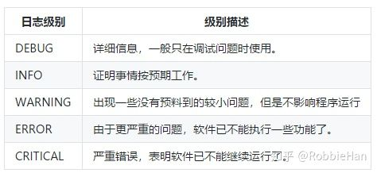

写入logger的每条消息都是一个日志记录。每个日志记录也具有一个日志级别，它表示对应的消息的严重性。每个日志记录还可以包含描述正在打印的事件的有用元信息。 这些元信息可以包含很多细节，例如回溯栈或错误码。

当一条消息传递给logger时，消息的日志级别将与logger的日志级别进行比较。 如果消息的日志级别大于等于logger 的日志级别，该消息将会往下继续处理。 如果小于logger的日志级别，该消息将被忽略。

Logger一旦决定消息需要处理，它将传递该消息给一个Handler。

**Handlers**

Handler决定如何处理logger中的每条消息。 它描述一个特定的日志行为，例如将消息写到屏幕上、写到文件中或者写到网络socket。

与logger一样，handler也有一个日志级别。如果消息的日志级别小于handler的级别，handler将忽略该消息。

Logger 可以有多个handler，而每个handler 可以有不同的日志级别。利用这种方式，可以根据消息的重要性提供不同形式的处理。 例如，你可以用一个handler将CRITICAL和ERROR消息发送给一个页面服务，而用另外一个hander将所有的消息（包括ERROR和CRITICAL消息）记录到一个文件中用于以后进行分析。

**Filters**

Filter用于对从logger传递给handler的日志记录进行额外的控制。

通过filter，你可以对日志处理添加额外的条件。例如，你可以配置一个filter，只允许处理来自特定源的ERROR 消息。

Filters 还可以用于修改将要处理的日志记录的优先级。例如，如果日志记录满足特定的条件，可以编写一个filter 将日志记录从ERROR 降为WARNING。

Filters可以注册到loggers或handlers；可以将多个filters链接起来执行多个过滤操作。

**Formatters**

最后，日志记录需要转换成文本。Formatter用来定义日志最终输出的格式。我们可以编写自定义formatters来实现特定的格式化行为。

对于知识点的学习学习和理解始终都是枯燥的，接下来通过几个例子来进一步了解logging各部分的作用。

## 1.2 简单的日志输出

使用pycharm 打开sandboMP项目，接下的操作都在sandboxMP/apps/cmdb/tests.py中完成。
在sandboxMP/apps/cmdb/tests.py文件中写入如下内容：

```text
import logging

logging.warning('Watch out!')
logging.info('I told you so')
```

按下Ctrl+S 保存并自动上传代码到远程服务器，右键tests.py文件，选择【Run tests】，在pycharm控制台可以看到info记录的信息没有输出，这是因为logging默认输出级别为WARNING级别。


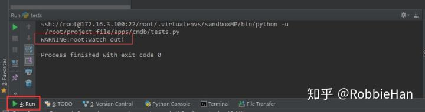


控制台中输出的日志信息为：WARNING:root:Watch Out!，日志的输出使用了basicConfig默认的日志格式：

```text
severity:logger name:message
```

## 1.3 将日志输出到文件

1.2中提到logging默认输出日志级别是WARNING，同时还提到日志输出格式是severity:logger name:message。这些信息都是在basicConfig中的默认配置，通过使用basicConfig方法能够满足基本需求，也可以通过指定参数来设置日志输出级别和日志输出的文件名，例如下面将日志输出到文件的实现。
将下面代码写入sandboxMP/apps/cmdb/tests.py，按下Ctrl+S保存并同步到远程服务器。

```text
import logging

logging.basicConfig(filename='/root/project_file/example.log', level=logging.DEBUG)

logging.debug('This message should go to the log file')
logging.info('So should this')
logging.warning('And this, too')
```

> **说明：** 上面例子中，使用了basicConfig方法，通过参数filename设置了日志输出文件路径，通过level定义了日志输出级别为DEBUG。
> **注意：** 因为pycharm采用的是远程部署模式，程序是运行在远程服务器上，所以这里指定的路径是远程服务器上项目根目录。

运行test.py，因为上面已经运行过一次，所以在pycharm右上角有快捷运行选项，可以直接运行：


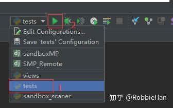


完成运行操作以后使用CRT工具连接sandboxMP远程服务器，执行下面命令查看日志文件：

```text
[root@sandboxmp ~]$ cat /root/project_file/example.log 
DEBUG:root:This message should go to the log file
INFO:root:So should this
WARNING:root:And this, too
[root@sandboxmp ~]$
```

除了登陆远程服务器查看项目文件外，pycharm远程部署功能还提供了浏览远程服务器上项目文件的功能，在pycharm上选择Tools → Deployment → Browse Remote Host。


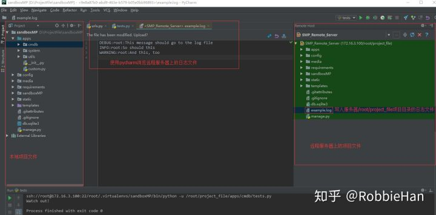


通过日志文件可以看到，将level设置为DEBUG后，三条日志内容都输出到文件中了。
basicConfig方法除了可以配置日志输出级别和文件外，该方法可选参数还有：

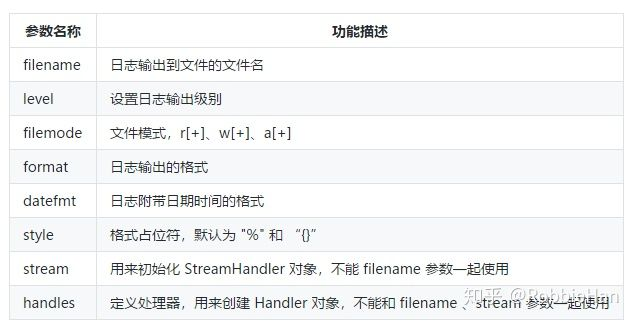

一份日志基本信息应该包含日志的发生时间，所以上面的日志并不完善，让我们利用上面的这些参数来自定义日志输出格式，完善日志输出信息，修改test.py中的配置：

```text
import logging

logging.basicConfig(
    filename='/root/project_file/example.log',
    level=logging.DEBUG,
    format='%(asctime)s %(levelname)s:%(message)s',
    datefmt='%Y-%m-%d %H:%M:%S',
)

logging.debug('This message should go to the log file')
logging.info('So should this')
logging.warning('And this, too')
```

按下Ctrl+S保存并上传，运行test.py，打开example.log文件，查看日志信息（日志文件的查看方法上面已经介绍了两种方法）：

```text
2018-12-01 21:00:03 DEBUG:This message should go to the log file
2018-12-01 21:00:03 INFO:So should this
2018-12-01 21:00:03 WARNING:And this, too
```

对比下前后两次日志输出的格式，理解下日志输出的基本配置。

如果你对日志记录需求比较简单，上面演示的基本功能就可以满足你的需求，接下来将介绍logging更多高级功能。

## 2 logging使用进阶

前面介绍了logging包含了四个组件：Logger、Handler、Filter、Formatter。

## 2.1 命名loggers

日志功能都是调用Logger类实例方法，可以通过logging.getLogger()调用获取一个logger实例，并且可以指定一个名称来标致这个实例，例如：

```text
logger = logging.getLogger('sandbox')
```

在命名logger时，可以用点分割名称来表示层级关系，例如 sandbox.cmdb.scaner。

Logger的名称习惯上通常使用**name**，即包含该logger的Python模块的名字：

```text
logger = logging.getLogger(__name__)
```

## 2.2 logging流程

下图是官方绘制的Loggers 和Handlers的处理流程：


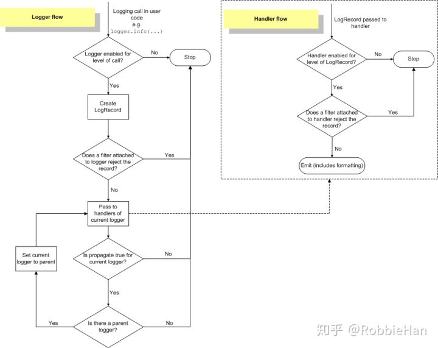


1. 当一条消息传递给logger时，消息的日志级别将与logger的日志级别进行比较。 如果消息的日志级别大于等于logger 的日志级别，该消息将会往下继续处理。 如果小于logger的日志级别，该消息将被忽略。
2. 创建LogRecord对象，调用注册到Logger对象中的Filter进行过滤，如果不满足Filter条件，Filter将忽略该条信息；如果满足Fiter条件，继续下一步。
3. Loger将消息传递给Handler来进行处理，如果消息的日志级别小于handler的级别，handler将忽略该消息，否则继续下一步。
4. 判断当前Loger对象是否有父Logger对象，如果没有则流程结束，如果有重复2、3步骤中的操作。

看到这里是不是很头昏，别着急，我们还是通过一个实例来加深理解logging流程。
注释掉sandboxMP/apps/cmdb/tests.py中所有测试内容，写入下面内容：

```text
import logging

# 1.实例化一个logger，并使用test命名该logger，设置logger级别
logger = logging.getLogger('test')
logger.setLevel(logging.DEBUG)

# 2.定义两个handler用来处理logger中的消息，一个handler将消息输出到控制台，一个输出到文件
handler1 = logging.StreamHandler()
handler2 = logging.FileHandler(filename="/root/project_file/example.log")

# 3.将两个handler设置成不同的事件级别
handler1.setLevel(logging.DEBUG)
handler2.setLevel(logging.WARNING)

'''
4.格式化日志输出，formatter常用变量参考官方文档：
https://docs.python.org/3.7/library/logging.html#logrecord-attributes

'''
formatter = logging.Formatter("%(asctime)s ：%(name)s ：%(levelname)s %(message)s")
handler1.setFormatter(formatter)
handler2.setFormatter(formatter)

# 5.将两个处理器handler注册到logger，前面介绍到一个logger可以包含多个handler
logger.addHandler(handler1)
logger.addHandler(handler2)

# 6.通过loger日志接口，写入不同级别的日志数据
logger.debug('sandbox debug message')
logger.info('sandbox info message')
logger.warning('sandbox warning message')
logger.error('sandbox error message')
logger.critical('sandbox critical message')
```

CTRL+S 保存并上传到远程服务器，使用CRT登陆sandboxMP远程服务器，在命令窗口输入下面内容清空临时日志文件中的内容：

```text
[root@sandboxmp ~]$ echo '' > project_file/example.log
```

回到pycharm，运行test.py ，查看日志输出信息（一个输出到控制台，一个输出到文件），通过pycharm可以对比下日志信息：

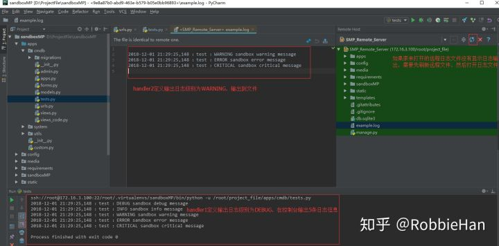


通过图中信息可以看到，logger注册了两个handler来处理日志输出，handler1日志级别为DEBUG输出到控制台一共5条日志；handler2日志级别为WARNING输出日志到文件，一共输出3条日志。

## 2.3 logger配置

在2.2中logging的实现是放在代码中通过硬编码的形式来定义Handler和Formatter的，其实python的logging库还提供了通过配置文件的方式来配置logging，日志配置的方式有三种：
**1.在python代码中实现（2.2中用法）**
**2.通过日志配置文件实现（支持ini和yaml格式），通过fileConfig()函数来读取配置文件；**

```text
# ini语法格式的配置文件
[loggers]
keys=root,simpleExample

[handlers]
keys=consoleHandler

[formatters]
keys=simpleFormatter

[logger_root]
level=DEBUG
handlers=consoleHandler

[logger_simpleExample]
level=DEBUG
handlers=consoleHandler
qualname=simpleExample
propagate=0
# yaml语法格式的配置文件
version: 1
formatters:
  simple:
    format: '%(asctime)s - %(name)s - %(levelname)s - %(message)s'
handlers:
  console:
    class: logging.StreamHandler
    level: DEBUG
    formatter: simple
    stream: ext://sys.stdout
loggers:
  simpleExample:
    level: DEBUG
    handlers: [console]
    propagate: no
root:
  level: DEBUG
  handlers: [console]
```

**3.使用字典配置信息，通过dictConfig()函数来读取配置。**

```text
# dict格式的配置信息
LOGGING = {
    'version': 1,
    'disable_existing_loggers': False,
    'handlers': {
        'file': {
            'level': 'DEBUG',
            'class': 'logging.FileHandler',
            'filename': '/path/to/django/debug.log',
        },
    },
    'loggers': {
        'django': {
            'handlers': ['file'],
            'level': 'DEBUG',
            'propagate': True,
        },
    },
}
```

logging模块的共功非常灵活，有兴趣的朋友可以深入学习下官方文档和cookbook：

```text
https://docs.python.org/3.6/library/logging.html#logrecord-attributes
https://docs.python.org/3.6/howto/logging-cookbook.html#logging-cookbook
```

## 2 定义项目中使用的日志格式

对于1中的logging内容，如果你没有完全理解也没关系，下面我们来定义项目中的日志配置。

1. 在项目中新建日志存储目录(右键项目更目录新建文件夹)：sandboxMP/slogs；
2. 打开sandboxMP/sandboxMP/settings.py，添加logging配置内容：

```text
# logging config

BASE_LOG_DIR = os.path.join(BASE_DIR, 'slogs')

LOGGING = {
    'version': 1,
    'disable_existing_loggers': False,  # 禁用已经存在的logger实例
    # 日志文件的格式
    'formatters': {
        # 详细的日志格式
        'standard': {
            'format': '[%(asctime)s][%(threadName)s:%(thread)d][task_id:%(name)s][%(levelname)s]'
                      '[%(filename)s:%(lineno)d][%(message)s]'
        },
        # 简单的日志格式
        'simple': {
            'format': '[%(levelname)s][%(asctime)s][%(filename)s:%(lineno)d]%(message)s'
        },

    },
    # 处理器
    'handlers': {
        # 默认的
        'default': {
            'level': 'INFO',
            'class': 'logging.handlers.RotatingFileHandler',  # 保存到文件，自动切
            'filename': os.path.join(BASE_LOG_DIR, "sandbox_info.log"),  # 日志文件
            'maxBytes': 1024 * 1024 * 50,  # 日志大小50M
            'backupCount': 3,  # 最多备份3个日志文件
            'formatter': 'simple',
            'encoding': 'utf-8',
        },
        # 用来记错误日志
        'error': {
            'level': 'ERROR',
            'class': 'logging.handlers.RotatingFileHandler',  # 保存到文件，自动切割日志文件
            'filename': os.path.join(BASE_LOG_DIR, "sandbox_err.log"),  # 日志文件
            'maxBytes': 1024 * 1024 * 50,  # 日志大小50M
            'backupCount': 5,
            'formatter': 'standard',
            'encoding': 'utf-8',
        }

    },
        'loggers': {
            # 名为sandbox_info的logger
            'sandbox_info': {
                'handlers': ['default'],  # 使用defaul handler
                'level': 'INFO',
                'propagate': True,  # 向不向更高级别的logger传递
            },
            # 名为 'sandbox_error'的logger
            'sandbox_error': {
                'handlers': ['error'],
                'level': 'ERROR',
            }
    }

}
```

3.在项目中测试日志配置 修改sandboxMP/apps/cmdb/test.py文件，删除原来的所有测试内容，添加如下内容：

```text
from django.views.generic.base import View
from django.shortcuts import HttpResponse
import logging
from .models import Code

info_logger = logging.getLogger('sandbox_info')
error_logger = logging.getLogger('sandbox_error')


class TestLoggingView(View):

    def get(self, request):
        print('a')
        info_logger.info('The system print a letter "a" ')
        try:
            Code.objects.get(id=100)
        except Exception as e:
            error_logger.error(e)
        return HttpResponse("OK!")
```

- 上面代码中实例化了两个logger：info_logger和error_logger；
- 定义了一个视图TestLoggingView；
- 视图中执行了print('a')操作，然后通过info_logger输出日志；
- 进行Code数据库查询（这个数据库中现在还没有数据，所以执行get查询一定会报告错误），捕获错误信息，通过error_loger输出日志。

修改sandboxMP/sandboxMP/urls.py，添加下面的URL：

```text
from cmdb.tests import TestLoggingView

urlpatterns = [
    '''原有内容省略'''
    path('test/', TestLoggingView.as_view()),

]
```

修改sandboxMP/sandboxMP/settings.py，添加访问白名单(/test/只是用来测试，不需要加入权限系统，所以直接添加到白名单就可以访问了)

```text
# safe url
SAFE_URL = [r'^/$',
            '/login/',
            '/logout',
            '/index/',
            '/media/',
            '/admin/',
            '/ckeditor/',
            '/test/',
            ]
```

==Ctrl+S==保存并上传项目，然后运行项目，注意这时候的右上角运行按钮旁的运行环境不是test了，要选择SMP_Remote，运行后访问测试页面：

```text
# 测试页面会返回OK
http://172.16.3.100:8000/test/
```

这时候查看远程服务器上的项目文件，在sandboxMP/slogs目录下会多处两个日志文件：sandbox_err.log 和 sandbox_info.log ，日志内容分别如下：

```text
# sandbox_err.log日志内容
[2018-12-01 23:45:56,656][Thread-1:140421591549696][task_id:sandbox_error][ERROR][tests.py:76][Code matching query does not exist.]

# sandbox_info.log日志内容
[INFO][2018-12-01 23:45:56,317][tests.py:72]The system print a letter "a"
```

可以看到在访问/test/页面时，通过不同名称的logger实列，将符合不同handler规则的日志信息写入到了不同的文件。

最后保留settings.py文件中日志格式的配置，在后面的项目中将会使用这个日志配置，tests.py 和 urls.py中的测试配置，以及settings.py中的URL白名单中的/test/ 可以删除。

修改完成后按下==Ctrl+S==保存并上传到远程服务器。

> 本节文档对应源码版本： [https://github.com/RobbieHan/sandboxMP/tree/v2.04](https://link.zhihu.com/?target=https%3A//github.com/RobbieHan/sandboxMP/tree/v2.04)

# 05：字典管理功能实现

> 本节内容主要实现CMDB基础数据管理功能的实现，文档中会介绍到datatables后端分页实现和过滤查询功能的实现。在Django实战1中已经自定义了 添加、修改等自定义类视图，本节中可以直接使用。

## 1、字典管理页面实现

首先来实现字段管理的基础管理页面，针对字典的一系列操作，都将在这个页面上完成。

## 1.1 字典管理视图实现

新建sandboxMP/apps/cmdb/views_code.py，写入如下内容：

```text
from django.views.generic import TemplateView

from system.mixin import LoginRequiredMixin
from custom import BreadcrumbMixin
from .models import Code


class CodeView(LoginRequiredMixin, BreadcrumbMixin, TemplateView):
    template_name = 'cmdb/code.html'

    def get_context_data(self):
        self.kwargs['code_parent'] = Code.objects.filter(parent=None)
        return super().get_context_data(**self.kwargs)
```

在上面视图中，通过重写get_context_data方法来返回字典数据中所有父类为None的上下文，用来作为过滤查询时的选择项。

## 1.2 字典管理访问URL

打开，sandboxMP/apps/cmdb/urls.py，添加如下内容：

```text
from . import views_code

urlpatterns = [
    '''原有内容省略'''
    path('portal/code/', views_code.CodeView.as_view(), name='portal-code'),
]
```

根据权限管理中URL定义规则，这里将字段管理功能URL放到portal分组中；在实战2第三节中已经说明，新的URL都需要添加到权限系统。

## 1.3 字典管理模板配置

修建模板文件：sandboxMP/templates/cmdb/code.html，内容如下：

```text




    <link rel="stylesheet" href="">
    <link rel="stylesheet" href="">
    <link rel="stylesheet" href="">




    <!-- Main content -->
  <section class="content">
    <div id="devlist">
        <div class="box box-primary" id="liebiao">
            <div class="box-header">
                <div class="btn-group pull-left">
                    <button type="button" id="btnRefresh" class="btn btn-default">
                        <i class="glyphicon glyphicon-repeat"></i>刷新
                    </button>
                </div>
                <div class="btn-group pull-left">&nbsp</div>
                <div class="btn-group pull-left">
                    <button type="button" id="btnCreate" class="btn btn-default">
                        <i class="glyphicon glyphicon-plus"></i>新增
                    </button>

                </div>
                <div class="btn-group pull-left">&nbsp</div>
                <div class="btn-group pull-left">
                    <button type="button" id="btnDelete" class="btn btn-default">
                        <i class="glyphicon glyphicon-trash"></i>删除
                    </button>
                </div>
                <div class="pull-right">
                    <form class="form-inline" id="queryForm">
                       <div class="form-group searchArea margin-r-5 margin-top-5">
                        <label>字典分类：</label>
                        <select class="form-control inputText select2" name="parent" id="parent">
                            <option style='text-align:center' value="">---所有---</option>
                            
                            <option value={{ code.key}}>{{ code.value }}</option>
                            
                        </select>
                       </div>
                    </form>
                </div>
            </div>

            <div class="box-body">
                <table id="dtbList" class="display" cellspacing="0" width="100%">
                    <thead>
                    <tr valign="middle">
                        <th><input type="checkbox" id="checkAll"></th>
                        <th>ID</th>
                        <th>KEY</th>
                        <th>VALUE</th>
                        <th>所属</th>
                        <th>操作</th>
                    </tr>
                    </thead>
                    <tbody>
                    </tbody>
                </table>
                <br> <br>
            </div>
        </div>
    </div>

  </section>

    <!-- /.content -->






<script src=""></script>
<script src=""></script>
<script src=""></script>
<script src=""></script>


```

==按下CRTL + S 保存并上传项目文件==

## 1.4 权限管理配置

URL数据内容：

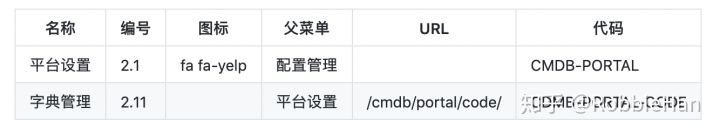

运行项目，登陆系统，访问菜单管理页【系统】→ 【权限管理】→ 【菜单管理】，按照上面URL内容，将数据添加到菜单管理中：

```text
http://172.16.3.100:8000/system/rbac/menu/
```

访问角色管理页【系统】→ 【权限管理】→ 【角色管理】，选择【系统管理】后面第三个树形按钮配置权限信息，将新配置的URL授权给角色组：系统管理，选择好菜单后（全选）点【生成】按钮。

```text
http://172.16.3.100:8000/system/rbac/role/
```

完成权限配置就可以在页面中访问【配置管理】→ 【平台设置】→ 【字典管理】。

每一个视图功能的访问都需要做对应的权限配置，在后面不再列出添加和授权步骤。

## 2 字典添加功能实现

## 2.1 字典添加Form配置

打开文件：sandboxMP/apps/cmdb/forms.py，写入如下内容：

```text
from django import forms

from .models import Code


class CodeCreateForm(forms.ModelForm):
    class Meta:
        model = Code
        fields = '__all__'

        error_messages = {
            'key': {'required': 'key不能为空'},
            'value': {'required': 'value不能为空'}
        }

    def clean(self):
        cleaned_data = super(CodeCreateForm, self).clean()
        key = cleaned_data.get('key')
        value = cleaned_data.get('value')

        if Code.objects.filter(key=key).count():
            raise forms.ValidationError('key：{}已存在'.format(key))

        if Code.objects.filter(value=value).count():
            raise forms.ValidationError('value: {}已存在'.format(value))
```

通过CodeCreateForm可以对输入数据的有效性进行验证，同时避免内容重复。

CTRL + S 保存并上传。

## 2.2 字典添加视图实现

打开：sandboxMP/apps/cmdb/views_code.py，添加CodeCreateView视图：

```text
from custom import SandboxCreateView
from .forms import CodeCreateForm

class CodeCreateView(SandboxCreateView):
    model = Code
    form_class = CodeCreateForm
    template_name_suffix = '_create'

    def get_context_data(self, **kwargs):
        kwargs['code_parent'] = Code.objects.filter(parent=None)
        return super().get_context_data(**kwargs)
```

字典添加视图，使用了在django实战1中创建的SandboxCreateView，重写get_context_data 返回所有父类code，用于创建时候的选择项。
SandboxCreateView类当初在定义的时候，只返回了执行结果result(True or False)，前端根据result结果来提示执行成果或执行失败，这里想要返回form中自定义的错误提示信息，修改sandboxMP/apps/custom.py中SandboxEditViewMixin，内容如下：

```text
import re

class SandboxEditViewMixin:

    def post(self, request, *args, **kwargs):
        res = dict(result=False)
        form = self.get_form()
        if form.is_valid():
            form.save()
            res['result'] = True
        else:
            pattern = '<li>.*?<ul class=.*?><li>(.*?)</li>'
            form_errors = str(form.errors)
            errors = re.findall(pattern, form_errors)
            res['error'] = errors[0]
        return HttpResponse(json.dumps(res), content_type='application/json')
```

## 2.4 字典添加URL配置

打开：sandboxMP/apps/cmdb/urls.py，添加新的URL：

```text
urlpatterns = [
    '''原有内容省略'''
    path('portal/code/create/', views_code.CodeCreateView.as_view(), name='portal-code-create'),
]
```

## 2.5 模板配置

新建模板文件：sandboxMP/templates/cmdb/code_crate.html，内容如下：

```text



    <link rel="stylesheet" href="">
    <!-- iCheck for checkboxes and radio inputs -->


    <div class="box box-danger">
        <form class="form-horizontal" id="addForm" method="post">
            
            <div class="box-body">
                <fieldset>
                    <legend>
                        <h4>新建字典</h4>
                    </legend>

                    <div class="form-group has-feedback">
                        <label class="col-sm-2 control-label">KEY</label>
                        <div class="col-sm-3">
                            <input class="form-control" name="key" type="text"/>
                        </div>
                        <label class="col-sm-2 control-label">VALUE</label>
                        <div class="col-sm-3">
                            <input class="form-control" name="value" type="text" />
                        </div>

                    </div>

                    <div class="form-group has-feedback">
                        <label class="col-sm-2 control-label">父菜单</label>
                        <div class="col-sm-3">
                            <select class="form-control select2" name="parent">
                                <option value=""></option>
                                
                                    <option value={{ parent.id }}> {{ parent.value }} </option>
                                
                            </select>
                        </div>
                        <label class="col-sm-2 control-label">描述信息</label>
                        <div class="col-sm-3">
                            <input class="form-control" id="desc" name="desc" type="text" />
                        </div>
                    </div>

                </fieldset>
            </div>
            <div class="box-footer ">
                <div class="row span7 text-center ">
                    <button type="button" id="btnCancel" class="btn btn-default margin-right ">重置</button>
                    <button type="button" id="btnSave" class="btn btn-info margin-right ">保存</button>
                </div>
            </div>

        </form>
    </div>




    <script src=""></script>
    <script type="text/javascript">
    $("#btnSave").click(function () {
        var data = $("#addForm").serialize();
        $.ajax({
            type: $("#addForm").attr('method'),
            url: "",
            data: data,
            cache: false,
            success: function (msg) {
                if (msg.result) {
                    layer.alert('数据保存成功！', {icon: 1}, function (index) {
                        parent.layer.closeAll(); //关闭所有弹窗
                    });
                } else {
                    layer.alert(msg.error, {icon: 5});
                    //$('errorMessage').html(msg.message)
                }
                return;
            }
        });
    });


        /*点取消刷新新页面*/
        $("#btnCancel").click(function () {
            window.location.reload();

        });

        $(function () {
            //Initialize Select2 Elements
            $(".select2").select2();
        });

    </script>


```

注意：在标签中的$("#btnSave")方法在执行成功后，提示信息中通过msg.error来返回form中的错误提示信息。
给字典管理页 添加按钮绑定添加事件，打开sandboxMP/templates/cmdb/code.html，在中的菜单高亮代码段后面添加如下代码：

```text
// 刷新数据
    $("#btnRefresh").click(function () {
        oDataTable.ajax.reload();
    });
    //新建字典
    $("#btnCreate").click(function () {
        layer.open({
            type: 2,
            title: '新增',
            shadeClose: false,
            maxmin: true,
            area: ['800px', '400px'],
            content: "",
            end: function () {
                //关闭时做的事情
                oDataTable.ajax.reload();
            }
        });
    });
```

## 2.6 权限管理配置

请将下面URL数据添加到菜单管理，并授权给【系统管理】角色组：

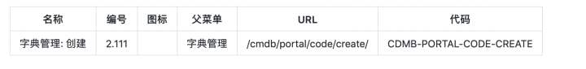

菜单添加和角色授权过程不再单独写出来了，前面内容已经介绍够了。

配置完授权后就可以通过字典管理页面中的添加按钮来添加新的字典数据：

```text
http://172.16.3.100:8000/cmdb/portal/code/
```

## 3 字典数据列表展示

在django实战1中，我们使用datatables通过ajax来获取并展示数据信息，数据分页是使用的datatables的前端分页，本节将介绍使用datatables的后端分页功能。

## 3.1 自定义数据列表类

创建一个带有分页和过滤查询的数据列表Mixin类，可用于所有基于datatables后端分页的数据，打开sandbox/apps/custom.py，添加如下内容：

```text
from django.views.generic import View
from django.http import JsonResponse
from django.db.models.query import QuerySet
from django.core.exceptions import ImproperlyConfigured


class SandboxMultipleObjectMixin:

    filters = {}
    fields = []
    queryset = None
    model = None
    # 用来获取queryset，下面内容参照了Django通用类视图的基本写法
    def get_queryset(self):
        if self.queryset is not None:
            queryset = self.queryset
            if isinstance(queryset, QuerySet):
                queryset = queryset.all()
        elif self.model is not None:
            queryset = self.model._default_manager.all()
        else:
            raise ImproperlyConfigured(
                "%(cls)s is missing a QuerySet. Define "
                "%(cls)s.model, %(cls)s.queryset."
                % {'cls': self.__class__.__name__}
            )
        return queryset

    def get_datatables_paginator(self, request):
        # 从request中获取datatables需要服务端处理的数据信息，具体内容参照下面知识点介绍
        datatables = request.GET
        draw = int(datatables.get('draw'))
        start = int(datatables.get('start'))
        length = int(datatables.get('length'))
        order_column = datatables.get('order[0][column]')
        order_dir = datatables.get('order[0][dir]')
        order_field = datatables.get('columns[{}][data]'.format(order_column))
        # 使用self.get_queryset方法来获取queryset数据
        queryset = self.get_queryset()
        # 根据datatables传递回来的排序信息进行排序（支持正向和反向排序）
        if order_dir == 'asc':
            queryset = queryset.order_by(order_field)
        else:
            queryset = queryset.order_by('-{0}'.format(order_field))
        # 统计所有数据条目
        record_total_count = queryset.count()
        # 获取过滤字段
        filters = self.get_filters()
        # 获取需要在datatables中展示的字段
        fields = self.get_fields()
        if filters:
            queryset = queryset.filter(**filters)
        if fields:
            queryset = queryset.values(*fields)
        # 过滤后的数据条目
        record_filter_count = queryset.count()
        # 对queryset进行切片操作，只返回当前需要展示的数据
        object_list = queryset[start:(start + length)]

        data = list(object_list)
        # 下面内容是datatables后端分页必须返回的数据，网上有些说明
        return {
            'draw': draw,
            'recordsTotal': record_total_count,
            'recordsFiltered': record_filter_count,
            'data': data,
        }

    def get_filters(self):
        return self.filters

    def get_fields(self):
        return self.fields


class SandboxListView(LoginRequiredMixin, SandboxMultipleObjectMixin, View):
    """
    JsonResponse some json of objects, set by `self.model` or `self.queryset`.
    """
    def get(self, request):
        context = self.get_datatables_paginator(request)
        return JsonResponse(context)
```

知识点介绍(查看代码中注释部分)：
1、datatables 后端分页的请求参数和返回参数详情可以查看下面内容：

```text
http://www.datatables.club/manual/server-side.html
```

2、JsonResponse(context) 接受字典数据，实现了json.dumps()和 HttpResponse两个功能，对比下SandboxEditViewMixin。

## 3.2 字典列表视图实现

打开sandboxMP/apps/cmdb/views_code.py，添加CodeListView：

```text
from custom import SandboxListView

class CodeListView(SandboxListView):
    model = Code
    fields = ['id', 'key', 'value', 'parent__value']

    def get(self, request):
        if 'parent' in request.GET and request.GET['parent']:
            self.filters = dict(parent__key=request.GET['parent'])
        return super().get(request)
```

知识点介绍：
1、CodeListView继承了SandboxListView，通过fields指定需要在列表中展示的字段，其中parent是一个外键，通过parent__value实现多级的取值。
2、重写get方法，从request中获取parent(前端页面中传递的是parent的key)内容，将数据组合成字典赋值给filters，后端会根据filters内容进行数据的过滤。

## 3.3 字典列表URL

打开sandboxMP/apps/cmdb/urls.py，添加如下内容：

```text
from . import views_code

urlpatterns = [
    '''原有内容省略'''
    path('portal/code/list/', views_code.CodeListView.as_view(), name='portal-code-list'),
]
```

## 3.4 模板配置

打开sandboxMP/templates/cmdb/code.html，在下菜单高亮代码段后面添加datatables初始化配置和数据过滤刷新ajax请求的代码段：

```text
// datatables 初始化配置
    var oDataTable = null;
    $(function () {
        oDataTable = initTable();

        function initTable() {
            var oTable = $('#dtbList').DataTable($.extend(true, {},
                DATATABLES_CONSTANT.DATA_TABLES.SERVER_SIDE_OPTION,

                {
                    ajax: {
                        "url": "",
                        "data": function (d) {
                                d.parent = $("#parent").val();
                            }
                    },
                    columns: [
                        DATATABLES_CONSTANT.DATA_TABLES.COLUMN.CHECKBOX,
                        {
                            data: "id",
                            width: "5%",
                        },
                        {
                            data: "key",
                            //width : "20%",
                        },
                        {
                            data: "value",
                            //width : "20%",
                        },
                        {
                            data: "parent__value",
                            //width : "20%",
                        },
                        {
                            data: "id",
                            width: "10%",
                            bSortable: "false",
                            render: function (data, type, row, meta) {
                                var ret = "";
                                var ret = "<button title='详情' onclick='doUpdate("
                                    + data + ")'><i class='glyphicon glyphicon-pencil'></i></button>";
                                ret = ret + "<button title='删除' onclick='doDelete("
                                    + data + ")'><i class='glyphicon glyphicon-trash'></i></button>";
                                return ret;
                            }
                        }],
                    }));
                return oTable;
            }

        });

    //select2
    $(function () {
        //Initialize Select2 Elements
        $(".select2").select2();
    });

    //过滤刷新接口获取新的数据
    $("#parent").change(function () {
        oDataTable.ajax.reload();
    });
```

打开sandboxMP/static/plugins/datatables/dataTables.const-1.js，修改下面注释部分内容，把DEFAULT_OPTION 改成 SERVER_SIDE_OPTION

```text
var DATATABLES_CONSTANT = {  

    // datatables常量  
    DATA_TABLES : {  
        SERVER_SIDE_OPTION : { // 把DEFAULT_OPTION改成SERVER_SIDE_OPTION
            oLanguage : {  
                sProcessing : "处理中...",  
                sLengthMenu : "每页 _MENU_ 项",//"显示 _MENU_ 项结果,",  
                sZeroRecords : "没有匹配结果",  
                sInfo : "显示第 _START_ 至 _END_ 项结果（共 _TOTAL_ 项）",
    '''原有内容省略'''
```

系统中启用了后端分页，所以在初始化datatables表格的时候，使用的是daTables.const-1.js，这个文件中配置了后端分页的一些基本配置，上面代码中注释部分修改的名称只是为了却分前端分页的配置内容，同时在code.html初始化datatables的时候调取的是SERVER_SIDE_OPTION。

CRTL + S 保存并上传。

## 3.5 权限管理配置

请将下面URL数据添加到菜单管理，并授权给【系统管理】角色组：

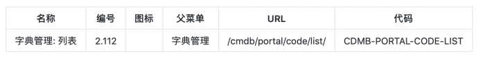

## 3.6 后端分页功能测试

到这里后端分页和过滤功能已经完整实现了，将下面的字典数据添加到系统，验证各个功能：

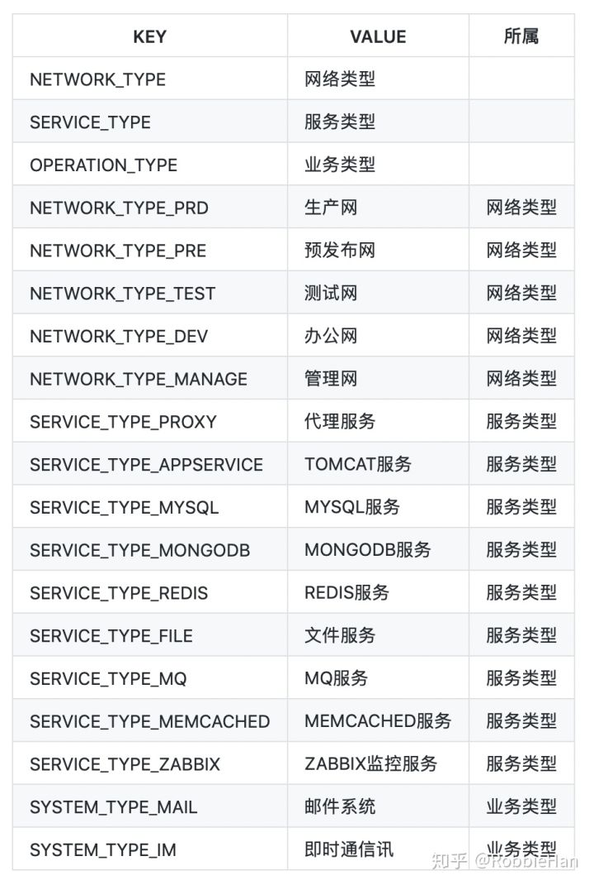

运行项目，访问系统字典管理页，通过新增按钮完成上面字典数据的添加工作：

```text
http://172.16.3.100:8000/cmdb/portal/code/
```

CTRL + F5 刷新页面，在页面中可以看到数据已经自动完成分页，我们和可以设置每页显示的数据条目，可以切换分页获取不同数据，可以通过字典分类进行数据过滤，可以点击表格头部进行数据排序。

## 3.6 datatables后端分页参数梳理方法

在使用datatables后端分页功能后，很多人面对一堆参数和后端的代码处理逻辑时会有点懵，先浏览一遍上面给的后端分页参数网址，了解参数的基本用途，然后使用Chrome浏览器访问字典管理页面，按F12打开浏览器调试窗口，F5刷新页面，选择Chrome调试窗口中的 Network → ?draw=... → Headers 往下拖在后面可以看到datatables传递给后台的参数。


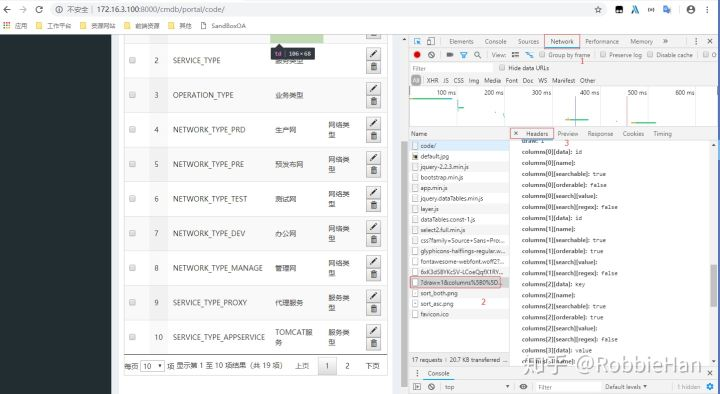


对照自定义的SandboxMultipleObjectMixin中get_datatables_paginator(self, request)方法中通过request中获取的datattables分页参数，理解参数的具体意义。
也可以切换分页后查看chrome调试敞口中最新访问的?draw=..Headers中start参数的变化。
选择每页显示数据条目，对比下chrome调试敞口中最新访问的?draw=..Headers中length参数的变化。
点击表格头部KEY进行排序，查看chrome调试敞口中最新访问的?draw=..Headers中order[0][column]，order[0][dir]，columns[2][data]内容，然后再去理解下get_datatables_paginator(self, request)方法中获取参数的内容。

```text
datatables = request.GET
draw = int(datatables.get('draw'))
start = int(datatables.get('start'))
length = int(datatables.get('length'))
order_column = datatables.get('order[0][column]')
order_dir = datatables.get('order[0][dir]')
order_field = datatables.get('columns[{}][data]'.format(order_column))
```

一定要去做下操作，然后在对比下参数，和后端代码中实现，才能够加深理解。

## 4 字典更新功能实现

## 4.1 字典更新Form验证

打开文件：sandboxMP/apps/cmdb/forms.py，添加如下内容：

```text
class CodeUpdateForm(CodeCreateForm):

    def clean(self):
        cleaned_data = self.cleaned_data
        key = cleaned_data.get('key')
        value = cleaned_data.get('value')

        if self.instance:
            matching_code = Code.objects.exclude(pk=self.instance.pk)
            if matching_code.filter(key=key).exists():
                msg = 'key：{} 已经存在'.format(key)
                raise forms.ValidationError(msg)
            if matching_code.filter(value=value).exists():
                msg = 'value：{} 已经存在'.format(value)
                raise forms.ValidationError(msg)
```

在更新字典数据的时候，同样需要验证输入字段的有效性，这点在CodeCreateForm中已经时间了，避免代码重复，这里直接继承CodeCreateForm。同时重写clean方法，排除当前修改的数据之外保证数据没有重复。

## 4.2 字典更新视图

字典更新视图可以使用SandboxUpdateView来实现，打开sandboxMP/apps/cmdb/views_code.py，添加CodeUpdateView：

```text
from custom import SandboxUpdateView
from .forms import CodeUpdateForm

class CodeUpdateView(SandboxUpdateView):
    model = Code
    form_class = CodeUpdateForm
    template_name_suffix = '_update'

    def get_context_data(self, **kwargs):
        kwargs['code_parent'] = Code.objects.filter(parent=None)
        return super().get_context_data(**kwargs)
```

## 4.3 字典更新URL

打开sandboxMP/apps/cmdb/urls.py，添加新的url:

```text
urlpatterns = [
    '''原有内容省略'''
    path('portal/code/update/', views_code.CodeUpdateView.as_view(), name='portal-code-update'),
```

## 4.4 模板配置

新建模板sandboxMP/templates/cmdb/code_update.html：

```text



    <link rel="stylesheet" href="">
    <!-- iCheck for checkboxes and radio inputs -->


    <div class="box box-danger">
        <form class="form-horizontal" id="addForm" method="post">
        <input type="hidden" name='id' type='text' value="{{ code.id }}"/>
            
            <div class="box-body">
                <fieldset>
                    <legend>
                        <h4>修改字典</h4>
                    </legend>

                    <div class="form-group has-feedback">
                        <label class="col-sm-2 control-label">KEY</label>
                        <div class="col-sm-3">
                            <input class="form-control" name="key" type="text" value="{{ code.key }}"/>
                        </div>
                        <label class="col-sm-2 control-label">VALUE</label>
                        <div class="col-sm-3">
                            <input class="form-control" name="value" type="text" value="{{ code.value }}"/>
                        </div>

                    </div>

                    <div class="form-group has-feedback">
                        <label class="col-sm-2 control-label">父菜单</label>
                        <div class="col-sm-3">
                            <select class="form-control select2" name="parent">
                                <option value={{ code.parent.id }}> {{ code.parent.value }} </option>
                                <option value=""></option>
                                
                                    <option value={{ parent.id }}> {{ parent.value }} </option>
                                
                            </select>
                        </div>
                        <label class="col-sm-2 control-label">描述信息</label>
                        <div class="col-sm-3">
                            <input class="form-control" id="desc" name="desc" type="text" value="{{ code.desc }}"/>
                        </div>
                    </div>

                </fieldset>
            </div>
            <div class="box-footer ">
                <div class="row span7 text-center ">
                    <button type="button" id="btnCancel" class="btn btn-default margin-right ">重置</button>
                    <button type="button" id="btnSave" class="btn btn-info margin-right ">保存</button>
                </div>
            </div>

        </form>
    </div>




    <script src=""></script>
    <script type="text/javascript">
    $("#btnSave").click(function () {
        var data = $("#addForm").serialize();
        $.ajax({
            type: $("#addForm").attr('method'),
            url: "",
            data: data,
            cache: false,
            success: function (msg) {
                if (msg.result) {
                    layer.alert('数据保存成功！', {icon: 1}, function (index) {
                        parent.layer.closeAll(); //关闭所有弹窗
                    });
                } else {
                    layer.alert(msg.error, {icon: 5});
                    //$('errorMessage').html(msg.message)
                }
                return;
            }
        });
    });


    /*点取消刷新新页面*/
    $("#btnCancel").click(function () {
        window.location.reload();

    });

    $(function () {
        //Initialize Select2 Elements
        $(".select2").select2();
    });

    </script>


```

打开sandboxMP/templates/cmdb/code.html，给修改绑定事件，在中新建字典$("#btnCreate")的代码段后面添加如下内容：

```text
//修改字典
function doUpdate(id) {
    layer.open({
        type: 2,
        title: '编辑',
        shadeClose: false,
        maxmin: true,
        area: ['800px', '400px'],
        content: ["" + '?id=' + id, 'no'],
        end: function () {
            oDataTable.ajax.reload();
        }
    });
}
```

CTRL + S 保存并上传。

## 4.5 权限管理配置

请将下面URL数据添加到菜单管理，并授权给【系统管理】角色组：

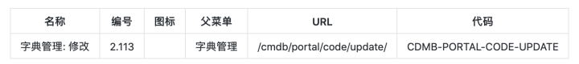

运行项目测试字典修改功能。

## 5 字典删除功能实现

## 5.1 字典删除视图

回顾下用户管理、组织组织架构管理、菜单管理、角色管理这些功能中的删除视图的实现，尽管删除视图的实现在代码上已经算得上是很精简了，但是这些删除视图代码基本一致，所以也可以抽象出来写成自定义类。
打开sandboxMP/apps/custom.py，添加如下内容：

```text
class SandboxDeleteView(LoginRequiredMixin, SandboxMultipleObjectMixin, View):

    def post(self, request):
        context = dict(result=False)
        queryset = self.get_queryset()
        if 'id' in request.POST and request.POST['id']:
            id_list = map(int, request.POST['id'].split(','))
            queryset.filter(id__in=id_list).delete()
            context['result'] = True
        else:
            raise AttributeError("Sandbox delete view %s must be called with id. "
                                 % self.__class__.__name__)
        return JsonResponse(context)
```

打开sandboxMP/apps/cmdb/views_code.py，添加删除视图：

```text
from custom import SandboxDeleteView

class CodeDeleteView(SandboxDeleteView):
    model = Code
```

## 5.2 字典删除URL

打开sandboxMP/apps/cmdb/urls.py，添加新的URL：

```text
urlpatterns = [
    '''原有内容省略'''
    path('portal/code/delete/', views_code.CodeDeleteView.as_view(), name='portal-code-delete'),
    ]
```

## 5.3 模板配置

给删除按钮绑定删除事件，打开sandboxMP/templates/cmdb/code.html，在标签中修改字典doUpdate()代码段后面添加如下内容：

```js
//checkbox全选
    $("#checkAll").on("click", function () {
        if ($(this).prop("checked") === true) {
            $("input[name='checkList']").prop("checked", $(this).prop("checked"));
            $('#example tbody tr').addClass('selected');
        } else {
            $("input[name='checkList']").prop("checked", false);
            $('#example tbody tr').removeClass('selected');
        }
    });

    //批量删除
    $("#btnDelete").click(function () {
        if ($("input[name='checkList']:checked").length == 0) {
            layer.msg("请选择要删除的记录");
            return;
        }

        var arrId = new Array();
        $("input[name='checkList']:checked").each(function () {
            //alert($(this).val());
            arrId.push($(this).val());
        });

        sId = arrId.join(',');

        layer.alert('确定删除吗？', {
            title: '提示'
            , icon: 3 //0:感叹号 1：对号 2：差号 3：问号 4：小锁 5：哭脸 6：笑脸
            , time: 0 //不自动关闭
            , btn: ['YES', 'NO']
            , yes: function (index) {
                layer.close(index);
                $.ajax({
                    type: "POST",
                    url: "",
                    data: {"id": sId, csrfmiddlewaretoken: '{{ csrf_token }}'},
                    cache: false,
                    success: function (msg) {
                        if (msg.result) {
                            layer.alert("操作成功", {icon: 1});
                            oDataTable.ajax.reload();
                        } else {
                            //alert(msg.message);
                            layer.alert("操作失败", {icon: 2});
                        }
                        return;
                    }
                });
            }
        });
    });

    //删除单个数据
    function doDelete(id) {
        layer.alert('确定删除吗？', {
            title: '提示'
            , icon: 3 //0:感叹号 1：对号 2：差号 3：问号 4：小锁 5：哭脸 6：笑脸
            , time: 0 //不自动关闭
            , btn: ['YES', 'NO']
            , yes: function (index) {
                layer.close(index);
                $.ajax({
                    type: "POST",
                    url: "",
                    data: {"id": id, csrfmiddlewaretoken: '{{ csrf_token }}'},
                    cache: false,
                    success: function (msg) {
                        if (msg.result) {
                            layer.alert('删除成功', {icon: 1});
                            oDataTable.ajax.reload();
                        } else {
                            //alert(msg.message);
                            layer.alert('删除失败', {icon: 2});
                        }
                        return;
                    }
                });
            }
        });
    }
```

CTRL + S 保存并上传

## 5.4 权限管理配置

请将下面URL数据添加到菜单管理，并授权给【系统管理】角色组：

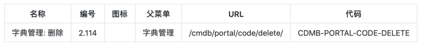

运行项目测试批量删除和单条删除功能。

至此，项目中已经完成新增、修改、列表、删除的自定义功能，这些类在项目中有相同需求时都可以直接继承使用。

**作业：了解YAML语法格式，以及通过python来读取和写入YAML文件**

> 本节文档对应源码版本： [https://github.com/RobbieHan/sandboxMP/tree/v2.05](https://link.zhihu.com/?target=https%3A//github.com/RobbieHan/sandboxMP/tree/v2.05)