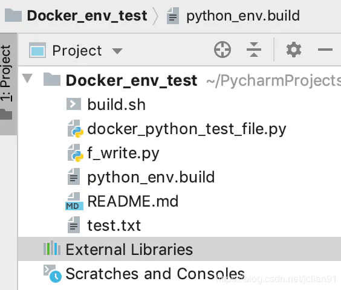
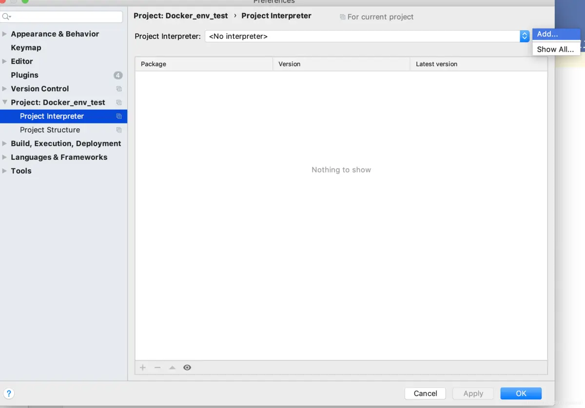
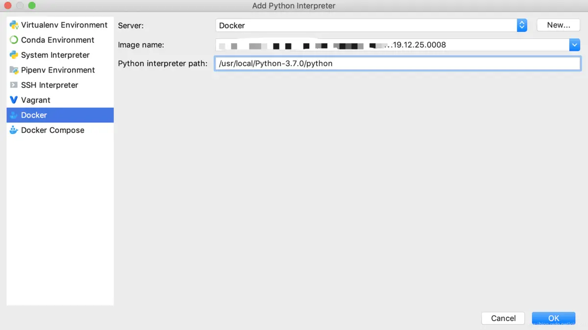
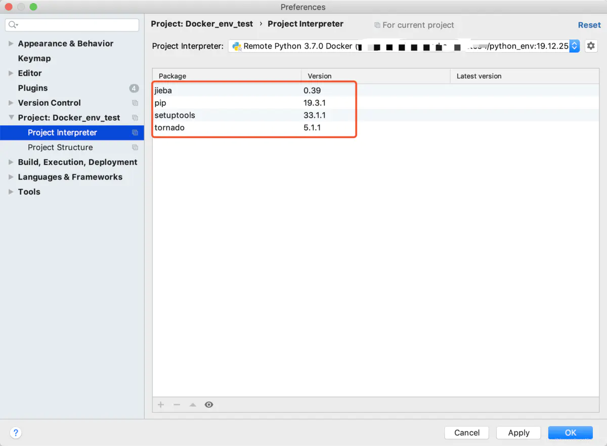
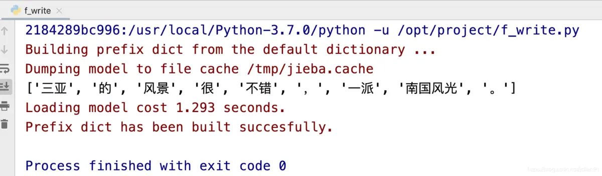

# PyCharm使用之利用Docker镜像搭建Python开发环境

  在我们平时使用PyCharm的过程中，一般都是连接本地的Python环境进行开发，但是如果是离线的环境呢？这样就不好搭建Python开发环境，因为第三方模块的依赖复杂，不好通过离线安装包的方式安装。本文将介绍如何利用PyCharm来连接Docker镜像，从而搭建Python开发环境。
  首先，我们需要准备一下工具：

- PyCharm专业版
- Docker

我们用一个示例项目来演示在PyCharm中如何利用Docker镜像搭建Python开发环境。项目的截图如下：



项目截图

 注意到，在该项目中`还没有设置Python开发环境`，External Libraries为空，到时候我们将用Docker中的Python环境作为该项目的Python开发环境。
  第一步，我们需要制作`Docker镜像`，该镜像的Dockerfile文件（python_dev.build）如下：

```bash
FROM centos:7.2.1511

# author label
LABEL maintainer="jclian"

# install related packages
ENV ENVIRONMENT DOCKER_PROD
RUN cd / && ln -sf /usr/share/zoneinfo/Asia/Shanghai /etc/localtime \
    && yum makecache \
    && yum install -y wget aclocal automake autoconf make gcc gcc-c++ python-devel mysql-devel bzip2 libffi-devel epel-release \
    && yum clean all

# install python 3.7.0
RUN wget https://npm.taobao.org/mirrors/python/3.7.0/Python-3.7.0.tar.xz \
    && tar -xvf Python-3.7.0.tar.xz -C /usr/local/ \
    && rm -rf Python-3.7.0.tar.xz \
    && cd /usr/local/Python-3.7.0 \
    && ./configure && make && make install

# install related packages
RUN yum install -y python-pip \
    && yum install -y python-setuptools \
    && mkdir -m 755 -p /etc/supervisor/conf.d \
    && yum install -y supervisor \
    && pip3 install --upgrade pip -i http://pypi.douban.com/simple/ --trusted-host pypi.douban.com \
    && pip3 install setuptools==33.1.1 -i http://pypi.douban.com/simple/ --trusted-host pypi.douban.com \
    && pip3 install jieba -i http://pypi.douban.com/simple/ --trusted-host pypi.douban.com \
    && pip3 install tornado==5.1.1 -i http://pypi.douban.com/simple/ --trusted-host pypi.douban.com \
    && yum clean all

# expost port
EXPOSE 15731
```

在这个CentOS系统中，我们安装了Python3.7.0，同时又安装了两个第三方模块jieba和tornado。接着我们运行build.sh脚本，内容如下：

```bash
TIMENOW=`date +%y.%m.%d.%H%M`

# 进行docker镜像打包
# -f 指定文件 ， -t 指定生成镜像名称 , 冒号后为版本号 ，例子 ： docker_package:17.08.01.1311
docker build -f python_env.build -t python_env:${TIMENOW} .
```

运行后，我们生成的Docker镜像名称为：python_env:19.12.25.0008。

  接着我们在Python中使用Docker镜像配置Python Interpreter。在系统的设置界面中，选择“Project Interpreter”，点击“Project Interpreter”右侧的小齿轮，选择“Add”，截图如下：



新增Interpreter

在弹出的界面中，选择“Docker”，右侧的Server一般默认为本地的Docker，等待一会儿它会提示连接成功，当然你也可以选择远程服务器的Docker，这个设置这里不再讲述。连接Docker成功后，选择“Image name”，这里选择我们刚打好的Docker镜像python_env，“Python interpreter path”为容器中的Python路径，我们这里输入“/usr/local/Python-3.7.0/python”，如下图所示：



选择docker镜像

点击“OK”键，等待一会儿，然后弹出的界面如下：



连接docker镜像成功

出现该图表示连接Docker镜像成功，同时能看到该Python环境安装的第三方模块。
  最后我们再测试一下该Python环境是否能进行开发，示例的Python代码（f_write.py）如下：

```python
# -*- coding: utf-8 -*-
# author: Jclian91
# place: Pudong Shanghai
# time: 12:04 上午
import jieba

if __name__ == '__main__':
    sent = '三亚的风景很不错，一派南国风光。'
    print(list(jieba.cut(sent)))
```

输出结果如下：



python输出结果

可以看到，Python的运行结果正常，这说明Python开发环境真的可以使用了。

  本次分享到此结束，感谢大家的阅读。该演示项目已经分享至Github，网址为：[https://github.com/percent4/Docker_env_test](https://links.jianshu.com/go?to=https%3A%2F%2Fgithub.com%2Fpercent4%2FDocker_env_test) 。