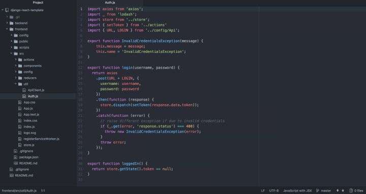

# 使用 React 和 Django REST Framework 构建你的网站

在我们最近的工作中，构建网站使用的架构是带有 Django REST Framework（DRF）后端的 React 前端。它们是通过在前端使用 axios（前端库）调用后端 API 来交互的。我们还使用了 Redux（前端库）来存储全局的应用程序状态（存在浏览器端）。这是我们首选，因为它允许前后端完全分离。只要我们提前定义好请求的资源列表（后面单个都简称：endpoint）和返回的数据格式，前端和后端就可以并行的进行开发。这也使我们可以轻松的为未来的任何项目创建移动端 App，因为它们仍然可以复用后端 API。

在本文的剩余部分，我将介绍如何配置 React 前端和 DRF 后端。注意我假设你已经熟悉了 React，Redux，Django，DRF，NPM 等，本篇不是基础教程哦。

## 后端（The Backend）

除了简单安装 Django 和 DRF 以及设置数据库以外，后端没有太多的工作要做

```bash
$ pip3 install django djangorestframework django-filter
$ pip3 freeze > requirements.txt
```

没错我们用的是 Python3

找一个目录，创建一个 Django 项目和 Django App：

```bash
$ django-admin startproject backend
$ cd backend
$ django-admin startapp api
```

接下来应该配置好你的数据库并编辑你的项目 settings 文件来使用它。在 Django 的[官网](https://link.zhihu.com/?target=https%3A//docs.djangoproject.com/en/2.0/topics/install/%23get-your-database-running)上可以找到关于如何为你的特定 DB 执行此操作的文档。

或者你也可以什么都不干，它会帮你在项目跟目录创建一个文件数据库：sqlite3.db

最后你还应该按照在[这里](https://link.zhihu.com/?target=http%3A//www.django-rest-framework.org/%23installation)的说明配置一下 DRF。

有些同学对前后端分离的认证方式有些懵逼，我们下面就看一下前后端分离的架构如何配置认证后端：

```python
# file: api/urls.py
from django.conf.urls import url
from rest_framework.authtoken import views as drf_views

urlpatterns = [
    url(r'^auth$', drf_views.obtain_auth_token, name='auth'),
]
```

只是为了确保清楚，你的 `backend/urls.py` 文件现在应该是这样：

```python
# file: backend/urls.py
from django.conf.urls import url, include

urlpatterns = [
    url(r'^', include('api.urls', namespace='api', app_name='api')),
]
```

通过这样，我们可以让每个应用程序管理自己的 URL。因为也许将来你会在后端添加更多的应用程序，并且将他们添加到 `backend/urls.py`。

现在，你已经拥有了一个后端 DRF API：叫 `/auth` 的 endpoint，访问它可以获得一个身份验证令牌。让我们先配置一个用户，并运行后端服务器以供测试。

```bash
$ python3 manage.py migrate
$ python3 manage.py createsuperuser
$ python3 manage.py runserver 0.0.0.0:8000
```

记得第一次要运行迁移命令（`migrate`）来创建你的数据库。然后，我们创建一个用户。在服务器运行的情况下，你可以使用 curl 快速测试您的 `/auth` endpoint：

```bash
$ curl -X POST -d "username=username&password=password"
http://localhost:8000/auth
```

**译者在验证过程中发现作者忽略了一些细节，补充如下**

1.添加 `rest_framework`和`rest_framework.authtoken` 到 `INSTALLED_APPS` 配置：

```python
# file: backend/settings.py

INSTALLED_APPS = [
    'django.contrib.admin',
    'django.contrib.auth',
    'django.contrib.contenttypes',
    'django.contrib.sessions',
    'django.contrib.messages',
    'django.contrib.staticfiles',
    'rest_framework',
    'rest_framework.authtoken',
]
```

2.运行命令创建认证 App 所需的数据库：

```bash
$ python manage.py migrate 
```

接口 I/O

到这里，后端搞定

## 前端（The Frontend）

前端我们使用 Facebook 的 create-react-app 脚手架作为 base。首先要做的就是安装它，然后在项目文件夹的根目录下使用它来创建一个新的项目。

```bash
$ npm install -g create-react-app
$ create-react-app frontend
$ cd frontend
$ yarn eject
```

提示：运行 `yarn eject` 之前必须要提交所有 git 修改，因为它会更改你的文件和添加目录，怕你丢失之前的修改

接下来我们安装一些依赖：

```bash
$ npm install --save-dev babel-preset-es2015 babel-preset-stage-3
$ npm install --save redux redux-logger redux-persist react-redux
$ npm install --save axios react-router-dom lodash
```

现在，我们先只展示将前端连接后端的主要部分。首先创建一个 redux store，用它来保存用户的 token，以便将来进行更多的API调用。

```js
// file: src/store.js
import { compose, createStore, applyMiddleware } from 'redux';
import { createLogger } from 'redux-logger';
import { persistStore, autoRehydrate } from 'redux-persist';
import rootReducer from './reducers';

const store = createStore(
  rootReducer,
  compose(
    applyMiddleware(
      createLogger(),
    ),
    autoRehydrate()
  )
);
persistStore(store);
export default store;
```

然后配置 token 的 reducer：

```js
// file: src/reducers/index.js
import { combineReducers } from 'redux';
import * as actionType from '../actions/types';

const tokenInitialState = null;
const token = (state = tokenInitialState, action) => {
  switch(action.type) {
    case actionType.SET_TOKEN:
      return action.data;
    default:
      return state;
  }
}

const appReducer = combineReducers({
  token,
})

const rootReducer = (state, action) => {
  return appReducer(state, action);
}

export default rootReducer;
```

最后是配置 action（注意代码块有两个不同的文件）

```js
// file: src/actions/index.js
import * as actionType from './types';

export const setToken = (data) => {
  return {
    type: actionType.SET_TOKEN,
    data
  }
}
// file: src/actions/types.js
export const SET_TOKEN = "SET_TOKEN";
```

有了一个 action，我们现在可以在登录后 dispatch 用户的 token 到 store 中。我们看看如何登录：

```js
// file: src/util/Auth.js
import axios from 'axios';
import _ from 'lodash';
import store from '../store';
import { setToken } from '../actions'
import { URL, LOGIN } from '../config/Api';

export function InvalidCredentialsException(message) {
    this.message = message;
    this.name = 'InvalidCredentialsException';
}

export function login(username, password) {
  return axios
    .post(URL + LOGIN, {
      username,
      password
    })
    .then(function (response) {
      store.dispatch(setToken(response.data.token));
    })
    .catch(function (error) {
      // raise different exception if due to invalid credentials
      if (_.get(error, 'response.status') === 400) {
        throw new InvalidCredentialsException(error);
      }
      throw error;
    });
}

export function loggedIn() {
  return store.getState().token == null;
}
```

这段代码使用 axios POST 登录信息到我们的 `/auth` endpoint，然后将返回的 token

dispatch 到我们的 redux store。一旦完成，我们就可以使用我们存储的 token 令牌来创建一个基于 axios 的 API 客户端（译者注：这样就不需要每次都显式的将令牌信息从 store 中拿出来再插入 payload 中了），这样从我们的 React 组件中的其他地方进行其他 API 调用就很方便了。

```js
// file: src/util/ApiClient.js
import axios from 'axios';
import store from '../store';
import { URL } from '../config/Api';

export const apiClient = function() {
    const token = store.getState().token;
    const params = {
        baseURL: URL,
        headers: {'Authorization': 'Token ' + token}
    };
    return axios.create(params);
}
```

前面的后两个代码块中我们引用了如下的 `../config/Api` 文件。它只是一个将常量映射到 endpoint 的文件，它会使代码更易读，更容易修改。（如果有些懵，可以参考译者按照笔者的思路还原的代码，在文末）

```js
export const URL = process.env.API_URL;
export const LOGIN = "/auth";
```

这就是一套连接我们的前端和后端的代码了。你现在可以尝试使用 Auth.js 登录功能来获取我们之前创建的用户身份验令牌。这样可以通过从浏览器的开发者工具检查 redux-logger 的输出，来查看 setToken redux 的 action 结果了。



目录总览

如果对一些细节还不清楚，可以直接看源代码：[tmpbook/django-auth-with-react](https://link.zhihu.com/?target=https%3A//github.com/tmpbook/django-with-vuejs/tree/master/examples/django-auth-with-react)