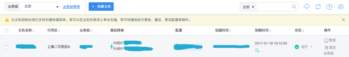

# 我如何使用 Django + Vue.js 快速构建项目

> 的新年第一课，祝大家新的一年好好学习，天天向上：）
>
> 本篇将手把手教你如何快速而优雅的构建
>
> 前后端分离的项目
>
> ，想直接上手请往后翻！

**目录：**

1. 我为什么要选择Django与VueJS？

2. Django和VueJS是如何结合起来的？

3. 实操

4. 1. 创建 Django 项目
   2. 创建 Django App 做为后端
   3. 创建 VueJS 项目作为前端
   4. 使用 Webpack 处理前端代码
   5. 配置 Django 模板的搜索路径
   6. 配置 Django 静态文件搜索路径
   7. 开发环境
   8. 生产环境（部署到 UCloud）

## 我为什么要选择Django与VueJS？

首先介绍一下我看重的点：

Django (MVC框架) - 

- Python
- ORM
- 简单、清晰的配置
- Admin app

Django 仅因为 Python 的血统，就已经站在了巨人的肩膀上，配置管理( SaltStack、Ansible )
 最后还可以使用 django-celery 的 celery-beat 按 Interval/crontab 的方式扔更新配置的任务到 celery 队列里面，最最重要的是，这些都可以在Django Admin后台直接配置哦，还不够优雅？请联系我

VueJS (MVVM框架) - [Vue.js](https://link.zhihu.com/?target=https%3A//vuejs.org/)

- 数据双向绑定
- 单文件组件
- 清晰的生命周期
- 学习曲线平滑
- vue-cli

> 前端是DevOps的弱项，我需要一个 MVVM 框架来提升交互和节约时间，在试过 AngularJS ，ReactJS，VueJS之后我选择了VueJS，因为我觉得写 VueJS 代码的感觉最接近写 Python

着重提一下单文件组件：


特别清晰，一个文件包含且仅包含三块

1. <template></template > 前端渲染的模板

2. 专为此模板写渲染逻辑的 <script></script>

3. 专为此模板写样式的 <style></style>

这样可以达到什么效果呢？一个文件一个组件，每个组件有它自己的逻辑与样式，你不用关心什么 local 什么 global ，CSS样式加载先后、覆盖问题，因为它是『闭包』的，而且『自给自足』，不知道这样说好不好理解

当然组件之间也是可以通信的，举个例子，我有一个组件叫 ListULB ，使用表格展示了我拥有的所有 ULB (负载均衡)，ListULB 做了一件事，从 API 获取 ULB 对象列表并 for 循环展现出来， ListULB 可以放到某个页面里，可以放到弹框里，放到模态框里，任何地方都可以，因为这个组件对外交互的只有API

如果我现在要写一个组件叫 AddVServer ，功能是可以为任意一个 ULB 对象添加VServer，我的写法是将在 AddVServer 组件创建的时候，将 ULB 对象传给 AddVServer 组件，这样AddVServer 组件拿到这个对象，就可以直接根据对象的ID等，创建出当前行的ULB的VServer了，伪代码如下：

```text
<ListULB>
  for **ulb_object** in ulbs_list:
    {{ ulb_object.name }}
    {{ ulb_object.id }}
    <AddVServer :current_ulb='**ulb_object**'></AddVServer>
</ListULB>
```

注意双星号包着的对象，在 ListULB 组件里面是每行的ULB，传给AddServer组件之后，变成了 current_ulb 对象，拿到id为 current_ulb.id 尽情的为它创建 VServer 吧

如果我要为指定 VServer 创建 RServer 呢，一样的

> 看出来了吧，进行开发之前，前端组件的结构与数据的结构对应起来可以省好多时间，数据驱动前端组件，棒吗？

谁不喜欢优雅的代码呢， 『Data drive everything』 多么的省脑细胞

以上就是我选择Python与VueJS的原因

- 首先我选择了VueJS的前端渲染，自然放弃了Django的后端模板引擎渲染
- 然后业务逻辑放到了前端，放弃了Django的View（其实也就是前后端分离必要的条件）
- 保留了Django的 Controller (URLconf) 来实现前端路由的父级路由，可以达到不同页面使用不同的前端框架， 页面内部使用各自独有的前端路由的效果，万一老大给你配了前端呢，万一前端只想写 ReactJS 呢
- 保留了Django的 Model ，前面说了Django的ORM太好用了，而且可以配合Django Admin

所以综合来说就是:

> M(Django) + C(Django) + MVVM (VueJS) = *M + MVVM + C = MMVVMC*

（为了容易理解，并没有使用Django自称的MTV模式理解，感兴趣看看我画的图）


总结：作为以改变世界为己任的 DevOps ，MVC框架后端渲染的柔弱表现力与繁杂的交互已经不能满足我们了，.....省略1000子.....，所以我选择这样构建项目，嗯...

好吧，也该开始了

代码块中的修改都会用爽星号括起来，比如: **changed**

本文为了精简篇幅，默认您已经安装了必要的 命令行界面（CLI），比如 vue-cli等

*命令：*

```text
django-admin startproject ulb_manager
```

*结构：*

```text
.
├── manage.py
└── ulb_manager
    ├── __init__.py
    ├── settings.py
    ├── urls.py
    └── wsgi.py
```

## 2. 进入项目根目录，创建一个 app 作为项目后端

*命令：*

```text
cd ulb_manager
python manage.py startapp backend
```

即：app 名叫做 backend

*结构：*

```text
.
├── backend
│   ├── __init__.py
│   ├── admin.py
│   ├── migrations
│   │   └── __init__.py
│   ├── models.py
│   ├── tests.py
│   └── views.py
├── manage.py
└── ulb_manager
    ├── __init__.py
    ├── settings.py
    ├── urls.py
    └── wsgi.py
```

## 3. 使用vue-cli创建一个vuejs项目作为项目前端

*命令：*

```text
vue-init webpack frontend
```

即：项目名叫 frontend

*结构：*

```text
.
├── backend
│   ├── __init__.py
│   ├── admin.py
│   ├── migrations
│   │   └── __init__.py
│   ├── models.py
│   ├── tests.py
│   └── views.py
├── frontend
│   ├── README.md
│   ├── build
│   │   └── ....
│   ├── config
│   │   ├── dev.env.js
│   │   ├── index.js
│   │   ├── prod.env.js
│   │   └── test.env.js
│   ├── index.html
│   ├── package.json
│   ├── src
│   │   ├── App.vue
│   │   ├── assets
│   │   │   └── logo.png
│   │   ├── components
│   │   │   └── Hello.vue
│   │   └── main.js
│   ├── static
│   └── test
│       └── ...
├── manage.py
└── ulb_manager
    ├── __init__.py
    ├── settings.py
    ├── urls.py
    └── wsgi.py
```

*结构总结：*

可以看到项目根目录有两个新文件夹，一个叫 backend ，一个叫 frontend，分别是：

- backend Django的一个app
- frontend Vuejs项目


*命令：*

```text
cd frontend
npm install
npm run build
```

*结构：*

*我引入了一些包，比如element-ui等，你的static里面的内容会不同，没关系 index.html 和 static 文件夹相同就够了*

构建完成会生成一个 文件夹名字叫dist，里面有一个 index.html 和一个 文件夹static ，

找到项目根 urls.py (即ulb_manager/urls.py)，使用通用视图创建最简单的模板控制器，访问 『/』时直接返回 index.html

```text
urlpatterns = [
    url(r'^admin/', admin.site.urls),
    **url(r'^$', TemplateView.as_view(template_name="index.html")),**
    url(r'^api/', include('backend.urls', namespace='api'))
]
```

## 6. 配置Django项目的模板搜索路径

上一步使用了Django的模板系统，所以需要配置一下模板使Django知道从哪里找到index.html

打开 settings.py (ulb_manager/settings.py)，找到TEMPLATES配置项，修改如下:

```text
TEMPLATES = [
    {
        'BACKEND': 'django.template.backends.django.DjangoTemplates',
        # 'DIRS': [],
        **'DIRS': ['frontend/dist']**,
        'APP_DIRS': True,
        'OPTIONS': {
            'context_processors': [
                'django.template.context_processors.debug',
                'django.template.context_processors.request',
                'django.contrib.auth.context_processors.auth',
                'django.contrib.messages.context_processors.messages',
            ],
        },
    },
]
```

注意这里的 frontend 是VueJS项目目录，dist则是运行 npm run build 构建出的index.html与静态文件夹 static 的父级目录

这时启动Django项目，访问 / 则可以访问index.html，但是还有问题，静态文件都是404错误，下一步我们解决这个问题

## 7. 配置静态文件搜索路径

打开 settings.py (ulb_manager/settings.py)，找到 STATICFILES_DIRS 配置项，配置如下:

```text
# Add for vuejs
STATICFILES_DIRS = [
    os.path.join(BASE_DIR, "frontend/dist/static"),
]
```

这样Django不仅可以将/ulb 映射到index.html，而且还可以顺利找到静态文件

此时访问 /ulb 我们可以看到使用Django作为后端的VueJS helloworld

ALL DONE.

因为我们使用了Django作为后端，每次修改了前端之后都要重新构建（你可以理解为不编译不能运行）

除了使用Django作为后端，我们还可以在dist目录下面运行以下命令来看效果：

```text
hs(即: http server)
```


但是问题依然没有解决，我想过检测文件变化来自动构建，但是构建是秒级的，太慢了，所以我直接使用VueJS的开发环境来调试

```text
npm run dev
```


毫秒，但是有个新问题，使用VueJS的开发环境脱离了Django环境，访问Django写的API，出现了跨域问题，有两种方法解决，一种是在VueJS层上做转发（proxyTable），另一种是在Django层注入header，这里我使用后者，用Django的第三方包 django-cors-headers 来解决跨域问题

安装

```text
pip install django-cors-headers
```

配置（两步）

\1. settings.py 修改

```text
MIDDLEWARE = [
    'django.middleware.security.SecurityMiddleware',
    'django.contrib.sessions.middleware.SessionMiddleware',
    **'corsheaders.middleware.CorsMiddleware',**
    'django.middleware.common.CommonMiddleware',
    'django.middleware.csrf.CsrfViewMiddleware',
    'django.contrib.auth.middleware.AuthenticationMiddleware',
    'django.contrib.messages.middleware.MessageMiddleware',
    'django.middleware.clickjacking.XFrameOptionsMiddleware',
]
```

这里要注意中间件加载顺序，列表是有序的哦

\2. settings.py 添加

```text
CORS_ORIGIN_ALLOW_ALL = True
```

至此，我的开发环境就搭建完成了

接下来我们尝试将项目部署到UCloud云主机上：

9.1 创建主机

1. 注册 [UCloud - 专业云计算服务商](https://link.zhihu.com/?target=https%3A//ucloud.cn/)
2. 点击左侧的 云主机，然后点击 创建主机
3. 右侧选择 付费方式，点击 立即购买
4. 在支付确认页面，点击 确认支付

购买成功后回到主机管理列表，如下所示：



> 这里注意记住你的外网IP，下面的ip替换成你的

9.2 环境搭建与部署

登录主机，用你刚填写的密码：

> ssh root@120.132.**.75

CentOS 系统可以使用 yum 安装必要的包

```text
# 如果你使用git来托管代码的话
yum install git

# 如果你要在服务器上构建前端
yum install nodejs
yum install npm

yum install nginx
```

> 我们使用 uwsgi 来处理 Django 请求，使用 nginx 处理 static 文件（即之前 build 之后 dist 里面的static，这里默认前端已经打包好了，如果在服务端打包前端需要安装nodejs，npm等）

安装uWsgi

```text
yum install uwsgi
# 或者
pip install uwsgi
```

我们使用配置文件启动uwsgi，比较清楚

uwsgi配置文件：

```text
[uwsgi]
socket = 127.0.0.1:9292
stats = 127.0.0.1:9293
workers = 4
# 项目根目录
chdir = /opt/inner_ulb_manager
touch-reload = /opt/inner_ulb_manager
py-auto-reload = 1
# 在项目跟目录和项目同名的文件夹里面的一个文件
module= inner_ulb_manager.wsgi
pidfile = /var/run/inner_ulb_manager.pid
daemonize = /var/log/inner_ulb_manager.log
```

nginx 配置文件：

```text
server {
    listen 8888;
    server_name 120.132.**.75;
    root /opt/inner_ulb_manager;
    access_log /var/log/nginx/access_narwhals.log;
    error_log /var/log/nginx/error_narwhals.log;

    location / {
            uwsgi_pass 127.0.0.1:9292;
            include /etc/nginx/uwsgi_params;
    }
    location /static/ {
            root  /opt/inner_ulb_manager/;
            access_log off;
    }
    location ^~ /admin/ {
            uwsgi_pass 127.0.0.1:9292;
            include /etc/nginx/uwsgi_params;
    }
}
```

/opt/inner_ulb_manager/static 即为静态文件目录，那么现在我们静态文件还在 frontend/dist 怎么办，不怕，Django给我们提供了命令：

先去settings里面配置：

```text
STATIC_ROOT = os.path.join(BASE_DIR, "static")
```

然后在存在manage.py的目录，即项目跟目录执行：

```text
python manage.py collectstatic
```

这样frontend/dist/static里面的东西就到了项目根目录的static文件夹里面了

那么为什么不直接手动把构建好的dist/static拷过来呢，因为开始提过Django自带的App：admin 也有一些静态文件（css,js等），它会一并collect过来，毕竟nginx只认项目跟目录的静态文件，它不知道django把它自己的需求文件放到哪了

开头说过Django配置灵活，那么我们专门为Django创建一个生产环境的配置 prod.py

prod.py 与 默认 settings.py 同目录

```text
# 导入公共配置
from .settings import *

# 生产环境关闭DEBUG模式
DEBUG = False

# 生产环境开启跨域
CORS_ORIGIN_ALLOW_ALL = False

# 特别说明，下面这个不需要，因为前端是VueJS构建的，它默认使用static作为静态文件入口，我们nginx配置static为入口即可，保持一致，没Django什么事
STATIC_URL = '/static/'
```


如何使用这个配置呢，进入 wisg.py 即uwsgi配置里面的module配置修改为：

```text
import os

from django.core.wsgi import get_wsgi_application

os.environ.setdefault("DJANGO_SETTINGS_MODULE", "**inner_ulb_manager.prod**")

application = get_wsgi_application()
```

启动uwsgi


```text
uwsgi --ini inner_ulb_manager.ini
```

启动ngingx

```text
service nginx start
```

至此，部署就完成了

List 组件：


> *传单个 ULB 对象给 Detail 组件使用即可*

Detail 组件：


> *当然里面还实现了前面提到的 ULB 的 VServer 创建，VServer 的 RServer 的创建等。*