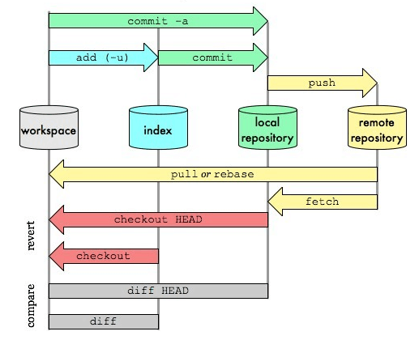
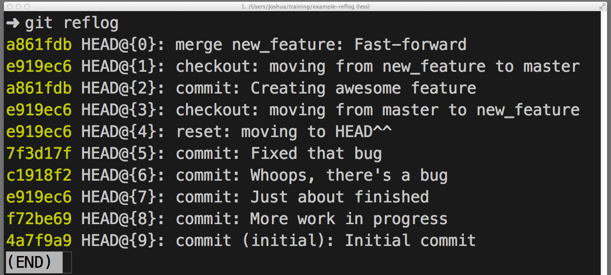
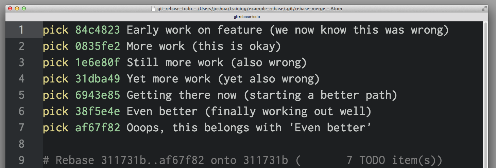
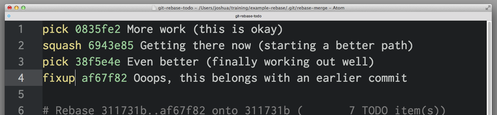

# Git 版本控制实用指南

Git作为一个目前非常流行的版本管理工具，深受开发者的喜爱。

## SVN 与 Git 的最主要的区别

SVN 是集中式版本控制系统，版本库是集中放在中央服务器的，而各终端工作的时候，用的都是自己的电脑，所以首先要从中央服务器哪里得到最新的版本，然后工作，每个阶段的工作完成后，需要把修改后的代码推送到中央服务器。集中式版本控制系统必须联网才能工作，如果在局域网还可以，带宽够大，速度够快，如果在互联网下，如果网速慢的话，每次更新效率就很低。

Git 是分布式版本控制系统，它就没有中央服务器的，个人的电脑就是一个完整的版本库，个人工作的时候不需要联网。既然每个人的电脑都有一个完整的版本库，那多个人如何协作呢？比如说自己在电脑上改了文件 A，其他人也在电脑上改了文件 A。这时，你们两之间只需把各自的修改推送给对方，就可以互相看到对方的修改了。

分布式相比于集中式的最大区别在于开发者可以提交到本地，每个开发者通过克隆（git clone），在本地机器上拷贝一个完整的Git仓库。

## 版本库

什么是版本库呢？版本库又名仓库，英文名**repository**，你可以简单理解成一个目录，这个目录里面的所有文件都可以被Git管理起来，每个文件的修改、删除，Git都能跟踪，以便任何时刻都可以追踪历史，或者在将来某个时刻可以“还原”。

***如果你使用Windows系统，为了避免遇到各种莫名其妙的问题，请确保目录名（包括父目录）不包含中文。***

### 创建版本库

`git init`命令把这个目录变成Git可以管理的仓库

```
$ git init
Initialized empty Git repository in /Users/michael/learngit/.git/
```

细心的读者可以发现当前目录下多了一个`.git`的目录，这个目录是Git来跟踪管理版本库的，没事千万不要手动修改这个目录里面的文件，把Git仓库给破坏了。如果你没有看到`.git`目录，那是因为这个目录默认是隐藏的，用`ls -ah`命令就可以看见。

不一定必须在空目录下创建Git仓库，从一个已经有内容的目录开始创建也是可以的。

### 把文件添加到版本库

所有的版本控制系统，其实只能跟踪文本文件的改动，比如TXT文件、网页文件、程序代码文件等等，Git也不例外。版本控制系统可以告诉你每次的改动，比如在第5行加了一个单词“Linux”，在第8行删了一个单词“Windows”。而图片、视频这些二进制文件，虽然也能由版本控制系统管理，但没法跟踪文件的变化，只能把二进制文件每次改动串起来，也就是只知道图片从100KB改成了120KB，但到底改了啥，版本控制系统不知道，也没法知道。

Microsoft的Word格式是二进制格式，因此，版本控制系统是没法跟踪Word文件的改动的，前面我们举的例子只是为了演示，如果要真正使用版本控制系统，就要以纯文本方式编写文件。

因为文本是有编码的，比如中文有常用的GBK编码，日文有Shift_JIS编码，如果没有历史遗留问题，强烈建议使用标准的UTF-8编码，所有语言使用同一种编码，既没有冲突，又被所有平台所支持。

首先，使用命令`git add`告诉Git，把文件添加到仓库：

```
git add readme.txt
```
第二步，用命令git commit告诉Git，把文件提交到仓库：
```
$ git commit -m "wrote a readme file"
[master (root-commit) eaadf4e] wrote a readme file
 1 file changed, 2 insertions(+)
 create mode 100644 readme.txt
```

`git commit`命令，`-m`后面输入的是本次提交的说明，可以输入任意内容，当然最好是有意义的，这样你就能从历史记录里方便地找到改动记录。

`git commit`命令执行成功后反馈显示，`1 file changed`：1个文件被改动（新添加的readme.txt文件）；`2 insertions`：插入了两行内容（readme.txt有两行内容）。

git commit一次会提交多个文件，会将暂存区内的所有改变提交给本地版本库。

## Git四大域

git四大域：工作目录，暂存区，仓库，远程仓库。

git对文件的操作都是在四大域上进行的，文件可以在四大域内与四大域间进行各种操作。（有一个例外，进行“git stash”系列操作时，文件可能被保存到四大域外的堆栈中）

```sequence
participant 工作目录

participant 暂存区

participant 仓库

participant 远程仓库

工作目录->暂存区: git add

暂存区->工作目录: git checkout

暂存区->仓库: git commit

仓库->暂存区: get reset

工作目录->远程仓库: git push

远程仓库->工作目录: git pull

```

以上包括一些简单而常用的命令，但是先不关心这些，先来了解下面这4个专有名词。

- Workspace：工作区
- Index / Stage：暂存区
- Repository：仓库区（或本地仓库）
- Remote：远程仓库

### 工作区

程序员进行开发改动的地方，是你当前看到的，也是最新的。

平常我们开发就是拷贝远程仓库中的一个分支，基于该分支进行开发。在开发过程中就是对工作区的操作。

### 暂存区

.git目录下的index文件, 暂存区会记录`git add`添加文件的相关信息(文件名、大小、timestamp...)，不保存文件实体, 通过id指向每个文件实体。可以使用`git status`查看暂存区的状态。暂存区标记了你当前工作区中，哪些内容是被git管理的。

当你完成某个需求或功能后需要提交到远程仓库，那么第一步就是通过`git add`先提交到暂存区，被git管理。

### 本地仓库

保存了对象被提交 过的各个版本，比起工作区和暂存区的内容，它要更旧一些。

`git commit`后同步index的目录树到本地仓库，方便从下一步通过`git push`同步本地仓库与远程仓库的同步。

### 远程仓库

远程仓库的内容可能被分布在多个地点的处于协作关系的本地仓库修改，因此它可能与本地仓库同步，也可能不同步，但是它的内容是最旧的。

**小结**

1. 任何对象都是在工作区中诞生和被修改；
2. 任何修改都是从进入index区才开始被版本控制；
3. 只有把修改提交到本地仓库，该修改才能在仓库中留下痕迹；
4. 与协作者分享本地的修改，可以把它们push到远程仓库来共享。

## Git 工具

### Git客户端

- [Git](https://git-scm.com/) - Mac 和 Linux 系统推荐使用终端即可，Git 一开始的命令的确很多，别无它法，熟能生巧，多练习即可能够掌握日常使用的一些命令

- [Git for windows](https://msysgit.github.io/) 针对 Window 系统发布的客户端，集成了 Shell 窗口，方便在 Win 下面使用命令操作。

- [TortoiseGit](https://tortoisegit.org/) -  在window下使用git，那就不得不提“乌龟”，安装了 Tortoise 后，右键图形化操作根本分辨不出来哪是 Git，哪是 Svn，很方便使用 Svn 的用户过度过来。

- [SourceTree](https://www.sourcetreeapp.com/) -  免费，功能齐全，Mac+Window 版本，集成 Github 等服务

测试git是否安装成功

  ```bash
  $ git --version
  git version 2.16.2
  ```

### Git 服务器端

- Github - https://github.com/    互联网上最大的Git服务提供者，可提供公共、私有（规模受限）的代码托管服务
- Gitlab - 开源的Git服务系统，可以自由部署私有的Git服务。见 Gitlab 安装指南。

### 安装Git

#### 在Linux上安装Git

首先，你可以试着输入`git`，看看系统有没有安装Git：

```
$ git
The program 'git' is currently not installed. You can install it by typing:
sudo apt-get install git
```

### 在Windows上安装Git

在Windows上使用Git，可以从Git官网直接[下载安装程序](https://git-scm.com/downloads)，国内可能会很慢，也可以到一些可靠的网站下载后进行安装。

安装完成后，在开始菜单里找到“Git”->“Git Bash”，蹦出一个类似命令行窗口的东西，就说明Git安装成功！


安装完成后，还需要最后一步设置，在命令行输入：

```
$ git config --global user.name "Your Name"
$ git config --global user.email "email@example.com"
```

注意`git config`命令的`--global`参数，用了这个参数，表示你这台机器上所有的Git仓库都会使用这个配置，当然也可以对某个仓库指定不同的用户名和Email地址。

## Git 常用命令


Git 中 `HEAD` 的概念

**HEAD**，它始终指向当前所处分支的最新的提交点。你所处的分支变化了，或者产生了新的提交点，HEAD就会跟着改变。

## Git 分支的概念

在版本管理中，每次提交，Git都把它们串成一条时间线，这条时间线就是一个分支。

详细内容见 [Git 分支详解](https://www.cnblogs.com/dazhidacheng/p/7798358.html)。

## 工作流程

一般 Git 工作流程如下：

- 克隆 Git 资源作为工作目录。

- 在克隆的资源上添加或修改文件。

- 如果其他人修改了，你可以更新资源。

- 在提交前查看修改。

- 提交修改。

- 在修改完成后，如果发现错误，可以撤回提交并再次修改并提交。


## Git 常用操作



- workspace: 本地的工作目录。（记作 A）

- index：缓存区域，临时保存本地改动。（记作 B）

- local repository: 本地仓库，只想最后一次提交 HEAD。（记作 C）

- remote repository：远程仓库。（记作 D）

以下所有的命令的功能说明，都采用上述的标记的 A、B、C、D 的方式来阐述。

### 初始化

```bash
# 初始化 
git init // 创建
git clone /path/to/repository // 检出
git config --global user.email "you@example.com" // 配置 email
git config --global user.name "Name" // 配置用户名
```
### 日常操作

```bash
# add 操作：主要实现将工作区修改的内容提交到暂存区，交由git管理。
git add <file> // 文件添加，A → B
git add . // 所有文件添加，A → B

# commit 操作：主要实现将暂存区的内容提交到本地仓库，并使得当前分支的HEAD向后移动一个提交点。
git commit -m "代码提交信息" // 文件提交，B → C
git commit --amend // 与上次 commit 合并, *B → C

# push：上传本地仓库分支到远程仓库分支，实现同步。
git push origin master // 推送至 master 分支, C → D
git pull // 更新本地仓库至最新改动， D → A
git fetch // 抓取远程仓库更新， D → C

git log // 查看提交记录
git status // 查看修改状态
git diff// 查看详细修改内容
git show// 显示某次提交的内容
```

###  撤销操作

```bash
# 撤销操作
git reset <file>// 某个文件索引会回滚到最后一次提交， C → B
git reset// 索引会回滚到最后一次提交， C → B
git reset --hard // 索引会回滚到最后一次提交， C → B → A

git checkout // 从 index 复制到 workspace， B → A
git checkout -- files // 文件从 index 复制到 workspace， B → A
git checkout HEAD -- files // 文件从 local repository 复制到 workspace， C → A
```

reset命令把当前分支指向另一个位置，并且相应的变动工作区和暂存区。

### 分支相关

```bash
# branch 分支相关：涉及到协作，自然会涉及到分支，关于分支，大概有展示分支，切换分支，创建分支，删除分支这四种操作。
git checkout -b branch_name // 创建名叫“branch_name” 的分支，并切换过去 
git checkout master // 切换回主分支
git branch -d branch_name // 删除名叫“branch_name” 的分支
git push origin branch_name // 推送分支到远端仓库

# merge 合并分支：把不同的分支合并起来。

git merge branch_name # 合并分支 branch_name 到当前分支(如 master)
git fetch [remote]	# merge之前先拉一下远程仓库最新代码
```


merge命令把不同的分支合并起来。如上图，在实际开放中，我们可能从master分支中切出一个分支，然后进行开发完成需求，中间经过R3，R4，R5的commit记录，最后开发完成需要合入master中，这便用到了merge。

### 冲突处理

一般在merge之后，会出现**代码冲突（conflict）**的情况，需要针对冲突情况，需要手动解除冲突。主要是因为两个用户修改了同一文件的同一块区域。如下图所示，需要手动解除。


```
# 冲突处理
git diff // 对比 workspace 与 index
git diff HEAD // 对于 workspace 与最后一次 commit
git diff <source_branch> <target_branch> // 对比差异
git add <filename> // 修改完冲突，需要 add 以标记合并成功
```

### 衍合（rebase）

rebase又称为衍合，是合并的另外一种选择。

在开始阶段，我们处于new分支上，执行`git rebase dev`，那么new分支上新的commit都在master分支上重演一遍，最后checkout切换回到new分支。这一点与merge是一样的，合并前后所处的分支并没有改变。`git rebase dev`，通俗的解释就是new分支想站在dev的肩膀上继续下去。rebase也需要手动解决冲突。

merge操作会生成一个新的节点，之前的提交分开显示。而rebase操作不会生成新的节点，是将两个分支融合成一个线性的提交。


```bash
# rebase
git rebase # 衍合，线性化的自动， D → A
```

### 其他

```
# 其他
gitk // 开灯图形化 git
git config color.ui true // 彩色的 git 输出
git config format.pretty oneline // 显示历史记录时，每个提交的信息只显示一行
git add -i // 交互式添加文件到暂存区
```

## Git 在团队中的使用

详见 Git 在团队中的最佳实践--如何正确使用Git Flow 。

## GIT 图书

- [Pro Git](https://git-scm.com/book/zh/v2) 《精通 Git（第二版）》的在线版本，强烈推荐

## GIT 图书

- [Pro Git](https://git-scm.com/book/zh/v2) 《精通 Git（第二版）》的在线版本，强烈推荐

## 更多参考

#### [如何在 Git 里撤销(几乎)任何操作](http://blog.jobbole.com/87700/)

任何版本控制系统的一个最有的用特性就是“撤销 (undo)”你的错误操作的能力。在 Git 里，“撤销” 蕴含了不少略有差别的功能。

当你进行一次新的提交的时候，Git 会保存你代码库在那个特定时间点的快照；之后，你可以利用 Git 返回到你的项目的一个早期版本。

#### 撤销一个“已公开”的改变

**场景:** 你已经执行了 `git push`, 把你的修改发送到了 远端仓库，如GitHub，现在你意识到这些 commit 的其中一个是有问题的，你需要撤销那一个 commit.

**方法:** `git revert <SHA>`

**原理:** `git revert` 会产生一个新的 commit，它和指定 SHA 对应的 commit 是相反的（或者说是反转的）。如果原先的 commit 是“物质”，新的 commit 就是“反物质” — 任何从原先的 commit 里删除的内容会在新的 commit 里被加回去，任何在原先的 commit 里加入的内容会在新的 commit  里被删除。

这是 Git 最安全、最基本的撤销场景，因为它并不会*改变*历史 —— 之后你可以  `git push `新的正确的 commit 来抵消你错误提交的 commit。

#### 修正最后一个 commit 消息

**场景:** 你在最后一条 commit 消息里有个笔误，已经执行了 `git commit -m "Fxies bug #42"，但在` `git push` 之前你意识到消息应该是 “Fixes bug #42″。

**方法:** `git commit --amend` 或 `git commit --amend -m "Fixes bug #42"`

**原理:** `git commit --amend` 会用一个新的 commit 更新并替换最近的 commit ，这个新的 commit 会把任何修改内容和上一个 commit 的内容结合起来。如果当前没有提出任何修改，这个操作就只会把上次的 commit 消息重写一遍。

#### 撤销“本地的”修改

**场景:** 一只猫从键盘上走过，无意中保存了修改，然后破坏了编辑器。不过，你还没有 commit 这些修改。你想要恢复被修改文件里的所有内容 — 就像上次 commit 的时候一模一样。

**方法:** `git checkout -- <bad filename>`

**原理:** `git checkout` 会把工作目录里的文件修改到 Git 之前记录的某个状态。你可以提供一个你想返回的分支名或特定 SHA ，或者在缺省情况下，Git 会认为你希望 checkout 的是 `HEAD`，当前 checkout 分支的最后一次 commit。

记住：你用这种方法“撤销”的任何修改**真的**会完全消失。因为它们从来没有被提交过，所以之后 Git 也无法帮助我们恢复它们。你要确保自己了解你在这个操作里扔掉的东西是什么！（也许可以先利用 `git diff` 确认一下）

#### 重置“本地的”修改

**场景:** 你在本地提交了一些东西（还没有 push），但是所有这些东西都很糟糕，你希望撤销前面的三次提交 — 就像它们从来没有发生过一样。

**方法:** `git reset <last good SHA>` 或 `git reset --hard <last good SHA>`

**原理:** `git reset` 会把你的代码库历史返回到指定的 SHA 状态。 这样就像是这些提交从来没有发生过。缺省情况下， `git reset` 会保留工作目录。这样，提交是没有了，但是修改内容还在磁盘上。这是一种安全的选择，但通常我们会希望一步就“撤销”提交以及修改内容 — 这就是 `--hard` 选项的功能。

#### 在撤销“本地修改”之后再恢复

**场景:** 你提交了几个 commit，然后用 `git reset --hard` 撤销了这些修改（见上一段），接着你又意识到：你希望还原这些修改！

**方法:** `git reflog` 和 `git reset` 或 `git checkout`

**原理:** `git reflog` 对于恢复项目历史是一个超棒的资源。你可以恢复**几乎** 任何东西 — 任何你 commit 过的东西 — 只要通过 reflog。

你可能已经熟悉了 `git log` 命令，它会显示 commit 的列表。 `git reflog` 也是类似的，不过它显示的是一个 `HEAD` 发生改变的时间列表.

一些注意事项：

- `它涉及的只是 HEAD` 的改变。在你切换分支、用 `git commit` 进行提交、以及用 `git reset` 撤销 commit 时，`HEAD` 会改变，但当你用  `git checkout -- <bad filename>` 撤销时（正如我们在前面讲到的情况），HEAD 并不会改变 — 如前所述，这些修改从来没有被提交过，因此 reflog 也无法帮助我们恢复它们。
- `git reflog` 不会永远保持。Git 会定期清理那些 “用不到的” 对象。不要指望几个月前的提交还一直躺在那里。
- 你的 `reflog` 就是你的，只是你的。你不能用 `git reflog` 来恢复另一个开发者没有 push 过的 commit。

[](https://cloud.githubusercontent.com/assets/2077/6953866/f6b9f054-d891-11e4-8c53-838eff9f40ae.png)

那么…你怎么利用 reflog 来“恢复”之前“撤销”的 commit 呢？它取决于你想做到的到底是什么：

- 如果你希望准确地恢复项目的历史到某个时间点，用 `git reset --hard <SHA>`
- 如果你希望重建工作目录里的一个或多个文件，让它们恢复到某个时间点的状态，用 `git checkout <SHA> -- <filename>`
- 如果你希望把这些 commit 里的某一个重新提交到你的代码库里，用 `git cherry-pick <SHA>`

#### 利用分支的另一种做法

**场景:** 你进行了一些提交，然后意识到你开始 check out 的是 `master 分支。你希望这些提交进到另一个特性（feature）分支里。`

**方法:** `git branch feature`, `git reset --hard origin/master`, and `git checkout feature`

**原理:** 你可能习惯了用 `git checkout -b <name> 创建新的分支 `— 这是创建新分支并马上 check out 的流行捷径 — 但是你不希望马上切换分支。这里， `git branch feature` 创建一个叫做 `feature` 的新分支并指向你最近的 commit，但还是让你 check out 在 `master 分支上。`

下一步，在提交任何新的 commit 之前，用 `git reset --hard` 把 `master` 分支倒回 `origin/master 。不过别担心，那些 commit 还在` `feature 分支里。`

最后，用 `git checkout` 切换到新的 `feature` 分支，并且让你最近所有的工作成果都完好无损。

#### 及时分支，省去繁琐

**场景:** 你在 master 分支的基础上创建了 `feature` 分支，但 `master` 分支已经滞后于 `origin/master 很多。现在` `master` 分支已经和 `origin/master 同步，你希望`在 `feature` 上的提交是从现在开始，而不是也从滞后很多的地方开始。

**方法:** `git checkout feature` 和 `git rebase master`

**原理:** 要达到这个效果，你本来可以通过 `git reset` (不加 `--hard`, 这样可以在磁盘上保留修改) 和 `git checkout -b <new branch name>` 然后再重新提交修改，不过这样做的话，你就会失去提交历史。我们有更好的办法。

`git rebase master` 会做如下的事情：

- 首先它会找到你当前 check out 的分支和 `master 分支的共同祖先。`
- 然后它 reset 当前  check out 的分支到那个共同祖先，在一个临时保存区存放所有之前的提交。
- 然后它把当前 check out 的分支提到 `master` 的末尾部分，并从临时保存区重新把存放的 commit 提交到 `master` 分支的最后一个 commit 之后。

#### 大量的撤销/恢复

**场景:** 你向某个方向开始实现一个特性，但是半路你意识到另一个方案更好。你已经进行了十几次提交，但你现在只需要其中的一部分。你希望其他不需要的提交统统消失。

**方法:** `git rebase -i <earlier SHA>`

**原理:** `-i` 参数让 `rebase` 进入“交互模式”。它开始类似于前面讨论的 rebase，但在重新进行任何提交之前，它会暂停下来并允许你详细地修改每个提交。

`rebase -i` 会打开你的缺省文本编辑器，里面列出候选的提交。如下所示：

[](https://cloud.githubusercontent.com/assets/2077/6953863/f6b1ab88-d891-11e4-97c1-e0630ac74e74.png)

前面两列是键：第一个是选定的命令，对应第二列里的 SHA 确定的 commit。缺省情况下， `rebase -i`  假定每个 commit 都要通过  `pick` 命令被运用。

要丢弃一个 commit，只要在编辑器里删除那一行就行了。如果你不再需要项目里的那几个错误的提交，你可以删除上例中的1、3、4行。

如果你需要保留 commit 的内容，而是对 commit 消息进行编辑，你可以使用 `reword` 命令。 把第一列里的 `pick` 替换为 `reword` (或者直接用 `r`)。有人会觉得在这里直接重写 commit 消息就行了，但是这样不管用 —`rebase -i` 会忽略 SHA 列前面的任何东西。它后面的文本只是用来帮助我们记住 `0835fe2` 是干啥的。当你完成 `rebase -i` 的操作之后，你会被提示输入需要编写的任何 commit 消息。

如果你需要把两个 commit 合并到一起，你可以使用 `squash` 或 `fixup` 命令，如下所示：

[](https://cloud.githubusercontent.com/assets/2077/6953865/f6b605ca-d891-11e4-98cf-d567ca9f4edc.png)

`squash` 和 `fixup` 会“向上”合并 — 带有这两个命令的 commit 会被合并到它的前一个 commit 里。在这个例子里， `0835fe2` 和 `6943e85` 会被合并成一个 commit， `38f5e4e` 和 `af67f82` 会被合并成另一个。

如果你选择了 `squash，` Git 会提示我们给新合并的 commit 一个新的 commit 消息； `fixup` 则会把合并清单里第一个 commit 的消息直接给新合并的 commit 。 这里，你知道 `af67f82` 是一个“完了完了….” 的 commit，所以你会留着 `38f5e4e` as的 commit 消息，但你会给合并了 `0835fe2` 和 `6943e85` 的新 commit 编写一个新的消息。

在你保存并退出编辑器的时候，Git 会按从顶部到底部的顺序运用你的 commit。你可以通过在保存前修改 commit 顺序来改变运用的顺序。如果你愿意，你也可以通过如下安排把 `af67f82` 和 `0835fe2` 合并到一起：

[](https://cloud.githubusercontent.com/assets/2077/6953864/f6b4a9d2-d891-11e4-9ac9-10039c031d06.png)

#### 修复更早期的 commit

**场景:** 你在一个更早期的 commit 里忘记了加入一个文件，如果更早的 commit 能包含这个忘记的文件就太棒了。你还没有 push，但这个 commit 不是最近的，所以你没法用 `commit --amend`.

**方法:** `git commit --squash <SHA of the earlier commit>` 和 `git rebase --autosquash -i <even earlier SHA>`

**原理:** `git commit --squash` 会创建一个新的 commit ，它带有一个 commit 消息，类似于 `squash! Earlier commit`。 (你也可以手工创建一个带有类似 commit 消息的 commit，但是 `commit --squash` 可以帮你省下输入的工作。)

如果你不想被提示为新合并的 commit 输入一条新的 commit 消息，你也可以利用 `git commit --fixup` 。在这个情况下，你很可能会用`commit --fixup` ，因为你只是希望在 `rebase` 的时候使用早期 commit 的 commit 消息。

`rebase --autosquash -i`  会激活一个交互式的 `rebase` 编辑器，但是编辑器打开的时候，在 commit 清单里任何 `squash!` 和 `fixup!` 的 commit 都已经配对到目标 commit 上了，如下所示：

[](https://cloud.githubusercontent.com/assets/2077/6953862/f6a7a1d8-d891-11e4-8784-c32262ff54da.png)

在使用 `--squash` 和 `--fixup` 的时候，你可能不记得想要修正的 commit 的 SHA 了— 只记得它是前面第 1 个或第 5 个 commit。你会发现 Git 的 `^` 和 `~ 操作符特别好用。``HEAD^` 是 `HEAD `的前一个 commit。 `HEAD~4` 是 `HEAD` 往前第 4 个 – 或者一起算，倒数第 5 个 commit。

#### 停止追踪一个文件

**场景:** 你偶然把 `application.log` 加到代码库里了，现在每次你运行应用，Git 都会报告在 `application.log` 里有未提交的修改。你把 `*.log`in 放到了 `.gitignore` 文件里，可文件还是在代码库里 — 你怎么才能告诉 Git “撤销” 对这个文件的追踪呢？

**方法:** `git rm --cached application.log`

**原理:** 虽然 `.gitignore` 会阻止 Git 追踪文件的修改，甚至不关注文件是否存在，但这只是针对那些以前从来没有追踪过的文件。一旦有个文件被加入并提交了，Git 就会持续关注该文件的改变。类似地，如果你利用 `git add -f` 来强制或覆盖了 `.gitignore`， Git 还会持续追踪改变的情况。之后你就不必用`-f`  来添加这个文件了。

如果你希望从 Git 的追踪对象中删除那个本应忽略的文件， `git rm --cached` 会从追踪对象中删除它，但让文件在磁盘上保持原封不动。因为现在它已经被忽略了，你在  `git status` 里就不会再看见这个文件，也不会再偶然提交该文件的修改了。

