# Git 异常处理清单

## 前言

Git 作为一种分布式版本控制系统已经成为现在开发的宠儿，不仅应用在前端、后端、客户端等开发场景中，也成为各行业互联网企业分工协作的必备技能之一。

大家在使用过程中总会碰到这样那样的问题，本文主要针对以下经常发生的几种异常情况提供一些解决方案：

1. 本地工作区文件恢复
2. 远程分支删除后，删除本地分支与其关联
3. 修改提交时的备注内容
4. 修改分支名，实现无缝衔接
5. 撤回提交
6. 撤销本地分支合并
7. 恢复误删的本地分支
8. 不确定哪个分支有自己提交的 commit

## （一）本地工作区文件恢复

大家都知道，一个文件夹中的文件如果被删掉了，那只有在垃圾箱里面找了。如果垃圾箱里面的也被删掉了，以笔者的常识在不借助工具的情况下怕是就找不到了

不过，关联了 Git 的文件和文件夹就不一样了，有了本地仓库和远程仓库的双重保护，找到一个被删除的文件也不过就分分钟，一个命令行的事情吧。

**语法**：`git checkout <filename/dirname>`

**命令**：`git checkout 1.js`

这一命令主要用于本地工作区文件的撤回，下图是一个工作区文件被删除后的完美恢复过程。

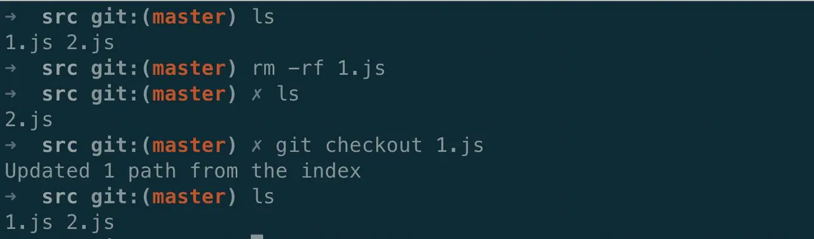

## （二）远程分支删除后，删除本地分支及关联

为方便分支提交，一般情况下会用本地命令 `git branch --set-upstream-to=origin/master master`  建立本地分支与远程分支的关联，从 master 拉出的分支可以自动建立与远程已有分支的关联，这样可以很方便的使用 `git pull`  和  `git push` 拉取远程分支的代码和将本地分支提交到远程。

Git 远程分支删除之后，本地分支就无法成功推送到远程，想要重新建立与远程仓库的关联，就需要先删除其原本的与已删除的远程分支的关联。

如下图所示，需要删除的远程分支为 feature/test，使用 `git push origin --delete feature/test` 删除掉对应的远程分支之后，删除本地分支关联。

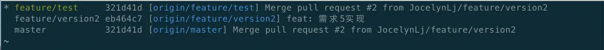

**语法**：`git branch --unset-upstream <branchname>`

**命令**：`git branch --unset-upstream feature/test`

删除掉关联关系之后，用 `git branch -vv`  命令可查看到本地分支与远程分支的关联关系如下图所示，可观察到 feature/test 分支已经没有关联的远程分支了。

## （三）修改提交时的备注内容

平时提交代码很多时候因为军情紧急，会在刚提交的时候填写了自己不太满意的备注，但笔者本人有点强迫症，一定要把它改成想要的样子咋办。。。。，不要慌，还是有解决办法滴！

想要修改最近一次提交的“修改xxx功能”的备注：

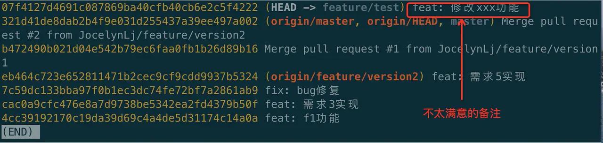

**语法**：`git commit --amend`

**命令**：`git commit --amend`

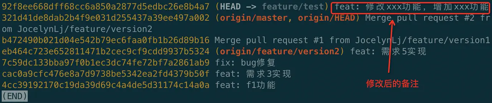

使用 `git log --pretty=oneline` 查看内容，发现已经成功修改啦。**需要注意的是此项命令会修改提交时的commit-id，即会覆盖原本的提交，需要谨慎操作**。

## （四）修改分支名，实现无缝衔接

开发中的大佬都是拥有极快手速的人，建了个分支一不小心打错了某个字母或者两个字母打反了，可能就与本意存在较大误差了，Git 提供一种已经拉取了分支，在上面开发了不少的内容，但后来发现原本拉的分支名字就有问题的修复方法。

例如，我们的想新建的分支名为 feature/story-13711，却写成了  feature/stor-13711：

**语法**：`git branch -m <oldbranch> <newbranch>`

**命令**：`git branch -m feature/stor-13711 feature/story-13711`

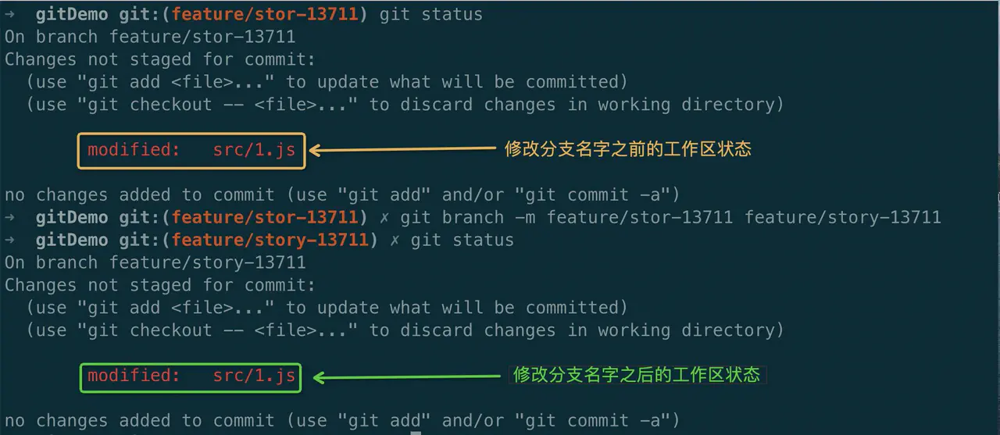

执行完之后发现文件的工作区已修改内容一点都没有变化，真正的实现了无痛过渡，皆大欢喜！

## （五）撤回提交

日常工作中，可能由于需求变更、或者误操作等原因需要进行提交的撤回：

如下分析了各种原因撤销的场景，主要包括：

- 已将更改交到本地存储，需要撤回提交
- 用新的提交内容替换上一次的提交
- 本地提交了错误的文件

### 已将更改提交到本地，需要撤回提交

**语法**： `git reset --soft [<commit-id>/HEAD~n>]`

**命令**：`git reset --soft HEAD~1`

命令执行完成后，查看文件变更记录，可发现如下图所示：

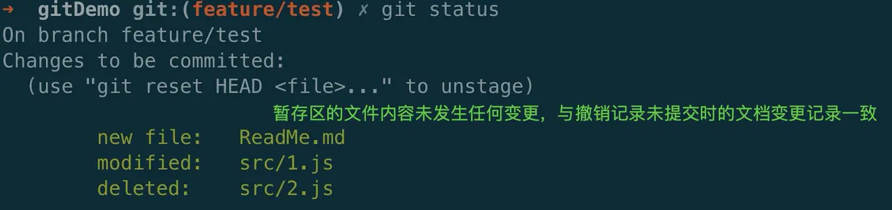

文件变更记录与未提交之前的文件变更记录是一致的，只是撤销了 commit 的操作。

### 用新的更改替换撤回的更改

提交之中可能有些地方需要优化，我们可以撤销本次的 commit 以及文件暂存状态，修改之后再重新添加到暂存区进行提交。

**语法**： `git reset --mixed [<commit-id>/HEAD~n>]`

**命令**：`git reset --mixed HEAD~1`

命令执行完成后，查看文件变更记录，可发现如下图所示：

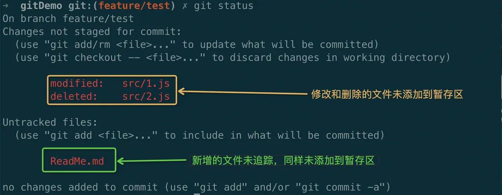

已变更的文件都未添加到暂存区，撤销了 commit 和 add 的操作。

### 本地提交了错误的文件

本地将完全错误的，本不应提交的内容提交到了仓库，需要进行撤销，可以使用 --hard 参数

**语法**： `git reset --hard [<commit-id>/HEAD~n>]`

**命令**：`git reset --hard HEAD~1`

命令执行完成后，查看文件变更记录，可发现如下图所示：

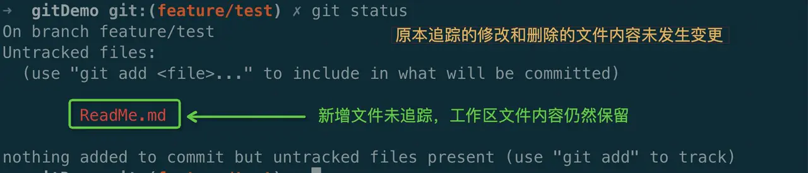

已追踪文件的变更内容都消失了，撤销了 commit 和 add 的操作，同时撤销了本地已追踪内容的修改；未追踪的内容不会被改变。从上面的效果可以看到，文件的修改都会被撤销。**-hard  参数需要谨慎使用**。

## （六）撤销本地分支合并

实际操作中，总会有很多的干扰，导致我们合并了并不该合并的分支到目标分支上。解决这种问题的方式有两种，`git reset` 和 `git revert`。 reset 的语法和命令之前已经介绍过，不做赘述， revert 的语法和命令和 reset 一致。但是产生的实际效果会有不同。

可以先来看下 revert 操作的实际效果，合并分支之后的效果如下图所示：

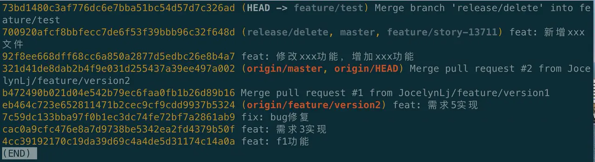

撤销合并：

**语法**：`git revert <commit-id>`

**命令**：`git revert 700920`

下图为执行命令后的效果：

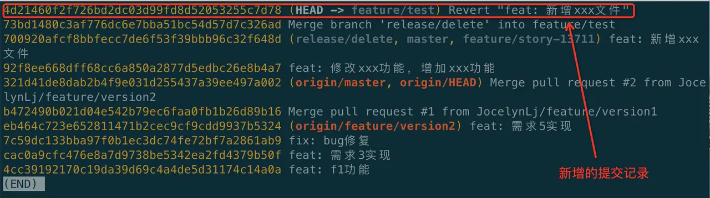

经过前后对比可知，revert 执行之后会在原本的记录中新增一条提交记录。

reset 如上 “本地文件撤销” 例子所述，会删除掉原本已有的提交记录，在合并分支中，会删除原本合并分支的记录。revert 则有不同，会保留原本合并分支的记录，并在其上新增一条提交记录，便于之后有需要仍然能够回溯到 revert 之前的状态。

从需要提交到远程分支的角度来讲，reset 能够“毁尸灭迹”，不让别人发现我们曾经错误的合并过分支（**注：多人协作中，需要谨慎使用**）；revert 则会将合并分支和撤回记录一并显示在远程提交记录上。

## （七）恢复误删的本地分支

本地分支拉取之后，由于疏忽被删除，而且本地的分支并没有被同步到远程分支上，此时想要恢复本地分支。

误删的分支为 feature/delete，使用 `git reflog` 命令可查看到该仓库下的所有历史操作，如下图所示：

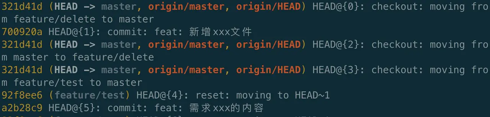

**语法**：`git checkout -b <branch-name> <commit-id>`

**命令**：`git checkout -b feature/delete HEAD@{2}`

命令执行完成后，分支恢复到 HEAD@{2} 的快照，即从 master 分支拉取 feature/delete 分支的内容，仍然缺少“新增xxx文件”的提交，直接将文件内容恢复到最新的提交内容，使用命令 `git reset --hard HEAD@{1}` 即可实现硬性覆盖本地工作区内容的目的。`git reflog` 命令获取到的内容为本地仓库所有发生过的变更，可谓恢复利器，既可向前追溯，亦可向后调整，满满的时光追溯器的赶脚啊。。。

## （八）不确定哪个分支有自己提交的 commit

工作中会经常碰到一种场景，某个提交先后合并到了各个分支上，但后来发现提交的这个修改是有问题的，需要排查到底哪个分支包含这个提交，然后将其修复掉。

需要先确定有问题的提交的 commit-id :

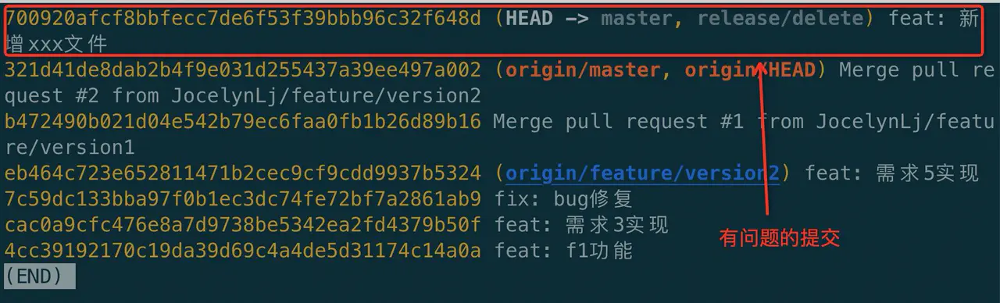

然后查看本地所有的分支：

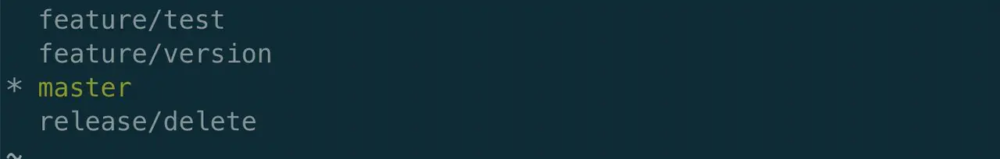

可以看到本地有 4 个分支，本地的分支数量非人为控制的，在使用状态的分支直接删掉也不合适，分支数量达到一定程度，一个一个分支查找也不现实。Git 提供了一种能够直接通过 commit-id 查找出包含该内容分支的命令。

**语法**：`git branch --contains <commit-id>`

**命令**：`git branch --contains 700920`

命令执行后可以看到包含该问题提交的分支如下图所示，就可以很方便的在对应分支上修复内容啦。

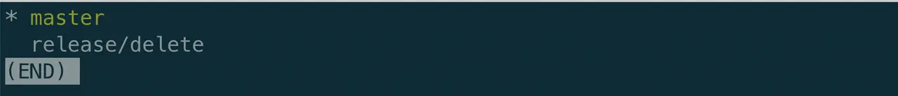

## 总结

本文介绍的是实际工作场景中可能出现的几种异常情况及解决方式，希望能够对大家有所帮助，不足之处敬请指正。实际上现在已经有很多 Git 操作对应的工具可以使用，需要明白的是工具中的每个操作等同于 Git 命令行的哪个命令，会有什么样的结果，以避免一些不必要发生的错误。

## 参考文献

[Git 错误集锦和修复方法](https://www.edureka.co/blog/common-git-mistakes/#pushed)

[Git 中.gitignore的配置语法](https://www.jianshu.com/p/ea6341224e89)

[git reset 和 git revert](https://juejin.im/post/5b0e5adc6fb9a009d82e4f20)

## 推荐阅读

[图解 HTTP 缓存](https://juejin.im/post/5eb7f811f265da7bbc7cc5bd)

[可能是最全的 “文本溢出截断省略” 方案合集](https://juejin.im/post/5dc15b35f265da4d432a3d10)

[图文并茂，为你揭开“单点登录“的神秘面纱](https://juejin.im/post/5e11a6e96fb9a048411a4eca)

作者：政采云前端团队
链接：https://juejin.im/post/5edcf3a36fb9a047fa04fbc3
来源：掘金
著作权归作者所有。商业转载请联系作者获得授权，非商业转载请注明出处。