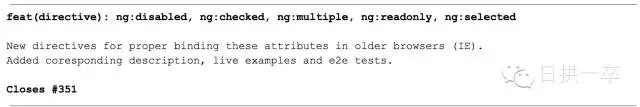

Git: 教你如何在Commit时有话可说
=====================

原创： lazybios [原始链接](https://mp.weixin.qq.com/s?__biz=MzAwNDYwNzU2MQ==&mid=401622986&idx=1&sn=470717939914b956ac372667ed23863c&scene=2&srcid=0114ZcTNyAMH8CLwTKlj6CTN&from=timeline&isappinstalled=0#wechat_redirect)

**日拱一卒** 

微信号 rigongyizu365

功能介绍 一线码农不端不装的「日拱一卒」，关注技术、书籍、创业、GTD、以及一切个人成长周边的话题，每周一到五更新。

不知道大家有没有观察过那些在Github上Star数位居前列的项目，它们无一例外的都拥有完善的文档体系和高覆盖的测试用例。要做到完善没有规范肯定是不行的，代码要有代码的规范，协作要有协作的规范。我们今天要说的主题就是关于Git中记录Commit Message的参考规范。先来看两张图，一张来自国际知名项目，一张是国内某知名项目(笑)。

##### 国际知名项目AngularJS

##### 国内知名项目MingGeJS

从上面两张图中，我想你已经能看出一些端倪来了吧，相较而言哪种更加能促进开发不言自明。当然，我举这个国内知名项目比较极端，不过整体而言都普遍存在Commit Message比较随意的现象。

## Commit规范

顺着思路，这一步应该给方案了，方案就是上图AngularJS项目中用到的Git Commit Guidelines。

### Commit Message 格式

    <type>(<scope>): <subject>
    <空行>
    <body>
    <空行>
    <footer>

上面是一次Commit后Message格式规范，分成标题，内容详情，结尾三个部分，各有各的用处，没有多余项。

头部即首行，是可以直接在页面中预览的部分，入上面图中所示，一共有三个部分<type>，<scope>，<subject>，含义分别如下

#### Type

*   feat：新功能（feature）

*   fix：修补bug

*   docs：文档（documentation）

*   style： 格式（不影响代码运行的变动）

*   refactor：重构（即不是新增功能，也不是修改bug的代码变动）

*   test：增加测试

*   chore：构建过程或辅助工具的变动

#### Scope

用来说明本次Commit影响的范围，即简要说明修改会涉及的部分。这个本来是选填项，但从AngularJS实际项目中可以看出基本上也成了必填项了。

#### Subject

用来简要描述本次改动，概述就好了，因为后面还会在Body里给出具体信息。并且最好遵循下面三条:

*   以动词开头，使用第一人称现在时，比如change，而不是changed或changes

*   首字母不要大写

*   结尾不用句号(.)

#### Body

<body>里的内容是对上面subject里内容的展开，在此做更加详尽的描述，内容里应该包含修改动机和修改前后的对比。

#### Footer

footer里的主要放置**不兼容变更**和**Issue关闭**的信息，参考下面两个例子

#### Revert

此外如果需要撤销之前的Commit，那么本次Commit Message中必须以`revert：`开头，后面紧跟前面描述的Header部分，格式不变。并且，Body部分的格式也是固定的，必须要记录撤销前Commit的SHA值。

## 实践利器

上面就是AngularJS目前的Commit规范，相信第一次接触的话不免会有些头大，这时如果有什么能Step by Step的提醒或者可视化的演示就好了。OK，你来对地儿了，现在就来说说如何把规范变为可执行的具体步骤！

### 安装利器Commitiz

为了让我们能把这些规范应用到实际使用中，我们要借助于`Commitizen`这个Node工具，它会在我们Commit的过程中更具规范的内容来引导我们如何一步一步实施规范。当然，规范这种东西就没有唯一的，各家有各家的不同，这一点当然也被该工具想到了，你也可以自定义一份自己的规范，以插件的形式让Commitizen来根据自家规范提醒你。

#### 安装

    npm install -g commitizen

#### 配置

上一步我们在全局范围内安装了commitizen，之后我们就可以在Git仓库中配置我们的Commit规范了。打开项目执行如下命令:

    commitizen init cz-conventional-changelog --save --save-exact

上面的cz-conventional-changelog就是AngularJS的规范，其它的规范你可以自行到官网上找找看，不行就自己花时间拟定一份吧。此命令帮你完成了下载cz-conventional-changelog规范，配置package.json(添加依赖和配置应用规范)，想看具体改动打开package.json即可。

#### 使用

至此就算完整的安装完了，之后在需要`git commit`的地方更换成`git cz`指令即可呼出Commit的交互界面，来step by step的提醒你上面规范的各处该怎么填，是在不明在自己建一个项目练习几次就好了。

-完-

**你还可以看：**

[Git: 聊聊Rebase命令](http://mp.weixin.qq.com/s?__biz=MzAwNDYwNzU2MQ==&mid=400938481&idx=1&sn=f4d92674ebf00c0a208936e6467c3da1&scene=21#wechat_redirect)  

[Git: 如何安全的进行Commit操作](http://mp.weixin.qq.com/s?__biz=MzAwNDYwNzU2MQ==&mid=401218873&idx=1&sn=99f1cda1746f1da2e7e614a3ec2c3d27&scene=21#wechat_redirect)  

[Git: 如何优雅的执行「git pull」操作](http://mp.weixin.qq.com/s?__biz=MzAwNDYwNzU2MQ==&mid=401203014&idx=1&sn=5061ecbf8c7359a1021774e68e74656e&scene=21#wechat_redirect)  

[Git：「小步快跑」的开发模式](http://mp.weixin.qq.com/s?__biz=MzAwNDYwNzU2MQ==&mid=401030521&idx=1&sn=6e3f4b4c33108688b23d24188f228bbd&scene=21#wechat_redirect)  

[Git: 忽略已被提交的文件](http://mp.weixin.qq.com/s?__biz=MzAwNDYwNzU2MQ==&mid=400053771&idx=1&sn=515fe3f34c4164d3af7e1e2c3a0b0766&scene=21#wechat_redirect)  

[Git: 重写提交历史](http://mp.weixin.qq.com/s?__biz=MzAwNDYwNzU2MQ==&mid=400090340&idx=1&sn=85a16c05928d6d660b4c26d6934a6acc&scene=21#wechat_redirect)

[Git: 如何在你的项目中正确使用Submodules](http://mp.weixin.qq.com/s?__biz=MzAwNDYwNzU2MQ==&mid=400343346&idx=1&sn=370f5cdfb03a78ff68d6bbe0038371d1&scene=21#wechat_redirect)

  

## 参考引用

*   http://t.cn/zR5qSLt

*   http://t.cn/R4SXfz7
