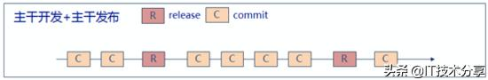
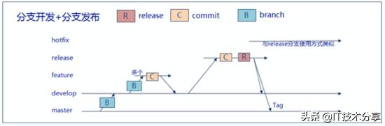

# 微服务架构下代码管理规范

当下对于代码的管理，主要采用GitLab或GitHub，然而使用git进行代码管理过程中，一般有四种开发模式，分别为主干开发主干发布，主干开发分支发布，分支开发主干发布，分支开发分支发布。四种开发模式各有特色，下面将从针对四种开发模式进行一一。

但是针对微服务体系下，代码的管理，一般建议采用分支开发主干发布。

**1. 代码管理模式**

**1.1. 主干开发+主干发布模式**

模式特点：所有的操作都在主干上进行操作，随着时间的演进，代码只有一个版本，任何修改，均体现在主干上面，开发过程比较简单。

操作权限：该种模式对于开发人员与项目经理等在代码提交方面，权限相同；

适用场景：该种模式适用于团队规模较小，业务模型明确，且人员技能较高的开发团队。

**1.2. 主干开发+分支发布模式**

模式特点：所有的操作都在主干上进行操作，随着时间的演进，代码具有多个版本，运行多个版本可并行提供服务。

操作权限：该种模式对于开发人员与项目经理等在代码提交方面，权限相同；

适用场景：该种模式适用于多版本并存，但只维护一个版本的产品，其他版本不进行维护的项目，该种场景较少。

**1.3. 分支开发+主干发布模式**

模式特点：所有的代码提交都在分支上操作，随着时间的演进，需要构建Release版本时，需要将代码提交到主干上面，平常开发都是在分支上进行，好处可保证主干代码始终可用。

操作权限：该种方式开发人员只具有开发分支权限，无master权限，代码的merge只能由项目经理或有权人完成；

适用场景：该种模式适用于多功能并行开发，按照业务特性或模块进行在分支进行开发，然后在进行合并后进行Release构建发布，业务场景较复杂，且人员素质层次不齐，需要代码review。

### **1.4. 分支开发+分支发布模式**

模式特点：所有的代码提交都在分支上操作，随着时间的演进，需要构建Release版本时，也是直接在分支上进行构建，各分支独立演进，与主分支关系不大，是主干开发主干发布的一个组合使用。

操作权限：该种方式开发人员与项目经理一样，只具有分支上的操作权限，不具有master权限。

适用场景：该模式适用于需求群/项目群的方式进行开发，大家公用同一个代码库，然后共享部门基础代码，然后各分支独立进行演进。

## **2. 代码管理规范**

无规矩不成方圆，微服务架构下，代码的管理一般采用git进行管控，因此，在使用git进行版本控制时，应遵循一些原则及规范。

### **2.1. 代码管理原则**

代码管理的原则，用于确保代码管理过程中不出现原则性错误，出现原则性错误，则会出现许多无用的操作，基本原则如下：

- 模式确实后，必须严格遵循执行；
- 提交代码时，禁止代码强制提交；
- 代码提交时，必须进行注释说明；
- 代码提交时，必须按照规范执行；
- 出现冲突时，必须进行确认处理；

**2.2. 代码管理规范**

由于微服务一般建议采用分支开发主干发布，因此，本规范主要针对分支开发主干发布模式，具体规范如下：

- 原则上代码的开发提交，必须通过创建分支进行开发，特殊情况除外（bug），review同事有责任进行检查其他同事是否遵循分支规范；
- 代码提交前，必须先进行更新代码（git pull），对于有冲突的文件，必须要进行对比，确认素有修改都是自己修改的，然后在进行提交，防止代码回溯（即别人的代码被覆盖）；
- review同事遇到代码删除情况，必须与开发确认，是否为开发同事自己删除，如果不是，很可能就是代码回溯；
- 在代码开发阶段，代码的提交尽量独立化，也就是功能模块尽量细分，每个开发负责一个模块，尽量不要修改其他成员模块代码；
- 多人协作时，需要创建一个远程分支，然后一起在远程分支里协作开发，防止代码回溯。禁止各自开发，然后线下发送文件合并；
- 代码提交前，必须进行git pull，且进行git diff进行比对代码，确保提交代码为自己修改内容，防止出现代码回溯；
- 代码出现冲突时，必须 要与冲突代码提交者进行确认冲突内容，双方确认无误方可处理；
- 主分支（master）为生产环境分支，除特殊情况（修复bug），禁止在master分支上进行开发；
- 代码提交时，必须描述清楚做了什么，提交动作有add、update、remove，提交格式为[动作]+[操作的模块信息，尽量详细到具体的类名方法名]+[操作描述信息]，例如：git commit –m ‘update aa.java findByName 将精确查询修改为模糊查询’，每次提交尽量一个动作，多个动作请多次提交；
- 在git中，默认空目录不会提交，如果某个空目录想提交到版本库，需要在该目录下新建一个deleteme.txt的空白文件；
- 开发分支（developer）为开发分支，一般作为主要的代码提交分支；
- 修复分支为修复bug分支，命名格式为bugfix-{date}，修复分支用于主要分支的bug修复工作；
- 功能分支为新增功能分支，命名格式为feature-{message}，可合并到developer分支；
- 其他分支，为特殊情况建立的分支，命名应带有分支相关信息；

