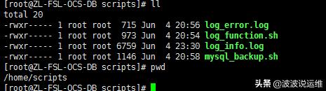
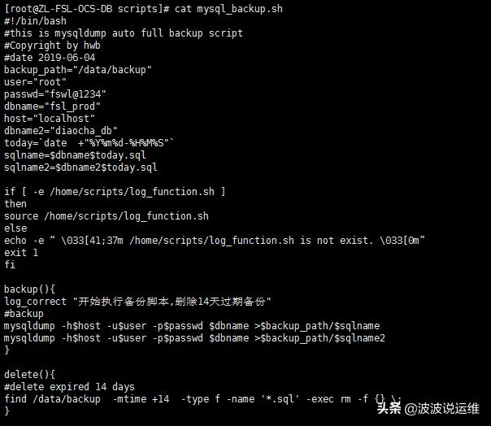
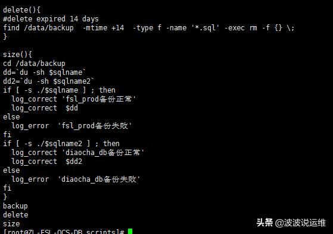
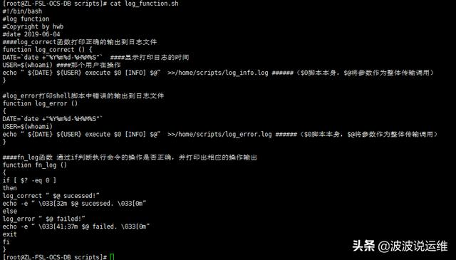
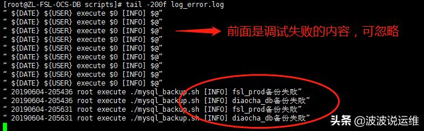

# 超详细的mysql数据库自动备份脚本（附日志结果输出）

## 概述

最近梳理了下Oracle、mysql、sqlserver的一些备份情况，关于mysql之前只做了定期备份的脚本，但是并没有把备份是否正确输出为日志，所以前段时间调整了一下脚本，下面分享一下修改后的备份脚本，主要改了几个方面：

**1、增加备份日志输出**

**2、增加备份是否有效判断**

**3、定期清理过期备份**



## 01备份脚本内容

存放位置：/home/scripts/mysql_backup.sh

```
#!/bin/bash
#this is mysqldump auto full backup script
#Copyright by hwb
#date 2019-06-04
backup_path="/data/backup"
user="root"
passwd="fswl@1234"
dbname="fsl_prod"
host="localhost"
dbname2="diaocha_db"
today=`date +"%Y%m%d-%H%M%S"`
sqlname=$dbname$today.sql
sqlname2=$dbname2$today.sql
if [ -e /home/scripts/log_function.sh ]
then
source /home/scripts/log_function.sh
else
echo -e “ /home/scripts/log_function.sh is not exist. ”
exit 1
fi
backup(){
log_correct "开始执行备份脚本,删除14天过期备份"
#backup
mysqldump -h$host -u$user -p$passwd $dbname >$backup_path/$sqlname
mysqldump -h$host -u$user -p$passwd $dbname >$backup_path/$sqlname2
}
delete(){
#delete expired 14 days
find /data/backup -mtime +14 -type f -name '*.sql' -exec rm -f {} ;
}
size(){
cd /data/backup
dd=`du -sh $sqlname`
dd2=`du -sh $sqlname2`
if [ -s ./$sqlname ] ; then 
 log_correct 'fsl_prod备份正常'
 log_correct $dd
else
 log_error 'fsl_prod备份失败'
fi
if [ -s ./$sqlname2 ] ; then 
 log_correct 'diaocha_db备份正常'
 log_correct $dd2
else
 log_error 'diaocha_db备份失败'
fi
}
backup
delete
size
```





## 02日志脚本

存放位置：/home/scripts/log_function.sh

```
#!/bin/bash
#log function
#Copyright by hwb
#date 2019-06-04
####log_correct函数打印正确的输出到日志文件
function log_correct () {
DATE=`date +"%Y%m%d-%H%M%S"` ####显示打印日志的时间
USER=$(whoami) ####那个用户在操作
echo “${DATE} ${USER} execute $0 [INFO] $@” >>/home/scripts/log_info.log ######（$0脚本本身，$@将参数作为整体传输调用）
}
#log_error打印shell脚本中错误的输出到日志文件
function log_error ()
{
DATE=`date +"%Y%m%d-%H%M%S"`
USER=$(whoami)
echo “${DATE} ${USER} execute $0 [INFO] $@” >>/home/scripts/log_error.log ######（$0脚本本身，$@将参数作为整体传输调用）
}
####fn_log函数 通过if判断执行命令的操作是否正确，并打印出相应的操作输出
function fn_log ()
{
if [ $? -eq 0 ]
then
log_correct “$@ sucessed!”
echo -e “ $@ sucessed. ”
else
log_error “$@ failed!”
echo -e “ $@ failed. ”
exit
fi
}
```



## 03备份输出

输出结果如下：

备份成功：


备份失败：



到这里就基本满足需求，也就不继续做优化了。

脚本其实是写逻辑，只要逻辑通了，一般都可以满足需求，这个脚本大家也可以继续深入优化，时间比较赶，就不继续了。