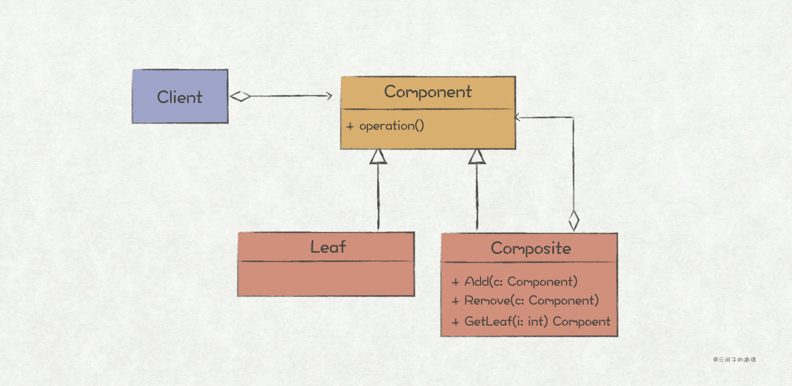

# 23种设计模式的Go语言实现

【摘要】 设计模式（Design Pattern）是一套被反复使用、多数人知晓的、经过分类编目的、代码设计经验的总结，使用设计模式是为了可重用代码、让代码更容易被他人理解并且保证代码可靠性。

## 前言：5种创建型模式

从1995年GoF提出23种**设计模式**到现在，25年过去了，设计模式依旧是软件领域的热门话题。在当下，如果你不会一点设计模式，都不好意思说自己是一个合格的程序员。设计模式通常被定义为：

> 设计模式（Design Pattern）是一套被反复使用、多数人知晓的、经过分类编目的、代码设计经验的总结，使用设计模式是为了可重用代码、让代码更容易被他人理解并且保证代码可靠性。

从定义上看，**设计模式其实是一种经验的总结，是针对特定问题的简洁而优雅的解决方案**。既然是经验总结，那么学习设计模式最直接的好处就在于可以站在巨人的肩膀上解决软件开发过程中的一些特定问题。然而，学习设计模式的最高境界是习得其中解决问题所用到的思想，当你把它们的本质思想吃透了，也就能做到**即使已经忘掉某个设计模式的名称和结构，也能在解决特定问题时信手拈来**。

好的东西有人吹捧，当然也会招黑。设计模式被抨击主要因为以下两点：

1、*设计模式会增加代码量，把程序逻辑变得复杂*。这一点是不可避免的，但是我们并不能仅仅只考虑开发阶段的成本。最简单的程序当然是一个函数从头写到尾，但是这样后期的维护成本会变得非常大；而设计模式虽然增加了一点开发成本，但是能让人们写出可复用、可维护性高的程序。引用《软件设计的哲学》里的概念，前者就是**战术编程**，后者就是**战略编程**，我们应该**对战术编程Say No**！（请移步[《专家教你系列<三>：写出的代码复杂度太高？看下专家怎么说》](https://bbs.huaweicloud.com/blogs/265973)）

2、*滥用设计模式*。这是初学者最容易犯的错误，当学到一个模式时，恨不得在所有的代码都用上，从而在不该使用模式的地方刻意地使用了模式，导致了程序变得异常复杂。其实每个设计模式都有几个关键要素：**适用场景**、**解决方法**、**优缺点**。模式并不是万能药，它只有在特定的问题上才能显现出效果。所以，在使用一个模式前，先问问自己，当前的这个场景适用这个模式吗？

《设计模式》一书的副标题是“可复用面向对象软件的基础”，但并不意味着只有面向对象语言才能使用设计模式。模式只是一种解决特定问题的思想，跟语言无关。就像Go语言一样，它并非是像C++和Java一样的面向对象语言，但是设计模式同样适用。本系列文章将使用Go语言来实现GoF提出的23种设计模式，按照**创建型模式**（Creational Pattern）、**结构型模式**（Structural Pattern）和**行为型模式**（Behavioral Pattern）三种类别进行组织，文本主要介绍其中的创建型模式。

## 01 单例模式（Singleton Pattern）


### 简述

单例模式算是23中设计模式里最简单的一个了，它主要用于**保证一个类仅有一个实例，并提供一个访问它的全局访问点**。

在程序设计中，有一些对象通常我们只需要一个共享的实例，比如线程池、全局缓存、对象池等，这种场景下就适合使用单例模式。

但是，并非所有全局唯一的场景都适合使用单例模式。比如，考虑需要统计一个API调用的情况，有两个指标，成功调用次数和失败调用次数。这两个指标都是全局唯一的，所以有人可能会将其建模成两个单例`SuccessApiMetric`和`FailApiMetric`。按照这个思路，随着指标数量的增多，你会发现代码里类的定义会越来越多，也越来越臃肿。这也是单例模式最常见的误用场景，更好的方法是将两个指标设计成一个对象`ApiMetric`下的两个实例`ApiMetic success`和`ApiMetic fail`。

*如何判断一个对象是否应该被建模成单例？*

通常，被建模成单例的对象都有“**中心点**”的含义，比如线程池就是管理所有线程的中心。所以，在判断一个对象是否适合单例模式时，先思考下，这个对象是一个中心点吗？

### Go实现

在对某个对象实现单例模式时，有两个点必须要注意：（1）**限制调用者直接实例化该对象**；（2）**为该对象的单例提供一个全局唯一的访问方法**。

对于C++/Java而言，只需把类的构造函数设计成私有的，并提供一个`static`方法去访问该类点唯一实例即可。但对于Go语言来说，即没有构造函数的概念，也没有`static`方法，所以需要另寻出路。

我们可以利用Go语言`package`的访问规则来实现，将单例结构体设计成首字母小写，就能限定其访问范围只在当前package下，模拟了C++/Java中的私有构造函数；再在当前`package`下实现一个首字母大写的访问函数，就相当于`static`方法的作用了。

在实际开发中，我们经常会遇到需要频繁创建和销毁的对象。频繁的创建和销毁一则消耗CPU，二则内存的利用率也不高，通常我们都会使用对象池技术来进行优化。考虑我们需要实现一个消息对象池，因为是全局的中心点，管理所有的Message实例，所以将其实现成单例，实现代码如下：

```javascript
 package msgpool
 ...
 // 消息池
 type messagePool struct {
 pool *sync.Pool
 }
 // 消息池单例
 var msgPool = &messagePool{
 // 如果消息池里没有消息，则新建一个Count值为0的Message实例
 pool: &sync.Pool{New: func() interface{} { return &Message{Count: 0} }},
 }
 // 访问消息池单例的唯一方法
 func Instance() *messagePool {
 return msgPool
 }
 // 往消息池里添加消息
 func (m *messagePool) AddMsg(msg *Message) {
 m.pool.Put(msg)
 }
 // 从消息池里获取消息
 func (m *messagePool) GetMsg() *Message {
 return m.pool.Get().(*Message)
 }
 ...
```

测试代码如下：

```javascript
 package test
 ...
 func TestMessagePool(t *testing.T) {
 msg0 := msgpool.Instance().GetMsg()
 if msg0.Count != 0 {
 t.Errorf("expect msg count %d, but actual %d.", 0, msg0.Count)
 }
 msg0.Count = 1
 msgpool.Instance().AddMsg(msg0)
 msg1 := msgpool.Instance().GetMsg()
 if msg1.Count != 1 {
 t.Errorf("expect msg count %d, but actual %d.", 1, msg1.Count)
 }
 }
 // 运行结果
 === RUN   TestMessagePool
 --- PASS: TestMessagePool (0.00s)
 PASS
```

以上的单例模式就是典型的“**饿汉模式**”，实例在系统加载的时候就已经完成了初始化。对应地，还有一种“**懒汉模式**”，只有等到对象被使用的时候，才会去初始化它，从而一定程度上节省了内存。众所周知，“懒汉模式”会带来线程安全问题，可以通过**普通加锁**，或者更高效的**双重检验锁**来优化。对于“懒汉模式”，Go语言有一个更优雅的实现方式，那就是利用`sync.Once`，它有一个`Do`方法，其入参是一个方法，Go语言会保证仅仅只调用一次该方法。

```javascript
 // 单例模式的“懒汉模式”实现
 package msgpool
 ...
 var once = &sync.Once{}
 // 消息池单例，在首次调用时初始化
 var msgPool *messagePool
 // 全局唯一获取消息池pool到方法
 func Instance() *messagePool {
 // 在匿名函数中实现初始化逻辑，Go语言保证只会调用一次
 once.Do(func() {
 msgPool = &messagePool{
 // 如果消息池里没有消息，则新建一个Count值为0的Message实例
 pool: &sync.Pool{New: func() interface{} { return &Message{Count: 0} }},
 }
 })
 return msgPool
 }
 ...
```

## 02 建造者模式（Builder Pattern）


### 简述

在程序设计中，我们会经常遇到一些复杂的对象，其中有很多成员属性，甚至嵌套着多个复杂的对象。这种情况下，创建这个复杂对象就会变得很繁琐。对于C++/Java而言，最常见的表现就是构造函数有着长长的参数列表：

```javascript
 MyObject obj = new MyObject(param1, param2, param3, param4, param5, param6, ...)
```

而对于Go语言来说，最常见的表现就是多层的嵌套实例化：

```javascript
 obj := &MyObject{
   Field1: &Field1 {
     Param1: &Param1 {
       Val: 0,
    },
     Param2: &Param2 {
       Val: 1,
    },
     ...
  },
   Field2: &Field2 {
     Param3: &Param3 {
       Val: 2,
    },
     ...
  },
   ...
 }
```

上述的对象创建方法有两个明显的缺点：（1）**对对象使用者不友好**，使用者在创建对象时需要知道的细节太多；（2）**代码可读性很差**。

*针对这种对象成员较多，创建对象逻辑较为繁琐的场景，就适合使用建造者模式来进行优化。*

建造者模式的作用有如下几个：

1、封装复杂对象的创建过程，使对象使用者不感知复杂的创建逻辑。

2、可以一步步按照顺序对成员进行赋值，或者创建嵌套对象，并最终完成目标对象的创建。

3、对多个对象复用同样的对象创建逻辑。

其中，第1和第2点比较常用，下面对建造者模式的实现也主要是针对这两点进行示例。

### Go实现

考虑如下的一个`Message`结构体，其主要有`Header`和`Body`组成：

```javascript
 package msg
 ...
 type Message struct {
 Header *Header
 Body   *Body
 }
 type Header struct {
 SrcAddr  string
 SrcPort  uint64
 DestAddr string
 DestPort uint64
 Items    map[string]string
 }
 type Body struct {
 Items []string
 }
 ...
```

如果按照直接的对象创建方式，创建逻辑应该是这样的：

```javascript
 // 多层的嵌套实例化
 message := msg.Message{
 Header: &msg.Header{
 SrcAddr:  "192.168.0.1",
 SrcPort:  1234,
 DestAddr: "192.168.0.2",
 DestPort: 8080,
 Items:    make(map[string]string),
 },
 Body:   &msg.Body{
 Items: make([]string, 0),
 },
 }
 // 需要知道对象的实现细节
 message.Header.Items["contents"] = "application/json"
 message.Body.Items = append(message.Body.Items, "record1")
 message.Body.Items = append(message.Body.Items, "record2")
```

虽然`Message`结构体嵌套的层次不多，但是从其创建的代码来看，确实存在**对对象使用者不友好**和**代码可读性差**的缺点。下面我们引入建造者模式对代码进行重构：

```javascript
 package msg
 ...
 // Message对象的Builder对象
 type builder struct {
 once *sync.Once
 msg *Message
 }
 // 返回Builder对象
 func Builder() *builder {
 return &builder{
 once: &sync.Once{},
 msg: &Message{Header: &Header{}, Body: &Body{}},
 }
 }
 // 以下是对Message成员对构建方法
 func (b *builder) WithSrcAddr(srcAddr string) *builder {
 b.msg.Header.SrcAddr = srcAddr
 return b
 }
 func (b *builder) WithSrcPort(srcPort uint64) *builder {
 b.msg.Header.SrcPort = srcPort
 return b
 }
 func (b *builder) WithDestAddr(destAddr string) *builder {
 b.msg.Header.DestAddr = destAddr
 return b
 }
 func (b *builder) WithDestPort(destPort uint64) *builder {
 b.msg.Header.DestPort = destPort
 return b
 }
 func (b *builder) WithHeaderItem(key, value string) *builder {
   // 保证map只初始化一次
 b.once.Do(func() {
 b.msg.Header.Items = make(map[string]string)
 })
 b.msg.Header.Items[key] = value
 return b
 }
 func (b *builder) WithBodyItem(record string) *builder {
 b.msg.Body.Items = append(b.msg.Body.Items, record)
 return b
 }
 // 创建Message对象，在最后一步调用
 func (b *builder) Build() *Message {
 return b.msg
 }
```

测试代码如下：

```javascript
 package test
 ...
 func TestMessageBuilder(t *testing.T) {
   // 使用消息建造者进行对象创建
 message := msg.Builder().
 WithSrcAddr("192.168.0.1").
 WithSrcPort(1234).
 WithDestAddr("192.168.0.2").
 WithDestPort(8080).
 WithHeaderItem("contents", "application/json").
 WithBodyItem("record1").
 WithBodyItem("record2").
 Build()
 if message.Header.SrcAddr != "192.168.0.1" {
 t.Errorf("expect src address 192.168.0.1, but actual %s.", message.Header.SrcAddr)
 }
 if message.Body.Items[0] != "record1" {
 t.Errorf("expect body item0 record1, but actual %s.", message.Body.Items[0])
 }
 }
 // 运行结果
 === RUN   TestMessageBuilder
 --- PASS: TestMessageBuilder (0.00s)
 PASS
```

从测试代码可知，使用建造者模式来进行对象创建，使用者不再需要知道对象具体的实现细节，代码可读性也更好。

## 03 工厂方法模式（Factory Method Pattern）


### 简述

工厂方法模式跟上一节讨论的建造者模式类似，都是**将对象创建的逻辑封装起来，为使用者提供一个简单易用的对象创建接口**。两者在应用场景上稍有区别，建造者模式更常用于需要传递多个参数来进行实例化的场景。

使用工厂方法来创建对象主要有两个好处：

1、**代码可读性更好**。相比于使用C++/Java中的构造函数，或者Go中的`{}`来创建对象，工厂方法因为可以通过函数名来表达代码含义，从而具备更好的可读性。比如，使用工厂方法`productA := CreateProductA()`创建一个`ProductA`对象，比直接使用`productA := ProductA{}`的可读性要好。

2、**与使用者代码解耦**。很多情况下，对象的创建往往是一个容易变化的点，通过工厂方法来封装对象的创建过程，可以在创建逻辑变更时，避免**霰弹式修改**。

工厂方法模式也有两种实现方式：（1）提供一个工厂对象，通过调用工厂对象的工厂方法来创建产品对象；（2）将工厂方法集成到产品对象中（C++/Java中对象的`static`方法，Go中同一`package`下的函数）

### Go实现

考虑有一个事件对象`Event`，分别有两种有效的时间类型`Start`和`End`：

```javascript
 package event
 ...
 type Type uint8
 // 事件类型定义
 const (
 Start Type = iota
 End
 )
 // 事件抽象接口
 type Event interface {
 EventType() Type
 Content() string
 }
 // 开始事件，实现了Event接口
 type StartEvent struct{
 content string
 }
 ...
 // 结束事件，实现了Event接口
 type EndEvent struct{
 content string
 }
 ...
```

1、按照第一种实现方式，为`Event`提供一个工厂对象，具体代码如下：

```javascript
 package event
 ...
 // 事件工厂对象
 type Factory struct{}
 // 更具事件类型创建具体事件
 func (e *Factory) Create(etype Type) Event {
 switch etype {
 case Start:
 return &StartEvent{
 content: "this is start event",
 }
 case End:
 return &EndEvent{
 content: "this is end event",
 }
 default:
 return nil
 }
 }
```

测试代码如下：

```javascript
 package test
 ...
 func TestEventFactory(t *testing.T) {
 factory := event.Factory{}
 e := factory.Create(event.Start)
 if e.EventType() != event.Start {
 t.Errorf("expect event.Start, but actual %v.", e.EventType())
 }
 e = factory.Create(event.End)
 if e.EventType() != event.End {
 t.Errorf("expect event.End, but actual %v.", e.EventType())
 }
 }
 // 运行结果
 === RUN   TestEventFactory
 --- PASS: TestEventFactory (0.00s)
 PASS
```

2、按照第二种实现方式，分别给`Start`和`End`类型的`Event`单独提供一个工厂方法，代码如下：

```javascript
 package event
 ...
 // Start类型Event的工厂方法
 func OfStart() Event {
 return &StartEvent{
 content: "this is start event",
 }
 }
 // End类型Event的工厂方法
 func OfEnd() Event {
 return &EndEvent{
 content: "this is end event",
 }
 }
```

测试代码如下：

```javascript
 package event
 ...
 func TestEvent(t *testing.T) {
 e := event.OfStart()
 if e.EventType() != event.Start {
 t.Errorf("expect event.Start, but actual %v.", e.EventType())
 }
 e = event.OfEnd()
 if e.EventType() != event.End {
 t.Errorf("expect event.End, but actual %v.", e.EventType())
 }
 }
 // 运行结果
 === RUN   TestEvent
 --- PASS: TestEvent (0.00s)
 PASS
```

## 04 抽象工厂模式（Abstract Factory Pattern）


### 简述

在工厂方法模式中，我们通过一个工厂对象来创建一个产品族，具体创建哪个产品，则通过`swtich-case`的方式去判断。这也意味着该产品组上，每新增一类产品对象，都必须修改原来工厂对象的代码；而且随着产品的不断增多，工厂对象的职责也越来越重，违反了**单一职责原则**。

抽象工厂模式通过给工厂类新增一个抽象层解决了该问题，如上图所示，`FactoryA`和`FactoryB`都实现·抽象工厂接口，分别用于创建`ProductA`和`ProductB`。如果后续新增了`ProductC`，只需新增一个`FactoryC`即可，无需修改原有的代码；因为每个工厂只负责创建一个产品，因此也遵循了**单一职责原则**。

### Go实现

考虑需要如下一个插件架构风格的消息处理系统，`pipeline`是消息处理的管道，其中包含了`input`、`filter`和`output`三个插件。我们需要实现根据配置来创建`pipeline` ，加载插件过程的实现非常适合使用工厂模式，其中`input`、`filter`和`output`三类插件的创建使用抽象工厂模式，而`pipeline`的创建则使用工厂方法模式。


各类插件和`pipeline`的接口定义如下：

```javascript
 package plugin
 ...
 // 插件抽象接口定义
 type Plugin interface {}
 // 输入插件，用于接收消息
 type Input interface {
 Plugin
 Receive() string
 }
 // 过滤插件，用于处理消息
 type Filter interface {
 Plugin
 Process(msg string) string
 }
 // 输出插件，用于发送消息
 type Output interface {
 Plugin
 Send(msg string)
 }
 package pipeline
 ...
 // 消息管道的定义
 type Pipeline struct {
 input  plugin.Input
 filter plugin.Filter
 output plugin.Output
 }
 // 一个消息的处理流程为 input -> filter -> output
 func (p *Pipeline) Exec() {
 msg := p.input.Receive()
 msg = p.filter.Process(msg)
 p.output.Send(msg)
 }
```

接着，我们定义`input`、`filter`、`output`三类插件接口的具体实现：

```javascript
 package plugin
 ...
 // input插件名称与类型的映射关系，主要用于通过反射创建input对象
 var inputNames = make(map[string]reflect.Type)
 // Hello input插件，接收“Hello World”消息
 type HelloInput struct {}

 func (h *HelloInput) Receive() string {
 return "Hello World"
 }
 // 初始化input插件映射关系表
 func init() {
 inputNames["hello"] = reflect.TypeOf(HelloInput{})
 }
 package plugin
 ...
 // filter插件名称与类型的映射关系，主要用于通过反射创建filter对象
 var filterNames = make(map[string]reflect.Type)
 // Upper filter插件，将消息全部字母转成大写
 type UpperFilter struct {}

 func (u *UpperFilter) Process(msg string) string {
 return strings.ToUpper(msg)
 }
 // 初始化filter插件映射关系表
 func init() {
 filterNames["upper"] = reflect.TypeOf(UpperFilter{})
 }
 package plugin
 ...
 // output插件名称与类型的映射关系，主要用于通过反射创建output对象
 var outputNames = make(map[string]reflect.Type)
 // Console output插件，将消息输出到控制台上
 type ConsoleOutput struct {}

 func (c *ConsoleOutput) Send(msg string) {
 fmt.Println(msg)
 }
 // 初始化output插件映射关系表
 func init() {
 outputNames["console"] = reflect.TypeOf(ConsoleOutput{})
 }
```

然后，我们定义插件抽象工厂接口，以及对应插件的工厂实现：

```javascript
 package plugin
 ...
 // 插件抽象工厂接口
 type Factory interface {
 Create(conf Config) Plugin
 }
 // input插件工厂对象，实现Factory接口
 type InputFactory struct{}
 // 读取配置，通过反射机制进行对象实例化
 func (i *InputFactory) Create(conf Config) Plugin {
 t, _ := inputNames[conf.Name]
 return reflect.New(t).Interface().(Plugin)
 }
 // filter和output插件工厂实现类似
 type FilterFactory struct{}
 func (f *FilterFactory) Create(conf Config) Plugin {
 t, _ := filterNames[conf.Name]
 return reflect.New(t).Interface().(Plugin)
 }
 type OutputFactory struct{}
 func (o *OutputFactory) Create(conf Config) Plugin {
 t, _ := outputNames[conf.Name]
 return reflect.New(t).Interface().(Plugin)
 }
```

最后定义`pipeline`的工厂方法，调用`plugin.Factory`抽象工厂完成pipelien对象的实例化：

```javascript
 package pipeline
 ...
 // 保存用于创建Plugin的工厂实例，其中map的key为插件类型，value为抽象工厂接口
 var pluginFactories = make(map[plugin.Type]plugin.Factory)
 // 根据plugin.Type返回对应Plugin类型的工厂实例
 func factoryOf(t plugin.Type) plugin.Factory {
 factory, _ := pluginFactories[t]
 return factory
 }
 // pipeline工厂方法，根据配置创建一个Pipeline实例
 func Of(conf Config) *Pipeline {
 p := &Pipeline{}
 p.input = factoryOf(plugin.InputType).Create(conf.Input).(plugin.Input)
 p.filter = factoryOf(plugin.FilterType).Create(conf.Filter).(plugin.Filter)
 p.output = factoryOf(plugin.OutputType).Create(conf.Output).(plugin.Output)
 return p
 }
 // 初始化插件工厂对象
 func init() {
 pluginFactories[plugin.InputType] = &plugin.InputFactory{}
 pluginFactories[plugin.FilterType] = &plugin.FilterFactory{}
 pluginFactories[plugin.OutputType] = &plugin.OutputFactory{}
 }
```

测试代码如下：

```javascript
 package test
 ...
 func TestPipeline(t *testing.T) {
   // 其中pipeline.DefaultConfig()的配置内容见【抽象工厂模式示例图】
   // 消息处理流程为 HelloInput -> UpperFilter -> ConsoleOutput
 p := pipeline.Of(pipeline.DefaultConfig())
 p.Exec()
 }
 // 运行结果
 === RUN   TestPipeline
 HELLO WORLD
 --- PASS: TestPipeline (0.00s)
 PASS
```

## 05 原型模式（Prototype Pattern）


### 简述

原型模式主要解决对象复制的问题，它的核心就是`clone()`方法，返回`Prototype`对象的复制品。在程序设计过程中，往往会遇到有一些场景需要大量相同的对象，如果不使用原型模式，那么我们可能会这样进行对象的创建：*新创建一个相同对象的实例，然后遍历原始对象的所有成员变量， 并将成员变量值复制到新对象中*。这种方法的缺点很明显，那就是使用者必须知道对象的实现细节，导致代码之间的耦合。另外，对象很有可能存在除了对象本身以外不可见的变量，这种情况下该方法就行不通了。

对于这种情况，更好的方法就是使用原型模式，将复制逻辑委托给对象本身，这样，上述两个问题也都迎刃而解了。

### Go实现

还是以建造者模式一节中的`Message`作为例子，现在设计一个`Prototype`抽象接口：

```javascript
 package prototype
 ...
 // 原型复制抽象接口
 type Prototype interface {
 clone() Prototype
 }

 type Message struct {
 Header *Header
 Body   *Body
 }

 func (m *Message) clone() Prototype {
 msg := *m
 return &msg
 }
```

测试代码如下：

```javascript
 package test
 ...
 func TestPrototype(t *testing.T) {
 message := msg.Builder().
 WithSrcAddr("192.168.0.1").
 WithSrcPort(1234).
 WithDestAddr("192.168.0.2").
 WithDestPort(8080).
 WithHeaderItem("contents", "application/json").
 WithBodyItem("record1").
 WithBodyItem("record2").
 Build()
   // 复制一份消息
 newMessage := message.Clone().(*msg.Message)
 if newMessage.Header.SrcAddr != message.Header.SrcAddr {
 t.Errorf("Clone Message failed.")
 }
 if newMessage.Body.Items[0] != message.Body.Items[0] {
 t.Errorf("Clone Message failed.")
 }
 }
 // 运行结果
 === RUN   TestPrototype
 --- PASS: TestPrototype (0.00s)
 PASS
```

## 总结

本文主要介绍了GoF的23种设计模式中的5种创建型模式，创建型模式的目的都是**提供一个简单的接口，让对象的创建过程与使用者解耦**。其中，**单例模式**主要用于保证一个类仅有一个实例，并提供一个访问它的全局访问点；**建造者模式**主要解决需要创建对象时需要传入多个参数，或者对初始化顺序有要求的场景；**工厂方法模式**通过提供一个工厂对象或者工厂方法，为使用者隐藏了对象创建的细节；**抽象工厂模式**是对工厂方法模式的优化，通过为工厂对象新增一个抽象层，让工厂对象遵循单一职责原则，也避免了霰弹式修改；**原型模式**则让对象复制更加简单。

## 前言：结构型模式

前面介绍了23种设计模式中的**创建型模式**（Creational Pattern），创建型模式是处理对象创建的一类设计模式，主要思想是**向对象的使用者隐藏对象创建的具体细节**，从而达到解耦的目的。本文主要聚焦在**结构型模式**（Structural Pattern）上，其主要思想是**将多个对象组装成较大的结构，并同时保持结构的灵活和高效**，从程序的结构上解决模块之间的耦合问题。

## 06 组合模式（Composite Pattern）



### 简述

在面向对象编程中，有两个常见的对象设计方法，**组合**和**继承**，两者都可以解决代码复用的问题，但是使用后者时容易出现继承层次过深，对象关系过于复杂的副作用，从而导致代码的可维护性变差。因此，一个经典的面向对象设计原则是：**组合优于继承**。

我们都知道，组合所表示的语义为“has-a”，也就是部分和整体的关系，最经典的组合模式描述如下：

> 将对象组合成树形结构以表示“部分-整体”的层次结构，使得用户对单个对象和组合对象的使用具有一致性。

Go语言天然就支持了组合模式，而且从它不支持继承关系的特点来看，Go也奉行了**组合优于继承**的原则，鼓励大家在进行程序设计时多采用组合的方法。Go实现组合模式的方式有两种，分别是**直接组合**（Direct Composition）和**嵌入组合**（Embedding Composition），下面我们一起探讨这两种不同的实现方法。

### Go实现

*直接组合（Direct Composition）的实现方式类似于Java/C++，就是将一个对象作为另一个对象的成员属性。*

一个典型的实现如《使用Go实现GoF的23种设计模式（一）》中所举的例子，一个`Message`结构体，由`Header`和`Body`所组成。那么`Message`就是一个整体，而`Header`和`Body`则为消息的组成部分。

```go
type Message struct {
    Header *Header
    Body   *Body
}
```

现在，我们来看一个稍微复杂一点的例子，同样考虑上一篇文章中所描述的插件架构风格的消息处理系统。前面我们用**抽象工厂模式**解决了插件加载的问题，通常，每个插件都会有一个生命周期，常见的就是启动状态和停止状态，现在我们使用**组合模式**来解决插件的启动和停止问题。

首先给`Plugin`接口添加几个生命周期相关的方法：

```go
package plugin
...
// 插件运行状态
type Status uint8

const (
    Stopped Status = iota
    Started
)

type Plugin interface {
  // 启动插件
    Start()
  // 停止插件
    Stop()
  // 返回插件当前的运行状态
    Status() Status
}
// Input、Filter、Output三类插件接口的定义跟上一篇文章类似
// 这里使用Message结构体替代了原来的string，使得语义更清晰
type Input interface {
    Plugin
    Receive() *msg.Message
}

type Filter interface {
    Plugin
    Process(msg *msg.Message) *msg.Message
}

type Output interface {
    Plugin
    Send(msg *msg.Message)
}
```

对于插件化的消息处理系统而言，一切皆是插件，因此我们将`Pipeine`也设计成一个插件，实现`Plugin`接口：

```go
package pipeline
...
// 一个Pipeline由input、filter、output三个Plugin组成
type Pipeline struct {
    status plugin.Status
    input  plugin.Input
    filter plugin.Filter
    output plugin.Output
}

func (p *Pipeline) Exec() {
    msg := p.input.Receive()
    msg = p.filter.Process(msg)
    p.output.Send(msg)
}
// 启动的顺序 output -> filter -> input
func (p *Pipeline) Start() {
    p.output.Start()
    p.filter.Start()
    p.input.Start()
    p.status = plugin.Started
    fmt.Println("Hello input plugin started.")
}
// 停止的顺序 input -> filter -> output
func (p *Pipeline) Stop() {
    p.input.Stop()
    p.filter.Stop()
    p.output.Stop()
    p.status = plugin.Stopped
    fmt.Println("Hello input plugin stopped.")
}

func (p *Pipeline) Status() plugin.Status {
    return p.status
}
```

一个`Pipeline`由`Input`、`Filter`、`Output`三类插件组成，形成了“部分-整体”的关系，而且它们都实现了`Plugin`接口，这就是一个典型的组合模式的实现。Client无需显式地启动和停止`Input`、`Filter`和`Output`插件，在调用`Pipeline`对象的`Start`和`Stop`方法时，`Pipeline`就已经帮你按顺序完成对应插件的启动和停止。

相比于上一篇文章，在本文中实现`Input`、`Filter`、`Output`三类插件时，需要多实现3个生命周期的方法。还是以上一篇文章中的`HelloInput`、`UpperFilter`和`ConsoleOutput`作为例子，具体实现如下：

```go
package plugin
type HelloInput struct {
    status Status
}

func (h *HelloInput) Receive() *msg.Message {
  // 如果插件未启动，则返回nil
    if h.status != Started {
        fmt.Println("Hello input plugin is not running, input nothing.")
        return nil
    }
    return msg.Builder().
        WithHeaderItem("content", "text").
        WithBodyItem("Hello World").
        Build()
}

func (h *HelloInput) Start() {
    h.status = Started
    fmt.Println("Hello input plugin started.")
}

func (h *HelloInput) Stop() {
    h.status = Stopped
    fmt.Println("Hello input plugin stopped.")
}

func (h *HelloInput) Status() Status {
    return h.status
}
package plugin
...
type UpperFilter struct {
    status Status
}

func (u *UpperFilter) Process(msg *msg.Message) *msg.Message {
    if u.status != Started {
        fmt.Println("Upper filter plugin is not running, filter nothing.")
        return msg
    }
    for i, val := range msg.Body.Items {
        msg.Body.Items[i] = strings.ToUpper(val)
    }
    return msg
}

func (u *UpperFilter) Start() {
    u.status = Started
    fmt.Println("Upper filter plugin started.")
}

func (u *UpperFilter) Stop() {
    u.status = Stopped
    fmt.Println("Upper filter plugin stopped.")
}

func (u *UpperFilter) Status() Status {
    return u.status
}
package plugin
...
type ConsoleOutput struct {
    status Status
}

func (c *ConsoleOutput) Send(msg *msg.Message) {
    if c.status != Started {
        fmt.Println("Console output is not running, output nothing.")
        return
    }
    fmt.Printf("Output:\n\tHeader:%+v, Body:%+v\n", msg.Header.Items, msg.Body.Items)
}

func (c *ConsoleOutput) Start() {
    c.status = Started
    fmt.Println("Console output plugin started.")
}

func (c *ConsoleOutput) Stop() {
    c.status = Stopped
    fmt.Println("Console output plugin stopped.")
}

func (c *ConsoleOutput) Status() Status {
    return c.status
}
```

测试代码如下：

```go
package test
...
func TestPipeline(t *testing.T) {
    p := pipeline.Of(pipeline.DefaultConfig())
    p.Start()
    p.Exec()
    p.Stop()
}
// 运行结果
=== RUN   TestPipeline
Console output plugin started.
Upper filter plugin started.
Hello input plugin started.
Pipeline started.
Output:
    Header:map[content:text], Body:[HELLO WORLD]
Hello input plugin stopped.
Upper filter plugin stopped.
Console output plugin stopped.
Hello input plugin stopped.
--- PASS: TestPipeline (0.00s)
PASS
```

*组合模式的另一种实现，嵌入组合（Embedding Composition），其实就是利用了Go语言的匿名成员特性，本质上跟直接组合是一致的。*

还是以Message结构体为例，如果采用嵌入组合，则看起来像是这样：

```go
type Message struct {
    Header
    Body
}
// 使用时，Message可以引用Header和Body的成员属性，例如：
msg := &Message{}
msg.SrcAddr = "192.168.0.1"
```

## 07 适配器模式（Adapter Pattern）


### 简述

适配器模式是最常用的结构型模式之一，它让原本因为接口不匹配而无法一起工作的两个对象能够一起工作。在现实生活中，适配器模式也是处处可见，比如电源插头转换器，可以让英式的插头工作在中式的插座上。适配器模式所做的就是**将一个接口`Adaptee`，通过适配器`Adapter`转换成Client所期望的另一个接口`Target`来使用**，实现原理也很简单，就是`Adapter`通过实现`Target`接口，并在对应的方法中调用`Adaptee`的接口实现。

一个典型的应用场景是，*系统中一个老的接口已经过时即将废弃，但因为历史包袱没法立即将老接口全部替换为新接口，这时可以新增一个适配器，将老的接口适配成新的接口来使用*。适配器模式很好的践行了面向对象设计原则里的**开闭原则**（open/closed principle），新增一个接口时也无需修改老接口，只需多加一个适配层即可。

### Go实现

继续考虑上一节的消息处理系统例子，目前为止，系统的输入都源自于`HelloInput`，现在假设需要给系统新增从Kafka消息队列中接收数据的功能，其中Kafka消费者的接口如下：

```go
package kafka
type Records struct {
    Items []string
}

type Consumer interface {
    Poll() Records
}
```

由于当前`Pipeline`的设计是通过`plugin.Input`接口来进行数据接收，因此`kafka.Consumer`并不能直接集成到系统中。

*怎么办？使用适配器模式！*

为了能让`Pipeline`能够使用`kafka.Consumer`接口，我们需要定义一个适配器如下：

```go
package plugin
type KafkaInput struct {
    status Status
    consumer kafka.Consumer
}

func (k *KafkaInput) Receive() *msg.Message {
    records := k.consumer.Poll()
    if k.status != Started {
        fmt.Println("Kafka input plugin is not running, input nothing.")
        return nil
    }
    return msg.Builder().
        WithHeaderItem("content", "text").
        WithBodyItems(records.Items).
        Build()
}

// 在输入插件映射关系中加入kafka，用于通过反射创建input对象
func init() {
    inputNames["hello"] = reflect.TypeOf(HelloInput{})
    inputNames["kafka"] = reflect.TypeOf(KafkaInput{})
}
```

因为Go语言并没有构造函数，如果按照上一篇文章中的**抽象工厂模式**来创建`KafkaInput`，那么得到的实例中的`consumer`成员因为没有被初始化而会是`nil`。因此，需要给`Plugin`接口新增一个`Init`方法，用于定义插件的一些初始化操作，并在工厂返回实例前调用。

```go
package plugin
type Plugin interface {
    Start()
    Stop()
    Status() Status
    // 新增初始化方法，在插件工厂返回实例前调用
    Init()
}

// 修改后的插件工厂实现如下
func (i *InputFactory) Create(conf Config) Plugin {
    t, _ := inputNames[conf.Name]
    p := reflect.New(t).Interface().(Plugin)
  // 返回插件实例前调用Init函数，完成相关初始化方法
    p.Init()
    return p
}

// KakkaInput的Init函数实现
func (k *KafkaInput) Init() {
    k.consumer = &kafka.MockConsumer{}
}
```

上述代码中的`kafka.MockConsumer`为我们模式Kafka消费者的一个实现，代码如下：

```go
package kafka
type MockConsumer struct {}

func (m *MockConsumer) Poll() *Records {
    records := &Records{}
    records.Items = append(records.Items, "i am mock consumer.")
    return records
}
```

测试代码如下：

```go
package test
func TestKafkaInputPipeline(t *testing.T) {
    config := pipeline.Config{
        Name: "pipeline2",
        Input: plugin.Config{
            PluginType: plugin.InputType,
            Name:       "kafka",
        },
        Filter: plugin.Config{
            PluginType: plugin.FilterType,
            Name:       "upper",
        },
        Output: plugin.Config{
            PluginType: plugin.OutputType,
            Name:       "console",
        },
    }
    p := pipeline.Of(config)
    p.Start()
    p.Exec()
    p.Stop()
}
// 运行结果
=== RUN   TestKafkaInputPipeline
Console output plugin started.
Upper filter plugin started.
Kafka input plugin started.
Pipeline started.
Output:
    Header:map[content:kafka], Body:[I AM MOCK CONSUMER.]
Kafka input plugin stopped.
Upper filter plugin stopped.
Console output plugin stopped.
Pipeline stopped.
--- PASS: TestKafkaInputPipeline (0.00s)
PASS
```

## 08 桥接模式（Bridge Pattern）


### 简述

桥接模式主要用于**将抽象部分和实现部分进行解耦，使得它们能够各自往独立的方向变化**。它解决了在模块有多种变化方向的情况下，用继承所导致的类爆炸问题。举一个例子，一个产品有形状和颜色两个特征（变化方向），其中形状分为方形和圆形，颜色分为红色和蓝色。如果采用继承的设计方案，那么就需要新增4个产品子类：方形红色、圆形红色、方形蓝色、圆形红色。如果形状总共有m种变化，颜色有n种变化，那么就需要新增m*n个产品子类！现在我们使用桥接模式进行优化，将形状和颜色分别设计为一个抽象接口独立出来，这样需要新增2个形状子类：方形和圆形，以及2个颜色子类：红色和蓝色。同样，如果形状总共有m种变化，颜色有n种变化，总共只需要新增m+n个子类！


上述例子中，我们通过将形状和颜色抽象为一个接口，使产品不再依赖于具体的形状和颜色细节，从而达到了解耦的目的。**桥接模式本质上就是面向接口编程，可以给系统带来很好的灵活性和可扩展性**。如果一个对象存在多个变化的方向，而且每个变化方向都需要扩展，那么使用桥接模式进行设计那是再合适不过了。

### Go实现

回到消息处理系统的例子，一个`Pipeline`对象主要由`Input`、`Filter`、`Output`三类插件组成（**3个特征**），因为是插件化的系统，不可避免的就要求支持多种`Input`、`Filter`、`Output`的实现，并能够灵活组合（**有多个变化的方向**）。显然，`Pipeline`就非常适合使用桥接模式进行设计，实际上我们也这么做了。我们将`Input`、`Filter`、`Output`分别设计成一个抽象的接口，它们按照各自的方向去扩展。`Pipeline`只依赖的这3个抽象接口，并不感知具体实现的细节。


```go
package plugin
...
type Input interface {
    Plugin
    Receive() *msg.Message
}

type Filter interface {
    Plugin
    Process(msg *msg.Message) *msg.Message
}

type Output interface {
    Plugin
    Send(msg *msg.Message)
}
package pipeline
...
// 一个Pipeline由input、filter、output三个Plugin组成
type Pipeline struct {
    status plugin.Status
    input  plugin.Input
    filter plugin.Filter
    output plugin.Output
}
// 通过抽象接口来使用，看不到底层的实现细节
func (p *Pipeline) Exec() {
    msg := p.input.Receive()
    msg = p.filter.Process(msg)
    p.output.Send(msg)
}
```

测试代码如下：

```go
package test
...
func TestPipeline(t *testing.T) {
    p := pipeline.Of(pipeline.DefaultConfig())
    p.Start()
    p.Exec()
    p.Stop()
}
// 运行结果
=== RUN   TestPipeline
Console output plugin started.
Upper filter plugin started.
Hello input plugin started.
Pipeline started.
Output:
    Header:map[content:text], Body:[HELLO WORLD]
Hello input plugin stopped.
Upper filter plugin stopped.
Console output plugin stopped.
Pipeline stopped.
--- PASS: TestPipeline (0.00s)
PASS
```

## 09 代理模式（Proxy Pattern）


### 简介

**代理模式为一个对象提供一种代理以控制对该对象的访问**，它是一个使用率非常高的设计模式，即使在现实生活中，也是很常见，比如演唱会门票黄牛。假设你需要看一场演唱会，但是官网上门票已经售罄，于是就当天到现场通过黄牛高价买了一张。在这个例子中，黄牛就相当于演唱会门票的代理，在正式渠道无法购买门票的情况下，你通过代理完成了该目标。

从演唱会门票的例子我们也可以看出，使用代理模式的关键在于**当Client不方便直接访问一个对象时，提供一个代理对象控制该对象的访问**。Client实际上访问的是代理对象，代理对象会将Client的请求转给本体对象去处理。

在程序设计中，代理模式也分为好几种：

1、**远程代理**（remote proxy），远程代理适用于提供服务的对象处在远程的机器上，通过普通的函数调用无法使用服务，需要经过远程代理来完成。*因为并不能直接访问本体对象，所有远程代理对象通常不会直接持有本体对象的引用，而是持有远端机器的地址，通过网络协议去访问本体对象*。

2、**虚拟代理**（virtual proxy），在程序设计中常常会有一些重量级的服务对象，如果一直持有该对象实例会非常消耗系统资源，这时可以通过虚拟代理来对该对象进行延迟初始化。

3、**保护代理**（protection proxy），保护代理用于控制对本体对象的访问，常用于需要给Client的访问加上权限验证的场景。

4、**缓存代理**（cache proxy），缓存代理主要在Client与本体对象之间加上一层缓存，用于加速本体对象的访问，常见于连接数据库的场景。

5、**智能引用**（smart reference），智能引用为本体对象的访问提供了额外的动作，常见的实现为C++中的智能指针，为对象的访问提供了计数功能，当访问对象的计数为0时销毁该对象。

这几种代理都是一样的实现原理，下面我们将介绍远程代理的Go语言实现。

### Go实现

考虑要将消息处理系统输出到数据存储到一个数据库中，数据库的接口如下：

```go
package db
...
// Key-Value数据库接口
type KvDb interface {
    // 存储数据
    // 其中reply为操作结果，存储成功为true，否则为false
    // 当连接数据库失败时返回error，成功则返回nil
    Save(record Record, reply *bool) error
    // 根据key获取value，其中value通过函数参数中指针类型返回
    // 当连接数据库失败时返回error，成功则返回nil
    Get(key string, value *string) error
}

type Record struct {
    Key   string
    Value string
}
```

数据库是一个Key-Value数据库，使用`map`存储数据，下面为数据库的服务端实现，`db.Server`实现了`db.KvDb`接口：

```go
package db
...
// 数据库服务端实现
type Server struct {
    // 采用map存储key-value数据
    data map[string]string
}

func (s *Server) Save(record Record, reply *bool) error {
    if s.data == nil{
        s.data = make(map[string]string)
    }
    s.data[record.Key] = record.Value
    *reply = true
    return nil
}

func (s *Server) Get(key string, reply *string) error {
    val, ok := s.data[key]
    if !ok {
        *reply = ""
        return errors.New("Db has no key " + key)
    }
    *reply = val
    return nil
}
```

消息处理系统和数据库并不在同一台机器上，因此消息处理系统不能直接调用`db.Server`的方法进行数据存储，像这种服务提供者和服务使用者不在同一机器上的场景，使用远程代理再适合不过了。

远程代理中，最常见的一种实现是**远程过程调用**（Remote Procedure Call，简称 **RPC**），它允许客户端应用可以像调用本地对象一样直接调用另一台不同的机器上服务端应用的方法。在Go语言领域，除了大名鼎鼎的**gRPC**，Go标准库`net/rpc`包里也提供了RPC的实现。下面，我们通过`net/rpc`对外提供数据库服务端的能力：

```go
package db
...
// 启动数据库，对外提供RPC接口进行数据库的访问
func Start() {
    rpcServer := rpc.NewServer()
    server := &Server{data: make(map[string]string)}
  // 将数据库接口注册到RPC服务器上
    if err := rpcServer.Register(server); err != nil {
        fmt.Printf("Register Server to rpc failed, error: %v", err)
        return
    }
    l, err := net.Listen("tcp", "127.0.0.1:1234")
    if err != nil {
        fmt.Printf("Listen tcp failed, error: %v", err)
        return
    }
    go rpcServer.Accept(l)
    time.Sleep(1 * time.Second)
    fmt.Println("Rpc server start success.")
}
```

到目前为止，我们已经为数据库提供了对外访问的方式。现在，我们需要一个远程代理来连接数据库服务端，并进行相关的数据库操作。对消息处理系统而言，它不需要，也不应该知道远程代理与数据库服务端交互的底层细节，这样可以减轻系统之间的耦合。因此，远程代理需要实现`db.KvDb`：

```go
package db
...
// 数据库服务端远程代理，实现db.KvDb接口
type Client struct {
    // RPC客户端
    cli *rpc.Client
}

func (c *Client) Save(record Record, reply *bool) error {
    var ret bool
    // 通过RPC调用服务端的接口
    err := c.cli.Call("Server.Save", record, &ret)
    if err != nil {
        fmt.Printf("Call db Server.Save rpc failed, error: %v", err)
        *reply = false
        return err
    }
    *reply = ret
    return nil
}

func (c *Client) Get(key string, reply *string) error {
    var ret string
    // 通过RPC调用服务端的接口
    err := c.cli.Call("Server.Get", key, &ret)
    if err != nil {
        fmt.Printf("Call db Server.Get rpc failed, error: %v", err)
        *reply = ""
        return err
    }
    *reply = ret
    return nil
}

// 工厂方法，返回远程代理实例
func CreateClient() *Client {
    rpcCli, err := rpc.Dial("tcp", "127.0.0.1:1234")
    if err != nil {
        fmt.Printf("Create rpc client failed, error: %v.", err)
        return nil
    }
    return &Client{cli: rpcCli}
}
```

作为远程代理的`db.Client`并没有直接持有`db.Server`的引用，而是持有了它的`ip:port`，通过RPC客户端调用了它的方法。


接下来，我们需要为消息处理系统实现一个新的`Output`插件`DbOutput`，调用`db.Client`远程代理，将消息存储到数据库上。

> 在《使用Go实现GoF的23种设计模式（二）》中我们为`Plugin`引入生命周期的三个方法`Start`、`Stop`、`Status`之后，每新增一个新的插件，都需要实现这三个方法。但是大多数插件的这三个方法的逻辑基本一致，因此导致了一定程度的代码冗余。对于重复代码问题，有什么好的解决方法呢？**组合模式**！
> 
> 下面，我们使用组合模式将这个方法提取成一个新的对象`LifeCycle`，这样新增一个插件时，只需将`LifeCycle`作为匿名成员（**嵌入组合**），就能解决冗余代码问题了。
> 
> ```go
> package plugin
> ...
> type LifeCycle struct {
>     name   string
>     status Status
> }
> 
> func (l *LifeCycle) Start() {
>     l.status = Started
>     fmt.Printf("%s plugin started.\n", l.name)
> }
> 
> func (l *LifeCycle) Stop() {
>     l.status = Stopped
>     fmt.Printf("%s plugin stopped.\n", l.name)
> }
> 
> func (l *LifeCycle) Status() Status {
>     return l.status
> }
> ```

`DbOutput`的实现如下，它持有一个远程代理，通过后者将消息存储到远端的数据库中。

```go
package plugin
...
type DbOutput struct {
    LifeCycle
    // 操作数据库的远程代理
    proxy db.KvDb
}

func (d *DbOutput) Send(msg *msg.Message) {
    if d.status != Started {
        fmt.Printf("%s is not running, output nothing.\n", d.name)
        return
    }
    record := db.Record{
        Key:   "db",
        Value: msg.Body.Items[0],
    }
    reply := false
    err := d.proxy.Save(record, &reply)
    if err != nil || !reply {
        fmt.Println("Save msg to db server failed.")
    }
}

func (d *DbOutput) Init() {
    d.proxy = db.CreateClient()
    d.name = "db output"
}
```

测试代码如下：

```go
package test
...
func TestDbOutput(t *testing.T) {
    db.Start()
    config := pipeline.Config{
        Name: "pipeline3",
        Input: plugin.Config{
            PluginType: plugin.InputType,
            Name:       "hello",
        },
        Filter: plugin.Config{
            PluginType: plugin.FilterType,
            Name:       "upper",
        },
        Output: plugin.Config{
            PluginType: plugin.OutputType,
            Name:       "db",
        },
    }
    p := pipeline.Of(config)
    p.Start()
    p.Exec()

    // 验证DbOutput存储的正确性
    cli := db.CreateClient()
    var val string
    err := cli.Get("db", &val)
    if err != nil {
        t.Errorf("Get db failed, error: %v\n.", err)
    }
    if val != "HELLO WORLD" {
        t.Errorf("expect HELLO WORLD, but actual %s.", val)
    }
}
// 运行结果
=== RUN   TestDbOutput
Rpc server start success.
db output plugin started.
upper filter plugin started.
hello input plugin started.
Pipeline started.
--- PASS: TestDbOutput (1.01s)
PASS
```

## 10 装饰模式（Decorator Pattern）


### 简介

在程序设计中，我们常常需要为对象添加新的行为，很多同学的第一个想法就是扩展本体对象，通过继承的方式达到目的。但是使用继承不可避免地有如下两个弊端：（1）继承时静态的，在编译期间就已经确定，无法在运行时改变对象的行为。（2）子类只能有一个父类，当需要添加的新功能太多时，容易导致类的数量剧增。

对于这种场景，我们通常会使用**装饰模式**（Decorator Pattern）来解决，**它使用组合而非继承的方式，能够动态地为本体对象叠加新的行为**。理论上，只要没有限制，它可以一直把功能叠加下去。装饰模式最经典的应用当属Java的I/O流体系，通过装饰模式，使用者可以动态地为原始的输入输出流添加功能，比如按照字符串输入输出，添加缓存等，使得整个I/O流体系具有很高的可扩展性和灵活性。

从结构上看，装饰模式和代理模式具有很高的相似性，但是两种所强调的点不一样。**前者强调的是为本体对象添加新的功能，后者强调的是对本体对象的访问控制**。当然，代理模式中的智能引用在笔者看来就跟装饰模式完全一样了。

### Go实现

考虑为消息处理系统增加这样的一个功能，统计每个消息输入源分别产生了多少条消息，也就是分别统计每个`Input`产生`Message`的数量。最简单的方法是在每一个`Input`的`Receive`方法中进行打点统计，但是这样会导致统计代码与业务代码的耦合。如果统计逻辑发生了变化，就会产生**霰弹式修改**，随着`Input`类型的增多，相关代码也会变得越来越难维护。

更好的方法是将统计逻辑放到一个地方，并在每次调用`Input`的`Receive`方法后进行打点统计。而这恰好适合采用装饰模式，为`Input`（**本体对象**）提供打点统计功能（**新的行为**）。我们可以设计一个`InputMetricDecorator`作为`Input`的装饰器，在装饰器中完成打点统计的逻辑。

首先，我们需要设计一个用于统计每个`Input`产生`Message`数量的对象，该对象应该是一个全局唯一的，因此采用单例模式进行了实现：

```go
package metric
...
// 消息输入源统计，设计为单例
type input struct {
    // 存放统计结果，key为Input类型如hello、kafka
    // value为对应Input的消息统计
    metrics map[string]uint64
    // 统计打点时加锁
    mu      *sync.Mutex
}

// 给名称为inputName的Input消息计数加1
func (i *input) Inc(inputName string) {
    i.mu.Lock()
    defer i.mu.Unlock()
    if _, ok := i.metrics[inputName]; !ok {
        i.metrics[inputName] = 0
    }
    i.metrics[inputName] = i.metrics[inputName] + 1
}

// 输出当前所有打点的情况
func (i *input) Show() {
    fmt.Printf("Input metric: %v\n", i.metrics)
}

// 单例
var inputInstance = &input{
    metrics: make(map[string]uint64),
    mu:      &sync.Mutex{},
}

func Input() *input {
    return inputInstance
}
```

接下来我们开始实现`InputMetricDecorator`，它实现了`Input`接口，并持有一个本体对象`Input`。在`InputMetricDecorator`在`Receive`方法中调用本体`Input`的`Receive`方法，并完成统计动作。

```go
package plugin...type InputMetricDecorator struct {    input Input}func (i *InputMetricDecorator) Receive() *msg.Message {    // 调用本体对象的Receive方法    record := i.input.Receive()    // 完成统计逻辑    if inputName, ok := record.Header.Items["input"]; ok {        metric.Input().Inc(inputName)    }    return record}func (i *InputMetricDecorator) Start() {    i.input.Start()}func (i *InputMetricDecorator) Stop() {    i.input.Stop()}func (i *InputMetricDecorator) Status() Status {    return i.input.Status()}func (i *InputMetricDecorator) Init() {    i.input.Init()}// 工厂方法, 完成装饰器的创建func CreateInputMetricDecorator(input Input) *InputMetricDecorator {    return &InputMetricDecorator{input: input}}
```

最后，我们在`Pipeline`的工厂方法上，为本体Input加上`InputMetricDecorator`代理：

```go
package pipeline...// 根据配置创建一个Pipeline实例func Of(conf Config) *Pipeline {    p := &Pipeline{}    p.input = factoryOf(plugin.InputType).Create(conf.Input).(plugin.Input)    p.filter = factoryOf(plugin.FilterType).Create(conf.Filter).(plugin.Filter)    p.output = factoryOf(plugin.OutputType).Create(conf.Output).(plugin.Output)    // 为本体Input加上InputMetricDecorator装饰器    p.input = plugin.CreateInputMetricDecorator(p.input)    return p}
```

测试代码如下：

```go
package test...func TestInputMetricDecorator(t *testing.T) {    p1 := pipeline.Of(pipeline.HelloConfig())    p2 := pipeline.Of(pipeline.KafkaInputConfig())    p1.Start()    p2.Start()    p1.Exec()    p2.Exec()    p1.Exec()    metric.Input().Show()}// 运行结果=== RUN   TestInputMetricDecoratorConsole output plugin started.Upper filter plugin started.Hello input plugin started.Pipeline started.Console output plugin started.Upper filter plugin started.Kafka input plugin started.Pipeline started.Output:    Header:map[content:text input:hello], Body:[HELLO WORLD]Output:    Header:map[content:text input:kafka], Body:[I AM MOCK CONSUMER.]Output:    Header:map[content:text input:hello], Body:[HELLO WORLD]Input metric: map[hello:2 kafka:1]--- PASS: TestInputMetricProxy (0.00s)PASS
```

## 11 外观模式（Facade Pattern）


### 简介

从结构上看，外观模式非常的简单，它主要是**为子系统提供了一个更高层次的对外统一接口，使得Client能够更友好地使用子系统的功能**。图中，Subsystem Class是子系统中对象的简称，它可能是一个对象，也可能是数十个对象的集合。外观模式降低了Client与Subsystem之间的耦合，只要Facade不变，不管Subsystem怎么变化，对于Client而言都是无感知的。


外观模式在程序设计中用的非常多，比如我们在商城上点击`购买`的按钮，对于购买者而言，只看到了`购买`这一统一的接口，但是对于商城系统而言，其内部则进行了一系列的业务处理，比如库存检查、订单处理、支付、物流等等。外观模式极大地提升了用户体验，将用户从复杂的业务流程中解放了出来。

外观模式经常运用于**分层架构**上，通常我们都会为分层架构中的每一个层级提供一个或多个统一对外的访问接口，这样就能让各个层级之间的耦合性更低，使得系统的架构更加合理。

### Go实现

外观模式实现起来也很简单，还是考虑前面的消息处理系统。在`Pipeline`中，每一条消息会依次经过**Input->Filter->Output**的处理，代码实现起来就是这样：

```go
p := pipeline.Of(config)message := p.input.Receive()message = p.filter.Process(message)p.output.Send(message)
```

但是，对于`Pipeline`的使用者而言，他可能并不关心消息具体的处理流程，他只需知道消息已经经过`Pipeline`处理即可。因此，我们需要设计一个简单的对外接口：

```go
package pipeline...func (p *Pipeline) Exec() {    msg := p.input.Receive()    msg = p.filter.Process(msg)    p.output.Send(msg)}
```

这样，使用者只需简单地调用`Exec`方法，就能完成一次消息的处理，测试代码如下：

```go
package test...func TestPipeline(t *testing.T) {    p := pipeline.Of(pipeline.HelloConfig())    p.Start()  // 调用Exec方法完成一次消息的处理    p.Exec()}// 运行结果=== RUN   TestPipelineconsole output plugin started.upper filter plugin started.hello input plugin started.Pipeline started.Output:    Header:map[content:text input:hello], Body:[HELLO WORLD]--- PASS: TestPipeline (0.00s)PASS
```

## 12 享元模式（Flyweight Pattern）


### 简介

在程序设计中，我们常常会碰到一些很重型的对象，它们通常拥有很多的成员属性，当系统中充斥着大量的这些对象时，系统的内存将会承受巨大的压力。此外，频繁的创建这些对象也极大地消耗了系统的CPU。很多时候，这些重型对象里，大部分的成员属性都是固定的，这种场景下， 可以使用**享元模式**进行优化，将其中固定不变的部分设计成共享对象（享元，flyweight），这样就能节省大量的系统内存和CPU。

**享元模式摒弃了在每个对象中保存所有数据的方式， 通过共享多个对象所共有的相同状态， 让你能在有限的内存容量中载入更多对象**。

当我们决定对一个重型对象采用享元模式进行优化时，首先需要将该重型对象的属性划分为两类，能够共享的和不能共享的。前者我们称为**内部状态**（intrinsic state），存储在享元中，不随享元所处上下文的变化而变化；后者称为**外部状态**（extrinsic state），它的值取决于享元所处的上下文，因此不能共享。比如，文章A和文章B都引用了图片A，由于文章A和文章B的文字内容是不一样的，因此文字就是外部状态，不能共享；但是它们所引用的图片A是一样的，属于内部状态，因此可以将图片A设计为一个享元

**工厂模式**通常都会和享元模式结对出现，享元工厂提供了唯一获取享元对象的接口，这样Client就感知不到享元是如何共享的，降低了模块的耦合性。享元模式和**单例模式**有些类似的地方，都是在系统中共享对象，但是单例模式更关心的是**对象在系统中仅仅创建一次**，而享元模式更关心的是**如何在多个对象中共享相同的状态**。

### Go实现

假设现在需要设计一个系统，用于记录NBA中的球员信息、球队信息以及比赛结果。

球队`Team`的数据结构定义如下：

```go
package nba
...
type TeamId uint8

const (
    Warrior TeamId = iota
    Laker
)

type Team struct {
    Id      TeamId    // 球队ID
    Name    string    // 球队名称
    Players []*Player // 球队中的球员
}
```

球员`Player`的数据结构定义如下：

```go
package nba
...
type Player struct {
    Name string // 球员名字
    Team TeamId // 球员所属球队ID
}
```

比赛结果`Match`的数据结构定义如下：

```go
package nba
...
type Match struct {
    Date         time.Time // 比赛时间
    LocalTeam    *Team     // 主场球队
    VisitorTeam  *Team     // 客场球队
    LocalScore   uint8     // 主场球队得分
    VisitorScore uint8     // 客场球队得分
}

func (m *Match) ShowResult() {
    fmt.Printf("%s VS %s - %d:%d\n", m.LocalTeam.Name, m.VisitorTeam.Name,
        m.LocalScore, m.VisitorScore)
}
```

NBA中的一场比赛由两个球队，主场球队和客场球队，完成比赛，对应着代码就是，一个`Match`实例会持有2个`Team`实例。目前，NBA总共由30支球队，按照每个赛季每个球队打82场常规赛算，一个赛季总共会有2460场比赛，对应地，就会有4920个`Team`实例。但是，NBA的30支球队是固定的，实际上只需30个`Team`实例就能完整地记录一个赛季的所有比赛信息，剩下的4890个`Team`实例属于冗余的数据。

这种场景下就适合采用享元模式来进行优化，我们把`Team`设计成多个`Match`实例之间的享元。享元的获取通过享元工厂来完成，享元工厂`teamFactory`的定义如下，Client统一使用`teamFactory.TeamOf`方法来获取球队`Team`实例。其中，每个球队`Team`实例只会创建一次，然后添加到球队池中，后续获取都是直接从池中获取，这样就达到了共享的目的。

```go
package nba
type teamFactory struct {
    // 球队池，缓存球队实例
    teams map[TeamId]*Team
}

// 根据TeamId获取Team实例，从池中获取，如果池里没有，则创建
func (t *teamFactory) TeamOf(id TeamId) *Team {
    team, ok := t.teams[id]
    if !ok {
        team = createTeam(id)
        t.teams[id] = team
    }
    return team
}

// 享元工厂的单例
var factory = &teamFactory{
    teams: make(map[TeamId]*Team),
}

func Factory() *teamFactory {
    return factory
}

// 根据TeamId创建Team实例，只在TeamOf方法中调用，外部不可见
func createTeam(id TeamId) *Team {
    switch id {
    case Warrior:
        w := &Team{
            Id:      Warrior,
            Name:    "Golden State Warriors",
        }
        curry := &Player{
            Name: "Stephen Curry",
            Team: Warrior,
        }
        thompson := &Player{
            Name: "Klay Thompson",
            Team: Warrior,
        }
        w.Players = append(w.Players, curry, thompson)
        return w
    case Laker:
        l := &Team{
            Id:      Laker,
            Name:    "Los Angeles Lakers",
        }
        james := &Player{
            Name: "LeBron James",
            Team: Laker,
        }
        davis := &Player{
            Name: "Anthony Davis",
            Team: Laker,
        }
        l.Players = append(l.Players, james, davis)
        return l
    default:
        fmt.Printf("Get an invalid team id %v.\n", id)
        return nil
    }
}
```

测试代码如下：

```go
package test
...
func TestFlyweight(t *testing.T) {
    game1 := &nba.Match{
        Date:         time.Date(2020, 1, 10, 9, 30, 0, 0, time.Local),
        LocalTeam:    nba.Factory().TeamOf(nba.Warrior),
        VisitorTeam:  nba.Factory().TeamOf(nba.Laker),
        LocalScore:   102,
        VisitorScore: 99,
    }
    game1.ShowResult()
    game2 := &nba.Match{
        Date:         time.Date(2020, 1, 12, 9, 30, 0, 0, time.Local),
        LocalTeam:    nba.Factory().TeamOf(nba.Laker),
        VisitorTeam:  nba.Factory().TeamOf(nba.Warrior),
        LocalScore:   110,
        VisitorScore: 118,
    }
    game2.ShowResult()
  // 两个Match的同一个球队应该是同一个实例的
    if game1.LocalTeam != game2.VisitorTeam {
        t.Errorf("Warrior team do not use flyweight pattern")
    }
}
// 运行结果
=== RUN   TestFlyweight
Golden State Warriors VS Los Angeles Lakers - 102:99
Los Angeles Lakers VS Golden State Warriors - 110:118
--- PASS: TestFlyweight (0.00s)
```

## 总结

本文主要介绍了结构型模式中的组合模式、适配器模式、桥接模式、代理模式、装饰模式、外观模式和享元模式。**组合模式**主要解决代码复用的问题，相比于继承关系，组合模式可以避免继承层次过深导致的代码复杂问题，因此面向对象设计领域流传着**组合优于继承**的原则，而Go语言的设计也很好实践了该原则；**适配器模式**可以看作是两个不兼容接口之间的桥梁，可以将一个接口转换成Client所希望的另外一个接口，解决了模块之间因为接口不兼容而无法一起工作的问题；**桥接模式**将模块的抽象部分和实现部分进行分离，让它们能够往各自的方向扩展，从而达到解耦的目的。**代理模式**为一个对象提供一种代理以控制对该对象的访问，强调的是对本体对象的访问控制；**装饰模式**能够动态地为本体对象叠加新的行为，强调的是为本体对象添加新的功能；**外观模式**为子系统提供了一个更高层次的对外统一接口，强调的是分层和解耦；**享元模式**通过共享对象来降低系统的资源消耗，强调的是如何在多个对象中共享相同的状态。

到目前为止，7种结构型模式已经全部介绍完，下一篇文章，我们开始将介绍最后一类设计模式——**行为型模式**（Behavioral Pattern）。