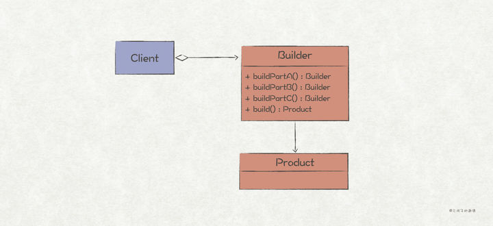

#GO 设计模式

## 00简单工厂模式

go 语言没有构造函数一说，所以一般会定义NewXXX函数来初始化相关类。

NewXXX 函数返回接口时就是简单工厂模式，也就是说Golang的一般推荐做法就是简单工厂。

在这个simplefactory包中只有API 接口和NewAPI函数为包外可见，封装了实现细节。

```go
//API is interface
type API interface {
	Say(name string) string
}
//NewAPI return Api instance by type
func NewAPI(t int) API {
	if t == 1 {
		return &hiAPI{}
	} else if t == 2 {
		return &helloAPI{}
	}
	return nil
}

//hiAPI is one of API implement
type hiAPI struct{}
//Say hi to name
func (*hiAPI) Say(name string) string {
	return fmt.Sprintf("Hi, %s", name)
}

//HelloAPI is another API implement
type helloAPI struct{}
//Say hello to name
func (*helloAPI) Say(name string) string {
	return fmt.Sprintf("Hello, %s", name)
}
```

## 01外观模式

API 为facade 模块的外观接口，大部分代码使用此接口简化对facade类的访问。

facade模块同时暴露了a和b 两个Module 的NewXXX和interface，其它代码如果需要使用细节功能时可以直接调用。

```go
func NewAPI() API {
	return &apiImpl{
		a: NewAModuleAPI(),
		b: NewBModuleAPI(),
	}
}

//API is facade interface of facade package
type API interface {
	Test() string
}

//facade implement
type apiImpl struct {
	a AModuleAPI
	b BModuleAPI
}
func (a *apiImpl) Test() string {
	aRet := a.a.TestA()
	bRet := a.b.TestB()
	return fmt.Sprintf("%s\n%s", aRet, bRet)
}

//NewAModuleAPI return new AModuleAPI
func NewAModuleAPI() AModuleAPI {
	return &aModuleImpl{}
}

//AModuleAPI ...
type AModuleAPI interface {
	TestA() string
}

type aModuleImpl struct{}
func (*aModuleImpl) TestA() string {
	return "A module running"
}

//NewBModuleAPI return new BModuleAPI
func NewBModuleAPI() BModuleAPI {
	return &bModuleImpl{}
}

//BModuleAPI ...
type BModuleAPI interface {
	TestB() string
}

type bModuleImpl struct{}
func (*bModuleImpl) TestB() string {
	return "B module running"
}
```

## 02适配器模式

适配器模式用于转换一种接口适配另一种接口。

实际使用中Adaptee一般为接口，并且使用工厂函数生成实例。

在Adapter中匿名组合Adaptee接口，所以Adapter类也拥有SpecificRequest实例方法，又因为Go语言中非入侵式接口特征，其实Adapter也适配Adaptee接口。

```go
//Target 是适配的目标接口
type Target interface {
	Request() string
}

//Adaptee 是被适配的目标接口
type Adaptee interface {
	SpecificRequest() string
}
//NewAdaptee 是被适配接口的工厂函数
func NewAdaptee() Adaptee {
	return &adapteeImpl{}
}

//AdapteeImpl 是被适配的目标类
type adapteeImpl struct{}
//SpecificRequest 是目标类的一个方法
func (*adapteeImpl) SpecificRequest() string {
	return "adaptee method"
}

//NewAdapter 是Adapter的工厂函数
func NewAdapter(adaptee Adaptee) Target {
	return &adapter{
		Adaptee: adaptee,
	}
}

//Adapter 是转换Adaptee为Target接口的适配器
type adapter struct {
	Adaptee
}
//Request 实现Target接口
func (a *adapter) Request() string {
	return a.SpecificRequest()
}
```

## 03单例模式

使用懒惰模式的单例模式，使用双重检查加锁保证线程安全

```go
import "sync"

// Singleton 是单例模式接口，导出的
// 通过该接口可以避免 GetInstance 返回一个包私有类型的指针
type Singleton interface {
	foo()
}

// singleton 是单例模式类，包私有的
type singleton struct{}
func (s singleton) foo() {}

var (
	instance *singleton
	once     sync.Once
)
//GetInstance 用于获取单例模式对象
func GetInstance() Singleton {
	once.Do(func() {
		instance = &singleton{}
	})
	return instance
}
```

## 04工厂方法模式

工厂方法模式使用子类的方式延迟生成对象到子类中实现，Go中不存在继承 所以使用匿名组合来实现。

### 简述

工厂方法模式跟上一节讨论的建造者模式类似，都是**将对象创建的逻辑封装起来，为使用者提供一个简单易用的对象创建接口**。两者在应用场景上稍有区别，建造者模式更常用于需要传递多个参数来进行实例化的场景。

使用工厂方法来创建对象主要有两个好处：

1、**代码可读性更好**。相比于使用C++/Java中的构造函数，或者Go中的{}来创建对象，工厂方法因为可以通过函数名来表达代码含义，从而具备更好的可读性。比如，使用工厂方法productA := CreateProductA()创建一个ProductA对象，比直接使用productA := ProductA{}的可读性要好。

2、**与使用者代码解耦**。很多情况下，对象的创建往往是一个容易变化的点，通过工厂方法来封装对象的创建过程，可以在创建逻辑变更时，避免**霰弹式修改**。

工厂方法模式也有两种实现方式：（1）提供一个工厂对象，通过调用工厂对象的工厂方法来创建产品对象；（2）将工厂方法集成到产品对象中（C++/Java中对象的static方法，Go中同一package下的函数）

```go
//Operator 是被封装的实际类接口
type Operator interface {
	SetA(int)
	SetB(int)
	Result() int
}

//OperatorFactory 是工厂接口
type OperatorFactory interface {
	Create() Operator
}

//OperatorBase 是Operator 接口实现的基类，封装公用方法
type OperatorBase struct {
	a, b int
}
//SetA 设置 A
func (o *OperatorBase) SetA(a int) {
	o.a = a
}
//SetB 设置 B
func (o *OperatorBase) SetB(b int) {
	o.b = b
}

//PlusOperatorFactory 是 PlusOperator 的工厂类
type PlusOperatorFactory struct{}
func (PlusOperatorFactory) Create() Operator {
	return &PlusOperator{
		OperatorBase: &OperatorBase{},
	}
}

//PlusOperator Operator 的实际加法实现
type PlusOperator struct {
	*OperatorBase
}

//Result 获取结果
func (o PlusOperator) Result() int {
	return o.a + o.b
}

//MinusOperatorFactory 是 MinusOperator 的工厂类
type MinusOperatorFactory struct{}
func (MinusOperatorFactory) Create() Operator {
	return &MinusOperator{
		OperatorBase: &OperatorBase{},
	}
}

//MinusOperator Operator 的实际减法实现
type MinusOperator struct {
	*OperatorBase
}
//Result 获取结果
func (o MinusOperator) Result() int {
	return o.a - o.b
}
```

## 05抽象工厂模式

抽象工厂模式用于生成产品族的工厂，所生成的对象是有关联的。

如果抽象工厂退化成生成的对象无关联则成为工厂函数模式。

比如本例子中使用RDB和XML存储订单信息，抽象工厂分别能生成相关的主订单信息和订单详情信息。

如果业务逻辑中需要替换使用的时候只需要改动工厂函数相关的类就能替换使用不同的存储方式了。

```go
//OrderMainDAO 为订单主记录
type OrderMainDAO interface {
	SaveOrderMain()
}

//OrderDetailDAO 为订单详情纪录
type OrderDetailDAO interface {
	SaveOrderDetail()
}

//DAOFactory DAO 抽象模式工厂接口
type DAOFactory interface {
	CreateOrderMainDAO() OrderMainDAO
	CreateOrderDetailDAO() OrderDetailDAO
}

//RDBMainDAP 为关系型数据库的OrderMainDAO实现
type RDBMainDAO struct{}
//SaveOrderMain ...
func (*RDBMainDAO) SaveOrderMain() {
	fmt.Print("rdb main save\n")
}

//RDBDetailDAO 为关系型数据库的OrderDetailDAO实现
type RDBDetailDAO struct{}
// SaveOrderDetail ...
func (*RDBDetailDAO) SaveOrderDetail() {
	fmt.Print("rdb detail save\n")
}

//RDBDAOFactory 是RDB 抽象工厂实现
type RDBDAOFactory struct{}
func (*RDBDAOFactory) CreateOrderMainDAO() OrderMainDAO {
	return &RDBMainDAO{}
}
func (*RDBDAOFactory) CreateOrderDetailDAO() OrderDetailDAO {
	return &RDBDetailDAO{}
}

//XMLMainDAO XML存储
type XMLMainDAO struct{}
//SaveOrderMain ...
func (*XMLMainDAO) SaveOrderMain() {
	fmt.Print("xml main save\n")
}

//XMLDetailDAO XML存储
type XMLDetailDAO struct{}
// SaveOrderDetail ...
func (*XMLDetailDAO) SaveOrderDetail() {
	fmt.Print("xml detail save")
}

//XMLDAOFactory 是RDB 抽象工厂实现
type XMLDAOFactory struct{}
func (*XMLDAOFactory) CreateOrderMainDAO() OrderMainDAO {
	return &XMLMainDAO{}
}

func (*XMLDAOFactory) CreateOrderDetailDAO() OrderDetailDAO {
	return &XMLDetailDAO{}
}

```

## 06建造者模式（Bulider模式）

### 简介

在软件开发过程中有时需要创建一个复杂的对象，这个复杂对象通常由多个子部件按一定的步骤组合而成。例如，计算机是由 CPU、主板、内存、硬盘、显卡、机箱、显示器、键盘、鼠标等部件组装而成的，采购员不可能自己去组装计算机，而是将计算机的配置要求告诉计算机销售公司，计算机销售公司安排技术人员去组装计算机，然后再交给要买计算机的采购员。

生活中这样的例子很多，如游戏中的不同角色，其性别、个性、能力、脸型、体型、服装、发型等特性都有所差异；还有汽车中的方向盘、发动机、车架、轮胎等部件也多种多样；每封电子邮件的发件人、收件人、主题、内容、附件等内容也各不相同。

以上所有这些产品都是由多个部件构成的，各个部件可以灵活选择，但其创建步骤都大同小异。这类产品的创建无法用前面介绍的工厂模式描述，只有建造者模式可以很好地描述该类产品的创建。



在程序设计中，我们会经常遇到一些复杂的对象，其中有很多成员属性，甚至嵌套着多个复杂的对象。这种情况下，创建这个复杂对象就会变得很繁琐。对于C++/Java而言，最常见的表现就是构造函数有着长长的参数列表：

```java
 MyObject obj = new MyObject(param1, param2, param3, param4, param5, param6, ...)
```

而对于Go语言来说，最常见的表现就是多层的嵌套实例化：

```go
 obj := &MyObject{
   Field1: &Field1 {
     Param1: &Param1 {
       Val: 0,
    },
     Param2: &Param2 {
       Val: 1,
    },
     ...
  },
   Field2: &Field2 {
     Param3: &Param3 {
       Val: 2,
    },
     ...
  },
   ...
 }
```

上述的对象创建方法有两个明显的缺点：（1）**对对象使用者不友好**，使用者在创建对象时需要知道的细节太多；（2）**代码可读性很差**。

*针对这种对象成员较多，创建对象逻辑较为繁琐的场景，就适合使用建造者模式来进行优化。*

建造者模式的作用有如下几个：

1、封装复杂对象的创建过程，使对象使用者不感知复杂的创建逻辑。

2、可以一步步按照顺序对成员进行赋值，或者创建嵌套对象，并最终完成目标对象的创建。

3、对多个对象复用同样的对象创建逻辑。

其中，第1和第2点比较常用，下面对建造者模式的实现也主要是针对这两点进行示例。

### Go实现

考虑如下的一个Message结构体，其主要有Header和Body组成：

```go
 package msg
 ...
 type Message struct {
 Header *Header
 Body   *Body
 }
 type Header struct {
 SrcAddr  string
 SrcPort  uint64
 DestAddr string
 DestPort uint64
 Items    map[string]string
 }
 type Body struct {
 Items []string
 }
 ...
```

如果按照直接的对象创建方式，创建逻辑应该是这样的：

```go
 // 多层的嵌套实例化
 message := msg.Message{
 Header: &msg.Header{
 SrcAddr:  "192.168.0.1",
 SrcPort:  1234,
 DestAddr: "192.168.0.2",
 DestPort: 8080,
 Items:    make(map[string]string),
 },
 Body:   &msg.Body{
 Items: make([]string, 0),
 },
 }
 // 需要知道对象的实现细节
 message.Header.Items["contents"] = "application/json"
 message.Body.Items = append(message.Body.Items, "record1")
 message.Body.Items = append(message.Body.Items, "record2")
```

虽然Message结构体嵌套的层次不多，但是从其创建的代码来看，确实存在**对对象使用者不友好**和**代码可读性差**的缺点。下面我们引入建造者模式对代码进行重构：

```go
package msg
 ...
 // Message对象的Builder对象
 type builder struct {
 once *sync.Once
 msg *Message
 }
 // 返回Builder对象
 func Builder() *builder {
 return &builder{
 once: &sync.Once{},
 msg: &Message{Header: &Header{}, Body: &Body{}},
 }
 }
 // 以下是对Message成员对构建方法
 func (b *builder) WithSrcAddr(srcAddr string) *builder {
 b.msg.Header.SrcAddr = srcAddr
 return b
 }
 func (b *builder) WithSrcPort(srcPort uint64) *builder {
 b.msg.Header.SrcPort = srcPort
 return b
 }
 func (b *builder) WithDestAddr(destAddr string) *builder {
 b.msg.Header.DestAddr = destAddr
 return b
 }
 func (b *builder) WithDestPort(destPort uint64) *builder {
 b.msg.Header.DestPort = destPort
 return b
 }
 func (b *builder) WithHeaderItem(key, value string) *builder {
   // 保证map只初始化一次
 b.once.Do(func() {
 b.msg.Header.Items = make(map[string]string)
 })
 b.msg.Header.Items[key] = value
 return b
 }
 func (b *builder) WithBodyItem(record string) *builder {
 b.msg.Body.Items = append(b.msg.Body.Items, record)
 return b
 }
 // 创建Message对象，在最后一步调用
 func (b *builder) Build() *Message {
 return b.msg
 }
```

测试代码如下：

```go
 package test
 ...
 func TestMessageBuilder(t *testing.T) {
   // 使用消息建造者进行对象创建
 message := msg.Builder().
 WithSrcAddr("192.168.0.1").
 WithSrcPort(1234).
 WithDestAddr("192.168.0.2").
 WithDestPort(8080).
 WithHeaderItem("contents", "application/json").
 WithBodyItem("record1").
 WithBodyItem("record2").
 Build()
 if message.Header.SrcAddr != "192.168.0.1" {
 t.Errorf("expect src address 192.168.0.1, but actual %s.", message.Header.SrcAddr)
 }
 if message.Body.Items[0] != "record1" {
 t.Errorf("expect body item0 record1, but actual %s.", message.Body.Items[0])
 }
 }
 // 运行结果
 === RUN   TestMessageBuilder
 --- PASS: TestMessageBuilder (0.00s)
 PASS
```

从测试代码可知，使用建造者模式来进行对象创建，使用者不再需要知道对象具体的实现细节，代码可读性也更好。

### 模式的定义与特点

建造者（Builder）模式的定义：指将一个复杂对象的构造与它的表示分离，使同样的构建过程可以创建不同的表示，这样的[设计模式](http://c.biancheng.net/design_pattern/)被称为建造者模式。它是将一个复杂的对象分解为多个简单的对象，然后一步一步构建而成。它将变与不变相分离，即产品的组成部分是不变的，但每一部分是可以灵活选择的。

该模式的主要优点如下：

1. 封装性好，构建和表示分离。
2. 扩展性好，各个具体的建造者相互独立，有利于系统的解耦。
3. 客户端不必知道产品内部组成的细节，建造者可以对创建过程逐步细化，而不对其它模块产生任何影响，便于控制细节风险。

其缺点如下：

1. 产品的组成部分必须相同，这限制了其使用范围。
2. 如果产品的内部变化复杂，如果产品内部发生变化，则建造者也要同步修改，后期维护成本较大。

建造者（Builder）模式和工厂模式的关注点不同：建造者模式注重零部件的组装过程，而[工厂方法模式](http://c.biancheng.net/view/1348.html)更注重零部件的创建过程，但两者可以结合使用。

### 模式的结构与实现

建造者（Builder）模式由产品、抽象建造者、具体建造者、指挥者等 4 个要素构成，现在我们来分析其基本结构和实现方法。

### 模式的应用场景

建造者模式唯一区别于工厂模式的是针对复杂对象的创建。也就是说，如果创建简单对象，通常都是使用工厂模式进行创建，而如果创建复杂对象，就可以考虑使用建造者模式。

当需要创建的产品具备复杂创建过程时，可以抽取出共性创建过程，然后交由具体实现类自定义创建流程，使得同样的创建行为可以生产出不同的产品，分离了创建与表示，使创建产品的灵活性大大增加。

建造者模式主要适用于以下应用场景：

- 相同的方法，不同的执行顺序，产生不同的结果。
- 多个部件或零件，都可以装配到一个对象中，但是产生的结果又不相同。
- 产品类非常复杂，或者产品类中不同的调用顺序产生不同的作用。
- 初始化一个对象特别复杂，参数多，而且很多参数都具有默认值。

### 建造者模式和工厂模式的区别

通过前面的学习，我们已经了解了建造者模式，那么它和工厂模式有什么区别呢？

- 建造者模式更加注重方法的调用顺序，工厂模式注重创建对象。
- 创建对象的力度不同，建造者模式创建复杂的对象，由各种复杂的部件组成，工厂模式创建出来的对象都一样
- 关注重点不一样，工厂模式只需要把对象创建出来就可以了，而建造者模式不仅要创建出对象，还要知道对象由哪些部件组成。
- 建造者模式根据建造过程中的顺序不一样，最终对象部件组成也不一样。

### 模式的扩展

建造者（Builder）模式在应用过程中可以根据需要改变，如果创建的产品种类只有一种，只需要一个具体建造者，这时可以省略掉抽象建造者，甚至可以省略掉指挥者角色。

## 07原型模式

原型模式使对象能复制自身，并且暴露到接口中，使客户端面向接口编程时，不知道接口实际对象的情况下生成新的对象。

原型模式配合原型管理器使用，使得客户端在不知道具体类的情况下，通过接口管理器得到新的实例，并且包含部分预设定配置。

```go
//Cloneable 是原型对象需要实现的接口
type Cloneable interface {
	Clone() Cloneable
}

type PrototypeManager struct {
	prototypes map[string]Cloneable
}
func NewPrototypeManager() *PrototypeManager {
	return &PrototypeManager{
		prototypes: make(map[string]Cloneable),
	}
}
func (p *PrototypeManager) Get(name string) Cloneable {
	return p.prototypes[name].Clone()
}
func (p *PrototypeManager) Set(name string, prototype Cloneable) {
	p.prototypes[name] = prototype
}
```

