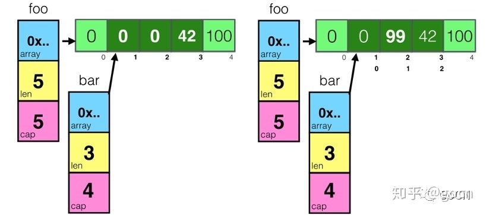
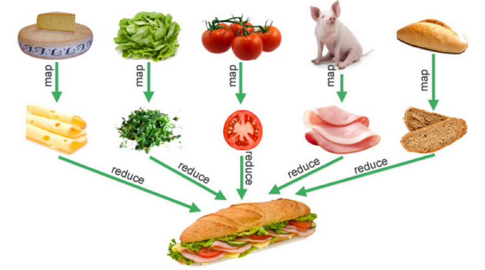
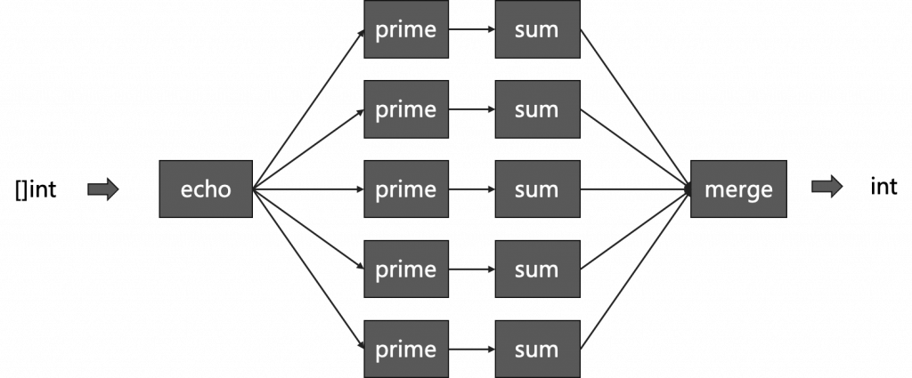

# GO编程模式系列

在本篇文章中，我会对Go语言编程模式的一些基本技术和要点，这样可以让你更容易掌握Go语言编程。

**Go编程模式全系列一共10篇：**

- [Go编程模式：切片，接口，时间和性能](https://coolshell.cn/articles/21128.html)
- [Go 编程模式：错误处理](https://coolshell.cn/articles/21140.html)
- [Go 编程模式：Functional Options](https://coolshell.cn/articles/21146.html)
- [Go编程模式：委托和反转控制](https://coolshell.cn/articles/21214.html)
- [Go编程模式：Map-Reduce](https://coolshell.cn/articles/21164.html)
- [Go 编程模式：Go Generation](https://coolshell.cn/articles/21179.html)
- [Go编程模式：修饰器](https://coolshell.cn/articles/17929.html)
- [Go编程模式：Pipeline](https://coolshell.cn/articles/21228.html)
- [Go 编程模式：k8s Visitor 模式](https://coolshell.cn/articles/21263.html)
- [Go编程模式 ： 泛型编程](https://coolshell.cn/articles/21615.html)

## 1/10 切片，接口，时间和性能

在本篇文章中，我会对Go语言编程模式的一些基本技术和要点，这样可以让你更容易掌握Go语言编程。其中，主要包括，数组切片的一些小坑，还有接口编程，以及时间和程序运行性能相关的话题。

### **Slice**

首先，我们先来讨论一下Slice，中文翻译叫“切片”，这个东西在Go语言中不是数组，而是一个结构体，其定义如下：

```go
type slice struct{
   array unsafe.Pointer //指向存放数据的数组指针
   len   int           //长度有多大
   cap   int           //容量有多大
}
```

用图示来看，一个空的slice的表现如下：


熟悉C/C++的同学一定会知道，在结构体里用数组指针的问题——数据会发生共享！下面我们来看一下slice的一些操作：

```go
foo = make([]int, 5)
foo[3] = 42
foo[4] = 100
bar  := foo[1:4]
bar[1] = 99
```

对于上面这段代码。

- 首先先创建一个foo的slice，其中的长度和容量都是5
- 然后开始对foo所指向的数组中的索引为3和4的元素进行赋值
- 然后，对foo做切片后赋值给bar，再修改bar[1]



通过上图我们可以看到，因为foo和bar的内存是共享的，所以，foo和bar的对数组内容的修改都会影响到对方。

接下来，我们再来看一个数据操作 `append()` 的示例：

```go
a := make([]int, 32)
b := a[1:16]
a = append(a, 1)
a[2] = 42
```

上面这段代码中，把 `a[1:16]` 的切片赋给到了 `b` ，此时，`a` 和 `b` 的内存空间是共享的，然后，对 `a`做了一个 `append()`的操作，这个操作会让 `a` 重新分享内存，导致 `a` 和 `b` 不再共享，如下图所示：


从上图我们可以看以看到 `append()`操作让 `a` 的容量变成了64，而长度是33。这里，需要重点注意一下——**`append()`这个函数在 `cap` 不够用的时候就会重新分配内存以扩大容量，而如果够用的时候不不会重新分享内存！**

我们再看来看一个例子：

```go
funcmain(){  
   path := []byte("AAAA/BBBBBBBBB")
   sepIndex := bytes.IndexByte(path,'/’)

   dir1 := path[:sepIndex]
   dir2 := path[sepIndex+1:]

   fmt.Println("dir1 =>",string(dir1)) //prints: dir1 => AAAA
   fmt.Println("dir2 =>",string(dir2)) //prints: dir2 => BBBBBBBBB
   dir1 = append(dir1,"suffix"...)

   fmt.Println("dir1 =>",string(dir1)) //prints: dir1 => AAAAsuffix
   fmt.Println("dir2 =>",string(dir2)) //prints: dir2 => uffixBBBB
}
```

上面这个例子中，`dir1` 和 `dir2` 共享内存，虽然 `dir1` 有一个 `append()` 操作，但是因为 cap 足够，于是数据扩展到了`dir2` 的空间。下面是相关的图示（注意上图中 `dir1` 和 `dir2` 结构体中的 `cap` 和 `len` 的变化）


如果要解决这个问题，我们只需要修改一行代码。

```go
dir1 := path[:sepIndex]
```

修改为

```go
dir1 := path[:sepIndex:sepIndex]
```

新的代码使用了 Full Slice Expression，其最后一个参数叫“Limited Capacity”，于是，后续的 `append()` 操作将会导致重新分配内存。

### **深度比较**

当我们复杂一个对象时，这个对象可以是内建数据类型，数组，结构体，map……我们在复制结构体的时候，当我们需要比较两个结构体中的数据是否相同时，我们需要使用深度比较，而不是只是简单地做浅度比较。这里需要使用到反射 `reflect.DeepEqual()` ，下面是几个示例。

```go
import(  
   "fmt"
   "reflect"
)

funcmain(){  

   v1 := data{}
   v2 := data{}
   fmt.Println("v1 == v2:",reflect.DeepEqual(v1,v2))
  //prints: v1 == v2: true
   m1 := map[string]string{"one": "a","two": "b"}
   m2 := map[string]string{"two": "b", "one": "a"}
   fmt.Println("m1 == m2:",reflect.DeepEqual(m1, m2))
  //prints: m1 == m2: true
   s1 := []int{1, 2, 3}
   s2 := []int{1, 2, 3}
   fmt.Println("s1 == s2:",reflect.DeepEqual(s1, s2))
  //prints: s1 == s2: true
}
```

### **接口编程**

下面，我们来看段代码，其中是两个方法，它们都是要输出一个结构体，其中一个使用一个函数，另一个使用一个“成员函数”。

```go
funcPrintPerson(p *Person){
   fmt.Printf("Name=%s, Sexual=%s, Age=%d\n",
 p.Name, p.Sexual, p.Age)
}

func(p *Person)Print(){
   fmt.Printf("Name=%s, Sexual=%s, Age=%d\n",
 p.Name, p.Sexual, p.Age)
}

funcmain(){
   var p = Person{
       Name: "Hao Chen",
       Sexual: "Male",
       Age: 44,
   }
   PrintPerson(&p)
   p.Print()
}
```

你更喜欢哪种方式呢？在 Go 语言中，使用“成员函数”的方式叫“Receiver”，这种方式是一种封装，因为 `PrintPerson()`本来就是和 `Person`强耦合的，所以，理应放在一起。更重要的是，这种方式可以进行接口编程，对于接口编程来说，也就是一种抽象，主要是用在“多态”，这个技术，在《Go语言简介（上）：接口与多态》中已经讲过。在这里，我想讲另一个Go语言接口的编程模式。

首先，我们来看一下，有下面这段代码：

```go
type Country struct{
   Name string
}

type City struct{
   Name string
}

type Printable interface{
   PrintStr()
}
func(c Country)PrintStr(){
   fmt.Println(c.Name)
}
func(c City)PrintStr(){
   fmt.Println(c.Name)
}

c1 := Country {"China"}
c2 := City {"Beijing"}
c1.PrintStr()
c2.PrintStr()
```

其中，我们可以看到，其使用了一个 `Printable` 的接口，而 `Country` 和 `City` 都实现了接口方法 `PrintStr()` 而把自己输出。然而，这些代码都是一样的。能不能省掉呢？
我们可以使用“结构体嵌入”的方式来完成这个事，如下的代码所示：

```go
type WithName struct{
   Name string
}

type Country struct{
   WithName
}

type City struct{
   WithName
}

type Printable interface{
   PrintStr()
}

func(w WithName)PrintStr(){
   fmt.Println(w.Name)
}

c1 := Country {WithName{"China"}}
c2 := City { WithName{"Beijing"}}
c1.PrintStr()
c2.PrintStr()
```

引入一个叫 `WithName`的结构体，然而，所带来的问题就是，在初始化的时候，变得有点乱。那么，我们有没有更好的方法？下面是另外一个解。

```go
type Country struct{
   Name string
}

type City struct{
   Name string
}

type Stringable interface{
   ToString()string
}
func(c Country)ToString()string{
   return"Country = " + c.Name
}
func(c City)ToString()string{
   return"City = " + c.Name
}

funcPrintStr(p Stringable){
   fmt.Println(p.ToString())
}

d1 := Country {"USA"}
d2 := City{"Los Angeles"}
PrintStr(d1)
PrintStr(d2)
```

上面这段代码，我们可以看到——**我们使用了一个叫`Stringable` 的接口，我们用这个接口把“业务类型” `Country` 和 `City` 和“控制逻辑” `Print()` 给解耦了。**于是，只要实现了`Stringable` 接口，都可以传给 `PrintStr()` 来使用。

这种编程模式在Go 的标准库有很多的示例，最著名的就是 `io.Read` 和 `ioutil.ReadAll` 的玩法，其中 `io.Read` 是一个接口，你需要实现他的一个 `Read(p []byte) (n int, err error)` 接口方法，只要满足这个规模，就可以被 `ioutil.ReadAll`这个方法所使用。**这就是面向对象编程方法的黄金法则——“Program to an interface not an implementation”**

### **接口完整性检查**

另外，我们可以看到，Go语言的编程器并没有严格检查一个对象是否实现了某接口所有的接口方法，如下面这个示例：

```go
type Shape interface{
   Sides()int
   Area()int
}
type Square struct{
   len int
}
func(s* Square)Sides()int{
   return4
}
funcmain(){
   s := Square{len: 5}
   fmt.Printf("%d\n",s.Sides())
}
```

我们可以看到 `Square` 并没有实现 `Shape` 接口的所有方法，程序虽然可以跑通，但是这样编程的方式并不严谨，如果我们需要强制实现接口的所有方法，那么我们应该怎么办呢？

在Go语言编程圈里有一个比较标准的作法：

```go
var _ Shape = (*Square)(nil)
```

声明一个 `_` 变量（没人用），其会把一个 `nil` 的空指针，从 `Square` 转成 `Shape`，这样，如果没有实现完相关的接口方法，编译器就会报错：

*cannot use (\*Square)(nil) (type \*Square) as type Shape in assignment: \*Square does not implement Shape (missing Area method)*

这样就做到了个强验证的方法。

**时间**

对于时间来说，这应该是编程中比较复杂的问题了，相信我，时间是一种非常复杂的事（比如《你确信你了解时间吗？》、《关于闰秒》等文章）。而且，时间有时区、格式、精度等等问题，其复杂度不是一般人能处理的。所以，一定要重用已有的时间处理，而不是自己干。

在 Go 语言中，你一定要使用 `time.Time` 和 `time.Duration` 两个类型：

- 在命令行上，`flag` 通过 `time.ParseDuration` 支持了 `time.Duration`
- JSon 中的 `encoding/json` 中也可以把`time.Time` 编码成 RFC 3339 的格式
- 数据库使用的 `database/sql` 也支持把 `DATATIME` 或 `TIMESTAMP` 类型转成 `time.Time`
- YAML你可以使用 `gopkg.in/yaml.v2` 也支持 `time.Time` 、`time.Duration` 和 RFC 3339 格式

如果你要和第三方交互，实在没有办法，也请使用 RFC 3339 的格式。

最后，如果你要做全球化跨时区的应用，你一定要把所有服务器和时间全部使用UTC时间。

### **性能提示**

Go 语言是一个高性能的语言，但并不是说这样我们就不用关心性能了，我们还是需要关心的。下面是一个在编程方面和性能相关的提示。

- 如果需要把数字转字符串，使用 `strconv.Itoa()` 会比 `fmt.Sprintf()` 要快一倍左右
- 尽可能地避免把`String`转成`[]Byte` 。这个转换会导致性能下降。
- 如果在for-loop里对某个slice 使用 `append()`请先把 slice的容量很扩充到位，这样可以避免内存重新分享以及系统自动按2的N次方幂进行扩展但又用不到，从而浪费内存。
- 使用`StringBuffer` 或是`StringBuild` 来拼接字符串，会比使用 `+` 或 `+=` 性能高三到四个数量级。
- 尽可能的使用并发的 go routine，然后使用 `sync.WaitGroup` 来同步分片操作
- 避免在热代码中进行内存分配，这样会导致gc很忙。尽可能的使用 `sync.Pool` 来重用对象。
- 使用 lock-free的操作，避免使用 mutex，尽可能使用 `sync/Atomic`包。（关于无锁编程的相关话题，可参看《无锁队列实现》或《无锁Hashmap实现》）
- 使用 I/O缓冲，I/O是个非常非常慢的操作，使用 `bufio.NewWrite()` 和 `bufio.NewReader()` 可以带来更高的性能。
- 对于在for-loop里的固定的正则表达式，一定要使用 `regexp.Compile()` 编译正则表达式。性能会得升两个数量级。
- 如果你需要更高性能的协议，你要考虑使用 protobuf 或 msgp 而不是JSON，因为JSON的序列化和反序列化里使用了反射。
- 你在使用map的时候，使用整型的key会比字符串的要快，因为整型比较比字符串比较要快。

### **参考文档**

还有很多不错的技巧，下面的这些参考文档可以让你写出更好的Go的代码，必读！

- **Effective****Go**
  [https://golang.org/doc/effective_go.html](https://link.zhihu.com/?target=https%3A//golang.org/doc/effective_go.html)
- **Uber****Go****Style**
  [https://github.com/uber-go/guide/blob/master/style.md](https://link.zhihu.com/?target=https%3A//github.com/uber-go/guide/blob/master/style.md)
- **50 Shades of Go: Traps, Gotchas, and Common Mistakes for New Golang Devs**
  [http://devs.cloudimmunity.com/gotchas-and-common-mistakes-in-go-golang/](https://link.zhihu.com/?target=http%3A//devs.cloudimmunity.com/gotchas-and-common-mistakes-in-go-golang/)
- **Go****Advice**
  [https://github.com/cristaloleg/go-advice](https://link.zhihu.com/?target=https%3A//github.com/cristaloleg/go-advice)
- **Practical Go Benchmarks**
  [https://www.instana.com/blog/practical-golang-benchmarks/](https://link.zhihu.com/?target=https%3A//www.instana.com/blog/practical-golang-benchmarks/)
- **Benchmarks of Go serialization methods**
  [https://github.com/alecthomas/go_serialization_benchmarks](https://link.zhihu.com/?target=https%3A//github.com/alecthomas/go_serialization_benchmarks)
- **Debugging****performance****issues****in****Go****programs**
  [https://github.com/golang/go/wiki/Performance](https://link.zhihu.com/?target=https%3A//github.com/golang/go/wiki/Performance)
- **Go****code****refactoring:****the****23x****performance****hunt**
  [https://medium.com/@val_delepla](https://link.zhihu.com/?target=https%3A//medium.com/%40val_deleplace/go-code-refactoring-the-23x-performance-hunt-156746b522f7)

## 2/10 错误处理

错误处理一直以一是编程必需要面对的问题，错误处理如果做的好的话，代码的稳定性会很好。不同的语言有不同的出现处理的方式。Go语言也一样，在本篇文章中，我们来讨论一下Go语言的出错出处，尤其是那令人抓狂的 `if err != nil` 。

在正式讨论Go代码里满屏的 `if err != nil` 怎么办这个事之前，我想先说一说编程中的错误处理。这样可以让大家在更高的层面理解编程中的错误处理。

### C语言的错误检查

首先，我们知道，处理错误最直接的方式是通过错误码，这也是传统的方式，在过程式语言中通常都是用这样的方式处理错误的。比如 C 语言，基本上来说，其通过函数的返回值标识是否有错，然后通过全局的 `errno` 变量并配合一个 `errstr` 的数组来告诉你为什么出错。

为什么是这样的设计？道理很简单，除了可以共用一些错误，更重要的是这其实是一种妥协。比如：`read()`, `write()`, `open()` 这些函数的返回值其实是返回有业务逻辑的值。也就是说，这些函数的返回值有两种语义，一种是成功的值，比如 `open()` 返回的文件句柄指针 `FILE*` ，或是错误 `NULL`。这样会导致调用者并不知道是什么原因出错了，需要去检查 `errno` 来获得出错的原因，从而可以正确地处理错误。

一般而言，这样的错误处理方式在大多数情况下是没什么问题的。但是也有例外的情况，我们来看一下下面这个 C 语言的函数：

```c
int atoi(const char *str)
```

这个函数是把一个字符串转成整型。但是问题来了，如果一个要传的字符串是非法的（不是数字的格式），如 “ABC” 或者整型溢出了，那么这个函数应该返回什么呢？出错返回，返回什么数都不合理，因为这会和正常的结果混淆在一起。比如，返回 `0`，那么会和正常的对 “0” 字符的返回值完全混淆在一起。这样就无法判断出错的情况。你可能会说，是不是要检查一下 `errno`，按道理说应该是要去检查的，但是，我们在 C99 的规格说明书中可以看到这样的描述——

> 7.20.1The functions atof, atoi, atol, and atoll need not affect the value of the integer expression errno on an error. If the value of the result cannot be represented, the behavior is undefined.

像`atoi()`, `atof()`, `atol()` 或是 `atoll()` 这样的函数是不会设置 `errno`的，而且，还说了，如果结果无法计算的话，行为是undefined。所以，后来，libc 又给出了一个新的函数`strtol()`，这个函数在出错的时会设置全局变量 `errno` ：

```go
long val = strtol(in_str, &endptr, 10);  //10的意思是10进制
//如果无法转换
if (endptr == str) {
    fprintf(stderr, "No digits were found\n");
    exit(EXIT_FAILURE);
}
//如果整型溢出了
if ((errno == ERANGE && (val == LONG_MAX || val == LONG_MIN)) {
    fprintf(stderr, "ERROR: number out of range for LONG\n");
    exit(EXIT_FAILURE);
 }
//如果是其它错误
if (errno != 0 && val == 0) {
    perror("strtol");
    exit(EXIT_FAILURE);
}
```

虽然，`strtol()` 函数解决了 `atoi()` 函数的问题，但是我们还是能感觉到不是很舒服和自然。

因为，这种用 返回值 + errno 的错误检查方式会有一些问题:

- 程序员一不小心就会忘记返回值的检查，从而造成代码的 Bug；
- 函数接口非常不纯洁，正常值和错误值混淆在一起，导致语义有问题。

所以，后来，有一些类库就开始区分这样的事情。比如，Windows 的系统调用开始使用 `HRESULT` 的返回来统一错误的返回值，这样可以明确函数调用时的返回值是成功还是错误。但这样一来，函数的 input 和 output 只能通过函数的参数来完成，于是出现了所谓的 入参 和 出参 这样的区别。

然而，这又使得函数接入中参数的语义变得复杂，一些参数是入参，一些参数是出参，函数接口变得复杂了一些。而且，依然没有解决函数的成功或失败可以被人为忽略的问题。

### Java的错误处理

Java语言使用 `try-catch-finally` 通过使用异常的方式来处理错误，其实，这比起C语言的错处理进了一大步，使用抛异常和抓异常的方式可以让我们的代码有这样的一些好处：

- 函数接口在 input（参数）和 output（返回值）以及错误处理的语义是比较清楚的。
- 正常逻辑的代码可以与错误处理和资源清理的代码分开，提高了代码的可读性。
- 异常不能被忽略（如果要忽略也需要 catch 住，这是显式忽略）。
- 在面向对象的语言中（如 Java），异常是个对象，所以，可以实现多态式的 catch。
- 与状态返回码相比，异常捕捉有一个显著的好处是，函数可以嵌套调用，或是链式调用。比如：
  - `int x = add(a, div(b,c));`
  - `Pizza p = PizzaBuilder().SetSize(sz).SetPrice(p)...;`

### Go语言的错误处理

Go 语言的函数支持多返回值，所以，可以在返回接口把业务语义（业务返回值）和控制语义（出错返回值）区分开来。Go 语言的很多函数都会返回 result, err 两个值，于是:

- 参数上基本上就是入参，而返回接口把结果和错误分离，这样使得函数的接口语义清晰；
- 而且，Go 语言中的错误参数如果要忽略，需要显式地忽略，用 _ 这样的变量来忽略；
- 另外，因为返回的 `error` 是个接口（其中只有一个方法 `Error()`，返回一个 `string` ），所以你可以扩展自定义的错误处理。

另外，如果一个函数返回了多个不同类型的 `error`，你也可以使用下面这样的方式：

```go
if err != nil {
  switch err.(type) {
    case *json.SyntaxError:
      ...
    case *ZeroDivisionError:
      ...
    case *NullPointerError:
      ...
    default:
      ...
  }
}
```

我们可以看到，Go语言的错误处理的的方式，本质上是返回值检查，但是他也兼顾了异常的一些好处 – 对错误的扩展。

### 资源清理

出错后是需要做资源清理的，不同的编程语言有不同的资源清理的编程模式：

- C语言 – 使用的是 `goto fail;` 的方式到一个集中的地方进行清理（有篇有意思的文章可以看一下《[由苹果的低级BUG想到的](https://coolshell.cn/articles/11112.html)》）
- C++语言- 一般来说使用 [RAII模式](https://en.wikipedia.org/wiki/Resource_acquisition_is_initialization)，通过面向对象的代理模式，把需要清理的资源交给一个代理类，然后在析构函数来解决。
- Java语言 – 可以在finally 语句块里进行清理。
- Go语言 – 使用 `defer` 关键词进行清理。

下面是一个Go语言的资源清理的示例：

```go
func Close(c io.Closer) {
  err := c.Close()
  if err != nil {
    log.Fatal(err)
  }
}
func main() {
  r, err := Open("a")
  if err != nil {
    log.Fatalf("error opening 'a'\n")
  }
  defer Close(r) // 使用defer关键字在函数退出时关闭文件。
  r, err = Open("b")
  if err != nil {
    log.Fatalf("error opening 'b'\n")
  }
  defer Close(r) // 使用defer关键字在函数退出时关闭文件。
}
```

### Error Check Hell

好了，说到 Go 语言的 `if err !=nil` 的代码了，这样的代码的确是能让人写到吐。那么有没有什么好的方式呢，有的。我们先看如下的一个令人崩溃的代码。

```go
func parse(r io.Reader) (*Point, error) {
    var p Point
    if err := binary.Read(r, binary.BigEndian, &p.Longitude); err != nil {
        return nil, err
    }
    if err := binary.Read(r, binary.BigEndian, &p.Latitude); err != nil {
        return nil, err
    }
    if err := binary.Read(r, binary.BigEndian, &p.Distance); err != nil {
        return nil, err
    }
    if err := binary.Read(r, binary.BigEndian, &p.ElevationGain); err != nil {
        return nil, err
    }
    if err := binary.Read(r, binary.BigEndian, &p.ElevationLoss); err != nil {
        return nil, err
    }
}
```

要解决这个事，我们可以用函数式编程的方式，如下代码示例：

```go
func parse(r io.Reader) (*Point, error) {
    var p Point
    var err error
    read := func(data interface{}) {
        if err != nil {
            return
        }
        err = binary.Read(r, binary.BigEndian, data)
    }
    read(&p.Longitude)
    read(&p.Latitude)
    read(&p.Distance)
    read(&p.ElevationGain)
    read(&p.ElevationLoss)
    if err != nil {
        return &p, err
    }
    return &p, nil
}
```

上面的代码我们可以看到，我们通过使用Closure 的方式把相同的代码给抽出来重新定义一个函数，这样大量的 `if err!=nil` 处理的很干净了。但是会带来一个问题，那就是有一个 `err` 变量和一个内部的函数，感觉不是很干净。

那么，我们还能不能搞得更干净一点呢，我们从Go 语言的 `bufio.Scanner()`中似乎可以学习到一些东西：

```go
scanner := bufio.NewScanner(input)
for scanner.Scan() {
    token := scanner.Text()
    // process token
}
if err := scanner.Err(); err != nil {
    // process the error
}
```

上面的代码我们可以看到，`scanner`在操作底层的I/O的时候，那个for-loop中没有任何的 `if err !=nil` 的情况，退出循环后有一个 `scanner.Err()` 的检查。看来使用了结构体的方式。模仿它，我们可以把我们的代码重构成下面这样：

首先，定义一个结构体和一个成员函数

```go
type Reader struct {
    r   io.Reader
    err error
}
func (r *Reader) read(data interface{}) {
    if r.err == nil {
        r.err = binary.Read(r.r, binary.BigEndian, data)
    }
}
```

然后，我们的代码就可以变成下面这样：

```go
func parse(input io.Reader) (*Point, error) {
    var p Point
    r := Reader{r: input}
    r.read(&p.Longitude)
    r.read(&p.Latitude)
    r.read(&p.Distance)
    r.read(&p.ElevationGain)
    r.read(&p.ElevationLoss)
    if r.err != nil {
        return nil, r.err
    }
    return &p, nil
}
```

有了上面这个技术，我们的“[流式接口 Fluent Interface](https://martinfowler.com/bliki/FluentInterface.html)”，也就很容易处理了。如下所示：

```go
package main
import (
  "bytes"
  "encoding/binary"
  "fmt"
)
// 长度不够，少一个Weight
var b = []byte {0x48, 0x61, 0x6f, 0x20, 0x43, 0x68, 0x65, 0x6e, 0x00, 0x00, 0x2c} 
var r = bytes.NewReader(b)
type Person struct {
  Name [10]byte
  Age uint8
  Weight uint8
  err error
}
func (p *Person) read(data interface{}) {
  if p.err == nil {
    p.err = binary.Read(r, binary.BigEndian, data)
  }
}
func (p *Person) ReadName() *Person {
  p.read(&p.Name) 
  return p
}
func (p *Person) ReadAge() *Person {
  p.read(&p.Age) 
  return p
}
func (p *Person) ReadWeight() *Person {
  p.read(&p.Weight) 
  return p
}
func (p *Person) Print() *Person {
  if p.err == nil {
    fmt.Printf("Name=%s, Age=%d, Weight=%d\n",p.Name, p.Age, p.Weight)
  }
  return p
}
func main() {   
  p := Person{}
  p.ReadName().ReadAge().ReadWeight().Print()
  fmt.Println(p.err)  // EOF 错误
}
```

相信你应该看懂这个技巧了，但是，其使用场景也就只能在对于同一个业务对象的不断操作下可以简化错误处理，对于多个业务对象的话，还是得需要各种 `if err != nil`的方式。

### 包装错误

最后，多说一句，我们需要包装一下错误，而不是干巴巴地把`err`给返回到上层，我们需要把一些执行的上下文加入。

通常来说，我们会使用 `fmt.Errorf()`来完成这个事，比如：

```go
if err != nil {
   return fmt.Errorf("something failed: %v", err)
}
```

另外，在Go语言的开发者中，更为普遍的做法是将错误包装在另一个错误中，同时保留原始内容：

```go
type authorizationError struct {
    operation string
    err error   // original error
}
func (e *authorizationError) Error() string {
    return fmt.Sprintf("authorization failed during %s: %v", e.operation, e.err)
}
```

当然，更好的方式是通过一种标准的访问方法，这样，我们最好使用一个接口，比如 `causer`接口中实现 `Cause()` 方法来暴露原始错误，以供进一步检查：

```go
type causer interface {
    Cause() error
}
func (e *authorizationError) Cause() error {
    return e.err
}
```

 这里有个好消息是，这样的代码不必再写了，有一个第三方的错误库（[github.com/pkg/errors](https://github.com/pkg/errors)），对于这个库，我无论到哪都能看到他的存在，所以，这个基本上来说就是事实上的标准了。代码示例如下：

```go
import "github.com/pkg/errors"
//错误包装
if err != nil {
    return errors.Wrap(err, "read failed")
}
// Cause接口
switch err := errors.Cause(err).(type) {
case *MyError:
    // handle specifically
default:
    // unknown error
```

### 参考文章

- **Golang Error Handling lesson by Rob Pike **http://jxck.hatenablog.com/entry/golang-error-handling-lesson-by-rob-pike
- **Errors are values **https://blog.golang.org/errors-are-values

## 3/10 Functional Options

在本篇文章中，我们来讨论一下Functional Options这个编程模式。这是一个函数式编程的应用案例，编程技巧也很好，是目前在Go语言中最流行的一种编程模式。但是，在我们正式讨论这个模式之前，我们需要先来看看要解决什么样的问题。

### 配置选项问题

在我们编程中，我们会经常性的需要对一个对象（或是业务实体）进行相关的配置。比如下面这个业务实体（注意，这仅只是一个示例）：

```go
type Server struct {
    Addr     string
    Port     int
    Protocol string
    Timeout  time.Duration
    MaxConns int
    TLS      *tls.Config
}
```

在这个 `Server` 对象中，我们可以看到：

- 要有侦听的IP地址 `Addr` 和端口号 `Port` ，这两个配置选项是必填的（当然，IP地址和端口号都可以有默认值，当这里我们用于举例认为是没有默认值，而且不能为空，需要必填的）。
- 然后，还有协议 `Protocol` 、 `Timeout` 和`MaxConns` 字段，这几个字段是不能为空的，但是有默认值的，比如：协议是`tcp`, 超时`30`秒 和 最大链接数`1024`个。
- 还有一个 `TLS` 这个是安全链接，需要配置相关的证书和私钥。这个是可以为空的。

所以，针对于上述这样的配置，我们需要有多种不同的创建不同配置 `Server` 的函数签名，如下所示（代码比较宽，需要左右滚动浏览）：

```go
func NewDefaultServer(addr string, port int) (*Server, error) {
  return &Server{addr, port, "tcp", 30 * time.Second, 100, nil}, nil
}
func NewTLSServer(addr string, port int, tls *tls.Config) (*Server, error) {
  return &Server{addr, port, "tcp", 30 * time.Second, 100, tls}, nil
}
func NewServerWithTimeout(addr string, port int, timeout time.Duration) (*Server, error) {
  return &Server{addr, port, "tcp", timeout, 100, nil}, nil
}
func NewTLSServerWithMaxConnAndTimeout(addr string, port int, maxconns int, timeout time.Duration, tls *tls.Config) (*Server, error) {
  return &Server{addr, port, "tcp", 30 * time.Second, maxconns, tls}, nil
}
```

因为Go语言不支持重载函数，所以，你得用不同的函数名来应对不同的配置选项。

### **配置对象方案**

要解决这个问题，最常见的方式是使用一个配置对象，如下所示：

```go
type Config struct {
    Protocol string
    Timeout  time.Duration
    Maxconns int
    TLS      *tls.Config
}
```

我们把那些非必输的选项都移到一个结构体里，于是 `Server` 对象变成了：

```cpp
type Server struct {
    Addr string
    Port int
    Conf *Config
}
```

于是，我们只需要一个 `NewServer()` 的函数了，在使用前需要构造 `Config` 对象。

```go
func NewServer(addr string, port int, conf *Config) (*Server, error) {
    //...
}
//Using the default configuratrion
srv1, _ := NewServer("localhost", 9000, nil) 
conf := ServerConfig{Protocol:"tcp", Timeout: 60*time.Duration}
srv2, _ := NewServer("locahost", 9000, &conf)
```

这段代码算是不错了，大多数情况下，我们可能就止步于此了。但是，对于有洁癖的有追求的程序员来说，他们能看到其中有一点不好的是，`Config` 并不是必需的，所以，你需要判断是否是 `nil` 或是 Empty – `Config{}`这让我们的代码感觉还是有点不是很干净。

### Builder模式

如果你是一个Java程序员，熟悉设计模式的一定会很自然地使用上Builder模式。比如如下的代码：

```go
User user = new User.Builder()
  .name("Hao Chen")
  .email("haoel@hotmail.com")
  .nickname("左耳朵")
  .build();
```

仿照上面这个模式，我们可以把上面代码改写成如下的代码（注：下面的代码没有考虑出错处理，其中关于出错处理的更多内容，请参看《Go 编程模式：出错处理》）：

```go
//使用一个builder类来做包装
type ServerBuilder struct {
  Server
}
func (sb *ServerBuilder) Create(addr string, port int) *ServerBuilder {
  sb.Server.Addr = addr
  sb.Server.Port = port
  //其它代码设置其它成员的默认值
  return sb
}
func (sb *ServerBuilder) WithProtocol(protocol string) *ServerBuilder {
  sb.Server.Protocol = protocol 
  return sb
}
func (sb *ServerBuilder) WithMaxConn( maxconn int) *ServerBuilder {
  sb.Server.MaxConns = maxconn
  return sb
}
func (sb *ServerBuilder) WithTimeOut( timeout time.Duration) *ServerBuilder {
  sb.Server.Timeout = timeout
  return sb
}
func (sb *ServerBuilder) WithTLS( tls *tls.Config) *ServerBuilder {
  sb.Server.TLS = tls
  return sb
}
func (sb *ServerBuilder) Build() (Server) {
  return  sb.Server
}
```

于是就可以以如下的方式来使用了：

```go
sb := ServerBuilder{}
server, err := sb.Create("127.0.0.1", 8080).
  WithProtocol("udp").
  WithMaxConn(1024).
  WithTimeOut(30*time.Second).
  Build()
```

上面这样的方式也很清楚，不需要额外的Config类，使用链式的函数调用的方式来构造一个对象，只需要多加一个Builder类，这个Builder类似乎有点多余，我们似乎可以直接在`Server` 上进行这样的 Builder 构造，的确是这样的。但是在处理错误的时候可能就有点麻烦（需要为Server结构增加一个error 成员，破坏了Server结构体的“纯洁”），不如一个包装类更好一些。

如果我们想省掉这个包装的结构体，那么就轮到我们的Functional Options上场了，函数式编程。

### Functional Options

首先，我们先定义一个函数类型：

```go
type Option func(*Server)
```

然后，我们可以使用函数式的方式定义一组如下的函数：

```go
func Protocol(p string) Option {
    return func(s *Server) {
        s.Protocol = p
    }
}
func Timeout(timeout time.Duration) Option {
    return func(s *Server) {
        s.Timeout = timeout
    }
}
func MaxConns(maxconns int) Option {
    return func(s *Server) {
        s.MaxConns = maxconns
    }
}
func TLS(tls *tls.Config) Option {
    return func(s *Server) {
        s.TLS = tls
    }
}
```

上面这组代码传入一个参数，然后返回一个函数，返回的这个函数会设置自己的 `Server` 参数。例如：

- 当我们调用其中的一个函数用 `MaxConns(30)` 时
- 其返回值是一个 `func(s* Server) { s.MaxConns = 30 }` 的函数。

这个叫高阶函数。在数学上，就好像这样的数学定义，计算长方形面积的公式为： `rect(width, height) = width * height;` 这个函数需要两个参数，我们包装一下，就可以变成计算正方形面积的公式：`square(width) = rect(width, width)` 也就是说，`squre(width)`返回了另外一个函数，这个函数就是`rect(w,h)` 只不过他的两个参数是一样的。即：`f(x) = g(x, x)`

好了，现在我们再定一个 `NewServer()`的函数，其中，有一个可变参数 `options` 其可以传出多个上面上的函数，然后使用一个for-loop来设置我们的 `Server` 对象。

```go
func NewServer(addr string, port int, options ...func(*Server)) (*Server, error) {
  srv := Server{
    Addr:     addr,
    Port:     port,
    Protocol: "tcp",
    Timeout:  30 * time.Second,
    MaxConns: 1000,
    TLS:      nil,
  }
  for _, option := range options {
    option(&srv)
  }
  //...
  return &srv, nil
}
```

于是，我们在创建 `Server` 对象的时候，我们就可以这样来了。

```go
s1, _ := NewServer("localhost", 1024)
s2, _ := NewServer("localhost", 2048, Protocol("udp"))
s3, _ := NewServer("0.0.0.0", 8080, Timeout(300*time.Second), MaxConns(1000))
```

怎么样，是不是高度的整洁和优雅？不但解决了使用 `Config` 对象方式 的需要有一个config参数，但在不需要的时候，是放 `nil` 还是放 `Config{}`的选择困难，也不需要引用一个Builder的控制对象，直接使用函数式编程的试，在代码阅读上也很优雅。

所以，以后，大家在要玩类似的代码时，强烈推荐使用Functional Options这种方式，这种方式至少带来了如下的好处：

- 直觉式的编程
- 高度的可配置化
- 很容易维护和扩展
- 自文档
- 对于新来的人很容易上手
- 没有什么令人困惑的事（是nil 还是空）

### **参考文档**

- **“Self referential functions and design” by Rob Pike
- [http](https://so.csdn.net/so/search?q=http&spm=1001.2101.3001.7020)://commandcenter.blogspot.com.au/2014/01/self-referential-functions-and-design.html

## 4/10 委托和反转控制

反转控制[IoC – Inversion of Control](https://en.wikipedia.org/wiki/Inversion_of_control) 是一种软件设计的方法，其主要的思想是把控制逻辑与业务逻辑分享，不要在业务逻辑里写控制逻辑，这样会让控制逻辑依赖于业务逻辑，而是反过来，让业务逻辑依赖控制逻辑。在《[IoC/DIP其实是一种管理思想](https://coolshell.cn/articles/9949.html)》中的那个开关和电灯的示例一样，开关是控制逻辑，电器是业务逻辑，不要在电器中实现开关，而是把开关抽象成一种协议，让电器都依赖之。这样的编程方式可以有效的降低程序复杂度，并提升代码重用。

面向对象的设计模式这里不提了，我们来看看Go语言使用Embed结构的一个示例。

### 嵌入和委托

#### 结构体嵌入

在Go语言中，我们可以很方便的把一个结构体给嵌到另一个结构体中。如下所示：

```go
type Widget struct {
    X, Y int
}
type Label struct {
    Widget        // Embedding (delegation)
    Text   string // Aggregation
}
```

上面的示例中，我们把 `Widget`嵌入到了 `Label` 中，于是，我们可以这样使用：

```go
label := Label{Widget{10, 10}, "State:"}
label.X = 11
label.Y = 12
```

如果在 `Label` 结构体里出现了重名，就需要解决重名，例如，如果 成员 `X` 重名，用 `label.X`表明 是自己的`X` ，用 `label.Wedget.X` 表示嵌入过来的。

有了这样的嵌入，就可以像UI组件一样的在结构构的设计上进行层层分解。比如，我可以新出来两个结构体 `Button` 和 `ListBox`：

```go
type Button struct {
    Label // Embedding (delegation)
}
type ListBox struct {
    Widget          // Embedding (delegation)
    Texts  []string // Aggregation
    Index  int      // Aggregation
}
```

#### 方法重写

然后，我们需要两个接口 `Painter` 用于把组件画出来，`Clicker` 用于表明点击事件：

```go
type Painter interface {
    Paint()
}
 
type Clicker interface {
    Click()
}
```

当然，

- 对于 `Lable` 来说，只有 `Painter` ，没有`Clicker`
- 对于 `Button` 和 `ListBox`来说，`Painter` 和`Clicker`都有。

下面是一些实现：

```go
func (label Label) Paint() {
  fmt.Printf("%p:Label.Paint(%q)\n", &label, label.Text)
}
//因为这个接口可以通过 Label 的嵌入带到新的结构体，
//所以，可以在 Button 中可以重载这个接口方法以
func (button Button) Paint() { // Override
    fmt.Printf("Button.Paint(%s)\n", button.Text)
}
func (button Button) Click() {
    fmt.Printf("Button.Click(%s)\n", button.Text)
}
func (listBox ListBox) Paint() {
    fmt.Printf("ListBox.Paint(%q)\n", listBox.Texts)
}
func (listBox ListBox) Click() {
    fmt.Printf("ListBox.Click(%q)\n", listBox.Texts)
}
```

这里，需要重点提示一下，**`Button.Paint()` 接口可以通过 Label 的嵌入带到新的结构体，如果 `Button.Paint()` 不实现的话，会调用 `Label.Paint()` ，所以，在 `Button` 中声明 `Paint()` 方法，相当于Override**。

#### 嵌入结构多态

通过下面的程序可以看到，整个多态是怎么执行的。

```go
button1 := Button{Label{Widget{10, 70}, "OK"}}
button2 := NewButton(50, 70, "Cancel")
listBox := ListBox{Widget{10, 40}, 
    []string{"AL", "AK", "AZ", "AR"}, 0}
for _, painter := range []Painter{label, listBox, button1, button2} {
    painter.Paint()
}
 
for _, widget := range []interface{}{label, listBox, button1, button2} {
  widget.(Painter).Paint()
  if clicker, ok := widget.(Clicker); ok {
    clicker.Click()
  }
  fmt.Println() // print a empty line 
}
```

我们可以看到，我们可以使用接口来多态，也可以使用 泛型的 `interface{}` 来多态，但是需要有一个类型转换。

### 反转控制

我们再来看一个示例，我们有一个存放整数的数据结构，如下所示：

```go
type IntSet struct {
    data map[int]bool
}
func NewIntSet() IntSet {
    return IntSet{make(map[int]bool)}
}
func (set *IntSet) Add(x int) {
    set.data[x] = true
}
func (set *IntSet) Delete(x int) {
    delete(set.data, x)
}
func (set *IntSet) Contains(x int) bool {
    return set.data[x]
}
```

其中实现了 `Add()` 、`Delete()` 和 `Contains()` 三个操作，前两个是写操作，后一个是读操作。

#### 实现Undo功能

现在我们想实现一个 Undo 的功能。我们可以把把 `IntSet` 再包装一下变成 `UndoableIntSet` 代码如下所示：

```go
type UndoableIntSet struct { // Poor style
    IntSet    // Embedding (delegation)
    functions []func()
}
 
func NewUndoableIntSet() UndoableIntSet {
    return UndoableIntSet{NewIntSet(), nil}
}
 
func (set *UndoableIntSet) Add(x int) { // Override
    if !set.Contains(x) {
        set.data[x] = true
        set.functions = append(set.functions, func() { set.Delete(x) })
    } else {
        set.functions = append(set.functions, nil)
    }
}
func (set *UndoableIntSet) Delete(x int) { // Override
    if set.Contains(x) {
        delete(set.data, x)
        set.functions = append(set.functions, func() { set.Add(x) })
    } else {
        set.functions = append(set.functions, nil)
    }
}
func (set *UndoableIntSet) Undo() error {
    if len(set.functions) == 0 {
        return errors.New("No functions to undo")
    }
    index := len(set.functions) - 1
    if function := set.functions[index]; function != nil {
        function()
        set.functions[index] = nil // For garbage collection
    }
    set.functions = set.functions[:index]
    return nil
}
```

在上面的代码中，我们可以看到

- 我们在 `UndoableIntSet` 中嵌入了`IntSet` ，然后Override了 它的 `Add()`和 `Delete()` 方法。
- `Contains()` 方法没有Override，所以，会被带到 `UndoableInSet` 中来了。
- 在Override的 `Add()`中，记录 `Delete` 操作
- 在Override的 `Delete()` 中，记录 `Add` 操作
- 在新加入 `Undo()` 中进行Undo操作。

通过这样的方式来为已有的代码扩展新的功能是一个很好的选择，这样，可以在重用原有代码功能和重新新的功能中达到一个平衡。但是，这种方式最大的问题是，Undo操作其实是一种控制逻辑，并不是业务逻辑，所以，在复用 Undo这个功能上是有问题。因为其中加入了大量跟 `IntSet` 相关的业务逻辑。

#### 反转依赖

现在我们来看另一种方法：

我们先声明一种函数接口，表现我们的Undo控制可以接受的函数签名是什么样的：

```go
type Undo []func()
```

有了上面这个协议后，我们的Undo控制逻辑就可以写成如下：

```go
func (undo *Undo) Add(function func()) {
  *undo = append(*undo, function)
}
func (undo *Undo) Undo() error {
  functions := *undo
  if len(functions) == 0 {
    return errors.New("No functions to undo")
  }
  index := len(functions) - 1
  if function := functions[index]; function != nil {
    function()
    functions[index] = nil // For garbage collection
  }
  *undo = functions[:index]
  return nil
}
```

这里你不必觉得奇怪， `Undo` 本来就是一个类型，不必是一个结构体，是一个函数数组也没什么问题。

然后，我们在我们的IntSet里嵌入 Undo，然后，再在 `Add()` 和 `Delete()` 里使用上面的方法，就可以完成功能。

```go
type IntSet struct {
    data map[int]bool
    undo Undo
}
 
func NewIntSet() IntSet {
    return IntSet{data: make(map[int]bool)}
}
func (set *IntSet) Undo() error {
    return set.undo.Undo()
}
 
func (set *IntSet) Contains(x int) bool {
    return set.data[x]
}
func (set *IntSet) Add(x int) {
    if !set.Contains(x) {
        set.data[x] = true
        set.undo.Add(func() { set.Delete(x) })
    } else {
        set.undo.Add(nil)
    }
}
 
func (set *IntSet) Delete(x int) {
    if set.Contains(x) {
        delete(set.data, x)
        set.undo.Add(func() { set.Add(x) })
    } else {
        set.undo.Add(nil)
    }
}
```

这个就是控制反转，不再由 控制逻辑 `Undo` 来依赖业务逻辑 `IntSet`，而是由业务逻辑 `IntSet` 来依赖 `Undo` 。其依赖的是其实是一个协议，这个协议是一个没有参数的函数数组。我们也可以看到，我们 Undo 的代码就可以复用了。

## 5/10 Map-Reduce

在本篇文章中，我们学习一下函数式编程的中非常重要的Map、Reduce、Filter的三种操作，这三种操作可以让我们非常方便灵活地进行一些数据处理——我们的程序中大多数情况下都是在到倒腾数据，尤其对于一些需要统计的业务场景，Map/Reduce/Filter是非常通用的玩法。下面先来看几个例子：

### 基本示例

#### Map示例

下面的程序代码中，我们写了两个Map函数，这两个函数需要两个参数，

- 一个是字符串数组 `[]string`，说明需要处理的数据一个字符串
- 另一个是一个函数`func(s string) string` 或 `func(s string) int`

```go
func MapStrToStr(arr []string, fn func(s string) string) []string {
    var newArray = []string{}
    for _, it := range arr {
        newArray = append(newArray, fn(it))
    }
    return newArray
}
func MapStrToInt(arr []string, fn func(s string) int) []int {
    var newArray = []int{}
    for _, it := range arr {
        newArray = append(newArray, fn(it))
    }
    return newArray
}
```

整个Map函数运行逻辑都很相似，函数体都是在遍历第一个参数的数组，然后，调用第二个参数的函数，然后把其值组合成另一个数组返回。


于是我们就可以这样使用这两个函数：

```go
var list = []string{"Hao", "Chen", "MegaEase"}
x := MapStrToStr(list, func(s string) string {
    return strings.ToUpper(s)
})
fmt.Printf("%v\n", x)
//["HAO", "CHEN", "MEGAEASE"]
y := MapStrToInt(list, func(s string) int {
    return len(s)
})
fmt.Printf("%v\n", y)
//[3, 4, 8]
```

我们可以看到，我们给第一个 `MapStrToStr()` 传了函数做的是 转大写，于是出来的数组就成了全大写的，给`MapStrToInt()` 传的是算其长度，所以出来的数组是每个字符串的长度。

我们再来看一下Reduce和Filter的函数是什么样的。

#### **Reduce 示例**
```go
func Reduce(arr []string, fn func(s string) int) int {
    sum := 0
    for _, it := range arr {
        sum += fn(it)
    }
    return sum
}
var list = []string{"Hao", "Chen", "MegaEase"}
x := Reduce(list, func(s string) int {
    return len(s)
})
fmt.Printf("%v\n", x)
// 15
```
#### **Filter示例**

```go
func Filter(arr []int, fn func(n int) bool) []int {
    var newArray = []int{}
    for _, it := range arr {
        if fn(it) {
            newArray = append(newArray, it)
        }
    }
    return newArray
}
var intset = []int{1, 2, 3, 4, 5, 6, 7, 8, 9, 10}
out := Filter(intset, func(n int) bool {
   return n%2 == 1
})
fmt.Printf("%v\n", out)
out = Filter(intset, func(n int) bool {
    return n > 5
})
fmt.Printf("%v\n", out)
```

下图是一个比喻，其非常形象地说明了Map-Reduce是的业务语义，其在数据处理中非常有用。



### 业务示例

通过上面的一些示例，你可能有一些明白，Map/Reduce/Filter只是一种控制逻辑，真正的业务逻辑是在传给他们的数据和那个函数来定义的。是的，这是一个很经典的“业务逻辑”和“控制逻辑”分离解耦的编程模式。下面我们来看一个有业务意义的代码，来让大家强化理解一下什么叫“控制逻辑”与业务逻辑分离。

#### 员工信息

首先，我们一个员工对象，以及一些数据

```go
type Employee struct {
    Name     string
    Age      int
    Vacation int
    Salary   int
}
var list = []Employee{
    {"Hao", 44, 0, 8000},
    {"Bob", 34, 10, 5000},
    {"Alice", 23, 5, 9000},
    {"Jack", 26, 0, 4000},
    {"Tom", 48, 9, 7500},
    {"Marry", 29, 0, 6000},
    {"Mike", 32, 8, 4000},
}
```

#### 相关的Reduce/Fitler函数

然后，我们有如下的几个函数：

```go
func EmployeeCountIf(list []Employee, fn func(e *Employee) bool) int {
    count := 0
    for i, _ := range list {
        if fn(&list[i]) {
            count += 1
        }
    }
    return count
}
func EmployeeFilterIn(list []Employee, fn func(e *Employee) bool) []Employee {
    var newList []Employee
    for i, _ := range list {
        if fn(&list[i]) {
            newList = append(newList, list[i])
        }
    }
    return newList
}
func EmployeeSumIf(list []Employee, fn func(e *Employee) int) int {
    var sum = 0
    for i, _ := range list {
        sum += fn(&list[i])
    }
    return sum
}
```

简单说明一下：

- `EmployeeConutIf` 和 `EmployeeSumIf` 分别用于统满足某个条件的个数或总数。它们都是Filter + Reduce的语义。
- `EmployeeFilterIn` 就是按某种条件过虑。就是Fitler的语义。

#### 各种自定义的统计示例

于是我们就可以有如下的代码。

**1）统计有多少员工大于40岁**

```go
old := EmployeeCountIf(list, func(e *Employee) bool {
    return e.Age > 40
})
fmt.Printf("old people: %d\n", old)
//old people: 2
```

**2）统计有多少员工薪水大于6000**
```go
high_pay := EmployeeCountIf(list, func(e *Employee) bool {
    return e.Salary >= 6000
})
fmt.Printf("High Salary people: %d\n", high_pay)
//High Salary people: 4
```

**3）列出有没有休假的员工**

```go
no_vacation := EmployeeFilterIn(list, func(e *Employee) bool {
    return e.Vacation == 0
})
fmt.Printf("People no vacation: %v\n", no_vacation)
//People no vacation: [{Hao 44 0 8000} {Jack 26 0 4000} {Marry 29 0 6000}]
```

**4）统计所有员工的薪资总和**

```go
total_pay := EmployeeSumIf(list, func(e *Employee) int {
    return e.Salary
})
fmt.Printf("Total Salary: %d\n", total_pay)
//Total Salary: 43500
```

**5）统计30岁以下员工的薪资总和**

```go
younger_pay := EmployeeSumIf(list, func(e *Employee) int {
    if e.Age < 30 {
        return e.Salary
    } 
    return 0
})
```

### 泛型Map-Reduce

我们可以看到，上面的Map-Reduce都因为要处理数据的类型不同而需要写出不同版本的Map-Reduce，虽然他们的代码看上去是很类似的。所以，这里就要带出来泛型编程了，Go语言在本文写作的时候还不支持泛型（注：Go开发团队技术负责人Russ Cox在2012年11月21golang-dev上的mail确认了Go泛型(type parameter)将在Go 1.18版本落地，即2022.2月份）。

#### 简单版 Generic Map

所以，目前的Go语言的泛型只能用 `interface{}` + `reflect`来完成，`interface{}` 可以理解为C中的 `void*`，Java中的 `Object` ，`reflect`是Go的反射机制包，用于在运行时检查类型。

下面我们来看一下一个非常简单不作任何类型检查的泛型的Map函数怎么写。

```go
func Map(data interface{}, fn interface{}) []interface{} {
    vfn := reflect.ValueOf(fn)
    vdata := reflect.ValueOf(data)
    result := make([]interface{}, vdata.Len())
    for i := 0; i < vdata.Len(); i++ {
        result[i] = vfn.Call([]reflect.Value{vdata.Index(i)})[0].Interface()
    }
    return result
}
```

上面的代码中，

- 通过 `reflect.ValueOf()` 来获得 `interface{}` 的值，其中一个是数据 `vdata`，另一个是函数 `vfn`，
- 然后通过 `vfn.Call()` 方法来调用函数，通过 `[]refelct.Value{vdata.Index(i)}`来获得数据。

Go语言中的反射的语法还是有点令人费解的，但是简单看一下手册还是能够读懂的。我这篇文章不讲反射，所以相关的基础知识还请大家自行Google相关的教程。

于是，我们就可以有下面的代码——不同类型的数据可以使用相同逻辑的`Map()`代码。

```go
square := func(x int) int {
  return x * x
}
nums := []int{1, 2, 3, 4}
squared_arr := Map(nums,square)
fmt.Println(squared_arr)
//[1 4 9 16]
upcase := func(s string) string {
  return strings.ToUpper(s)
}
strs := []string{"Hao", "Chen", "MegaEase"}
upstrs := Map(strs, upcase);
fmt.Println(upstrs)
//[HAO CHEN MEGAEASE]
```

但是因为反射是运行时的事，所以，如果类型什么出问题的话，就会有运行时的错误。比如：

```go
x := Map(5, 5)
fmt.Println(x)
```

上面的代码可以很轻松的编译通过，但是在运行时就出问题了，还是panic错误……

```shell
panic: reflect: call of reflect.Value.Len on int Value
goroutine 1 [running]:
reflect.Value.Len(0x10b5240, 0x10eeb58, 0x82, 0x10716bc)
        /usr/local/Cellar/go/1.15.3/libexec/src/reflect/value.go:1162 +0x185
main.Map(0x10b5240, 0x10eeb58, 0x10b5240, 0x10eeb60, 0x1, 0x14, 0x0)
        /Users/chenhao/.../map.go:12 +0x16b
main.main()
        /Users/chenhao/.../map.go:42 +0x465
exit status 2
```

#### 健壮版的Generic Map

所以，如果要写一个健壮的程序，对于这种用`interface{}` 的“过度泛型”，就需要我们自己来做类型检查。下面是一个有类型检查的Map代码：

```go
func Transform(slice, function interface{}) interface{} {
  return transform(slice, function, false)
}
func TransformInPlace(slice, function interface{}) interface{} {
  return transform(slice, function, true)
}
func transform(slice, function interface{}, inPlace bool) interface{} {
 
  //check the <code data-enlighter-language="raw" class="EnlighterJSRAW">slice</code> type is Slice
  sliceInType := reflect.ValueOf(slice)
  if sliceInType.Kind() != reflect.Slice {
    panic("transform: not slice")
  }
  //check the function signature
  fn := reflect.ValueOf(function)
  elemType := sliceInType.Type().Elem()
  if !verifyFuncSignature(fn, elemType, nil) {
    panic("trasform: function must be of type func(" + sliceInType.Type().Elem().String() + ") outputElemType")
  }
  sliceOutType := sliceInType
  if !inPlace {
    sliceOutType = reflect.MakeSlice(reflect.SliceOf(fn.Type().Out(0)), sliceInType.Len(), sliceInType.Len())
  }
  for i := 0; i < sliceInType.Len(); i++ {
    sliceOutType.Index(i).Set(fn.Call([]reflect.Value{sliceInType.Index(i)})[0])
  }
  return sliceOutType.Interface()
}
func verifyFuncSignature(fn reflect.Value, types ...reflect.Type) bool {
  //Check it is a funciton
  if fn.Kind() != reflect.Func {
    return false
  }
  // NumIn() - returns a function type's input parameter count.
  // NumOut() - returns a function type's output parameter count.
  if (fn.Type().NumIn() != len(types)-1) || (fn.Type().NumOut() != 1) {
    return false
  }
  // In() - returns the type of a function type's i'th input parameter.
  for i := 0; i < len(types)-1; i++ {
    if fn.Type().In(i) != types[i] {
      return false
    }
  }
  // Out() - returns the type of a function type's i'th output parameter.
  outType := types[len(types)-1]
  if outType != nil && fn.Type().Out(0) != outType {
    return false
  }
  return true
}
```

上面的代码一下子就复杂起来了，可见，复杂的代码都是在处理异常的地方。我不打算Walk through 所有的代码，别看代码多，但是还是可以读懂的，下面列几个代码中的要点：

- 代码中没有使用Map函数，因为和数据结构和关键有含义冲突的问题，所以使用`Transform`，这个来源于 C++ STL库中的命名。

- 有两个版本的函数，一个是返回一个全新的数组 – `Transform()`，一个是“就地完成” – `TransformInPlace()`

- 在主函数中，用 `Kind()` 方法检查了数据类型是不是 Slice，函数类型是不是Func

- 检查函数的参数和返回类型是通过 `verifyFuncSignature()`   来完成的，其中：

  - `NumIn()` – 用来检查函数的“入参”
  -  `NumOut()` 用来检查函数的“返回值”

- 如果需要新生成一个Slice，会使用 `reflect.MakeSlice()` 来完成。

好了，有了上面的这段代码，我们的代码就很可以很开心的使用了：

可以用于字符串数组

```go
list := []string{"1", "2", "3", "4", "5", "6"}
result := Transform(list, func(a string) string{
    return a +a +a
})
//{"111","222","333","444","555","666"}
```
可以用于整形数组

```go
list := []int{1, 2, 3, 4, 5, 6, 7, 8, 9}
TransformInPlace(list, func (a int) int {
  return a*3
})
//{3, 6, 9, 12, 15, 18, 21, 24, 27}
```

可以用于结构体

```go
var list = []Employee{
    {"Hao", 44, 0, 8000},
    {"Bob", 34, 10, 5000},
    {"Alice", 23, 5, 9000},
    {"Jack", 26, 0, 4000},
    {"Tom", 48, 9, 7500},
}
result := TransformInPlace(list, func(e Employee) Employee {
    e.Salary += 1000
    e.Age += 1
    return e
})
```

#### 健壮版的 Generic Reduce

同样，泛型版的 Reduce 代码如下：

```go
func Reduce(slice, pairFunc, zero interface{}) interface{} {
  sliceInType := reflect.ValueOf(slice)
  if sliceInType.Kind() != reflect.Slice {
    panic("reduce: wrong type, not slice")
  }
  len := sliceInType.Len()
  if len == 0 {
    return zero
  } else if len == 1 {
    return sliceInType.Index(0)
  }
  elemType := sliceInType.Type().Elem()
  fn := reflect.ValueOf(pairFunc)
  if !verifyFuncSignature(fn, elemType, elemType, elemType) {
    t := elemType.String()
    panic("reduce: function must be of type func(" + t + ", " + t + ") " + t)
  }
  var ins [2]reflect.Value
  ins[0] = sliceInType.Index(0)
  ins[1] = sliceInType.Index(1)
  out := fn.Call(ins[:])[0]
  for i := 2; i < len; i++ {
    ins[0] = out
    ins[1] = sliceInType.Index(i)
    out = fn.Call(ins[:])[0]
  }
  return out.Interface()
}
```

#### 健壮版的 Generic Filter

```go
func Filter(slice, function interface{}) interface{} {
  result, _ := filter(slice, function, false)
  return result
}
func FilterInPlace(slicePtr, function interface{}) {
  in := reflect.ValueOf(slicePtr)
  if in.Kind() != reflect.Ptr {
    panic("FilterInPlace: wrong type, " +
      "not a pointer to slice")
  }
  _, n := filter(in.Elem().Interface(), function, true)
  in.Elem().SetLen(n)
}
var boolType = reflect.ValueOf(true).Type()
func filter(slice, function interface{}, inPlace bool) (interface{}, int) {
  sliceInType := reflect.ValueOf(slice)
  if sliceInType.Kind() != reflect.Slice {
    panic("filter: wrong type, not a slice")
  }
  fn := reflect.ValueOf(function)
  elemType := sliceInType.Type().Elem()
  if !verifyFuncSignature(fn, elemType, boolType) {
    panic("filter: function must be of type func(" + elemType.String() + ") bool")
  }
  var which []int
  for i := 0; i < sliceInType.Len(); i++ {
    if fn.Call([]reflect.Value{sliceInType.Index(i)})[0].Bool() {
      which = append(which, i)
    }
  }
  out := sliceInType
  if !inPlace {
    out = reflect.MakeSlice(sliceInType.Type(), len(which), len(which))
  }
  for i := range which {
    out.Index(i).Set(sliceInType.Index(which[i]))
  }
  return out.Interface(), len(which)
}
```
### 后记

还有几个未尽事宜：

1）使用反射来做这些东西，会有一个问题，**那就是代码的性能会很差。所以，上面的代码不能用于你需要高性能的地方**。怎么解决这个问题，我们会在本系列文章的下一篇文章中讨论。

2）上面的代码大量的参考了 Rob Pike的版本，他的代码在 https://github.com/robpike/filter

3）其实，在全世界范围内，有大量的程序员都在问Go语言官方什么时候在标准库中支持 Map/Reduce，Rob Pike说，这种东西难写吗？还要我们官方来帮你们写么？这种代码我多少年前就写过了，但是，我从来一次都没有用过，我还是喜欢用“For循环”，我觉得你最好也跟我一起用 “For循环”。

我个人觉得，Map/Reduce在数据处理的时候还是很有用的，Rob Pike可能平时也不怎么写“业务逻辑”的代码，所以，对他来说可能也不太了解业务的变化有多么的频繁……

当然，好还是不好，由你来判断，但多学一些编程模式是对自己的帮助也是很有帮助的。

## 6/10 Go Generation

在本篇文章中，我们将要学习一下Go语言的代码生成的玩法。Go语言代码生成主要还是用来解决编程泛型的问题，泛型编程主要解决的问题是因为静态类型语言有类型，所以，相关的算法或是对数据处理的程序会因为类型不同而需要复制一份，这样导致数据类型和算法功能耦合的问题。泛型编程可以解决这样的问题，就是说，在写代码的时候，不用关心处理数据的类型，只需要关心相当处理逻辑。泛型编程是静态语言中非常非常重要的特征，如果没有泛型，我们很难做到多态，也很难完成抽象，会导致我们的代码冗余量很大。

### 现实中的类比

举个现实当中的例子，用螺丝刀来做具比方，螺丝刀本来就是一个拧螺丝的动作，但是因为螺丝的类型太多，有平口的，有十字口的，有六角的……螺丝还有大小尺寸，导致我们的螺丝刀为了要适配各种千奇百怪的螺丝类型（样式和尺寸），导致要做出各种各样的螺丝刀。

|  |  |
| ------------------------------------------------ | ------------------------------------------------ |

而真正的抽象是螺丝刀不应该关心螺丝的类型，只要关注好自己的功能是否完备，并让自己可以适配于不同类型的螺丝，如下所示，这就是所谓的泛型编程要解决的实际问题。


### Go语方的类型检查

因为Go语言目前并不支持真正的泛型，所以，只能用 `interface{}` 这样的类似于 `void*` 这种过度泛型来玩这就导致了我们在实际过程中就需要进行类型检查。Go语言的类型检查有两种技术，一种是 Type Assert，一种是Reflection。

#### Type Assert

这种技术，一般是对某个变量进行 `.(type)`的转型操作，其会返回两个值， `variable, error`，第一个返回值是被转换好的类型，第二个是如果不能转换类型，则会报错。

比如下面的示例，我们有一个通用类型的容器，可以进行 `Put(val)`和 `Get()`，注意，其使用了 `interface{}`作泛型

```go
//Container is a generic container, accepting anything.
type Container []interface{}
//Put adds an element to the container.
func (c *Container) Put(elem interface{}) {
    *c = append(*c, elem)
}
//Get gets an element from the container.
func (c *Container) Get() interface{} {
    elem := (*c)[0]
    *c = (*c)[1:]
    return elem
}
```

在使用中，我们可以这样使用

```go
intContainer := &Container{}
intContainer.Put(7)
intContainer.Put(42)
```

但是，在把数据取出来时，因为类型是 `interface{}` ，所以，你还要做一个转型，如果转型成功能才能进行后续操作（因为 `interface{}`太泛了，泛到什么类型都可以放）下在是一个Type Assert的示例：

```go
// assert that the actual type is int
elem, ok := intContainer.Get().(int)
if !ok {
    fmt.Println("Unable to read an int from intContainer")
}
fmt.Printf("assertExample: %d (%T)\n", elem, elem)
```

#### Reflection

对于反射，我们需要把上面的代码修改如下：

```go
type Container struct {
    s reflect.Value
}
func NewContainer(t reflect.Type, size int) *Container {
    if size <=0  { size=64 }
    return &Container{
        s: reflect.MakeSlice(reflect.SliceOf(t), 0, size), 
    }
}
func (c *Container) Put(val interface{})  error {
    if reflect.ValueOf(val).Type() != c.s.Type().Elem() {
        return fmt.Errorf(“Put: cannot put a %T into a slice of %s", 
            val, c.s.Type().Elem()))
    }
    c.s = reflect.Append(c.s, reflect.ValueOf(val))
    return nil
}
func (c *Container) Get(refval interface{}) error {
    if reflect.ValueOf(refval).Kind() != reflect.Ptr ||
        reflect.ValueOf(refval).Elem().Type() != c.s.Type().Elem() {
        return fmt.Errorf("Get: needs *%s but got %T", c.s.Type().Elem(), refval)
    }
    reflect.ValueOf(refval).Elem().Set( c.s.Index(0) )
    c.s = c.s.Slice(1, c.s.Len())
    return nil
}
```

上面的代码并不难读，这是完全使用 reflection的玩法，其中

- 在 `NewContainer()`会根据参数的类型初始化一个Slice
- 在 `Put()`时候，会检查 `val` 是否和Slice的类型一致。
- 在 `Get()`时，我们需要用一个入参的方式，因为我们没有办法返回 `reflect.Value` 或是 `interface{}`，不然还要做Type Assert
- 但是有类型检查，所以，必然会有检查不对的道理 ，因此，需要返回 `error`

于是在使用上面这段代码的时候，会是下面这个样子：

```go
f1 := 3.1415926
f2 := 1.41421356237
c := NewMyContainer(reflect.TypeOf(f1), 16)
if err := c.Put(f1); err != nil {
  panic(err)
}
if err := c.Put(f2); err != nil {
  panic(err)
}
g := 0.0
if err := c.Get(&g); err != nil {
  panic(err)
}
fmt.Printf("%v (%T)\n", g, g) //3.1415926 (float64)
fmt.Println(c.s.Index(0)) //1.4142135623
```

我们可以看到，Type Assert是不用了，但是用反射写出来的代码还是有点复杂的。那么有没有什么好的方法？

### 它山之石

对于泛型编程最牛的语言 C++ 来说，这类的问题都是使用 Template来解决的。

```c++
//用<class T>来描述泛型
template <class T> 
T GetMax (T a, T b)  { 
    T result; 
    result = (a>b)? a : b; 
    return (result); 
} 

int i=5, j=6, k; 
//生成int类型的函数
k=GetMax<int>(i,j);
 
long l=10, m=5, n; 
//生成long类型的函数
n=GetMax<long>(l,m); 
```

C++的编译器会在编译时分析代码，根据不同的变量类型来自动化的生成相关类型的函数或类。C++叫模板的具体化。

这个技术是编译时的问题，所以，不需要我们在运行时进行任何的运行的类型识别，我们的程序也会变得比较的干净。

那么，我们是否可以在Go中使用C++的这种技术呢？答案是肯定的，只是Go的编译器不帮你干，你需要自己动手。

### Go Generator

要玩 Go的代码生成，你需要三件事：

1. 一个函数模板，其中设置好相应的占位符。
2. 一个脚本，用于按规则来替换文本并生成新的代码。
3. 一行注释代码。

#### 函数模板

我们把我们之前的示例改成模板。取名为 `container.tmp.go` 放在 `./template/`下

```go
package PACKAGE_NAME
type GENERIC_NAMEContainer struct {
    s []GENERIC_TYPE
}
func NewGENERIC_NAMEContainer() *GENERIC_NAMEContainer {
    return &GENERIC_NAMEContainer{s: []GENERIC_TYPE{}}
}
func (c *GENERIC_NAMEContainer) Put(val GENERIC_TYPE) {
    c.s = append(c.s, val)
}
func (c *GENERIC_NAMEContainer) Get() GENERIC_TYPE {
    r := c.s[0]
    c.s = c.s[1:]
    return r
}
```

我们可以看到函数模板中我们有如下的占位符：

- `PACKAGE_NAME` – 包名
- `GENERIC_NAME` – 名字
- `GENERIC_TYPE` – 实际的类型

其它的代码都是一样的。

#### 函数生成脚本

然后，我们有一个叫`gen.sh`的生成脚本，如下所示：

```sh
#!/bin/bash
set -e
SRC_FILE=${1}
PACKAGE=${2}
TYPE=${3}
DES=${4}
#uppcase the first char
PREFIX="$(tr '[:lower:]' '[:upper:]' <<< ${TYPE:0:1})${TYPE:1}"
DES_FILE=$(echo ${TYPE}| tr '[:upper:]' '[:lower:]')_${DES}.go
sed 's/PACKAGE_NAME/'"${PACKAGE}"'/g' ${SRC_FILE} | \
    sed 's/GENERIC_TYPE/'"${TYPE}"'/g' | \
    sed 's/GENERIC_NAME/'"${PREFIX}"'/g' > ${DES_FILE}
```

其需要4个参数：

- 模板源文件
- 包名
- 实际需要具体化的类型
- 用于构造目标文件名的后缀

然后其会用 `sed` 命令去替换我们的上面的函数模板，并生成到目标文件中。（关于sed命令请参看本站的《[sed 简明教程](https://coolshell.cn/articles/9104.html)》）

#### 生成代码

接下来，我们只需要在代码中打一个特殊的注释：

```go
//go:generate ./gen.sh ./template/container.tmp.go gen uint32 container
func generateUint32Example() {
    var u uint32 = 42
    c := NewUint32Container()
    c.Put(u)
    v := c.Get()
    fmt.Printf("generateExample: %d (%T)\n", v, v)
}
//go:generate ./gen.sh ./template/container.tmp.go gen string container
func generateStringExample() {
    var s string = "Hello"
    c := NewStringContainer()
    c.Put(s)
    v := c.Get()
    fmt.Printf("generateExample: %s (%T)\n", v, v)
}
```

其中，

- 第一个注释是生成包名为 `gen` 类型为 `uint32` 目标文件名以 `container` 为后缀
- 第二个注释是生成包名为 `gen` 类型为 `string` 目标文件名以 `container` 为后缀

然后，在工程目录中直接执行 `go generate` 命令，就会生成如下两份代码，

一份文件名为`uint32_container.go`

```go
package gen
type Uint32Container struct {
    s []uint32
}
func NewUint32Container() *Uint32Container {
    return &Uint32Container{s: []uint32{}}
}
func (c *Uint32Container) Put(val uint32) {
    c.s = append(c.s, val)
}
func (c *Uint32Container) Get() uint32 {
    r := c.s[0]
    c.s = c.s[1:]
    return r
}
```

另一份的文件名为 `string_container.go`

```go
package gen
type StringContainer struct {
    s []string
}
func NewStringContainer() *StringContainer {
    return &StringContainer{s: []string{}}
}
func (c *StringContainer) Put(val string) {
    c.s = append(c.s, val)
}
func (c *StringContainer) Get() string {
    r := c.s[0]
    c.s = c.s[1:]
    return r
}
```

这两份代码可以让我们的代码完全编译通过，所付出的代价就是需要多执行一步 `go generate` 命令。

### 新版Filter

现在我们再回头看看我们之前《[Go编程模式：Map-Reduce](https://coolshell.cn/articles/21164.html)》中的那些个用反射整出来的例子，有了这样的技术，我就不必在代码里用那些晦涩难懂的反射来做运行时的类型检查了。我们可以写下很干净的代码，让编译器在编译时检查类型对不对。下面是一个Fitler的模板文件 `filter.tmp.go`：

```go
package PACKAGE_NAME
type GENERIC_NAMEList []GENERIC_TYPE
type GENERIC_NAMEToBool func(*GENERIC_TYPE) bool
func (al GENERIC_NAMEList) Filter(f GENERIC_NAMEToBool) GENERIC_NAMEList {
    var ret GENERIC_NAMEList
    for _, a := range al {
        if f(&a) {
            ret = append(ret, a)
        }
    }
    return ret
}
```

于是我们可在需要使用这个的地方，加上相关的 go generate 的注释

```go
type Employee struct {
  Name     string
  Age      int
  Vacation int
  Salary   int
}
//go:generate ./gen.sh ./template/filter.tmp.go gen Employee filter
func filterEmployeeExample() {
  var list = EmployeeList{
    {"Hao", 44, 0, 8000},
    {"Bob", 34, 10, 5000},
    {"Alice", 23, 5, 9000},
    {"Jack", 26, 0, 4000},
    {"Tom", 48, 9, 7500},
  }
  var filter EmployeeList
  filter = list.Filter(func(e *Employee) bool {
    return e.Age > 40
  })
  fmt.Println("----- Employee.Age > 40 ------")
  for _, e := range filter {
    fmt.Println(e)
  }
  filter = list.Filter(func(e *Employee) bool {
    return e.Salary <= 5000
  })
  fmt.Println("----- Employee.Salary <= 5000 ------")
  for _, e := range filter {
    fmt.Println(e)
  }
}
```

### 第三方工具

我们并不需要自己手写 `gen.sh` 这样的工具类，已经有很多第三方的已经写好的可以使用。下面是一个列表：

- Genny – https://github.com/cheekybits/genny
- Generic – https://github.com/taylorchu/generic
- GenGen – https://github.com/joeshaw/gengen
- Gen – https://github.com/clipperhouse/gen

## 7/10 修饰器

之前写过一篇《[Python修饰器的函数式编程](https://coolshell.cn/articles/11265.html)》，这种模式很容易的可以把一些函数装配到另外一些函数上，可以让你的代码更为的简单，也可以让一些“小功能型”的代码复用性更高，让代码中的函数可以像乐高玩具那样自由地拼装。所以，一直以来，我对修饰器decoration这种编程模式情有独钟，这里写一篇Go语言相关的文章。

看过[Python修饰器](https://coolshell.cn/articles/11265.html)那篇文章的同学，一定知道这是一种函数式编程的玩法——用一个高阶函数来包装一下。多唠叨一句，关于函数式编程，可以参看我之前写过一篇文章《[函数式编程](https://coolshell.cn/articles/10822.html)》，这篇文章主要是，想通过从过程式编程的思维方式过渡到函数式编程的思维方式，从而带动更多的人玩函数式编程，所以，如果你想了解一下函数式编程，那么可以移步先阅读一下。所以，Go语言的修饰器编程模式，其实也就是函数式编程的模式。

不过，要提醒注意的是，Go 语言的“糖”不多，而且又是强类型的静态无虚拟机的语言，所以，无法做到像 Java 和 Python 那样的优雅的修饰器的代码。当然，也许是我才才疏学浅，如果你知道有更多的写法，请你一定告诉我。先谢过了。

### 简单示例

我们先来看一个示例：

```go
package main
import "fmt"
func decorator(f func(s string)) func(s string) {
    return func(s string) {
        fmt.Println("Started")
        f(s)
        fmt.Println("Done")
    }
}
func Hello(s string) {
    fmt.Println(s)
}
func main() {
        decorator(Hello)("Hello, World!")
}
```

我们可以看到，我们动用了一个高阶函数 `decorator()`，在调用的时候，先把 `Hello()` 函数传进去，然后其返回一个匿名函数，这个匿名函数中除了运行了自己的代码，也调用了被传入的 `Hello()` 函数。

这个玩法和 Python 的异曲同工，只不过，有些遗憾的是，Go 并不支持像 Python 那样的 `@decorator` 语法糖。所以，在调用上有些难看。当然，如果你要想让代码容易读一些，你可以这样：

```go
hello := decorator(Hello)
hello("Hello")
```

我们再来看一个和计算运行时间的例子：

```go
package main
import (
  "fmt"
  "reflect"
  "runtime"
  "time"
)
type SumFunc func(int64, int64) int64
func getFunctionName(i interface{}) string {
  return runtime.FuncForPC(reflect.ValueOf(i).Pointer()).Name()
}
func timedSumFunc(f SumFunc) SumFunc {
  return func(start, end int64) int64 {
    defer func(t time.Time) {
      fmt.Printf("--- Time Elapsed (%s): %v ---\n", 
          getFunctionName(f), time.Since(t))
    }(time.Now())
    return f(start, end)
  }
}
func Sum1(start, end int64) int64 {
  var sum int64
  sum = 0
  if start > end {
    start, end = end, start
  }
  for i := start; i <= end; i++ {
    sum += i
  }
  return sum
}
func Sum2(start, end int64) int64 {
  if start > end {
    start, end = end, start
  }
  return (end - start + 1) * (end + start) / 2
}
func main() {
  sum1 := timedSumFunc(Sum1)
  sum2 := timedSumFunc(Sum2)
  fmt.Printf("%d, %d\n", sum1(-10000, 10000000), sum2(-10000, 10000000))
}
```

关于上面的代码，有几个事说明一下：

1）有两个 Sum 函数，`Sum1()` 函数就是简单的做个循环，`Sum2()` 函数动用了数据公式。（注意：start 和 end 有可能有负数的情况）

2）代码中使用了 Go 语言的反射机器来获取函数名。

3）修饰器函数是 `timedSumFunc()`

运行后输出：

```shell
$ go run time.sum.go
--- Time Elapsed (main.Sum1): 3.557469ms ---
--- Time Elapsed (main.Sum2): 291ns ---
49999954995000, 49999954995000
```

### HTTP 相关的一个示例

我们再来看一个处理 HTTP 请求的相关的例子。

先看一个简单的 HTTP Server 的代码。

```go
package main
import (
    "fmt"
    "log"
    "net/http"
    "strings"
)
func WithServerHeader(h http.HandlerFunc) http.HandlerFunc {
    return func(w http.ResponseWriter, r *http.Request) {
        log.Println("--->WithServerHeader()")
        w.Header().Set("Server", "HelloServer v0.0.1")
        h(w, r)
    }
}
func hello(w http.ResponseWriter, r *http.Request) {
    log.Printf("Recieved Request %s from %s\n", r.URL.Path, r.RemoteAddr)
    fmt.Fprintf(w, "Hello, World! "+r.URL.Path)
}
func main() {
    http.HandleFunc("/v1/hello", WithServerHeader(hello))
    err := http.ListenAndServe(":8080", nil)
    if err != nil {
        log.Fatal("ListenAndServe: ", err)
    }
}
```

上面代码中使用到了修饰模式，`WithServerHeader()` 函数就是一个 Decorator，其传入一个 `http.HandlerFunc`，然后返回一个改写的版本。上面的例子还是比较简单，用 `WithServerHeader()` 就可以加入一个 Response 的 Header。

于是，这样的函数我们可以写出好些个。如下所示，有写 HTTP 响应头的，有写认证 Cookie 的，有检查认证Cookie的，有打日志的……

```go
package main
import (
    "fmt"
    "log"
    "net/http"
    "strings"
)
func WithServerHeader(h http.HandlerFunc) http.HandlerFunc {
    return func(w http.ResponseWriter, r *http.Request) {
        log.Println("--->WithServerHeader()")
        w.Header().Set("Server", "HelloServer v0.0.1")
        h(w, r)
    }
}
func WithAuthCookie(h http.HandlerFunc) http.HandlerFunc {
    return func(w http.ResponseWriter, r *http.Request) {
        log.Println("--->WithAuthCookie()")
        cookie := &http.Cookie{Name: "Auth", Value: "Pass", Path: "/"}
        http.SetCookie(w, cookie)
        h(w, r)
    }
}
func WithBasicAuth(h http.HandlerFunc) http.HandlerFunc {
    return func(w http.ResponseWriter, r *http.Request) {
        log.Println("--->WithBasicAuth()")
        cookie, err := r.Cookie("Auth")
        if err != nil || cookie.Value != "Pass" {
            w.WriteHeader(http.StatusForbidden)
            return
        }
        h(w, r)
    }
}
func WithDebugLog(h http.HandlerFunc) http.HandlerFunc {
    return func(w http.ResponseWriter, r *http.Request) {
        log.Println("--->WithDebugLog")
        r.ParseForm()
        log.Println(r.Form)
        log.Println("path", r.URL.Path)
        log.Println("scheme", r.URL.Scheme)
        log.Println(r.Form["url_long"])
        for k, v := range r.Form {
            log.Println("key:", k)
            log.Println("val:", strings.Join(v, ""))
        }
        h(w, r)
    }
}
func hello(w http.ResponseWriter, r *http.Request) {
    log.Printf("Recieved Request %s from %s\n", r.URL.Path, r.RemoteAddr)
    fmt.Fprintf(w, "Hello, World! "+r.URL.Path)
}
func main() {
    http.HandleFunc("/v1/hello", WithServerHeader(WithAuthCookie(hello)))
    http.HandleFunc("/v2/hello", WithServerHeader(WithBasicAuth(hello)))
    http.HandleFunc("/v3/hello", WithServerHeader(WithBasicAuth(WithDebugLog(hello))))
    err := http.ListenAndServe(":8080", nil)
    if err != nil {
        log.Fatal("ListenAndServe: ", err)
    }
}
```

### 多个修饰器的 Pipeline

在使用上，需要对函数一层层的套起来，看上去好像不是很好看，如果需要 decorator 比较多的话，代码会比较难看了。嗯，我们可以重构一下。

重构时，我们需要先写一个工具函数——用来遍历并调用各个 decorator：

```go
type HttpHandlerDecorator func(http.HandlerFunc) http.HandlerFunc
func Handler(h http.HandlerFunc, decors ...HttpHandlerDecorator) http.HandlerFunc {
    for i := range decors {
        d := decors[len(decors)-1-i] // iterate in reverse
        h = d(h)
    }
    return h
}
```

然后，我们就可以像下面这样使用了。

```go
http.HandleFunc("/v4/hello", Handler(hello, WithServerHeader, WithBasicAuth, WithDebugLog))
```

这样的代码是不是更易读了一些？pipeline 的功能也就出来了。

### 泛型的修饰器

不过，对于 Go 的修饰器模式，还有一个小问题 —— 好像无法做到泛型，就像上面那个计算时间的函数一样，其代码耦合了需要被修饰的函数的接口类型，无法做到非常通用，如果这个事解决不了，那么，这个修饰器模式还是有点不好用的。

因为 Go 语言不像 Python 和 Java，Python是动态语言，而 Java 有语言虚拟机，所以他们可以干好些比较变态的事，然而 Go 语言是一个静态的语言，这意味着其类型需要在编译时就要搞定，否则无法编译。不过，Go 语言支持的最大的泛型是 `interface{}` 还有比较简单的 reflection 机制，在上面做做文章，应该还是可以搞定的。

废话不说，下面是我用 reflection 机制写的一个比较通用的修饰器（为了便于阅读，我删除了出错判断代码）

```go
func Decorator(decoPtr, fn interface{}) (err error) {
    var decoratedFunc, targetFunc reflect.Value
    decoratedFunc = reflect.ValueOf(decoPtr).Elem()
    targetFunc = reflect.ValueOf(fn)
    v := reflect.MakeFunc(targetFunc.Type(),
            func(in []reflect.Value) (out []reflect.Value) {
                fmt.Println("before")
                out = targetFunc.Call(in)
                fmt.Println("after")
                return
            })
    decoratedFunc.Set(v)
    return
}
```

上面的代码动用了 `reflect.MakeFunc()` 函数制出了一个新的函数其中的 `targetFunc.Call(in)` 调用了被修饰的函数。关于 Go 语言的反射机制，推荐官方文章 —— 《[The Laws of Reflection](https://blog.golang.org/laws-of-reflection)》，在这里我不多说了。

上面这个 `Decorator()` 需要两个参数，

- 第一个是出参 `decoPtr` ，就是完成修饰后的函数
- 第二个是入参 `fn` ，就是需要修饰的函数

这样写是不是有些二？的确是的。不过，这是我个人在 Go 语言里所能写出来的最好的的代码了。如果你知道更多优雅的，请你一定告诉我！

好的，让我们来看一下使用效果。首先假设我们有两个需要修饰的函数：

```go
func foo(a, b, c int) int {
    fmt.Printf("%d, %d, %d \n", a, b, c)
    return a + b + c
}
func bar(a, b string) string {
    fmt.Printf("%s, %s \n", a, b)
    return a + b
}
```

然后，我们可以这样做：

```go
type MyFoo func(int, int, int) int
var myfoo MyFoo
Decorator(&myfoo, foo)
myfoo(1, 2, 3)
```

你会发现，使用 `Decorator()` 时，还需要先声明一个函数签名，感觉好傻啊。一点都不泛型，不是吗？

嗯。如果你不想声明函数签名，那么你也可以这样

```go
mybar := bar
Decorator(&mybar, bar)
mybar("hello,", "world!")
```

好吧，看上去不是那么的漂亮，但是 it works。看样子 Go 语言目前本身的特性无法做成像 Java 或 Python 那样，对此，我们只能多求 Go 语言多放糖了！

Again， 如果你有更好的写法，请你一定要告诉我。

## 8/10 Pipeline

本篇文章，我们着重介绍Go编程中的Pipeline模式。对于Pipeline用过Unix/Linux命令行的人都不会陌生，他是一种把各种命令拼接起来完成一个更强功能的技术方法。在今天，流式处理，函数式编程，以及应用网关对微服务进行简单的API编排，其实都是受pipeline这种技术方式的影响，Pipeline这种技术在可以很容易的把代码按单一职责的原则拆分成多个高内聚低耦合的小模块，然后可以很方便地拼装起来去完成比较复杂的功能。

### HTTP 处理

这种Pipeline的模式，我们在《[Go编程模式：修饰器](https://coolshell.cn/articles/17929.html)》中有过一个示例，我们在这里再重温一下。在那篇文章中，我们有一堆如 `WithServerHead()` 、`WithBasicAuth()` 、`WithDebugLog()`这样的小功能代码，在我们需要实现某个HTTP API 的时候，我们就可以很容易的组织起来。

原来的代码是下面这个样子：

```go
http.HandleFunc("/v1/hello", WithServerHeader(WithAuthCookie(hello)))
http.HandleFunc("/v2/hello", WithServerHeader(WithBasicAuth(hello)))
http.HandleFunc("/v3/hello", WithServerHeader(WithBasicAuth(WithDebugLog(hello))))
```

通过一个代理函数：

```go
type HttpHandlerDecorator func(http.HandlerFunc) http.HandlerFunc
func Handler(h http.HandlerFunc, decors ...HttpHandlerDecorator) http.HandlerFunc {
    for i := range decors {
        d := decors[len(decors)-1-i] // iterate in reverse
        h = d(h)
    }
    return h
}
```

我们就可以移除不断的嵌套像下面这样使用了：

```go
http.HandleFunc("/v4/hello", Handler(hello, WithServerHeader, WithBasicAuth, WithDebugLog))
```

### Channel 管理

当然，如果你要写出一个[泛型的pipeline框架](https://coolshell.cn/articles/17929.html#泛型的修饰器)并不容易，而使用[Go Generation](https://coolshell.cn/articles/21179.html)，但是，我们别忘了Go语言最具特色的 Go Routine 和 Channel 这两个神器完全也可以被我们用来构造这种编程。

Rob Pike在 [Go Concurrency Patterns: Pipelines and cancellation](https://blog.golang.org/pipelines) 这篇blog中介绍了如下的一种编程模式。

#### Channel转发函数

首先，我们需一个 `echo()`函数，其会把一个整型数组放到一个Channel中，并返回这个Channel

```go
func echo(nums []int) <-chan int {
  out := make(chan int)
  go func() {
    for _, n := range nums {
      out <- n
    }
    close(out)
  }()
  return out
}
```

然后，我们依照这个模式，我们可以写下这个函数。

#### 平方函数

```go
func sq(in <-chan int) <-chan int {
  out := make(chan int)
  go func() {
    for n := range in {
      out <- n * n
    }
    close(out)
  }()
  return out
}
```

#### 过滤奇数函数

```go
func odd(in <-chan int) <-chan int {
  out := make(chan int)
  go func() {
    for n := range in {
      if n%2 != 0 {
        out <- n
      }
    }
    close(out)
  }()
  return out
}
```

#### 求和函数

```go
func sum(in <-chan int) <-chan int {
  out := make(chan int)
  go func() {
    var sum = 0
    for n := range in {
      sum += n
    }
    out <- sum
    close(out)
  }()
  return out
}
```

然后，我们的用户端的代码如下所示：（注：**你可能会觉得，`sum()`，`odd()` 和 `sq()`太过于相似。你其实可以通过我们之前的[Map/Reduce编程模式](https://coolshell.cn/articles/21164.html)或是[Go Generation的方式](https://coolshell.cn/articles/21179.html)来合并一下**）

```go
var nums = []int{1, 2, 3, 4, 5, 6, 7, 8, 9, 10}
for n := range sum(sq(odd(echo(nums)))) {
  fmt.Println(n)
}
```

上面的代码类似于我们执行了Unix/Linux命令： `echo $nums | sq | sum`

同样，如果你不想有那么多的函数嵌套，你可以使用一个代理函数来完成。

```go
type EchoFunc func ([]int) (<- chan int) 
type PipeFunc func (<- chan int) (<- chan int) 
func pipeline(nums []int, echo EchoFunc, pipeFns ... PipeFunc) <- chan int {
  ch  := echo(nums)
  for i := range pipeFns {
    ch = pipeFns[i](ch)
  }
  return ch
}
```

然后，就可以这样做了：

```go
var nums = []int{1, 2, 3, 4, 5, 6, 7, 8, 9, 10}    
for n := range pipeline(nums, gen, odd, sq, sum) {
    fmt.Println(n)
  }
```

### Fan in/Out

动用Go语言的 Go Routine和 Channel还有一个好处，就是可以写出1对多，或多对1的pipeline，也就是Fan In/ Fan Out。下面，我们来看一个Fan in的示例：

我们想通过并发的方式来对一个很长的数组中的质数进行求和运算，我们想先把数组分段求和，然后再把其集中起来。

下面是我们的主函数：

```go
func makeRange(min, max int) []int {
  a := make([]int, max-min+1)
  for i := range a {
    a[i] = min + i
  }
  return a
}
func main() {
  nums := makeRange(1, 10000)
  in := echo(nums)
  const nProcess = 5
  var chans [nProcess]<-chan int
  for i := range chans {
    chans[i] = sum(prime(in))
  }
  for n := range sum(merge(chans[:])) {
    fmt.Println(n)
  }
}
```

再看我们的 `prime()` 函数的实现 ：

```go
func is_prime(value int) bool {
  for i := 2; i <= int(math.Floor(float64(value) / 2)); i++ {
    if value%i == 0 {
      return false
    }
  }
  return value > 1
}
func prime(in <-chan int) <-chan int {
  out := make(chan int)
  go func ()  {
    for n := range in {
      if is_prime(n) {
        out <- n
      }
    }
    close(out)
  }()
  return out
}
```

我们可以看到，

- 我们先制造了从1到10000的一个数组，
- 然后，把这堆数组全部 `echo`到一个channel里 – `in`
- 此时，生成 5 个 Channel，然后都调用 `sum(prime(in))` ，于是每个Sum的Go Routine都会开始计算和
- 最后再把所有的结果再求和拼起来，得到最终的结果。

其中的merge代码如下：

```go
func merge(cs []<-chan int) <-chan int {
  var wg sync.WaitGroup
  out := make(chan int)
  wg.Add(len(cs))
  for _, c := range cs {
    go func(c <-chan int) {
      for n := range c {
        out <- n
      }
      wg.Done()
    }(c)
  }
  go func() {
    wg.Wait()
    close(out)
  }()
  return out
}
```

用图片表示一下，整个程序的结构如下所示：



### 延伸阅读

如果你还想了解更多的这样的与并发相关的技术，可以参看下面这些资源：

- **Go** **Concurrency** **Patterns** – **Rob** **Pike –** 2012 Google I/O **
  **presents the basics of Go‘s concurrency primitives and several ways to apply them.
  https://www.youtube.com/watch?v=f6kdp27TYZs
- **Advanced Go Concurrency Patterns** – **Rob** **Pike** – 2013 Google I/O **
  **covers more complex uses of Go’s primitives, especially select.
  https://blog.golang.org/advanced-go-concurrency-patterns
- **Squinting at Power Series** – **Douglas McIlroy**‘s paper **
  **shows how Go-like concurrency provides elegant support for complex calculations.
  https://swtch.com/~rsc/thread/squint.pdf

## 9/10 k8s Visitor 模式

本篇文章主要想讨论一下，Kubernetes 的 `kubectl` 命令中的使用到到的一个编程模式 – Visitor（注：其实，`kubectl` 主要使用到了两个一个是Builder，另一个是Visitor）。本来，Visitor 是面向对象设计模英中一个很重要的设计模款（参看Wikipedia[ Visitor Pattern词条](https://en.wikipedia.org/wiki/Visitor_pattern)），这个模式是一种将算法与操作对象的结构分离的一种方法。这种分离的实际结果是能够在不修改结构的情况下向现有对象结构添加新操作，是遵循开放/封闭原则的一种方法。这篇文章我们重点看一下 `kubelet` 中是怎么使用函数式的方法来实现这个模式的。

### 一个简单示例

我们还是先来看一个简单设计模式的Visitor的示例。

- 我们的代码中有一个`Visitor`的函数定义，还有一个`Shape`接口，其需要使用 `Visitor`函数做为参数。
- 我们的实例的对象 `Circle`和 `Rectangle`实现了 `Shape` 的接口的 `accept()` 方法，这个方法就是等外面给我传递一个Visitor。

```go
package main
import (
    "encoding/json"
    "encoding/xml"
    "fmt"
)
type Visitor func(shape Shape)
type Shape interface {
    accept(Visitor)
}
type Circle struct {
    Radius int
}
func (c Circle) accept(v Visitor) {
    v(c)
}
type Rectangle struct {
    Width, Heigh int
}
func (r Rectangle) accept(v Visitor) {
    v(r)
}
```

然后，我们实现两个Visitor，一个是用来做JSON序列化的，另一个是用来做XML序列化的

```go
func JsonVisitor(shape Shape) {
    bytes, err := json.Marshal(shape)
    if err != nil {
        panic(err)
    }
    fmt.Println(string(bytes))
}
func XmlVisitor(shape Shape) {
    bytes, err := xml.Marshal(shape)
    if err != nil {
        panic(err)
    }
    fmt.Println(string(bytes))
}
```

下面是我们的使用Visitor这个模式的代码

```go
func main() {
  c := Circle{10}
  r :=  Rectangle{100, 200}
  shapes := []Shape{c, r}
  for _, s := range shapes {
    s.accept(JsonVisitor)
    s.accept(XmlVisitor)
  }
}
```

其实，这段代码的目的就是想解耦 数据结构和 算法，使用 Strategy 模式也是可以完成的，而且会比较干净。**但是在有些情况下，多个Visitor是来访问一个数据结构的不同部分，这种情况下，数据结构有点像一个数据库，而各个Visitor会成为一个个小应用。** `kubectl`就是这种情况。

### k8s相关背景

接下来，我们再来了解一下相关的知识背景：

- 对于Kubernetes，其抽象了很多种的Resource，比如：Pod, ReplicaSet, ConfigMap, Volumes, Namespace, Roles …. 种类非常繁多，这些东西构成为了Kubernetes的数据模型（点击 [Kubernetes Resources 地图](https://github.com/kubernauts/practical-kubernetes-problems/blob/master/images/k8s-resources-map.png) 查看其有多复杂）
- `kubectl` 是Kubernetes中的一个客户端命令，操作人员用这个命令来操作Kubernetes。`kubectl` 会联系到 Kubernetes 的API Server，API Server会联系每个节点上的 `kubelet` ，从而达到控制每个结点。
- `kubectl` 主要的工作是处理用户提交的东西（包括，命令行参数，yaml文件等），然后其会把用户提交的这些东西组织成一个数据结构体，然后把其发送给 API Server。
- 相关的源代码在 `src/k8s.io/cli-runtime/pkg/resource/visitor.go` 中（[源码链接](https://github.com/kubernetes/kubernetes/blob/cea1d4e20b4a7886d8ff65f34c6d4f95efcb4742/staging/src/k8s.io/cli-runtime/pkg/resource/visitor.go)）

`kubectl` 的代码比较复杂，不过，其本原理简单来说，**它从命令行和yaml文件中获取信息，通过Builder模式并把其转成一系列的资源，最后用 Visitor 模式模式来迭代处理这些Reources**。

下面我们来看看 `kubectl` 的实现，为了简化，我用一个小的示例来表明 ，而不是直接分析复杂的源码。

### kubectl的实现方法

#### Visitor模式定义

首先，`kubectl` 主要是用来处理 `Info`结构体，下面是相关的定义：

```go
type VisitorFunc func(*Info, error) error
type Visitor interface {
    Visit(VisitorFunc) error
}
type Info struct {
    Namespace   string
    Name        string
    OtherThings string
}
func (info *Info) Visit(fn VisitorFunc) error {
  return fn(info, nil)
}
```

我们可以看到，

- 有一个 `VisitorFunc` 的函数类型的定义
- 一个 `Visitor` 的接口，其中需要 `Visit(VisitorFunc) error` 的方法（这就像是我们上面那个例子的 `Shape` ）
- 最后，为`Info` 实现 `Visitor` 接口中的 `Visit()` 方法，实现就是直接调用传进来的方法（与前面的例子相仿）

我们再来定义几种不同类型的 Visitor。

#### Name Visitor

这个Visitor 主要是用来访问 `Info` 结构中的 `Name` 和 `NameSpace` 成员

```go
type NameVisitor struct {
  visitor Visitor
}
func (v NameVisitor) Visit(fn VisitorFunc) error {
  return v.visitor.Visit(func(info *Info, err error) error {
    fmt.Println("NameVisitor() before call function")
    err = fn(info, err)
    if err == nil {
      fmt.Printf("==> Name=%s, NameSpace=%s\n", info.Name, info.Namespace)
    }
    fmt.Println("NameVisitor() after call function")
    return err
  })
}
```

我们可以看到，上面的代码：

- 声明了一个 `NameVisitor` 的结构体，这个结构体里有一个 `Visitor` 接口成员，这里意味着多态。
- 在实现 `Visit()` 方法时，其调用了自己结构体内的那个 `Visitor`的 `Visitor()` 方法，这其实是一种修饰器的模式，用另一个Visitor修饰了自己（关于修饰器模式，参看《[Go编程模式：修饰器](https://coolshell.cn/articles/17929.html)》）

#### Other Visitor

这个Visitor主要用来访问 `Info` 结构中的 `OtherThings` 成员

```go
type OtherThingsVisitor struct {
  visitor Visitor
}
func (v OtherThingsVisitor) Visit(fn VisitorFunc) error {
  return v.visitor.Visit(func(info *Info, err error) error {
    fmt.Println("OtherThingsVisitor() before call function")
    err = fn(info, err)
    if err == nil {
      fmt.Printf("==> OtherThings=%s\n", info.OtherThings)
    }
    fmt.Println("OtherThingsVisitor() after call function")
    return err
  })
}
```

实现逻辑同上，我就不再重新讲了

#### Log Visitor

```go
type LogVisitor struct {
  visitor Visitor
}
func (v LogVisitor) Visit(fn VisitorFunc) error {
  return v.visitor.Visit(func(info *Info, err error) error {
    fmt.Println("LogVisitor() before call function")
    err = fn(info, err)
    fmt.Println("LogVisitor() after call function")
    return err
  })
}
```

#### 使用方代码

现在我们看看如果使用上面的代码：

```go
func main() {
  info := Info{}
  var v Visitor = &info
  v = LogVisitor{v}
  v = NameVisitor{v}
  v = OtherThingsVisitor{v}
  loadFile := func(info *Info, err error) error {
    info.Name = "Hao Chen"
    info.Namespace = "MegaEase"
    info.OtherThings = "We are running as remote team."
    return nil
  }
  v.Visit(loadFile)
}
```

上面的代码，我们可以看到

- Visitor们一层套一层
- 我用 `loadFile` 假装从文件中读如数据
- 最后一条 `v.Visit(loadfile)` 我们上面的代码就全部开始激活工作了。

上面的代码输出如下的信息，你可以看到代码的执行顺序是怎么执行起来了

```shell
LogVisitor() before call function
NameVisitor() before call function
OtherThingsVisitor() before call function
==> OtherThings=We are running as remote team.
OtherThingsVisitor() after call function
==> Name=Hao Chen, NameSpace=MegaEase
NameVisitor() after call function
LogVisitor() after call function
```

我们可以看到，上面的代码有以下几种功效：

- 解耦了数据和程序。
- 使用了修饰器模式
- 还做出来pipeline的模式

所以，其实，我们是可以把上面的代码重构一下的。

#### Visitor修饰器

下面，我们用[修饰器模式](https://coolshell.cn/articles/17929.html)来重构一下上面的代码。

```go
type DecoratedVisitor struct {
  visitor    Visitor
  decorators []VisitorFunc
}
func NewDecoratedVisitor(v Visitor, fn ...VisitorFunc) Visitor {
  if len(fn) == 0 {
    return v
  }
  return DecoratedVisitor{v, fn}
}
// Visit implements Visitor
func (v DecoratedVisitor) Visit(fn VisitorFunc) error {
  return v.visitor.Visit(func(info *Info, err error) error {
    if err != nil {
      return err
    }
    if err := fn(info, nil); err != nil {
      return err
    }
    for i := range v.decorators {
      if err := v.decorators[i](info, nil); err != nil {
        return err
      }
    }
    return nil
  })
}
```

上面的代码并不复杂，

- 用一个 `DecoratedVisitor` 的结构来存放所有的`VistorFunc`函数
- `NewDecoratedVisitor` 可以把所有的 `VisitorFunc`转给它，构造 `DecoratedVisitor` 对象。
- `DecoratedVisitor`实现了 `Visit()` 方法，里面就是来做一个for-loop，顺着调用所有的 `VisitorFunc`

于是，我们的代码就可以这样运作了：

```go
info := Info{}
var v Visitor = &info
v = NewDecoratedVisitor(v, NameVisitor, OtherVisitor)
v.Visit(LoadFile)info := Info{}
var v Visitor = &info
v = NewDecoratedVisitor(v, NameVisitor, OtherVisitor)
v.Visit(LoadFile)
```

是不是比之前的那个简单？注意，这个`DecoratedVisitor` 同样可以成为一个Visitor来使用。

好，上面的这些代码全部存在于 `kubectl` 的代码中，你看懂了这里面的代码逻辑，相信你也能够看懂 `kubectl` 的代码了。

## 10/10 泛型编程

Go语言的1.17版本发布了，其中开始正式支持泛型了。虽然还有一些限制（比如，不能把泛型函数export），但是，可以体验了。我的这个《Go编程模式》的系列终于有了真正的泛型编程了，再也不需要使用反射或是go generation这些难用的技术了。周末的时候，我把Go 1.17下载下来，然后，体验了一下泛型编程，还是很不错的。下面，就让我们来看一下Go的泛型编程。（注：不过，如果你对泛型编程的重要性还不是很了解的话，你可以先看一下之前的这篇文章《[Go编程模式：Go Generation](https://coolshell.cn/articles/21179.html)》，然后再读一下《[Go编程模式：MapReduce](https://coolshell.cn/articles/21164.html)》）

### 初探

我们先来看一个简单的示例：

```go
package main
import "fmt"
func print[T any] (arr []T) {
  for _, v := range arr {
    fmt.Print(v)
    fmt.Print(" ")
  }
  fmt.Println("")
}
func main() {
  strs := []string{"Hello", "World",  "Generics"}
  decs := []float64{3.14, 1.14, 1.618, 2.718 }
  nums := []int{2,4,6,8}
  print(strs)
  print(decs)
  print(nums)
}
```

上面这个例子中，有一个 `print()` 函数，这个函数就是想输出数组的值，如果没有泛型的话，这个函数需要写出 `int` 版，`float`版，`string` 版，以及我们的自定义类型（`struct`）的版本。现在好了，有了泛型的支持后，我们可以使用 `[T any]` 这样的方式来声明一个泛型类型（有点像C++的 `typename T`），然后面都使用 `T` 来声明变量就好。

上面这个示例中，我们泛型的 `print()` 支持了三种类型的适配—— `int`型，`float64`型，和 `string`型。要让这段程序跑起来需要在编译行上加上 `-gcflags=-G=3`编译参数（这个编译参数会在1.18版上成为默认参数），如下所示：

```go
$ go run -gcflags=-G=3 ./main.go
```

有了个操作以后，我们就可以写一些标准的算法了，比如，一个查找的算法

```go
func find[T comparable] (arr []T, elem T) int {
  for i, v := range arr {
    if  v == elem {
      return i
    }
  }
  return -1
}
```

我们注意到，我们没有使用 `[T any]`的形式，而是使用 `[T comparable]`的形式，`comparable`是一个接口类型，其约束了我们的类型需要支持 `==` 的操作， 不然就会有类型不对的编译错误。上面的这个 `find()` 函数同样可以使用于 `int`, `float64`或是`string`类型。

从上面的这两个小程序来看，Go语言的泛型已基本可用了，只不过，还有三个问题：

- 一个是 `fmt.Printf()`中的泛型类型是 `%v` 还不够好，不能像c++ `iostream`重载 `>>` 来获得程序自定义的输出。
- 另外一个是，go不支持操作符重载，所以，你也很难在泛型算法中使用“泛型操作符”如：`==` 等
- 最后一个是，上面的 `find()` 算法依赖于“数组”，对于hash-table、tree、graph、link等数据结构还要重写。也就是说，没有一个像C++ STL那样的一个泛型迭代器（这其中的一部分工作当然也需要通过重载操作符（如：`++` 来实现）

不过，这个已经很好了，让我们来看一下，可以干哪些事了。

### 数据结构

#### Stack 栈

编程支持泛型最大的优势就是可以实现类型无关的数据结构了。下面，我们用Slices这个结构体来实现一个Stack的数结构。

首先，我们可以定义一个泛型的Stack

```go
type stack [T any] []T
```

看上去很简单，还是 `[T any]` ，然后 `[]T` 就是一个数组，接下来就是实现这个数据结构的各种方法了。下面的代码实现了 `push()` ，`pop()`，`top()`，`len()`，`print()`这几个方法，这几个方法和 C++的STL中的 Stack很类似。（注：目前Go的泛型函数不支持 export，所以只能使用第一个字符是小写的函数名）

```go
func (s *stack[T]) push(elem T) {
  *s = append(*s, elem)
}
func (s *stack[T]) pop() {
  if len(*s) > 0 {
    *s = (*s)[:len(*s)-1]
  } 
}
func (s *stack[T]) top() *T{
  if len(*s) > 0 {
    return &(*s)[len(*s)-1]
  } 
  return nil
}
func (s *stack[T]) len() int{
  return len(*s)
}
func (s *stack[T]) print() {
  for _, elem := range *s {
    fmt.Print(elem)
    fmt.Print(" ")
  }
  fmt.Println("")
}
```

上面的这个例子还是比较简单的，不过在实现的过程中，对于一个如果栈为空，那么 `top()`要么返回`error`要么返回空值，在这个地方卡了一下。因为，之前，我们返回的“空”值，要么是 int 的`0`，要么是 string 的 `“”`，然而在泛型的`T`下，这个值就不容易搞了。也就是说，除了类型泛型后，还需要有一些“值的泛型”（注：在C++中，如果你要用一个空栈进行 `top()` 操作，你会得到一个 segmentation fault），所以，这里我们返回的是一个指针，这样可以判断一下指针是否为空。

下面是如何使用这个stack的代码。

```go
func main() {
  ss := stack[string]{}
  ss.push("Hello")
  ss.push("Hao")
  ss.push("Chen")
  ss.print()
  fmt.Printf("stack top is - %v\n", *(ss.top()))
  ss.pop()
  ss.pop()
  ss.print()
  
  ns := stack[int]{}
  ns.push(10)
  ns.push(20)
  ns.print()
  ns.pop()
  ns.print()
  *ns.top() += 1
  ns.print()
  ns.pop()
  fmt.Printf("stack top is - %v\n", ns.top())
}
```

#### LinkList 双向链表

下面我们再来看一个双向链表的实现。下面这个实现中实现了 这几个方法：

- `add()` – 从头插入一个数据结点
- `push()` – 从尾插入一个数据结点
- `del()` – 删除一个结点（因为需要比较，所以使用了 `compareable` 的泛型）
- `print()` – 从头遍历一个链表，并输出值。

```go
type node[T comparable] struct {
  data T
  prev *node[T]
  next *node[T]
}
type list[T comparable] struct {
  head, tail *node[T]
  len int
}
func (l *list[T]) isEmpty() bool {
  return l.head == nil && l.tail == nil
}
func (l *list[T]) add(data T) {
  n := &node[T] {
    data : data,
    prev : nil,
    next : l.head,
  }
  if l.isEmpty() {
    l.head = n
    l.tail = n
  }
  l.head.prev = n
  l.head = n
}
func (l *list[T]) push(data T) { 
  n := &node[T] {
    data : data,
    prev : l.tail,
    next : nil,
  }
  if l.isEmpty() {
    l.head = n
    l.tail = n
  }
  l.tail.next = n
  l.tail = n
}
func (l *list[T]) del(data T) { 
  for p := l.head; p != nil; p = p.next {
    if data == p.data {
      
      if p == l.head {
        l.head = p.next
      }
      if p == l.tail {
        l.tail = p.prev
      }
      if p.prev != nil {
        p.prev.next = p.next
      }
      if p.next != nil {
        p.next.prev = p.prev
      }
      return 
    }
  } 
}
func (l *list[T]) print() {
  if l.isEmpty() {
    fmt.Println("the link list is empty.")
    return 
  }
  for p := l.head; p != nil; p = p.next {
    fmt.Printf("[%v] -> ", p.data)
  }
  fmt.Println("nil")
}
```

上面这个代码都是一些比较常规的链表操作，学过链表数据结构的同学应该都不陌生，使用的代码也不难，如下所示，都很简单，看代码就好了。

```go
func main(){
  var l = list[int]{}
  l.add(1)
  l.add(2)
  l.push(3)
  l.push(4)
  l.add(5)
  l.print() //[5] -> [2] -> [1] -> [3] -> [4] -> nil
  l.del(5)
  l.del(1)
  l.del(4)
  l.print() //[2] -> [3] -> nil
  
}
```

### 函数式范型

接下来，我们就要来看一下我们函数式编程的三大件 `map()` 、 `reduce()` 和 `filter()` 在之前的《[Go编程模式：Map-Reduce](https://coolshell.cn/articles/21164.html)》文章中，我们可以看到要实现这样的泛型，需要用到反射，代码复杂到完全读不懂。下面来看一下真正的泛型版本。

#### 泛型Map

```go
func gMap[T1 any, T2 any] (arr []T1, f func(T1) T2) []T2 {
  result := make([]T2, len(arr))
  for i, elem := range arr {
    result[i] = f(elem)
  }
  return result
}
```

在上面的这个 map函数中我使用了两个类型 – `T1` 和 `T2` ，

- `T1` – 是需要处理数据的类型
- `T2` – 是处理后的数据类型

`T1` 和 `T2` 可以一样，也可以不一样。

我们还有一个函数参数 – `func(T1) T2` 意味着，进入的是 `T1` 类型的，出来的是 `T2` 类型的。

然后，整个函数返回的是一个 `[]T2`

好的，我们来看一下怎么使用这个map函数：

```go
nums := []int {0,1,2,3,4,5,6,7,8,9}
squares := gMap(nums, func (elem int) int {
  return elem * elem
})
print(squares)  //0 1 4 9 16 25 36 49 64 81 
strs := []string{"Hao", "Chen", "MegaEase"}
upstrs := gMap(strs, func(s string) string  {
  return strings.ToUpper(s)
})
print(upstrs) // HAO CHEN MEGAEASE 
dict := []string{"零", "壹", "贰", "叁", "肆", "伍", "陆", "柒", "捌", "玖"}
strs =  gMap(nums, func (elem int) string  {
  return  dict[elem]
})
print(strs) // 零 壹 贰 叁 肆 伍 陆 柒 捌 玖
```

#### 泛型 Reduce

接下来，我们再来看一下我们的Reduce函数，reduce函数是把一堆数据合成一个。

```go
func gReduce[T1 any, T2 any] (arr []T1, init T2, f func(T2, T1) T2) T2 {
  result := init
  for _, elem := range arr {
    result = f(result, elem)
  }
  return result
}
```

函数实现起来很简单，但是感觉不是很优雅。

- 也是有两个类型 `T1` 和 `T2`，前者是输出数据的类型，后者是佃出数据的类型。
- 因为要合成一个数据，所以需要有这个数据的初始值 `init`，是 `T2` 类型
- 而自定义函数 `func(T2, T1) T2`，会把这个init值传给用户，然后用户处理完后再返回出来。

下面是一个使用上的示例——求一个数组的和

```go
nums := []int {0,1,2,3,4,5,6,7,8,9}
sum := gReduce(nums, 0, func (result, elem int) int  {
    return result + elem
})
fmt.Printf("Sum = %d \n", sum)
```

#### 泛型 filter

filter函数主要是用来做过滤的，把数据中一些符合条件（filter in）或是不符合条件（filter out）的数据过滤出来，下面是相关的代码示例

```go
func gFilter[T any] (arr []T, in bool, f func(T) bool) []T {
  result := []T{}
  for _, elem := range arr {
    choose := f(elem)
    if (in && choose) || (!in && !choose) {
      result = append(result, elem)
    }
  }
  return result
}
func gFilterIn[T any] (arr []T, f func(T) bool) []T {
  return gFilter(arr, true, f)
}
func gFilterOut[T any] (arr []T, f func(T) bool) []T {
  return gFilter(arr, false, f)
}
```

其中，用户需要提从一个 `bool` 的函数，我们会把数据传给用户，然后用户只需要告诉我行还是不行，于是我们就会返回一个过滤好的数组给用户。

比如，我们想把数组中所有的奇数过滤出来

```go
nums := []int {0,1,2,3,4,5,6,7,8,9}
odds := gFilterIn(nums, func (elem int) bool  {
    return elem % 2 == 1
})
print(odds)
```

### 业务示例

正如《[Go编程模式：Map-Reduce](https://coolshell.cn/articles/21164.html)》中的那个业务示例，我们在这里再做一遍。

首先，我们先声明一个员工对象和相关的数据

```go
type Employee struct {
  Name     string
  Age      int
  Vacation int
  Salary   float32
}
var employees = []Employee{
  {"Hao", 44, 0, 8000.5},
  {"Bob", 34, 10, 5000.5},
  {"Alice", 23, 5, 9000.0},
  {"Jack", 26, 0, 4000.0},
  {"Tom", 48, 9, 7500.75},
  {"Marry", 29, 0, 6000.0},
  {"Mike", 32, 8, 4000.3},
}
```

然后，我们想统一下所有员工的薪水，我们就可以使用前面的reduce函数

```go
total_pay := gReduce(employees, 0.0, func(result float32, e Employee) float32 {
  return result + e.Salary
})
fmt.Printf("Total Salary: %0.2f\n", total_pay) // Total Salary: 43502.05
```

我们函数这个 `gReduce` 函数有点啰嗦，还需要传一个初始值，在用户自己的函数中，还要关心 `result` 我们还是来定义一个更好的版本。

一般来说，我们用 reduce 函数大多时候基本上是统计求和或是数个数，所以，是不是我们可以定义的更为直接一些？比如下面的这个 `CountIf()`，就比上面的 Reduce 干净了很多。

```go
func gCountIf[T any](arr []T, f func(T) bool) int {
  cnt := 0
  for _, elem := range arr {
    if f(elem) {
      cnt += 1
    }
  }
  return cnt;
}
```

我们做求和，我们也可以写一个Sum的泛型。

- 处理 `T` 类型的数据，返回 `U`类型的结果
- 然后，用户只需要给我一个需要统计的 `T` 的 `U` 类型的数据就可以了。

代码如下所示：

```go
type Sumable interface {
  type int, int8, int16, int32, int64,
        uint, uint8, uint16, uint32, uint64,
        float32, float64
}
func gSum[T any, U Sumable](arr []T, f func(T) U) U {
  var sum U
  for _, elem := range arr {
    sum += f(elem)
  }
  return sum
}
```

上面的代码我们动用了一个叫 Sumable 的接口，其限定了 U 类型，只能是 Sumable里的那些类型，也就是整型或浮点型，这个支持可以让我们的泛型代码更健壮一些。

于是，我们就可以完成下面的事了。

**1）统计年龄大于40岁的员工数**

```go
old := gCountIf(employees, func (e Employee) bool  {
    return e.Age > 40
})
fmt.Printf("old people(>40): %d\n", old) 
// ld people(>40): 2
```

**2）统计薪水超过 6000元的员工数**

```go
high_pay := gCountIf(employees, func(e Employee) bool {
  return e.Salary >= 6000
})
fmt.Printf("High Salary people(>6k): %d\n", high_pay) 
//High Salary people(>6k): 4
```

**3）统计年龄小于30岁的员工的薪水**

```go
younger_pay := gSum(employees, func(e Employee) float32 {
  if e.Age < 30 {
      return e.Salary
  } 
  return 0
})
fmt.Printf("Total Salary of Young People: %0.2f\n", younger_pay)
//Total Salary of Young People: 19000.00
```

**4）统计全员的休假天数**

```go
total_vacation := gSum(employees, func(e Employee) int {
  return e.Vacation
})
fmt.Printf("Total Vacation: %d day(s)\n", total_vacation)
//Total Vacation: 32 day(s)
```

**5）把没有休假的员工过滤出来**

```go
no_vacation := gFilterIn(employees, func(e Employee) bool {
  return e.Vacation == 0
})
print(no_vacation)
//{Hao 44 0 8000.5} {Jack 26 0 4000} {Marry 29 0 6000}
```

怎么样，你大概了解了泛型编程的意义了吧。