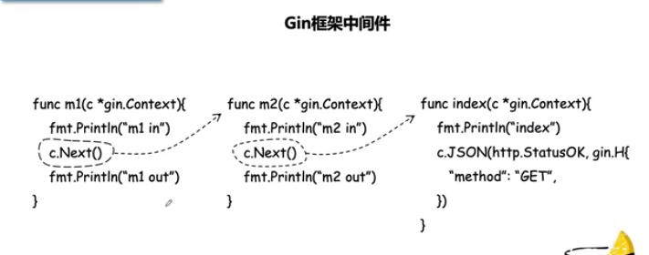
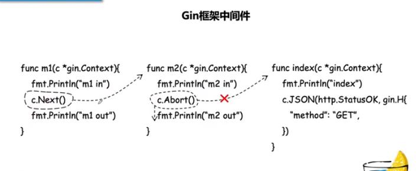
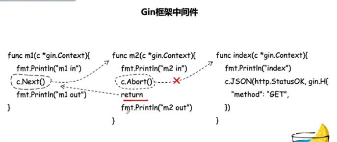

# Gin Web开发记录

## 1 创建项目

先创建项目目录`ginweb`，进入该目录后执行`go mod init ginweb`，初始化go modules，然后安装`gin`。

执行`go get -u github.com/gin-gonic/gin`，**其中`-u`参数在开发中使用，更新`gin`包及其依赖，项目发布之后谨慎使用**。

## 2 项目技术选型

- 数据访问 gorm
- 身份认证  github.com/dgrijalva/jwt-go
- 日志 zap
- 配置管理 viper
- sqlite 数据库
- 前端实现  基于go自带的模板（后期切换至vue）
- 开发工具 vscode

## 3 项目结构

Gin 项目的基本结构如下

```
├─ Project Name  
    ├─ configs       //配置文件  
      ├── ...  
    ├─ handlers      //控制器层  
      ├── ...  
    ├─ services      //业务层  
      ├── ...  
    ├─ models        //数据库ORM  
      ├── ...  
    ├─ routers       //路由
      ├── ...
    ├─ middlewares   //路由中间件  
      ├── ...  
    ├─ utils        //工具类  
      ├── ...  
    ├─ vendor       //扩展包  
      ├── ...  
    ├─ main.go       //入口文件
```

## 4 遇到错误

当在controller中，发现一个错误，往往要立即返回，这个时候要记得使用gin.Context.Abort 或者其相关的函数，如：

```go
if err != nil {
	c.AbortWithStatus(500)
	return
}
```

这个Abort函数本质是提前结束后续的handler链条，（通过将handler的下标索引直接变化为 math.MaxInt8 / 2 ）但是前面已经执行过的handler链条（包括middleware等）还会继续返回。

gin的Abort系列的几个函数为：

```go
func (c *Context) Abort()
func (c *Context) AbortWithStatus(code int)
func (c *Context) AbortWithStatusJSON(code int, jsonObj interface{})
func (c *Context) AbortWithError(code int, err error)
```

gin本身默认加载了Recovery()的中间件，所以在不知道如何处理error的时候，可以直接panic出去

## 5 Gin中的c.Next() c.Abort()

`r.Use(m1, m2)`，使用两个中间件，然后调用Controller 函数后的执行流程，使用`c.Next()`。

```go
m1 in  -> m2 in ->index -> m2 out -> m1 out  //输出结果
```



`r.Use(m1, m2)`，使用两个中间件，然后调用Controller 函数后的执行流程，其中一个使用`c.Abort()`。

```go
m1 in  -> m2 in ->m2 out -> m1 out   //输出结果
```



当然，如果连 m2 out 都不想让它输出的话，那直接在c.Abort() 语句 后return就可以了，如下图：



## 6 c.Set() c.Get 跨中间件取值

```go
c.Set("name", "tony")
name, ok := c.Get("name")
```

## 7 使用数据库

### ORM

使用`gorm`作为数据库访问组件。

### 约定

GORM 倾向于约定，而不是配置。默认情况下，GORM 使用 `ID` 作为主键，使用结构体名的 `蛇形复数` 作为表名，字段名的 `蛇形` 作为列名，并使用 `CreatedAt`、`UpdatedAt` 字段追踪创建、更新时间。遵循 GORM 已有的约定，可以减少您的配置和代码量。

GORM 定义一个 `gorm.Model` 结构体，其包括字段 `ID`、`CreatedAt`、`UpdatedAt`、`DeletedAt`

```go
// gorm.Model 的定义
type Model struct {
  ID        uint           `gorm:"primaryKey"`
  CreatedAt time.Time
  UpdatedAt time.Time
  DeletedAt gorm.DeletedAt `gorm:"index"`
}
```

### 字段级权限控制

可导出的字段在使用 GORM 进行 CRUD 时拥有全部的权限，此外，GORM 允许您用标签控制字段级别的权限。这样您就可以让一个字段的权限是只读、只写、只创建、只更新或者被忽略。

> **注意：** 使用 GORM Migrator 创建表时，不会创建被忽略的字段

```go
type User struct {
  Name string `gorm:"<-:create"` // 允许读和创建
  Name string `gorm:"<-:update"` // 允许读和更新
  Name string `gorm:"<-"`        // 允许读和写（创建和更新）
  Name string `gorm:"<-:false"`  // 允许读，禁止写
  Name string `gorm:"->"`        // 只读（除非有自定义配置，否则禁止写）
  Name string `gorm:"->;<-:create"` // 允许读和写
  Name string `gorm:"->:false;<-:create"` // 仅创建（禁止从 db 读）
  Name string `gorm:"-"`  // 通过 struct 读写会忽略该字段
}
```

### 钩子

Gorm 允许` BeforeSave`，`BeforeCreate`，`AfterSave`，`AfterCreate`等钩子，创建记录时会调用这些方法。

`DB.SingularTable(true)` 可以实现结构体为单数形式

使用`_`引用软件包，***表示自动调用相关包内的init方法***

### ErrRecordNotFound 错误

GORM中的Find、First、Last方法，First与Last相比Find多了Limit限制和默认排序顺序，三个方法没有本质的区别。抛出ErrRecordNotFound的具体场景：

1）传入接收检索结果的变量只能为Struct类型或Slice类型；

2）当传入变量为Struc类型时，如果检索出来的数据为0条，会抛出ErrRecordNotFound错误；

3）当传入变量为Slice类型时，任何条件下均不会抛出ErrRecordNotFound错误。

## x 模板引擎

- 定义模板


- 解析模板文件
- 渲染模板文件

