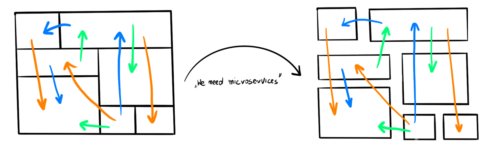
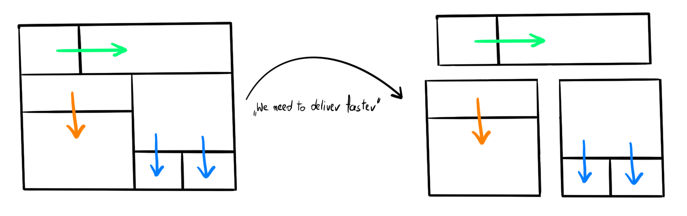
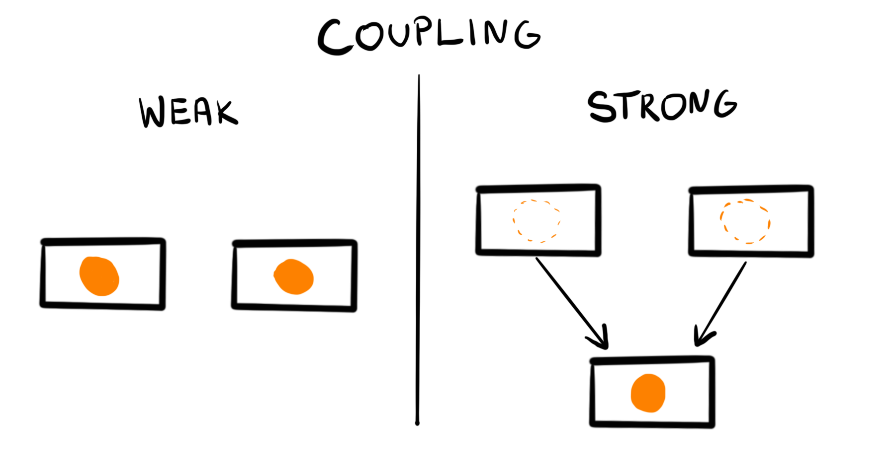
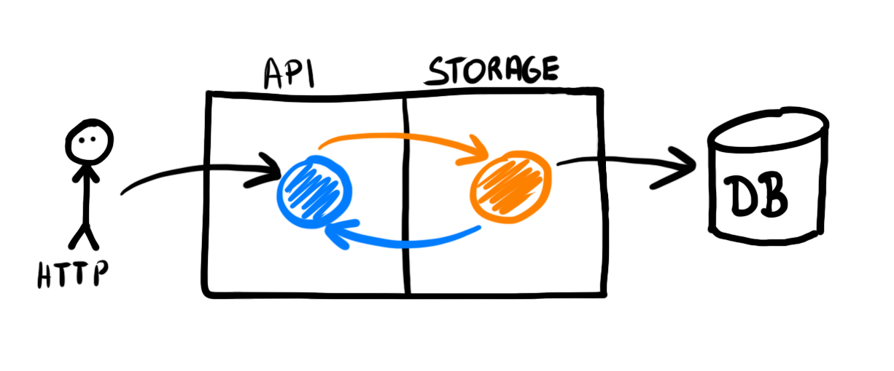
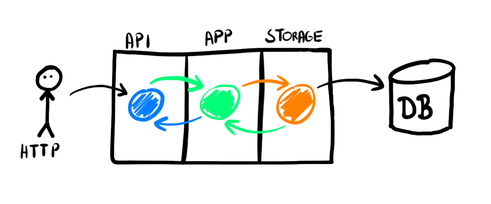
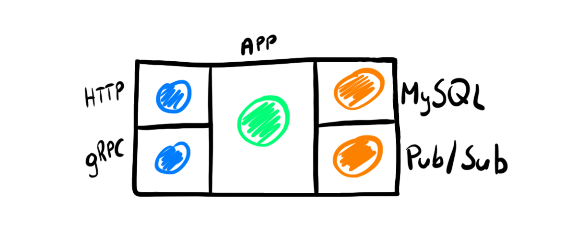
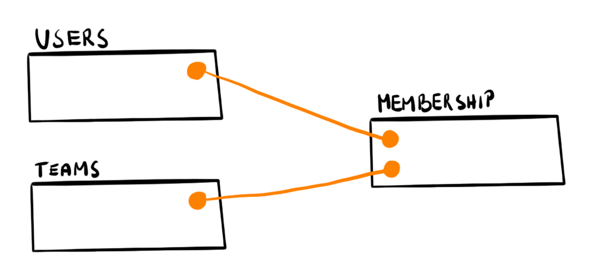
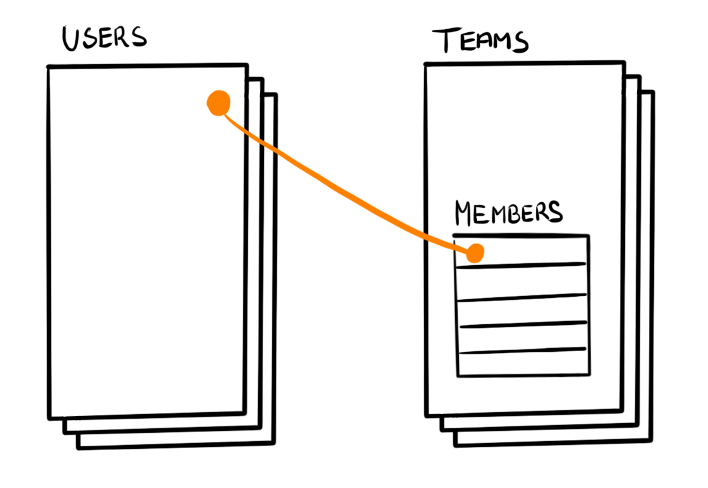

# Go Web 应用中常见的反模式

> 作者：Miłosz Smółka
> 译者：Kevin
> 原文地址：https://threedots.tech/post/common-anti-patterns-in-go-web-applications/

在我职业生涯的某个阶段，我对我所构建的软件不再感到兴奋。

我最喜欢的工作内容是底层的细节和复杂的算法。在转到面向用户的应用开发之后，这些内容基本消失了。编程似乎是利用现有的库和工具把数据从一处移至另一处。到目前为止，我所学到的关于软件的知识不再那么有用了。

让我们面对现实吧：大多数Web应用无法解决棘手的技术挑战。他们需要做到的是正确的对产品进行建模，并且比竞争对手更快的改进产品。

这起初看起来似乎是那么的无聊，但是你很快会意识到实现这个目标比听起来要难。这是一项完全不同的挑战。即使它们技术上实现并没有那么复杂，但时解决它们会对产品产生巨大影响并且让人获得满足。

**Web应用面临的最大挑战不是变成了一个无法维护的屎山，而是会减慢你的速度，让你的业务最终失败。**

这是他们如何在Go中发生和我是如何避免他们的。

## 松耦合是关键

应用难以维护的一个重要原因是强耦合。

**在强耦合应用中，任何你尝试触动的东西都有可能产生意想不到的副作用**。每次重构的尝试都会发现新的问题。最终，你决定字号从头重写整个项目。在一个快速增长的产品中，你是不可能冻结所有的开发任务去完成重写已经构建的应用的。而且你不能保证这次你把所有事都完成好。

相比之下，**松耦合应用保持了清晰的边界**。他们允许更换一些损坏的部分不影响项目的其他部分。它们更容易构建和维护。但是，为什么他们如此罕见呢？

微服务许诺了松耦合时实践，但是我们现在已经过了他们的炒作年代，而难以维护的应用仍旧存在。有些时候这反而变得更糟糕了：我们落入了[分布式单体](https://threedots.tech/post/microservices-or-monolith-its-detail/)的陷阱，处理和之前相同的问题，而且还增加了网络开销。

[](https://threedots.tech/post/common-anti-patterns-in-go-web-applications/microservices.png)从强耦合单体应用到分布式单体

> ❌ 反模式：分布式单体
> 在你了解边界之前，不要将你的应用切分成为微服务。

微服务并不会降低耦合，**因为拆分服务的次数并不重要。重要的是如何连接各个服务**。

[](https://threedots.tech/post/common-anti-patterns-in-go-web-applications/monolith.png)

从模块化单体应用到松耦合微服务

> ✅ 策略：松耦合
> 以实现松耦合的模块为目标。如何部署它们（作为模块化单体应用或微服务）是一个实现细节。

## DRY引入了耦合

强耦合十分常见，因为我们很早就学到了不要重复自己(Don’t Repeat Yourself, DRY)原则。

简短的规则很容易被大家记住，但是简短的三个单词很难概括所有的细节。《程序员修炼之道: 从小工到专家》这本书提供了一个更长的版本：

> 每条知识在系统中都必须有一个单一的、明确的、权威的表述。

“每一条知识"这个说法相当极端。大多数编程困境的答案是看情况而定，DRY也不例外。

**当你让两个事物使用相同抽象的时候，你就引入了耦合。如果你严格遵循DRY原则，你就需要在这个抽象之前增加抽象。**

[](https://threedots.tech/post/common-anti-patterns-in-go-web-applications/coupling.png)

## 在Go中保持DRY

相比于其他现代语言，Go是清晰的，缺少很多特性，没有太多的语法糖来隐藏复杂性。

我们习惯了捷径，所以一开始很难接受Go的冗长。就像我们已经开发出一种去寻找一种更加聪明的编写代码的方式的本能。

最典型的例子就是错误处理。如果你有编写Go的经验，你会觉得下面的代码片段很自然

```go
if err != nil {
    return err
}
```

但是对新手而言，一遍又一遍的重复这三行就是似乎在破坏DRY原则。他们经常想办法来规避这种样板方法，但是却没有什么好的结果。

最终，大家都接受了Go的工作方式。**它让你重复你自己，不过这并不是DRY告诉你的你要避免重复。**

## 单一数据模型带来的应用耦合

**Go中有一个特性引入了强耦合，但会让你认为你自己在遵循DRY原则。这就是在一个结构体中使用多个标签。** 这似乎是一个好主意，因为我们经常对不同的事物使用相似的模型。

这里有一个流行的方式保存单个`User`模型的方法：

```go
type User struct {
	ID           int        `json:"id" gorm:"autoIncrement primaryKey"`
	FirstName    string     `json:"first_name" validate:"required_without=LastName"`
	LastName     string     `json:"last_name" validate:"required_without=FirstName"`
	DisplayName  string     `json:"display_name"`
	Email        string     `json:"email,omitempty" gorm:"-"`
	Emails       []Email    `json:"emails" validate:"required,dive" gorm:"constraint:OnDelete:CASCADE"`
	PasswordHash string     `json:"-"`
	LastIP       string     `json:"-"`
	CreatedAt    *time.Time `json:"-"`
	UpdatedAt    *time.Time `json:"-"`
}

type Email struct {
	ID      int    `json:"-" gorm:"primaryKey"`
	Address string `json:"address" validate:"required,email" gorm:"size:256;uniqueIndex"`
	Primary bool   `json:"primary"`
	UserID  int    `json:"-"`
}
```

完整代码：[github.com/ThreeDotsLabs/go-web-app-antipatterns/01-coupling/01-tightly-coupled/internal/user.go](https://github.com/ThreeDotsLabs/go-web-app-antipatterns/blob/ab94d47350756716a7fed42b7ae546c51c11406a/01-coupling/01-tightly-coupled/internal/user.go#L9)

这种方式通过很少的几行代码让你可以只维护单一的结构体实现功能。

然而，在单一模型中拟合所有的内容需要很多技巧。API可能不需要保护某些字段，因此他们需要通过`json:"-"`隐藏起来。只有一个API使用到了`Email`字段，那么ORM就需要跳过它，并且需要在常规的JSON返回中通过`omitempty`进行隐藏。

**更重要的是，这个解决方案带来一个最糟糕的问题：API、存储和逻辑之间产生了强耦合。**

当你想要更新结构体中的任何东西时，你都不知道还有什么会发生修改。你会在更新数据库Schema或者更新验证规则时破坏API的约定。

模型越复杂，你面临的问题就越多。

比如，`json`标签表示JSON而不是HTTP。但是让你引入同样是格式化到JSON，但是格式与API不同的事件时会发生什么？你需要不停的添加hack让所有功能正常工作。

最终，你的团队会避免对结构体的修改，因为在你动了结构体之后你无法确定会出现什么样的问题。

[](https://threedots.tech/post/common-anti-patterns-in-go-web-applications/single-model.png)

> ❌ 反模式：单一模型
> 不要给一个模型多个责任。
> 每个结构字段不要使用多个标签。

## 复制消除耦合

减少耦合最简单的方法是拆分模型。

我们提取API使用的部分作为HTTP模型：

```go
type CreateUserRequest struct {
	FirstName string `json:"first_name" validate:"required_without=LastName"`
	LastName  string `json:"last_name" validate:"required_without=FirstName"`
	Email     string `json:"email" validate:"required,email"`
}

type UpdateUserRequest struct {
	FirstName *string `json:"first_name" validate:"required_without=LastName"`
	LastName  *string `json:"last_name" validate:"required_without=FirstName"`
}

type UserResponse struct {
	ID          int             `json:"id"`
	FirstName   string          `json:"first_name"`
	LastName    string          `json:"last_name"`
	DisplayName string          `json:"display_name"`
	Emails      []EmailResponse `json:"emails"`
}

type EmailResponse struct {
	Address string `json:"address"`
	Primary bool   `json:"primary"`
}
```

完整代码：[github.com/ThreeDotsLabs/go-web-app-antipatterns/01-coupling/02-loosely-coupled/internal/http.go](https://github.com/ThreeDotsLabs/go-web-app-antipatterns/blob/ab94d47350756716a7fed42b7ae546c51c11406a/01-coupling/02-loosely-coupled/internal/http.go#L15)

数据库相关部分作为存储模型：

```go
type UserDBModel struct {
	ID           int            `gorm:"column:id;primaryKey"`
	FirstName    string         `gorm:"column:first_name"`
	LastName     string         `gorm:"column:last_name"`
	Emails       []EmailDBModel `gorm:"foreignKey:UserID;constraint:OnDelete:CASCADE"`
	PasswordHash string         `gorm:"column:password_hash"`
	LastIP       string         `gorm:"column:last_ip"`
	CreatedAt    *time.Time     `gorm:"column:created_at"`
	UpdatedAt    *time.Time     `gorm:"column:updated_at"`
}

type EmailDBModel struct {
	ID      int    `gorm:"column:id;primaryKey"`
	Address string `gorm:"column:address;size:256;uniqueIndex"`
	Primary bool   `gorm:"column:primary"`
	UserID  int    `gorm:"column:user_id"`
}
```

完整代码：[github.com/ThreeDotsLabs/go-web-app-antipatterns/01-coupling/02-loosely-coupled/internal/db.go](https://github.com/ThreeDotsLabs/go-web-app-antipatterns/blob/ab94d47350756716a7fed42b7ae546c51c11406a/01-coupling/02-loosely-coupled/internal/db.go#L16)

起初，看上去我们会在所有地方使用相同的`User`模型。现在，很明显我们过早的避免了重复。API和存储的结构很相似，但足够不同到需要拆分成不同的模型。

在Web应用中，**你API返回（读模型）与存储在数据库中的视图（写模型）并不相同**。

存储代码无需知道HTTP的模型，因此我们需要进行结构转换。

[](https://threedots.tech/post/common-anti-patterns-in-go-web-applications/mapping-models.png)

```go
func userResponseFromDBModel(u UserDBModel) UserResponse {
	var emails []EmailResponse
	for _, e := range u.Emails {
		emails = append(emails, emailResponseFromDBModel(e))
	}
	
	return UserResponse{
		ID:          u.ID,
		FirstName:   u.FirstName,
		LastName:    u.LastName,
		DisplayName: displayName(u.FirstName, u.LastName),
		Emails:      emails,
	}
}

func emailResponseFromDBModel(e EmailDBModel) EmailResponse {
	return EmailResponse{
		Address: e.Address,
		Primary: e.Primary,
	}
}

func userDBModelFromCreateRequest(r CreateUserRequest) UserDBModel {
	return UserDBModel{
		FirstName: r.FirstName,
		LastName:  r.LastName,
		Emails: []EmailDBModel{
			{
				Address: r.Email,
			},
		},
	}
}
```

完整代码： [github.com/ThreeDotsLabs/go-web-app-antipatterns/01-coupling/02-loosely-coupled/internal/http.go](https://github.com/ThreeDotsLabs/go-web-app-antipatterns/blob/ab94d47350756716a7fed42b7ae546c51c11406a/01-coupling/02-loosely-coupled/internal/http.go#L210)

这就是所有你需要的代码：将一种类型映射到另一种类型的函数。编写这种平淡无奇的代码可能看起来十分无聊，但是它对解耦至关重要。

创建一个使用序列化或者`reflect`实现用于映射结构体的通用解决方案看上去十分诱人。**请抵制它。编写模版比调试映射的边缘情况会更节省时间和精力。** 简单的函数对团队中每个人都更容易理解。魔法转换器会在一段时间后变得难以理解，即使对你而言也是如此。

> ✅ 策略：模型单一责任。
> 通过使用单独的模型来实现松耦合。编写简单明了的函数用以在它们之间进行转换。

如果你害怕太多的重复，请考虑一下最坏的情况。如果你最终多了几个随着应用程序增长不变的结构，你可以将它们合并回一个。与强耦合代码相比，修复重复代码是微不足道的。

## 生成模版

如果你担心手写这些所有代码，有一个管用的方法可以规避。**使用可以为你生成模版的库**。

你可以生成诸如：

- 由OpenAPI定义的HTTP模型和路由（[oapi-codegen](https://github.com/deepmap/oapi-codegen)或者其他库）。
- 由SQL schema定义的数据库模型和相关代码（[sqlboiler](https://github.com/volatiletech/sqlboiler和其他ORM）。
- 通过Protobuf文件生成gPRC模型。

生成的代码可以提供强类型保护，因此你无需在通用函数中传递`interface{}`类型的数据。你可以保证编译时检查的同时无需手写代码。

下面是生成的模型的例子。

```go
// PostUserRequest defines model for PostUserRequest.
type PostUserRequest struct {
	
	// E-mail
	Email string `json:"email"`
	
	// First name
	FirstName string `json:"first_name"`
	
	// Last name
	LastName string `json:"last_name"`
}

// UserResponse defines model for UserResponse.
type UserResponse struct {
	DisplayName string          `json:"display_name"`
	Emails      []EmailResponse `json:"emails"`
	FirstName   string          `json:"first_name"`
	Id          int             `json:"id"`
	LastName    string          `json:"last_name"`
}
```

完整代码：[github.com/ThreeDotsLabs/go-web-app-antipatterns/01-coupling/03-loosely-coupled-generated/internal/http_types.go](https://github.com/ThreeDotsLabs/go-web-app-antipatterns/blob/ab94d47350756716a7fed42b7ae546c51c11406a/01-coupling/03-loosely-coupled-generated/internal/http_types.go#L22)

```go
type User struct {
	ID           int64       `boil:"id" json:"id" toml:"id" yaml:"id"`
	FirstName    string      `boil:"first_name" json:"first_name" toml:"first_name" yaml:"first_name"`
	LastName     string      `boil:"last_name" json:"last_name" toml:"last_name" yaml:"last_name"`
	PasswordHash null.String `boil:"password_hash" json:"password_hash,omitempty" toml:"password_hash" yaml:"password_hash,omitempty"`
	LastIP       null.String `boil:"last_ip" json:"last_ip,omitempty" toml:"last_ip" yaml:"last_ip,omitempty"`
	CreatedAt    null.Time   `boil:"created_at" json:"created_at,omitempty" toml:"created_at" yaml:"created_at,omitempty"`
	UpdatedAt    null.Time   `boil:"updated_at" json:"updated_at,omitempty" toml:"updated_at" yaml:"updated_at,omitempty"`
	
	R *userR `boil:"-" json:"-" toml:"-" yaml:"-"`
	L userL  `boil:"-" json:"-" toml:"-" yaml:"-"`
}
```

完整代码：[github.com/ThreeDotsLabs/go-web-app-antipatterns/01-coupling/03-loosely-coupled-generated/models/users.go](https://github.com/ThreeDotsLabs/go-web-app-antipatterns/blob/ab94d47350756716a7fed42b7ae546c51c11406a/01-coupling/03-loosely-coupled-generated/models/users.go#L26)

有时你可能会想要编写代码生成工具。这其实并不难，结果需要是每个人都可以阅读和理解的常规Go代码。常见的替代方案是使用`reflect`，但是这很难掌握和调试。当然，首先要考虑的是付出的努力是否值得。在大多数情况下，手写代码已经足够快了。

> ✅ 策略：生成重复工作的部分
> 生成的代码为你提供强类型和编译时安全性。选择它而不是`reflect`。

## 不要过度使用库

只将生成的代码用于它应该做的事情。如果你想避免手工编写模版，但仍需要保留一些专用的模型。**不要以单一模型反模式作为结束**。

当你想遵循DRY原则时，很容易落入这个陷阱。

例如，[sqlc](https://github.com/kyleconroy/sqlc)和[sqlboiler](https://github.com/volatiletech/sqlboiler)都是从SQL查询中生成代码。sqlc允许在生成的模型上添加JSON标签，甚至允许让你选择`camelCase`还是`snake_case`。sqlboiler在所有模型上默认添加了`json`，`toml`和`yaml`标签。这显然是不是让用户仅仅把这个模型仅用于存储。

看一下sqlc的issue列表，我发现很多开发者要求更多的灵活性，比如[重命名生成的字段](https://github.com/kyleconroy/sqlc/pull/756/files)和[整个跳过一些JSON字段](https://github.com/kyleconroy/sqlc/issues/298)。有人甚至提到他们*需要某种在REST API中隐藏某些敏感字段的方法*。

所有这些都是鼓励在单一模型中担负更多职责。它可以让你写更少的代码，但是请务必考虑这种耦合是否值得。

同样，需要注意结构体标签中隐藏的魔法，比如，gorm中提供的权限功能：

```go
type User struct {
	Name string `gorm:"<-:create"` // 允许读取和创建
	Name string `gorm:"<-:update"` // 允许读取和更新
	Name string `gorm:"<-"`        // 允许读取和写入（创建和更新）
	Name string `gorm:"<-:false"`  // 允许读取，禁用写权限
	Name string `gorm:"->"`        // 只读模式（除非单独配置，否则禁用写权限）
	Name string `gorm:"->;<-:create"` // 允许读取和创建
	Name string `gorm:"->:false;<-:create"` // 只允许创建（禁止从数据库中读取）
	Name string `gorm:"-"`  // 在读写模型时忽略这个字段
}
```

完整代码：[gorm.io/docs/models.html#Field-Level-Permission](https://gorm.io/docs/models.html#Field-Level-Permission)

你同样可以使用[validator]库进行复杂的比较，比如参考其他字段：

```go
type User {
	FirstName    string `validate:"required_without=LastName"`
	LastName     string `validate:"required_without=FirstName"`
}
```

它为你节省了一点编写代码的时间，但是这意味着你放弃了编译期检查。在结构体标签中很容易出现错别字，在验证和权限等敏感地方使用这种会带来风险。这同样也会让很多不那么熟悉库的语法糖的人感到困扰。

我并不是指摘这些提到的库，他们都有自己的用途。但是这些示例展示了我们如何把DRY做到极致，这样我们就不用编写更多的代码了。

> ❌ 反模式：选择魔法来节省编写代码的时间
> 不要过度使用库以避免冗余。

## 避免隐式标签名

大多数库不要求标签必须存在，此时会默认使用字段名称。

在重构项目时，有人可能会重命名字段，但是他没有想过编辑API返回或者数据模型。如果没有标签，这就会导致API约定或者数据存储过程被破坏。

请始终填写所有标间，即使你必须兼容同一名称两次，这并不违反DRY原则。

> 译者注：其实Go之前有个类似proposal提过在1.16中[简化这一写法](https://github.com/golang/go/issues/40281)，但是后面发现存在一些问题被回滚了。

> ❌反模式：省略结构标签
> 如果库使用它们，则不要跳过结构标签。

```go
type Email struct {
	ID      int    `gorm:"primaryKey"`
	Address string `gorm:"size:256;uniqueIndex"`
	Primary bool
	UserID  int
}
```

> ✅战术：显式结构标签
> 始终填充结构标签，即使字段名称相同。

```go
type Email struct {
	ID      int    `gorm:"column:id;primaryKey"`
	Address string `gorm:"column:address;size:256;uniqueIndex"`
	Primary bool   `gorm:"column:primary"`
	UserID  int    `gorm:"column:user_id"`
}
```

## 将逻辑与实现细节分开

通过生成模型将API与存储解耦是一个好的开始。但是，我们仍旧需要保留在HTTP处理中的验证过程。

```go
type createRequest struct {
	Email     string `validate:"required,email"`
	FirstName string `validate:"required_without=LastName"`
	LastName  string `validate:"required_without=FirstName"`
}

validate := validator.New()
err = validate.Struct(createRequest(postUserRequest))
if err != nil {
	log.Println(err)
	w.WriteHeader(http.StatusBadRequest)
	return
}
```

完整代码：[github.com/ThreeDotsLabs/go-web-app-antipatterns/01-coupling/03-loosely-coupled-generated/internal/http.go](https://github.com/ThreeDotsLabs/go-web-app-antipatterns/blob/21d60c78dbd2c81800899dd9fd7169325fa6199a/01-coupling/03-loosely-coupled-generated/internal/http.go#L83)

验证是你能在大多数Web应用中可以找到的业务逻辑中的一环。通常，他们会更加复杂，比如：

- 仅在特定情况下显示字段
- 检查权限
- 取决于角色而隐藏字段
- 计算价格
- 根据几个因素采取行动

将逻辑和实现细节混在一起（比如将他们放在HTTP handler中）是一种快速交付MVP的方法。但是这也引入了最坏的技术债务。这就是为什么你会被供应商锁定，为什么你需要不停的添加hack拉支持新功能。

> ❌ 反模式：将逻辑和细节混在一起
> 不要将你的应用程序逻辑与实现细节混在一起。

商业逻辑需要单独的层。更改实现（数据库引擎、HTTP 库、基础架构、Pub/Sub 等）应是可能的，而无需对逻辑部件进行任何更改。

你做这种分离并不是因为你想要更改数据库引擎，这种情况很少会发生。**但是，关注点的分离可以让你的代码更容易理解和修改。你知道你在修改什么，并且有没有副作用。** 这样就很难在关键部分引入bug。

要分离应用层，我们需要添加额外的模型和映射。



```go
type User struct {
	id        int
	firstName string
	lastName  string
	emails    []Emailf
}

func NewUser(firstName string, lastName string, emailAddress string) (User, error) {
	if firstName == "" && lastName == "" {
		return User{}, ErrNameRequired
	}

	email, err := NewEmail(emailAddress, true)
	if err != nil {
		return User{}, err
	}

	return User{
		firstName: firstName,
		lastName:  lastName,
		emails:    []Email{email},
	}, nil
}

type Email struct {
	address string
	primary bool
}

func NewEmail(address string, primary bool) (Email, error) {
	if address == "" {
		return Email{}, ErrEmailRequired
	}

	// A naive validation to make the example short, but you get the idea
	if !strings.Contains(address, "@") {
		return Email{}, ErrInvalidEmail
	}

	return Email{
		address: address,
		primary: primary,
	}, nil
}
```

完整代码：[github.com/ThreeDotsLabs/go-web-app-antipatterns/01-coupling/04-loosely-coupled-app-layer/internal/user.go](https://github.com/ThreeDotsLabs/go-web-app-antipatterns/blob/21d60c78dbd2c81800899dd9fd7169325fa6199a/01-coupling/04-loosely-coupled-app-layer/internal/user.go#L14)

这就是当我需要更新业务逻辑时我需要修改的代码。这明显很无聊，**但是我知道我修改了什么**。

当我们添加另一个API（比如gRPC）或者外部系统（如Pub/Sub）时，我们需要同样的工作。每个部分都是用单独的模型，我们在应用层映射转换它们。

因为应用层维护了所有的验证和其他商业逻辑，他会让我们无论是使用HTTP还是gRPC API都没什么区别。API只是应用的入口。

[](https://threedots.tech/post/common-anti-patterns-in-go-web-applications/more-models.png)

> ✅ 策略：应用层
> 将产品最重要的代码划分成单独的层。

上面的代码片段都来自于同一个[代码库](https://github.com/ThreeDotsLabs/go-web-app-antipatterns)，并且实现了经典的用户域。所有示例都暴露相同的API并且使用相同的测试套件。

以下是他们的比较：

|            | 强耦合 | 松耦合 | 基于代码生成的松耦合 | 松耦合的应用层 |
| :--------: | :----: | :----: | :------------------: | :------------: |
|    耦合    |   强   |   中   |          中          |       弱       |
|    模版    |  手动  |  手动  |         生成         |      生成      |
|  代码行数  |  292   |  345   |         298          |      408       |
| 生成的代码 |   0    |   0    |         2154         |      2154      |

## 标准的Go项目结构

如果你看过[这个仓库](https://github.com/ThreeDotsLabs/go-web-app-antipatterns)，你会发现在每个例子中只有一个包。

Go目前没有官方的目录组织结构，不过你可以找到很多微服务例子或者REST模版仓库建议你如何拆分。他们通常有精心设计的目录机构，有人甚至提到他们遵循了简洁架构或者六边形架构。

我一般第一件确认的事情是如何存储模型的。大多数情况下，他们使用了JSON和数据库标签混合的结构体。

这是一种错觉：**包看起来进行了很好的切分，但实际上他们仍旧通过一个模型被紧密的耦合在了一起**。新人用来学习的很多流行例子中，这些问题也很常见。

具有讽刺意味的是，标准的Go项目结构仍旧在社区中继续被讨论，然而模型耦合反模式却很常见。**如果你的应用程序的类型耦合了，任何目录的组织形式都不会改变什么**。

在查看示例结构时，请记住他们可能是为另外一种不同类型的应用程序设计的。对于开源的基础设施工具、Web应用后端和标准库而言，没有一种方法同时对他们有效。

包分层和切分微服务的问题非常类似。重要的不是如何划分他们，而是他们彼此之间如何连接。

**当你专注于松耦合时，目录结构就会变得更加清晰。你可以将实现细节与业务逻辑区分开。你把相互引用的事物分组，并将不互相引用的事物拆分开。**

在我准备的示例中，我可以轻松的将HTTP相关的代码和数据库相关的代码拆分至单独的包中。这会避免命名空间的污染。模型之间已经没有耦合，所以这些操作就变成了具体的细节。

> ❌反模式：过度考虑目录结构
> 不要通过分割目录来启动项目。不管你怎么做，这是一个惯例。
> 你不太可能在编写代码之前把事情做好。

> ✅策略：松耦合代码
> 重要的部分不是目录结构，而是包和结构是如何进行相互引用的。

## 保持简单化

假设你想要创建一个用户，这个用户有一个ID字段。最简单的方法可以看起来像这样：

```go
type User struct {
	ID string `validate:"required,len=32"`
}

func (u User) Validate() error {
	return validate.Struct(u)
}
```

这段代码能够正常工作。但是，你无法判断该结构在任何时候都是正确的。你依靠一些额外东西来调用验证并处理错误。

另一种方法是采用良好的旧式封装。

```go
type User struct {
	id UserID
}

type UserID struct {
	id string
}

func NewUserID(id string) (UserID, error) {
	if id == "" {
		return UserID{}, ErrEmptyID
	}
	
	if len(id) != 32 {
		return UserID{}, ErrInvalidLength
	}

	return UserID{
		id: id,
	}, nil
}

func (u UserID) String() string {
	return u.id
}
```

此片段更清晰、更冗长。如果你创建了一个新的`UserID`并且没有收到任何错误，你可以确定创建是成功的。此外，你可以轻松地将错误映射到 API 的正确响应。

无论你选择哪种方法，你都需要对用户ID的基本复杂性进行建模。从纯粹的实现的角度来看，将 ID 保持在字符串中是最简单的解决方案。

Go应该很简单，但这并不意味着你应该只使用原始类型。对于复杂的行为，请使用反映产品工作方式的代码。否则，你最终会获得一个简化的模型。

> ❌反模式：过度简化
> 不要用琐碎的代码来模拟复杂的行为。

> ✅策略：编写明确的代码
> 保证代码是明确的，即使它很冗长。
> 使用封装来确保你的结构始终处于有效状态。

> 即使所有字段都未导出，也可以在包外创建空结构。唯一要做的是在接受`UserID`作为参数时，你需要检查一下合法性。
> 你可以使用`if id == UserID{}`或编写专门的`IsZero()`方法来进行。

## 从数据库Schema开始

假设我们需要添加一个用户创建和加入团队的功能。

按照关系型方法，我们需要添加一个`teams`表和另外一个将用户和它进行关联的表。我们叫它`membership`。

[](https://threedots.tech/post/common-anti-patterns-in-go-web-applications/relational-db.png)

按照关系方法，我们将添加一张桌子和另一张加入它的表格。让我们称之为。teamsusersmembership

我们已经有了`UserStorage`，所以很自然的添加两个新的结构体：`TeamStorage`和`MembershipStorage`。他们会为每个表格提供CRUD方法。

添加新团队的代码可能看起来是这个样子的：

```go
func CreateTeam(teamName string, ownerID int) error {
	teamID, err := teamStorage.Create(teamName)
	if err != nil {
		return err
	}
	
	return membershipStorage.Create(teamID, ownerID, MemberRoleOwner)
}
```

这种方法有一个问题：我们没有在事务中创建团队和成员记录。如果出现问题，我们可能最终拥有一支没有分配所有者的团队。

首先想到的第一个解决方案是在方法之间传递事务。

```go
func CreateTeam(teamName string, ownerID int) error {
	tx, err := db.Begin()
	if err != nil {
		return err
	}
	
	defer func() {
		if err == nil {
			err = tx.Commit()
		} else {
			rollbackErr := tx.Rollback()
			if rollbackErr != nil {
				log.Error("Rollback failed:", err)
			}
		}
	}()
	
	teamID, err := teamStorage.Create(tx, teamName)
	if err != nil {
		return err
	}
	
	return membershipStorage.Create(tx, teamID, ownerID, MemberRoleOwner)
}
```

但是，这样的话实现细节（事务处理）就会泄漏到了逻辑层。它通过基于`defer`的错误处理污染了一个可读的函数。

下面是一个练习：考虑如何在文档数据库中对此进行建模。比如，我们可以将所有成员保留在团队文档中。

[](https://threedots.tech/post/common-anti-patterns-in-go-web-applications/document-db.png)

在这种情况下，添加成员就可以在`TeamStorage`中完成，这样我们就不需要单独的`MembershipStorage`。但是切换数据库就变更了我们模型的假设，这不是很奇怪吗？

现在很显然，我们通过引入"成员身份"概念泄露了实现细节。“创建新成员身份”，这只会困扰我们的销售或者客户服务同事。**当你开始说一种不同于公司其他成员的语言时，这通常一个严重的危险信号**。

> 反模式❌：从数据库Schema开始
> 不要将模型建立在数据库模式的基础上。你最终会暴露实现细节。

`TeamStorage`用于存储团队信息，但它不是与`teams` SQL表无关。这是关于我们产品的团队概念。

每个人都明白创建一个团队需要一个所有者，我们可以为此暴露一个方法。这个方法会将所有的查询放在一个事务中执行查询。

```go
teamStorage.Create(teamName, ownerID, MemberRoleOwner)
```

同样，我们也可以有一个加入团队的方法。

```go
teamStorage.JoinTeam(teamID, memberID, MemberRoleGuest)
```

`membership`表依旧存在，但是实现细节被隐藏在`TeamStorage`中。

> ✅策略：从领域开始
> 你的存储方法应遵循产品的行为。不要他们的事务细节。

## 你的网络应用程序不是单纯的CRUD

教程通常都是以"简单的 CRUD"为特色，因此它们似乎是任何 Web 应用的基础构建模块。这是个虚无缥缈的传说。如果你所有的产品需要的是CRUD，你就是在浪费时间和金钱从零开始构建。

框架和无代码工具使得启动 CRUD 变得更容易，但我们仍然向开发人员支付构建自定义软件的费用。即使是 GitHub Copilot 也不知道你的产品除了模版之外是如何工作的。

**正是特殊的规则和奇怪的细节使你的应用程序与众不同。这不是你分散在四个CRUD操作之上的逻辑。** 它是你销售的产品的核心。

在 MVP 阶段，从 CRUD 开始快速构建可工作版本是很诱人的。但这就像使用电子表格而不是专用软件。一开始，你会获得类似的效果，但每个新功能都需要更多的hack。

> 反模式❌：从 CRUD 开始
> 不要围绕四个 CRUD 操作的想法来设计你的应用程序。

> ✅策略：了解你的领域
> 花时间了解你的产品是如何工作的，并在代码中建模。

我描述的许多策略都是众所周知的模式背后的想法：

- SOLID中的[单一责任原则](https://threedots.tech/post/things-to-know-about-dry/)（每个模型只有一项责任）。
- [简洁架构](https://threedots.tech/post/introducing-clean-architecture/)（松耦合的包，将逻辑与实现细节隔离）。
- [CQRS](https://threedots.tech/post/basic-cqrs-in-go/)（使用不同的读取模型和写入模型）。

有些甚至接近域驱动设计：

- [值对象](https://threedots.tech/post/ddd-lite-in-go-introduction/)（始终保持结构处于有效状态）。
- 聚合和[仓库](https://threedots.tech/post/repository-pattern-in-go/)（无论数据库表的数量如何，都以事务方式保存领域对象）。
- [无处不在的语言](https://threedots.tech/post/software-dark-ages/)（使用每个人都能理解的语言）。

这些模式似乎大多与企业级应用相关。但其中大多数是简单明了的核心思想，比如本文中的策略。它们同样适用于处理复杂的业务行为Web应用程序、

你不需要阅读大量书籍或复制其他语言的代码来遵循这些模式。你可以通过实践检验的技术编写惯用的Go代码。如果你想了解更多关于他们的内容，可以看看[我们的免费电子书](https://threedots.tech/go-with-the-domain)。

> 如果你想在[反模式仓库](https://github.com/ThreeDotsLabs/go-web-app-antipatterns)中添加更多示例以及有关主题，请在评论中告知我们。