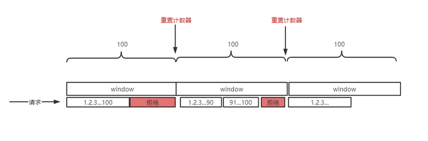
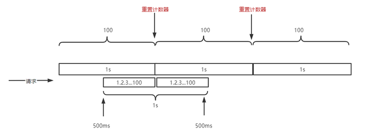

# [Go 中实现用户的每日限额](https://segmentfault.com/a/1190000041263695)

> 如果你写一个 bug 管理系统，用了这个 `PeriodLimit` 你就可以限制每个测试人员每天只能给你提一个 bug。工作是不是就轻松很多了？:P

如今微服务架构大行其道本质原因是因为要降低系统的整体复杂度，将系统风险均摊到子系统从而最大化保证系统的稳定性，通过领域划分拆成不同的子系统后各个子系统能独立的开发、测试、发布，研发节奏和效率能明显提高。

但同时也带来了问题，比如：调用链路过长，部署架构复杂度提升，各种中间件需要支持分布式场景。为了确保微服务的正常运行，服务治理就不可或缺了，通常包括：限流，降级，熔断。

其中限流指的是针对接口调用频率进行限制，以免超出承载上限拖垮系统。比如：

1. 电商秒杀场景
2. API 针对不同商户限流

常用的限流算法有：

- 固定时间窗口限流
- 滑动时间窗口限流
- 漏桶限流
- 令牌桶限流

本文主要讲解固定时间窗口限流算法，主要的使用场景比如：

- 每个手机号每天只能发5条验证码短信
- 每个用户每小时只能连续尝试3次密码
- 每个会员每天只能领3次福利

## 工作原理

从某个时间点开始每次请求过来请求数+1，同时判断当前时间窗口内请求数是否超过限制，超过限制则拒绝该请求，然后下个时间窗口开始时计数器清零等待请求。



## 优缺点

> **优点**

实现简单高效，特别适合用来限制比如一个用户一天只能发10篇文章、只能发送5次短信验证码、只能尝试登录5次等场景，实际业务中此类场景非常多见。

> **缺点**

固定时间窗口限流的缺点在于无法处理临界区请求突发场景。

假设每 1s 限流 100 次请求，用户在中间 500ms 时开始 1s 内发起 200 次请求，此时 200 次请求是可以全部通过的。这就和我们预期 1s 限流 100 次不合了，根源在于限流的细粒度太粗。



## go-zero 代码实现

> ```
> core/limit/periodlimit.go
> ```

go-zero 中使用 redis 过期时间来模拟固定时间窗口。

> redis lua 脚本：

```lua
-- KYES[1]:限流器key
-- ARGV[1]:qos,单位时间内最多请求次数
-- ARGV[2]:单位限流窗口时间
-- 请求最大次数,等于p.quota
local limit = tonumber(ARGV[1])
-- 窗口即一个单位限流周期,这里用过期模拟窗口效果,等于p.permit
local window = tonumber(ARGV[2])
-- 请求次数+1,获取请求总数
local current = redis.call("INCRBY",KYES[1],1)
-- 如果是第一次请求,则设置过期时间并返回 成功
if current == 1 then
  redis.call("expire",KYES[1],window)
  return 1
-- 如果当前请求数量小于limit则返回 成功
elseif current < limit then
  return 1
-- 如果当前请求数量==limit则返回 最后一次请求
elseif current == limit then
  return 2
-- 请求数量>limit则返回 失败
else
  return 0
end
```

> 固定时间窗口限流器定义

```go
type (
  // PeriodOption defines the method to customize a PeriodLimit.
  // go中常见的option参数模式
  // 如果参数非常多，推荐使用此模式来设置参数
  PeriodOption func(l *PeriodLimit)

  // A PeriodLimit is used to limit requests during a period of time.
  // 固定时间窗口限流器
  PeriodLimit struct {
    // 窗口大小，单位s
    period     int
    // 请求上限
    quota      int
    // 存储
    limitStore *redis.Redis
    // key前缀
    keyPrefix  string
    // 线性限流，开启此选项后可以实现周期性的限流
    // 比如quota=5时，quota实际值可能会是5.4.3.2.1呈现出周期性变化
    align      bool
  }
)
```

注意一下 align 参数，align=true 时请求上限将会呈现周期性的变化。
比如quota=5时实际quota可能是5.4.3.2.1呈现出周期性变化

> 限流逻辑

其实限流逻辑在上面的 lua 脚本实现了,需要注意的是返回值

- 0：表示错误，比如可能是 redis 故障、过载
- 1：允许
- 2：允许但是当前窗口内已到达上限，如果是跑批业务的话此时可以休眠 sleep 一下等待下个窗口（作者考虑的非常细致）
- 3：拒绝

```go
// Take requests a permit, it returns the permit state.
// 执行限流
// 注意一下返回值：
// 0：表示错误，比如可能是redis故障、过载
// 1：允许
// 2：允许但是当前窗口内已到达上限
// 3：拒绝
func (h *PeriodLimit) Take(key string) (int, error) {
  // 执行lua脚本
  resp, err := h.limitStore.Eval(periodScript, []string{h.keyPrefix + key}, []string{
    strconv.Itoa(h.quota),
    strconv.Itoa(h.calcExpireSeconds()),
  })
  
  if err != nil {
    return Unknown, err
  }

  code, ok := resp.(int64)
  if !ok {
    return Unknown, ErrUnknownCode
  }

  switch code {
  case internalOverQuota:
    return OverQuota, nil
  case internalAllowed:
    return Allowed, nil
  case internalHitQuota:
    return HitQuota, nil
  default:
    return Unknown, ErrUnknownCode
  }
}
```

这个固定窗口限流可能用来限制比如一个用户一天只能发送5次验证码短信，此时我们就需要跟中国时区对应(GMT+8)，并且其实限流时间应该从零点开始，此时我们需要额外对齐（设置 align 为 true）。

```go
// 计算过期时间也就是窗口时间大小
// 如果align==true
// 线性限流，开启此选项后可以实现周期性的限流
// 比如quota=5时，quota实际值可能会是5.4.3.2.1呈现出周期性变化
func (h *PeriodLimit) calcExpireSeconds() int {
  if h.align {
    now := time.Now()
    _, offset := now.Zone()
    unix := now.Unix() + int64(offset)
    return h.period - int(unix%int64(h.period))
  }

  return h.period
}
```