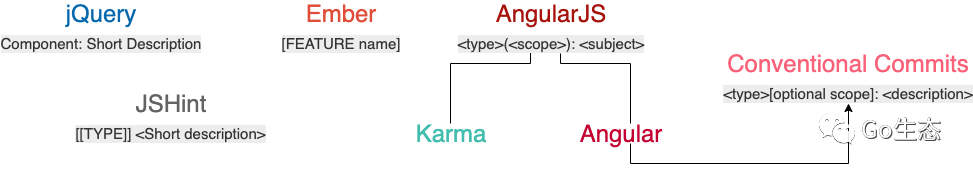

# Go 工程化规范设计

> 主要参考极客时间《Go 语言项目开发实战》规范设计。

首先理解工程化规范包括的两方面：

- 非编码类规范：开源规范，文档规范，版本规范，Git 规范，发布规范，…
- 编码类规范：目录规范，代码规范，接口规范，日志规范，错误码规范，…

## 开源规范

主流的开源许可证：


开源项目应遵循：

- 高单元覆盖率。可确保第三方开发者在开发完代码后，能很方便地对整个项目做详细的单元测试，也能保证提交代码的质量。
- 要确保整个代码库和提交记录中，不能出现内部 IP、内部域名、密码、密钥这类信息。否则会造成敏感信息外漏，可能会对内部业务造成安全隐患。
- 当开源项目被其他开发者提交 pull request、issue、comment 时要及时处理，可确保项目不断被更新，也可以激发其他开发者贡献代码的积极性。
- 持续地更新功能和修复 Bug。对于已经结项、不维护的开源项目，需要及时地对项目进行归档，并在项目描述中加以说明。
- …

## 文档规范

### README 文档

README.md 用于介绍项目的功能、安装、部署、使用。

建议使用 **readme.so**[1] 生成。

### 项目文档

要求易读和可快速定位目标内容，可提供中文与英文版本：

- 开发文档：描述项目开发流程，包括如何搭建开发环境、构建二进制文件、测试、部署等。
- 用户文档：软件的使用文档，对象一般是软件使用者。内容包括 API 文档、SDK 文档、安装文档、功能介绍文档、最佳实践、操作指南、常见问题等。

参考目录结构：

```
docs
├── devel                            # 开发文档，可以提前规划好，英文版文档和中文版文档
│   ├── en-US/                       # 英文版文档，可以根据需要组织文件结构
│   └── zh-CN                        # 中文版文档，可以根据需要组织文件结构
│       └── development.md           # 开发手册，可以说明如何编译、构建、运行项目
├── guide                            # 用户文档
│   ├── en-US/                       # 英文版文档，可以根据需要组织文件结构
│   └── zh-CN                        # 中文版文档，可以根据需要组织文件结构
│       ├── api/                     # API 文档
│       ├── best-practice            # 最佳实践，存放一些比较重要的实践文章
│       │   └── authorization.md
│       ├── faq                      # 常见问题
│       │   ├── iam-apiserver
│       │   └── installation
│       ├── installation             # 安装文档
│       │   └── installation.md
│       ├── introduction/            # 产品介绍文档
│       ├── operation-guide          # 操作指南，可根据 RESTful 资源再划分为更细的子目录，存放系统功能操作手册
│       │   ├── policy.md
│       │   ├── secret.md
│       │   └── user.md
│       ├── quickstart               # 快速入门
│       │   └── quickstart.md
│       ├── README.md                # 用户文档入口文件
│       └── sdk                      # SDK 文档
│           └── golang.md
└── images                           # 图片存放目录
    └── 部署架构v1.png
```

### API 文档

一般由后端开发人员编写，描述组件提供的 API 以及调用方法。

可以编写 Word/Markdown 格式文档、借助工具编写（填充内容）、通过注释生成（如 Swagger）等。

通常需要包含完整的 API 接口介绍文档（接口描述、请求方法、请求参数、输出参数和请求示例）、API 接口变更历史文档、通用说明、数据结构说明、错误码描述和 API 接口使用文档。

- README.md ：API 接口介绍文档，会分类介绍 IAM 支持的 API 接口，并会存放相关 API 接口文档的链接，方便开发者查看。
- CHANGELOG.md ：API 接口文档变更历史，方便进行历史回溯，也可以使调用者决定是否进行功能更新和版本更新。
- generic.md ：用来说明通用的请求参数、返回参数、认证方法和请求方法等。
- struct.md ：用来列出接口文档中使用的数据结构。这些数据结构可能被多个 API 接口使用，会在 user.md、secret.md、policy.md 文件中被引用。
- user.md 、 secret.md 、 policy.md ：API 接口文档，相同 REST 资源的接口会存放在一个文件中，以 REST 资源名命名文档名。
- error_code.md ：错误码描述，通过程序自动生成。

其中接口描述：

- 接口描述：描述接口实现的功能。
- 请求方法：接口的请求方法，格式为 HTTP 方法 请求路径，比如 POST /v1/users。在 **通用说明** 中的 **请求方法** 部分，会说明接口的请求协议和请求地址。
- 输入参数：接口的输入字段，分为 Header 参数、Query 参数、Body 参数、Path 参数。每个字段通过：**参数名称**、**必选**、**类型** 和 **描述** 4 个属性来描述。如果参数有限制或者默认值，可在描述部分注明。
- 输出参数：接口返回字段，每个字段通过 **参数名称**、**类型** 和 **描述** 3 个属性来描述。
- 请求示例：真实的 API 接口请求和返回示例。

#### Swagger

使用 go-swagger 生成文档，可参考代码：**gopractise-demo/swagger**[2]。

安装 swagger 命令行工具：

```shell
go get -u github.com/go-swagger/go-swagger/cmd/swagger
swagger version
# dev
```

在 Model 层代码中写上 Swagger 注释 sg/api/user.go：

```go
// Package api defines the user model.
package api

// User represents body of User request and response.
type User struct {
    // User's name.
    // Required: true
    Name string `json:"name"`

    // User's nickname.
    // Required: true
    Nickname string `json:"nickname"`

    // User's address.
    Address string `json:"address"`

    // User's email.
    Email string `json:"email"`
}
```

编写带 go-swagger 注释的 API 文档 sg/docs/doc.go：

```go
// Package docs awesome.
//
// Documentation of our awesome API.
//
//     Schemes: http, https
//     BasePath: /
//     Version: 0.1.0
//     Host: some-url.com
//
//     Consumes:
//     - application/json
//
//     Produces:
//     - application/json
//
//     Security:
//     - basic
//
//    SecurityDefinitions:
//    basic:
//      type: basic
//
// swagger:meta
package docs
```

编写 API 定义文件 sg/docs/user.go ：

```go
package docs

import (
    "github.com/marmotedu/gopractise-demo/sg/api"
)

// swagger:route POST /users user createUserRequest
// Create a user in memory.
// responses:
//   200: createUserResponse
//   default: errResponse

// swagger:route GET /users/{name} user getUserRequest
// Get a user from memory.
// responses:
//   200: getUserResponse
//   default: errResponse

// swagger:parameters createUserRequest
type userParamsWrapper struct {
    // This text will appear as description of your request body.
    // in:body
    Body api.User
}

// This text will appear as description of your request url path.
// swagger:parameters getUserRequest
type getUserParamsWrapper struct {
    // in:path
    Name string `json:"name"`
}

// This text will appear as description of your response body.
// swagger:response createUserResponse
type createUserResponseWrapper struct {
    // in:body
    Body api.User
}

// This text will appear as description of your response body.
// swagger:response getUserResponse
type getUserResponseWrapper struct {
    // in:body
    Body api.User
}

// This text will appear as description of your error response body.
// swagger:response errResponse
type errResponseWrapper struct {
    // Error code.
    Code int `json:"code"`

    // Error message.
    Message string `json:"message"`
}
```

在 main.go 文件中导入 docs 包，使 go-swagger 在递归解析 main 包的依赖时找到 docs 包，并解析包中的注释。

```go
import (
    // ...
 // This line is necessary for go-swagger to find your docs!
 _ "github.com/marmotedu/gopractise-demo/sg/docs"
)
```

生成 Swagger API 文档，并启动 HTTP 服务，在浏览器查看 Swagger：

```shell
swagger generate spec -o swagger.yaml
swagger serve --no-open -F=redoc --port 36666 swagger.yaml
```

也可以生成 JSON 格式的 Swagger 文档：

```shell
swagger generate spec -i ./swagger.yaml -o ./swagger.json
```

其它功能可参考： **Swagger 2.0**[3]。

## 版本规范

一般使用 **语义化版本规范**（SemVer，Semantic Versioning），即 `主版本号.次版本号.修订号`（X.Y.Z，其中 X、Y 和 Z 为非负的整数，且禁止在数字前方补零）。

也有先行版本号与编译版本号 `v1.2.3-aplha.1+001`：即把先行版本号（Pre-release）和版本编译元数据，作为延伸加到了主版本号.次版本号.修订号的后面：`X.Y.Z[-先行版本号][+版本编译元数据]`。

- 主版本号（MAJOR）：不兼容的 API 修改。

- - 必须在有任何不兼容的修改被加入公共 API 时递增。其中可以包括次版本号及修订级别的改变。每当主版本号递增时，次版本号和修订号必须归零。
  - 主版本号为零（0.y.z）的软件处于开发初始阶段，由于一切都可能随时被改变，不应该被视为稳定版。`1.0.0` 被界定为第一个稳定版本，之后的所有版本号更新都基于该版本修改。

- 次版本号（MINOR）：向下兼容的功能性新增及修改。一般偶数为稳定版本，奇数为开发版本。在任何公共 API 功能被标记为弃用时也必须递增，当有改进时也可以递增。其中可以包括修订级别的改变。每当次版本号递增时，修订号必须归零。

- 修订号（PATCH）：向下兼容的问题修正，即 bug 修复。

- 先行版本号：该版本不稳定，可能存在兼容性问题。

- 编译版本号：编译器在编译过程中自动生成，开发者只定义其格式、不进行人为控制。

使用建议：

- 使用 0.1.0 作为首个开发版本号，在后续每次发行时递增次版本号。

- 稳定版本并第一次对外发布时版本号可定为 1.0.0。

- 严格按照 Angular commit message 规范提交代码时：

- - fix 类型的 commit 可将修订号 +1。
  - feat 类型的 commit 可将次版本号 +1。
  - 带 BREAKING CHANGE 的 commit 可将主版本号 +1。

### 自动生成

IAM 项目采用 gsemver 自动生成版本号，参考 **iam/ensure_tag.sh**[4]。

Makefile 和 Shell 脚本用到的所有版本号使用 **iam/common.mk**[5] 中的 VERSION 变量。

```makefile
VERSION := $(shell git describe --tags --always --match='v*')

# 执行 git describe 时，符合条件的 tag 指向最新提交，则只显示 tag 的名字，否则会有相关的后缀描述该 tag 后有多少次提交，以及最新的提交 commit id。比如 v1.0.0-3-g1909e47：
# 3：表示自打 tag v1.0.0 以来有 3 次提交。
# g1909e47：g 为 git 的缩写，在多种管理工具并存的环境中很有用处。
# 1909e47：7 位字符表示为最新提交的 commit id 前 7 位。
```

## Git 规范

### Commit 规范

常见的开源社区 commit message 规范：



比如 Angular 规范：

- 语义化：commit message 被归为有意义的类型用来说明本次 commit 的类型。
- 规范化：commit message 遵循预先定义好的规范，比如格式固定、都属于某个类型，可被开发者和工具识别。


基本格式：

```
<type>[optional scope]: <description>
// 空行
[optional body]
// 空行
[optional footer(s)]
```

建议使用 `git commit` 时不要使用 `-m` 选项，而 `-a` 进入交互界面编辑 commit message。

#### Header

只有一行，包括：type（必选）、scope（可选）和 subject（必选）。

type 分为：

- Development：一般是项目管理类的变更，不会影响最终用户和生产环境的代码，比如 CI 流程、构建方式等的修改。通常可以免测发布。
- Production：会影响最终的用户和生产环境的代码。一定要慎重并在提交前做好充分的测试。


scope 说明 commit 影响范围，必须是名词，因项目而异。

- 初期可设置粒度较大的 scope（如按组件名或功能设置），后续项目有变动或有新功能时可添加新的 scope。
- 不适合设置太具体的值。会导致项目有太多的 scope 难以维护，开发者也难以确定 commit 所属的 scope 导致错放，反而失去分类的意义。

subject 是 commit 的简短描述，明确指出 commit 执行的操作，以动词开头（小写）、使用现在时，不加句号。

#### Body

可分成多行，格式较自由。以动词开头、使用现在时。

必须包括修改的动机、跟上一版本相比的改动点。

```
The body is mandatory for all commits except for those of scope "docs". When the body is required it must be at least 20 characters long.
```

#### Footer

根据需要选择，一般格式：

```
BREAKING CHANGE: <breaking change summary>
// 空行
<breaking change description + migration instructions>
// 空行
// 空行
Fixes #<issue number>
```

可说明本次 commit 导致的后果。

**不兼容的改动**：如当前代码跟上一个版本不兼容，需要在 Footer 部分以 BREAKING CHANG: 开头，跟上不兼容改动的摘要。其他部分需要说明变动的描述、变动的理由和迁移方法：

```
BREAKING CHANGE: isolate scope bindings definition has changed and
    the inject option for the directive controller injection was removed.

    To migrate the code follow the example below:

    Before:

    scope: {
      myAttr: 'attribute',
    }

    After:

    scope: {
      myAttr: '@',
    }
    
    The removed `inject` wasn't generaly useful for directives so there should be no code using it.
```

**关闭的 Issue 列表**：关闭的 Bug 需要在 Footer 部分新建一行，并以 Closes 开头列出，比如：`Closes #123`。如果关闭多个 Issue，可以列出：`Closes #123, #432, #886`。

```
Change pause version value to a constant for image
   
   Closes #1137
```

#### Revert Commit

如果当前 commit 还原了先前的 commit，则应以 revert: 开头，后跟还原的 commit 的 Header。而且，在 Body 中必须写成 `This reverts commit <hash>` ，其中 hash 是要还原的 commit 的 SHA 标识。

```
revert: feat(iam-apiserver): add 'Host' option

This reverts commit 079360c7cfc830ea8a6e13f4c8b8114febc9b48a.
```

#### 管理 Commit

在对项目进行修改，通过测试（修复 bug、完成 feature）后立即 commit；或约定一个提交的周期，减少本地代码丢失造成的代码丢失量。要避免 commit 太多，可在合并代码或提交 PR 时使用 `git rebase -i` 合并之前所有提交：建议把新的 commit 合并到主干时只保留 2~3 个 commit 记录。

使用 `git rebase -i commitId` 进入交互界面，可列出该 commitId 之后的所有 commit。其支持的操作（默认是 pick）：


其中 squash 和 fixup 可用于合并 commit（注意是处理 commitId 和 HEAD 之间的 commit，开区间）。比如临时切换到 feature 分支进行开发：

```shell
git log --oneline
# 7157e9e docs(docs): append test line 'update3' to README.md
# 5a26aa2 docs(docs): append test line 'update2' to README.md
# 55892fa docs(docs): append test line 'update1' to README.md
# 89651d4 docs(doc): add README.md

# ========== feature/user 开发... ==========

git log --oneline
# 4ee51d6 docs(user): update user/README.md
# 176ba5d docs(user): update user/README.md
# 5e829f8 docs(user): add README.md for user
# f40929f feat(user): add delete user function
# fc70a21 feat(user): add create user function

# 以上是切换到 feature/user 分支进行开发后提交的 commit。

# 7157e9e docs(docs): append test line 'update3' to README.md
# 5a26aa2 docs(docs): append test line 'update2' to README.md
# 55892fa docs(docs): append test line 'update1' to README.md
# 89651d4 docs(doc): add README.md
```

在 feature 分支上的 5 个 commit 要在合并到 master 分支前进行精简，可选取切换 feature 分支前的最后一个 commit 进行 rebase（比如 squash 操作）。最终 pick 前的四个 commit 都会被删除。

```shell
git rebase -i 7157e9e
# pick 4ee51d6 docs(user): update user/README.md
# s 176ba5d docs(user): update user/README.md
# s 5e829f8 docs(user): add README.md for user
# s f40929f feat(user): add delete user function
# s fc70a21 feat(user): add create user function
# Rebase 7157e9e..4ee51d6 onto 7157e9e (5 commands(s))

git log --oneline
# d6b17e0 feat(user): add user module with all function implements
# 7157e9e docs(docs): append test line 'update3' to README.md
# 5a26aa2 docs(docs): append test line 'update2' to README.md
# 55892fa docs(docs): append test line 'update1' to README.md
# 89651d4 docs(doc): add README.md
```

除此之外，如果有太多 commit 需要合并，可以先撤销过去的 commit，再创建一个新的（需要重新整理 commit message）：

```shell
git reset HEAD~3
git add .
git commit -am "feat(user): add user resource"
```

#### 修改 Commit

修改最近提交的 commit：

```shell
git log --oneline
git commit --amend
```

修改某次 commit：

```shell
git rebase -i previousCommitId
```

第二种会导致父 commit 之后所有 commit 的 commitId。可能需要 `git stash` 将当前分支工作状态暂存，修改完成后再进行 `git stash pop` 恢复。

### 分支管理


#### 集中式

所有开发者直接在 master 分支上工作。

#### 功能分支

在开发新功能时基于 master 分支新建一个功能分支，在功能分支上进行开发，完成之后合并到 master 分支。

```shell
# 新建功能分支
git checkout -b feature/rate-limiting

# 开发工作提交到功能分支
git add limit.go
git commit -m "add rate limiting"

# 将本地功能分支代码 push 到远程仓库
git push origin feature/rate-limiting

# 在远程仓库上创建 PR，CR 后 Merge 即可
```


Merge PR 推荐使用 Create a merge commit 模式，即 `git merge --no-ff`，feature 分支上所有的 commit 都会加到 master 分支上，并且会生成一个 merge commit，避免丢失历史记录。

#### Git Flow（推荐）

常用于非开源项目。共有以下类型的分支：


示例场景：

- 当前版本为：0.9.0。
- 需要新开发一个功能。
- 同时线上代码有 Bug 需要紧急修复。

基本流程：

```shell
# 1. 创建要给常驻分支
git checkout -b develop master

# 2. 基于 develop 分支，新建一个功能分支：feature/hello-world。
git checkout -b feature/hello-world develop

# 3. feature/hello-world 分支上开发
echo "feature1" >> test.txt 

# 4. 开发过程中需要先紧急修复线上代码的 bug
git stash                                         # 临时保存修改至堆栈区
git checkout -b hotfix/error master               # 从 master 建立 hotfix 分支
echo "hotfix" >> test.txt                         # 修复 bug
git commit -a -m 'fix print message error bug'    # 提交修复
git checkout develop                              # 切换到 develop 分支
git merge --no-ff hotfix/error                    # 把 hotfix 分支合并到 develop 分支
git checkout master                               # 切换到 master 分支
git merge --no-ff hotfix/error                    # 把 hotfix 分支合并到 master
git tag -a v0.9.1 -m "fix log bug"                # 在 master 分支打上 tag
scp test root@target:/opt/                        # 编译并部署代码
git branch -d hotfix/error                        # 修复完成后删除 hotfix/xxx 分支
git checkout feature/hello-world                  # 切换到 feature 分支下
git merge --no-ff develop                         # develop 有更新，需要同步更新下
git stash pop                                     # 恢复到修复前的工作状态

# 5. 继续开发
echo "feature2" >> test.txt 

# 6. 提交代码到 feature/hello-world 分支
git commit -a -m "print 'hello world'"

# 7. 在 feature/hello-world 分支上做 code review
git push origin feature/print-hello-world         # 提交到远程仓库
# 创建 PR、指定 Reviewers 进行 CR

# 8. CR 过后，由代码仓库 Matainer 将功能分支合并到 develop 分支
git checkout develop
git merge --no-ff feature/hello-world

# 9. 基于 develop 分支创建 release 分支，测试代码
git checkout -b release/1.0.0 develop
cat test.txt 

# 10. 如果测试失败，直接在 release/1.0.0 分支修改代码，完成后提交并编译部署
git commit -a -m "fix bug"
scp test root@target:/opt/

# 11. 测试通过后，将 release/1.0.0 分支合并到 master 分支和 develop 分支
git checkout develop
git merge --no-ff release/1.0.0
git checkout master
git merge --no-ff release/1.0.0
git tag -a v1.0.0 -m "add print hello world" # master 分支打 tag

# 12. 删除 feature/hello-world 分支，也可以选择性删除 release/1.0.0 分支
git branch -d feature/hello-world
# git branch -d release/1.0.0
```

#### Forking（推荐）

常用于开源项目，开发者有衍生出自己的衍生版的需求，或开发者不固定、可能是任意一个能访问到项目的开发者。

其中 fork 操作是在个人远程仓库新建一份目标远程仓库的副本。


基本流程：

```shell
# 1. 在远程仓库上 fork 仓库：
# 比如 https://github.com/marmotedu/gitflow-demo => https://github.com/colin404fork/gitflow-demo

# 2. clone 到本地
git clone https://github.com/colin404fork/gitflow-demo
cd gitflow-demo
git remote add upstream https://github.com/marmotedu/gitflow-demo
git remote set-url --push upstream no_push # 不要 push 到 upstream master
git remote -v # 查看远程分支
# origin  https://github.com/colin404fork/gitflow-demo (fetch)
# origin  https://github.com/colin404fork/gitflow-demo (push)
# upstream  https://github.com/marmotedu/gitflow-demo (fetch)
# upstream  https://github.com/marmotedu/gitflow-demo (push)

# 3. 创建功能分支
git fetch upstream                       # 同步本地仓库的 master 分支为最新状态（与 upstream master 分支一致）
git checkout master
git rebase upstream/master
git checkout -b feature/add-function     # 创建功能分支

# 4. 提交 commit
git fetch upstream                       # commit 前需要再次同步 feature 跟 upstream/master
git rebase upstream/master
git add xxx
git status
git commit
git rebase -i origin/master              # 合并多个、保留较少的 commit
# git reset HEAD~5
# git add .
# git commit -am "Here's the bug fix that closes #28"
# git push --force

# 5. push 功能分支到个人远程仓库
git push -f origin feature/add-function

# 6. 创建 PR，请求 Reviewers review、合并到 master
# 创建 pull request 时，base 通常选择目标远程仓库的 master 分支。
```

## 目录结构


参考 IAM 项目：

```
├── api                     # 当前项目对外提供的各种不同类型的 API 接口定义文件
│   ├── openapi
|   ├── protobuf-spec
|   ├── thrift-spec
|   ├── http-spec
│   └── swagger
|       ├── docs/
|       ├── README.md
│       └── swagger.yaml
├── assets                  # 项目的其他资源 (图片、CSS、JavaScript 等）
├── build                   # 安装包和持续集成相关的文件
│   ├── ci                  # CI（travis，circle，drone）的配置文件和脚本
│   ├── docker              # 子项目各个组件的 Dockerfile 文件
│   │   ├── iam-apiserver
│   │   ├── iam-authz-server
│   │   └── iam-pump
│   └── package              # 容器（Docker）、系统（deb, rpm, pkg）的包配置和脚本
├── CHANGELOG                # 更新记录，方便了解当前版本的更新内容或者历史更新内容
|                            #     可结合 Angular 规范 和 git-chglog 来自动生成
├── cmd       # 统一存放组件 main 函数所在目录，不存放过多代码
|   |                        #     其下的目录名与可执行文件名一致 
│   ├── iam-apiserver
│   │   └── apiserver.go
│   ├── iam-authz-server
│   │   └── authzserver.go
│   ├── iamctl
│   │   └── iamctl.go
│   └── iam-pump
│       └── pump.go
├── configs                  # 配置文件模板或默认配置，不携带敏感信息（占位符替代）
├── CONTRIBUTING.md          # 说明如何贡献代码，如何开源协同等
|                            #     用于规范协同流程、降低第三方开发者贡献代码的难度
├── deploy                   # Iaas、PaaS 系统和容器编排部署配置和模板
├── docs                     # 设计文档、开发文档和用户文档等（除了 godoc 生成的文档）
│   ├── devel                # 开发文档、hack 文档等
│   │   ├── en-US
│   │   └── zh-CN
│   ├── guide                # 用户手册，安装、quickstart、产品文档等
│   │   ├── en-US
│   │   └── zh-CN
│   ├── images               # 图片文件
│   └── README.md
├── examples                 # 应用程序或者公共包的示例代码
├── githooks
├── go.mod
├── go.sum
├── init                     # 初始化系统（systemd，upstart，sysv）、进程管理配置文件（runit，supervisord）
├── internal                 # 私有应用和库代码，在被尝试引入时编译会报错
│   ├── apiserver            # 应用目录，包含应用程序实现代码。
│   │   ├── c
│   │   │   └── v1           # HTTP API 具体实现，实现请求解包、参数校验、业务逻辑处理、返回。
|   |   |       |            #     业务逻辑较轻，复杂的建议放到 /internal/apiserver/service 下
│   │   │       └── user
│   │   ├── apiserver.go
│   │   ├── options
│   │   ├── service
│   │   ├── store            # 与数据库交互、持久化代码
│   │   │   ├── mysql
│   │   │   └── fake
│   │   └── testing
│   ├── iamctl               # 客户端工具
│   │   ├── cmd
│   │   │   ├── completion
│   │   │   └── user
│   │   └── util
│   └── pkg                  # 项目内可共享，项目外不共享的包
|       |                    #     准备对外开发时再转存到 /pkg
│       ├── code             # 项目业务 Code 码
│       ├── options
│       ├── server
│       ├── util
|       ├── middleware       # HTTP 请求处理链
│       └── validation       # 通用的验证函数
├── LICENSE                  # 版权文件，可以是私有或开源
├── Makefile                 # 执行静态代码检查、单元测试、编译等功能
|                            #     gen -> format -> lint -> test -> build
├── _output                  # 编译输出的二进制文件
│   └── platforms
│       └── linux
│           └── amd64
├── pkg                      # 可被外部应用使用的代码（import），需要慎重
│   └── util
│       └── genutil
├── README.md                # 项目介绍、功能、快速安装和使用指引、详细文档链接、开发指引等
├── scripts                  # 脚本文件，实现构建、安装、分析等不同功能
│   ├── lib                  # 执行自动化任务 shell 的脚本，发布、更新文档、生成代码等
|   |   ├── util.sh
|   |   └── logging.sh
|   ├── install              # 复杂的自动化部署脚本
│   └── make-rules           # 实现 /Makefile 文件中的各个功能
├── test                     # 其他外部测试应用和测试数据
│   └── data                 # 需要 Go 忽略该目录中的内容时使用
├── third_party              # 外部帮助工具，分支代码或其他第三方应用，比如 Swagger
│   └── forked               #     fork 并作改动的第三方包，便于与 upstream 同步
├── tools                    # 项目的支持工具。可导入来自 /pkg 和 /internal 的代码
├── vendor                   # 项目依赖，可通过 go mod vendor 创建
|                            #     对于 Go 库不要提交 vendor 依赖包
├── website                  # 如不使用 GitHub 页面，可在此放置项目网站相关的数据
└── web       # 前端代码，主要是静态资源，服务端模板和单页应用（SPAs）
```

小型项目：

```
tms
├── cmd
├── internal
├── pkg
└── README.md
```

对于空目录，可创建 `.keep` 文件保留目录结构。

## 编码规范

具体见参考链接提供的文档。

可从以下几个方面考虑：

- 代码结构：目录结构，按功能拆分模块。
- 代码规范：编码规范，最佳实践。
- 代码质量：编写可测试代码，高单元测试率，代码审查。
- 编程哲学：面向接口编程，面向对象编程。
- 软件设计方法：设计模式，SOLID 原则。

### 代码架构

一般具备以下特性：

- 独立于框架：不依赖于软件库存在。使得可以使用强大的框架作为工具，而不是让系统陷入到框架的约束中。
- 可测试性：业务规则可以在没有 UI、数据库、Web 服务或其他外部元素的情况下进行测试，通过 Mock 来解耦依赖。
- 独立于 UI ：在无需改变系统其他部分的情况下，UI 可以轻松地改变。
- 独立于数据库：业务规则不绑定到数据库。
- 独立于外部媒介：业务规则可以简单到根本不了解外部世界。

#### 分层架构

主要分为四层，除模型层外，控制层、业务层、仓库层之间通过接口进行通信。

通过控制层将模型层和视图层解耦，从而使代码更容易维护和扩展，可使相同的功能支持不同的实现（插件化能力），也使每一层代码易于测试。

- **模型层**（Models）：即实体层（Entities），封装结构及其方法，可供其它层引用。模型可作为数据库模型或 API 请求模型。如确保创建资源时的属性、资源保存在数据库中的属性、返回资源的属性三者一致就可以使用同一个，使代码更简洁、易维护，并提高开发效率，否则可另建模型适配。
- **控制层**（Controller）：接收 HTTP 请求，并进行参数解析、参数校验、逻辑分发处理、请求返回操作。将逻辑分发给业务层，业务层处理后返回，返回数据在控制层中被整合再加工，最终返回给请求方。相当于实现业务路由功能，应避免实现得太复杂。
- **业务层** （Service）：完成所有业务逻辑处理，即处理来自控制层的请求，根据需要请求仓库层完成数据的 CURD 操作。
- **仓库层**（Repository）：与数据库 / 第三方服务进行 CURD 交互，作为应用程序的数据引擎进行应用数据的输入和输出。同时实现数据转换：从数据库 / 微服务中获取的数据与控制层、业务层之间转换。

> 跨层调用要求调用层包含被调用层的实例，比如在创建控制层实例时传入业务层的实例、在创建业务层实例时传入仓库层的实例，最终通过仓库层实例的 db 字段（*gorm.DB 类型）完成数据库的 CURD 操作。

导入关系：

- 模型层的包可被仓库层、业务层和控制层导入。
- 控制层可导入业务层和仓库层包。如果没有特殊需求，控制层要避免导入仓库层的包，控制层需要完成的业务功能都通过业务层来完成，使代码逻辑更加清晰、规范。
- 业务层可导入仓库层的包。

工厂方法模式：层间导入以接口类型代替具体实现，通过调用该接口实例的方法完成跨层调用。比如 **iam/service.go**[6] 是工厂接口，其中包含一系列创建具体业务层对象的工厂方法 `Users()`、`Secrets()`、`Policies()`。既隐藏业务层对象创建细节，还便于在 `Service` 工厂接口实现方法中添加新的业务层对象。

### 命名规范

#### 包

- 包名必须和目录名一致，尽量采取有意义、简短的包名，不要和标准库冲突。
- 包名全部小写，没有大写或下划线，使用多级目录来划分层级。
- 项目名可以通过中划线来连接多个单词。
- 包名以及包所在的目录名，不要使用复数，比如 net/utl 而不是 net/urls。
- 不要用 common、util、shared 或者 lib 这类宽泛的、无意义的包名。
- 包名要简单明了，例如 net、time、log。

#### 函数

函数名采用驼峰式，首字母根据访问控制决定使用大写或小写，例如：MixedCaps 或者 mixedCaps。

代码生成工具自动生成的代码 (如 xxxx.pb.go) 和为了对相关测试用例进行分组，而采用的下划线 (如 `TestMyFunction_WhatIsBeingTested`) 可排除此规则。

#### 文件

文件名要简短有意义，应小写并使用下划线分割单词。

#### 结构体

- 采用驼峰命名方式，首字母根据访问控制决定使用大写或小写，例如 MixedCaps 或者 mixedCaps。
- 结构体名不应该是动词，应该是名词，比如 Node、NodeSpec。
- 避免使用 Data、Info 这类无意义的结构体名。
- 结构体的声明和初始化应采用多行：

```go
// User 多行声明
type User struct {
    Name  string
    Email string
}

// 多行初始化
u := User{
    UserName: "colin",
    Email:    "colin404@foxmail.com",
}
```

#### 接口

基本和结构体命名规则保持一致：

- 单个函数的接口名以 “er””作为后缀（例如 Reader，Writer），有时候可能导致蹩脚的英文，但是没关系。
- 两个函数的接口名以两个函数名命名，例如 ReadWriter。
- 三个以上函数的接口名，类似于结构体名。

比如：

```go
// Seeking to an offset before the start of the file is an error.
// Seeking to any positive offset is legal, but the behavior of subsequent
// I/O operations on the underlying object is implementation-dependent.
type Seeker interface {
    Seek(offset int64, whence int) (int64, error)
}

// ReadWriter is the interface that groups the basic Read and Write methods.
type ReadWriter interface {
    Reader
    Writer
}
```

#### 变量

- 变量名必须遵循驼峰式，首字母根据访问控制决定使用大写或小写。
- 在相对简单（对象数量少、针对性强）的环境中，可以将一些名称由完整单词简写为单个字母，比如：user 可简写为 u；userID 可简写 uid。
- 对于私有特有名词为首个单词则使用小写（如 apiClient）。其他特有名词都应当使用该名词原有的写法，如 APIClient、repoID、UserID。
- 若变量类型为 bool 类型，则名称应以 Has，Is，Can 或 Allow 开头。
- 局部变量应当尽可能短小，比如使用 buf 指代 buffer，使用 i 指代 index。
- 代码生成工具自动生成的代码可排除此规则 (如 xxx.pb.go 里面的 Id)。

#### 常量

常量名必须遵循驼峰式，首字母根据访问控制决定使用大写或小写。

如果是枚举类型的常量，需要先创建相应类型：

```go
// Code defines an error code type.
type Code int

// Internal errors.
const (
    // ErrUnknown - 0: An unknown error occurred.
    ErrUnknown Code = iota
    // ErrFatal - 1: An fatal error occurred.
    ErrFatal
)
```

#### Error

`Error` 类型应该写成 FooError 的形式，比如 `type ExitError struct {}`。

`Error` 变量写成 ErrFoo 的形式，比如 `var ErrFormat = errors.New("unknown format")`。

### 注释规范

- 每个可导出的名字都要有注释，该注释对导出的变量、函数、结构体、接口等进行简要介绍。
- 全部使用单行注释，禁止使用多行注释。
- 和代码的规范一样，单行注释不要过长，禁止超过 120 字符，超过的请使用换行展示，尽量保持格式优雅。
- 注释必须是完整的句子，以需要注释的内容作为开头，句点作为结尾，格式为 // 名称 描述。

#### 包

每个包都有且仅有一个包级别的注释，格式统一为 `// Package 包名 包描述.`，例如：

```go
// Package genericclioptions contains flags which can be added to you command, bound, completed, and produce
// useful helper functions.
package genericclioptions
```

#### 变量，常量

导出的变量和常量常量都必须有注释说明，格式为 `// 变量名 变量描述.`：

```go
// ErrSigningMethod defines invalid signing method error.
var ErrSigningMethod = errors.New("Invalid signing method")
```

出现大块常量或变量定义时，可在前面注释一个总的说明，然后在每一行常量的前一行或末尾详细注释该常量的定义，比如：

```go
// Code must start with 1xxxxx.    
const (                         
    // ErrSuccess - 200: OK.          
    ErrSuccess int = iota + 100001    
                                                   
    // ErrUnknown - 500: Internal server error.    
    ErrUnknown    

    // ErrBind - 400: Error occurred while binding the request body to the struct.    
    ErrBind    
                                                  
    // ErrValidation - 400: Validation failed.    
    ErrValidation 
)
```

#### 结构体

导出的结构体或者接口都必须有注释，格式为 `// 结构体名 结构体描述.`。

结构体内的可导出成员变量名，如果意义不明确，必须要给出注释，放在成员变量的前一行或同一行的末尾。比如：

```go
// User represents a user restful resource. It is also used as gorm model.
type User struct {
    // Standard object's metadata.
    metav1.ObjectMeta `json:"metadata,omitempty"`

    Nickname string `json:"nickname" gorm:"column:nickname"`
    Password string `json:"password" gorm:"column:password"`
    Email    string `json:"email" gorm:"column:email"`
    Phone    string `json:"phone" gorm:"column:phone"`
    IsAdmin  int    `json:"isAdmin,omitempty" gorm:"column:isAdmin"`
}
```

#### 方法

导出的函数或者方法都必须有注释，格式为 `// 函数名 函数描述.`，比如：

```go
// BeforeUpdate run before update database record.
func (p *Policy) BeforeUpdate() (err error) {
  // normal code
  return nil
}
```

#### 类型

每个需要导出的类型定义和类型别名都必须有注释说明，格式为 `// 类型名 类型描述.`，比如：

```go
// Code defines an error code type.
type Code int
```

### 设计模式

最常用的几种：

- 创建型：单例，简单工厂，抽象工厂，工厂方法。
- 结构型：策略，模板。
- 行为型：代理，选项。


具体实现参考 **learning-go/src/design_pattern**[7]。

### 静态检查

建议使用 golangci-lint，优点是速度快、可配置、可集成 IDE、支持 linter 聚合器、误报数小、输出良好。

常用命令：run、cache、completion、config、linters 等，配置参考 **iam/.golangci.yaml**[8]。


#### 使用方法

对当前目录及子目录下的所有 Go 文件进行检查：

```shell
golangci-lint run
# golangci-lint run ./...
```

对指定的 Go 文件或者指定目录下的 Go 文件进行检查：

```shell
golangci-lint run -c .golangci.yaml ./...
```

根据指定配置文件，进行检查：

```shell
golangci-lint run -c .golangci.yaml ./...
```

运行指定的 linter：

```shell
# 可不指定配置文件运行默认启用的 linter，查看：
golangci-lint help linters

# 传入参数 -E/--enable 使某个 linter 可用，或使用 -D/--disable 参数使某个 linter 不可用。
golangci-lint run --no-config --disable-all -E errcheck ./...

# 默认情况下，golangci-lint 从当前目录逐层往上寻找配置文件名 .golangci.yaml、.golangci.toml、.golangci.json 直到根目录。
# 为防止读取到未知的配置文件可用 --no-config 使之不读取任何配置文件。
```

禁止运行指定的 liner：

```shell
golangci-lint run --no-config -D godot,errcheck
```

为减少误报，可以：

- 在命令行中添加 `-e` 参数，或在配置文件的 `issues.exclude` 部分设置要排除的检查错误。也可以使用 `issues.exclude-rules` 配置哪些文件忽略哪些 linter。
- 通过 `run.skip-dirs`、`run.skip-files` 或者 `issues.exclude-rules` 配置项来忽略指定目录下的所有 Go 文件或指定的 Go 文件。
- 通过在 Go 源码文件中添加 `//nolint` 注释忽略指定的代码行。

使用 nolint：

- 如果启用了 nolintlint，需要在 `//nolint` 后面添加 nolint 的原因 `// xxxx`。
- 应该是 `//nolint`，需要程序读取的注释后面不应该有空格。
- 如果要忽略所有 linter，可以用 `//nolint`；如果要忽略某个指定的 linter，可以用 `//nolint:<linter1>,<linter2>`。

```go
// 忽略某一行所有 linter 的检查。
var bad_name int //nolint

// 忽略某一行指定 linter 的检查，可以指定多个 linter，用逗号隔开。
var bad_name int //nolint:golint,unused

// 忽略某个代码块的检查。
//nolint
func allIssuesInThisFunctionAreExcluded() *string {
  // ...
}
//nolint:govet
var (
  a int
  b int
)

// 忽略某个文件的指定 linter 检查。
//nolint:unparam
package pkg
...
```

#### 使用技巧

**第一次修改可以按目录修改**：为减轻修改的压力，可按目录检查代码并修改。可有效减少失败条数，减轻修改压力。如果错误太多，想以后慢慢修改或者不修复存量的 issues，可使用 golangci-lint 的 `--new-from-rev` 选项只检查新增的 code。

```shell
golangci-lint run --new-from-rev=HEAD~1
```

**按文件修改，减少文件切换次数，提高修改效率**：如果有很多检查错误，涉及很多文件，建议先修改一个文件，避免来回切换。

```shell
# 通过 grep 过滤出某个文件的检查失败项
golangci-lint run ./...| grep pkg/storage/redis_cluster.go
# pkg/storage/redis_cluster.go:16:2: "github.com/go-redis/redis/v7" imported but not used (typecheck)
# pkg/storage/redis_cluster.go:82:28: undeclared name: `redis` (typecheck)
# pkg/storage/redis_cluster.go:86:14: undeclared name: `redis` (typecheck)
# ...
```

**把 linters-setting.lll.line-length 设置得大一些**：建议将 `linters-setting.lll.line-length` 设置为 120/240。

**尽可能多地使用 golangci-lint 提供的 linter**：使用 `golangci-lint linters` 可查看，包括默认启用和禁用的。其中还包括 fast（可缓存类型信息，后续运行快）或 auto-fix（自动修复发现的错误）两个属性。使用的 linter 越多，检查越严格，意味着代码越规范，质量越高。如果时间和精力允许，建议打开 golangci-lint 提供的所有 linter。

**每次修改代码后，都要执行 golangci-lint**：及时修改不规范的地方，减少错误堆积、减轻后续修改压力。

**根目录下放置通用的 golangci-lint 配置文件**。

### 日志处理

打印日志：

- **在分支语句处打印**。可判断出代码走了哪个分支，有助于判断请求的下一跳，继而继续排查问题。
- **写操作必须打印**。写操作最可能引起比较严重的业务故障，写操作打印日志可在出问题时找到关键信息。
- **在循环中打印要慎重**。如果循环次数过多会导致打印大量日志，严重拖累代码的性能，建议在循环中记录要点，在循环外面总结打印。
- **在错误产生的最原始位置打印**。对于嵌套 Error，可在 Error 产生的最初位置打印 Error 日志，上层如果不需要添加必要的信息，可直接返回下层 Error（减少重复的日志打印）。

```go
func main() {
    flag.Parse()
    defer glog.Flush()

    if err := loadConfig(); err != nil {
        glog.Error(err)
    }
}

func loadConfig() error {
    return decodeConfig() // 直接返回
}

func decodeConfig() error {
    if err := readConfig(); err != nil {
        return fmt.Errorf("could not decode configuration data for user %s: %v", "colin", err) // 添加必要的信息，用户名称
    }

    return nil
}

func readConfig() error {
    glog.Errorf("read: end of input.")
    return fmt.Errorf("read: end of input")
}
```

#### 日志级别

- Debug：在开发测试阶段打印最详尽的信息（比如整个 HTTP 请求/响应的 Body）有助于 Debug，由于可能会严重拖慢性能，在上线时必须禁用。
- Info：记录有助于运营分析的有用信息，目标是满足需求但不至于日志量太大、频度过高。
- Warn：提示程序异常，一般是业务层面上不符合预期但不影响继续运行，或暂时影响但后续会恢复的情况。
- Error：提示程序出错（大部分），比如请求失败、创建资源失败等。需要记录以避免日后排障过程中被忽略。
- Panic：实际开发中很少用，通常只在需要错误堆栈，或不希望发生严重错误导致程序退出而采用 defer 处理错误时使用。
- Fatal：实际开发中很少用，此时问题相当严重，导致整个程序无法运行。

```
无发生错误 +--- 开发调试时需要：Debug
          +--- 非开发调试时也需要：info
             
发生错误   +--- 基本无影响/影响暂时：Warn
          +--- 影响有限/只影响某次请求：Error
          |                       
          +--- 肯定会出现严重问题 ---+--- defer 处理后可运行：Panic
                                   +--- 完全无法运行：Fatal
```

#### 日志内容

- 避免输出敏感信息，例如密码、密钥等。
- 为方便调试，通常在 Debug 级别记录临时日志，可以特殊字符开头，比如 `log.Debugf("XXXXXXXXXXXX-1:Input key was: %s", setKeyName) `。完成调试后可查找 `XXXXXXXXXXXX` 字符串找到临时日志，commit 前删除。
- 以小写字母开头，以 `.` 结尾，比如 `log.Info("update user function called.")` 。
- 为了提高性能，尽可能明确类型，例如使用 `log.Warnf("init datastore: %s", err.Error())` 而非 `log.Warnf("init datastore: %v", err) `。
- 最好包含两个信息。请求 ID（每次请求的唯一 ID可放在请求的通用日志字段中，便于过滤出某次请求）以及用户和行为（标识谁做了什么）。
- 避免将普通日志记录在错误级别上。

#### 最佳实践

- 开发调试、现网故障排障时，根据排障的过程优化日志打印。
- 避免打印无用日志，也不要遗漏关键信息，目标是仅凭借关键日志就能定位到问题。
- 支持动态输出，方便线上问题定位。
- 总是将记录在本地文件，与日志平台解耦（确保中间出错时仍能记录日志）。
- 应用可能包含多个服务，一个服务包含多个实例，应集中化日志存储处理。
- 结构化日志记录，即添加默认通用字段到每行日志，方便日志查询和分析。
- 日志可分布在不同的组件、机器上，使用 RequestID 串联请求日志可提高排障效率。
- 支持动态开关 Debug 日志，可避免为排查问题调整日志级别时重启服务。

日志包设计参考：**gopractise-demo/log/cuslog**[9]，**iam/pkg/log**[10]。

### 应用构建

应用功能：

- API 服务：通过对外提供 HTTP/RPC 接口来完成指定的功能。
- 非 API 服务：通过监听、定时运行等方式。

其应用框架应包括：

- 解析命令行参数（Pflag ）：解析命令行参数，可影响命令运行效果。

- 解析配置文件（Viper）：大型应用具有很多参数，便于管理和配置，通常会将参数放在配置文件中，供程序读取并解析。

- 实现命令行框架（Cobra）：应用通过命令启动。包含功能：

- - 打印帮助提示信息。
  - 解析命令行参数和配置文件。
  - 初始化业务代码，并最终启动业务进程。

构建应用框架注意（参考 **iam/pkg/app**[11]）：

- 清晰易读、扩展性强。
- 至少支持命令行选项：-h 打印帮助信息，-v 打印应用程序的版本，-c 指定配置文件路径。
- 如果应用有很多命令行选项，建议支持 –secure.bind-port 长选项，通过选项名字就可以知道选项作用。
- 配置文件使用 yaml 格式，能支持复杂的配置，且清晰易读。
- 如果有多个服务，要保持所有服务的应用构建方式一致的。

## 代码测试

Go 测试文件名必须以 `_test.go` 结尾。如果不是必须使用黑盒测试，在做单元测试时要尽量使用白盒测试：这是 go test 工具的默认行为，而且使用白盒测试可以测试和使用不可导出的标识符。

- **白盒测试**：将测试和生产代码放在同一个 Go 包中，这使可以同时测试 Go 包中可导出和不可导出的标识符。编写单元测试需要访问 Go 包中不可导出的变量、函数和方法时，就需要编写白盒测试用例。
- **黑盒测试**：将测试和生产代码放在不同的 Go 包中。仅可测试 Go 包的可导出标识符。测试包无法访问生产代码中的任何内部函数、变量或常量。

命名规范：

- 测试用例函数必须以 `Test`、`Benchmark`、`Example` 开头，例如 `TestXxx`、`BenchmarkXxx`、`ExampleXxx`（Go 和 test 工具约束），Xxx 部分首字母大写（一般是函数名结合某些场景描述）。
- 变量名应尽可能短，且距离声明越远、对名称的描述性要求越高。循环、索引之类的变量，名称可以是单个字母；对于不常见的变量和全局变量，则要求更多的描述性。

### 单元测试

用于测试代码功能是否正常，其函数名称必须以 `Test` 开头，参数为 `t *testing.T`，无返回值。参考 **iam/log_test.go**[12]、**iam/service_test.go**[13]。

编写测试的时机：

- TDD（测试驱动开发）
- 增量测试（与编码同步）
- 存量测试（编码后）

通过对比预期输出（expected/got）与实际输出（got/want）判断单元测试是否通过。建议使用工具 **cweill/gotests**[14] 生成测试模板，再填充测试用例（参考 **iam/gorm_test.go**[15]）。

```go
// go get -u github.com/cweill/gotests/...
// cd targetDir && gotests -all -w .

func TestXxx(t *testing.T) {
    type args struct {
        // TODO: Add function input parameter definition.
    }

    type want struct {
         // TODO: Add function return parameter definition.
    }
    tests := []struct {
        name string
        args args
        want want
    }{
        // TODO: Add test cases.
    }
    for _, tt := range tests {
        t.Run(tt.name, func(t *testing.T) {
            if got := Xxx(tt.args); got != tt.want {
                t.Errorf("Xxx() = %v, want %v", got, tt.want)
            }
        })
    }
}

// go test -v -run='Test.*' -count=2
```

使用 **stretchr/testify**[16] 提供的 `assert` 实现断言：

- 友好的输出结果，易于阅读。
- 减少 `if got := Xxx(); got != tt.wang {}` 的判断，使代码简洁。
- 可针对每次断言添加额外的消息说明：`assert.Equal(t, got, tt.want, "Abs test")`。

#### Mock 测试

单元测试不允许有外部依赖，可使用 **golang/mock**[17] 工具模拟，参考 **gopractise-demo/gomock**[18]。

需要安装 GoMock 包和 mockgen 工具：

```shell
go get github.com/golang/mock/gomock
go install github.com/golang/mock/mockgen
```

使用 mockgen 工具生成 Mock 接口的实现：

```shell
tree .
# .
# ├── go_version.go
# ├── main.go
# └── spider
#     └── spider.go

mockgen -destination spider/mock/mock_spider.go -package spider github.com/marmotedu/gopractise-demo/gomock/spider Spider

tree .
# .
# ├── go_version.go
# ├── go_version_test.go
# ├── go_version_test_traditional_method.go~
# └── spider
#     ├── mock
#     │   └── mock_spider.go
#     └── spider.go
```

使用基于 mockgen 生成的单元测试用例即可使用 Mock 测试。其它用法：

```shell
# 源码模式
mockgen -destination spider/mock/mock_spider.go -package spider -source spider/spider.go

# 反射模式
mockgen -destination spider/mock/mock_spider.go -package spider github.com/marmotedu/gopractise-demo/gomock/spider Spider

# 使用注释生成（在接口文件代码中添加注释）
# //go:generate mockgen -destination mock_spider.go -package spider github.com/cz-it/blog/blog/Go/testing/gomock/example/spider Spider
go generate ./...
```

基本流程：

- 创建 Mock 控制器：`ctrl := gomock.NewController(t)`。
- 将 `*testing.T` 传递给 GoMock 生成 Controller 对象。在操作完后需要回收：`defer ctrl.Finish()`。
- 调用 Mock 对象：`mockSpider := spider.NewMockSpider(ctrl)`。
- 以链式调用断言方法：`mockSpider.EXPECT().GetBody(gomock.Any(), gomock.Eq("admin")).Return("go1.8.3").Times(3)`。
- 执行单元测试：`go test -v`。

> 如果需要指定执行顺序（比如先 Init、再 Recv）：
>
> ```go
> initCall := mockSpider.EXPECT().Init()
> mockSpider.EXPECT().Recv().After(initCall)
> ```

Mock 代码参考 **iam/user_test.go**[19]，Mock 测试用例参考 **iam/create_test.go**[20]，使用 `go generate ./...` 在根目录下生成。

#### 覆盖率

测试并生成覆盖率数据：

```shell
go test -race -cover  -coverprofile=./coverage.out -timeout=10m -short -v ./...
# do some setup
# PASS
# coverage: 40.0% of statements
# do some cleanup
# ok    github.com/marmotedu/gopractise-demo/test  0.003s
```

覆盖率分析：

```shell
go tool cover -func ./coverage.out
# do some setup
# PASS
# coverage: 40.0% of statements
# do some cleanup
# ok    github.com/marmotedu/gopractise-demo/test  0.003s
# [colin@dev test]$ go tool cover -func=coverage.out
# github.com/marmotedu/gopractise-demo/test/math.go:9:  Abs    100.0%
# github.com/marmotedu/gopractise-demo/test/math.go:14:  Max    100.0%
# github.com/marmotedu/gopractise-demo/test/math.go:19:  Min    0.0%
# github.com/marmotedu/gopractise-demo/test/math.go:24:  RandInt    0.0%
# github.com/marmotedu/gopractise-demo/test/math.go:29:  Floor    0.0%
# total:              (statements)  40.0%

# 或生成 HTML 文件
go tool cover -html=coverage.out -o coverage.html
```

#### 模型层（Models）测试

不依赖其他任何层，只需要测试其中定义的结构及其函数和方法即可。

参考 **api/apiserver/v1**[21]。

#### 控制层（Controller）测试

依赖于业务层，可使用 **golang/mock**[22] mock 业务层测试（**iam/create_test.go**[23]）。

参考 **iam/internal/apiserver/controller**[24]。

#### 业务层 （Service）测试

依赖于仓库层，可使用 **golang/mock**[25] mock 仓库层（**iam/secret_test.go**[26]）或开发一个 fack 仓库层（**iam/user_test.go**[27]）测试。

参考 **iam/internal/apiserver/service/v1**[28]。

#### 仓库层（Repository）测试

依赖于数据库或其它微服务，可通过 **DATA-DOG/go-sqlmock**[29] 模拟数据库连接、通过 **jarcoal/httpmock**[30] 模拟 HTTP 请求。

参考 **iam/internal/apiserver/store**[31]。

### 基准测试

测试代码性能是否满足需求，其函数名称必须以 `Benchmark` 开头，参数为 `t *testing.B`，无返回值（参考 **iam/user_test.go**[32]）。

```go
func BenchmarkListUser(b *testing.B) {
    b.ResetTimer()    // 重置性能测试计数。
    opts := metav1.ListOptions{
        Offset: pointer.ToInt64(0),
        Limit:  pointer.ToInt64(50),
    }
    storeIns, _ := fake.GetFakeFactoryOr()
    u := &userService{
        store: storeIns,
    }
    for i := 0; i < b.N; i++ {
        _, _ = u.List(context.TODO(), opts)
    }
}
```

运行测试：

```shell
go test -bench=".*" -benchmem
# goos: linux
# goarch: amd64
# pkg: github.com/marmotedu/gopractise-demo/31/test
# BenchmarkRandInt-4      96776823                12.8 ns/op             0 B/op          0 allocs/op
# PASS
# ok      github.com/marmotedu/gopractise-demo/31/test    1.255s

# -benchmem 输出内存分配统计，还可以指定测试时间（-benchtime）、超时时间（-timeout）d
```

### 示例测试

Godoc 将在函数文档旁提供其示例。示例测试函数名称必须以 `Example` 开头，无参数，无返回值。函数的结尾可能包含以 `Output:` 或 `Unordered output:` 开头的注释。`Unordered output:` 开头的注释会忽略输出行的顺序。参考 **errors/example_test.go**[33]。

在执行 `go test` 时会自动执行这些测试，将示例测试输出到标准输出的内容与注释作对比（忽略行前后的空格）。相等通过，否则不通过。

```go
type Person struct {
    Name string
    Age  int
}

func (p Person) String() string {
    return fmt.Sprintf("%s: %d", p.Name, p.Age)
}

// ByAge implements sort.Interface for []Person based on
// the Age field.
type ByAge []Person

func (a ByAge) Len() int           { return len(a) }
func (a ByAge) Swap(i, j int)      { a[i], a[j] = a[j], a[i] }
func (a ByAge) Less(i, j int) bool { return a[i].Age < a[j].Age }

// func Example_second() {...}
// func Example_third() {...}
func Example() {
    people := []Person{
        {"Bob", 31},
        {"John", 42},
        {"Michael", 17},
        {"Jenny", 26},
    }

    fmt.Println(people)
    sort.Sort(ByAge(people))
    fmt.Println(people)

    // Output:
    // [Bob: 31 John: 42 Michael: 17 Jenny: 26]
    // [Michael: 17 Jenny: 26 Bob: 31 John: 42]
}
```

#### TestMain

测试用例在执行时会先执行 `TestMain` 函数，可以在 `TestMain` 中调用 `m.Run()` 函数执行普通的测试函数。参考 **iam/user_test.go**[34]。

可在 `m.Run()` 函数前面编写准备逻辑，在 `m.Run()` 后面编写清理逻辑。

```go
func TestMain(m *testing.M) {
    fmt.Println("do some setup")
    _, _ = fake.GetFakeFactoryOr()
    os.Exit(m.Run())
    fmt.Println("do some cleanup")
}
go test -v
# do some setup
# === RUN   TestAbs
# --- PASS: TestAbs (0.00s)
# ...
# === RUN   ExampleMax
# --- PASS: ExampleMax (0.00s)
# PASS
# do some cleanup
# ok    github.com/marmotedu/gopractise-demo/31/test  0.006s
```

### Fake 测试

对于比较复杂的接口，可以 Fake 一个接口实现来进行测试。即针对接口实现假的实例。Fake 实例需要根据业务自行实现。

参考 **iam/internal/apiserver/store/fake**[35]。通过 `TestMain` 初始化 fake 实例（**iam/store.go**[36]）：

```go
// 创建 fake users、secrets、policies，并保存在了 fakeFactory 变量中供后面的测试用例使用，例如 BenchmarkListUser、Test_newUsers 等。
func GetFakeFactoryOr() (store.Factory, error) {
    once.Do(func() {
        fakeFactory = &datastore{
            users:    FakeUsers(ResourceCount),
            secrets:  FakeSecrets(ResourceCount),
            policies: FakePolicies(ResourceCount),
        }
    })

    if fakeFactory == nil {
        return nil, fmt.Errorf("failed to get mysql store fatory, mysqlFactory: %+v", fakeFactory)
    }

    return fakeFactory, nil
}
```

### 性能测试

常用性能指标说明：

- **并发数**（Concurrent）：某个时间范围内，同时在使用系统的用户个数。广义上的并发数是指同时使用系统的用户个数，用户可能调用不同的 API；严格意义上并发数指同时请求同一个 API 的用户个数。并发数设置过大时 API 同时处理大量请求，频繁切换上下文可能导致 QPS 降低，延长请求响应时间。
- **每秒查询数**（QPS）：对一个特定的查询服务器在规定时间内所处理流量多少的衡量标准。QPS = 并发数 / 平均请求响应时间。描述 QPS 时必须需要指明并发数，QPS 相同时并发数越大，API 性能越好。一般会指明在“某一并发数下，QPS 可达到最大，此时为最佳并发数”。
- **请求响应时间**（TTLB）：从客户端发出请求到得到响应的整个时间。从客户端发起的一个请求开始，到客户端收到服务器端的响应结束（即从发送一个请求开始，到客户端收到最后一个字节的响应为止所消费的时间）。单位一般为“秒”或“毫秒”。

> 在有些 API 接口中，也会测试 API 接口的 TPS（Transactions Per Second，每秒事务数）。一个事务是指客户端向服务器发送请求，到收到服务器响应的过程，TPS 即计算使用的时间和完成的事务个数。
>
> 对单场景下一个接口压测，且该接口内部不再请求其他接口，则 TPS=QPS，否则 TPS≠QPS；对混合场景下多个接口压测，如 N 个接口都是查询接口，且接口内部不再请求其他接口，则 QPS=N*TPS。

#### 使用 wrk

安装：

```shell
git clone https://github.com/wg/wrk

cd wrk
make
sudo cp ./wrk /usr/bin
```

基本使用：线程数为 CPU 核数 2~4 倍即可，避免切换过多造成效率降低。

```shell
# 指定线程数、并发数、持续时间、超时时间、打印延迟，也可以指定 Lua 脚本实现复杂的请求。
wrk -t144 -c30000 -d30s -T30s --latency http://10.0.4.57:8080/healthz

# Running 30s test @ http://10.0.4.57:8080/healthz
#   144 threads and 30000 connections
#   Thread Stats   Avg      Stdev     Max   +/- Stdev
#     Latency   508.77ms  604.01ms   9.27s    81.59%
#     Req/Sec   772.48      0.94k   10.45k    86.82%
#   Latency Distribution
#      50%  413.35ms
#      75%  948.99ms
#      90%    1.33s
#      99%    2.44s
#   2276265 requests in 30.10s, 412.45MB read
#   Socket errors: connect 1754, read 40, write 0, timeout 0
# Requests/sec:  75613.16
# Transfer/sec:     13.70MB
```

测试分析流程参考：**39｜性能分析（下）：API Server性能测试和调优实战**[37]。

#### API 性能参考

| 指标       | 要求                                                  |
| :--------- | :---------------------------------------------------- |
| 响应时间   | <500ms，否则需要优化。                                |
| 请求成功率 | 99.95%                                                |
| QPS        | 满足预期的情况下，服务器状态稳定，单机 QPS 在 1000+。 |

注意事项：

- 框架性能：在设计阶段确定 Web 框架，需要对框架本身有初步测试，要求其在性能和稳定性上足够优秀；在上线之前需要再次测试，确保按照最终使用方式，框架性能和稳定性仍然能满足要求。通常通过足够简单、不掺杂任何逻辑的接口测试框架性能，比如 `/healthz` 健康检查接口，返回最小内容即可。
- API 性能：对于读接口可使用压测工具模拟大量请求测试重要的接口。对于写接口为避免磁盘空间写满、数据库被压垮，可借助单元测试来测试其性能（一般较少有性能问题）。
- 测试环境：要确保不能影响到生产环境，且要保证测试方法和测试环境一致，最好实现测试自动化。

## 性能分析

### 采集数据

使用 Go 命令行工具生成性能数据文件：

- v1.test，测试生成的二进制文件，进行性能分析时用于解析各种符号。
- cpu.profile，CPU 性能数据文件。
- mem.profile，内存性能数据文件。

```shell
go test -benchtime=30s -benchmem -bench=".*" -cpuprofile cpu.profile -memprofile mem.profile
# goos: linux
# goarch: amd64
# pkg: github.com/marmotedu/iam/internal/apiserver/service/v1
# cpu: AMD EPYC Processor
# BenchmarkListUser-8          280     4283077 ns/op
# PASS
# ok    github.com/marmotedu/iam/internal/apiserver/service/v1  1.798s
```

或使用代码生成：

```go
func main() {
    cpuOut, _ := os.Create("cpu.out")
    defer cpuOut.Close()
    pprof.StartCPUProfile(cpuOut)
    defer pprof.StopCPUProfile()

    memOut, _ := os.Create("mem.out")
    defer memOut.Close()
    defer pprof.WriteHeapProfile(memOut)

    Sum(3, 5)

}

func Sum(a, b int) int {
    return a + b
}
go run pprof.go
```

要分析 HTTP Server 性能，或使用 net/http/pprof 包（参考 **pprof/pprof.go**[38]、**iam/genericapiserver.go**[39]）：

```go
func Register(r *gin.Engine, prefixOptions ...string) {
    prefix := getPrefix(prefixOptions...)

    prefixRouter := r.Group(prefix)
    {
        ...
        prefixRouter.GET("/profile", pprofHandler(pprof.Profile))
        ...
    }
}

func pprofHandler(h http.HandlerFunc) gin.HandlerFunc {
    handler := http.HandlerFunc(h)
    return func(c *gin.Context) {
        handler.ServeHTTP(c.Writer, c.Request)
    }
}

// 要开启 HTTP 性能分析，只需注册 HTTP Handler。
// 在启动服务后，访问：http:// x.x.x.x:8080/debug/pprof 查看 profiles 信息。
if s.enableProfiling {
    pprof.Register(s.Engine)
}
# 获取性能数据文件
curl http://127.0.0.1:8080/debug/pprof/profile -o cpu.profile
curl http://127.0.0.1:8080/debug/pprof/heap -o mem.profile
```

生成采用数据后，可按以下思路分析性能：

- 采样图：矩形面积最大。
- 火焰图：格子最宽。
- go tool pprof：cum% 最大。

### 分析采样图

以 CPU 分析为例。Go 运行时默认以 100 Hz 的频率对 CPU 使用情况采样，即每秒采样 100 次、每 10 毫秒采样一次。每次采样时记录正在运行的函数，并统计其运行时间，生成 CPU 性能数据（cpu.profile）。

先安装 graphviz：

```shell
yum -y install graphviz.x86_64
```

生成调用图

```shell
go tool pprof -svg cpu.profile > cpu.svg    # svg 格式
go tool pprof -pdf cpu.profile > cpu.pdf    # pdf 格式
go tool pprof -png cpu.profile > cpu.png    # png 格式
```

其中有向线段描述了函数的调用关系（A 调用 B，A -> B）。

矩形面积越大，表示累积采样时间越大。其中包含采样数据：

- 函数 / 方法名：包含包名、结构体名、函数名 / 方法名，方便快速定位，例如 `fake(*policies)List` 表示 `fake` 包，`policies` 结构体的 `List` 方法。
- **本地采样时间**：以及在采样总数中所占的比例。指采样点落在该函数中的总时间（只包含该函数本身、不包含函数体内调用其它函数占用的时间）。该数值较大说明函数本身耗时较大，应集中分析。
- **累积采样时间**：以及在采样总数中所占的比例。指采样点落在该函数，以及被它直接或者间接调用的函数中的总时间（整个函数执行耗时）。该数值较大未必是该函数本身有问题，可能是其调用的函数有性能瓶颈。

### 分析火焰图

火焰图可把采样到的堆栈轨迹（Stack Trace）转化为直观图片显示。

使用 pprof 工具打开数据文件，可在浏览器中直观查看数据：

```shell
go tool pprof -http="0.0.0.0:8081" v1.test cpu.profile
```

其中数据采样视图：

- Top，类似于 linux top 的形式，从高到低排序。
- Graph，默认弹出来的就是该模式，也就是上一个图的那种带有调用关系的图。
- Flame Graph：pprof 火焰图。
- Peek：类似于 Top 也是从高到底的排序。
- Source：和交互命令式的那种一样，带有源码标注。
- Disassemble：显示所有的总量。

选择火焰图（Flame Graph）：格子越宽的函数，就越可能存在性能问题。

- 每列代表一个调用栈，每个格子代表一个函数。
- 纵轴展示了栈的深度，按照调用关系从上到下排列。最下面的格子代表采样时正在占用 CPU 的函数。
- 调用栈在横向会按照字母排序，并且同样的调用栈会做合并。格子的宽度越大，表示该函数越可能是瓶颈。
- 火焰图格子的颜色是随机的暖色调，方便区分各个调用信息。

### 分析数据

交互式查看 CPU 性能数据文件：

- File，二进制可执行文件名称。
- Type，采样文件的类型，例如 cpu、mem 等。
- Time，生成采样文件的时间。
- Duration，程序执行时间。程序在采样时，会自动分配采样任务给多个核心，总采样时间可能会大于总执行时间。
- (pprof)，命令行提示，表示当前在 go tool 的 pprof 工具命令行中（还包括 cgo、doc、pprof、trace 等）。

```shell
go tool pprof v1.test cpu.profile
# File: v1.test
# Type: cpu
# Time: Aug 17, 2021 at 2:17pm (CST)
# Duration: 56.48s, Total samples = 440ms ( 0.78%)
# Entering interactive mode (type "help" for commands, "o" for options)
# (pprof)
```

常用命令：

| 命令   | 描述                                                         |
| :----- | :----------------------------------------------------------- |
| top[N] | 根据本地采样时间，从大到小列出函数采样数据。默认列出 10 条，可执行 topN 列出 N 条。-cum 参数按累积采样时间，从大到小列出函数采样数据。 |
| list   | 列出与正则表达式匹配的函数代码。                             |
| peek   | 列出与正则表达式匹配的函数的调用函数和被调用函数。           |

> cum：表示采样点落在该函数中的，以及被它调用的函数中的总时间（和百分比）。

> 内存的性能分析与 CPU 相似：Go 运行时系统会记录程序运行期间的所有堆内存分配。在采样的任何时刻，不管堆内存已用字节数是否有增长，只要有字节被分配且数量足够，分析器就会对它进行采样。
>
> 优化的目标是减少内存分配次数以及每次分配的内存大小。

## API 设计

### RESTful API

一般用于处理对外业务。

#### URI

- 资源名使用名词复数表示。资源分为 Collection 和 Member 两种。

- - Collection：一堆资源的集合。比如系统里有很多用户（User）, 这些用户的集合就是 Collection。Collection 的 URI 标识应该是 域名/资源名复数, 比如 https:// iam.api.marmotedu.com/users。
  - Member：单个特定资源。比如系统中特定名字的用户，就是 Collection 里的一个 Member。Member 的 URI 标识应该是 域名/资源名复数/资源名称, 比如 https:// iam.api.marmotedu/users/admin。URI 结尾不应包含/。

- URI 中不能出现下划线 _，可用中杠线 - 代替（统一一种即可）。

- URI 路径用小写。

- 避免层级过深的 URI。超过 2 层的资源嵌套较乱，建议将其他资源转化为 ? 参数，比如：`/students?school=qinghua&class=rooma` 以 Query 参数代替 `/schools/tsinghua/classes/rooma/students/zhang` Path 参数。

当某些操作不便于映射为某个 REST 资源：

- 将操作变成资源属性，比如暂时禁用某个用户：`/users/zhangsan?active=false`。
- 将操作当作是资源的嵌套资源，比如 GitHub 加星：`PUT /gists/:id/star`。
- 以上都不能解决问题，则可以打破规范。比如登录操作 `/login`。

#### HTTP 方法

常用 GET（获取）、PUT（替换）、POST（新增）、DELETE（删除），其中 PUT 表示替换资源，不建议使用。

注意 **安全性**（不会改变资源状态，GET）和 **幂等性**（执行多次效果等价，GET、PUT、DELETE）。

关于批量删除，建议在操作路径中带多个用分隔符分隔的 id，比如：`DELETE /users?ids=1,2,3` 。可避免发送多次请求（可根据实际情况选择实现）。

#### 返回路径

RESTful API 会向外界开放多个资源的接口，返回格式要保持一致；每个接口都会返回成功和失败两种消息，格式也要保持一致。

否则客户端代码要适配不同接口的返回格式，每个返回格式又要适配成功和失败两种消息格式，增加用户的学习和使用成本。

返回格式没有强制标准，可根据实际业务需要返回不同格式。

#### 错误码

错误码需要附带业务标识，且对内对外分别展示不同的错误信息（不必对外暴露内部信息）。

建议在 HTTP Status Code 根据错误类型设置，并在 Body 附带详细的的错误信息（简明扼要，统一大写开头，不带 `.`）。

业务码可覆盖场景：基本错误、数据库类错误、认证授权类错误、加解码类错误。参考 **iam/error_code_generated.md**[40]，示例：100101

- 10：服务代号。
- 01：功能模块代号。
- 01：功能模块下错误码序号。

HTTP Status Code 参考 HTTP 协议规范即可，一般以下几个即可满足需求：

- 200：请求成功执行。
- 400：客户端错误。
- 401：认证失败。
- 403：授权失败。
- 404：资源找不到，可以是 URL 或 RESTful 资源。
- 500：服务端错误。

可使用自定义的错误包以支持业务错误码，参考 **marmotedu/errors**[41]。

#### API 版本

通常将版本标识放置在：

- URL 中，比如 `/v1/users`。最直观，GitHub、Kubernetes、Etcd 都采用的做法。
- HTTP Header 中，比如 `Accept: vnd.example-com.foo+json; version=1.0`。
- Form 参数中，比如 `/users?version=v1`。

#### API 命名

驼峰命名法（serverAddress）和蛇形命名法（server_address）需要切换输入法，会增加操作的复杂性，也容易出错。

建议用 **脊柱命名法（server-address）**，参考 GitHub API。

#### 分页 / 过滤 / 排序 / 搜索

- 分页：比如 `/users?offset=0&limit=20`，可减少 API 响应延时、避免返回太多条目，导致服务器 / 客户端响应慢，甚至导致服务器 / 客户端 crash。
- 过滤：如果不需要资源全部状态属性，可在 URI 参数里指定返回的属性，比如 `/users?fields=email,username,address`。
- 排序：可在 URI 参数中指明排序参数，比如 `/users?sort=age,desc`。
- 搜索：建议按模糊匹配来搜索。

#### 域名

建议采用 iam.api.marmotedu.com，支持 marmotedu.com 域名下扩展另一套域名系统，比如：storage.api.marmotedu.com、network.api.marmotedu.com。

### RPC API

一般用于处理对内业务。

#### gRPC

具备以下特点：

- 调用方便：屏蔽了底层的网络通信细节、调用方便：`ClassName.ClassFuc(params)`。
- 无需打包和解包：RPC 调用的入参和返回的结果都是 Go 结构体，简化了调用步骤。

支持 4 种服务方法：

- 简单模式（Simple RPC）：客户端发送一次请求，服务端响应一次数据，`rpc SayHello (HelloRequest) returns (HelloReply) {}`。
- 服务端数据流模式：客户端发送请求，服务器返回数据流响应，客户端从流中读取数据直到为空，`rpc SayHello (HelloRequest) returns (stream HelloReply) {}`。
- 客户端数据流模式：客户端将消息流发送给服务器，服务器全部处理完成后返回一次响应，`rpc SayHello (stream HelloRequest) returns (HelloReply) {}`。
- 双向数据流模式：客户端和服务端都可同时相互发送数据流，`rpc SayHello (stream HelloRequest) returns (stream HelloReply) {}`。

与 RESTful API 的对比：


### SDK

即由服务提供者或其它组织或个人提供的、封装后端服务 API 的软件包，通常包含相关的库、文档、使用示例、封装好的 API 接口和工具。

命名方式：xxx-sdk-go / xxx-sdk-python / xxx-sdk-java 等。

目录结构：

- README.md：帮助文档，包含了安装、配置和使用 SDK 的方法。
- examples/sample/：使用示例。
- sdk/：SDK 共享包，封装最基础的通信功能。如果是 HTTP 服务，基本是基于 net/http 包封装。
- api：如果 xxx-sdk-go 只为某一个服务提供 SDK，可以把该服务的所有 API 封装代码存放在 api 目录下。
- services/{iam, tms} ：如果 xxx-sdk-go 中 xxx 是一个组织，这个 SDK 很可能会集成该组织中很多服务的 API，可以把某类服务 API 封装代码存放在 services/<服务名>下，如 AWS 的 Go SDK。

```
├── examples            # 示例代码存放目录
│   └── authz.go
├── README.md           # SDK使用文档
├── sdk                 # 公共包，封装了SDK配置、API请求、认证等代码
│   ├── client.go
│   ├── config.go
│   ├── credential.go
│   └── ...
└── services            # API封装
    ├── common
    │   └── model
    ├── iam             # iam服务的API接口
    │   ├── authz.go
    │   ├── client.go
    │   └── ...
    └── tms             # tms服务的API接口
├── examples                        # SDK 的使用示例
├── Makefile                        # 管理 SDK 源码，静态代码检查、代码格式化、测试、添加版权信息等
├── marmotedu
│   ├── clientset.go                # clientset 实现，包含多个应用，多个服务的API接口
│   ├── fake                        # clientset 的 fake 实现，用于单元测试
│   └── service                     # 按应用进行分类，存放应用中各服务 API 接口的具体实现
│       ├── iam                     # iam 应用的 API 接口实现，包含多个服务
│       │   ├── apiserver           # iam 应用中，apiserver 服务的 API 接口，包含多个版本
│       │   │   └── v1              # apiserver v1 版本 API 接口
│       │   ├── authz               # iam 应用中，authz 服务的 API 接口
│       │   │   └── v1              # authz 服务 v1 版本接口
│       │   └── iam_client.go       # iam 应用的客户端，包含了 apiserver 和 authz 2 个服务的客户端
│       └── tms                     # tms 应用的 API 接口实现
├── pkg                             # 存放一些共享包，可对外暴露
├── rest                            # HTTP 请求的底层实现
├── third_party                     # 存放修改过的第三方包，例如：gorequest
└── tools
    └── clientcmd                   # 用来帮助创建 rest.Config 配置的函数
```

#### 设计思路

通过 `Config` 配置创建客户端 Client，例如 `func NewClient(config sdk.Config) (Client, error)`，在配置中可以指定：

- 服务的后端地址：服务的后端地址可以通过配置文件来配置，也可以直接固化在 SDK 中，推荐后端服务地址可通过配置文件配置。
- 认证信息：最常用的认证方式是通过密钥认证，也有一些是通过用户名和密码认证。
- 其他配置：例如超时时间、重试次数、缓存时间等。

创建的 Client 是 struct 或 interface。建议使用 interface，可以将定义和具体实现解耦。Client 的每个方法对应一个 API，比如：

```go
type Client struct {
    client *sdk.Request
}

// req 中可指定 HTTP 请求方法、路径、消息体。
func (c *Client) CreateUser(req *CreateUserRequest) (*CreateUserResponse, error) {
    // normal code
    resp := &CreateUserResponse{}
    // 发起 HTTP 请求：c.client 是 *Request 类型。
    // 可根据传入的请求参数 req 和 config 配置构造出请求路径、认证头和请求 Body，
    // 并调用 net/http 包完成最终的 HTTP 请求，将返回结果 Unmarshal 到传入的 resp 结构体中。
    err := c.client.Send(req, resp)
    return resp, err
}
```

#### 公有云厂商的 SDK 设计

参考 **marmotedu/medu-sdk-go**[42]。

- API 层构建客户端实例，并调用客户端实例提供的方法来完成 API 请求，每个方法对应一个 API。API 层最终会调用基础层提供的能力来完成 REST API 请求。
- 基础层通过依次执行构建请求参数（Builder）、签发并添加认证头（Signer）、执行 HTTP 请求（Request）三大步骤完成具体的 REST API 请求。


#### client-go 风格的 SDK 设计

参考 **marmotedu/marmotedu-sdk-go**[43]。

具备以下特点：

- 大量使用 Go interface 特性，将接口的定义和实现解耦，支持多种实现方式。
- 接口调用层级与资源的层级相匹配，调用方式更友好。
- 支持多版本共存。

### 命令行工具

大型项目中配备命令行工具（比如 kubectl、istioctl、etcdctl），可通过在脚本中调用 实现自动化，且通过将应用的功能封装成命令和参数，方便运维、开发人员在 Linux 服务器上调用。

待续。

## 项目管理

### Go 项目

#### GOPATH

Go 1.11 之后，弱化了 GOPATH 规则，已有代码（很多库肯定是在 1.11 之前建立的）肯定符合这个规则，建议保留 GOPATH 规则，便于维护代码。

建议只使用一个 GOPATH。如果使用多个 GOPATH，编译生效的 bin 目录是在第一个 GOPATH 下。

#### 依赖管理

Go 1.11 以上必须使用 Go Modules。

在提交代码时必须提交 go.sum 文件，不建议提交 vendor 目录。

### Makefile 设计

指代码工程项目的管理，一般使用 Makefile 管理 Go 项目。

#### 规划实现功能

Go 项目的 Makefile 应实现：格式化代码、静态代码检查、单元测试、代码构建、文件清理、帮助等。如通过 docker 部署，还需要有 docker 镜像打包功能（注意支持不同的 CPU 架构和平台）。

为了能够更好地控制 Makefile 命令的行为，还需要支持 Options。可参考 IAM Makefile：**iam/Makefile**[44]，执行 `make help` 了解详情。

#### 设计结构

建议分层设计，根目录下的 Makefile 聚合所有 Makefile 命令，具体实现则按功能分类放在另外的 Makefile 中。

复杂的 Shell 脚本可供 Makefile 调用，简单的命令可以直接集成在 Makefile 中。

```makefile
├── Makefile
├── scripts
│   ├── gendoc.sh
│   ├── make-rules
│   │   ├── gen.mk
│   │   ├── golang.mk
│   │   ├── image.mk
│   │   └── ...
    └── ...

          include                 call   
/Makefile ------> makefile/xxx.mk ---> shell/xxx.sh
    |                                      ↑ 
    +--------------------------------------+ call
```

#### 编写技巧

**善用通配符和自动变量**：便于修改、定位具体的 Makefile 文件。

```makefile
tools.verify.%:
  @if ! which $* &>/dev/null; then $(MAKE) tools.install.$*; fi
```

**善用函数**：参考 **iam/scripts/make-rules**[45]。

**依赖工具**：某个目标命令中用到某个工具，可将该工具放在目标的依赖中。当执行该目标时可以指定检查系统是否安装该工具，没有安装则自动安装。

```makefile
.PHONY: format
format: tools.verify.golines tools.verify.goimports
  @echo "===========> Formating codes"
  @$(FIND) -type f -name '*.go' | $(XARGS) gofmt -s -w
  @$(FIND) -type f -name '*.go' | $(XARGS) goimports -w -local $(ROOT_PACKAGE)
  @$(FIND) -type f -name '*.go' | $(XARGS) golines -w --max-len=120 --reformat-tags --shorten-comments --ignore-generated .

# ...

tools.verify.%:
  @if ! which $* &>/dev/null; then $(MAKE) tools.install.$*; fi
  
# ...

.PHONY: install.golines
install.golines:
  @$(GO) get -u github.com/segmentio/golines
```

**常用功能放在 /Makefile 中，不常用的放在分类 Makefile 中**。

**编写可扩展的 Makefile**：

- 在不改变 Makefile 结构的情况下添加新功能。
- 扩展项目时新功能可自动纳入到 Makefile 现有逻辑中。

```makefile
# 执行 make go.build 时可构建 cmd/ 目录下的所有组件，当有新组件添加时，make go.build 仍然能够构建新增的组件。

COMMANDS ?= $(filter-out %.md, $(wildcard ${ROOT_DIR}/cmd/*))
BINS ?= $(foreach cmd,${COMMANDS},$(notdir ${cmd}))

.PHONY: go.build
go.build: go.build.verify $(addprefix go.build., $(addprefix $(PLATFORM)., $(BINS)))
.PHONY: go.build.%               

go.build.%:             
  $(eval COMMAND := $(word 2,$(subst ., ,$*)))
  $(eval PLATFORM := $(word 1,$(subst ., ,$*)))
  $(eval OS := $(word 1,$(subst _, ,$(PLATFORM))))           
  $(eval ARCH := $(word 2,$(subst _, ,$(PLATFORM))))                         
  @echo "===========> Building binary $(COMMAND) $(VERSION) for $(OS) $(ARCH)"
  @mkdir -p $(OUTPUT_DIR)/platforms/$(OS)/$(ARCH)
  @CGO_ENABLED=0 GOOS=$(OS) GOARCH=$(ARCH) $(GO) build $(GO_BUILD_FLAGS) -o $(OUTPUT_DIR)/platforms/$(OS)/$(ARCH)/$(COMMAND)$(GO_OUT_EXT) $(ROOT_PACKAGE)/cmd/$(COMMAND)
```

**将所有输出存放在一个目录下，方便清理和查找**：例如 Go 编译后的二进制文件、测试覆盖率数据等。清理只需：

```makefile
.PHONY: go.clean
go.clean:
  @echo "===========> Cleaning all build output"
  @-rm -vrf $(OUTPUT_DIR)
```

**使用带层级的命名方式**：可以实现目标分组管理。当 Makefile 有大量目标时，通过分组可以更好地管理；分组方便理解，通过组名一眼识别出该目标的功能类别；而且大大减小目标重名的概率。

```makefile
.PHONY: gen.run
gen.run: gen.clean gen.errcode gen.docgo

.PHONY: gen.errcode
gen.errcode: gen.errcode.code gen.errcode.doc

.PHONY: gen.errcode.code
gen.errcode.code: tools.verify.codegen
    ...
.PHONY: gen.errcode.doc
gen.errcode.doc: tools.verify.codegen
    ...
```

**做好目标拆分**：将安装工具拆分成两个，即验证工具是否已安装和安装工具，可提高灵活性。

```makefile
gen.errcode.code: tools.verify.codegen

tools.verify.%:    
  @if ! which $* &>/dev/null; then $(MAKE) tools.install.$*; fi  

.PHONY: install.codegen
install.codegen:              
  @$(GO) install ${ROOT_DIR}/tools/codegen/codegen.go
```

**设置 OPTIONS**：把一些可变的功能通过 OPTIONS 来控制。

```makefile
# /Makefile 中定义 USAGE_OPTIONS 。定义 USAGE_OPTIONS 可以使开发者在执行 make help 后感知到此 OPTION，并根据需要进行设置。
define USAGE_OPTIONS    
                         
Options:
  ...
  BINS         The binaries to build. Default is all of cmd.
               ...
  ...
  V            Set to 1 enable verbose build. Default is 0.    
endef    
export USAGE_OPTIONS    

# scripts/make-rules/common.mk 通过判断有没有设置 V 选项，来选择不同的行为
ifndef V    
MAKEFLAGS += --no-print-directory    
endif

# 还可以通过下面的方法来使用 V 
ifeq ($(origin V), undefined)                                
MAKEFLAGS += --no-print-directory              
endif

# 或在 Makefile 中是直接使用的 Option
BINS ?= $(foreach cmd,${COMMANDS},$(notdir ${cmd}))
# ...
go.build: go.build.verify $(addprefix go.build., $(addprefix $(PLATFORM)., $(BINS)))
```

**定义环境变量**：多处同时生效，避免重复工作。

```makefile
GO := go                                          
GO_SUPPORTED_VERSIONS ?= 1.13|1.14|1.15|1.16|1.17    
GO_LDFLAGS += -X $(VERSION_PACKAGE).GitVersion=$(VERSION) \    
  -X $(VERSION_PACKAGE).GitCommit=$(GIT_COMMIT) \       
  -X $(VERSION_PACKAGE).GitTreeState=$(GIT_TREE_STATE) \                          
  -X $(VERSION_PACKAGE).BuildDate=$(shell date -u +'%Y-%m-%dT%H:%M:%SZ')    
ifneq ($(DLV),)                                                                                                                              
  GO_BUILD_FLAGS += -gcflags "all=-N -l"    
  LDFLAGS = ""      
endif                                                                                   
GO_BUILD_FLAGS += -tags=jsoniter -ldflags "$(GO_LDFLAGS)" 
...
FIND := find . ! -path './third_party/*' ! -path './vendor/*'    
XARGS := xargs --no-run-if-empty 
```

**调用自身**：比如 A-Target 目标命令中需要完成操作 B-Action，而操作 B-Action 已经通过伪目标 B-Target 实现过。为了达到最大的代码复用度，最好的方式是在 A-Target 的命令中执行 B-Target。

```makefile
tools.verify.%:
  @if ! which $* &>/dev/null; then $(MAKE) tools.install.$*; fi
  
# 默认情况下，Makefile 在切换目录时会输出：
# make tools.install.codegen
# ===========> Installing codegen
# make[1]: Entering directory `/home/colin/workspace/golang/src/github.com/marmotedu/iam'
# make[1]: Leaving directory `/home/colin/workspace/golang/src/github.com/marmotedu/iam'

# 可以设置 MAKEFLAGS += --no-print-directory 来禁止 Makefile 打印 Entering directory 等信息。
```

## 项目部署

### Docker

使用 Dockerfile 而非 `docker commit` 命令基于容器构建镜像，

```yaml
# 第一行必须指定构建该镜像所基于的容器镜像
FROM centos:centos8

# 维护者信息
MAINTAINER Lingfei Kong <colin404@foxmail.com>

# 镜像的操作指令
RUN ln -sf /usr/share/zoneinfo/Asia/Shanghai /etc/localtime
RUN echo "Asia/Shanghai" > /etc/timezone
WORKDIR /opt/iam
COPY iam-apiserver /opt/iam/bin/

# 容器启动时执行指令
ENTRYPOINT ["/opt/iam/bin/iam-apiserver"]

# 其他指令：EXPOSE、HEALTHCHECK、STOPSIGNAL。
```

最佳实践：

- 建议所有的 Dockerfile 指令大写，可与在镜像内执行的指令区分。
- 尽量选择官方的、体积小的镜像（比如 busybox < debian < centos < ubuntu）。最好确保同一个项目中使用统一的基础镜像。如无特殊需求可以选择使用 debian:jessie 或者 alpine。
- 在构建镜像时，删除不需要的文件，只安装需要的文件，保持镜像干净、轻量。
- 使用更少的层，把相关的内容放到一个层，并使用换行符分割。可进一步减小镜像的体积，也方便查看镜像历史。
- 不要在 Dockerfile 中修改文件权限。修改文件权限 Docker 在构建时会重新复制一份，会导致镜像体积越来越大。
- 给镜像打上标签，可帮助理解镜像的功能，比如 `docker build -t="nginx:3.0-onbuild"`。
- FROM 指令应该包含 tag，比如 FROM debian:jessie。
- 充分利用缓存。Docker 构建引擎会顺序执行 Dockerfile 的指令，一旦缓存失效，后续命令将不能使用缓存。应尽量将所有的 Dockerfile 文件中相同的部分都放在前面，不同的部分放在后面。
- 优先使用 COPY 而非 ADD 指令。COPY 功能简单且够用。ADD 可变的行为会导致该指令的行为不清晰，不利于后期维护和理解。
- 推荐将 CMD 和 ENTRYPOINT 指令结合使用，使用 execl 格式的 ENTRYPOINT 指令设置固定的默认命令和参数，然后使用 CMD 指令设置可变的参数。
- 尽量使用 Dockerfile 共享镜像。可使开发者明确知道 Docker 镜像的构建过程，且可将 Dockerfile 文件加入版本控制跟踪。
- 使用 .dockerignore 忽略构建镜像时非必需的文件，提高构建速度。
- 使用多阶段构建可大幅减小最终镜像的体积。比如 COPY 指令中可能包含一些安装包，安装后这些内容就废弃掉。

多阶段构建示例：

```yaml
FROM golang:1.11-alpine AS build

# 安装依赖包
RUN go get github.com/golang/mock/mockgen

# 复制源码并执行 build，此处当文件有变化会产生新的一层镜像层
COPY . /go/src/iam/
RUN go build -o /bin/iam

# 缩小到一层镜像
FROM busybox
COPY --from=build /bin/iam /bin/iam
ENTRYPOINT ["/bin/iam"]
CMD ["--help"]
```

### Kubernetes

使用 YAML 定义和配置 Kubernetes 资源，YAML 支持丰富的数据，且结构清晰、层次分明、表达性极强、易于维护。

```yaml
---
apiVersion: <string>                    # string 类型，指定 group 的名称，默认为 core。可以使用 `kubectl api-versions` 命令获取当前版本支持的所有 group。
kind: <string>                          # string 类型，资源类别。
metadata: <Object>                      # 资源的元数据。
  name: <string>                        # string类型，资源名称。
  namespace: <string>                   # string类型，资源所属的命名空间。
  lables: < map[string]string>          # map类型，资源的标签。
  annotations: < map[string]string>     # map类型，资源的标注。
  selfLink: <string>                    # 资源的 REST API路径，格式为：/api/<group>/namespaces/<namespace>/<type>/<name>。例如：/api/v1/namespaces/default/services/iam-apiserver
spec: <Object>                          # 定义用户期望的资源状态（disired state）。
status: <Object>                        # 资源当前的状态，以只读的方式显示资源的最近状态。这个字段由kubernetes维护，用户无法定义。
```

常用命令：

```shell
# 查看资源清单
kubectl api-resources

# 查看资源介绍
kubectl explain

# 获取 YAML 模板
kubectl run
```

编写技巧：

- 使用在线的工具 **Kubernetes YAML Generator**[46] 来自动生成模板 YAML 文件。
- 使用 `kubectl run` 命令获取 YAML 模板。
- 导出集群中已有的资源描述。

使用 **instrumenta/kubeval**[47] 验证 YAML 是否符合 Kubernetes API 模式：

```shell
wget https://github.com/instrumenta/kubeval/releases/latest/download/kubeval-linux-amd64.tar.gz
tar xf kubeval-linux-amd64.tar.gz
mv kubeval $HOME/bin

kubeval deployments/iam.invalid.yaml
# ERR  - iam/templates/iam-configmap.yaml: Duplicate 'ConfigMap' resource 'iam' in namespace ''
```

使用 **zegl/kube-score**[48] 分析 YAML，根据内置的检查对其评分（安全建议和最佳实践，比如以非 Root 用户启动容器、为 Pods 设置健康检查、定义资源请求和限制）：

```shell
go get github.com/zegl/kube-score/cmd/kube-score

kube-score score -o ci deployments/iam.invalid.yaml
# [OK] iam-apiserver apps/v1/Deployment
# [OK] iam-apiserver apps/v1/Deployment
# [OK] iam-apiserver apps/v1/Deployment
# [OK] iam-apiserver apps/v1/Deployment
# [CRITICAL] iam-apiserver apps/v1/Deployment: The pod does not have a matching NetworkPolicy
# [CRITICAL] iam-apiserver apps/v1/Deployment: Container has the same readiness and liveness probe
# [CRITICAL] iam-apiserver apps/v1/Deployment: (iam-apiserver) The pod has a container with a writable root filesystem
# [CRITICAL] iam-apiserver apps/v1/Deployment: (iam-apiserver) The container is running with a low user ID
# [CRITICAL] iam-apiserver apps/v1/Deployment: (iam-apiserver) The container running with a low group ID
# [OK] iam-apiserver apps/v1/Deployment

# 加上 -o human 可查看详细的错误原因和解决方案。
```

### Helm

待续。

## 研发流程示例


演进维度：研发模式（瀑布模式，迭代模式，敏捷模式） -> CI/CD -> DevOps。


软件生命周期：


角色分工：


### 需求阶段

参与产品讨论，详细了解需求，为后续开发打下基础。

通过需求评审后，输出详细的需求文档。

### 设计阶段

包括产品设计、交互设计、视觉设计、技术设计、技术评审、需求排期。

开发人员需要做好调研、设计领先的技术架构，技术方案获得团队一致通过。


### 开发阶段


根据项目规模和协作模式，选择采用 Git Flow 工作流。

代码开发阶段基本流程包括：创建 feature 分支 -> 完成开发工作 -> 生成代码 -> 版权检查 -> 代码格式化 -> 静态检查 -> 单元测试 -> 构建二进制文件（可执行 `make` 命令一键完成）。

首先在 master 分支上创建常驻的 develop 分支，并基于 develop 分支 **新建 feature 分支**：

```shell
git checkout -b feature/helloworld develop
```

分支名称需符合 Git Flow 命名规范，否则 githooks 会导致 commit 失败（参考 **iam/pre-commit**[49]）：

```shell
master
develop
feature + "/" + x.y.z-a
release
hotfix
```

> git 不会提交 .git/hooks 下的 githooks 脚本，需要通过以下手段确保开发者 clone 仓库后，仍然能安装指定的 githooks 脚本到 .git/hooks 目录（参考 **iam/common.mk**[50]）：
>
> ```makefile
> # Copy githook scripts when execute makefile    
> COPY_GITHOOK:=$(shell cp -f githooks/* .git/hooks/) 
> ```

在 feature 分支 **完成开发工作**：

```shell
# 通过 iamctl new helloworld 命令创建 helloworld 命令模板
iamctl new helloworld -d internal/iamctl/cmd/helloworld
# Command file generated: internal/iamctl/cmd/helloworld/helloworld.go

# 编辑 internal/iamctl/cmd/cmd.go 文件，在源码文件中添加helloworld.NewCmdHelloworld(f, ioStreams),，加载 helloworld 命令。
# import (
#     "github.com/marmotedu/iam/internal/iamctl/cmd/helloworld"
# )
#         ...
#         {
#             Message: "Troubleshooting and Debugging Commands:",
#             Commands: []*cobra.Command{
#                 validate.NewCmdValidate(f, ioStreams),
#                 helloworld.NewCmdHelloworld(f, ioStreams),
#             },
#         },
```

使用 make **生成代码**（比如清理先前的文件再重新生成），要求操作具有幂等性：

```shell
make gen    # gen.run: gen.clean gen.errcode gen.docgo.doc
```

针对开源软件需进行 **版权检查**，检查新文件是否添加版权头信息：

```shell
make verify-copyright  
# 如果检查失败，可只需 make add-copyright 自动添加。
```

> 如果 Makefile 的 command 需要某个命令，可以使该目标依赖类似 tools.verify.addlicense 的目标，可检查该工具是否已安装，没有就先安装。
>
> ```makefile
> .PHONY: copyright.verify    
> copyright.verify: tools.verify.addlicense 
>   ...
> tools.verify.%:          
>   @if ! which $* &>/dev/null; then $(MAKE) tools.install.$*; fi
> .PHONY: install.addlicense                              
> install.addlicense:        
>   @$(GO) get -u github.com/marmotedu/addlicense
> ```

**代码格式化**：依次执行 gofmt、goimports（自动增删依赖的包，并将依赖包按字母序排序并分类）、golines（超过 120 行的代码按规则折行处理）等，并使用 `go mod edit -fmt` 格式化 go.mod 文件。

```shell
make format
```

**静态检查**：

```shell
make lint
```

**单元测试**：注意检查测试覆盖率，达不到预期阈值就需要补充测试用例，否则禁止合并到 develop 和 master 分支（也可由 GitHub Actions CI 等自动化流水线工具检查）。

```shell
make test
# 排除不需要单元测试的包。
# go test `go list ./...|egrep -v $(subst $(SPACE),'|',$(sort $(EXCLUDE_TESTS)))`
# 把 mock_.* .go 文件中的函数单元测试信息从 coverage.out 中删除。
# sed -i '/mock_.*.go/d' $(OUTPUT_DIR)/coverage.out

make cover COVERAGE=90
# test coverage is 62.1%
# test coverage does not meet expectations: 90%, please add test cases!
# make[1]: *** [go.test.cover] Error 1
# make: *** [cover] Error 2
```

**构建二进制文件**：自动构建 cmd/ 目录下的所有组件，也可以构建其中一或多个组件。

```shell
make build
# make build BINS="iam-apiserver iamctl"
```

以上步骤可随时根据需要执行，发现问题及时改正。

> Makefile 技巧：
>
> 随着项目的扩展 Makefile 会加入大量管理功能，其中 help 命令可实现自动解析：
>
> ```makefile
> ## help: Show this help info.    
> .PHONY: help           
> help: Makefile               
>   @echo -e "\nUsage: make <TARGETS> <OPTIONS> ...\n\nTargets:"
>   # 自动解析 Makefile 中 ## 开头的注释行，从而自动生成 make help 输出。
>   @sed -n 's/^##//p' $< | column -t -s ':' | sed -e 's/^/ /'
>   @echo "$$USAGE_OPTIONS"    
> ```
>
> 变量可以在 Makefile options 中被指定：
>
> ```makefile
> ifeq ($(origin COVERAGE),undefined)    
> COVERAGE := 60    
> endif
> # make COVERAGE=90
> ```

其中版本号可使用 `gsemver` 生成，参考 **iam/ensure_tag.sh**[51]。

------

以下步骤则为提交阶段，将代码 **提交到 feature 分支**（建议只添加与 feature/helloworld 相关的改动，明确一个 commit 所做的变更，方便以后追溯），并 **push 到远端仓库**。

```shell
git add internal/iamctl/cmd/helloworld internal/iamctl/cmd/cmd.go
git commit -m "feat: add new iamctl command 'helloworld'"
git push origin feature/helloworld
```

提交时 githooks 会检查 commit message 是否符合规范（利用 go-gitlint，参考 **iam/commit-msg**[52]，也可以自行执行命令检查 `go-gitlint`）。

配置 GitHub Actions，当有代码被 Push 时会 **触发 CI 流水线**。由于保证了线上 CI 流程和本地 CI 流程完全一致。如果 CI 不通过，则需要修改代码直到通过为止。

```yaml
name: IamCI
on: 
  push:
    branchs:
    - '*'
  pull_request:
    types: [opened, reopened]
jobs:
  build:
    runs-on: ubuntu-latest
    steps:
    # 拉取代码
    - uses: actions/checkout@v2
    # 设置 Go 编译环境
    - name: Set up Go
      uses: actions/setup-go@v2
      with:
        go-version: 1.16
    # 执行 make 命令
    - name: all
      run: make
```

**提交 pull request**：在 GitHub 上基于 feature 创建 PR，并指定 reviewers 进行 CR，此时也会触发 CI 流水线。

**code viewer**：可选择 Comment、Approve、Request Changes。

- 不通过：直接在 feature/helloworld 分支修正代码，并 push 到远端的 feature/helloworld 分支，再通知 reviewers 再次 review。push 事件发生会再触发 GitHub Actions CI 流水线。
- 通过：maintainer 将新的代码合并到 develop 分支。如选择 Create a merge commit 方式，将 PR 合并到 develop 分支（`git merge --no-ff`，好处是所有的 commit 都会追加到 develop 分支，并生成 merge commit，便于回溯历史）。

合并到 develop 分支后触发 CI 流程。

> 使用 CHANGELOG 可展示每个版本之间的变更内容，作为 Release Note 的一部分。可以借助 git-chglog 工具来自动生成，配置文件参考：**iam/commit-msg**[53]
>
> ```shell
> git-chglog v1.0.0 CHANGELOG/CHANGELOG-1.0.0.md
> ```

### 测试阶段

对于开发人员，需要基于 develop 分支 **创建 release 分支**：

```shell
git checkout -b release/1.0.0 develop
make
```

将 release/1.0.0 分支代码 **提交测试**，如测试失败可直接在 release/1.0.0 修复、本地构建并提交：

```shell
make
git add internal/iamctl/cmd/helloworld/
git commit -m "fix: fix helloworld print bug"
git push origin release/1.0.0
```

push 到 release/1.0.0 后，GitHub Actions 会执行 CI 流水线，要求修改直到流水线执行成功为止。由测试人员完成功能测试、性能测试、集成测试、系统测试等。

> 测试人员根据需求文档创建测试计划、编写测试用例，并与开发人员一起评审测试计划和用例。通过后测试人员根据测试计划和测试用例对服务进行测试（测试计划的创建和测试用例的编写可与开发阶段并行）。

> 在此阶段为了不阻塞测试，确保项目按时发布，开发人员应优先解决测试同学的 Bug（至少是阻塞类的 Bug）。为减少不必要的沟通和排障，安装部署文档要尽可能详尽和准确，并及时地跟进测试。

测试通过后将 release/1.0.0 分支 **合并到 master 分支和 develop 分支**：

```shell
git checkout develop
git merge --no-ff release/1.0.0
git checkout master
git merge --no-ff release/1.0.0
git tag -a v1.0.0 -m "add print hello world" # master分支打tag
```

删除 feature 和 release 分支：

```shell
git branch -d feature/helloworld
git branch -d release/1.0.0
```

### 发布阶段

遵循发布规范，谨慎发布到现网，并做好现网验证。


### 运营阶段

协助运维快速定位并恢复系统，协助运营开发运营类功能接口。


## 参考资料

工程规范：

- **开源规范详细列表**[54]
- **IAM API 介绍**[55]
- **语义化版本 2.0.0**[56]
- **IAM commit message scope**[57]

README 生成：**readme.so**[58]

API 设计：

- **GitHub REST API**[59]
- **Google API Design Guide**[60]

API 文档：可自行编写（**Swagger Editor**[61]），或用工具自动生成。

- **go-swagger/go-swagger**[62]
- **swaggo/swag**[63]

项目管理：

- **Go 项目通常包含的功能**[64]
- **Makefile 常见管理内容**[65]
- **Makefile 使用总结**[66]
- **跟我一起写 Makefile**[67]
- **Makefile 常用函数列表**[68]

Git commit：

- commitizen-go：进入交互模式并根据提示生成 commit message 后提交。
- commit-msg：githooks，在 commit-msg 中指定检查的规则，可根据需要实现脚本。
- go-gitlint：检查历史提交的 commit message 是否符合 Angular 规范，可将该工具添加在 CI 流程中，确保 commit message 合规。
- gsemver：语义化版本自动生成工具。
- git-chglog：根据 commit message 生成 CHANGELOG。

License 文档生成：**marmotedu/addlicense**[69]

静态检查：**golangci/golangci-lint**[70]

编码规范及最佳实践：

- **Uber Go 语言编码规范**[71]
- **Effective Go**[72]：Golang 官方编写，包含编写 Go 代码的一些建议，可理解为最佳实践。
- **Code Review Comments**[73]：Golang 官方编写的 Go 最佳实践，作为 Effective Go 的补充。
- **Style guideline for Go packages**[74]：包含了如何组织 Go 包、如何命名 Go 包、如何写 Go 包文档的一些建议。

代码生成：

- **cheekybits/genny**[75]
- **taylorchu/generic**[76]
- **joeshaw/gengen**[77]
- **clipperhouse/gen**[78]

API 测试：

- Insomnia：跨平台的 REST API 客户端，用于接口管理、测试。

Mock 测试：

- golang/mock：官方提供的 Mock 框架。实现基于 interface 的 Mock 功能，可与 Golang 内置的 testing 包集成，是最常用的 Mock 工具。golang/mock 提供了 mockgen 工具用来生成 interface 对应的 Mock 源文件。
- **DATA-DOG/go-sqlmock**[79]：可用于模拟数据库连接，在遇到数据库依赖时可以使用。
- **jarcoal/httpmock**[80]：可用于 Mock HTTP 请求。
- **bouk/monkey**[81]：猴子补丁，可通过替换函数指针的方式来修改任意函数的实现。如果以上不能满足需求，可尝试通过猴子补丁来 Mock 依赖。

单元测试：

- **cweill/gotests**[82]：自动生成单元测试模板。
- **stretchr/testify**[83]：Go test 预判工具，使测试代码更优雅和高效，测试结果更详细。
- **smartystreets/goconvey**[84]：管理和运行测试用例，同时提供了丰富的断言函数，并支持 Web 界面特性。

Kubernetes：

- **Kubernetes YAML Generator**[85]：Kubernetes YAML 文件模板。
- **instrumenta/kubeval**[86]：验证 YAML 是否符合 Kubernetes API 模式。
- **zegl/kube-score**[87]：分析 Kubernetes YAML，并根据内置的检查对其评分（根据安全建议和最佳实践选择）。
- **stelligent/config-lint**[88]
- **cloud66-oss/copper**[89]
- **open-policy-agent/conftest**[90]
- **FairwindsOps/polaris**[91]

其它工具：


专栏提供的设计 Demo：**marmotedu**[92]。

### 参考资料

- [1]readme.so: https://readme.so/
- [2]gopractise-demo/swagger: https://github.com/marmotedu/gopractise-demo/tree/main/swagger
- [3]Swagger 2.0: https://goswagger.io/
- [4]iam/ensure_tag.sh: https://github.com/marmotedu/iam/blob/master/scripts/ensure_tag.sh
- [5]iam/common.mk: https://github.com/marmotedu/iam/blob/v1.0.0/scripts/make-rules/common.mk#L28
- [6]iam/service.go: https://github.com/KyloForks/iam/blob/master/internal/apiserver/service/v1/service.go
- [7]learning-go/src/design_pattern: https://github.com/yipwinghong/learning-go/tree/main/src/design_pattern
- [8]iam/.golangci.yaml: https://github.com/marmotedu/iam/blob/master/.golangci.yaml
- [9]gopractise-demo/log/cuslog: https://github.com/marmotedu/gopractise-demo/tree/main/log/cuslog
- [10]iam/pkg/log: https://github.com/marmotedu/iam/tree/master/pkg/log
- [11]iam/pkg/app: https://github.com/marmotedu/iam/tree/master/pkg/app
- [12]iam/log_test.go: https://github.com/marmotedu/iam/blob/v1.0.8/pkg/log/log_test.go#L52-L62
- [13]iam/service_test.go: https://github.com/marmotedu/iam/blob/v1.0.8/internal/apiserver/service/v1/service_test.go
- [14]cweill/gotests: https://github.com/cweill/gotests
- [15]iam/gorm_test.go: https://github.com/marmotedu/iam/blob/v1.0.8/internal/pkg/util/gormutil/gorm_test.go
- [16]stretchr/testify: https://github.com/stretchr/testify
- [17]golang/mock: https://github.com/golang/mock
- [18]gopractise-demo/gomock: https://github.com/marmotedu/gopractise-demo/tree/master/gomock
- [19]iam/user_test.go: https://github.com/marmotedu/iam/blob/v1.0.8/internal/apiserver/service/v1/user_test.go
- [20]iam/create_test.go: https://github.com/marmotedu/iam/blob/v1.0.8/internal/apiserver/controller/v1/user/create_test.go
- [21]api/apiserver/v1: https://github.com/marmotedu/api/tree/master/apiserver/v1
- [22]golang/mock: https://github.com/golang/mock
- [23]iam/create_test.go: https://github.com/marmotedu/iam/blob/v1.0.4/internal/apiserver/controller/v1/user/create_test.go#L19
- [24]iam/internal/apiserver/controller: https://github.com/marmotedu/iam/tree/v1.0.3/internal/apiserver/controller
- [25]golang/mock: https://github.com/golang/mock
- [26]iam/secret_test.go: https://github.com/marmotedu/iam/blob/v1.0.4/internal/apiserver/service/v1/secret_test.go#L19
- [27]iam/user_test.go: https://github.com/marmotedu/iam/blob/v1.0.4/internal/apiserver/service/v1/user_test.go#L76
- [28]iam/internal/apiserver/service/v1: https://github.com/marmotedu/iam/tree/v1.0.3/internal/apiserver/service/v1
- [29]DATA-DOG/go-sqlmock: https://github.com/DATA-DOG/go-sqlmock
- [30]jarcoal/httpmock: https://github.com/jarcoal/httpmock
- [31]iam/internal/apiserver/store: https://github.com/marmotedu/iam/tree/v1.0.3/internal/apiserver/store
- [32]iam/user_test.go: https://github.com/marmotedu/iam/blob/v1.0.8/internal/apiserver/service/v1/user_test.go#L27-L41
- [33]errors/example_test.go: https://github.com/marmotedu/errors/blob/v1.0.2/example_test.go
- [34]iam/user_test.go: https://github.com/marmotedu/iam/blob/v1.0.8/internal/apiserver/service/v1/user_test.go
- [35]iam/internal/apiserver/store/fake: https://github.com/marmotedu/iam/tree/v1.0.8/internal/apiserver/store/fake
- [36]iam/store.go: https://github.com/marmotedu/iam/blob/v1.0.8/internal/apiserver/store/store.go#L12-L17
- [37]39｜性能分析（下）：API Server性能测试和调优实战: https://time.geekbang.org/column/article/410920
- [38]pprof/pprof.go: https://github.com/gin-contrib/pprof/blob/v1.3.0/pprof.go
- [39]iam/genericapiserver.go: https://github.com/marmotedu/iam/blob/v1.0.8/internal/pkg/server/genericapiserver.go#L75-L77
- [40]iam/error_code_generated.md: https://github.com/marmotedu/iam/blob/master/docs/guide/zh-CN/api/error_code_generated.md
- [41]marmotedu/errors: https://github.com/marmotedu/errors
- [42]marmotedu/medu-sdk-go: https://github.com/marmotedu/medu-sdk-go
- [43]marmotedu/marmotedu-sdk-go: https://github.com/marmotedu/marmotedu-sdk-go
- [44]iam/Makefile: https://github.com/marmotedu/iam/blob/master/Makefile
- [45]iam/scripts/make-rules: https://github.com/marmotedu/iam/tree/master/scripts/make-rules
- [46]Kubernetes YAML Generator: https://k8syaml.com/[47]instrumenta/kubeval: https://github.com/instrumenta/kubeval
- [48]zegl/kube-score: https://github.com/zegl/kube-score
- [49]iam/pre-commit: https://github.com/marmotedu/iam/blob/master/githooks/pre-commit
- [50]iam/common.mk: https://github.com/marmotedu/iam/blob/master/scripts/make-rules/common.mk#L74
- [51]iam/ensure_tag.sh: https://github.com/marmotedu/iam/blob/master/scripts/ensure_tag.sh
- [52]iam/commit-msg: https://github.com/marmotedu/iam/blob/master/githooks/commit-msg
- [53]iam/commit-msg: https://github.com/marmotedu/iam/blob/master/githooks/commit-msg
- [54]开源规范详细列表: https://github.com/marmotedu/geekbang-go/blob/master/开源规范详细列表.md
- [55]IAM API 介绍: https://github.com/marmotedu/iam/tree/master/docs/guide/zh-CN/api
- [56]语义化版本 2.0.0: https://semver.org/lang/zh-CN/
- [57]IAM commit message scope: https://github.com/marmotedu/iam/blob/master/docs/devel/zh-CN/scope.md
- [58]readme.so: https://readme.so/
- [59]GitHub REST API: https://docs.github.com/en/rest
- [60]Google API Design Guide: https://www.bookstack.cn/read/API-design-guide/API-design-guide-README.md
- [61]Swagger Editor: https://editor.swagger.io/
- [62]go-swagger/go-swagger: https://github.com/go-swagger/go-swagger
- [63]swaggo/swag: https://github.com/swaggo/swag
- [64]Go 项目通常包含的功能: https://github.com/marmotedu/geekbang-go/blob/master/Go项目通常包含的功能.md
- [65]Makefile 常见管理内容: https://github.com/marmotedu/geekbang-go/blob/master/Makefile常见管理内容.md
- [66]Makefile 使用总结: https://www.cnblogs.com/wang_yb/p/3990952.html
- [67]跟我一起写 Makefile: https://github.com/seisman/how-to-write-makefile
- [68]Makefile 常用函数列表: https://github.com/marmotedu/geekbang-go/blob/master/makefile/Makefile常用函数列表.md
- [69]marmotedu/addlicense: https://github.com/marmotedu/addlicense
- [70]golangci/golangci-lint: https://github.com/golangci/golangci-lint
- [71]Uber Go 语言编码规范: https://github.com/xxjwxc/uber_go_guide_cn
- [72]Effective Go: https://go.dev/doc/effective_go
- [73]Code Review Comments: https://github.com/golang/go/wiki/CodeReviewComments
- [74]Style guideline for Go packages: https://rakyll.org/style-packages/
- [75]cheekybits/genny: https://github.com/cheekybits/genny
- [76]taylorchu/generic: https://github.com/taylorchu/generic
- [77]joeshaw/gengen: https://github.com/joeshaw/gengen
- [78]clipperhouse/gen: https://github.com/clipperhouse/gen
- [79]DATA-DOG/go-sqlmock: https://github.com/DATA-DOG/go-sqlmock
- [80]jarcoal/httpmock: https://github.com/jarcoal/httpmock
- [81]bouk/monkey: https://github.com/bouk/monkey
- [82]cweill/gotests: https://github.com/cweill/gotests
- [83]stretchr/testify: https://github.com/stretchr/testify
- [84]smartystreets/goconvey: https://github.com/smartystreets/goconvey
- [85]Kubernetes YAML Generator: https://k8syaml.com/
- [86]instrumenta/kubeval: https://github.com/instrumenta/kubeval
- [87]zegl/kube-score: https://github.com/zegl/kube-score
- [88]stelligent/config-lint: https://github.com/stelligent/config-lint
- [89]cloud66-oss/copper: https://github.com/cloud66-oss/copper
- [90]open-policy-agent/conftest: https://github.com/open-policy-agent/conftest
- [91]FairwindsOps/polaris: https://github.com/FairwindsOps/polaris
- [92]marmotedu: https://github.com/marmotedu

