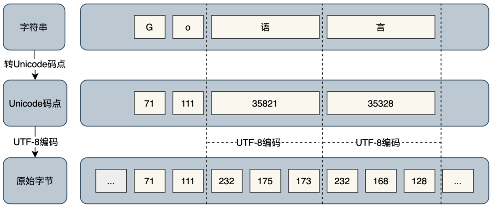

# Go 语言学习笔记

## go语言25个关键字

- `var`和`const` ：变量和常量的声明，`var` varName type  或者 varName : = value
- `package` and `import`： 导入
- `func`： 用于定义函数和方法
- `return` ：用于从函数返回
- `defer` someCode ：在函数退出之前执行
- `go` : 用于并行
- `select` 用于选择不同类型的通讯
- `interface` 用于定义接口
- `struct`用于定义抽象数据类型
- `break`、`case`、`continue`、`for`、`fallthrough`、`else`、`if`、`switch`、`goto`、`default` 流程控制
- `chan`用于channel通讯
- `type`用于声明自定义类型
- `map`用于声明map类型数据
- `range`用于读取slice、map、channel数据

## go 中数组 `array`、切片 `slice`

数组是一个由固定长度的特定类型元素组成的序列，一个数组可以由零个或多个元素组成。**数组的长度是数组类型**的一个部分，**不同长度或不同类型的数据组成的数组都是不同的类型**，因此在**Go语言中很少直接使用数组**（不同长度的数组因为类型不同无法直接赋值）。和数组对应的类型是切片，切片是可以动态增长和收缩的序列，切片的功能也更加灵活。

### 数组定义

```go
var a [3]int                    // 定义一个长度为3的int类型数组, 元素全部为0
var b = [...]int{1, 2, 3}       // 定义一个长度为3的int类型数组, 元素为 1, 2, 3
var c = [...]int{2: 3, 1: 2}    // 定义一个长度为3的int类型数组, 元素为 0, 2, 3
var d = [...]int{1, 2, 4: 5, 6} // 定义一个长度为6的int类型数组, 元素为 1, 2, 0, 0, 5, 6
// ...省略号出现在数组长度的位置，表明数组长度由初始化元素的个数决定
```

数组变量被赋值或者被传递的时候，实际上会复制整个数组，如果数组较大的话，数组的赋值也会有较大的开销。**为了避免复制数组带来的开销，可以传递一个指向数组的指针，但是数组指针并不是数组。**

内置函数len可以用于计算数组的长度，cap函数可以用于计算数组的容量。

### 数组遍历

```go
for i := range a {
	fmt.Printf("a[%d]: %d\n", i, a[i])
}
for i, v := range b {
    fmt.Printf("b[%d]: %d\n", i, v)
}
for i := 0; i < len(c); i++ {
    fmt.Printf("c[%d]: %d\n", i, c[i])
}
var times [5][0]int
for range times {			// 忽略迭代时的下标
    fmt.Println("hello")
}
```

用`for range`方式迭代的性能可能会更好一些，因为这种迭代可以保证不会出现数组越界的情形，每轮迭代对数组元素的访问时可以省去对下标越界的判断。

可以用`fmt.Printf`函数提供的`%T`或`%#v`谓词语法来打印数组的类型和详细信息：

```go
fmt.Printf("b: %T\n", b)  // b: [3]int
fmt.Printf("b: %#v\n", b) // b: [3]int{1, 2, 3}
```

切片表示拥有相同类型元素的可变长度的序列。切片有三个属性：指针、长度和容量，长度是切片中元素的个数，容量是从切片起始元素到底层数组最后一个元素间元素个数，具体见《GO语言程序设计》4.2节。容量必须大于等于长度。len可以用于计算数组的长度，cap函数可以用于计算数组的容量。切片的底层实现还是数组。

**切片无法做比较，数组可以。**

### 切片定义

```go
slice := make([]int, 5)    	// 通过 make() 函数创建切片，长度和容量为 5
slice := make([]int, 3, 5)  // 创建切片，其长度为 3，容量为 5
myStr := []string{"Jack", "Mark", "Nick"}  // 通过字面量创建切片
myStr := []string{99: ""}   // 通过字面量创建切片，长度和容量为 100
newNum := slice[1:3]    	// 通过切片创建新的切片，原则是 "左含右不含"
```

> **提示**：尽可能指定容器容量，以便为容器预先分配内存。这将在后续添加元素时减少通过复制来调整容器大小。

### 切片扩容

Golang 内置的 append() 函数可以按需增加切片的容量，会返回一个包含修改结果的新切片。函数 append() 总是会增加新切片的长度，而容量有可能会改变，也可能不会改变，这取决于被操作的切片的可用容量。

函数 append() 会智能地处理底层数组的容量增长。在切片的容量小于 1000 个元素时，总是会成倍地增加容量。一旦元素个数超过 1000，容量的增长因子会设为 1.25，也就是会每次增加 25%的容量（因子并非固定，可能随着Go语言版本而改变）。

### 将一个切片追加到另一个切片

使用 … 运算符，可以将一个切片的所有元素追加到另一个切片里：

```go
// 创建两个切片，并分别用两个整数进行初始化
num1 := []int{1, 2}
num2 := []int{3, 4}
// 将两个切片追加在一起，并显示结果
fmt.Printf("%v\n", append(num1, num2...))  // 输出的结果为：[1 2 3 4]
```

### 切片间的拷贝

Golang 内置的 copy() 函数可以将一个切片中的元素拷贝到另一个切片中，其函数声明为：

```swift
func copy(dst, src []Type) int
```

它表示把切片 src 中的元素拷贝到切片 dst 中，返回值为拷贝成功的元素个数。如果 src 比 dst 长，就截断；如果 src 比 dst 短，则只拷贝 src 那部分：

```go
num1 := []int{10, 20, 30}
num2 := make([]int, 5)
count := copy(num2, num1)
fmt.Println(count)		// 3
fmt.Println(num2)		// [10 20 30 0 0]
```

## go中的散列表 `map`

Map 是一种常见的数据结构，通常用于存储无序的键值对集合。

Map 有以下几个基本特点：

- Map 是一个无序的 key/value 集合；
- Map 中所有的 key 都是不同的；
- 通过给定的 key ，可以在常数时间复杂度内查找、更新或删除相应的 value。

想要实现一个性能优异的 Map，需要关注以下三个关键点：

- **哈希算法**
- **处理哈希冲突**
- **扩容策略**

### map声明和初始化

```go
// 空map
my_map := map[string]string{}
// nil map
var my_map map[string]string
// 空map是一个完成了初始化，未存储任何数据，但可以存储数据的map
// nil map 未做任何初始化，不会指向任何数据结构

ages := make(map[string]int)  // make 函数来定义
ages := map[string]int{
    "alice": 21,
    "jack": 18,
}    // 根据初始值来定义
```

> **map类型实际上就是一个指针**

### map中元素的返回值

```go
value := my_map["key"]
value,exists := my_map["key"]
// 第二种不仅返回key对应的值，还根据key是否存在返回一个布尔值赋值给exists变量。所以，当key存在时，value为对应的值，exists为true；当key不存在，value为0(同样是各数据类型所代表的0)，exists为false。
```

### 测试map中元素是否存在

```go
if value,exists := my_map["Perl"];exists {
    println("key exists in map")
}
```

### len()和delete()

len()函数用于获取map中元素的个数，即有多个少key：`len(my_map)`。

使用`delete`来移除某个map元素：`delete ages['alice']`

### 迭代遍历map

```go
for key,value := range my_map {
    println("key:",key," value:",value)
}
```

### 获取map中所有的key

```go
my_map := map[string]int{
    "Java":   11,
    "Perl":   8,
    "Python": 13,
    "Shell":  23,
}

// 保存map中key的slice
// slice类型要和map的key类型一致
keys := make([]string,0,len(my_map))
// 注意上面声明的slice中要限制长度为0，否则声明为长度4、容量4的slice，而这4个元素都是空值，而且后面append()会直接对slice进行一次扩容，导致append()后的slice长度为map长度的2倍，前一半为空，后一般才是map中的key。

// 将map中的key遍历到keys中
for map_key,_ := range my_map {
	keys = append(keys,map_key)
}

```

### 传递map给函数

map是一种指针，所以将map传递给函数，仅仅只是复制这个指针，所以函数内部对map的操作会直接修改外部的map。

### 使用函数作为map的值

map的值可以是任意对象，包括函数、指针、stuct等等。如果将函数作为key映射的值，则可以用于实现一种分支结构。

```go
map_func := map[KEY_TYPE]func() RETURN_TYPE {......}
map_func := make(map[KEY_TYPE]func() RETURN_TYPE)
```

## rune 类型

刚接触 Go 语言时，就听说有一个叫 `rune` 的数据类型，即使查阅过一些资料，对它的理解依旧比较模糊，加之对陌生事物的天然排斥，在之后很长一段时间的编程工作中，我都没有让它出现在我的代码里。

### `rune`类型究竟是什么？

`rune` 类型是 Go 语言的一种特殊数字类型。在 `builtin/builtin.go` 文件中，它的定义：`type rune = int32`；官方对它的解释是：`rune` 是类型 `int32` 的别名，在所有方面都等价于它，用来区分字符值跟整数值。使用单引号定义 ，返回采用 UTF-8 编码的 Unicode 码点。Go 语言通过 `rune` 处理国际化多语言，包括中文。

Go 语言有两种类型声明方式：一种叫类型定义声明，另一种叫类型别名声明。其中，别名的使用在大型项目重构中作用最为明显，它能解决代码升级或迁移过程中可能存在的类型兼容性问题。而**`rune` 跟 `byte` 是 Go 语言中仅有的两个类型别名**，专门用来处理字符。当然，我们也可以通过 `type` 关键字加等号的方式声明更多的类型别名。

### `rune`类型怎么用？

字符串由字符组成，字符的底层由字节组成，而一个字符串在底层的表示是一个字节序列。在 Go 语言中，字符可以被分成两种类型处理：对占 1 个字节的英文类字符，可以使用 `byte`（或者 `unit8` ）；对占 1 ~ 4 个字节的其他字符，可以使用 `rune`（或者 `int32` ），如中文、特殊符号等。例如：

- 统计带中文字符串长度

```go
// 使用内置函数 len() 统计字符串长度
fmt.Println(len("Go语言编程"))  // 输出：14  
```

前面说到，字符串在底层的表示是一个字节序列。其中，英文字符占用 1 字节，中文字符占用 3 字节，所以得到的长度 14 显然是底层占用字节长度，而不是字符串长度，这时，便需要用到 `rune` 类型。

```go
// 转换成 rune 数组后统计字符串长度
fmt.Println(len([]rune("Go语言编程")))  // 输出：6
```

这回对了。很容易，我们解锁了 `rune` 类型的第一个功能，即统计字符串长度。

- 截取带中文字符串

如果想要截取字符串中 ”Go语言“ 这一段，考虑到底层是一个字节序列，或者说是一个数组，通常情况下，我们会这样：

```go
s := "Go语言编程"
// 8=2*1+2*3
fmt.Println(s[0:8])  // 输出：Go语言
```

结果符合预期。但是，按照字节的方式进行截取，必须预先计算出需要截取字符串的字节数，如果字节数计算错误，就会显示乱码，比如这样：

```go
s := "Go语言编程"
fmt.Println(s[0:7]) // 输出：Go语�
```

此外，如果截取的字符串较长，那通过字节的方式进行截取显然不是一个高效准确的办法。那有没有不用计算字节数，简单又不会出现乱码的方法呢？不妨试试这样：

```go
s := "Go语言编程"
// 转成 rune 数组，需要几个字符，取几个字符
fmt.Println(string([]rune(s)[:4])) // 输出：Go语言    
```

到这里，我们解锁了 `rune` 类型的第二个功能，即截取字符串。

### 为什么 `rune` 类型可以做到？

通过上面的示例，我们发现似乎在处理带中文的字符串时，都需要用到 `rune` 类型，这究竟是为什么呢？除了使用 `rune` 类型，还有其他方法吗？

在深入思考之前，我们需要首先弄清楚 `string` 、`byte`、`rune` 三者间的关系。

字符串在底层的表示是由单个字节组成的一个不可修改的字节序列，字节使用 UTF-8[1] 编码标识 Unicode[2] 文本。Unicode 文本意味着 `.go` 文件内可以包含世界上的任意语言或字符，该文件在任意系统上打开都不会乱码。UTF-8 是 Unicode 的一种实现方式，是一种针对 Unicode 可变长度的字符编码，它定义了字符串具体以何种方式存储在内存中。UFT-8 使用 1 ~ 4 为每个字符编码。

Go 语言把字符分 `byte` 和 `rune` 两种类型处理。`byte` 是类型 `unit8` 的别名，用于存放占 1 字节的 ASCII 字符，如英文字符，返回的是字符原始字节。`rune` 是类型 `int32` 的别名，用于存放多字节字符，如占 3 字节的中文字符，返回的是字符 Unicode 码点值。如下图所示：

```go
s := "Go语言编程"
// byte
fmt.Println([]byte(s)) // 输出：[71 111 232 175 173 232 168 128 231 188 150 231 168 139]
// rune
fmt.Println([]rune(s)) // 输出：[71 111 35821 35328 32534 31243]
```

它们的对应关系如下图：

### 小结

在我看来，`rune` 类型只是一种名称叫法，表示用来处理长度大于 1 字节（ 8 位）、不超过 4 字节（ 32 位）的字符类型。但万变不离其宗，我们使用函数时，无论传入参数的是原始字符串还是 `rune`，最终都是对字节进行处理。

## go中的类型转换 

作为强类型语言，Go不会对数据进行隐式的类型转换，只能手动去执行转换操作。

### 简单的转换操作  

低精度转换为高精度时是安全的，高精度的值转换为低精度时会丢失精度。

```go
// 浮点数转换为int类型
a := 5.0
b := int(a)
```

### 常用数据类型转换 strconv

strconv包提供了字符串与简单数据类型之间的类型转换功能。

- 字符串转int：Atoi()
- int转字符串: Itoa()
- ParseTP类函数将string转换为TP类型：ParseBool()、ParseFloat()、ParseInt()、ParseUint()。因为string转其它类型可能会失败，所以这些函数都有第二个返回值表示是否转换成功；
- FormatTP类函数将其它类型转string：FormatBool()、FormatFloat()、FormatInt()、FormatUint()；
- AppendTP类函数用于将TP转换成字符串后append到一个slice中：AppendBool()、AppendFloat()、AppendInt()、AppendUint()；
- ParseFloat()只能返回float64类型的浮点数；
- ParseInt()和ParseUint()有3个参数：
  - `bitSize`参数  表示转换为什么位的int/uint，有效值为0、8、16、32、64。当bitSize=0的时候，表示转换为int或uint类型。例如bitSize=8表示转换后的值的类型为int8或uint8。
  - `base`参数   表示以什么进制的方式去解析给定的字符串，有效值为0、2-36。当base=0的时候，表示根据string的前缀来判断以什么进制去解析：`0x`开头的以16进制的方式去解析，`0`开头的以8进制方式去解析，其它的以10进制方式解析。
- FormatInt()和FormatUint()有两个参数，第二个参数base指定将第一个参数转换为多少进制，有效值为`2<=base<=36`；
- FormatFloat()参数众多：
  - bitSize表示f的来源类型（32：float32、64：float64），会据此进行舍入。
  - fmt表示格式：'f'（-ddd.dddd）、'b'（-ddddp±ddd，指数为二进制）、'e'（-d.dddde±dd，十进制指数）、'E'（-d.ddddE±dd，十进制指数）、'g'（指数很大时用'e'格式，否则'f'格式）、'G'（指数很大时用'E'格式，否则'f'格式）。
  - prec控制精度（排除指数部分）：对'f'、'e'、'E'，它表示小数点后的数字个数；对'g'、'G'，它控制总的数字个数。如果prec 为-1，则代表使用最少数量的、但又必需的数字来表示f。

