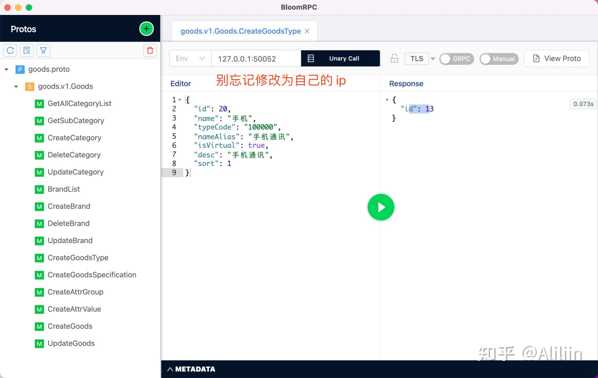

# Go-kratos 框架微服务商城实战

## 用户服务(一)

> 推荐看一下Kratos 官方文档 更加流畅观看此文章，本机器这里已经安装好了`kratos、proto、wire、make` 等所需的命令工具

### 准备工作

#### 初始化项目目录

进入自己电脑中存放 Go 项目的目录，

新建 `kratos-shop/service` 目录并进入到新建的目录中，

执行 `kratos new user` 命令并进入 `user` 目录，

执行命令 `kratos proto add api/user/v1/user.proto` ，这时你在 `kratos-shop/service/user/api/user/v1` 目录下会看到新的 `user.proto` 文件已经创建好了，

接下来执行 `kratos proto server api/user/v1/user.proto -t internal/service` 命令生成对应的 `service` 文件。

删除不需要的 proto 文件 `rm -rf api/helloworld/`，

删除不需要的 service 文件 `rm internal/service/greeter.go`

完整的命令代码如下

```text
mkdir  -p kratos-shop/service
cd kratos-shop/service

kratos new user
cd user

kratos proto add api/user/v1/user.proto

kratos proto server api/user/v1/user.proto -t internal/service

rm -rf api/helloworld/

rm internal/service/greeter.go
```

#### 修改 `user.proto` 文件，内容如下：

> proto 基本的语法请自行学习，目前这里只提供了一个创建用户的 rpc 接口，后续会逐步添加其他 rpc 接口

```text
syntax = "proto3";
package user.v1;
option go_package = "user/api/user/v1;v1";

service User{
  rpc CreateUser(CreateUserInfo) returns (UserInfoResponse); // 创建用户
}

// 创建用户所需字段
message  CreateUserInfo{
  string nickName = 1;
  string password = 2;
  string mobile = 3;
}

// 返回用户信息
message UserInfoResponse{
  int64 id = 1;
  string password = 2;
  string mobile = 3;
  string nickName = 4;
  int64 birthday = 5;
  string gender = 6;
  int32 role = 7;
}
```

#### 生成 `user.proto` 定义的接口信息

进入到 `service/user` 目录下,执行 `make api` 命令，

这时可以看到 `user/api/user/v1/` 目录下多出了 proto 创建的文件

```text
cd user

make api 

# 目录结构如下：
├── api
│   └── user
│       └── v1
│           ├── user.pb.go
│           ├── user.proto
│           └── user_grpc.pb.go
```

### 修改配置文件

#### 修改 `user/configs/config.yaml` 文件，代码如下：

> 具体链接 mysql、redis 的参数填写自己本机的，本项目用到的是 gorm 。trace 是以后要用到的链路追踪的参数，先定义了。

```text
server:
  http:
    addr: 0.0.0.0:8000
    timeout: 1s
  grpc:
    addr: 0.0.0.0:50051
    timeout: 1s
data:
  database:
    driver: mysql
    source: root:root@tcp(127.0.0.1:3306)/shop_user?charset=utf8mb4&parseTime=True&loc=Local
  redis:
    addr: 127.0.0.1:6379
    dial_timeout: 1s
    read_timeout: 0.2s
    write_timeout: 0.2s
trace:
  endpoint: http://127.0.0.1:14268/api/traces
```

#### 新建 `user/configs/registry.yaml` 文件，引入consul 服务，代码如下：

```text
# 这里引入了 consul 的服务注册与发现，先把配置加入进去
consul:
    address: 127.0.0.1:8500
    scheme: http
```

#### 修改 `user/internal/conf/conf.proto` 配置文件

```text
# 文件底部新增 consul 和 trace 的配置信息
message Trace {
  string endpoint = 1;
}

message Registry {
  message Consul {
    string address = 1;
    string scheme = 2;
  }
  Consul consul = 1;
}
```

#### 新生成 `conf.pb.go` 文件，执行 `make config`

```bash
# `service/user` 目录下,执行命令
make config
```

### 安装 consul 服务工具

```bash
# 这里使用的是 docker 工具进行创建的
docker run -d -p 8500:8500 -p 8300:8300 -p 8301:8301 -p 8302:8302 -p 8600:8600/udp consul consul agent -dev -client=0.0.0.0

# 浏览器访问 http://127.0.0.1:8500/ui/dc1/services 测试是否安装成功
```

### 修改服务代码

#### 修改 `user/internal/data/` 目录下的文件

修改 `greeter.go` 为 `user.go `添加如下内容：

```go
package data

import (
    "github.com/go-kratos/kratos/v2/log"
    "github.com/go-redis/redis/extra/redisotel"
    "github.com/go-redis/redis/v8"
    "github.com/google/wire"
    "gorm.io/driver/mysql"
    "gorm.io/gorm"
    "gorm.io/gorm/logger"
    "gorm.io/gorm/schema"
    slog "log"
    "os"
    "time"
    "user/internal/conf"
)

// ProviderSet is data providers.
var ProviderSet = wire.NewSet(NewData, NewDB, NewRedis, NewUserRepo)

type Data struct {
    db  *gorm.DB
    rdb *redis.Client
}

// NewData .
func NewData(c *conf.Data, logger log.Logger, db *gorm.DB, rdb *redis.Client) (*Data, func(), error) {
    cleanup := func() {
        log.NewHelper(logger).Info("closing the data resources")
    }
    return &Data{db: db, rdb: rdb}, cleanup, nil
}

// NewDB .
func NewDB(c *conf.Data) *gorm.DB {
    // 终端打印输入 sql 执行记录
    newLogger := logger.New(
        slog.New(os.Stdout, "\r\n", slog.LstdFlags), // io writer
        logger.Config{
            SlowThreshold: time.Second, // 慢查询 SQL 阈值
            Colorful:      true,        // 禁用彩色打印
            //IgnoreRecordNotFoundError: false,
            LogLevel: logger.Info, // Log lever
        },
    )

    db, err := gorm.Open(mysql.Open(c.Database.Source), &gorm.Config{
        Logger:                                   newLogger,
        DisableForeignKeyConstraintWhenMigrating: true,
        NamingStrategy:                           schema.NamingStrategy{
            //SingularTable: true, // 表名是否加 s
        },
    })

    if err != nil {
        log.Errorf("failed opening connection to sqlite: %v", err)
        panic("failed to connect database")
    }

    return db
}

func NewRedis(c *conf.Data) *redis.Client {
    rdb := redis.NewClient(&redis.Options{
        Addr:         c.Redis.Addr,
        Password:     c.Redis.Password,
        DB:           int(c.Redis.Db),
        DialTimeout:  c.Redis.DialTimeout.AsDuration(),
        WriteTimeout: c.Redis.WriteTimeout.AsDuration(),
        ReadTimeout:  c.Redis.ReadTimeout.AsDuration(),
    })
    rdb.AddHook(redisotel.TracingHook{})
    if err := rdb.Close(); err != nil {
        log.Error(err)
    }
    return rdb
}
```

这里的 wire 概念如果不熟悉的话，请参看Wire 依赖注入

#### 修改 `user/internal/service/` 目录下的文件

修改或者删除 `greeter.go` 为 `user.go`, 添加代码如下：

```text
package service

import (
    "context"
    "github.com/go-kratos/kratos/v2/log"
    v1 "user/api/user/v1"
    "user/internal/biz"
)

type UserService struct {
    v1.UnimplementedUserServer

    uc  *biz.UserUsecase
    log *log.Helper
}

// NewUserService new a greeter service.
func NewUserService(uc *biz.UserUsecase, logger log.Logger) *UserService {
    return &UserService{uc: uc, log: log.NewHelper(logger)}
}

// CreateUser create a user
func (u *UserService) CreateUser(ctx context.Context, req *v1.CreateUserInfo) (*v1.UserInfoResponse, error) {
    user, err := u.uc.Create(ctx, &biz.User{
        Mobile:   req.Mobile,
        Password: req.Password,
        NickName: req.NickName,
    })
    if err != nil {
        return nil, err
    }

    userInfoRsp := v1.UserInfoResponse{
        Id:       user.ID,
        Mobile:   user.Mobile,
        Password: user.Password,
        NickName: user.NickName,
        Gender:   user.Gender,
        Role:     int32(user.Role),
        Birthday: user.Birthday,
    }

    return &userInfoRsp, nil
}
```

修改 `service.go` 文件， 代码如下：

```text
package service

import "github.com/google/wire"

// ProviderSet is service providers.
var ProviderSet = wire.NewSet(NewUserService)
```

修改或删除 `user/internal/biz/greeter.go` 为 `user.go `添加如下内容：

```text
package biz

import (
    "context"
    "github.com/go-kratos/kratos/v2/log"
)

// 定义返回数据结构体
type User struct {
    ID       int64
    Mobile   string
    Password string
    NickName string
    Birthday int64
    Gender   string
    Role     int
}

type UserRepo interface {
    CreateUser(context.Context, *User) (*User, error)
}

type UserUsecase struct {
    repo UserRepo
    log  *log.Helper
}

func NewUserUsecase(repo UserRepo, logger log.Logger) *UserUsecase {
    return &UserUsecase{repo: repo, log: log.NewHelper(logger)}
}

func (uc *UserUsecase) Create(ctx context.Context, u *User) (*User, error) {
    return uc.repo.CreateUser(ctx, u)
}
```

修改 `user/internal/biz/biz.go` 文件，内容如下：

```text
package biz

import "github.com/google/wire"

// ProviderSet is biz providers.
var ProviderSet = wire.NewSet(NewUserUsecase)
```

修改或删除 `user/internal/data/greeter.go` 为 `user.go `添加如下内容：

```text
package data

import (
    "context"
    "crypto/sha512"
    "fmt"
    "github.com/anaskhan96/go-password-encoder"
    "github.com/go-kratos/kratos/v2/log"
    "google.golang.org/grpc/codes"
    "google.golang.org/grpc/status"
    "gorm.io/gorm"
    "time"
    "user/internal/biz"
)
// 定义数据表结构体
type User struct {
    ID          int64      `gorm:"primarykey"`
    Mobile      string     `gorm:"index:idx_mobile;unique;type:varchar(11) comment '手机号码，用户唯一标识';not null"`
    Password    string     `gorm:"type:varchar(100);not null "` // 用户密码的保存需要注意是否加密
    NickName    string     `gorm:"type:varchar(25) comment '用户昵称'"`
    Birthday    *time.Time `gorm:"type:datetime comment '出生日日期'"`
    Gender      string     `gorm:"column:gender;default:male;type:varchar(16) comment 'female:女,male:男'"`
    Role        int        `gorm:"column:role;default:1;type:int comment '1:普通用户，2:管理员'"`
    CreatedAt   time.Time  `gorm:"column:add_time"`
    UpdatedAt   time.Time  `gorm:"column:update_time"`
    DeletedAt   gorm.DeletedAt
    IsDeletedAt bool
}
type userRepo struct {
    data *Data
    log  *log.Helper
}

// NewUserRepo . 这里需要注意，上面 data 文件 wire 注入的是此方法，方法名不要写错了
func NewUserRepo(data *Data, logger log.Logger) biz.UserRepo {
    return &userRepo{
        data: data,
        log:  log.NewHelper(logger),
    }
}

// CreateUser .
func (r *userRepo) CreateUser(ctx context.Context, u *biz.User) (*biz.User, error) {
    var user User
    // 验证是否已经创建
    result := r.data.db.Where(&biz.User{Mobile: u.Mobile}).First(&user)
    if result.RowsAffected == 1 {
        return nil, status.Errorf(codes.AlreadyExists, "用户已存在")
    }

    user.Mobile = u.Mobile
    user.NickName = u.NickName
    user.Password = encrypt(u.Password) // 密码加密
    res := r.data.db.Create(&user)
    if res.Error != nil {
        return nil, status.Errorf(codes.Internal, res.Error.Error())
    }
    return &biz.User{
        ID:       user.ID,
        Mobile:   user.Mobile,
        Password: user.Password,
        NickName: user.NickName,
        Gender:   user.Gender,
        Role:     user.Role,
    }, nil
}

// Password encryption
func encrypt(psd string) string {
    options := &password.Options{SaltLen: 16, Iterations: 10000, KeyLen: 32, HashFunction: sha512.New}
    salt, encodedPwd := password.Encode(psd, options)
    return fmt.Sprintf("$pbkdf2-sha512$%s$%s", salt, encodedPwd)
}
```

#### 修改 `user/internal/server/` 目录下的文件

这里用不到 http 服务删除 `http.go` 文件，修改 `grpc.go` 文件内容如下：

```go
 package server

import (
    "github.com/go-kratos/kratos/v2/log"
    "github.com/go-kratos/kratos/v2/middleware/logging"
    "github.com/go-kratos/kratos/v2/middleware/recovery"
    "github.com/go-kratos/kratos/v2/transport/grpc"
    v1 "user/api/user/v1"
    "user/internal/conf"
    "user/internal/service"
)

// NewGRPCServer new a gRPC server.
func NewGRPCServer(c *conf.Server, greeter *service.UserService, logger log.Logger) *grpc.Server {
    var opts = []grpc.ServerOption{
        grpc.Middleware(
            recovery.Recovery(),
            logging.Server(logger),
        ),
    }
    if c.Grpc.Network != "" {
        opts = append(opts, grpc.Network(c.Grpc.Network))
    }
    if c.Grpc.Addr != "" {
        opts = append(opts, grpc.Address(c.Grpc.Addr))
    }
    if c.Grpc.Timeout != nil {
        opts = append(opts, grpc.Timeout(c.Grpc.Timeout.AsDuration()))
    }
    srv := grpc.NewServer(opts...)
    v1.RegisterUserServer(srv, greeter)
    return srv
}
```

修改 `server.go` 文件,这里加入了 consul 的服务，内容如下：

```go
package server

import (
    "github.com/go-kratos/kratos/v2/registry"
    "github.com/google/wire"
    "user/internal/conf"

    consul "github.com/go-kratos/kratos/contrib/registry/consul/v2"
    consulAPI "github.com/hashicorp/consul/api"
)

// ProviderSet is server providers.
var ProviderSet = wire.NewSet(NewGRPCServer, NewRegistrar)

// NewRegistrar 引入 consul
func NewRegistrar(conf *conf.Registry) registry.Registrar {
    c := consulAPI.DefaultConfig()
    c.Address = conf.Consul.Address
    c.Scheme = conf.Consul.Scheme

    cli, err := consulAPI.NewClient(c)
    if err != nil {
        panic(err)
    }
    r := consul.New(cli, consul.WithHealthCheck(false))
    return r
}
```

### 修改启动程序

#### 修改 `user/cmd/wire.go`文件

这里注入了consul需要的配置，需要添加进来

```text
func initApp(*conf.Server, *conf.Data, *conf.Registry, log.Logger) (*kratos.App, func(), error) {
    panic(wire.Build(server.ProviderSet, data.ProviderSet, biz.ProviderSet, service.ProviderSet, newApp))
}
```

#### 修改 `user/cmd/user/main.go` 文件

```go
package main

import (
    "flag"
    "os"

    "github.com/go-kratos/kratos/v2"
    "github.com/go-kratos/kratos/v2/config"
    "github.com/go-kratos/kratos/v2/config/file"
    "github.com/go-kratos/kratos/v2/log"
    "github.com/go-kratos/kratos/v2/middleware/tracing"
    "github.com/go-kratos/kratos/v2/registry"
    "github.com/go-kratos/kratos/v2/transport/grpc"
    "user/internal/conf"
)

// go build -ldflags "-X main.Version=x.y.z"
var (
    // Name is the name of the compiled software.
    Name = "shop.users.service"
    // Version is the version of the compiled software.
    Version = "v1"
    // flagconf is the config flag.
    flagconf string

    id, _ = os.Hostname()
)

func init() {
    flag.StringVar(&flagconf, "conf", "../../configs", "config path, eg: -conf config.yaml")
}

func newApp(logger log.Logger, gs *grpc.Server, rr registry.Registrar) *kratos.App {
    return kratos.New(
        kratos.ID(id+"shop.user.service"),
        kratos.Name(Name),
        kratos.Version(Version),
        kratos.Metadata(map[string]string{}),
        kratos.Logger(logger),
        kratos.Server(
            gs,
        ),
        kratos.Registrar(rr), // consul 的引入
    )
}

func main() {
    flag.Parse()
    logger := log.With(log.NewStdLogger(os.Stdout),
        "ts", log.DefaultTimestamp,
        "caller", log.DefaultCaller,
        "service.id", id,
        "service.name", Name,
        "service.version", Version,
        "trace_id", tracing.TraceID(),
        "span_id", tracing.SpanID(),
    )
    c := config.New(
        config.WithSource(
            file.NewSource(flagconf),
        ),
    )
    defer c.Close()

    if err := c.Load(); err != nil {
        panic(err)
    }

    var bc conf.Bootstrap
    if err := c.Scan(&bc); err != nil {
        panic(err)
    }
    // consul 的引入
    var rc conf.Registry 
    if err := c.Scan(&rc); err != nil {
        panic(err)
    }
    app, cleanup, err := initApp(bc.Server, bc.Data, &rc, logger)
    if err != nil {
        panic(err)
    }
    defer cleanup()

    // start and wait for stop signal
    if err := app.Run(); err != nil {
        panic(err)
    }
}
```

#### 修改根目录 `user/makefile` 文件

```text
    在 go generate ./... 下面添加代码

    wire:
        cd cmd/user/ && wire
```

#### 根目录执行 `make wire` 命令

```text
# service/user
make wire
```

### 启动程序

> 别忘记根据 data 里面的 user struct 创建对应的数据库表,这里也可以写一个 gorm 创建表的文件进行创建。

#### 启动程序 kratos run

```text
根目录 service/user 执行命令
    kratos run
```

### 简单测试

由于没写对外访问的 http 服务，这里还没有加入单元测试，所以先创建个文件链接启动过的 grpc 服务简单测试一下。

#### 根目录新建 `user/test/user.go` 文件，添加如下内容：

```go
package main

import (
    "context"
    "fmt"
    "google.golang.org/grpc"
    v1 "user/api/user/v1"
)

var userClient v1.UserClient
var conn *grpc.ClientConn

func main() {
    Init()

    TestCreateUser() // 创建用户

    conn.Close()
}

// Init 初始化 grpc 链接 注意这里链接的 端口
func Init() {
    var err error
    conn, err = grpc.Dial("127.0.0.1:50051", grpc.WithInsecure())
    if err != nil {
        panic("grpc link err" + err.Error())
    }
    userClient = v1.NewUserClient(conn)
}

func TestCreateUser() {

    rsp, err := userClient.CreateUser(context.Background(), &v1.CreateUserInfo{
        Mobile:   fmt.Sprintf("1388888888%d", 1),
        Password: "admin123",
        NickName: fmt.Sprintf("YWWW%d", 1),
    })
    if err != nil {
        panic("grpc 创建用户失败" + err.Error())
    }
    fmt.Println(rsp.Id)
}
```

这里别忘记启动 kratos user 服务之后，再执行 test/user.go 文件，查询执行结果，是否有个ID输出 查询自己的数据库，看看是否有插入的数据了。

源码已经上传到 GitHub 上了，下一篇开始逐步完善用户服务的接口。

### Reference

Go工程化-依赖注入 [https://go-kratos.dev/blog/go-project-wire](https://link.zhihu.com/?target=https%3A//go-kratos.dev/blog/go-project-wire)

Project Layout 最佳实践 [https://go-kratos.dev/blog/go-layout-operation-process](https://link.zhihu.com/?target=https%3A//go-kratos.dev/blog/go-layout-operation-process)

### 引用链接

`[1]` Kratos 官方文档: *[https://go-kratos.dev/docs/getting-started/start](https://link.zhihu.com/?target=https%3A//go-kratos.dev/docs/getting-started/start)*
`[2]` consul: *[https://www.consul.io/](https://link.zhihu.com/?target=https%3A//www.consul.io/)*
`[3]` Wire 依赖注入: *[https://go-kratos.dev/docs/guide/wire](https://link.zhihu.com/?target=https%3A//go-kratos.dev/docs/guide/wire)*

*`[4]` GitHub: [https://github.com/aliliin/krat](https://link.zhihu.com/?target=https%3A//github.com/aliliin/kratos-shop)*

## 用户服务 (二)

> 这篇主要编写单元测试。文章写的不清晰的地方可通过 GitHub源码 查看, 也感谢您指出不足之处。
>
> 注：横排 … 为代码省略，为了保持文章的篇幅简洁，我会将一些不必要的代码使用横排的 . 来代替，如果你在复制本文代码块的时候，切记不要将 . 也一同复制进去。

### 准备工作

本文主要使用 Ginkgo 、gomock 、Gomega 工具来实现单元测试，之前不了解的同学，可以先熟悉一下相关文档。

#### Ginkgo 包的引入和简单介绍

```text
$ go get github.com/onsi/ginkgo/v2/ginkgo
$ go get github.com/onsi/gomega
```

第一条命令是获取 ginkgo 并且安装 ginkgo 可执行文件到 `$GOPATH/bin` –- 你需要在你电脑中把 $GOPATH 配置上，并配置上它。第二条命令安装了全部 gomega 库。这样可以导入 gomega 包到你的测试代码中：

```text
import "github.com/onsi/gomega"
import "github.com/onsi/ginkgo"
```

Ginkgo 与 Go 现有的测试基础设施挂钩，可以使用 go test 运行 Ginkgo 套件。这同时意味着 Ginkgo 测试可以和传统 Go testing 测试一起使用。go test 和 ginkgo 都会运行你套件内的所有测试。

#### 使用 Dockertest

使用 Dockertest 来完成咱们服务的 Golang 链接 DB 的集成测试。Dockertest 库提供了简单易用的命令，用于启动 Docker 容器并将其用于测试。简单理解 Dockertest 工具就是 使用 docker 创建一个容器并在测试运行结束后停止并删除。具体信息请查看 Dockertest 官方介绍

安装 Dockertest

```text
go get -u github.com/ory/dockertest/v3
```

编写 Dockertest 配置代码并将其用于测试，进入 `service/user/internal/data/` 目录新建 docker_mysql.go 文件，编写代码如下：

```go
package data

import (
 "database/sql"
 "fmt"
 "github.com/ory/dockertest/v3" // 注意这个包的引入
 "log"
 "time"
)

func DockerMysql(img, version string) (string, func()) {
 return innerDockerMysql(img, version)
}

// 初始化 Docker mysql 容器
func innerDockerMysql(img, version string) (string, func()) {
 // uses a sensible default on windows (tcp/http) and linux/osx (socket)
 pool, err := dockertest.NewPool("")
 pool.MaxWait = time.Minute * 2
 if err != nil {
  log.Fatalf("Could not connect to docker: %s", err)
 }
 
 // pulls an image, creates a container based on it and runs it
 resource, err := pool.Run(img, version, []string{"MYSQL_ROOT_PASSWORD=secret", "MYSQL_ROOT_HOST=%"})
 if err != nil {
  log.Fatalf("Could not start resource: %s", err)
 }

 conStr := fmt.Sprintf("root:secret@(localhost:%s)/mysql?parseTime=true", resource.GetPort("3306/tcp"))

 if err := pool.Retry(func() error {
  var err error
  db, err := sql.Open("mysql", conStr)
  if err != nil {
   return err
  }
  return db.Ping()
 }); err != nil {
  log.Fatalf("Could not connect to docker: %s", err)
 }

 // 回调函数关闭容器
 return conStr, func() {
  if err = pool.Purge(resource); err != nil {
   log.Fatalf("Could not purge resource: %s", err)
  }
 }
}
```

使用 Ginkgo 编写链接 Dockertest 的测试代码，还是此目录下，新建 data_suite_test.go 文件，编写代码如下：代码中有详细的注释，这里就不过多解释了。

```go
package data_test

import (
 "context"
 "github.com/pkg/errors"
 "gorm.io/gorm"
 "testing"
 "user/internal/conf"
 "user/internal/data"

 . "github.com/onsi/ginkgo"
 . "github.com/onsi/gomega"
)

// 测试 data 方法
func TestData(t *testing.T) {
 //  Ginkgo 测试通过调用 Fail(description string) 功能来表示失败
 // 使用 RegisterFailHandler 将此函数传递给 Gomega 。这是 Ginkgo 和 Gomega 之间的唯一连接点
 RegisterFailHandler(Fail)
 // 通知 Ginkgo 启动测试套件。如果您的任何 specs 失败，Ginkgo 将自动使 testing.T 失败。
 RunSpecs(t, "test biz data ")
}

var cleaner func()      // 定义删除 mysql 容器的回调函数
var Db *data.Data       // 用于测试的 data
var ctx context.Context // 上下文

// initialize  AutoMigrate gorm 自动建表的方法
func initialize(db *gorm.DB) error {
 err := db.AutoMigrate(
  &data.User{},
 )
 return errors.WithStack(err)
}

// ginkgo 使用 BeforeEach 为您的 Specs 设置状态
var _ = BeforeSuite(func() {
 // 执行测试数据库操作之前，链接之前 docker 容器创建的 mysql
 //con, f := data.DockerMysql("mysql", "latest")
 con, f := data.DockerMysql("mariadb", "latest")
 cleaner = f // 测试完成，关闭容器的回调方法
 config := &conf.Data{Database: &conf.Data_Database{Driver: "mysql", Source: con}}
 db := data.NewDB(config)
 mySQLDb, _, err := data.NewData(config, nil, db, nil)
 if err != nil {
  return
 }
 if err != nil {
  return
 }
 Db = mySQLDb
 err = initialize(db)
 if err != nil {
  return
 }
 Expect(err).NotTo(HaveOccurred())
})

// 测试结束后 通过回调函数，关闭并删除 docker 创建的容器
var _ = AfterSuite(func() {
 cleaner()
})
```

测试模拟数据库连接,还是此目录下运行 `go test` 命令，得到如下结果：


> 注：这里可以看到虽然 0 个Passed，但同时也是 0 个 Failed，这是因为咱们这里还没有进行测试，只是验证一下数据库是否连接成功，并未执行 CURD 之类的操作。这里运行可能比较慢，因为它会从docker hub 拉取 mysql 的镜像，本文使用的是 mariadb 的镜像，且我本机已经提前下载好了 mariadb:latest 镜像，如果你的电脑是苹果的M1处理器推荐你用 mariadb。

### 编写单元测试

漫长的准备工作终于完成了，接下来来正式编写单元测试的代码吧

#### 编写 data 层的测试代码

还是data目录下新建 user_test.go 文件，编写内容如下：

```go
package data_test

import (
 . "github.com/onsi/ginkgo"
 . "github.com/onsi/gomega"
 "user/internal/biz"
 "user/internal/data"
)

var _ = Describe("User", func() {
 var ro biz.UserRepo
 var uD *biz.User
 BeforeEach(func() {
  // 这里的 Db 是 data_suite_test.go 文件里面定义的
  ro = data.NewUserRepo(Db, nil)
  // 这里你可以引入外部组装好的数据
  uD = &biz.User{
   ID:       1,
   Mobile:   "13803881388",
   Password: "admin123456",
   NickName: "aliliin",
   Role:     1,
   Birthday: 693629981,
  }
 })

 // 设置 It 块来添加单个规格
 It("CreateUser", func() {
  u, err := ro.CreateUser(ctx, uD)
  Ω(err).ShouldNot(HaveOccurred())
  // 组装的数据 mobile 为 13803881388
  Ω(u.Mobile).Should(Equal("13803881388")) // 手机号应该为创建的时候写入的手机号
 })

})
```

> Ω 就是 gomega 包的语法，It 是 ginkgo 包的用法。

还是此目录下运行 `go test` 命令，得到如下结果：


> 此时可以看到共有 1 个Passed 通过。提示：类似 packets.go:37 : unexpected EOF 错误，是因为 docker 模拟数据库链接导致的。

#### 引入 gomock 包，mock 对象模拟依赖项

> 具体的使用方法可以参考这篇 gomock 的使用文章

```text
// gomock 主要包含两个部分：gomock 库和辅助代码生成工具 mockgen
go get github.com/golang/mock  
go get github.com/golang/mock/gomock
```

#### 编写生成 mock 文件方法

修改 `user/internal/biz/user.go` 文件

```go
package biz

...


// 注意这一行新增的 mock 数据的命令
//go:generate mockgen -destination=../mocks/mrepo/user.go -package=mrepo . UserRepo
type UserRepo interface {
  CreateUser(context.Context, *User) (*User, error)
}

...
```

进入 biz 目录执行命令

```text
mockgen -destination=../mocks/mrepo/user.go -package=mrepo . UserRepo
```

> 这里是用 gomock 提供的 mockgen 工具生成要 mock 的接口的实现,在生成 mock 代码的时候，我们用到了 mockgen 工具，这个工具是 gomock 提供的用来为要mock的接口生成实现的。它可以根据给定的接口，来自动生成代码。

执行完之后，你会看到多出来 `service/user/internal/mocks/mrepo/user.go` 文件

#### 编写 biz 层的测试方法

biz层目录下，新增 `biz_suite_test.go` 文件，添加内容如下：

```go
package biz_test

import (
 "context"
 "github.com/golang/mock/gomock"
 . "github.com/onsi/ginkgo"
 . "github.com/onsi/gomega"
 "testing"
)

func TestBiz(t *testing.T) {
 RegisterFailHandler(Fail)
 RunSpecs(t, "biz user test")
}

var ctl *gomock.Controller
var cleaner func()
var ctx context.Context

var _ = BeforeEach(func() {
 ctl = gomock.NewController(GinkgoT())
 cleaner = ctl.Finish
 ctx = context.Background()
})
var _ = AfterEach(func() {
 // remove any mocks
 cleaner()
})
```

还是biz层目录下，新增 `user_test.go` 文件，添加内容如下：

```go
package biz_test

import (
 "github.com/golang/mock/gomock"
 . "github.com/onsi/ginkgo"
 . "github.com/onsi/gomega"
 "user/internal/biz"
 "user/internal/mocks/mrepo"
)

var _ = Describe("UserUsecase", func() {
 var userCase *biz.UserUsecase
 var mUserRepo *mrepo.MockUserRepo

 BeforeEach(func() {
  mUserRepo = mrepo.NewMockUserRepo(ctl)
  userCase = biz.NewUserUsecase(mUserRepo, nil)
 })

 It("Create", func() {
  info := &biz.User{
   ID:       1,
   Mobile:   "13803881388",
   Password: "admin123456",
   NickName: "aliliin",
   Role:     1,
   Birthday: 693629981,
  }
  mUserRepo.EXPECT().CreateUser(ctx, gomock.Any()).Return(info, nil)
  l, err := userCase.Create(ctx, info)
  Ω(err).ShouldNot(HaveOccurred())
  Ω(err).ToNot(HaveOccurred())
  Ω(l.ID).To(Equal(int64(1)))
  Ω(l.Mobile).To(Equal("13803881388"))
 })

})
```

### 验证单元测试

还是 biz 层目录下运行 `go test` 命令，得到如下结果：


### 结束语

到这一步 data 层测试 sql 语句的方法，biz 测试基本逻辑的方法已经编写完成并通过了测试了，service 层的单元测试大同小异，这里就不写了。下一篇写 http api 服务和今天写的用户服务进行对接。

### 参考

[1] GitHub源码: [https://github.com/aliliin/kratos-shop/tree/main/service/user](https://link.zhihu.com/?target=https%3A//github.com/aliliin/kratos-shop/tree/main/service/user)

[2] Ginkgo: [https://onsi.github.io/ginkgo/](https://link.zhihu.com/?target=https%3A//onsi.github.io/ginkgo/)

[3] gomock: [https://github.com/golang/mock/](https://link.zhihu.com/?target=https%3A//github.com/golang/mock/)

[4] Gomega: [https://onsi.github.io/gomega/](https://link.zhihu.com/?target=https%3A//onsi.github.io/gomega/)

[5] Dockertest 官方介绍: [https://github.com/ory/dockertest](https://link.zhihu.com/?target=https%3A//github.com/ory/dockertest)

[6] gomock 的使用文章: [https://geektutu.com/post/quick-gomock.html](https://link.zhihu.com/?target=https%3A//geektutu.com/post/quick-gomock.html)

[7] Kratos 官方文档: [https://go-kratos.dev/docs/](https://link.zhihu.com/?target=https%3A//go-kratos.dev/docs/)

## 用户服务 (三)

这篇主要编写第一篇写的用户服务的 rpc 接口。文章写的不清晰的地方可通过 GitHub源码 查看, 也感谢您指出不足之处。

> 注：横排 … 为代码省略，为了保持文章的篇幅简洁，我会将一些不必要的代码使用横排的 . 来代替，如果你在复制本文代码块的时候，切记不要将 . 也一同复制进去。

### 新增 RPC 接口

> 注：这里的目录指的是 `kratos-shop/service/user/api/user/v1/` , 根目录指代的是 `user` 目录

#### 编辑 `user.proto` 文件

```go
...


service User{
  rpc CreateUser(CreateUserInfo) returns (UserInfoResponse){}; // 创建用户
  rpc GetUserList(PageInfo) returns (UserListResponse){}; // 用户列表
  rpc GetUserByMobile(MobileRequest) returns (UserInfoResponse){}; // 通过 mobile 查询用户
  rpc GetUserById(IdRequest) returns (UserInfoResponse){}; // 通过 Id 查询用户
  rpc UpdateUser(UpdateUserInfo) returns (google.protobuf.Empty){}; // 更新用户
  rpc CheckPassword(PasswordCheckInfo) returns (CheckResponse){}; // 验证用户密码
}

...

// 用户列表
message UserListResponse{
  int32 total = 1;
  repeated UserInfoResponse data = 2;
}

// 分页
message PageInfo{
  uint32 pn = 1;
  uint32 pSize = 2;
}

message MobileRequest{
  string mobile = 1;
}

message IdRequest{
  int64 id = 1;
}

message  UpdateUserInfo{
  int64 id = 1;
  string nickName = 2;
  string gender = 3;
  uint64 birthday = 4;
}

message PasswordCheckInfo{
  string password = 1;
  string encryptedPassword = 2;
}

message CheckResponse{
  bool success = 1;
}
```

#### 重新生成 proto ，根目录执行 `make api` 命令

### 实现接口

> 注：这里是一次性把 proto 定义的 rpc 方法全部实现了，并没有分开编写

#### 实现 RPC service 接口

> 注：这里的目录指的是 `kratos-shop/service/user/internal/service`

#### 修改 `user.go` 文件

```go
package service
...

// GetUserList .
func (u *UserService) GetUserList(ctx context.Context, req *v1.PageInfo) (*v1.UserListResponse, error) {
 list, total, err := u.uc.List(ctx, int(req.Pn), int(req.PSize))
 if err != nil {
  return nil, err
 }
 rsp := &v1.UserListResponse{}
 rsp.Total = int32(total)

 for _, user := range list {
  userInfoRsp := UserResponse(user)
  rsp.Data = append(rsp.Data, &userInfoRsp)
 }

 return rsp, nil
}

func UserResponse(user *biz.User) v1.UserInfoResponse {
 userInfoRsp := v1.UserInfoResponse{
  Id:       user.ID,
  Mobile:   user.Mobile,
  Password: user.Password,
  NickName: user.NickName,
  Gender:   user.Gender,
  Role:     int32(user.Role),
 }
 if user.Birthday != nil {
  userInfoRsp.Birthday = uint64(user.Birthday.Unix())
 }
 return userInfoRsp
}

// GetUserByMobile .
func (u *UserService) GetUserByMobile(ctx context.Context, req *v1.MobileRequest) (*v1.UserInfoResponse, error) {
 user, err := u.uc.UserByMobile(ctx, req.Mobile)
 if err != nil {
  return nil, err
 }
 rsp := UserResponse(user)
 return &rsp, nil
}

// UpdateUser .
func (u *UserService) UpdateUser(ctx context.Context, req *v1.UpdateUserInfo) (*emptypb.Empty, error) {
 birthDay := time.Unix(int64(req.Birthday), 0)
 user, err := u.uc.UpdateUser(ctx, &biz.User{
  ID:       req.Id,
  Gender:   req.Gender,
  Birthday: &birthDay,
  NickName: req.NickName,
 })

 if err != nil {
  return nil, err
 }

 if user == false {
  return nil, err
 }

 return &empty.Empty{}, nil
}

// CheckPassword .
func (u *UserService) CheckPassword(ctx context.Context, req *v1.PasswordCheckInfo) (*v1.CheckResponse, error) {
 check, err := u.uc.CheckPassword(ctx, req.Password, req.EncryptedPassword)
 if err != nil {
  return nil, err
 }
 return &v1.CheckResponse{Success: check}, nil
}

// GetUserById .
func (u *UserService) GetUserById(ctx context.Context, req *v1.IdRequest) (*v1.UserInfoResponse, error) {
 user, err := u.uc.UserById(ctx, req.Id)
 if err != nil {
  return nil, err
 }
 rsp := UserResponse(user)
 return &rsp, nil
}
```

### 实现 biz 层方法

> 注：这里的目录指的是 `kratos-shop/service/user/internal/biz` ,实现 service 调用的方法并声明好 repo 接口方法,repo 声明的方法需要在 data 层去实现

#### 修改 `user.go` 文件

```go
package biz

....
//go:generate mockgen -destination=../mocks/mrepo/user.go -package=mrepo . UserRepo
type UserRepo interface {
 CreateUser(context.Context, *User) (*User, error)
 ListUser(ctx context.Context, pageNum, pageSize int) ([]*User, int, error)
 UserByMobile(ctx context.Context, mobile string) (*User, error)
 GetUserById(ctx context.Context, id int64) (*User, error)
 UpdateUser(context.Context, *User) (bool, error)
 CheckPassword(ctx context.Context, password, encryptedPassword string) (bool, error)
}

...


func (uc *UserUsecase) List(ctx context.Context, pageNum, pageSize int) ([]*User, int, error) {
 return uc.repo.ListUser(ctx, pageNum, pageSize)
}

func (uc *UserUsecase) UserByMobile(ctx context.Context, mobile string) (*User, error) {
 return uc.repo.UserByMobile(ctx, mobile)
}

func (uc *UserUsecase) UpdateUser(ctx context.Context, user *User) (bool, error) {
 return uc.repo.UpdateUser(ctx, user)
}

func (uc *UserUsecase) CheckPassword(ctx context.Context, password, encryptedPassword string) (bool, error) {
 return uc.repo.CheckPassword(ctx, password, encryptedPassword)
}

func (uc *UserUsecase) UserById(ctx context.Context, id int64) (*User, error) {
 return uc.repo.GetUserById(ctx, id)
}
```

### 实现 data 层方法

> 注：这里的目录指的是 `kratos-shop/service/user/internal/data` ,实现biz 层定义 repo interface 接口方法，具体去操作数据库

#### 修改 `user.go` 文件

```go
// ListUser .
func (r *userRepo) ListUser(ctx context.Context, pageNum, pageSize int) ([]*biz.User, int, error) {
 var users []User
 result := r.data.db.Find(&users)
 if result.Error != nil {
  return nil, 0, result.Error
 }
 total := int(result.RowsAffected)
 r.data.db.Scopes(paginate(pageNum, pageSize)).Find(&users)
 rv := make([]*biz.User, 0)
 for _, u := range users {
  rv = append(rv, &biz.User{
   ID:       u.ID,
   Mobile:   u.Mobile,
   Password: u.Password,
   NickName: u.NickName,
   Gender:   u.Gender,
   Role:     u.Role,
   Birthday: u.Birthday,
  })
 }
 return rv, total, nil
}

// paginate 分页
func paginate(page, pageSize int) func(db *gorm.DB) *gorm.DB {
 return func(db *gorm.DB) *gorm.DB {
  if page == 0 {
   page = 1
  }

  switch {
  case pageSize > 100:
   pageSize = 100
  case pageSize <= 0:
   pageSize = 10
  }

  offset := (page - 1) * pageSize
  return db.Offset(offset).Limit(pageSize)
 }
}

// UserByMobile .
func (r *userRepo) UserByMobile(ctx context.Context, mobile string) (*biz.User, error) {
 var user User
 result := r.data.db.Where(&User{Mobile: mobile}).First(&user)
 if result.Error != nil {
  return nil, result.Error
 }

 if result.RowsAffected == 0 {
  return nil, status.Errorf(codes.NotFound, "用户不存在")
 }
 re := modelToResponse(user)
 return &re, nil
}

// UpdateUser .
func (r *userRepo) UpdateUser(ctx context.Context, user *biz.User) (bool, error) {
 var userInfo User
 result := r.data.db.Where(&User{ID: user.ID}).First(&userInfo)
 if result.RowsAffected == 0 {
  return false, status.Errorf(codes.NotFound, "用户不存在")
 }

 userInfo.NickName = user.NickName
 userInfo.Birthday = user.Birthday
 userInfo.Gender = user.Gender

 res := r.data.db.Save(&userInfo)
 if res.Error != nil {
  return false, status.Errorf(codes.Internal, res.Error.Error())
 }

 return true, nil
}

// CheckPassword .
func (r *userRepo) CheckPassword(ctx context.Context, psd, encryptedPassword string) (bool, error) {
 options := &password.Options{SaltLen: 16, Iterations: 10000, KeyLen: 32, HashFunction: sha512.New}
 passwordInfo := strings.Split(encryptedPassword, "$")
 check := password.Verify(psd, passwordInfo[2], passwordInfo[3], options)
 return check, nil
}

// GetUserById .
func (r *userRepo) GetUserById(ctx context.Context, Id int64) (*biz.User, error) {
 var user User
 result := r.data.db.Where(&User{ID: Id}).First(&user)
 if result.Error != nil {
  return nil, result.Error
 }

 if result.RowsAffected == 0 {
  return nil, status.Errorf(codes.NotFound, "用户不存在")
 }
 re := modelToResponse(user)
 return &re, nil
}
```

### 编写测试代码

#### 编写 data 层的测试代码

> `service/user/internal/data` 目录

`user_test.go` 文件新增内容：

```go
package data_test

import (
   . "github.com/onsi/ginkgo"
   . "github.com/onsi/gomega"
   "time"
   "user/internal/biz"
   "user/internal/data"
   "user/internal/testdata"
)

var _ = Describe("User", func() {
   var ro biz.UserRepo
   var uD *biz.User
   BeforeEach(func() {
    ro = data.NewUserRepo(Db, nil)
    // 这里你可以不引入外部组装好的数据，可以在这里直接写
    uD = testdata.User()
   })
   // 设置 It 块来添加单个规格
   It("CreateUser", func() {
    u, err := ro.CreateUser(ctx, uD)
    Ω(err).ShouldNot(HaveOccurred())
    // 组装的数据 mobile 为 13509876789
    Ω(u.Mobile).Should(Equal("13509876789")) // 手机号应该为创建的时候写入的手机号
   })
   // 设置 It 块来添加单个规格
   It("ListUser", func() {
    user, total, err := ro.ListUser(ctx, 1, 10)
    Ω(err).ShouldNot(HaveOccurred()) // 获取列表不应该出现错误
    Ω(user).ShouldNot(BeEmpty())     // 结果不应该为空
    Ω(total).Should(Equal(1))        // 总数应该为 1，因为上面只创建了一条
    Ω(len(user)).Should(Equal(1))
    Ω(user[0].Mobile).Should(Equal("13509876789"))
   })

   // 设置 It 块来添加单个规格
   It("UpdateUser", func() {
    birthDay := time.Unix(int64(693646426), 0)
    uD.NickName = "gyl"
    uD.Birthday = &birthDay
    uD.Gender = "female"
    user, err := ro.UpdateUser(ctx, uD)
    Ω(err).ShouldNot(HaveOccurred()) // 更新不应该出现错误
    Ω(user).Should(BeTrue())         // 结果应该为 true
   })

   It("CheckPassword", func() {
    p1 := "admin"
    encryptedPassword := "$pbkdf2-sha512$5p7doUNIS9I5mvhA$b18171ff58b04c02ed70ea4f39bda036029c107294bce83301a02fb53a1bcae0"
    password, err := ro.CheckPassword(ctx, p1, encryptedPassword)
    Ω(err).ShouldNot(HaveOccurred()) // 密码验证通过
    Ω(password).Should(BeTrue())     // 结果应该为true

    encryptedPassword1 := "$pbkdf2-sha512$5p7doUNIS9I5mvhA$b18171ff58b04c02ed70ea4f39"
    password1, err := ro.CheckPassword(ctx, p1, encryptedPassword1)
    if err != nil {
     return
    }
    Ω(err).ShouldNot(HaveOccurred())
    Ω(password1).Should(BeFalse()) // 密码验证不通过
   })
})
```

#### 执行 go test 命令，测试 user_test.go

可以看到测试全部通过。这一篇并么有写 biz 的测试，可以自己完善一下 biz 的测试方法。具体执行测试的方法，可看上一篇。

### 结束语

至此 user 服务的一些接口基本全部写完了，再有关于用户表信息的需求，可以按照此篇进行增加。下一篇先不完善用户地址之类的需求接口了，先去写 HTTP API 端去来调用这个 user 服务，到时候就把整个服务的基本雏形完成了。

## 用户服务 (四)

> 这篇主要编写 HTTP API 端的服务，跟前几篇写的用户服务对接上，主要还是项目的初始化准备工作。写的不清晰的地方可看GitHub源码 , 也感谢您指出不足之处。
> 注：竖排 … 代码省略，为了保持文章的篇幅简洁，我会将一些不必要的代码使用竖排的 . 来代替，你在复制本文代码块的时候，切记不要将 . 也一同复制进去。这里所有 import 引入的包都没有特殊说明，自己写的时候要注意包的引入。

### shop Api 准备工作

### new 一个新的 kratos 项目

在 kratos-shop 目录下新建一个 `kratos new shop` shop 项目

```text
// 整体的项目 目录结构如下
|-- kratos-shop
    |-- service
        |-- user // 原先的用户服务 grpc
    |-- shop //  刚刚通过 kratos new shop 新增的项目代码
```

- 进入新建的 shop 目录下
- 删除目录下的所有文件 `rm -rf api/helloworld`
- 复制 `service/user/api/user/v1/user.proto` 文件到新建的 `shop/api/service/user/v1` 目录下
- 执行命令 `kratos proto add api/shop/v1/user.proto` 创建 api user.proto
- 执行 `kratos proto server api/user/v1/user.proto -t internal/service` 命令生成对应的 service 文件。
- 删除不需要的 service 文件 `rm internal/service/greeter.go`完整执行命令如下：

```bash
cd kratos-shop
kratos new shop
cd shop
rm -rf api/helloworld
rm internal/service/greeter.go 
kratos proto add api/shop/v1/user.proto
kratos proto server api/shop/v1/user.proto -t internal/service
mkdir -p api/service/user/v1
cp ../service/user/api/user/v1/user.proto api/service/user/v1
```

proto 的目录结构如下：

```text
├── api
│   ├── service
│   │   └── user
│   │       └── v1
│   │           └── user.proto
│   └── shop
│       └── v1
│           └── user.proto
```

#### 修改 shop 下的 user.proto

这里提供对外访问的接口，会聚合从不同的服务之间获取数据，接口路由通过 Protobuf IDL 定义对应的 REST API 和 gRPC API，

> 参数校验使用 Validate 中间件，使用 proto-gen-validate 生成
> 在使用 validate 之前首先需要安装 proto-gen-validate。

```protobuf
syntax = "proto3";

package shop.shop.v1;
// 这里可以把 proto 文件下载下来，放到项目的 third_party 目录下
import "google/api/annotations.proto";
import "google/protobuf/empty.proto";
import "validate/validate.proto";

option go_package = "shop/api/shop/v1;v1";
// The Shop service definition.
service Shop {
  rpc Register (RegisterReq) returns (RegisterReply) {
    option (google.api.http) = {
      post: "/api/users/register",
      body: "*",
    };
  }
  rpc Login (LoginReq) returns (RegisterReply) {
    option (google.api.http) = {
      post: "/api/users/login",
      body: "*",
    };
  }
  rpc Captcha (google.protobuf.Empty) returns (CaptchaReply) {
    option (google.api.http) = {
      get: "/api/users/captcha",
    };
  }
  rpc Detail (google.protobuf.Empty) returns (UserDetailResponse) {
    option (google.api.http) = {
      get: "/api/users/detail",
    };
  }
}

// Data returned by registration and login
message RegisterReply {
  int64 id = 1;
  string mobile = 3;
  string username = 4;
  string token = 5;
  int64 expiredAt = 6;
}

message RegisterReq {
  string mobile = 1 [(validate.rules).string.len = 11];
  string username = 2 [(validate.rules).string = {min_len: 3, max_len: 15}];
  string password = 3 [(validate.rules).string = {min_len: 8}];
}

message LoginReq {
  string mobile = 1 [(validate.rules).string.len = 11];
  string password = 2 [(validate.rules).string = {min_len: 8}];
  string captcha = 3 [(validate.rules).string = {min_len: 5,max_len:5}];
  string captchaId = 4  [(validate.rules).string ={min_len: 1}];
}

// user Detail returned
message UserDetailResponse{
  int64 id = 1;
  string mobile = 2;
  string nickName = 3;
  int64 birthday = 4;
  string gender = 5;
  int32 role = 6;
}

message CaptchaReply{
  string captchaId = 1;
  string picPath = 2;
}
```

这里一共定义了4个 rpc 方法，其中三个是需要跟之前写的用户服务交互的，还有个获取图片验证码的接口，自己内部实现。

- shop 根目录执行 `make api` ,生成对应的 `*pb.go` 文件

### 修改配置文件

- 修改 `shop/configs/config.yaml` 文件

> 项目中引入了 consul 配置需要把相关的配置设置好，service 就是 consul 用来服务发现的。这里的 trace 并没有用到呢先在这里定义了，之后会专门拿一篇来说说。auth 是用来 jwt 验证。

```yaml
name: shop.api
server:
  http:
    addr: 0.0.0.0:8097
    timeout: 1s
  grpc:
    addr: 0.0.0.0:9001
    timeout: 1s
data:
  database:
    driver: mysql
    source: root:root@tcp(127.0.0.1:3306)/test
  redis:
    addr: 127.0.0.1:6379
    read_timeout: 0.2s
    write_timeout: 0.2s
trace:
  endpoint: http://127.0.0.1:14268/api/traces
auth:
  jwt_key: hqFr%3ddt32DGlSTOI5cO6@TH#fFwYnP$S
service:
  user:
    endpoint: discovery:///shop.user.service
  goods:
    endpoint: discovery:///shop.goods.service
```

- 新增 `shop/configs/registry.yaml` 文件

```yaml
consul:
  address: 127.0.0.1:8500
  scheme: http
```

- 修改 `internal/conf/conf.proto` 文件：

```protobuf
syntax = "proto3";
package shop.api;

option go_package = "shop/internal/conf;conf";

import "google/protobuf/duration.proto";

message Bootstrap {
  Server server = 1;
  Data data = 2;
  Trace trace = 3; // 链路追踪
  Auth auth = 4; // 认证鉴权
  Service service = 5; // 服务注册与发现
}

message Server {
  message HTTP {
    string network = 1;
    string addr = 2;
    google.protobuf.Duration timeout = 3;
  }
  message GRPC {
    string network = 1;
    string addr = 2;
    google.protobuf.Duration timeout = 3;
  }
  HTTP http = 1;
  GRPC grpc = 2;
}

message Data {
  message Database {
    string driver = 1;
    string source = 2;
  }
  message Redis {
    string network = 1;
    string addr = 2;
    google.protobuf.Duration read_timeout = 3;
    google.protobuf.Duration write_timeout = 4;
  }
  Database database = 1;
  Redis redis = 2;
}

message Service {
  message User { // 用户服务
    string endpoint = 1;
  }
  message Goods { // 商品服务
    string endpoint = 1;
  }
  User user = 1;
  Goods goods = 2;
}

message Trace {
  string endpoint = 1;
}

message Registry {
  message Consul {
    string address = 1;
    string scheme = 2;
  }
  Consul consul = 1;
}

message Auth {
  string jwt_key = 1;
}
```

- 生成新的配置文件

```bash
# shop 根目录执行 
make config
# 生成 shop/internal/conf/conf.pb.go  文件
```

### 修改 HTTP 服务

- 修改 `internal/server/http.go` 文件

> 这里用到的一些 middleware 中间件都是 kratos 官方支持的，jwt、validate、tracing，具体使用方式可参考 kratos的middleware 文档

```go
package server

import (
    "context"
    "github.com/go-kratos/kratos/v2/log"
    "github.com/go-kratos/kratos/v2/middleware/auth/jwt"
    "github.com/go-kratos/kratos/v2/middleware/logging"
    "github.com/go-kratos/kratos/v2/middleware/recovery"
    "github.com/go-kratos/kratos/v2/middleware/selector"
    "github.com/go-kratos/kratos/v2/middleware/validate"
    "github.com/go-kratos/kratos/v2/transport/http"
    jwt2 "github.com/golang-jwt/jwt/v4"
    "github.com/gorilla/handlers"
    v1 "shop/api/shop/v1"
    "shop/internal/conf"
    "shop/internal/service"
)

// NewHTTPServer new an HTTP server.
func NewHTTPServer(c *conf.Server, ac *conf.Auth, s *service.ShopService, logger log.Logger) *http.Server {
    var opts = []http.ServerOption{
        http.Middleware(
            recovery.Recovery(),
            validate.Validator(), // 接口访问的参数校验
            selector.Server( // jwt 验证
                jwt.Server(func(token *jwt2.Token) (interface{}, error) {
                    return []byte(ac.JwtKey), nil
                }, jwt.WithSigningMethod(jwt2.SigningMethodHS256)),
            ).Match(NewWhiteListMatcher()).Build(),
            logging.Server(logger),
        ),
        http.Filter(handlers.CORS( // 浏览器跨域
            handlers.AllowedHeaders([]string{"X-Requested-With", "Content-Type", "Authorization"}),
            handlers.AllowedMethods([]string{"GET", "POST", "PUT", "HEAD", "OPTIONS"}),
            handlers.AllowedOrigins([]string{"*"}),
        )),
    }
    if c.Http.Network != "" {
        opts = append(opts, http.Network(c.Http.Network))
    }
    if c.Http.Addr != "" {
        opts = append(opts, http.Address(c.Http.Addr))
    }
    if c.Http.Timeout != nil {
        opts = append(opts, http.Timeout(c.Http.Timeout.AsDuration()))
    }
    srv := http.NewServer(opts...)
    v1.RegisterShopHTTPServer(srv, s)
    return srv
}

// NewWhiteListMatcher 设置白名单，不需要 token 验证的接口
func NewWhiteListMatcher() selector.MatchFunc {
    whiteList := make(map[string]struct{})
    whiteList["/shop.shop.v1.Shop/Captcha"] = struct{}{}
    whiteList["/shop.shop.v1.Shop/Login"] = struct{}{}
    whiteList["/shop.shop.v1.Shop/Register"] = struct{}{}
    return func(ctx context.Context, operation string) bool {
        if _, ok := whiteList[operation]; ok {
            return false
        }
        return true
    }
}
```

- 修改 `internal/server/server.go`

> 由于此服务只对外提供 http 服务，所以同目录下 grpc 文件可以删除，这样子注册服务的时候也把 grpc 服务去掉。

```go
package server

import (
    "github.com/google/wire"
)

// ProviderSet is server providers.
var ProviderSet = wire.NewSet(NewHTTPServer)
```

### 实现接口

- 修改 `shop/internal/service/service.go` 文件

```go
package service

import (
 "github.com/go-kratos/kratos/v2/log"
 "github.com/google/wire"
 v1 "shop/api/shop/v1"
 "shop/internal/biz"
)

// ProviderSet is service providers.
var ProviderSet = wire.NewSet(NewShopService)

// ShopService is a shop service.
type ShopService struct {
 v1.UnimplementedShopServer

 uc  *biz.UserUsecase
 log *log.Helper
}

// NewShopService new a shop service.
func NewShopService(uc *biz.UserUsecase, logger log.Logger) *ShopService {
 return &ShopService{
  uc:  uc,
  log: log.NewHelper(log.With(logger, "module", "service/shop")),
 }
}
```

- 修改 `shop/internal/service/user.go`

> 这里的 ShopService 的 usecase 还没实现，编辑器可能会有错误提示，先忽略

```go
package service

import (
 "context"
 "google.golang.org/protobuf/types/known/emptypb"

 v1 "shop/api/shop/v1"
)

func (s *ShopService) Register(ctx context.Context, req *v1.RegisterReq) (*v1.RegisterReply, error) {
 return s.uc.CreateUser(ctx, req)
}

func (s *ShopService) Login(ctx context.Context, req *v1.LoginReq) (*v1.RegisterReply, error) {
 return s.uc.PassWordLogin(ctx, req)
}

func (s *ShopService) Captcha(ctx context.Context, r *emptypb.Empty) (*v1.CaptchaReply, error) {
 return s.uc.GetCaptcha(ctx)
}

func (s *ShopService) Detail(ctx context.Context, r *emptypb.Empty) (*v1.UserDetailResponse, error) {
 return s.uc.UserDetailByID(ctx)
}
```

### 新增 jwt 验证的 Middleware

- 新建文件 `internal/pkg/middleware/auth/auth.go`

```go
package auth

import (
 "errors"
 "github.com/golang-jwt/jwt/v4"
)

type CustomClaims struct {
 ID          int64
 NickName    string
 AuthorityId int
 jwt.StandardClaims
}

// CreateToken generate token
func CreateToken(c CustomClaims, key string) (string, error) {
 claims := jwt.NewWithClaims(jwt.SigningMethodHS256, c)
 signedString, err := claims.SignedString([]byte(key))
 if err != nil {
  return "", errors.New("generate token failed" + err.Error())
 }
 return signedString, nil
}
```

### 新增生成验证码的文件

- 新建文件 `internal/pkg/captcha/captcha.go`

```go
package captcha

import (
 "context"
 "github.com/mojocn/base64Captcha"
)

var Store = base64Captcha.DefaultMemStore

type CaptchaInfo struct {
 CaptchaId string
 PicPath   string
}

// GetCaptcha 生成验证码
func GetCaptcha(ctx context.Context) (*CaptchaInfo, error) {
 driver := base64Captcha.NewDriverDigit(80, 250, 5, 0.7, 80)
 cp := base64Captcha.NewCaptcha(driver, Store)
 id, b64s, err := cp.Generate()
 if err != nil {
  return nil, err
 }

 return &CaptchaInfo{
  CaptchaId: id,
  PicPath:   b64s,
 }, nil
}
```

- 修改 `shop/internal/biz/user.go`

```go
package biz

import (
 "context"
 "errors"
 "github.com/go-kratos/kratos/v2/log"
 "github.com/go-kratos/kratos/v2/middleware/auth/jwt"
 jwt2 "github.com/golang-jwt/jwt/v4"
 v1 "shop/api/shop/v1"
 "shop/internal/conf"
 "shop/internal/pkg/captcha"
 "shop/internal/pkg/middleware/auth"
 "time"
)

// 定义错误信息
var (
 ErrPasswordInvalid     = errors.New("password invalid")
 ErrUsernameInvalid     = errors.New("username invalid")
 ErrCaptchaInvalid      = errors.New("verification code error")
 ErrMobileInvalid       = errors.New("mobile invalid")
 ErrUserNotFound        = errors.New("user not found")
 ErrLoginFailed         = errors.New("login failed")
 ErrGenerateTokenFailed = errors.New("generate token failed")
 ErrAuthFailed          = errors.New("authentication failed")
)

// 定义返回的数据的结构体
type User struct {
 ID        int64
 Mobile    string
 NickName  string
 Birthday  int64
 Gender    string
 Role      int
 CreatedAt time.Time
}

type UserRepo interface {
 CreateUser(c context.Context, u *User) (*User, error)
 UserByMobile(ctx context.Context, mobile string) (*User, error)
 UserById(ctx context.Context, Id int64) (*User, error)
 CheckPassword(ctx context.Context, password, encryptedPassword string) (bool, error)

}

type UserUsecase struct {
 uRepo      UserRepo
 log        *log.Helper
 signingKey string // 这里是为了生存 token 的时候可以直接取配置文件里面的配置
}

func NewUserUsecase(repo UserRepo, logger log.Logger, conf *conf.Auth) *UserUsecase {
 helper := log.NewHelper(log.With(logger, "module", "usecase/shop"))
 return &UserUsecase{uRepo: repo, log: helper, signingKey: conf.JwtKey}
}

// GetCaptcha 验证码
func (uc *UserUsecase) GetCaptcha(ctx context.Context) (*v1.CaptchaReply, error) {
 captchaInfo, err := captcha.GetCaptcha(ctx)
 if err != nil {
  return nil, err
 }

 return &v1.CaptchaReply{
  CaptchaId: captchaInfo.CaptchaId,
  PicPath:   captchaInfo.PicPath,
 }, nil
}

func (uc *UserUsecase) UserDetailByID(ctx context.Context) (*v1.UserDetailResponse, error) {
 // 在上下文 context 中取出 claims 对象
 var uId int64
 if claims, ok := jwt.FromContext(ctx); ok {
  c := claims.(jwt2.MapClaims)
  if c["ID"] == nil {
   return nil, ErrAuthFailed
  }
  uId = int64(c["ID"].(float64))
 }

 user, err := uc.uRepo.UserById(ctx, uId)
 if err != nil {
  return nil, err
 }
 return &v1.UserDetailResponse{
  Id:       user.ID,
  NickName: user.NickName,
  Mobile:   user.Mobile,
 }, nil
}

func (uc *UserUsecase) PassWordLogin(ctx context.Context, req *v1.LoginReq) (*v1.RegisterReply, error) {
 // 表单验证
 if len(req.Mobile) <= 0 {
  return nil, ErrMobileInvalid
 }
 if len(req.Password) <= 0 {
  return nil, ErrUsernameInvalid
 }
 // 验证验证码是否正确
 if !captcha.Store.Verify(req.CaptchaId, req.Captcha, true) {
  return nil, ErrCaptchaInvalid
 }

 if user, err := uc.uRepo.UserByMobile(ctx, req.Mobile); err != nil {
  return nil, ErrUserNotFound
 } else {
  // 用户存在检查密码
  if passRsp, pasErr := uc.uRepo.CheckPassword(ctx, req.Password, user.Password); pasErr != nil {
   return nil, ErrPasswordInvalid
  } else {
   if passRsp {
    claims := auth.CustomClaims{
     ID:          user.ID,
     NickName:    user.NickName,
     AuthorityId: user.Role,
     StandardClaims: jwt2.StandardClaims{
      NotBefore: time.Now().Unix(),               // 签名的生效时间
      ExpiresAt: time.Now().Unix() + 60*60*24*30, // 30天过期
      Issuer:    "Gyl",
     },
    }

    token, err := auth.CreateToken(claims, uc.signingKey)
    if err != nil {
     return nil, ErrGenerateTokenFailed
    }
    return &v1.RegisterReply{
     Id:        user.ID,
     Mobile:    user.Mobile,
     Username:  user.NickName,
     Token:     token,
     ExpiredAt: time.Now().Unix() + 60*60*24*30,
    }, nil
   } else {
    return nil, ErrLoginFailed
   }
  }
 }
}

func (uc *UserUsecase) CreateUser(ctx context.Context, req *v1.RegisterReq) (*v1.RegisterReply, error) {
 newUser, err := NewUser(req.Mobile, req.Username, req.Password)
 if err != nil {
  return nil, err
 }
 createUser, err := uc.uRepo.CreateUser(ctx, &newUser)
 if err != nil {
  return nil, err
 }
 claims := auth.CustomClaims{
  ID:          createUser.ID,
  NickName:    createUser.NickName,
  AuthorityId: createUser.Role,
  StandardClaims: jwt2.StandardClaims{
   NotBefore: time.Now().Unix(),               // 签名的生效时间
   ExpiresAt: time.Now().Unix() + 60*60*24*30, // 30天过期
   Issuer:    "Gyl",
  },
 }
 token, err := auth.CreateToken(claims, uc.signingKey)
 if err != nil {
  return nil, err
 }

 return &v1.RegisterReply{
  Id:        createUser.ID,
  Mobile:    createUser.Mobile,
  Username:  createUser.NickName,
  Token:     token,
  ExpiredAt: time.Now().Unix() + 60*60*24*30,
 }, nil
}

func NewUser(mobile, username, password string) (User, error) {
 // check mobile
 if len(mobile) <= 0 {
  return User{}, ErrMobileInvalid
 }
 // check username
 if len(username) <= 0 {
  return User{}, ErrUsernameInvalid
 }
 // check password
 if len(password) <= 0 {
  return User{}, ErrPasswordInvalid
 }
 return User{
  Mobile:   mobile,
  NickName: username,
  Password: password,
 }, nil
}
```

- 修改 `shop/internal/biz/biz.go` 文件

```go
package biz

import "github.com/google/wire"

// ProviderSet is biz providers.
var ProviderSet = wire.NewSet(NewUserUsecase)
```

- 修改 `internal/data/data.go`

> 这里比较重要，data 不是直接链接本机器配置的数据库的，而是链接各个服务，通过服务提供的 rpc 接口去获取数据的。

```go
package data

import (
 "context"
 consul "github.com/go-kratos/kratos/contrib/registry/consul/v2"
 "github.com/go-kratos/kratos/v2/log"
 "github.com/go-kratos/kratos/v2/middleware/recovery"
 "github.com/go-kratos/kratos/v2/registry"
 "github.com/go-kratos/kratos/v2/transport/grpc"
 "github.com/google/wire"
 consulAPI "github.com/hashicorp/consul/api"
 grpcx "google.golang.org/grpc"
 userV1 "shop/api/service/user/v1"
 "shop/internal/conf"
 "time"
)

// ProviderSet is data providers.
var ProviderSet = wire.NewSet(NewData, NewUserRepo, NewUserServiceClient, NewRegistrar, NewDiscovery)

// Data .
type Data struct {
 log *log.Helper
 uc  userV1.UserClient // 用户服务的客户端
}

// NewData .
func NewData(c *conf.Data, uc userV1.UserClient, logger log.Logger) (*Data, error) {
 l := log.NewHelper(log.With(logger, "module", "data"))
 return &Data{log: l, uc: uc}, nil
}

// NewUserServiceClient 链接用户服务 
func NewUserServiceClient(ac *conf.Auth, sr *conf.Service, rr registry.Discovery) userV1.UserClient {
 conn, err := grpc.DialInsecure(
  context.Background(),
  grpc.WithEndpoint(sr.User.Endpoint),// consul
  grpc.WithDiscovery(rr),// consul
  grpc.WithMiddleware(
   recovery.Recovery(),
  ),
  grpc.WithTimeout(2*time.Second),
 )
 if err != nil {
  panic(err)
 }
 c := userV1.NewUserClient(conn)
 return c
}

// NewRegistrar add consul
func NewRegistrar(conf *conf.Registry) registry.Registrar {
 c := consulAPI.DefaultConfig()
 c.Address = conf.Consul.Address
 c.Scheme = conf.Consul.Scheme
 cli, err := consulAPI.NewClient(c)
 if err != nil {
  panic(err)
 }
 r := consul.New(cli, consul.WithHealthCheck(false))
 return r
}

func NewDiscovery(conf *conf.Registry) registry.Discovery {
 c := consulAPI.DefaultConfig()
 c.Address = conf.Consul.Address
 c.Scheme = conf.Consul.Scheme
 cli, err := consulAPI.NewClient(c)
 if err != nil {
  panic(err)
 }
 r := consul.New(cli, consul.WithHealthCheck(false))
 return r
}
```

- 修改 `shop/internal/data/user.go`

```go
package data

import (
 "context"
 "github.com/go-kratos/kratos/v2/log"
 userService "shop/api/service/user/v1"
 "shop/internal/biz"
)

type userRepo struct {
 data *Data
 log  *log.Helper
}

// NewUserRepo .
func NewUserRepo(data *Data, logger log.Logger) biz.UserRepo {
 return &userRepo{
  data: data,
  log:  log.NewHelper(log.With(logger, "module", "repo/user")),
 }
}

func (u *userRepo) CreateUser(c context.Context, user *biz.User) (*biz.User, error) {
 createUser, err := u.data.uc.CreateUser(c, &userService.CreateUserInfo{
  NickName: user.NickName,
  Password: user.Password,
  Mobile:   user.Mobile,
 })
 if err != nil {
  return nil, err
 }
 return &biz.User{
  ID:       createUser.Id,
  Mobile:   createUser.Mobile,
  NickName: createUser.NickName,
 }, nil
}

func (u *userRepo) UserByMobile(c context.Context, mobile string) (*biz.User, error) {
 byMobile, err := u.data.uc.GetUserByMobile(c, &userService.MobileRequest{Mobile: mobile})
 if err != nil {
  return nil, err
 }
 return &biz.User{
  Mobile:   byMobile.Mobile,
  ID:       byMobile.Id,
  NickName: byMobile.NickName,
 }, nil
}

func (u *userRepo) CheckPassword(c context.Context, password, encryptedPassword string) (bool, error) {
 if byMobile, err := u.data.uc.CheckPassword(c, &userService.PasswordCheckInfo{Password: password, EncryptedPassword: encryptedPassword}); err != nil {
  return false, err
 } else {
  return byMobile.Success, nil
 }
}

func (u *userRepo) UserById(c context.Context, id int64) (*biz.User, error) {
 user, err := u.data.uc.GetUserById(c, &userService.IdRequest{Id: id})
 if err != nil {
  return nil, err
 }
 return &biz.User{
  ID:       user.Id,
  Mobile:   user.Mobile,
  NickName: user.NickName,
  Gender:   user.Gender,
  Role:     int(user.Role),
 }, nil
}
```

### 修改启动服务

- 修改 `wire.go`

> 一定要注意这里的注入的参数，多了少了都会报错的

```go
package main 

...

func initApp(*conf.Server, *conf.Data, *conf.Auth, *conf.Service, *conf.Registry, log.Logger) (*kratos.App, func(), error) {
 panic(wire.Build(server.ProviderSet, data.ProviderSet, biz.ProviderSet, service.ProviderSet, newApp))
}
```

- 重新生成依赖注入关系

```bash
# 根目录执行
make wire
```

- 修改入口文件 `main.go`

```go
package main

import (
 "flag"
 "os"

 "github.com/go-kratos/kratos/v2"
 "github.com/go-kratos/kratos/v2/config"
 "github.com/go-kratos/kratos/v2/config/file"
 "github.com/go-kratos/kratos/v2/log"
 "github.com/go-kratos/kratos/v2/registry"
 "github.com/go-kratos/kratos/v2/transport/grpc"
 "github.com/go-kratos/kratos/v2/transport/http"
 "shop/internal/conf"
)

// go build -ldflags "-X main.Version=x.y.z"
var (
 // Name is the name of the compiled software.
 Name = "shop.api"
 // Version is the version of the compiled software.
 Version = "shop.api.v1"
 // flagconf is the config flag.
 flagconf string

 id, _ = os.Hostname()
)

func init() {
 flag.StringVar(&flagconf, "conf", "../../configs", "config path, eg: -conf config.yaml")
}

func newApp(logger log.Logger, hs *http.Server, gs *grpc.Server, rr registry.Registrar) *kratos.App {
 return kratos.New(
  kratos.ID(id+"shop.api"),
  kratos.Name(Name),
  kratos.Version(Version),
  kratos.Metadata(map[string]string{}),
  kratos.Logger(logger),
  kratos.Server(
   hs,
  ),
  kratos.Registrar(rr),
 )
}

func main() {
 flag.Parse()
 logger := log.With(log.NewStdLogger(os.Stdout),
  "ts", log.DefaultTimestamp,
  "caller", log.DefaultCaller,
  "service.id", id,
  "service.name", Name,
  "service.version", Version,
  "trace_id", tracing.TraceID(),
  "span_id", tracing.SpanID(),
 )
 c := config.New(
  config.WithSource(
   file.NewSource(flagconf),
  ),
 )
 defer c.Close()

 if err := c.Load(); err != nil {
  panic(err)
 }

 var bc conf.Bootstrap
 if err := c.Scan(&bc); err != nil {
  panic(err)
 }

 var rc conf.Registry
 if err := c.Scan(&rc); err != nil {
  panic(err)
 }

 app, cleanup, err := initApp(bc.Server, bc.Data, bc.Auth, bc.Service, &rc, logger)
 if err != nil {
  panic(err)
 }
 defer cleanup()

 // start and wait for stop signal
 if err := app.Run(); err != nil {
  panic(err)
 }
}
```

### 结束语

这一篇主要是前期的准备工作，下一篇开始测试接口、测试服务注册与发现、加入链路追踪并测试。

感谢您的耐心阅读，动动手指点个赞吧。

### 参考

[1] GitHub源码: [https://github.com/aliliin/kratos-shop/tree/main/service/user](https://link.zhihu.com/?target=https%3A//github.com/aliliin/kratos-shop/tree/main/service/user)

[2] proto-gen-validate: [https://github.com/envoyproxy/protoc-gen-validate](https://link.zhihu.com/?target=https%3A//github.com/envoyproxy/protoc-gen-validate)

[3] middleware 文档: [https://go-kratos.dev/docs/comp](https://link.zhihu.com/?target=https%3A//go-kratos.dev/docs/component/middleware/overview)

## 用户服务 (五)

> 这篇主要给服务加入链路追踪，完善 consul,并测试 shop 的 http api 接口 文章写的不清晰的地方可通过 GitHub 源码进行查看, 也感谢您指出不足之处,欢迎大佬指教。
> 注：竖排 … 代码省略，为了保持文章的篇幅简洁，我会将一些不必要的代码使用竖排的 . 来代替，你在复制本文代码块的时候，切记不要将 . 也一同复制进去。

### 准备工作

### 安装 consul

```text
# 这里使用的是 docker 工具进行创建的
docker run -d -p 8500:8500 -p 8300:8300 -p 8301:8301 -p 8302:8302 -p 8600:8600/udp consul consul agent -dev -client=0.0.0.0
```

- 浏览器访问 [http://127.0.0.1:8500/ui/dc1/services](https://link.zhihu.com/?target=http%3A//127.0.0.1%3A8500/ui/dc1/services) 验证是否安装成功


### `jaeger` 的安装

```text
# 这里使用的是 docker 工具进行创建的
docker run --rm --name jaeger -p14268:14268 -p16686:16686 jaegertracing/all-in-one
// 执行完毕之后，切记别退出服务
```

- 浏览器访问 `http://127.0.0.1:16686/` 验证是否安装成功


### user 服务添加配置代码

> consul 的配置前几篇文章都已经添加过了，这里就不重复添加了

- user 项目中添加

```text
 # user/configs/config.yaml 配置文件新增

...

trace:
  endpoint: http://127.0.0.1:14268/api/traces
```

- 修改 user 的配置文件

```text
...

message Bootstrap {
  Server server = 1;
  Data data = 2;
  Trace trace = 3; // 此处为新增的配置
}

...

message Trace {
  string endpoint = 1;
}
```

- 生成 user 的 conf 文件

```text
user 根目录执行命令，生成新的配置文件
make config
```

- 修改 `grpc.go` 文件

```text
package server

import (
    .
    .
    .
    "github.com/go-kratos/kratos/v2/middleware/tracing"     // 新增引入
)

// NewGRPCServer new a gRPC server.
func NewGRPCServer(c *conf.Server, u *service.UserService, logger log.Logger) *grpc.Server {
    var opts = []grpc.ServerOption{
        grpc.Middleware(
            recovery.Recovery(),
            tracing.Server(), // 新增 tracing
        ),
    }
    .
    .
    .
    v1.RegisterUserServer(srv, u)
    return srv
}
```

- 修改 `main.go` 文件

```text
package main

import (
 "flag"
 "github.com/go-kratos/kratos/v2/registry"
 "go.opentelemetry.io/otel"
 "go.opentelemetry.io/otel/attribute"
 "os"

 "github.com/go-kratos/kratos/v2"
 "github.com/go-kratos/kratos/v2/config"
 "github.com/go-kratos/kratos/v2/config/file"
 "github.com/go-kratos/kratos/v2/log"
 "github.com/go-kratos/kratos/v2/middleware/tracing"
 "github.com/go-kratos/kratos/v2/transport/grpc"
 "go.opentelemetry.io/otel/exporters/jaeger"
 "go.opentelemetry.io/otel/sdk/resource"
 tracesdk "go.opentelemetry.io/otel/sdk/trace"
 semconv "go.opentelemetry.io/otel/semconv/v1.4.0"
 "user/internal/conf"
)

// go build -ldflags "-X main.Version=x.y.z"
var (
 // Name is the name of the compiled software.
 Name = "shop.user.service"
 // Version is the version of the compiled software.
 Version "user.v1"
 // flagconf is the config flag.
 flagconf string

 id, _ = os.Hostname()
)

func init() {
 flag.StringVar(&flagconf, "conf", "../../configs", "config path, eg: -conf config.yaml")
}

func newApp(logger log.Logger, gs *grpc.Server, rr registry.Registrar) *kratos.App {
 return kratos.New(
  kratos.ID(id+"user service"),
  kratos.Name(Name),
  kratos.Version(Version),
  kratos.Metadata(map[string]string{}),
  kratos.Logger(logger),
  kratos.Server(
   gs,
  ),
  kratos.Registrar(rr), // 服务注册与发现
 )
}

// Set global trace provider 设置链路追逐的方法
func setTracerProvider(url string) error {
 // Create the Jaeger exporter
 exp, err := jaeger.New(jaeger.WithCollectorEndpoint(jaeger.WithEndpoint(url)))
 if err != nil {
  return err
 }
 tp := tracesdk.NewTracerProvider(
  // Set the sampling rate based on the parent span to 100%
  tracesdk.WithSampler(tracesdk.ParentBased(tracesdk.TraceIDRatioBased(1.0))),
  // Always be sure to batch in production.
  tracesdk.WithBatcher(exp),
  // Record information about this application in an Resource.
  tracesdk.WithResource(resource.NewSchemaless(
   semconv.ServiceNameKey.String(Name),
   attribute.String("env", "dev"),
  )),
 )
 otel.SetTracerProvider(tp)
 return nil
}

func main() {
 flag.Parse()
 logger := log.With(log.NewStdLogger(os.Stdout),
  "ts", log.DefaultTimestamp,
  "caller", log.DefaultCaller,
  "service.id", id,
  "service.name", Name,
  "service.version", Version,
  "trace_id", tracing.TraceID(),
  "span_id", tracing.SpanID(),
 )
 c := config.New(
  config.WithSource(
   file.NewSource(flagconf),
  ),
 )
 defer c.Close()

 if err := c.Load(); err != nil {
  panic(err)
 }

 var bc conf.Bootstrap
 if err := c.Scan(&bc); err != nil {
  panic(err)
 }
  // 加入链路追踪的配置
 if err := setTracerProvider(bc.Trace.Endpoint); err != nil {
  panic(err)
 }

 var rc conf.Registry
 if err := c.Scan(&rc); err != nil {
  panic(err)
 }

 app, cleanup, err := initApp(bc.Server, &rc, bc.Data, logger)
 if err != nil {
  panic(err)
 }
 defer cleanup()

 // start and wait for stop signal
 if err := app.Run(); err != nil {
  panic(err)
 }
}
```

### 修改 wire.go 文件

```bash
# 根目录执行命令，生成新的 wire_gen.go 文件
 make wire
```

### shop 项目中添加配置代码

> 前几篇已经把 consul service 的一些配置加入到了 config 文件中，这里就不重复添加了

- 修改 config.yaml 文件考虑到这个配置文件的重要性，这里贴出来了全部的配置

```yaml
 name: shop.api
server:
  http:
    addr: 0.0.0.0:8097
    timeout: 1s
  grpc:
    addr: 0.0.0.0:9001
    timeout: 1s
data:
  database:
    driver: mysql
    source: root:root@tcp(127.0.0.1:3306)/test
  redis:
    addr: 127.0.0.1:6379
    read_timeout: 0.2s
    write_timeout: 0.2s
trace:
  endpoint: http://127.0.0.1:14268/api/traces
auth:
  jwt_key: hqFr%3ddt32DGlSTOI5cO6@TH#fFwYnP$S
service:
  user:
    endpoint: discovery:///shop.user.service
  goods:
    endpoint: discovery:///shop.goods.service
```

- 修改 conf.proto 文件考虑到这个配置文件的重要性，这里贴出来了全部的配置

```protobuf
syntax = "proto3";
package shop.api;

option go_package = "shop/internal/conf;conf";

import "google/protobuf/duration.proto";

message Bootstrap {
  Server server = 1;
  Data data = 2;
  Trace trace = 3;
  Auth auth = 4;
  Service service = 5;
}

message Server {
  message HTTP {
    string network = 1;
    string addr = 2;
    google.protobuf.Duration timeout = 3;
  }
  message GRPC {
    string network = 1;
    string addr = 2;
    google.protobuf.Duration timeout = 3;
  }
  HTTP http = 1;
  GRPC grpc = 2;
}

message Data {
  message Database {
    string driver = 1;
    string source = 2;
  }
  message Redis {
    string network = 1;
    string addr = 2;
    google.protobuf.Duration read_timeout = 3;
    google.protobuf.Duration write_timeout = 4;
  }
  Database database = 1;
  Redis redis = 2;
}

message Service {
  message User {
    string endpoint = 1;
  }
  message Goods {
    string endpoint = 1;
  }
  User user = 1;
  Goods goods = 2;
}

message Trace {
  string endpoint = 1;
}


message Registry {
  message Consul {
    string address = 1;
    string scheme = 2;
  }
  Consul consul = 1;
}

message Auth {
  string jwt_key = 1;
}
```

- 生成新的配置

```bash
# user 根目录执行命令，生成新的配置文件
make config
```

- 修改链接用户服务的连接shop/internal/data/data.go

```go
package data

import (
 "context"
 consul "github.com/go-kratos/kratos/contrib/registry/consul/v2"
 "github.com/go-kratos/kratos/v2/log"
 "github.com/go-kratos/kratos/v2/middleware/recovery"
 "github.com/go-kratos/kratos/v2/middleware/tracing"
 "github.com/go-kratos/kratos/v2/registry"
 "github.com/go-kratos/kratos/v2/transport/grpc"
 "github.com/google/wire"
 consulAPI "github.com/hashicorp/consul/api"
 grpcx "google.golang.org/grpc"
 userV1 "shop/api/service/user/v1"
 "shop/internal/conf"
 "time"
)

// ProviderSet is data providers.
var ProviderSet = wire.NewSet(NewData, NewUserRepo, NewUserServiceClient, NewRegistrar, NewDiscovery)

// Data .
type Data struct {
 log *log.Helper
 uc  userV1.UserClient
}

// NewData .
func NewData(c *conf.Data, uc userV1.UserClient, logger log.Logger) (*Data, error) {
 l := log.NewHelper(log.With(logger, "module", "data"))
 return &Data{log: l, uc: uc}, nil
}

// NewUserServiceClient 链接用户服务 grpc
func NewUserServiceClient(ac *conf.Auth, sr *conf.Service, rr registry.Discovery) userV1.UserClient {
 conn, err := grpc.DialInsecure(
  context.Background(),
  grpc.WithEndpoint(sr.User.Endpoint),
  grpc.WithDiscovery(rr),
  grpc.WithMiddleware(
   tracing.Client(), // 链路追踪
   recovery.Recovery(),
  ),
  grpc.WithTimeout(2*time.Second),
  grpc.WithOptions(grpcx.WithStatsHandler(&tracing.ClientHandler{})),
 )
 if err != nil {
  panic(err)
 }
 c := userV1.NewUserClient(conn)
 return c
}

// NewRegistrar add consul
func NewRegistrar(conf *conf.Registry) registry.Registrar {
 c := consulAPI.DefaultConfig()
 c.Address = conf.Consul.Address
 c.Scheme = conf.Consul.Scheme
 cli, err := consulAPI.NewClient(c)
 if err != nil {
  panic(err)
 }
 r := consul.New(cli, consul.WithHealthCheck(false))
 return r
}

func NewDiscovery(conf *conf.Registry) registry.Discovery {
 c := consulAPI.DefaultConfig()
 c.Address = conf.Consul.Address
 c.Scheme = conf.Consul.Scheme
 cli, err := consulAPI.NewClient(c)
 if err != nil {
  panic(err)
 }
 r := consul.New(cli, consul.WithHealthCheck(false))
 return r
}
```

- 修改 server http 服务

```go
package server

import (
 "context"
 "github.com/go-kratos/kratos/v2/log"
 "github.com/go-kratos/kratos/v2/middleware/auth/jwt"
 "github.com/go-kratos/kratos/v2/middleware/logging"
 "github.com/go-kratos/kratos/v2/middleware/recovery"
 "github.com/go-kratos/kratos/v2/middleware/selector"
 "github.com/go-kratos/kratos/v2/middleware/tracing"
 "github.com/go-kratos/kratos/v2/middleware/validate"
 "github.com/go-kratos/kratos/v2/transport/http"
 jwt2 "github.com/golang-jwt/jwt/v4"
 "github.com/gorilla/handlers"
 v1 "shop/api/shop/v1"
 "shop/internal/conf"
 "shop/internal/service"
)

// NewHTTPServer new an HTTP server.
func NewHTTPServer(c *conf.Server, ac *conf.Auth, s *service.ShopService, logger log.Logger) *http.Server {
 var opts = []http.ServerOption{
  http.Middleware(
   recovery.Recovery(),
   validate.Validator(),
   tracing.Server(), // 这里是本篇新增的
   selector.Server(
    jwt.Server(func(token *jwt2.Token) (interface{}, error) {
     return []byte(ac.JwtKey), nil
    }, jwt.WithSigningMethod(jwt2.SigningMethodHS256)),
   ).Match(NewWhiteListMatcher()).Build(),
   logging.Server(logger),
  ),
  http.Filter(handlers.CORS(
   handlers.AllowedHeaders([]string{"X-Requested-With", "Content-Type", "Authorization"}),
   handlers.AllowedMethods([]string{"GET", "POST", "PUT", "HEAD", "OPTIONS"}),
   handlers.AllowedOrigins([]string{"*"}),
  )),
 }

  ...

 return srv
}

...
```

- 修改启动文件

```go
package main

import (
 "flag"
 "os"

 "github.com/go-kratos/kratos/v2"
 "github.com/go-kratos/kratos/v2/config"
 "github.com/go-kratos/kratos/v2/config/file"
 "github.com/go-kratos/kratos/v2/log"
 "github.com/go-kratos/kratos/v2/middleware/tracing"
 "github.com/go-kratos/kratos/v2/registry"
 "github.com/go-kratos/kratos/v2/transport/grpc"
 "github.com/go-kratos/kratos/v2/transport/http"

 "go.opentelemetry.io/otel"
 "go.opentelemetry.io/otel/attribute"
 "go.opentelemetry.io/otel/exporters/jaeger"
 "go.opentelemetry.io/otel/sdk/resource"
 tracesdk "go.opentelemetry.io/otel/sdk/trace"
 semconv "go.opentelemetry.io/otel/semconv/v1.7.0"

 "shop/internal/conf"
)

// go build -ldflags "-X main.Version=x.y.z"
var (
 // Name is the name of the compiled software.
 Name = "shop.api"
 // Version is the version of the compiled software.
 Version = "shop.api.v1"
 // flagconf is the config flag.
 flagconf string

 id, _ = os.Hostname()
)

func init() {
 flag.StringVar(&flagconf, "conf", "../../configs", "config path, eg: -conf config.yaml")
}

func newApp(logger log.Logger, hs *http.Server, gs *grpc.Server, rr registry.Registrar) *kratos.App {
 return kratos.New(
  kratos.ID(id+"shop.api"),
  kratos.Name(Name),
  kratos.Version(Version),
  kratos.Metadata(map[string]string{}),
  kratos.Logger(logger),
  kratos.Server(
   hs,
   //gs,
  ),
  kratos.Registrar(rr),
 )
}

func main() {
 flag.Parse()
 logger := log.With(log.NewStdLogger(os.Stdout),
  "ts", log.DefaultTimestamp,
  "caller", log.DefaultCaller,
  "service.id", id,
  "service.name", Name,
  "service.version", Version,
  "trace_id", tracing.TraceID(),
  "span_id", tracing.SpanID(),
 )
 c := config.New(
  config.WithSource(
   file.NewSource(flagconf),
  ),
 )
 defer c.Close()

 if err := c.Load(); err != nil {
  panic(err)
 }

 var bc conf.Bootstrap
 if err := c.Scan(&bc); err != nil {
  panic(err)
 }

 var rc conf.Registry
 if err := c.Scan(&rc); err != nil {
  panic(err)
 }

 err := setTracerProvider(bc.Trace.Endpoint)
 if err != nil {
  panic(err)
 }

 app, cleanup, err := initApp(bc.Server, bc.Data, bc.Auth, bc.Service, &rc, logger)
 if err != nil {
  panic(err)
 }
 defer cleanup()

 // start and wait for stop signal
 if err := app.Run(); err != nil {
  panic(err)
 }
}

func setTracerProvider(url string) error {
 // Create the Jaeger exporter
 exp, err := jaeger.New(jaeger.WithCollectorEndpoint(jaeger.WithEndpoint(url)))
 if err != nil {
  return err
 }
 tp := tracesdk.NewTracerProvider(
  // Set the sampling rate based on the parent span to 100%
  tracesdk.WithSampler(tracesdk.ParentBased(tracesdk.TraceIDRatioBased(1.0))),
  // Always be sure to batch in production.
  tracesdk.WithBatcher(exp),
  // Record information about this application in an Resource.
  tracesdk.WithResource(resource.NewSchemaless(
   semconv.ServiceNameKey.String(Name),
   attribute.String("env", "dev"),
  )),
 )
 otel.SetTracerProvider(tp)
 return nil
}
```

- 修改 wire.go 文件

```bash
# 根目录执行命令，生成新的 wire_gen.go 文件
 make wire
```

### 完整流程测试

- 启动 user 服务

```go
# user 目录下执行命令
kratos run
```

- 启动 shop 服务

```text
shop 目录下执行命令
kratos run
```

- consul 验证是不是两个服务都启动了浏览器访问 [http://127.0.0.1:8500/](https://link.zhihu.com/?target=http%3A//127.0.0.1%3A8500/)


### 访问用户创建接口

> 这里使用的是 apipost 接口测试工具, 具体操作看图示，注意传入的参数类型为 json


如图正确返回了，就证明接口访问成功，可以去数据库表中验证，是否是同样的数据插入

- 验证链路追踪浏览器访问 [http://127.0.0.1:16686](https://link.zhihu.com/?target=http%3A//127.0.0.1%3A16686)

如图所示选择 shop.api 然后点击下方的 Find Traces


搜索之后点击进去，看到如图


> 这里需要注意，在咱们的代码中并未设置成统一的 SpanId，只有 TraceId 是一样的。

### 结束语

整个服务流程已经通了，这里需要注意的点是，访问用户登录接口的时候，需要先获取一个验证码接口，然后拿到验证码给的 ID 和 code 进行登录请求。code 是个 url 需要通过浏览器访问才能看到具体 code 是什么。还有查询用户详细信息的时候，需要携带注册或登录给的 token。携带的方式是 bearer auth 的方式。

接下来会开始完善用户服务的其他信息，如：用户的收获地址之类的。感谢您的耐心阅读，动动手指点个赞吧。

### 参考

[1] 链路追踪: [https://go-kratos.dev/docs/component/middleware/tracing](https://link.zhihu.com/?target=https%3A//go-kratos.dev/docs/component/middleware/tracing)

[2] consul: [https://github.com/hashicorp/consul](https://link.zhihu.com/?target=https%3A//github.com/hashicorp/consul)

[3] GitHub 源码: [https://github.com/aliliin/kratos-shop/tree/main/service/user](https://link.zhihu.com/?target=https%3A//github.com/aliliin/kratos-shop/tree/main/service/user)

[4] apipost 接口测试工具: [https://www.apipost.cn/](https://link.zhihu.com/?target=https%3A//www.apipost.cn/)

## 商品服务 (六)

这篇开始咱们就要编写商品服务了。一个电商的商品设计是比较复杂的，咱们这里不过多的深究表是否合理，是否漏写之类的问题，主要是为了搞明白 kratos 的使用和微服务相关的调用关系。当然我真正的编写时也会尽可能的让此项目的商品设计合理一些。但大量的表设计呀，重复性的 curd 就不会再文章中体现了，具体参看 GitHub上的源码，当然你觉得不合理的地方，也可以给项目提 PR。

> 文章写的不清晰的地方可通过 GitHub 源码[1]进行查看, 也感谢您指出不足之处,欢迎大佬指教。
> 注：竖排 … 代码省略，为了保持文章的篇幅简洁，我会将一些不必要的代码使用竖排的 . 来代替，你在复制本文代码块的时候，切记不要将 . 也一同复制进去。

### **准备工作**

由于前面几篇文章（第一篇和第四篇）都已经写过了，如何初始化一个 kratos 项目，并修改部分主要的文件，来变成自己的服务并编写业务。所以此篇文章就不做重复性的工作了，这篇编写一个商品分类的创建，让商品服务先存在。废话少说开始写

#### **Goods 服务目录存放的位置**

```text
// 整体的项目 目录结构如下
|-- kratos-shop
    |-- service
        |-- user // 原先的用户服务 grpc
        |-- goods // 新增的商品服务 grpc
    |-- shop //  interface
```

#### **编写业务**

- 修改 `goods` 服务下的 `goods.proto`

```protobuf
syntax = "proto3";

package goods.v1;

import "google/protobuf/empty.proto";

option go_package = "goods/api/goods/v1;v1";

service Goods {
  rpc CreateCategory(CategoryInfoRequest) returns(CategoryInfoResponse); 
}

message CategoryInfoRequest {
  int32 id = 1;
  string name = 2;
  int32 parentCategory = 3;
  int32 level = 4;
  bool isTab = 5;
  int32 sort = 6;
}

message CategoryInfoResponse {
  int32 id = 1;
  string name = 2;
  int32 parentCategory = 3;
  int32 level = 4;
  bool isTab = 5;
  int32 sort = 6;
}
```

- 修改 `service` 目录下的 `category.go`

```go
// service/goods/internal/service/category.go

package service

import (
 "context"
 "encoding/json"
 v1 "goods/api/goods/v1"
 "goods/internal/biz"
 "google.golang.org/protobuf/types/known/emptypb"
)

// CreateCategory 创建分类
func (g *GoodsService) CreateCategory(ctx context.Context, r *v1.CategoryInfoRequest) (*v1.CategoryInfoResponse, error) {
 result, err := g.cac.CreateCategory(ctx, &biz.CategoryInfo{
  Name:           r.Name,
  ParentCategory: r.ParentCategory,
  Level:          r.Level,
  IsTab:          r.IsTab,
  Sort:           r.Sort,
 })
 if err != nil {
  return nil, err
 }

 return &v1.CategoryInfoResponse{
  Id:             result.ID,
  Name:           result.Name,
  ParentCategory: result.ParentCategory,
  Level:          result.Level,
  IsTab:          result.IsTab,
  Sort:           result.Sort,
 }, nil
}
```

- 修改 `biz` 目录下的 `category.go`

```go
package biz

import (
 "context"
 "github.com/go-kratos/kratos/v2/log"
)

type Category struct {
 ID               int32
 Name             string
 ParentCategoryID int32
 SubCategory      []*Category
 Level            int32
 IsTab            bool
 Sort             int32
}

type CategoryInfo struct {
 ID             int32
 Name           string
 ParentCategory int32
 Level          int32
 IsTab          bool
 Sort           int32
}

type CategoryRepo interface {
 AddCategory(context.Context, *CategoryInfo) (*CategoryInfo, error)
}

type CategoryUsecase struct {
 repo CategoryRepo
 log  *log.Helper
}

func NewCategoryUsecase(repo CategoryRepo, logger log.Logger) *CategoryUsecase {
 return &CategoryUsecase{repo: repo, log: log.NewHelper(logger)}
}

func (c *CategoryUsecase) CreateCategory(ctx context.Context, r *CategoryInfo) (*CategoryInfo, error) {
 cateInfo, err := c.repo.AddCategory(ctx, r)
 if err != nil {
  return nil, err
 }
 return cateInfo, nil
}
```

- 修改 `data` 目录下的 `category.go`

```go
package data

import (
 "context"
 "errors"
 "fmt"
 "github.com/go-kratos/kratos/v2/log"
 "goods/internal/biz"
 "gorm.io/gorm"
 "time"
)

// Category 商品分类表
type Category struct {
 ID               int32          `gorm:"primarykey;type:int" json:"id"`
 Name             string         `gorm:"type:varchar(50);not null;comment:分类名称" json:"name"`
 ParentCategoryID int32          `json:"parent_id"`
 ParentCategory   *Category      `json:"-"`
 SubCategory      []*Category    `gorm:"foreignKey:ParentCategoryID;references:ID" json:"sub_category"`
 Level            int32          `gorm:"column:level;default:1;not null;type:int;comment:分类的级别" json:"level"`
 IsTab            bool           `gorm:"comment:是否显示;default:false" json:"is_tab"`
 Sort             int32          `gorm:"comment:分类排序;default:99;not null;type:int" json:"sort"`
 CreatedAt        time.Time      `gorm:"column:add_time" json:"created_at"`
 UpdatedAt        time.Time      `gorm:"column:update_time" json:"updated_at"`
 DeletedAt        gorm.DeletedAt `json:"deleted_at"`
}

type CategoryRepo struct {
 data *Data
 log  *log.Helper
}

// NewCategoryRepo .
func NewCategoryRepo(data *Data, logger log.Logger) biz.CategoryRepo {
 return &CategoryRepo{
  data: data,
  log:  log.NewHelper(logger),
 }
}


func (r *CategoryRepo) AddCategory(ctx context.Context, req *biz.CategoryInfo) (*biz.CategoryInfo, error) {
 cMap := map[string]interface{}{}
 cMap["name"] = req.Name
 cMap["level"] = req.Level
 cMap["is_tab"] = req.IsTab
 cMap["sort"] = req.Sort
 cMap["add_time"] = time.Now()
 cMap["update_time"] = time.Now()

 // 去查询父类目是否存在
 if req.Level != 1 {
  var categories Category
  if res := r.data.db.First(&categories, req.ParentCategory); res.RowsAffected == 0 {
   return nil, errors.New("商品分类不存在")
  }
  cMap["parent_category_id"] = req.ParentCategory
 }

 result := r.data.db.Model(&Category{}).Create(&cMap)
 if result.Error != nil {
  return nil, result.Error
 }
 var value int32
 value, ok := cMap["parent_category_id"].(int32)
 if !ok {
  value = 0
 }
 res := &biz.CategoryInfo{
  Name:           cMap["name"].(string),
  ParentCategory: value,
  Level:          cMap["level"].(int32),
  IsTab:          cMap["is_tab"].(bool),
  Sort:           cMap["sort"].(int32),
 }
 return res, nil
}
```

### **测试创建分类**

> 注：这里有个很重要的点，修改 config 配置的时候，需要指定数据库，这里商品服务是独立，故不能跟用户服务用同一个库，此处用的是一个全新的 shop_goods 库。consul 和 trace 的配置保持一致，但主入口 main 文件中的服务名称要修改一下。

如果你用的是 goland 编辑器这里提供一个测试 rpc 接口的方法，就不用再编写指定的测试文件了。

编辑器打开 goods.proto 文件，看到如图：


点击这按钮你会跳到一个全新的文件，如图：


注意记得把请求的 IP和 Port 修改成自己的,然后点击绿色的按钮，测试一下吧。

### **结束语**

OK 此篇文章就写到这里了，虽然有很多点都没写，但我相信，你肯定会把没写的流程补上，比如如何把 biz 层的 Usecase 注入到 Goods 服务中，如何编写 data 层的数据库连接之类的。

## 商品服务 (七)

这篇咱们开始编写商品服务的商品类型了。一个电商的商品设计是比较复杂的，咱们这里不过多的深究表是否合理，是否漏写之类的问题，主要是为了搞明白 kratos 的使用和微服务相关的调用关系。当然我真正的编写时也会尽可能的让此项目的商品设计合理一些。但大量的表设计呀，重复性的 curd 就不会再文章中体现了，具体参看 GitHub 上的源码，当然你觉得不合理的地方，也可以给项目提 PR。

> 文章写的不清晰的地方可通过 GitHub 源码[1]进行查看, 也感谢您指出不足之处,欢迎大佬指教。
> 注：竖排 … 代码省略，为了保持文章的篇幅简洁，我会将一些不必要的代码使用竖排的 . 来代替，你在复制本文代码块的时候，切记不要将 . 也一同复制进去。

### **商品类型**

商品类型不同于商品分类，它指的是依据某一类商品的相同规格和属性归纳成的一个类型集合，例如手机类型都有机身颜色、内存大小、屏幕尺寸、铃声、网络制式等共同的规格属性；书籍类型都有出版社、作者、ISBN 号等共同的属性。

### **编写代码**

- 设计表字段

新增 `service/goods/internal/data/good_type.go` 文件；编写如下代码

```bash
package data

import (
 "context"
 "github.com/go-kratos/kratos/v2/log"
 "goods/internal/biz"
 "gorm.io/gorm"
 "time"
)

// GoodsType 商品类型表
type GoodsType struct {
 ID        int64          `gorm:"primarykey;type:int" json:"id"`
 Name      string         `gorm:"type:varchar(50);not null;comment:商品类型名称" json:"name"`
 TypeCode  string         `gorm:"type:varchar(50);not null;comment:商品类型编码" json:"type_code"`
 NameAlias string         `gorm:"type:varchar(50);not null;comment:商品类型别名" json:"name_alias"`
 IsVirtual bool           `gorm:"comment:是否是虚拟商品显示;default:false" json:"is_virtual"`
 Desc      string         `gorm:"type:varchar(50);not null;comment:商品类型描述" json:"desc"`
 Sort      int32          `gorm:"comment:类型排序;default:99;not null;type:int" json:"sort"`
 CreatedAt time.Time      `gorm:"column:add_time" json:"created_at"`
 UpdatedAt time.Time      `gorm:"column:update_time" json:"updated_at"`
 DeletedAt gorm.DeletedAt `json:"deleted_at"`
}

type goodsTypeRepo struct {
 data *Data
 log  *log.Helper
}

// NewGoodsTypeRepo .
func NewGoodsTypeRepo(data *Data, logger log.Logger) biz.GoodsTypeRepo {
 return &goodsTypeRepo{
  data: data,
  log:  log.NewHelper(logger),
 }
}
```

注入 GoodsType 修改 `service/goods/internal/data/data.go` 文件

```bash
var ProviderSet = wire.NewSet(
 NewData,
 NewDB, NewRedis,
 NewBrandRepo,
 NewCategoryRepo,
 NewGoodsTypeRepo,
)
```

> ⚠️ ⚠️ ⚠️ 注意： 接下来新增或修改的代码， wire 注入的文件中需要修改的代码，都不会再本文中提及了。例如 biz、service 层的修改，自己编写的过程中，千万不要忘记 wire 注入，更不要忘记，执行 make wire 命令，重新生成项目的 wire 文件 ⚠️ ⚠️ ⚠️

- `goods.proto` 文件中新加入创建商品类型的方法

```protobuf
...

import "validate/validate.proto";
...

service Goods {
...
 // 商品类型基本信息创建
 rpc CreateGoodsType(GoodsTypeRequest) returns(GoodsTypeResponse);
}

...

message GoodsTypeRequest {
  int64 id = 1;
  string name = 2 [(validate.rules).string.min_len =  3];;
  string typeCode = 3 [(validate.rules).string.min_len =  3];;
  string nameAlias = 4;
  bool isVirtual = 5;
  string desc = 6;
  int32 sort = 7;
}

message GoodsTypeResponse {
  int64 id = 1;
}
```

- 实现 rpc 接口

新增 `service/goods/internal/service/goods_type.go` 文件，内容如下：

```go
package service

import (
 "context"
 v1 "goods/api/goods/v1"
 "goods/internal/domain"
)

func (g *GoodsService) CreateGoodsType(ctx context.Context, r *v1.GoodsTypeRequest) (*v1.GoodsTypeResponse, error) {
 id, err := g.gt.GoosTypeCreate(ctx, &domain.GoodsType{
  Name:      r.Name,
  TypeCode:  r.TypeCode,
  NameAlias: r.NameAlias,
  IsVirtual: r.IsVirtual,
  Desc:      r.Desc,
  Sort:      r.Sort,
 })
 if err != nil {
  return nil, err
 }
 return &v1.GoodsTypeResponse{
  Id: id,
 }, nil
}
```

你应该也注意到了，代码中接受不了到的值，经过 domain 进行转换了，之前都是直接通过 biz 层下面定义的参数结构体去转换。这里为什么又引入了一层 domain 呢？主要是，之前编写的服务都比较单一化，一个请求方法，只操作一张表，也没有过多的业务逻辑，但接下来商品服务会有更多的，新增商品、商品 SKU、商品属性、商品规格，一系列的业务逻辑处理，考虑到 biz 层尽量做到只编排 repo 和一些少量的业务逻辑处理，其他处理类似于参数校验呀、插入之前判断是否存在呀之类的，都放到了 domain 层去处理。

- 新增 domain 层

新建 `service/goods/internal/domain/goods_type.go` 文件，编写内容如下：

```go
package domain

type GoodsType struct {
 ID        int64
 Name      string
 TypeCode  string
 NameAlias string
 IsVirtual bool
 Desc      string
 Sort      int32
}
```

- 修改 biz 层

新增 `service/goods/internal/biz/goods_type.go` 文件，编写内容如下：

```go
package biz

import (
 "context"
 "errors"
 "github.com/go-kratos/kratos/v2/log"
 "goods/internal/domain"
)

type GoodsTypeRepo interface {
 CreateGoodsType(context.Context, *domain.GoodsType) (int64, error)
}

type GoodsTypeUsecase struct {
 repo  GoodsTypeRepo
 bRepo BrandRepo
 log   *log.Helper
}

func NewGoodsTypeUsecase(repo GoodsTypeRepo, tx Transaction, bRepo BrandRepo, logger log.Logger) *GoodsTypeUsecase {
 return &GoodsTypeUsecase{
  repo:  repo,
  tx:    tx,
  bRepo: bRepo,
  log:   log.NewHelper(logger),
 }
}

// GoosTypeCreate 创建商品类型
func (gt *GoodsTypeUsecase) GoosTypeCreate(ctx context.Context, r *domain.GoodsType) (int64, error) {
 id, err := gt.repo.CreateGoodsType(ctx, r)
 if err != nil {
  return err
 }
 return id, nil
}
```

修改 `data` 层 `goods_type.go` , 加入 createGoodsType 方法

```go
package data

...

// CreateGoodsType 创建基本的商品类型
func (g *goodsTypeRepo) CreateGoodsType(ctx context.Context, req *domain.GoodsType) (int64, error) {
 goodsType := &GoodsType{
  Name:      req.Name,
  TypeCode:  req.TypeCode,
  NameAlias: req.NameAlias,
  IsVirtual: req.IsVirtual,
  Desc:      req.Desc,
  Sort:      req.Sort,
  CreatedAt: time.Time{},
  UpdatedAt: time.Time{},
 }
 result := g.data.db.Save(goodsType)
 return goodsType.ID, result.Error
}
```

- 测试提交 由于之前推荐的使用 goland ide 自带的工具进行 rpc 方法测试，很多同学反应各种问题，连接失败、协议缓冲区等错误，今天咱们推荐另一个免费的开源工具，BloomRPC[2] ,安装比较简单，这里就不演示了，自己进去他的 GitHub 主页就能看到安装步骤，使用起来也超级简单。

打开 BloomRPC 工具，导入你的 proto 文件，它就会把你写好的 rpc 方法全部列在左侧，修改好你的 IP 和 port ， 它甚至把你每个请求的方法所需要的数据都构造好了，你只要稍作修改，就可以发起请求进行测试了。如下图启动服务之后，点击绿色的按钮，得到创建成功的 ID。



### **结束语**

本篇只提供了一个商品类型的创建方法，其他方法没有在文章中体现，单元测试方法也没有编写，重复性的工作这里就不编写了，通过前几篇的文章，相信你可以自己完善剩余的方法。

这篇引入的 domain 层，并未做其他处理，只是接收参数之后通过 domain 下定义的结构体进行转换，你会想说那么跟之前一样，通过 biz 定义的结构体不也一样转换吗？事实确实是如此。这一篇只是带你先了解一下 domain 层，具体 domain 如何利用起来，期待下一篇文章吧。

感谢您的耐心阅读，动动手指点个赞吧。

### **参考**

[1] *GitHub 源码: [https://github.com/aliliin/kratos-shop](https://link.zhihu.com/?target=https%3A//github.com/aliliin/kratos-shop)*

[2] *BloomRPC: [https://github.com/bloomrpc/blo](https://link.zhihu.com/?target=https%3A//github.com/bloomrpc/bloomrpc)*

## 商品服务 (八)

今天咱们继续完善商品服务里的商品规格模块。

众所周知，一个电商的商品设计是比较复杂的，咱们这里不过多的深究商品设计的每个表是否合理，是否漏写之类的问题，主要是为了搞明白 kratos 的使用和微服务相关的调用关系。当然我真正的编写时也会尽可能的让此项目的商品设计合理一些。但大量的表设计呀，重复性的 curd 就不会再文章中体现了，具体的代码参看 GitHub[1] 上的源码。当然你觉得不合理的地方，欢迎给项目提 PR。

### **商品规格参数**

商品参数，也有人管它们叫商品规格参数，信息如下图所示，一般可以分为规格分组、规格属性及属性值。这些特殊的规格参数，会影响商品 SKU 的信息， 我们选择不同的颜色、版本等规格，会影响我们 SKU 的记录，也就是对应的销售价格和商品的库存量。


商品属性参数信息如下图所示，一般可以分为分组、属性及属性值。这些信息基本不影响商品 SKU，只是作为商品的一些参数信息展示。


咱们这里为了方便商品的管理，使得数据更加有规律，实现更好的弹性设计，各自设置为一个模块。然后每个单独的模块都会跟上一篇文章中创建的商品类型进行关联。在创建一个具体的商品的时候，更好的使用商品类型下的商品规格以及商品属性信息。

### **编写代码**

### **设计商品规格表**

- data 层新增 `specifications.go` 文件

```text
package data

import (
 "context"
 "errors"
 "goods/internal/biz"
 "goods/internal/domain"
 "time"

 "github.com/go-kratos/kratos/v2/log"
 "gorm.io/gorm"
)

// SpecificationsAttr 规格参数信息表
type SpecificationsAttr struct {
 ID        int64          `gorm:"primarykey;type:int" json:"id"`
 TypeID    int64          `gorm:"index:type_id;type:int;comment:商品类型ID;not null"`
 Name      string         `gorm:"type:varchar(250);not null;comment:规格参数名称" json:"name"`
 Sort      int32          `gorm:"comment:规格排序;default:99;not null;type:int" json:"sort"`
 Status    bool           `gorm:"comment:参数状态;default:false" json:"status"`
 IsSKU     bool           `gorm:"comment:是否通用的SKU持有;default:false" json:"is_sku"`
 IsSelect  bool           `gorm:"comment:是否可查询;default:false" json:"is_select"`
 CreatedAt time.Time      `gorm:"column:add_time" json:"created_at"`
 UpdatedAt time.Time      `gorm:"column:update_time" json:"updated_at"`
 DeletedAt gorm.DeletedAt `json:"deleted_at"`
}

// SpecificationsAttrValue 规格参数信息选项表
type SpecificationsAttrValue struct {
 ID        int64          `gorm:"primarykey;type:int" json:"id"`
 AttrId    int64          `gorm:"index:attr_id;type:int;comment:规格ID;not null"`
 Value     string         `gorm:"type:varchar(250);not null;comment:规格参数信息值" json:"value"`
 Sort      int32          `gorm:"comment:规格参数值排序;default:99;not null;type:int" json:"sort"`
 CreatedAt time.Time      `gorm:"column:add_time" json:"created_at"`
 UpdatedAt time.Time      `gorm:"column:update_time" json:"updated_at"`
 DeletedAt gorm.DeletedAt `json:"deleted_at"`
}

type specificationRepo struct {
 data *Data
 log  *log.Helper
}

// NewSpecificationRepo .
func NewSpecificationRepo(data *Data, logger log.Logger) biz.SpecificationRepo {
 return &specificationRepo{
  data: data,
  log:  log.NewHelper(logger),
 }
}
```

- `goods.proto` 新增 rpc 方法

```text
syntax = "proto3";

...

service Goods {

 ...

 // 商品规格或属性的信息
 rpc CreateGoodsSpecification(SpecificationRequest) returns(SpecificationResponse);
}

...

message SpecificationValue {
  int64 id = 1;
  int64 attrId = 2;
  string value = 3 [(validate.rules).string.min_len = 3];
  int32 sort = 4 [(validate.rules).string.min_len = 3];
}

message SpecificationRequest {
  int64 id = 1;
  int64 typeId = 2 [(validate.rules).string.min_len = 1];
  string name = 3 [(validate.rules).string.min_len = 3];
  int32 sort = 4 [(validate.rules).string.min_len = 1];
  bool status = 5;
  bool isSku = 6;
  bool isSelect = 7;
  repeated SpecificationValue specificationValue = 8;
}

message SpecificationResponse {
  int64 id = 1;
}

...
```

- service 层新增 `specifications.go`

```text
package service

import (
 "context"

 v1 "goods/api/goods/v1"
 "goods/internal/domain"
)

// CreateGoodsSpecification 创建商品规格版本
func (g *GoodsService) CreateGoodsSpecification(ctx context.Context, r *v1.SpecificationRequest) (*v1.SpecificationResponse, error) {
 var value []*domain.SpecificationValue
 // 组织规格参数值
 if r.SpecificationValue != nil {
  for _, v := range r.SpecificationValue {
   res := &domain.SpecificationValue{
    Value: v.Value,
    Sort:  v.Sort,
   }
   value = append(value, res)
  }
 }

 id, err := g.s.CreateSpecification(ctx, &domain.Specification{
  TypeID:             r.TypeId,
  Name:               r.Name,
  Sort:               r.Sort,
  Status:             r.Status,
  IsSKU:              r.IsSku,
  IsSelect:           r.IsSelect,
  SpecificationValue: value,
 })

 if err != nil {
  return nil, err
 }
 return &v1.SpecificationResponse{
  Id: id,
 }, nil
}
```

- domain 层新增 `specifications.go`

> 这里上一篇介绍的 domain 又出现，开始在 domain 编写一个逻辑吧

```text
package domain

type Specification struct {
 ID                 int64
 TypeID             int64
 Name               string
 Sort               int32
 Status             bool
 IsSKU              bool
 IsSelect           bool
 SpecificationValue []*SpecificationValue
}

type SpecificationValue struct {
 ID     int64
 AttrId int64
 Value  string
 Sort   int32
}

// 新增判断类型不能为空的方法
func (b *Specification) IsTypeIDEmpty() bool {
 return b.TypeID == 0
}

// 规格下面的参数不能为空的方法
func (b *Specification) IsValueEmpty() bool {
 return b.SpecificationValue == nil
}
```

- biz 层新增 `specifications.go`

```text
package biz

import (
 "context"
 "errors"
 "goods/internal/domain"

 "github.com/go-kratos/kratos/v2/log"
)

type SpecificationRepo interface {
 CreateSpecification(context.Context, *domain.Specification) (int64, error)
 CreateSpecificationValue(context.Context, int64, []*domain.SpecificationValue) error
}

type SpecificationUsecase struct {
 repo  SpecificationRepo
 gRepo GoodsTypeRepo // 加入商品类型的 repo，用来查询类型是否存在
 tx    Transaction // 引入 gorm 事务
 log   *log.Helper
}

func NewSpecificationUsecase(repo SpecificationRepo, type GoodsTypeRepo, tx Transaction,
 logger log.Logger) *SpecificationUsecase {

 return &SpecificationUsecase{
  repo:  repo,
  gRepo: type,
  tx:    tx,
  log:   log.NewHelper(logger),
 }
}

// CreateSpecification 创建商品规格
func (s *SpecificationUsecase) CreateSpecification(ctx context.Context, r *domain.Specification) (int64, error) {
 var (
  id  int64
  err error
 )
  // domain 下编写的判断 typeid 的方法
 if r.IsTypeIDEmpty() {
  return id, errors.New("请选择商品类型进行绑定")
 }

  // domain 下编写的 value 的方法
 if r.IsValueEmpty() {
  return id, errors.New("请填写商品规格下的参数")
 }

 // 去查询有没有这个类型
 _, err = s.gRepo.IsExistsByID(ctx, r.TypeID)
 if err != nil {
  return id, err
 }

 // 引入事务
 err = s.tx.ExecTx(ctx, func(ctx context.Context) error {
  id, err = s.repo.CreateSpecification(ctx, r) // 插入规格
  if err != nil {
   return err
  }

  err = s.repo.CreateSpecificationValue(ctx, id, r.SpecificationValue) // 插入规格对应的值
  if err != nil {
   return err
  }
  return nil
 })
 return id, err
}
```

- 处理 good_type 的判断逻辑

```text
// biz 层
...
type GoodsTypeRepo interface {
  ...
 IsExistsByID(context.Context, int64) (*domain.GoodsType, error)
}

...

// data 层
...

func (g *goodsTypeRepo) IsExistsByID(ctx context.Context, typeID int64) (*domain.GoodsType, error) {
 var goodsType GoodsType
 if res := g.data.db.First(&goodsType, typeID); res.RowsAffected == 0 {
  return nil, errors.New("商品类型不存在")
 }

 res := &domain.GoodsType{
  ID:        goodsType.ID,
  Name:      goodsType.Name,
  TypeCode:  goodsType.TypeCode,
  NameAlias: goodsType.NameAlias,
  IsVirtual: goodsType.IsVirtual,
  Desc:      goodsType.Desc,
  Sort:      goodsType.Sort,
 }
 return res, nil
}
```

- data 层 `specifications.go` 新增方法
  注意这里调用 repo 的方式，用的是 `g.data.DB(ctx)` 而不是之前的 `g.data.db`,这里是因为引入了 GORM MySQL 的事务，如果你对在 kratos 使用 GORM MySQL 的事务还不是很熟悉的话，请查看我之前写的一篇 kratos 中使用 GORM MySQL 的事务[2] 的文章。

```text
...


func (g *specificationRepo) CreateSpecification(ctx context.Context, req *domain.Specification) (int64, error) {
 s := &SpecificationsAttr{
  TypeID:    req.TypeID,
  Name:      req.Name,
  Sort:      req.Sort,
  Status:    req.Status,
  IsSKU:     req.IsSKU,
  IsSelect:  req.IsSelect,
  CreatedAt: time.Time{},
  UpdatedAt: time.Time{},
 }
 result := g.data.DB(ctx).Save(s)
 return s.ID, result.Error
}

func (g *specificationRepo) CreateSpecificationValue(ctx context.Context, AttrId int64, req []*domain.SpecificationValue) error {
 var value []*SpecificationsAttrValue
 for _, v := range req {
  res := &SpecificationsAttrValue{
   AttrId:    AttrId,
   Value:     v.Value,
   Sort:      v.Sort,
   CreatedAt: time.Time{},
   UpdatedAt: time.Time{},
  }
  value = append(value, res)
 }
 result := g.data.DB(ctx).Create(&value)
 return result.Error
}
```

### **测试**

还是使用上一次介绍的工具，如图：


你可以少写参数或故意写错一些参数来验证，写的判断逻辑是否生效，这里就不演示了。

### **结束语**

本篇只提供了一个商品规格参数的创建方法，其他方法没有在文章中体现，单元测试方法也没有编写，重复性的工作这里就不编写了，通过前几篇的文章，相信你可以自己完善剩余的方法。

**下一篇开始编写本文中提到的商品属性，敬请期待。**

感谢您的耐心阅读，动动手指点个赞吧。

### **参考**

[1] *GitHub: [https://github.com/aliliin/kratos-shop](https://link.zhihu.com/?target=https%3A//github.com/aliliin/kratos-shop)*

[2] *kratos 中使用 GORM MySQL 的事务: [https://learnku.com/articles/65](https://link.zhihu.com/?target=https%3A//learnku.com/articles/65506)*

## 商品服务 (九)

今天咱们继续完善商品服务里的商品属性模块。

众所周知，一个电商的商品设计是比较复杂的，咱们这里不过多的深究商品设计的每个表是否合理，是否漏写之类的问题，主要是为了搞明白 kratos 的使用和微服务相关的调用关系。当然我真正的编写时也会尽可能的让此项目的商品设计合理一些。但大量的表设计呀，重复性的 curd 就不会在文章中体现了，具体的代码参看 GitHub[1] 上的源码。当然你觉得不合理的地方，欢迎给项目提 PR。

> 注：竖排 … 代码省略，为了保持文章的篇幅简洁，我会将一些不必要的代码使用竖排的 . 来代替，你在复制本文代码块的时候，切记不要将 . 也一同复制进去。
> ⚠️ ⚠️ ⚠️ 接下来新增或修改的代码， wire 注入的文件中需要修改的代码，都不会再本文中提及了。例如 biz、service 层的修改，自己编写的过程中，千万不要忘记 wire 注入，更不要忘记，执行 make wire 命令，重新生成项目的 wire 文件 ⚠️ ⚠️ ⚠️

### **商品属性信息**

商品属性参数信息如下图所示，按分组的方式进行管理，一般可以分为分组、属性及属性值。这些信息基本不影响商品 SKU，只是作为商品的一些参数信息展示。


### **编写代码**

### **设计商品属性表**

商品参数按分组的方式进行管理，除了设置一些分组选项名称以外，跟商品规格类似，其中的参数也是可以填写多个列表选项值的。比如：基本信息(属性组)：机身材质(属性名称)：玻璃后盖、塑胶边框(属性信息)。

- data 层新增 `goods_attr.go` 文件

定义数据库表结构

```go
package data

import (
 "context"
 "errors"
 "github.com/go-kratos/kratos/v2/log"
 "goods/internal/biz"
 "goods/internal/domain"
 "gorm.io/gorm"
 "time"
)

// GoodsAttrGroup  商品属性分组表  手机 -> 主体->屏幕,操作系统,网络支持,基本信息
type GoodsAttrGroup struct {
 ID          int64          `gorm:"primarykey;type:int" json:"id"`
 GoodsTypeID int64          `gorm:"index:goods_type_id;type:int;comment:商品类型ID;not null"`
 Title       string         `gorm:"type:varchar(100);comment:属性名;not null"`
 Desc        string         `gorm:"type:varchar(200);comment:属性描述;default:false;not null"`
 Status      bool           `gorm:"comment:状态;default:false;not null"`
 Sort        int32          `gorm:"type:int;comment:商品属性排序字段;not null"`
 CreatedAt   time.Time      `gorm:"column:add_time" json:"created_at"`
 UpdatedAt   time.Time      `gorm:"column:update_time" json:"updated_at"`
 DeletedAt   gorm.DeletedAt `json:"deleted_at"`
}

// GoodsAttr 商品属性表 主体->产品名称,上市月份,机身宽度
type GoodsAttr struct {
 ID          int64          `gorm:"primarykey;type:int" json:"id"`
 GoodsTypeID int64          `gorm:"index:goods_type_id;type:int;comment:商品类型ID;not null"`
 GroupID     int64          `gorm:"index:attr_group_id;type:int;comment:商品属性分组ID;not null"`
 Title       string         `gorm:"type:varchar(100);comment:属性名;not null"`
 Desc        string         `gorm:"type:varchar(200);comment:属性描述;default:false;not null"`
 Status      bool           `gorm:"comment:状态;default:false;not null"`
 Sort        int32          `gorm:"type:int;comment:商品属性排序字段;not null"`
 CreatedAt   time.Time      `gorm:"column:add_time" json:"created_at"`
 UpdatedAt   time.Time      `gorm:"column:update_time" json:"updated_at"`
 DeletedAt   gorm.DeletedAt `json:"deleted_at"`
}

type GoodsAttrValue struct {
 ID        int64          `gorm:"primarykey;type:int" json:"id"`
 AttrId    int64          `gorm:"index:property_name_id;type:int;comment:属性表ID;not null"`
 GroupID   int64          `gorm:"index:attr_group_id;type:int;comment:商品属性分组ID;not null"`
 Value     string         `gorm:"type:varchar(100);comment:属性值;not null"`
 CreatedAt time.Time      `gorm:"column:add_time" json:"created_at"`
 UpdatedAt time.Time      `gorm:"column:update_time" json:"updated_at"`
 DeletedAt gorm.DeletedAt `json:"deleted_at"`
}

type goodsAttrRepo struct {
 data *Data
 log  *log.Helper
}

// NewGoodsAttrRepo .
func NewGoodsAttrRepo(data *Data, logger log.Logger) biz.GoodsAttrRepo {
 return &goodsAttrRepo{
  data: data,
  log:  log.NewHelper(logger),
 }
}

// 转换为 Domain 结构体
func (p *GoodsAttrGroup) ToDomain() *domain.AttrGroup {
 return &domain.AttrGroup{
  ID:     p.ID,
  TypeID: p.GoodsTypeID,
  Title:  p.Title,
  Desc:   p.Desc,
  Status: p.Status,
  Sort:   p.Sort,
 }
}

func (p *GoodsAttr) ToDomain() *domain.GoodsAttr {
 return &domain.GoodsAttr{
  ID:      p.ID,
  TypeID:  p.GoodsTypeID,
  GroupID: p.GroupID,
  Title:   p.Title,
  Sort:    p.Sort,
  Status:  p.Status,
  Desc:    p.Desc,
 }
}

func (p *GoodsAttrValue) ToDomain() *domain.GoodsAttrValue {
 return &domain.GoodsAttrValue{
  ID:      p.ID,
  AttrId:  p.AttrId,
  GroupID: p.GroupID,
  Value:   p.Value,
 }
}
```

### **定义商品属性方法**

- `goods.proto` 文件新增创建方法:

```protobuf
syntax = "proto3";

...

service Goods {

  ...

  // 商品参数属性分组名
  rpc CreateAttrGroup(AttrGroupRequest) returns(AttrGroupResponse);
  // 商品参数属性名和值
  rpc CreateAttrValue(AttrValueRequest) returns(AttrResponse);

}

...

message AttrGroupRequest {
  int64 id = 1;
  int64 typeId = 2 [(validate.rules).int64.gte = 1];
  string title = 3 [(validate.rules).string.min_len = 3];
  string  desc = 4;
  bool status = 5;
  int32 sort = 6 [(validate.rules).int32.gte = 1];
}

message AttrGroupResponse {
  int64 id = 1;
  int64 typeId = 2;
  string title = 3;
  string  desc = 4;
  bool status = 5;
  int32 sort = 6;
}


message AttrValueRequest {
  int64 id = 1;
  int64 attrId = 2;
  int64 groupId = 3 [(validate.rules).int64.gte = 1];
  string value = 4 [(validate.rules).string.min_len = 3];
}

message AttrRequest {
  int64 id = 1;
  int64 typeId = 2 [(validate.rules).int64.gte = 1];
  int64 groupId = 3 [(validate.rules).int64.gte = 1];
  string title = 4 [(validate.rules).string = {min_len: 1}];
  string  desc = 5;
  bool status = 6;
  int32 sort = 7 [(validate.rules).int32.gte = 1];
  repeated AttrValueRequest attrValue = 8;
}

message AttrValueResponse {
  int64 id = 1;
  int64 attrId = 2;
  int64 groupId = 3;
  string value = 4;
}

message AttrResponse {
  int64 id = 1;
  int64 typeId = 2;
  int64 groupId = 3;
  string title = 4;
  string  desc = 5;
  bool status = 6;
  int32 sort = 7;
  repeated AttrValueResponse attrValue = 8;
}
```

### **修改 makefile 文件**

> 之前好几篇文章都没具体说明如何使用 proto-gen-validate Validate 中间件生成代码进行参数校验，有好多小伙伴问，为啥 proto 中设置了 validate 的规则，但是不生效。这里说明一下。

- 修改服务 makefile 文件，在命令 api 后面加入：

```text
--validate_out=paths=source_relative,lang=go:. \
```

修改完的内容如下：

```makefile
...

api:
 protoc --proto_path=. \
        --proto_path=./third_party \
         --go_out=paths=source_relative:. \
         --go-http_out=paths=source_relative:. \
         --go-grpc_out=paths=source_relative:. \
         --openapi_out==paths=source_relative:. \
         --validate_out=paths=source_relative,lang=go:. \
        $(API_PROTO_FILES)

...
```

- 修改 `server` 目录下 `grpc.go` 文件 如果是 http 服务就修改 http.go 文件

  

主要是在 `grpc.Middleware` 中添加 `validate.Validator()`

具体修改如下：

```go
package server

import (

...

 "github.com/go-kratos/kratos/v2/middleware/validate"

...
)

// NewGRPCServer new a gRPC server.
func NewGRPCServer(c *conf.Server, greeter *service.GoodsService, logger log.Logger) *grpc.Server {
 var opts = []grpc.ServerOption{
  grpc.Middleware(
   recovery.Recovery(),
   validate.Validator(), // 此次为新增
   logging.Server(logger),
  ),
 }

...
}
```

### **编写商品属性组相关方法**

### **创建属性组**

- `service` 层新建 `goods_attr.go` 文件

```go
package service

import (
 "context"

 v1 "goods/api/goods/v1"
 "goods/internal/domain"
)

// CreateAttrGroup 创建属性组
func (g *GoodsService) CreateAttrGroup(ctx context.Context, r *v1.AttrGroupRequest) (*v1.AttrGroupResponse, error) {
 result, err := g.ga.CreateAttrGroup(ctx, &domain.AttrGroup{
  TypeID: r.TypeId,
  Title:  r.Title,
  Desc:   r.Desc,
  Status: r.Status,
  Sort:   r.Sort,
 })
 if err != nil {
  return nil, err
 }

 return &v1.AttrGroupResponse{
  Id:     result.ID,
  TypeId: result.TypeID,
  Title:  result.Title,
  Desc:   result.Desc,
  Status: result.Status,
  Sort:   result.Sort,
 }, nil
}
```

- `domain` 层新建 `goods_attr.go` 文件

定义接收参数结构体

```go
package domain

type AttrGroup struct {
 ID     int64
 TypeID int64
 Title  string
 Desc   string
 Status bool
 Sort   int32
}

func (p AttrGroup) IsTypeIDEmpty() bool {
 return p.TypeID == 0
}
```

- `biz` 层新建 `goods_attr.go` 文件

定义处理逻辑的方法

```go
package biz

import (
 "context"
 "errors"
 "github.com/go-kratos/kratos/v2/log"
 "goods/internal/domain"
)

type GoodsAttrRepo interface {
 CreateGoodsGroupAttr(context.Context, *domain.AttrGroup) (*domain.AttrGroup, error)
}

type GoodsAttrUsecase struct {
 repo     GoodsAttrRepo
 typeRepo GoodsTypeRepo // 引入goods type 的 repo
 tx       Transaction   // 引入事务
 log      *log.Helper
}

func NewGoodsAttrUsecase(repo GoodsAttrRepo, tx Transaction, gRepo GoodsTypeRepo, logger log.Logger) *GoodsAttrUsecase {
 return &GoodsAttrUsecase{
  repo:     repo,
  tx:       tx,
  typeRepo: gRepo,
  log:      log.NewHelper(logger),
 }
}

func (ga *GoodsAttrUsecase) CreateAttrGroup(ctx context.Context, r *domain.AttrGroup) (*domain.AttrGroup, error) {
 if r.IsTypeIDEmpty() {
  return nil, errors.New("请选择商品类型进行绑定")
 }

 _, err := ga.typeRepo.IsExistsByID(ctx, r.TypeID)
 if err != nil {
  return nil, err
 }

 attr, err := ga.repo.CreateGoodsGroupAttr(ctx, r)
 if err != nil {
  return nil, err
 }
 return attr, nil
}
```

- `data` 层新增 `CreateGoodsGroupAttr` 方法

```go
package data

...

func (g *goodsAttrRepo) CreateGoodsGroupAttr(ctx context.Context, a *domain.AttrGroup) (*domain.AttrGroup, error) {
 group := GoodsAttrGroup{
  GoodsTypeID: a.TypeID,
  Title:       a.Title,
  Desc:        a.Desc,
  Status:      a.Status,
  Sort:        a.Sort,
 }

 result := g.data.db.Save(&group)
 if result.Error != nil {
  return nil, result.Error
 }

 return group.ToDomain(), nil
}
```

### **测试创建属性组**


### **编写商品属性相关方法**

### **创建属性信息**

- `service` 层 `goods_attr.go`文件新建方法

```go
package service

...


// CreateAttrValue 创建属性名称和值
func (g *GoodsService) CreateAttrValue(ctx context.Context, r *v1.AttrRequest) (*v1.AttrResponse, error) {
 var value []*domain.GoodsAttrValue
 for _, v := range r.AttrValue {
  res := &domain.GoodsAttrValue{
   GroupID: v.GroupId,
   Value:   v.Value,
  }
  value = append(value, res)
 }

 info, err := g.ga.CreateAttrValue(ctx, &domain.GoodsAttr{
  TypeID:         r.TypeId,
  GroupID:        r.GroupId,
  Title:          r.Title,
  Sort:           r.Sort,
  Status:         r.Status,
  Desc:           r.Desc,
  GoodsAttrValue: value,
 })
 if err != nil {
  return nil, err
 }
 var AttrValue []*v1.AttrValueResponse
 for _, v := range info.GoodsAttrValue {
  result := &v1.AttrValueResponse{
   Id:      v.ID,
   AttrId:  v.AttrId,
   GroupId: v.GroupID,
   Value:   v.Value,
  }
  AttrValue = append(AttrValue, result)
 }
 return &v1.AttrResponse{
  Id:        info.ID,
  TypeId:    info.TypeID,
  GroupId:   info.GroupID,
  Title:     info.Title,
  Desc:      info.Desc,
  Status:    info.Status,
  Sort:      info.Sort,
  AttrValue: AttrValue,
 }, nil
}
```

- `domain` 层 `goods_attr.go` 文件

新建处理商品属性信息的参数结构体

```go
package domain

...


type GoodsAttr struct {
 ID             int64
 TypeID         int64
 GroupID        int64
 Title          string
 Sort           int32
 Status         bool
 Desc           string
 GoodsAttrValue []*GoodsAttrValue
}

func (p GoodsAttr) IsTypeIDEmpty() bool {
 return p.TypeID == 0
}

type GoodsAttrValue struct {
 ID      int64
 AttrId  int64
 GroupID int64
 Value   string
}

func (p GoodsAttrValue) IsValueEmpty() bool {
 return p.Value == ""
}
```

- `biz` 层 `goods_attr.go` 文件

新建处理商品属性信息的方法

```go
package biz

...

type GoodsAttrRepo interface {
 CreateGoodsGroupAttr(context.Context, *domain.AttrGroup) (*domain.AttrGroup, error)
  IsExistsGroupByID(ctx context.Context, id int64) (*domain.AttrGroup, error)
 CreateGoodsAttr(context.Context, *domain.GoodsAttr) (*domain.GoodsAttr, error)
 CreateGoodsAttrValue(context.Context, []*domain.GoodsAttrValue) ([]*domain.GoodsAttrValue, error)
}

...


// CreateAttrValue 创建商品属性和属性信息
func (ga *GoodsAttrUsecase) CreateAttrValue(ctx context.Context, r *domain.GoodsAttr) (*domain.GoodsAttr, error) {
 var (
  attrInfo  *domain.GoodsAttr
  attrValue []*domain.GoodsAttrValue
  err       error
 )
 if r.IsTypeIDEmpty() {
  return nil, errors.New("请选择商品类型进行绑定")
 }

 _, err = ga.typeRepo.IsExistsByID(ctx, r.TypeID)
 if err != nil {
  return nil, err
 }

 _, err = ga.repo.IsExistsGroupByID(ctx, r.GroupID)
 if err != nil {
  return nil, err
 }

// 没错这里又是引入了 事务
 err = ga.tx.ExecTx(ctx, func(ctx context.Context) error {
  attrInfo, err = ga.repo.CreateGoodsAttr(ctx, r)
  if err != nil {
   return err
  }
  var value []*domain.GoodsAttrValue
  for _, v := range r.GoodsAttrValue {
   if v.IsValueEmpty() {
    return errors.New("商品属性不能为空")
   }
   res := &domain.GoodsAttrValue{
    AttrId:  attrInfo.ID,
    GroupID: v.GroupID,
    Value:   v.Value,
   }
   value = append(value, res)
  }
  attrValue, err = ga.repo.CreateGoodsAttrValue(ctx, value)
  if err != nil {
   return err
  }
  return nil
 })
 if err != nil {
  return nil, err
 }

 return &domain.GoodsAttr{
  ID:             attrInfo.ID,
  TypeID:         attrInfo.TypeID,
  GroupID:        attrInfo.GroupID,
  Title:          attrInfo.Title,
  Sort:           attrInfo.Sort,
  Status:         attrInfo.Status,
  Desc:           attrInfo.Desc,
  GoodsAttrValue: attrValue,
 }, nil
}
```

- `data` 层 `goods_attr.go` 文件

实现 GoodsAttrRepo 定义的方法

```go
package data

...


func (g *goodsAttrRepo) IsExistsGroupByID(ctx context.Context, groupId int64) (*domain.AttrGroup, error) {
 var group GoodsAttrGroup
 if res := g.data.db.First(&group, groupId); res.RowsAffected == 0 {
  return nil, errors.New("商品属性组不存在")
 }
 return group.ToDomain(), nil
}

func (g *goodsAttrRepo) CreateGoodsAttr(ctx context.Context, a *domain.GoodsAttr) (*domain.GoodsAttr, error) {
 attr := GoodsAttr{
  GoodsTypeID: a.TypeID,
  GroupID:     a.GroupID,
  Title:       a.Title,
  Desc:        a.Desc,
  Status:      a.Status,
  Sort:        a.Sort,
 }

 if err := g.data.DB(ctx).Save(&attr).Error; err != nil {
  return nil, err
 }
 return attr.ToDomain(), nil
}

func (g *goodsAttrRepo) CreateGoodsAttrValue(ctx context.Context, r []*domain.GoodsAttrValue) ([]*domain.GoodsAttrValue, error) {
 var attrValue []*GoodsAttrValue
 for _, v := range r {
  attr := GoodsAttrValue{
   AttrId:  v.AttrId,
   GroupID: v.GroupID,
   Value:   v.Value,
  }
  attrValue = append(attrValue, &attr)
 }

 if err := g.data.DB(ctx).Create(&attrValue).Error; err != nil {
  return nil, err
 }

 var res []*domain.GoodsAttrValue
 for _, v := range attrValue {
  value := v.ToDomain()
  res = append(res, value)
 }
 return res, nil
}
```

### **测试新建属性信息**


### **结束语**

本篇只提供了一个商品属性信息的创建方法，其他方法没有在文章中体现，单元测试方法也没有编写，重复性的工作这里就不编写了，通过前几篇的文章，相信你可以自己完善剩余的方法。

**下一篇就开始真正的商品创建了，敬请期待。**