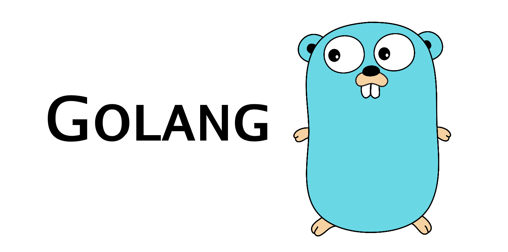
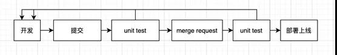
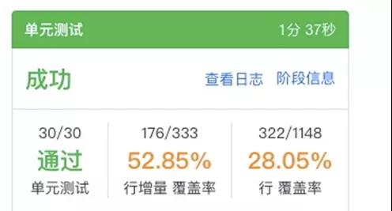

# Golang 单元测试：有哪些误区和实践？



## 背景

测试是保证代码质量的有效手段，而单元测试是程序模块儿的最小化验证。单元测试的重要性是不言而喻的。相对手工测试，单元测试具有自动化执行、可自动回归，效率较高的特点。对于问题的发现效率，单测的也相对较高。在开发阶段编写单测 case ，daily push daily test，并通过单测的成功率、覆盖率来衡量代码的质量，能有效保证项目的整体质量。



## 单测准则

什么是好的单测？阿里巴巴的 [《Java 开发手册》](http://mp.weixin.qq.com/s?__biz=MzIzOTU0NTQ0MA==&mid=2247498279&idx=1&sn=313d9b047d8fc7aff7c1f90dc4a3c7e7&chksm=e92ac728de5d4e3e1678a7480752eb92d6346a20804101a7f6d49d0a9f101145fee0f8c033e0&scene=21#wechat_redirect)（点击下载）中描述了好的单测的特征：

- A：（Automatic，自动化）：单元测试应该是全自动执行的，并且非交互式的。
- I：（Independent，独立性）：为了保证单元测试稳定可靠且便于维护，单元测试用例之间决不能互相调用，也不能依赖执行的先后次序。
- R：（Repeatable，可重复）：单元测试通常会被放到持续集成中，每次有代码 check in 时单元测试都会被执行。如果单测对外部环境(网络、服务、中间件等)有依赖，容易导致持续集成机制的不可用。

单测应该是可重复执行的，对外部的依赖、环境的变化要通过 mock 或其他手段屏蔽掉。

在 On the architecture for unit testing [1] 中对好的单测有以下描述：

- 简短，只有一个测试目的
- 简单，数据构造、清理都很简单
- 快速，执行函数秒级执行
- 标准，遵守严格的约定（准备测试上下文，执行关键操作，验证结果）

## 单测的误区

- 没有断言。没有断言的单测是没有灵魂的。如果只是 print 出结果，单测是没有意义的。
- 不接入持续集成。单测不应该是本地的 run once ，而应该接入到研发的整个流程中，合并代码，发布上线都应该触发单测执行，并且可以重复执行。
- 粒度过大。单测粒度应该尽量小，不应该包含过多计算逻辑，尽量只有输入，输出和断言。

很多人不愿意写单测，是因为项目依赖很多，各个函数之间各种调用，不知道如何在一个隔离的测试环境下进行测试。

在实践中我们调研了几种隔离（mock）的手段，下面进行逐一介绍。

## 单测实践

本次实践的工程项目是一个 http（基于 gin 的 http 框架） 的服务。以入口的 controller 层的函数为被测函数，介绍下对它的单测过程。下面的函数的作用是根据工号输出该用户下的代码仓库的 CodeReview 数据。

可以看到这个函数作为入口层还是比较简单的，只是做了一个参数校验后调用下游并将结果透出。

```go
func ListRepoCrAggregateMetrics(c *gin.Context) {
    workNo := c.Query("work_no")
    if workNo == "" {
        c.JSON(http.StatusOK, errors.BuildRsp(errors.ErrorWarpper(errors.ErrParamError.ErrorCode, "work no miss"), nil))
        return
    }
    crCtx := code_review.NewCrCtx(c)
    rsp, err := crCtx.ListRepoCrAggregateMetrics(workNo)
    if err != nil {
        c.JSON(http.StatusOK, errors.BuildRsp(errors.ErrorWarpper(errors.ErrDbQueryError.ErrorCode, err.Error()), rsp))
        return
    }
    c.JSON(http.StatusOK, errors.BuildRsp(errors.ErrSuccess, rsp))
}
```

它的结果大致如下：

```json
{
  "data": {
    "total": 10,
    "code_review": [
      {
        "repo": {
          "project_id": 1,
          "repo_url": "test"
        },
        "metrics": {
          "code_review_rate": 0.0977918,
          "thousand_comment_count": 0,
          "self_submit_code_review_rate": 0,
          "average_merge_cost": 30462.584,
          "average_accept_cost": 30388.75
        }
      }
    ]
  },
  "errorCode": 0,
  "errorMsg": "成功"
}
```

针对这个函数测试，我们预期覆盖以下场景：

- workNo 为空时报错。
- workNo 不为空时范围 ，下游调用成功，repos cr 聚合数据。
- workNo 不为空，下游失败，返回报错信息。

**方案一：不 mock 下游， mock 依赖存储 (不建议）**

这种方式是通过配置文件，将依赖的存储都连接到本地（比如 sqlite , redis）。这种方式下游没有 mock 而是会继续调用。

```go
var db *gorm.DB
func getMetricsRepo() *model.MetricsRepo {
    repo := model.MetricsRepo{
        ProjectID:     2,
        RepoPath:      "/",
        FileCount:     5,
        CodeLineCount: 76,
        OwnerWorkNo:   "999999",
    }
    return &repo
}
func getTeam() *model.Teams {
    team := model.Teams{
        WorkNo: "999999",
    }
    return &team
}
func init() {
    db, err := gorm.Open("sqlite3", "test.db")
    if err != nil {
        os.Exit(-1)
    }
    db.Debug()
    db.DropTableIfExists(model.MetricsRepo{})
    db.DropTableIfExists(model.Teams{})
    db.CreateTable(model.MetricsRepo{})
    db.CreateTable(model.Teams{})
    db.FirstOrCreate(getMetricsRepo())
    db.FirstOrCreate(getTeam())
}
type RepoMetrics struct {
    CodeReviewRate           float32 `json:"code_review_rate"`            
    ThousandCommentCount     uint    `json:"thousand_comment_count"`       
    SelfSubmitCodeReviewRate float32 `json:"self_submit_code_review_rate"` 
}
type RepoCodeReview struct {
    Repo        repo.Repo   `json:"repo"`
    RepoMetrics RepoMetrics `json:"metrics"`
}
type RepoCrMetricsRsp struct {
    Total          int               `json:"total"`
    RepoCodeReview []*RepoCodeReview `json:"code_review"`
}
func TestListRepoCrAggregateMetrics(t *testing.T) {
    w := httptest.NewRecorder()
    _, engine := gin.CreateTestContext(w)
    engine.GET("/api/test/code_review/repo", ListRepoCrAggregateMetrics)
    req, _ := http.NewRequest("GET", "/api/test/code_review/repo?work_no=999999", nil)
    engine.ServeHTTP(w, req)
    assert.Equal(t, w.Code, 200)
    var v map[string]RepoCrMetricsRsp
    json.Unmarshal(w.Body.Bytes(), &v)
    assert.EqualValues(t, 1, v["data"].Total)
    assert.EqualValues(t, 2, v["data"].RepoCodeReview[0].Repo.ProjectID)
    assert.EqualValues(t, 0, v["data"].RepoCodeReview[0].RepoMetrics.CodeReviewRate)
}
```

上面的代码，我们没有对被测代码做改动。但是在运行 go test 进行测试时，需要指定配置到测试配置。被测项目是通过环境变量设置的。

```bash
RDSC_CONF=$sourcepath/test/data/config.yml go test -v -cover=true -coverprofile=$sourcepath/cover/cover.cover ./...
```

- 初始化测试环境，清空 DB 数据，写入被测数据。
- 执行测试方法。
- 断言测试结果。

**方案二：下游通过 interface 被 mock（推荐）**

gomock[2] 是 Golang 官方提供的 Go 语言 mock 框架。它能够很好的和 Go testing 模块儿结合，也能用于其他的测试环境中。Gomock 包括依赖库 gomock 和接口生成工具 mockgen 两部分，gomock 用于完成桩对象的管理， mockgen 用于生成对应的 mock 文件。

```go
type Foo interface {
  Bar(x int) int
}
func SUT(f Foo) {
 // ...
}
ctrl := gomock.NewController(t)
  // Assert that Bar() is invoked.
  defer ctrl.Finish()
  //mockgen -source=foo.g
  m := NewMockFoo(ctrl)
  // Asserts that the first and only call to Bar() is passed 99.
  // Anything else will fail.
  m.
    EXPECT().
    Bar(gomock.Eq(99)).
    Return(101)
SUT(m)
```

上面的例子，接口 Foo 被 mock。回到我们的项目，在我们上面的被测代码中是通过内部声明对象进行调用的。使用 gomock 需要修改代码，把依赖通过参数暴露出来，然后初始化时。下面是修改后的被测函数：

```go
type RepoCrCRController struct {
    c     *gin.Context
    crCtx code_review.CrCtxInterface
}
func NewRepoCrCRController(ctx *gin.Context, cr code_review.CrCtxInterface) *TeamCRController {
    return &TeamCRController{c: ctx, crCtx: cr}
}
func (ctrl *RepoCrCRController)ListRepoCrAggregateMetrics(c *gin.Context) {
    workNo := c.Query("work_no")
    if workNo == "" {
        c.JSON(http.StatusOK, errors.BuildRsp(errors.ErrorWarpper(errors.ErrParamError.ErrorCode, "员工工号信息错误"), nil))
        return
    }
    rsp, err := ctrl.crCtx.ListRepoCrAggregateMetrics(workNo)
    if err != nil {
        c.JSON(http.StatusOK, errors.BuildRsp(errors.ErrorWarpper(errors.ErrDbQueryError.ErrorCode, err.Error()), rsp))
        return
    }
    c.JSON(http.StatusOK, errors.BuildRsp(errors.ErrSuccess, rsp))
}
```

这样通过 gomock 生成 mock 接口可以进行测试了：

```go
func TestListRepoCrAggregateMetrics(t *testing.T) { 
    ctrl := gomock.NewController(t)
    defer ctrl.Finish()
    m := mock.NewMockCrCtxInterface(ctrl)
    resp := &code_review.RepoCrMetricsRsp{
    }
    m.EXPECT().ListRepoCrAggregateMetrics("999999").Return(resp, nil)
    w := httptest.NewRecorder()
    ctx, engine := gin.CreateTestContext(w)
    repoCtrl := NewRepoCrCRController(ctx, m)
    engine.GET("/api/test/code_review/repo", repoCtrl.ListRepoCrAggregateMetrics)
    req, _ := http.NewRequest("GET", "/api/test/code_review/repo?work_no=999999", nil)
    engine.ServeHTTP(w, req)
    assert.Equal(t, w.Code, 200)
    got := gin.H{}
    json.NewDecoder(w.Body).Decode(&got)
    assert.EqualValues(t, got["errorCode"], 0)
}
```

**方案三：通过 monkey patch 方式 mock 下游 （推荐）**

在上面的例子中，我们需要修改代码来实现 interface 的 mock，对于对象成员函数，无法进行 mock。monkey patch 通过运行时对底层指针内容修改的方式，实现对 instance method 的 mock （注意，这里要求 instance 的 method 必须是可以暴露的）。用 monkey 方式测试如下：

```go
func TestListRepoCrAggregateMetrics(t *testing.T) {
    w := httptest.NewRecorder()
    _, engine := gin.CreateTestContext(w)
    engine.GET("/api/test/code_review/repo", ListRepoCrAggregateMetrics)
    var crCtx *code_review.CrCtx
    repoRet := code_review.RepoCrMetricsRsp{
    }
    monkey.PatchInstanceMethod(reflect.TypeOf(crCtx), "ListRepoCrAggregateMetrics",
        func(ctx *code_review.CrCtx, workNo string) (*code_review.RepoCrMetricsRsp, error) {
            if workNo == "999999" {
                repoRet.Total = 0
                repoRet.RepoCodeReview = []*code_review.RepoCodeReview{}
            }
            return &repoRet, nil
        })
    req, _ := http.NewRequest("GET", "/api/test/code_review/repo?work_no=999999", nil)
    engine.ServeHTTP(w, req)
    assert.Equal(t, w.Code, 200)
    var v map[string]code_review.RepoCrMetricsRsp
    json.Unmarshal(w.Body.Bytes(), &v)
    assert.EqualValues(t, 0, v["data"].Total)
    assert.Len(t, v["data"].RepoCodeReview, 0)
}
```

**方案四：存储层 mock**

Go-sqlmock 可以针对接口 sql/driver[3] 进行 mock。它可以不用真实的 db ，而模拟 sql driver 行为，实现强大的底层数据测试。下面是我们采用 table driven[4] 写法来进行数据相关测试的例子。

```go
package store
import (
    "database/sql/driver"
    "github.com/DATA-DOG/go-sqlmock"
    "github.com/gin-gonic/gin"
    "github.com/jinzhu/gorm"
    "github.com/stretchr/testify/assert"
    "net/http/httptest"
    "testing"
)
type RepoCommitAndCRCountMetric struct {
    ProjectID                 uint `json:"project_id"`
    RepoCommitCount           uint `json:"repo_commit_count"`
    RepoCodeReviewCommitCount uint `json:"repo_code_review_commit_count"`
}
var (
    w      = httptest.NewRecorder()
    ctx, _ = gin.CreateTestContext(w)
    ret    = []RepoCommitAndCRCountMetric{}
)
func TestCrStore_FindColumnValues1(t *testing.T) {
    type fields struct {
        g  *gin.Context
        db func() *gorm.DB
    }
    type args struct {
        table      string
        column     string
        whereAndOr []SqlFilter
        group      string
        out        interface{}
    }
    tests := []struct {
        name      string
        fields    fields
        args      args
        wantErr   bool
        checkFunc func()
    }{
        {
            name: "whereAndOr is null",
            fields: fields{
                db: func() *gorm.DB {
                    sqlDb, mock, _ := sqlmock.New(sqlmock.QueryMatcherOption(sqlmock.QueryMatcherEqual))
                    rs1 := sqlmock.NewRows([]string{"project_id", "repo_commit_count", "repo_code_review_commit_count"}).FromCSVString("1, 2, 3")
                    mock.ExpectQuery("SELECT project_id, sum(commit_count) as repo_commit_count, sum(code_review_commit_count) as repo_code_review_commit_count FROM `metrics_repo_cr` GROUP BY project_id").WillReturnRows(rs1)
                    gdb, _ := gorm.Open("mysql", sqlDb)
                    gdb.Debug()
                    return gdb
                },
            },
            args: args{
                table:      "metrics_repo_cr",
                column:     "project_id, sum(commit_count) as repo_commit_count, sum(code_review_commit_count) as repo_code_review_commit_count",
                whereAndOr: []SqlFilter{},
                group:      "project_id",
                out:        &ret,
            },
            checkFunc: func() {
                assert.EqualValues(t, 1, ret[0].ProjectID, "project id should be 1")
                assert.EqualValues(t, 2, ret[0].RepoCommitCount, "RepoCommitCount id should be 2")
                assert.EqualValues(t, 3, ret[0].RepoCodeReviewCommitCount, "RepoCodeReviewCommitCount should be 3")
            },
        },
        {
            name: "whereAndOr is not null",
            fields: fields{
                db: func() *gorm.DB {
                    sqlDb, mock, _ := sqlmock.New(sqlmock.QueryMatcherOption(sqlmock.QueryMatcherEqual))
                    rs1 := sqlmock.NewRows([]string{"project_id", "repo_commit_count", "repo_code_review_commit_count"}).FromCSVString("1, 2, 3")
                    mock.ExpectQuery("SELECT project_id, sum(commit_count) as repo_commit_count, sum(code_review_commit_count) as repo_code_review_commit_count FROM `metrics_repo_cr` WHERE (metrics_repo_cr.project_id in (?)) GROUP BY project_id").
                        WithArgs(driver.Value(1)).WillReturnRows(rs1)
                    gdb, _ := gorm.Open("mysql", sqlDb)
                    gdb.Debug()
                    return gdb
                },
            },
            args: args{
                table:  "metrics_repo_cr",
                column: "project_id, sum(commit_count) as repo_commit_count, sum(code_review_commit_count) as repo_code_review_commit_count",
                whereAndOr: []SqlFilter{
                    {
                        Condition: SQLWHERE,
                        Query:     "metrics_repo_cr.project_id in (?)",
                        Arg:       []uint{1},
                    },
                },
                group: "project_id",
                out:   &ret,
            },
            checkFunc: func() {
                assert.EqualValues(t, 1, ret[0].ProjectID, "project id should be 1")
                assert.EqualValues(t, 2, ret[0].RepoCommitCount, "RepoCommitCount id should be 2")
                assert.EqualValues(t, 3, ret[0].RepoCodeReviewCommitCount, "RepoCodeReviewCommitCount should be 3")
            },
        },
        {
            name: "group is null",
            fields: fields{
                db: func() *gorm.DB {
                    sqlDb, mock, _ := sqlmock.New(sqlmock.QueryMatcherOption(sqlmock.QueryMatcherEqual))
                    rs1 := sqlmock.NewRows([]string{"project_id", "repo_commit_count", "repo_code_review_commit_count"}).FromCSVString("1, 2, 3")
                    mock.ExpectQuery("SELECT project_id, sum(commit_count) as repo_commit_count, sum(code_review_commit_count) as repo_code_review_commit_count FROM `metrics_repo_cr` WHERE (metrics_repo_cr.project_id in (?))").
                        WithArgs(driver.Value(1)).WillReturnRows(rs1)
                    gdb, _ := gorm.Open("mysql", sqlDb)
                    gdb.Debug()
                    return gdb
                },
            },
            args: args{
                table:  "metrics_repo_cr",
                column: "project_id, sum(commit_count) as repo_commit_count, sum(code_review_commit_count) as repo_code_review_commit_count",
                whereAndOr: []SqlFilter{
                    {
                        Condition: SQLWHERE,
                        Query:     "metrics_repo_cr.project_id in (?)",
                        Arg:       []uint{1},
                    },
                },
                group: "",
                out:   &ret,
            },
            checkFunc: func() {
                assert.EqualValues(t, 1, ret[0].ProjectID, "project id should be 1")
                assert.EqualValues(t, 2, ret[0].RepoCommitCount, "RepoCommitCount id should be 2")
                assert.EqualValues(t, 3, ret[0].RepoCodeReviewCommitCount, "RepoCodeReviewCommitCount should be 3")
            },
        },
    }
    for _, tt := range tests {
        t.Run(tt.name, func(t *testing.T) {
            cs := &CrStore{
                g: ctx,
            }
            db = tt.fields.db()
            if err := cs.FindColumnValues(tt.args.table, tt.args.column, tt.args.whereAndOr, tt.args.group, tt.args.out); (err != nil) != tt.wantErr {
                t.Errorf("FindColumnValues() error = %v, wantErr %v", err, tt.wantErr)
            }
            tt.checkFunc()
        })
    }
}
```

**持续集成**

Aone （阿里内部项目协作管理台）提供了类似 travis-ci [5] 的功能：测试服务 [6]。我们可以通过创建单测类型的任务或者直接使用实验室进行单测集成。

```bash
# 执行测试命令
mkdir -p $sourcepath/cover
RDSC_CONF=$sourcepath/config/config.yaml go test -v -cover=true -coverprofile=$sourcepath/cover/cover.cover ./...
ret=$?; if [[ $ret -ne 0 && $ret -ne 1 ]]; then exit $ret; fi
```

增量覆盖率可以通过 gocov/gocov-xml 转换成 xml 报告，然后通过 diff_cover 输出增量报告：

```bash
cp $sourcepath/cover/cover.cover /root/cover/cover.cover
pip install diff-cover==2.6.1
gocov convert cover/cover.cover | gocov-xml > coverage.xml
cd $sourcepath
diff-cover $sourcepath/coverage.xml --compare-branch=remotes/origin/develop > diff.out
```

设置触发的集成阶段：




> 参考资料：
>
> [1]https://thomasvilhena.com/2020/04/on-the-architecture-for-unit-testing
>
> [2]https://github.com/golang/mock
>
> [3]https://godoc.org/database/sql/driver
>
> [4]https://github.com/golang/go/wiki/TableDrivenTests
>
> [5]https://travis-ci.org/
>
> [6]https://help.aliyun.com/document_detail/64021.html

**作者**：石窗

**原文**：[Golang单元测试：有哪些误区和实践？](https://mp.weixin.qq.com/s/Fj_ebCAUPlgTUPdsIg7CnA)