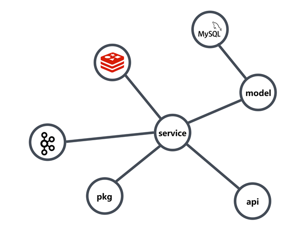
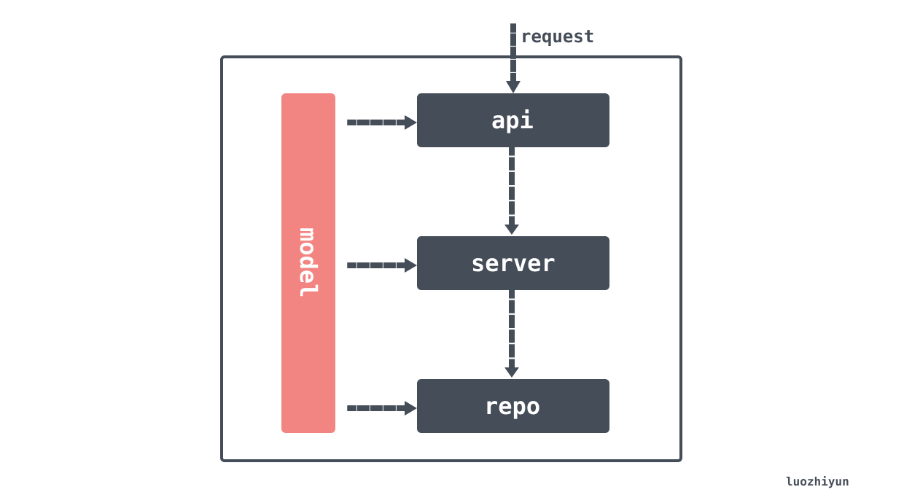

# Golang 简洁架构实战

> 文中项目代码位置：https://github.com/devYun/go-clean-architecture
> 转载请声明出处哦~，本篇文章发布于luozhiyun的博客：https://www.luozhiyun.com/archives/640

由于golang不像java一样有一个统一的编码模式，所以我们和其他团队一样，采用了 [Go 面向包的设计和架构分层](https://github.com/danceyoung/paper-code/blob/master/package-oriented-design/packageorienteddesign.md)这篇文章介绍的一些理论，然后再结合以往的项目经验来进行分包：

```
├── cmd/
│   └── main.go //启动函数
├── etc
│   └── dev_conf.yaml              // 配置文件 
├── global
│   └── global.go //全局变量引用，如数据库、kafka等
├── internal/
│       └── service/
│           └── xxx_service.go //业务逻辑处理类
│           └── xxx_service_test.go 
│       └── model/
│           └── xxx_info.go//结构体
│       └── api/
│           └── xxx_api.go//路由对应的接口实现
│       └── router/
│           └── router.go//路由
│       └── pkg/
│           └── datetool//时间工具类
│           └── jsontool//json 工具类
```

其实上面的这个划分只是简单的将功能分了一下包，在项目实践的过程中还是有很多问题。比如：

对于功能实现我是通过 function 的参数传递还是通过结构体的变量传递？

使用一个数据库的全局变量引用传递是否安全？是否存在过度耦合？

在代码实现过程中几乎全部都是依赖于实现，而不是依赖于接口，那么将MySQL切换为 MongDB 是不是要修改所有的实现？

所以现在在我们工作中随着代码越来越多，代码中各种 init，function，struct，全局变量感觉也越来越乱。

每个模块不独立，看似按逻辑分了模块，但没有明确的上下层关系，每个模块里可能都存在配置读取，外部服务调用，协议转换等。

久而久之服务不同包函数之间的调用慢慢演变成网状结构，数据流的流向和逻辑的梳理变得越来越复杂，很难不看代码调用的情况下搞清楚数据流向。



不过就像《重构》中所说：先让代码工作起来-如果代码不能工作，就不能产生价值；然后再试图将它变好-通过对代码进行重构，让我们自己和其他人更好地理解代码，并能按照需求不断地修改代码。

所以我觉得是时候自我改变一下。

## The Clean Architecture

在简洁架构里面对我们的项目提出了几点要求：

1. 独立于框架。该架构不依赖于某些功能丰富的软件库的存在。这允许你把这些框架作为工具来使用，而不是把你的系统塞进它们有限的约束中。
2. 可测试。业务规则可以在没有UI、数据库、Web服务器或任何其他外部元素的情况下被测试。
3. 独立于用户界面。UI可以很容易地改变，而不用改变系统的其他部分。例如，一个Web UI可以被替换成一个控制台UI，而不改变业务规则。
4. 独立于数据库。你可以把Oracle或SQL Server换成Mongo、BigTable、CouchDB或其他东西。你的业务规则不受数据库的约束。
5. 独立于任何外部机构。事实上，你的业务规则根本不知道外部世界的任何情况。


上图中同心圆代表各种不同领域的软件。一般来说，越深入代表你的软件层次越高。外圆是战术实现机制，内圆的是战略核心策略。

对于我们的项目来说，代码依赖应该由外向内，单向单层依赖，这种依赖包含代码名称，或类的函数，变量或任何其他命名软件实体。

对于简洁架构来说分为了四层：

- Entities：实体
- Usecase：表达应用业务规则，对应的是应用层，它封装和实现系统的所有用例；
- Interface Adapters：这一层的软件基本都是一些适配器，主要用于将用例和实体中的数据转换为外部系统如数据库或Web使用的数据；
- Framework & Driver：最外面一圈通常是由一些框架和工具组成，如数据库Database, Web框架等；

那么对于我的项目来说，也分为了四层：

- models
- repo
- service
- api



### models

封装了各种实体类对象，与数据库交互的、与UI交互的等等，任何的实体类都应该放在这里。如：

```go
import "time"

type Article struct {
    ID        int64     `json:"id"`
    Title     string    `json:"title"`
    Content   string    `json:"content"`
    UpdatedAt time.Time `json:"updated_at"`
    CreatedAt time.Time `json:"created_at"`
}
```

### repo

这里存放的是数据库操作类，数据库CRUD都在这里。需要注意的是，这里不包含任何的业务逻辑代码，很多同学喜欢将业务逻辑也放到这里。

如果使用 ORM，那么这里放入的ORM操作相关的代码；如果使用微服务，那么这里放的是其他服务请求的代码；

### service

这里是业务逻辑层，所有的业务过程处理代码都应该放在这里。这一层会决定是请求 repo 层的什么代码，是操作数据库还是调用其他服务；所有的业务数据计算也应该放在这里；这里接受的入参应该是controller传入的。

### api

这里是接收外部请求的代码，如：gin对应的handler、gRPC、其他REST API 框架接入层等等。

## 面向接口编程

除了 models 层，层与层之间应该通过接口交互，而不是实现。如果要用 service 调用 repo 层，那么应该调用 repo 的接口。那么修改底层实现的时候我们上层的基类不需要变更，只需要更换一下底层实现即可。

例如我们想要将所有文章查询出来，那么可以在 repo 提供这样的接口：

```go
package repo

import (
    "context"
    "my-clean-rchitecture/models"
    "time"
)

// IArticleRepo represent the article's repository contract
type IArticleRepo interface {
    Fetch(ctx context.Context, createdDate time.Time, num int) (res []models.Article, err error)
}
```

这个接口的实现类就可以根据需求变更，比如说当我们想要 mysql 来作为存储查询，那么只需要提供一个这样的基类：

```go
type mysqlArticleRepository struct {
    DB *gorm.DB
}

// NewMysqlArticleRepository will create an object that represent the article.Repository interface
func NewMysqlArticleRepository(DB *gorm.DB) IArticleRepo {
    return &mysqlArticleRepository{DB}
}

func (m *mysqlArticleRepository) Fetch(ctx context.Context, createdDate time.Time,
    num int) (res []models.Article, err error) {

    err = m.DB.WithContext(ctx).Model(&models.Article{}).
        Select("id,title,content, updated_at, created_at").
        Where("created_at > ?", createdDate).Limit(num).Find(&res).Error
    return
}
```

如果改天想要换成 MongoDB 来实现我们的存储，那么只需要定义一个结构体实现 IArticleRepo 接口即可。

那么在 service 层实现的时候就可以按照我们的需求来将对应的 repo 实现注入即可，从而不需要改动 service 层的实现：

```go
type articleService struct {
    articleRepo repo.IArticleRepo
}

// NewArticleService will create new an articleUsecase object representation of domain.ArticleUsecase interface
func NewArticleService(a repo.IArticleRepo) IArticleService {
    return &articleService{
        articleRepo: a,
    }
}

// Fetch
func (a *articleService) Fetch(ctx context.Context, createdDate time.Time, num int) (res []models.Article, err error) {
    if num == 0 {
        num = 10
    }
    res, err = a.articleRepo.Fetch(ctx, createdDate, num)
    if err != nil {
        return nil, err
    }
    return
}
```

## 依赖注入 DI

依赖注入，英文名dependency injection，简称 DI 。DI 以前在java工程里面经常遇到，但是在 go 里面很多人都说不需要，但是我觉得在大型软件开发过程中还是有必要的，否则只能通过全局变量或者方法参数来进行传递。

至于具体什么是 DI，简单来说就是被依赖的模块，在创建模块时，被注入到（即当作参数传入）模块的里面。想要更加深入的了解什么是 DI 这里再推荐一下 [Dependency injection ](https://link.zhihu.com/?target=https%3A//en.wikipedia.org/wiki/Dependency_injection)和 [Inversion of Control Containers and the Dependency Injection pattern](https://link.zhihu.com/?target=https%3A//martinfowler.com/articles/injection.html) 这两篇文章。

如果不用 DI 主要有两大不方便的地方，一个是底层类的修改需要修改上层类，在大型软件开发过程中基类是很多的，一条链路改下来动辄要修改几十个文件；另一方面就是就是层与层之间单元测试不太方便。

因为采用了依赖注入，在初始化的过程中就不可避免的会写大量的new，比如我们的项目中需要这样：

```go
package main

import (
    "my-clean-rchitecture/api"
    "my-clean-rchitecture/api/handlers"
    "my-clean-rchitecture/app"
    "my-clean-rchitecture/repo"
    "my-clean-rchitecture/service"
)

func main() { 
    // 初始化db
    db := app.InitDB() 
    //初始化 repo
    repository := repo.NewMysqlArticleRepository(db)
    //初始化service
    articleService := service.NewArticleService(repository)
    //初始化api
    handler := handlers.NewArticleHandler(articleService)
    //初始化router
    router := api.NewRouter(handler)
    //初始化gin
    engine := app.NewGinEngine()
    //初始化server
    server := app.NewServer(engine, router)
    //启动
    server.Start()
}
```

那么对于这么一段代码，我们有没有办法不用自己写呢？这里我们就可以借助框架的力量来生成我们的注入代码。

在 go 里面 DI 的工具相对来说没有 java 这么方便，技术框架一般主要有：wire、dig、fx 等。由于wire是使用代码生成来进行注入，性能会比较高，并且它是 google 推出的 DI 框架，所以我们这里使用 wire 进行注入。

wire的要求很简单，新建一个wire.go文件（文件名可以随意），创建我们的初始化函数。比如，我们要创建并初始化一个server对象，我们就可以这样：

```go
//+build wireinject

package main

import (
    "github.com/google/wire"
    "my-clean-rchitecture/api"
    "my-clean-rchitecture/api/handlers"
    "my-clean-rchitecture/app"
    "my-clean-rchitecture/repo"
    "my-clean-rchitecture/service"
)

func InitServer() *app.Server {
    wire.Build(
        app.InitDB,
        repo.NewMysqlArticleRepository,
        service.NewArticleService,
        handlers.NewArticleHandler,
        api.NewRouter,
        app.NewServer,
        app.NewGinEngine)
    return &app.Server{}
}
```

需要注意的是，第一行的注解：+build wireinject，表示这是一个注入器。

在函数中，我们调用`wire.Build()`将创建 Server 所依赖的类型的构造器传进去。写完wire.go文件之后执行wire命令，就会自动生成一个wire_gen.go文件。

```go
// Code generated by Wire. DO NOT EDIT.

//go:generate go run github.com/google/wire/cmd/wire
//+build !wireinject

package main

import (
    "my-clean-rchitecture/api"
    "my-clean-rchitecture/api/handlers"
    "my-clean-rchitecture/app"
    "my-clean-rchitecture/repo"
    "my-clean-rchitecture/service"
)

// Injectors from wire.go:

func InitServer() *app.Server {
    engine := app.NewGinEngine()
    db := app.InitDB()
    iArticleRepo := repo.NewMysqlArticleRepository(db)
    iArticleService := service.NewArticleService(iArticleRepo)
    articleHandler := handlers.NewArticleHandler(iArticleService)
    router := api.NewRouter(articleHandler)
    server := app.NewServer(engine, router)
    return server
}
```

可以看到wire自动帮我们生成了InitServer方法，此方法中依次初始化了所有要初始化的基类。之后在我们的main函数中就只需调用这个InitServer即可。

```go
func main() {
    server := InitServer()
    server.Start()
}
```

## 测试

在上面我们定义好了每一层应该做什么，那么对于每一层我们应该都是可单独测试的，即使另外一层不存在。

- models 层：这一层就很简单了，由于没有依赖任何其他代码，所以可以直接用go 的单测框架直接测试即可；
- repo 层：对于这一层来说，由于我们使用了 mysql 数据库，那么我们需要 mock mysql，这样即使不用连mysql 也可以正常测试，我这里使用 github.com/DATA-DOG/go-sqlmock 这个库来 mock 我们的数据库；
- service 层：因为 service 层依赖了 repo 层，因为它们之间是通过接口来关联，所以我这里使用 github.com/golang/mock/gomock 来 mock repo 层；
- api 层：这一层依赖 service 层，并且它们之间是通过接口来关联，所以这里也可以使用 gomock 来 mock service 层。不过这里稍微麻烦了一点，因为我们接入层用的是 gin，所以还需要在单测的时候模拟发送请求；

由于我们是通过 github.com/golang/mock/gomock 来进行 mock ，所以需要执行一下代码生成，生成的mock 代码我们放入到 mock 包中：

```
mockgen -destination .\mock\repo_mock.go -source .\repo\repo.go -package mock

mockgen -destination .\mock\service_mock.go -source .\service\service.go -package mock
```

上面这两个命令会通过接口帮我自动生成 mock 函数。

### repo 层测试

在项目中，由于我们用了 gorm 来作为我们的 orm库，所以我们需要使用 github.com/DATA-DOG/go-sqlmock 结合 gorm 来进行 mock：

```go
func getSqlMock() (mock sqlmock.Sqlmock, gormDB *gorm.DB) {
    //创建sqlmock
    var err error
    var db *sql.DB
    db, mock, err = sqlmock.New(sqlmock.QueryMatcherOption(sqlmock.QueryMatcherEqual))
    if err != nil {
        panic(err)
    }
    //结合gorm、sqlmock
    gormDB, err = gorm.Open(mysql.New(mysql.Config{
        SkipInitializeWithVersion: true,
        Conn:                      db,
    }), &gorm.Config{})
    if nil != err {
        log.Fatalf("Init DB with sqlmock failed, err %v", err)
    }
    return
}

func Test_mysqlArticleRepository_Fetch(t *testing.T) {
    createAt := time.Now()
    updateAt := time.Now()
    //id,title,content, updated_at, created_at
    var articles = []models.Article{
        {1, "test1", "content", updateAt, createAt},
        {2, "test2", "content2", updateAt, createAt},
    }

    limit := 2
    mock, db := getSqlMock()

    mock.ExpectQuery("SELECT id,title,content, updated_at, created_at FROM `articles` WHERE created_at > ? LIMIT 2").
        WithArgs(createAt).
        WillReturnRows(sqlmock.NewRows([]string{"id", "title", "content", "updated_at", "created_at"}).
            AddRow(articles[0].ID, articles[0].Title, articles[0].Content, articles[0].UpdatedAt, articles[0].CreatedAt).
            AddRow(articles[1].ID, articles[1].Title, articles[1].Content, articles[1].UpdatedAt, articles[1].CreatedAt))

    repository := NewMysqlArticleRepository(db)
    result, err := repository.Fetch(context.TODO(), createAt, limit)

    assert.Nil(t, err)
    assert.Equal(t, articles, result)
}
```

### service 层测试

这里主要就是用我们 gomock 生成的代码来 mock repo 层：

```go
func Test_articleService_Fetch(t *testing.T) {
    ctl := gomock.NewController(t)
    defer ctl.Finish()
    now := time.Now()
    mockRepo := mock.NewMockIArticleRepo(ctl)

    gomock.InOrder(
        mockRepo.EXPECT().Fetch(context.TODO(), now, 10).Return(nil, nil),
    )

    service := NewArticleService(mockRepo)

    fetch, _ := service.Fetch(context.TODO(), now, 10)
    fmt.Println(fetch)
}
```

### api 层测试

对于这一层，我们不仅要 mock service 层，还需要发送 httptest 来模拟请求发送：

```go
func TestArticleHandler_FetchArticle(t *testing.T) {

    ctl := gomock.NewController(t)
    defer ctl.Finish()
    createAt, _ := time.Parse("2006-01-02", "2021-12-26")
    mockService := mock.NewMockIArticleService(ctl)

    gomock.InOrder(
        mockService.EXPECT().Fetch(gomock.Any(), createAt, 10).Return(nil, nil),
    )

    article := NewArticleHandler(mockService)

    gin.SetMode(gin.TestMode)

    // Setup your router, just like you did in your main function, and
    // register your routes
    r := gin.Default()
    r.GET("/articles", article.FetchArticle)

    req, err := http.NewRequest(http.MethodGet, "/articles?num=10&create_date=2021-12-26", nil)
    if err != nil {
        t.Fatalf("Couldn't create request: %v\n", err)
    }

    w := httptest.NewRecorder()
    // Perform the request
    r.ServeHTTP(w, req)

    // Check to see if the response was what you expected
    if w.Code != http.StatusOK {
        t.Fatalf("Expected to get status %d but instead got %d\n", http.StatusOK, w.Code)
    }
}
```

## 总结

以上就是我对 golang 的项目中发现问题的一点点总结与思考，思考的先不管对不对，总归是解决了我们当下的一些问题。不过，项目总归是需要不断重构完善的，所以下次有问题的时候下次再改呗。

对于我上面的总结和描述感觉有不对的地方，请随时指出来一起讨论。

项目代码位置：https://github.com/devYun/go-clean-architecture

## Reference

https://blog.cleancoder.com/uncle-bob/2012/08/13/the-clean-architecture.html

https://github.com/bxcodec/go-clean-arch

https://medium.com/hackernoon/golang-clean-archithecture-efd6d7c43047

https://farer.org/2021/04/21/go-dependency-injection-wire/