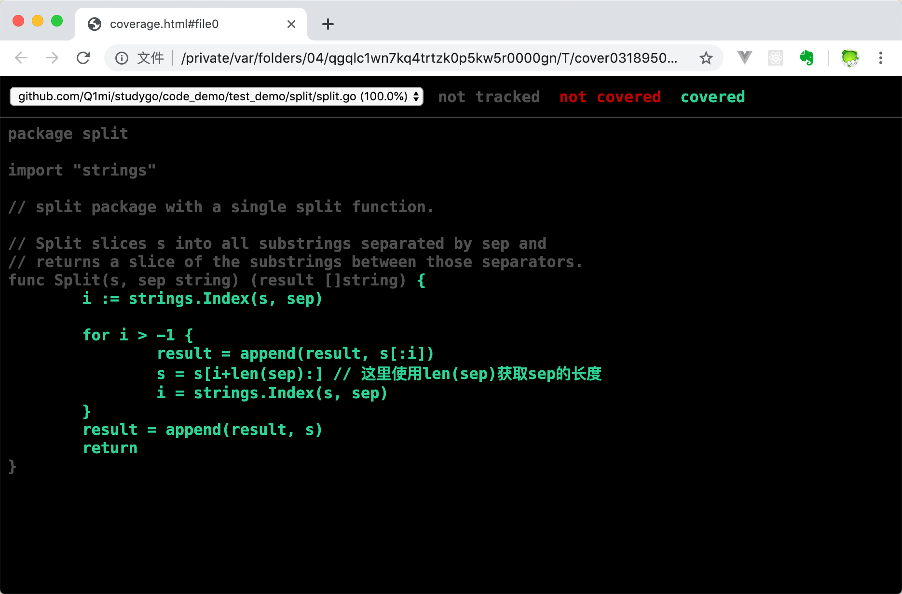
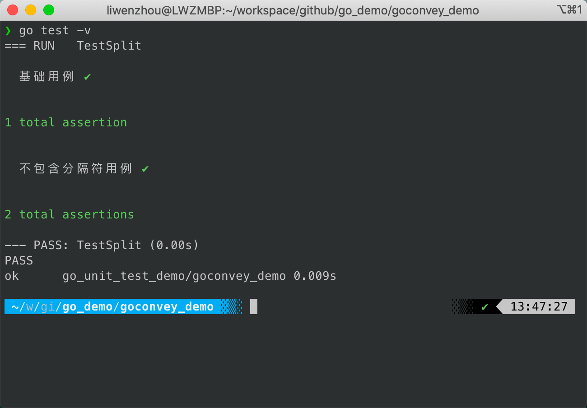
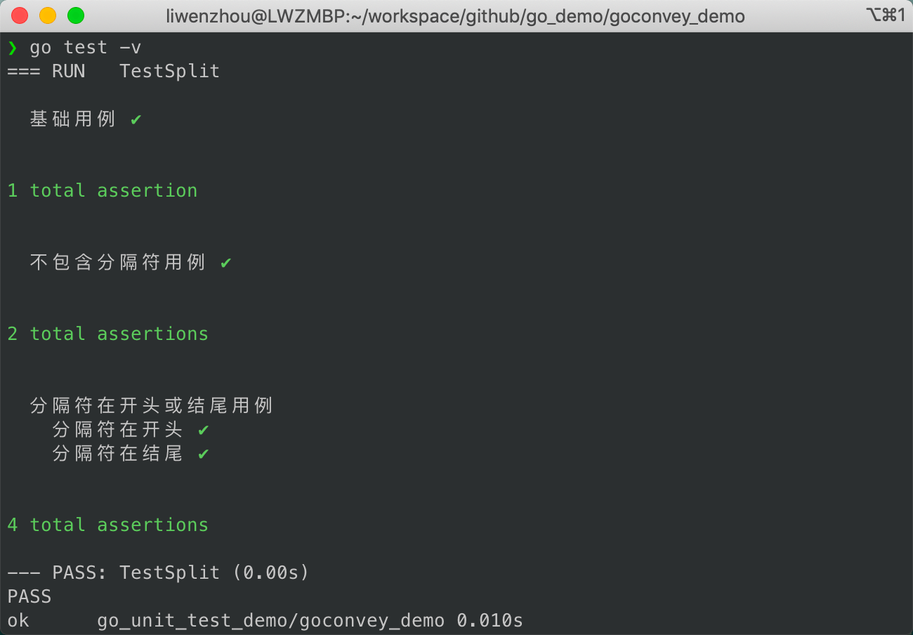
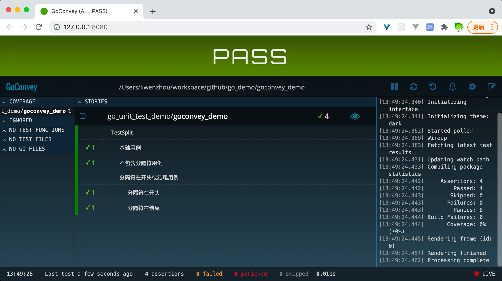

# [Go单测从零到溜](https://www.liwenzhou.com/posts/Go/golang-unit-test-0/)

Go语言单元测试从零到溜系列共7篇，本文是第0篇，介绍了Go语言单元测试的基础内容。本节主要讲解在Go语言中如何编写单元测试以及介绍了表格驱动测试、回归测试和单元测试中常用的断言工具。本篇部分内容基于我之前写过的那篇[《Go语言之单元测试》](https://www.liwenzhou.com/posts/Go/unit-test/)，内容略有删改。特别是由于篇幅限制移除了基准测试相关内容，想了解基准测试/性能测试的同学可以点击上文链接查看。

## 0—单元测试基础

### Go语言测试

#### go test工具

Go语言中的测试依赖`go test`命令。编写测试代码和编写普通的Go代码过程是类似的，并不需要学习新的语法、规则或工具。

go test命令是一个按照一定约定和组织的测试代码的驱动程序。在包目录内，所有以`_test.go`为后缀名的源代码文件都是`go test`测试的一部分，不会被`go build`编译到最终的可执行文件中。

在`*_test.go`文件中有三种类型的函数，单元测试函数、基准测试函数和示例函数。

|   类型   |         格式          |              作用              |
| :------: | :-------------------: | :----------------------------: |
| 测试函数 |   函数名前缀为Test    | 测试程序的一些逻辑行为是否正确 |
| 基准函数 | 函数名前缀为Benchmark |         测试函数的性能         |
| 示例函数 |  函数名前缀为Example  |       为文档提供示例文档       |

`go test`命令会遍历所有的`*_test.go`文件中符合上述命名规则的函数，然后生成一个临时的main包用于调用相应的测试函数，然后构建并运行、报告测试结果，最后清理测试中生成的临时文件。

#### 单元测试函数

##### 格式

每个测试函数必须导入`testing`包，测试函数的基本格式（签名）如下：

```go
func TestName(t *testing.T){
    // ...
}
```

测试函数的名字必须以`Test`开头，可选的后缀名必须以大写字母开头，举几个例子：

```go
func TestAdd(t *testing.T){ ... }
func TestSum(t *testing.T){ ... }
func TestLog(t *testing.T){ ... }
```

其中参数`t`用于报告测试失败和附加的日志信息。 `testing.T`的拥有的方法如下：

```go
func (c *T) Cleanup(func())
func (c *T) Error(args ...interface{})
func (c *T) Errorf(format string, args ...interface{})
func (c *T) Fail()
func (c *T) FailNow()
func (c *T) Failed() bool
func (c *T) Fatal(args ...interface{})
func (c *T) Fatalf(format string, args ...interface{})
func (c *T) Helper()
func (c *T) Log(args ...interface{})
func (c *T) Logf(format string, args ...interface{})
func (c *T) Name() string
func (c *T) Skip(args ...interface{})
func (c *T) SkipNow()
func (c *T) Skipf(format string, args ...interface{})
func (c *T) Skipped() bool
func (c *T) TempDir() string
```

##### 单元测试示例

就像细胞是构成我们身体的基本单位，一个软件程序也是由很多单元组件构成的。单元组件可以是函数、结构体、方法和最终用户可能依赖的任意东西。总之我们需要确保这些组件是能够正常运行的。单元测试是一些利用各种方法测试单元组件的程序，它会将结果与预期输出进行比较。

接下来，我们在`base_demo`包中定义了一个`Split`函数，具体实现如下：

```go
// base_demo/split.go

package base_demo

import "strings"

// Split 把字符串s按照给定的分隔符sep进行分割返回字符串切片
func Split(s, sep string) (result []string) {
	i := strings.Index(s, sep)

	for i > -1 {
		result = append(result, s[:i])
		s = s[i+1:]
		i = strings.Index(s, sep)
	}
	result = append(result, s)
	return
}
```

在当前目录下，我们创建一个`split_test.go`的测试文件，并定义一个测试函数如下：

```go
// split/split_test.go

package split

import (
	"reflect"
	"testing"
)

func TestSplit(t *testing.T) { // 测试函数名必须以Test开头，必须接收一个*testing.T类型参数
	got := Split("a:b:c", ":")         // 程序输出的结果
	want := []string{"a", "b", "c"}    // 期望的结果
	if !reflect.DeepEqual(want, got) { // 因为slice不能比较直接，借助反射包中的方法比较
		t.Errorf("expected:%v, got:%v", want, got) // 测试失败输出错误提示
	}
}
```

此时`split`这个包中的文件如下：

```bash
❯ ls -l
total 16
-rw-r--r--  1 liwenzhou  staff  408  4 29 15:50 split.go
-rw-r--r--  1 liwenzhou  staff  466  4 29 16:04 split_test.go
```

在当前路径下执行`go test`命令，可以看到输出结果如下：

```bash
❯ go test
PASS
ok      golang-unit-test-demo/base_demo       0.005s
```

#### go test -v

一个测试用例有点单薄，我们再编写一个测试使用多个字符切割字符串的例子，在`split_test.go`中添加如下测试函数：

```go
func TestSplitWithComplexSep(t *testing.T) {
	got := Split("abcd", "bc")
	want := []string{"a", "d"}
	if !reflect.DeepEqual(want, got) {
		t.Errorf("expected:%v, got:%v", want, got)
	}
}
```

现在我们有多个测试用例了，为了能更好的在输出结果中看到每个测试用例的执行情况，我们可以为`go test`命令添加`-v`参数，让它输出完整的测试结果。

```bash
❯ go test -v
=== RUN   TestSplit
--- PASS: TestSplit (0.00s)
=== RUN   TestSplitWithComplexSep
    split_test.go:20: expected:[a d], got:[a cd]
--- FAIL: TestSplitWithComplexSep (0.00s)
FAIL
exit status 1
FAIL    golang-unit-test-demo/base_demo 0.009s
```

从上面的输出结果我们能清楚的看到是`TestSplitWithComplexSep`这个测试用例没有测试通过。

#### go test -run

单元测试的结果表明`split`函数的实现并不可靠，没有考虑到传入的sep参数是多个字符的情况，下面我们来修复下这个Bug：

```go
package base_demo

import "strings"

// Split 把字符串s按照给定的分隔符sep进行分割返回字符串切片
func Split(s, sep string) (result []string) {
	i := strings.Index(s, sep)

	for i > -1 {
		result = append(result, s[:i])
		s = s[i+len(sep):] // 这里使用len(sep)获取sep的长度
		i = strings.Index(s, sep)
	}
	result = append(result, s)
	return
}
```

在执行`go test`命令的时候可以添加`-run`参数，它对应一个正则表达式，只有函数名匹配上的测试函数才会被`go test`命令执行。

例如通过给`go test`添加`-run=Sep`参数来告诉它本次测试只运行`TestSplitWithComplexSep`这个测试用例：

```bash
❯ go test -run=Sep -v
=== RUN   TestSplitWithComplexSep
--- PASS: TestSplitWithComplexSep (0.00s)
PASS
ok      golang-unit-test-demo/base_demo 0.010s
```

最终的测试结果表情我们成功修复了之前的Bug。

#### 回归测试

我们修改了代码之后仅仅执行那些失败的测试用例或新引入的测试用例是错误且危险的，正确的做法应该是完整运行所有的测试用例，保证不会因为修改代码而引入新的问题。

```bash
❯ go test -v
=== RUN   TestSplit
--- PASS: TestSplit (0.00s)
=== RUN   TestSplitWithComplexSep
--- PASS: TestSplitWithComplexSep (0.00s)
PASS
ok      golang-unit-test-demo/base_demo 0.011s
```

测试结果表明我们的单元测试全部通过。

通过这个示例我们可以看到，有了单元测试就能够在代码改动后快速进行回归测试，极大地提高开发效率并保证代码的质量。

#### 跳过某些测试用例

为了节省时间支持在单元测试时跳过某些耗时的测试用例。

```go
func TestTimeConsuming(t *testing.T) {
    if testing.Short() {
        t.Skip("short模式下会跳过该测试用例")
    }
    ...
}
```

当执行`go test -short`时就不会执行上面的`TestTimeConsuming`测试用例。

#### 子测试

在上面的示例中我们为每一个测试数据编写了一个测试函数，而通常单元测试中需要多组测试数据保证测试的效果。Go1.7+中新增了子测试，支持在测试函数中使用`t.Run`执行一组测试用例，这样就不需要为不同的测试数据定义多个测试函数了。

```go
func TestXXX(t *testing.T){
  t.Run("case1", func(t *testing.T){...})
  t.Run("case2", func(t *testing.T){...})
  t.Run("case3", func(t *testing.T){...})
}
```

#### 表格驱动测试

##### 介绍

表格驱动测试不是工具、包或其他任何东西，它只是编写更清晰测试的一种方式和视角。

编写好的测试并非易事，但在许多情况下，表格驱动测试可以涵盖很多方面：表格里的每一个条目都是一个完整的测试用例，包含输入和预期结果，有时还包含测试名称等附加信息，以使测试输出易于阅读。

使用表格驱动测试能够很方便的维护多个测试用例，避免在编写单元测试时频繁的复制粘贴。

表格驱动测试的步骤通常是定义一个测试用例表格，然后遍历表格，并使用`t.Run`对每个条目执行必要的测试。

##### 示例

官方标准库中有很多表格驱动测试的示例，例如fmt包中便有如下测试代码：

```go
var flagtests = []struct {
	in  string
	out string
}{
	{"%a", "[%a]"},
	{"%-a", "[%-a]"},
	{"%+a", "[%+a]"},
	{"%#a", "[%#a]"},
	{"% a", "[% a]"},
	{"%0a", "[%0a]"},
	{"%1.2a", "[%1.2a]"},
	{"%-1.2a", "[%-1.2a]"},
	{"%+1.2a", "[%+1.2a]"},
	{"%-+1.2a", "[%+-1.2a]"},
	{"%-+1.2abc", "[%+-1.2a]bc"},
	{"%-1.2abc", "[%-1.2a]bc"},
}
func TestFlagParser(t *testing.T) {
	var flagprinter flagPrinter
	for _, tt := range flagtests {
		t.Run(tt.in, func(t *testing.T) {
			s := Sprintf(tt.in, &flagprinter)
			if s != tt.out {
				t.Errorf("got %q, want %q", s, tt.out)
			}
		})
	}
}
```

通常表格是匿名结构体切片，可以定义结构体或使用已经存在的结构进行结构体数组声明。name属性用来描述特定的测试用例。

接下来让我们试着自己编写表格驱动测试：

```go
func TestSplitAll(t *testing.T) {
	// 定义测试表格
	// 这里使用匿名结构体定义了若干个测试用例
	// 并且为每个测试用例设置了一个名称
	tests := []struct {
		name  string
		input string
		sep   string
		want  []string
	}{
		{"base case", "a:b:c", ":", []string{"a", "b", "c"}},
		{"wrong sep", "a:b:c", ",", []string{"a:b:c"}},
		{"more sep", "abcd", "bc", []string{"a", "d"}},
		{"leading sep", "沙河有沙又有河", "沙", []string{"", "河有", "又有河"}},
	}
	// 遍历测试用例
	for _, tt := range tests {
		t.Run(tt.name, func(t *testing.T) { // 使用t.Run()执行子测试
			got := Split(tt.input, tt.sep)
			if !reflect.DeepEqual(got, tt.want) {
				t.Errorf("expected:%#v, got:%#v", tt.want, got)
			}
		})
	}
}
```

在终端执行`go test -v`，会得到如下测试输出结果：

```bash
❯ go test -v
=== RUN   TestSplit
--- PASS: TestSplit (0.00s)
=== RUN   TestSplitWithComplexSep
--- PASS: TestSplitWithComplexSep (0.00s)
=== RUN   TestSplitAll
=== RUN   TestSplitAll/base_case
=== RUN   TestSplitAll/wrong_sep
=== RUN   TestSplitAll/more_sep
=== RUN   TestSplitAll/leading_sep
--- PASS: TestSplitAll (0.00s)
    --- PASS: TestSplitAll/base_case (0.00s)
    --- PASS: TestSplitAll/wrong_sep (0.00s)
    --- PASS: TestSplitAll/more_sep (0.00s)
    --- PASS: TestSplitAll/leading_sep (0.00s)
PASS
ok      golang-unit-test-demo/base_demo 0.010s
```

##### 并行测试

表格驱动测试中通常会定义比较多的测试用例，而Go语言又天生支持并发，所以很容易发挥自身并发优势将表格驱动测试并行化。 想要在单元测试过程中使用并行测试，可以像下面的代码示例中那样通过添加`t.Parallel()`来实现。

```go
func TestSplitAll(t *testing.T) {
	t.Parallel()  // 将 TLog 标记为能够与其他测试并行运行
	// 定义测试表格
	// 这里使用匿名结构体定义了若干个测试用例
	// 并且为每个测试用例设置了一个名称
	tests := []struct {
		name  string
		input string
		sep   string
		want  []string
	}{
		{"base case", "a:b:c", ":", []string{"a", "b", "c"}},
		{"wrong sep", "a:b:c", ",", []string{"a:b:c"}},
		{"more sep", "abcd", "bc", []string{"a", "d"}},
		{"leading sep", "沙河有沙又有河", "沙", []string{"", "河有", "又有河"}},
	}
	// 遍历测试用例
	for _, tt := range tests {
		tt := tt  // 注意这里重新声明tt变量（避免多个goroutine中使用了相同的变量）
		t.Run(tt.name, func(t *testing.T) { // 使用t.Run()执行子测试
			t.Parallel()  // 将每个测试用例标记为能够彼此并行运行
			got := Split(tt.input, tt.sep)
			if !reflect.DeepEqual(got, tt.want) {
				t.Errorf("expected:%#v, got:%#v", tt.want, got)
			}
		})
	}
}
```

这样我们执行`go test -v`的时候就会看到每个测试用例并不是按照我们定义的顺序执行，而是互相并行了。

##### 使用工具生成测试代码

社区里有很多自动生成表格驱动测试函数的工具，比如[gotests](https://github.com/cweill/gotests)等，很多编辑器如Goland也支持快速生成测试文件。这里简单演示一下`gotests`的使用。

安装

```bash
go get -u github.com/cweill/gotests/...
```

执行

```bash
gotests -all -w split.go
```

上面的命令表示，为`split.go`文件的所有函数生成测试代码至`split_test.go`文件（目录下如果事先存在这个文件就不再生成）。

生成的测试代码大致如下：

```go
package base_demo

import (
	"reflect"
	"testing"
)

func TestSplit(t *testing.T) {
	type args struct {
		s   string
		sep string
	}
	tests := []struct {
		name       string
		args       args
		wantResult []string
	}{
		// TODO: Add test cases.
	}
	for _, tt := range tests {
		t.Run(tt.name, func(t *testing.T) {
			if gotResult := Split(tt.args.s, tt.args.sep); !reflect.DeepEqual(gotResult, tt.wantResult) {
				t.Errorf("Split() = %v, want %v", gotResult, tt.wantResult)
			}
		})
	}
}
```

代码格式与我们上面的类似，只需要在TODO位置添加我们的测试逻辑就可以了。

#### 测试覆盖率

测试覆盖率是指代码被测试套件覆盖的百分比。通常我们使用的都是语句的覆盖率，也就是在测试中至少被运行一次的代码占总代码的比例。在公司内部一般会要求测试覆盖率达到80%左右。

Go提供内置功能来检查你的代码覆盖率，即使用`go test -cover`来查看测试覆盖率。

```bash
❯ go test -cover
PASS
coverage: 100.0% of statements
ok      golang-unit-test-demo/base_demo 0.009s
```

从上面的结果可以看到我们的测试用例覆盖了100%的代码。

Go还提供了一个额外的`-coverprofile`参数，用来将覆盖率相关的记录信息输出到一个文件。例如：

```bash
❯ go test -cover -coverprofile=c.out
PASS
coverage: 100.0% of statements
ok      golang-unit-test-demo/base_demo 0.009s
```

上面的命令会将覆盖率相关的信息输出到当前文件夹下面的`c.out`文件中。

```bash
❯ tree .
.
├── c.out
├── split.go
└── split_test.go
```

然后我们执行`go tool cover -html=c.out`，使用`cover`工具来处理生成的记录信息，该命令会打开本地的浏览器窗口生成一个HTML报告。上图中每个用绿色标记的语句块表示被覆盖了，而红色的表示没有被覆盖。

### testify/assert

[testify](https://github.com/stretchr/testify)是一个社区非常流行的Go单元测试工具包，其中使用最多的功能就是它提供的断言工具——`testify/assert`或`testify/require`。

#### 安装

```bash
go get github.com/stretchr/testify
```

#### 使用示例

我们在写单元测试的时候，通常需要使用断言来校验测试结果，但是由于Go语言官方没有提供断言，所以我们会写出很多的`if...else...`语句。而`testify/assert`为我们提供了很多常用的断言函数，并且能够输出友好、易于阅读的错误描述信息。

比如我们之前在`TestSplit`测试函数中就使用了`reflect.DeepEqual`来判断期望结果与实际结果是否一致。

```go
t.Run(tt.name, func(t *testing.T) { // 使用t.Run()执行子测试
	got := Split(tt.input, tt.sep)
	if !reflect.DeepEqual(got, tt.want) {
		t.Errorf("expected:%#v, got:%#v", tt.want, got)
	}
})
```

使用`testify/assert`之后就能将上述判断过程简化如下：

```go
t.Run(tt.name, func(t *testing.T) { // 使用t.Run()执行子测试
	got := Split(tt.input, tt.sep)
	assert.Equal(t, got, tt.want)  // 使用assert提供的断言函数
})
```

当我们有多个断言语句时，还可以使用`assert := assert.New(t)`创建一个assert对象，它拥有前面所有的断言方法，只是不需要再传入`Testing.T`参数了。

```go
func TestSomething(t *testing.T) {
  assert := assert.New(t)

  // assert equality
  assert.Equal(123, 123, "they should be equal")

  // assert inequality
  assert.NotEqual(123, 456, "they should not be equal")

  // assert for nil (good for errors)
  assert.Nil(object)

  // assert for not nil (good when you expect something)
  if assert.NotNil(object) {

    // now we know that object isn't nil, we are safe to make
    // further assertions without causing any errors
    assert.Equal("Something", object.Value)
  }
}
```

`testify/assert`提供了非常多的断言函数，这里没办法一一列举出来，大家可以查看[官方文档](https://pkg.go.dev/github.com/stretchr/testify/assert#pkg-functions)了解。

`testify/require`拥有`testify/assert`所有断言函数，它们的唯一区别就是——`testify/require`遇到失败的用例会立即终止本次测试。

此外，`testify`包还提供了[mock](https://pkg.go.dev/github.com/stretchr/testify/mock)、[http](https://pkg.go.dev/github.com/stretchr/testify/http)等其他测试工具，篇幅所限这里就不详细介绍了，有兴趣的同学可以自己了解一下。

### 总结

本文介绍了Go语言单元测试的基本用法，通过为Split函数编写单元测试的真实案例，模拟了日常开发过程中的场景，一步一步详细介绍了表格驱动测试、回归测试和常用的断言工具testify/assert的使用。 在下一篇中，我们将更进一步，详细介绍如何使用httptest和gock工具进行网络测试。

## 1—网络测试

本篇介绍了如何使用httptest和gock工具进行网络测试。

而实际工作中的业务场景往往会比较复杂，无论我们的代码是作为server端对外提供服务或者还是我们依赖别人提供的网络服务（调用别人提供的API接口）的场景，我们通常都不想在测试过程中真正的建立网络连接。本文就专门介绍如何在上述两种场景下mock网络测试。

### httptest

在Web开发场景下的单元测试，如果涉及到HTTP请求推荐大家使用Go标准库 `net/http/httptest` 进行测试，能够显著提高测试效率。

在这一小节，我们以常见的gin框架为例，演示如何为http server编写单元测试。

假设我们的业务逻辑是搭建一个http server端，对外提供HTTP服务。我们编写了一个`helloHandler`函数，用来处理用户请求。

```go
// gin.go
package httptest_demo

import (
	"fmt"
	"net/http"

	"github.com/gin-gonic/gin"
)

// Param 请求参数
type Param struct {
	Name string `json:"name"`
}

// helloHandler /hello请求处理函数
func helloHandler(c *gin.Context) {
	var p Param
	if err := c.ShouldBindJSON(&p); err != nil {
		c.JSON(http.StatusOK, gin.H{
			"msg": "we need a name",
		})
		return
	}
	c.JSON(http.StatusOK, gin.H{
		"msg": fmt.Sprintf("hello %s", p.Name),
	})
}

// SetupRouter 路由
func SetupRouter() *gin.Engine {
	router := gin.Default()
	router.POST("/hello", helloHandler)
	return router
}
```

现在我们需要为`helloHandler`函数编写单元测试，这种情况下我们就可以使用`httptest`这个工具mock一个HTTP请求和响应记录器，让我们的server端接收并处理我们mock的HTTP请求，同时使用响应记录器来记录server端返回的响应内容。

单元测试的示例代码如下：

```go
// gin_test.go
package httptest_demo

import (
	"encoding/json"
	"net/http"
	"net/http/httptest"
	"strings"
	"testing"

	"github.com/stretchr/testify/assert"
)

func Test_helloHandler(t *testing.T) {
	// 定义两个测试用例
	tests := []struct {
		name   string
		param  string
		expect string
	}{
		{"base case", `{"name": "liwenzhou"}`, "hello liwenzhou"},
		{"bad case", "", "we need a name"},
	}

	r := SetupRouter()

	for _, tt := range tests {
		t.Run(tt.name, func(t *testing.T) {
			// mock一个HTTP请求
			req := httptest.NewRequest(
				"POST",                      // 请求方法
				"/hello",                    // 请求URL
				strings.NewReader(tt.param), // 请求参数
			)

			// mock一个响应记录器
			w := httptest.NewRecorder()

			// 让server端处理mock请求并记录返回的响应内容
			r.ServeHTTP(w, req)

			// 校验状态码是否符合预期
			assert.Equal(t, http.StatusOK, w.Code)

			// 解析并检验响应内容是否复合预期
			var resp map[string]string
			err := json.Unmarshal([]byte(w.Body.String()), &resp)
			assert.Nil(t, err)
			assert.Equal(t, tt.expect, resp["msg"])
		})
	}
}
```

执行单元测试，查看测试结果。

```bash
❯ go test -v
=== RUN   Test_helloHandler
[GIN-debug] [WARNING] Creating an Engine instance with the Logger and Recovery middleware already attached.

[GIN-debug] [WARNING] Running in "debug" mode. Switch to "release" mode in production.
 - using env:   export GIN_MODE=release
 - using code:  gin.SetMode(gin.ReleaseMode)

[GIN-debug] POST   /hello                    --> golang-unit-test-demo/httptest_demo.helloHandler (3 handlers)
=== RUN   Test_helloHandler/base_case
[GIN] 2021/09/14 - 22:00:04 | 200 |     164.839µs |       192.0.2.1 | POST     "/hello"
=== RUN   Test_helloHandler/bad_case
[GIN] 2021/09/14 - 22:00:04 | 200 |      23.723µs |       192.0.2.1 | POST     "/hello"
--- PASS: Test_helloHandler (0.00s)
    --- PASS: Test_helloHandler/base_case (0.00s)
    --- PASS: Test_helloHandler/bad_case (0.00s)
PASS
ok      golang-unit-test-demo/httptest_demo     0.055s
```

通过这个示例我们就掌握了如何使用httptest在HTTP Server服务中为请求处理函数编写单元测试了。

### gock

上面的示例介绍了如何在HTTP Server服务类场景下为请求处理函数编写单元测试，那么如果我们是在代码中请求外部API的场景（比如通过API调用其他服务获取返回值）又该怎么编写单元测试呢？

例如，我们有以下业务逻辑代码，依赖外部API：`http://your-api.com/post`提供的数据。

```go
// api.go

// ReqParam API请求参数
type ReqParam struct {
	X int `json:"x"`
}

// Result API返回结果
type Result struct {
	Value int `json:"value"`
}

func GetResultByAPI(x, y int) int {
	p := &ReqParam{X: x}
	b, _ := json.Marshal(p)

	// 调用其他服务的API
	resp, err := http.Post(
		"http://your-api.com/post",
		"application/json",
		bytes.NewBuffer(b),
	)
	if err != nil {
		return -1
	}
	body, _ := ioutil.ReadAll(resp.Body)
	var ret Result
	if err := json.Unmarshal(body, &ret); err != nil {
		return -1
	}
	// 这里是对API返回的数据做一些逻辑处理
	return ret.Value + y
}
```

在对类似上述这类业务代码编写单元测试的时候，如果不想在测试过程中真正去发送请求或者依赖的外部接口还没有开发完成时，我们可以在单元测试中对依赖的API进行mock。

这里推荐使用[gock](https://github.com/h2non/gock)这个库。

#### 安装

```bash
go get -u gopkg.in/h2non/gock.v1
```

#### 使用示例

使用`gock`对外部API进行mock，即mock指定参数返回约定好的响应内容。 下面的代码中mock了两组数据，组成了两个测试用例。

```go
// api_test.go
package gock_demo

import (
	"testing"

	"github.com/stretchr/testify/assert"
	"gopkg.in/h2non/gock.v1"
)

func TestGetResultByAPI(t *testing.T) {
	defer gock.Off() // 测试执行后刷新挂起的mock

	// mock 请求外部api时传参x=1返回100
	gock.New("http://your-api.com").
		Post("/post").
		MatchType("json").
		JSON(map[string]int{"x": 1}).
		Reply(200).
		JSON(map[string]int{"value": 100})

	// 调用我们的业务函数
	res := GetResultByAPI(1, 1)
	// 校验返回结果是否符合预期
	assert.Equal(t, res, 101)

	// mock 请求外部api时传参x=2返回200
	gock.New("http://your-api.com").
		Post("/post").
		MatchType("json").
		JSON(map[string]int{"x": 2}).
		Reply(200).
		JSON(map[string]int{"value": 200})

	// 调用我们的业务函数
	res = GetResultByAPI(2, 2)
	// 校验返回结果是否符合预期
	assert.Equal(t, res, 202)

	assert.True(t, gock.IsDone()) // 断言mock被触发
}
```

执行上面写好的单元测试，看一下测试结果。

```bash
❯ go test -v
=== RUN   TestGetResultByAPI
--- PASS: TestGetResultByAPI (0.00s)
PASS
ok      golang-unit-test-demo/gock_demo 0.054s
```

测试结果和预期的完全一致。

在这个示例中，为了让大家能够清晰的了解`gock`的使用，我特意没有使用表格驱动测试。给大家留一个小作业：自己动手把这个单元测试改写成表格驱动测试的风格，就当做是对最近两篇教程的复习和测验。

### 总结

在日常工作开发中为代码编写单元测试时如何处理外部依赖是最常见的问题，本文介绍了如何使用`httptest`和`gock`工具mock相关依赖。 在下一篇中，我们将更进一步，详细介绍针对依赖MySQL和Redis的场景如何编写单元测试。

## 2—MySQL和Redis测试

这是Go语言单元测试从零到溜系列教程的第2篇，介绍了如何使用go-sqlmock和miniredis工具进行MySQL和Redis的mock测试。

在上一篇[《Go单测从零到溜系列1—网络测试》](https://www.liwenzhou.com/posts/Go/golang-unit-test-1/)中，我们介绍了如何使用httptest和gock工具进行网络测试。 除了网络依赖之外，我们在开发中也会经常用到各种数据库，比如常见的MySQL和Redis等。本文就分别举例来演示如何在编写单元测试的时候对MySQL和Redis进行mock。

> 《Go单测从零到溜系列》的示例代码已上传至Github，点击👉🏻https://github.com/Q1mi/golang-unit-test-demo 查看完整源代码。

### go-sqlmock

[sqlmock](https://github.com/DATA-DOG/go-sqlmock) 是一个实现 `sql/driver` 的mock库。它不需要建立真正的数据库连接就可以在测试中模拟任何 sql 驱动程序的行为。使用它可以很方便的在编写单元测试的时候mock sql语句的执行结果。

#### 安装

```bash
go get github.com/DATA-DOG/go-sqlmock
```

#### 使用示例

这里使用的是`go-sqlmock`官方文档中提供的基础示例代码。 在下面的代码中，我们实现了一个`recordStats`函数用来记录用户浏览商品时产生的相关数据。具体实现的功能是在一个事务中进行以下两次SQL操作： - 在`products`表中将当前商品的浏览次数+1 - 在`product_viewers`表中记录浏览当前商品的用户id

```go
// app.go
package main

import "database/sql"

// recordStats 记录用户浏览产品信息
func recordStats(db *sql.DB, userID, productID int64) (err error) {
	// 开启事务
	// 操作views和product_viewers两张表
	tx, err := db.Begin()
	if err != nil {
		return
	}

	defer func() {
		switch err {
		case nil:
			err = tx.Commit()
		default:
			tx.Rollback()
		}
	}()

	// 更新products表
	if _, err = tx.Exec("UPDATE products SET views = views + 1"); err != nil {
		return
	}
	// product_viewers表中插入一条数据
	if _, err = tx.Exec(
		"INSERT INTO product_viewers (user_id, product_id) VALUES (?, ?)",
		userID, productID); err != nil {
		return
	}
	return
}

func main() {
	// 注意：测试的过程中并不需要真正的连接
	db, err := sql.Open("mysql", "root@/blog")
	if err != nil {
		panic(err)
	}
	defer db.Close()
	// userID为1的用户浏览了productID为5的产品
	if err = recordStats(db, 1 /*some user id*/, 5 /*some product id*/); err != nil {
		panic(err)
	}
}
```

现在我们需要为代码中的`recordStats`函数编写单元测试，但是又不想在测试过程中连接真实的数据库进行测试。这个时候我们就可以像下面示例代码中那样使用`sqlmock`工具去mock数据库操作。

```go
package main

import (
	"fmt"
	"testing"

	"github.com/DATA-DOG/go-sqlmock"
)

// TestShouldUpdateStats sql执行成功的测试用例
func TestShouldUpdateStats(t *testing.T) {
	// mock一个*sql.DB对象，不需要连接真实的数据库
	db, mock, err := sqlmock.New()
	if err != nil {
		t.Fatalf("an error '%s' was not expected when opening a stub database connection", err)
	}
	defer db.Close()

	// mock执行指定SQL语句时的返回结果
	mock.ExpectBegin()
	mock.ExpectExec("UPDATE products").WillReturnResult(sqlmock.NewResult(1, 1))
	mock.ExpectExec("INSERT INTO product_viewers").WithArgs(2, 3).WillReturnResult(sqlmock.NewResult(1, 1))
	mock.ExpectCommit()

	// 将mock的DB对象传入我们的函数中
	if err = recordStats(db, 2, 3); err != nil {
		t.Errorf("error was not expected while updating stats: %s", err)
	}

	// 确保期望的结果都满足
	if err := mock.ExpectationsWereMet(); err != nil {
		t.Errorf("there were unfulfilled expectations: %s", err)
	}
}

// TestShouldRollbackStatUpdatesOnFailure sql执行失败回滚的测试用例
func TestShouldRollbackStatUpdatesOnFailure(t *testing.T) {
	db, mock, err := sqlmock.New()
	if err != nil {
		t.Fatalf("an error '%s' was not expected when opening a stub database connection", err)
	}
	defer db.Close()

	mock.ExpectBegin()
	mock.ExpectExec("UPDATE products").WillReturnResult(sqlmock.NewResult(1, 1))
	mock.ExpectExec("INSERT INTO product_viewers").
		WithArgs(2, 3).
		WillReturnError(fmt.Errorf("some error"))
	mock.ExpectRollback()

	// now we execute our method
	if err = recordStats(db, 2, 3); err == nil {
		t.Errorf("was expecting an error, but there was none")
	}

	// we make sure that all expectations were met
	if err := mock.ExpectationsWereMet(); err != nil {
		t.Errorf("there were unfulfilled expectations: %s", err)
	}
}
```

上面的代码中，定义了一个执行成功的测试用例和一个执行失败回滚的测试用例，确保我们代码中的每个逻辑分支都能被测试到，提高单元测试覆盖率的同时也保证了代码的健壮性。

执行单元测试，看一下最终的测试结果。

```bash
❯ go test -v
=== RUN   TestShouldUpdateStats
--- PASS: TestShouldUpdateStats (0.00s)
=== RUN   TestShouldRollbackStatUpdatesOnFailure
--- PASS: TestShouldRollbackStatUpdatesOnFailure (0.00s)
PASS
ok      golang-unit-test-demo/sqlmock_demo      0.011s
```

可以看到两个测试用例的结果都符合预期，单元测试通过。

在很多使用ORM工具的场景下，也可以使用`go-sqlmock`库mock数据库操作进行测试。

### miniredis

除了经常用到MySQL外，Redis在日常开发中也会经常用到。接下来的这一小节，我们将一起学习如何在单元测试中mock Redis的相关操作。

[miniredis](https://github.com/alicebob/miniredis)是一个纯go实现的用于单元测试的redis server。它是一个简单易用的、基于内存的redis替代品，它具有真正的TCP接口，你可以把它当成是redis版本的`net/http/httptest`。

当我们为一些包含Redis操作的代码编写单元测试时就可以使用它来mock Redis操作。

#### 安装

```bash
go get github.com/alicebob/miniredis/v2
```

#### 使用示例

这里以`github.com/go-redis/redis`库为例，编写了一个包含若干Redis操作的`DoSomethingWithRedis`函数。

```bash
// redis_op.go
package miniredis_demo

import (
	"context"
	"github.com/go-redis/redis/v8" // 注意导入版本
	"strings"
	"time"
)

const (
	KeyValidWebsite = "app:valid:website:list"
)

func DoSomethingWithRedis(rdb *redis.Client, key string) bool {
	// 这里可以是对redis操作的一些逻辑
	ctx := context.TODO()
	if !rdb.SIsMember(ctx, KeyValidWebsite, key).Val() {
		return false
	}
	val, err := rdb.Get(ctx, key).Result()
	if err != nil {
		return false
	}
	if !strings.HasPrefix(val, "https://") {
		val = "https://" + val
	}
	// 设置 blog key 五秒过期
	if err := rdb.Set(ctx, "blog", val, 5*time.Second).Err(); err != nil {
		return false
	}
	return true
}
```

下面的代码是我使用`miniredis`库为`DoSomethingWithRedis`函数编写的单元测试代码，其中`miniredis`不仅支持mock常用的Redis操作，还提供了很多实用的帮助函数，例如检查key的值是否与预期相等的`s.CheckGet()`和帮助检查key过期时间的`s.FastForward()`。

```go
// redis_op_test.go

package miniredis_demo

import (
	"github.com/alicebob/miniredis/v2"
	"github.com/go-redis/redis/v8"
	"testing"
	"time"
)

func TestDoSomethingWithRedis(t *testing.T) {
	// mock一个redis server
	s, err := miniredis.Run()
	if err != nil {
		panic(err)
	}
	defer s.Close()

	// 准备数据
	s.Set("q1mi", "liwenzhou.com")
	s.SAdd(KeyValidWebsite, "q1mi")

	// 连接mock的redis server
	rdb := redis.NewClient(&redis.Options{
		Addr: s.Addr(), // mock redis server的地址
	})

	// 调用函数
	ok := DoSomethingWithRedis(rdb, "q1mi")
	if !ok {
		t.Fatal()
	}

	// 可以手动检查redis中的值是否复合预期
	if got, err := s.Get("blog"); err != nil || got != "https://liwenzhou.com" {
		t.Fatalf("'blog' has the wrong value")
	}
	// 也可以使用帮助工具检查
	s.CheckGet(t, "blog", "https://liwenzhou.com")

	// 过期检查
	s.FastForward(5 * time.Second) // 快进5秒
	if s.Exists("blog") {
		t.Fatal("'blog' should not have existed anymore")
	}
}
```

执行执行测试，查看单元测试结果：

```bash
❯ go test -v
=== RUN   TestDoSomethingWithRedis
--- PASS: TestDoSomethingWithRedis (0.00s)
PASS
ok      golang-unit-test-demo/miniredis_demo    0.052s
```

`miniredis`基本上支持绝大多数的Redis命令，大家可以通过查看文档了解更多用法。

当然除了使用`miniredis`搭建本地redis server这种方法外，还可以使用各种打桩工具对具体方法进行打桩。在编写单元测试时具体使用哪种mock方式还是要根据实际情况来决定。

### 总结

在日常工作开发中为代码编写单元测试时如何处理数据库的依赖是最常见的问题，本文介绍了如何使用`go-sqlmock`和`miniredis`工具mock相关依赖。 在下一篇中，我们将更进一步，详细介绍如何在编写单元测试时mock接口。

## 3—mock接口测试

这是Go语言单元测试从零到溜系列教程的第3篇，介绍了如何在单元测试中使用gomock和gostub工具mock接口和打桩。

在上一篇[《Go单测从零到溜系列2—数据库测试》](https://www.liwenzhou.com/posts/Go/golang-unit-test-2/)中，我们介绍了如何使用`go-sqlmock`和`miniredis`工具进行数据库测试。 除了网络和数据库等外部依赖之外，我们在开发中也会经常用到各种各样的接口类型。本文就举例来演示如何在编写单元测试的时候对接口类型进行mock以及如何进行打桩。

> 《Go单测从零到溜系列》的示例代码已上传至Github，点击👉🏻https://github.com/Q1mi/golang-unit-test-demo 查看完整源代码。

### gomock

[gomock](https://github.com/golang/mock)是Go官方提供的测试框架，它在内置的testing包或其他环境中都能够很方便的使用。我们使用它对代码中的那些接口类型进行mock，方便编写单元测试。

#### 安装

> 互联网开源库更新迭代比较快，建议直接查看官方文档：https://github.com/golang/mock

首先需要确保你的`$GOPATH/bin`已经加入到环境变量中。

Go版本号<1.16时：

```bash
GO111MODULE=on go get github.com/golang/mock/mockgen@v1.6.0
```

Go版本>=1.16时：

```bash
go install github.com/golang/mock/mockgen@v1.6.0
```

如果是在你的CI流水线中安装，则需要安装与你的CI环境匹配的合适版本。

#### 运行

`mockgen` 有两种操作模式：源码（source）模式和反射（reflect）模式。

##### 源码模式

源码模式根据源文件mock接口。它是通过使用 `-source` 标志启用。在这个模式下可能有用的其他标志是 `-imports` 和 `-aux_files`。

例如：

```bash
mockgen -source=foo.go [other options]
```

##### 反射模式

反射模式通过构建使用反射来理解接口的程序来mock接口。它是通过传递两个非标志参数来启用的：一个导入路径和一个逗号分隔的符号列表。可以使用 ”.”引用当前路径的包。

例如：

```bash
mockgen database/sql/driver Conn,Driver

# Convenient for `go:generate`.
mockgen . Conn,Driver
```

#### flags

`mockgen` 命令用来为给定一个包含要mock的接口的Go源文件，生成mock类源代码。它支持以下标志：

- `-source`：包含要mock的接口的文件。
- `-destination`：生成的源代码写入的文件。如果不设置此项，代码将打印到标准输出。
- `-package`：用于生成的模拟类源代码的包名。如果不设置此项包名默认在原包名前添加`mock_`前缀。
- `-imports`：在生成的源代码中使用的显式导入列表。值为foo=bar/baz形式的逗号分隔的元素列表，其中bar/baz是要导入的包，foo是要在生成的源代码中用于包的标识符。
- `-aux_files`：需要参考以解决的附加文件列表，例如在不同文件中定义的嵌入式接口。指定的值应为foo=bar/baz.go形式的以逗号分隔的元素列表，其中bar/baz.go是源文件，foo是`-source`文件使用的文件的包名。
- `-build_flags`：（仅反射模式）一字不差地传递标志给go build
- `-mock_names`：生成的模拟的自定义名称列表。这被指定为一个逗号分隔的元素列表，形式为`Repository = MockSensorRepository,Endpoint=MockSensorEndpoint`，其中`Repository`是接口名称，`mockSensorrepository`是所需的mock名称(mock工厂方法和mock记录器将以mock命名)。如果其中一个接口没有指定自定义名称，则将使用默认命名约定。
- `-self_package`：生成的代码的完整包导入路径。使用此flag的目的是通过尝试包含自己的包来防止生成代码中的循环导入。如果mock的包被设置为它的一个输入(通常是主输入)，并且输出是stdio，那么mockgen就无法检测到最终的输出包，这种情况就会发生。设置此标志将告诉 mockgen 排除哪个导入
- `-copyright_file`：用于将版权标头添加到生成的源代码中的版权文件
- `-debug_parser`：仅打印解析器结果
- `-exec_only`：（反射模式） 如果设置，则执行此反射程序
- `-prog_only`：（反射模式）只生成反射程序；将其写入标准输出并退出。
- `-write_package_comment`：如果为true，则写入包文档注释 (godoc)。（默认为true）

#### 构建mock

这里就以日常开发中经常用到的数据库操作为例，讲解一下如何使用gomock来mock接口的单元测试。

假设有查询MySQL数据库的业务代码如下，其中`DB`是一个自定义的接口类型：

```go
// db.go

// DB 数据接口
type DB interface {
	Get(key string)(int, error)
	Add(key string, value int) error
}


// GetFromDB 根据key从DB查询数据的函数
func GetFromDB(db DB, key string) int {
	if v, err := db.Get(key);err == nil{
		return v
	}
	return -1
}
```

我们现在要为`GetFromDB`函数编写单元测试代码，可是我们又不能在单元测试过程中连接真实的数据库，这个时候就需要mock `DB`这个接口来方便进行单元测试。

使用上面提到的 `mockgen` 工具来为生成相应的mock代码。通过执行下面的命令，我们就能在当前项目下生成一个`mocks`文件夹，里面存放了一个`db_mock.go`文件。

```bash
 mockgen -source=db.go -destination=mocks/db_mock.go -package=mocks
```

`db_mock.go`文件中的内容就是mock相关接口的代码了。

我们通常不需要编辑它，只需要在单元测试中按照规定的方式使用它们就可以了。例如，我们编写`TestGetFromDB` 函数如下：

```go
// db_test.go

func TestGetFromDB(t *testing.T) {
	// 创建gomock控制器，用来记录后续的操作信息
	ctrl := gomock.NewController(t)
	// 断言期望的方法都被执行
	// Go1.14+的单测中不再需要手动调用该方法
	defer ctrl.Finish()
	// 调用mockgen生成代码中的NewMockDB方法
	// 这里mocks是我们生成代码时指定的package名称
	m := mocks.NewMockDB(ctrl)
	// 打桩（stub）
	// 当传入Get函数的参数为liwenzhou.com时返回1和nil
	m.
		EXPECT().
		Get(gomock.Eq("liwenzhou.com")). // 参数
		Return(1, nil).                  // 返回值
		Times(1)                         // 调用次数

	// 调用GetFromDB函数时传入上面的mock对象m
	if v := GetFromDB(m, "liwenzhou.com"); v != 1 {
		t.Fatal()
	}
}
```

#### 打桩（stub）

软件测试中的打桩是指用一些代码（桩stub）代替目标代码，通常用来屏蔽或补齐业务逻辑中的关键代码方便进行单元测试。

> 屏蔽：不想在单元测试用引入数据库连接等重资源
>
> 补齐：依赖的上下游函数或方法还未实现

上面代码中就用到了打桩，当传入`Get`函数的参数为`liwenzhou.com`时就返回`1, nil`的返回值。

`gomock`支持针对参数、返回值、调用次数、调用顺序等进行打桩操作。

##### 参数

参数相关的用法有： - gomock.Eq(value)：表示一个等价于value值的参数 - gomock.Not(value)：表示一个非value值的参数 - gomock.Any()：表示任意值的参数 - gomock.Nil()：表示空值的参数 - SetArg(n, value)：设置第n（从0开始）个参数的值，通常用于指针参数或切片

具体示例如下：

```go
m.EXPECT().Get(gomock.Not("q1mi")).Return(10, nil)
m.EXPECT().Get(gomock.Any()).Return(20, nil)
m.EXPECT().Get(gomock.Nil()).Return(-1, nil)
```

这里单独说一下`SetArg`的适用场景，假设你有一个需要mock的接口如下：

```go
type YourInterface {
  SetValue(arg *int)
}
```

此时，打桩的时候就可以使用`SetArg`来修改参数的值。

```go
m.EXPECT().SetValue(gomock.Any()).SetArg(0, 7)  // 将SetValue的第一个参数设置为7
```

##### 返回值

gomock中跟返回值相关的用法有以下几个：

- Return()：返回指定值
- Do(func)：执行操作，忽略返回值
- DoAndReturn(func)：执行并返回指定值

例如：

```go
m.EXPECT().Get(gomock.Any()).Return(20, nil)
m.EXPECT().Get(gomock.Any()).Do(func(key string) {
	t.Logf("input key is %v\n", key)
})
m.EXPECT().Get(gomock.Any()).DoAndReturn(func(key string)(int, error) {
	t.Logf("input key is %v\n", key)
	return 10, nil
})
```

##### 调用次数

使用gomock工具mock的方法都会有期望被调用的次数，默认每个mock方法只允许被调用一次。

```go
m.
	EXPECT().
	Get(gomock.Eq("liwenzhou.com")). // 参数
	Return(1, nil).                  // 返回值
	Times(1)                         // 设置Get方法期望被调用次数为1

// 调用GetFromDB函数时传入上面的mock对象m
if v := GetFromDB(m, "liwenzhou.com"); v != 1 {
	t.Fatal()
}
// 再次调用上方mock的Get方法时不满足调用次数为1的期望
if v := GetFromDB(m, "liwenzhou.com"); v != 1 {
	t.Fatal()
}
```

gomock为我们提供了如下方法设置期望被调用的次数。

- `Times()` 断言 Mock 方法被调用的次数。
- `MaxTimes()` 最大次数。
- `MinTimes()` 最小次数。
- `AnyTimes()` 任意次数（包括 0 次）。

##### 调用顺序

gomock还支持使用`InOrder`方法指定mock方法的调用顺序：

```go
// 指定顺序
gomock.InOrder(
	m.EXPECT().Get("1"),
	m.EXPECT().Get("2"),
	m.EXPECT().Get("3"),
)

// 按顺序调用
GetFromDB(m, "1")
GetFromDB(m, "2")
GetFromDB(m, "3")
```

此外知名的Go测试库[testify](https://github.com/stretchr/testify)目前也提供类似的mock工具—`testify/mock`和`mockery`。

### GoStub

[GoStub](https://github.com/prashantv/gostub)也是一个单元测试中的打桩工具，它支持为全局变量、函数等打桩。

不过我个人感觉它为函数打桩不太方便，我一般在单元测试中只会使用它来为全局变量打桩。

#### 安装

```bash
go get github.com/prashantv/gostub
```

#### 使用示例

这里使用官方文档中的示例代码演示如何使用gostub为全局变量打桩。

```go
// app.go 

var (
	configFile = "config.json"
	maxNum = 10
)


func GetConfig() ([]byte, error) {
	return ioutil.ReadFile(configFile)
}


func ShowNumber()int{
	// ...
	return maxNum
}
```

上面代码中定义了两个全局变量和两个使用全局变量的函数，我们现在为这两个函数编写单元测试。

```go
// app_test.go


import (
	"github.com/prashantv/gostub"
	"testing"
)

func TestGetConfig(t *testing.T) {
	// 为全局变量configFile打桩，给它赋值一个指定文件
	stubs := gostub.Stub(&configFile, "./test.toml")
	defer stubs.Reset()  // 测试结束后重置
	// 下面是测试的代码
	data, err := GetConfig()
	if err != nil {
		t.Fatal()
	}
	// 返回的data的内容就是上面/tmp/test.config文件的内容
	t.Logf("data:%s\n", data)
}

func TestShowNumber(t *testing.T) {
	stubs := gostub.Stub(&maxNum, 20)
	defer stubs.Reset()
	// 下面是一些测试的代码
	res := ShowNumber()
	if res != 20 {
		t.Fatal()
	}
}
```

执行单元测试，查看结果：

```bash
❯ go test -v
=== RUN   TestGetConfig
    app_test.go:18: data:blog="liwenzhou.com"
--- PASS: TestGetConfig (0.00s)
=== RUN   TestShowNumber
--- PASS: TestShowNumber (0.00s)
PASS
ok      golang-unit-test-demo/gostub_demo       0.012s
```

从上面的示例中我们可以看到，在单元测试中使用`gostub`可以很方便的对全局变量进行打桩，将其mock成我们预期的值从而进行测试。

### 总结

在日常工作开发中为代码编写单元测试时如何处理代码中的接口类型是十分常见的问题，本文介绍了如何使用`gomock`mock相关接口和如何使用`gostub`工具对全局变量进行打桩。

在下一篇中，我们将更进一步，详细介绍如何在编写单元测试时使用更全能的打桩工具——`monkey`。

## 4—使用monkey打桩

这是Go语言单元测试从零到溜系列教程的第4篇，介绍了如何在单元测试中使用monkey进行打桩。

在上一篇[《Go单测从零到溜系列3—mock接口测试》](https://www.liwenzhou.com/posts/Go/golang-unit-test-3/)中，我们介绍了如何在单元测试中使用`gomock`和`gostub`工具mock接口及打桩。

在这一篇中我们将介绍一个更强大的打桩工具——`monkey`，它支持为任意函数及方法进行打桩。

> 《Go单测从零到溜系列》的示例代码已上传至Github，点击👉🏻https://github.com/Q1mi/golang-unit-test-demo 查看完整源代码。

### monkey

#### 介绍

[monkey](https://github.com/bouk/monkey)是一个Go单元测试中十分常用的打桩工具，它在运行时通过汇编语言重写可执行文件，将目标函数或方法的实现跳转到桩实现，其原理类似于热补丁。

monkey库很强大，但是使用时需注意以下事项：

- monkey不支持内联函数，在测试的时候需要通过命令行参数`-gcflags=-l`关闭Go语言的内联优化。
- monkey不是线程安全的，所以不要把它用到并发的单元测试中。

#### 安装

```bash
go get bou.ke/monkey
```

#### 使用示例

假设你们公司中台提供了一个用户中心的库`varys`，使用这个库可以很方便的根据uid获取用户相关信息。但是当你编写代码的时候这个库还没实现，或者这个库要经过内网请求但你现在没这能力，这个时候要为`MyFunc`编写单元测试，就需要做一些mock工作。

```go
// func.go

func MyFunc(uid int64)string{
	u, err := varys.GetInfoByUID(uid)
	if err != nil {
		return "welcome"
	}

	// 这里是一些逻辑代码...

	return fmt.Sprintf("hello %s\n", u.Name)
}
```

我们使用`monkey`库对`varys.GetInfoByUID`进行打桩。

```go
// func_test.go

func TestMyFunc(t *testing.T) {
	// 对 varys.GetInfoByUID 进行打桩
	// 无论传入的uid是多少，都返回 &varys.UserInfo{Name: "liwenzhou"}, nil
	monkey.Patch(varys.GetInfoByUID, func(int64)(*varys.UserInfo, error) {
		return &varys.UserInfo{Name: "liwenzhou"}, nil
	})

	ret := MyFunc(123)
	if !strings.Contains(ret, "liwenzhou"){
		t.Fatal()
	}
}
```

执行单元测试：

> 注意：这里为防止内联优化添加了`-gcflags=-l`参数。

```bash
go test -run=TestMyFunc -v -gcflags=-l
```

输出：

```bash
=== RUN   TestMyFunc
--- PASS: TestMyFunc (0.00s)
PASS
ok      monkey_demo     0.009s
```

除了对函数进行mock外`monkey`也支持对方法进行mock。

```go
// method.go

type User struct {
	Name string
	Birthday string
}

// CalcAge 计算用户年龄
func (u *User) CalcAge() int {
	t, err := time.Parse("2006-01-02", u.Birthday)
	if err != nil {
		return -1
	}
	return int(time.Now().Sub(t).Hours()/24.0)/365
}


// GetInfo 获取用户相关信息
func (u *User) GetInfo()string{
	age := u.CalcAge()
	if age <= 0 {
		return fmt.Sprintf("%s很神秘，我们还不了解ta。", u.Name)
	}
	return fmt.Sprintf("%s今年%d岁了，ta是我们的朋友。", u.Name, age)
}
```

如果我们为`GetInfo`编写单元测试的时候`CalcAge`方法的功能还未完成，这个时候我们可以使用monkey进行打桩。

```go
// method_test.go

func TestUser_GetInfo(t *testing.T) {
	var u = &User{
		Name:     "q1mi",
		Birthday: "1990-12-20",
	}

	// 为对象方法打桩
	monkey.PatchInstanceMethod(reflect.TypeOf(u), "CalcAge", func(*User)int {
		return 18
	})

	ret := u.GetInfo()  // 内部调用u.CalcAge方法时会返回18
	if !strings.Contains(ret, "朋友"){
		t.Fatal()
	}
}
```

执行单元测试：

```bash
❯ go test -run=User -v
=== RUN   TestUser_GetInfo
--- PASS: TestUser_GetInfo (0.00s)
PASS
ok      monkey_demo     0.012s
```

`monkey`基本上能满足我们在单元测试中打桩的任何需求。

社区中还有一个参考monkey库实现的[gomonkey](https://github.com/agiledragon/gomonkey)库，原理和使用过程基本相似，这里就不再啰嗦了。除此之外社区里还有一些其他打桩工具如[GoStub](https://github.com/prashantv/gostub)（上一篇介绍过为全局变量打桩）等。

熟练使用各种打桩工具能够让我们更快速地编写合格的单元测试，为我们的软件保驾护航。

### 总结

本文通过外部函数依赖及内部方法依赖两个示例，介绍了如何使用`monkey`对依赖的函数和方法进行打桩。

在下一篇中，我们将介绍编写单元测试时常用的工具——`goconvey`。

## 5—goconvey的使用

这是Go语言单元测试从零到溜系列教程的第5篇，介绍了如何使用goconvey更好地编写单元测试，让单元测试结果更直观、形象。

在上一篇[《Go单测从零到溜系列4—monkey打桩测试》](https://www.liwenzhou.com/posts/Go/golang-unit-test-4/)中，我们介绍了如何在单元测试中使用`monkey`对函数和方法进行打桩。

在这一篇中我们将介绍一个人性化的单元测试利器——goconvey。

> 《Go单测从零到溜系列》的示例代码已上传至Github，点击👉🏻https://github.com/Q1mi/golang-unit-test-demo 查看完整源代码。

### GoConvey介绍

[GoConvey](http://goconvey.co/)是一个非常非常好用的Go测试框架，它直接与`go test`集成，提供了很多丰富的断言函数，能够在终端输出可读的彩色测试结果，并且还支持全自动的Web UI。

#### 安装

```bash
 go get github.com/smartystreets/goconvey
```

#### 使用示例

我们使用`goconvey`来为最开始的基础示例中的`Split`函数编写单元测试。`Split`函数如下：

```go
// split.go

func Split(s, sep string) (result []string) {
	result = make([]string, 0, strings.Count(s, sep)+1)
	i := strings.Index(s, sep)
	for i > -1 {
		result = append(result, s[:i])
		s = s[i+len(sep):]
		i = strings.Index(s, sep)
	}
	result = append(result, s)
	return
}
```

单元测试文件内容如下：

```go
// split_test.go


import (
	"testing"

	c "github.com/smartystreets/goconvey/convey"  // 别名导入
)

func TestSplit(t *testing.T) {
	c.Convey("基础用例", t, func() {
		var (
			s      = "a:b:c"
			sep    = ":"
			expect = []string{"a", "b", "c"}
		)
		got := Split(s, sep)
		c.So(got, c.ShouldResemble, expect) // 断言
	})

	c.Convey("不包含分隔符用例", t, func() {
		var (
			s      = "a:b:c"
			sep    = "|"
			expect = []string{"a:b:c"}
		)
		got := Split(s, sep)
		c.So(got, c.ShouldResemble, expect) // 断言
	})
}
```

命令行执行单元测试，会在终端输出可读性非常好的彩色结果。



goconvey还支持在单元测试中根据需要嵌套调用，比如：

```go
func TestSplit(t *testing.T) {
	// ...

	// 只需要在顶层的Convey调用时传入t
	c.Convey("分隔符在开头或结尾用例", t, func() {
		tt := []struct {
			name   string
			s      string
			sep    string
			expect []string
		}{
			{"分隔符在开头", "*1*2*3", "*", []string{"", "1", "2", "3"}},
			{"分隔符在结尾", "1+2+3+", "+", []string{"1", "2", "3", ""}},
		}
		for _, tc := range tt {
			c.Convey(tc.name, func() { // 嵌套调用Convey
				got := Split(tc.s, tc.sep)
				c.So(got, c.ShouldResemble, tc.expect)
			})
		}
	})
}
```

这样输出最终的测试结果时也会分层级显示。



#### 断言方法

GoConvey为我们提供了很多种类断言方法在`So()`函数中使用。

##### 一般相等类

```go
So(thing1, ShouldEqual, thing2)
So(thing1, ShouldNotEqual, thing2)
So(thing1, ShouldResemble, thing2)		// 用于数组、切片、map和结构体相等
So(thing1, ShouldNotResemble, thing2)
So(thing1, ShouldPointTo, thing2)
So(thing1, ShouldNotPointTo, thing2)
So(thing1, ShouldBeNil)
So(thing1, ShouldNotBeNil)
So(thing1, ShouldBeTrue)
So(thing1, ShouldBeFalse)
So(thing1, ShouldBeZeroValue)
```

##### 数字数量比较类

```go
So(1, ShouldBeGreaterThan, 0)
So(1, ShouldBeGreaterThanOrEqualTo, 0)
So(1, ShouldBeLessThan, 2)
So(1, ShouldBeLessThanOrEqualTo, 2)
So(1.1, ShouldBeBetween, .8, 1.2)
So(1.1, ShouldNotBeBetween, 2, 3)
So(1.1, ShouldBeBetweenOrEqual, .9, 1.1)
So(1.1, ShouldNotBeBetweenOrEqual, 1000, 2000)
So(1.0, ShouldAlmostEqual, 0.99999999, .0001)   // tolerance is optional; default 0.0000000001
So(1.0, ShouldNotAlmostEqual, 0.9, .0001)
```

##### 包含类

```go
So([]int{2, 4, 6}, ShouldContain, 4)
So([]int{2, 4, 6}, ShouldNotContain, 5)
So(4, ShouldBeIn, ...[]int{2, 4, 6})
So(4, ShouldNotBeIn, ...[]int{1, 3, 5})
So([]int{}, ShouldBeEmpty)
So([]int{1}, ShouldNotBeEmpty)
So(map[string]string{"a": "b"}, ShouldContainKey, "a")
So(map[string]string{"a": "b"}, ShouldNotContainKey, "b")
So(map[string]string{"a": "b"}, ShouldNotBeEmpty)
So(map[string]string{}, ShouldBeEmpty)
So(map[string]string{"a": "b"}, ShouldHaveLength, 1) // supports map, slice, chan, and string
```

##### 字符串类

```go
So("asdf", ShouldStartWith, "as")
So("asdf", ShouldNotStartWith, "df")
So("asdf", ShouldEndWith, "df")
So("asdf", ShouldNotEndWith, "df")
So("asdf", ShouldContainSubstring, "稍等一下")		// optional 'expected occurences' arguments?
So("asdf", ShouldNotContainSubstring, "er")
So("adsf", ShouldBeBlank)
So("asdf", ShouldNotBeBlank)
```

##### panic类

```go
So(func(), ShouldPanic)
So(func(), ShouldNotPanic)
So(func(), ShouldPanicWith, "")		// or errors.New("something")
So(func(), ShouldNotPanicWith, "")	// or errors.New("something")
```

##### 类型检查类

```go
So(1, ShouldHaveSameTypeAs, 0)
So(1, ShouldNotHaveSameTypeAs, "asdf")
```

##### 时间和时间间隔类

```go
So(time.Now(), ShouldHappenBefore, time.Now())
So(time.Now(), ShouldHappenOnOrBefore, time.Now())
So(time.Now(), ShouldHappenAfter, time.Now())
So(time.Now(), ShouldHappenOnOrAfter, time.Now())
So(time.Now(), ShouldHappenBetween, time.Now(), time.Now())
So(time.Now(), ShouldHappenOnOrBetween, time.Now(), time.Now())
So(time.Now(), ShouldNotHappenOnOrBetween, time.Now(), time.Now())
So(time.Now(), ShouldHappenWithin, duration, time.Now())
So(time.Now(), ShouldNotHappenWithin, duration, time.Now())
```

##### 自定义断言方法

如果上面列出来的断言方法都不能满足你的需要，那么你还可以按照下面的格式自定义一个断言方法。

注意：`<>`中的内容是你需要按照实际需求替换的内容。

```go
func should<do-something>(actual interface{}, expected ...interface{}) string {
    if <some-important-condition-is-met(actual, expected)> {
        return ""   // 返回空字符串表示断言通过
    }
    return "<一些描述性消息详细说明断言失败的原因...>"
}
```

#### WebUI

goconvey提供全自动的WebUI，只需要在项目目录下执行以下命令。

```bash
goconvey
```

默认就会在本机的8080端口提供WebUI界面，十分清晰地展现当前项目的单元测试数据。



### 总结

本文通过一个完整的单元测试示例，介绍了如何使用`goconvey`工具编写测试用例、管理测试用例、断言测试结果，同时也介绍了`goconvey`丰富多样的测试结果输出形式。

在下一篇将是本系列的最后一篇，我们将重点介绍如何编写可测试的代码。

## 6—编写可测试的代码

本文是Go单测从零到溜系列的最后一篇，在这一篇中我们不再介绍编写单元测试的工具而是专注于如何编写可测试的代码。

编写可测试的代码可能比编写单元测试本身更加重要，可测试的代码简单来说就是指我们可以很容易的为其编写单元测试代码。编写单元测试的过程也是一个不断思考的过程，思考我们的代码是否正确的被设计和实现。

接下来，我们将通过几个简单示例来介绍如何编写可测试的代码。

### 剔除干扰因素

假设我们现在有一个根据时间判断报警信息发送速率的模块，白天工作时间允许大量发送报警信息，而晚上则减小发送速率，凌晨不允许发送报警短信。

```go
// judgeRate 报警速率决策函数
func judgeRate() int {
	now := time.Now()
	switch hour := now.Hour(); {
	case hour >= 8 && hour < 20:
		return 10
	case hour >= 20 && hour <= 23:
		return 1
	}
	return -1
}
```

这个函数内部使用了`time.Now()`来获取系统的当前时间作为判断的依据，看起来很合理。

但是这个函数现在隐式包含了一个不确定因素——时间。在不同的时刻我们调用这个函数都可能会得到不一样的结果。想象一下，我们该如何为这个函数编写单元测试呢？

如果不修改系统时间，那么我们就无法为这个函数编写单元测试，这个函数成了“不可测试的代码”（当然可以使用打桩工具对`time.Now`进行打桩，但那不是本文要强调的重点）。

接下来我们该如何改造它？

我们通过为函数传参数的方式传入需要判断的时刻，具体实现如下。

```go
// judgeRateByTime 报警速率决策函数
func judgeRateByTime(now time.Time) int {
	switch hour := now.Hour(); {
	case hour >= 8 && hour < 20:
		return 10
	case hour >= 20 && hour <= 23:
		return 1
	}
	return -1
}
```

这样我们不仅解决了函数与系统时间的紧耦合，而且还扩展了函数的功能，现在我们可以根据需要获取任意时刻的速率值。为改造后的`judgeRateByTime`编写单元测试也更方便了。

```go
func Test_judgeRateByTime(t *testing.T) {
	tests := []struct {
		name string
		arg  time.Time
		want int
	}{
		{
			name: "工作时间",
			arg:  time.Date(2022, 2, 18, 11, 22, 33, 0, time.UTC),
			want: 10,
		},
		{
			name: "晚上",
			arg:  time.Date(2022, 2, 18, 22, 22, 33, 0, time.UTC),
			want: 1,
		},
		{
			name: "凌晨",
			arg:  time.Date(2022, 2, 18, 2, 22, 33, 0, time.UTC),
			want: -1,
		},
	}
	for _, tt := range tests {
		t.Run(tt.name, func(t *testing.T) {
			if got := judgeRateByTime(tt.arg); got != tt.want {
				t.Errorf("judgeRateByTime() = %v, want %v", got, tt.want)
			}
		})
	}
}
```

### 接口抽象进行解耦

同样是函数中隐式依赖的问题，假设我们实现了一个获取店铺客单价的需求，它完成的功能就像下面的示例函数。

```go
// GetAveragePricePerStore 每家店的人均价
func GetAveragePricePerStore(storeName string) (int64, error) {
	res, err := http.Get("https://liwenzhou.com/api/orders?storeName=" + storeName)
	if err != nil {
		return 0, err
	}
	defer res.Body.Close()

	var orders []Order
	if err := json.NewDecoder(res.Body).Decode(&orders); err != nil {
		return 0, err
	}

	if len(orders) == 0 {
		return 0, nil
	}

	var (
		p int64
		n int64
	)

	for _, order := range orders {
		p += order.Price
		n += order.Num
	}

	return p / n, nil
}
```

在之前的章节中我们介绍了如何为上面的代码编写单元测试，但是我们如何避免每次单元测试时都发起真实的HTTP请求呢？亦或者后续我们改变了获取数据的方式（直接读取缓存或改为RPC调用）这个函数该怎么兼容呢？

我们将函数中获取数据的部分抽象为接口类型来优化我们的程序，使其支持模块化的数据源配置。

```go
// OrderInfoGetter 订单信息提供者
type OrderInfoGetter interface {
	GetOrders(string) ([]Order, error)
}
```

然后定义一个API类型，它拥有一个通过HTTP请求获取订单数据的`GetOrders`方法，正好实现`OrderInfoGetter`接口。

```go
// HttpApi HTTP API类型
type HttpApi struct{}

// GetOrders 通过HTTP请求获取订单数据的方法
func (a HttpApi) GetOrders(storeName string) ([]Order, error) {
	res, err := http.Get("https://liwenzhou.com/api/orders?storeName=" + storeName)
	if err != nil {
		return nil, err
	}
	defer res.Body.Close()

	var orders []Order
	if err := json.NewDecoder(res.Body).Decode(&orders); err != nil {
		return nil, err
	}
	return orders, nil
}
```

将原来的 `GetAveragePricePerStore` 函数修改为以下实现。

```go
// GetAveragePricePerStore 每家店的人均价
func GetAveragePricePerStore(getter OrderInfoGetter, storeName string) (int64, error) {
	orders, err := getter.GetOrders(storeName)
	if err != nil {
		return 0, err
	}

	if len(orders) == 0 {
		return 0, nil
	}

	var (
		p int64
		n int64
	)

	for _, order := range orders {
		p += order.Price
		n += order.Num
	}

	return p / n, nil
}
```

经过这番改动之后，我们的代码就能很容易地写出单元测试代码。例如，对于不方便直接请求的HTTP API, 我们就可以进行 mock 测试。

```go
// Mock 一个mock类型
type Mock struct{}

// GetOrders mock获取订单数据的方法
func (m Mock) GetOrders(string) ([]Order, error) {
	return []Order{
		{
			Price: 20300,
			Num:   2,
		},
		{
			Price: 642,
			Num:   5,
		},
	}, nil
}

func TestGetAveragePricePerStore(t *testing.T) {
	type args struct {
		getter    OrderInfoGetter
		storeName string
	}
	tests := []struct {
		name    string
		args    args
		want    int64
		wantErr bool
	}{
		{
			name: "mock test",
			args: args{
				getter:    Mock{},
				storeName: "mock",
			},
			want:    12062,
			wantErr: false,
		},
	}
	for _, tt := range tests {
		t.Run(tt.name, func(t *testing.T) {
			got, err := GetAveragePricePerStore(tt.args.getter, tt.args.storeName)
			if (err != nil) != tt.wantErr {
				t.Errorf("GetAveragePricePerStore() error = %v, wantErr %v", err, tt.wantErr)
				return
			}
			if got != tt.want {
				t.Errorf("GetAveragePricePerStore() got = %v, want %v", got, tt.want)
			}
		})
	}
}
```

### 依赖注入代替隐式依赖

我们可能经常会看到类似下面的代码，在应用程序中使用全局变量的方式引入日志库或数据库连接实例等。

```go
package main

import (
	"github.com/sirupsen/logrus"
)

var log = logrus.New()

type App struct{}

func (a *App) Start() {
	log.Info("app start ...")
}

func (a *app) Start() {
	a.Logger.Info("app start ...")

	// ...
}

func main() {
	app := &App{}
	app.Start()
}
```

上面的代码中 App 中通过引用全局变量的方式将依赖项硬编码到代码中，这种情况下我们在编写单元测试时如何 mock log 变量呢？

此外这样的代码还存在一个更严重的问题——它与具体的日志库程序强耦合。当我们后续因为某些原因需要更换另一个日志库时，我们该如何修改代码呢？

我们应该将依赖项解耦出来，并且将依赖注入到我们的 App 实例中，而不是在其内部隐式调用全局变量。

```go
type App struct {
	Logger
}

func (a *App) Start() {
	a.Logger.Info("app start ...")
	// ...
}

// NewApp 构造函数，将依赖项注入
func NewApp(lg Logger) *App {
	return &App{
		Logger: lg, // 使用传入的依赖项完成初始化
	}
}
```

上面的代码就很容易 mock log实例，完成单元测试。

依赖注入就是指在创建组件（Go 中的 struct）的时候接收它的依赖项，而不是它的初始化代码中引用外部或自行创建依赖项。

```go
// Config 配置项结构体
type Config struct {
	// ...
}

// LoadConfFromFile 从配置文件中加载配置
func LoadConfFromFile(filename string) *Config {
	return &Config{}
}

// Server server 程序
type Server struct {
	Config *Config
}

// NewServer Server 构造函数
func NewServer() *Server {
	return &Server{
    // 隐式创建依赖项
		Config: LoadConfFromFile("./config.toml"),
	}
}
```

上面的代码片段中就通过在构造函数中隐式创建依赖项，这样的代码强耦合、不易扩展，也不容易编写单元测试。我们完全可以通过使用依赖注入的方式，将构造函数中的依赖作为参数传递给构造函数。

```go
// NewServer Server 构造函数
func NewServer(conf *Config) *Server {
	return &Server{
		// 隐式创建依赖项
		Config: conf,
	}
}
```

不要隐式引用外部依赖（全局变量、隐式输入等），而是通过依赖注入的方式引入依赖。经过这样的修改之后，构造函数`NewServer` 的依赖项就很清晰，同时也方便我们编写 mock 测试代码。

使用依赖注入的方式能够让我们的代码看起来更清晰，但是过多的构造函数也会让主函数的代码迅速膨胀，好在Go 语言提供了一些依赖注入工具（例如 [wire](https://github.com/google/wire) ，可以帮助我们更好的管理依赖注入的代码。

### SOLID原则

最后我们补充一个程序设计的`SOLID`原则，我们在程序设计时践行以下几个原则会帮助我们写出可测试的代码。

| 首字母 |     指代     |                             概念                             |
| :----: | :----------: | :----------------------------------------------------------: |
|   S    | 单一职责原则 |                  每个类都应该只有一个职责。                  |
|   O    |   开闭原则   |  一个软件实体，如类、模块和函数应该对扩展开放，对修改关闭。  |
|   L    | 里式替换原则 | 认为“程序中的对象应该是可以在不改变程序正确性的前提下被它的子类所替换的”的概念。 |
|   I    | 接口隔离原则 |           许多特定于客户端的接口优于一个通用接口。           |
|   D    | 依赖反转原则 |              应该依赖抽象，而不是某个具体示例。              |

有时候在写代码之前多考虑一下代码的设计是否符合上述原则。

至此，Go 语言单元测试从零到溜系列到此更新完。