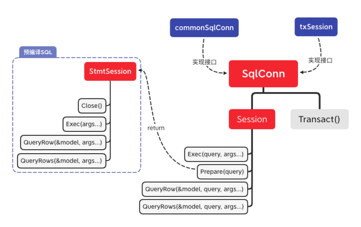

# [Go微服务实践之增删改查](https://segmentfault.com/a/1190000038410308)

> 从此篇文章开始，我们来陆续介绍 `go-zero` 开发一个项目所需要的组件和开发实践。

首先我们从 `model` 层开始，来说说`go-zero` 的API以及封装细节。首先 `model` 层连接的API集中在`core/stores`。我们先来看看操作 `mysql` 这类数据库，API方法我们来到 `core/stores/sqlx`，所以接下来用几篇的文章总体介绍一下 `sqlx` 的使用和设计思想。

## 快速使用

```go
func main() {
  // 1
  const datasource = "user:password@/dbname"
  mysqlDB := sqlx.NewMysql(datasource)
  // 2
  um := model.NewUserModel(mysqlDB,"User")
  // 3
  ul := logic.NewUserLogic(um)
  // 4
  engine.AddRoutes(nginxApi(ul))
  engine.Start()
}

// NewUserModel，NewUserLogic 类似
func NewUserModel(conn sqlx.SqlConn, table string) *UserModel {
    return &UserModel{conn: conn, table: table}
}

// nginxApi将logic注入到handle，同时绑定路由和handler
func nginxApi(ul *logic.UserLogic) []rest.Route {
    return []rest.Route{
        {
            Method:  http.MethodGet,
            Path:    "/user/:id", // /user/54er6;
            Handler: handler.NewUserHandler(ul).GetUserById,
    }
}
```

总结一下：

1. `NewMysql` 创建数据库连接
2. 创建相应的 `model`，并将连接传入「相应的 `NewModel` 需要开发者编写」
3. `model` 是为上一层 `logic` 提供服务
4. 将 `logic` 注入到 `handler` 中，同时 `handler` 与路由绑定，开启 `Server`

这样 `model-logic-handler `最简单的结构就出来了。然后来看看在 `model` 层如何进行数据操作：

```go
var userBuilderQueryRows = strings.Join(builderx.FieldNames(&User{}), ",")

type User struct {
  Avatar string `db:"avatar"` // 头像
  UserName string `db:"user_name"` // 姓名
  Sex int `db:"sex"` // 1男,2女
  MobilePhone string `db:"mobile_phone"` // 手机号
}

func (um *UserModel) Insert(user *User) (int64, error) {
  const insertsql = `insert into `+um.table+` (`+userBuilderQueryRows+`) values(?, ?, ?)`
  // insert「delete使用方式一致」
  res, err := um.conn.Exec(insertsql, user.Avatar, user.UserName, user.Sex, user.MobilePhone)
  if err != nil {
    logx.Errorf("insert User Position Model Model err, err=%v", err)
    return -1, err
  }
  id, err := res.LastInsertId()
    if err != nil {
        logx.Errorf("insert User Model to Id  parse id err,err=%v", err)
        return -1, err
    }
    return id, nil
}

func (um *UserModel) FindOne(uid int64) (*User, error) {
  var user User
  // query
  const querysql = `select `+userBuilderQueryRows+` from `+um.table+` where id=? limit 1`
    err := um.conn.QueryRow(&user, querysql, uid)
    if err != nil {
        logx.Errorf("userModile.findOne error ,id=%d,err=%s", uid, err.Error())
        if err == sqlx.ErrNotFound {
            return nil, ErrNotFound
        }
        return nil, err
    }
    return &user, nil
}
```

- `insert/update/delete`：`conn.Exec(insertsql/updatesql/deletesql, args...)`
- `query`：`conn.QueryRow(&model, querysql, args...)`

上述就是最简单的 `crud` 的结构：首先是构建 `model` ，然后操作 `model` 进行操作。

## 代码结构

| 文件名          | 作用                      |
| --------------- | ------------------------- |
| bulkinserter.go | 批量插入                  |
| mysql.go        | NewMysql                  |
| orm.go          | 解析，序列化`model`的操作 |
| sqlconn.go      | 抽象`crud`操作的接口      |
| tx.go           | 事务操作                  |

从 `sqlconn.go` 的相互接口关系：



可以看出：`commonSqlConn` 和 `txSession` 是真正实现的地方。先从 `API` 的功能整体介绍一下：

| API                                     | 参数                | 作用                                                         |
| --------------------------------------- | ------------------- | ------------------------------------------------------------ |
| Exec(query, args...)                    | sql, sql参数        | insert/update/delete                                         |
| Prepare(query)                          | sql                 | 预编译sql                                                    |
| QueryRow(&model, query, args...)        | model, sql, sql参数 | 查询一行数据同时赋值给「model」                              |
| QueryRowPartial(&model, query, args...) | model, sql, sql参数 | 功能同上，但是select sql可以只选取model的部分column「映衬Partial」 |
| QueryRows/QueryRowsPartial              | 同上                | 查询多行API                                                  |
| Transact(func(session Session) error)   | 事务操作            | 将参数中的操作用事务包裹，开发者只需专注参数中的函数编写     |

## 总结

`go-zero` 的 `sqlx` 屏蔽了go原生的sql操作，开发者只需关注sql编写和业务封装的数据对象，不需要像原生开发中需要手动prepare，赋值数据时Scan。

本节只是简略介绍了接口的相互关系以及开发者平时关注的API，下节将着重分析**go-zero是怎么帮你赋值数据，同时在并发大的情况下，如何不让流量直接把你的数据库打死**。

## 参考

- [go-zero sqlx](https://link.segmentfault.com/?enc=Z4WuydzelvF62EhQY%2FyEsA%3D%3D.9YBaeV2Ysd1YRirjppVO31ZOzU2UKDWRwEb0rNmG0lzQiFmbRnXEchhjRRSD8iy9WgqRq8i%2BbrB6eDTbV8OYySBFxJmqTzUmM9EkvYoeX1k%3D)
- Go database/sql tutorial