# [Go语言核心36讲 学习笔记](https://www.cnblogs.com/MingsonZheng/p/15391268.html)

## 开篇词 | 跟着学，你也能成为Go语言高手

Go 语言是由 Google 出品的一门通用型计算机编程语言。

Go 程序可以在装有 Windows、Linux、FreeBSD 等操作系统的服务器上运行，并用于提供基础软件支撑、API 服务、Web 服务、网页服务等等。

Go 语言也在移动端进行了积极的探索，现在在 Android 和 iOS 上都可以运行其程序。另外，Go 语言也已经与 WebAssembly 强强联合，加入了 WASM 平台。这意味着过不了多久，互联网浏览器也可以运行 Go 编写的程序了。

从公司角度看，许多大厂都已经拥抱 Go 语言，包括以 Java 打天下的阿里巴巴，更别提深爱着 Go 语言的滴滴、今日头条、小米、奇虎 360、京东等明星公司。同时，创业公司也很喜欢 Go 语言，主要因为其入门快、程序库多、运行迅速，很适合快速构建互联网软件产品，比如轻松筹、快手、知乎、探探、美图、猎豹移动等等。

下面，我们一起浏览一下本专栏的主要模块，一共分成 3 大模块，5 个章节。

- 基础概念：我会讲述 Go 语言基础中的基础，包括一些基本概念和运作机制。它们都应该是你初识 Go 语言时必须知道的，同时也有助于你理解后面的知识。
- 数据类型和语句：Go 语言中的数据类型大都是很有特色的，你只有理解了它们才能真正玩转 Go 语言。我将和你一起与探索它们的奥妙。另外，我也会一一揭示怎样使用各种语法和语句操纵它们。
- Go 程序的测试：很多程序员总以为测试是另一个团队的事情，其实不然。单元测试甚至接口测试其实都应该是程序员去做的，并且应该受到重视。在 Go 语言中怎样做好测试这件事？我会跟你说清楚、讲明白。
- 标准库的用法：虽然 Go 语言提供了自己的高效并发编程方式，但是同步方法依然不容忽视。这些方法集中在sync代码包及其子包中。这部分还涉及了字节和字符问题、OS 操控方法和 Web 服务写法等，这些都是我们在日常工作中很可能会用到的。
- Go 语言拾遗：这部分将会讲述一些我们使用 Go 语言做软件项目的过程中很可能会遇到的问题。

## 导读 | 写给0基础入门的Go语言学习者

### 1. 你需要遵循怎样的学习路径来学习 Go 语言？

#### Go语言学习路线

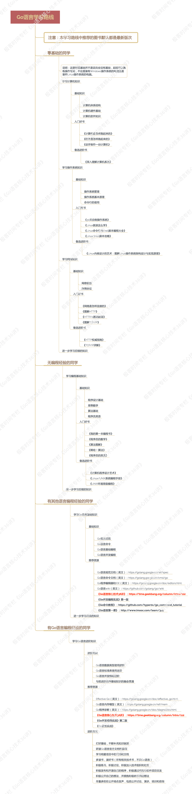

### 2. 学习本专栏前，你需要有哪些基础知识储备？

- 有一定的计算机基础，比如，知道操作系统是什么、环境变量怎么设置、命令行怎样使用，等等。
- 具备一点点编程知识，比如，知道程序是什么、程序通常会以怎样的形式存在，以及程序与操作系统和计算机有哪些关系，等等。
- 知道那些最最基本的网络知识。

从 2018 年开始，随着 Google 逐渐重回中国，Go 语言的官方网站在 Google 中国的域名下也有了镜像，毕竟中国是 Go 语言爱好者最多的国家，同时也是 Go 语言使用最广泛的一片土地。如果你在国内，可以敲入这个网址 https://golang.google.cn/ 来访问 Go 语言的官网。

这个专栏专注于 Go 语言的核心知识，因此我并不会深入说明所有关于语法和命令的细枝末节。如果你想去全面了解 Go 语言的所有语法，那么可以去 Go 语言官网的语言规范页面 https://golang.google.cn/ref/spec 仔细查阅。

如果你想专门学习一下 Go 命令方面的知识和技巧，那么我推荐你看看我之前写的免费开源教程《Go 命令教程 https://github.com/hyper0x/go_command_tutorial 》。这份教程的内容虽然稍显陈旧，但是帮助你学会使用 Go 语言自带的常用命令和工具肯定是没问题的。

### 3. 这里有一份基础知识列表，请查收

#### Go 语言基础知识的导图

## 导读 | 学习专栏的正确姿势

### 实践的正确姿势

给大家的第一个建议一般都是“去写网络爬虫吧”。

互联网络的世界很庞杂，但又有一定的规律可循，是非常好的技术学习环境。你编写一个网络服务程序，即使放到了公共的网络上，也还需要考虑清楚一系列的问题，才能让你有足够多的技术磨炼机会，比如，服务的种类、功能、规则、安全、界面、受众、宣传和访问途径，以及日常的非技术性维护。

我们要让程序去模拟人的行为，模拟人使用网络浏览器访问网站内容的过程，而不是用尽计算力去疯狂地霸占人家的带宽和服务，否则那不就成了网络攻击了。这是一个非常重要的自我实践的技巧，请大家记住，“利己，但不要损人”。

注意，正常爬取网站内容并不意味着失去了高并发的应用场景。把内容下载下来只是一个开始，后边还有不少的工作要做呢。

单单“模拟人”这一点就需要花一些心思。而且，你可以同时爬取成千上万的同类甚至不同类的网站。这已经足够你研究和实践很长一段时间了。我在这里还要郑重地提示一下，做这类技术研究一定不要跨越道德的底线，更不能违反法律。

再进一步，我们最好以结构化的形式把爬取到的网络内容存储下来。当得到足够多的数据之后，你的选择就很多了。比如，对某类数据进行整理、提取和分析，从而挖掘出更有价值的东西。这就属于数据挖掘的范畴了。

在如今这个数据过剩的时代，这也是一项很重要的技能。又比如，基于这些数据提供统一的访问接口，制作成搜索引擎，甚至对外提供服务。这也是一个很有深度的选择。

### 优秀 Go 项目推荐


## 01 | 工作区和GOPATH

从 Go 1.5 版本的自举（即用 Go 语言编写程序来实现 Go 语言自身），到 Go 1.7 版本的极速 GC（也称垃圾回收器），再到 2018 年 2 月发布的 Go 1.10 版本对其自带工具的全面升级，以及可预见的后续版本关键特性（比如用来做程序依赖管理的go mod命令），这一切都令我们欢欣鼓舞。Go 语言在一步步走向辉煌的同时，显然已经成为软件工程师们最喜爱的编程语言之一。

我们学习 Go 语言时，要做的第一件事，都是根据自己电脑的计算架构（比如，是 32 位的计算机还是 64 位的计算机）以及操作系统（比如，是 Windows 还是 Linux），从Go 语言官网 https://golang.google.cn/ 下载对应的二进制包，也就是可以拿来即用的安装包。

随后，我们会解压缩安装包、放置到某个目录、配置环境变量，并通过在命令行中输入go version来验证是否安装成功。

在这个过程中，我们还需要配置 3 个环境变量，也就是 GOROOT、GOPATH 和 GOBIN。

- GOROOT：Go 语言安装根目录的路径，也就是 GO 语言的安装路径。
- GOPATH：若干工作区目录的路径。是我们自己定义的工作空间。
- GOBIN：GO 程序生成的可执行文件（executable file）的路径。

其中，GOPATH 背后的概念是最多的，也是最重要的。那么，今天我们的面试问题是：你知道设置 GOPATH 有什么意义吗？

关于这个问题，它的典型回答是这样的：

你可以把 GOPATH 简单理解成 Go 语言的工作目录，它的值是一个目录的路径，也可以是多个目录路径，每个目录都代表 Go 语言的一个工作区（workspace）。

我们需要利于这些工作区，去放置 Go 语言的源码文件（source file），以及安装（install）后的归档文件（archive file，也就是以“.a”为扩展名的文件）和可执行文件（executable file）。

事实上，由于 Go 语言项目在其生命周期内的所有操作（编码、依赖管理、构建、测试、安装等）基本上都是围绕着 GOPATH 和工作区进行的。所以，它的背后至少有 3 个知识点，分别是：

- Go 语言源码的组织方式是怎样的；
- 你是否了解源码安装后的结果（只有在安装后，Go 语言源码才能被我们或其他代码使用）；
- 你是否理解构建和安装 Go 程序的过程（这在开发程序以及查找程序问题的时候都很有用，否则你很可能会走弯路）。

### 知识扩展

#### 1. Go 语言源码的组织方式

与许多编程语言一样，Go 语言的源码也是以代码包为基本组织单位的。在文件系统中，这些代码包其实是与目录一一对应的。由于目录可以有子目录，所以代码包也可以有子包。

一个代码包中可以包含任意个以.go 为扩展名的源码文件，这些源码文件都需要被声明属于同一个代码包。

代码包的名称一般会与源码文件所在的目录同名。如果不同名，那么在构建、安装的过程中会以代码包名称为准。

每个代码包都会有导入路径。代码包的导入路径是其他代码在使用该包中的程序实体时，需要引入的路径。在实际使用程序实体之前，我们必须先导入其所在的代码包。具体的方式就是import该代码包的导入路径。就像这样：

```
import "github.com/labstack/echo"
```

在工作区中，一个代码包的导入路径实际上就是从 src 子目录，到该包的实际存储位置的相对路径。

所以说，Go 语言源码的组织方式就是以环境变量 GOPATH、工作区、src 目录和代码包为主线的。一般情况下，Go 语言的源码文件都需要被存放在环境变量 GOPATH 包含的某个工作区（目录）中的 src 目录下的某个代码包（目录）中。

#### 2. 了解源码安装后的结果

了解了 Go 语言源码的组织方式后，我们很有必要知道 Go 语言源码在安装后会产生怎样的结果。

源码文件以及安装后的结果文件都会放到哪里呢？我们都知道，源码文件通常会被放在某个工作区的 src 子目录下。

那么在安装后如果产生了归档文件（以“.a”为扩展名的文件），就会放进该工作区的 pkg 子目录；如果产生了可执行文件，就可能会放进该工作区的 bin 子目录。

##### 归档文件存放的具体位置和规则

源码文件会以代码包的形式组织起来，一个代码包其实就对应一个目录。安装某个代码包而产生的归档文件是与这个代码包同名的。

放置它的相对目录就是该代码包的导入路径的直接父级。比如，一个已存在的代码包的导入路径是

```
github.com/labstack/echo，
```

那么执行命令

```
go install github.com/labstack/echo@latest
```

生成的归档文件的相对目录就是 https://github.com/labstack，文件名为 echo.a。

访问github超时可以配置七牛云代理

```
go env -w GOPROXY=https://goproxy.cn,direct
```

也可以安装指定版本，这里安装了v4版本

```
go get github.com/labstack/echo/v4
```

顺便说一下，上面这个代码包导入路径还有另外一层含义，那就是：该代码包的源码文件存在于 GitHub 网站的 labstack 组的代码仓库 echo 中。

再说回来，归档文件的相对目录与 pkg 目录之间还有一级目录，叫做平台相关目录。平台相关目录的名称是由 build（也称“构建”）的目标操作系统、下划线和目标计算架构的代号组成的。

比如，构建某个代码包时的目标操作系统是 Linux，目标计算架构是 64 位的，那么对应的平台相关目录就是 linux_amd64。

因此，上述代码包的归档文件就会被放置在当前工作区的子目录 pkg/linux_amd64/github.com/labstack 中。

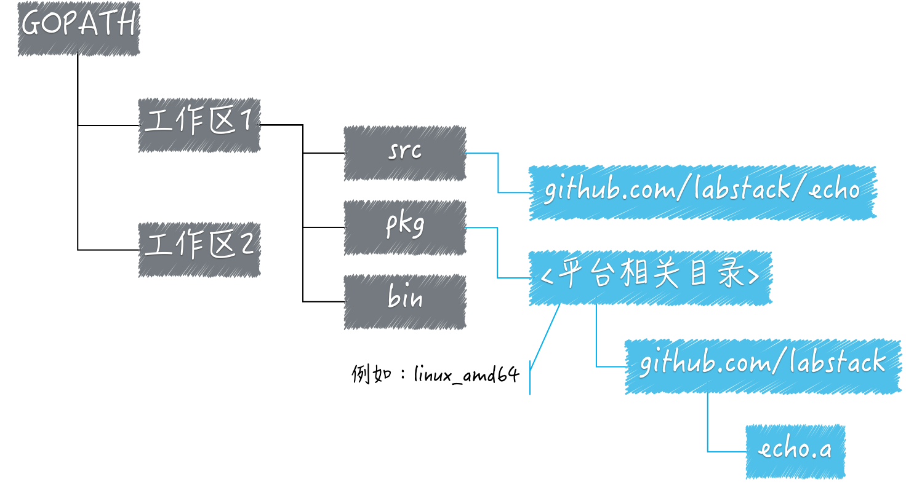

（GOPATH 与工作区）

总之，你需要记住的是，某个工作区的 src 子目录下的源码文件在安装后一般会被放置到当前工作区的 pkg 子目录下对应的目录中，或者被直接放置到该工作区的 bin 子目录中。

#### 3. 理解构建和安装 Go 程序的过程

构建使用命令go build，安装使用命令go install。构建和安装代码包的时候都会执行编译、打包等操作，并且，这些操作生成的任何文件都会先被保存到某个临时的目录中。

如果构建的是库源码文件，那么操作后产生的结果文件只会存在于临时目录中。这里的构建的主要意义在于检查和验证。

如果构建的是命令源码文件，那么操作的结果文件会被搬运到源码文件所在的目录中。

安装操作会先执行构建，然后还会进行链接操作，并且把结果文件搬运到指定目录。

进一步说，如果安装的是库源码文件，那么结果文件会被搬运到它所在工作区的 pkg 目录下的某个子目录中。

如果安装的是命令源码文件，那么结果文件会被搬运到它所在工作区的 bin 目录中，或者环境变量GOBIN指向的目录中。

这里你需要记住的是，构建和安装的不同之处，以及执行相应命令后得到的结果文件都会出现在哪里。

### 思考题

- Go 语言在多个工作区中查找依赖包的时候是以怎样的顺序进行的？
- 如果在多个工作区中都存在导入路径相同的代码包会产生冲突吗？

这两个问题之间其实是有一些关联的。答案并不复杂，做几个试验几乎就可以找到它了。你也可以看一下 Go 语言标准库中go build包及其子包的源码。那里面的宝藏也很多，可以助你深刻理解 Go 程序的构建过程。

### 补充阅读

#### go build 命令一些可选项的用途和用法

在运行go build命令的时候，默认不会编译目标代码包所依赖的那些代码包。当然，如果被依赖的代码包的归档文件不存在，或者源码文件有了变化，那它还是会被编译。

如果要强制编译它们，可以在执行命令的时候加入标记-a。此时，不但目标代码包总是会被编译，它依赖的代码包也总会被编译，即使依赖的是标准库中的代码包也是如此。

另外，如果不但要编译依赖的代码包，还要安装它们的归档文件，那么可以加入标记-i。

那么我们怎么确定哪些代码包被编译了呢？有两种方法。

- 运行go build命令时加入标记-x，这样可以看到go build命令具体都执行了哪些操作。另外也可以加入标记-n，这样可以只查看具体操作而不执行它们。
- 运行go build命令时加入标记-v，这样可以看到go build命令编译的代码包的名称。它在与-a标记搭配使用时很有用。

下面再说一说与 Go 源码的安装联系很紧密的一个命令：go get。

命令go get会自动从一些主流公用代码仓库（比如 GitHub）下载目标代码包，并把它们安装到环境变量GOPATH包含的第 1 工作区的相应目录中。如果存在环境变量GOBIN，那么仅包含命令源码文件的代码包会被安装到GOBIN指向的那个目录。

最常用的几个标记有下面几种。

- -u：下载并安装代码包，不论工作区中是否已存在它们。
- -d：只下载代码包，不安装代码包。
- -fix：在下载代码包后先运行一个用于根据当前 Go 语言版本修正代码的工具，然后再安装代码包。
- -t：同时下载测试所需的代码包。
- -insecure：允许通过非安全的网络协议下载和安装代码包。HTTP 就是这样的协议。

Go 语言官方提供的go get命令是比较基础的，其中并没有提供依赖管理的功能。目前 GitHub 上有很多提供这类功能的第三方工具，比如glide、gb以及官方出品的dep、vgo等等，它们在内部大都会直接使用go get。

有时候，我们可能会出于某种目的变更存储源码的代码仓库或者代码包的相对路径。这时，为了让代码包的远程导入路径不受此类变更的影响，我们会使用自定义的代码包导入路径。

对代码包的远程导入路径进行自定义的方法是：在该代码包中的库源码文件的包声明语句的右边加入导入注释，像这样：

```go
package semaphore // import "golang.org/x/sync/semaphore"
```

这个代码包原本的完整导入路径是 github.com/golang/sync/semaphore 。这与实际存储它的网络地址对应的。该代码包的源码实际存在 GitHub 网站的 golang 组的 sync 代码仓库的 semaphore 目录下。而加入导入注释之后，用以下命令即可下载并安装该代码包了：

```shell
go get golang.org/x/sync/semaphore
```

而 Go 语言官网 golang.org 下的路径 /x/sync/semaphore 并不是存放semaphore包的真实地址。我们称之为代码包的自定义导入路径。

不过，这还需要在 golang.org 这个域名背后的服务端程序上，添加一些支持才能使这条命令成功。

关于自定义代码包导入路径的完整说明可以参看这里 https://github.com/hyper0x/go_command_tutorial/blob/master/0.3.md。

好了，对于go build命令和go get命令的简短介绍就到这里。如果你想查阅更详细的文档，那么可以访问 Go 语言官方的命令文档页面 https://golang.google.cn/cmd/go/，或者在命令行下输入诸如go help build这类的命令。

## 02 | 命令源码文件

我们已经知道，环境变量 GOPATH 指向的是一个或多个工作区，每个工作区中都会有以代码包为基本组织形式的源码文件。

这里的源码文件又分为三种，即：命令源码文件、库源码文件和测试源码文件，它们都有着不同的用途和编写规则。


对于 Go 语言学习者来说，你在学习阶段中，也一定会经常编写可以直接运行的程序。这样的程序肯定会涉及命令源码文件的编写，而且，命令源码文件也可以很方便地用go run命令启动。

那么，我今天的问题就是：命令源码文件的用途是什么，怎样编写它？

这里，我给出你一个参考的回答：命令源码文件是程序的运行入口，是每个可独立运行的程序必须拥有的。我们可以通过构建或安装，生成与其对应的可执行文件，后者一般会与该命令源码文件的直接父目录同名。

如果一个源码文件声明属于main包，并且包含一个无参数声明且无结果声明的main函数，那么它就是命令源码文件。 就像下面这段代码：

```go
package main

import "fmt"

func main() {
  fmt.Println("Hello, world!")
}
```

如果你把这段代码存成 demo1.go 文件，那么运行go run demo1.go命令后就会在屏幕（标准输出）中看到Hello, world!

当需要模块化编程时，我们往往会将代码拆分到多个文件，甚至拆分到不同的代码包中。但无论怎样，对于一个独立的程序来说，命令源码文件永远只会也只能有一个。如果有与命令源码文件同包的源码文件，那么它们也应该声明属于main包。

### 知识精讲

#### 1. 命令源码文件怎样接收参数

我们先看一段不完整的代码：

```go
package main

import (
  // 需在此处添加代码。[1]
  "fmt"
)

var name string

func init() {
  // 需在此处添加代码。[2]
}

func main() {
  // 需在此处添加代码。[3]
  fmt.Printf("Hello, %s!\n", name)
}
```

如果邀请你帮助我，在注释处添加相应的代码，并让程序实现”根据运行程序时给定的参数问候某人”的功能，你会打算怎样做？

首先，Go 语言标准库中有一个代码包专门用于接收和解析命令参数。这个代码包的名字叫flag。

我之前说过，如果想要在代码中使用某个包中的程序实体，那么应该先导入这个包。因此，我们需要在[1]处添加代码"flag"。注意，这里应该在代码包导入路径的前后加上英文半角的引号。如此一来，上述代码导入了flag和fmt这两个包。

其次，人名肯定是由字符串代表的。所以我们要在[2]处添加调用flag包的StringVar函数的代码。就像这样：

```
flag.StringVar(&name, "name", "everyone", "The greeting object.")
```

函数flag.StringVar接受 4 个参数。

- 第 1 个参数是用于存储该命令参数值的地址，具体到这里就是在前面声明的变量name的地址了，由表达式&name表示。
- 第 2 个参数是为了指定该命令参数的名称，这里是name。
- 第 3 个参数是为了指定在未追加该命令参数时的默认值，这里是everyone。
- 至于第 4 个函数参数，即是该命令参数的简短说明了，这在打印命令说明时会用到。

顺便说一下，还有一个与flag.StringVar函数类似的函数，叫flag.String。这两个函数的区别是，后者会直接返回一个已经分配好的用于存储命令参数值的地址。如果使用它的话，我们就需要把

```
var name string
```

改为

```
var name = flag.String("name", "everyone", "The greeting object.")
```

所以，如果我们使用flag.String函数就需要改动原有的代码。这样并不符合上述问题的要求。

再说最后一个填空。我们需要在[3]处添加代码flag.Parse()。函数flag.Parse用于真正解析命令参数，并把它们的值赋给相应的变量。

对该函数的调用必须在所有命令参数存储载体的声明（这里是对变量name的声明）和设置（这里是在[2]处对flag.StringVar函数的调用）之后，并且在读取任何命令参数值之前进行。

正因为如此，我们最好把flag.Parse()放在main函数的函数体的第一行。

#### 2. 怎样在运行命令源码文件的时候传入参数，又怎样查看参数的使用说明

如果我们把上述代码存成名为 demo2.go 的文件，那么运行如下命令就可以为参数name传值：

```
go run demo2.go -name="Robert"
```

运行后，打印到标准输出（stdout）的内容会是：

```
Hello, Robert!
```

另外，如果想查看该命令源码文件的参数说明，可以这样做：

```
$ go run demo2.go --help
```

其中的$表示我们是在命令提示符后运行go run命令的。运行后输出的内容会类似：

```
Usage of /var/folders/ts/7lg_tl_x2gd_k1lm5g_48c7w0000gn/T/go-build155438482/b001/exe/demo2:
 -name string
    The greeting object. (default "everyone")
exit status 2
```

你可能不明白下面这段输出代码的意思。

```
/var/folders/ts/7lg_tl_x2gd_k1lm5g_48c7w0000gn/T/go-build155438482/b001/exe/demo2
```

这其实是go run命令构建上述命令源码文件时临时生成的可执行文件的完整路径。

如果我们先构建这个命令源码文件再运行生成的可执行文件，像这样：

```
$ go build demo2.go
$ ./demo2 --help
```

那么输出就会是

```
Usage of ./demo2:
 -name string
    The greeting object. (default "everyone")
```

#### 3. 怎样自定义命令源码文件的参数使用说明

这有很多种方式，最简单的一种方式就是对变量flag.Usage重新赋值。flag.Usage的类型是func()，即一种无参数声明且无结果声明的函数类型。

flag.Usage变量在声明时就已经被赋值了，所以我们才能够在运行命令go run demo2.go --help时看到正确的结果。

注意，对flag.Usage的赋值必须在调用flag.Parse函数之前。

现在，我们把 demo2.go 另存为 demo3.go，然后在main函数体的开始处加入如下代码。

```
flag.Usage = func() {
 fmt.Fprintf(os.Stderr, "Usage of %s:\n", "question")
 flag.PrintDefaults()
}
```

那么当运行

```
$ go run demo3.go --help
```

后，就会看到

```
Usage of question:
 -name string
    The greeting object. (default "everyone")
exit status 2
```

现在再深入一层，我们在调用flag包中的一些函数（比如StringVar、Parse等等）的时候，实际上是在调用flag.CommandLine变量的对应方法。

flag.CommandLine相当于默认情况下的命令参数容器。所以，通过对flag.CommandLine重新赋值，我们可以更深层次地定制当前命令源码文件的参数使用说明。

现在我们把main函数体中的那条对flag.Usage变量的赋值语句注销掉，然后在init函数体的开始处添加如下代码：

```
flag.CommandLine = flag.NewFlagSet("", flag.ExitOnError)
flag.CommandLine.Usage = func() {
  fmt.Fprintf(os.Stderr, "Usage of %s:\n", "question")
  flag.PrintDefaults()
}
```

再运行命令go run demo3.go --help后，其输出会与上一次的输出的一致。不过后面这种定制的方法更加灵活。比如，当我们把为flag.CommandLine赋值的那条语句改为

```
flag.CommandLine = flag.NewFlagSet("", flag.PanicOnError)
```

后，再运行go run demo3.go --help命令就会产生另一种输出效果。这是由于我们在这里传给flag.NewFlagSet函数的第二个参数值是flag.PanicOnError。flag.PanicOnError和flag.ExitOnError都是预定义在flag包中的常量。

flag.ExitOnError的含义是，告诉命令参数容器，当命令后跟--help或者参数设置的不正确的时候，在打印命令参数使用说明后以状态码2结束当前程序。

状态码2代表用户错误地使用了命令，而flag.PanicOnError与之的区别是在最后抛出“运行时恐慌（panic）”。

上述两种情况都会在我们调用flag.Parse函数时被触发。顺便提一句，“运行时恐慌”是 Go 程序错误处理方面的概念。

下面再进一步，我们索性不用全局的flag.CommandLine变量，转而自己创建一个私有的命令参数容器。我们在函数外再添加一个变量声明：

```
var cmdLine = flag.NewFlagSet("question", flag.ExitOnError)
```

然后，我们把对flag.StringVar的调用替换为对cmdLine.StringVar调用，再把flag.Parse()替换为cmdLine.Parse(os.Args[1:])。

其中的os.Args[1:]指的就是我们给定的那些命令参数。这样做就完全脱离了flag.CommandLine。*flag.FlagSet类型的变量cmdLine拥有很多有意思的方法。你可以去探索一下。

这样做的好处依然是更灵活地定制命令参数容器。但更重要的是，你的定制完全不会影响到那个全局变量flag.CommandLine。

### 总结

如果你想详细了解flag包的用法，可以到这个网址 https://golang.google.cn/pkg/flag/ 查看文档。或者直接使用godoc命令在本地启动一个 Go 语言文档服务器。怎样使用godoc命令？你可以参看这里 https://github.com/hyper0x/go_command_tutorial/blob/master/0.5.md。

### 思考题

我们已经见识过为命令源码文件传入字符串类型的参数值的方法，那还可以传入别的吗？

- 默认情况下，我们可以让命令源码文件接受哪些类型的参数值？
- 我们可以把自定义的数据类型作为参数值的类型吗？如果可以，怎样做？

## 03 | 库源码文件

在我的定义中，库源码文件是不能被直接运行的源码文件，它仅用于存放程序实体，这些程序实体可以被其他代码使用（只要遵从 Go 语言规范的话）。

这里的“其他代码”可以与被使用的程序实体在同一个源码文件内，也可以在其他源码文件，甚至其他代码包中。

那么程序实体是什么呢？在 Go 语言中，程序实体是变量、常量、函数、结构体和接口的统称。我们总是会先声明（或者说定义）程序实体，然后再去使用。

比如在上一篇的例子中，我们先定义了变量name，然后在main函数中调用fmt.Printf函数的时候用到了它。

回到正题。

我们今天的问题是：怎样把命令源码文件中的代码拆分到其他库源码文件？

我们用代码演示，把这个问题说得更具体一些。

如果在某个目录下有一个命令源码文件 demo4.go，如下：

```
package main

import (
  "flag"
)

var name string

func init() {
  flag.StringVar(&name, "name", "everyone", "The greeting object.")
}

func main() {
  flag.Parse()
  hello(name)
}
```

其中的代码你应该比较眼熟了。我在讲命令源码文件的时候贴过很相似的代码，那个源码文件名为 demo2.go。

这两个文件的不同之处在于，demo2.go 直接通过调用fmt.Printf函数打印问候语，而当前的 demo4.go 在同样位置调用了一个叫作hello的函数。

函数hello被声明在了另外一个源码文件中，我把它命名为 demo4_lib.go，并且放在与 demo4.go 相同的目录下。如下：

```
// 需在此处添加代码。[1]

import "fmt"

func hello(name string) {
  fmt.Printf("Hello, %s!\n", name)
}
```

那么问题来了：注释 1 处应该填入什么代码？

### 典型回答

答案很简单，填入代码包声明语句package main。为什么？我之前说过，在同一个目录下的源码文件都需要被声明为属于同一个代码包。

如果该目录下有一个命令源码文件，那么为了让同在一个目录下的文件都通过编译，其他源码文件应该也声明属于main包。

如此一来，我们就可以运行它们了。比如，我们可以在这些文件所在的目录下运行如下命令并得到相应的结果。

```
$ go run demo4.go demo4_lib.go 
Hello, everyone!
```

或者，像下面这样先构建当前的代码包再运行。

```
$ go build demo4
$ ./demo4
Hello, everyone!
```

或者，像下面这样先构建当前的代码包再运行。

```
$ go build puzzlers/article3/q1
$ ./q1            
Hello, everyone!
```

go build puzzlers/article3/q1 报错

```
go: go.mod file not found in current directory or any parent directory; see 'go help modules'
```

需要先在根目录安装 mod

```
PS F:\Golang\Golang_Puzzlers> go mod init Golang_Puzzlers
```

在这里，我把 demo4.go 和 demo4_lib.go 都放在了一个相对路径为puzzlers/article3/q1的目录中。

在默认情况下，相应的代码包的导入路径会与此一致。我们可以通过代码包的导入路径引用其中声明的程序实体。但是，这里的情况是不同的。

注意，demo4.go 和 demo4_lib.go 都声明自己属于main包。我在前面讲 Go 语言源码的组织方式的时候提到过这种用法，即：源码文件声明的包名可以与其所在目录的名称不同，只要这些文件声明的包名一致就可以。

顺便说一下，我为本专栏创建了一个名为“Golang_Puzzlers”的项目 https://github.com/hyper0x/Golang_Puzzlers。该项目的 src 子目录下会存有我们涉及的所有代码和相关文件。

也就是说，正确的用法是，你需要把该项目的打包文件下载到本地的任意目录下，然后经解压缩后把“Golang_Puzzlers”目录加入到环境变量GOPATH中，配置环境变量之后需要重启Terminal。还记得吗？这会使“Golang_Puzzlers”目录成为工作区之一。

### 问题解析

这个问题考察的是代码包声明的基本规则。

第一条规则，同目录下的源码文件的代码包声明语句要一致。也就是说，它们要同属于一个代码包。这对于所有源码文件都是适用的。

如果目录中有命令源码文件，那么其他种类的源码文件也应该声明属于main包。这也是我们能够成功构建和运行它们的前提。

第二条规则，源码文件声明的代码包的名称可以与其所在的目录的名称不同。在针对代码包进行构建时，生成的结果文件的主名称与其父目录的名称一致。

对于命令源码文件而言，构建生成的可执行文件的主名称会与其父目录的名称相同，这在我前面的回答中也验证过了。

### 知识精讲

#### 1. 怎样把命令源码文件中的代码拆分到其他代码包？

我们先不用关注拆分代码的技巧。我在这里仍然依从前面的拆分方法。我把 demo4.go 另存为 demo5.go，并放到一个相对路径为puzzlers/article3/q2的目录中。

然后我再创建一个相对路径为puzzlers/article3/q2/lib的目录，再把 demo4_lib.go 复制一份并改名为 demo5_lib.go 放到该目录中。

现在，为了让它们通过编译，我们应该怎样修改代码？你可以先思考一下。我在这里给出一部分答案，我们一起来看看已经过修改的 demo5_lib.go 文件。

```
package lib5

import "fmt"

func Hello(name string) {
  fmt.Printf("Hello, %s!\n", name)
}
```

可以看到，我在这里修改了两个地方。第一个改动是，我把代码包声明语句由package main改为了package lib5。注意，我故意让声明的包名与其所在的目录的名称不同。第二个改动是，我把全小写的函数名hello改为首字母大写的Hello。

基于以上改动，我们再来看下面的几个问题。

#### 2. 代码包的导入路径总会与其所在目录的相对路径一致吗？

库源码文件 demo5_lib.go 所在目录的相对路径是puzzlers/article3/q2/lib，而它却声明自己属于lib5包。在这种情况下，该包的导入路径是puzzlers/article3/q2/lib，还是puzzlers/article3/q2/lib5？

这个问题往往会让 Go 语言的初学者们困惑，就算是用 Go 开发过程序的人也不一定清楚。我们一起来看看。

首先，我们在构建或者安装这个代码包的时候，提供给go命令的路径应该是目录的相对路径，就像这样：

```
go install puzzlers/article3/q2/lib 
```

该命令会成功完成。之后，当前工作区的 pkg 子目录下会产生相应的归档文件，具体的相对路径是:

```
pkg/darwin_amd64/puzzlers/article3/q2/lib.a
```

其中的darwin_amd64就是我在讲工作区时提到的平台相关目录。可以看到，这里与源码文件所在目录的相对路径是对应的。

为了进一步说明问题，我需要先对 demo5.go 做两个改动。第一个改动是，在以import为前导的代码包导入语句中加入puzzlers/article3/q2/lib，也就是试图导入这个代码包。

第二个改动是，把对hello函数的调用改为对lib.Hello函数的调用。其中的lib.叫做限定符，旨在指明右边的程序实体所在的代码包。不过这里与代码包导入路径的完整写法不同，只包含了路径中的最后一级lib，这与代码包声明语句中的规则一致。

现在，我们可以通过运行go run demo5.go命令试一试。错误提示会类似于下面这种。

```
./demo5.go:5:2: imported and not used: "puzzlers/article3/q2/lib" as lib5
./demo5.go:16:2: undefined: lib
```

第一个错误提示的意思是，我们导入了puzzlers/article3/q2/lib包，但没有实际使用其中的任何程序实体。这在 Go 语言中是不被允许的，在编译时就会导致失败。

注意，这里还有另外一个线索，那就是“as lib5”。这说明虽然导入了代码包puzzlers/article3/q2/lib，但是使用其中的程序实体的时候应该以lib5.为限定符。这也就是第二个错误提示的原因了。Go 命令找不到lib.这个限定符对应的代码包。

为什么会是这样？根本原因就是，我们在源码文件中声明所属的代码包与其所在目录的名称不同。请记住，源码文件所在的目录相对于 src 目录的相对路径就是它的代码包导入路径，而实际使用其程序实体时给定的限定符要与它声明所属的代码包名称对应。

有两个方式可以使上述构建成功完成。我在这里选择把 demo5_lib.go 文件中的代码包声明语句改为package lib。理由是，为了不让该代码包的使用者产生困惑，我们总是应该让声明的包名与其父目录的名称一致。

#### 3. 什么样的程序实体才可以被当前包外的代码引用？

你可能会有疑问，我为什么要把 demo5_lib.go 文件中的那个函数名称hello的首字母大写？实际上这涉及了 Go 语言中对于程序实体访问权限的规则。

超级简单，名称的首字母为大写的程序实体才可以被当前包外的代码引用，否则它就只能被当前包内的其他代码引用。

通过名称，Go 语言自然地把程序实体的访问权限划分为了包级私有的和公开的。对于包级私有的程序实体，即使你导入了它所在的代码包也无法引用到它。

#### 4. 对于程序实体，还有其他的访问权限规则吗？

答案是肯定的。在 Go 1.5 及后续版本中，我们可以通过创建internal代码包让一些程序实体仅仅能被当前模块中的其他代码引用。这被称为 Go 程序实体的第三种访问权限：模块级私有。

具体规则是，internal代码包中声明的公开程序实体仅能被该代码包的直接父包及其子包中的代码引用。当然，引用前需要先导入这个internal包。对于其他代码包，导入该internal包都是非法的，无法通过编译。

“Golang_Puzzlers”项目的puzzlers/article3/q4包中有一个简单的示例，可供你查看。你可以改动其中的代码并体会internal包的作用。

### 总结

我们在本篇文章中详细讨论了把代码从命令源码文件中拆分出来的方法，这包括拆分到其他库源码文件，以及拆分到其他代码包。

这里涉及了几条重要的 Go 语言基本编码规则，即：代码包声明规则、代码包导入规则以及程序实体的访问权限规则。在进行模块化编程时，你必须记住这些规则，否则你的代码很可能无法通过编译。

### 思考题

- 如果你需要导入两个代码包，而这两个代码包的导入路径的最后一级是相同的，比如：dep/lib/flag和flag，那么会产生冲突吗？
- 如果会产生冲突，那么怎样解决这种冲突，有几种方式？

## 04 | 程序实体的那些事儿（上）

还记得吗？Go 语言中的程序实体包括变量、常量、函数、结构体和接口。 Go 语言是静态类型的编程语言，所以我们在声明变量或常量的时候，都需要指定它们的类型，或者给予足够的信息，这样才可以让 Go 语言能够推导出它们的类型。

### 问题：声明变量有几种方式？

```
package main

import (
  "flag"
  "fmt"
)

func main() {
  var name string // [1]
  flag.StringVar(&name, "name", "everyone", "The greeting object.") // [2]
  flag.Parse()
  fmt.Printf("Hello, %v!\n", name)
}
```

这是一个很简单的命令源码文件，我把它命名为 demo7.go。它是 demo2.go 的微调版。我只是把变量name的声明和对flag.StringVar函数的调用，都移动到了main函数中，这分别对应代码中的注释[1]和[2]。

具体的问题是，除了var name string这种声明变量name的方式，还有其他方式吗？你可以选择性地改动注释[1]和[2]处的代码。

### 典型回答

第一种方式需要先对注释[2]处的代码稍作改动，把被调用的函数由flag.StringVar改为flag.String，传参的列表也需要随之修改，这是为了[1]和[2]处代码合并的准备工作。

```
var name = flag.String("name", "everyone", "The greeting object.")
```

合并后的代码看起来更简洁一些。我把注释[1]处的代码中的string去掉了，右边添加了一个=，然后再拼接上经过修改的[2]处代码。

注意，flag.String函数返回的结果值的类型是*string而不是string。类型*string代表的是字符串的指针类型，而不是字符串类型。因此，这里的变量name代表的是一个指向字符串值的指针。

因此，在这种情况下，那个被用来打印内容的函数调用就需要微调一下，把其中的参数name改为*name，即：fmt.Printf("Hello, %v!\n", *name)。

第二种方式与第一种方式非常类似，它基于第一种方式的代码，赋值符号=右边的代码不动，左边只留下name，再把=变成:=。

```
name := flag.String("name", "everyone", "The greeting object.")
```

### 问题解析

这个问题的基本考点有两个。一个是你要知道 Go 语言中的类型推断，以及它在代码中的基本体现，另一个是短变量声明的用法。

第一种方式中的代码在声明变量name的同时，还为它赋了值，而这时声明中并没有显式指定name的类型。

还记得吗？之前的变量声明语句是var name string。这里利用了 Go 语言自身的类型推断，而省去了对该变量的类型的声明。

你可以认为，表达式类型就是对表达式进行求值后得到结果的类型。Go 语言中的类型推断是很简约的，这也是 Go 语言整体的风格。

它只能用于对变量或常量的初始化，就像上述回答中描述的那样。对flag.String函数的调用其实就是一个调用表达式，而这个表达式的类型是*string，即字符串的指针类型。

至于第二种方式所用的短变量声明，实际上就是 Go 语言的类型推断再加上一点点语法糖。

我们只能在函数体内部使用短变量声明。在编写if、for或switch语句的时候，我们经常把它安插在初始化子句中，并用来声明一些临时的变量。而相比之下，第一种方式更加通用，它可以被用在任何地方。

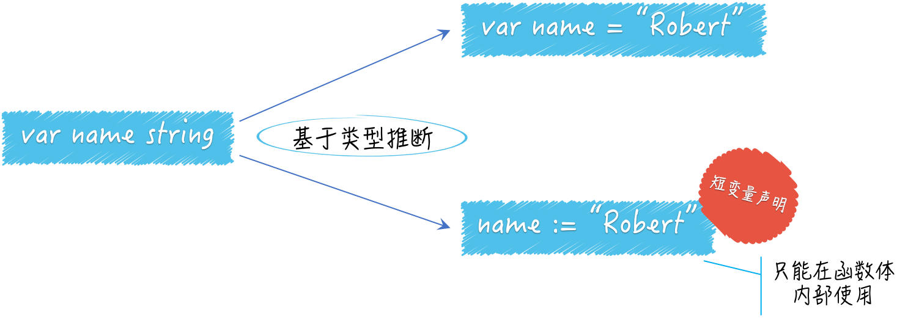

### 知识扩展

#### 1. Go 语言的类型推断可以带来哪些好处？

当然，在写代码时，我们通过使用 Go 语言的类型推断，而节省下来的键盘敲击次数几乎可以忽略不计。但它真正的好处，往往会体现在我们写代码之后的那些事情上，比如代码重构。

为了更好的演示，我们先要做一点准备工作。我们依然通过调用一个函数在声明name变量的同时为它赋值，但是这个函数不是flag.String，而是由我们自己定义的某个函数，比如叫getTheFlag。

```
package main

import (
  "flag"
  "fmt"
)

func main() {
  var name = getTheFlag()
  flag.Parse()
  fmt.Printf("Hello, %v!\n", *name)
}

func getTheFlag() *string {
  return flag.String("name", "everyone", "The greeting object.")
}
```

我们可以用getTheFlag函数包裹（或者说包装）那个对flag.String函数的调用，并把其结果直接作为getTheFlag函数的结果，结果的类型是*string。

这样一来，var name =右边的表达式，可以变为针对getTheFlag函数的调用表达式了。这实际上是对“声明并赋值name变量的那行代码”的重构。

我们通常把不改变某个程序与外界的任何交互方式和规则，而只改变其内部实现”的代码修改方式，叫做对该程序的重构。重构的对象可以是一行代码、一个函数、一个功能模块，甚至一个软件系统。

好了，在准备工作做完之后，你会发现，你可以随意改变getTheFlag函数的内部实现，及其返回结果的类型，而不用修改main函数中的任何代码。

这个命令源码文件依然可以通过编译，并且构建和运行也都不会有问题。也许你能感觉得到，这是一个关于程序灵活性的质变。

我们不显式地指定变量name的类型，使得它可以被赋予任何类型的值。也就是说，变量name的类型可以在其初始化时，由其他程序动态地确定。

在你改变getTheFlag函数的结果类型之后，Go 语言的编译器会在你再次构建该程序的时候，自动地更新变量name的类型。如果你使用过Python或Ruby这种动态类型的编程语言的话，一定会觉得这情景似曾相识。

没错，通过这种类型推断，你可以体验到动态类型编程语言所带来的一部分优势，即程序灵活性的明显提升。但在那些编程语言中，这种提升可以说是用程序的可维护性和运行效率换来的。

Go 语言是静态类型的，所以一旦在初始化变量时确定了它的类型，之后就不可能再改变。这就避免了在后面维护程序时的一些问题。另外，请记住，这种类型的确定是在编译期完成的，因此不会对程序的运行效率产生任何影响。

现在，你应该已经对这个问题有一个比较深刻的理解了。

如果只用一两句话回答这个问题的话，我想可以是这样的：Go 语言的类型推断可以明显提升程序的灵活性，使得代码重构变得更加容易，同时又不会给代码的维护带来额外负担（实际上，它恰恰可以避免散弹式的代码修改），更不会损失程序的运行效率。

#### 2. 变量的重声明是什么意思？

这涉及了短变量声明。通过使用它，我们可以对同一个代码块中的变量进行重声明。

既然说到了代码块，我先来解释一下它。在 Go 语言中，代码块一般就是一个由花括号括起来的区域，里面可以包含表达式和语句。Go 语言本身以及我们编写的代码共同形成了一个非常大的代码块，也叫全域代码块。

回到变量重声明的问题上。其含义是对已经声明过的变量再次声明。变量重声明的前提条件如下。

- 由于变量的类型在其初始化时就已经确定了，所以对它再次声明时赋予的类型必须与其原本的类型相同，否则会产生编译错误。
- 变量的重声明只可能发生在某一个代码块中。如果与当前的变量重名的是外层代码块中的变量，那么就是另外一种含义了。
- 变量的重声明只有在使用短变量声明时才会发生，否则也无法通过编译。如果要在此处声明全新的变量，那么就应该使用包含关键字var的声明语句，但是这时就不能与同一个代码块中的任何变量有重名了。
- 被“声明并赋值”的变量必须是多个，并且其中至少有一个是新的变量。这时我们才可以说对其中的旧变量进行了重声明。

这样来看，变量重声明其实算是一个语法糖（或者叫便利措施）。它允许我们在使用短变量声明时不用理会被赋值的多个变量中是否包含旧变量。可以想象，如果不这样会多写不少代码。

我把一个简单的例子写在了“Golang_Puzzlers”项目的puzzlers/article4/q3包中的 demo9.go 文件中，你可以去看一下。

这其中最重要的两行代码如下：

```
var err error
n, err := io.WriteString(os.Stdout, "Hello, everyone!\n")
```

我使用短变量声明对新变量n和旧变量err进行了“声明并赋值”，这时也是对后者的重声明。

### 总结

在本篇中，我们聚焦于最基本的 Go 语言程序实体：变量。并详细解说了变量声明和赋值的基本方法，及其背后的重要概念和知识。我们使用关键字var和短变量声明，都可以实现对变量的“声明并赋值”。

这两种方式各有千秋，有着各自的特点和适用场景。前者可以被用在任何地方，而后者只能被用在函数或者其他更小的代码块中。

不过，通过前者我们无法对已有的变量进行重声明，也就是说它无法处理新旧变量混在一起的情况。不过它们也有一个很重要的共同点，即：基于类型推断，Go 语言的类型推断只应用在了对变量或常量的初始化方面。

### 思考题

如果与当前的变量重名的是外层代码块中的变量，那么这意味着什么？

## 05 | 程序实体的那些事儿（中）

在前文中，我解释过代码块的含义。Go 语言的代码块是一层套一层的，就像大圆套小圆。

一个代码块可以有若干个子代码块；但对于每个代码块，最多只会有一个直接包含它的代码块（后者可以简称为前者的外层代码块）。

这种代码块的划分，也间接地决定了程序实体的作用域。我们今天就来看看它们之间的关系。

我先说说作用域是什么？大家都知道，一个程序实体被创造出来，是为了让别的代码引用的。那么，哪里的代码可以引用它呢，这就涉及了它的作用域。

我在前面说过，程序实体的访问权限有三种：包级私有的、模块级私有的和公开的。这其实就是 Go 语言在语言层面，依据代码块对程序实体作用域进行的定义。

包级私有和模块级私有访问权限对应的都是代码包代码块，公开的访问权限对应的是全域代码块。然而，这个颗粒度是比较粗的，我们往往需要利用代码块再细化程序实体的作用域。

比如，我在一个函数中声明了一个变量，那么在通常情况下，这个变量是无法被这个函数以外的代码引用的。这里的函数就是一个代码块，而变量的作用域被限制在了该代码块中。当然了，还有例外的情况，这部分内容，我留到讲函数的时候再说。

总之，请记住，一个程序实体的作用域总是会被限制在某个代码块中，而这个作用域最大的用处，就是对程序实体的访问权限的控制。对“高内聚，低耦合”这种程序设计思想的实践，恰恰可以从这里开始。

今天的问题是：如果一个变量与其外层代码块中的变量重名会出现什么状况？

我把此题的代码存到了 demo10.go 文件中了。你可以在“Golang_Puzzlers”项目的puzzlers/article5/q1包中找到它。

```
package main

import "fmt"

var block = "package"

func main() {
  block := "function"
  {
    block := "inner"
    fmt.Printf("The block is %s.\n", block)
  }
  fmt.Printf("The block is %s.\n", block)
}
```

这个命令源码文件中有四个代码块，它们是：全域代码块、main包代表的代码块、main函数代表的代码块，以及在main函数中的一个用花括号包起来的代码块。

我在后三个代码块中分别声明了一个名为block的变量，并分别把字符串值"package"、"function"和"inner"赋给了它们。此外，我在后两个代码块的最后分别尝试用fmt.Printf函数打印出“The block is %s.”。这里的“%s”只是为了占位，程序会用block变量的实际值替换掉。

具体的问题是：该源码文件中的代码能通过编译吗？如果不能，原因是什么？如果能，运行它后会打印出什么内容？

### 典型回答

能通过编译。运行后打印出的内容是：

```
The block is inner.
The block is function.
```

### 问题解析

初看这道题，你可能会认为它无法通过编译，因为三处代码都声明了相同名称的变量。的确，声明重名的变量是无法通过编译的，用短变量声明对已有变量进行重声明除外，但这只是对于同一个代码块而言的。

对于不同的代码块来说，其中的变量重名没什么大不了，照样可以通过编译。即使这些代码块有直接的嵌套关系也是如此，就像 demo10.go 中的main包代码块、main函数代码块和那个最内层的代码块那样。

这样规定显然很方便也很合理，否则我们会每天为了选择变量名而烦恼。但是这会导致另外一个问题，我引用变量时到底用的是哪一个？这也是这道题的第二个考点。

这其实有一个很有画面感的查找过程。这个查找过程不只针对于变量，还适用于任何程序实体。如下面所示。

- 首先，代码引用变量的时候总会最优先查找当前代码块中的那个变量。注意，这里的“当前代码块”仅仅是引用变量的代码所在的那个代码块，并不包含任何子代码块。
- 其次，如果当前代码块中没有声明以此为名的变量，那么程序会沿着代码块的嵌套关系，从直接包含当前代码块的那个代码块开始，一层一层地查找。
- 一般情况下，程序会一直查到当前代码包代表的代码块。如果仍然找不到，那么 Go 语言的编译器就会报错了。

好了，当你明白了上述过程之后，再去看 demo10.go 中的代码。是不是感觉清晰了很多？

从作用域的角度也可以说，虽然通过var block = "package"声明的变量作用域是整个main代码包，但是在main函数中，它却被那两个同名的变量“屏蔽”了。

相似的，虽然main函数首先声明的block的作用域，是整个main函数，但是在最内层的那个代码块中，它却是不可能被引用到的。反过来讲，最内层代码块中的block也不可能被该块之外的代码引用到，这也是打印内容的第二行是“The block is function.”的另一半原因。

你现在应该知道了，这道题看似简单，但是它考察以及可延展的范围并不窄。

### 知识扩展

不同代码块中的重名变量与变量重声明中的变量区别到底在哪儿？

为了方便描述，我就把不同代码块中的重名变量叫做“可重名变量”吧。注意，在同一个代码块中不允许出现重名的变量，这违背了 Go 语言的语法。关于这两者的表象和机理，我们已经讨论得足够充分了。你现在可以说出几条区别？请想一想，然后再看下面的列表。

- 变量重声明中的变量一定是在某一个代码块内的。注意，这里的“某一个代码块内”并不包含它的任何子代码块，否则就变成了“多个代码块之间”。而可重名变量指的正是在多个代码块之间由相同的标识符代表的变量。
- 变量重声明是对同一个变量的多次声明，这里的变量只有一个。而可重名变量中涉及的变量肯定是有多个的。
- 不论对变量重声明多少次，其类型必须始终一致，具体遵从它第一次被声明时给定的类型。而可重名变量之间不存在类似的限制，它们的类型可以是任意的。
- 如果可重名变量所在的代码块之间，存在直接或间接的嵌套关系，那么它们之间一定会存在“屏蔽”的现象。但是这种现象绝对不会在变量重声明的场景下出现。

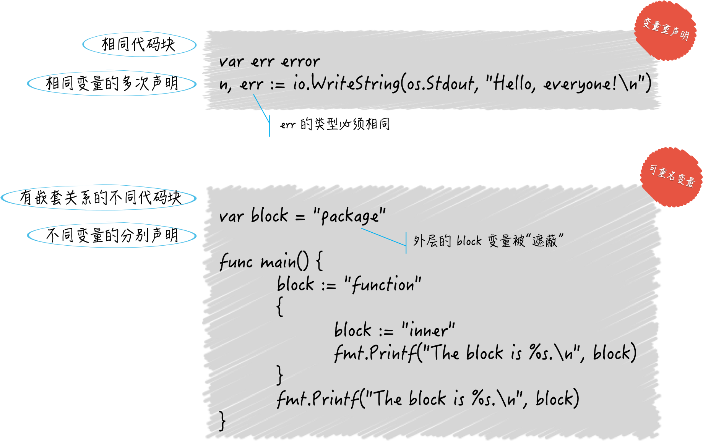

以上 4 大区别中的第 3 条需要你再注意一下。既然可重名变量的类型可以是任意的，那么当它们之间存在“屏蔽”时你就更需要注意了。

不同类型的值大都有着不同的特性和用法。当你在某一种类型的值上施加只有在其他类型值上才能做的操作时，Go 语言编译器一定会告诉你：“这不可以”。

具体到不同类型的可重名变量的问题上，让我们先来看一下puzzlers/article5/q2包中的源码文件 demo11.go。它是一个很典型的例子。

```
package main

import "fmt"

var container = []string{"zero", "one", "two"}

func main() {
  container := map[int]string{0: "zero", 1: "one", 2: "two"}
  fmt.Printf("The element is %q.\n", container[1])
}
```

在 demo11.go 中，有两个都叫做container的变量，分别位于main包代码块和main函数代码块。main包代码块中的变量是切片（slice）类型的，另一个是字典（map）类型的。在main函数的最后，我试图打印出container变量的值中索引为1的那个元素。

如果你熟悉这两个类型肯定会知道，在它们的值上我们都可以施加索引表达式，比如container[0]。只要中括号里的整数在有效范围之内（这里是[0, 2]），它就可以把值中的某一个元素取出来。

如果container的类型不是数组、切片或字典类型，那么索引表达式就会引发编译错误。这正是利用 Go 语言语法，帮我们约束程序的一个例子；但是当我们想知道 container 确切类型的时候，利用索引表达式的方式就不够了。

### 总结

我们先讨论了代码块，并且也谈到了它与程序实体的作用域，以及访问权限控制之间的巧妙关系。Go 语言本身对程序实体提供了相对粗粒度的访问控制。但我们自己可以利用代码块和作用域精细化控制它们。

如果在具有嵌套关系的不同代码块中存在重名的变量，那么我们应该特别小心，它们之间可能会发生“屏蔽”的现象。这样你在不同代码块中引用到变量很可能是不同的。具体的鉴别方式需要参考 Go 语言查找（代表了程序实体的）标识符的过程。

另外，请记住变量重声明与可重名变量之间的区别以及它们的重要特征。其中最容易产生隐晦问题的一点是，可重名变量可以各有各的类型。这时候我们往往应该在真正使用它们之前先对其类型进行检查。利用 Go 语言的语法、规范和命令做辅助的检查是很好的办法，但有些时候并不充分。

### 思考题

我们在讨论 Go 语言查找标识符时的范围的时候，提到过import . XXX这种导入代码包的方式。这里有个思考题：

如果通过这种方式导入的代码包中的变量与当前代码包中的变量重名了，那么 Go 语言是会把它们当做“可重名变量”看待还是会报错呢？

## 06 | 程序实体的那些事儿 （下）

在上一篇文章，我们一直都在围绕着可重名变量，也就是不同代码块中的重名变量，进行了讨论。还记得吗？

最后我强调，如果可重名变量的类型不同，那么就需要引起我们的特别关注了，它们之间可能会存在“屏蔽”的现象。

必要时，我们需要严格地检查它们的类型，但是怎样检查呢？咱们现在就说。

### 我今天的问题是：怎样判断一个变量的类型？

我们依然以在上一篇文章中展示过的 demo11.go 为基础。

```
package main

import "fmt"

var container = []string{"zero", "one", "two"}

func main() {
  container := map[int]string{0: "zero", 1: "one", 2: "two"}
  fmt.Printf("The element is %q.\n", container[1])
}
```

那么，怎样在打印其中元素之前，正确判断变量container的类型？

### 典型回答

答案是使用“类型断言”表达式。具体怎么写呢？

```
value, ok := interface{}(container).([]string)
```

这里有一条赋值语句。在赋值符号的右边，是一个类型断言表达式。

它包括了用来把container变量的值转换为空接口值的interface{}(container)。

以及一个用于判断前者的类型是否为切片类型 []string 的 .([]string)。

这个表达式的结果可以被赋给两个变量，在这里由value和ok代表。变量ok是布尔（bool）类型的，它将代表类型判断的结果，true或false。

如果是true，那么被判断的值将会被自动转换为[]string类型的值，并赋给变量value，否则value将被赋予nil（即“空”）。

顺便提一下，这里的ok也可以没有。也就是说，类型断言表达式的结果，可以只被赋给一个变量，在这里是value。

但是这样的话，当判断为否时就会引发异常。

这种异常在 Go 语言中被叫做panic，我把它翻译为运行时恐慌。因为它是一种在 Go 程序运行期间才会被抛出的异常，而“恐慌”二字是英文 Panic 的中文直译。

除非显式地“恢复”这种“恐慌”，否则它会使 Go 程序崩溃并停止。所以，在一般情况下，我们还是应该使用带ok变量的写法。

### 问题解析

正式说明一下，类型断言表达式的语法形式是x.(T)。其中的x代表要被判断类型的值。这个值当下的类型必须是接口类型的，不过具体是哪个接口类型其实是无所谓的。

所以，当这里的container变量类型不是任何的接口类型时，我们就需要先把它转成某个接口类型的值。

如果container是某个接口类型的，那么这个类型断言表达式就可以是container.([]string)。这样看是不是清晰一些了？

在 Go 语言中，interface{}代表空接口，任何类型都是它的实现类型。

这里的具体语法是interface{}(x)，例如前面展示的interface{}(container)。

你可能会对这里的{}产生疑惑，为什么在关键字interface的右边还要加上这个东西？

请记住，一对不包裹任何东西的花括号，除了可以代表空的代码块之外，还可以用于表示不包含任何内容的数据结构（或者说数据类型）。

比如你今后肯定会遇到的struct{}，它就代表了不包含任何字段和方法的、空的结构体类型。

而空接口interface{}则代表了不包含任何方法定义的、空的接口类型。

当然了，对于一些集合类的数据类型来说，{}还可以用来表示其值不包含任何元素，比如空的切片值[]string{}，以及空的字典值map[int]string{}。

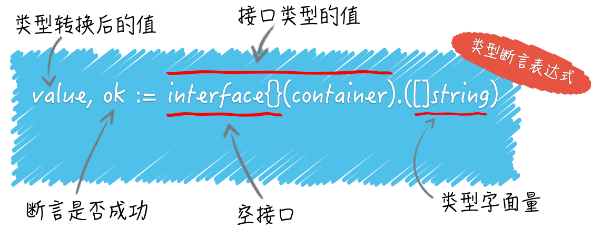

我们再向答案的最右边看。圆括号中[]string是一个类型字面量。所谓类型字面量，就是用来表示数据类型本身的若干个字符。

比如，string是表示字符串类型的字面量，uint8是表示 8 位无符号整数类型的字面量。

再复杂一些的就是我们刚才提到的[]string，用来表示元素类型为string的切片类型，以及map[int]string，用来表示键类型为int、值类型为string的字典类型。

还有更复杂的结构体类型字面量、接口类型字面量，等等。

针对当前的这个问题，我写了 demo12.go。它是 demo11.go 的修改版。我在其中分别使用了两种方式来实施类型断言，一种用的是我上面讲到的方式，另一种用的是我们还没讨论过的switch语句，先供你参考。

```
package main

import (
	"fmt"
)

var container = []string{"zero", "one", "two"}

func main() {
	container := map[int]string{0: "zero", 1: "one", 2: "two"}

	// 方式1。
	_, ok1 := interface{}(container).([]string)
	_, ok2 := interface{}(container).(map[int]string)
	if !(ok1 || ok2) {
		fmt.Printf("Error: unsupported container type: %T\n", container)
		return
	}
	fmt.Printf("The element is %q. (container type: %T)\n",
		container[1], container)

	// 方式2。
	elem, err := getElement(container)
	if err != nil {
		fmt.Printf("Error: %s\n", err)
		return
	}
	fmt.Printf("The element is %q. (container type: %T)\n",
		elem, container)
}

func getElement(containerI interface{}) (elem string, err error) {
	switch t := containerI.(type) {
	case []string:
		elem = t[1]
	case map[int]string:
		elem = t[1]
	default:
		err = fmt.Errorf("unsupported container type: %T", containerI)
		return
	}
	return
}
```

可以看到，当前问题的答案可以只有一行代码。你可能会想，这一行代码解释起来也太复杂了吧？

千万不要为此烦恼，这其中很大一部分都是一些基本语法和概念，你只要记住它们就好了。但这也正是我要告诉你的，一小段代码可以隐藏很多细节。面试官可以由此延伸到几个方向继续提问。这有点儿像泼墨，可以迅速由点及面。

### 知识扩展

#### 问题 1. 你认为类型转换规则中有哪些值得注意的地方？

类型转换表达式的基本写法我已经在前面展示过了。它的语法形式是T(x)。

其中的x可以是一个变量，也可以是一个代表值的字面量（比如1.23和struct{}{}），还可以是一个表达式。

注意，如果是表达式，那么该表达式的结果只能是一个值，而不能是多个值。在这个上下文中，x可以被叫做源值，它的类型就是源类型，而那个T代表的类型就是目标类型。

如果从源类型到目标类型的转换是不合法的，那么就会引发一个编译错误。那怎样才算合法？具体的规则可参见 Go 语言规范中的转换 https://golang.google.cn/ref/spec#Conversions 部分。

我们在这里要关心的，并不是那些 Go 语言编译器可以检测出的问题。恰恰相反，那些在编程语言层面很难检测的东西才是我们应该关注的。

很多初学者所说的陷阱（或者说坑），大都源于他们需要了解但却不了解的那些知识和技巧。因此，在这些规则中，我想抛出三个我认为很常用并且非常值得注意的知识点，提前帮你标出一些“陷阱”。

##### 首先，对于整数类型值、整数常量之间的类型转换，原则上只要源值在目标类型的可表示范围内就是合法的。

比如，之所以uint8(255)可以把无类型的常量255转换为uint8类型的值，是因为255在[0, 255]的范围内。

但需要特别注意的是，源整数类型的可表示范围较大，而目标类型的可表示范围较小的情况，比如把值的类型从int16转换为int8。请看下面这段代码：

```
var srcInt = int16(-255)
dstInt := int8(srcInt)
```

变量srcInt的值是int16类型的-255，而变量dstInt的值是由前者转换而来的，类型是int8。int16类型的可表示范围可比int8类型大了不少。问题是，dstInt的值是多少？

首先你要知道，整数在 Go 语言以及计算机中都是以补码的形式存储的。这主要是为了简化计算机对整数的运算过程。（负数的）补码其实就是原码各位求反再加 1。

比如，int16类型的值-255的补码是1111111100000001。如果我们把该值转换为int8类型的值，那么 Go 语言会把在较高位置（或者说最左边位置）上的 8 位二进制数直接截掉，从而得到00000001。

又由于其最左边一位是0，表示它是个正整数，以及正整数的补码就等于其原码，所以dstInt的值就是1。

一定要记住，当整数值的类型的有效范围由宽变窄时，只需在补码形式下截掉一定数量的高位二进制数即可。

类似的快刀斩乱麻规则还有：当把一个浮点数类型的值转换为整数类型值时，前者的小数部分会被全部截掉。

##### 第二，虽然直接把一个整数值转换为一个string类型的值是可行的，但值得关注的是，被转换的整数值应该可以代表一个有效的 Unicode 代码点，否则转换的结果将会是"�"（仅由高亮的问号组成的字符串值）。

字符'�'的 Unicode 代码点是U+FFFD。它是 Unicode 标准中定义的 Replacement Character，专用于替换那些未知的、不被认可的以及无法展示的字符。

我肯定不会去问“哪个整数值转换后会得到哪个字符串”，这太变态了！但是我会写下：

```
string(-1)
```

并询问会得到什么？这可是完全不同的问题啊。由于-1肯定无法代表一个有效的 Unicode 代码点，所以得到的总会是"�"。在实际工作中，我们在排查问题时可能会遇到�，你需要知道这可能是由于什么引起的。

##### 第三个知识点是关于string类型与各种切片类型之间的互转的。

你先要理解的是，一个值在从string类型向[]byte类型转换时代表着以 UTF-8 编码的字符串会被拆分成零散、独立的字节。

除了与 ASCII 编码兼容的那部分字符集，以 UTF-8 编码的某个单一字节是无法代表一个字符的。

```
string([]byte{'\xe4', '\xbd', '\xa0', '\xe5', '\xa5', '\xbd'}) // 你好
```

比如，UTF-8 编码的三个字节\xe4、\xbd和\xa0合在一起才能代表字符'你'，而\xe5、\xa5和\xbd合在一起才能代表字符'好'。

其次，一个值在从string类型向[]rune类型转换时代表着字符串会被拆分成一个个 Unicode 字符。

```
string([]rune{'\u4F60', '\u597D'}) // 你好
```

当你真正理解了 Unicode 标准及其字符集和编码方案之后，上面这些内容就会显得很容易了。什么是 Unicode 标准？我会首先推荐你去它的官方网站 https://home.unicode.org/ 一探究竟。

#### 问题 2. 什么是别名类型？什么是潜在类型？

我们可以用关键字type声明自定义的各种类型。当然了，这些类型必须在 Go 语言基本类型和高级类型的范畴之内。在它们当中，有一种被叫做“别名类型”的类型。我们可以像下面这样声明它：

```
type MyString = string
```

这条声明语句表示，MyString是string类型的别名类型。顾名思义，别名类型与其源类型的区别恐怕只是在名称上，它们是完全相同的。

源类型与别名类型是一对概念，是两个对立的称呼。别名类型主要是为了代码重构而存在的。更详细的信息可参见 Go 语言官方的文档Proposal: Type Aliases https://go.googlesource.com/proposal/+/master/design/18130-type-alias.md 。

Go 语言内建的基本类型中就存在两个别名类型。byte是uint8的别名类型，而rune是int32的别名类型。

一定要注意，如果我这样声明：

```
type MyString2 string // 注意，这里没有等号。
```

MyString2和string就是两个不同的类型了。这里的MyString2是一个新的类型，不同于其他任何类型。

这种方式也可以被叫做对类型的再定义。我们刚刚把string类型再定义成了另外一个类型MyString2。

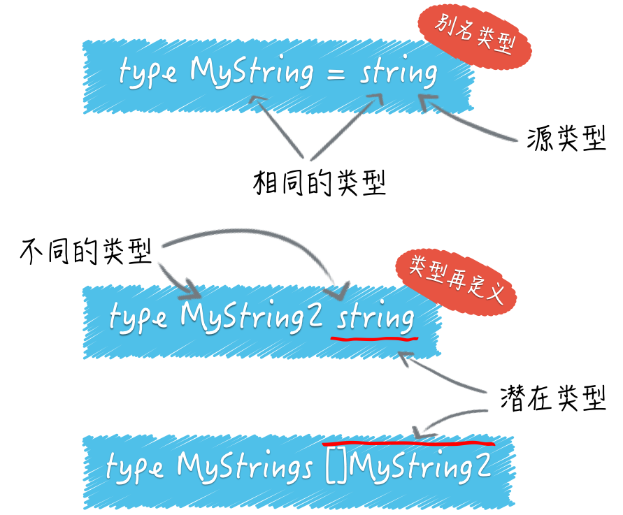

对于这里的类型再定义来说，string可以被称为MyString2的潜在类型。潜在类型的含义是，某个类型在本质上是哪个类型。

潜在类型相同的不同类型的值之间是可以进行类型转换的。因此，MyString2类型的值与string类型的值可以使用类型转换表达式进行互转。

但对于集合类的类型[]MyString2与[]string来说这样做却是不合法的，因为[]MyString2与[]string的潜在类型不同，分别是[]MyString2和[]string。另外，即使两个不同类型的潜在类型相同，它们的值之间也不能进行判等或比较，它们的变量之间也不能赋值。

### 总结

Go 语言中的每个变量都是有类型的，我们可以使用类型断言表达式判断变量是哪个类型的。

正确使用该表达式需要一些小技巧，比如总是应该把结果赋给两个变量。另外还要保证被判断的变量是接口类型的，这可能会用到类型转换表达式。

此外，你还应该搞清楚别名类型声明与类型再定义之间的区别，以及由此带来的它们的值在类型转换、判等、比较和赋值操作方面的不同。

### 思考题

- 除了上述提及的那些，你还认为类型转换规则中有哪些值得注意的地方？
- 你能具体说说别名类型在代码重构过程中可以起到哪些作用吗？

## 07 | 数组和切片

我们这次主要讨论 Go 语言的数组（array）类型和切片（slice）类型。

它们的共同点是都属于集合类的类型，并且，它们的值也都可以用来存储某一种类型的值（或者说元素）。

不过，它们最重要的不同是：数组类型的值（以下简称数组）的长度是固定的，而切片类型的值（以下简称切片）是可变长的。

数组的长度在声明它的时候就必须给定，并且之后不会再改变。可以说，数组的长度是其类型的一部分。比如，[1]string和[2]string就是两个不同的数组类型。

而切片的类型字面量中只有元素的类型，而没有长度。切片的长度可以自动地随着其中元素数量的增长而增长，但不会随着元素数量的减少而减小。

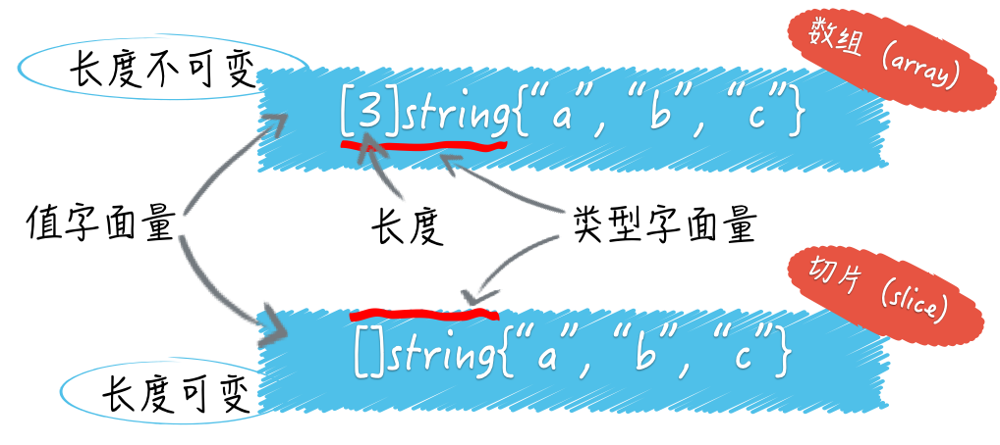

我们其实可以把切片看做是对数组的一层简单的封装，因为在每个切片的底层数据结构中，一定会包含一个数组。数组可以被叫做切片的底层数组，而切片也可以被看作是对数组的某个连续片段的引用。

也正因为如此，Go 语言的切片类型属于引用类型，同属引用类型的还有字典类型、通道类型、函数类型等；而 Go 语言的数组类型则属于值类型，同属值类型的有基础数据类型以及结构体类型。

注意，Go 语言里不存在像 Java 等编程语言中令人困惑的“传值或传引用”问题。在 Go 语言中，我们判断所谓的“传值”或者“传引用”只要看被传递的值的类型就好了。

如果传递的值是引用类型的，那么就是“传引用”。如果传递的值是值类型的，那么就是“传值”。从传递成本的角度讲，引用类型的值往往要比值类型的值低很多。

我们在数组和切片之上都可以应用索引表达式，得到的都会是某个元素。我们在它们之上也都可以应用切片表达式，也都会得到一个新的切片。

我们通过调用内建函数len，得到数组和切片的长度。通过调用内建函数cap，我们可以得到它们的容量。

但要注意，数组的容量永远等于其长度，都是不可变的。切片的容量却不是这样，并且它的变化是有规律可寻的。

### 我们今天的问题就是：怎样正确估算切片的长度和容量？

为此，我编写了一个简单的命令源码文件 demo15.go。

```
package main

import "fmt"

func main() {
  // 示例1。
  s1 := make([]int, 5)
  fmt.Printf("The length of s1: %d\n", len(s1))
  fmt.Printf("The capacity of s1: %d\n", cap(s1))
  fmt.Printf("The value of s1: %d\n", s1)
  s2 := make([]int, 5, 8)
  fmt.Printf("The length of s2: %d\n", len(s2))
  fmt.Printf("The capacity of s2: %d\n", cap(s2))
  fmt.Printf("The value of s2: %d\n", s2)
}
```

首先，我用内建函数make声明了一个[]int类型的变量s1。我传给make函数的第二个参数是5，从而指明了该切片的长度。我用几乎同样的方式声明了切片s2，只不过多传入了一个参数8以指明该切片的容量。

现在，具体的问题是：切片s1和s2的容量都是多少？

这道题的典型回答：切片s1和s2的容量分别是5和8。

### 问题解析

解析一下这道题。s1的容量为什么是5呢？因为我在声明s1的时候把它的长度设置成了5。当我们用make函数初始化切片时，如果不指明其容量，那么它就会和长度一致。如果在初始化时指明了容量，那么切片的实际容量也就是它了。这也正是s2的容量是8的原因。

我们顺便通过s2再来明确下长度、容量以及它们的关系。我在初始化s2代表的切片时，同时也指定了它的长度和容量。

我在刚才说过，可以把切片看做是对数组的一层简单的封装，因为在每个切片的底层数据结构中，一定会包含一个数组。数组可以被叫做切片的底层数组，而切片也可以被看作是对数组的某个连续片段的引用。

在这种情况下，切片的容量实际上代表了它的底层数组的长度，这里是8。（注意，切片的底层数组等同于我们前面讲到的数组，其长度不可变。）

现在你需要跟着我一起想象：有一个窗口，你可以通过这个窗口看到一个数组，但是不一定能看到该数组中的所有元素，有时候只能看到连续的一部分元素。

现在，这个数组就是切片s2的底层数组，而这个窗口就是切片s2本身。s2的长度实际上指明的就是这个窗口的宽度，决定了你透过s2，可以看到其底层数组中的哪几个连续的元素。

由于s2的长度是5，所以你可以看到底层数组中的第 1 个元素到第 5 个元素，对应的底层数组的索引范围是[0, 4]。

切片代表的窗口也会被划分成一个一个的小格子，就像我们家里的窗户那样。每个小格子都对应着其底层数组中的某一个元素。

我们继续拿s2为例，这个窗口最左边的那个小格子对应的正好是其底层数组中的第一个元素，即索引为0的那个元素。因此可以说，s2中的索引从0到4所指向的元素恰恰就是其底层数组中索引从0到4代表的那 5 个元素。

请记住，当我们用make函数或切片值字面量（比如[]int{1, 2, 3}）初始化一个切片时，该窗口最左边的那个小格子总是会对应其底层数组中的第 1 个元素。

但是当我们通过切片表达式基于某个数组或切片生成新切片的时候，情况就变得复杂起来了。

我们再来看一个例子：

```
s3 := []int{1, 2, 3, 4, 5, 6, 7, 8}
s4 := s3[3:6]
fmt.Printf("The length of s4: %d\n", len(s4))
fmt.Printf("The capacity of s4: %d\n", cap(s4))
fmt.Printf("The value of s4: %d\n", s4)
```

切片s3中有 8 个元素，分别是从1到8的整数。s3的长度和容量都是8。然后，我用切片表达式s3[3:6]初始化了切片s4。问题是，这个s4的长度和容量分别是多少？

这并不难，用减法就可以搞定。首先你要知道，切片表达式中的方括号里的那两个整数都代表什么。我换一种表达方式你也许就清楚了，即：[3, 6)。

这是数学中的区间表示法，常用于表示取值范围，我其实已经在本专栏用过好几次了。由此可知，[3:6]要表达的就是透过新窗口能看到的s3中元素的索引范围是从3到5（注意，不包括6）。

这里的3可被称为起始索引，6可被称为结束索引。那么s4的长度就是6减去3，即3。因此可以说，s4中的索引从0到2指向的元素对应的是s3及其底层数组中索引从3到5的那 3 个元素。

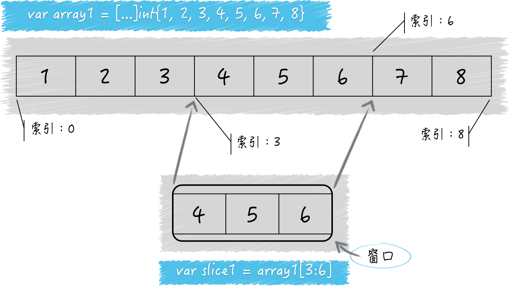

（切片与数组的关系）

再来看容量。我在前面说过，切片的容量代表了它的底层数组的长度，但这仅限于使用make函数或者切片值字面量初始化切片的情况。

更通用的规则是：一个切片的容量可以被看作是透过这个窗口最多可以看到的底层数组中元素的个数。

由于s4是通过在s3上施加切片操作得来的，所以s3的底层数组就是s4的底层数组。

又因为，在底层数组不变的情况下，切片代表的窗口可以向右扩展，直至其底层数组的末尾。

所以，s4的容量就是其底层数组的长度8, 减去上述切片表达式中的那个起始索引3，即5。

注意，切片代表的窗口是无法向左扩展的。也就是说，我们永远无法透过s4看到s3中最左边的那 3 个元素。

最后，顺便提一下把切片的窗口向右扩展到最大的方法。对于s4来说，切片表达式s4[0:cap(s4)]就可以做到。我想你应该能看懂。该表达式的结果值（即一个新的切片）会是[]int{4, 5, 6, 7, 8}，其长度和容量都是5。

### 知识扩展

#### 问题 1：怎样估算切片容量的增长？

一旦一个切片无法容纳更多的元素，Go 语言就会想办法扩容。但它并不会改变原来的切片，而是会生成一个容量更大的切片，然后将把原有的元素和新元素一并拷贝到新切片中。在一般的情况下，你可以简单地认为新切片的容量（以下简称新容量）将会是原切片容量（以下简称原容量）的 2 倍。

但是，当原切片的长度（以下简称原长度）大于或等于1024时，Go 语言将会以原容量的1.25倍作为新容量的基准（以下新容量基准）。新容量基准会被调整（不断地与1.25相乘），直到结果不小于原长度与要追加的元素数量之和（以下简称新长度）。最终，新容量往往会比新长度大一些，当然，相等也是可能的。

另外，如果我们一次追加的元素过多，以至于使新长度比原容量的 2 倍还要大，那么新容量就会以新长度为基准。注意，与前面那种情况一样，最终的新容量在很多时候都要比新容量基准更大一些。更多细节可参见runtime包中 slice.go 文件里的growslice及相关函数的具体实现。

我把展示上述扩容策略的一些例子都放到了 demo16.go 文件中。你可以去试运行看看。

```
package main

import "fmt"

func main() {
	// 示例1。
	s6 := make([]int, 0)
	fmt.Printf("The capacity of s6: %d\n", cap(s6))
	for i := 1; i <= 5; i++ {
		s6 = append(s6, i)
		fmt.Printf("s6(%d): len: %d, cap: %d\n", i, len(s6), cap(s6))
	}
	fmt.Println()

	// 示例2。
	s7 := make([]int, 1024)
	fmt.Printf("The capacity of s7: %d\n", cap(s7))
	s7e1 := append(s7, make([]int, 200)...)
	fmt.Printf("s7e1: len: %d, cap: %d\n", len(s7e1), cap(s7e1))
	s7e2 := append(s7, make([]int, 400)...)
	fmt.Printf("s7e2: len: %d, cap: %d\n", len(s7e2), cap(s7e2))
	s7e3 := append(s7, make([]int, 600)...)
	fmt.Printf("s7e3: len: %d, cap: %d\n", len(s7e3), cap(s7e3))
	fmt.Println()

	// 示例3。
	s8 := make([]int, 10)
	fmt.Printf("The capacity of s8: %d\n", cap(s8))
	s8a := append(s8, make([]int, 11)...)
	fmt.Printf("s8a: len: %d, cap: %d\n", len(s8a), cap(s8a))
	s8b := append(s8a, make([]int, 23)...)
	fmt.Printf("s8b: len: %d, cap: %d\n", len(s8b), cap(s8b))
	s8c := append(s8b, make([]int, 45)...)
	fmt.Printf("s8c: len: %d, cap: %d\n", len(s8c), cap(s8c))
}
```

#### 问题 2：切片的底层数组什么时候会被替换？

确切地说，一个切片的底层数组永远不会被替换。为什么？虽然在扩容的时候 Go 语言一定会生成新的底层数组，但是它也同时生成了新的切片。

它只是把新的切片作为了新底层数组的窗口，而没有对原切片，及其底层数组做任何改动。

请记住，在无需扩容时，append函数返回的是指向原底层数组的原切片，而在需要扩容时，append函数返回的是指向新底层数组的新切片。所以，严格来讲，“扩容”这个词用在这里虽然形象但并不合适。不过鉴于这种称呼已经用得很广泛了，我们也没必要另找新词了。

顺便说一下，只要新长度不会超过切片的原容量，那么使用append函数对其追加元素的时候就不会引起扩容。这只会使紧邻切片窗口右边的（底层数组中的）元素被新的元素替换掉。你可以运行 demo17.go 文件以增强对这些知识的理解。

```go
package main

import "fmt"

func main() {
	// 示例1。
	a1 := [7]int{1, 2, 3, 4, 5, 6, 7}
	fmt.Printf("a1: %v (len: %d, cap: %d)\n",
		a1, len(a1), cap(a1))
	s9 := a1[1:4]
	//s9[0] = 1
	fmt.Printf("s9: %v (len: %d, cap: %d)\n",
		s9, len(s9), cap(s9))
	for i := 1; i <= 5; i++ {
		s9 = append(s9, i)
		fmt.Printf("s9(%d): %v (len: %d, cap: %d)\n",
			i, s9, len(s9), cap(s9))
	}
	fmt.Printf("a1: %v (len: %d, cap: %d)\n",
		a1, len(a1), cap(a1))
	fmt.Println()

}
```

### 总结

总结一下，我们今天一起探讨了数组和切片以及它们之间的关系。切片是基于数组的，可变长的，并且非常轻快。一个切片的容量总是固定的，而且一个切片也只会与某一个底层数组绑定在一起。

此外，切片的容量总会是在切片长度和底层数组长度之间的某一个值，并且还与切片窗口最左边对应的元素在底层数组中的位置有关系。那两个分别用减法计算切片长度和容量的方法你一定要记住

另外，如果新的长度比原有切片的容量还要大，那么底层数组就一定会是新的，而且append函数也会返回一个新的切片。还有，你其实不必太在意切片“扩容”策略中的一些细节，只要能够理解它的基本规律并可以进行近似的估算就可以了。

### 思考题

这里仍然是聚焦于切片的问题。

- 如果有多个切片指向了同一个底层数组，那么你认为应该注意些什么？
- 怎样沿用“扩容”的思想对切片进行“缩容”？请写出代码。

## 08 | container包中的那些容器

我们在上次讨论了数组和切片，当我们提到数组的时候，往往会想起链表。那么 Go 语言的链表是什么样的呢？

Go 语言的链表实现在标准库的container/list代码包中。这个代码包中有两个公开的程序实体——List和Element，List 实现了一个双向链表（以下简称链表），而 Element 则代表了链表中元素的结构。

### 那么，我今天的问题是：可以把自己生成的Element类型值传给链表吗？

我们在这里用到了List的四种方法。

MoveBefore方法和MoveAfter方法，它们分别用于把给定的元素移动到另一个元素的前面和后面。

MoveToFront方法和MoveToBack方法，分别用于把给定的元素移动到链表的最前端和最后端。

在这些方法中，“给定的元素”都是*Element类型的，*Element类型是Element类型的指针类型，*Element的值就是元素的指针。

```
func (l *List) MoveBefore(e, mark *Element)
func (l *List) MoveAfter(e, mark *Element)

func (l *List) MoveToFront(e *Element)
func (l *List) MoveToBack(e *Element)
```

具体问题是，如果我们自己生成这样的值，然后把它作为“给定的元素”传给链表的方法，那么会发生什么？链表会接受它吗？

这里，给出一个典型回答：不会接受，这些方法将不会对链表做出任何改动。因为我们自己生成的Element值并不在链表中，所以也就谈不上“在链表中移动元素”。更何况链表不允许我们把自己生成的Element值插入其中。

### 问题解析

在List包含的方法中，用于插入新元素的那些方法都只接受interface{}类型的值。这些方法在内部会使用Element值，包装接收到的新元素。

这样做正是为了避免直接使用我们自己生成的元素，主要原因是避免链表的内部关联，遭到外界破坏，这对于链表本身以及我们这些使用者来说都是有益的。

List的方法还有下面这几种：

Front和Back方法分别用于获取链表中最前端和最后端的元素，

InsertBefore和InsertAfter方法分别用于在指定的元素之前和之后插入新元素，PushFront和PushBack方法则分别用于在链表的最前端和最后端插入新元素。

```
func (l *List) Front() *Element
func (l *List) Back() *Element

func (l *List) InsertBefore(v interface{}, mark *Element) *Element
func (l *List) InsertAfter(v interface{}, mark *Element) *Element

func (l *List) PushFront(v interface{}) *Element
func (l *List) PushBack(v interface{}) *Element
```

这些方法都会把一个Element值的指针作为结果返回，它们就是链表留给我们的安全“接口”。拿到这些内部元素的指针，我们就可以去调用前面提到的用于移动元素的方法了。

### 知识扩展

#### 1. 问题：为什么链表可以做到开箱即用？

List和Element都是结构体类型。结构体类型有一个特点，那就是它们的零值都会是拥有特定结构，但是没有任何定制化内容的值，相当于一个空壳。值中的字段也都会被分别赋予各自类型的零值。

广义来讲，所谓的零值就是只做了声明，但还未做初始化的变量被给予的缺省值。每个类型的零值都会依据该类型的特性而被设定。比如，经过语句var a [2]int声明的变量a的值，将会是一个包含了两个0的整数数组。又比如，经过语句var s []int声明的变量s的值将会是一个[]int类型的、值为nil的切片。

那么经过语句var l list.List声明的变量l的值将会是什么呢？

List这个结构体类型有两个字段，一个是Element类型的字段root，另一个是int类型的字段len。顾名思义，前者代表的就是那个根元素，而后者用于存储链表的长度。注意，它们都是包级私有的，也就是说使用者无法查看和修改它们。

像前面那样声明的l，其字段root和len都会被赋予相应的零值。len的零值是0，正好可以表明该链表还未包含任何元素。由于root是Element类型的，所以它的零值就是该类型的空壳，用字面量表示的话就是Element{}。

Element类型包含了几个包级私有的字段，分别用于存储前一个元素、后一个元素以及所属链表的指针值。另外还有一个名叫Value的公开的字段，该字段的作用就是持有元素的实际值，它是interface{}类型的。在Element类型的零值中，这些字段的值都会是nil。

这个零值将会是一个长度为0的链表。这个链表持有的根元素也将会是一个空壳，其中只会包含缺省的内容。那这样的链表我们可以直接拿来使用吗？

答案是，可以的。这被称为“开箱即用”。Go 语言标准库中很多结构体类型的程序实体都做到了开箱即用。这也是在编写可供别人使用的代码包（或者说程序库）时，我们推荐遵循的最佳实践之一。那么，语句var l list.List声明的链表l可以直接使用，这是怎么做到的呢？

关键在于它的“延迟初始化”机制。

所谓的延迟初始化，你可以理解为把初始化操作延后，仅在实际需要的时候才进行。延迟初始化的优点在于“延后”，它可以分散初始化操作带来的计算量和存储空间消耗。

例如，如果我们需要集中声明非常多的大容量切片的话，那么那时的 CPU 和内存空间的使用量肯定都会一个激增，并且只有设法让其中的切片及其底层数组被回收，内存使用量才会有所降低。

如果数组是可以被延迟初始化的，那么计算量和存储空间的压力就可以被分散到实际使用它们的时候。这些数组被实际使用的时间越分散，延迟初始化带来的优势就会越明显。

实际上，Go 语言的切片就起到了延迟初始化其底层数组的作用，你可以想一想为什么会这么说的理由。延迟初始化的缺点恰恰也在于“延后”。你可以想象一下，如果我在调用链表的每个方法的时候，它们都需要先去判断链表是否已经被初始化，那这也会是一个计算量上的浪费。在这些方法被非常频繁地调用的情况下，这种浪费的影响就开始显现了，程序的性能将会降低。

在这里的链表实现中，一些方法是无需对是否初始化做判断的。比如Front方法和Back方法，一旦发现链表的长度为0, 直接返回nil就好了。

又比如，在用于删除元素、移动元素，以及一些用于插入元素的方法中，只要判断一下传入的元素中指向所属链表的指针，是否与当前链表的指针相等就可以了。

如果不相等，就一定说明传入的元素不是这个链表中的，后续的操作就不用做了。反之，就一定说明这个链表已经被初始化了。

原因在于，链表的PushFront方法、PushBack方法、PushBackList方法以及PushFrontList方法总会先判断链表的状态，并在必要时进行初始化，这就是延迟初始化。

而且，我们在向一个空的链表中添加新元素的时候，肯定会调用这四个方法中的一个，这时新元素中指向所属链表的指针，一定会被设定为当前链表的指针。所以，指针相等是链表已经初始化的充分必要条件。

明白了吗？List利用了自身以及Element在结构上的特点，巧妙地平衡了延迟初始化的优缺点，使得链表可以开箱即用，并且在性能上可以达到最优。

### 问题 2：Ring与List的区别在哪儿？

container/ring包中的Ring类型实现的是一个循环链表，也就是我们俗称的环。其实List在内部就是一个循环链表。它的根元素永远不会持有任何实际的元素值，而该元素的存在就是为了连接这个循环链表的首尾两端。

所以也可以说，List的零值是一个只包含了根元素，但不包含任何实际元素值的空链表。那么，既然Ring和List在本质上都是循环链表，那它们到底有什么不同呢？

最主要的不同有下面几种。

- Ring类型的数据结构仅由它自身即可代表，而List类型则需要由它以及Element类型联合表示。这是表示方式上的不同，也是结构复杂度上的不同。
- 一个Ring类型的值严格来讲，只代表了其所属的循环链表中的一个元素，而一个List类型的值则代表了一个完整的链表。这是表示维度上的不同。
- 在创建并初始化一个Ring值的时候，我们可以指定它包含的元素的数量，但是对于一个List值来说却不能这样做（也没有必要这样做）。循环链表一旦被创建，其长度是不可变的。这是两个代码包中的New函数在功能上的不同，也是两个类型在初始化值方面的第一个不同。
- 仅通过var r ring.Ring语句声明的r将会是一个长度为1的循环链表，而List类型的零值则是一个长度为0的链表。别忘了List中的根元素不会持有实际元素值，因此计算长度时不会包含它。这是两个类型在初始化值方面的第二个不同。
- Ring值的Len方法的算法复杂度是 O(N) 的，而List值的Len方法的算法复杂度则是 O(1) 的。这是两者在性能方面最显而易见的差别。

其他的不同基本上都是方法方面的了。比如，循环链表也有用于插入、移动或删除元素的方法，不过用起来都显得更抽象一些，等等。

### 总结

我们今天主要讨论了container/list包中的链表实现。我们详细讲解了链表的一些主要的使用技巧和实现特点。由于此链表实现在内部就是一个循环链表，所以我们还把它与container/ring包中的循环链表实现做了一番比较，包括结构、初始化以及性能方面。

### 思考题

- container/ring包中的循环链表的适用场景都有哪些？
- 你使用过container/heap包中的堆吗？它的适用场景又有哪些呢？

### 参考阅读

#### 切片与数组的比较

切片本身有着占用内存少和创建便捷等特点，但它的本质上还是数组。切片的一大好处是可以让我们通过窗口快速地定位并获取，或者修改底层数组中的元素。

不过，当我们想删除切片中的元素的时候就没那么简单了。元素复制一般是免不了的，就算只删除一个元素，有时也会造成大量元素的移动。这时还要注意空出的元素槽位的“清空”，否则很可能会造成内存泄漏。

另一方面，在切片被频繁“扩容”的情况下，新的底层数组会不断产生，这时内存分配的量以及元素复制的次数可能就很可观了，这肯定会对程序的性能产生负面的影响。

尤其是当我们没有一个合理、有效的”缩容“策略的时候，旧的底层数组无法被回收，新的底层数组中也会有大量无用的元素槽位。过度的内存浪费不但会降低程序的性能，还可能会使内存溢出并导致程序崩溃。

由此可见，正确地使用切片是多么的重要。不过，一个更重要的事实是，任何数据结构都不是银弹。不是吗？数组的自身特点和适用场景都非常鲜明，切片也是一样。它们都是 Go 语言原生的数据结构，使用起来也都很方便. 不过，你的集合类工具箱中不应该只有它们。这就是我们使用链表的原因。

不过，对比来看，一个链表所占用的内存空间，往往要比包含相同元素的数组所占内存大得多。这是由于链表的元素并不是连续存储的，所以相邻的元素之间需要互相保存对方的指针。不但如此，每个元素还要存有它所属链表的指针。

有了这些关联，链表的结构反倒更简单了。它只持有头部元素（或称为根元素）基本上就可以了。当然了，为了防止不必要的遍历和计算，链表的长度记录在内也是必须的。

## 09 | 字典的操作和约束

至今为止，我们讲过的集合类的高级数据类型都属于针对单一元素的容器。

它们或用连续存储，或用互存指针的方式收纳元素，这里的每个元素都代表了一个从属某一类型的独立值。

我们今天要讲的字典（map）却不同，它能存储的不是单一值的集合，而是键值对的集合。

在 Go 语言规范中，应该是为了避免歧义，他们将键值对换了一种称呼，叫做：“键 - 元素对”。我们也沿用这个看起来更加清晰的词来讲解。

### 知识前导：为什么字典的键类型会受到约束？

Go 语言的字典类型其实是一个哈希表（hash table）的特定实现，在这个实现中，键和元素的最大不同在于，键的类型是受限的，而元素却可以是任意类型的。

如果要探究限制的原因，我们就先要了解哈希表中最重要的一个过程：映射。

你可以把键理解为元素的一个索引，我们可以在哈希表中通过键查找与它成对的那个元素。

键和元素的这种对应关系，在数学里就被称为“映射”，这也是“map”这个词的本意，哈希表的映射过程就存在于对键 - 元素对的增、删、改、查的操作之中。

```
aMap := map[string]int{
  "one":    1,
  "two":    2,
  "three": 3,
}
k := "two"
v, ok := aMap[k]
if ok {
  fmt.Printf("The element of key %q: %d\n", k, v)
} else {
  fmt.Println("Not found!")
}
```

比如，我们要在哈希表中查找与某个键值对应的那个元素值，那么我们需要先把键值作为参数传给这个哈希表。

哈希表会先用哈希函数（hash function）把键值转换为哈希值。哈希值通常是一个无符号的整数。一个哈希表会持有一定数量的桶（bucket），我们也可以叫它哈希桶，这些哈希桶会均匀地储存其所属哈希表收纳的键 - 元素对。

因此，哈希表会先用这个键哈希值的低几位去定位到一个哈希桶，然后再去这个哈希桶中，查找这个键。

由于键 - 元素对总是被捆绑在一起存储的，所以一旦找到了键，就一定能找到对应的元素值。随后，哈希表就会把相应的元素值作为结果返回。

只要这个键 - 元素对存在哈希表中就一定会被查找到，因为哈希表增、改、删键 - 元素对时的映射过程，与前文所述如出一辙。

#### 现在我们知道了，映射过程的第一步就是：把键值转换为哈希值。

在 Go 语言的字典中，每一个键值都是由它的哈希值代表的。也就是说，字典不会独立存储任何键的值，但会独立存储它们的哈希值。

你是不是隐约感觉到了什么？我们接着往下看。

#### 我们今天的问题是：字典的键类型不能是哪些类型？

这个问题你可以在 Go 语言规范中找到答案，但却没那么简单。它的典型回答是：Go 语言字典的键类型不可以是函数类型、字典类型和切片类型。

### 问题解析

Go 语言规范规定，在键类型的值之间必须可以施加操作符==和!=。换句话说，键类型的值必须要支持判等操作。由于函数类型、字典类型和切片类型的值并不支持判等操作，所以字典的键类型不能是这些类型。

另外，如果键的类型是接口类型的，那么键值的实际类型也不能是上述三种类型，否则在程序运行过程中会引发 panic（即运行时恐慌）。

我们举个例子：

```
var badMap2 = map[interface{}]int{
  "1":   1,
  []int{2}: 2, // 这里会引发panic。
  3:    3,
}
```

这里的变量badMap2的类型是键类型为interface{}、值类型为int的字典类型。这样声明并不会引起什么错误。或者说，我通过这样的声明躲过了 Go 语言编译器的检查。

注意，我用字面量在声明该字典的同时对它进行了初始化，使它包含了三个键 - 元素对。其中第二个键 - 元素对的键值是[]int{2}，元素值是2。这样的键值也不会让 Go 语言编译器报错，因为从语法上说，这样做是可以的。

但是，当我们运行这段代码的时候，Go 语言的运行时（runtime）系统就会发现这里的问题，它会抛出一个 panic，并把根源指向字面量中定义第二个键 - 元素对的那一行。我们越晚发现问题，修正问题的成本就会越高，所以最好不要把字典的键类型设定为任何接口类型。如果非要这么做，请一定确保代码在可控的范围之内。

还要注意，如果键的类型是数组类型，那么还要确保该类型的元素类型不是函数类型、字典类型或切片类型。

比如，由于类型[1][]string的元素类型是[]string，所以它就不能作为字典类型的键类型。另外，如果键的类型是结构体类型，那么还要保证其中字段的类型的合法性。无论不合法的类型被埋藏得有多深，比如map[[1][2][3][]string]int，Go 语言编译器都会把它揪出来。

你可能会有疑问，为什么键类型的值必须支持判等操作？我在前面说过，Go 语言一旦定位到了某一个哈希桶，那么就会试图在这个桶中查找键值。具体是怎么找的呢？

首先，每个哈希桶都会把自己包含的所有键的哈希值存起来。Go 语言会用被查找键的哈希值与这些哈希值逐个对比，看看是否有相等的。如果一个相等的都没有，那么就说明这个桶中没有要查找的键值，这时 Go 语言就会立刻返回结果了。

如果有相等的，那就再用键值本身去对比一次。为什么还要对比？原因是，不同值的哈希值是可能相同的。这有个术语，叫做“哈希碰撞”。

所以，即使哈希值一样，键值也不一定一样。如果键类型的值之间无法判断相等，那么此时这个映射的过程就没办法继续下去了。最后，只有键的哈希值和键值都相等，才能说明查找到了匹配的键 - 元素对。

以上内容涉及的示例都在 demo18.go 中。

```
package main

func main() {
	// 示例1。
	//var badMap1 = map[[]int]int{} // 这里会引发编译错误。
	//_ = badMap1

	// 示例2。
	//var badMap2 = map[interface{}]int{
	//	"1":      1,
	//	[]int{2}: 2, // 这里会引发panic。
	//	3:        3,
	//}
	//_ = badMap2

	// 示例3。
	//var badMap3 map[[1][]string]int // 这里会引发编译错误。
	//_ = badMap3

	// 示例4。
	//type BadKey1 struct {
	//	slice []string
	//}
	//var badMap4 map[BadKey1]int // 这里会引发编译错误。
	//_ = badMap4

	// 示例5。
	//var badMap5 map[[1][2][3][]string]int // 这里会引发编译错误。
	//_ = badMap5

	// 示例6。
	//type BadKey2Field1 struct {
	//	slice []string
	//}
	//type BadKey2 struct {
	//	field BadKey2Field1
	//}
	//var badMap6 map[BadKey2]int // 这里会引发编译错误。
	//_ = badMap6

}
```

### 知识扩展

#### 问题 1：应该优先考虑哪些类型作为字典的键类型？

你现在已经清楚了，在 Go 语言中，有些类型的值是支持判等的，有些是不支持的。那么在这些值支持判等的类型当中，哪些更适合作为字典的键类型呢？

这里先抛开我们使用字典时的上下文，只从性能的角度看。在前文所述的映射过程中，“把键值转换为哈希值”以及“把要查找的键值与哈希桶中的键值做对比”， 明显是两个重要且比较耗时的操作。

因此，可以说，求哈希和判等操作的速度越快，对应的类型就越适合作为键类型。

对于所有的基本类型、指针类型，以及数组类型、结构体类型和接口类型，Go 语言都有一套算法与之对应。这套算法中就包含了哈希和判等。以求哈希的操作为例，宽度越小的类型速度通常越快。对于布尔类型、整数类型、浮点数类型、复数类型和指针类型来说都是如此。对于字符串类型，由于它的宽度是不定的，所以要看它的值的具体长度，长度越短求哈希越快。

类型的宽度是指它的单个值需要占用的字节数。比如，bool、int8和uint8类型的一个值需要占用的字节数都是1，因此这些类型的宽度就都是1。

以上说的都是基本类型，再来看高级类型。对数组类型的值求哈希实际上是依次求得它的每个元素的哈希值并进行合并，所以速度就取决于它的元素类型以及它的长度。细则同上。

与之类似，对结构体类型的值求哈希实际上就是对它的所有字段值求哈希并进行合并，所以关键在于它的各个字段的类型以及字段的数量。而对于接口类型，具体的哈希算法，则由值的实际类型决定。

我不建议你使用这些高级数据类型作为字典的键类型，不仅仅是因为对它们的值求哈希，以及判等的速度较慢，更是因为在它们的值中存在变数。

比如，对一个数组来说，我可以任意改变其中的元素值，但在变化前后，它却代表了两个不同的键值。

对于结构体类型的值情况可能会好一些，因为如果我可以控制其中各字段的访问权限的话，就可以阻止外界修改它了。把接口类型作为字典的键类型最危险。

还记得吗？如果在这种情况下 Go 运行时系统发现某个键值不支持判等操作，那么就会立即抛出一个 panic。在最坏的情况下，这足以使程序崩溃。

那么，在那些基本类型中应该优先选择哪一个？答案是，优先选用数值类型和指针类型，通常情况下类型的宽度越小越好。如果非要选择字符串类型的话，最好对键值的长度进行额外的约束。

那什么是不通常的情况？笼统地说，Go 语言有时会对字典的增、删、改、查操作做一些优化。

比如，在字典的键类型为字符串类型的情况下；又比如，在字典的键类型为宽度为4或8的整数类型的情况下。

#### 问题 2：在值为nil的字典上执行读操作会成功吗，那写操作呢？

好了，为了避免烧脑太久，我们再来说一个简单些的问题。由于字典是引用类型，所以当我们仅声明而不初始化一个字典类型的变量的时候，它的值会是nil。

在这样一个变量上试图通过键值获取对应的元素值，或者添加键 - 元素对，会成功吗？这个问题虽然简单，但却是我们必须铭记于心的，因为这涉及程序运行时的稳定性。

我来说一下答案。除了添加键 - 元素对，我们在一个值为nil的字典上做任何操作都不会引起错误。当我们试图在一个值为nil的字典中添加键 - 元素对的时候，Go 语言的运行时系统就会立即抛出一个 panic。你可以运行一下 demo19.go 文件试试看。

### 总结

我们这次主要讨论了与字典类型有关的，一些容易让人困惑的问题。比如，为什么字典的键类型会受到约束？又比如，我们通常应该选取什么样的类型作为字典的键类型。

我以 Go 语言规范为起始，并以 Go 语言源码为依据回答了这些问题。认真看了这篇文章之后，你应该对字典中的映射过程有了一定的理解。

另外，对于 Go 语言在那些合法的键类型上所做的求哈希和判等的操作，你也应该有所了解了。

再次强调，永远要注意那些可能引发 panic 的操作，比如像一个值为nil的字典添加键 - 元素对。

### 思考题

今天的思考题是关于并发安全性的。更具体地说，在同一时间段内但在不同的 goroutine（或者说 go 程）中对同一个值进行操作是否是安全的。这里的安全是指，该值不会因这些操作而产生混乱，或其它不可预知的问题。

具体的思考题是：字典类型的值是并发安全的吗？如果不是，那么在我们只在字典上添加或删除键 - 元素对的情况下，依然不安全吗？感谢你的收听，我们下期再见。

## 10 | 通道的基本操作

作为 Go 语言最有特色的数据类型，通道（channel）完全可以与 goroutine（也可称为 go 程）并驾齐驱，共同代表 Go 语言独有的并发编程模式和编程哲学。

Don’t communicate by sharing memory; share memory by communicating. （不要通过共享内存来通信，而应该通过通信来共享内存。）

这是作为 Go 语言的主要创造者之一的 Rob Pike 的至理名言，这也充分体现了 Go 语言最重要的编程理念。而通道类型恰恰是后半句话的完美实现，我们可以利用通道在多个 goroutine 之间传递数据。

### 前导内容：通道的基础知识

通道类型的值本身就是并发安全的，这也是 Go 语言自带的、唯一一个可以满足并发安全性的类型。它使用起来十分简单，并不会徒增我们的心智负担。

在声明并初始化一个通道的时候，我们需要用到 Go 语言的内建函数make。就像用make初始化切片那样，我们传给这个函数的第一个参数应该是代表了通道的具体类型的类型字面量。

在声明一个通道类型变量的时候，我们首先要确定该通道类型的元素类型，这决定了我们可以通过这个通道传递什么类型的数据。

比如，类型字面量chan int，其中的chan是表示通道类型的关键字，而int则说明了该通道类型的元素类型。又比如，chan string代表了一个元素类型为string的通道类型。

在初始化通道的时候，make函数除了必须接收这样的类型字面量作为参数，还可以接收一个int类型的参数。

后者是可选的，用于表示该通道的容量。所谓通道的容量，就是指通道最多可以缓存多少个元素值。由此，虽然这个参数是int类型的，但是它是不能小于0的。

当容量为0时，我们可以称通道为非缓冲通道，也就是不带缓冲的通道。而当容量大于0时，我们可以称为缓冲通道，也就是带有缓冲的通道。非缓冲通道和缓冲通道有着不同的数据传递方式，这个我在后面会讲到。

**一个通道相当于一个先进先出（FIFO）的队列。也就是说，通道中的各个元素值都是严格地按照发送的顺序排列的，先被发送通道的元素值一定会先被接收。元素值的发送和接收都需要用到操作符<-。我们也可以叫它接送操作符。一个左尖括号紧接着一个减号形象地代表了元素值的传输方向。**

```
package main

import "fmt"

func main() {
  ch1 := make(chan int, 3)
  ch1 <- 2
  ch1 <- 1
  ch1 <- 3
  elem1 := <-ch1
  fmt.Printf("The first element received from channel ch1: %v\n",
    elem1)
}
```

在 demo20.go 文件中，我声明并初始化了一个元素类型为int、容量为3的通道ch1，并用三条语句，向该通道先后发送了三个元素值2、1和3。

这里的语句需要这样写：依次敲入通道变量的名称（比如ch1）、接送操作符<-以及想要发送的元素值（比如2），并且这三者之间最好用空格进行分割。

这显然表达了“这个元素值将被发送该通道”这个语义。由于该通道的容量为 3，所以，我可以在通道不包含任何元素值的时候，连续地向该通道发送三个值，此时这三个值都会被缓存在通道之中。

当我们需要从通道接收元素值的时候，同样要用接送操作符<-，只不过，这时需要把它写在变量名的左边，用于表达“要从该通道接收一个元素值”的语义。

比如：<-ch1，这也可以被叫做接收表达式。在一般情况下，接收表达式的结果将会是通道中的一个元素值。

如果我们需要把如此得来的元素值存起来，那么在接收表达式的左边就需要依次添加赋值符号（=或:=）和用于存值的变量的名字。因此，语句elem1 := <-ch1会将最先进入ch1的元素2接收来并存入变量elem1。

现在我们来看一道与此有关的题目。**今天的问题是：对通道的发送和接收操作都有哪些基本的特性？**

这个问题的背后隐藏着很多的知识点，**我们来看一下典型回答。**

它们的基本特性如下。

- 对于同一个通道，发送操作之间是互斥的，接收操作之间也是互斥的。
- 发送操作和接收操作中对元素值的处理都是不可分割的。
- 发送操作在完全完成之前会被阻塞。接收操作也是如此。

### 问题解析

**我们先来看第一个基本特性。**在同一时刻，Go 语言的运行时系统（以下简称运行时系统）只会执行对同一个通道的任意个发送操作中的某一个。

直到这个元素值被完全复制进该通道之后，其他针对该通道的发送操作才可能被执行。

类似的，在同一时刻，运行时系统也只会执行，对同一个通道的任意个接收操作中的某一个。

直到这个元素值完全被移出该通道之后，其他针对该通道的接收操作才可能被执行。即使这些操作是并发执行的也是如此。

这里所谓的并发执行，你可以这样认为，多个代码块分别在不同的 goroutine 之中，并有机会在同一个时间段内被执行。

另外，对于通道中的同一个元素值来说，发送操作和接收操作之间也是互斥的。例如，虽然会出现，正在被复制进通道但还未复制完成的元素值，但是这时它绝不会被想接收它的一方看到和取走。

**这里要注意的一个细节是，元素值从外界进入通道时会被复制。更具体地说，进入通道的并不是在接收操作符右边的那个元素值，而是它的副本。**

另一方面，元素值从通道进入外界时会被移动。这个移动操作实际上包含了两步，第一步是生成正在通道中的这个元素值的副本，并准备给到接收方，第二步是删除在通道中的这个元素值。

**顺着这个细节再来看第二个基本特性。**这里的“不可分割”的意思是，它们处理元素值时都是一气呵成的，绝不会被打断。

例如，发送操作要么还没复制元素值，要么已经复制完毕，绝不会出现只复制了一部分的情况。

又例如，接收操作在准备好元素值的副本之后，一定会删除掉通道中的原值，绝不会出现通道中仍有残留的情况。

这既是为了保证通道中元素值的完整性，也是为了保证通道操作的唯一性。对于通道中的同一个元素值来说，它只可能是某一个发送操作放入的，同时也只可能被某一个接收操作取出。

**再来说第三个基本特性。**一般情况下，发送操作包括了“复制元素值”和“放置副本到通道内部”这两个步骤。

在这两个步骤完全完成之前，发起这个发送操作的那句代码会一直阻塞在那里。也就是说，在它之后的代码不会有执行的机会，直到这句代码的阻塞解除。

更细致地说，在通道完成发送操作之后，运行时系统会通知这句代码所在的 goroutine，以使它去争取继续运行代码的机会。

另外，接收操作通常包含了“复制通道内的元素值”“放置副本到接收方”“删掉原值”三个步骤。

在所有这些步骤完全完成之前，发起该操作的代码也会一直阻塞，直到该代码所在的 goroutine 收到了运行时系统的通知并重新获得运行机会为止。

说到这里，你可能已经感觉到，**如此阻塞代码其实就是为了实现操作的互斥和元素值的完整。**

下面我来说一个关于通道操作阻塞的问题。

### 知识扩展

#### 问题 1：发送操作和接收操作在什么时候可能被长时间的阻塞？

先说针对**缓冲通道**的情况。如果通道已满，那么对它的所有发送操作都会被阻塞，直到通道中有元素值被接收走。

这时，通道会优先通知最早因此而等待的、那个发送操作所在的 goroutine，后者会再次执行发送操作。

由于发送操作在这种情况下被阻塞后，它们所在的 goroutine 会顺序地进入通道内部的发送等待队列，所以通知的顺序总是公平的。

相对的，如果通道已空，那么对它的所有接收操作都会被阻塞，直到通道中有新的元素值出现。这时，通道会通知最早等待的那个接收操作所在的 goroutine，并使它再次执行接收操作。

因此而等待的、所有接收操作所在的 goroutine，都会按照先后顺序被放入通道内部的接收等待队列。

对于**非缓冲通道**，情况要简单一些。无论是发送操作还是接收操作，一开始执行就会被阻塞，直到配对的操作也开始执行，才会继续传递。由此可见，非缓冲通道是在用同步的方式传递数据。也就是说，只有收发双方对接上了，数据才会被传递。

并且，数据是直接从发送方复制到接收方的，中间并不会用非缓冲通道做中转。相比之下，缓冲通道则在用异步的方式传递数据。

在大多数情况下，缓冲通道会作为收发双方的中间件。正如前文所述，元素值会先从发送方复制到缓冲通道，之后再由缓冲通道复制给接收方。

但是，当发送操作在执行的时候发现空的通道中，正好有等待的接收操作，那么它会直接把元素值复制给接收方。

以上说的都是在正确使用通道的前提下会发生的事情。下面我特别说明一下，由于错误使用通道而造成的阻塞。

对于值为nil的通道，不论它的具体类型是什么，对它的发送操作和接收操作都会永久地处于阻塞状态。它们所属的 goroutine 中的任何代码，都不再会被执行。

注意，由于通道类型是引用类型，所以它的零值就是nil。换句话说，当我们只声明该类型的变量但没有用make函数对它进行初始化时，该变量的值就会是nil。我们一定不要忘记初始化通道！

你可以去看一下 demo21.go，我在里面用代码罗列了一下会造成阻塞的几种情况。

```
package main

func main() {
	// 示例1。
	ch1 := make(chan int, 1)
	ch1 <- 1
	//ch1 <- 2 // 通道已满，因此这里会造成阻塞。

	// 示例2。
	ch2 := make(chan int, 1)
	//elem, ok := <-ch2 // 通道已空，因此这里会造成阻塞。
	//_, _ = elem, ok
	ch2 <- 1

	// 示例3。
	var ch3 chan int
	//ch3 <- 1 // 通道的值为nil，因此这里会造成永久的阻塞！
	//<-ch3 // 通道的值为nil，因此这里会造成永久的阻塞！
	_ = ch3
}
```

#### 问题 2：发送操作和接收操作在什么时候会引发 panic？

对于一个已初始化，但并未关闭的通道来说，收发操作一定不会引发 panic。

但是通道一旦关闭，再对它进行发送操作，就会引发 panic。另外，如果我们试图关闭一个已经关闭了的通道，也会引发 panic。注意，接收操作是可以感知到通道的关闭的，并能够安全退出。

更具体地说，当我们把接收表达式的结果同时赋给两个变量时，第二个变量的类型就是一定bool类型。它的值如果为false就说明通道已经关闭，并且再没有元素值可取了。

注意，如果通道关闭时，里面还有元素值未被取出，那么接收表达式的第一个结果，仍会是通道中的某一个元素值，而第二个结果值一定会是true。

因此，通过接收表达式的第二个结果值，来判断通道是否关闭是可能有延时的。

由于通道的收发操作有上述特性，所以除非有特殊的保障措施，我们千万不要让接收方关闭通道，而应当让发送方做这件事。这在 demo22.go 中有一个简单的模式可供参考。

```go
package main

import "fmt"

func main() {
	ch1 := make(chan int, 2)
	// 发送方。
	go func() {
		for i := 0; i < 10; i++ {
			fmt.Printf("Sender: sending element %v...\n", i)
			ch1 <- i
		}
		fmt.Println("Sender: close the channel...")
		close(ch1)
	}()

	// 接收方。
	for {
		elem, ok := <-ch1
		if !ok {
			fmt.Println("Receiver: closed channel")
			break
		}
		fmt.Printf("Receiver: received an element: %v\n", elem)
	}

	fmt.Println("End.")
}
```

### 总结

今天我们讲到了通道的一些常规操作，包括初始化、发送、接收和关闭。通道类型是 Go 语言特有的，所以你一开始肯定会感到陌生，其中的一些规则和奥妙还需要你铭记于心，并细心体会。

首先是在初始化通道时设定其容量的意义，这有时会让通道拥有不同的行为模式。对通道的发送操作和接收操作都有哪些基本特性，也是我们必须清楚的。

这涉及了它们什么时候会互斥，什么时候会造成阻塞，什么时候会引起 panic，以及它们收发元素值的顺序是怎样的，它们是怎样保证元素值的完整性的，元素值通常会被复制几次，等等。

最后别忘了，通道也是 Go 语言的并发编程模式中重要的一员。

### 思考题

我希望你能通过试验获得下述问题的答案。

- 通道的长度代表着什么？它在什么时候会通道的容量相同？
- 元素值在经过通道传递时会被复制，那么这个复制是浅表复制还是深层复制呢？

## 11 | 通道的高级玩法

我们已经讨论过了通道的基本操作以及背后的规则。今天，我再来讲讲通道的高级玩法。

首先来说说单向通道。我们在说“通道”的时候指的都是双向通道，即：既可以发也可以收的通道。

所谓单向通道就是，只能发不能收，或者只能收不能发的通道。一个通道是双向的，还是单向的是由它的类型字面量体现的。

还记得我们在上篇文章中说过的接收操作符<-吗？如果我们把它用在通道的类型字面量中，那么它代表的就不是“发送”或“接收”的动作了，而是表示通道的方向。

比如：

```
var uselessChan = make(chan<- int, 1)
```

我声明并初始化了一个名叫uselessChan的变量。这个变量的类型是chan<- int，容量是1。

请注意紧挨在关键字chan右边的那个<-，这表示了这个通道是单向的，并且只能发而不能收。

类似的，如果这个操作符紧挨在chan的左边，那么就说明该通道只能收不能发。所以，前者可以被简称为发送通道，后者可以被简称为接收通道。

注意，与发送操作和接收操作对应，这里的“发”和“收”都是站在操作通道的代码的角度上说的。

从上述变量的名字上你也能猜到，这样的通道是没用的。通道就是为了传递数据而存在的，声明一个只有一端（发送端或者接收端）能用的通道没有任何意义。那么，单向通道的用途究竟在哪儿呢？

### 问题：单向通道有什么应用价值？

你可以先自己想想，然后再接着往下看。

### 典型回答

概括地说，单向通道最主要的用途就是约束其他代码的行为。

### 问题解析

这需要从两个方面讲，都跟函数的声明有些关系。先来看下面的代码：

```
func SendInt(ch chan<- int) {
  ch <- rand.Intn(1000)
}
```

我用func关键字声明了一个叫做SendInt的函数。这个函数只接受一个chan<- int类型的参数。在这个函数中的代码只能向参数ch发送元素值，而不能从它那里接收元素值。这就起到了约束函数行为的作用。

你可能会问，我自己写的函数自己肯定能确定操作通道的方式，为什么还要再约束？好吧，这个例子可能过于简单了。在实际场景中，这种约束一般会出现在接口类型声明中的某个方法定义上。请看这个叫Notifier的接口类型声明：

```
type Notifier interface {
  SendInt(ch chan<- int)
}
```

在接口类型声明的花括号中，每一行都代表着一个方法的定义。接口中的方法定义与函数声明很类似，但是只包含了方法名称、参数列表和结果列表。

一个类型如果想成为一个接口类型的实现类型，那么就必须实现这个接口中定义的所有方法。因此，如果我们在某个方法的定义中使用了单向通道类型，那么就相当于在对它的所有实现做出约束。

在这里，Notifier接口中的SendInt方法只会接受一个发送通道作为参数，所以，在该接口的所有实现类型中的SendInt方法都会受到限制。这种约束方式还是很有用的，尤其是在我们编写模板代码或者可扩展的程序库的时候。

顺便说一下，我们在调用SendInt函数的时候，只需要把一个元素类型匹配的双向通道传给它就行了，没必要用发送通道，因为 Go 语言在这种情况下会自动地把双向通道转换为函数所需的单向通道。

```
intChan1 := make(chan int, 3)
SendInt(intChan1)
```

在另一个方面，我们还可以在函数声明的结果列表中使用单向通道。如下所示：

```
func getIntChan() <-chan int {
  num := 5
  ch := make(chan int, num)
  for i := 0; i < num; i++ {
    ch <- i
  }
  close(ch)
  return ch
}
```

函数getIntChan会返回一个<-chan int类型的通道，这就意味着得到该通道的程序，只能从通道中接收元素值。这实际上就是对函数调用方的一种约束了。

另外，我们在 Go 语言中还可以声明函数类型，如果我们在函数类型中使用了单向通道，那么就相等于在约束所有实现了这个函数类型的函数。

我们再顺便看一下调用getIntChan的代码：

```
intChan2 := getIntChan()
for elem := range intChan2 {
  fmt.Printf("The element in intChan2: %v\n", elem)
}
```

我把调用getIntChan得到的结果值赋给了变量intChan2，然后用for语句循环地取出了该通道中的所有元素值，并打印出来。

这里的for语句也可以被称为带有range子句的for语句。它的用法我在后面讲for语句的时候专门说明。现在你只需要知道关于它的三件事：

- 上述for语句会不断地尝试从通道intChan2中取出元素值。即使intChan2已经被关闭了，它也会在取出所有剩余的元素值之后再结束执行。
- 通常，当通道intChan2中没有元素值时，这条for语句会被阻塞在有for关键字的那一行，直到有新的元素值可取。不过，由于这里的getIntChan函数会事先将intChan2关闭，所以它在取出intChan2中的所有元素值之后会直接结束执行。
- 倘若通道intChan2的值为nil，那么这条for语句就会被永远地阻塞在有for关键字的那一行。

这就是带range子句的for语句与通道的联用方式。不过，它是一种用途比较广泛的语句，还可以被用来从其他一些类型的值中获取元素。除此之外，Go 语言还有一种专门为了操作通道而存在的语句：select语句。

### 知识扩展

#### 问题 1：select语句与通道怎样联用，应该注意些什么？

select语句只能与通道联用，它一般由若干个分支组成。每次执行这种语句的时候，一般只有一个分支中的代码会被运行。

select语句的分支分为两种，一种叫做候选分支，另一种叫做默认分支。候选分支总是以关键字case开头，后跟一个case表达式和一个冒号，然后我们可以从下一行开始写入当分支被选中时需要执行的语句。

默认分支其实就是 default case，因为，当且仅当没有候选分支被选中时它才会被执行，所以它以关键字default开头并直接后跟一个冒号。同样的，我们可以在default:的下一行写入要执行的语句。

由于select语句是专为通道而设计的，所以每个case表达式中都只能包含操作通道的表达式，比如接收表达式。

当然，如果我们需要把接收表达式的结果赋给变量的话，还可以把这里写成赋值语句或者短变量声明。下面展示一个简单的例子。

```
// 准备好几个通道。
intChannels := [3]chan int{
  make(chan int, 1),
  make(chan int, 1),
  make(chan int, 1),
}
// 随机选择一个通道，并向它发送元素值。
index := rand.Intn(3)
fmt.Printf("The index: %d\n", index)
intChannels[index] <- index
// 哪一个通道中有可取的元素值，哪个对应的分支就会被执行。
select {
case <-intChannels[0]:
  fmt.Println("The first candidate case is selected.")
case <-intChannels[1]:
  fmt.Println("The second candidate case is selected.")
case elem := <-intChannels[2]:
  fmt.Printf("The third candidate case is selected, the element is %d.\n", elem)
default:
  fmt.Println("No candidate case is selected!")
}
```

我先准备好了三个类型为chan int、容量为1的通道，并把它们存入了一个叫做intChannels的数组。

然后，我随机选择一个范围在[0, 2]的整数，把它作为索引在上述数组中选择一个通道，并向其中发送一个元素值。

最后，我用一个包含了三个候选分支的select语句，分别尝试从上述三个通道中接收元素值，哪一个通道中有值，哪一个对应的候选分支就会被执行。后面还有一个默认分支，不过在这里它是不可能被选中的。

在使用select语句的时候，我们首先需要注意下面几个事情。

- 如果像上述示例那样加入了默认分支，那么无论涉及通道操作的表达式是否有阻塞，select语句都不会被阻塞。如果那几个表达式都阻塞了，或者说都没有满足求值的条件，那么默认分支就会被选中并执行。
- 如果没有加入默认分支，那么一旦所有的case表达式都没有满足求值条件，那么select语句就会被阻塞。直到至少有一个case表达式满足条件为止。
- 还记得吗？我们可能会因为通道关闭了，而直接从通道接收到一个其元素类型的零值。所以，在很多时候，我们需要通过接收表达式的第二个结果值来判断通道是否已经关闭。一旦发现某个通道关闭了，我们就应该及时地屏蔽掉对应的分支或者采取其他措施。这对于程序逻辑和程序性能都是有好处的。
- select语句只能对其中的每一个case表达式各求值一次。所以，如果我们想连续或定时地操作其中的通道的话，就往往需要通过在for语句中嵌入select语句的方式实现。但这时要注意，简单地在select语句的分支中使用break语句，只能结束当前的select语句的执行，而并不会对外层的for语句产生作用。这种错误的用法可能会让这个for语句无休止地运行下去。

下面是一个简单的示例。

```
intChan := make(chan int, 1)
// 一秒后关闭通道。
time.AfterFunc(time.Second, func() {
  close(intChan)
})
select {
case _, ok := <-intChan:
  if !ok {
    fmt.Println("The candidate case is closed.")
    break
  }
  fmt.Println("The candidate case is selected.")
}
```

我先声明并初始化了一个叫做intChan的通道，然后通过time包中的AfterFunc函数约定在一秒钟之后关闭该通道。

后面的select语句只有一个候选分支，我在其中利用接收表达式的第二个结果值对intChan通道是否已关闭做了判断，并在得到肯定结果后，通过break语句立即结束当前select语句的执行。

这个例子以及前面那个例子都可以在 demo24.go 文件中被找到。你应该运行下，看看结果如何。

上面这些注意事项中的一部分涉及到了select语句的分支选择规则。我觉得很有必要再专门整理和总结一下这些规则。

#### 问题 2：select语句的分支选择规则都有哪些？

规则如下面所示。

1、对于每一个case表达式，都至少会包含一个代表发送操作的发送表达式或者一个代表接收操作的接收表达式，同时也可能会包含其他的表达式。比如，如果case表达式是包含了接收表达式的短变量声明时，那么在赋值符号左边的就可以是一个或两个表达式，不过此处的表达式的结果必须是可以被赋值的。当这样的case表达式被求值时，它包含的多个表达式总会以从左到右的顺序被求值。

2、select语句包含的候选分支中的case表达式都会在该语句执行开始时先被求值，并且求值的顺序是依从代码编写的顺序从上到下的。结合上一条规则，在select语句开始执行时，排在最上边的候选分支中最左边的表达式会最先被求值，然后是它右边的表达式。仅当最上边的候选分支中的所有表达式都被求值完毕后，从上边数第二个候选分支中的表达式才会被求值，顺序同样是从左到右，然后是第三个候选分支、第四个候选分支，以此类推。

3、对于每一个case表达式，如果其中的发送表达式或者接收表达式在被求值时，相应的操作正处于阻塞状态，那么对该case表达式的求值就是不成功的。在这种情况下，我们可以说，这个case表达式所在的候选分支是不满足选择条件的。

4、仅当select语句中的所有case表达式都被求值完毕后，它才会开始选择候选分支。这时候，它只会挑选满足选择条件的候选分支执行。如果所有的候选分支都不满足选择条件，那么默认分支就会被执行。如果这时没有默认分支，那么select语句就会立即进入阻塞状态，直到至少有一个候选分支满足选择条件为止。一旦有一个候选分支满足选择条件，select语句（或者说它所在的 goroutine）就会被唤醒，这个候选分支就会被执行。

5、如果select语句发现同时有多个候选分支满足选择条件，那么它就会用一种伪随机的算法在这些分支中选择一个并执行。注意，即使select语句是在被唤醒时发现的这种情况，也会这样做。

6、一条select语句中只能够有一个默认分支。并且，默认分支只在无候选分支可选时才会被执行，这与它的编写位置无关。

7、select语句的每次执行，包括case表达式求值和分支选择，都是独立的。不过，至于它的执行是否是并发安全的，就要看其中的case表达式以及分支中，是否包含并发不安全的代码了。

我把与以上规则相关的示例放在 demo25.go 文件中了。你一定要去试运行一下，然后尝试用上面的规则去解释它的输出内容。

```go
package main

import "fmt"

var channels = [3]chan int{
	nil,
	make(chan int),
	nil,
}

var numbers = []int{1, 2, 3}

func main() {
	select {
	case getChan(0) <- getNumber(0):
		fmt.Println("The first candidate case is selected.")
	case getChan(1) <- getNumber(1):
		fmt.Println("The second candidate case is selected.")
	case getChan(2) <- getNumber(2):
		fmt.Println("The third candidate case is selected")
	default:
		fmt.Println("No candidate case is selected!")
	}
}

func getNumber(i int) int {
	fmt.Printf("numbers[%d]\n", i)
	return numbers[i]
}

func getChan(i int) chan int {
	fmt.Printf("channels[%d]\n", i)
	return channels[i]
}
```

### 总结

今天，我们先讲了单向通道的表示方法，操作符“<-”仍然是关键。如果只用一个词来概括单向通道存在的意义的话，那就是“约束”，也就是对代码的约束。

我们可以使用带range子句的for语句从通道中获取数据，也可以通过select语句操纵通道。

select语句是专门为通道而设计的，它可以包含若干个候选分支，每个分支中的case表达式都会包含针对某个通道的发送或接收操作。

当select语句被执行时，它会根据一套**分支选择规则**选中某一个分支并执行其中的代码。如果所有的候选分支都没有被选中，那么默认分支（如果有的话）就会被执行。注意，发送和接收操作的阻塞是分支选择规则的一个很重要的依据。

### 思考题

今天的思考题都由上述内容中的线索延伸而来。

- 如果在select语句中发现某个通道已关闭，那么应该怎样屏蔽掉它所在的分支？
- 在select语句与for语句联用时，怎样直接退出外层的for语句？

## 12 | 使用函数的正确姿势

在前几期文章中，我们分了几次，把 Go 语言自身提供的，所有集合类的数据类型都讲了一遍，额外还讲了标准库的container包中的几个类型。

在几乎所有主流的编程语言中，集合类的数据类型都是最常用和最重要的。我希望通过这几次的讨论，能让你对它们的运用更上一层楼。

从今天开始，我会开始向你介绍使用 Go 语言进行模块化编程时，必须了解的知识，这包括几个重要的数据类型以及一些模块化编程的技巧。首先我们需要了解的是 Go 语言的函数以及函数类型。

### 前导内容：函数是一等的公民

在 Go 语言中，函数可是一等的（first-class）公民，函数类型也是一等的数据类型。这是什么意思呢？

简单来说，这意味着函数不但可以用于封装代码、分割功能、解耦逻辑，还可以化身为普通的值，在其他函数间传递、赋予变量、做类型判断和转换等等，就像切片和字典的值那样。

而更深层次的含义就是：函数值可以由此成为能够被随意传播的独立逻辑组件（或者说功能模块）。

对于函数类型来说，它是一种对一组输入、输出进行模板化的重要工具，它比接口类型更加轻巧、灵活，它的值也借此变成了可被热替换的逻辑组件。比如，我在 demo26.go 文件中是这样写的：

```
package main

import "fmt"

type Printer func(contents string) (n int, err error)

func printToStd(contents string) (bytesNum int, err error) {
  return fmt.Println(contents)
}

func main() {
  var p Printer
  p = printToStd
  p("something")
}
```

这里，我先声明了一个函数类型，名叫Printer。

注意这里的写法，在类型声明的名称右边的是func关键字，我们由此就可知道这是一个函数类型的声明。

在func右边的就是这个函数类型的参数列表和结果列表。其中，参数列表必须由圆括号包裹，而只要结果列表中只有一个结果声明，并且没有为它命名，我们就可以省略掉外围的圆括号。

书写函数签名的方式与函数声明的是一致的。只是紧挨在参数列表左边的不是函数名称，而是关键字func。这里函数名称和func互换了一下位置而已。

函数的签名其实就是函数的参数列表和结果列表的统称，它定义了可用来鉴别不同函数的那些特征，同时也定义了我们与函数交互的方式。

注意，各个参数和结果的名称不能算作函数签名的一部分，甚至对于结果声明来说，没有名称都可以。

只要两个函数的参数列表和结果列表中的元素顺序及其类型是一致的，我们就可以说它们是一样的函数，或者说是实现了同一个函数类型的函数。

严格来说，函数的名称也不能算作函数签名的一部分，它只是我们在调用函数时，需要给定的标识符而已。

我在下面声明的函数printToStd的签名与Printer的是一致的，因此前者是后者的一个实现，即使它们的名称以及有的结果名称是不同的。

通过main函数中的代码，我们就可以证实这两者的关系了，我顺利地把printToStd函数赋给了Printer类型的变量p，并且成功地调用了它。

总之，“函数是一等的公民”是函数式编程（functional programming）的重要特征。Go 语言在语言层面支持了函数式编程。我们下面的问题就与此有关。

### 今天的问题是：怎样编写高阶函数？

先来说说什么是高阶函数？简单地说，高阶函数可以满足下面的两个条件：
**1. 接受其他的函数作为参数传入；**
**2. 把其他的函数作为结果返回。**

只要满足了其中任意一个特点，我们就可以说这个函数是一个高阶函数。高阶函数也是函数式编程中的重要概念和特征。

具体的问题是，我想通过编写calculate函数来实现两个整数间的加减乘除运算，但是希望两个整数和具体的操作都由该函数的调用方给出，那么，这样一个函数应该怎样编写呢。

### 典型回答

首先，我们来声明一个名叫operate的函数类型，它有两个参数和一个结果，都是int类型的。

```
type operate func(x, y int) int
```

然后，我们编写calculate函数的签名部分。这个函数除了需要两个int类型的参数之外，还应该有一个operate类型的参数。

该函数的结果应该有两个，一个是int类型的，代表真正的操作结果，另一个应该是error类型的，因为如果那个operate类型的参数值为nil，那么就应该直接返回一个错误。

顺便说一下，函数类型属于引用类型，它的值可以为nil，而这种类型的零值恰恰就是nil。

```
func calculate(x int, y int, op operate) (int, error) {
  if op == nil {
    return 0, errors.New("invalid operation")
  }
  return op(x, y), nil
}
```

calculate函数实现起来就很简单了。我们需要先用卫述语句检查一下参数，如果operate类型的参数op为nil，那么就直接返回0和一个代表了具体错误的error类型值。

卫述语句是指被用来检查关键的先决条件的合法性，并在检查未通过的情况下立即终止当前代码块执行的语句。在 Go 语言中，if 语句常被作为卫述语句。

如果检查无误，那么就调用op并把那两个操作数传给它，最后返回op返回的结果和代表没有错误发生的nil。

### 问题解析

其实只要你搞懂了“函数是一等的公民”这句话背后的含义，这道题就会很简单。我在上面已经讲过了，希望你已经清楚了。我在上一个例子中展示了其中一点，即：把函数作为一个普通的值赋给一个变量。

在这道题中，我问的其实是怎样实现另一点，即：让函数在其他函数间传递。

在答案中，calculate函数的其中一个参数是operate类型的，而且后者就是一个函数类型。在调用calculate函数的时候，我们需要传入一个operate类型的函数值。这个函数值应该怎么写？

只要它的签名与operate类型的签名一致，并且实现得当就可以了。我们可以像上一个例子那样先声明好一个函数，再把它赋给一个变量，也可以直接编写一个实现了operate类型的匿名函数。

```
op := func(x, y int) int {
  return x + y
}
```

calculate函数就是一个高阶函数。但是我们说高阶函数的特点有两个，而该函数只展示了其中**一个特点，即：接受其他的函数作为参数传入。**

**那另一个特点，把其他的函数作为结果返回。**这又是怎么玩的呢？你可以看看我在 demo27.go 文件中声明的函数类型calculateFunc和函数genCalculator。其中，genCalculator函数的唯一结果的类型就是calculateFunc。

这里先给出使用它们的代码。

```
x, y = 56, 78
add := genCalculator(op)
result, err = add(x, y)
fmt.Printf("The result: %d (error: %v)\n", result, err)
```

你可以自己写出calculateFunc类型和genCalculator函数的实现吗？你可以动手试一试

```
package main

import (
	"errors"
	"fmt"
)

type operate func(x, y int) int

// 方案1。
func calculate(x int, y int, op operate) (int, error) {
	if op == nil {
		return 0, errors.New("invalid operation")
	}
	return op(x, y), nil
}

// 方案2。
type calculateFunc func(x int, y int) (int, error)

func genCalculator(op operate) calculateFunc {
	return func(x int, y int) (int, error) {
		if op == nil {
			return 0, errors.New("invalid operation")
		}
		return op(x, y), nil
	}
}

func main() {
	// 方案1。
	x, y := 12, 23
	op := func(x, y int) int {
		return x + y
	}
	result, err := calculate(x, y, op)
	fmt.Printf("The result: %d (error: %v)\n",
		result, err)
	result, err = calculate(x, y, nil)
	fmt.Printf("The result: %d (error: %v)\n",
		result, err)

	// 方案2。
	x, y = 56, 78
	add := genCalculator(op)
	result, err = add(x, y)
	fmt.Printf("The result: %d (error: %v)\n",
		result, err)
}
```

### 知识扩展

#### 问题 1：如何实现闭包？

闭包又是什么？你可以想象一下，在一个函数中存在对外来标识符的引用。所谓的外来标识符，既不代表当前函数的任何参数或结果，也不是函数内部声明的，它是直接从外边拿过来的。

还有个专门的术语称呼它，叫自由变量，可见它代表的肯定是个变量。实际上，如果它是个常量，那也就形成不了闭包了，因为常量是不可变的程序实体，而闭包体现的却是由“不确定”变为“确定”的一个过程。

我们说的这个函数（以下简称闭包函数）就是因为引用了自由变量，而呈现出了一种“不确定”的状态，也叫“开放”状态。

也就是说，它的内部逻辑并不是完整的，有一部分逻辑需要这个自由变量参与完成，而后者到底代表了什么在闭包函数被定义的时候却是未知的。

即使对于像 Go 语言这种静态类型的编程语言而言，我们在定义闭包函数的时候最多也只能知道自由变量的类型。

在我们刚刚提到的genCalculator函数内部，实际上就实现了一个闭包，而genCalculator函数也是一个高阶函数。

```
func genCalculator(op operate) calculateFunc {
  return func(x int, y int) (int, error) {
    if op == nil {
      return 0, errors.New("invalid operation")
    }
    return op(x, y), nil
  }
}
```

genCalculator函数只做了一件事，那就是定义一个匿名的、calculateFunc类型的函数并把它作为结果值返回。

而这个匿名的函数就是一个闭包函数。它里面使用的变量op既不代表它的任何参数或结果也不是它自己声明的，而是定义它的genCalculator函数的参数，所以是一个自由变量。

这个自由变量究竟代表了什么，这一点并不是在定义这个闭包函数的时候确定的，而是在genCalculator函数被调用的时候确定的。

只有给定了该函数的参数op，我们才能知道它返回给我们的闭包函数可以用于什么运算。

看到if op == nil {那一行了吗？Go 语言编译器读到这里时会试图去寻找op所代表的东西，它会发现op代表的是genCalculator函数的参数，然后，它会把这两者联系起来。这时可以说，自由变量op被“捕获”了。

当程序运行到这里的时候，op就是那个参数值了。如此一来，这个闭包函数的状态就由“不确定”变为了“确定”，或者说转到了“闭合”状态，至此也就真正地形成了一个闭包。

看出来了吗？我们在用高阶函数实现闭包。这也是高阶函数的一大功用。

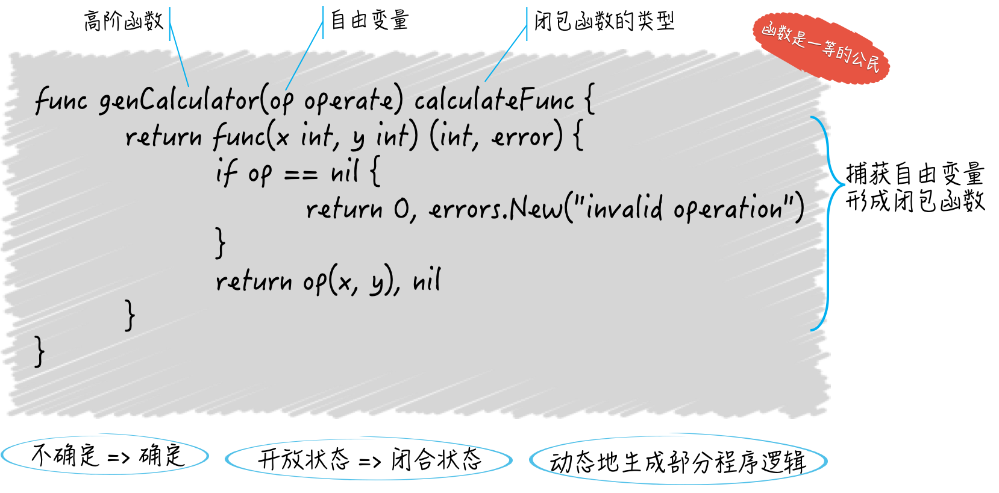

（高阶函数与闭包）

那么，实现闭包的意义又在哪里呢？表面上看，我们只是延迟实现了一部分程序逻辑或功能而已，但实际上，我们是在动态地生成那部分程序逻辑。

我们可以借此在程序运行的过程中，根据需要生成功能不同的函数，继而影响后续的程序行为。这与 GoF 设计模式中的“模板方法”模式有着异曲同工之妙，不是吗？

#### 问题 2：传入函数的那些参数值后来怎么样了？

让我们把目光再次聚焦到函数本身。我们先看一个示例。

```
package main

import "fmt"

func main() {
  array1 := [3]string{"a", "b", "c"}
  fmt.Printf("The array: %v\n", array1)
  array2 := modifyArray(array1)
  fmt.Printf("The modified array: %v\n", array2)
  fmt.Printf("The original array: %v\n", array1)
}

func modifyArray(a [3]string) [3]string {
  a[1] = "x"
  return a
}
```

这个命令源码文件（也就是 demo28.go）在运行之后会输出什么？这是我常出的一道考题。

```
package main

import "fmt"

func main() {
	// 示例1。
	array1 := [3]string{"a", "b", "c"}
	fmt.Printf("The array: %v\n", array1)
	array2 := modifyArray(array1)
	fmt.Printf("The modified array: %v\n", array2)
	fmt.Printf("The original array: %v\n", array1)
	fmt.Println()

	// 示例2。
	slice1 := []string{"x", "y", "z"}
	fmt.Printf("The slice: %v\n", slice1)
	slice2 := modifySlice(slice1)
	fmt.Printf("The modified slice: %v\n", slice2)
	fmt.Printf("The original slice: %v\n", slice1)
	fmt.Println()

	// 示例3。
	complexArray1 := [3][]string{
		{"d", "e", "f"},
		{"g", "h", "i"},
		{"j", "k", "l"},
	}
	fmt.Printf("The complex array: %v\n", complexArray1)
	complexArray2 := modifyComplexArray(complexArray1)
	fmt.Printf("The modified complex array: %v\n", complexArray2)
	fmt.Printf("The original complex array: %v\n", complexArray1)
}

// 示例1。
func modifyArray(a [3]string) [3]string {
	a[1] = "x"
	return a
}

// 示例2。
func modifySlice(a []string) []string {
	a[1] = "i"
	return a
}

// 示例3。
func modifyComplexArray(a [3][]string) [3][]string {
	a[1][1] = "s"
	a[2] = []string{"o", "p", "q"}
	return a
}
```

我在main函数中声明了一个数组array1，然后把它传给了函数modify，modify对参数值稍作修改后将其作为结果值返回。main函数中的代码拿到这个结果之后打印了它（即array2），以及原来的数组array1。关键问题是，原数组会因modify函数对参数值的修改而改变吗？

答案是：原数组不会改变。为什么呢？原因是，所有传给函数的参数值都会被复制，函数在其内部使用的并不是参数值的原值，而是它的副本。

由于数组是值类型，所以每一次复制都会拷贝它，以及它的所有元素值。我在modify函数中修改的只是原数组的副本而已，并不会对原数组造成任何影响。

注意，对于引用类型，比如：切片、字典、通道，像上面那样复制它们的值，只会拷贝它们本身而已，并不会拷贝它们引用的底层数据。也就是说，这时只是浅表复制，而不是深层复制。

以切片值为例，如此复制的时候，只是拷贝了它指向底层数组中某一个元素的指针，以及它的长度值和容量值，而它的底层数组并不会被拷贝。

另外还要注意，就算我们传入函数的是一个值类型的参数值，但如果这个参数值中的某个元素是引用类型的，那么我们仍然要小心。

比如：

```
complexArray1 := [3][]string{
  []string{"d", "e", "f"},
  []string{"g", "h", "i"},
  []string{"j", "k", "l"},
}
```

变量complexArray1是[3][]string类型的，也就是说，虽然它是一个数组，但是其中的每个元素又都是一个切片。这样一个值被传入函数的话，函数中对该参数值的修改会影响到complexArray1本身吗？我想，这可以留作今天的思考题。

### 总结

我们今天主要聚焦于函数的使用手法。在 Go 语言中，函数可是一等的（first-class）公民。它既可以被独立声明，也可以被作为普通的值来传递或赋予变量。除此之外，我们还可以在其他函数的内部声明匿名函数并把它直接赋给变量。

你需要记住 Go 语言是怎样鉴别一个函数的，函数的签名在这里起到了至关重要的作用。

函数是 Go 语言支持函数式编程的主要体现。我们可以通过“把函数传给函数”以及“让函数返回函数”来编写高阶函数，也可以用高阶函数来实现闭包，并以此做到部分程序逻辑的动态生成。

我们在最后还说了一下关于函数传参的一个注意事项，这很重要，可能会关系到程序的稳定和安全。

一个相关的原则是：既不要把你程序的细节暴露给外界，也尽量不要让外界的变动影响到你的程序。你可以想想这个原则在这里可以起到怎样的指导作用。

### 思考题

今天我给你留下两道思考题。

- complexArray1被传入函数的话，这个函数中对该参数值的修改会影响到它的原值吗？
- 函数真正拿到的参数值其实只是它们的副本，那么函数返回给调用方的结果值也会被复制吗？

## 13 | 结构体及其方法的使用法门

我们都知道，结构体类型表示的是实实在在的数据结构。一个结构体类型可以包含若干个字段，每个字段通常都需要有确切的名字和类型。

### 前导内容：结构体类型基础知识

当然了，结构体类型也可以不包含任何字段，这样并不是没有意义的，因为我们还可以为类型关联上一些方法，这里你可以把方法看做是函数的特殊版本。

函数是独立的程序实体。我们可以声明有名字的函数，也可以声明没名字的函数，还可以把它们当做普通的值传来传去。我们能把具有相同签名的函数抽象成独立的函数类型，以作为一组输入、输出（或者说一类逻辑组件）的代表。

方法却不同，它需要有名字，不能被当作值来看待，最重要的是，它必须隶属于某一个类型。方法所属的类型会通过其声明中的接收者（receiver）声明体现出来。

接收者声明就是在关键字func和方法名称之间的圆括号包裹起来的内容，其中必须包含确切的名称和类型字面量。

**接收者的类型其实就是当前方法所属的类型，而接收者的名称，则用于在当前方法中引用它所属的类型的当前值。**

我们举个例子来看一下。

```
// AnimalCategory 代表动物分类学中的基本分类法。
type AnimalCategory struct {
  kingdom string // 界。
  phylum string // 门。
  class  string // 纲。
  order  string // 目。
  family string // 科。
  genus  string // 属。
  species string // 种。
}

func (ac AnimalCategory) String() string {
  return fmt.Sprintf("%s%s%s%s%s%s%s",
    ac.kingdom, ac.phylum, ac.class, ac.order,
    ac.family, ac.genus, ac.species)
}
```

结构体类型AnimalCategory代表了动物的基本分类法，其中有 7 个string类型的字段，分别表示各个等级的分类。

下边有个名叫String的方法，从它的接收者声明可以看出它隶属于AnimalCategory类型。

通过该方法的接收者名称ac，我们可以在其中引用到当前值的任何一个字段，或者调用到当前值的任何一个方法（也包括String方法自己）。

这个String方法的功能是提供当前值的字符串表示形式，其中的各个等级分类会按照从大到小的顺序排列。使用时，我们可以这样表示：

```
category := AnimalCategory{species: "cat"}
fmt.Printf("The animal category: %s\n", category)
```

这里，我用字面量初始化了一个AnimalCategory类型的值，并把它赋给了变量category。为了不喧宾夺主，我只为其中的species字段指定了字符串值"cat"，该字段代表最末级分类“种”。

在 Go 语言中，我们可以通过为一个类型编写名为String的方法，来自定义该类型的字符串表示形式。这个String方法不需要任何参数声明，但需要有一个string类型的结果声明。

正因为如此，我在调用fmt.Printf函数时，使用占位符%s和category值本身就可以打印出后者的字符串表示形式，而无需显式地调用它的String方法。

fmt.Printf函数会自己去寻找它。此时的打印内容会是The animal category: cat。显而易见，category的String方法成功地引用了当前值的所有字段。

方法隶属的类型其实并不局限于结构体类型，但必须是某个自定义的数据类型，并且不能是任何接口类型。

一个数据类型关联的所有方法，共同组成了该类型的方法集合。同一个方法集合中的方法不能出现重名。并且，如果它们所属的是一个结构体类型，那么它们的名称与该类型中任何字段的名称也不能重复。

我们可以把结构体类型中的一个字段看作是它的一个属性或者一项数据，再把隶属于它的一个方法看作是附加在其中数据之上的一个能力或者一项操作。将属性及其能力（或者说数据及其操作）封装在一起，是面向对象编程（object-oriented programming）的一个主要原则。Go 语言摄取了面向对象编程中的很多优秀特性，同时也推荐这种封装的做法。从这方面看，Go 语言其实是支持面向对象编程的，但它选择摒弃了一些在实际运用过程中容易引起程序开发者困惑的特性和规则。

现在，让我们再把目光放到结构体类型的字段声明上。我们来看下面的代码：

```
type Animal struct {
  scientificName string // 学名。
  AnimalCategory    // 动物基本分类。
}
```

我声明了一个结构体类型，名叫Animal。它有两个字段。一个是string类型的字段scientificName，代表了动物的学名。而另一个字段声明中只有AnimalCategory，它正是我在前面编写的那个结构体类型的名字。这是什么意思呢？

**那么，我们今天的问题是：Animal类型中的字段声明AnimalCategory代表了什么？**

更宽泛地讲，如果结构体类型的某个字段声明中只有一个类型名，那么该字段代表了什么？

**这个问题的典型回答是**：字段声明AnimalCategory代表了Animal类型的一个嵌入字段。Go 语言规范规定，如果一个字段的声明中只有字段的类型名而没有字段的名称，那么它就是一个嵌入字段，也可以被称为匿名字段。我们可以通过此类型变量的名称后跟“.”，再后跟嵌入字段类型的方式引用到该字段。也就是说，嵌入字段的类型既是类型也是名称。

### 问题解析

说到引用结构体的嵌入字段，Animal类型有个方法叫Category，它是这么写的：

```
func (a Animal) Category() string {
  return a.AnimalCategory.String()
}
```

Category方法的接收者类型是Animal，接收者名称是a。在该方法中，我通过表达式a.AnimalCategory选择到了a的这个嵌入字段，然后又选择了该字段的String方法并调用了它。

顺便提一下，在某个代表变量的标识符的右边加“.”，再加上字段名或方法名的表达式被称为选择表达式，它用来表示选择了该变量的某个字段或者方法。

这是 Go 语言规范中的说法，与“引用结构体的某某字段”或“调用结构体的某某方法”的说法是相通的。我在以后会混用这两种说法。

实际上，把一个结构体类型嵌入到另一个结构体类型中的意义不止如此。嵌入字段的方法集合会被无条件地合并进被嵌入类型的方法集合中。例如下面这种：

```
animal := Animal{
  scientificName: "American Shorthair",
  AnimalCategory: category,
}
fmt.Printf("The animal: %s\n", animal)
```

我声明了一个Animal类型的变量animal并对它进行初始化。我把字符串值"American Shorthair"赋给它的字段scientificName，并把前面声明过的变量category赋给它的嵌入字段AnimalCategory。

我在后面使用fmt.Printf函数和%s占位符试图打印animal的字符串表示形式，相当于调用animal的String方法。虽然我们还没有为Animal类型编写String方法，但这样做是没问题的。因为在这里，嵌入字段AnimalCategory的String方法会被当做animal的方法调用。

**那如果我也为Animal类型编写一个String方法呢？这里会调用哪一个呢？**

答案是，animal的String方法会被调用。这时，我们说，嵌入字段AnimalCategory的String方法被“屏蔽”了。注意，只要名称相同，无论这两个方法的签名是否一致，被嵌入类型的方法都会“屏蔽”掉嵌入字段的同名方法。

类似的，由于我们同样可以像访问被嵌入类型的字段那样，直接访问嵌入字段的字段，所以如果这两个结构体类型里存在同名的字段，那么嵌入字段中的那个字段一定会被“屏蔽”。这与我们在前面讲过的，可重名变量之间可能存在的“屏蔽”现象很相似。

正因为嵌入字段的字段和方法都可以“嫁接”到被嵌入类型上，所以即使在两个同名的成员一个是字段，另一个是方法的情况下，这种“屏蔽”现象依然会存在。

不过，即使被屏蔽了，我们仍然可以通过链式的选择表达式，选择到嵌入字段的字段或方法，就像我在Category方法中所做的那样。这种“屏蔽”其实还带来了一些好处。我们看看下面这个Animal类型的String方法的实现：

```
func (a Animal) String() string {
  return fmt.Sprintf("%s (category: %s)",
    a.scientificName, a.AnimalCategory)
}
```

在这里，我们把对嵌入字段的String方法的调用结果融入到了Animal类型的同名方法的结果中。这种将同名方法的结果逐层“包装”的手法是很常见和有用的，也算是一种惯用法了。

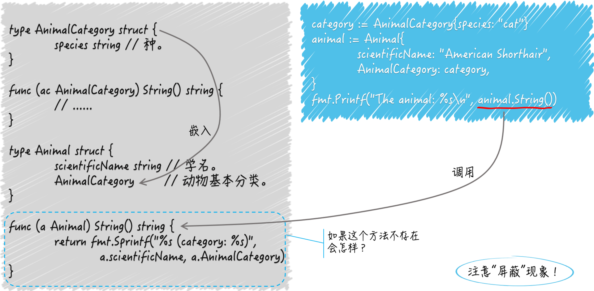

（结构体类型中的嵌入字段）

**最后，我还要提一下多层嵌入的问题。**也就是说，嵌入字段本身也有嵌入字段的情况。请看我声明的Cat类型：

```
type Cat struct {
  name string
  Animal
}

func (cat Cat) String() string {
  return fmt.Sprintf("%s (category: %s, name: %q)",
    cat.scientificName, cat.Animal.AnimalCategory, cat.name)
}
```

结构体类型Cat中有一个嵌入字段Animal，而Animal类型还有一个嵌入字段AnimalCategory。

在这种情况下，“屏蔽”现象会以嵌入的层级为依据，嵌入层级越深的字段或方法越可能被“屏蔽”。

例如，当我们调用Cat类型值的String方法时，如果该类型确有String方法，那么嵌入字段Animal和AnimalCategory的String方法都会被“屏蔽”。

如果该类型没有String方法，那么嵌入字段Animal的String方法会被调用，而它的嵌入字段AnimalCategory的String方法仍然会被屏蔽。

只有当Cat类型和Animal类型都没有String方法的时候，AnimalCategory的String方法菜会被调用。最后的最后，如果处于同一个层级的多个嵌入字段拥有同名的字段或方法，那么从被嵌入类型的值那里，选择此名称的时候就会引发一个编译错误，因为编译器无法确定被选择的成员到底是哪一个。

以上关于嵌入字段的所有示例都在 demo29.go 中，希望能对你有所帮助。

```
package main

import "fmt"

// 示例1。
// AnimalCategory 代表动物分类学中的基本分类法。
type AnimalCategory struct {
	kingdom string // 界。
	phylum  string // 门。
	class   string // 纲。
	order   string // 目。
	family  string // 科。
	genus   string // 属。
	species string // 种。
}

func (ac AnimalCategory) String() string {
	return fmt.Sprintf("%s%s%s%s%s%s%s",
		ac.kingdom, ac.phylum, ac.class, ac.order,
		ac.family, ac.genus, ac.species)
}

// 示例2。
type Animal struct {
	scientificName string // 学名。
	AnimalCategory        // 动物基本分类。
}

// 该方法会"屏蔽"掉嵌入字段中的同名方法。
func (a Animal) String() string {
	return fmt.Sprintf("%s (category: %s)",
		a.scientificName, a.AnimalCategory)
}

// 示例3。
type Cat struct {
	name string
	Animal
}

// 该方法会"屏蔽"掉嵌入字段中的同名方法。
func (cat Cat) String() string {
	return fmt.Sprintf("%s (category: %s, name: %q)",
		cat.scientificName, cat.Animal.AnimalCategory, cat.name)
}

func main() {
	// 示例1。
	category := AnimalCategory{species: "cat", genus: "dog"}
	fmt.Printf("The animal category: %s\n", category)

	// 示例2。
	animal := Animal{
		scientificName: "American Shorthair",
		AnimalCategory: category,
	}
	fmt.Printf("The animal: %s\n", animal)

	// 示例3。
	cat := Cat{
		name:   "little pig",
		Animal: animal,
	}
	fmt.Printf("The cat: %s\n", cat)
}
```

### 知识扩展

#### 问题 1：Go 语言是用嵌入字段实现了继承吗？

这里强调一下，Go 语言中根本没有继承的概念，它所做的是通过嵌入字段的方式实现了类型之间的组合。这样做的具体原因和理念请见 Go 语言官网的 FAQ 中的Why is there no type inheritance? https://golang.org/doc/faq#inheritance。

简单来说，面向对象编程中的继承，其实是通过牺牲一定的代码简洁性来换取可扩展性，而且这种可扩展性是通过侵入的方式来实现的。

类型之间的组合采用的是非声明的方式，我们不需要显式地声明某个类型实现了某个接口，或者一个类型继承了另一个类型。

同时，类型组合也是非侵入式的，它不会破坏类型的封装或加重类型之间的耦合。

我们要做的只是把类型当做字段嵌入进来，然后坐享其成地使用嵌入字段所拥有的一切。如果嵌入字段有哪里不合心意，我们还可以用“包装”或“屏蔽”的方式去调整和优化。

另外，类型间的组合也是灵活的，我们总是可以通过嵌入字段的方式把一个类型的属性和能力“嫁接”给另一个类型。

这时候，被嵌入类型也就自然而然地实现了嵌入字段所实现的接口。再者，组合要比继承更加简洁和清晰，Go 语言可以轻而易举地通过嵌入多个字段来实现功能强大的类型，却不会有多重继承那样复杂的层次结构和可观的管理成本。

接口类型之间也可以组合。在 Go 语言中，接口类型之间的组合甚至更加常见，我们常常以此来扩展接口定义的行为或者标记接口的特征。与此有关的内容我在下一篇文章中再讲。

在我面试过的众多 Go 工程师中，有很多人都在说“Go 语言用嵌入字段实现了继承”，而且深信不疑。

要么是他们还在用其他编程语言的视角和理念来看待 Go 语言，要么就是受到了某些所谓的“Go 语言教程”的误导。每当这时，我都忍不住当场纠正他们，并建议他们去看看官网上的解答。

#### 问题 2：值方法和指针方法都是什么意思，有什么区别？

我们都知道，方法的接收者类型必须是某个自定义的数据类型，而且不能是接口类型或接口的指针类型。所谓的值方法，就是接收者类型是非指针的自定义数据类型的方法。

比如，我们在前面为AnimalCategory、Animal以及Cat类型声明的那些方法都是值方法。就拿Cat来说，它的String方法的接收者类型就是Cat，一个非指针类型。那什么叫指针类型呢？请看这个方法：

```
func (cat *Cat) SetName(name string) {
  cat.name = name
}
```

方法SetName的接收者类型是*Cat。Cat左边再加个*代表的就是Cat类型的指针类型。

这时，Cat可以被叫做*Cat的基本类型。你可以认为这种指针类型的值表示的是指向某个基本类型值的指针。

我们可以通过把取值操作符*放在这样一个指针值的左边来组成一个取值表达式，以获取该指针值指向的基本类型值，也可以通过把取址操作符&放在一个可寻址的基本类型值的左边来组成一个取址表达式，以获取该基本类型值的指针值。

所谓的指针方法，就是接收者类型是上述指针类型的方法。

那么值方法和指针方法之间有什么不同点呢？它们的不同如下所示。

1、值方法的接收者是该方法所属的那个类型值的一个副本。我们在该方法内对该副本的修改一般都不会体现在原值上，除非这个类型本身是某个引用类型（比如切片或字典）的别名类型。

而指针方法的接收者，是该方法所属的那个基本类型值的指针值的一个副本。我们在这样的方法内对该副本指向的值进行修改，却一定会体现在原值上。

2、一个自定义数据类型的方法集合中仅会包含它的所有值方法，而该类型的指针类型的方法集合却囊括了前者的所有方法，包括所有值方法和所有指针方法。

严格来讲，我们在这样的基本类型的值上只能调用到它的值方法。但是，Go 语言会适时地为我们进行自动地转译，使得我们在这样的值上也能调用到它的指针方法。

比如，在Cat类型的变量cat之上，之所以我们可以通过cat.SetName("monster")修改猫的名字，是因为 Go 语言把它自动转译为了(&cat).SetName("monster")，即：先取cat的指针值，然后在该指针值上调用SetName方法。

3、在后边你会了解到，一个类型的方法集合中有哪些方法与它能实现哪些接口类型是息息相关的。如果一个基本类型和它的指针类型的方法集合是不同的，那么它们具体实现的接口类型的数量就也会有差异，除非这两个数量都是零。

比如，一个指针类型实现了某某接口类型，但它的基本类型却不一定能够作为该接口的实现类型。

能够体现值方法和指针方法之间差异的小例子我放在 demo30.go 文件里了，你可以参照一下。

```
package main

import "fmt"

type Cat struct {
	name           string // 名字。
	scientificName string // 学名。
	category       string // 动物学基本分类。
}

func New(name, scientificName, category string) Cat {
	return Cat{
		name:           name,
		scientificName: scientificName,
		category:       category,
	}
}

func (cat *Cat) SetName(name string) {
	cat.name = name
}

func (cat Cat) SetNameOfCopy(name string) {
	cat.name = name
}

func (cat Cat) Name() string {
	return cat.name
}

func (cat Cat) ScientificName() string {
	return cat.scientificName
}

func (cat Cat) Category() string {
	return cat.category
}

func (cat Cat) String() string {
	return fmt.Sprintf("%s (category: %s, name: %q)",
		cat.scientificName, cat.category, cat.name)
}

func main() {
	cat := New("little pig", "American Shorthair", "cat")
	cat.SetName("monster") // (&cat).SetName("monster")
	fmt.Printf("The cat: %s\n", cat)

	cat.SetNameOfCopy("little pig")
	fmt.Printf("The cat: %s\n", cat)

	type Pet interface {
		SetName(name string)
		Name() string
		Category() string
		ScientificName() string
	}

	_, ok := interface{}(cat).(Pet)
	fmt.Printf("Cat implements interface Pet: %v\n", ok)
	_, ok = interface{}(&cat).(Pet)
	fmt.Printf("*Cat implements interface Pet: %v\n", ok)
}
```

### 总结

结构体类型的嵌入字段比较容易让 Go 语言新手们迷惑，所以我在本篇文章着重解释了它的编写方法、基本的特性和规则以及更深层次的含义。在理解了结构体类型及其方法的组成方式和构造套路之后，这些知识应该是你重点掌握的。

嵌入字段是其声明中只有类型而没有名称的字段，它可以以一种很自然的方式为被嵌入的类型带来新的属性和能力。在一般情况下，我们用简单的选择表达式就可以直接引用到它们的字段和方法。

不过，我们需要小心可能产生“屏蔽”现象的地方，尤其是当存在多个嵌入字段或者多层嵌入的时候。“屏蔽”现象可能会让你的实际引用与你的预期不符。

另外，你一定要梳理清楚值方法和指针方法的不同之处，包括这两种方法各自能做什么、不能做什么以及会影响到其所属类型的哪些方面。这涉及值的修改、方法集合和接口实现。

最后，再次强调，嵌入字段是实现类型间组合的一种方式，这与继承没有半点儿关系。Go 语言虽然支持面向对象编程，但是根本就没有“继承”这个概念。

### 思考题

- 我们可以在结构体类型中嵌入某个类型的指针类型吗？如果可以，有哪些注意事项？
- 字面量struct{}代表了什么？又有什么用处？

## 14 | 接口类型的合理运用

### 前导内容：正确使用接口的基础知识

在 Go 语言的语境中，当我们在谈论“接口”的时候，一定指的是接口类型。因为接口类型与其他数据类型不同，它是没法被实例化的。

更具体地说，我们既不能通过调用new函数或make函数创建出一个接口类型的值，也无法用字面量来表示一个接口类型的值。

对于某一个接口类型来说，如果没有任何数据类型可以作为它的实现，那么该接口的值就不可能存在。

我已经在前面展示过，通过关键字type和interface，我们可以声明出接口类型。

接口类型的类型字面量与结构体类型的看起来有些相似，它们都用花括号包裹一些核心信息。只不过，结构体类型包裹的是它的字段声明，而接口类型包裹的是它的方法定义。

这里你要注意的是：接口类型声明中的这些方法所代表的就是该接口的方法集合。一个接口的方法集合就是它的全部特征。

对于任何数据类型，只要它的方法集合中完全包含了一个接口的全部特征（即全部的方法），那么它就一定是这个接口的实现类型。比如下面这样：

```
type Pet interface {
  SetName(name string)
  Name() string
  Category() string
}
```

我声明了一个接口类型Pet，它包含了 3 个方法定义，方法名称分别为SetName、Name和Category。这 3 个方法共同组成了接口类型Pet的方法集合。

只要一个数据类型的方法集合中有这 3 个方法，那么它就一定是Pet接口的实现类型。这是一种无侵入式的接口实现方式。这种方式还有一个专有名词，叫“Duck typing”，中文常译作“鸭子类型”。你可以到百度的百科页面 [https://baike.baidu.com/item/%E9%B8%AD%E5%AD%90%E7%B1%BB%E5%9E%8B](https://baike.baidu.com/item/鸭子类型) 上去了解一下详情。

顺便说一句，**怎样判定一个数据类型的某一个方法实现的就是某个接口类型中的某个方法呢**？

这有两个充分必要条件，一个是“两个方法的签名需要完全一致”，另一个是“两个方法的名称要一模一样”。显然，这比判断一个函数是否实现了某个函数类型要更加严格一些。

如果你查阅了上篇文章附带的最后一个示例的话，那么就一定会知道，虽然结构体类型Cat不是Pet接口的实现类型，但它的指针类型*Cat却是这个的实现类型。

如果你还不知道原因，那么请跟着我一起来看。我已经把Cat类型的声明搬到了 demo31.go 文件中，并进行了一些简化，以便你看得更清楚。对了，由于Cat和Pet的发音过于相似，我还把Cat重命名为了Dog。

```
package main

import "fmt"

type Pet interface {
	SetName(name string)
	Name() string
	Category() string
}

type Dog struct {
	name string // 名字。
}

func (dog *Dog) SetName(name string) {
	dog.name = name
}

func (dog Dog) Name() string {
	return dog.name
}

func (dog Dog) Category() string {
	return "dog"
}

func main() {
	// 示例1。
	dog := Dog{"little pig"}
	_, ok := interface{}(dog).(Pet)
	fmt.Printf("Dog implements interface Pet: %v\n", ok)
	_, ok = interface{}(&dog).(Pet)
	fmt.Printf("*Dog implements interface Pet: %v\n", ok)
	fmt.Println()

	// 示例2。
	var pet Pet = &dog
	fmt.Printf("This pet is a %s, the name is %q.\n",
		pet.Category(), pet.Name())
}
```

我声明的类型Dog附带了 3 个方法。其中有 2 个值方法，分别是Name和Category，另外还有一个指针方法SetName。

这就意味着，Dog类型本身的方法集合中只包含了 2 个方法，也就是所有的值方法。而它的指针类型*Dog方法集合却包含了 3 个方法，

也就是说，它拥有Dog类型附带的所有值方法和指针方法。又由于这 3 个方法恰恰分别是Pet接口中某个方法的实现，所以*Dog类型就成为了Pet接口的实现类型。

```
dog := Dog{"little pig"}
var pet Pet = &dog
```

正因为如此，我可以声明并初始化一个Dog类型的变量dog，然后把它的指针值赋给类型为Pet的变量pet。

这里有几个名词需要你先记住。对于一个接口类型的变量来说，例如上面的变量pet，我们赋给它的值可以被叫做它的实际值（也称动态值），而该值的类型可以被叫做这个变量的实际类型（也称动态类型）。

比如，我们把取址表达式&dog的结果值赋给了变量pet，这时这个结果值就是变量pet的动态值，而此结果值的类型*Dog就是该变量的动态类型。

动态类型这个叫法是相对于静态类型而言的。对于变量pet来讲，它的静态类型就是Pet，并且永远是Pet，但是它的动态类型却会随着我们赋给它的动态值而变化。

比如，只有我把一个*Dog类型的值赋给变量pet之后，该变量的动态类型才会是*Dog。如果还有一个Pet接口的实现类型*Fish，并且我又把一个此类型的值赋给了pet，那么它的动态类型就会变为*Fish。

还有，在我们给一个接口类型的变量赋予实际的值之前，它的动态类型是不存在的。

你需要想办法搞清楚接口类型的变量（以下简称接口变量）的动态值、动态类型和静态类型都是什么意思。因为我会在后面基于这些概念讲解更深层次的知识。

好了，我下面会就“怎样用好 Go 语言的接口”这个话题提出一系列问题，也请你跟着我一起思考这些问题。

### 那么今天的问题是：当我们为一个接口变量赋值时会发生什么？

为了突出问题，我把Pet接口的声明简化了一下。

```
type Pet interface {
  Name() string
  Category() string
}
```

我从中去掉了Pet接口的那个名为SetName的方法。这样一来，Dog类型也就变成Pet接口的实现类型了。你可以在 demo32.go 文件中找到本问题的代码。

```
package main

import (
	"fmt"
)

type Pet interface {
	Name() string
	Category() string
}

type Dog struct {
	name string // 名字。
}

func (dog *Dog) SetName(name string) {
	dog.name = name
}

func (dog Dog) Name() string {
	return dog.name
}

func (dog Dog) Category() string {
	return "dog"
}

func main() {
	// 示例1。
	dog := Dog{"little pig"}
	fmt.Printf("The dog's name is %q.\n", dog.Name())
	var pet Pet = dog
	dog.SetName("monster")
	fmt.Printf("The dog's name is %q.\n", dog.Name())
	fmt.Printf("This pet is a %s, the name is %q.\n",
		pet.Category(), pet.Name())
	fmt.Println()

	// 示例2。
	dog1 := Dog{"little pig"}
	fmt.Printf("The name of first dog is %q.\n", dog1.Name())
	dog2 := dog1
	fmt.Printf("The name of second dog is %q.\n", dog2.Name())
	dog1.name = "monster"
	fmt.Printf("The name of first dog is %q.\n", dog1.Name())
	fmt.Printf("The name of second dog is %q.\n", dog2.Name())
	fmt.Println()

	// 示例3。
	dog = Dog{"little pig"}
	fmt.Printf("The dog's name is %q.\n", dog.Name())
	pet = &dog
	dog.SetName("monster")
	fmt.Printf("The dog's name is %q.\n", dog.Name())
	fmt.Printf("This pet is a %s, the name is %q.\n",
		pet.Category(), pet.Name())
}
```

现在，我先声明并初始化了一个Dog类型的变量dog，这时它的name字段的值是"little pig"。然后，我把该变量赋给了一个Pet类型的变量pet。最后我通过调用dog的方法SetName把它的name字段的值改成了"monster"。

```
dog := Dog{"little pig"}
var pet Pet = dog
dog.SetName("monster")
```

所以，我要问的具体问题是：在以上代码执行后，pet变量的字段name的值会是什么？

**这个题目的典型回答是**：pet变量的字段name的值依然是"little pig"。

### 问题解析

首先，由于dog的SetName方法是指针方法，所以该方法持有的接收者就是指向dog的指针值的副本，因而其中对接收者的name字段的设置就是对变量dog的改动。那么当dog.SetName("monster")执行之后，dog的name字段的值就一定是"monster"。如果你理解到了这一层，那么请小心前方的陷阱。

为什么dog的name字段值变了，而pet的却没有呢？这里有一条通用的规则需要你知晓：如果我们使用一个变量给另外一个变量赋值，那么真正赋给后者的，并不是前者持有的那个值，而是该值的一个副本。

例如，我声明并初始化了一个Dog类型的变量dog1，这时它的name是"little pig"。然后，我在把dog1赋给变量dog2之后，修改了dog1的name字段的值。这时，dog2的name字段的值是什么？

```
dog1 := Dog{"little pig"}
dog2 := dog1
dog1.name = "monster"
```

这个问题与前面那道题几乎一样，只不过这里没有涉及接口类型。这时的dog2的name仍然会是"little pig"。这就是我刚刚告诉你的那条通用规则的又一个体现。

当你知道了这条通用规则之后，确实可以把前面那道题做对。不过，如果当我问你为什么的时候你只说出了这一个原因，那么，我只能说你仅仅答对了一半。

那么另一半是什么？这就需要从接口类型值的存储方式和结构说起了。我在前面说过，接口类型本身是无法被值化的。在我们赋予它实际的值之前，它的值一定会是nil，这也是它的零值。

反过来讲，一旦它被赋予了某个实现类型的值，它的值就不再是nil了。不过要注意，即使我们像前面那样把dog的值赋给了pet，pet的值与dog的值也是不同的。这不仅仅是副本与原值的那种不同。

当我们给一个接口变量赋值的时候，该变量的动态类型会与它的动态值一起被存储在一个专用的数据结构中。

严格来讲，这样一个变量的值其实是这个专用数据结构的一个实例，而不是我们赋给该变量的那个实际的值。所以我才说，pet的值与dog的值肯定是不同的，无论是从它们存储的内容，还是存储的结构上来看都是如此。不过，我们可以认为，这时pet的值中包含了dog值的副本。

我们就把这个专用的数据结构叫做iface吧，在 Go 语言的runtime包中它其实就叫这个名字。

iface的实例会包含两个指针，一个是指向类型信息的指针，另一个是指向动态值的指针。这里的类型信息是由另一个专用数据结构的实例承载的，其中包含了动态值的类型，以及使它实现了接口的方法和调用它们的途径，等等。

总之，接口变量被赋予动态值的时候，存储的是包含了这个动态值的副本的一个结构更加复杂的值。你明白了吗？

### 知识扩展

#### 问题 1：接口变量的值在什么情况下才真正为nil？

这个问题初看起来就不是个问题。对于一个引用类型的变量，它的值是否为nil完全取决于我们赋给它了什么，是这样吗？我们先来看一段代码：

```
var dog1 *Dog
fmt.Println("The first dog is nil. [wrap1]")
dog2 := dog1
fmt.Println("The second dog is nil. [wrap1]")
var pet Pet = dog2
if pet == nil {
  fmt.Println("The pet is nil. [wrap1]")
} else {
  fmt.Println("The pet is not nil. [wrap1]")
}
```

在 demo33.go 文件的这段代码中，我先声明了一个*Dog类型的变量dog1，并且没有对它进行初始化。这时该变量的值是什么？显然是nil。然后我把该变量赋给了dog2，后者的值此时也必定是nil，对吗？

现在问题来了：当我把dog2赋给Pet类型的变量pet之后，变量pet的值会是什么？答案是nil吗？

如果你真正理解了我在上一个问题的解析中讲到的知识，尤其是接口变量赋值及其值的数据结构那部分，那么这道题就不难回答。你可以先思考一下，然后再接着往下看。

当我们把dog2的值赋给变量pet的时候，dog2的值会先被复制，不过由于在这里它的值是nil，所以就没必要复制了。

然后，Go 语言会用我上面提到的那个专用数据结构iface的实例包装这个dog2的值的副本，这里是nil。

虽然被包装的动态值是nil，但是pet的值却不会是nil，因为这个动态值只是pet值的一部分而已。

顺便说一句，这时的pet的动态类型就存在了，是*Dog。我们可以通过fmt.Printf函数和占位符%T来验证这一点，另外reflect包的TypeOf函数也可以起到类似的作用。

换个角度来看。我们把nil赋给了pet，但是pet的值却不是nil。

这很奇怪对吗？其实不然。在 Go 语言中，我们把由字面量nil表示的值叫做无类型的nil。这是真正的nil，因为它的类型也是nil的。虽然dog2的值是真正的nil，但是当我们把这个变量赋给pet的时候，Go 语言会把它的类型和值放在一起考虑。

也就是说，这时 Go 语言会识别出赋予pet的值是一个*Dog类型的nil。然后，Go 语言就会用一个iface的实例包装它，包装后的产物肯定就不是nil了。

只要我们把一个有类型的nil赋给接口变量，那么这个变量的值就一定不会是那个真正的nil。因此，当我们使用判等符号==判断pet是否与字面量nil相等的时候，答案一定会是false。

那么，怎样才能让一个接口变量的值真正为nil呢？要么只声明它但不做初始化，要么直接把字面量nil赋给它。

demo33

```
package main

import (
	"fmt"
	"reflect"
)

type Pet interface {
	Name() string
	Category() string
}

type Dog struct {
	name string // 名字。
}

func (dog *Dog) SetName(name string) {
	dog.name = name
}

func (dog Dog) Name() string {
	return dog.name
}

func (dog Dog) Category() string {
	return "dog"
}

func main() {
	// 示例1。
	var dog1 *Dog
	fmt.Println("The first dog is nil.")
	dog2 := dog1
	fmt.Println("The second dog is nil.")
	var pet Pet = dog2
	if pet == nil {
		fmt.Println("The pet is nil.")
	} else {
		fmt.Println("The pet is not nil.")
	}
	fmt.Printf("The type of pet is %T.\n", pet)
	fmt.Printf("The type of pet is %s.\n", reflect.TypeOf(pet).String())
	fmt.Printf("The type of second dog is %T.\n", dog2)
	fmt.Println()

	// 示例2。
	wrap := func(dog *Dog) Pet {
		if dog == nil {
			return nil
		}
		return dog
	}
	pet = wrap(dog2)
	if pet == nil {
		fmt.Println("The pet is nil.")
	} else {
		fmt.Println("The pet is not nil.")
	}
}
```

#### 问题 2：怎样实现接口之间的组合？

接口类型间的嵌入也被称为接口的组合。我在前面讲过结构体类型的嵌入字段，这其实就是在说结构体类型间的嵌入。

接口类型间的嵌入要更简单一些，因为它不会涉及方法间的“屏蔽”。只要组合的接口之间有同名的方法就会产生冲突，从而无法通过编译，即使同名方法的签名彼此不同也会是如此。因此，接口的组合根本不可能导致“屏蔽”现象的出现。

与结构体类型间的嵌入很相似，我们只要把一个接口类型的名称直接写到另一个接口类型的成员列表中就可以了。比如：

```
type Animal interface {
  ScientificName() string
  Category() string
}

type Pet interface {
  Animal
  Name() string
}
```

接口类型Pet包含了两个成员，一个是代表了另一个接口类型的Animal，一个是方法Name的定义。它们都被包含在Pet的类型声明的花括号中，并且都各自独占一行。此时，Animal接口包含的所有方法也就成为了Pet接口的方法。

Go 语言团队鼓励我们声明体量较小的接口，并建议我们通过这种接口间的组合来扩展程序、增加程序的灵活性。

这是因为相比于包含很多方法的大接口而言，小接口可以更加专注地表达某一种能力或某一类特征，同时也更容易被组合在一起。

Go 语言标准库代码包io中的ReadWriteCloser接口和ReadWriter接口就是这样的例子，它们都是由若干个小接口组合而成的。以io.ReadWriteCloser接口为例，它是由io.Reader、io.Writer和io.Closer这三个接口组成的。

这三个接口都只包含了一个方法，是典型的小接口。它们中的每一个都只代表了一种能力，分别是读出、写入和关闭。我们编写这几个小接口的实现类型通常都会很容易。并且，一旦我们同时实现了它们，就等于实现了它们的组合接口io.ReadWriteCloser。

即使我们只实现了io.Reader和io.Writer，那么也等同于实现了io.ReadWriter接口，因为后者就是前两个接口组成的。可以看到，这几个io包中的接口共同组成了一个接口矩阵。它们既相互关联又独立存在。

我在 demo34.go 文件中写了一个能够体现接口组合优势的小例子，你可以去参看一下。总之，善用接口组合和小接口可以让你的程序框架更加稳定和灵活。

```
package main

import (
	"fmt"
)

type Animal interface {
	// ScientificName 用于获取动物的学名。
	ScientificName() string
	// Category 用于获取动物的基本分类。
	Category() string
}

type Named interface {
	// Name 用于获取名字。
	Name() string
}

type Pet interface {
	Animal
	Named
}

type PetTag struct {
	name  string
	owner string
}

func (pt PetTag) Name() string {
	return pt.name
}

func (pt PetTag) Owner() string {
	return pt.owner
}

type Dog struct {
	PetTag
	scientificName string
}

func (dog Dog) ScientificName() string {
	return dog.scientificName
}

func (dog Dog) Category() string {
	return "dog"
}

func main() {
	petTag := PetTag{name: "little pig"}
	_, ok := interface{}(petTag).(Named)
	fmt.Printf("PetTag implements interface Named: %v\n", ok)
	dog := Dog{
		PetTag:         petTag,
		scientificName: "Labrador Retriever",
	}
	_, ok = interface{}(dog).(Animal)
	fmt.Printf("Dog implements interface Animal: %v\n", ok)
	_, ok = interface{}(dog).(Named)
	fmt.Printf("Dog implements interface Named: %v\n", ok)
	_, ok = interface{}(dog).(Pet)
	fmt.Printf("Dog implements interface Pet: %v\n", ok)
}
```

### 总结

Go 语言的接口常用于代表某种能力或某类特征。首先，我们要弄清楚的是，接口变量的动态值、动态类型和静态类型都代表了什么。这些都是正确使用接口变量的基础。当我们给接口变量赋值时，接口变量会持有被赋予值的副本，而不是它本身。

更重要的是，接口变量的值并不等同于这个可被称为动态值的副本。它会包含两个指针，一个指针指向动态值，一个指针指向类型信息。

基于此，即使我们把一个值为nil的某个实现类型的变量赋给了接口变量，后者的值也不可能是真正的nil。虽然这时它的动态值会为nil，但它的动态类型确是存在的。

请记住，除非我们只声明而不初始化，或者显式地赋给它nil，否则接口变量的值就不会为nil。

后面的一个问题相对轻松一些，它是关于程序设计方面的。用好小接口和接口组合总是有益的，我们可以以此形成接口矩阵，进而搭起灵活的程序框架。如果在实现接口时再配合运用结构体类型间的嵌入手法，那么接口组合就可以发挥更大的效用。

### 思考题

如果我们把一个值为nil的某个实现类型的变量赋给了接口变量，那么在这个接口变量上仍然可以调用该接口的方法吗？如果可以，有哪些注意事项？如果不可以，原因是什么？

## 15 | 关于指针的有限操作

在前面的文章中，我们已经提到过很多次“指针”了，你应该已经比较熟悉了。不过，我们那时大多指的是指针类型及其对应的指针值，今天我们讲的则是更为深入的内容。

让我们先来复习一下。

```
type Dog struct {
  name string
}

func (dog *Dog) SetName(name string) {
  dog.name = name
}
```

对于基本类型Dog来说，*Dog就是它的指针类型。而对于一个Dog类型，值不为nil的变量dog，取址表达式&dog的结果就是该变量的值（也就是基本值）的指针值。

如果一个方法的接收者是*Dog类型的，那么该方法就是基本类型Dog的指针方法。

在这种情况下，这个方法的接收者，实际上就是当前的基本值的指针值。

我们可以通过指针值无缝地访问到基本值包含的任何字段，以及调用与之关联的任何方法。这应该就是我们在编写 Go 程序的过程中，用得最频繁的“指针”了。

从传统意义上说，指针是一个指向某个确切的内存地址的值。这个内存地址可以是任何数据或代码的起始地址，比如，某个变量、某个字段或某个函数。

我们刚刚只提到了其中的一种情况，在 Go 语言中还有其他几样东西可以代表“指针”。其中最贴近传统意义的当属uintptr类型了。该类型实际上是一个数值类型，也是 Go 语言内建的数据类型之一。

根据当前计算机的计算架构的不同，它可以存储 32 位或 64 位的无符号整数，可以代表任何指针的位（bit）模式，也就是原始的内存地址。

再来看 Go 语言标准库中的unsafe包。unsafe包中有一个类型叫做Pointer，也代表了“指针”。

unsafe.Pointer可以表示任何指向可寻址的值的指针，同时它也是前面提到的指针值和uintptr值之间的桥梁。也就是说，通过它，我们可以在这两种值之上进行双向的转换。这里有一个很关键的词——可寻址的（addressable）。在我们继续说unsafe.Pointer之前，需要先要搞清楚这个词的确切含义。

### 今天的问题是：你能列举出 Go 语言中的哪些值是不可寻址的吗？

**这道题的典型回答是**以下列表中的值都是不可寻址的。

- 常量的值。
- 基本类型值的字面量。
- 算术操作的结果值。
- 对各种字面量的索引表达式和切片表达式的结果值。不过有一个例外，对切片字面量的索引结果值却是可寻址的。
- 对字符串变量的索引表达式和切片表达式的结果值。
- 对字典变量的索引表达式的结果值。
- 函数字面量和方法字面量，以及对它们的调用表达式的结果值。
- 结构体字面量的字段值，也就是对结构体字面量的选择表达式的结果值。
- 类型转换表达式的结果值。
- 类型断言表达式的结果值。
- 接收表达式的结果值。

### 问题解析

初看答案中的这些不可寻址的值好像并没有什么规律。不过别急，我们一起来梳理一下。你可以对照着 demo35.go 文件中的代码来看，这样应该会让你理解起来更容易一些。

```
package main

type Named interface {
	// Name 用于获取名字。
	Name() string
}

type Dog struct {
	name string
}

func (dog *Dog) SetName(name string) {
	dog.name = name
}

func (dog Dog) Name() string {
	return dog.name
}

func main() {
	// 示例1。
	const num = 123
	//_ = &num // 常量不可寻址。
	//_ = &(123) // 基本类型值的字面量不可寻址。

	var str = "abc"
	_ = str
	//_ = &(str[0]) // 对字符串变量的索引结果值不可寻址。
	//_ = &(str[0:2]) // 对字符串变量的切片结果值不可寻址。
	str2 := str[0]
	_ = &str2 // 但这样的寻址就是合法的。

	//_ = &(123 + 456) // 算术操作的结果值不可寻址。
	num2 := 456
	_ = num2
	//_ = &(num + num2) // 算术操作的结果值不可寻址。

	//_ = &([3]int{1, 2, 3}[0]) // 对数组字面量的索引结果值不可寻址。
	//_ = &([3]int{1, 2, 3}[0:2]) // 对数组字面量的切片结果值不可寻址。
	_ = &([]int{1, 2, 3}[0]) // 对切片字面量的索引结果值却是可寻址的。
	//_ = &([]int{1, 2, 3}[0:2]) // 对切片字面量的切片结果值不可寻址。
	//_ = &(map[int]string{1: "a"}[0]) // 对字典字面量的索引结果值不可寻址。

	var map1 = map[int]string{1: "a", 2: "b", 3: "c"}
	_ = map1
	//_ = &(map1[2]) // 对字典变量的索引结果值不可寻址。

	//_ = &(func(x, y int) int {
	//	return x + y
	//}) // 字面量代表的函数不可寻址。
	//_ = &(fmt.Sprintf) // 标识符代表的函数不可寻址。
	//_ = &(fmt.Sprintln("abc")) // 对函数的调用结果值不可寻址。

	dog := Dog{"little pig"}
	_ = dog
	//_ = &(dog.Name) // 标识符代表的函数不可寻址。
	//_ = &(dog.Name()) // 对方法的调用结果值不可寻址。

	//_ = &(Dog{"little pig"}.name) // 结构体字面量的字段不可寻址。

	//_ = &(interface{}(dog)) // 类型转换表达式的结果值不可寻址。
	dogI := interface{}(dog)
	_ = dogI
	//_ = &(dogI.(Named)) // 类型断言表达式的结果值不可寻址。
	named := dogI.(Named)
	_ = named
	//_ = &(named.(Dog)) // 类型断言表达式的结果值不可寻址。

	var chan1 = make(chan int, 1)
	chan1 <- 1
	//_ = &(<-chan1) // 接收表达式的结果值不可寻址。

}
```

常量的值总是会被存储到一个确切的内存区域中，并且这种值肯定是**不可变的**。基本类型值的字面量也是一样，其实它们本就可以被视为常量，只不过没有任何标识符可以代表它们罢了。

**第一个关键词：不可变的。**由于 Go 语言中的字符串值也是不可变的，所以对于一个字符串类型的变量来说，基于它的索引或切片的结果值也都是不可寻址的，因为即使拿到了这种值的内存地址也改变不了什么。

算术操作的结果值属于一种**临时结果**。在我们把这种结果值赋给任何变量或常量之前，即使能拿到它的内存地址也是没有任何意义的。

**第二个关键词：临时结果。**这个关键词能被用来解释很多现象。我们可以把各种对值字面量施加的表达式的求值结果都看做是临时结果。

我们都知道，Go 语言中的表达式有很多种，其中常用的包括以下几种。

- 用于获得某个元素的索引表达式。
- 用于获得某个切片（片段）的切片表达式。
- 用于访问某个字段的选择表达式。
- 用于调用某个函数或方法的调用表达式。
- 用于转换值的类型的类型转换表达式。
- 用于判断值的类型的类型断言表达式。
- 向通道发送元素值或从通道那里接收元素值的接收表达式。

我们把以上这些表达式施加在某个值字面量上一般都会得到一个临时结果。比如，对数组字面量和字典字面量的索引结果值，又比如，对数组字面量和切片字面量的切片结果值。它们都属于临时结果，都是不可寻址的。

一个需要特别注意的例外是，对切片字面量的索引结果值是可寻址的。因为不论怎样，每个切片值都会持有一个底层数组，而这个底层数组中的每个元素值都是有一个确切的内存地址的。

你可能会问，那么对切片字面量的切片结果值为什么却是不可寻址的？这是因为切片表达式总会返回一个新的切片值，而这个新的切片值在被赋给变量之前属于临时结果。

你可能已经注意到了，我一直在说针对数组值、切片值或字典值的**字面量**的表达式会产生临时结果。如果针对的是数组类型或切片类型的变量，那么索引或切片的结果值就都不属于临时结果了，是可寻址的。

这主要因为变量的值本身就不是“临时的”。对比而言，值字面量在还没有与任何变量（或者说任何标识符）绑定之前是没有落脚点的，我们无法以任何方式引用到它们。这样的值就是“临时的”。

再说一个例外。我们通过对字典类型的变量施加索引表达式，得到的结果值不属于临时结果，可是，这样的值却是不可寻址的。原因是，字典中的每个键 - 元素对的存储位置都可能会变化，而且这种变化外界是无法感知的。

我们都知道，字典中总会有若干个哈希桶用于均匀地储存键 - 元素对。当满足一定条件时，字典可能会改变哈希桶的数量，并适时地把其中的键 - 元素对搬运到对应的新的哈希桶中。

在这种情况下，获取字典中任何元素值的指针都是无意义的，也是**不安全的**。我们不知道什么时候那个元素值会被搬运到何处，也不知道原先的那个内存地址上还会被存放什么别的东西。所以，这样的值就应该是不可寻址的。

**第三个关键词：不安全的。**“不安全的”操作很可能会破坏程序的一致性，引发不可预知的错误，从而严重影响程序的功能和稳定性。

再来看函数。函数在 Go 语言中是一等公民，所以我们可以把代表函数或方法的字面量或标识符赋给某个变量、传给某个函数或者从某个函数传出。但是，这样的函数和方法都是不可寻址的。一个原因是函数就是代码，是不可变的。

另一个原因是，拿到指向一段代码的指针是不安全的。此外，对函数或方法的调用结果值也是不可寻址的，这是因为它们都属于临时结果。

至于典型回答中最后列出的那几种值，由于都是针对值字面量的某种表达式的结果值，所以都属于临时结果，都不可寻址。

好了，说了这么多，希望你已经有所领悟了。我来总结一下。

1、**不可变的**值不可寻址。常量、基本类型的值字面量、字符串变量的值、函数以及方法的字面量都是如此。其实这样规定也有安全性方面的考虑。

2、绝大多数被视为**临时结果**的值都是不可寻址的。算术操作的结果值属于临时结果，针对值字面量的表达式结果值也属于临时结果。但有一个例外，对切片字面量的索引结果值虽然也属于临时结果，但却是可寻址的。

3、若拿到某值的指针可能会破坏程序的一致性，那么就是**不安全的**，该值就不可寻址。由于字典的内部机制，对字典的索引结果值的取址操作都是不安全的。另外，获取由字面量或标识符代表的函数或方法的地址显然也是不安全的。

最后说一句，如果我们把临时结果赋给一个变量，那么它就是可寻址的了。如此一来，取得的指针指向的就是这个变量持有的那个值了。

### 知识扩展

#### 问题 1：不可寻址的值在使用上有哪些限制？

首当其冲的当然是无法使用取址操作符&获取它们的指针了。不过，对不可寻址的值施加取址操作都会使编译器报错，所以倒是不用太担心，你只要记住我在前面讲述的那几条规律，并在编码的时候提前注意一下就好了。

我们来看下面这个小问题。我们依然以那个结构体类型Dog为例。

```
func New(name string) Dog {
  return Dog{name}
}
```

我们再为它编写一个函数New。这个函数会接受一个名为name的string类型的参数，并会用这个参数初始化一个Dog类型的值，最后返回该值。我现在要问的是：如果我调用该函数，并直接以链式的手法调用其结果值的指针方法SetName，那么可以达到预期的效果吗？

```
New("little pig").SetName("monster")
```

如果你还记得我在前面讲述的内容，那么肯定会知道调用New函数所得到的结果值属于临时结果，是不可寻址的。

可是，那又怎样呢？别忘了，我在讲结构体类型及其方法的时候还说过，我们可以在一个基本类型的值上调用它的指针方法，这是因为 Go 语言会自动地帮我们转译。

更具体地说，对于一个Dog类型的变量dog来说，调用表达式dog.SetName("monster")会被自动地转译为(&dog).SetName("monster")，即：先取dog的指针值，再在该指针值上调用SetName方法。

发现问题了吗？由于New函数的调用结果值是不可寻址的，所以无法对它进行取址操作。因此，上边这行链式调用会让编译器报告两个错误，一个是果，即：不能在New("little pig")的结果值上调用指针方法。一个是因，即：不能取得New("little pig")的地址。

除此之外，我们都知道，Go 语言中的++和--并不属于操作符，而分别是自增语句和自减语句的重要组成部分。

虽然 Go 语言规范中的语法定义是，只要在++或--的左边添加一个表达式，就可以组成一个自增语句或自减语句，但是，它还明确了一个很重要的限制，那就是这个表达式的结果值必须是可寻址的。这就使得针对值字面量的表达式几乎都无法被用在这里。

```
package main

type Dog struct {
	name string
}

func New(name string) Dog {
	return Dog{name}
}

func (dog *Dog) SetName(name string) {
	dog.name = name
}

func (dog Dog) Name() string {
	return dog.name
}

func main() {
	// 示例1。
	//New("little pig").SetName("monster") // 不能调用不可寻址的值的指针方法。

	// 示例2。
	map[string]int{"the": 0, "word": 0, "counter": 0}["word"]++
	map1 := map[string]int{"the": 0, "word": 0, "counter": 0}
	map1["word"]++
}
```

不过这有一个例外，虽然对字典字面量和字典变量索引表达式的结果值都是不可寻址的，但是这样的表达式却可以被用在自增语句和自减语句中。

与之类似的规则还有两个。一个是，在赋值语句中，赋值操作符左边的表达式的结果值必须可寻址的，但是对字典的索引结果值也是可以的。

另一个是，在带有range子句的for语句中，在range关键字左边的表达式的结果值也都必须是可寻址的，不过对字典的索引结果值同样可以被用在这里。以上这三条规则我们合并起来记忆就可以了。

与这些定死的规则相比，我刚刚讲到的那个与指针方法有关的问题，你需要好好理解一下，它涉及了两个知识点的联合运用。起码在我面试的时候，它是一个可选择的考点。

#### 问题 2：怎样通过unsafe.Pointer操纵可寻址的值？

前边的基础知识很重要。不过现在让我们再次关注指针的用法。我说过，unsafe.Pointer是像*Dog类型的值这样的指针值和uintptr值之间的桥梁，那么我们怎样利用unsafe.Pointer的中转和uintptr的底层操作来操纵像dog这样的值呢？

首先说明，这是一项黑科技。它可以绕过 Go 语言的编译器和其他工具的重重检查，并达到潜入内存修改数据的目的。这并不是一种正常的编程手段，使用它会很危险，很有可能造成安全隐患。

我们总是应该优先使用常规代码包中提供的 API 去编写程序，当然也可以把像reflect以及go/ast这样的代码包作为备选项。作为上层应用的开发者，请谨慎地使用unsafe包中的任何程序实体。

不过既然说到这里了，我们还是要来一探究竟的。请看下面的代码：

```
dog := Dog{"little pig"}
dogP := &dog
dogPtr := uintptr(unsafe.Pointer(dogP))
```

我先声明了一个Dog类型的变量dog，然后用取址操作符&，取出了它的指针值，并把它赋给了变量dogP。

最后，我使用了两个类型转换，先把dogP转换成了一个unsafe.Pointer类型的值，然后紧接着又把后者转换成了一个uintptr的值，并把它赋给了变量dogPtr。这背后隐藏着一些转换规则，如下：

- 一个指针值（比如*Dog类型的值）可以被转换为一个unsafe.Pointer类型的值，反之亦然。
- 一个uintptr类型的值也可以被转换为一个unsafe.Pointer类型的值，反之亦然。
- 一个指针值无法被直接转换成一个uintptr类型的值，反过来也是如此。

所以，对于指针值和uintptr类型值之间的转换，必须使用unsafe.Pointer类型的值作为中转。那么，我们把指针值转换成uintptr类型的值有什么意义吗？

```
namePtr := dogPtr + unsafe.Offsetof(dogP.name)
nameP := (*string)(unsafe.Pointer(namePtr))
```

这里需要与unsafe.Offsetof函数搭配使用才能看出端倪。unsafe.Offsetof函数用于获取两个值在内存中的起始存储地址之间的偏移量，以字节为单位。

这两个值一个是某个字段的值，另一个是该字段值所属的那个结构体值。我们在调用这个函数的时候，需要把针对字段的选择表达式传给它，比如dogP.name。

有了这个偏移量，又有了结构体值在内存中的起始存储地址（这里由dogPtr变量代表），把它们相加我们就可以得到dogP的name字段值的起始存储地址了。这个地址由变量namePtr代表。

此后，我们可以再通过两次类型转换把namePtr的值转换成一个*string类型的值，这样就得到了指向dogP的name字段值的指针值。

你可能会问，我直接用取址表达式&(dogP.name)不就能拿到这个指针值了吗？干嘛绕这么大一圈呢？你可以想象一下，如果我们根本就不知道这个结构体类型是什么，也拿不到dogP这个变量，那么还能去访问它的name字段吗？

答案是，只要有namePtr就可以。它就是一个无符号整数，但同时也是一个指向了程序内部数据的内存地址。它可能会给我们带来一些好处，比如可以直接修改埋藏得很深的内部数据。

但是，一旦我们有意或无意地把这个内存地址泄露出去，那么其他人就能够肆意地改动dogP.name的值，以及周围的内存地址上存储的任何数据了。

即使他们不知道这些数据的结构也无所谓啊，改不好还改不坏吗？不正确地改动一定会给程序带来不可预知的问题，甚至造成程序崩溃。这可能还是最好的灾难性后果；所以我才说，使用这种非正常的编程手段会很危险。

好了，现在你知道了这种手段，也知道了它的危险性，那就谨慎对待，防患于未然吧。

```
package main

import (
	"fmt"
	"unsafe"
)

type Dog struct {
	name string
}

func (dog *Dog) SetName(name string) {
	dog.name = name
}

func (dog Dog) Name() string {
	return dog.name
}

func main() {
	// 示例1。
	dog := Dog{"little pig"}
	dogP := &dog
	dogPtr := uintptr(unsafe.Pointer(dogP))

	namePtr := dogPtr + unsafe.Offsetof(dogP.name)
	nameP := (*string)(unsafe.Pointer(namePtr))
	fmt.Printf("nameP == &(dogP.name)? %v\n",
		nameP == &(dogP.name))
	fmt.Printf("The name of dog is %q.\n", *nameP)

	*nameP = "monster"
	fmt.Printf("The name of dog is %q.\n", dogP.name)
	fmt.Println()

	// 示例2。
	// 下面这种不匹配的转换虽然不会引发panic，但是其结果往往不符合预期。
	numP := (*int)(unsafe.Pointer(namePtr))
	num := *numP
	fmt.Printf("This is an unexpected number: %d\n", num)

}
```

### 总结

我们今天集中说了说与指针有关的问题。基于基本类型的指针值应该是我们最常用到的，也是我们最需要关注的，比如*Dog类型的值。怎样得到一个这样的指针值呢？这需要用到取址操作和操作符&。

不过这里还有个前提，那就是取址操作的操作对象必须是可寻址的。关于这方面你需要记住三个关键词：不可变的、临时结果和不安全的。只要一个值符合了这三个关键词中的任何一个，它就是不可寻址的。

但有一个例外，对切片字面量的索引结果值是可寻址的。那么不可寻址的值在使用上有哪些限制呢？一个最重要的限制是关于指针方法的，即：无法调用一个不可寻址值的指针方法。这涉及了两个知识点的联合运用。

相比于刚说到的这些，unsafe.Pointer类型和uintptr类型的重要性好像就没那么高了。它们的值同样可以代表指针，并且比前面说的指针值更贴近于底层和内存。

虽然我们可以利用它们去访问或修改一些内部数据，而且就灵活性而言，这种要比通用的方式高很多，但是这往往也会带来不容小觑的安全隐患。

因此，在很多时候，使用它们操纵数据是弊大于利的。不过，对于硬币的背面，我们也总是有必要去了解的。

### 思考题

今天的思考题是：引用类型的值的指针值是有意义的吗？如果没有意义，为什么？如果有意义，意义在哪里？

## 16 | go语句及其执行规则（上）

我们已经知道，通道（也就是 channel）类型的值，可以被用来以通讯的方式共享数据。更具体地说，它一般被用来在不同的 goroutine 之间传递数据。那么 goroutine 到底代表着什么呢？

简单来说，goroutine 代表着并发编程模型中的用户级线程。你可能已经知道，操作系统本身提供了进程和线程，这两种并发执行程序的工具。

### 前导内容：进程与线程

进程，描述的就是程序的执行过程，是运行着的程序的代表。换句话说，一个进程其实就是某个程序运行时的一个产物。如果说静静地躺在那里的代码就是程序的话，那么奔跑着的、正在发挥着既有功能的代码就可以被称为进程。

我们的电脑为什么可以同时运行那么多应用程序？我们的手机为什么可以有那么多 App 同时在后台刷新？这都是因为在它们的操作系统之上有多个代表着不同应用程序或 App 的进程在同时运行。

再来说说线程。首先，线程总是在进程之内的，它可以被视为进程中运行着的控制流（或者说代码执行的流程）。

一个进程至少会包含一个线程。如果一个进程只包含了一个线程，那么它里面的所有代码都只会被串行地执行。每个进程的第一个线程都会随着该进程的启动而被创建，它们可以被称为其所属进程的主线程。

相对应的，如果一个进程中包含了多个线程，那么其中的代码就可以被并发地执行。除了进程的第一个线程之外，其他的线程都是由进程中已存在的线程创建出来的。

也就是说，主线程之外的其他线程都只能由代码显式地创建和销毁。这需要我们在编写程序的时候进行手动控制，操作系统以及进程本身并不会帮我们下达这样的指令，它们只会忠实地执行我们的指令。

不过，在 Go 程序当中，Go 语言的运行时（runtime）系统会帮助我们自动地创建和销毁系统级的线程。这里的系统级线程指的就是我们刚刚说过的操作系统提供的线程。

而对应的用户级线程指的是架设在系统级线程之上的，由用户（或者说我们编写的程序）完全控制的代码执行流程。用户级线程的创建、销毁、调度、状态变更以及其中的代码和数据都完全需要我们的程序自己去实现和处理。

这带来了很多优势，比如，因为它们的创建和销毁并不用通过操作系统去做，所以速度会很快，又比如，由于不用等着操作系统去调度它们的运行，所以往往会很容易控制并且可以很灵活。

但是，劣势也是有的，最明显也最重要的一个劣势就是复杂。如果我们只使用了系统级线程，那么我们只要指明需要新线程执行的代码片段，并且下达创建或销毁线程的指令就好了，其他的一切具体实现都会由操作系统代劳。

但是，如果使用用户级线程，我们就不得不既是指令下达者，又是指令执行者。我们必须全权负责与用户级线程有关的所有具体实现。

操作系统不但不会帮忙，还会要求我们的具体实现必须与它正确地对接，否则用户级线程就无法被并发地，甚至正确地运行。毕竟我们编写的所有代码最终都需要通过操作系统才能在计算机上执行。这听起来就很麻烦，不是吗？

**不过别担心，Go 语言不但有着独特的并发编程模型，以及用户级线程 goroutine，还拥有强大的用于调度 goroutine、对接系统级线程的调度器。**

这个调度器是 Go 语言运行时系统的重要组成部分，它主要负责统筹调配 Go 并发编程模型中的三个主要元素，即：G（goroutine 的缩写）、P（processor 的缩写）和 M（machine 的缩写）。

其中的 M 指代的就是系统级线程。而 P 指的是一种可以承载若干个 G，且能够使这些 G 适时地与 M 进行对接，并得到真正运行的中介。

从宏观上说，G 和 M 由于 P 的存在可以呈现出多对多的关系。当一个正在与某个 M 对接并运行着的 G，需要因某个事件（比如等待 I/O 或锁的解除）而暂停运行的时候，调度器总会及时地发现，并把这个 G 与那个 M 分离开，以释放计算资源供那些等待运行的 G 使用。

而当一个 G 需要恢复运行的时候，调度器又会尽快地为它寻找空闲的计算资源（包括 M）并安排运行。另外，当 M 不够用时，调度器会帮我们向操作系统申请新的系统级线程，而当某个 M 已无用时，调度器又会负责把它及时地销毁掉。

正因为调度器帮助我们做了很多事，所以我们的 Go 程序才总是能高效地利用操作系统和计算机资源。程序中的所有 goroutine 也都会被充分地调度，其中的代码也都会被并发地运行，即使这样的 goroutine 有数以十万计，也仍然可以如此。

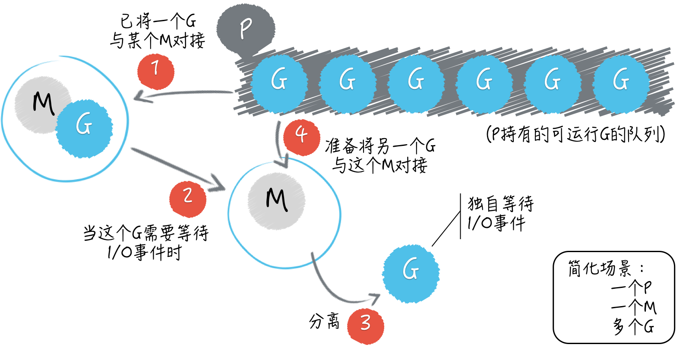

**M、P、G 之间的关系（简化版）**

由于篇幅原因，关于 Go 语言内部的调度器和运行时系统的更多细节，我在这里就不再深入讲述了。你需要知道，Go 语言实现了一套非常完善的运行时系统，保证了我们的程序在高并发的情况下依旧能够稳定、高效地运行。

下面，我会从编程实践的角度出发，以go语句的用法为主线，向你介绍go语句的执行规则、最佳实践和使用禁忌。

我们来看一下今天的**问题：什么是主 goroutine，它与我们启用的其他 goroutine 有什么不同？**

我们具体来看一道我在面试中经常提问的编程题。

```
package main

import "fmt"

func main() {
  for i := 0; i < 10; i++ {
    go func() {
      fmt.Println(i)
    }()
  }
}
```

在 demo38.go 中，我只在main函数中写了一条for语句。这条for语句中的代码会迭代运行 10 次，并有一个局部变量i代表着当次迭代的序号，该序号是从0开始的。

在这条for语句中仅有一条go语句，这条go语句中也仅有一条语句。这条最里面的语句调用了fmt.Println函数并想要打印出变量i的值。

这个程序很简单，三条语句逐条嵌套。我的具体问题是：这个命令源码文件被执行后会打印出什么内容？

这道题的**典型回答**是：不会有任何内容被打印出来。

### 问题解析

问题解析与一个进程总会有一个主线程类似，每一个独立的 Go 程序在运行时也总会有一个主 goroutine。这个主 goroutine 会在 Go 程序的运行准备工作完成后被自动地启用，并不需要我们做任何手动的操作。

想必你已经知道，每条go语句一般都会携带一个函数调用，这个被调用的函数常常被称为go函数。而主 goroutine 的go函数就是那个作为程序入口的main函数。

一定要注意，go函数真正被执行的时间，总会与其所属的go语句被执行的时间不同。当程序执行到一条go语句的时候，Go 语言的运行时系统，会先试图从某个存放空闲的 G 的队列中获取一个 G（也就是 goroutine），它只有在找不到空闲 G 的情况下才会去创建一个新的 G。

这也是为什么我总会说“启用”一个 goroutine，而不说“创建”一个 goroutine 的原因。已存在的 goroutine 总是会被优先复用。

然而，创建 G 的成本也是非常低的。创建一个 G 并不会像新建一个进程或者一个系统级线程那样，必须通过操作系统的系统调用来完成，在 Go 语言的运行时系统内部就可以完全做到了，更何况一个 G 仅相当于为需要并发执行代码片段服务的上下文环境而已。

在拿到了一个空闲的 G 之后，Go 语言运行时系统会用这个 G 去包装当前的那个go函数（或者说该函数中的那些代码），然后再把这个 G 追加到某个存放可运行的 G 的队列中。

这类队列中的 G 总是会按照先入先出的顺序，很快地由运行时系统内部的调度器安排运行。虽然这会很快，但是由于上面所说的那些准备工作还是不可避免的，所以耗时还是存在的。

因此，go函数的执行时间总是会明显滞后于它所属的go语句的执行时间。当然了，这里所说的“明显滞后”是对于计算机的 CPU 时钟和 Go 程序来说的。我们在大多数时候都不会有明显的感觉。

在说明了原理之后，我们再来看这种原理下的表象。请记住，只要go语句本身执行完毕，Go 程序完全不会等待go函数的执行，它会立刻去执行后边的语句。这就是所谓的异步并发地执行。

这里“后边的语句”指的一般是for语句中的下一个迭代。然而，当最后一个迭代运行的时候，这个“后边的语句”是不存在的。

在 demo38.go 中的那条for语句会以很快的速度执行完毕。当它执行完毕时，那 10 个包装了go函数的 goroutine 往往还没有获得运行的机会。

请注意，go函数中的那个对fmt.Println函数的调用是以for语句中的变量i作为参数的。你可以想象一下，如果当for语句执行完毕的时候，这些go函数都还没有执行，那么它们引用的变量i的值将会是什么？

它们都会是10，对吗？那么这道题的答案会是“打印出 10 个10”，是这样吗？

在确定最终的答案之前，你还需要知道一个与主 goroutine 有关的重要特性，即：一旦主 goroutine 中的代码（也就是main函数中的那些代码）执行完毕，当前的 Go 程序就会结束运行。

如此一来，如果在 Go 程序结束的那一刻，还有 goroutine 未得到运行机会，那么它们就真的没有运行机会了，它们中的代码也就不会被执行了。

我们刚才谈论过，当for语句的最后一个迭代运行的时候，其中的那条go语句即是最后一条语句。所以，在执行完这条go语句之后，主 goroutine 中的代码也就执行完了，Go 程序会立即结束运行。那么，如果这样的话，还会有任何内容被打印出来吗？

严谨地讲，Go 语言并不会去保证这些 goroutine 会以怎样的顺序运行。由于主 goroutine 会与我们手动启用的其他 goroutine 一起接受调度，又因为调度器很可能会在 goroutine 中的代码只执行了一部分的时候暂停，以期所有的 goroutine 有更公平的运行机会。

所以哪个 goroutine 先执行完、哪个 goroutine 后执行完往往是不可预知的，除非我们使用了某种 Go 语言提供的方式进行了人为干预。然而，在这段代码中，我们并没有进行任何人为干预。

那答案到底是什么呢？就 demo38.go 中如此简单的代码而言，绝大多数情况都会是“不会有任何内容被打印出来”。

但是为了严谨起见，无论应聘者的回答是“打印出 10 个10”还是“不会有任何内容被打印出来”，又或是“打印出乱序的0到9”，我都会紧接着去追问“为什么？”因为只有你知道了这背后的原理，你做出的回答才会被认为是正确的。

这个原理是如此的重要，以至于如果你不知道它，那么就几乎无法编写出正确的可并发执行的程序。如果你不知道此原理，那么即使你写的并发程序看起来可以正确地运行，那也肯定是运气好而已。

### 总结

今天，我描述了 goroutine 在操作系统的并发编程体系，以及在 Go 语言并发编程模型中的地位和作用。

我还提到了 Go 语言内部的运行时系统和调度器，以及它们围绕着 goroutine 做的那些统筹调配和维护工作。这些内容中的每句话应该都会对你正确理解 goroutine 起到实质性的作用。你可以用这些知识去解释主问题中的那个程序在运行后为什么会产出那样的结果。

下一篇内容，我们还会继续围绕 go 语句以及执行规则谈一些扩展知识，今天留给你的思考题就是：用什么手段可以对 goroutine 的启用数量加以限制？

## 17 | go语句及其执行规则（下）

### 知识扩展

#### 问题 1：怎样才能让主 goroutine 等待其他 goroutine？

我刚才说过，一旦主 goroutine 中的代码执行完毕，当前的 Go 程序就会结束运行，无论其他的 goroutine 是否已经在运行了。那么，怎样才能做到等其他的 goroutine 运行完毕之后，再让主 goroutine 结束运行呢？

其实有很多办法可以做到这一点。其中，最简单粗暴的办法就是让主 goroutine“小睡”一会儿。

```
for i := 0; i < 10; i++ {
  go func() {
    fmt.Println(i)
  }()
}
time.Sleep(time.Millisecond * 500)
```

在for语句的后边，我调用了time包的Sleep函数，并把time.Millisecond * 500的结果作为参数值传给了它。time.Sleep函数的功能就是让当前的 goroutine（在这里就是主 goroutine）暂停运行一段时间，直到到达指定的恢复运行时间。

我们可以把一个相对的时间传给该函数，就像我在这里传入的“500 毫秒”那样。time.Sleep函数会在被调用时用当前的绝对时间，再加上相对时间计算出在未来的恢复运行时间。显然，一旦到达恢复运行时间，当前的 goroutine 就会从“睡眠”中醒来，并开始继续执行后边的代码。

这个办法是可行的，只要“睡眠”的时间不要太短就好。不过，问题恰恰就在这里，我们让主 goroutine“睡眠”多长时间才是合适的呢？如果“睡眠”太短，则很可能不足以让其他的 goroutine 运行完毕，而若“睡眠”太长则纯属浪费时间，这个时间就太难把握了。

你可能会想到，既然不容易预估时间，那我们就让其他的 goroutine 在运行完毕的时候告诉我们好了。这个思路很好，但怎么做呢？

你是否想到了通道呢？我们先创建一个通道，它的长度应该与我们手动启用的 goroutine 的数量一致。在每个手动启用的 goroutine 即将运行完毕的时候，我们都要向该通道发送一个值。

注意，这些发送表达式应该被放在它们的go函数体的最后面。对应的，我们还需要在main函数的最后从通道接收元素值，接收的次数也应该与手动启用的 goroutine 的数量保持一致。关于这些你可以到 demo39.go 文件中，去查看具体的写法。

```
package main

import (
	"fmt"
	//"time"
)

func main() {
	num := 10
	sign := make(chan struct{}, num)

	for i := 0; i < num; i++ {
		go func() {
			fmt.Println(i)
			sign <- struct{}{}
		}()
	}

	// 办法1。
	//time.Sleep(time.Millisecond * 500)

	// 办法2。
	for j := 0; j < num; j++ {
		<-sign
	}
}
```

其中有一个细节你需要注意。我在声明通道sign的时候是以chan struct{}作为其类型的。其中的类型字面量struct{}有些类似于空接口类型interface{}，它代表了既不包含任何字段也不拥有任何方法的空结构体类型。

注意，struct{}类型值的表示法只有一个，即：struct{}{}。并且，它占用的内存空间是0字节。确切地说，这个值在整个 Go 程序中永远都只会存在一份。虽然我们可以无数次地使用这个值字面量，但是用到的却都是同一个值。

当我们仅仅把通道当作传递某种简单信号的介质的时候，用struct{}作为其元素类型是再好不过的了。顺便说一句，我在讲“结构体及其方法的使用法门”的时候留过一道与此相关的思考题，你可以返回去看一看。

再说回当下的问题，有没有比使用通道更好的方法？如果你知道标准库中的代码包sync的话，那么可能会想到sync.WaitGroup类型。没错，这是一个更好的答案。不过具体的使用方式我在后边讲sync包的时候再说。

#### 问题 2：怎样让我们启用的多个 goroutine 按照既定的顺序运行？

在很多时候，当我沿着上面的主问题以及第一个扩展问题一路问下来的时候，应聘者往往会被这第二个扩展问题难住。

所以基于上一篇主问题中的代码，怎样做到让从0到9这几个整数按照自然数的顺序打印出来？你可能会说，我不用 goroutine 不就可以了嘛。没错，这样是可以，但是如果我不考虑这样做呢。你应该怎么解决这个问题？

当然了，众多应聘者回答的其他答案也是五花八门的，有的可行，有的不可行，还有的把原来的代码改得面目全非。我下面就来说说我的思路，以及心目中的答案吧。这个答案并不一定是最佳的，也许你在看完之后还可以想到更优的答案。

首先，我们需要稍微改造一下for语句中的那个go函数，要让它接受一个int类型的参数，并在调用它的时候把变量i的值传进去。为了不改动这个go函数中的其他代码，我们可以把它的这个参数也命名为i。

```
for i := 0; i < 10; i++ {
  go func(i int) {
    fmt.Println(i)
  }(i)
}
```

只有这样，Go 语言才能保证每个 goroutine 都可以拿到一个唯一的整数。其原因与go函数的执行时机有关。

我在前面已经讲过了。在go语句被执行时，我们传给go函数的参数i会先被求值，如此就得到了当次迭代的序号。之后，无论go函数会在什么时候执行，这个参数值都不会变。也就是说，go函数中调用的fmt.Println函数打印的一定会是那个当次迭代的序号。

然后，我们在着手改造for语句中的go函数。

```
for i := uint32(0); i < 10; i++ {
  go func(i uint32) {
    fn := func() {
      fmt.Println(i)
    }
    trigger(i, fn)
  }(i)
}
```

我在go函数中先声明了一个匿名的函数，并把它赋给了变量fn。这个匿名函数做的事情很简单，只是调用fmt.Println函数以打印go函数的参数i的值。

在这之后，我调用了一个名叫trigger的函数，并把go函数的参数i和刚刚声明的变量fn作为参数传给了它。注意，for语句声明的局部变量i和go函数的参数i的类型都变了，都由int变为了uint32。至于为什么，我一会儿再说。

再来说trigger函数。该函数接受两个参数，一个是uint32类型的参数i, 另一个是func()类型的参数fn。你应该记得，func()代表的是既无参数声明也无结果声明的函数类型。

```
trigger := func(i uint32, fn func()) {
  for {
    if n := atomic.LoadUint32(&count); n == i {
      fn()
      atomic.AddUint32(&count, 1)
      break
    }
    time.Sleep(time.Nanosecond)
  }
}
```

trigger函数会不断地获取一个名叫count的变量的值，并判断该值是否与参数i的值相同。如果相同，那么就立即调用fn代表的函数，然后把count变量的值加1，最后显式地退出当前的循环。否则，我们就先让当前的 goroutine“睡眠”一个纳秒再进入下一个迭代。

注意，我操作变量count的时候使用的都是原子操作。这是由于trigger函数会被多个 goroutine 并发地调用，所以它用到的非本地变量count，就被多个用户级线程共用了。因此，对它的操作就产生了竞态条件（race condition），破坏了程序的并发安全性。

所以，我们总是应该对这样的操作加以保护，在sync/atomic包中声明了很多用于原子操作的函数。

另外，由于我选用的原子操作函数对被操作的数值的类型有约束，所以我才对count以及相关的变量和参数的类型进行了统一的变更（由int变为了uint32）。

纵观count变量、trigger函数以及改造后的for语句和go函数，我要做的是，让count变量成为一个信号，它的值总是下一个可以调用打印函数的go函数的序号。

这个序号其实就是启用 goroutine 时，那个当次迭代的序号。也正因为如此，go函数实际的执行顺序才会与go语句的执行顺序完全一致。此外，这里的trigger函数实现了一种自旋（spinning）。除非发现条件已满足，否则它会不断地进行检查。

最后要说的是，因为我依然想让主 goroutine 最后一个运行完毕，所以还需要加一行代码。不过既然有了trigger函数，我就没有再使用通道。

```
trigger(10, func(){})
```

调用trigger函数完全可以达到相同的效果。由于当所有我手动启用的 goroutine 都运行完毕之后，count的值一定会是10，所以我就把10作为了第一个参数值。又由于我并不想打印这个10，所以我把一个什么都不做的函数作为了第二个参数值。

总之，通过上述的改造，我使得异步发起的go函数得到了同步地（或者说按照既定顺序地）执行，你也可以动手自己试一试，感受一下。

```
package main

import (
	"fmt"
	"sync/atomic"
	"time"
)

func main() {
	var count uint32
	trigger := func(i uint32, fn func()) {
		for {
			if n := atomic.LoadUint32(&count); n == i {
				fn()
				atomic.AddUint32(&count, 1)
				break
			}
			time.Sleep(time.Nanosecond)
		}
	}
	for i := uint32(0); i < 10; i++ {
		go func(i uint32) {
			fn := func() {
				fmt.Println(i)
			}
			trigger(i, fn)
		}(i)
	}
	trigger(10, func() {})
}
```

### 总结

主 goroutine 的运行若过早结束，那么我们的并发程序的功能就很可能无法全部完成。所以我们往往需要通过一些手段去进行干涉，比如调用time.Sleep函数或者使用通道。

另外，go函数的实际执行顺序往往与其所属的go语句的执行顺序（或者说 goroutine 的启用顺序）不同，而且默认情况下的执行顺序是不可预知的。那怎样才能让这两个顺序一致呢？其实复杂的实现方式有不少，但是可能会把原来的代码改得面目全非。

总之，我希望通过上述基础知识以及三个连贯的问题帮你串起一条主线。这应该会让你更快地深入理解 goroutine 及其背后的并发编程模型，从而更加游刃有余地使用go语句。

### 思考题

runtime包中提供了哪些与模型三要素 G、P 和 M 相关的函数？（模型三要素内容在上一篇）

## 18 | if语句、for语句和switch语句

现在，让我们暂时走下神坛，回归民间。我今天要讲的if语句、for语句和switch语句都属于 Go 语言的基本流程控制语句。它们的语法看起来很朴素，但实际上也会有一些使用技巧和注意事项。我在本篇文章中会以一系列面试题为线索，为你讲述它们的用法。

那么，**今天的问题是：使用携带range子句的for语句时需要注意哪些细节？** 这是一个比较笼统的问题。我还是通过编程题来讲解吧。

本问题中的代码都被放在了命令源码文件 demo41.go 的main函数中的。为了专注问题本身，本篇文章中展示的编程题会省略掉一部分代码包声明语句、代码包导入语句和main函数本身的声明部分。

```
numbers1 := []int{1, 2, 3, 4, 5, 6}
for i := range numbers1 {
  if i == 3 {
    numbers1[i] |= i
  }
}
fmt.Println(numbers1)
```

我先声明了一个元素类型为int的切片类型的变量numbers1，在该切片中有 6 个元素值，分别是从1到6的整数。我用一条携带range子句的for语句去迭代numbers1变量中的所有元素值。

在这条for语句中，只有一个迭代变量i。我在每次迭代时，都会先去判断i的值是否等于3，如果结果为true，那么就让numbers1的第i个元素值与i本身做按位或的操作，再把操作结果作为numbers1的新的第i个元素值。最后我会打印出numbers1的值。

所以具体的问题就是，这段代码执行后会打印出什么内容？

这里的**典型回答**是：打印的内容会是[1 2 3 7 5 6]。

### 问题解析

你心算得到的答案是这样吗？让我们一起来复现一下这个计算过程。

当for语句被执行的时候，在range关键字右边的numbers1会先被求值。

这个位置上的代码被称为range表达式。range表达式的结果值可以是数组、数组的指针、切片、字符串、字典或者允许接收操作的通道中的某一个，并且结果值只能有一个。

对于不同种类的range表达式结果值，for语句的迭代变量的数量可以有所不同。

就拿我们这里的numbers1来说，它是一个切片，那么迭代变量就可以有两个，右边的迭代变量代表当次迭代对应的某一个元素值，而左边的迭代变量则代表该元素值在切片中的索引值。

那么，如果像本题代码中的for语句那样，只有一个迭代变量的情况意味着什么呢？这意味着，该迭代变量只会代表当次迭代对应的元素值的索引值。

更宽泛地讲，当只有一个迭代变量的时候，数组、数组的指针、切片和字符串的元素值都是无处安放的，我们只能拿到按照从小到大顺序给出的一个个索引值。

因此，这里的迭代变量i的值会依次是从0到5的整数。当i的值等于3的时候，与之对应的是切片中的第 4 个元素值4。对4和3进行按位或操作得到的结果是7。这就是答案中的第 4 个整数是7的原因了。

**现在，我稍稍修改一下上面的代码。我们再来估算一下打印内容。**

```
numbers2 := [...]int{1, 2, 3, 4, 5, 6}
maxIndex2 := len(numbers2) - 1
for i, e := range numbers2 {
  if i == maxIndex2 {
    numbers2[0] += e
  } else {
    numbers2[i+1] += e
  }
}
fmt.Println(numbers2)
```

注意，我把迭代的对象换成了numbers2。numbers2中的元素值同样是从1到6的 6 个整数，并且元素类型同样是int，但它是一个数组而不是一个切片。

在for语句中，我总是会对紧挨在当次迭代对应的元素后边的那个元素，进行重新赋值，新的值会是这两个元素的值之和。当迭代到最后一个元素时，我会把此range表达式结果值中的第一个元素值，替换为它的原值与最后一个元素值的和，最后，我会打印出numbers2的值。

**对于这段代码，我的问题依旧是：打印的内容会是什么？你可以先思考一下。**

好了，我要公布答案了。打印的内容会是[7 3 5 7 9 11]。我先来重现一下计算过程。当for语句被执行的时候，在range关键字右边的numbers2会先被求值。

这里需要注意两点：

1、range表达式只会在for语句开始执行时被求值一次，无论后边会有多少次迭代；

2、range表达式的求值结果会被复制，也就是说，被迭代的对象是range表达式结果值的副本而不是原值。

基于这两个规则，我们接着往下看。在第一次迭代时，我改变的是numbers2的第二个元素的值，新值为3，也就是1和2之和。

但是，被迭代的对象的第二个元素却没有任何改变，毕竟它与numbers2已经是毫不相关的两个数组了。因此，在第二次迭代时，我会把numbers2的第三个元素的值修改为5，即被迭代对象的第二个元素值2和第三个元素值3的和。

以此类推，之后的numbers2的元素值依次会是7、9和11。当迭代到最后一个元素时，我会把numbers2的第一个元素的值修改为1和6之和。

好了，现在该你操刀了。你需要把numbers2的值由一个数组改成一个切片，其中的元素值都不要变。为了避免混淆，你还要把这个切片值赋给变量numbers3，并且把后边代码中所有的numbers2都改为numbers3。

问题是不变的，执行这段修改版的代码后打印的内容会是什么呢？如果你实在估算不出来，可以先实际执行一下，然后再尝试解释看到的答案。提示一下，切片与数组是不同的，前者是引用类型的，而后者是值类型的。

我们可以先接着讨论后边的内容，但是我强烈建议你一定要回来，再看看我留给你的这个问题，认真地思考和计算一下。

### 知识扩展

#### 问题 1：switch语句中的switch表达式和case表达式之间有着怎样的联系？

先来看一段代码。

```
value1 := [...]int8{0, 1, 2, 3, 4, 5, 6}
switch 1 + 3 {
case value1[0], value1[1]:
  fmt.Println("0 or 1")
case value1[2], value1[3]:
  fmt.Println("2 or 3")
case value1[4], value1[5], value1[6]:
  fmt.Println("4 or 5 or 6")
}
```

我先声明了一个数组类型的变量value1，该变量的元素类型是int8。在后边的switch语句中，被夹在switch关键字和左花括号{之间的是1 + 3，这个位置上的代码被称为switch表达式。这个switch语句还包含了三个case子句，而每个case子句又各包含了一个case表达式和一条打印语句。

所谓的case表达式一般由case关键字和一个表达式列表组成，表达式列表中的多个表达式之间需要有英文逗号,分割，比如，上面代码中的case value1[0], value1[1]就是一个case表达式，其中的两个子表达式都是由索引表达式表示的。

另外的两个case表达式分别是case value1[2], value1[3]和case value1[4], value1[5], value1[6]。

此外，在这里的每个case子句中的那些打印语句，会分别打印出不同的内容，这些内容用于表示case子句被选中的原因，比如，打印内容0 or 1表示当前case子句被选中是因为switch表达式的结果值等于0或1中的某一个。另外两条打印语句会分别打印出2 or 3和4 or 5 or 6。

现在问题来了，拥有这样三个case表达式的switch语句可以成功通过编译吗？如果不可以，原因是什么？如果可以，那么该switch语句被执行后会打印出什么内容。

我刚才说过，只要switch表达式的结果值与某个case表达式中的任意一个子表达式的结果值相等，该case表达式所属的case子句就会被选中。

并且，一旦某个case子句被选中，其中的附带在case表达式后边的那些语句就会被执行。与此同时，其他的所有case子句都会被忽略。

当然了，如果被选中的case子句附带的语句列表中包含了fallthrough语句，那么紧挨在它下边的那个case子句附带的语句也会被执行。

正因为存在上述判断相等的操作（以下简称判等操作），switch语句对switch表达式的结果类型，以及各个case表达式中子表达式的结果类型都是有要求的。毕竟，在 Go 语言中，只有类型相同的值之间才有可能被允许进行判等操作。

如果switch表达式的结果值是无类型的常量，比如1 + 3的求值结果就是无类型的常量4，那么这个常量会被自动地转换为此种常量的默认类型的值，比如整数4的默认类型是int，又比如浮点数3.14的默认类型是float64。

因此，由于上述代码中的switch表达式的结果类型是int，而那些case表达式中子表达式的结果类型却是int8，它们的类型并不相同，所以这条switch语句是无法通过编译的。

再来看一段很类似的代码：

```
value2 := [...]int8{0, 1, 2, 3, 4, 5, 6}
switch value2[4] {
case 0, 1:
  fmt.Println("0 or 1")
case 2, 3:
  fmt.Println("2 or 3")
case 4, 5, 6:
  fmt.Println("4 or 5 or 6")
}
```

其中的变量value2与value1的值是完全相同的。但不同的是，我把switch表达式换成了value2[4]，并把下边那三个case表达式分别换为了case 0, 1、case 2, 3和case 4, 5, 6。

如此一来，switch表达式的结果值是int8类型的，而那些case表达式中子表达式的结果值却是无类型的常量了。这与之前的情况恰恰相反。那么，这样的switch语句可以通过编译吗？

答案是肯定的。因为，如果case表达式中子表达式的结果值是无类型的常量，那么它的类型会被自动地转换为switch表达式的结果类型，又由于上述那几个整数都可以被转换为int8类型的值，所以对这些表达式的结果值进行判等操作是没有问题的。

当然了，如果这里说的自动转换没能成功，那么switch语句照样通不过编译。

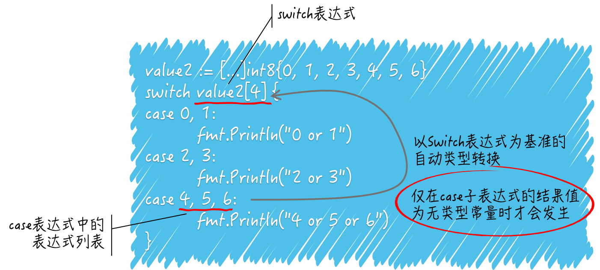

通过上面这两道题，你应该可以搞清楚switch表达式和case表达式之间的联系了。由于需要进行判等操作，所以前者和后者中的子表达式的结果类型需要相同。

switch语句会进行有限的类型转换，但肯定不能保证这种转换可以统一它们的类型。还要注意，如果这些表达式的结果类型有某个接口类型，那么一定要小心检查它们的动态值是否都具有可比性（或者说是否允许判等操作）。

因为，如果答案是否定的，虽然不会造成编译错误，但是后果会更加严重：引发 panic（也就是运行时恐慌）。

#### 问题 2：switch语句对它的case表达式有哪些约束？

我在上一个问题的阐述中还重点表达了一点，不知你注意到了没有，那就是：switch语句在case子句的选择上是具有唯一性的。

正因为如此，switch语句不允许case表达式中的子表达式结果值存在相等的情况，不论这些结果值相等的子表达式，是否存在于不同的case表达式中，都会是这样的结果。具体请看这段代码：

```
value3 := [...]int8{0, 1, 2, 3, 4, 5, 6}
switch value3[4] {
case 0, 1, 2:
  fmt.Println("0 or 1 or 2")
case 2, 3, 4:
  fmt.Println("2 or 3 or 4")
case 4, 5, 6:
  fmt.Println("4 or 5 or 6")
}
```

变量value3的值同value1，依然是由从0到6的 7 个整数组成的数组，元素类型是int8。switch表达式是value3[4]，三个case表达式分别是case 0, 1, 2、case 2, 3, 4和case 4, 5, 6。

由于在这三个case表达式中存在结果值相等的子表达式，所以这个switch语句无法通过编译。不过，好在这个约束本身还有个约束，那就是只针对结果值为常量的子表达式。

比如，子表达式1+1和2不能同时出现，1+3和4也不能同时出现。有了这个约束的约束，我们就可以想办法绕过这个对子表达式的限制了。再看一段代码：

```
value5 := [...]int8{0, 1, 2, 3, 4, 5, 6}
switch value5[4] {
case value5[0], value5[1], value5[2]:
  fmt.Println("0 or 1 or 2")
case value5[2], value5[3], value5[4]:
  fmt.Println("2 or 3 or 4")
case value5[4], value5[5], value5[6]:
  fmt.Println("4 or 5 or 6")
}
```

变量名换成了value5，但这不是重点。重点是，我把case表达式中的常量都换成了诸如value5[0]这样的索引表达式。

虽然第一个case表达式和第二个case表达式都包含了value5[2]，并且第二个case表达式和第三个case表达式都包含了value5[4]，但这已经不是问题了。这条switch语句可以成功通过编译。

不过，这种绕过方式对用于类型判断的switch语句（以下简称为类型switch语句）就无效了。因为类型switch语句中的case表达式的子表达式，都必须直接由类型字面量表示，而无法通过间接的方式表示。代码如下：

```
value6 := interface{}(byte(127))
switch t := value6.(type) {
case uint8, uint16:
  fmt.Println("uint8 or uint16")
case byte:
  fmt.Printf("byte")
default:
  fmt.Printf("unsupported type: %T", t)
}
```

变量value6的值是空接口类型的。该值包装了一个byte类型的值127。我在后面使用类型switch语句来判断value6的实际类型，并打印相应的内容。

这里有两个普通的case子句，还有一个default case子句。前者的case表达式分别是case uint8, uint16和case byte。你还记得吗？byte类型是uint8类型的别名类型。

因此，它们两个本质上是同一个类型，只是类型名称不同罢了。在这种情况下，这个类型switch语句是无法通过编译的，因为子表达式byte和uint8重复了。好了，以上说的就是case表达式的约束以及绕过方式，你学会了吗。

### 总结

我们今天主要讨论了for语句和switch语句，不过我并没有说明那些语法规则，因为它们太简单了。我们需要多加注意的往往是那些隐藏在 Go 语言规范和最佳实践里的细节。

这些细节其实就是我们很多技术初学者所谓的“坑”。比如，我在讲for语句的时候交代了携带range子句时只有一个迭代变量意味着什么。你必须知道在迭代数组或切片时只有一个迭代变量的话是无法迭代出其中的元素值的，否则你的程序可能就不会像你预期的那样运行了。

### 笔记源码

https://github.com/MingsonZheng/go-core-demo

## 19 | 错误处理（上）

提到 Go 语言中的错误处理，我们其实已经在前面接触过几次了。

比如，我们声明过error类型的变量err，也调用过errors包中的New函数。

我们说过error类型其实是一个接口类型，也是一个 Go 语言的内建类型。在这个接口类型的声明中只包含了一个方法Error。Error方法不接受任何参数，但是会返回一个string类型的结果。它的作用是返回错误信息的字符串表示形式。

我们使用error类型的方式通常是，在函数声明的结果列表的最后，声明一个该类型的结果，同时在调用这个函数之后，先判断它返回的最后一个结果值是否“不为nil”。

如果这个值“不为nil”，那么就进入错误处理流程，否则就继续进行正常的流程。下面是一个例子，代码在 demo44.go 文件中。

```
package main

import (
  "errors"
  "fmt"
)

func echo(request string) (response string, err error) {
  if request == "" {
    err = errors.New("empty request")
    return
  }
  response = fmt.Sprintf("echo: %s", request)
  return
}

func main() {
  for _, req := range []string{"", "hello!"} {
    fmt.Printf("request: %s\n", req)
    resp, err := echo(req)
    if err != nil {
      fmt.Printf("error: %s\n", err)
      continue
    }
    fmt.Printf("response: %s\n", resp)
  }
}
```

我们先看echo函数的声明。echo函数接受一个string类型的参数request，并会返回两个结果。

这两个结果都是有名称的，第一个结果response也是string类型的，它代表了这个函数正常执行后的结果值。

第二个结果err就是error类型的，它代表了函数执行出错时的结果值，同时也包含了具体的错误信息。

当echo函数被调用时，它会先检查参数request的值。如果该值为空字符串，那么它就会通过调用errors.New函数，为结果err赋值，然后忽略掉后边的操作并直接返回。

此时，结果response的值也会是一个空字符串。如果request的值并不是空字符串，那么它就为结果response赋一个适当的值，然后返回，此时结果err的值会是nil。

再来看main函数中的代码。我在每次调用echo函数之后，都会把它返回的结果值赋给变量resp和err，并且总是先检查err的值是否“不为nil”，如果是，就打印错误信息，否则就打印常规的响应信息。

这里值得注意的地方有两个。第一，在echo函数和main函数中，我都使用到了卫述语句。我在前面讲函数用法的时候也提到过卫述语句。简单地讲，它就是被用来检查后续操作的前置条件并进行相应处理的语句。

对于echo函数来说，它进行常规操作的前提是：传入的参数值一定要符合要求。而对于调用echo函数的程序来说，进行后续操作的前提就是echo函数的执行不能出错。

我们在进行错误处理的时候经常会用到卫述语句，以至于有些人会吐槽说：“我的程序满屏都是卫述语句，简直是太难看了！”不过，我倒认为这有可能是程序设计上的问题。每个编程语言的理念和风格几乎都会有明显的不同，我们常常需要顺应它们的纹理去做设计，而不是用其他语言的编程思想来编写当下语言的程序。

再来说第二个值得注意的地方。我在生成error类型值的时候，用到了errors.New函数。

这是一种最基本的生成错误值的方式。我们调用它的时候传入一个由字符串代表的错误信息，它会给返回给我们一个包含了这个错误信息的error类型值。该值的静态类型当然是error，而动态类型则是一个在errors包中的，包级私有的类型*errorString。

显然，errorString类型拥有的一个指针方法实现了error接口中的Error方法。这个方法在被调用后，会原封不动地返回我们之前传入的错误信息。实际上，error类型值的Error方法就相当于其他类型值的String方法。

我们已经知道，通过调用fmt.Printf函数，并给定占位符%s就可以打印出某个值的字符串表示形式。

对于其他类型的值来说，只要我们能为这个类型编写一个String方法，就可以自定义它的字符串表示形式。而对于error类型值，它的字符串表示形式则取决于它的Error方法。

在上述情况下，fmt.Printf函数如果发现被打印的值是一个error类型的值，那么就会去调用它的Error方法。fmt包中的这类打印函数其实都是这么做的。

顺便提一句，当我们想通过模板化的方式生成错误信息，并得到错误值时，可以使用fmt.Errorf函数。该函数所做的其实就是先调用fmt.Sprintf函数，得到确切的错误信息；再调用errors.New函数，得到包含该错误信息的error类型值，最后返回该值。

好了，我现在问一个关于对错误值做判断的问题。我们今天的**问题是：对于具体错误的判断，Go 语言中都有哪些惯用法？**

由于error是一个接口类型，所以即使同为error类型的错误值，它们的实际类型也可能不同。这个问题还可以换一种问法，即：怎样判断一个错误值具体代表的是哪一类错误？

这道题的**典型回答**是这样的：

1、对于类型在已知范围内的一系列错误值，一般使用类型断言表达式或类型switch语句来判断；

2、对于已有相应变量且类型相同的一系列错误值，一般直接使用判等操作来判断；

3、对于没有相应变量且类型未知的一系列错误值，只能使用其错误信息的字符串表示形式来做判断。

### 问题解析

如果你看过一些 Go 语言标准库的源代码，那么对这几种情况应该都不陌生。我下面分别对它们做个说明。

类型在已知范围内的错误值其实是最容易分辨的。就拿os包中的几个代表错误的类型os.PathError、os.LinkError、os.SyscallError和os/exec.Error来说，它们的指针类型都是error接口的实现类型，同时它们也都包含了一个名叫Err，类型为error接口类型的代表潜在错误的字段。

如果我们得到一个error类型值，并且知道该值的实际类型肯定是它们中的某一个，那么就可以用类型switch语句去做判断。例如：

```
func underlyingError(err error) error {
  switch err := err.(type) {
  case *os.PathError:
    return err.Err
  case *os.LinkError:
    return err.Err
  case *os.SyscallError:
    return err.Err
  case *exec.Error:
    return err.Err
  }
  return err
}
```

函数underlyingError的作用是：获取和返回已知的操作系统相关错误的潜在错误值。其中的类型switch语句中有若干个case子句，分别对应了上述几个错误类型。当它们被选中时，都会把函数参数err的Err字段作为结果值返回。如果它们都未被选中，那么该函数就会直接把参数值作为结果返回，即放弃获取潜在错误值。

只要类型不同，我们就可以如此分辨。但是在错误值类型相同的情况下，这些手段就无能为力了。在 Go 语言的标准库中也有不少以相同方式创建的同类型的错误值。

我们还拿os包来说，其中不少的错误值都是通过调用errors.New函数来初始化的，比如：os.ErrClosed、os.ErrInvalid以及os.ErrPermission，等等。

注意，与前面讲到的那些错误类型不同，这几个都是已经定义好的、确切的错误值。os包中的代码有时候会把它们当做潜在错误值，封装进前面那些错误类型的值中。

如果我们在操作文件系统的时候得到了一个错误值，并且知道该值的潜在错误值肯定是上述值中的某一个，那么就可以用普通的switch语句去做判断，当然了，用if语句和判等操作符也是可以的。例如：

```
printError := func(i int, err error) {
  if err == nil {
    fmt.Println("nil error")
    return
  }
  err = underlyingError(err)
  switch err {
  case os.ErrClosed:
    fmt.Printf("error(closed)[%d]: %s\n", i, err)
  case os.ErrInvalid:
    fmt.Printf("error(invalid)[%d]: %s\n", i, err)
  case os.ErrPermission:
    fmt.Printf("error(permission)[%d]: %s\n", i, err)
  }
}
```

这个由printError变量代表的函数会接受一个error类型的参数值。该值总会代表某个文件操作相关的错误，这是我故意地以不正确的方式操作文件后得到的。

虽然我不知道这些错误值的类型的范围，但却知道它们或它们的潜在错误值一定是某个已经在os包中定义的值。

所以，我先用underlyingError函数得到它们的潜在错误值，当然也可能只得到原错误值而已。然后，我用switch语句对错误值进行判等操作，三个case子句分别对应我刚刚提到的那三个已存在于os包中的错误值。如此一来，我就能分辨出具体错误了。

对于上面这两种情况，我们都有明确的方式去解决。但是，如果我们对一个错误值可能代表的含义知之甚少，那么就只能通过它拥有的错误信息去做判断了。

好在我们总是能通过错误值的Error方法，拿到它的错误信息。其实os包中就有做这种判断的函数，比如：os.IsExist、os.IsNotExist和os.IsPermission。命令源码文件 demo45.go 中包含了对它们的应用，这大致跟前面展示的代码差不太多，我就不在这里赘述了。

```
package main

import (
	"fmt"
	"os"
	"os/exec"
	"runtime"
)

// underlyingError 会返回已知的操作系统相关错误的潜在错误值。
func underlyingError(err error) error {
	switch err := err.(type) {
	case *os.PathError:
		return err.Err
	case *os.LinkError:
		return err.Err
	case *os.SyscallError:
		return err.Err
	case *exec.Error:
		return err.Err
	}
	return err
}

func main() {
	// 示例1。
	r, w, err := os.Pipe()
	if err != nil {
		fmt.Printf("unexpected error: %s\n", err)
		return
	}
	// 人为制造 *os.PathError 类型的错误。
	r.Close()
	_, err = w.Write([]byte("hi"))
	uError := underlyingError(err)
	fmt.Printf("underlying error: %s (type: %T)\n",
		uError, uError)
	fmt.Println()

	// 示例2。
	paths := []string{
		os.Args[0],           // 当前的源码文件或可执行文件。
		"/it/must/not/exist", // 肯定不存在的目录。
		os.DevNull,           // 肯定存在的目录。
	}
	printError := func(i int, err error) {
		if err == nil {
			fmt.Println("nil error")
			return
		}
		err = underlyingError(err)
		switch err {
		case os.ErrClosed:
			fmt.Printf("error(closed)[%d]: %s\n", i, err)
		case os.ErrInvalid:
			fmt.Printf("error(invalid)[%d]: %s\n", i, err)
		case os.ErrPermission:
			fmt.Printf("error(permission)[%d]: %s\n", i, err)
		}
	}
	var f *os.File
	var index int
	{
		index = 0
		f, err = os.Open(paths[index])
		if err != nil {
			fmt.Printf("unexpected error: %s\n", err)
			return
		}
		// 人为制造潜在错误为 os.ErrClosed 的错误。
		f.Close()
		_, err = f.Read([]byte{})
		printError(index, err)
	}
	{
		index = 1
		// 人为制造 os.ErrInvalid 错误。
		f, _ = os.Open(paths[index])
		_, err = f.Stat()
		printError(index, err)
	}
	{
		index = 2
		// 人为制造潜在错误为 os.ErrPermission 的错误。
		_, err = exec.LookPath(paths[index])
		printError(index, err)
	}
	if f != nil {
		f.Close()
	}
	fmt.Println()

	// 示例3。
	paths2 := []string{
		runtime.GOROOT(),     // 当前环境下的Go语言根目录。
		"/it/must/not/exist", // 肯定不存在的目录。
		os.DevNull,           // 肯定存在的目录。
	}
	printError2 := func(i int, err error) {
		if err == nil {
			fmt.Println("nil error")
			return
		}
		err = underlyingError(err)
		if os.IsExist(err) {
			fmt.Printf("error(exist)[%d]: %s\n", i, err)
		} else if os.IsNotExist(err) {
			fmt.Printf("error(not exist)[%d]: %s\n", i, err)
		} else if os.IsPermission(err) {
			fmt.Printf("error(permission)[%d]: %s\n", i, err)
		} else {
			fmt.Printf("error(other)[%d]: %s\n", i, err)
		}
	}
	{
		index = 0
		err = os.Mkdir(paths2[index], 0700)
		printError2(index, err)
	}
	{
		index = 1
		f, err = os.Open(paths[index])
		printError2(index, err)
	}
	{
		index = 2
		_, err = exec.LookPath(paths[index])
		printError2(index, err)
	}
	if f != nil {
		f.Close()
	}
}
```

### 总结

今天我们一起初步学习了错误处理的内容。我们总结了错误类型、错误值的处理技巧和设计方式，并一起分享了 Go 语言中处理错误的最基本方式

## 20 | 错误处理 （下）

在上一篇文章中，我们主要讨论的是从使用者的角度看“怎样处理好错误值”。那么，接下来我们需要关注的，就是站在建造者的角度，去关心“怎样才能给予使用者恰当的错误值”的问题了。

### 知识扩展

#### 问题：怎样根据实际情况给予恰当的错误值？

我们已经知道，构建错误值体系的基本方式有两种，即：创建立体的错误类型体系和创建扁平的错误值列表。

先说错误类型体系。由于在 Go 语言中实现接口是非侵入式的，所以我们可以做得很灵活。比如，在标准库的net代码包中，有一个名为Error的接口类型。它算是内建接口类型error的一个扩展接口，因为error是net.Error的嵌入接口。

net.Error接口除了拥有error接口的Error方法之外，还有两个自己声明的方法：Timeout和Temporary。

net包中有很多错误类型都实现了net.Error接口，比如：

1、*net.OpError；

2、*net.AddrError；

3、net.UnknownNetworkError等等。

你可以把这些错误类型想象成一棵树，内建接口error就是树的根，而net.Error接口就是一个在根上延伸的第一级非叶子节点。

同时，你也可以把这看做是一种多层分类的手段。当net包的使用者拿到一个错误值的时候，可以先判断它是否是net.Error类型的，也就是说该值是否代表了一个网络相关的错误。

如果是，那么我们还可以再进一步判断它的类型是哪一个更具体的错误类型，这样就能知道这个网络相关的错误具体是由于操作不当引起的，还是因为网络地址问题引起的，又或是由于网络协议不正确引起的。

当我们细看net包中的这些具体错误类型的实现时，还会发现，与os包中的一些错误类型类似，它们也都有一个名为Err、类型为error接口类型的字段，代表的也是当前错误的潜在错误。

所以说，这些错误类型的值之间还可以有另外一种关系，即：链式关系。比如说，使用者调用net.DialTCP之类的函数时，net包中的代码可能会返回给他一个*net.OpError类型的错误值，以表示由于他的操作不当造成了一个错误。

同时，这些代码还可能会把一个*net.AddrError或net.UnknownNetworkError类型的值赋给该错误值的Err字段，以表明导致这个错误的潜在原因。如果，此处的潜在错误值的Err字段也有非nil的值，那么将会指明更深层次的错误原因。如此一级又一级就像链条一样最终会指向问题的根源。

把以上这些内容总结成一句话就是，用类型建立起树形结构的错误体系，用统一字段建立起可追根溯源的链式错误关联。这是 Go 语言标准库给予我们的优秀范本，非常有借鉴意义。

不过要注意，如果你不想让包外代码改动你返回的错误值的话，一定要小写其中字段的名称首字母。你可以通过暴露某些方法让包外代码有进一步获取错误信息的权限，比如编写一个可以返回包级私有的err字段值的公开方法Err。

相比于立体的错误类型体系，扁平的错误值列表就要简单得多了。当我们只是想预先创建一些代表已知错误的错误值时候，用这种扁平化的方式就很恰当了。

不过，由于error是接口类型，所以通过errors.New函数生成的错误值只能被赋给变量，而不能赋给常量，又由于这些代表错误的变量需要给包外代码使用，所以其访问权限只能是公开的。

这就带来了一个问题，如果有恶意代码改变了这些公开变量的值，那么程序的功能就必然会受到影响。因为在这种情况下我们往往会通过判等操作来判断拿到的错误值具体是哪一个错误，如果这些公开变量的值被改变了，那么相应的判等操作的结果也会随之改变。

这里有两个解决方案。第一个方案是，先私有化此类变量，也就是说，让它们的名称首字母变成小写，然后编写公开的用于获取错误值以及用于判等错误值的函数。

比如，对于错误值os.ErrClosed，先改写它的名称，让其变成os.errClosed，然后再编写ErrClosed函数和IsErrClosed函数。

当然了，这不是说让你去改动标准库中已有的代码，这样做的危害会很大，甚至是致命的。我只能说，对于你可控的代码，最好还是要尽量收紧访问权限。

再来说第二个方案，此方案存在于syscall包中。该包中有一个类型叫做Errno，该类型代表了系统调用时可能发生的底层错误。这个错误类型是error接口的实现类型，同时也是对内建类型uintptr的再定义类型。

由于uintptr可以作为常量的类型，所以syscall.Errno自然也可以。syscall包中声明有大量的Errno类型的常量，每个常量都对应一种系统调用错误。syscall包外的代码可以拿到这些代表错误的常量，但却无法改变它们。

我们可以仿照这种声明方式来构建我们自己的错误值列表，这样就可以保证错误值的只读特性了。

好了，总之，扁平的错误值列表虽然相对简单，但是你一定要知道其中的隐患以及有效的解决方案是什么。

```
package main

import (
	"fmt"
	"os"
	"os/exec"
	"strconv"
)

// Errno 代表某种错误的类型。
type Errno int

func (e Errno) Error() string {
	return "errno " + strconv.Itoa(int(e))
}

func main() {
	var err error
	// 示例1。
	_, err = exec.LookPath(os.DevNull)
	fmt.Printf("error: %s\n", err)
	if execErr, ok := err.(*exec.Error); ok {
		execErr.Name = os.TempDir()
		execErr.Err = os.ErrNotExist
	}
	fmt.Printf("error: %s\n", err)
	fmt.Println()

	// 示例2。
	err = os.ErrPermission
	if os.IsPermission(err) {
		fmt.Printf("error(permission): %s\n", err)
	} else {
		fmt.Printf("error(other): %s\n", err)
	}
	os.ErrPermission = os.ErrExist
	// 上面这行代码修改了os包中已定义的错误值。
	// 这样做会导致下面判断的结果不正确。
	// 并且，这会影响到当前Go程序中所有的此类判断。
	// 所以，一定要避免这样做！
	if os.IsPermission(err) {
		fmt.Printf("error(permission): %s\n", err)
	} else {
		fmt.Printf("error(other): %s\n", err)
	}
	fmt.Println()

	// 示例3。
	const (
		ERR0 = Errno(0)
		ERR1 = Errno(1)
		ERR2 = Errno(2)
	)
	var myErr error = Errno(0)
	switch myErr {
	case ERR0:
		fmt.Println("ERR0")
	case ERR1:
		fmt.Println("ERR1")
	case ERR2:
		fmt.Println("ERR2")
	}
}
```

### 总结

今天，我从两个视角为你总结了错误类型、错误值的处理技巧和设计方式。我们先一起看了一下 Go 语言中处理错误的最基本方式，这涉及了函数结果列表设计、errors.New函数、卫述语句以及使用打印函数输出错误值。

接下来，我提出的第一个问题是关于错误判断的。对于一个错误值来说，我们可以获取到它的类型、值以及它携带的错误信息。

如果我们可以确定其类型范围或者值的范围，那么就可以使用一些明确的手段获知具体的错误种类。否则，我们就只能通过匹配其携带的错误信息来大致区分它们的种类。

由于底层系统给予我们的错误信息还是很有规律可循的，所以用这种方式去判断效果还比较显著。但是第三方程序给出的错误信息很可能就没那么规整了，这种情况下靠错误信息去辨识种类就会比较困难。

有了以上阐释，当把视角从使用者换位到建造者，我们往往就会去自觉地仔细思考程序错误体系的设计了。我在这里提出了两个在 Go 语言标准库中使用很广泛的方案，即：立体的错误类型体系和扁平的错误值列表。

之所以说错误类型体系是立体的，是因为从整体上看它往往呈现出树形的结构。通过接口间的嵌套以及接口的实现，我们就可以构建出一棵错误类型树。

通过这棵树，使用者就可以一步步地确定错误值的种类了。另外，为了追根溯源的需要，我们还可以在错误类型中，统一安放一个可以代表潜在错误的字段。这叫做链式的错误关联，可以帮助使用者找到错误的根源。

相比之下，错误值列表就比较简单了。它其实就是若干个名称不同但类型相同的错误值集合。

不过需要注意的是，如果它们是公开的，那就应该尽量让它们成为常量而不是变量，或者编写私有的错误值以及公开的获取和判等函数，否则就很难避免恶意的篡改。

这其实是“最小化访问权限”这个程序设计原则的一个具体体现。无论怎样设计程序错误体系，我们都应该把这一点考虑在内。

### 思考题

请列举出你经常用到或者看到的 3 个错误值，它们分别在哪个错误值列表里？这些错误值列表分别包含的是哪个种类的错误？

## 21 | panic函数、recover函数以及defer语句 （上）

在本篇，我要给你展示 Go 语言的另外一种错误处理方式。不过，严格来说，它处理的不是错误，而是异常，并且是一种在我们意料之外的程序异常。

### 前导知识：运行时恐慌 panic

这种程序异常被叫做 panic，我把它翻译为运行时恐慌。其中的“恐慌”二字是由 panic 直译过来的，而之所以前面又加上了“运行时”三个字，是因为这种异常只会在程序运行的时候被抛出来。

我们举个具体的例子来看看。

比如说，一个 Go 程序里有一个切片，它的长度是 5，也就是说该切片中的元素值的索引分别为0、1、2、3、4，但是，我在程序里却想通过索引5访问其中的元素值，显而易见，这样的访问是不正确的。

```
package main

func main() {
	s1 := []int{0, 1, 2, 3, 4}
	e5 := s1[5]
	_ = e5
}
```

Go 程序，确切地说是程序内嵌的 Go 语言运行时系统，会在执行到这行代码的时候抛出一个“index out of range”的 panic，用以提示你索引越界了。

当然了，这不仅仅是个提示。当 panic 被抛出之后，如果我们没有在程序里添加任何保护措施的话，程序（或者说代表它的那个进程）就会在打印出 panic 的详细情况（以下简称 panic 详情）之后，终止运行。

现在，就让我们来看一下这样的 panic 详情中都有什么。

```
panic: runtime error: index out of range

goroutine 1 [running]:
main.main()
 /Users/haolin/GeekTime/Golang_Puzzlers/src/puzzlers/article19/q0/demo47.go:5 +0x3d
exit status 2
```

这份详情的第一行是“panic: runtime error: index out of range”。其中的“runtime error”的含义是，这是一个runtime代码包中抛出的 panic。在这个 panic 中，包含了一个runtime.Error接口类型的值。runtime.Error接口内嵌了error接口，并做了一点点扩展，runtime包中有不少它的实现类型。

实际上，此详情中的“panic：”右边的内容，正是这个 panic 包含的runtime.Error类型值的字符串表示形式。

此外，panic 详情中，一般还会包含与它的引发原因有关的 goroutine 的代码执行信息。正如前述详情中的“goroutine 1 [running]”，它表示有一个 ID 为1的 goroutine 在此 panic 被引发的时候正在运行。

注意，这里的 ID 其实并不重要，因为它只是 Go 语言运行时系统内部给予的一个 goroutine 编号，我们在程序中是无法获取和更改的。

我们再看下一行，“main.main()”表明了这个 goroutine 包装的go函数就是命令源码文件中的那个main函数，也就是说这里的 goroutine 正是主 goroutine。再下面的一行，指出的就是这个 goroutine 中的哪一行代码在此 panic 被引发时正在执行。

这包含了此行代码在其所属的源码文件中的行数，以及这个源码文件的绝对路径。这一行最后的+0x3d代表的是：此行代码相对于其所属函数的入口程序计数偏移量。不过，一般情况下它的用处并不大。

最后，“exit status 2”表明我的这个程序是以退出状态码2结束运行的。在大多数操作系统中，只要退出状态码不是0，都意味着程序运行的非正常结束。在 Go 语言中，因 panic 导致程序结束运行的退出状态码一般都会是2。

综上所述，我们从上边的这个 panic 详情可以看出，作为此 panic 的引发根源的代码处于 demo47.go 文件中的第 5 行，同时被包含在main包（也就是命令源码文件所在的代码包）的main函数中。

那么，我的第一个问题也随之而来了。我今天的问题是：**从 panic 被引发到程序终止运行的大致过程是什么？**

**这道题的典型回答是这样的。**

我们先说一个大致的过程：某个函数中的某行代码有意或无意地引发了一个 panic。这时，初始的 panic 详情会被建立起来，并且该程序的控制权会立即从此行代码转移至调用其所属函数的那行代码上，也就是调用栈中的上一级。

这也意味着，此行代码所属函数的执行随即终止。紧接着，控制权并不会在此有片刻的停留，它又会立即转移至再上一级的调用代码处。控制权如此一级一级地沿着调用栈的反方向传播至顶端，也就是我们编写的最外层函数那里。

这里的最外层函数指的是go函数，对于主 goroutine 来说就是main函数。但是控制权也不会停留在那里，而是被 Go 语言运行时系统收回。

随后，程序崩溃并终止运行，承载程序这次运行的进程也会随之死亡并消失。与此同时，在这个控制权传播的过程中，panic 详情会被逐渐地积累和完善，并会在程序终止之前被打印出来。

### 问题解析

panic 可能是我们在无意间（或者说一不小心）引发的，如前文所述的索引越界。这类 panic 是真正的、在我们意料之外的程序异常。不过，除此之外，我们还是可以有意地引发 panic。

Go 语言的内建函数panic是专门用于引发 panic 的。panic函数使程序开发者可以在程序运行期间报告异常。

注意，这与从函数返回错误值的意义是完全不同的。当我们的函数返回一个非nil的错误值时，函数的调用方有权选择不处理，并且不处理的后果往往是不致命的。

这里的“不致命”的意思是，不至于使程序无法提供任何功能（也可以说僵死）或者直接崩溃并终止运行（也就是真死）。

但是，当一个 panic 发生时，如果我们不施加任何保护措施，那么导致的直接后果就是程序崩溃，就像前面描述的那样，这显然是致命的。

为了更清楚地展示答案中描述的过程，我编写了 demo48.go 文件。你可以先查看一下其中的代码，再试着运行它，并体会它打印的内容所代表的含义。

```
package main

import (
	"fmt"
)

func main() {
	fmt.Println("Enter function main.")
	caller1()
	fmt.Println("Exit function main.")
}

func caller1() {
	fmt.Println("Enter function caller1.")
	caller2()
	fmt.Println("Exit function caller1.")
}

func caller2() {
	fmt.Println("Enter function caller2.")
	s1 := []int{0, 1, 2, 3, 4}
	e5 := s1[5]
	_ = e5
	fmt.Println("Exit function caller2.")
}
```

我在这里再提示一点。panic 详情会在控制权传播的过程中，被逐渐地积累和完善，并且，控制权会一级一级地沿着调用栈的反方向传播至顶端。

因此，在针对某个 goroutine 的代码执行信息中，调用栈底端的信息会先出现，然后是上一级调用的信息，以此类推，最后才是此调用栈顶端的信息。

比如，main函数调用了caller1函数，而caller1函数又调用了caller2函数，那么caller2函数中代码的执行信息会先出现，然后是caller1函数中代码的执行信息，最后才是main函数的信息。

```
goroutine 1 [running]:
main.caller2()
 /Users/haolin/GeekTime/Golang_Puzzlers/src/puzzlers/article19/q1/demo48.go:22 +0x91
main.caller1()
 /Users/haolin/GeekTime/Golang_Puzzlers/src/puzzlers/article19/q1/demo48.go:15 +0x66
main.main()
 /Users/haolin/GeekTime/Golang_Puzzlers/src/puzzlers/article19/q1/demo48.go:9 +0x66
exit status 2
```

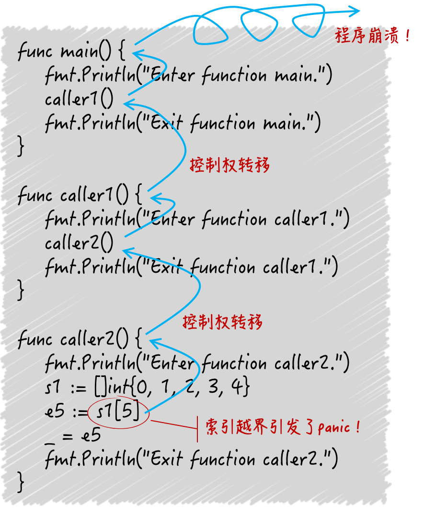

（从 panic 到程序崩溃）

好了，到这里，我相信你已经对 panic 被引发后的程序终止过程有一定的了解了。深入地了解此过程，以及正确地解读 panic 详情应该是我们的必备技能，这在调试 Go 程序或者为 Go 程序排查错误的时候非常重要。

### 总结

最近的两篇文章，我们是围绕着 panic 函数、recover 函数以及 defer 语句进行的。今天我主要讲了 panic 函数。这个函数是专门被用来引发 panic 的。panic 也可以被称为运行时恐慌，它是一种只能在程序运行期间抛出的程序异常。

Go 语言的运行时系统可能会在程序出现严重错误时自动地抛出 panic，我们在需要时也可以通过调用panic函数引发 panic。但不论怎样，如果不加以处理，panic 就会导致程序崩溃并终止运行。

### 思考题

一个函数怎样才能把 panic 转化为error类型值，并将其作为函数的结果值返回给调用方？

## 22 | panic函数、recover函数以及defer语句（下）

我在前一篇文章提到过这样一个说法，panic 之中可以包含一个值，用于简要解释引发此 panic 的原因。

如果一个 panic 是我们在无意间引发的，那么其中的值只能由 Go 语言运行时系统给定。但是，当我们使用panic函数有意地引发一个 panic 的时候，却可以自行指定其包含的值。我们今天的第一个问题就是针对后一种情况提出的。

### 知识扩展

#### 问题 1：怎样让 panic 包含一个值，以及应该让它包含什么样的值？

这其实很简单，在调用panic函数时，把某个值作为参数传给该函数就可以了。由于panic函数的唯一一个参数是空接口（也就是interface{}）类型的，所以从语法上讲，它可以接受任何类型的值。

但是，我们最好传入error类型的错误值，或者其他的可以被有效序列化的值。这里的“有效序列化”指的是，可以更易读地去表示形式转换。

还记得吗？对于fmt包下的各种打印函数来说，error类型值的Error方法与其他类型值的String方法是等价的，它们的唯一结果都是string类型的。

我们在通过占位符%s打印这些值的时候，它们的字符串表示形式分别都是这两种方法产出的。

一旦程序异常了，我们就一定要把异常的相关信息记录下来，这通常都是记到程序日志里。

我们在为程序排查错误的时候，首先要做的就是查看和解读程序日志；而最常用也是最方便的日志记录方式，就是记下相关值的字符串表示形式。

所以，如果你觉得某个值有可能会被记到日志里，那么就应该为它关联String方法。如果这个值是error类型的，那么让它的Error方法返回你为它定制的字符串表示形式就可以了。

对于此，你可能会想到fmt.Sprintf，以及fmt.Fprintf这类可以格式化并输出参数的函数。

是的，它们本身就可以被用来输出值的某种表示形式。不过，它们在功能上，肯定远不如我们自己定义的Error方法或者String方法。因此，为不同的数据类型分别编写这两种方法总是首选。

可是，这与传给panic函数的参数值又有什么关系呢？其实道理是相同的。至少在程序崩溃的时候，panic 包含的那个值字符串表示形式会被打印出来。

另外，我们还可以施加某种保护措施，避免程序的崩溃。这个时候，panic 包含的值会被取出，而在取出之后，它一般都会被打印出来或者记录到日志里。

既然说到了应对 panic 的保护措施，我们再来看下面一个问题。

#### 问题 2：怎样施加应对 panic 的保护措施，从而避免程序崩溃？

Go 语言的内建函数recover专用于恢复 panic，或者说平息运行时恐慌。recover函数无需任何参数，并且会返回一个空接口类型的值。

如果用法正确，这个值实际上就是即将恢复的 panic 包含的值。并且，如果这个 panic 是因我们调用panic函数而引发的，那么该值同时也会是我们此次调用panic函数时，传入的参数值副本。请注意，这里强调用法的正确。我们先来看看什么是不正确的用法。

```
package main

import (
 "fmt"
 "errors"
)

func main() {
 fmt.Println("Enter function main.")
 // 引发panic。
 panic(errors.New("something wrong"))
 p := recover()
 fmt.Printf("panic: %s\n", p)
 fmt.Println("Exit function main.")
}
```

在上面这个main函数中，我先通过调用panic函数引发了一个 panic，紧接着想通过调用recover函数恢复这个 panic。可结果呢？你一试便知，程序依然会崩溃，这个recover函数调用并不会起到任何作用，甚至都没有机会执行。

还记得吗？我提到过 panic 一旦发生，控制权就会讯速地沿着调用栈的反方向传播。所以，在panic函数调用之后的代码，根本就没有执行的机会。

那如果我把调用recover函数的代码提前呢？也就是说，先调用recover函数，再调用panic函数会怎么样呢？

这显然也是不行的，因为，如果在我们调用recover函数时未发生 panic，那么该函数就不会做任何事情，并且只会返回一个nil。

换句话说，这样做毫无意义。那么，到底什么才是正确的recover函数用法呢？这就不得不提到defer语句了。

顾名思义，defer语句就是被用来延迟执行代码的。延迟到什么时候呢？这要延迟到该语句所在的函数即将执行结束的那一刻，无论结束执行的原因是什么。

这与go语句有些类似，一个defer语句总是由一个defer关键字和一个调用表达式组成。

这里存在一些限制，有一些调用表达式是不能出现在这里的，包括：针对 Go 语言内建函数的调用表达式，以及针对unsafe包中的函数的调用表达式。

顺便说一下，对于go语句中的调用表达式，限制也是一样的。另外，在这里被调用的函数可以是有名称的，也可以是匿名的。我们可以把这里的函数叫做defer函数或者延迟函数。注意，被延迟执行的是defer函数，而不是defer语句。

我刚才说了，无论函数结束执行的原因是什么，其中的defer函数调用都会在它即将结束执行的那一刻执行。即使导致它执行结束的原因是一个 panic 也会是这样。正因为如此，我们需要联用defer语句和recover函数调用，才能够恢复一个已经发生的 panic。

我们来看一下经过修正的代码。

```
package main

import (
 "fmt"
 "errors"
)

func main() {
 fmt.Println("Enter function main.")
 defer func(){
  fmt.Println("Enter defer function.")
  if p := recover(); p != nil {
   fmt.Printf("panic: %s\n", p)
  }
  fmt.Println("Exit defer function.")
 }()
 // 引发panic。
 panic(errors.New("something wrong"))
 fmt.Println("Exit function main.")
}
```

在这个main函数中，我先编写了一条defer语句，并在defer函数中调用了recover函数。仅当调用的结果值不为nil时，也就是说只有 panic 确实已发生时，我才会打印一行以“panic:”为前缀的内容。

紧接着，我调用了panic函数，并传入了一个error类型值。这里一定要注意，我们要尽量把defer语句写在函数体的开始处，因为在引发 panic 的语句之后的所有语句，都不会有任何执行机会。

也只有这样，defer函数中的recover函数调用才会拦截，并恢复defer语句所属的函数，及其调用的代码中发生的所有 panic。

至此，我向你展示了两个很典型的recover函数的错误用法，以及一个基本的正确用法。

我希望你能够记住错误用法背后的缘由，同时也希望你能真正地理解联用defer语句和recover函数调用的真谛。

在命令源码文件 demo50.go 中，我把上述三种用法合并在了一段代码中。你可以运行该文件，并体会各种用法所产生的不同效果。

```
package main

import (
	"errors"
	"fmt"
)

func main() {
	fmt.Println("Enter function main.")

	defer func() {
		fmt.Println("Enter defer function.")

		// recover函数的正确用法。
		if p := recover(); p != nil {
			fmt.Printf("panic: %s\n", p)
		}

		fmt.Println("Exit defer function.")
	}()

	// recover函数的错误用法。
	fmt.Printf("no panic: %v\n", recover())

	// 引发panic。
	panic(errors.New("something wrong"))

	// recover函数的错误用法。
	p := recover()
	fmt.Printf("panic: %s\n", p)

	fmt.Println("Exit function main.")
}
```

下面我再来多说一点关于defer语句的事情。

#### 问题 3：如果一个函数中有多条defer语句，那么那几个defer函数调用的执行顺序是怎样的？

如果只用一句话回答的话，那就是：在同一个函数中，defer函数调用的执行顺序与它们分别所属的defer语句的出现顺序（更严谨地说，是执行顺序）完全相反。

当一个函数即将结束执行时，其中的写在最下边的defer函数调用会最先执行，其次是写在它上边、与它的距离最近的那个defer函数调用，以此类推，最上边的defer函数调用会最后一个执行。

如果函数中有一条for语句，并且这条for语句中包含了一条defer语句，那么，显然这条defer语句的执行次数，就取决于for语句的迭代次数。

并且，同一条defer语句每被执行一次，其中的defer函数调用就会产生一次，而且，这些函数调用同样不会被立即执行。

那么问题来了，这条for语句中产生的多个defer函数调用，会以怎样的顺序执行呢？

为了彻底搞清楚，我们需要弄明白defer语句执行时发生的事情。

其实也并不复杂，在defer语句每次执行的时候，Go 语言会把它携带的defer函数及其参数值另行存储到一个链表中。

这个链表与该defer语句所属的函数是对应的，并且，它是先进后出（FILO）的，相当于一个栈。

在需要执行某个函数中的defer函数调用的时候，Go 语言会先拿到对应的链表，然后从该链表中一个一个地取出defer函数及其参数值，并逐个执行调用。

这正是我说“defer函数调用与其所属的defer语句的执行顺序完全相反”的原因了。

下面该你出场了，我在 demo51.go 文件中编写了一个与本问题有关的示例，其中的核心代码很简单，只有几行而已。

```
package main

import "fmt"

func main() {
	defer fmt.Println("first defer")
	for i := 0; i < 3; i++ {
		defer fmt.Printf("defer in for [%d]\n", i)
	}
	defer fmt.Println("last defer")
}
```

### 总结

我们这两期的内容主要讲了两个函数和一条语句。recover函数专用于恢复 panic，并且调用即恢复。

它在被调用时会返回一个空接口类型的结果值。如果在调用它时并没有 panic 发生，那么这个结果值就会是nil。

而如果被恢复的 panic 是我们通过调用panic函数引发的，那么它返回的结果值就会是我们传给panic函数参数值的副本。

对recover函数的调用只有在defer语句中才能真正起作用。defer语句是被用来延迟执行代码的。

更确切地说，它会让其携带的defer函数的调用延迟执行，并且会延迟到该defer语句所属的函数即将结束执行的那一刻。

在同一个函数中，延迟执行的defer函数调用，会与它们分别所属的defer语句的执行顺序完全相反。还要注意，同一条defer语句每被执行一次，就会产生一个延迟执行的defer函数调用。

这种情况在defer语句与for语句联用时经常出现。这时更要关注for语句中，同一条defer语句产生的多个defer函数调用的实际执行顺序。

以上这些，就是关于 Go 语言中特殊的程序异常，及其处理方式的核心知识。这里边可以衍生出很多面试题目。

### 思考题

我们可以在defer函数中恢复 panic，那么可以在其中引发 panic 吗？

## 23 | 测试的基本规则和流程 （上）

在接下来的日子里，我将带你去学习在 Go 语言编程进阶的道路上，必须掌握的附加知识，比如：Go 程序测试、程序监测，以及 Go 语言标准库中各种常用代码包的正确用法。

从上个世纪到今日今时，程序员们，尤其是国内的程序员们，都对编写程序乐此不疲，甚至废寝忘食（比如我自己就是一个例子）。

因为这是我们普通人训练自我、改变生活、甚至改变世界的一种特有的途径。不过，同样是程序，我们却往往对编写用于测试的程序敬而远之。这是为什么呢？

我个人感觉，从人的本性来讲，我们都或多或少会否定“对自我的否定”。我们不愿意看到我们编写的程序有 Bug（即程序错误或缺陷），尤其是刚刚倾注心血编写的，并且信心满满交付的程序。

不过，我想说的是，**人是否会进步以及进步得有多快，依赖的恰恰就是对自我的否定，这包括否定的深刻与否，以及否定自我的频率如何。这其实就是“不破不立”这个词表达的含义。**

对于程序和软件来讲，尽早发现问题、修正问题其实非常重要。在这个网络互联的大背景下，我们所做的程序、工具或者软件产品往往可以被散布得更快、更远。但是，与此同时，它们的错误和缺陷也会是这样，并且可能在短时间内就会影响到成千上万甚至更多的用户。

你可能会说：“在开源模式下这就是优势啊，我就是要让更多的人帮我发现错误甚至修正错误，我们还可以一起协作、共同维护程序。”但这其实是两码事，协作者往往是由早期或核心的用户转换过来的，但绝对不能说程序的用户就肯定会成为协作者。

当有很多用户开始对程序抱怨的时候，很可能就预示着你对此的人设要崩塌了。你会发现，或者总有一天会发现，越是人们关注和喜爱的程序，它的测试（尤其是自动化的测试）做得就越充分，测试流程就越规范。

即使你想众人拾柴火焰高，那也得先让别人喜欢上你的程序。况且，对于优良的程序和软件来说，测试必然是非常受重视的一个环节。所以，尽快用测试为你的程序建起堡垒吧！

对于程序或软件的测试也分很多种，比如：单元测试、API 测试、集成测试、灰度测试，等等。我在本模块会主要针对单元测试进行讲解。

### 前导内容：go 程序测试基础知识

我们来说一下单元测试，它又称程序员测试。顾名思义，这就是程序员们本该做的自我检查工作之一。

Go 语言的缔造者们从一开始就非常重视程序测试，并且为 Go 程序的开发者们提供了丰富的 API 和工具。利用这些 API 和工具，我们可以创建测试源码文件，并为命令源码文件和库源码文件中的程序实体，编写测试用例。

在 Go 语言中，一个测试用例往往会由一个或多个测试函数来代表，不过在大多数情况下，每个测试用例仅用一个测试函数就足够了。测试函数往往用于描述和保障某个程序实体的某方面功能，比如，该功能在正常情况下会因什么样的输入，产生什么样的输出，又比如，该功能会在什么情况下报错或表现异常，等等。

我们可以为 Go 程序编写三类测试，即：功能测试（test）、基准测试（benchmark，也称性能测试），以及示例测试（example）。

对于前两类测试，从名称上你就应该可以猜到它们的用途。而示例测试严格来讲也是一种功能测试，只不过它更关注程序打印出来的内容。

一般情况下，一个测试源码文件只会针对于某个命令源码文件，或库源码文件（以下简称被测源码文件）做测试，所以我们总会（并且应该）把它们放在同一个代码包内。

测试源码文件的主名称应该以被测源码文件的主名称为前导，并且必须以“_test”为后缀。例如，如果被测源码文件的名称为 demo52.go，那么针对它的测试源码文件的名称就应该是 demo52_test.go。

每个测试源码文件都必须至少包含一个测试函数。并且，从语法上讲，每个测试源码文件中，都可以包含用来做任何一类测试的测试函数，即使把这三类测试函数都塞进去也没有问题。我通常就是这么做的，只要把控好测试函数的分组和数量就可以了。

我们可以依据这些测试函数针对的不同程序实体，把它们分成不同的逻辑组，并且，利用注释以及帮助类的变量或函数来做分割。同时，我们还可以依据被测源码文件中程序实体的先后顺序，来安排测试源码文件中测试函数的顺序。

此外，不仅仅对测试源码文件的名称，对于测试函数的名称和签名，Go 语言也是有明文规定的。你知道这个规定的内容吗？

**所以，我们今天的问题就是：Go 语言对测试函数的名称和签名都有哪些规定？**

**这里我给出的典型回答是下面三个内容。**

- 对于功能测试函数来说，其名称必须以Test为前缀，并且参数列表中只应有一个*testing.T类型的参数声明。
- 对于性能测试函数来说，其名称必须以Benchmark为前缀，并且唯一参数的类型必须是*testing.B类型的。
- 对于示例测试函数来说，其名称必须以Example为前缀，但对函数的参数列表没有强制规定。

### 问题解析

我问这个问题的目的一般有两个。

- 第一个目的当然是考察 Go 程序测试的基本规则。如果你经常编写测试源码文件，那么这道题应该是很容易回答的。
- 第二个目的是作为一个引子，引出第二个问题，即：go test命令执行的主要测试流程是什么？不过在这里我就不问你了，我直接说一下答案。

我们首先需要记住一点，只有测试源码文件的名称对了，测试函数的名称和签名也对了，当我们运行go test命令的时候，其中的测试代码才有可能被运行。

go test命令在开始运行时，会先做一些准备工作，比如，确定内部需要用到的命令，检查我们指定的代码包或源码文件的有效性，以及判断我们给予的标记是否合法，等等。

在准备工作顺利完成之后，go test命令就会针对每个被测代码包，依次地进行构建、执行包中符合要求的测试函数，清理临时文件，打印测试结果。这就是通常情况下的主要测试流程。

请注意上述的“依次”二字。对于每个被测代码包，go test命令会串行地执行测试流程中的每个步骤。

但是，为了加快测试速度，它通常会并发地对多个被测代码包进行功能测试，只不过，在最后打印测试结果的时候，它会依照我们给定的顺序逐个进行，这会让我们感觉到它是在完全串行地执行测试流程。

另一方面，由于并发的测试会让性能测试的结果存在偏差，所以性能测试一般都是串行进行的。更具体地说，只有在所有构建步骤都做完之后，go test命令才会真正地开始进行性能测试。

并且，下一个代码包性能测试的进行，总会等到上一个代码包性能测试的结果打印完成才会开始，而且性能测试函数的执行也都会是串行的。

一旦清楚了 Go 程序测试的具体过程，我们的一些疑惑就自然有了答案。比如，那个名叫testIntroduce的测试函数为什么没执行，又比如，为什么即使是简单的性能测试执行起来也会比功能测试慢，等等。

demo52.go

```
package main

import (
	"errors"
	"flag"
	"fmt"
)

var name string

func init() {
	flag.StringVar(&name, "name", "everyone", "The greeting object.")
}

func main() {
	flag.Parse()
	greeting, err := hello(name)
	if err != nil {
		fmt.Printf("error: %s\n", err)
		return
	}
	fmt.Println(greeting, introduce())
}

// hello 用于生成问候内容。
func hello(name string) (string, error) {
	if name == "" {
		return "", errors.New("empty name")
	}
	return fmt.Sprintf("Hello, %s!", name), nil
}

// introduce 用于生成介绍内容。
func introduce() string {
	return "Welcome to my Golang column."
}
```

demo52_test.go

```
package main

import (
	"fmt"
	"testing"
)

func TestHello(t *testing.T) {
	var name string
	greeting, err := hello(name)
	if err == nil {
		t.Errorf("The error is nil, but it should not be. (name=%q)",
			name)
	}
	if greeting != "" {
		t.Errorf("Nonempty greeting, but it should not be. (name=%q)",
			name)
	}
	name = "Robert"
	greeting, err = hello(name)
	if err != nil {
		t.Errorf("The error is not nil, but it should be. (name=%q)",
			name)
	}
	if greeting == "" {
		t.Errorf("Empty greeting, but it should not be. (name=%q)",
			name)
	}
	expected := fmt.Sprintf("Hello, %s!", name)
	if greeting != expected {
		t.Errorf("The actual greeting %q is not the expected. (name=%q)",
			greeting, name)
	}
	t.Logf("The expected greeting is %q.\n", expected)
}

func testIntroduce(t *testing.T) { // 请注意这个测试函数的名称。
	intro := introduce()
	expected := "Welcome to my Golang column."
	if intro != expected {
		t.Errorf("The actual introduce %q is not the expected.",
			intro)
	}
	t.Logf("The expected introduce is %q.\n", expected)
}
```

### 总结

在本篇文章的一开始，我就试图向你阐释程序测试的重要性。在我经历的公司中起码有一半都不重视程序测试，或者说没有精力去做程序测试。

尤其是中小型的公司，他们往往完全依靠软件质量保障团队，甚至真正的用户去帮他们测试。在这些情况下，软件错误或缺陷的发现、反馈和修复的周期通常会很长，成本也会很大，也许还会造成很不好的影响。

Go 语言是一门很重视程序测试的编程语言，它不但自带了testing包，还有专用于程序测试的命令go test。我们要想真正用好一个工具，就需要先了解它的核心逻辑。所以，我今天问你的第一个问题就是关于go test命令的基本规则和主要流程的。在知道这些之后，也许你对 Go 程序测试就会进入更深层次的了解。

### 思考题

除了本文中提到的，你还知道或用过testing.T类型和testing.B类型的哪些方法？它们都是做什么用的？你可以给我留言，我们一起讨论。

## 24 | 测试的基本规则和流程（下）

Go 语言是一门很重视程序测试的编程语言，所以在上一篇中，我与你再三强调了程序测试的重要性，同时，也介绍了关于go test命令的基本规则和主要流程的内容。今天我们继续分享测试的基本规则和流程。

### 知识扩展

#### 问题 1：怎样解释功能测试的测试结果？

demo53.go

```
package main

import (
	"errors"
	"flag"
	"fmt"
)

var name string

func init() {
	flag.StringVar(&name, "name", "everyone", "The greeting object.")
}

func main() {
	flag.Parse()
	greeting, err := hello(name)
	if err != nil {
		fmt.Printf("error: %s\n", err)
		return
	}
	fmt.Println(greeting, introduce())
}

// hello 用于生成问候内容。
func hello(name string) (string, error) {
	if name == "" {
		return "", errors.New("empty name")
	}
	return fmt.Sprintf("Hello, %s!", name), nil
}

// introduce 用于生成介绍内容。
func introduce() string {
	return "Welcome to my Golang column."
}
```

demo53_test.go

```
package main

import (
	"fmt"
	"testing"
)

func TestHello(t *testing.T) {
	var name string
	greeting, err := hello(name)
	if err == nil {
		t.Errorf("The error is nil, but it should not be. (name=%q)",
			name)
	}
	if greeting != "" {
		t.Errorf("Nonempty greeting, but it should not be. (name=%q)",
			name)
	}
	name = "Robert"
	greeting, err = hello(name)
	if err != nil {
		t.Errorf("The error is not nil, but it should be. (name=%q)",
			name)
	}
	if greeting == "" {
		t.Errorf("Empty greeting, but it should not be. (name=%q)",
			name)
	}
	expected := fmt.Sprintf("Hello, %s!", name)
	if greeting != expected {
		t.Errorf("The actual greeting %q is not the expected. (name=%q)",
			greeting, name)
	}
	t.Logf("The expected greeting is %q.\n", expected)
}

func TestIntroduce(t *testing.T) {
	intro := introduce()
	expected := "Welcome to my Golang column."
	if intro != expected {
		t.Errorf("The actual introduce %q is not the expected.",
			intro)
	}
	t.Logf("The expected introduce is %q.\n", expected)
}

func TestFail(t *testing.T) {
	//t.Fail()
	t.FailNow() // 此调用会让当前的测试立即失败。
	t.Log("Failed.")
}
```

我们先来看下面的测试命令和结果：

```
$ go test puzzlers/article20/q2
ok   puzzlers/article20/q2 0.008s
```

以$符号开头表明此行展现的是我输入的命令。在这里，我输入了go test puzzlers/article20/q2，这表示我想对导入路径为puzzlers/article20/q2的代码包进行测试。代码下面一行就是此次测试的简要结果。

这个简要结果有三块内容。最左边的ok表示此次测试成功，也就是说没有发现测试结果不如预期的情况。

当然了，这里全由我们编写的测试代码决定，我们总是认定测试代码本身没有 Bug，并且忠诚地落实了我们的测试意图。在测试结果的中间，显示的是被测代码包的导入路径。

而在最右边，展现的是此次对该代码包的测试所耗费的时间，这里显示的0.008s，即 8 毫秒。不过，当我们紧接着第二次运行这个命令的时候，输出的测试结果会略有不同，如下所示：

```
$ go test puzzlers/article20/q2
ok   puzzlers/article20/q2 (cached)
```

可以看到，结果最右边的不再是测试耗时，而是(cached)。这表明，由于测试代码与被测代码都没有任何变动，所以go test命令直接把之前缓存测试成功的结果打印出来了。

go 命令通常会缓存程序构建的结果，以便在将来的构建中重用。我们可以通过运行go env GOCACHE命令来查看缓存目录的路径。缓存的数据总是能够正确地反映出当时的各种源码文件、构建环境、编译器选项等等的真实情况。

一旦有任何变动，缓存数据就会失效，go 命令就会再次真正地执行操作。所以我们并不用担心打印出的缓存数据不是实时的结果。go 命令会定期地删除最近未使用的缓存数据，但是，如果你想手动删除所有的缓存数据，运行一下go clean -cache命令就好了。

对于测试成功的结果，go 命令也是会缓存的。运行go clean -testcache将会删除所有的测试结果缓存。不过，这样做肯定不会删除任何构建结果缓存。

此外，设置环境变量GODEBUG的值也可以稍稍地改变 go 命令的缓存行为。比如，设置值为gocacheverify=1将会导致 go 命令绕过任何的缓存数据，而真正地执行操作并重新生成所有结果，然后再去检查新的结果与现有的缓存数据是否一致。

总之，我们并不用在意缓存数据的存在，因为它们肯定不会妨碍go test命令打印正确的测试结果。

你可能会问，如果测试失败，命令打印的结果将会是怎样的？如果功能测试函数的那个唯一参数被命名为t，那么当我们在其中调用t.Fail方法时，虽然当前的测试函数会继续执行下去，但是结果会显示该测试失败。如下所示：

```
$ go test puzzlers/article20/q2
--- FAIL: TestFail (0.00s)
 demo53_test.go:49: Failed.
FAIL
FAIL puzzlers/article20/q2 0.007s
```

我们运行的命令与之前是相同的，但是我新增了一个功能测试函数TestFail，并在其中调用了t.Fail方法。测试结果显示，对被测代码包的测试，由于TestFail函数的测试失败而宣告失败。

```
func TestFail(t *testing.T) {
	t.Fail()
	t.Log("Failed.")
}
```

注意，对于失败测试的结果，go test命令并不会进行缓存，所以，这种情况下的每次测试都会产生全新的结果。另外，如果测试失败了，那么go test命令将会导致：失败的测试函数中的常规测试日志一并被打印出来。

在这里的测试结果中，之所以显示了“demo53_test.go:49: Failed.”这一行，是因为我在TestFail函数中的调用表达式t.Fail()的下边编写了代码t.Log("Failed.")。

t.Log方法以及t.Logf方法的作用，就是打印常规的测试日志，只不过当测试成功的时候，go test命令就不会打印这类日志了。如果你想在测试结果中看到所有的常规测试日志，那么可以在运行go test命令的时候加入标记-v。

若我们想让某个测试函数在执行的过程中立即失败，则可以在该函数中调用t.FailNow方法。

我在下面把TestFail函数中的t.Fail()改为t.FailNow()。

```
func TestFail(t *testing.T) {
	//t.Fail()
	t.FailNow() // 此调用会让当前的测试立即失败。
	t.Log("Failed.")
}
```

与t.Fail()不同，在t.FailNow()执行之后，当前函数会立即终止执行。换句话说，该行代码之后的所有代码都会失去执行机会。

在这样修改之后，我再次运行上面的命令，得到的结果如下：

```
--- FAIL: TestFail (0.00s)
FAIL
FAIL puzzlers/article20/q2 0.008s
```

显然，之前显示在结果中的常规测试日志并没有出现在这里。

顺便说一下，如果你想在测试失败的同时打印失败测试日志，那么可以直接调用t.Error方法或者t.Errorf方法。

前者相当于t.Log方法和t.Fail方法的连续调用，而后者也与之类似，只不过它相当于先调用了t.Logf方法。

除此之外，还有t.Fatal方法和t.Fatalf方法，它们的作用是在打印失败错误日志之后立即终止当前测试函数的执行并宣告测试失败。更具体地说，这相当于它们在最后都调用了t.FailNow方法。

好了，到此为止，你是不是已经会解读功能测试的测试结果了呢？

#### 问题 2：怎样解释性能测试的测试结果？

性能测试与功能测试的结果格式有很多相似的地方。我们在这里仅关注前者的特殊之处。请看下面的打印结果。

```
$ go test -bench=. -run=^$ puzzlers/article20/q3
goos: darwin
goarch: amd64
pkg: puzzlers/article20/q3
BenchmarkGetPrimes-8      500000       2314 ns/op
PASS
ok   puzzlers/article20/q3 1.192s
```

我在运行go test命令的时候加了两个标记。第一个标记及其值为-bench=.，只有有了这个标记，命令才会进行性能测试。该标记的值.表明需要执行任意名称的性能测试函数，当然了，函数名称还是要符合 Go 程序测试的基本规则的。

第二个标记及其值是-run=$，这个标记用于表明需要执行哪些功能测试函数，这同样也是以函数名称为依据的。该标记的值$意味着：只执行名称为空的功能测试函数，换句话说，不执行任何功能测试函数。

你可能已经看出来了，这两个标记的值都是正则表达式。实际上，它们只能以正则表达式为值。此外，如果运行go test命令的时候不加-run标记，那么就会使它执行被测代码包中的所有功能测试函数。

再来看测试结果，重点说一下倒数第三行的内容。BenchmarkGetPrimes-8被称为单个性能测试的名称，它表示命令执行了性能测试函数BenchmarkGetPrimes，并且当时所用的最大 P 数量为8。

最大 P 数量相当于可以同时运行 goroutine 的逻辑 CPU 的最大个数。这里的逻辑 CPU，也可以被称为 CPU 核心，但它并不等同于计算机中真正的 CPU 核心，只是 Go 语言运行时系统内部的一个概念，代表着它同时运行 goroutine 的能力。

顺便说一句，一台计算机的 CPU 核心的个数，意味着它能在同一时刻执行多少条程序指令，代表着它并行处理程序指令的能力。

我们可以通过调用 runtime.GOMAXPROCS函数改变最大 P 数量，也可以在运行go test命令时，加入标记-cpu来设置一个最大 P 数量的列表，以供命令在多次测试时使用。

至于怎样使用这个标记，以及go test命令执行的测试流程，会因此做出怎样的改变，我们在下一篇文章中再讨论。

在性能测试名称右边的是，go test命令最后一次执行性能测试函数（即BenchmarkGetPrimes函数）的时候，被测函数（即GetPrimes函数）被执行的实际次数。这是什么意思呢？

go test命令在执行性能测试函数的时候会给它一个正整数，若该测试函数的唯一参数的名称为b，则该正整数就由b.N代表。我们应该在测试函数中配合着编写代码，比如：

```
for i := 0; i < b.N; i++ {
 GetPrimes(1000)
}
```

我在一个会迭代b.N次的循环中调用了GetPrimes函数，并给予它参数值1000。go test命令会先尝试把b.N设置为1，然后执行测试函数。

如果测试函数的执行时间没有超过上限，此上限默认为 1 秒，那么命令就会改大b.N的值，然后再次执行测试函数，如此往复，直到这个时间大于或等于上限为止。

当某次执行的时间大于或等于上限时，我们就说这是命令此次对该测试函数的最后一次执行。这时的b.N的值就会被包含在测试结果中，也就是上述测试结果中的500000。

我们可以简称该值为执行次数，但要注意，它指的是被测函数的执行次数，而不是性能测试函数的执行次数。

最后再看这个执行次数的右边，2314 ns/op表明单次执行GetPrimes函数的平均耗时为2314纳秒。这其实就是通过将最后一次执行测试函数时的执行时间，除以（被测函数的）执行次数而得出的。


（性能测试结果的基本解读）

以上这些，就是对默认情况下的性能测试结果的基本解读。你看明白了吗？

demo54.go

```
package q3

import (
	"math"
)

// GetPrimes 用于获取小于或等于参数max的所有质数。
// 本函数使用的是爱拉托逊斯筛选法（Sieve Of Eratosthenes）。
func GetPrimes(max int) []int {
	if max <= 1 {
		return []int{}
	}
	marks := make([]bool, max)
	var count int
	squareRoot := int(math.Sqrt(float64(max)))
	for i := 2; i <= squareRoot; i++ {
		if marks[i] == false {
			for j := i * i; j < max; j += i {
				if marks[j] == false {
					marks[j] = true
					count++
				}
			}
		}
	}
	primes := make([]int, 0, max-count)
	for i := 2; i < max; i++ {
		if marks[i] == false {
			primes = append(primes, i)
		}
	}
	return primes
}
```

demo54_test.go

```
package q3

import "testing"

func BenchmarkGetPrimes(b *testing.B) {
	for i := 0; i < b.N; i++ {
		GetPrimes(1000)
	}
}
```

### 总结

注意，对于功能测试和性能测试，命令执行测试流程的方式会有些不同。另外一个重要的问题是，我们在与go test命令交互时，怎样解读它提供给我们的信息。只有解读正确，你才能知道测试的成功与否，失败的具体原因以及严重程度等等。

除此之外，对于性能测试，你还需要关注命令输出的计算资源使用提示，以及各种性能度量。

这两篇的文章中，我们一起学习了不少东西，但是其实还不够。我们只是探讨了go test命令以及testing包的基本使用方式。

在下一篇，我们还会讨论更高级的内容。这将涉及go test命令的各种标记、testing包的更多 API，以及更复杂的测试结果。

### 思考题

在编写示例测试函数的时候，我们怎样指定预期的打印内容？

## 25 | 更多的测试手法

在本篇文章，我会继续为你讲解更多更高级的测试方法。这会涉及testing包中更多的 API、go test命令支持的，更多标记更加复杂的测试结果，以及测试覆盖度分析等等。

### 前导内容：-cpu 的功能

续接前文。我在前面提到了go test命令的标记-cpu，它是用来设置测试执行最大 P 数量的列表的。

复习一下，我在讲 go 语句的时候说过，这里的 P 是 processor 的缩写，每个 processor 都是一个可以承载若干个 G，且能够使这些 G 适时地与 M 进行对接并得到真正运行的中介。

正是由于 P 的存在，G 和 M 才可以呈现出多对多的关系，并能够及时、灵活地进行组合和分离。

这里的 G 就是 goroutine 的缩写，可以被理解为 Go 语言自己实现的用户级线程。M 即为 machine 的缩写，代表着系统级线程，或者说操作系统内核级别的线程。

Go 语言并发编程模型中的 P，正是 goroutine 的数量能够数十万计的关键所在。P 的数量意味着 Go 程序背后的运行时系统中，会有多少个用于承载可运行的 G 的队列存在。

每一个队列都相当于一条流水线，它会源源不断地把可运行的 G 输送给空闲的 M，并使这两者对接。

一旦对接完成，被对接的 G 就真正地运行在操作系统的内核级线程之上了。每条流水线之间虽然会有联系，但都是独立运作的。

因此，最大 P 数量就代表着 Go 语言运行时系统同时运行 goroutine 的能力，也可以被视为其中逻辑 CPU 的最大个数。而go test命令的-cpu标记正是用于设置这个最大个数的。

也许你已经知道，在默认情况下，最大 P 数量就等于当前计算机 CPU 核心的实际数量。

当然了，前者也可以大于或者小于后者，如此可以在一定程度上模拟拥有不同的 CPU 核心数的计算机。

所以，也可以说，使用-cpu标记可以模拟：被测程序在计算能力不同计算机中的表现。

现在，你已经知道了-cpu标记的用途及其背后的含义。那么它的具体用法，以及对go test命令的影响你是否也清楚呢？

**我们今天的问题是：怎样设置-cpu标记的值，以及它会对测试流程产生什么样的影响？**

**这里的典型回答是：**

标记-cpu的值应该是一个正整数的列表，该列表的表现形式为：以英文半角逗号分隔的多个整数字面量，比如1,2,4。

针对于此值中的每一个正整数，go test命令都会先设置最大 P 数量为该数，然后再执行测试函数。

如果测试函数有多个，那么go test命令会依照此方式逐个执行。

以1,2,4为例，go test命令会先以1,2,4为最大 P 数量分别去执行第一个测试函数，之后再用同样的方式执行第二个测试函数，以此类推。

### 问题解析

实际上，不论我们是否追加了-cpu标记，go test命令执行测试函数时流程都是相同的，只不过具体执行步骤会略有不同。

go test命令在进行准备工作的时候会读取-cpu标记的值，并把它转换为一个以int为元素类型的切片，我们也可以称它为逻辑 CPU 切片。

如果该命令发现我们并没有追加这个标记，那么就会让逻辑 CPU 切片只包含一个元素值，即最大 P 数量的默认值，也就是当前计算机 CPU 核心的实际数量。

在准备执行某个测试函数的时候，无论该函数是功能测试函数，还是性能测试函数，go test命令都会迭代逻辑 CPU 切片，并且在每次迭代时，先依据当前的元素值设置最大 P 数量，然后再去执行测试函数。

注意，对于性能测试函数来说，这里可能不只执行了一次。你还记得测试函数的执行时间上限，以及那个由b.N代表的被测程序的执行次数吗？

如果你忘了，那么可以再复习一下上篇文章中的第二个扩展问题。概括来讲，go test命令每一次对性能测试函数的执行，都是一个探索的过程。它会在测试函数的执行时间上限不变的前提下，尝试找到被测程序的最大执行次数。

在这个过程中，性能测试函数可能会被执行多次。为了以后描述方便，我们把这样一个探索的过程称为：对性能测试函数的一次探索式执行，这其中包含了对该函数的若干次执行，当然，肯定也包括了对被测程序更多次的执行。

说到多次执行测试函数，我们就不得不提及另外一个标记，即-count。-count标记是专门用于重复执行测试函数的。它的值必须大于或等于0，并且默认值为1。

如果我们在运行go test命令的时候追加了-count 5，那么对于每一个测试函数，命令都会在预设的不同条件下（比如不同的最大 P 数量下）分别重复执行五次。

如果我们把前文所述的-cpu标记、-count标记，以及探索式执行联合起来看，就可以用一个公式来描述单个性能测试函数，在go test命令的一次运行过程中的执行次数，即：

```
性能测试函数的执行次数 = `-cpu`标记的值中正整数的个数 x `-count`标记的值 x 探索式执行中测试函数的实际执行次数
```

对于功能测试函数来说，这个公式会更加简单一些，即：

```
功能测试函数的执行次数 = `-cpu`标记的值中正整数的个数 x `-count`标记的值
```

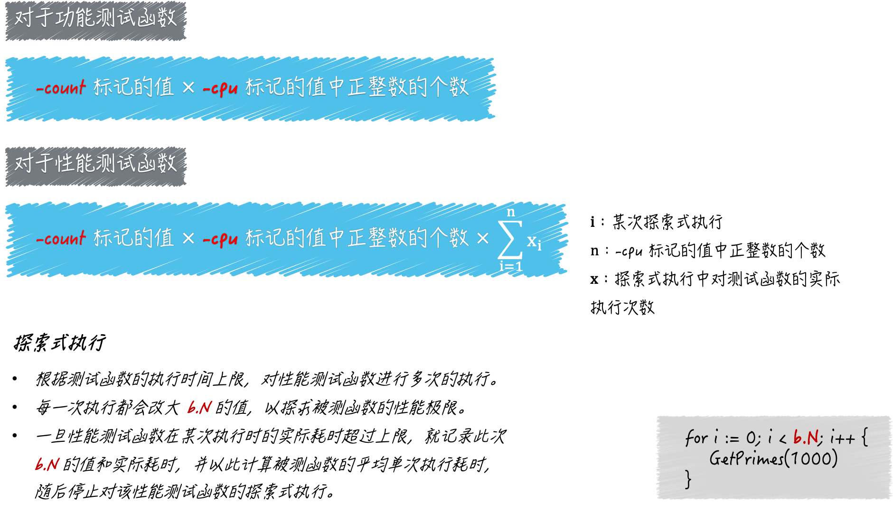

（测试函数的实际执行次数）

看完了这两个公式，我想，你也许遇到过这种情况，**在对 Go 程序执行某种自动化测试的过程中，测试日志会显得特别多，而且好多都是重复的。**

这时，我们首先就应该想到，上面这些导致测试函数多次执行的标记和流程。我们往往需要检查这些标记的使用是否合理、日志记录是否有必要等等，从而对测试日志进行精简。

比如，对于功能测试函数来说，我们通常没有必要重复执行它，即使是在不同的最大 P 数量下也是如此。注意，这里所说的重复执行指的是，在被测程序的输入（比如说被测函数的参数值）相同情况下的多次执行。

有些时候，在输入完全相同的情况下，被测程序会因其他外部环境的不同，而表现出不同的行为。这时我们需要考虑的往往应该是：这个程序在设计上是否合理，而不是通过重复执行测试来检测风险。

还有些时候，我们的程序会无法避免地依赖一些外部环境，比如数据库或者其他服务。这时，我们依然不应该让测试的反复执行成为检测手段，而应该在测试中通过仿造（mock）外部环境，来规避掉它们的不确定性。

其实，单元测试的意思就是：对单一的功能模块进行边界清晰的测试，并且不掺杂任何对外部环境的检测。这也是“单元”二字要表达的主要含义。

正好相反，对于性能测试函数来说，我们常常需要反复地执行，并以此试图抹平当时的计算资源调度的细微差别对被测程序性能的影响。通过-cpu标记，我们还能够模拟被测程序在计算能力不同计算机中的性能表现。

不过要注意，这里设置的最大 P 数量，最好不要超过当前计算机 CPU 核心的实际数量。因为一旦超出计算机实际的并行处理能力，Go 程序在性能上就无法再得到显著地提升了。

这就像一个漏斗，不论我们怎样灌水，水的漏出速度总是有限的。更何况，为了管理过多的 P，Go 语言运行时系统还会耗费额外的计算资源。

显然，上述模拟得出的程序性能一定是不准确的。不过，这或多或少可以作为一个参考，因为，这样模拟出的性能一般都会低于程序在计算环境中的实际性能。

好了，关于-cpu标记，以及由此引出的-count标记和测试函数多次执行的问题，我们就先聊到这里。不过，为了让你再巩固一下前面的知识，我现在给出一段测试结果：

```
pkg: puzzlers/article21/q1
BenchmarkGetPrimesWith100-2        10000000        218 ns/op
BenchmarkGetPrimesWith100-2        10000000        215 ns/op
BenchmarkGetPrimesWith100-4        10000000        215 ns/op
BenchmarkGetPrimesWith100-4        10000000        216 ns/op
BenchmarkGetPrimesWith10000-2         50000      31523 ns/op
BenchmarkGetPrimesWith10000-2         50000      32372 ns/op
BenchmarkGetPrimesWith10000-4         50000      32065 ns/op
BenchmarkGetPrimesWith10000-4         50000      31936 ns/op
BenchmarkGetPrimesWith1000000-2         300    4085799 ns/op
BenchmarkGetPrimesWith1000000-2         300    4121975 ns/op
BenchmarkGetPrimesWith1000000-4         300    4112283 ns/op
BenchmarkGetPrimesWith1000000-4         300    4086174 ns/op
```

现在，我希望让你反推一下，我在运行go test命令时追加的-cpu标记和-count标记的值都是什么。反推之后，你可以用实验的方式进行验证。

demo55.go

```
package q1

import (
	"math"
)

// GetPrimes 用于获取小于或等于参数max的所有质数。
// 本函数使用的是爱拉托逊斯筛选法（Sieve Of Eratosthenes）。
func GetPrimes(max int) []int {
	if max <= 1 {
		return []int{}
	}
	marks := make([]bool, max)
	var count int
	squareRoot := int(math.Sqrt(float64(max)))
	for i := 2; i <= squareRoot; i++ {
		if marks[i] == false {
			for j := i * i; j < max; j += i {
				if marks[j] == false {
					marks[j] = true
					count++
				}
			}
		}
	}
	primes := make([]int, 0, max-count)
	for i := 2; i < max; i++ {
		if marks[i] == false {
			primes = append(primes, i)
		}
	}
	return primes
}
```

demo55_test.go

```
package q1

import (
	"testing"
)

var expectedPrimes = []int{
	2, 3, 5, 7, 11, 13, 17, 19,
	23, 29, 31, 37, 41, 43, 47, 53,
	59, 61, 67, 71, 73, 79, 83, 89,
	97, 101, 103, 107, 109, 113, 127, 131,
	137, 139, 149, 151, 157, 163, 167, 173,
	179, 181, 191, 193, 197, 199, 211, 223,
	227, 229, 233, 239, 241, 251, 257, 263,
	269, 271, 277, 281, 283, 293, 307, 311,
	313, 317, 331, 337, 347, 349, 353, 359,
	367, 373, 379, 383, 389, 397, 401, 409,
	419, 421, 431, 433, 439, 443, 449, 457,
	461, 463, 467, 479, 487, 491, 499, 503,
	509, 521, 523, 541, 547, 557, 563, 569,
	571, 577, 587, 593, 599, 601, 607, 613,
	617, 619, 631, 641, 643, 647, 653, 659,
	661, 673, 677, 683, 691, 701, 709, 719,
	727, 733, 739, 743, 751, 757, 761, 769,
	773, 787, 797, 809, 811, 821, 823, 827,
	829, 839, 853, 857, 859, 863, 877, 881,
	883, 887, 907, 911, 919, 929, 937, 941,
	947, 953, 967, 971, 977, 983, 991, 997,
}

func TestGetPrimesWith1000(t *testing.T) {
	max := 1000
	primes := GetPrimes(max)
	for i, prime := range primes {
		expectedPrime := expectedPrimes[i]
		if prime != expectedPrime {
			t.Errorf("%dth prime number %d is not the expected value %d",
				i, prime, expectedPrime)
		}
	}
	if t.Failed() == false {
		t.Logf("The primes less than %d are all correct.", max)
	}
}

func BenchmarkGetPrimesWith100(b *testing.B) {
	for i := 0; i < b.N; i++ {
		GetPrimes(100)
	}
}

func BenchmarkGetPrimesWith10000(b *testing.B) {
	for i := 0; i < b.N; i++ {
		GetPrimes(10000)
	}
}

func BenchmarkGetPrimesWith1000000(b *testing.B) {
	for i := 0; i < b.N; i++ {
		GetPrimes(1000000)
	}
}
```

### 知识扩展

#### 问题 1：-parallel标记的作用是什么？

我们在运行go test命令的时候，可以追加标记-parallel，该标记的作用是：设置同一个被测代码包中的功能测试函数的最大并发执行数。该标记的默认值是测试运行时的最大 P 数量（这可以通过调用表达式runtime.GOMAXPROCS(0)获得）。

我在上篇文章中已经说过，对于功能测试，为了加快测试速度，命令通常会并发地测试多个被测代码包。

但是，在默认情况下，对于同一个被测代码包中的多个功能测试函数，命令会串行地执行它们。除非我们在一些功能测试函数中显式地调用t.Parallel方法。

这个时候，这些包含了t.Parallel方法调用的功能测试函数就会被go test命令并发地执行，而并发执行的最大数量正是由-parallel标记值决定的。不过要注意，同一个功能测试函数的多次执行之间一定是串行的。

你可以运行命令go test -v puzzlers/article21/q2或者go test -count=2 -v puzzlers/article21/q2，查看测试结果，然后仔细地体会一下。

demo56.go

```
package q2

import (
	"math"
)

// GetPrimes 用于获取小于或等于参数max的所有质数。
// 本函数使用的是爱拉托逊斯筛选法（Sieve Of Eratosthenes）。
func GetPrimes(max int) []int {
	if max <= 1 {
		return []int{}
	}
	marks := make([]bool, max)
	var count int
	squareRoot := int(math.Sqrt(float64(max)))
	for i := 2; i <= squareRoot; i++ {
		if marks[i] == false {
			for j := i * i; j < max; j += i {
				if marks[j] == false {
					marks[j] = true
					count++
				}
			}
		}
	}
	primes := make([]int, 0, max-count)
	for i := 2; i < max; i++ {
		if marks[i] == false {
			primes = append(primes, i)
		}
	}
	return primes
}
```

demo56_test.go

```go
package q2

import (
	"fmt"
	"testing"
)

var expectedPrimes = []int{
	2, 3, 5, 7, 11, 13, 17, 19,
	23, 29, 31, 37, 41, 43, 47, 53,
	59, 61, 67, 71, 73, 79, 83, 89,
	97, 101, 103, 107, 109, 113, 127, 131,
	137, 139, 149, 151, 157, 163, 167, 173,
	179, 181, 191, 193, 197, 199, 211, 223,
	227, 229, 233, 239, 241, 251, 257, 263,
	269, 271, 277, 281, 283, 293, 307, 311,
	313, 317, 331, 337, 347, 349, 353, 359,
	367, 373, 379, 383, 389, 397, 401, 409,
	419, 421, 431, 433, 439, 443, 449, 457,
	461, 463, 467, 479, 487, 491, 499, 503,
	509, 521, 523, 541, 547, 557, 563, 569,
	571, 577, 587, 593, 599, 601, 607, 613,
	617, 619, 631, 641, 643, 647, 653, 659,
	661, 673, 677, 683, 691, 701, 709, 719,
	727, 733, 739, 743, 751, 757, 761, 769,
	773, 787, 797, 809, 811, 821, 823, 827,
	829, 839, 853, 857, 859, 863, 877, 881,
	883, 887, 907, 911, 919, 929, 937, 941,
	947, 953, 967, 971, 977, 983, 991, 997,
}

func TestGetPrimesWithAbnormalParam(t *testing.T) {
	t.Parallel()
	invalidParams := []int{1, 0, -1, -2, -3}
	for _, ip := range invalidParams {
		result := GetPrimes(ip)
		if result == nil {
			t.Errorf("The result is nil, but it should not be.")
		}
		if len(result) > 0 {
			t.Errorf("The result is not empty, but it should be.")
		}
	}
}

func TestGetPrimesWith1000(t *testing.T) {
	t.Parallel()
	max := 1000
	primes := GetPrimes(max)
	for i, prime := range primes {
		expectedPrime := expectedPrimes[i]
		if prime != expectedPrime {
			t.Errorf("%dth prime number %d is not the expected value %d",
				i, prime, expectedPrime)
		}
	}
	if t.Failed() == false {
		t.Logf("The primes less than %d are all correct.", max)
	}
}

func TestGetPrimesParallel(t *testing.T) {
	for _, max := range []int{1, 2, 3, 4, 5} {
		max := max * 200
		// 这些子测试会被并发地执行，
		// 并且只有它们都执行完毕之后当前的测试函数才会执行完成。
		// 当前的测试函数并不会与其他测试函数一起被并发的执行。
		t.Run(fmt.Sprintf("TestGetPrimesWith%d", max),
			func(t *testing.T) {
				t.Parallel()
				primes := GetPrimes(max)
				err := comparePrimes(primes)
				if err != nil {
					t.Error(err)
				} else {
					t.Logf("The primes less than %d are all correct.", max)
				}
			})
	}
}

func comparePrimes(primes []int) (err error) {
	for i, prime := range primes {
		expectedPrime := expectedPrimes[i]
		if prime != expectedPrime {
			err = fmt.Errorf(
				"%dth prime number %d is not the expected value %d",
				i, prime, expectedPrime)
			break
		}
	}
	return
}
```

最后，强调一下，-parallel标记对性能测试是无效的。当然了，对于性能测试来说，也是可以并发进行的，不过机制上会有所不同。

概括地讲，这涉及了b.RunParallel方法、b.SetParallelism方法和-cpu标记的联合运用。如果想进一步了解，你可以查看testing代码包的文档 https://golang.google.cn/pkg/testing/ 。

#### 问题 2：性能测试函数中的计时器是做什么用的？

如果你看过testing包的文档，那么很可能会发现其中的testing.B类型有这么几个指针方法：StartTimer、StopTimer和ResetTimer。这些方法都是用于操作当前的性能测试函数专属的计时器的。

所谓的计时器，是一个逻辑上的概念，它其实是testing.B类型中一些字段的统称。这些字段用于记录：当前测试函数在当次执行过程中耗费的时间、分配的堆内存的字节数以及分配次数。

我在下面会以测试函数的执行时间为例，来说明此计时器的用法。不过，你需要知道的是，这三个方法在开始记录、停止记录或重新记录执行时间的同时，也会对堆内存分配字节数和分配次数的记录起到相同的作用。

实际上，go test命令本身就会用到这样的计时器。当准备执行某个性能测试函数的时候，命令会重置并启动该函数专属的计时器。一旦这个函数执行完毕，命令又会立即停止这个计时器。

如此一来，命令就能够准确地记录下（我们在前面多次提到的）测试函数执行时间了。然后，命令就会将这个时间与执行时间上限进行比较，并决定是否在改大b.N的值之后，再次执行测试函数。

还记得吗？这就是我在前面讲过的，对性能测试函数的探索式执行。显然，如果我们在测试函数中自行操作这个计时器，就一定会影响到这个探索式执行的结果。也就是说，这会让命令找到被测程序的最大执行次数有所不同。

请看在 demo57_test.go 文件中的那个性能测试函数，如下所示：

```go
func BenchmarkGetPrimes(b *testing.B) {
 b.StopTimer()
 time.Sleep(time.Millisecond * 500) // 模拟某个耗时但与被测程序关系不大的操作。
 max := 10000
 b.StartTimer()

 for i := 0; i < b.N; i++ {
  GetPrimes(max)
 }
}
```

需要注意的是该函数体中的前四行代码。我先停止了当前测试函数的计时器，然后通过调用time.Sleep函数，模拟了一个比较耗时的额外操作，并且在给变量max赋值之后又启动了该计时器。

你可以想象一下，我们需要耗费额外的时间去确定max变量的值，虽然在后面它会被传入GetPrimes函数，但是，针对GetPrimes函数本身的性能测试并不应该包含确定参数值的过程。

因此，我们需要把这个过程所耗费的时间，从当前测试函数的执行时间中去除掉。这样就能够避免这一过程对测试结果的不良影响了。

每当这个测试函数执行完毕后，go test命令拿到的执行时间都只应该包含调用GetPrimes函数所耗费的那些时间。只有依据这个时间做出的后续判断，以及找到被测程序的最大执行次数才是准确的。

在性能测试函数中，我们可以通过对b.StartTimer和b.StopTimer方法的联合运用，再去除掉任何一段代码的执行时间。

相比之下，b.ResetTimer方法的灵活性就要差一些了，它只能用于：去除在调用它之前那些代码的执行时间。不过，无论在调用它的时候，计时器是不是正在运行，它都可以起作用。

demo57.go

```go
package q3

import (
	"math"
)

// GetPrimes 用于获取小于或等于参数max的所有质数。
// 本函数使用的是爱拉托逊斯筛选法（Sieve Of Eratosthenes）。
func GetPrimes(max int) []int {
	if max <= 1 {
		return []int{}
	}
	marks := make([]bool, max)
	var count int
	squareRoot := int(math.Sqrt(float64(max)))
	for i := 2; i <= squareRoot; i++ {
		if marks[i] == false {
			for j := i * i; j < max; j += i {
				if marks[j] == false {
					marks[j] = true
					count++
				}
			}
		}
	}
	primes := make([]int, 0, max-count)
	for i := 2; i < max; i++ {
		if marks[i] == false {
			primes = append(primes, i)
		}
	}
	return primes
}
```

demo57_test.go

```go
package q3

import (
	"testing"
	"time"
)

func BenchmarkGetPrimes(b *testing.B) {
	// 你可以注释或者还原下面这四行代码中的第一行和第四行，
	// 并观察测试结果的不同。
	b.StopTimer()
	time.Sleep(time.Millisecond * 500) // 模拟某个耗时但与被测程序关系不大的操作。
	max := 10000
	b.StartTimer()

	for i := 0; i < b.N; i++ {
		GetPrimes(max)
	}
}
```

### 总结

在本篇文章中，我假设你已经理解了上一篇文章涉及的内容。因此，我在这里围绕着几个可以被go test命令接受的重要标记，进一步地阐释了功能测试和性能测试在不同条件下的测试流程。

其中，比较重要的有最大 P 数量的含义，-cpu标记的作用及其对测试流程的影响，针对性能测试函数的探索式执行的意义，测试函数执行时间的计算方法，以及-count标记的用途和适用场景。

当然了，学会怎样并发地执行多个功能测试函数也是很有必要的。这需要联合运用-parallel标记和功能测试函数中的t.Parallel方法。

另外，你还需要知道性能测试函数专属计时器的内涵，以及那三个方法对计时器起到的作用。通过对计时器的操作，我们可以达到精确化性能测试函数的执行时间的目的，从而帮助go test命令找到被测程序真实的最大执行次数。

到这里，我们对 Go 程序测试的讨论就要告一段落了。我们需要搞清楚的是，go test命令所执行的基本测试流程是什么，以及我们可以通过什么样的手段让测试流程产生变化，从而满足我们的测试需求并为我们提供更加充分的测试结果。

希望你已经从中学到了一些东西，并能够学以致用。

### 思考题

-benchmem标记和-benchtime标记的作用分别是什么？

怎样在测试的时候开启测试覆盖度分析？如果开启，会有什么副作用吗？

关于这两个问题，你都可以参考官方的go 命令文档中的测试标记部分 https://golang.google.cn/cmd/go/#hdr-Testing_flags 进行回答。

## 26 | sync.Mutex与sync.RWMutex

从本篇文章开始，我们将一起探讨 Go 语言自带标准库中一些比较核心的代码包。这会涉及这些代码包的标准用法、使用禁忌、背后原理以及周边的知识。

既然 Go 语言是以独特的并发编程模型傲视群雄的语言，那么我们就先来学习与并发编程关系最紧密的代码包。

### 前导内容： 竞态条件、临界区与同步工具

我们首先要看的就是sync包。这里的“sync”的中文意思是“同步”。我们下面就从同步讲起。

相比于 Go 语言宣扬的“用通讯的方式共享数据”，通过共享数据的方式来传递信息和协调线程运行的做法其实更加主流，毕竟大多数的现代编程语言，都是用后一种方式作为并发编程的解决方案的（这种方案的历史非常悠久，恐怕可以追溯到上个世纪多进程编程时代伊始了）。

一旦数据被多个线程共享，那么就很可能会产生争用和冲突的情况。这种情况也被称为竞态条件（race condition），这往往会破坏共享数据的一致性。

共享数据的一致性代表着某种约定，即：多个线程对共享数据的操作总是可以达到它们各自预期的效果。

如果这个一致性得不到保证，那么将会影响到一些线程中代码和流程的正确执行，甚至会造成某种不可预知的错误。这种错误一般都很难发现和定位，排查起来的成本也是非常高的，所以一定要尽量避免。

举个例子，同时有多个线程连续向同一个缓冲区写入数据块，如果没有一个机制去协调这些线程的写入操作的话，那么被写入的数据块就很可能会出现错乱。比如，在线程 A 还没有写完一个数据块的时候，线程 B 就开始写入另外一个数据块了。

显然，这两个数据块中的数据会被混在一起，并且已经很难分清了。因此，在这种情况下，我们就需要采取一些措施来协调它们对缓冲区的修改。这通常就会涉及同步。

概括来讲，**同步的用途有两个，一个是避免多个线程在同一时刻操作同一个数据块，另一个是协调多个线程，以避免它们在同一时刻执行同一个代码块。**

由于这样的数据块和代码块的背后都隐含着一种或多种资源（比如存储资源、计算资源、I/O 资源、网络资源等等），所以我们可以把它们看做是共享资源，或者说共享资源的代表。我们所说的同步其实就是在控制多个线程对共享资源的访问。

一个线程在想要访问某一个共享资源的时候，需要先申请对该资源的访问权限，并且只有在申请成功之后，访问才能真正开始。

而当线程对共享资源的访问结束时，它还必须归还对该资源的访问权限，若要再次访问仍需申请。

你可以把这里所说的访问权限想象成一块令牌，线程一旦拿到了令牌，就可以进入指定的区域，从而访问到资源，而一旦线程要离开这个区域了，就需要把令牌还回去，绝不能把令牌带走。

如果针对某个共享资源的访问令牌只有一块，那么在同一时刻，就最多只能有一个线程进入到那个区域，并访问到该资源。

这时，我们可以说，多个并发运行的线程对这个共享资源的访问是完全串行的。只要一个代码片段需要实现对共享资源的串行化访问，就可以被视为一个临界区（critical section），也就是我刚刚说的，由于要访问到资源而必须进入的那个区域。

比如，在我前面举的那个例子中，实现了数据块写入操作的代码就共同组成了一个临界区。如果针对同一个共享资源，这样的代码片段有多个，那么它们就可以被称为相关临界区。

它们可以是一个内含了共享数据的结构体及其方法，也可以是操作同一块共享数据的多个函数。临界区总是需要受到保护的，否则就会产生竞态条件。**施加保护的重要手段之一，就是使用实现了某种同步机制的工具，也称为同步工具。**

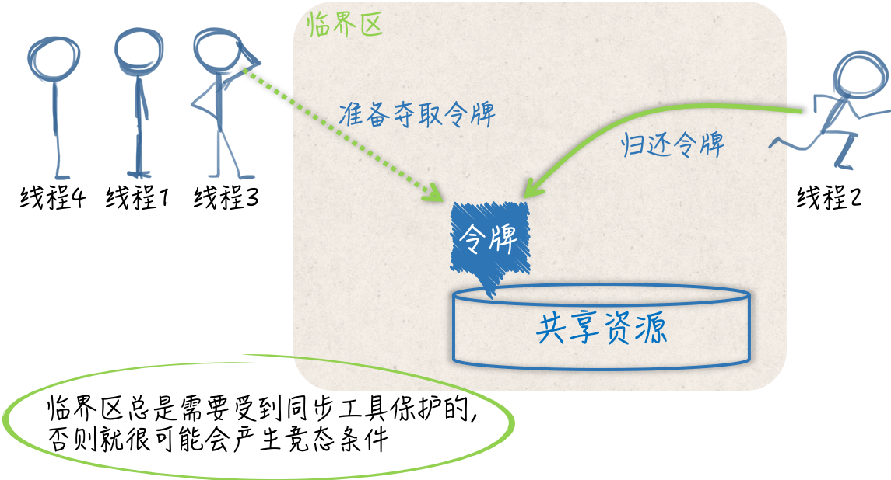

（竞态条件、临界区与同步工具）

**在 Go 语言中，可供我们选择的同步工具并不少。其中，最重要且最常用的同步工具当属互斥量（mutual exclusion，简称 mutex）。**sync包中的Mutex就是与其对应的类型，该类型的值可以被称为互斥量或者互斥锁。

一个互斥锁可以被用来保护一个临界区或者一组相关临界区。我们可以通过它来保证，在同一时刻只有一个 goroutine 处于该临界区之内。

为了兑现这个保证，每当有 goroutine 想进入临界区时，都需要先对它进行锁定，并且，每个 goroutine 离开临界区时，都要及时地对它进行解锁。

锁定操作可以通过调用互斥锁的Lock方法实现，而解锁操作可以调用互斥锁的Unlock方法。以下是 demo58.go 文件中重点代码经过简化之后的片段：

```
mu.Lock()
_, err := writer.Write([]byte(data))
if err != nil {
 log.Printf("error: %s [%d]", err, id)
}
mu.Unlock()
```

你可能已经看出来了，这里的互斥锁就相当于我们前面说的那块访问令牌。

demo58.go

```go
package main

import (
	"bytes"
	"flag"
	"fmt"
	"io"
	"io/ioutil"
	"log"
	"sync"
)

// protecting 用于指示是否使用互斥锁来保护数据写入。
// 若值等于0则表示不使用，若值大于0则表示使用。
// 改变该变量的值，然后多运行几次程序，并观察程序打印的内容。
var protecting uint

func init() {
	flag.UintVar(&protecting, "protecting", 1,
		"It indicates whether to use a mutex to protect data writing.")
}

func main() {
	flag.Parse()
	// buffer 代表缓冲区。
	var buffer bytes.Buffer

	const (
		max1 = 5  // 代表启用的goroutine的数量。
		max2 = 10 // 代表每个goroutine需要写入的数据块的数量。
		max3 = 10 // 代表每个数据块中需要有多少个重复的数字。
	)

	// mu 代表以下流程要使用的互斥锁。
	var mu sync.Mutex
	// sign 代表信号的通道。
	sign := make(chan struct{}, max1)

	for i := 1; i <= max1; i++ {
		go func(id int, writer io.Writer) {
			defer func() {
				sign <- struct{}{}
			}()
			for j := 1; j <= max2; j++ {
				// 准备数据。
				header := fmt.Sprintf("\n[id: %d, iteration: %d]",
					id, j)
				data := fmt.Sprintf(" %d", id*j)
				// 写入数据。
				if protecting > 0 {
					mu.Lock()
				}
				_, err := writer.Write([]byte(header))
				if err != nil {
					log.Printf("error: %s [%d]", err, id)
				}
				for k := 0; k < max3; k++ {
					_, err := writer.Write([]byte(data))
					if err != nil {
						log.Printf("error: %s [%d]", err, id)
					}
				}
				if protecting > 0 {
					mu.Unlock()
				}
			}
		}(i, &buffer)
	}

	for i := 0; i < max1; i++ {
		<-sign
	}
	data, err := ioutil.ReadAll(&buffer)
	if err != nil {
		log.Fatalf("fatal error: %s", err)
	}
	log.Printf("The contents:\n%s", data)
}
```

那么，我们怎样才能用好这块访问令牌呢？请看下面的问题。

**我们今天的问题是：我们使用互斥锁时有哪些注意事项？**

这里有一个典型回答。

使用互斥锁的注意事项如下：

- 不要重复锁定互斥锁；
- 不要忘记解锁互斥锁，必要时使用defer语句；
- 不要对尚未锁定或者已解锁的互斥锁解锁；
- 不要在多个函数之间直接传递互斥锁。

### 问题解析

首先，你还是要把互斥锁看作是针对某一个临界区或某一组相关临界区的唯一访问令牌。

虽然没有任何强制规定来限制，你用同一个互斥锁保护多个无关的临界区，但是这样做，一定会让你的程序变得很复杂，并且也会明显地增加你的心智负担。

你要知道，对一个已经被锁定的互斥锁进行锁定，是会立即阻塞当前的 goroutine 的。这个 goroutine 所执行的流程，会一直停滞在调用该互斥锁的Lock方法的那行代码上。

直到该互斥锁的Unlock方法被调用，并且这里的锁定操作成功完成，后续的代码（也就是临界区中的代码）才会开始执行。这也正是互斥锁能够保护临界区的原因所在。

一旦，你把一个互斥锁同时用在了多个地方，就必然会有更多的 goroutine 争用这把锁。这不但会让你的程序变慢，还会大大增加死锁（deadlock）的可能性。

所谓的死锁，指的就是当前程序中的主 goroutine，以及我们启用的那些 goroutine 都已经被阻塞。这些 goroutine 可以被统称为用户级的 goroutine。这就相当于整个程序都已经停滞不前了。

Go 语言运行时系统是不允许这种情况出现的，只要它发现所有的用户级 goroutine 都处于等待状态，就会自行抛出一个带有如下信息的 panic：

```
fatal error: all goroutines are asleep - deadlock!
```

**注意，这种由 Go 语言运行时系统自行抛出的 panic 都属于致命错误，都是无法被恢复的，调用recover函数对它们起不到任何作用。也就是说，一旦产生死锁，程序必然崩溃。**

因此，我们一定要尽量避免这种情况的发生。而最简单、有效的方式就是让每一个互斥锁都只保护一个临界区或一组相关临界区。

在这个前提之下，我们还需要注意，对于同一个 goroutine 而言，既不要重复锁定一个互斥锁，也不要忘记对它进行解锁。

一个 goroutine 对某一个互斥锁的重复锁定，就意味着它自己锁死了自己。先不说这种做法本身就是错误的，在这种情况下，想让其他的 goroutine 来帮它解锁是非常难以保证其正确性的。

我以前就在团队代码库中见到过这样的代码。那个作者的本意是先让一个 goroutine 自己锁死自己，然后再让一个负责调度的 goroutine 定时地解锁那个互斥锁，从而让前一个 goroutine 周期性地去做一些事情，比如每分钟检查一次服务器状态，或者每天清理一次日志。

这个想法本身是没有什么问题的，但却选错了实现的工具。对于互斥锁这种需要精细化控制的同步工具而言，这样的任务并不适合它。

在这种情况下，即使选用通道或者time.Ticker类型，然后自行实现功能都是可以的，程序的复杂度和我们的心智负担也会小很多，更何况还有不少已经很完备的解决方案可供选择。

话说回来，其实我们说“不要忘记解锁互斥锁”的一个很重要的原因就是：**避免重复锁定。**

因为在一个 goroutine 执行的流程中，可能会出现诸如“锁定、解锁、再锁定、再解锁”的操作，所以如果我们忘记了中间的解锁操作，那就一定会造成重复锁定。

除此之外，忘记解锁还会使其他的 goroutine 无法进入到该互斥锁保护的临界区，这轻则会导致一些程序功能的失效，重则会造成死锁和程序崩溃。

在很多时候，一个函数执行的流程并不是单一的，流程中间可能会有分叉，也可能会被中断。

如果一个流程在锁定了某个互斥锁之后分叉了，或者有被中断的可能，那么就应该使用defer语句来对它进行解锁，而且这样的defer语句应该紧跟在锁定操作之后。这是最保险的一种做法。

忘记解锁导致的问题有时候是比较隐秘的，并不会那么快就暴露出来。这也是我们需要特别关注它的原因。相比之下，解锁未锁定的互斥锁会立即引发 panic。

并且，与死锁导致的 panic 一样，它们是无法被恢复的。**因此，我们总是应该保证，对于每一个锁定操作，都要有且只有一个对应的解锁操作。**

换句话说，我们应该让它们成对出现。这也算是互斥锁的一个很重要的使用原则了。在很多时候，利用defer语句进行解锁可以更容易做到这一点。


（互斥锁的重复锁定和重复解锁）

最后，可能你已经知道，Go 语言中的互斥锁是开箱即用的。换句话说，一旦我们声明了一个sync.Mutex类型的变量，就可以直接使用它了。

不过要注意，该类型是一个结构体类型，属于值类型中的一种。把它传给一个函数、将它从函数中返回、把它赋给其他变量、让它进入某个通道都会导致它的副本的产生。

并且，原值和它的副本，以及多个副本之间都是完全独立的，它们都是不同的互斥锁。

如果你把一个互斥锁作为参数值传给了一个函数，那么在这个函数中对传入的锁的所有操作，都不会对存在于该函数之外的那个原锁产生任何的影响。

所以，你在这样做之前，一定要考虑清楚，这种结果是你想要的吗？我想，在大多数情况下应该都不是。即使你真的希望，在这个函数中使用另外一个互斥锁也不要这样做，这主要是为了避免歧义。

以上这些，就是我想要告诉你的关于互斥锁的锁定、解锁，以及传递方面的知识。这其中还包括了我的一些理解。希望能够对你有用。相关的例子我已经写在 demo59.go 文件中了，你可以去阅读一番，并运行起来看看。

```go
package main

import (
	"bytes"
	"errors"
	"fmt"
	"io"
	"log"
	"sync"
	"time"
)

// singleHandler 代表单次处理函数的类型。
type singleHandler func() (data string, n int, err error)

// handlerConfig 代表处理流程配置的类型。
type handlerConfig struct {
	handler   singleHandler // 单次处理函数。
	goNum     int           // 需要启用的goroutine的数量。
	number    int           // 单个goroutine中的处理次数。
	interval  time.Duration // 单个goroutine中的处理间隔时间。
	counter   int           // 数据量计数器，以字节为单位。
	counterMu sync.Mutex    // 数据量计数器专用的互斥锁。

}

// count 会增加计数器的值，并会返回增加后的计数。
func (hc *handlerConfig) count(increment int) int {
	hc.counterMu.Lock()
	defer hc.counterMu.Unlock()
	hc.counter += increment
	return hc.counter
}

func main() {
	// mu 代表以下流程要使用的互斥锁。
	// 在下面的函数中直接使用即可，不要传递。
	var mu sync.Mutex

	// genWriter 代表的是用于生成写入函数的函数。
	genWriter := func(writer io.Writer) singleHandler {
		return func() (data string, n int, err error) {
			// 准备数据。
			data = fmt.Sprintf("%s\t",
				time.Now().Format(time.StampNano))
			// 写入数据。
			mu.Lock()
			defer mu.Unlock()
			n, err = writer.Write([]byte(data))
			return
		}
	}

	// genReader 代表的是用于生成读取函数的函数。
	genReader := func(reader io.Reader) singleHandler {
		return func() (data string, n int, err error) {
			buffer, ok := reader.(*bytes.Buffer)
			if !ok {
				err = errors.New("unsupported reader")
				return
			}
			// 读取数据。
			mu.Lock()
			defer mu.Unlock()
			data, err = buffer.ReadString('\t')
			n = len(data)
			return
		}
	}

	// buffer 代表缓冲区。
	var buffer bytes.Buffer

	// 数据写入配置。
	writingConfig := handlerConfig{
		handler:  genWriter(&buffer),
		goNum:    5,
		number:   4,
		interval: time.Millisecond * 100,
	}
	// 数据读取配置。
	readingConfig := handlerConfig{
		handler:  genReader(&buffer),
		goNum:    10,
		number:   2,
		interval: time.Millisecond * 100,
	}

	// sign 代表信号的通道。
	sign := make(chan struct{}, writingConfig.goNum+readingConfig.goNum)

	// 启用多个goroutine对缓冲区进行多次数据写入。
	for i := 1; i <= writingConfig.goNum; i++ {
		go func(i int) {
			defer func() {
				sign <- struct{}{}
			}()
			for j := 1; j <= writingConfig.number; j++ {
				time.Sleep(writingConfig.interval)
				data, n, err := writingConfig.handler()
				if err != nil {
					log.Printf("writer [%d-%d]: error: %s",
						i, j, err)
					continue
				}
				total := writingConfig.count(n)
				log.Printf("writer [%d-%d]: %s (total: %d)",
					i, j, data, total)
			}
		}(i)
	}

	// 启用多个goroutine对缓冲区进行多次数据读取。
	for i := 1; i <= readingConfig.goNum; i++ {
		go func(i int) {
			defer func() {
				sign <- struct{}{}
			}()
			for j := 1; j <= readingConfig.number; j++ {
				time.Sleep(readingConfig.interval)
				var data string
				var n int
				var err error
				for {
					data, n, err = readingConfig.handler()
					if err == nil || err != io.EOF {
						break
					}
					// 如果读比写快（读时会发生EOF错误），那就等一会儿再读。
					time.Sleep(readingConfig.interval)
				}
				if err != nil {
					log.Printf("reader [%d-%d]: error: %s",
						i, j, err)
					continue
				}
				total := readingConfig.count(n)
				log.Printf("reader [%d-%d]: %s (total: %d)",
					i, j, data, total)
			}
		}(i)
	}

	// signNumber 代表需要接收的信号的数量。
	signNumber := writingConfig.goNum + readingConfig.goNum
	// 等待上面启用的所有goroutine的运行全部结束。
	for j := 0; j < signNumber; j++ {
		<-sign
	}
}
```

### 知识扩展

问题 1：读写锁与互斥锁有哪些异同？

读写锁是读 / 写互斥锁的简称。在 Go 语言中，读写锁由sync.RWMutex类型的值代表。与sync.Mutex类型一样，这个类型也是开箱即用的。

顾名思义，读写锁是把对共享资源的“读操作”和“写操作”区别对待了。它可以对这两种操作施加不同程度的保护。换句话说，相比于互斥锁，读写锁可以实现更加细腻的访问控制。

一个读写锁中实际上包含了两个锁，即：读锁和写锁。sync.RWMutex类型中的Lock方法和Unlock方法分别用于对写锁进行锁定和解锁，而它的RLock方法和RUnlock方法则分别用于对读锁进行锁定和解锁。

```go
package main

import (
	"log"
	"sync"
	"time"
)

// counter 代表计数器。
type counter struct {
	num uint         // 计数。
	mu  sync.RWMutex // 读写锁。
}

// number 会返回当前的计数。
func (c *counter) number() uint {
	c.mu.RLock()
	defer c.mu.RUnlock()
	return c.num
}

// add 会增加计数器的值，并会返回增加后的计数。
func (c *counter) add(increment uint) uint {
	c.mu.Lock()
	defer c.mu.Unlock()
	c.num += increment
	return c.num
}

func main() {
	c := counter{}
	count(&c)
	redundantUnlock()
}

func count(c *counter) {
	// sign 用于传递演示完成的信号。
	sign := make(chan struct{}, 3)
	go func() { // 用于增加计数。
		defer func() {
			sign <- struct{}{}
		}()
		for i := 1; i <= 10; i++ {
			time.Sleep(time.Millisecond * 500)
			c.add(1)
		}
	}()
	go func() {
		defer func() {
			sign <- struct{}{}
		}()
		for j := 1; j <= 20; j++ {
			time.Sleep(time.Millisecond * 200)
			log.Printf("The number in counter: %d [%d-%d]",
				c.number(), 1, j)
		}
	}()
	go func() {
		defer func() {
			sign <- struct{}{}
		}()
		for k := 1; k <= 20; k++ {
			time.Sleep(time.Millisecond * 300)
			log.Printf("The number in counter: %d [%d-%d]",
				c.number(), 2, k)
		}
	}()
	<-sign
	<-sign
	<-sign
}

func redundantUnlock() {
	var rwMu sync.RWMutex

	// 示例1。
	//rwMu.Unlock() // 这里会引发panic。

	// 示例2。
	//rwMu.RUnlock() // 这里会引发panic。

	// 示例3。
	rwMu.RLock()
	//rwMu.Unlock() // 这里会引发panic。
	rwMu.RUnlock()

	// 示例4。
	rwMu.Lock()
	//rwMu.RUnlock() // 这里会引发panic。
	rwMu.Unlock()
}
```

另外，对于同一个读写锁来说有如下规则。

1、在写锁已被锁定的情况下再试图锁定写锁，会阻塞当前的 goroutine。

2、在写锁已被锁定的情况下试图锁定读锁，也会阻塞当前的 goroutine。

3、在读锁已被锁定的情况下试图锁定写锁，同样会阻塞当前的 goroutine。

4、在读锁已被锁定的情况下再试图锁定读锁，并不会阻塞当前的 goroutine。

换一个角度来说，对于某个受到读写锁保护的共享资源，多个写操作不能同时进行，写操作和读操作也不能同时进行，但多个读操作却可以同时进行。

当然了，只有在我们正确使用读写锁的情况下，才能达到这种效果。还是那句话，我们需要让每一个锁都只保护一个临界区，或者一组相关临界区，并以此尽量减少误用的可能性。顺便说一句，我们通常把这种不能同时进行的操作称为互斥操作。

再来看另一个方面。对写锁进行解锁，会唤醒“所有因试图锁定读锁，而被阻塞的 goroutine”，并且，这通常会使它们都成功完成对读锁的锁定。

然而，对读锁进行解锁，只会在没有其他读锁锁定的前提下，唤醒“因试图锁定写锁，而被阻塞的 goroutine”；并且，最终只会有一个被唤醒的 goroutine 能够成功完成对写锁的锁定，其他的 goroutine 还要在原处继续等待。至于是哪一个 goroutine，那就要看谁的等待时间最长了。

除此之外，读写锁对写操作之间的互斥，其实是通过它内含的一个互斥锁实现的。因此，也可以说，Go 语言的读写锁是互斥锁的一种扩展。

最后，需要强调的是，与互斥锁类似，解锁“读写锁中未被锁定的写锁”，会立即引发 panic，对于其中的读锁也是如此，并且同样是不可恢复的。

总之，读写锁与互斥锁的不同，都源于它把对共享资源的写操作和读操作区别对待了。这也使得它实现的互斥规则要更复杂一些。

不过，正因为如此，我们可以使用它对共享资源的操作，实行更加细腻的控制。另外，由于这里的读写锁是互斥锁的一种扩展，所以在有些方面它还是沿用了互斥锁的行为模式。比如，在解锁未锁定的写锁或读锁时的表现，又比如，对写操作之间互斥的实现方式。

### 总结

我们今天讨论了很多与多线程、共享资源以及同步有关的知识。其中涉及了不少重要的并发编程概念，比如，竞态条件、临界区、互斥量、死锁等。

虽然 Go 语言是以“用通讯的方式共享数据”为亮点的，但是它依然提供了一些易用的同步工具。其中，互斥锁是我们最常用到的一个。

互斥锁常常被用来：保证多个 goroutine 并发地访问同一个共享资源时的完全串行，这是通过保护针对此共享资源的一个临界区，或一组相关临界区实现的。因此，我们可以把它看做是 goroutine 进入相关临界区时，必须拿到的访问令牌。

为了用对并且用好互斥锁，我们需要了解它实现的互斥规则，更要理解一些关于它的注意事项。

比如，不要重复锁定或忘记解锁，因为这会造成 goroutine 不必要的阻塞，甚至导致程序的死锁。

又比如，不要传递互斥锁，因为这会产生它的副本，从而引起歧义并可能导致互斥操作的失效。

再次强调，我们总是应该让每一个互斥锁都只保护一个临界区，或一组相关临界区。

至于读写锁，它是互斥锁的一种扩展。我们需要知道它与互斥锁的异同，尤其是互斥规则和行为模式方面的异同。一个读写锁中同时包含了读锁和写锁，由此也可以看出它对于针对共享资源的读操作和写操作是区别对待的。我们可以基于这件事，对共享资源实施更加细致的访问控制。

最后，需要特别注意的是，无论是互斥锁还是读写锁，我们都不要试图去解锁未锁定的锁，因为这样会引发不可恢复的 panic。

### 思考题

你知道互斥锁和读写锁的指针类型都实现了哪一个接口吗？

怎样获取读写锁中的读锁？

## 27 | 条件变量sync.Cond （上）

### 前导内容：条件变量与互斥锁

我们常常会把条件变量这个同步工具拿来与互斥锁一起讨论。实际上，条件变量是基于互斥锁的，它必须有互斥锁的支撑才能发挥作用。

条件变量并不是被用来保护临界区和共享资源的，它是用于协调想要访问共享资源的那些线程的。当共享资源的状态发生变化时，它可以被用来通知被互斥锁阻塞的线程。

比如说，我们两个人在共同执行一项秘密任务，这需要在不直接联系和见面的前提下进行。我需要向一个信箱里放置情报，你需要从这个信箱中获取情报。这个信箱就相当于一个共享资源，而我们就分别是进行写操作的线程和进行读操作的线程。

如果我在放置的时候发现信箱里还有未被取走的情报，那就不再放置，而先返回。另一方面，如果你在获取的时候发现信箱里没有情报，那也只能先回去了。这就相当于写的线程或读的线程阻塞的情况。

虽然我们俩都有信箱的钥匙，但是同一时刻只能有一个人插入钥匙并打开信箱，这就是锁的作用了。更何况咱们俩是不能直接见面的，所以这个信箱本身就可以被视为一个临界区。

尽管没有协调好，咱们俩仍然要想方设法的完成任务啊。所以，如果信箱里有情报，而你却迟迟未取走，那我就需要每过一段时间带着新情报去检查一次，若发现信箱空了，我就需要及时地把新情报放到里面。

另一方面，如果信箱里一直没有情报，那你也要每过一段时间去打开看看，一旦有了情报就及时地取走。这么做是可以的，但就是太危险了，很容易被敌人发现。

后来，我们又想了一个计策，各自雇佣了一个不起眼的小孩儿。如果早上七点有一个戴红色帽子的小孩儿从你家楼下路过，那么就意味着信箱里有了新情报。另一边，如果上午九点有一个戴蓝色帽子的小孩儿从我家楼下路过，那就说明你已经从信箱中取走了情报。

这样一来，咱们执行任务的隐蔽性高多了，并且效率的提升非常显著。这两个戴不同颜色帽子的小孩儿就相当于条件变量，在共享资源的状态产生变化的时候，起到了通知的作用。

当然了，我们是在用 Go 语言编写程序，而不是在执行什么秘密任务。因此，条件变量在这里的最大优势就是在效率方面的提升。当共享资源的状态不满足条件的时候，想操作它的线程再也不用循环往复地做检查了，只要等待通知就好了。

说到这里，想考考你知道怎么使用条件变量吗？所以，**我们今天的问题就是：条件变量怎样与互斥锁配合使用？**

**这道题的典型回答是：条件变量的初始化离不开互斥锁，并且它的方法有的也是基于互斥锁的。**

条件变量提供的方法有三个：等待通知（wait）、单发通知（signal）和广播通知（broadcast）。

我们在利用条件变量等待通知的时候，需要在它基于的那个互斥锁保护下进行。而在进行单发通知或广播通知的时候，却是恰恰相反的，也就是说，需要在对应的互斥锁解锁之后再做这两种操作。

### 问题解析

问题解析这个问题看起来很简单，但其实可以基于它, 延伸出很多其他的问题。比如，每个方法的使用时机是什么？又比如，每个方法执行的内部流程是怎样的？

下面，我们一边用代码实现前面那个例子，一边讨论条件变量的使用。

首先，我们先来创建如下几个变量。

```go
var mailbox uint8
var lock sync.RWMutex
sendCond := sync.NewCond(&lock)
recvCond := sync.NewCond(lock.RLocker())
```

**变量mailbox代表信箱，是uint8类型的。** 若它的值为0则表示信箱中没有情报，而当它的值为1时则说明信箱中有情报。lock是一个类型为sync.RWMutex的变量，是一个读写锁，也可以被视为信箱上的
那把锁。

另外，基于这把锁，我还创建了两个代表条件变量的变量，**名字分别叫sendCond和recvCond**。 它们都是*sync.Cond类型的，同时也都是由sync.NewCond函数来初始化的。

与sync.Mutex类型和sync.RWMutex类型不同，sync.Cond类型并不是开箱即用的。我们只能利用sync.NewCond函数创建它的指针值。这个函数需要一个sync.Locker类型的参数值。

还记得吗？我在前面说过，条件变量是基于互斥锁的，它必须有互斥锁的支撑才能够起作用。因此，这里的参数值是不可或缺的，它会参与到条件变量的方法实现当中。

sync.Locker其实是一个接口，在它的声明中只包含了两个方法定义，即：Lock()和Unlock()。sync.Mutex类型和sync.RWMutex类型都拥有Lock方法和Unlock方法，只不过它们都是指针方法。因此，这两个类型的指针类型才是sync.Locker接口的实现类型。

我在为sendCond变量做初始化的时候，把基于lock变量的指针值传给了sync.NewCond函数。

原因是，**lock变量的Lock方法和Unlock方法分别用于对其中写锁的锁定和解锁，它们与sendCond变量的含义是对应的。**sendCond是专门为放置情报而准备的条件变量，向信箱里放置情报，可以被视为对共享资源的写操作。

相应的，**recvCond变量代表的是专门为获取情报而准备的条件变量。** 虽然获取情报也会涉及对信箱状态的改变，但是好在做这件事的人只会有你一个，而且我们也需要借此了解一下，条件变量与读写锁中的读锁的联用方式。所以，在这里，我们暂且把获取情报看做是对共享资源的读操作。

因此，为了初始化recvCond这个条件变量，我们需要的是lock变量中的读锁，并且还需要是sync.Locker类型的。

可是，lock变量中用于对读锁进行锁定和解锁的方法却是RLock和RUnlock，它们与sync.Locker接口中定义的方法并不匹配。

好在sync.RWMutex类型的RLocker方法可以实现这一需求。我们只要在调用sync.NewCond函数时，传入调用表达式lock.RLocker()的结果值，就可以使该函数返回符合要求的条件变量了。

为什么说通过lock.RLocker()得来的值就是lock变量中的读锁呢？实际上，这个值所拥有的Lock方法和Unlock方法，在其内部会分别调用lock变量的RLock方法和RUnlock方法。也就是说，前两个方法仅仅是后两个方法的代理而已。

好了，我们现在有四个变量。一个是代表信箱的mailbox，一个是代表信箱上的锁的lock。还有两个是，代表了蓝帽子小孩儿的sendCond，以及代表了红帽子小孩儿的recvCond。


（互斥锁与条件变量）

我，现在是一个 goroutine（携带的go函数），想要适时地向信箱里放置情报并通知你，应该怎么做呢？

```go
lock.Lock()
for mailbox == 1 {
 sendCond.Wait()
}
mailbox = 1
lock.Unlock()
recvCond.Signal()
```

我肯定需要先调用lock变量的Lock方法。注意，这个Lock方法在这里意味的是：持有信箱上的锁，并且有打开信箱的权利，而不是锁上这个锁。

然后，我要检查mailbox变量的值是否等于1，也就是说，要看看信箱里是不是还存有情报。如果还有情报，那么我就回家去等蓝帽子小孩儿了。

这就是那条for语句以及其中的调用表达式sendCond.Wait()所表示的含义了。你可能会问，为什么这里是for语句而不是if语句呢？我在后面会对此进行解释的。

我们再往后看，如果信箱里没有情报，那么我就把新情报放进去，关上信箱、锁上锁，然后离开。用代码表达出来就是mailbox = 1和lock.Unlock()。

离开之后我还要做一件事，那就是让红帽子小孩儿准时去你家楼下路过。也就是说，我会及时地通知你“信箱里已经有新情报了”，我们调用recvCond的Signal方法就可以实现这一步骤。

另一方面，你现在是另一个 goroutine，想要适时地从信箱中获取情报，然后通知我。

```go
lock.RLock()
for mailbox == 0 {
 recvCond.Wait()
}
mailbox = 0
lock.RUnlock()
sendCond.Signal()
```

你跟我做的事情在流程上其实基本一致，只不过每一步操作的对象是不同的。你需要调用的是lock变量的RLock方法。因为你要进行的是读操作，并且会使用recvCond变量作为辅助。recvCond与lock变量的读锁是对应的。

在打开信箱后，你要关注的是信箱里是不是没有情报，也就是检查mailbox变量的值是否等于0。

如果它确实等于0，那么你就需要回家去等红帽子小孩儿，也就是调用recvCond的Wait方法。这里使用的依然是for语句。如果信箱里有情报，那么你就应该取走情报，关上信箱、锁上锁，然后离开。对应的代码是mailbox = 0和lock.RUnlock()。之后，你还需要让蓝帽子小孩儿准时去我家楼下路过。这样我就知道信箱中的情报已经被你获取了。

以上这些，就是对咱们俩要执行秘密任务的代码实现。其中的条件变量的用法需要你特别注意。

再强调一下，只要条件不满足，我就会通过调用sendCond变量的Wait方法，去等待你的通知，只有在收到通知之后我才会再次检查信箱。

另外，当我需要通知你的时候，我会调用recvCond变量的Signal方法。你使用这两个条件变量的方式正好与我相反。你可能也看出来了，利用条件变量可以实现单向的通知，而双向的通知则需要两个条件变量。这也是条件变量的基本使用规则。

看到上述例子的全部实现代码

```go
package main

import (
	"log"
	"sync"
	"time"
)

func main() {
	// mailbox 代表信箱。
	// 0代表信箱是空的，1代表信箱是满的。
	var mailbox uint8
	// lock 代表信箱上的锁。
	var lock sync.RWMutex
	// sendCond 代表专用于发信的条件变量。
	sendCond := sync.NewCond(&lock)
	// recvCond 代表专用于收信的条件变量。
	recvCond := sync.NewCond(lock.RLocker())

	// sign 用于传递演示完成的信号。
	sign := make(chan struct{}, 3)
	max := 5
	go func(max int) { // 用于发信。
		defer func() {
			sign <- struct{}{}
		}()
		for i := 1; i <= max; i++ {
			time.Sleep(time.Millisecond * 500)
			lock.Lock()
			for mailbox == 1 {
				sendCond.Wait()
			}
			log.Printf("sender [%d]: the mailbox is empty.", i)
			mailbox = 1
			log.Printf("sender [%d]: the letter has been sent.", i)
			lock.Unlock()
			recvCond.Signal()
		}
	}(max)
	go func(max int) { // 用于收信。
		defer func() {
			sign <- struct{}{}
		}()
		for j := 1; j <= max; j++ {
			time.Sleep(time.Millisecond * 500)
			lock.RLock()
			for mailbox == 0 {
				recvCond.Wait()
			}
			log.Printf("receiver [%d]: the mailbox is full.", j)
			mailbox = 0
			log.Printf("receiver [%d]: the letter has been received.", j)
			lock.RUnlock()
			sendCond.Signal()
		}
	}(max)

	<-sign
	<-sign
}
```

### 总结

我们这两期的文章会围绕条件变量的内容展开，条件变量是基于互斥锁的一种同步工具，它必须有互斥锁的支撑才能发挥作用。 条件变量可以协调那些想要访问共享资源的线程。当共享资源的状态发生变化时，它可以被用来通知被互斥锁阻塞的线程。我在文章举了一个两人访问信箱的例子，并用代码实现了这个过程。

### 思考题

*sync.Cond类型的值可以被传递吗？那sync.Cond类型的值呢？

## 28 | 条件变量sync.Cond （下）

### 问题 1：条件变量的Wait方法做了什么？

在了解了条件变量的使用方式之后，你可能会有这么几个疑问。

1、为什么先要锁定条件变量基于的互斥锁，才能调用它的Wait方法？

2、为什么要用for语句来包裹调用其Wait方法的表达式，用if语句不行吗？

这些问题我在面试的时候也经常问。你需要对这个Wait方法的内部机制有所了解才能回答上来。

条件变量的Wait方法主要做了四件事。

1、把调用它的 goroutine（也就是当前的 goroutine）加入到当前条件变量的通知队列中。

2、解锁当前的条件变量基于的那个互斥锁。

3、让当前的 goroutine 处于等待状态，等到通知到来时再决定是否唤醒它。此时，这个 goroutine 就会阻塞在调用这个Wait方法的那行代码上。

4、如果通知到来并且决定唤醒这个 goroutine，那么就在唤醒它之后重新锁定当前条件变量基于的互斥锁。自此之后，当前的 goroutine 就会继续执行后面的代码了。

你现在知道我刚刚说的第一个疑问的答案了吗？

因为条件变量的Wait方法在阻塞当前的 goroutine 之前，会解锁它基于的互斥锁，所以在调用该Wait方法之前，我们必须先锁定那个互斥锁，否则在调用这个Wait方法时，就会引发一个不可恢复的 panic。

为什么条件变量的Wait方法要这么做呢？你可以想象一下，如果Wait方法在互斥锁已经锁定的情况下，阻塞了当前的 goroutine，那么又由谁来解锁呢？别的 goroutine 吗？

先不说这违背了互斥锁的重要使用原则，即：成对的锁定和解锁，就算别的 goroutine 可以来解锁，那万一解锁重复了怎么办？由此引发的 panic 可是无法恢复的。

如果当前的 goroutine 无法解锁，别的 goroutine 也都不来解锁，那么又由谁来进入临界区，并改变共享资源的状态呢？只要共享资源的状态不变，即使当前的 goroutine 因收到通知而被唤醒，也依然会再次执行这个Wait方法，并再次被阻塞。

所以说，如果条件变量的Wait方法不先解锁互斥锁的话，那么就只会造成两种后果：不是当前的程序因 panic 而崩溃，就是相关的 goroutine 全面阻塞。

再解释第二个疑问。很显然，if语句只会对共享资源的状态检查一次，而for语句却可以做多次检查，直到这个状态改变为止。那为什么要做多次检查呢？

**这主要是为了保险起见。如果一个 goroutine 因收到通知而被唤醒，但却发现共享资源的状态，依然不符合它的要求，那么就应该再次调用条件变量的Wait方法，并继续等待下次通知的到来。**

这种情况是很有可能发生的，具体如下面所示。有多个 goroutine 在等待共享资源的同一种状态。比如

1、有多个 goroutine 在等待共享资源的同一种状态。比如，它们都在等mailbox变量的值不为0的时候再把它的值变为0，这就相当于有多个人在等着我向信箱里放置情报。虽然等待的 goroutine 有多个，但每次成功的 goroutine 却只可能有一个。别忘了，条件变量的Wait方法会在当前的 goroutine 醒来后先重新锁定那个互斥锁。在成功的 goroutine 最终解锁互斥锁之后，其他的 goroutine 会先后进入临界区，但它们会发现共享资源的状态依然不是它们想要的。这个时候，for循环就很有必要了。

2、共享资源可能有的状态不是两个，而是更多。比如，mailbox变量的可能值不只有0和1，还有2、3、4。这种情况下，由于状态在每次改变后的结果只可能有一个，所以，在设计合理的前提下，单一的结果一定不可能满足所有 goroutine 的条件。那些未被满足的 goroutine 显然还需要继续等待和检查。

3、有一种可能，共享资源的状态只有两个，并且每种状态都只有一个 goroutine 在关注，就像我们在主问题当中实现的那个例子那样。不过，即使是这样，使用for语句仍然是有必要的。原因是，在一些多 CPU 核心的计算机系统中，即使没有收到条件变量的通知，调用其Wait方法的 goroutine 也是有可能被唤醒的。这是由计算机硬件层面决定的，即使是操作系统（比如 Linux）本身提供的条件变量也会如此。

综上所述，在包裹条件变量的Wait方法的时候，我们总是应该使用for语句。

好了，到这里，关于条件变量的Wait方法，我想你知道的应该已经足够多了。

### 问题 2：条件变量的Signal方法和Broadcast方法有哪些异同？

条件变量的Signal方法和Broadcast方法都是被用来发送通知的，不同的是，前者的通知只会唤醒一个因此而等待的 goroutine，而后者的通知却会唤醒所有为此等待的 goroutine。

条件变量的Wait方法总会把当前的 goroutine 添加到通知队列的队尾，而它的Signal方法总会从通知队列的队首开始，查找可被唤醒的 goroutine。所以，因Signal方法的通知，而被唤醒的 goroutine 一般都是最早等待的那一个。

这两个方法的行为决定了它们的适用场景。如果你确定只有一个 goroutine 在等待通知，或者只需唤醒任意一个 goroutine 就可以满足要求，那么使用条件变量的Signal方法就好了。

否则，使用Broadcast方法总没错，只要你设置好各个 goroutine 所期望的共享资源状态就可以了。

此外，再次强调一下，与Wait方法不同，条件变量的Signal方法和Broadcast方法并不需要在互斥锁的保护下执行。恰恰相反，我们最好在解锁条件变量基于的那个互斥锁之后，再去调用它的这两个方法。这更有利于程序的运行效率。

最后，请注意，条件变量的通知具有即时性。也就是说，如果发送通知的时候没有 goroutine 为此等待，那么该通知就会被直接丢弃。在这之后才开始等待的 goroutine 只可能被后面的通知唤醒。

你可以打开 demo62.go 文件，并仔细观察它与 demo61.go 的不同。尤其是lock变量的类型，以及发送通知的方式。

```go
package main

import (
	"log"
	"sync"
	"time"
)

func main() {
	// mailbox 代表信箱。
	// 0代表信箱是空的，1代表信箱是满的。
	var mailbox uint8
	// lock 代表信箱上的锁。
	var lock sync.Mutex
	// sendCond 代表专用于发信的条件变量。
	sendCond := sync.NewCond(&lock)
	// recvCond 代表专用于收信的条件变量。
	recvCond := sync.NewCond(&lock)

	// send 代表用于发信的函数。
	send := func(id, index int) {
		lock.Lock()
		for mailbox == 1 {
			sendCond.Wait()
		}
		log.Printf("sender [%d-%d]: the mailbox is empty.",
			id, index)
		mailbox = 1
		log.Printf("sender [%d-%d]: the letter has been sent.",
			id, index)
		lock.Unlock()
		recvCond.Broadcast()
	}

	// recv 代表用于收信的函数。
	recv := func(id, index int) {
		lock.Lock()
		for mailbox == 0 {
			recvCond.Wait()
		}
		log.Printf("receiver [%d-%d]: the mailbox is full.",
			id, index)
		mailbox = 0
		log.Printf("receiver [%d-%d]: the letter has been received.",
			id, index)
		lock.Unlock()
		sendCond.Signal() // 确定只会有一个发信的goroutine。
	}

	// sign 用于传递演示完成的信号。
	sign := make(chan struct{}, 3)
	max := 6
	go func(id, max int) { // 用于发信。
		defer func() {
			sign <- struct{}{}
		}()
		for i := 1; i <= max; i++ {
			time.Sleep(time.Millisecond * 500)
			send(id, i)
		}
	}(0, max)
	go func(id, max int) { // 用于收信。
		defer func() {
			sign <- struct{}{}
		}()
		for j := 1; j <= max; j++ {
			time.Sleep(time.Millisecond * 200)
			recv(id, j)
		}
	}(1, max/2)
	go func(id, max int) { // 用于收信。
		defer func() {
			sign <- struct{}{}
		}()
		for k := 1; k <= max; k++ {
			time.Sleep(time.Millisecond * 200)
			recv(id, k)
		}
	}(2, max/2)

	<-sign
	<-sign
	<-sign
}
```

### 总结

我们今天主要讲了条件变量，它是基于互斥锁的一种同步工具。在 Go 语言中，我们需要用sync.NewCond函数来初始化一个sync.Cond类型的条件变量。

sync.NewCond函数需要一个sync.Locker类型的参数值。

*sync.Mutex类型的值以及*sync.RWMutex类型的值都可以满足这个要求。另外，后者的RLocker方法可以返回这个值中的读锁，也同样可以作为sync.NewCond函数的参数值，如此就可以生成与读写锁中的读锁对应的条件变量了。

条件变量的Wait方法需要在它基于的互斥锁保护下执行，否则就会引发不可恢复的 panic。此外，我们最好使用for语句来检查共享资源的状态，并包裹对条件变量的Wait方法的调用。

不要用if语句，因为它不能重复地执行“检查状态 - 等待通知 - 被唤醒”的这个流程。重复执行这个流程的原因是，一个“因为等待通知，而被阻塞”的 goroutine，可能会在共享资源的状态不满足其要求的情况下被唤醒。

条件变量的Signal方法只会唤醒一个因等待通知而被阻塞的 goroutine，而它的Broadcast方法却可以唤醒所有为此而等待的 goroutine。后者比前者的适应场景要多得多。

这两个方法并不需要受到互斥锁的保护，我们也最好不要在解锁互斥锁之前调用它们。还有，条件变量的通知具有即时性。当通知被发送的时候，如果没有任何 goroutine 需要被唤醒，那么该通知就会立即失效。

### 思考题

sync.Cond类型中的公开字段L是做什么用的？我们可以在使用条件变量的过程中改变这个字段的值吗？

## 29 | 原子操作（上）

我们在前两篇文章中讨论了互斥锁、读写锁以及基于它们的条件变量，先来总结一下。

互斥锁是一个很有用的同步工具，它可以保证每一时刻进入临界区的 goroutine 只有一个。读写锁对共享资源的写操作和读操作则区别看待，并消除了读操作之间的互斥。

条件变量主要是用于协调想要访问共享资源的那些线程。当共享资源的状态发生变化时，它可以被用来通知被互斥锁阻塞的线程，它既可以基于互斥锁，也可以基于读写锁。当然了，读写锁也是一种互斥锁，前者是对后者的扩展。

通过对互斥锁的合理使用，我们可以使一个 goroutine 在执行临界区中的代码时，不被其他的 goroutine 打扰。不过，虽然不会被打扰，但是它仍然可能会被中断（interruption）。

### 前导内容：原子性执行与原子操作

我们已经知道，对于一个 Go 程序来说，Go 语言运行时系统中的调度器会恰当地安排其中所有的 goroutine 的运行。不过，在同一时刻，只可能有少数的 goroutine 真正地处于运行状态，并且这个数量只会与 M 的数量一致，而不会随着 G 的增多而增长。

所以，为了公平起见，调度器总是会频繁地换上或换下这些 goroutine。**换上**的意思是，让一个 goroutine 由非运行状态转为运行状态，并促使其中的代码在某个 CPU 核心上执行。

**换下**的意思正好相反，即：使一个 goroutine 中的代码中断执行，并让它由运行状态转为非运行状态。

这个中断的时机有很多，任何两条语句执行的间隙，甚至在某条语句执行的过程中都是可以的。

即使这些语句在临界区之内也是如此。所以，我们说，互斥锁虽然可以保证临界区中代码的串行执行，但却不能保证这些代码执行的原子性（atomicity）。

在众多的同步工具中，真正能够保证原子性执行的只有原子操作（atomic operation）[https://baike.baidu.com/item/%E5%8E%9F%E5%AD%90%E6%93%8D%E4%BD%9C/1880992?fr=aladdin](https://baike.baidu.com/item/原子操作/1880992?fr=aladdin) 。原子操作在进行的过程中是不允许中断的。在底层，这会由 CPU 提供芯片级别的支持，所以绝对有效。即使在拥有多 CPU 核心，或者多 CPU 的计算机系统中，原子操作的保证也是不可撼动的。

这使得原子操作可以完全地消除竞态条件，并能够绝对地保证并发安全性。并且，它的执行速度要比其他的同步工具快得多，通常会高出好几个数量级。不过，它的缺点也很明显。

**更具体地说，正是因为原子操作不能被中断，所以它需要足够简单，并且要求快速。**

你可以想象一下，如果原子操作迟迟不能完成，而它又不会被中断，那么将会给计算机执行指令的效率带来多么大的影响。因此，操作系统层面只对针对二进制位或整数的原子操作提供了支持。

Go 语言的原子操作当然是基于 CPU 和操作系统的，所以它也只针对少数数据类型的值提供了原子操作函数。这些函数都存在于标准库代码包sync/atomic中。

我一般会通过下面这道题初探一下应聘者对sync/atomic包的熟悉程度。

**我们今天的问题是：sync/atomic包中提供了几种原子操作？可操作的数据类型又有哪些？**

**这里的典型回答是：**

sync/atomic包中的函数可以做的原子操作有：加法（add）、比较并交换（compare and swap，简称 CAS）、加载（load）、存储（store）和交换（swap）。

这些函数针对的数据类型并不多。但是，对这些类型中的每一个，sync/atomic包都会有一套函数给予支持。这些数据类型有：int32、int64、uint32、uint64、uintptr，以及unsafe包中的Pointer。不过，针对unsafe.Pointer类型，该包并未提供进行原子加法操作的函数。

此外，sync/atomic包还提供了一个名为Value的类型，它可以被用来存储任意类型的值。

### 问题解析

这个问题很简单，因为答案是明摆在代码包文档里的。不过如果你连文档都没看过，那也可能回答不上来，至少是无法做出全面的回答。

我一般会通过此问题再衍生出来几道题。下面我就来逐个说明一下。

**第一个衍生问题** ：我们都知道，传入这些原子操作函数的第一个参数值对应的都应该是那个被操作的值。比如，atomic.AddInt32函数的第一个参数，对应的一定是那个要被增大的整数。可是，这个参数的类型为什么不是int32而是*int32呢？

回答是：因为原子操作函数需要的是被操作值的指针，而不是这个值本身；被传入函数的参数值都会被复制，像这种基本类型的值一旦被传入函数，就已经与函数外的那个值毫无关系了。

所以，传入值本身没有任何意义。unsafe.Pointer类型虽然是指针类型，但是那些原子操作函数要操作的是这个指针值，而不是它指向的那个值，所以需要的仍然是指向这个指针值的指针。

只要原子操作函数拿到了被操作值的指针，就可以定位到存储该值的内存地址。只有这样，它们才能够通过底层的指令，准确地操作这个内存地址上的数据。

**第二个衍生问题**： 用于原子加法操作的函数可以做原子减法吗？比如，atomic.AddInt32函数可以用于减小那个被操作的整数值吗？

回答是：当然是可以的。atomic.AddInt32函数的第二个参数代表差量，它的类型是int32，是有符号的。如果我们想做原子减法，那么把这个差量设置为负整数就可以了。

对于atomic.AddInt64函数来说也是类似的。不过，要想用atomic.AddUint32和atomic.AddUint64函数做原子减法，就不能这么直接了，因为它们的第二个参数的类型分别是uint32和uint64，都是无符号的，不过，这也是可以做到的，就是稍微麻烦一些。

例如，如果想对uint32类型的被操作值18做原子减法，比如说差量是-3，那么我们可以先把这个差量转换为有符号的int32类型的值，然后再把该值的类型转换为uint32，用表达式来描述就是uint32(int32(-3))。

不过要注意，直接这样写会使 Go 语言的编译器报错，它会告诉你：“常量-3不在uint32类型可表示的范围内”，换句话说，这样做会让表达式的结果值溢出。不过，如果我们先把int32(-3)的结果值赋给变量delta，再把delta的值转换为uint32类型的值，就可以绕过编译器的检查并得到正确的结果了。

最后，我们把这个结果作为atomic.AddUint32函数的第二个参数值，就可以达到对uint32类型的值做原子减法的目的了。

还有一种更加直接的方式。我们可以依据下面这个表达式来给定atomic.AddUint32函数的第二个参数值：

```
^uint32(-N-1))
```

其中的N代表由负整数表示的差量。也就是说，我们先要把差量的绝对值减去1，然后再把得到的这个无类型的整数常量，转换为uint32类型的值，最后，在这个值之上做按位异或操作，就可以获得最终的参数值了。

这么做的原理也并不复杂。简单来说，此表达式的结果值的补码，与使用前一种方法得到的值的补码相同，所以这两种方式是等价的。我们都知道，整数在计算机中是以补码的形式存在的，所以在这里，结果值的补码相同就意味着表达式的等价。

```go
package main

import (
	"fmt"
	"sync/atomic"
	"time"
)

func main() {

	// 第二个衍生问题的示例。
	num := uint32(18)
	fmt.Printf("The number: %d\n", num)
	delta := int32(-3)
	atomic.AddUint32(&num, uint32(delta))
	fmt.Printf("The number: %d\n", num)
	atomic.AddUint32(&num, ^uint32(-(-3)-1))
	fmt.Printf("The number: %d\n", num)

	fmt.Printf("The two's complement of %d: %b\n", delta, uint32(delta)) // -3的补码。
	fmt.Printf("The equivalent: %b\n", ^uint32(-(-3)-1)) // 与-3的补码相同。
	fmt.Println()
}
```

### 总结

今天，我们一起学习了sync/atomic代码包中提供的原子操作函数和原子值类型。原子操作函数使用起来都非常简单，但也有一些细节需要我们注意。我在主问题的衍生问题中对它们进行了逐一说明。

在下一篇文章中，我们会继续分享原子操作的衍生内容。

## 30 | 原子操作（下）

我们接着上一篇文章的内容继续聊，上一篇我们提到了，sync/atomic包中的函数可以做的原子操作有：加法（add）、比较并交换（compare and swap，简称 CAS）、加载（load）、存储（store）和交换（swap）。并且以此衍生出了两个问题。

今天我们继续来看**第三个衍生问题： 比较并交换操作与交换操作相比有什么不同？优势在哪里？**

回答是：比较并交换操作即 CAS 操作，是有条件的交换操作，只有在条件满足的情况下才会进行值的交换。

所谓的交换指的是，把新值赋给变量，并返回变量的旧值。

在进行 CAS 操作的时候，函数会先判断被操作变量的当前值，是否与我们预期的旧值相等。如果相等，它就把新值赋给该变量，并返回true以表明交换操作已进行；否则就忽略交换操作，并返回false。

可以看到，CAS 操作并不是单一的操作，而是一种操作组合。这与其他的原子操作都不同。正因为如此，它的用途要更广泛一些。例如，我们将它与for语句联用就可以实现一种简易的自旋锁（spinlock）。

```
for {
 if atomic.CompareAndSwapInt32(&num2, 10, 0) {
  fmt.Println("The second number has gone to zero.")
  break
 }
 time.Sleep(time.Millisecond * 500)
}
```

在for语句中的 CAS 操作可以不停地检查某个需要满足的条件，一旦条件满足就退出for循环。这就相当于，只要条件未被满足，当前的流程就会被一直“阻塞”在这里。

这在效果上与互斥锁有些类似。不过，它们的适用场景是不同的。我们在使用互斥锁的时候，总是假设共享资源的状态会被其他的 goroutine 频繁地改变。

而for语句加 CAS 操作的假设往往是：共享资源状态的改变并不频繁，或者，它的状态总会变成期望的那样。这是一种更加乐观，或者说更加宽松的做法。

```go
package main

import (
	"fmt"
	"sync/atomic"
	"time"
)

func main() {
	// 第三个衍生问题的示例。
	forAndCAS1()
	fmt.Println()
	forAndCAS2()
}

// forAndCAS1 用于展示简易的自旋锁。
func forAndCAS1() {
	sign := make(chan struct{}, 2)
	num := int32(0)
	fmt.Printf("The number: %d\n", num)
	go func() { // 定时增加num的值。
		defer func() {
			sign <- struct{}{}
		}()
		for {
			time.Sleep(time.Millisecond * 500)
			newNum := atomic.AddInt32(&num, 2)
			fmt.Printf("The number: %d\n", newNum)
			if newNum == 10 {
				break
			}
		}
	}()
	go func() { // 定时检查num的值，如果等于10就将其归零。
		defer func() {
			sign <- struct{}{}
		}()
		for {
			if atomic.CompareAndSwapInt32(&num, 10, 0) {
				fmt.Println("The number has gone to zero.")
				break
			}
			time.Sleep(time.Millisecond * 500)
		}
	}()
	<-sign
	<-sign
}

// forAndCAS2 用于展示一种简易的（且更加宽松的）互斥锁的模拟。
func forAndCAS2() {
	sign := make(chan struct{}, 2)
	num := int32(0)
	fmt.Printf("The number: %d\n", num)
	max := int32(20)
	go func(id int, max int32) { // 定时增加num的值。
		defer func() {
			sign <- struct{}{}
		}()
		for i := 0; ; i++ {
			currNum := atomic.LoadInt32(&num)
			if currNum >= max {
				break
			}
			newNum := currNum + 2
			time.Sleep(time.Millisecond * 200)
			if atomic.CompareAndSwapInt32(&num, currNum, newNum) {
				fmt.Printf("The number: %d [%d-%d]\n", newNum, id, i)
			} else {
				fmt.Printf("The CAS operation failed. [%d-%d]\n", id, i)
			}
		}
	}(1, max)
	go func(id int, max int32) { // 定时增加num的值。
		defer func() {
			sign <- struct{}{}
		}()
		for j := 0; ; j++ {
			currNum := atomic.LoadInt32(&num)
			if currNum >= max {
				break
			}
			newNum := currNum + 2
			time.Sleep(time.Millisecond * 200)
			if atomic.CompareAndSwapInt32(&num, currNum, newNum) {
				fmt.Printf("The number: %d [%d-%d]\n", newNum, id, j)
			} else {
				fmt.Printf("The CAS operation failed. [%d-%d]\n", id, j)
			}
		}
	}(2, max)
	<-sign
	<-sign
}
```

**第四个衍生问题：假设我已经保证了对一个变量的写操作都是原子操作，比如：加或减、存储、交换等等，那我对它进行读操作的时候，还有必要使用原子操作吗？**

回答是：很有必要。其中的道理你可以对照一下读写锁。为什么在读写锁保护下的写操作和读操作之间是互斥的？这是为了防止读操作读到没有被修改完的值，对吗？

如果写操作还没有进行完，读操作就来读了，那么就只能读到仅修改了一部分的值。这显然破坏了值的完整性，读出来的值也是完全错误的。

所以，一旦你决定了要对一个共享资源进行保护，那就要做到完全的保护。不完全的保护基本上与不保护没有什么区别。

好了，上面的主问题以及相关的衍生问题涉及了原子操作函数的用法、原理、对比和一些最佳实践，希望你已经理解了。

由于这里的原子操作函数只支持非常有限的数据类型，所以在很多应用场景下，互斥锁往往是更加适合的。

不过，一旦我们确定了在某个场景下可以使用原子操作函数，比如：只涉及并发地读写单一的整数类型值，或者多个互不相关的整数类型值，那就不要再考虑互斥锁了。

这主要是因为原子操作函数的执行速度要比互斥锁快得多。而且，它们使用起来更加简单，不会涉及临界区的选择，以及死锁等问题。当然了，在使用 CAS 操作的时候，我们还是要多加注意的，因为它可以被用来模仿锁，并有可能“阻塞”流程。

### 知识扩展

问题：怎样用好sync/atomic.Value？

为了扩大原子操作的适用范围，Go 语言在 1.4 版本发布的时候向sync/atomic包中添加了一个新的类型Value。此类型的值相当于一个容器，可以被用来“原子地”存储和加载任意的值。

atomic.Value类型是开箱即用的，我们声明一个该类型的变量（以下简称原子变量）之后就可以直接使用了。这个类型使用起来很简单，它只有两个指针方法：Store和Load。不过，虽然简单，但还是有一些值得注意的地方的。

首先一点，一旦atomic.Value类型的值（以下简称原子值）被真正使用，它就不应该再被复制了。什么叫做“真正使用”呢？

我们只要用它来存储值了，就相当于开始真正使用了。atomic.Value类型属于结构体类型，而结构体类型属于值类型。

所以，复制该类型的值会产生一个完全分离的新值。这个新值相当于被复制的那个值的一个快照。之后，不论后者存储的值怎样改变，都不会影响到前者，反之亦然。

另外，关于用原子值来存储值，有两条强制性的使用规则。**第一条规则，不能用原子值存储nil。**

也就是说，我们不能把nil作为参数值传入原子值的Store方法，否则就会引发一个 panic。

这里要注意，如果有一个接口类型的变量，它的动态值是nil，但动态类型却不是nil，那么它的值就不等于nil。我在前面讲接口的时候和你说明过这个问题。正因为如此，这样一个变量的值是可以被存入原子值的。

**第二条规则，我们向原子值存储的第一个值，决定了它今后能且只能存储哪一个类型的值。**

例如，我第一次向一个原子值存储了一个string类型的值，那我在后面就只能用该原子值来存储字符串了。如果我又想用它存储结构体，那么在调用它的Store方法的时候就会引发一个 panic。这个 panic 会告诉我，这次存储的值的类型与之前的不一致。

你可能会想：我先存储一个接口类型的值，然后再存储这个接口的某个实现类型的值，这样是不是可以呢？

很可惜，这样是不可以的，同样会引发一个 panic。因为原子值内部是依据被存储值的实际类型来做判断的。所以，即使是实现了同一个接口的不同类型，它们的值也不能被先后存储到同一个原子值中。

遗憾的是，我们无法通过某个方法获知一个原子值是否已经被真正使用，并且，也没有办法通过常规的途径得到一个原子值可以存储值的实际类型。这使得我们误用原子值的可能性大大增加，尤其是在多个地方使用同一个原子值的时候。

**下面，我给你几条具体的使用建议。**

1、不要把内部使用的原子值暴露给外界。比如，声明一个全局的原子变量并不是一个正确的做法。这个变量的访问权限最起码也应该是包级私有的。

2、如果不得不让包外，或模块外的代码使用你的原子值，那么可以声明一个包级私有的原子变量，然后再通过一个或多个公开的函数，让外界间接地使用到它。注意，这种情况下不要把原子值传递到外界，不论是传递原子值本身还是它的指针值。

3、如果通过某个函数可以向内部的原子值存储值的话，那么就应该在这个函数中先判断被存储值类型的合法性。若不合法，则应该直接返回对应的错误值，从而避免 panic 的发生。

4、如果可能的话，我们可以把原子值封装到一个数据类型中，比如一个结构体类型。这样，我们既可以通过该类型的方法更加安全地存储值，又可以在该类型中包含可存储值的合法类型信息。

除了上述使用建议之外，我还要再特别强调一点：尽量不要向原子值中存储引用类型的值。因为这很容易造成安全漏洞。请看下面的代码：

```go
var box6 atomic.Value
v6 := []int{1, 2, 3}
box6.Store(v6)
v6[1] = 4 // 注意，此处的操作不是并发安全的！
```

我把一个[]int类型的切片值v6, 存入了原子值box6。注意，切片类型属于引用类型。所以，我在外面改动这个切片值，就等于修改了box6中存储的那个值。这相当于绕过了原子值而进行了非并发安全的操作。那么，应该怎样修补这个漏洞呢？可以这样做：

```go
store := func(v []int) {
 replica := make([]int, len(v))
 copy(replica, v)
 box6.Store(replica)
}
store(v6)
v6[2] = 5 // 此处的操作是安全的。
```

我先为切片值v6创建了一个完全的副本。这个副本涉及的数据已经与原值毫不相干了。然后，我再把这个副本存入box6。如此一来，无论我再对v6的值做怎样的修改，都不会破坏box6提供的安全保护。

以上，就是我要告诉你的关于atomic.Value的注意事项和使用建议。你可以在 demo64.go 文件中看到相应的示例。

```go
package main

import (
	"errors"
	"fmt"
	"io"
	"os"
	"reflect"
	"sync/atomic"
)

func main() {
	// 示例1。
	var box atomic.Value
	fmt.Println("Copy box to box2.")
	box2 := box // 原子值在真正使用前可以被复制。
	v1 := [...]int{1, 2, 3}
	fmt.Printf("Store %v to box.\n", v1)
	box.Store(v1)
	fmt.Printf("The value load from box is %v.\n", box.Load())
	fmt.Printf("The value load from box2 is %v.\n", box2.Load())
	fmt.Println()

	// 示例2。
	v2 := "123"
	fmt.Printf("Store %q to box2.\n", v2)
	box2.Store(v2) // 这里并不会引发panic。
	fmt.Printf("The value load from box is %v.\n", box.Load())
	fmt.Printf("The value load from box2 is %q.\n", box2.Load())
	fmt.Println()

	// 示例3。
	fmt.Println("Copy box to box3.")
	box3 := box // 原子值在真正使用后不应该被复制！
	fmt.Printf("The value load from box3 is %v.\n", box3.Load())
	v3 := 123
	fmt.Printf("Store %d to box3.\n", v3)
	//box3.Store(v3) // 这里会引发一个panic，报告存储值的类型不一致。
	_ = box3
	fmt.Println()

	// 示例4。
	var box4 atomic.Value
	v4 := errors.New("something wrong")
	fmt.Printf("Store an error with message %q to box4.\n", v4)
	box4.Store(v4)
	v41 := io.EOF
	fmt.Println("Store a value of the same type to box4.")
	box4.Store(v41)
	v42, ok := interface{}(&os.PathError{}).(error)
	if ok {
		fmt.Printf("Store a value of type %T that implements error interface to box4.\n", v42)
		//box4.Store(v42) // 这里会引发一个panic，报告存储值的类型不一致。
	}
	fmt.Println()

	// 示例5。
	box5, err := NewAtomicValue(v4)
	if err != nil {
		fmt.Printf("error: %s\n", err)
	}
	fmt.Printf("The legal type in box5 is %s.\n", box5.TypeOfValue())
	fmt.Println("Store a value of the same type to box5.")
	err = box5.Store(v41)
	if err != nil {
		fmt.Printf("error: %s\n", err)
	}
	fmt.Printf("Store a value of type %T that implements error interface to box5.\n", v42)
	err = box5.Store(v42)
	if err != nil {
		fmt.Printf("error: %s\n", err)
	}
	fmt.Println()

	// 示例6。
	var box6 atomic.Value
	v6 := []int{1, 2, 3}
	fmt.Printf("Store %v to box6.\n", v6)
	box6.Store(v6)
	v6[1] = 4 // 注意，此处的操作不是并发安全的！
	fmt.Printf("The value load from box6 is %v.\n", box6.Load())
	// 正确的做法如下。
	v6 = []int{1, 2, 3}
	store := func(v []int) {
		replica := make([]int, len(v))
		copy(replica, v)
		box6.Store(replica)
	}
	fmt.Printf("Store %v to box6.\n", v6)
	store(v6)
	v6[2] = 5 // 此处的操作是安全的。
	fmt.Printf("The value load from box6 is %v.\n", box6.Load())
}

type atomicValue struct {
	v atomic.Value
	t reflect.Type
}

func NewAtomicValue(example interface{}) (*atomicValue, error) {
	if example == nil {
		return nil, errors.New("atomic value: nil example")
	}
	return &atomicValue{
		t: reflect.TypeOf(example),
	}, nil
}

func (av *atomicValue) Store(v interface{}) error {
	if v == nil {
		return errors.New("atomic value: nil value")
	}
	t := reflect.TypeOf(v)
	if t != av.t {
		return fmt.Errorf("atomic value: wrong type: %s", t)
	}
	av.v.Store(v)
	return nil
}

func (av *atomicValue) Load() interface{} {
	return av.v.Load()
}

func (av *atomicValue) TypeOfValue() reflect.Type {
	return av.t
}
```

### 总结

我们把这两篇文章一起总结一下。相对于原子操作函数，原子值类型的优势很明显，但它的使用规则也更多一些。首先，在首次真正使用后，原子值就不应该再被复制了。

其次，原子值的Store方法对其参数值（也就是被存储值）有两个强制的约束。一个约束是，参数值不能为nil。另一个约束是，参数值的类型不能与首个被存储值的类型不同。也就是说，一旦一个原子值存储了某个类型的值，那它以后就只能存储这个类型的值了。

基于上面这几个注意事项，我提出了几条使用建议，包括：不要对外暴露原子变量、不要传递原子值及其指针值、尽量不要在原子值中存储引用类型的值，等等。与之相关的一些解决方案我也一并提出了。希望你能够受用。

原子操作明显比互斥锁要更加轻便，但是限制也同样明显。所以，我们在进行二选一的时候通常不会太困难。但是原子值与互斥锁之间的选择有时候就需要仔细的考量了。不过，如果你能牢记我今天讲的这些内容的话，应该会有很大的助力。

### 思考题

今天的思考题只有一个，那就是：如果要对原子值和互斥锁进行二选一，你认为最重要的三个决策条件应该是什么？

## 31 | sync.WaitGroup和sync.Once

我们在前几次讲的互斥锁、条件变量和原子操作都是最基本重要的同步工具。在 Go 语言中，除了通道之外，它们也算是最为常用的并发安全工具了。

说到通道，不知道你想过没有，之前在一些场合下里，我们使用通道的方式看起来都似乎有些蹩脚。

比如：声明一个通道，使它的容量与我们手动启用的 goroutine 的数量相同，之后再利用这个通道，让主 goroutine 等待其他 goroutine 的运行结束。

这一步更具体地说就是：让其他的 goroutine 在运行结束之前，都向这个通道发送一个元素值，并且，让主 goroutine 在最后从这个通道中接收元素值，接收的次数需要与其他的 goroutine 的数量相同。

这就是下面的coordinateWithChan函数展示的多 goroutine 协作流程。

```go
func coordinateWithChan() {
 sign := make(chan struct{}, 2)
 num := int32(0)
 fmt.Printf("The number: %d [with chan struct{}]\n", num)
 max := int32(10)
 go addNum(&num, 1, max, func() {
  sign <- struct{}{}
 })
 go addNum(&num, 2, max, func() {
  sign <- struct{}{}
 })
 <-sign
 <-sign
}
```

其中的addNum函数的声明在 demo65.go 文件中。addNum函数会把它接受的最后一个参数值作为其中的defer函数。

我手动启用的两个 goroutine 都会调用addNum函数，而它们传给该函数的最后一个参数值（也就是那个既无参数声明，也无结果声明的函数）都只会做一件事情，那就是向通道sign发送一个元素值。

看到coordinateWithChan函数中最后的那两行代码了吗？重复的两个接收表达式<-sign，是不是看起来很丑陋？

### 前导内容：sync包的WaitGroup类型

其实，在这种应用场景下，我们可以选用另外一个同步工具，即：sync包的WaitGroup类型。它比通道更加适合实现这种一对多的 goroutine 协作流程。

sync.WaitGroup类型（以下简称WaitGroup类型）是开箱即用的，也是并发安全的。同时，与我们前面讨论的几个同步工具一样，它一旦被真正使用就不能被复制了。

WaitGroup类型拥有三个指针方法：Add、Done和Wait。你可以想象该类型中有一个计数器，它的默认值是0。我们可以通过调用该类型值的Add方法来增加，或者减少这个计数器的值。

一般情况下，我会用这个方法来记录需要等待的 goroutine 的数量。相对应的，这个类型的Done方法，用于对其所属值中计数器的值进行减一操作。我们可以在需要等待的 goroutine 中，通过defer语句调用它。

而此类型的Wait方法的功能是，阻塞当前的 goroutine，直到其所属值中的计数器归零。如果在该方法被调用的时候，那个计数器的值就是0，那么它将不会做任何事情。

你可能已经看出来了，WaitGroup类型的值（以下简称WaitGroup值）完全可以被用来替换coordinateWithChan函数中的通道sign。下面的coordinateWithWaitGroup函数就是它的改造版本。

```go
func coordinateWithWaitGroup() {
 var wg sync.WaitGroup
 wg.Add(2)
 num := int32(0)
 fmt.Printf("The number: %d [with sync.WaitGroup]\n", num)
 max := int32(10)
 go addNum(&num, 3, max, wg.Done)
 go addNum(&num, 4, max, wg.Done)
 wg.Wait()
}
```

很明显，整体代码少了好几行，而且看起来也更加简洁了。这里我先声明了一个WaitGroup类型的变量wg。然后，我调用了它的Add方法并传入了2，因为我会在后面启用两个需要等待的 goroutine。

由于wg变量的Done方法本身就是一个既无参数声明，也无结果声明的函数，所以我在go语句中调用addNum函数的时候，可以直接把该方法作为最后一个参数值传进去。

在coordinateWithWaitGroup函数的最后，我调用了wg的Wait方法。如此一来，该函数就可以等到那两个 goroutine 都运行结束之后，再结束执行了。

```go
package main

import (
	"fmt"
	"sync"
	"sync/atomic"
	"time"
)

func main() {
	coordinateWithChan()
	fmt.Println()
	coordinateWithWaitGroup()
}

func coordinateWithChan() {
	sign := make(chan struct{}, 2)
	num := int32(0)
	fmt.Printf("The number: %d [with chan struct{}]\n", num)
	max := int32(10)
	go addNum(&num, 1, max, func() {
		sign <- struct{}{}
	})
	go addNum(&num, 2, max, func() {
		sign <- struct{}{}
	})
	<-sign
	<-sign
}

func coordinateWithWaitGroup() {
	var wg sync.WaitGroup
	wg.Add(2)
	num := int32(0)
	fmt.Printf("The number: %d [with sync.WaitGroup]\n", num)
	max := int32(10)
	go addNum(&num, 3, max, wg.Done)
	go addNum(&num, 4, max, wg.Done)
	wg.Wait()
}

// addNum 用于原子地增加numP所指的变量的值。
func addNum(numP *int32, id, max int32, deferFunc func()) {
	defer func() {
		deferFunc()
	}()
	for i := 0; ; i++ {
		currNum := atomic.LoadInt32(numP)
		if currNum >= max {
			break
		}
		newNum := currNum + 2
		time.Sleep(time.Millisecond * 200)
		if atomic.CompareAndSwapInt32(numP, currNum, newNum) {
			fmt.Printf("The number: %d [%d-%d]\n", newNum, id, i)
		} else {
			fmt.Printf("The CAS operation failed. [%d-%d]\n", id, i)
		}
	}
}
```

以上就是WaitGroup类型最典型的应用场景了。不过不能止步于此，对于这个类型，我们还是有必要再深入了解一下的。我们一起看下面的问题。

**问题：sync.WaitGroup类型值中计数器的值可以小于0吗？**

这里的典型回答是：不可以。

### 问题解析

为什么不可以呢，我们解析一下。之所以说WaitGroup值中计数器的值不能小于0，是因为这样会引发一个 panic。 不适当地调用这类值的Done方法和Add方法都会如此。别忘了，我们在调用Add方法的时候是可以传入一个负数的。

实际上，导致WaitGroup值的方法抛出 panic 的原因不只这一种。

你需要知道，在我们声明了这样一个变量之后，应该首先根据需要等待的 goroutine，或者其他事件的数量，调用它的Add方法，以使计数器的值大于0。这是确保我们能在后面正常地使用这类值的前提。

如果我们对它的Add方法的首次调用，与对它的Wait方法的调用是同时发起的，比如，在同时启用的两个 goroutine 中，分别调用这两个方法，那么就有可能会让这里的Add方法抛出一个 panic。

这种情况不太容易复现，也正因为如此，我们更应该予以重视。所以，虽然WaitGroup值本身并不需要初始化，但是尽早地增加其计数器的值，还是非常有必要的。

另外，你可能已经知道，WaitGroup值是可以被复用的，但需要保证其计数周期的完整性。这里的计数周期指的是这样一个过程：该值中的计数器值由0变为了某个正整数，而后又经过一系列的变化，最终由某个正整数又变回了0。

也就是说，只要计数器的值始于0又归为0，就可以被视为一个计数周期。在一个此类值的生命周期中，它可以经历任意多个计数周期。但是，只有在它走完当前的计数周期之后，才能够开始下一个计数周期。

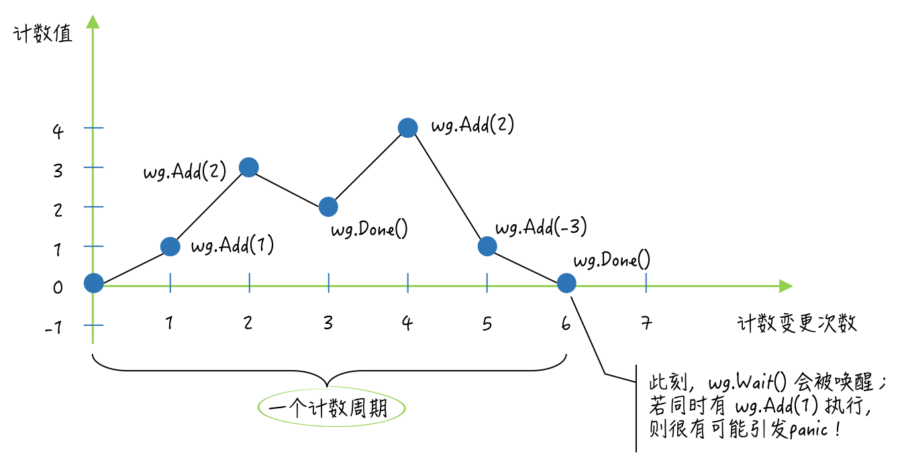

（sync.WaitGroup 的计数周期）

因此，也可以说，如果一个此类值的Wait方法在它的某个计数周期中被调用，那么就会立即阻塞当前的 goroutine，直至这个计数周期完成。在这种情况下，该值的下一个计数周期，必须要等到这个Wait方法执行结束之后，才能够开始。

如果在一个此类值的Wait方法被执行期间，跨越了两个计数周期，**那么就会引发一个 panic。**

例如，在当前的 goroutine 因调用此类值的Wait方法，而被阻塞的时候，另一个 goroutine 调用了该值的Done方法，并使其计数器的值变为了0。

这会唤醒当前的 goroutine，并使它试图继续执行Wait方法中其余的代码。但在这时，又有一个 goroutine 调用了它的Add方法，并让其计数器的值又从0变为了某个正整数。**此时，这里的Wait方法就会立即抛出一个 panic。**

纵观上述会引发 panic 的后两种情况，我们可以总结出这样一条关于WaitGroup值的使用禁忌，即：**不要把增加其计数器值的操作和调用其Wait方法的代码，放在不同的 goroutine 中执行。换句话说，要杜绝对同一个WaitGroup值的两种操作的并发执行。**

除了第一种情况外，我们通常需要反复地实验，才能够让WaitGroup值的方法抛出 panic。再次强调，虽然这不是每次都发生，但是在长期运行的程序中，这种情况发生的概率还是不小的，我们必须要重视它们。

如果你对复现这些异常情况感兴趣，那么可以参看sync代码包中的 waitgroup_test.go 文件。其中的名称以TestWaitGroupMisuse为前缀的测试函数，很好地展示了这些异常情况的发生条件。你可以模仿这些测试函数自己写一些测试代码，执行一下试试看。

### 知识扩展

#### 问题：sync.Once类型值的Do方法是怎么保证只执行参数函数一次的？

与sync.WaitGroup类型一样，sync.Once类型（以下简称Once类型）也属于结构体类型，同样也是开箱即用和并发安全的。由于这个类型中包含了一个sync.Mutex类型的字段，所以，复制该类型的值也会导致功能的失效。

Once类型的Do方法只接受一个参数，这个参数的类型必须是func()，即：无参数声明和结果声明的函数。

该方法的功能并不是对每一种参数函数都只执行一次，而是只执行“首次被调用时传入的”那个函数，并且之后不会再执行任何参数函数。

所以，如果你有多个只需要执行一次的函数，那么就应该为它们中的每一个都分配一个sync.Once类型的值（以下简称Once值）。

Once类型中还有一个名叫done的uint32类型的字段。它的作用是记录其所属值的Do方法被调用的次数。不过，该字段的值只可能是0或者1。一旦Do方法的首次调用完成，它的值就会从0变为1。

你可能会问，既然done字段的值不是0就是1，那为什么还要使用需要四个字节的uint32类型呢？

原因很简单，因为对它的操作必须是“原子”的。Do方法在一开始就会通过调用atomic.LoadUint32函数来获取该字段的值，并且一旦发现该值为1，就会直接返回。这也初步保证了“Do方法，只会执行首次被调用时传入的函数”。

不过，单凭这样一个判断的保证是不够的。因为，如果有两个 goroutine 都调用了同一个新的Once值的Do方法，并且几乎同时执行到了其中的这个条件判断代码，那么它们就都会因判断结果为false，而继续执行Do方法中剩余的代码。

在这个条件判断之后，Do方法会立即锁定其所属值中的那个sync.Mutex类型的字段m。然后，它会在临界区中再次检查done字段的值，并且仅在条件满足时，才会去调用参数函数，以及用原子操作把done的值变为1。

如果你熟悉 GoF 设计模式中的单例模式的话，那么肯定能看出来，这个Do方法的实现方式，与那个单例模式有很多相似之处。它们都会先在临界区之外，判断一次关键条件，若条件不满足则立即返回。这通常被称为 **“快路径”，或者叫做“快速失败路径”。**

如果条件满足，那么到了临界区中还要再对关键条件进行一次判断，这主要是为了更加严谨。这两次条件判断常被统称为（跨临界区的）“双重检查”。

由于进入临界区之前，肯定要锁定保护它的互斥锁m，显然会降低代码的执行速度，所以其中的第二次条件判断，以及后续的操作就被称为“慢路径”或者“常规路径”。

别看Do方法中的代码不多，但它却应用了一个很经典的编程范式。我们在 Go 语言及其标准库中，还能看到不少这个经典范式及它衍生版本的应用案例。

**下面我再来说说这个Do方法在功能方面的两个特点。**

**第一个特点**，由于Do方法只会在参数函数执行结束之后把done字段的值变为1，因此，如果参数函数的执行需要很长时间或者根本就不会结束（比如执行一些守护任务），那么就有可能会导致相关 goroutine 的同时阻塞。

例如，有多个 goroutine 并发地调用了同一个Once值的Do方法，并且传入的函数都会一直执行而不结束。那么，这些 goroutine 就都会因调用了这个Do方法而阻塞。因为，除了那个抢先执行了参数函数的 goroutine 之外，其他的 goroutine 都会被阻塞在锁定该Once值的互斥锁m的那行代码上。

**第二个特点**，Do方法在参数函数执行结束后，对done字段的赋值用的是原子操作，并且，这一操作是被挂在defer语句中的。因此，不论参数函数的执行会以怎样的方式结束，done字段的值都会变为1。

也就是说，即使这个参数函数没有执行成功（比如引发了一个 panic），我们也无法使用同一个Once值重新执行它了。所以，如果你需要为参数函数的执行设定重试机制，那么就要考虑Once值的适时替换问题。

在很多时候，我们需要依据Do方法的这两个特点来设计与之相关的流程，以避免不必要的程序阻塞和功能缺失。

```go
package main

import (
	"errors"
	"fmt"
	"sync"
	"sync/atomic"
	"time"
)

func main() {
	// 示例1。
	var counter uint32
	var once sync.Once
	once.Do(func() {
		atomic.AddUint32(&counter, 1)
	})
	fmt.Printf("The counter: %d\n", counter)
	once.Do(func() {
		atomic.AddUint32(&counter, 2)
	})
	fmt.Printf("The counter: %d\n", counter)
	fmt.Println()

	// 示例2。
	once = sync.Once{}
	var wg sync.WaitGroup
	wg.Add(3)
	go func() {
		defer wg.Done()
		once.Do(func() {
			for i := 0; i < 3; i++ {
				fmt.Printf("Do task. [1-%d]\n", i)
				time.Sleep(time.Second)
			}
		})
		fmt.Println("Done. [1]")
	}()
	go func() {
		defer wg.Done()
		time.Sleep(time.Millisecond * 500)
		once.Do(func() {
			fmt.Println("Do task. [2]")
		})
		fmt.Println("Done. [2]")
	}()
	go func() {
		defer wg.Done()
		time.Sleep(time.Millisecond * 500)
		once.Do(func() {
			fmt.Println("Do task. [3]")
		})
		fmt.Println("Done. [3]")
	}()
	wg.Wait()
	fmt.Println()

	// 示例3。
	once = sync.Once{}
	wg.Add(2)
	go func() {
		defer wg.Done()
		defer func() {
			if p := recover(); p != nil {
				fmt.Printf("fatal error: %v\n", p)
			}
		}()
		once.Do(func() {
			fmt.Println("Do task. [4]")
			panic(errors.New("something wrong"))
			//fmt.Println("Done. [4]")
		})
	}()
	go func() {
		defer wg.Done()
		time.Sleep(time.Millisecond * 500)
		once.Do(func() {
			fmt.Println("Do task. [5]")
		})
		fmt.Println("Done. [5]")
	}()
	wg.Wait()
}
```

### 总结

sync代码包的WaitGroup类型和Once类型都是非常易用的同步工具。它们都是开箱即用和并发安全的。

利用WaitGroup值，我们可以很方便地实现一对多的 goroutine 协作流程，即：一个分发子任务的 goroutine，和多个执行子任务的 goroutine，共同来完成一个较大的任务。

在使用WaitGroup值的时候，我们一定要注意，千万不要让其中的计数器的值小于0，否则就会引发 panic。

另外，**我们最好用“先统一Add，再并发Done，最后Wait”这种标准方式，来使用WaitGroup值。** 尤其不要在调用Wait方法的同时，并发地通过调用Add方法去增加其计数器的值，因为这也有可能引发 panic。

Once值的使用方式比WaitGroup值更加简单，它只有一个Do方法。同一个Once值的Do方法，永远只会执行第一次被调用时传入的参数函数，不论这个函数的执行会以怎样的方式结束。

只要传入某个Do方法的参数函数没有结束执行，任何之后调用该方法的 goroutine 就都会被阻塞。只有在这个参数函数执行结束以后，那些 goroutine 才会逐一被唤醒。

Once类型使用互斥锁和原子操作实现了功能，而WaitGroup类型中只用到了原子操作。 所以可以说，它们都是更高层次的同步工具。它们都基于基本的通用工具，实现了某一种特定的功能。sync包中的其他高级同步工具，其实也都是这样的。

### 思考题

今天的思考题是：在使用WaitGroup值实现一对多的 goroutine 协作流程时，怎样才能让分发子任务的 goroutine 获得各个子任务的具体执行结果？

## 32 | context.Context类型

我们在上篇文章中讲到了sync.WaitGroup类型：一个可以帮我们实现一对多 goroutine 协作流程的同步工具。

**在使用WaitGroup值的时候，我们最好用“先统一Add，再并发Done，最后Wait”的标准模式来构建协作流程。**

如果在调用该值的Wait方法的同时，为了增大其计数器的值，而并发地调用该值的Add方法，那么就很可能会引发 panic。

这就带来了一个问题，如果我们不能在一开始就确定执行子任务的 goroutine 的数量，那么使用WaitGroup值来协调它们和分发子任务的 goroutine，就是有一定风险的。一个解决方案是：分批地启用执行子任务的 goroutine。

### 前导内容：WaitGroup 值补充知识

我们都知道，WaitGroup值是可以被复用的，但需要保证其计数周期的完整性。尤其是涉及对其Wait方法调用的时候，它的下一个计数周期必须要等到，与当前计数周期对应的那个Wait方法调用完成之后，才能够开始。

我在前面提到的可能会引发 panic 的情况，就是由于没有遵循这条规则而导致的。

只要我们在严格遵循上述规则的前提下，分批地启用执行子任务的 goroutine，就肯定不会有问题。具体的实现方式有不少，其中最简单的方式就是使用for循环来作为辅助。这里的代码如下：

```go
func coordinateWithWaitGroup() {
 total := 12
 stride := 3
 var num int32
 fmt.Printf("The number: %d [with sync.WaitGroup]\n", num)
 var wg sync.WaitGroup
 for i := 1; i <= total; i = i + stride {
  wg.Add(stride)
  for j := 0; j < stride; j++ {
   go addNum(&num, i+j, wg.Done)
  }
  wg.Wait()
 }
 fmt.Println("End.")
}
```

这里展示的coordinateWithWaitGroup函数，就是上一篇文章中同名函数的改造版本。而其中调用的addNum函数，则是上一篇文章中同名函数的简化版本。这两个函数都已被放置在了 demo67.go 文件中。

```go
package main

import (
	"fmt"
	"sync"
	"sync/atomic"
	"time"
)

func main() {
	coordinateWithWaitGroup()
}

func coordinateWithWaitGroup() {
	total := 12
	stride := 3
	var num int32
	fmt.Printf("The number: %d [with sync.WaitGroup]\n", num)
	var wg sync.WaitGroup
	//fmt.Println("Start loop ...")
	for i := 1; i <= total; i = i + stride {
		//if i > 1 {
		//	fmt.Println("Next iteration:")
		//}
		wg.Add(stride)
		for j := 0; j < stride; j++ {
			go addNum(&num, i+j, wg.Done)
		}
		wg.Wait()
	}
	fmt.Println("End.")
}

// addNum 用于原子地增加一次numP所指的变量的值。
func addNum(numP *int32, id int, deferFunc func()) {
	defer func() {
		deferFunc()
	}()
	for i := 0; ; i++ {
		currNum := atomic.LoadInt32(numP)
		newNum := currNum + 1
		time.Sleep(time.Millisecond * 200)
		if atomic.CompareAndSwapInt32(numP, currNum, newNum) {
			fmt.Printf("The number: %d [%d-%d]\n", newNum, id, i)
			break
		} else {
			//fmt.Printf("The CAS operation failed. [%d-%d]\n", id, i)
		}
	}
}
```

我们可以看到，经过改造后的coordinateWithWaitGroup函数，循环地使用了由变量wg代表的WaitGroup值。它运用的依然是“先统一Add，再并发Done，最后Wait”的这种模式，只不过它利用for语句，对此进行了复用。

好了，至此你应该已经对WaitGroup值的运用有所了解了。不过，我现在想让你使用另一种工具来实现上面的协作流程。

#### 我们今天的问题就是：怎样使用context包中的程序实体，实现一对多的 goroutine 协作流程？

更具体地说，我需要你编写一个名为coordinateWithContext的函数。这个函数应该具有上面coordinateWithWaitGroup函数相同的功能。

显然，你不能再使用sync.WaitGroup了，而要用context包中的函数和Context类型作为实现工具。这里注意一点，是否分批启用执行子任务的 goroutine 其实并不重要。

我在这里给你一个参考答案。

```go
func coordinateWithContext() {
 total := 12
 var num int32
 fmt.Printf("The number: %d [with context.Context]\n", num)
 cxt, cancelFunc := context.WithCancel(context.Background())
 for i := 1; i <= total; i++ {
  go addNum(&num, i, func() {
   if atomic.LoadInt32(&num) == int32(total) {
    cancelFunc()
   }
  })
 }
 <-cxt.Done()
 fmt.Println("End.")
}
```

在这个函数体中，我先后调用了context.Background函数和context.WithCancel函数，并得到了一个可撤销的context.Context类型的值（由变量cxt代表），以及一个context.CancelFunc类型的撤销函数（由变量cancelFunc代表）。

在后面那条唯一的for语句中，我在每次迭代中都通过一条go语句，异步地调用addNum函数，调用的总次数只依据了total变量的值。

请注意我给予addNum函数的最后一个参数值。它是一个匿名函数，其中只包含了一条if语句。这条if语句会“原子地”加载num变量的值，并判断它是否等于total变量的值。

如果两个值相等，那么就调用cancelFunc函数。其含义是，如果所有的addNum函数都执行完毕，那么就立即通知分发子任务的 goroutine。

这里分发子任务的 goroutine，即为执行coordinateWithContext函数的 goroutine。它在执行完for语句后，会立即调用cxt变量的Done函数，并试图针对该函数返回的通道，进行接收操作。

由于一旦cancelFunc函数被调用，针对该通道的接收操作就会马上结束，所以，这样做就可以实现“等待所有的addNum函数都执行完毕”的功能。

### 问题解析

context.Context类型（以下简称Context类型）是在 Go 1.7 发布时才被加入到标准库的。而后，标准库中的很多其他代码包都为了支持它而进行了扩展，包括：os/exec包、net包、database/sql包，以及runtime/pprof包和runtime/trace包，等等。

Context类型之所以受到了标准库中众多代码包的积极支持，主要是因为它是一种非常通用的同步工具。它的值不但可以被任意地扩散，而且还可以被用来传递额外的信息和信号。

更具体地说，Context类型可以提供一类代表上下文的值。此类值是并发安全的，也就是说它可以被传播给多个 goroutine。

由于Context类型实际上是一个接口类型，而context包中实现该接口的所有私有类型，都是基于某个数据类型的指针类型，所以，如此传播并不会影响该类型值的功能和安全。

Context类型的值（以下简称Context值）是可以繁衍的，这意味着我们可以通过一个Context值产生出任意个子值。这些子值可以携带其父值的属性和数据，也可以响应我们通过其父值传达的信号。

正因为如此，所有的Context值共同构成了一颗代表了上下文全貌的树形结构。这棵树的树根（或者称上下文根节点）是一个已经在context包中预定义好的Context值，它是全局唯一的。通过调用context.Background函数，我们就可以获取到它（我在coordinateWithContext函数中就是这么做的）。

这里注意一下，这个上下文根节点仅仅是一个最基本的支点，它不提供任何额外的功能。也就是说，它既不可以被撤销（cancel），也不能携带任何数据。

除此之外，context包中还包含了四个用于繁衍Context值的函数，即：WithCancel、WithDeadline、WithTimeout和WithValue。

这些函数的第一个参数的类型都是context.Context，而名称都为parent。顾名思义，这个位置上的参数对应的都是它们将会产生的Context值的父值。

WithCancel函数用于产生一个可撤销的parent的子值。在coordinateWithContext函数中，我通过调用该函数，获得了一个衍生自上下文根节点的Context值，和一个用于触发撤销信号的函数。

而WithDeadline函数和WithTimeout函数则都可以被用来产生一个会定时撤销的parent的子值。至于WithValue函数，我们可以通过调用它，产生一个会携带额外数据的parent的子值。

到这里，我们已经对context包中的函数和Context类型有了一个基本的认识了。不过这还不够，我们再来扩展一下。

### 知识扩展

##### 问题 1：“可撤销的”在context包中代表着什么？“撤销”一个Context值又意味着什么？

我相信很多初识context包的 Go 程序开发者，都会有这样的疑问。确实，“可撤销的”（cancelable）这个词在这里是比较抽象的，很容易让人迷惑。我这里再来解释一下。

这需要从Context类型的声明讲起。这个接口中有两个方法与“撤销”息息相关。Done方法会返回一个元素类型为struct{}的接收通道。不过，这个接收通道的用途并不是传递元素值，而是让调用方去感知“撤销”当前Context值的那个信号。

一旦当前的Context值被撤销，这里的接收通道就会被立即关闭。我们都知道，对于一个未包含任何元素值的通道来说，它的关闭会使任何针对它的接收操作立即结束。

正因为如此，在coordinateWithContext函数中，基于调用表达式cxt.Done()的接收操作，才能够起到感知撤销信号的作用。

除了让Context值的使用方感知到撤销信号，让它们得到“撤销”的具体原因，有时也是很有必要的。后者即是Context类型的Err方法的作用。该方法的结果是error类型的，并且其值只可能等于context.Canceled变量的值，或者context.DeadlineExceeded变量的值。

前者用于表示手动撤销，而后者则代表：由于我们给定的过期时间已到，而导致的撤销。

你可能已经感觉到了，对于Context值来说，“撤销”这个词如果当名词讲，指的其实就是被用来表达“撤销”状态的信号；如果当动词讲，指的就是对撤销信号的传达；而“可撤销的”指的则是具有传达这种撤销信号的能力。

我在前面讲过，当我们通过调用context.WithCancel函数产生一个可撤销的Context值时，还会获得一个用于触发撤销信号的函数。

通过调用这个函数，我们就可以触发针对这个Context值的撤销信号。一旦触发，撤销信号就会立即被传达给这个Context值，并由它的Done方法的结果值（一个接收通道）表达出来。

撤销函数只负责触发信号，而对应的可撤销的Context值也只负责传达信号，它们都不会去管后边具体的“撤销”操作。实际上，我们的代码可以在感知到撤销信号之后，进行任意的操作，Context值对此并没有任何的约束。

最后，若再深究的话，这里的“撤销”最原始的含义其实就是，终止程序针对某种请求（比如 HTTP 请求）的响应，或者取消对某种指令（比如 SQL 指令）的处理。这也是 Go 语言团队在创建context代码包，和Context类型时的初衷。

如果我们去查看net包和database/sql包的 API 和源码的话，就可以了解它们在这方面的典型应用。

```go
package main

import (
	"context"
	"fmt"
	"sync/atomic"
	"time"
)

func main() {
	coordinateWithContext()
}

func coordinateWithContext() {
	total := 12
	var num int32
	fmt.Printf("The number: %d [with context.Context]\n", num)
	cxt, cancelFunc := context.WithCancel(context.Background())
	for i := 1; i <= total; i++ {
		go addNum(&num, i, func() {
			if atomic.LoadInt32(&num) == int32(total) {
				cancelFunc()
			}
		})
	}
	<-cxt.Done()
	fmt.Println("End.")
}

// addNum 用于原子地增加一次numP所指的变量的值。
func addNum(numP *int32, id int, deferFunc func()) {
	defer func() {
		deferFunc()
	}()
	for i := 0; ; i++ {
		currNum := atomic.LoadInt32(numP)
		newNum := currNum + 1
		time.Sleep(time.Millisecond * 200)
		if atomic.CompareAndSwapInt32(numP, currNum, newNum) {
			fmt.Printf("The number: %d [%d-%d]\n", newNum, id, i)
			break
		} else {
			//fmt.Printf("The CAS operation failed. [%d-%d]\n", id, i)
		}
	}
}
```

#### 问题 2：撤销信号是如何在上下文树中传播的？

我在前面讲了，context包中包含了四个用于繁衍Context值的函数。其中的WithCancel、WithDeadline和WithTimeout都是被用来基于给定的Context值产生可撤销的子值的。

context包的WithCancel函数在被调用后会产生两个结果值。第一个结果值就是那个可撤销的Context值，而第二个结果值则是用于触发撤销信号的函数。

在撤销函数被调用之后，对应的Context值会先关闭它内部的接收通道，也就是它的Done方法会返回的那个通道。

然后，它会向它的所有子值（或者说子节点）传达撤销信号。这些子值会如法炮制，把撤销信号继续传播下去。最后，这个Context值会断开它与其父值之间的关联。

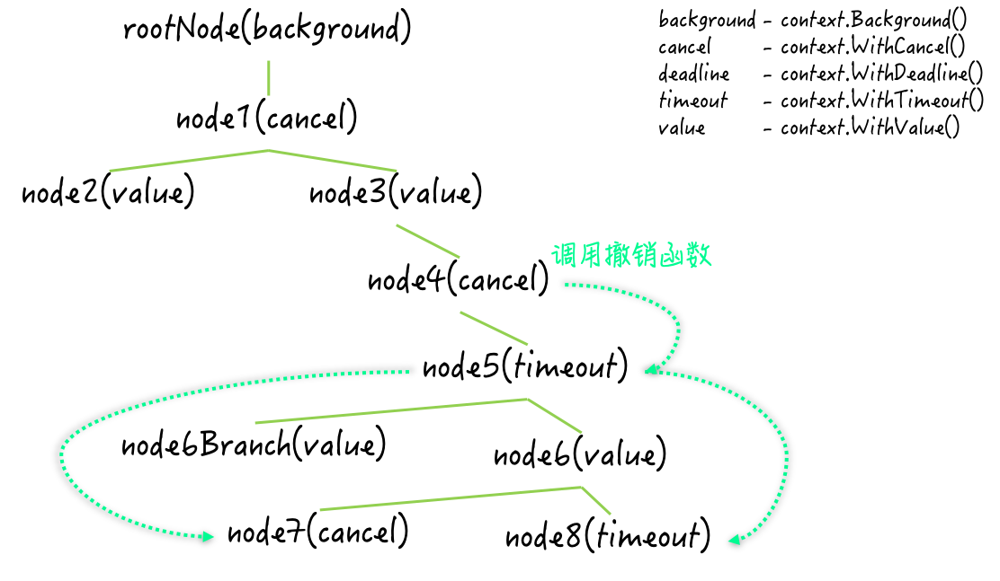

（在上下文树中传播撤销信号）

我们通过调用context包的WithDeadline函数或者WithTimeout函数生成的Context值也是可撤销的。它们不但可以被手动撤销，还会依据在生成时被给定的过期时间，自动地进行定时撤销。这里定时撤销的功能是借助它们内部的计时器来实现的。

当过期时间到达时，这两种Context值的行为与Context值被手动撤销时的行为是几乎一致的，只不过前者会在最后停止并释放掉其内部的计时器。

最后要注意，通过调用context.WithValue函数得到的Context值是不可撤销的。撤销信号在被传播时，若遇到它们则会直接跨过，并试图将信号直接传给它们的子值。

#### 问题 3：怎样通过Context值携带数据？怎样从中获取数据？

既然谈到了context包的WithValue函数，我们就来说说Context值携带数据的方式。

WithValue函数在产生新的Context值（以下简称含数据的Context值）的时候需要三个参数，即：父值、键和值。与“字典对于键的约束”类似，这里键的类型必须是可判等的。

原因很简单，当我们从中获取数据的时候，它需要根据给定的键来查找对应的值。不过，这种Context值并不是用字典来存储键和值的，后两者只是被简单地存储在前者的相应字段中而已。

Context类型的Value方法就是被用来获取数据的。在我们调用含数据的Context值的Value方法时，它会先判断给定的键，是否与当前值中存储的键相等，如果相等就把该值中存储的值直接返回，否则就到其父值中继续查找。

如果其父值中仍然未存储相等的键，那么该方法就会沿着上下文根节点的方向一路查找下去。

注意，除了含数据的Context值以外，其他几种Context值都是无法携带数据的。因此，Context值的Value方法在沿路查找的时候，会直接跨过那几种值。

如果我们调用的Value方法的所属值本身就是不含数据的，那么实际调用的就将会是其父辈或祖辈的Value方法。这是由于这几种Context值的实际类型，都属于结构体类型，并且它们都是通过“将其父值嵌入到自身”，来表达父子关系的。

最后，提醒一下，Context接口并没有提供改变数据的方法。因此，在通常情况下，我们只能通过在上下文树中添加含数据的Context值来存储新的数据，或者通过撤销此种值的父值丢弃掉相应的数据。如果你存储在这里的数据可以从外部改变，那么必须自行保证安全。

```go
package main

import (
	"context"
	"fmt"
	"time"
)

type myKey int

func main() {
	keys := []myKey{
		myKey(20),
		myKey(30),
		myKey(60),
		myKey(61),
	}
	values := []string{
		"value in node2",
		"value in node3",
		"value in node6",
		"value in node6Branch",
	}

	rootNode := context.Background()
	node1, cancelFunc1 := context.WithCancel(rootNode)
	defer cancelFunc1()

	// 示例1。
	node2 := context.WithValue(node1, keys[0], values[0])
	node3 := context.WithValue(node2, keys[1], values[1])
	fmt.Printf("The value of the key %v found in the node3: %v\n",
		keys[0], node3.Value(keys[0]))
	fmt.Printf("The value of the key %v found in the node3: %v\n",
		keys[1], node3.Value(keys[1]))
	fmt.Printf("The value of the key %v found in the node3: %v\n",
		keys[2], node3.Value(keys[2]))
	fmt.Println()

	// 示例2。
	node4, _ := context.WithCancel(node3)
	node5, _ := context.WithTimeout(node4, time.Hour)
	fmt.Printf("The value of the key %v found in the node5: %v\n",
		keys[0], node5.Value(keys[0]))
	fmt.Printf("The value of the key %v found in the node5: %v\n",
		keys[1], node5.Value(keys[1]))
	fmt.Println()

	// 示例3。
	node6 := context.WithValue(node5, keys[2], values[2])
	fmt.Printf("The value of the key %v found in the node6: %v\n",
		keys[0], node6.Value(keys[0]))
	fmt.Printf("The value of the key %v found in the node6: %v\n",
		keys[2], node6.Value(keys[2]))
	fmt.Println()

	// 示例4。
	node6Branch := context.WithValue(node5, keys[3], values[3])
	fmt.Printf("The value of the key %v found in the node6Branch: %v\n",
		keys[1], node6Branch.Value(keys[1]))
	fmt.Printf("The value of the key %v found in the node6Branch: %v\n",
		keys[2], node6Branch.Value(keys[2]))
	fmt.Printf("The value of the key %v found in the node6Branch: %v\n",
		keys[3], node6Branch.Value(keys[3]))
	fmt.Println()

	// 示例5。
	node7, _ := context.WithCancel(node6)
	node8, _ := context.WithTimeout(node7, time.Hour)
	fmt.Printf("The value of the key %v found in the node8: %v\n",
		keys[1], node8.Value(keys[1]))
	fmt.Printf("The value of the key %v found in the node8: %v\n",
		keys[2], node8.Value(keys[2]))
	fmt.Printf("The value of the key %v found in the node8: %v\n",
		keys[3], node8.Value(keys[3]))
}
```

### 总结

我们今天主要讨论的是context包中的函数和Context类型。该包中的函数都是用于产生新的Context类型值的。Context类型是一个可以帮助我们实现多 goroutine 协作流程的同步工具。不但如此，我们还可以通过此类型的值传达撤销信号或传递数据。

Context类型的实际值大体上分为三种，即：根Context值、可撤销的Context值和含数据的Context值。所有的Context值共同构成了一颗上下文树。这棵树的作用域是全局的，而根Context值就是这棵树的根。它是全局唯一的，并且不提供任何额外的功能。

可撤销的Context值又分为：只可手动撤销的Context值，和可以定时撤销的Context值。

我们可以通过生成它们时得到的撤销函数来对其进行手动的撤销。对于后者，定时撤销的时间必须在生成时就完全确定，并且不能更改。不过，我们可以在过期时间达到之前，对其进行手动的撤销。

一旦撤销函数被调用，撤销信号就会立即被传达给对应的Context值，并由该值的Done方法返回的接收通道表达出来。

“撤销”这个操作是Context值能够协调多个 goroutine 的关键所在。撤销信号总是会沿着上下文树叶子节点的方向传播开来。

含数据的Context值可以携带数据。每个值都可以存储一对键和值。在我们调用它的Value方法的时候，它会沿着上下文树的根节点的方向逐个值的进行查找。如果发现相等的键，它就会立即返回对应的值，否则将在最后返回nil。

含数据的Context值不能被撤销，而可撤销的Context值又无法携带数据。但是，由于它们共同组成了一个有机的整体（即上下文树），所以在功能上要比sync.WaitGroup强大得多。

### 思考题

今天的思考题是：Context值在传达撤销信号的时候是广度优先的，还是深度优先的？其优势和劣势都是什么？

## 33 | 临时对象池sync.Pool

到目前为止，我们已经一起学习了 Go 语言标准库中最重要的那几个同步工具，这包括非常经典的互斥锁、读写锁、条件变量和原子操作，以及 Go 语言特有的几个同步工具：

1、sync/atomic.Value

2、sync.Once

3、sync.WaitGroup

4、context.Context

今天，我们来讲 Go 语言标准库中的另一个同步工具：sync.Pool。

sync.Pool类型可以被称为临时对象池，它的值可以被用来存储临时的对象。与 Go 语言的很多同步工具一样，sync.Pool类型也属于结构体类型，它的值在被真正使用之后，就不应该再被复制了。

这里的“临时对象”的意思是：不需要持久使用的某一类值。这类值对于程序来说可有可无，但如果有的话会明显更好。它们的创建和销毁可以在任何时候发生，并且完全不会影响到程序的功能。

同时，它们也应该是无需被区分的，其中的任何一个值都可以代替另一个。如果你的某类值完全满足上述条件，那么你就可以把它们存储到临时对象池中。

你可能已经想到了，我们可以把临时对象池当作针对某种数据的缓存来用。实际上，在我看来，临时对象池最主要的用途就在于此。

sync.Pool类型只有两个方法——Put和Get。Put 用于在当前的池中存放临时对象，它接受一个interface{}类型的参数；而 Get 则被用于从当前的池中获取临时对象，它会返回一个interface{}类型的值。

更具体地说，这个类型的Get方法可能会从当前的池中删除掉任何一个值，然后把这个值作为结果返回。如果此时当前的池中没有任何值，那么这个方法就会使用当前池的New字段创建一个新值，并直接将其返回。

sync.Pool类型的New字段代表着创建临时对象的函数。它的类型是没有参数但有唯一结果的函数类型，即：func() interface{}。

这个函数是Get方法最后的临时对象获取手段。Get方法如果到了最后，仍然无法获取到一个值，那么就会调用该函数。该函数的结果值并不会被存入当前的临时对象池中，而是直接返回给Get方法的调用方。

这里的New字段的实际值需要我们在初始化临时对象池的时候就给定。否则，在我们调用它的Get方法的时候就有可能会得到nil。所以，sync.Pool类型并不是开箱即用的。不过，这个类型也就只有这么一个公开的字段，因此初始化起来也并不麻烦。

举个例子。标准库代码包fmt就使用到了sync.Pool类型。这个包会创建一个用于缓存某类临时对象的sync.Pool类型值，并将这个值赋给一个名为ppFree的变量。这类临时对象可以识别、格式化和暂存需要打印的内容。

```go
var ppFree = sync.Pool{
 New: func() interface{} { return new(pp) },
}
```

临时对象池ppFree的New字段在被调用的时候，总是会返回一个全新的pp类型值的指针（即临时对象）。这就保证了ppFree的Get方法总能返回一个可以包含需要打印内容的值。

pp类型是fmt包中的私有类型，它有很多实现了不同功能的方法。不过，这里的重点是，它的每一个值都是独立的、平等的和可重用的。

更具体地说，这些对象既互不干扰，又不会受到外部状态的影响。它们几乎只针对某个需要打印内容的缓冲区而已。由于fmt包中的代码在真正使用这些临时对象之前，总是会先对其进行重置，所以它们并不在意取到的是哪一个临时对象。这就是临时对象的平等性的具体体现。

另外，这些代码在使用完临时对象之后，都会先抹掉其中已缓冲的内容，然后再把它存放到ppFree中。这样就为重用这类临时对象做好了准备。

众所周知的fmt.Println、fmt.Printf等打印函数都是如此使用ppFree，以及其中的临时对象的。因此，在程序同时执行很多的打印函数调用的时候，ppFree可以及时地把它缓存的临时对象提供给它们，以加快执行的速度。

而当程序在一段时间内不再执行打印函数调用时，ppFree中的临时对象又能够被及时地清理掉，以节省内存空间。

显然，在这个维度上，临时对象池可以帮助程序实现可伸缩性。这就是它的最大价值。

我想，到了这里你已经清楚了临时对象池的基本功能、使用方式、适用场景和存在意义。我们下面来讨论一下它的一些内部机制，这样，我们就可以更好地利用它做更多的事。

首先，我来问你一个问题。这个问题很可能也是你想问的。今天的问题是：为什么说临时对象池中的值会被及时地清理掉？

这里的典型回答是：因为，Go 语言运行时系统中的垃圾回收器，所以在每次开始执行之前，都会对所有已创建的临时对象池中的值进行全面地清除。

### 问题解析

我在前面已经向你讲述了临时对象会在什么时候被创建，下面我再来详细说说它会在什么时候被销毁。

sync包在被初始化的时候，会向 Go 语言运行时系统注册一个函数，这个函数的功能就是清除所有已创建的临时对象池中的值。我们可以把它称为池清理函数。

一旦池清理函数被注册到了 Go 语言运行时系统，后者在每次即将执行垃圾回收时就都会执行前者。

另外，在sync包中还有一个包级私有的全局变量。这个变量代表了当前的程序中使用的所有临时对象池的汇总，它是元素类型为*sync.Pool的切片。我们可以称之为池汇总列表。

通常，在一个临时对象池的Put方法或Get方法第一次被调用的时候，这个池就会被添加到池汇总列表中。正因为如此，池清理函数总是能访问到所有正在被真正使用的临时对象池。

更具体地说，池清理函数会遍历池汇总列表。对于其中的每一个临时对象池，它都会先将池中所有的私有临时对象和共享临时对象列表都置为nil，然后再把这个池中的所有本地池列表都销毁掉。

最后，池清理函数会把池汇总列表重置为空的切片。如此一来，这些池中存储的临时对象就全部被清除干净了。

如果临时对象池以外的代码再无对它们的引用，那么在稍后的垃圾回收过程中，这些临时对象就会被当作垃圾销毁掉，它们占用的内存空间也会被回收以备他用。

以上，就是我对临时对象清理的进一步说明。首先需要记住的是，池清理函数和池汇总列表的含义，以及它们起到的关键作用。一旦理解了这些，那么在有人问到你这个问题的时候，你应该就可以从容地应对了。

不过，我们在这里还碰到了几个新的词，比如：私有临时对象、共享临时对象列表和本地池。这些都代表着什么呢？这就涉及了下面的问题。

### 知识扩展

#### 问题 1：临时对象池存储值所用的数据结构是怎样的？

在临时对象池中，有一个多层的数据结构。正因为有了它的存在，临时对象池才能够非常高效地存储大量的值。

这个数据结构的顶层，我们可以称之为本地池列表，不过更确切地说，它是一个数组。这个列表的长度，总是与 Go 语言调度器中的 P 的数量相同。

还记得吗？Go 语言调度器中的 P 是 processor 的缩写，它指的是一种可以承载若干个 G、且能够使这些 G 适时地与 M 进行对接，并得到真正运行的中介。

这里的 G 正是 goroutine 的缩写，而 M 则是 machine 的缩写，后者指代的是系统级的线程。正因为有了 P 的存在，G 和 M 才能够进行灵活、高效的配对，从而实现强大的并发编程模型。

P 存在的一个很重要的原因是为了分散并发程序的执行压力，而让临时对象池中的本地池列表的长度与 P 的数量相同的主要原因也是分散压力。这里所说的压力包括了存储和性能两个方面。在说明它们之前，我们先来探索一下临时对象池中的那个数据结构。

在本地池列表中的每个本地池都包含了三个字段（或者说组件），它们是：存储私有临时对象的字段private、代表了共享临时对象列表的字段shared，以及一个sync.Mutex类型的嵌入字段。

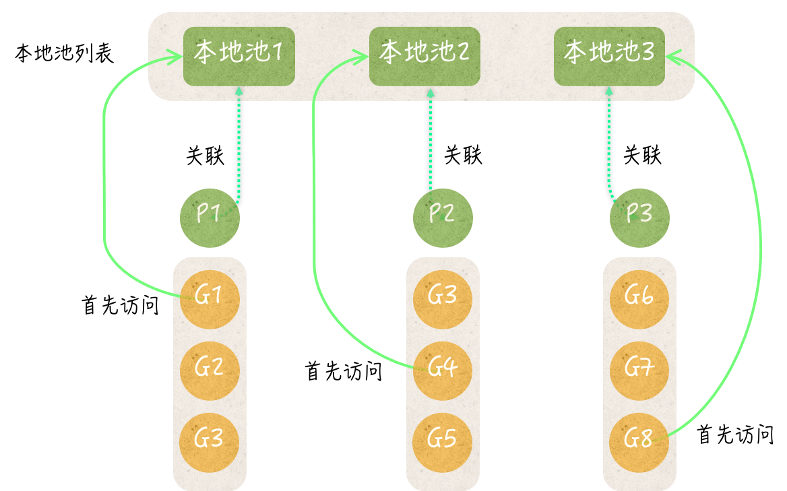

**sync.Pool 中的本地池与各个 G 的对应关系**

实际上，每个本地池都对应着一个 P。我们都知道，一个 goroutine 要想真正运行就必须先与某个 P 产生关联。也就是说，一个正在运行的 goroutine 必然会关联着某个 P。

在程序调用临时对象池的Put方法或Get方法的时候，总会先试图从该临时对象池的本地池列表中，获取与之对应的本地池，依据的就是与当前的 goroutine 关联的那个 P 的 ID。

换句话说，一个临时对象池的Put方法或Get方法会获取到哪一个本地池，完全取决于调用它的代码所在的 goroutine 关联的那个 P。

既然说到了这里，那么紧接着就会有下面这个问题。

#### 问题 2：临时对象池是怎样利用内部数据结构来存取值的？

临时对象池的Put方法总会先试图把新的临时对象，存储到对应的本地池的private字段中，以便在后面获取临时对象的时候，可以快速地拿到一个可用的值。

只有当这个private字段已经存有某个值时，该方法才会去访问本地池的shared字段。

相应的，临时对象池的Get方法，总会先试图从对应的本地池的private字段处获取一个临时对象。只有当这个private字段的值为nil时，它才会去访问本地池的shared字段。

一个本地池的shared字段原则上可以被任何 goroutine 中的代码访问到，不论这个 goroutine 关联的是哪一个 P。这也是我把它叫做共享临时对象列表的原因。

相比之下，一个本地池的private字段，只可能被与之对应的那个 P 所关联的 goroutine 中的代码访问到，所以可以说，它是 P 级私有的。

以临时对象池的Put方法为例，它一旦发现对应的本地池的private字段已存有值，就会去访问这个本地池的shared字段。当然，由于shared字段是共享的，所以此时必须受到互斥锁的保护。

还记得本地池嵌入的那个sync.Mutex类型的字段吗？它就是这里用到的互斥锁，也就是说，本地池本身就拥有互斥锁的功能。Put方法会在互斥锁的保护下，把新的临时对象追加到共享临时对象列表的末尾。

相应的，临时对象池的Get方法在发现对应本地池的private字段未存有值时，也会去访问后者的shared字段。它会在互斥锁的保护下，试图把该共享临时对象列表中的最后一个元素值取出并作为结果。

不过，这里的共享临时对象列表也可能是空的，这可能是由于这个本地池中的所有临时对象都已经被取走了，也可能是当前的临时对象池刚被清理过。

无论原因是什么，Get方法都会去访问当前的临时对象池中的所有本地池，它会去逐个搜索它们的共享临时对象列表。

只要发现某个共享临时对象列表中包含元素值，它就会把该列表的最后一个元素值取出并作为结果返回。

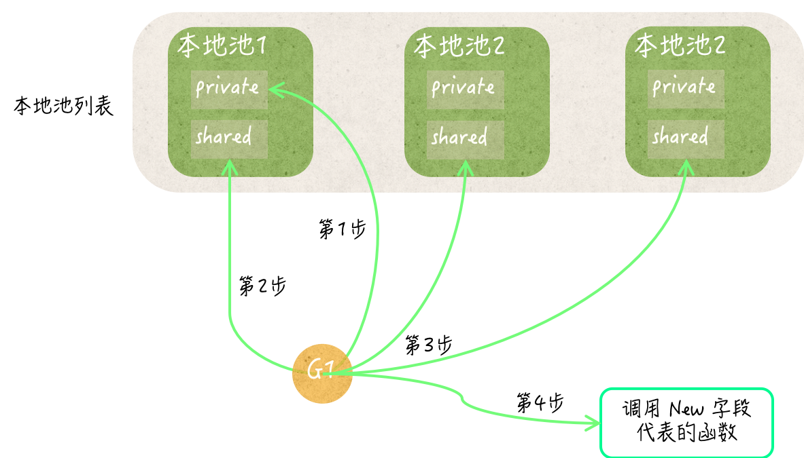

**从 sync.Pool 中获取临时对象的步骤**

当然了，即使这样也可能无法拿到一个可用的临时对象，比如，在所有的临时对象池都刚被大清洗的情况下就会是如此。

这时，Get方法就会使出最后的手段——调用可创建临时对象的那个函数。还记得吗？这个函数是由临时对象池的New字段代表的，并且需要我们在初始化临时对象池的时候给定。如果这个字段的值是nil，那么Get方法此时也只能返回nil了。

以上，就是我对这个问题的较完整回答。

### 总结

今天，我们一起讨论了另一个比较有用的同步工具——sync.Pool类型，它的值被我称为临时对象池。临时对象池有一个New字段，我们在初始化这个池的时候最好给定它。

临时对象池还拥有两个方法，即：Put和Get，它们分别被用于向池中存放临时对象，和从池中获取临时对象。

临时对象池中存储的每一个值都应该是独立的、平等的和可重用的。我们应该既不用关心从池中拿到的是哪一个值，也不用在意这个值是否已经被使用过。

要完全做到这两点，可能会需要我们额外地写一些代码。不过，这个代码量应该是微乎其微的，就像fmt包对临时对象池的用法那样。所以，在选用临时对象池的时候，我们必须要把它将要存储的值的特性考虑在内。

在临时对象池的内部，有一个多层的数据结构支撑着对临时对象的存储。它的顶层是本地池列表，其中包含了与某个 P 对应的那些本地池，并且其长度与 P 的数量总是相同的。

在每个本地池中，都包含一个私有的临时对象和一个共享的临时对象列表。前者只能被其对应的 P 所关联的那个 goroutine 中的代码访问到，而后者却没有这个约束。从另一个角度讲，前者用于临时对象的快速存取，而后者则用于临时对象的池内共享。

正因为有了这样的数据结构，临时对象池才能够有效地分散存储压力和性能压力。同时，又因为临时对象池的Get方法对这个数据结构的妙用，才使得其中的临时对象能够被高效地利用。比如，该方法有时候会从其他的本地池的共享临时对象列表中，“偷取”一个临时对象。

这样的内部结构和存取方式，让临时对象池成为了一个特点鲜明的同步工具。它存储的临时对象都应该是拥有较长生命周期的值，并且，这些值不应该被某个 goroutine 中的代码长期的持有和使用。

因此，临时对象池非常适合用作针对某种数据的缓存。从某种角度讲，临时对象池可以帮助程序实现可伸缩性，这也正是它的最大价值。

### 思考题

今天的思考题是：怎样保证一个临时对象池中总有比较充足的临时对象？

请从临时对象池的初始化和方法调用两个方面作答。必要时可以参考fmt包以及 demo70.go 文件中使用临时对象池的方式。

```go
package main

import (
	"bytes"
	"fmt"
	"io"
	"sync"
)

// bufPool 代表存放数据块缓冲区的临时对象池。
var bufPool sync.Pool

// Buffer 代表了一个简易的数据块缓冲区的接口。
type Buffer interface {
	// Delimiter 用于获取数据块之间的定界符。
	Delimiter() byte
	// Write 用于写一个数据块。
	Write(contents string) (err error)
	// Read 用于读一个数据块。
	Read() (contents string, err error)
	// Free 用于释放当前的缓冲区。
	Free()
}

// myBuffer 代表了数据块缓冲区一种实现。
type myBuffer struct {
	buf       bytes.Buffer
	delimiter byte
}

func (b *myBuffer) Delimiter() byte {
	return b.delimiter
}

func (b *myBuffer) Write(contents string) (err error) {
	if _, err = b.buf.WriteString(contents); err != nil {
		return
	}
	return b.buf.WriteByte(b.delimiter)
}

func (b *myBuffer) Read() (contents string, err error) {
	return b.buf.ReadString(b.delimiter)
}

func (b *myBuffer) Free() {
	bufPool.Put(b)
}

// delimiter 代表预定义的定界符。
var delimiter = byte('\n')

func init() {
	bufPool = sync.Pool{
		New: func() interface{} {
			return &myBuffer{delimiter: delimiter}
		},
	}
}

// GetBuffer 用于获取一个数据块缓冲区。
func GetBuffer() Buffer {
	return bufPool.Get().(Buffer)
}

func main() {
	buf := GetBuffer()
	defer buf.Free()
	buf.Write("A Pool is a set of temporary objects that" +
		"may be individually saved and retrieved.")
	buf.Write("A Pool is safe for use by multiple goroutines simultaneously.")
	buf.Write("A Pool must not be copied after first use.")

	fmt.Println("The data blocks in buffer:")
	for {
		block, err := buf.Read()
		if err != nil {
			if err == io.EOF {
				break
			}
			panic(fmt.Errorf("unexpected error: %s", err))
		}
		fmt.Print(block)
	}
}
```

## 34 | 并发安全字典sync.Map （上）

我们今天再来讲一个并发安全的高级数据结构：sync.Map。众所周知，Go 语言自带的字典类型map并不是并发安全的。

### 前导知识：并发安全字典诞生史

换句话说，在同一时间段内，让不同 goroutine 中的代码，对同一个字典进行读写操作是不安全的。字典值本身可能会因这些操作而产生混乱，相关的程序也可能会因此发生不可预知的问题。

在sync.Map出现之前，我们如果要实现并发安全的字典，就只能自行构建。不过，这其实也不是什么麻烦事，使用 sync.Mutex或sync.RWMutex，再加上原生的map就可以轻松地做到。

GitHub 网站上已经有很多库提供了类似的数据结构。我在《Go 并发编程实战》的第 2 版中也提供了一个比较完整的并发安全字典的实现。它的性能比同类的数据结构还要好一些，因为它在很大程度上有效地避免了对锁的依赖。

尽管已经有了不少的参考实现，Go 语言爱好者们还是希望 Go 语言官方能够发布一个标准的并发安全字典。

经过大家多年的建议和吐槽，Go 语言官方终于在 2017 年发布的 Go 1.9 中，正式加入了并发安全的字典类型sync.Map。

这个字典类型提供了一些常用的键值存取操作方法，并保证了这些操作的并发安全。同时，它的存、取、删等操作都可以基本保证在常数时间内执行完毕。换句话说，它们的算法复杂度与map类型一样都是O(1)的。

在有些时候，与单纯使用原生map和互斥锁的方案相比，使用sync.Map可以显著地减少锁的争用。sync.Map本身虽然也用到了锁，但是，它其实在尽可能地避免使用锁。

我们都知道，使用锁就意味着要把一些并发的操作强制串行化。这往往会降低程序的性能，尤其是在计算机拥有多个 CPU 核心的情况下。

因此，我们常说，能用原子操作就不要用锁，不过这很有局限性，毕竟原子只能对一些基本的数据类型提供支持。

无论在何种场景下使用sync.Map，我们都需要注意，与原生map明显不同，它只是 Go 语言标准库中的一员，而不是语言层面的东西。也正因为这一点，Go 语言的编译器并不会对它的键和值，进行特殊的类型检查。

如果你看过sync.Map的文档或者实际使用过它，那么就一定会知道，它所有的方法涉及的键和值的类型都是interface{}，也就是空接口，这意味着可以包罗万象。所以，我们必须在程序中自行保证它的键类型和值类型的正确性。

好了，现在第一个问题来了。**今天的问题是：并发安全字典对键的类型有要求吗？**

这道题的典型回答是：有要求。键的实际类型不能是函数类型、字典类型和切片类型。

**解析一下这个问题。** 我们都知道，Go 语言的原生字典的键类型不能是函数类型、字典类型和切片类型。

由于并发安全字典内部使用的存储介质正是原生字典，又因为它使用的原生字典键类型也是可以包罗万象的interface{}；所以，我们绝对不能带着任何实际类型为函数类型、字典类型或切片类型的键值去操作并发安全字典。

由于这些键值的实际类型只有在程序运行期间才能够确定，所以 Go 语言编译器是无法在编译期对它们进行检查的，不正确的键值实际类型肯定会引发 panic。

因此，我们在这里首先要做的一件事就是：一定不要违反上述规则。我们应该在每次操作并发安全字典的时候，都去显式地检查键值的实际类型。无论是存、取还是删，都应该如此。

当然，更好的做法是，把针对同一个并发安全字典的这几种操作都集中起来，然后统一地编写检查代码。除此之外，把并发安全字典封装在一个结构体类型中，往往是一个很好的选择。

总之，我们必须保证键的类型是可比较的（或者说可判等的）。如果你实在拿不准，那么可以先通过调用reflect.TypeOf函数得到一个键值对应的反射类型值（即：reflect.Type类型的值），然后再调用这个值的Comparable方法，得到确切的判断结果。

### 知识扩展

#### 问题 1：怎样保证并发安全字典中的键和值的类型正确性？（方案一）

简单地说，可以使用类型断言表达式或者反射操作来保证它们的类型正确性。

为了进一步明确并发安全字典中键值的实际类型，这里大致有两种方案可选。

**第一种方案是，让并发安全字典只能存储某个特定类型的键。**

比如，指定这里的键只能是int类型的，或者只能是字符串，又或是某类结构体。一旦完全确定了键的类型，你就可以在进行存、取、删操作的时候，使用类型断言表达式去对键的类型做检查了。

一般情况下，这种检查并不繁琐。而且，你要是把并发安全字典封装在一个结构体类型里面，那就更加方便了。你这时完全可以让 Go 语言编译器帮助你做类型检查。请看下面的代码：

```go
type IntStrMap struct {
 m sync.Map
}

func (iMap *IntStrMap) Delete(key int) {
 iMap.m.Delete(key)
}

func (iMap *IntStrMap) Load(key int) (value string, ok bool) {
 v, ok := iMap.m.Load(key)
 if v != nil {
  value = v.(string)
 }
 return
}

func (iMap *IntStrMap) LoadOrStore(key int, value string) (actual string, loaded bool) {
 a, loaded := iMap.m.LoadOrStore(key, value)
 actual = a.(string)
 return
}

func (iMap *IntStrMap) Range(f func(key int, value string) bool) {
 f1 := func(key, value interface{}) bool {
  return f(key.(int), value.(string))
 }
 iMap.m.Range(f1)
}

func (iMap *IntStrMap) Store(key int, value string) {
 iMap.m.Store(key, value)
}
```

如上所示，我编写了一个名为IntStrMap的结构体类型，它代表了键类型为int、值类型为string的并发安全字典。在这个结构体类型中，只有一个sync.Map类型的字段m。并且，这个类型拥有的所有方法，都与sync.Map类型的方法非常类似。

两者对应的方法名称完全一致，方法签名也非常相似，只不过，与键和值相关的那些参数和结果的类型不同而已。在IntStrMap类型的方法签名中，明确了键的类型为int，且值的类型为string。

显然，这些方法在接受键和值的时候，就不用再做类型检查了。另外，这些方法在从m中取出键和值的时候，完全不用担心它们的类型会不正确，因为它的正确性在当初存入的时候，就已经由 Go 语言编译器保证了。

稍微总结一下。第一种方案适用于我们可以完全确定键和值的具体类型的情况。在这种情况下，我们可以利用 Go 语言编译器去做类型检查，并用类型断言表达式作为辅助，就像IntStrMap那样。

### 总结

我们今天讨论的是sync.Map类型，它是一种并发安全的字典。它提供了一些常用的键、值存取操作方法，并保证了这些操作的并发安全。同时，它还保证了存、取、删等操作的常数级执行时间。

与原生的字典相同，并发安全字典对键的类型也是有要求的。它们同样不能是函数类型、字典类型和切片类型。

另外，由于并发安全字典提供的方法涉及的键和值的类型都是interface{}，所以我们在调用这些方法的时候，往往还需要对键和值的实际类型进行检查。

这里大致有两个方案。我们今天主要提到了第一种方案，这是在编码时就完全确定键和值的类型，然后利用 Go 语言的编译器帮我们做检查。

在下一次的文章中，我们会提到另外一种方案，并对比这两种方案的优劣。除此之外，我会继续探讨并发安全字典的相关问题。

```go
package main

import (
	"fmt"
	"sync"
)

// ConcurrentMap 代表自制的简易并发安全字典。
type ConcurrentMap struct {
	m  map[interface{}]interface{}
	mu sync.RWMutex
}

func NewConcurrentMap() *ConcurrentMap {
	return &ConcurrentMap{
		m: make(map[interface{}]interface{}),
	}
}

func (cMap *ConcurrentMap) Delete(key interface{}) {
	cMap.mu.Lock()
	defer cMap.mu.Unlock()
	delete(cMap.m, key)
}

func (cMap *ConcurrentMap) Load(key interface{}) (value interface{}, ok bool) {
	cMap.mu.RLock()
	defer cMap.mu.RUnlock()
	value, ok = cMap.m[key]
	return
}

func (cMap *ConcurrentMap) LoadOrStore(key, value interface{}) (actual interface{}, loaded bool) {
	cMap.mu.Lock()
	defer cMap.mu.Unlock()
	actual, loaded = cMap.m[key]
	if loaded {
		return
	}
	cMap.m[key] = value
	actual = value
	return
}

func (cMap *ConcurrentMap) Range(f func(key, value interface{}) bool) {
	cMap.mu.RLock()
	defer cMap.mu.RUnlock()
	for k, v := range cMap.m {
		if !f(k, v) {
			break
		}
	}
}

func (cMap *ConcurrentMap) Store(key, value interface{}) {
	cMap.mu.Lock()
	defer cMap.mu.Unlock()
	cMap.m[key] = value
}

func main() {
	pairs := []struct {
		k int
		v string
	}{
		{k: 1, v: "a"},
		{k: 2, v: "b"},
		{k: 3, v: "c"},
		{k: 4, v: "d"},
	}

	// 示例1。
	{
		cMap := NewConcurrentMap()
		cMap.Store(pairs[0].k, pairs[0].v)
		cMap.Store(pairs[1].k, pairs[1].v)
		cMap.Store(pairs[2].k, pairs[2].v)
		fmt.Println("[Three pairs have been stored in the ConcurrentMap instance]")

		cMap.Range(func(key, value interface{}) bool {
			fmt.Printf("The result of an iteration in Range: %v, %v\n",
				key, value)
			return true
		})

		k0 := pairs[0].k
		v0, ok := cMap.Load(k0)
		fmt.Printf("The result of Load: %v, %v (key: %v)\n",
			v0, ok, k0)

		k3 := pairs[3].k
		v3, ok := cMap.Load(k3)
		fmt.Printf("The result of Load: %v, %v (key: %v)\n",
			v3, ok, k3)

		k2, v2 := pairs[2].k, pairs[2].v
		actual2, loaded2 := cMap.LoadOrStore(k2, v2)
		fmt.Printf("The result of LoadOrStore: %v, %v (key: %v, value: %v)\n",
			actual2, loaded2, k2, v2)
		v3 = pairs[3].v
		actual3, loaded3 := cMap.LoadOrStore(k3, v3)
		fmt.Printf("The result of LoadOrStore: %v, %v (key: %v, value: %v)\n",
			actual3, loaded3, k3, v3)

		k1 := pairs[1].k
		cMap.Delete(k1)
		fmt.Printf("[The pair with the key of %v has been removed from the ConcurrentMap instance]\n",
			k1)
		v1, ok := cMap.Load(k1)
		fmt.Printf("The result of Load: %v, %v (key: %v)\n",
			v1, ok, k1)
		v1 = pairs[1].v
		actual1, loaded1 := cMap.LoadOrStore(k1, v1)
		fmt.Printf("The result of LoadOrStore: %v, %v (key: %v, value: %v)\n",
			actual1, loaded1, k1, v1)

		cMap.Range(func(key, value interface{}) bool {
			fmt.Printf("The result of an iteration in Range: %v, %v\n",
				key, value)
			return true
		})
	}
	fmt.Println()

	// 示例2。
	{
		var sMap sync.Map
		sMap.Store(pairs[0].k, pairs[0].v)
		sMap.Store(pairs[1].k, pairs[1].v)
		sMap.Store(pairs[2].k, pairs[2].v)
		fmt.Println("[Three pairs have been stored in the sync.Map instance]")

		sMap.Range(func(key, value interface{}) bool {
			fmt.Printf("The result of an iteration in Range: %v, %v\n",
				key, value)
			return true
		})

		k0 := pairs[0].k
		v0, ok := sMap.Load(k0)
		fmt.Printf("The result of Load: %v, %v (key: %v)\n",
			v0, ok, k0)

		k3 := pairs[3].k
		v3, ok := sMap.Load(k3)
		fmt.Printf("The result of Load: %v, %v (key: %v)\n",
			v3, ok, k3)

		k2, v2 := pairs[2].k, pairs[2].v
		actual2, loaded2 := sMap.LoadOrStore(k2, v2)
		fmt.Printf("The result of LoadOrStore: %v, %v (key: %v, value: %v)\n",
			actual2, loaded2, k2, v2)
		v3 = pairs[3].v
		actual3, loaded3 := sMap.LoadOrStore(k3, v3)
		fmt.Printf("The result of LoadOrStore: %v, %v (key: %v, value: %v)\n",
			actual3, loaded3, k3, v3)

		k1 := pairs[1].k
		sMap.Delete(k1)
		fmt.Printf("[The pair with the key of %v has been removed from the sync.Map instance]\n",
			k1)
		v1, ok := sMap.Load(k1)
		fmt.Printf("The result of Load: %v, %v (key: %v)\n",
			v1, ok, k1)
		v1 = pairs[1].v
		actual1, loaded1 := sMap.LoadOrStore(k1, v1)
		fmt.Printf("The result of LoadOrStore: %v, %v (key: %v, value: %v)\n",
			actual1, loaded1, k1, v1)

		sMap.Range(func(key, value interface{}) bool {
			fmt.Printf("The result of an iteration in Range: %v, %v\n",
				key, value)
			return true
		})
	}

}
```

## 35 | 并发安全字典sync.Map (下)

我们在上一篇文章中谈到了，由于并发安全字典提供的方法涉及的键和值的类型都是interface{}，所以我们在调用这些方法的时候，往往还需要对键和值的实际类型进行检查。

这里大致有两个方案。我们上一篇文章中提到了第一种方案，在编码时就完全确定键和值的类型，然后利用 Go 语言的编译器帮我们做检查。

这样做很方便，不是吗？不过，虽然方便，但是却让这样的字典类型缺少了一些灵活性。

如果我们还需要一个键类型为uint32并发安全字典的话，那就不得不再如法炮制地写一遍代码了。因此，在需求多样化之后，工作量反而更大，甚至会产生很多雷同的代码。

### 知识扩展

#### 问题 1：怎样保证并发安全字典中的键和值的类型正确性？（方案二）

那么，如果我们既想保持sync.Map类型原有的灵活性，又想约束键和值的类型，那么应该怎样做呢？这就涉及了第二个方案。

**在第二种方案中，我们封装的结构体类型的所有方法，都可以与sync.Map类型的方法完全一致（包括方法名称和方法签名）。**

不过，在这些方法中，我们就需要添加一些做类型检查的代码了。另外，这样并发安全字典的键类型和值类型，必须在初始化的时候就完全确定。并且，这种情况下，我们必须先要保证键的类型是可比较的。

所以在设计这样的结构体类型的时候，只包含sync.Map类型的字段就不够了。

比如：

```go
type ConcurrentMap struct {
 m         sync.Map
 keyType   reflect.Type
 valueType reflect.Type
}
```

这里ConcurrentMap类型代表的是：可自定义键类型和值类型的并发安全字典。这个类型同样有一个sync.Map类型的字段m，代表着其内部使用的并发安全字典。

另外，它的字段keyType和valueType，分别用于保存键类型和值类型。这两个字段的类型都是reflect.Type，我们可称之为反射类型。

这个类型可以代表 Go 语言的任何数据类型。并且，这个类型的值也非常容易获得：通过调用reflect.TypeOf函数并把某个样本值传入即可。

调用表达式reflect.TypeOf(int(123))的结果值，就代表了int类型的反射类型值。

**我们现在来看一看ConcurrentMap类型方法应该怎么写。**

**先说Load方法，**这个方法接受一个interface{}类型的参数key，参数key代表了某个键的值。

因此，当我们根据 ConcurrentMap 在m字段的值中查找键值对的时候，就必须保证 ConcurrentMap 的类型是正确的。由于反射类型值之间可以直接使用操作符==或!=进行判等，所以这里的类型检查代码非常简单。

```go
func (cMap *ConcurrentMap) Load(key interface{}) (value interface{}, ok bool) {
 if reflect.TypeOf(key) != cMap.keyType {
  return
 }
 return cMap.m.Load(key)
}
```

我们把一个接口类型值传入reflect.TypeOf函数，就可以得到与这个值的实际类型对应的反射类型值。

因此，如果参数值的反射类型与keyType字段代表的反射类型不相等，那么我们就忽略后续操作，并直接返回。

这时，Load方法的第一个结果value的值为nil，而第二个结果ok的值为false。这完全符合Load方法原本的含义。

**再来说Store方法。**Store方法接受两个参数key和value，它们的类型也都是interface{}。因此，我们的类型检查应该针对它们来做。

```go
func (cMap *ConcurrentMap) Store(key, value interface{}) {
 if reflect.TypeOf(key) != cMap.keyType {
  panic(fmt.Errorf("wrong key type: %v", reflect.TypeOf(key)))
 }
 if reflect.TypeOf(value) != cMap.valueType {
  panic(fmt.Errorf("wrong value type: %v", reflect.TypeOf(value)))
 }
 cMap.m.Store(key, value)
}
```

这里的类型检查代码与Load方法中的代码很类似，不同的是对检查结果的处理措施。当参数key或value的实际类型不符合要求时，Store方法会立即引发 panic。

这主要是由于Store方法没有结果声明，所以在参数值有问题的时候，它无法通过比较平和的方式告知调用方。不过，这也是符合Store方法的原本含义的。

如果你不想这么做，也是可以的，那么就需要为Store方法添加一个error类型的结果。

并且，在发现参数值类型不正确的时候，让它直接返回相应的error类型值，而不是引发 panic。要知道，这里展示的只一个参考实现，你可以根据实际的应用场景去做优化和改进。

至于与ConcurrentMap类型相关的其他方法和函数，我在这里就不展示了。它们在类型检查方式和处理流程上并没有特别之处。你可以在 demo72.go 文件中看到这些代码。

稍微总结一下。第一种方案适用于我们可以完全确定键和值具体类型的情况。在这种情况下，我们可以利用 Go 语言编译器去做类型检查，并用类型断言表达式作为辅助，就像IntStrMap那样。

在第二种方案中，我们无需在程序运行之前就明确键和值的类型，只要在初始化并发安全字典的时候，动态地给定它们就可以了。这里主要需要用到reflect包中的函数和数据类型，外加一些简单的判等操作。

第一种方案存在一个很明显的缺陷，那就是无法灵活地改变字典的键和值的类型。一旦需求出现多样化，编码的工作量就会随之而来。

第二种方案很好地弥补了这一缺陷，但是，那些反射操作或多或少都会降低程序的性能。我们往往需要根据实际的应用场景，通过严谨且一致的测试，来获得和比较程序的各项指标，并以此作为方案选择的重要依据之一。

#### 问题 2：并发安全字典如何做到尽量避免使用锁？

sync.Map类型在内部使用了大量的原子操作来存取键和值，并使用了两个原生的map作为存储介质。

**其中一个原生map被存在了sync.Map的read字段中，该字段是sync/atomic.Value类型的。** 这个原生字典可以被看作一个快照，它总会在条件满足时，去重新保存所属的sync.Map值中包含的所有键值对。

为了描述方便，我们在后面简称它为只读字典。不过，只读字典虽然不会增减其中的键，但却允许变更其中的键所对应的值。所以，它并不是传统意义上的快照，它的只读特性只是对于其中键的集合而言的。

由read字段的类型可知，sync.Map在替换只读字典的时候根本用不着锁。另外，这个只读字典在存储键值对的时候，还在值之上封装了一层。

它先把值转换为了unsafe.Pointer类型的值，然后再把后者封装，并储存在其中的原生字典中。如此一来，在变更某个键所对应的值的时候，就也可以使用原子操作了。

**sync.Map中的另一个原生字典由它的dirty字段代表。** 它存储键值对的方式与read字段中的原生字典一致，它的键类型也是interface{}，并且同样是把值先做转换和封装后再进行储存的。我们暂且把它称为脏字典。

**注意，脏字典和只读字典如果都存有同一个键值对，那么这里的两个键指的肯定是同一个基本值，对于两个值来说也是如此。**

正如前文所述，这两个字典在存储键和值的时候都只会存入它们的某个指针，而不是基本值。

sync.Map在查找指定的键所对应的值的时候，总会先去只读字典中寻找，并不需要锁定互斥锁。只有当确定“只读字典中没有，但脏字典中可能会有这个键”的时候，它才会在锁的保护下去访问脏字典。

相对应的，sync.Map在存储键值对的时候，只要只读字典中已存有这个键，并且该键值对未被标记为“已删除”，就会把新值存到里面并直接返回，这种情况下也不需要用到锁。

否则，它才会在锁的保护下把键值对存储到脏字典中。这个时候，该键值对的“已删除”标记会被抹去。


**sync.Map 中的 read 与 dirty**

顺便说一句，只有当一个键值对应该被删除，但却仍然存在于只读字典中的时候，才会被用标记为“已删除”的方式进行逻辑删除，而不会直接被物理删除。

这种情况会在重建脏字典以后的一段时间内出现。不过，过不了多久，它们就会被真正删除掉。在查找和遍历键值对的时候，已被逻辑删除的键值对永远会被无视。

对于删除键值对，sync.Map会先去检查只读字典中是否有对应的键。如果没有，脏字典中可能有，那么它就会在锁的保护下，试图从脏字典中删掉该键值对。

最后，sync.Map会把该键值对中指向值的那个指针置为nil，这是另一种逻辑删除的方式。

除此之外，还有一个细节需要注意，只读字典和脏字典之间是会互相转换的。在脏字典中查找键值对次数足够多的时候，sync.Map会把脏字典直接作为只读字典，保存在它的read字段中，然后把代表脏字典的dirty字段的值置为nil。

在这之后，一旦再有新的键值对存入，它就会依据只读字典去重建脏字典。这个时候，它会把只读字典中已被逻辑删除的键值对过滤掉。理所当然，这些转换操作肯定都需要在锁的保护下进行。

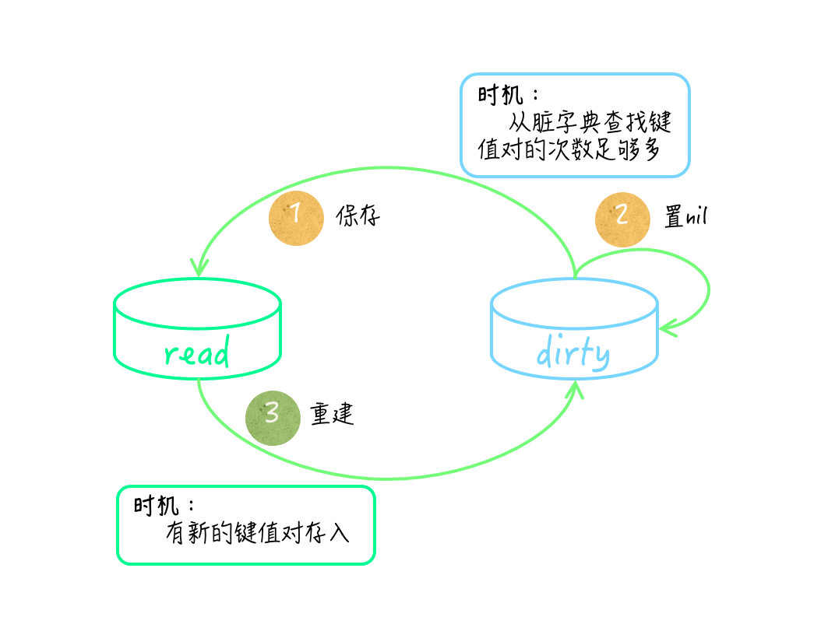

**sync.Map 中 read 与 dirty 的互换**

综上所述，sync.Map的只读字典和脏字典中的键值对集合，并不是实时同步的，它们在某些时间段内可能会有不同。

由于只读字典中键的集合不能被改变，所以其中的键值对有时候可能是不全的。相反，脏字典中的键值对集合总是完全的，并且其中不会包含已被逻辑删除的键值对。

因此，可以看出，在读操作有很多但写操作却很少的情况下，并发安全字典的性能往往会更好。在几个写操作当中，新增键值对的操作对并发安全字典的性能影响是最大的，其次是删除操作，最后才是修改操作。

如果被操作的键值对已经存在于sync.Map的只读字典中，并且没有被逻辑删除，那么修改它并不会使用到锁，对其性能的影响就会很小。

### 总结

这两篇文章中，我们讨论了sync.Map类型，并谈到了怎样保证并发安全字典中的键和值的类型正确性。

为了进一步明确并发安全字典中键值的实际类型，这里大致有两种方案可选。

- 其中一种方案是，在编码时就完全确定键和值的类型，然后利用 Go 语言的编译器帮我们做检查。
- 另一种方案是，接受动态的类型设置，并在程序运行的时候通过反射操作进行检查。

这两种方案各有利弊，前一种方案在扩展性方面有所欠缺，而后一种方案通常会影响到程序的性能。在实际使用的时候，我们一般都需要通过客观的测试来帮助决策。

另外，在有些时候，与单纯使用原生字典和互斥锁的方案相比，使用sync.Map可以显著地减少锁的争用。sync.Map本身确实也用到了锁，但是，它会尽可能地避免使用锁。

可能地避免使用锁。这就要说到sync.Map对其持有两个原生字典的巧妙使用了。这两个原生字典一个被称为只读字典，另一个被称为脏字典。通过对它们的分析，我们知道了并发安全字典的适用场景，以及每种操作对其性能的影响程度。

### 思考题

今天的思考题是：关于保证并发安全字典中的键和值的类型正确性，你还能想到其他的方案吗？

```go
package main

import (
	"errors"
	"fmt"
	"reflect"
	"sync"
)

// IntStrMap 代表键类型为int、值类型为string的并发安全字典。
type IntStrMap struct {
	m sync.Map
}

func (iMap *IntStrMap) Delete(key int) {
	iMap.m.Delete(key)
}

func (iMap *IntStrMap) Load(key int) (value string, ok bool) {
	v, ok := iMap.m.Load(key)
	if v != nil {
		value = v.(string)
	}
	return
}

func (iMap *IntStrMap) LoadOrStore(key int, value string) (actual string, loaded bool) {
	a, loaded := iMap.m.LoadOrStore(key, value)
	actual = a.(string)
	return
}

func (iMap *IntStrMap) Range(f func(key int, value string) bool) {
	f1 := func(key, value interface{}) bool {
		return f(key.(int), value.(string))
	}
	iMap.m.Range(f1)
}

func (iMap *IntStrMap) Store(key int, value string) {
	iMap.m.Store(key, value)
}

// ConcurrentMap 代表可自定义键类型和值类型的并发安全字典。
type ConcurrentMap struct {
	m         sync.Map
	keyType   reflect.Type
	valueType reflect.Type
}

func NewConcurrentMap(keyType, valueType reflect.Type) (*ConcurrentMap, error) {
	if keyType == nil {
		return nil, errors.New("nil key type")
	}
	if !keyType.Comparable() {
		return nil, fmt.Errorf("incomparable key type: %s", keyType)
	}
	if valueType == nil {
		return nil, errors.New("nil value type")
	}
	cMap := &ConcurrentMap{
		keyType:   keyType,
		valueType: valueType,
	}
	return cMap, nil
}

func (cMap *ConcurrentMap) Delete(key interface{}) {
	if reflect.TypeOf(key) != cMap.keyType {
		return
	}
	cMap.m.Delete(key)
}

func (cMap *ConcurrentMap) Load(key interface{}) (value interface{}, ok bool) {
	if reflect.TypeOf(key) != cMap.keyType {
		return
	}
	return cMap.m.Load(key)
}

func (cMap *ConcurrentMap) LoadOrStore(key, value interface{}) (actual interface{}, loaded bool) {
	if reflect.TypeOf(key) != cMap.keyType {
		panic(fmt.Errorf("wrong key type: %v", reflect.TypeOf(key)))
	}
	if reflect.TypeOf(value) != cMap.valueType {
		panic(fmt.Errorf("wrong value type: %v", reflect.TypeOf(value)))
	}
	actual, loaded = cMap.m.LoadOrStore(key, value)
	return
}

func (cMap *ConcurrentMap) Range(f func(key, value interface{}) bool) {
	cMap.m.Range(f)
}

func (cMap *ConcurrentMap) Store(key, value interface{}) {
	if reflect.TypeOf(key) != cMap.keyType {
		panic(fmt.Errorf("wrong key type: %v", reflect.TypeOf(key)))
	}
	if reflect.TypeOf(value) != cMap.valueType {
		panic(fmt.Errorf("wrong value type: %v", reflect.TypeOf(value)))
	}
	cMap.m.Store(key, value)
}

// pairs 代表测试用的键值对列表。
var pairs = []struct {
	k int
	v string
}{
	{k: 1, v: "a"},
	{k: 2, v: "b"},
	{k: 3, v: "c"},
	{k: 4, v: "d"},
}

func main() {
	// 示例1。
	var sMap sync.Map
	//sMap.Store([]int{1, 2, 3}, 4) // 这行代码会引发panic。
	_ = sMap

	// 示例2。
	{
		var iMap IntStrMap
		iMap.Store(pairs[0].k, pairs[0].v)
		iMap.Store(pairs[1].k, pairs[1].v)
		iMap.Store(pairs[2].k, pairs[2].v)
		fmt.Println("[Three pairs have been stored in the IntStrMap instance]")

		iMap.Range(func(key int, value string) bool {
			fmt.Printf("The result of an iteration in Range: %d, %s\n",
				key, value)
			return true
		})

		k0 := pairs[0].k
		v0, ok := iMap.Load(k0)
		fmt.Printf("The result of Load: %v, %v (key: %v)\n",
			v0, ok, k0)

		k3 := pairs[3].k
		v3, ok := iMap.Load(k3)
		fmt.Printf("The result of Load: %v, %v (key: %v)\n",
			v3, ok, k3)

		k2, v2 := pairs[2].k, pairs[2].v
		actual2, loaded2 := iMap.LoadOrStore(k2, v2)
		fmt.Printf("The result of LoadOrStore: %v, %v (key: %v, value: %v)\n",
			actual2, loaded2, k2, v2)
		v3 = pairs[3].v
		actual3, loaded3 := iMap.LoadOrStore(k3, v3)
		fmt.Printf("The result of LoadOrStore: %v, %v (key: %v, value: %v)\n",
			actual3, loaded3, k3, v3)

		k1 := pairs[1].k
		iMap.Delete(k1)
		fmt.Printf("[The pair with the key of %v has been removed from the IntStrMap instance]\n",
			k1)
		v1, ok := iMap.Load(k1)
		fmt.Printf("The result of Load: %v, %v (key: %v)\n",
			v1, ok, k1)
		v1 = pairs[1].v
		actual1, loaded1 := iMap.LoadOrStore(k1, v1)
		fmt.Printf("The result of LoadOrStore: %v, %v (key: %v, value: %v)\n",
			actual1, loaded1, k1, v1)

		iMap.Range(func(key int, value string) bool {
			fmt.Printf("The result of an iteration in Range: %d, %s\n",
				key, value)
			return true
		})
	}
	fmt.Println()

	// 示例2。
	{
		cMap, err := NewConcurrentMap(
			reflect.TypeOf(pairs[0].k), reflect.TypeOf(pairs[0].v))
		if err != nil {
			fmt.Printf("fatal error: %s", err)
			return
		}
		cMap.Store(pairs[0].k, pairs[0].v)
		cMap.Store(pairs[1].k, pairs[1].v)
		cMap.Store(pairs[2].k, pairs[2].v)
		fmt.Println("[Three pairs have been stored in the ConcurrentMap instance]")

		cMap.Range(func(key, value interface{}) bool {
			fmt.Printf("The result of an iteration in Range: %d, %s\n",
				key, value)
			return true
		})

		k0 := pairs[0].k
		v0, ok := cMap.Load(k0)
		fmt.Printf("The result of Load: %v, %v (key: %v)\n",
			v0, ok, k0)

		k3 := pairs[3].k
		v3, ok := cMap.Load(k3)
		fmt.Printf("The result of Load: %v, %v (key: %v)\n",
			v3, ok, k3)

		k2, v2 := pairs[2].k, pairs[2].v
		actual2, loaded2 := cMap.LoadOrStore(k2, v2)
		fmt.Printf("The result of LoadOrStore: %v, %v (key: %v, value: %v)\n",
			actual2, loaded2, k2, v2)
		v3 = pairs[3].v
		actual3, loaded3 := cMap.LoadOrStore(k3, v3)
		fmt.Printf("The result of LoadOrStore: %v, %v (key: %v, value: %v)\n",
			actual3, loaded3, k3, v3)

		k1 := pairs[1].k
		cMap.Delete(k1)
		fmt.Printf("[The pair with the key of %v has been removed from the ConcurrentMap instance]\n",
			k1)
		v1, ok := cMap.Load(k1)
		fmt.Printf("The result of Load: %v, %v (key: %v)\n",
			v1, ok, k1)
		v1 = pairs[1].v
		actual1, loaded1 := cMap.LoadOrStore(k1, v1)
		fmt.Printf("The result of LoadOrStore: %v, %v (key: %v, value: %v)\n",
			actual1, loaded1, k1, v1)

		cMap.Range(func(key, value interface{}) bool {
			fmt.Printf("The result of an iteration in Range: %d, %s\n",
				key, value)
			return true
		})
	}
}
```

## 36 | unicode与字符编码

在开始今天的内容之前，我先来做一个简单的总结。

### Go 语言经典知识总结

在**数据类型**方面有：

- 基于底层数组的切片；
- 用来传递数据的通道；
- 作为一等类型的函数；
- 可实现面向对象的结构体；
- 能无侵入实现的接口等。

在**语法**方面有：

- 异步编程神器go语句；
- 函数的最后关卡defer语句；
- 可做类型判断的switch语句；
- 多通道操作利器select语句；
- 非常有特色的异常处理函数panic和recover。

除了这些，我们还一起讨论了**测试 Go 程序**的主要方式。这涉及了 Go 语言自带的程序测试套件，相关的概念和工具包括：

- 独立的测试源码文件；
- 三种功用不同的测试函数；
- 专用的testing代码包；
- 功能强大的go test命令。

另外，就在前不久，我还为你深入讲解了 Go 语言提供的那些**同步工具**。它们也是 Go 语言并发编程工具箱中不可或缺的一部分。这包括了：

- 经典的互斥锁；
- 读写锁；
- 条件变量；
- 原子操作。

以及 **Go 语言特有的一些数据类型**，即：

- 单次执行小助手sync.Once；
- 临时对象池sync.Pool；
- 帮助我们实现多 goroutine 协作流程的sync.WaitGroup、context.Context；
- 一种高效的并发安全字典sync.Map。

**在后面的日子里，我会与你一起去探究 Go 语言标准库中最常用的那些代码包，弄清它们的用法、了解它们的机理。当然了，我还会顺便讲一讲那些必备的周边知识。**

### 前导内容 1：Go 语言字符编码基础

首先，让我们来关注字符编码方面的问题。这应该是在计算机软件领域中非常基础的一个问题了。

我在前面说过，Go 语言中的标识符可以包含“任何 Unicode 编码可以表示的字母字符”。我还说过，虽然我们可以直接把一个整数值转换为一个string类型的值。

但是，被转换的整数值应该可以代表一个有效的 Unicode 代码点，否则转换的结果就将会是"�"，即：一个仅由高亮的问号组成的字符串值。

另外，当一个string类型的值被转换为[]rune类型值的时候，其中的字符串会被拆分成一个一个的 Unicode 字符。

显然，Go 语言采用的字符编码方案从属于 Unicode 编码规范。更确切地说，Go 语言的代码正是由 Unicode 字符组成的。Go 语言的所有源代码，都必须按照 Unicode 编码规范中的 UTF-8 编码格式进行编码。

换句话说，Go 语言的源码文件必须使用 UTF-8 编码格式进行存储。如果源码文件中出现了非 UTF-8 编码的字符，那么在构建、安装以及运行的时候，go 命令就会报告错误“illegal UTF-8 encoding”。

在这里，我们首先要对 Unicode 编码规范有所了解。不过，在讲述它之前，我先来简要地介绍一下 ASCII 编码。

### 前导内容 2： ASCII 编码

ASCII 是英文“American Standard Code for Information Interchange”的缩写，中文译为美国信息交换标准代码。它是由美国国家标准学会（ANSI）制定的单字节字符编码方案，可用于基于文本的数据交换。

它最初是美国的国家标准，后又被国际标准化组织（ISO）定为国际标准，称为 ISO 646 标准，并适用于所有的拉丁文字字母。ASCII 编码方案使用单个字节（byte）的二进制数来编码一个字符。标准的

ASCII 编码用一个字节的最高比特（bit）位作为奇偶校验位，而扩展的 ASCII 编码则将此位也用于表示字符。ASCII 编码支持的可打印字符和控制字符的集合也被叫做 ASCII 编码集。

我们所说的 Unicode 编码规范，实际上是另一个更加通用的、针对书面字符和文本的字符编码标准。它为世界上现存的所有自然语言中的每一个字符，都设定了一个唯一的二进制编码。

它定义了不同自然语言的文本数据在国际间交换的统一方式，并为全球化软件创建了一个重要的基础。

Unicode 编码规范以 ASCII 编码集为出发点，并突破了 ASCII 只能对拉丁字母进行编码的限制。它不但提供了可以对世界上超过百万的字符进行编码的能力，还支持所有已知的转义序列和控制代码。

我们都知道，在计算机系统的内部，抽象的字符会被编码为整数。这些整数的范围被称为代码空间。在代码空间之内，每一个特定的整数都被称为一个代码点。

一个受支持的抽象字符会被映射并分配给某个特定的代码点，反过来讲，一个代码点总是可以被看成一个被编码的字符。

Unicode 编码规范通常使用十六进制表示法来表示 Unicode 代码点的整数值，并使用“U+”作为前缀。比如，英文字母字符“a”的 Unicode 代码点是 U+0061。在 Unicode 编码规范中，一个字符能且只能由与它对应的那个代码点表示。

Unicode 编码规范现在的最新版本是 11.0，并会于 2019 年 3 月发布 12.0 版本。而 Go 语言从 1.10 版本开始，已经对 Unicode 的 10.0 版本提供了全面的支持。对于绝大多数的应用场景来说，这已经完全够用了。

Unicode 编码规范提供了三种不同的编码格式，即：UTF-8、UTF-16 和 UTF-32。其中的 UTF 是 UCS Transformation Format 的缩写。而 UCS 又是 Universal Character Set 的缩写，但也可以代表 Unicode Character Set。所以，UTF 也可以被翻译为 Unicode 转换格式。它代表的是字符与字节序列之间的转换方式。

在这几种编码格式的名称中，“-”右边的整数的含义是，以多少个比特位作为一个编码单元。以 UTF-8 为例，它会以 8 个比特，也就是一个字节，作为一个编码单元。并且，它与标准的 ASCII 编码是完全兼容的。也就是说，在[0x00, 0x7F]的范围内，这两种编码表示的字符都是相同的。这也是 UTF-8 编码格式的一个巨大优势。

UTF-8 是一种可变宽的编码方案。换句话说，它会用一个或多个字节的二进制数来表示某个字符，最多使用四个字节。比如，对于一个英文字符，它仅用一个字节的二进制数就可以表示，而对于一个中文字符，它需要使用三个字节才能够表示。不论怎样，一个受支持的字符总是可以由 UTF-8 编码为一个字节序列。以下会简称后者为 UTF-8 编码值。

现在，在你初步地了解了这些知识之后，请认真地思考并回答下面的问题。别担心，我会在后面进一步阐述 Unicode、UTF-8 以及 Go 语言对它们的运用。

**问题：一个string类型的值在底层是怎样被表达的？**

**典型回答** 是在底层，一个string类型的值是由一系列相对应的 Unicode 代码点的 UTF-8 编码值来表达的。

### 问题解析

在 Go 语言中，一个string类型的值既可以被拆分为一个包含多个字符的序列，也可以被拆分为一个包含多个字节的序列。

前者可以由一个以rune为元素类型的切片来表示，而后者则可以由一个以byte为元素类型的切片代表。

rune是 Go 语言特有的一个基本数据类型，它的一个值就代表一个字符，即：一个 Unicode 字符。

比如，'G'、'o'、'爱'、'好'、'者'代表的就都是一个 Unicode 字符。

我们已经知道，UTF-8 编码方案会把一个 Unicode 字符编码为一个长度在[1, 4]范围内的字节序列。所以，一个rune类型的值也可以由一个或多个字节来代表。

```
type rune = int32
```

根据rune类型的声明可知，它实际上就是int32类型的一个别名类型。也就是说，一个rune类型的值会由四个字节宽度的空间来存储。它的存储空间总是能够存下一个 UTF-8 编码值。

一个rune类型的值在底层其实就是一个 UTF-8 编码值。前者是（便于我们人类理解的）外部展现，后者是（便于计算机系统理解的）内在表达。

请看下面的代码：

```go
str := "Go爱好者"
fmt.Printf("The string: %q\n", str)
fmt.Printf("  => runes(char): %q\n", []rune(str))
fmt.Printf("  => runes(hex): %x\n", []rune(str))
fmt.Printf("  => bytes(hex): [% x]\n", []byte(str))
```

字符串值"Go爱好者"如果被转换为[]rune类型的值的话，其中的每一个字符（不论是英文字符还是中文字符）就都会独立成为一个rune类型的元素值。因此，这段代码打印出的第二行内容就会如下所示：

```
  => runes(char): ['G' 'o' '爱' '好' '者']
```

又由于，每个rune类型的值在底层都是由一个 UTF-8 编码值来表达的，所以我们可以换一种方式来展现这个字符序列：

```
  => runes(hex): [47 6f 7231 597d 8005]
```

可以看到，五个十六进制数与五个字符相对应。很明显，前两个十六进制数47和6f代表的整数都比较小，它们分别表示字符'G'和'o'。

因为它们都是英文字符，所以对应的 UTF-8 编码值用一个字节表达就足够了。一个字节的编码值被转换为整数之后，不会大到哪里去。

而后三个十六进制数7231、597d和8005都相对较大，它们分别表示中文字符'爱'、'好'和'者'。

这些中文字符对应的 UTF-8 编码值，都需要使用三个字节来表达。所以，这三个数就是把对应的三个字节的编码值，转换为整数后得到的结果。

我们还可以进一步地拆分，把每个字符的 UTF-8 编码值都拆成相应的字节序列。上述代码中的第五行就是这么做的。它会得到如下的输出：

```
  => bytes(hex): [47 6f e7 88 b1 e5 a5 bd e8 80 85]
```

这里得到的字节切片比前面的字符切片明显长了很多。这正是因为一个中文字符的 UTF-8 编码值需要用三个字节来表达。

这个字节切片的前两个元素值与字符切片的前两个元素值是一致的，而在这之后，前者的每三个元素值才对应字符切片中的一个元素值。

注意，对于一个多字节的 UTF-8 编码值来说，我们可以把它当做一个整体转换为单一的整数，也可以先把它拆成字节序列，再把每个字节分别转换为一个整数，从而得到多个整数。

这两种表示法展现出来的内容往往会很不一样。比如，对于中文字符'爱'来说，它的 UTF-8 编码值可以展现为单一的整数7231，也可以展现为三个整数，即：e7、88和b1。


（字符串值的底层表示）

总之，一个string类型的值会由若干个 Unicode 字符组成，每个 Unicode 字符都可以由一个rune类型的值来承载。

这些字符在底层都会被转换为 UTF-8 编码值，而这些 UTF-8 编码值又会以字节序列的形式表达和存储。因此，一个string类型的值在底层就是一个能够表达若干个 UTF-8 编码值的字节序列。

### 知识扩展

#### 问题 1：使用带有range子句的for语句遍历字符串值的时候应该注意什么？

带有range子句的for语句会先把被遍历的字符串值拆成一个字节序列，然后再试图找出这个字节序列中包含的每一个 UTF-8 编码值，或者说每一个 Unicode 字符。

这样的for语句可以为两个迭代变量赋值。如果存在两个迭代变量，那么赋给第一个变量的值，就将会是当前字节序列中的某个 UTF-8 编码值的第一个字节所对应的那个索引值。

而赋给第二个变量的值，则是这个 UTF-8 编码值代表的那个 Unicode 字符，其类型会是rune。

例如，有这么几行代码：

```go
str := "Go爱好者"
for i, c := range str {
 fmt.Printf("%d: %q [% x]\n", i, c, []byte(string(c)))
}
```

这里被遍历的字符串值是"Go爱好者"。在每次迭代的时候，这段代码都会打印出两个迭代变量的值，以及第二个值的字节序列形式。完整的打印内容如下：

```go
0: 'G' [47]
1: 'o' [6f]
2: '爱' [e7 88 b1]
5: '好' [e5 a5 bd]
8: '者' [e8 80 85]
```

第一行内容中的关键信息有0、'G'和[47]。这是由于这个字符串值中的第一个 Unicode 字符是'G'。该字符是一个单字节字符，并且由相应的字节序列中的第一个字节表达。这个字节的十六进制表示为47。

第二行展示的内容与之类似，即：第二个 Unicode 字符是'o'，由字节序列中的第二个字节表达，其十六进制表示为6f。

再往下看，第三行展示的是'爱'，也是第三个 Unicode 字符。因为它是一个中文字符，所以由字节序列中的第三、四、五个字节共同表达，其十六进制表示也不再是单一的整数，而是e7、88和b1组成的序列。

下面要注意了，正是因为'爱'是由三个字节共同表达的，所以第四个 Unicode 字符'好'对应的索引值并不是3，而是2加3后得到的5。

这里的2代表的是'爱'对应的索引值，而3代表的则是'爱'对应的 UTF-8 编码值的宽度。对于这个字符串值中的最后一个字符'者'来说也是类似的，因此，它对应的索引值是8。

由此可以看出，这样的for语句可以逐一地迭代出字符串值里的每个 Unicode 字符。但是，相邻的 Unicode 字符的索引值并不一定是连续的。这取决于前一个 Unicode 字符是否为单字节字符。

正因为如此，如果我们想得到其中某个 Unicode 字符对应的 UTF-8 编码值的宽度，就可以用下一个字符的索引值减去当前字符的索引值。

初学者可能会对for语句的这种行为感到困惑，因为它给予两个迭代变量的值看起来并不总是对应的。不过，一旦我们了解了它的内在机制就会拨云见日、豁然开朗。

### 总结

我们今天把目光聚焦在了 Unicode 编码规范、UTF-8 编码格式，以及 Go 语言对字符串和字符的相关处理方式上。

Go 语言的代码是由 Unicode 字符组成的，它们都必须由 Unicode 编码规范中的 UTF-8 编码格式进行编码并存储，否则就会导致 go 命令的报错。

Unicode 编码规范中的编码格式定义的是：字符与字节序列之间的转换方式。其中的 UTF-8 是一种可变宽的编码方案。

它会用一个或多个字节的二进制数来表示某个字符，最多使用四个字节。一个受支持的字符，总是可以由 UTF-8 编码为一个字节序列，后者也可以被称为 UTF-8 编码值。

Go 语言中的一个string类型值会由若干个 Unicode 字符组成，每个 Unicode 字符都可以由一个rune类型的值来承载。

这些字符在底层都会被转换为 UTF-8 编码值，而这些 UTF-8 编码值又会以字节序列的形式表达和存储。因此，一个string类型的值在底层就是一个能够表达若干个 UTF-8 编码值的字节序列。

初学者可能会对带有range子句的for语句遍历字符串值的行为感到困惑，因为它给予两个迭代变量的值看起来并不总是对应的。但事实并非如此。

这样的for语句会先把被遍历的字符串值拆成一个字节序列，然后再试图找出这个字节序列中包含的每一个 UTF-8 编码值，或者说每一个 Unicode 字符。

相邻的 Unicode 字符的索引值并不一定是连续的。这取决于前一个 Unicode 字符是否为单字节字符。一旦我们清楚了这些内在机制就不会再困惑了。

对于 Go 语言来说，Unicode 编码规范和 UTF-8 编码格式算是基础之一了。我们应该了解到它们对 Go 语言的重要性。这对于正确理解 Go 语言中的相关数据类型以及日后的相关程序编写都会很有好处。

### 思考题

今天的思考题是：判断一个 Unicode 字符是否为单字节字符通常有几种方式？

## 37 | strings包与字符串操作

Go 语言不但拥有可以独立代表 Unicode 字符的类型rune，而且还有可以对字符串值进行 Unicode 字符拆分的for语句。

除此之外，标准库中的unicode包及其子包还提供了很多的函数和数据类型，可以帮助我们解析各种内容中的 Unicode 字符。

这些程序实体都很好用，也都很简单明了，而且有效地隐藏了 Unicode 编码规范中的一些复杂的细节。我就不在这里对它们进行专门的讲解了。

我们今天主要来说一说标准库中的strings代码包。这个代码包也用到了不少unicode包和unicode/utf8包中的程序实体。

- 比如，strings.Builder类型的WriteRune方法。
- 又比如，strings.Reader类型的ReadRune方法，等等。

下面这个问题就是针对strings.Builder类型的。**我们今天的问题是：与string值相比，strings.Builder类型的值有哪些优势？**

这里的**典型回答**是这样的。

strings.Builder类型的值（以下简称Builder值）的优势有下面的三种：

- 已存在的内容不可变，但可以拼接更多的内容；
- 减少了内存分配和内容拷贝的次数；
- 可将内容重置，可重用值。

### 问题解析

**先来说说string类型。** 我们都知道，在 Go 语言中，string类型的值是不可变的。 如果我们想获得一个不一样的字符串，那么就只能基于原字符串进行裁剪、拼接等操作，从而生成一个新的字符串。

- 裁剪操作可以使用切片表达式；
- 拼接操作可以用操作符+实现。

在底层，一个string值的内容会被存储到一块连续的内存空间中。同时，这块内存容纳的字节数量也会被记录下来，并用于表示该string值的长度。

你可以把这块内存的内容看成一个字节数组，而相应的string值则包含了指向字节数组头部的指针值。如此一来，我们在一个string值上应用切片表达式，就相当于在对其底层的字节数组做切片。

另外，我们在进行字符串拼接的时候，Go 语言会把所有被拼接的字符串依次拷贝到一个崭新且足够大的连续内存空间中，并把持有相应指针值的string值作为结果返回。

显然，当程序中存在过多的字符串拼接操作的时候，会对内存的分配产生非常大的压力。

注意，虽然string值在内部持有一个指针值，但其类型仍然属于值类型。不过，由于string值的不可变，其中的指针值也为内存空间的节省做出了贡献。

更具体地说，一个string值会在底层与它的所有副本共用同一个字节数组。由于这里的字节数组永远不会被改变，所以这样做是绝对安全的。

**与string值相比，Builder值的优势其实主要体现在字符串拼接方面。**

Builder值中有一个用于承载内容的容器（以下简称内容容器）。它是一个以byte为元素类型的切片（以下简称字节切片）。

由于这样的字节切片的底层数组就是一个字节数组，所以我们可以说它与string值存储内容的方式是一样的。

实际上，它们都是通过一个unsafe.Pointer类型的字段来持有那个指向了底层字节数组的指针值的。

正是因为这样的内部构造，Builder值同样拥有高效利用内存的前提条件。虽然，对于字节切片本身来说，它包含的任何元素值都可以被修改，但是Builder值并不允许这样做，其中的内容只能够被拼接或者完全重置。

这就意味着，已存在于Builder值中的内容是不可变的。因此，我们可以利用Builder值提供的方法拼接更多的内容，而丝毫不用担心这些方法会影响到已存在的内容。

这里所说的方法指的是，Builder值拥有的一系列指针方法，包括：Write、WriteByte、WriteRune和WriteString。我们可以把它们统称为拼接方法。

我们可以通过调用上述方法把新的内容拼接到已存在的内容的尾部（也就是右边）。这时，如有必要，Builder值会自动地对自身的内容容器进行扩容。这里的自动扩容策略与切片的扩容策略一致。

换句话说，我们在向Builder值拼接内容的时候并不一定会引起扩容。只要内容容器的容量够用，扩容就不会进行，针对于此的内存分配也不会发生。同时，只要没有扩容，Builder值中已存在的内容就不会再被拷贝。

除了Builder值的自动扩容，我们还可以选择手动扩容，这通过调用Builder值的Grow方法就可以做到。Grow方法也可以被称为扩容方法，它接受一个int类型的参数n，该参数用于代表将要扩充的字节数量。

如有必要，Grow方法会把其所属值中内容容器的容量增加n个字节。更具体地讲，它会生成一个字节切片作为新的内容容器，该切片的容量会是原容器容量的二倍再加上n。之后，它会把原容器中的所有字节全部拷贝到新容器中。

```go
var builder1 strings.Builder
// 省略若干代码。
fmt.Println("Grow the builder ...")
builder1.Grow(10)
fmt.Printf("The length of contents in the builder is %d.\n", builder1.Len())
```

当然，Grow方法还可能什么都不做。这种情况的前提条件是：当前的内容容器中的未用容量已经够用了，即：未用容量大于或等于n。这里的前提条件与前面提到的自动扩容策略中的前提条件是类似的。

```go
fmt.Println("Reset the builder ...")
builder1.Reset()
fmt.Printf("The third output(%d):\n%q\n", builder1.Len(), builder1.String())
```

最后，Builder值是可以被重用的。通过调用它的Reset方法，我们可以让Builder值重新回到零值状态，就像它从未被使用过那样。

一旦被重用，Builder值中原有的内容容器会被直接丢弃。之后，它和其中的所有内容，将会被 Go 语言的垃圾回收器标记并回收掉。

```go
package main

import (
	"fmt"
	"strings"
)

func main() {
	// 示例1。
	var builder1 strings.Builder
	builder1.WriteString("A Builder is used to efficiently build a string using Write methods.")
	fmt.Printf("The first output(%d):\n%q\n", builder1.Len(), builder1.String())
	fmt.Println()
	builder1.WriteByte(' ')
	builder1.WriteString("It minimizes memory copying. The zero value is ready to use.")
	builder1.Write([]byte{'\n', '\n'})
	builder1.WriteString("Do not copy a non-zero Builder.")
	fmt.Printf("The second output(%d):\n\"%s\"\n", builder1.Len(), builder1.String())
	fmt.Println()

	// 示例2。
	fmt.Println("Grow the builder ...")
	builder1.Grow(10)
	fmt.Printf("The length of contents in the builder is %d.\n", builder1.Len())
	fmt.Println()

	// 示例3。
	fmt.Println("Reset the builder ...")
	builder1.Reset()
	fmt.Printf("The third output(%d):\n%q\n", builder1.Len(), builder1.String())
}
```

### 知识扩展

#### 问题 1：strings.Builder类型在使用上有约束吗？

答案是：有约束，概括如下：

- 在已被真正使用后就不可再被复制；
- 由于其内容不是完全不可变的，所以需要使用方自行解决操作冲突和并发安全问题。

我们只要调用了Builder值的拼接方法或扩容方法，就意味着开始真正使用它了。显而易见，这些方法都会改变其所属值中的内容容器的状态。

一旦调用了它们，我们就不能再以任何的方式对其所属值进行复制了。否则，只要在任何副本上调用上述方法就都会引发 panic。

这种 panic 会告诉我们，这样的使用方式是并不合法的，因为这里的Builder值是副本而不是原值。顺便说一句，这里所说的复制方式，包括但不限于在函数间传递值、通过通道传递值、把值赋予变量等等。

```go
var builder1 strings.Builder
builder1.Grow(1)
builder3 := builder1
//builder3.Grow(1) // 这里会引发panic。
_ = builder3
```

虽然这个约束非常严格，但是如果我们仔细思考一下的话，就会发现它还是有好处的。

正是由于已使用的Builder值不能再被复制，所以肯定不会出现多个Builder值中的内容容器（也就是那个字节切片）共用一个底层字节数组的情况。这样也就避免了多个同源的Builder值在拼接内容时可能产生的冲突问题。

不过，虽然已使用的Builder值不能再被复制，但是它的指针值却可以。无论什么时候，我们都可以通过任何方式复制这样的指针值。注意，这样的指针值指向的都会是同一个Builder值。

```go
f2 := func(bp *strings.Builder) {
 (*bp).Grow(1) // 这里虽然不会引发panic，但不是并发安全的。
 builder4 := *bp
 //builder4.Grow(1) // 这里会引发panic。
 _ = builder4
}
f2(&builder1)
```

正因为如此，这里就产生了一个问题，即：如果Builder值被多方同时操作，那么其中的内容就很可能会产生混乱。这就是我们所说的操作冲突和并发安全问题。

Builder值自己是无法解决这些问题的。所以，我们在通过传递其指针值共享Builder值的时候，一定要确保各方对它的使用是正确、有序的，并且是并发安全的；而最彻底的解决方案是，绝不共享Builder值以及它的指针值。

我们可以在各处分别声明一个Builder值来使用，也可以先声明一个Builder值，然后在真正使用它之前，便将它的副本传到各处。另外，我们还可以先使用再传递，只要在传递之前调用它的Reset方法即可。

```
builder1.Reset()
builder5 := builder1
builder5.Grow(1) // 这里不会引发panic。
```

总之，关于复制Builder值的约束是有意义的，也是很有必要的。虽然我们仍然可以通过某些方式共享Builder值，但最好还是不要以身犯险，“各自为政”是最好的解决方案。不过，对于处在零值状态的Builder值，复制不会有任何问题。

```go
package main

import (
	"strings"
)

func main() {
	// 示例1。
	var builder1 strings.Builder
	builder1.Grow(1)

	f1 := func(b strings.Builder) {
		//b.Grow(1) // 这里会引发panic。
	}
	f1(builder1)

	ch1 := make(chan strings.Builder, 1)
	ch1 <- builder1
	builder2 := <-ch1
	//builder2.Grow(1) // 这里会引发panic。
	_ = builder2

	builder3 := builder1
	//builder3.Grow(1) // 这里会引发panic。
	_ = builder3

	// 示例2。
	f2 := func(bp *strings.Builder) {
		(*bp).Grow(1) // 这里虽然不会引发panic，但不是并发安全的。
		builder4 := *bp
		//builder4.Grow(1) // 这里会引发panic。
		_ = builder4
	}
	f2(&builder1)

	builder1.Reset()
	builder5 := builder1
	builder5.Grow(1) // 这里不会引发panic。
}
```

#### 问题 2：为什么说strings.Reader类型的值可以高效地读取字符串？

与strings.Builder类型恰恰相反，strings.Reader类型是为了高效读取字符串而存在的。后者的高效主要体现在它对字符串的读取机制上，它封装了很多用于在string值上读取内容的最佳实践。

strings.Reader类型的值（以下简称Reader值）可以让我们很方便地读取一个字符串中的内容。在读取的过程中，Reader值会保存已读取的字节的计数（以下简称已读计数）。

已读计数也代表着下一次读取的起始索引位置。Reader值正是依靠这样一个计数，以及针对字符串值的切片表达式，从而实现快速读取。

此外，这个已读计数也是读取回退和位置设定时的重要依据。虽然它属于Reader值的内部结构，但我们还是可以通过该值的Len方法和Size把它计算出来的。代码如下：

```go
var reader1 strings.Reader
// 省略若干代码。
readingIndex := reader1.Size() - int64(reader1.Len()) // 计算出的已读计数。
```

Reader值拥有的大部分用于读取的方法都会及时地更新已读计数。比如，ReadByte方法会在读取成功后将这个计数的值加1。

又比如，ReadRune方法在读取成功之后，会把被读取的字符所占用的字节数作为计数的增量。

不过，ReadAt方法算是一个例外。它既不会依据已读计数进行读取，也不会在读取后更新它。正因为如此，这个方法可以自由地读取其所属的Reader值中的任何内容。

除此之外，Reader值的Seek方法也会更新该值的已读计数。实际上，这个Seek方法的主要作用正是设定下一次读取的起始索引位置。

另外，如果我们把常量io.SeekCurrent的值作为第二个参数值传给该方法，那么它还会依据当前的已读计数，以及第一个参数offset的值来计算新的计数值。

由于Seek方法会返回新的计数值，所以我们可以很容易地验证这一点。比如像下面这样：

```go
offset2 := int64(17)
expectedIndex := reader1.Size() - int64(reader1.Len()) + offset2
fmt.Printf("Seek with offset %d and whence %d ...\n", offset2, io.SeekCurrent)
readingIndex, _ := reader1.Seek(offset2, io.SeekCurrent)
fmt.Printf("The reading index in reader: %d (returned by Seek)\n", readingIndex)
fmt.Printf("The reading index in reader: %d (computed by me)\n", expectedIndex)
```

综上所述，Reader值实现高效读取的关键就在于它内部的已读计数。计数的值就代表着下一次读取的起始索引位置。它可以很容易地被计算出来。Reader值的Seek方法可以直接设定该值中的已读计数值。

```go
package main

import (
	"fmt"
	"io"
	"strings"
)

func main() {
	// 示例1。
	reader1 := strings.NewReader(
		"NewReader returns a new Reader reading from s. " +
			"It is similar to bytes.NewBufferString but more efficient and read-only.")
	fmt.Printf("The size of reader: %d\n", reader1.Size())
	fmt.Printf("The reading index in reader: %d\n",
		reader1.Size()-int64(reader1.Len()))

	buf1 := make([]byte, 47)
	n, _ := reader1.Read(buf1)
	fmt.Printf("%d bytes were read. (call Read)\n", n)
	fmt.Printf("The reading index in reader: %d\n",
		reader1.Size()-int64(reader1.Len()))
	fmt.Println()

	// 示例2。
	buf2 := make([]byte, 21)
	offset1 := int64(64)
	n, _ = reader1.ReadAt(buf2, offset1)
	fmt.Printf("%d bytes were read. (call ReadAt, offset: %d)\n", n, offset1)
	fmt.Printf("The reading index in reader: %d\n",
		reader1.Size()-int64(reader1.Len()))
	fmt.Println()

	// 示例3。
	offset2 := int64(17)
	expectedIndex := reader1.Size() - int64(reader1.Len()) + offset2
	fmt.Printf("Seek with offset %d and whence %d ...\n", offset2, io.SeekCurrent)
	readingIndex, _ := reader1.Seek(offset2, io.SeekCurrent)
	fmt.Printf("The reading index in reader: %d (returned by Seek)\n", readingIndex)
	fmt.Printf("The reading index in reader: %d (computed by me)\n", expectedIndex)

	n, _ = reader1.Read(buf2)
	fmt.Printf("%d bytes were read. (call Read)\n", n)
	fmt.Printf("The reading index in reader: %d\n",
		reader1.Size()-int64(reader1.Len()))
}
```

### 总结

今天，我们主要讨论了strings代码包中的两个重要类型，即：Builder和Reader。前者用于构建字符串，而后者则用于读取字符串。

与string值相比，Builder值的优势主要体现在字符串拼接方面。它可以在保证已存在的内容不变的前提下，拼接更多的内容，并且会在拼接的过程中，尽量减少内存分配和内容拷贝的次数。

不过，这类值在使用上也是有约束的。它在被真正使用之后就不能再被复制了，否则就会引发 panic。虽然这个约束很严格，但是也可以带来一定的好处。它可以有效地避免一些操作冲突。虽然我们可以通过一些手段（比如传递它的指针值）绕过这个约束，但这是弊大于利的。最好的解决方案就是分别声明、分开使用、互不干涉。

Reader值可以让我们很方便地读取一个字符串中的内容。它的高效主要体现在它对字符串的读取机制上。在读取的过程中，Reader值会保存已读取的字节的计数，也称已读计数。

这个计数代表着下一次读取的起始索引位置，同时也是高效读取的关键所在。我们可以利用这类值的Len方法和Size方法，计算出其中的已读计数的值。有了它，我们就可以更加灵活地进行字符串读取了。

我只在本文介绍了上述两个数据类型，但并不意味着strings包中有用的程序实体只有这两个。实际上，strings包还提供了大量的函数。比如：`Count`、`IndexRune`、`Map`、`Replace`、`SplitN`、`Trim`，等等。

它们都是非常易用和高效的。你可以去看看它们的源码，也许会因此有所感悟。

### 思考题

今天的思考题是：*strings.Builder和*strings.Reader都分别实现了哪些接口？这样做有什么好处吗？

## 38 | bytes包与字节串操作（上）

### 前导内容： bytes.Buffer基础知识

strings包和bytes包可以说是一对孪生兄弟，它们在 API 方面非常的相似。单从它们提供的函数的数量和功能上讲，差别可以说是微乎其微。

**只不过，strings包主要面向的是 Unicode 字符和经过 UTF-8 编码的字符串，而bytes包面对的则主要是字节和字节切片。**

我今天会主要讲bytes包中最有特色的类型Buffer。顾名思义，bytes.Buffer类型的用途主要是作为字节序列的缓冲区。

与strings.Builder类型一样，bytes.Buffer也是开箱即用的。

但不同的是，strings.Builder只能拼接和导出字符串，而bytes.Buffer不但可以拼接、截断其中的字节序列，以各种形式导出其中的内容，还可以顺序地读取其中的子序列。

可以说，bytes.Buffer是集读、写功能于一身的数据类型。当然了，这些也基本上都是作为一个缓冲区应该拥有的功能。

在内部，bytes.Buffer类型同样是使用字节切片作为内容容器的。并且，与strings.Reader类型类似，bytes.Buffer有一个int类型的字段，用于代表已读字节的计数，可以简称为已读计数。

不过，这里的已读计数就无法通过bytes.Buffer提供的方法计算出来了。

我们先来看下面的代码

```go
var buffer1 bytes.Buffer
contents := "Simple byte buffer for marshaling data."
fmt.Printf("Writing contents %q ...\n", contents)
buffer1.WriteString(contents)
fmt.Printf("The length of buffer: %d\n", buffer1.Len())
fmt.Printf("The capacity of buffer: %d\n", buffer1.Cap())
```

我先声明了一个bytes.Buffer类型的变量buffer1，并写入了一个字符串。然后，我想打印出这个bytes.Buffer类型的值（以下简称Buffer值）的长度和容量。在运行这段代码之后，我们将会看到如下的输出：

```
Writing contents "Simple byte buffer for marshaling data." ...
The length of buffer: 39
The capacity of buffer: 64
```

乍一看这没什么问题。长度39和容量64的含义看起来与我们已知的概念是一致的。我向缓冲区中写入了一个长度为39的字符串，所以buffer1的长度就是39。

根据切片的自动扩容策略，64这个数字也是合理的。另外，可以想象，这时的已读计数的值应该是0，这是因为我还没有调用任何用于读取其中内容的方法。

可实际上，与strings.Reader类型的Len方法一样，buffer1的Len方法返回的也是内容容器中未被读取部分的长度，而不是其中已存内容的总长度（以下简称内容长度）。示例如下：

```go
p1 := make([]byte, 7)
n, _ := buffer1.Read(p1)
fmt.Printf("%d bytes were read. (call Read)\n", n)
fmt.Printf("The length of buffer: %d\n", buffer1.Len())
fmt.Printf("The capacity of buffer: %d\n", buffer1.Cap())
```

当我从buffer1中读取一部分内容，并用它们填满长度为7的字节切片p1之后，buffer1的Len方法返回的结果值也会随即发生变化。如果运行这段代码，我们会发现，这个缓冲区的长度已经变为了32。

另外，因为我们并没有再向该缓冲区中写入任何内容，所以它的容量会保持不变，仍是64。

**总之，在这里，你需要记住的是，Buffer值的长度是未读内容的长度，而不是已存内容的总长度。** 它与在当前值之上的读操作和写操作都有关系，并会随着这两种操作的进行而改变，它可能会变得更小，也可能会变得更大。

而Buffer值的容量指的是它的内容容器（也就是那个字节切片）的容量，它只与在当前值之上的写操作有关，并会随着内容的写入而不断增长。

再说已读计数。由于strings.Reader还有一个Size方法可以给出内容长度的值，所以我们用内容长度减去未读部分的长度，就可以很方便地得到它的已读计数。

然而，bytes.Buffer类型却没有这样一个方法，它只有Cap方法。可是Cap方法提供的是内容容器的容量，也不是内容长度。

并且，这里的内容容器容量在很多时候都与内容长度不相同。因此，没有了现成的计算公式，只要遇到稍微复杂些的情况，我们就很难估算出Buffer值的已读计数。

一旦理解了已读计数这个概念，并且能够在读写的过程中，实时地获得已读计数和内容长度的值，我们就可以很直观地了解到当前Buffer值各种方法的行为了。不过，很可惜，这两个数字我们都无法直接拿到。

虽然，我们无法直接得到一个Buffer值的已读计数，并且有时候也很难估算它，但是我们绝对不能就此作罢，而应该通过研读bytes.Buffer和文档和源码，去探究已读计数在其中起到的关键作用。

否则，我们想用好bytes.Buffer的意愿，恐怕就不会那么容易实现了。

下面的这个问题，如果你认真地阅读了bytes.Buffer的源码之后，就可以很好地回答出来。

**我们今天的问题是：bytes.Buffer类型的值记录的已读计数，在其中起到了怎样的作用？**

这道题的典型回答是这样的。

bytes.Buffer中的已读计数的大致功用如下所示。

- 读取内容时，相应方法会依据已读计数找到未读部分，并在读取后更新计数。
- 写入内容时，如需扩容，相应方法会根据已读计数实现扩容策略。
- 截断内容时，相应方法截掉的是已读计数代表索引之后的未读部分。
- 读回退时，相应方法需要用已读计数记录回退点。
- 重置内容时，相应方法会把已读计数置为0。
- 导出内容时，相应方法只会导出已读计数代表的索引之后的未读部分。
- 获取长度时，相应方法会依据已读计数和内容容器的长度，计算未读部分的长度并返回。

### 问题解析

通过上面的典型回答，我们已经能够体会到已读计数在bytes.Buffer类型，及其方法中的重要性了。没错，bytes.Buffer的绝大多数方法都用到了已读计数，而且都是非用不可。

**在读取内容的时候**，相应方法会先根据已读计数，判断一下内容容器中是否还有未读的内容。如果有，那么它就会从已读计数代表的索引处开始读取。

**在读取完成后**，它还会及时地更新已读计数。也就是说，它会记录一下又有多少个字节被读取了。**这里所说的相应方法包括了所有名称以Read开头的方法，以及Next方法和WriteTo方法。**

**在写入内容的时候**，绝大多数的相应方法都会先检查当前的内容容器，是否有足够的容量容纳新的内容。如果没有，那么它们就会对内容容器进行扩容。

**在扩容的时候**，方法会在必要时，依据已读计数找到未读部分，并把其中的内容拷贝到扩容后内容容器的头部位置。

然后，方法将会把已读计数的值置为0，以表示下一次读取需要从内容容器的第一个字节开始。**用于写入内容的相应方法，包括了所有名称以Write开头的方法，以及ReadFrom方法。**

**用于截断内容的方法Truncate，会让很多对bytes.Buffer不太了解的程序开发者迷惑。** 它会接受一个int类型的参数，这个参数的值代表了：在截断时需要保留头部的多少个字节。

不过，需要注意的是，这里说的头部指的并不是内容容器的头部，而是其中的未读部分的头部。头部的起始索引正是由已读计数的值表示的。因此，在这种情况下，已读计数的值再加上参数值后得到的和，就是内容容器新的总长度。

**在bytes.Buffer中，用于读回退的方法有UnreadByte和UnreadRune。** 这两个方法分别用于回退一个字节和回退一个 Unicode 字符。调用它们一般都是为了退回在上一次被读取内容末尾的那个分隔符，或者为重新读取前一个字节或字符做准备。

不过，退回的前提是，在调用它们之前的那一个操作必须是“读取”，并且是成功的读取，否则这些方法就只能忽略后续操作并返回一个非nil的错误值。

UnreadByte方法的做法比较简单，把已读计数的值减1就好了。而UnreadRune方法需要从已读计数中减去的，是上一次被读取的 Unicode 字符所占用的字节数。

这个字节数由bytes.Buffer的另一个字段负责存储，它在这里的有效取值范围是[1, 4]。只有ReadRune方法才会把这个字段的值设定在此范围之内。

由此可见，只有紧接在调用ReadRune方法之后，对UnreadRune方法的调用才能够成功完成。该方法明显比UnreadByte方法的适用面更窄。

我在前面说过，bytes.Buffer的Len方法返回的是内容容器中未读部分的长度，而不是其中已存内容的总长度（即：内容长度）。

而该类型的Bytes方法和String方法的行为，与Len方法是保持一致的。前两个方法只会去访问未读部分中的内容，并返回相应的结果值。

在我们剖析了所有的相关方法之后，可以这样来总结：在已读计数代表的索引之前的那些内容，永远都是已经被读过的，它们几乎没有机会再次被读取。

不过，这些已读内容所在的内存空间可能会被存入新的内容。这一般都是由于重置或者扩充内容容器导致的。这时，已读计数一定会被置为0，从而再次指向内容容器中的第一个字节。这有时候也是为了避免内存分配和重用内存空间。

### 总结

总结一下，bytes.Buffer是一个集读、写功能于一身的数据类型。它非常适合作为字节序列的缓冲区。我们会在下一篇文章中继续对 bytes.Buffer 的知识进行延展。

```go
package main

import (
	"bytes"
	"fmt"
)

func main() {
	// 示例1。
	var buffer1 bytes.Buffer
	contents := "Simple byte buffer for marshaling data."
	fmt.Printf("Write contents %q ...\n", contents)
	buffer1.WriteString(contents)
	fmt.Printf("The length of buffer: %d\n", buffer1.Len())
	fmt.Printf("The capacity of buffer: %d\n", buffer1.Cap())
	fmt.Println()

	// 示例2。
	p1 := make([]byte, 7)
	n, _ := buffer1.Read(p1)
	fmt.Printf("%d bytes were read. (call Read)\n", n)
	fmt.Printf("The length of buffer: %d\n", buffer1.Len())
	fmt.Printf("The capacity of buffer: %d\n", buffer1.Cap())
}
```

## 39 | bytes包与字节串操作（下）

在上一篇文章中，我们分享了bytes.Buffer中已读计数的大致功用，并围绕着这个问题做了解析，下面我们来进行相关的知识扩展。

### 知识扩展

#### 问题 1：bytes.Buffer的扩容策略是怎样的？

Buffer值既可以被手动扩容，也可以进行自动扩容。并且，这两种扩容方式的策略是基本一致的。所以，除非我们完全确定后续内容所需的字节数，否则让Buffer值自动去扩容就好了。

在扩容的时候，Buffer值中相应的代码（以下简称扩容代码）会**先判断内容容器的剩余容量**，是否可以满足调用方的要求，或者是否足够容纳新的内容。

**如果可以，那么扩容代码会在当前的内容容器之上，进行长度扩充。**

更具体地说，如果内容容器的容量与其长度的差，大于或等于另需的字节数，那么扩容代码就会通过切片操作对原有的内容容器的长度进行扩充，就像下面这样：

```
b.buf = b.buf[:length+need]
```

**反之，如果内容容器的剩余容量不够了，那么扩容代码可能就会用新的内容容器去替代原有的内容容器，从而实现扩容。**

不过，这里还有一步优化。

**如果当前内容容器的容量的一半，仍然大于或等于其现有长度（即未读字节数）再加上另需的字节数的和**，即：

```
cap(b.buf)/2 >= b.Len() + need
```

那么，扩容代码就会复用现有的内容容器，并把容器中的未读内容拷贝到它的头部位置。

这也意味着其中的已读内容，将会全部被未读内容和之后的新内容覆盖掉。

这样的复用预计可以至少节省掉一次后续的扩容所带来的内存分配，以及若干字节的拷贝。

**若这一步优化未能达成**，也就是说，当前内容容器的容量小于新长度的二倍。

那么，扩容代码就只能再创建一个新的内容容器，并把原有容器中的未读内容拷贝进去，最后再用新的容器替换掉原有的容器。这个新容器的容量将会等于原有容量的二倍再加上另需字节数的和。

新容器的容量 =2* 原有容量 + 所需字节数

通过上面这些步骤，对内容容器的扩充基本上就完成了。不过，为了内部数据的一致性，以及避免原有的已读内容可能造成的数据混乱，扩容代码还会把已读计数置为0，并再对内容容器做一下切片操作，以掩盖掉原有的已读内容。

顺便说一下，对于处在零值状态的Buffer值来说，如果第一次扩容时的另需字节数不大于64，那么该值就会基于一个预先定义好的、长度为64的字节数组来创建内容容器。

在这种情况下，这个内容容器的容量就是64。这样做的目的是为了让Buffer值在刚被真正使用的时候就可以快速地做好准备。

```go
package main

import (
	"bytes"
	"fmt"
)

func main() {
	// 示例1。
	var contents string
	buffer1 := bytes.NewBufferString(contents)
	fmt.Printf("The length of new buffer with contents %q: %d\n",
		contents, buffer1.Len())
	fmt.Printf("The capacity of new buffer with contents %q: %d\n",
		contents, buffer1.Cap())
	fmt.Println()

	contents = "12345"
	fmt.Printf("Write contents %q ...\n", contents)
	buffer1.WriteString(contents)
	fmt.Printf("The length of buffer: %d\n", buffer1.Len())
	fmt.Printf("The capacity of buffer: %d\n", buffer1.Cap())
	fmt.Println()

	contents = "67"
	fmt.Printf("Write contents %q ...\n", contents)
	buffer1.WriteString(contents)
	fmt.Printf("The length of buffer: %d\n", buffer1.Len())
	fmt.Printf("The capacity of buffer: %d\n", buffer1.Cap())
	fmt.Println()

	contents = "89"
	fmt.Printf("Write contents %q ...\n", contents)
	buffer1.WriteString(contents)
	fmt.Printf("The length of buffer: %d\n", buffer1.Len())
	fmt.Printf("The capacity of buffer: %d\n", buffer1.Cap())
	fmt.Print("\n\n")

	// 示例2。
	contents = "abcdefghijk"
	buffer2 := bytes.NewBufferString(contents)
	fmt.Printf("The length of new buffer with contents %q: %d\n",
		contents, buffer2.Len())
	fmt.Printf("The capacity of new buffer with contents %q: %d\n",
		contents, buffer2.Cap())
	fmt.Println()

	n := 10
	fmt.Printf("Grow the buffer with %d ...\n", n)
	buffer2.Grow(n)
	fmt.Printf("The length of buffer: %d\n", buffer2.Len())
	fmt.Printf("The capacity of buffer: %d\n", buffer2.Cap())
	fmt.Print("\n\n")

	// 示例3。
	var buffer3 bytes.Buffer
	fmt.Printf("The length of new buffer: %d\n", buffer3.Len())
	fmt.Printf("The capacity of new buffer: %d\n", buffer3.Cap())
	fmt.Println()

	contents = "xyz"
	fmt.Printf("Write contents %q ...\n", contents)
	buffer3.WriteString(contents)
	fmt.Printf("The length of buffer: %d\n", buffer3.Len())
	fmt.Printf("The capacity of buffer: %d\n", buffer3.Cap())
}
```

#### 问题 2：bytes.Buffer中的哪些方法可能会造成内容的泄露？

首先明确一点，什么叫内容泄露？这里所说的内容泄露是指，使用Buffer值的一方通过某种非标准的（或者说不正式的）方式，得到了本不该得到的内容。

比如说，我通过调用Buffer值的某个用于读取内容的方法，得到了一部分未读内容。我应该，也只应该通过这个方法的结果值，拿到在那一时刻Buffer值中的未读内容。

但是，在这个Buffer值又有了一些新内容之后，我却可以通过当时得到的结果值，直接获得新的内容，而不需要再次调用相应的方法。

这就是典型的非标准读取方式。这种读取方式是不应该存在的，即使存在，我们也不应该使用。因为它是在无意中（或者说一不小心）暴露出来的，其行为很可能是不稳定的。

在bytes.Buffer中，Bytes方法和Next方法都可能会造成内容的泄露。原因在于，它们都把基于内容容器的切片直接返回给了方法的调用方。

我们都知道，通过切片，我们可以直接访问和操纵它的底层数组。不论这个切片是基于某个数组得来的，还是通过对另一个切片做切片操作获得的，都是如此。

在这里，Bytes方法和Next方法返回的字节切片，都是通过对内容容器做切片操作得到的。也就是说，它们与内容容器共用了同一个底层数组，起码在一段时期之内是这样的。

以Bytes方法为例。它会返回在调用那一刻其所属值中的所有未读内容。示例代码如下：

```go
contents := "ab"
buffer1 := bytes.NewBufferString(contents)
fmt.Printf("The capacity of new buffer with contents %q: %d\n",
 contents, buffer1.Cap()) // 内容容器的容量为：8。
unreadBytes := buffer1.Bytes()
fmt.Printf("The unread bytes of the buffer: %v\n", unreadBytes) // 未读内容为：[97 98]。
```

我用字符串值"ab"初始化了一个Buffer值，由变量buffer1代表，并打印了当时该值的一些状态。

你可能会有疑惑，我只在这个Buffer值中放入了一个长度为2的字符串值，但为什么该值的容量却变为了8。

虽然这与我们当前的主题无关，但是我可以提示你一下：你可以去阅读runtime包中一个名叫stringtoslicebyte的函数，答案就在其中。

接着说buffer1。我又向该值写入了字符串值"cdefg"，此时，其容量仍然是8。我在前面通过调用buffer1的Bytes方法得到的结果值unreadBytes，包含了在那时其中的所有未读内容。

但是，由于这个结果值与buffer1的内容容器在此时还共用着同一个底层数组，所以，我只需通过简单的再切片操作，就可以利用这个结果值拿到buffer1在此时的所有未读内容。如此一来，buffer1的新内容就被泄露出来了。

```go
buffer1.WriteString("cdefg")
fmt.Printf("The capacity of buffer: %d\n", buffer1.Cap()) // 内容容器的容量仍为：8。
unreadBytes = unreadBytes[:cap(unreadBytes)]
fmt.Printf("The unread bytes of the buffer: %v\n", unreadBytes) // 基于前面获取到的结果值可得，未读内容为：[97 98 99 100 101 102 103 0]。
```

如果我当时把unreadBytes的值传到了外界，那么外界就可以通过该值操纵buffer1的内容了，就像下面这样：

```go
unreadBytes[len(unreadBytes)-2] = byte('X') // 'X'的ASCII编码为88。
fmt.Printf("The unread bytes of the buffer: %v\n", buffer1.Bytes()) // 未读内容变为了：[97 98 99 100 101 102 88]。
```

现在，你应该能够体会到，这里的内容泄露可能造成的严重后果了吧？

对于Buffer值的Next方法，也存在相同的问题。不过，如果经过扩容，Buffer值的内容容器或者它的底层数组被重新设定了，那么之前的内容泄露问题就无法再进一步发展了。我在 demo80.go 文件中写了一个比较完整的示例，你可以去看一看，并揣摩一下。

```go
package main

import (
	"bytes"
	"fmt"
)

func main() {
	// 示例1。
	contents := "ab"
	buffer1 := bytes.NewBufferString(contents)
	fmt.Printf("The capacity of new buffer with contents %q: %d\n",
		contents, buffer1.Cap())
	fmt.Println()

	unreadBytes := buffer1.Bytes()
	fmt.Printf("The unread bytes of the buffer: %v\n", unreadBytes)
	fmt.Println()

	contents = "cdefg"
	fmt.Printf("Write contents %q ...\n", contents)
	buffer1.WriteString(contents)
	fmt.Printf("The capacity of buffer: %d\n", buffer1.Cap())
	fmt.Println()

	// 只要扩充一下之前拿到的未读字节切片unreadBytes，
	// 就可以用它来读取甚至修改buffer中的后续内容。
	unreadBytes = unreadBytes[:cap(unreadBytes)]
	fmt.Printf("The unread bytes of the buffer: %v\n", unreadBytes)
	fmt.Println()

	value := byte('X')
	fmt.Printf("Set a byte in the unread bytes to %v ...\n", value)
	unreadBytes[len(unreadBytes)-2] = value
	fmt.Printf("The unread bytes of the buffer: %v\n", buffer1.Bytes())
	fmt.Println()

	// 不过，在buffer的内容容器真正扩容之后就无法这么做了。
	contents = "hijklmn"
	fmt.Printf("Write contents %q ...\n", contents)
	buffer1.WriteString(contents)
	fmt.Printf("The capacity of buffer: %d\n", buffer1.Cap())
	fmt.Println()

	unreadBytes = unreadBytes[:cap(unreadBytes)]
	fmt.Printf("The unread bytes of the buffer: %v\n", unreadBytes)
	fmt.Print("\n\n")

	// 示例2。
	// Next方法返回的后续字节切片也存在相同的问题。
	contents = "12"
	buffer2 := bytes.NewBufferString(contents)
	fmt.Printf("The capacity of new buffer with contents %q: %d\n",
		contents, buffer2.Cap())
	fmt.Println()

	nextBytes := buffer2.Next(2)
	fmt.Printf("The next bytes of the buffer: %v\n", nextBytes)
	fmt.Println()

	contents = "34567"
	fmt.Printf("Write contents %q ...\n", contents)
	buffer2.WriteString(contents)
	fmt.Printf("The capacity of buffer: %d\n", buffer2.Cap())
	fmt.Println()

	// 只要扩充一下之前拿到的后续字节切片nextBytes，
	// 就可以用它来读取甚至修改buffer中的后续内容。
	nextBytes = nextBytes[:cap(nextBytes)]
	fmt.Printf("The next bytes of the buffer: %v\n", nextBytes)
	fmt.Println()

	value = byte('X')
	fmt.Printf("Set a byte in the next bytes to %v ...\n", value)
	nextBytes[len(nextBytes)-2] = value
	fmt.Printf("The unread bytes of the buffer: %v\n", buffer2.Bytes())
	fmt.Println()

	// 不过，在buffer的内容容器真正扩容之后就无法这么做了。
	contents = "89101112"
	fmt.Printf("Write contents %q ...\n", contents)
	buffer2.WriteString(contents)
	fmt.Printf("The capacity of buffer: %d\n", buffer2.Cap())
	fmt.Println()

	nextBytes = nextBytes[:cap(nextBytes)]
	fmt.Printf("The next bytes of the buffer: %v\n", nextBytes)
}
```

### 总结

我们结合两篇内容总结一下。与strings.Builder类型不同，bytes.Buffer不但可以拼接、截断其中的字节序列，以各种形式导出其中的内容，还可以顺序地读取其中的子序列。

bytes.Buffer类型使用字节切片作为其内容容器，并且会用一个字段实时地记录已读字节的计数。

虽然我们无法直接计算出这个已读计数，但是由于它在Buffer值中起到的作用非常关键，所以我们很有必要去理解它。

无论是读取、写入、截断、导出还是重置，已读计数都是功能实现中的重要一环。

与strings.Builder类型的值一样，Buffer值既可以被手动扩容，也可以进行自动的扩容。除非我们完全确定后续内容所需的字节数，否则让Buffer值自动去扩容就好了。

Buffer值的扩容方法并不一定会为了获得更大的容量，替换掉现有的内容容器，而是先会本着尽量减少内存分配和内容拷贝的原则，对当前的内容容器进行重用。并且，只有在容量实在无法满足要求的时候，它才会去创建新的内容容器。

此外，你可能并没有想到，Buffer值的某些方法可能会造成内容的泄露。这主要是由于这些方法返回的结果值，在一段时期内会与其所属值的内容容器共用同一个底层数组。

**如果我们有意或无意地把这些结果值传到了外界，那么外界就有可能通过它们操纵相关联Buffer值的内容。**

这属于很严重的数据安全问题。我们一定要避免这种情况的发生。最彻底的做法是，在传出切片这类值之前要做好隔离。比如，先对它们进行深度拷贝，然后再把副本传出去。

### 思考题

今天的思考题是：对比strings.Builder和bytes.Buffer的String方法，并判断哪一个更高效？原因是什么？

## 40 | io包中的接口和工具 （上）

我们在前几篇文章中，主要讨论了strings.Builder、strings.Reader和bytes.Buffer这三个数据类型。

### 知识回顾

还记得吗？当时我还问过你“它们都实现了哪些接口”。在我们继续讲解io包中的接口和工具之前，我先来解答一下这个问题。

**strings.Builder类型主要用于构建字符串**，它的指针类型实现的接口有io.Writer、io.ByteWriter和fmt.Stringer。另外，它其实还实现了一个io包的包级私有接口io.stringWriter（自 Go 1.12 起它会更名为io.StringWriter）。

**strings.Reader类型主要用于读取字符串**，它的指针类型实现的接口比较多，包括：

- io.Reader；
- io.ReaderAt；
- io.ByteReader；
- io.RuneReader；
- io.Seeker；
- io.ByteScanner；
- io.RuneScanner；
- io.WriterTo；

共有 8 个，它们都是io包中的接口。

其中，io.ByteScanner是io.ByteReader的扩展接口，而io.RuneScanner又是io.RuneReader的扩展接口。

**bytes.Buffer是集读、写功能于一身的数据类型，它非常适合作为字节序列的缓冲区。** 它的指针类型实现的接口就更多了。

更具体地说，该指针类型实现的读取相关的接口有下面几个。

- io.Reader；
- io.ByteReader；
- io.RuneReader；
- io.ByteScanner；
- io.RuneScanner；
- io.WriterTo；

共有 6 个。而其实现的写入相关的接口则有这些。

- io.Writer；
- io.ByteWriter；
- io.stringWriter；
- io.ReaderFrom；

共 4 个。此外，它还实现了导出相关的接口fmt.Stringer。

### 前导内容：io 包中接口的好处与优势

那么，这些类型实现了这么多的接口，其动机（或者说目的）究竟是什么呢？

**简单地说，这是为了提高不同程序实体之间的互操作性。**远的不说，我们就以io包中的一些函数为例。

在io包中，有这样几个用于拷贝数据的函数，它们是：

- io.Copy；
- io.CopyBuffer；
- io.CopyN。

虽然这几个函数在功能上都略有差别，但是它们都首先会接受两个参数，即：用于代表数据目的地、io.Writer类型的参数dst，以及用于代表数据来源的、io.Reader类型的参数src。这些函数的功能大致上都是把数据从src拷贝到dst。

不论我们给予它们的第一个参数值是什么类型的，只要这个类型实现了io.Writer接口即可。

同样的，无论我们传给它们的第二个参数值的实际类型是什么，只要该类型实现了io.Reader接口就行。

一旦我们满足了这两个条件，这些函数几乎就可以正常地执行了。当然了，函数中还会对必要的参数值进行有效性的检查，如果检查不通过，它的执行也是不能够成功结束的。

下面来看一段示例代码：

```go
src := strings.NewReader(
 "CopyN copies n bytes (or until an error) from src to dst. " +
  "It returns the number of bytes copied and " +
  "the earliest error encountered while copying.")
dst := new(strings.Builder)
written, err := io.CopyN(dst, src, 58)
if err != nil {
 fmt.Printf("error: %v\n", err)
} else {
 fmt.Printf("Written(%d): %q\n", written, dst.String())
}
```

我先使用strings.NewReader创建了一个字符串读取器，并把它赋给了变量src，然后我又new了一个字符串构建器，并将其赋予了变量dst。

之后，我在调用io.CopyN函数的时候，把这两个变量的值都传了进去，同时把给这个函数的第三个参数值设定为了58。也就是说，我想从src中拷贝前58个字节到dst那里。

虽然，变量src和dst的类型分别是strings.Reader和strings.Builder，但是当它们被传到io.CopyN函数的时候，就已经分别被包装成了io.Reader类型和io.Writer类型的值。io.CopyN函数也根本不会去在意，它们的实际类型到底是什么。

为了优化的目的，io.CopyN函数中的代码会对参数值进行再包装，也会检测这些参数值是否还实现了别的接口，甚至还会去探求某个参数值被包装后的实际类型，是否为某个特殊的类型。

但是，从总体上来看，这些代码都是面向参数声明中的接口来做的。io.CopyN函数的作者通过面向接口编程，极大地拓展了它的适用范围和应用场景。

换个角度看，正因为strings.Reader类型和strings.Builder类型都实现了不少接口，所以它们的值才能够被使用在更广阔的场景中。

**换句话说，如此一来，Go 语言的各种库中，能够操作它们的函数和数据类型明显多了很多。**

这就是我想要告诉你的，strings包和bytes包中的数据类型在实现了若干接口之后得到的最大好处。

也可以说，这就是面向接口编程带来的最大优势。这些数据类型和函数的做法，也是非常值得我们在编程的过程中去效仿的。

可以看到，前文所述的几个类型实现的大都是io代码包中的接口。实际上，io包中的接口，对于 Go 语言的标准库和很多第三方库而言，都起着举足轻重的作用。它们非常基础也非常重要。

就拿io.Reader和io.Writer这两个最核心的接口来说，它们是很多接口的扩展对象和设计源泉。同时，单从 Go 语言的标准库中统计，实现了它们的数据类型都（各自）有上百个，而引用它们的代码更是都（各自）有 400 多处。

很多数据类型实现了io.Reader接口，是因为它们提供了从某处读取数据的功能。类似的，许多能够把数据写入某处的数据类型，也都会去实现io.Writer接口。

其实，有不少类型的设计初衷都是：实现这两个核心接口的某个，或某些扩展接口，以提供比单纯的字节序列读取或写入，更加丰富的功能，就像前面讲到的那几个strings包和bytes包中的数据类型那样。

在 Go 语言中，对接口的扩展是通过接口类型之间的嵌入来实现的，这也常被叫做接口的组合。

我在讲接口的时候也提到过，Go 语言提倡使用小接口加接口组合的方式，来扩展程序的行为以及增加程序的灵活性。io代码包恰恰就可以作为这样的一个标杆，它可以成为我们运用这种技巧时的一个参考标准。

```go
package main

import (
	"bytes"
	"fmt"
	"io"
	"strings"
)

func main() {
	// 示例1。
	builder := new(strings.Builder)
	_ = interface{}(builder).(io.Writer)
	_ = interface{}(builder).(io.ByteWriter)
	_ = interface{}(builder).(fmt.Stringer)

	// 示例2。
	reader := strings.NewReader("")
	_ = interface{}(reader).(io.Reader)
	_ = interface{}(reader).(io.ReaderAt)
	_ = interface{}(reader).(io.ByteReader)
	_ = interface{}(reader).(io.RuneReader)
	_ = interface{}(reader).(io.Seeker)
	_ = interface{}(reader).(io.ByteScanner)
	_ = interface{}(reader).(io.RuneScanner)
	_ = interface{}(reader).(io.WriterTo)

	// 示例3。
	buffer := bytes.NewBuffer([]byte{})
	_ = interface{}(buffer).(io.Reader)
	_ = interface{}(buffer).(io.ByteReader)
	_ = interface{}(buffer).(io.RuneReader)
	_ = interface{}(buffer).(io.ByteScanner)
	_ = interface{}(buffer).(io.RuneScanner)
	_ = interface{}(buffer).(io.WriterTo)

	_ = interface{}(buffer).(io.Writer)
	_ = interface{}(buffer).(io.ByteWriter)
	_ = interface{}(buffer).(io.ReaderFrom)

	_ = interface{}(buffer).(fmt.Stringer)

	// 示例4。
	src := strings.NewReader(
		"CopyN copies n bytes (or until an error) from src to dst. " +
			"It returns the number of bytes copied and " +
			"the earliest error encountered while copying.")
	dst := new(strings.Builder)
	written, err := io.CopyN(dst, src, 58)
	if err != nil {
		fmt.Printf("error: %v\n", err)
	} else {
		fmt.Printf("Written(%d): %q\n", written, dst.String())
	}
}
```

下面，我就以io.Reader接口为对象提出一个与接口扩展和实现有关的问题。如果你研究过这个核心接口以及相关的数据类型的话，这个问题回答起来就并不困难。

**我们今天的问题是：在io包中，io.Reader的扩展接口和实现类型都有哪些？它们分别都有什么功用？**

这道题的**典型回答**是这样的。在io包中，io.Reader的扩展接口有下面几种。

1、io.ReadWriter：此接口既是io.Reader的扩展接口，也是io.Writer的扩展接口。换句话说，该接口定义了一组行为，包含且仅包含了基本的字节序列读取方法Read，和字节序列写入方法Write。

2、io.ReadCloser：此接口除了包含基本的字节序列读取方法之外，还拥有一个基本的关闭方法Close。后者一般用于关闭数据读写的通路。这个接口其实是io.Reader接口和io.Closer接口的组合。

3、io.ReadWriteCloser：很明显，此接口是io.Reader、io.Writer和io.Closer这三个接口的组合。

4、io.ReadSeeker：此接口的特点是拥有一个用于寻找读写位置的基本方法Seek。更具体地说，该方法可以根据给定的偏移量基于数据的起始位置、末尾位置，或者当前读写位置去寻找新的读写位置。这个新的读写位置用于表明下一次读或写时的起始索引。Seek是io.Seeker接口唯一拥有的方法。

5、io.ReadWriteSeeker：显然，此接口是另一个三合一的扩展接口，它是io.Reader、io.Writer和io.Seeker的组合。

再来说说io包中的io.Reader接口的实现类型，它们包括下面几项内容。

1、*io.LimitedReader：此类型的基本类型会包装io.Reader类型的值，并提供一个额外的受限读取的功能。所谓的受限读取指的是，此类型的读取方法Read返回的总数据量会受到限制，无论该方法被调用多少次。这个限制由该类型的字段N指明，单位是字节。

2、*io.SectionReader：此类型的基本类型可以包装io.ReaderAt类型的值，并且会限制它的Read方法，只能够读取原始数据中的某一个部分（或者说某一段）。这个数据段的起始位置和末尾位置，需要在它被初始化的时候就指明，并且之后无法变更。该类型值的行为与切片有些类似，它只会对外暴露在其窗口之中的那些数据。

3、*io.teeReader：此类型是一个包级私有的数据类型，也是io.TeeReader函数结果值的实际类型。这个函数接受两个参数r和w，类型分别是io.Reader和io.Writer。其结果值的Read方法会把r中的数据经过作为方法参数的字节切片p写入到w。可以说，这个值就是r和w之间的数据桥梁，而那个参数p就是这座桥上的数据搬运者。

4、*io.multiReader：此类型也是一个包级私有的数据类型。类似的，io包中有一个名为MultiReader的函数，它可以接受若干个io.Reader类型的参数值，并返回一个实际类型为io.multiReader的结果值。当这个结果值的Read方法被调用时，它会顺序地从前面那些io.Reader类型的参数值中读取数据。因此，我们也可以称之为多对象读取器。

5、*io.pipe：此类型为一个包级私有的数据类型，它比上述类型都要复杂得多。它不但实现了io.Reader接口，而且还实现了io.Writer接口。实际上，io.PipeReader类型和io.PipeWriter类型拥有的所有指针方法都是以它为基础的。这些方法都只是代理了io.pipe类型值所拥有的某一个方法而已。又因为io.Pipe函数会返回这两个类型的指针值并分别把它们作为其生成的同步内存管道的两端，所以可以说，*io.pipe类型就是io包提供的同步内存管道的核心实现。

6、*io.PipeReader：此类型可以被视为io.pipe类型的代理类型。它代理了后者的一部分功能，并基于后者实现了io.ReadCloser接口。同时，它还定义了同步内存管道的读取端。

注意，我在这里忽略掉了测试源码文件中的实现类型，以及不会以任何形式直接对外暴露的那些实现类型。

### 问题解析

**我问这个问题的目的主要是评估你对io包的熟悉程度。这个代码包是 Go 语言标准库中所有 I/O 相关 API 的根基，所以，我们必须对其中的每一个程序实体都有所了解。**

然而，由于该包包含的内容众多，因此这里的问题是以io.Reader接口作为切入点的。通过io.Reader接口，我们应该能够梳理出基于它的类型树，并知晓其中每一个类型的功用。

io.Reader可谓是io包乃至是整个 Go 语言标准库中的核心接口，所以我们可以从它那里牵扯出很多扩展接口和实现类型。

我在本问题的典型回答中，为你罗列和介绍了io包范围内的相关数据类型。

这些类型中的每一个都值得你认真去理解，尤其是那几个实现了io.Reader接口的类型。它们实现的功能在细节上都各有不同。

在很多时候，我们可以根据实际需求将它们搭配起来使用。

例如，对施加在原始数据之上的（由Read方法提供的）读取功能进行多层次的包装（比如受限读取和多对象读取等），以满足较为复杂的读取需求。

**在实际的面试中，只要应聘者能够从某一个方面出发，说出io.Reader的扩展接口及其存在意义，或者说清楚该接口的三五个实现类型，那么就可以算是基本回答正确了。**

比如，从读取、写入、关闭这一系列的基本功能出发，描述清楚：io.ReadWriter；io.ReadCloser；io.ReadWriteCloser；这几个接口。

- io.ReadWriter；
- io.ReadCloser；
- io.ReadWriteCloser；

这几个接口。

又比如，说明白io.LimitedReader和io.SectionReader这两个类型之间的异同点。

再比如，阐述*io.SectionReader类型实现io.ReadSeeker接口的具体方式，等等。不过，这只是合格的门槛，应聘者回答得越全面越好。

我在示例文件 demo82.go 中写了一些代码，以展示上述类型的一些基本用法，供你参考。

```go
package main

import (
	"fmt"
	"io"
	"strings"
	"sync"
	"time"
)

func main() {
	comment := "Package io provides basic interfaces to I/O primitives. " +
		"Its primary job is to wrap existing implementations of such primitives, " +
		"such as those in package os, " +
		"into shared public interfaces that abstract the functionality, " +
		"plus some other related primitives."

	// 示例1。
	fmt.Println("New a string reader and name it \"reader1\" ...")
	reader1 := strings.NewReader(comment)
	buf1 := make([]byte, 7)
	n, err := reader1.Read(buf1)
	var offset1, index1 int64
	executeIfNoErr(err, func() {
		fmt.Printf("Read(%d): %q\n", n, buf1[:n])
		offset1 = int64(53)
		index1, err = reader1.Seek(offset1, io.SeekCurrent)
	})
	executeIfNoErr(err, func() {
		fmt.Printf("The new index after seeking from current with offset %d: %d\n",
			offset1, index1)
		n, err = reader1.Read(buf1)
	})
	executeIfNoErr(err, func() {
		fmt.Printf("Read(%d): %q\n", n, buf1[:n])
	})
	fmt.Println()

	// 示例2。
	reader1.Reset(comment)
	num1 := int64(7)
	fmt.Printf("New a limited reader with reader1 and number %d ...\n", num1)
	reader2 := io.LimitReader(reader1, 7)
	buf2 := make([]byte, 10)
	for i := 0; i < 3; i++ {
		n, err = reader2.Read(buf2)
		executeIfNoErr(err, func() {
			fmt.Printf("Read(%d): %q\n", n, buf2[:n])
		})
	}
	fmt.Println()

	// 示例3。
	reader1.Reset(comment)
	offset2 := int64(56)
	num2 := int64(72)
	fmt.Printf("New a section reader with reader1, offset %d and number %d ...\n", offset2, num2)
	reader3 := io.NewSectionReader(reader1, offset2, num2)
	buf3 := make([]byte, 20)
	for i := 0; i < 5; i++ {
		n, err = reader3.Read(buf3)
		executeIfNoErr(err, func() {
			fmt.Printf("Read(%d): %q\n", n, buf3[:n])
		})
	}
	fmt.Println()

	// 示例4。
	reader1.Reset(comment)
	writer1 := new(strings.Builder)
	fmt.Println("New a tee reader with reader1 and writer1 ...")
	reader4 := io.TeeReader(reader1, writer1)
	buf4 := make([]byte, 40)
	for i := 0; i < 8; i++ {
		n, err = reader4.Read(buf4)
		executeIfNoErr(err, func() {
			fmt.Printf("Read(%d): %q\n", n, buf4[:n])
		})
	}
	fmt.Println()

	// 示例5。
	reader5a := strings.NewReader(
		"MultiReader returns a Reader that's the logical concatenation of " +
			"the provided input readers.")
	reader5b := strings.NewReader("They're read sequentially.")
	reader5c := strings.NewReader("Once all inputs have returned EOF, " +
		"Read will return EOF.")
	reader5d := strings.NewReader("If any of the readers return a non-nil, " +
		"non-EOF error, Read will return that error.")
	fmt.Println("New a multi-reader with 4 readers ...")
	reader5 := io.MultiReader(reader5a, reader5b, reader5c, reader5d)
	buf5 := make([]byte, 50)
	for i := 0; i < 8; i++ {
		n, err = reader5.Read(buf5)
		executeIfNoErr(err, func() {
			fmt.Printf("Read(%d): %q\n", n, buf5[:n])
		})
	}
	fmt.Println()

	// 示例6。
	fmt.Println("New a synchronous in-memory pipe ...")
	pReader, pWriter := io.Pipe()
	_ = interface{}(pReader).(io.ReadCloser)
	_ = interface{}(pWriter).(io.WriteCloser)

	comments := [][]byte{
		[]byte("Pipe creates a synchronous in-memory pipe."),
		[]byte("It can be used to connect code expecting an io.Reader "),
		[]byte("with code expecting an io.Writer."),
	}

	// 这里添加这个同步工具纯属为了保证下面示例中的打印语句都能够执行完成。
	// 在实际使用中没有必要这样做。
	var wg sync.WaitGroup
	wg.Add(2)

	go func() {
		defer wg.Done()
		for _, d := range comments {
			time.Sleep(time.Millisecond * 500)
			n, err := pWriter.Write(d)
			if err != nil {
				fmt.Printf("write error: %v\n", err)
				break
			}
			fmt.Printf("Written(%d): %q\n", n, d)
		}
		pWriter.Close()
	}()
	go func() {
		defer wg.Done()
		wBuf := make([]byte, 55)
		for {
			n, err := pReader.Read(wBuf)
			if err != nil {
				fmt.Printf("read error: %v\n", err)
				break
			}
			fmt.Printf("Read(%d): %q\n", n, wBuf[:n])
		}
	}()
	wg.Wait()
}

func executeIfNoErr(err error, f func()) {
	if err != nil {
		fmt.Printf("error: %v\n", err)
		return
	}
	f()
}
```

### 总结

我们今天一直在讨论和梳理io代码包中的程序实体，尤其是那些重要的接口及其实现类型。

io包中的接口对于 Go 语言的标准库和很多第三方库而言，都起着举足轻重的作用。其中最核心的io.Reader接口和io.Writer接口，是很多接口的扩展对象或设计源泉。我们下一节会继续讲解io包中的接口内容。

## 41 | io包中的接口和工具 （下）

上一篇文章中，我主要讲到了io.Reader的扩展接口和实现类型。当然，io代码包中的核心接口不止io.Reader一个。

我们基于它引出的一条主线，只是io包类型体系中的一部分。我们很有必要再从另一个角度去探索一下，以求对io包有更加全面的了解。

下面的一个问题就与此有关。

### 知识扩展问题：

#### io包中的接口都有哪些？它们之间都有着怎样的关系？

我们可以把没有嵌入其他接口并且只定义了一个方法的接口叫做**简单接口**。在io包中，这样的接口一共有 11 个。

在它们之中，有的接口有着众多的扩展接口和实现类型，我们可以称之为**核心接口**。**io包中的核心接口只有 3 个，它们是：io.Reader、io.Writer和io.Closer。**

我们还可以把io包中的简单接口分为四大类。这四大类接口分别针对于四种操作，即：读取、写入、关闭和读写位置设定。前三种操作属于基本的 I/O 操作。

**关于读取操作，我们在前面已经重点讨论过核心接口io.Reader。它在io包中有 5 个扩展接口，并有 6 个实现类型。除了它，这个包中针对读取操作的接口还有不少。我们下面就来梳理一下。**

首先来看io.ByteReader和io.RuneReader这两个简单接口。它们分别定义了一个读取方法，即：ReadByte和ReadRune。

但与io.Reader接口中Read方法不同的是，这两个读取方法分别只能够读取下一个单一的字节和 Unicode 字符。

我们之前讲过的数据类型strings.Reader和bytes.Buffer都是io.ByteReader和io.RuneReader的实现类型。

不仅如此，这两个类型还都实现了io.ByteScanner接口和io.RuneScanner接口。

io.ByteScanner接口内嵌了简单接口io.ByteReader，并定义了额外的UnreadByte方法。如此一来，它就抽象出了一个能够读取和读回退单个字节的功能集。

与之类似，io.RuneScanner内嵌了简单接口io.RuneReader，并定义了额外的UnreadRune方法。它抽象的是可以读取和读回退单个 Unicode 字符的功能集。

再来看io.ReaderAt接口。它也是一个简单接口，其中只定义了一个方法ReadAt。与我们在前面说过的读取方法都不同，ReadAt是一个纯粹的只读方法。

它只去读取其所属值中包含的字节，而不对这个值进行任何的改动，比如，它绝对不能去修改已读计数的值。这也是io.ReaderAt接口与其实现类型之间最重要的一个约定。

因此，如果仅仅并发地调用某一个值的ReadAt方法，那么安全性应该是可以得到保障的。

另外，还有一个读取操作相关的接口我们没有介绍过，它就是io.WriterTo。这个接口定义了一个名为WriteTo的方法。

千万不要被它的名字迷惑，这个WriteTo方法其实是一个读取方法。它会接受一个io.Writer类型的参数值，并会把其所属值中的数据读出并写入到这个参数值中。

与之相对应的是io.ReaderFrom接口。它定义了一个名叫ReadFrom的写入方法。该方法会接受一个io.Reader类型的参数值，并会从该参数值中读出数据, 并写入到其所属值中。

值得一提的是，我们在前面用到过的io.CopyN函数，在复制数据的时候会先检测其参数src的值，是否实现了io.WriterTo接口。如果是，那么它就直接利用该值的WriteTo方法，把其中的数据拷贝给参数dst代表的值。

类似的，这个函数还会检测dst的值是否实现了io.ReaderFrom接口。如果是，那么它就会利用这个值的ReadFrom方法，直接从src那里把数据拷贝进该值。

实际上，对于io.Copy函数和io.CopyBuffer函数来说也是如此，因为它们在内部做数据复制的时候用的都是同一套代码。

你也看到了，io.ReaderFrom接口与io.WriterTo接口对应得很规整。实际上，在io包中，与写入操作有关的接口都与读取操作的相关接口有着一定的对应关系。下面，我们就来说说写入操作相关的接口。

首先当然是核心接口io.Writer。基于它的扩展接口除了有我们已知的io.ReadWriter、io.ReadWriteCloser和io.ReadWriteSeeker之外，还有io.WriteCloser和io.WriteSeeker。

我们之前提及的*io.pipe就是io.ReadWriter接口的实现类型。然而，在io包中并没有io.ReadWriteCloser接口的实现，它的实现类型主要集中在net包中。

除此之外，写入操作相关的简单接口还有io.ByteWriter和io.WriterAt。可惜，io包中也没有它们的实现类型。不过，有一个数据类型值得在这里提一句，那就是*os.File。

这个类型不但是io.WriterAt接口的实现类型，还同时实现了io.ReadWriteCloser接口和io.ReadWriteSeeker接口。也就是说，该类型支持的 I/O 操作非常的丰富。

io.Seeker接口作为一个读写位置设定相关的简单接口，也仅仅定义了一个方法，名叫Seek。

我在讲strings.Reader类型的时候还专门说过这个Seek方法，当时还给出了一个与已读计数估算有关的例子。该方法主要用于寻找并设定下一次读取或写入时的起始索引位置。

io包中有几个基于io.Seeker的扩展接口，包括前面讲过的io.ReadSeeker和io.ReadWriteSeeker，以及还未曾提过的io.WriteSeeker。io.WriteSeeker是基于io.Writer和io.Seeker的扩展接口。

我们之前多次提到的两个指针类型strings.Reader和io.SectionReader都实现了io.Seeker接口。顺便说一句，这两个类型也都是io.ReaderAt接口的实现类型。

最后，关闭操作相关的接口io.Closer非常通用，它的扩展接口和实现类型都不少。我们单从名称上就能够一眼看出io包中的哪些接口是它的扩展接口。至于它的实现类型，io包中只有io.PipeReader和io.PipeWriter。

```go
package main

import (
	"io"
	"strings"
)

func main() {
	comment := "Because these interfaces and primitives wrap lower-level operations with various implementations, " +
		"unless otherwise informed clients should not assume they are safe for parallel execution."
	basicReader := strings.NewReader(comment)
	basicWriter := new(strings.Builder)

	// 示例1。
	reader1 := io.LimitReader(basicReader, 98)
	_ = interface{}(reader1).(io.Reader)

	// 示例2。
	reader2 := io.NewSectionReader(basicReader, 98, 89)
	_ = interface{}(reader2).(io.Reader)
	_ = interface{}(reader2).(io.ReaderAt)
	_ = interface{}(reader2).(io.Seeker)

	// 示例3。
	reader3 := io.TeeReader(basicReader, basicWriter)
	_ = interface{}(reader3).(io.Reader)

	// 示例4。
	reader4 := io.MultiReader(reader1)
	_ = interface{}(reader4).(io.Reader)

	// 示例5。
	writer1 := io.MultiWriter(basicWriter)
	_ = interface{}(writer1).(io.Writer)

	// 示例6。
	pReader, pWriter := io.Pipe()
	_ = interface{}(pReader).(io.Reader)
	_ = interface{}(pReader).(io.Closer)
	_ = interface{}(pWriter).(io.Writer)
	_ = interface{}(pWriter).(io.Closer)
}
```

### 总结

我们来总结一下这两篇的内容。在 Go 语言中，对接口的扩展是通过接口类型之间的嵌入来实现的，这也常被叫做接口的组合。而io代码包恰恰就可以作为接口扩展的一个标杆，它可以成为我们运用这种技巧时的一个参考标准。

在本文中，我根据接口定义的方法的数量以及是否有接口嵌入，把io包中的接口分为了简单接口和扩展接口。

同时，我又根据这些简单接口的扩展接口和实现类型的数量级，把它们分为了核心接口和非核心接口。

在io包中，称得上核心接口的简单接口只有 3 个，即：io.Reader、io.Writer和io.Closer。这些核心接口在 Go 语言标准库中的实现类型都在 200 个以上。

另外，根据针对的 I/O 操作的不同，我还把简单接口分为了四大类。这四大类接口针对的操作分别是：读取、写入、关闭和读写位置设定。

其中，前三种操作属于基本的 I/O 操作。基于此，我带你梳理了每个类别的简单接口，并讲解了它们在io包中的扩展接口，以及具有代表性的实现类型。

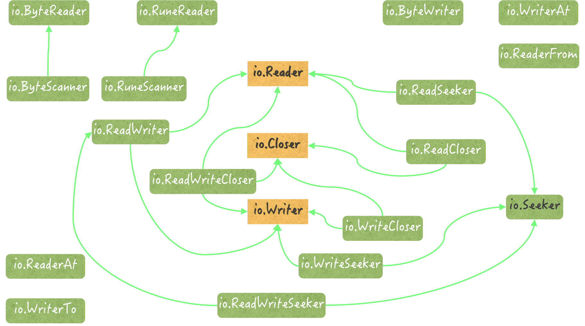

（ io 包中的接口体系）

除此之外，我还从多个维度为你描述了一些重要程序实体的功用和机理，比如：数据段读取器io.SectionReader、作为同步内存管道核心实现的io.pipe类型，以及用于数据拷贝的io.CopyN函数，等等。

我如此详尽且多角度的阐释，正是为了让你能够记牢io代码包中有着网状关系的接口和数据类型。我希望这个目的已经达到了，最起码，本文可以作为你深刻记忆它们的开始。

最后再强调一下，io包中的简单接口共有 11 个。其中，读取操作相关的接口有 5 个，写入操作相关的接口有 4 个，而与关闭操作有关的接口只有 1 个，另外还有一个读写位置设定相关的接口。

此外，io包还包含了 9 个基于这些简单接口的扩展接口。你需要在今后思考和实践的是，你在什么时候应该编写哪些数据类型实现io包中的哪些接口，并以此得到最大的好处。

### 思考题

今天的思考题是：io包中的同步内存管道的运作机制是什么？

## 42 | bufio包中的数据类型 （上）

今天，我们来讲另一个与 I/O 操作强相关的代码包bufio。bufio是“buffered I/O”的缩写。顾名思义，这个代码包中的程序实体实现的 I/O 操作都内置了缓冲区。

bufio包中的数据类型主要有：

1、Reader；

2、Scanner；

3、Writer和ReadWriter。

与io包中的数据类型类似，这些类型的值也都需要在初始化的时候，包装一个或多个简单 I/O 接口类型的值。（这里的简单 I/O 接口类型指的就是io包中的那些简单接口。）

下面，我们将通过一系列问题对bufio.Reader类型和bufio.Writer类型进行讨论（以前者为主）。**今天我的问题是：bufio.Reader类型值中的缓冲区起着怎样的作用？**

**这道题的典型回答是这样的。**

bufio.Reader类型的值（以下简称Reader值）内的缓冲区，其实就是一个数据存储中介，它介于底层读取器与读取方法及其调用方之间。所谓的底层读取器，就是在初始化此类值的时候传入的io.Reader类型的参数值。

Reader值的读取方法一般都会先从其所属值的缓冲区中读取数据。同时，在必要的时候，它们还会预先从底层读取器那里读出一部分数据，并暂存于缓冲区之中以备后用。

有这样一个缓冲区的好处是，可以在大多数的时候降低读取方法的执行时间。虽然，读取方法有时还要负责填充缓冲区，但从总体来看，读取方法的平均执行时间一般都会因此有大幅度的缩短。

### 问题解析

bufio.Reader类型并不是开箱即用的，因为它包含了一些需要显式初始化的字段。为了让你能在后面更好地理解它的读取方法的内部流程，我先在这里简要地解释一下这些字段，如下所示。

1、buf：[]byte类型的字段，即字节切片，代表缓冲区。虽然它是切片类型的，但是其长度却会在初始化的时候指定，并在之后保持不变。

2、rd：io.Reader类型的字段，代表底层读取器。缓冲区中的数据就是从这里拷贝来的。

3、r：int类型的字段，代表对缓冲区进行下一次读取时的开始索引。我们可以称它为已读计数。

4、w：int类型的字段，代表对缓冲区进行下一次写入时的开始索引。我们可以称之为已写计数。

5、err：error类型的字段。它的值用于表示在从底层读取器获得数据时发生的错误。这里的值在被读取或忽略之后，该字段会被置为nil。

6、lastByte：int类型的字段，用于记录缓冲区中最后一个被读取的字节。读回退时会用到它的值。

7、lastRuneSize：int类型的字段，用于记录缓冲区中最后一个被读取的 Unicode 字符所占用的字节数。读回退的时候会用到它的值。这个字段只会在其所属值的ReadRune方法中才会被赋予有意义的值。在其他情况下，它都会被置为-1。

bufio包为我们提供了两个用于初始化Reader值的函数，分别叫：

- NewReader；
- NewReaderSize；

它们都会返回一个*bufio.Reader类型的值。

NewReader函数初始化的Reader值会拥有一个默认尺寸的缓冲区。这个默认尺寸是 4096 个字节，即：4 KB。而NewReaderSize函数则将缓冲区尺寸的决定权抛给了使用方。

由于这里的缓冲区在一个Reader值的生命周期内其尺寸不可变，所以在有些时候是需要做一些权衡的。NewReaderSize函数就提供了这样一个途径。

在bufio.Reader类型拥有的读取方法中，Peek方法和ReadSlice方法都会调用该类型一个名为fill的包级私有方法。fill方法的作用是填充内部缓冲区。我们在这里就先重点说说它。

fill方法会先检查其所属值的已读计数。如果这个计数不大于0，那么有两种可能。

一种可能是其缓冲区中的字节都是全新的，也就是说它们都没有被读取过，另一种可能是缓冲区刚被压缩过。

对缓冲区的压缩包括两个步骤。**第一步，把缓冲区中在[已读计数, 已写计数)范围之内的所有元素值（或者说字节）都依次拷贝到缓冲区的头部。**

比如，把缓冲区中与已读计数代表的索引对应字节拷贝到索引0的位置，并把紧挨在它后边的字节拷贝到索引1的位置，以此类推。

这一步之所以不会有任何副作用，是因为它基于两个事实。

**第一事实**，已读计数之前的字节都已经被读取过，并且肯定不会再被读取了，因此把它们覆盖掉是安全的。

**第二个事实**，在压缩缓冲区之后，已写计数之后的字节只可能是已被读取过的字节，或者是已被拷贝到缓冲区头部的未读字节，又或者是代表未曾被填入数据的零值0x00。所以，后续的新字节是可以被写到这些位置上的。

**在压缩缓冲区的第二步中，fill方法会把已写计数的新值设定为原已写计数与原已读计数的差。这个差所代表的索引，就是压缩后第一次写入字节时的开始索引。**

另外，该方法还会把已读计数的值置为0。显而易见，在压缩之后，再读取字节就肯定要从缓冲区的头部开始读了。

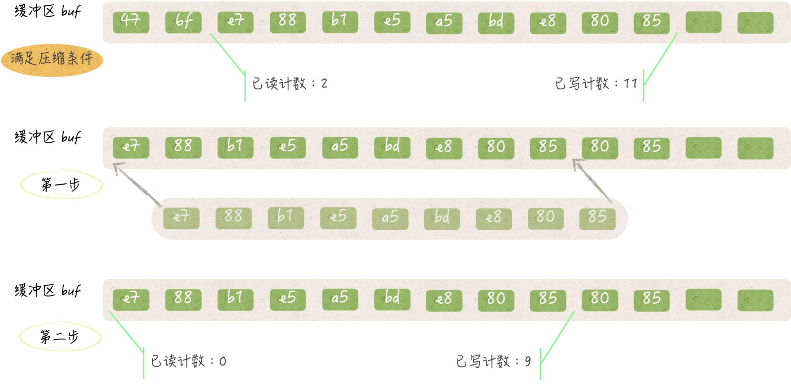

（bufio.Reader 中的缓冲区压缩）

实际上，fill方法只要在开始时发现其所属值的已读计数大于0，就会对缓冲区进行一次压缩。之后，如果缓冲区中还有可写的位置，那么该方法就会对其进行填充。

在填充缓冲区的时候，fill方法会试图从底层读取器那里，读取足够多的字节，并尽量把从已写计数代表的索引位置到缓冲区末尾之间的空间都填满。

在这个过程中，fill方法会及时地更新已写计数，以保证填充的正确性和顺序性。另外，它还会判断从底层读取器读取数据的时候，是否有错误发生。如果有，那么它就会把错误值赋给其所属值的err字段，并终止填充流程。

好了，到这里，我们暂告一个段落。在本题中，我对bufio.Reader类型的基本结构，以及相关的一些函数和方法进行了概括介绍，并且重点阐述了该类型的fill方法。

后者是我们在后面要说明的一些读取流程的重要组成部分。你起码要记住的是：这个fill方法大致都做了些什么。

### 知识扩展

问题 1：bufio.Writer类型值中缓冲的数据什么时候会被写到它的底层写入器？

我们先来看一下bufio.Writer类型都有哪些字段：

1、err：error类型的字段。它的值用于表示在向底层写入器写数据时发生的错误。

2、buf：[]byte类型的字段，代表缓冲区。在初始化之后，它的长度会保持不变。

3、n：int类型的字段，代表对缓冲区进行下一次写入时的开始索引。我们可以称之为已写计数。

4、wr：io.Writer类型的字段，代表底层写入器。

bufio.Writer类型有一个名为Flush的方法，它的主要功能是把相应缓冲区中暂存的所有数据，都写到底层写入器中。数据一旦被写进底层写入器，该方法就会把它们从缓冲区中删除掉。

不过，这里的删除有时候只是逻辑上的删除而已。不论是否成功地写入了所有的暂存数据，Flush方法都会妥当处置，并保证不会出现重写和漏写的情况。该类型的字段n在此会起到很重要的作用。

bufio.Writer类型值（以下简称Writer值）拥有的所有数据写入方法都会在必要的时候调用它的Flush方法。

比如，Write方法有时候会在把数据写进缓冲区之后，调用Flush方法，以便为后续的新数据腾出空间。WriteString方法的行为与之类似。

又比如，WriteByte方法和WriteRune方法，都会在发现缓冲区中的可写空间不足以容纳新的字节，或 Unicode 字符的时候，调用Flush方法。

此外，如果Write方法发现需要写入的字节太多，同时缓冲区已空，那么它就会跨过缓冲区，并直接把这些数据写到底层写入器中。

而ReadFrom方法，则会在发现底层写入器的类型是io.ReaderFrom接口的实现之后，直接调用其ReadFrom方法把参数值持有的数据写进去。

总之，在通常情况下，只要缓冲区中的可写空间无法容纳需要写入的新数据，Flush方法就一定会被调用。并且，bufio.Writer类型的一些方法有时候还会试图走捷径，跨过缓冲区而直接对接数据供需的双方。

你可以在理解了这些内部机制之后，有的放矢地编写你的代码。不过，在你把所有的数据都写入Writer值之后，再调用一下它的Flush方法，显然是最稳妥的。

```go
package main

import (
	"bufio"
	"fmt"
	"strings"
)

func main() {
	comment := "Package bufio implements buffered I/O. " +
		"It wraps an io.Reader or io.Writer object, " +
		"creating another object (Reader or Writer) that " +
		"also implements the interface but provides buffering and " +
		"some help for textual I/O."
	basicReader := strings.NewReader(comment)
	fmt.Printf("The size of basic reader: %d\n", basicReader.Size())
	fmt.Println()

	// 示例1。
	fmt.Println("New a buffered reader ...")
	reader1 := bufio.NewReader(basicReader)
	fmt.Printf("The default size of buffered reader: %d\n", reader1.Size())
	// 此时reader1的缓冲区还没有被填充。
	fmt.Printf("The number of unread bytes in the buffer: %d\n", reader1.Buffered())
	fmt.Println()

	// 示例2。
	bytes, err := reader1.Peek(7)
	if err != nil {
		fmt.Printf("error: %v\n", err)
	}
	fmt.Printf("Peeked contents(%d): %q\n", len(bytes), bytes)
	fmt.Printf("The number of unread bytes in the buffer: %d\n", reader1.Buffered())
	fmt.Println()

	// 示例3。
	buf1 := make([]byte, 7)
	n, err := reader1.Read(buf1)
	if err != nil {
		fmt.Printf("error: %v\n", err)
	}
	fmt.Printf("Read contents(%d): %q\n", n, buf1)
	fmt.Printf("The number of unread bytes in the buffer: %d\n", reader1.Buffered())
	fmt.Println()

	// 示例4。
	fmt.Printf("Reset the basic reader (size: %d) ...\n", len(comment))
	basicReader.Reset(comment)
	fmt.Printf("Reset the buffered reader (size: %d) ...\n", reader1.Size())
	reader1.Reset(basicReader)
	peekNum := len(comment) + 1
	fmt.Printf("Peek %d bytes ...\n", peekNum)
	bytes, err = reader1.Peek(peekNum)
	if err != nil {
		fmt.Printf("error: %v\n", err)
	}
	fmt.Printf("The number of peeked bytes: %d\n", len(bytes))
	fmt.Println()

	// 示例5。
	fmt.Printf("Reset the basic reader (size: %d) ...\n", len(comment))
	basicReader.Reset(comment)
	size := 300
	fmt.Printf("New a buffered reader with size %d ...\n", size)
	reader2 := bufio.NewReaderSize(basicReader, size)
	peekNum = size + 1
	fmt.Printf("Peek %d bytes ...\n", peekNum)
	bytes, err = reader2.Peek(peekNum)
	if err != nil {
		fmt.Printf("error: %v\n", err)
	}
	fmt.Printf("The number of peeked bytes: %d\n", len(bytes))
}
```

### 总结

今天我们从“bufio.Reader类型值中的缓冲区起着怎样的作用”这道问题入手，介绍了一部分 bufio 包中的数据类型，在下一次的分享中，我会沿着这个问题继续展开。

## 43 | bufio包中的数据类型（下）

在上一篇文章中，我提到了bufio包中的数据类型主要有Reader、Scanner、Writer和ReadWriter。并着重讲到了bufio.Reader类型与bufio.Writer类型，今天，我们继续专注bufio.Reader的内容来进行学习。

### 知识扩展

#### 问题 ：bufio.Reader类型读取方法有哪些不同？

bufio.Reader类型拥有很多用于读取数据的指针方法，**这里面有 4 个方法可以作为不同读取流程的代表，它们是：Peek、Read、ReadSlice和ReadBytes。**

**Reader值的Peek方法**的功能是：读取并返回其缓冲区中的n个未读字节，并且它会从已读计数代表的索引位置开始读。

在缓冲区未被填满，并且其中的未读字节的数量小于n的时候，该方法就会调用fill方法，以启动缓冲区填充流程。但是，如果它发现上次填充缓冲区的时候有错误，那就不会再次填充。

如果调用方给定的n比缓冲区的长度还要大，或者缓冲区中未读字节的数量小于n，那么Peek方法就会把“所有未读字节组成的序列”作为第一个结果值返回。

同时，它通常还把“bufio.ErrBufferFull变量的值（以下简称缓冲区已满的错误）”

作为第二个结果值返回，用来表示：虽然缓冲区被压缩和填满了，但是仍然满足不了要求。

只有在上述的情况都没有出现时，Peek方法才能返回：“以已读计数为起始的n个字节”和“表示未发生任何错误的nil”。

**bufio.Reader类型的 Peek 方法有一个鲜明的特点，那就是：即使它读取了缓冲区中的数据，也不会更改已读计数的值。**

这个类型的其他读取方法并不是这样。就拿**该类型的Read方法来说**，它有时会把缓冲区中的未读字节，依次拷贝到其参数p代表的字节切片中，并立即根据实际拷贝的字节数增加已读计数的值。

- 在缓冲区中还有未读字节的情况下，该方法的做法就是如此。不过，在另一些时候，其所属值的已读计数会等于已写计数，这表明：此时的缓冲区中已经没有任何未读的字节了。
- 当缓冲区中已无未读字节时，Read方法会先检查参数p的长度是否大于或等于缓冲区的长度。如果是，那么Read方法会索性放弃向缓冲区中填充数据，转而直接从其底层读取器中读出数据并拷贝到p中。这意味着它完全跨过了缓冲区，并直连了数据供需的双方。

需要注意的是，Peek方法在遇到类似情况时的做法与这里的区别（这两种做法孰优孰劣还要看具体的使用场景）。

Peek方法会在条件满足时填充缓冲区，并在发现参数n的值比缓冲区的长度更大时，直接返回缓冲区中的所有未读字节。

如果我们当初设定的缓冲区长度很大，那么在这种情况下的方法执行耗时，就有可能会比较长。最主要的原因是填充缓冲区需要花费较长的时间。

由fill方法执行的流程可知，它会尽量填满缓冲区中的可写空间。然而，Read方法在大多数的情况下，是不会向缓冲区中写入数据的，尤其是在前面描述的那种情况下，即：缓冲区中已无未读字节，且参数p的长度大于或等于缓冲区的长度。

此时，该方法会直接从底层读取器那里读出数据，所以数据的读出速度就成为了这种情况下方法执行耗时的决定性因素。

当然了，我在这里说的只是耗时操作在某些情况下更可能出现在哪里，一切的结论还是要以性能测试的客观结果为准。

说回Read方法的内部流程。如果缓冲区中已无未读字节，但其长度比参数p的长度更大，那么该方法会先把已读计数和已写计数的值都重置为0，然后再尝试着使用从底层读取器那里获取的数据，对缓冲区进行一次从头至尾的填充。

不过要注意，这里的尝试只会进行一次。无论在这一时刻是否能够获取到数据，也无论获取时是否有错误发生，都会是如此。而fill方法的做法与此不同，只要没有发生错误，它就会进行多次尝试，因此它真正获取到一些数据的可能性更大。

不过，这两个方法有一点是相同，那就是：只要它们把获取到的数据写入缓冲区，就会及时地更新已写计数的值。

**再来说ReadSlice方法和ReadBytes方法。** 这两个方法的功能总体上来说，都是持续地读取数据，直至遇到调用方给定的分隔符为止。

**ReadSlice方法**会先在其缓冲区的未读部分中寻找分隔符。如果未能找到，并且缓冲区未满，那么该方法会先通过调用fill方法对缓冲区进行填充，然后再次寻找，如此往复。

如果在填充的过程中发生了错误，那么它会把缓冲区中的未读部分作为结果返回，同时返回相应的错误值。

注意，在这个过程中有可能会出现虽然缓冲区已被填满，但仍然没能找到分隔符的情况。

这时，ReadSlice方法会把整个缓冲区（也就是buf字段代表的字节切片）作为第一个结果值，并把缓冲区已满的错误（即bufio.ErrBufferFull变量的值）作为第二个结果值。

经过fill方法填满的缓冲区肯定从头至尾都只包含了未读的字节，所以这样做是合理的。

当然了，一旦ReadSlice方法找到了分隔符，它就会在缓冲区上切出相应的、包含分隔符的字节切片，并把该切片作为结果值返回。无论分隔符找到与否，该方法都会正确地设置已读计数的值。

比如，在返回缓冲区中的所有未读字节，或者代表全部缓冲区的字节切片之前，它会把已写计数的值赋给已读计数，以表明缓冲区中已无未读字节。

如果说ReadSlice是一个容易半途而废的方法的话，那么可以说ReadBytes方法算得上是相当的执着。

**ReadBytes方法**会通过调用ReadSlice方法一次又一次地从缓冲区中读取数据，直至找到分隔符为止。

在这个过程中，ReadSlice方法可能会因缓冲区已满而返回所有已读到的字节和相应的错误值，但ReadBytes方法总是会忽略掉这样的错误，并再次调用ReadSlice方法，这使得后者会继续填充缓冲区并在其中寻找分隔符。

除非ReadSlice方法返回的错误值并不代表缓冲区已满的错误，或者它找到了分隔符，否则这一过程永远不会结束。

如果寻找的过程结束了，不管是不是因为找到了分隔符，ReadBytes方法都会把在这个过程中读到的所有字节，按照读取的先后顺序组装成一个字节切片，并把它作为第一个结果值。如果过程结束是因为出现错误，那么它还会把拿到的错误值作为第二个结果值。

在bufio.Reader类型的众多读取方法中，依赖ReadSlice方法的除了ReadBytes方法，还有ReadLine方法。不过后者在读取流程上并没有什么特别之处，我就不在这里赘述了。

另外，该类型的ReadString方法完全依赖于ReadBytes方法，前者只是在后者返回的结果值之上做了一个简单的类型转换而已。

**最后，我还要提醒你一下，有个安全性方面的问题需要你注意。bufio.Reader类型的Peek方法、ReadSlice方法和ReadLine方法都有可能会造成内容泄露。**

这主要是因为它们在正常的情况下都会返回直接基于缓冲区的字节切片。我在讲bytes.Buffer类型的时候解释过什么叫内容泄露。你可以返回查看。

调用方可以通过这些方法返回的结果值访问到缓冲区的其他部分，甚至修改缓冲区中的内容。这通常都是很危险的。

```go
package main

import (
	"bufio"
	"fmt"
	"strings"
)

func main() {
	comment := "Package bufio implements buffered I/O. " +
		"It wraps an io.Reader or io.Writer object, " +
		"creating another object (Reader or Writer) that " +
		"also implements the interface but provides buffering and " +
		"some help for textual I/O."
	basicReader := strings.NewReader(comment)
	fmt.Printf("The size of basic reader: %d\n", basicReader.Size())

	size := 300
	fmt.Printf("New a buffered reader with size %d ...\n", size)
	reader1 := bufio.NewReaderSize(basicReader, size)
	fmt.Println()

	fmt.Print("[ About 'Peek' method ]\n\n")
	// 示例1。
	peekNum := 38
	fmt.Printf("Peek %d bytes ...\n", peekNum)
	bytes, err := reader1.Peek(peekNum)
	if err != nil {
		fmt.Printf("error: %v\n", err)
	}
	fmt.Printf("Peeked contents(%d): %q\n", len(bytes), bytes)
	fmt.Printf("The number of unread bytes in the buffer: %d\n", reader1.Buffered())
	fmt.Println()

	fmt.Print("[ About 'Read' method ]\n\n")
	// 示例2。
	readNum := 38
	buf1 := make([]byte, readNum)
	fmt.Printf("Read %d bytes ...\n", readNum)
	n, err := reader1.Read(buf1)
	if err != nil {
		fmt.Printf("error: %v\n", err)
	}
	fmt.Printf("Read contents(%d): %q\n", n, buf1)
	fmt.Printf("The number of unread bytes in the buffer: %d\n", reader1.Buffered())
	fmt.Println()

	fmt.Print("[ About 'ReadSlice' method ]\n\n")
	// 示例3。
	fmt.Println("Reset the basic reader ...")
	basicReader.Reset(comment)
	fmt.Println("Reset the buffered reader ...")
	reader1.Reset(basicReader)
	fmt.Println()

	delimiter := byte('(')
	fmt.Printf("Read slice with delimiter %q...\n", delimiter)
	line, err := reader1.ReadSlice(delimiter)
	if err != nil {
		fmt.Printf("error: %v\n", err)
	}
	fmt.Printf("Read contents(%d): %q\n", len(line), line)
	fmt.Printf("The number of unread bytes in the buffer: %d\n", reader1.Buffered())
	fmt.Println()

	delimiter = byte('[')
	fmt.Printf("Read slice with delimiter %q...\n", delimiter)
	line, err = reader1.ReadSlice(delimiter)
	if err != nil {
		fmt.Printf("error: %v\n", err)
	}
	fmt.Printf("Read contents(%d): %q\n", len(line), line)
	fmt.Printf("The number of unread bytes in the buffer: %d\n", reader1.Buffered())
	fmt.Println()

	// 示例4。
	fmt.Println("Reset the basic reader ...")
	basicReader.Reset(comment)
	size = 200
	fmt.Printf("New a buffered reader with size %d ...\n", size)
	reader2 := bufio.NewReaderSize(basicReader, size)
	fmt.Println()

	delimiter = byte('[')
	fmt.Printf("Read slice with delimiter %q...\n", delimiter)
	line, err = reader2.ReadSlice(delimiter)
	if err != nil {
		fmt.Printf("error: %v\n", err)
	}
	fmt.Printf("Read contents(%d): %q\n", len(line), line)
	fmt.Printf("The number of unread bytes in the buffer: %d\n", reader2.Buffered())
	fmt.Println()

	fmt.Print("[ About 'ReadBytes' method ]\n\n")
	// 示例5。
	fmt.Println("Reset the basic reader ...")
	basicReader.Reset(comment)
	size = 200
	fmt.Printf("New a buffered reader with size %d ...\n", size)
	reader3 := bufio.NewReaderSize(basicReader, size)
	fmt.Println()

	delimiter = byte('[')
	fmt.Printf("Read bytes with delimiter %q...\n", delimiter)
	line, err = reader3.ReadBytes(delimiter)
	if err != nil {
		fmt.Printf("error: %v\n", err)
	}
	fmt.Printf("Read contents(%d): %q\n", len(line), line)
	fmt.Printf("The number of unread bytes in the buffer: %d\n", reader3.Buffered())
	fmt.Println()

	// 示例6和示例7。
	fmt.Print("[ About contents leak ]\n\n")
	showContentsLeak(comment)
}

func showContentsLeak(comment string) {
	// 示例6。
	basicReader := strings.NewReader(comment)
	fmt.Printf("The size of basic reader: %d\n", basicReader.Size())

	size := len(comment)
	fmt.Printf("New a buffered reader with size %d ...\n", size)
	reader4 := bufio.NewReaderSize(basicReader, size)
	fmt.Println()

	peekNum := 7
	fmt.Printf("Peek %d bytes ...\n", peekNum)
	bytes, err := reader4.Peek(peekNum)
	if err != nil {
		fmt.Printf("error: %v\n", err)
	}
	fmt.Printf("Peeked contents(%d): %q\n", len(bytes), bytes)
	fmt.Println()

	// 只要扩充一下之前拿到的字节切片bytes，
	// 就可以用它来读取甚至修改缓冲区中的后续内容。
	bytes = bytes[:cap(bytes)]
	fmt.Printf("The all of the contents in the buffer:\n%q\n", bytes)
	fmt.Println()

	blank := byte(' ')
	fmt.Println("Set blanks into the contents in the buffer ...")
	for _, i := range []int{55, 56, 57, 58, 66, 67, 68} {
		bytes[i] = blank
	}
	fmt.Println()

	peekNum = size
	fmt.Printf("Peek %d bytes ...\n", peekNum)
	bytes, err = reader4.Peek(peekNum)
	if err != nil {
		fmt.Printf("error: %v\n", err)
	}
	fmt.Printf("Peeked contents(%d):\n%q\n", len(bytes), bytes)
	fmt.Println()

	// 示例7。
	// ReadSlice方法也存在相同的问题。
	delimiter := byte(',')
	fmt.Printf("Read slice with delimiter %q...\n", delimiter)
	line, err := reader4.ReadSlice(delimiter)
	if err != nil {
		fmt.Printf("error: %v\n", err)
	}
	fmt.Printf("Read contents(%d): %q\n", len(line), line)
	fmt.Println()

	line = line[:cap(line)]
	fmt.Printf("The all of the contents in the buffer:\n%q\n", line)
	fmt.Println()

	underline := byte('_')
	fmt.Println("Set underlines into the contents in the buffer ...")
	for _, i := range []int{89, 92, 103} {
		line[i] = underline
	}
	fmt.Println()

	peekNum = size
	fmt.Printf("Peek %d bytes ...\n", peekNum)
	bytes, err = reader4.Peek(peekNum)
	if err != nil {
		fmt.Printf("error: %v\n", err)
	}
	fmt.Printf("Peeked contents(%d): %q\n", len(bytes), bytes)
}
```

### 总结

我们用比较长的篇幅介绍了bufio包中的数据类型，其中的重点是bufio.Reader类型。

bufio.Reader类型代表的是携带缓冲区的读取器。它的值在被初始化的时候需要接受一个底层的读取器，后者的类型必须是io.Reader接口的实现。

Reader值中的缓冲区其实就是一个数据存储中介，它介于底层读取器与读取方法及其调用方之间。此类值的读取方法一般都会先从该值的缓冲区中读取数据，同时在必要的时候预先从其底层读取器那里读出一部分数据，并填充到缓冲区中以备后用。填充缓冲区的操作通常会由该值的fill方法执行。

在填充的过程中，fill方法有时还会对缓冲区进行压缩。在Reader值拥有的众多读取方法中，有 4 个方法可以作为不同读取流程的代表，它们是：Peek、Read、ReadSlice和ReadBytes。

Peek方法的特点是即使读取了缓冲区中的数据，也不会更改已读计数的值。而Read方法会在参数值的长度过大，且缓冲区中已无未读字节时，跨过缓冲区并直接向底层读取器索要数据。

ReadSlice方法会在缓冲区的未读部分中寻找给定的分隔符，并在必要时对缓冲区进行填充。

如果在填满缓冲区之后仍然未能找到分隔符，那么该方法就会把整个缓冲区作为第一个结果值返回，同时返回缓冲区已满的错误。

ReadBytes方法会通过调用ReadSlice方法，一次又一次地填充缓冲区，并在其中寻找分隔符。除非发生了未预料到的错误或者找到了分隔符，否则这一过程将会一直进行下去。

Reader值的ReadLine方法会依赖于它的ReadSlice方法，而其ReadString方法则完全依赖于ReadBytes方法。

另外，值得我们特别注意的是，Reader值的Peek方法、ReadSlice方法和ReadLine方法都可能会造成其缓冲区中的内容的泄露。

最后再说一下bufio.Writer类型。把该类值的缓冲区中暂存的数据写进其底层写入器的功能，主要是由它的Flush方法实现的。

此类值的所有数据写入方法都会在必要的时候调用它的Flush方法。一般情况下，这些写入方法都会先把数据写进其所属值的缓冲区，然后再增加该值中的已写计数。但是，在有些时候，Write方法和ReadFrom方法也会跨过缓冲区，并直接把数据写进其底层写入器。

请记住，虽然这些写入方法都会不时地调用Flush方法，但是在写入所有的数据之后再显式地调用一下这个方法总是最稳妥的。

```go
package main

import (
	"bufio"
	"bytes"
	"fmt"
	"strings"
)

func main() {
	comment := "Writer implements buffering for an io.Writer object. " +
		"If an error occurs writing to a Writer, " +
		"no more data will be accepted and all subsequent writes, " +
		"and Flush, will return the error. After all data has been written, " +
		"the client should call the Flush method to guarantee all data " +
		"has been forwarded to the underlying io.Writer."
	basicWriter1 := &strings.Builder{}

	size := 300
	fmt.Printf("New a buffered writer with size %d ...\n", size)
	writer1 := bufio.NewWriterSize(basicWriter1, size)
	fmt.Println()

	// 示例1。
	begin, end := 0, 53
	fmt.Printf("Write %d bytes into the writer ...\n", end-begin)
	writer1.WriteString(comment[begin:end])
	fmt.Printf("The number of buffered bytes: %d\n", writer1.Buffered())
	fmt.Printf("The number of unused bytes in the buffer: %d\n",
		writer1.Available())
	fmt.Println("Flush the buffer in the writer ...")
	writer1.Flush()
	fmt.Printf("The number of buffered bytes: %d\n", writer1.Buffered())
	fmt.Printf("The number of unused bytes in the buffer: %d\n",
		writer1.Available())
	fmt.Println()

	// 示例2。
	begin, end = 0, 326
	fmt.Printf("Write %d bytes into the writer ...\n", end-begin)
	writer1.WriteString(comment[begin:end])
	fmt.Printf("The number of buffered bytes: %d\n", writer1.Buffered())
	fmt.Printf("The number of unused bytes in the buffer: %d\n",
		writer1.Available())
	fmt.Println("Flush the buffer in the writer ...")
	writer1.Flush()
	fmt.Println()

	// 示例3。
	basicWriter2 := &bytes.Buffer{}
	fmt.Printf("Reset the writer with a bytes buffer(an implementation of io.ReaderFrom) ...\n")
	writer1.Reset(basicWriter2)
	reader := strings.NewReader(comment)
	fmt.Println("Read data from the reader ...")
	writer1.ReadFrom(reader)
	fmt.Printf("The number of buffered bytes: %d\n", writer1.Buffered())
	fmt.Printf("The number of unused bytes in the buffer: %d\n",
		writer1.Available())
}
```

### 思考题

今天的思考题是：bufio.Scanner类型的主要功用是什么？它有哪些特点？

## 44 | 使用os包中的API （上）

我们今天要讲的是os代码包中的 API。这个代码包可以让我们拥有操控计算机操作系统的能力。

### 前导内容：os 包中的 API

这个代码包提供的都是平台不相关的 API。那么说，什么叫平台不相关的 API 呢？

它的意思是：这些 API 基于（或者说抽象自）操作系统，为我们使用操作系统的功能提供高层次的支持，但是，它们并不依赖于具体的操作系统。

不论是 Linux、macOS、Windows，还是 FreeBSD、OpenBSD、Plan9，os代码包都可以为之提供统一的使用接口。这使得我们可以用同样的方式，来操纵不同的操作系统，并得到相似的结果。

os包中的 API 主要可以帮助我们使用操作系统中的文件系统、权限系统、环境变量、系统进程以及系统信号。

其中，操纵文件系统的 API 最为丰富。我们不但可以利用这些 API 创建和删除文件以及目录，还可以获取到它们的各种信息、修改它们的内容、改变它们的访问权限，等等。

说到这里，就不得不提及一个非常常用的数据类型：os.File。

从字面上来看，os.File类型代表了操作系统中的文件。但实际上，它可以代表的远不止于此。或许你已经知道，对于类 Unix 的操作系统（包括 Linux、macOS、FreeBSD 等），其中的一切都可以被看做是文件。

除了文本文件、二进制文件、压缩文件、目录这些常见的形式之外，还有符号链接、各种物理设备（包括内置或外接的面向块或者字符的设备）、命名管道，以及套接字（也就是 socket），等等。

因此，可以说，我们能够利用os.File类型操纵的东西太多了。不过，为了聚焦于os.File本身，同时也为了让本文讲述的内容更加通用，我们在这里主要把os.File类型应用于常规的文件。

下面这个问题，就是以os.File类型代表的最基本内容入手。**我们今天的问题是：os.File类型都实现了哪些io包中的接口？**

这道题的**典型回答**是这样的。

os.File类型拥有的都是指针方法，所以除了空接口之外，它本身没有实现任何接口。而它的指针类型则实现了很多io代码包中的接口。

首先，对于io包中最核心的 3 个简单接口io.Reader、io.Writer和io.Closer，*os.File类型都实现了它们。

其次，该类型还实现了另外的 3 个简单接口，即：io.ReaderAt、io.Seeker和io.WriterAt。

正是因为*os.File类型实现了这些简单接口，所以它也顺便实现了io包的 9 个扩展接口中的 7 个。

然而，由于它并没有实现简单接口io.ByteReader和io.RuneReader，所以它没有实现分别作为这两者的扩展接口的io.ByteScanner和io.RuneScanner。

总之，os.File类型及其指针类型的值，不但可以通过各种方式读取和写入某个文件中的内容，还可以寻找并设定下一次读取或写入时的起始索引位置，另外还可以随时对文件进行关闭。

但是，它们并不能专门地读取文件中的下一个字节，或者下一个 Unicode 字符，也不能进行任何的读回退操作。

不过，单独读取下一个字节或字符的功能也可以通过其他方式来实现，比如，调用它的Read方法并传入适当的参数值就可以做到这一点。

### 问题解析

这个问题其实在间接地问“os.File类型能够以何种方式操作文件？”我在前面的典型回答中也给出了简要的答案。

在我进一步地说明一些细节之前，我们先来看看，怎样才能获得一个os.File类型的指针值（以下简称File值）。

在os包中，有这样几个函数，即：Create、NewFile、Open和OpenFile。

**os.Create函数用于根据给定的路径创建一个新的文件。** 它会返回一个File值和一个错误值。我们可以在该函数返回的File值之上，对相应的文件进行读操作和写操作。

不但如此，我们使用这个函数创建的文件，对于操作系统中的所有用户来说，都是可以读和写的。

换句话说，一旦这样的文件被创建出来，任何能够登录其所属的操作系统的用户，都可以在任意时刻读取该文件中的内容，或者向该文件写入内容。

注意，如果在我们给予os.Create函数的路径之上，已经存在了一个文件，那么该函数会先清空现有文件中的全部内容，然后再把它作为第一个结果值返回。

另外，os.Create函数是有可能返回非nil的错误值的。比如，如果我们给定的路径上的某一级父目录并不存在，那么该函数就会返回一个*os.PathError类型的错误值，以表示“不存在的文件或目录”。

**再来看os.NewFile函数。** 该函数在被调用的时候，需要接受一个代表文件描述符的、uintptr类型的值，以及一个用于表示文件名的字符串值。

如果我们给定的文件描述符并不是有效的，那么这个函数将会返回nil，否则，它将会返回一个代表了相应文件的File值。

注意，不要被这个函数的名称误导了，它的功能并不是创建一个新的文件，而是依据一个已经存在的文件的描述符，来新建一个包装了该文件的File值。

例如，我们可以像这样拿到一个包装了标准错误输出的File值：

```go
file3 := os.NewFile(uintptr(syscall.Stderr), "/dev/stderr")
```

然后，通过这个File值向标准错误输出上写入一些内容：

```go
if file3 != nil {
 defer file3.Close()
 file3.WriteString(
  "The Go language program writes the contents into stderr.\n")
}
```

**os.Open函数会打开一个文件并返回包装了该文件的File值。** 然而，该函数只能以只读模式打开文件。换句话说，我们只能从该函数返回的File值中读取内容，而不能向它写入任何内容。

如果我们调用了这个File值的任何一个写入方法，那么都将会得到一个表示了“坏的文件描述符”的错误值。实际上，我们刚刚说的只读模式，正是应用在File值所持有的文件描述符之上的。

所谓的文件描述符，是由通常很小的非负整数代表的。它一般会由 I/O 相关的系统调用返回，并作为某个文件的一个标识存在。

从操作系统的层面看，针对任何文件的 I/O 操作都需要用到这个文件描述符。只不过，Go 语言中的一些数据类型，为我们隐匿掉了这个描述符，如此一来我们就无需时刻关注和辨别它了（就像os.File类型这样）。

实际上，我们在调用前文所述的os.Create函数、os.Open函数以及将会提到的os.OpenFile函数的时候，它们都会执行同一个系统调用，并且在成功之后得到这样一个文件描述符。这个文件描述符将会被储存在它们返回的File值中。

os.File类型有一个指针方法，名叫Fd。它在被调用之后将会返回一个uintptr类型的值。这个值就代表了当前的File值所持有的那个文件描述符。

不过，在os包中，除了NewFile函数需要用到它，它也没有什么别的用武之地了。所以，如果你操作的只是常规的文件或者目录，那么就无需特别地在意它了。

**最后，再说一下os.OpenFile函数。** 这个函数其实是os.Create函数和os.Open函数的底层支持，它最为灵活。

这个函数有 3 个参数，分别名为name、flag和perm。其中的name指代的就是文件的路径。而flag参数指的则是需要施加在文件描述符之上的模式，我在前面提到的只读模式就是这里的一个可选项。

在 Go 语言中，这个只读模式由常量os.O_RDONLY代表，它是int类型的。当然了，这里除了只读模式之外，还有几个别的模式可选，我们稍后再细说。

os.OpenFile函数的参数perm代表的也是模式，它的类型是os.FileMode，此类型是一个基于uint32类型的再定义类型。

为了加以区别，我们把参数flag指代的模式叫做操作模式，而把参数perm指代的模式叫做权限模式。可以这么说，操作模式限定了操作文件的方式，而权限模式则可以控制文件的访问权限。关于权限模式的更多细节我们将在后面讨论。

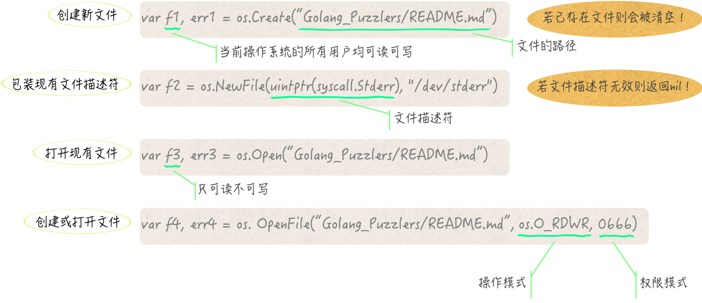

（获得 os.File 类型的指针值的几种方式）

到这里，你需要记住的是，通过os.File类型的值，我们不但可以对文件进行读取、写入、关闭等操作，还可以设定下一次读取或写入时的起始索引位置。

此外，os包中还有用于创建全新文件的Create函数，用于包装现存文件的NewFile函数，以及可被用来打开已存在的文件的Open函数和OpenFile函数。

```go
package main

import (
	"bytes"
	"fmt"
	"io"
	"os"
	"path/filepath"
	"reflect"
	"syscall"
)

// ioTypes 代表了io代码包中的所有接口的反射类型。
var ioTypes = []reflect.Type{
	reflect.TypeOf((*io.Reader)(nil)).Elem(),
	reflect.TypeOf((*io.Writer)(nil)).Elem(),
	reflect.TypeOf((*io.Closer)(nil)).Elem(),

	reflect.TypeOf((*io.ByteReader)(nil)).Elem(),
	reflect.TypeOf((*io.RuneReader)(nil)).Elem(),
	reflect.TypeOf((*io.ReaderAt)(nil)).Elem(),
	reflect.TypeOf((*io.Seeker)(nil)).Elem(),
	reflect.TypeOf((*io.WriterTo)(nil)).Elem(),
	reflect.TypeOf((*io.ByteWriter)(nil)).Elem(),
	reflect.TypeOf((*io.WriterAt)(nil)).Elem(),
	reflect.TypeOf((*io.ReaderFrom)(nil)).Elem(),

	reflect.TypeOf((*io.ByteScanner)(nil)).Elem(),
	reflect.TypeOf((*io.RuneScanner)(nil)).Elem(),
	reflect.TypeOf((*io.ReadSeeker)(nil)).Elem(),
	reflect.TypeOf((*io.ReadCloser)(nil)).Elem(),
	reflect.TypeOf((*io.WriteCloser)(nil)).Elem(),
	reflect.TypeOf((*io.WriteSeeker)(nil)).Elem(),
	reflect.TypeOf((*io.ReadWriter)(nil)).Elem(),
	reflect.TypeOf((*io.ReadWriteSeeker)(nil)).Elem(),
	reflect.TypeOf((*io.ReadWriteCloser)(nil)).Elem(),
}

func main() {
	// 示例1。
	file1 := (*os.File)(nil)
	fileType := reflect.TypeOf(file1)
	var buf bytes.Buffer
	fmt.Fprintf(&buf, "Type %T implements\n", file1)
	for _, t := range ioTypes {
		if fileType.Implements(t) {
			buf.WriteString(t.String())
			buf.WriteByte(',')
			buf.WriteByte('\n')
		}
	}
	output := buf.Bytes()
	output[len(output)-2] = '.'
	fmt.Printf("%s\n", output)

	// 示例2。
	fileName1 := "something1.txt"
	filePath1 := filepath.Join(os.TempDir(), fileName1)
	var paths []string
	paths = append(paths, filePath1)
	dir, _ := os.Getwd()
	paths = append(paths, filepath.Join(dir[:len(dir)-1], fileName1))
	for _, path := range paths {
		fmt.Printf("Create a file with path %s ...\n", path)
		_, err := os.Create(path)
		if err != nil {
			var underlyingErr string
			if _, ok := err.(*os.PathError); ok {
				underlyingErr = "(path error)"
			}
			fmt.Printf("error: %v %s\n", err, underlyingErr)
			continue
		}
		fmt.Println("The file has been created.")
	}
	fmt.Println()

	// 示例3。
	fmt.Println("New a file associated with stderr ...")
	file3 := os.NewFile(uintptr(syscall.Stderr), "/dev/stderr")
	if file3 != nil {
		file3.WriteString(
			"The Go language program writes something to stderr.\n")
	}
	fmt.Println()

	// 示例4。
	fmt.Printf("Open a file with path %s ...\n", filePath1)
	file4, err := os.Open(filePath1)
	if err != nil {
		fmt.Printf("error: %v\n", err)
		return
	}
	fmt.Println("Write something to the file ...")
	_, err = file4.WriteString("something")
	var underlyingErr string
	if _, ok := err.(*os.PathError); ok {
		underlyingErr = "(path error)"
	}
	fmt.Printf("error: %v %s\n", err, underlyingErr)
	fmt.Println()

	// 示例5。
	fmt.Printf("Open a file with path %s ...\n", filePath1)
	file5a, err := os.Open(filePath1)
	if err != nil {
		fmt.Printf("error: %v\n", err)
		return
	}
	fmt.Printf(
		"Is there only one file descriptor for the same file in the same process? %v\n",
		file5a.Fd() == file4.Fd())
	file5b := os.NewFile(file5a.Fd(), filePath1)
	fmt.Printf("Can the same file descriptor represent the same file? %v\n",
		file5b.Name() == file5a.Name())
	fmt.Println()

	// 示例6。
	fmt.Printf("Reuse a file on path %s ...\n", filePath1)
	file6, err := os.OpenFile(filePath1, os.O_WRONLY|os.O_TRUNC, 0666)
	if err != nil {
		fmt.Printf("error: %v\n", err)
		return
	}
	contents := "something"
	fmt.Printf("Write %q to the file ...\n", contents)
	n, err := file6.WriteString(contents)
	if err != nil {
		fmt.Printf("error: %v\n", err)
	} else {
		fmt.Printf("The number of bytes written is %d.\n", n)
	}
}
```

### 总结

我们今天讲的是os代码包以及其中的程序实体。我们首先讨论了os包存在的意义，和它的主要用途。代码包中所包含的 API，都是对操作系统的某方面功能的高层次抽象，这使得我们可以通过它以统一的方式，操纵不同的操作系统，并得到相似的结果。

在这个代码包中，操纵文件系统的 API 最为丰富，最有代表性的就是数据类型os.File。os.File类型不但可以代表操作系统中的文件，还可以代表很多其他的东西。尤其是在类 Unix 的操作系统中，它几乎可以代表一切可以操纵的软件和硬件。

## 45 | 使用os包中的API （下）

我们在上一篇文章中。从“os.File类型都实现了哪些io包中的接口”这一问题出发，介绍了一系列的相关内容。今天我们继续围绕这一知识点进行扩展。

### 知识扩展

#### 问题 1：可应用于File值的操作模式都有哪些？

针对File值的操作模式主要有只读模式、只写模式和读写模式。

这些模式分别由常量os.O_RDONLY、os.O_WRONLY和os.O_RDWR代表。在我们新建或打开一个文件的时候，必须把这三个模式中的一个设定为此文件的操作模式。

除此之外，我们还可以为这里的文件设置额外的操作模式，可选项如下所示。

- os.O_APPEND：当向文件中写入内容时，把新内容追加到现有内容的后边。
- os.O_CREATE：当给定路径上的文件不存在时，创建一个新文件。
- os.O_EXCL：需要与os.O_CREATE一同使用，表示在给定的路径上不能有已存在的文件。
- os.O_SYNC：在打开的文件之上实施同步 I/O。它会保证读写的内容总会与硬盘上的数据保持同步。
- os.O_TRUNC：如果文件已存在，并且是常规的文件，那么就先清空其中已经存在的任何内容。

对于以上操作模式的使用，os.Create函数和os.Open函数都是现成的例子。

```
func Create(name string) (*File, error) {
 return OpenFile(name, O_RDWR|O_CREATE|O_TRUNC, 0666)
}
```

os.Create函数在调用os.OpenFile函数的时候，给予的操作模式是os.O_RDWR、os.O_CREATE和os.O_TRUNC的组合。

这就基本上决定了前者的行为，即：如果参数name代表路径之上的文件不存在，那么就新建一个，否则，先清空现存文件中的全部内容。

并且，它返回的File值的读取方法和写入方法都是可用的。这里需要注意，多个操作模式是通过按位或操作符|组合起来的。

```go
func Open(name string) (*File, error) {
    return OpenFile(name, O_RDONLY, 0)
}
```

我在前面说过，os.Open函数的功能是：以只读模式打开已经存在的文件。其根源就是它在调用os.OpenFile函数的时候，只提供了一个单一的操作模式os.O_RDONLY。

以上，就是我对可应用于File值的操作模式的简单解释。在 demo88.go 文件中还有少许示例，可供你参考。

```go
package main

import (
	"fmt"
	"io/ioutil"
	"os"
	"path/filepath"
)

type flagDesc struct {
	flag int
	desc string
}

func main() {
	fileName1 := "something2.txt"
	filePath1 := filepath.Join(os.TempDir(), fileName1)
	fmt.Printf("The file path: %s\n", filePath1)
	fmt.Println()

	// 示例1。
	contents0 := "OpenFile is the generalized open call."
	flagDescList := []flagDesc{
		{
			os.O_WRONLY | os.O_CREATE | os.O_TRUNC,
			"os.O_WRONLY|os.O_CREATE|os.O_TRUNC",
		},
		{
			os.O_WRONLY,
			"os.O_WRONLY",
		},
		{
			os.O_WRONLY | os.O_APPEND,
			"os.O_WRONLY|os.O_APPEND",
		},
	}

	for i, v := range flagDescList {
		fmt.Printf("Open the file with flag %s ...\n", v.desc)
		file1a, err := os.OpenFile(filePath1, v.flag, 0666)
		if err != nil {
			fmt.Printf("error: %v\n", err)
			continue
		}
		fmt.Printf("The file descriptor: %d\n", file1a.Fd())

		contents1 := fmt.Sprintf("[%d]: %s ", i+1, contents0)
		fmt.Printf("Write %q to the file ...\n", contents1)
		n, err := file1a.WriteString(contents1)
		if err != nil {
			fmt.Printf("error: %v\n", err)
			continue
		}
		fmt.Printf("The number of bytes written is %d.\n", n)

		file1b, err := os.Open(filePath1)
		fmt.Println("Read bytes from the file ...")
		bytes, err := ioutil.ReadAll(file1b)
		if err != nil {
			fmt.Printf("error: %v\n", err)
			continue
		}
		fmt.Printf("Read(%d): %q\n", len(bytes), bytes)
		fmt.Println()
	}

	// 示例2。
	fmt.Println("Try to create an existing file with flag os.O_TRUNC ...")
	file2, err := os.OpenFile(filePath1, os.O_RDWR|os.O_CREATE|os.O_TRUNC, 0666)
	if err != nil {
		fmt.Printf("error: %v\n", err)
		return
	}
	fmt.Printf("The file descriptor: %d\n", file2.Fd())

	fmt.Println("Try to create an existing file with flag os.O_EXCL ...")
	_, err = os.OpenFile(filePath1, os.O_RDWR|os.O_CREATE|os.O_EXCL, 0666)
	fmt.Printf("error: %v\n", err)
}
```

#### 问题 2：怎样设定常规文件的访问权限？

我们已经知道，os.OpenFile函数的第三个参数perm代表的是权限模式，其类型是os.FileMode。但实际上，os.FileMode类型能够代表的，可远不只权限模式，它还可以代表文件模式（也可以称之为文件种类）。

由于os.FileMode是基于uint32类型的再定义类型，所以它的每个值都包含了 32 个比特位。在这 32 个比特位当中，每个比特位都有其特定的含义。

比如，如果在其最高比特位上的二进制数是1，那么该值表示的文件模式就等同于os.ModeDir，也就是说，相应的文件代表的是一个目录。

又比如，如果其中的第 26 个比特位上的是1，那么相应的值表示的文件模式就等同于os.ModeNamedPipe，也就是说，那个文件代表的是一个命名管道。

实际上，在一个os.FileMode类型的值（以下简称FileMode值）中，只有最低的 9 个比特位才用于表示文件的权限。当我们拿到一个此类型的值时，可以把它和os.ModePerm常量的值做按位与操作。

这个常量的值是0777，是一个八进制的无符号整数，其最低的 9 个比特位上都是1，而更高的 23 个比特位上都是0。

所以，经过这样的按位与操作之后，我们即可得到这个FileMode值中所有用于表示文件权限的比特位，也就是该值所表示的权限模式。这将会与我们调用FileMode值的Perm方法所得到的结果值是一致。

在这 9 个用于表示文件权限的比特位中，每 3 个比特位为一组，共可分为 3 组。

**从高到低，这 3 组分别表示的是文件所有者（也就是创建这个文件的那个用户）、文件所有者所属的用户组，以及其他用户对该文件的访问权限。而对于每个组，其中的 3 个比特位从高到低分别表示读权限、写权限和执行权限。**

如果在其中的某个比特位上的是1，那么就意味着相应的权限开启，否则，就表示相应的权限关闭。

因此，八进制整数0777就表示：操作系统中的所有用户都对当前的文件有读、写和执行的权限，而八进制整数0666则表示：所有用户都对当前文件有读和写的权限，但都没有执行的权限。

我们在调用os.OpenFile函数的时候，可以根据以上说明设置它的第三个参数。但要注意，只有在新建文件的时候，这里的第三个参数值才是有效的。在其他情况下，即使我们设置了此参数，也不会对目标文件产生任何的影响。

```go
package main

import (
	"fmt"
	"os"
	"path/filepath"
)

type argDesc struct {
	action string
	flag   int
	perm   os.FileMode
}

func main() {
	// 示例1。
	fmt.Printf("The mode for dir:\n%32b\n", os.ModeDir)
	fmt.Printf("The mode for named pipe:\n%32b\n", os.ModeNamedPipe)
	fmt.Printf("The mode for all of the irregular files:\n%32b\n", os.ModeType)
	fmt.Printf("The mode for permissions:\n%32b\n", os.ModePerm)
	fmt.Println()

	// 示例2。
	fileName1 := "something3.txt"
	filePath1 := filepath.Join(os.TempDir(), fileName1)
	fmt.Printf("The file path: %s\n", filePath1)

	argDescList := []argDesc{
		{
			"Create",
			os.O_RDWR | os.O_CREATE,
			0644,
		},
		{
			"Reuse",
			os.O_RDWR | os.O_TRUNC,
			0666,
		},
		{
			"Open",
			os.O_RDWR | os.O_APPEND,
			0777,
		},
	}

	defer os.Remove(filePath1)
	for _, v := range argDescList {
		fmt.Printf("%s the file with perm %o ...\n", v.action, v.perm)
		file1, err := os.OpenFile(filePath1, v.flag, v.perm)
		if err != nil {
			fmt.Printf("error: %v\n", err)
			continue
		}
		info1, err := file1.Stat()
		if err != nil {
			fmt.Printf("error: %v\n", err)
			continue
		}
		fmt.Printf("The file permissions: %o\n", info1.Mode().Perm())
	}
}
```

### 总结

为了聚焦于os.File类型本身，我在这两篇文章中主要讲述了怎样把 os.File 类型应用于常规的文件。该类型的指针类型实现了很多io包中的接口，因此它的具体功用也就可以不言自明了。

通过该类型的值，我们不但可以对文件进行各种读取、写入、关闭等操作，还可以设定下一次读取或写入时的起始索引位置。

在使用这个类型的值之前，我们必须先要创建它。所以，我为你重点介绍了几个可以创建，并获得此类型值的函数。

包括：os.Create、os.NewFile、os.Open和os.OpenFile。我们用什么样的方式创建File值，就决定了我们可以使用它来做什么。

利用os.Create函数，我们可以在操作系统中创建一个全新的文件，或者清空一个现存文件中的全部内容并重用它。

在相应的File值之上，我们可以对该文件进行任何的读写操作。虽然os.NewFile函数并不是被用来创建新文件的，但是它能够基于一个有效的文件描述符包装出一个可用的File值。

os.Open函数的功能是打开一个已经存在的文件。但是，我们只能通过它返回的File值对相应的文件进行读操作。

os.OpenFile是这些函数中最为灵活的一个，通过它，我们可以设定被打开文件的操作模式和权限模式。实际上，os.Create函数和os.Open函数都只是对它的简单封装而已。

在使用os.OpenFile函数的时候，我们必须要搞清楚操作模式和权限模式所代表的真正含义，以及设定它们的正确方式。

我在本文的扩展问题中分别对它们进行了较为详细的解释。同时，我在对应的示例文件中也编写了一些代码。

你需要认真地阅读和理解这些代码，并在运行它们的过程当中悟出这两种模式的真谛。

我在本文中讲述的东西对于os包来说，只是海面上的那部分冰山而已。这个代码包囊括的知识众多，而且延展性都很强。

如果你想完全理解它们，可能还需要去参看操作系统等方面的文档和教程。由于篇幅原因，我在这里只是做了一个引导，帮助你初识该包中的一些重要的程序实体，并给予你一个可以深入下去的切入点，希望你已经在路上了。

### 思考题

今天的思考题是：怎样通过os包中的 API 创建和操纵一个系统进程？

## 46 | 访问网络服务

### 前导内容：socket 与 IPC

人们常常会使用 Go 语言去编写网络程序（当然了，这方面也是 Go 语言最为擅长的事情）。说到网络编程，我们就不得不提及 socket。

socket，常被翻译为套接字，它应该算是网络编程世界中最为核心的知识之一了。关于 socket，我们可以讨论的东西太多了，因此，我在这里只围绕着 Go 语言向你介绍一些关于它的基础知识。

所谓 socket，是一种 IPC 方法。IPC 是 Inter-Process Communication 的缩写，可以被翻译为进程间通信。顾名思义，IPC 这个概念（或者说规范）主要定义的是多个进程之间，相互通信的方法。

这些方法主要包括：系统信号（signal）、管道（pipe）、套接字 （socket）、文件锁（file lock）、消息队列（message queue）、信号灯（semaphore，有的地方也称之为信号量）等。现存的主流操作系统大都对 IPC 提供了强有力的支持，尤其是 socket。

你可能已经知道，Go 语言对 IPC 也提供了一定的支持。

比如，在os代码包和os/signal代码包中就有针对系统信号的 API。

又比如，os.Pipe函数可以创建命名管道，而os/exec代码包则对另一类管道（匿名管道）提供了支持。对于 socket，Go 语言与之相应的程序实体都在其标准库的net代码包中。

**毫不夸张地说，在众多的 IPC 方法中，socket 是最为通用和灵活的一种。**与其他的 IPC 方法不同，利用 socket 进行通信的进程，可以不局限在同一台计算机当中。

实际上，通信的双方无论存在于世界上的哪个角落，只要能够通过计算机的网卡端口以及网络进行互联，就可以使用 socket。

支持 socket 的操作系统一般都会对外提供一套 API。**跑在它们之上的应用程序利用这套 API，就可以与互联网上的另一台计算机中的程序、同一台计算机中的其他程序，甚至同一个程序中的其他线程进行通信。**

例如，在 Linux 操作系统中，用于创建 socket 实例的 API，就是由一个名为socket的系统调用代表的。这个系统调用是 Linux 内核的一部分。

所谓的系统调用，你可以理解为特殊的 C 语言函数。它们是连接应用程序和操作系统内核的桥梁，也是应用程序使用操作系统功能的唯一渠道。

在 Go 语言标准库的syscall代码包中，有一个与这个socket系统调用相对应的函数。这两者的函数签名是基本一致的，它们都会接受三个int类型的参数，并会返回一个可以代表文件描述符的结果。

但不同的是，syscall包中的Socket函数本身是平台不相关的。在其底层，Go 语言为它支持的每个操作系统都做了适配，这才使得这个函数无论在哪个平台上，总是有效的。

```go
package main

import (
	"fmt"
	"syscall"
)

func main() {
	fd1, err := syscall.Socket(
		syscall.AF_INET, syscall.SOCK_STREAM, syscall.IPPROTO_TCP)
	if err != nil {
		fmt.Printf("socket error: %v\n", err)
		return
	}
	defer syscall.Close(fd1)
	fmt.Printf("The file descriptor of socket：%d\n", fd1)

	// 省略若干代码。
	// 如果真要完全使用syscall包中的程序实体建立网络连接的话，
	// 过程太过繁琐而且完全没有必要。
	// 所以，我在这里就不做展示了。
}
```

Go 语言的net代码包中的很多程序实体，都会直接或间接地使用到syscall.Socket函数。

比如，我们在调用net.Dial函数的时候，会为它的两个参数设定值。其中的第一个参数名为network，它决定着 Go 程序在底层会创建什么样的 socket 实例，并使用什么样的协议与其他程序通信。

下面，我们就通过一个简单的问题来看看怎样正确地调用net.Dial函数。

**今天的问题是：net.Dial函数的第一个参数network有哪些可选值？**

这道题的**典型回答**是这样的。

net.Dial函数会接受两个参数，分别名为network和address，都是string类型的。

参数network常用的可选值一共有 9 个。这些值分别代表了程序底层创建的 socket 实例可使用的不同通信协议，罗列如下。

- "tcp"：代表 TCP 协议，其基于的 IP 协议的版本根据参数address的值自适应。
- "tcp4"：代表基于 IP 协议第四版的 TCP 协议。
- "tcp6"：代表基于 IP 协议第六版的 TCP 协议。
- "udp"：代表 UDP 协议，其基于的 IP 协议的版本根据参数address的值自适应。
- "udp4"：代表基于 IP 协议第四版的 UDP 协议。
- "udp6"：代表基于 IP 协议第六版的 UDP 协议。
- "unix"：代表 Unix 通信域下的一种内部 socket 协议，以 SOCK_STREAM 为 socket 类型。
- "unixgram"：代表 Unix 通信域下的一种内部 socket 协议，以 SOCK_DGRAM 为 socket 类型。
- "unixpacket"：代表 Unix 通信域下的一种内部 socket 协议，以 SOCK_SEQPACKET 为 socket 类型。

### 问题解析

为了更好地理解这些可选值的深层含义，我们需要了解一下syscall.Socket函数接受的那三个参数。

我在前面说了，这个函数接受的三个参数都是int类型的。这些参数所代表的分别是想要创建的 socket 实例通信域、类型以及使用的协议。

Socket 的通信域主要有这样几个可选项：IPv4 域、IPv6 域和 Unix 域。

我想你应该能够猜出 **IPv4 域、IPv6 域**的含义，它们对应的分别是基于 IP 协议第四版的网络，和基于 IP 协议第六版的网络。

现在的计算机网络大都是基于 IP 协议第四版的，但是由于现有 IP 地址的逐渐枯竭，网络世界也在逐步地支持 IP 协议第六版。

**Unix 域**，指的是一种类 Unix 操作系统中特有的通信域。在装有此类操作系统的同一台计算机中，应用程序可以基于此域建立 socket 连接。

以上三种通信域分别可以由syscall代码包中的常量AF_INET、AF_INET6和AF_UNIX表示。

Socket 的类型一共有 4 种，分别是：SOCK_DGRAM、SOCK_STREAM、SOCK_SEQPACKET以及SOCK_RAW。

syscall代码包中也都有同名的常量与之对应。前两者更加常用一些。SOCK_DGRAM中的“DGRAM”代表的是 datagram，即数据报文。它是一种有消息边界，但没有逻辑连接的非可靠 socket 类型，我们熟知的基于 UDP 协议的网络通信就属于此类。

有消息边界的意思是，与 socket 相关的操作系统内核中的程序（以下简称内核程序）在发送或接收数据的时候是以消息为单位的。

你可以把消息理解为带有固定边界的一段数据。内核程序可以自动地识别和维护这种边界，并在必要的时候，把数据切割成一个一个的消息，或者把多个消息串接成连续的数据。如此一来，应用程序只需要面向消息进行处理就可以了。

所谓的有逻辑连接是指，通信双方在收发数据之前必须先建立网络连接。待连接建立好之后，双方就可以一对一地进行数据传输了。显然，基于 UDP 协议的网络通信并不需要这样，它是没有逻辑连接的。

只要应用程序指定好对方的网络地址，内核程序就可以立即把数据报文发送出去。这有优势，也有劣势。

优势是发送速度快，不长期占用网络资源，并且每次发送都可以指定不同的网络地址。

当然了，最后一个优势有时候也是劣势，因为这会使数据报文更长一些。其他的劣势有，无法保证传输的可靠性，不能实现数据的有序性，以及数据只能单向进行传输。

而SOCK_STREAM这个 socket 类型，恰恰与SOCK_DGRAM相反。它没有消息边界，但有逻辑连接，能够保证传输的可靠性和数据的有序性，同时还可以实现数据的双向传输。众所周知的基于 TCP 协议的网络通信就属于此类。

这样的网络通信传输数据的形式是字节流，而不是数据报文。字节流是以字节为单位的。内核程序无法感知一段字节流中包含了多少个消息，以及这些消息是否完整，这完全需要应用程序自己去把控。

不过，此类网络通信中的一端，总是会忠实地按照另一端发送数据时的字节排列顺序，接收和缓存它们。所以，应用程序需要根据双方的约定去数据中查找消息边界，并按照边界切割数据，仅此而已。

syscall.Socket函数的第三个参数用于表示 socket 实例所使用的协议。

通常，只要明确指定了前两个参数的值，我们就无需再去确定第三个参数值了，一般把它置为0就可以了。这时，内核程序会自行选择最合适的协议。

比如，当前两个参数值分别为syscall.AF_INET和syscall.SOCK_DGRAM的时候，内核程序会选择 UDP 作为协议。

又比如，在前两个参数值分别为syscall.AF_INET6和syscall.SOCK_STREAM时，内核程序可能会选择 TCP 作为协议。

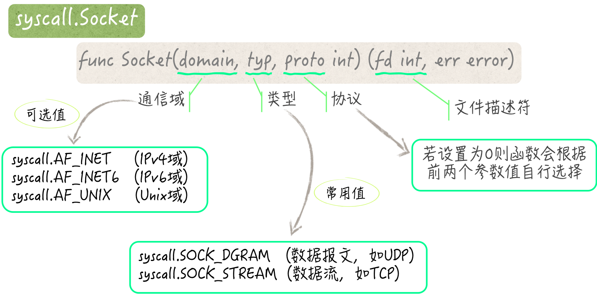

（syscall.Socket 函数一瞥）

不过，你也看到了，在使用net包中的高层次 API 的时候，我们连那前两个参数值都无需给定，只需要把前面罗列的那些字符串字面量的其中一个，作为network参数的值就好了。

当然，如果你在使用这些 API 的时候，能够想到我在上面说的这些基础知识的话，那么一定会对你做出正确的判断和选择有所帮助。

```go
package main

import (
	"bufio"
	"crypto/tls"
	"fmt"
	"io"
	"net"
	"runtime"
)

func main() {
	network := "tcp"
	host := "google.cn"
	reqStrTpl := `HEAD / HTTP/1.1
Accept: */*
Accept-Encoding: gzip, deflate
Connection: keep-alive
Host: %s
User-Agent: Dialer/%s


`

	// 示例1。
	network1 := network + "4"
	address1 := host + ":80"
	fmt.Printf("Dial %q with network %q ...\n", address1, network1)
	conn1, err := net.Dial(network1, address1)
	if err != nil {
		fmt.Printf("dial error: %v\n", err)
		return
	}
	defer conn1.Close()

	reqStr1 := fmt.Sprintf(reqStrTpl, host, runtime.Version())
	fmt.Printf("The request:\n%s\n", reqStr1)
	_, err = io.WriteString(conn1, reqStr1)
	if err != nil {
		fmt.Printf("write error: %v\n", err)
		return
	}
	fmt.Println()

	reader1 := bufio.NewReader(conn1)
	line1, err := reader1.ReadString('\n')
	if err != nil {
		fmt.Printf("read error: %v\n", err)
		return
	}
	fmt.Printf("The first line of response:\n%s\n", line1)
	fmt.Println()

	// 示例2。
	tlsConf := &tls.Config{
		InsecureSkipVerify: true,
		MinVersion:         tls.VersionTLS10,
	}
	network2 := network
	address2 := host + ":443"
	fmt.Printf("Dial %q with network %q ...\n", address2, network2)
	conn2, err := tls.Dial(network2, address2, tlsConf)
	if err != nil {
		fmt.Printf("dial error: %v\n", err)
		return
	}
	defer conn2.Close()

	reqStr2 := fmt.Sprintf(reqStrTpl, host, runtime.Version())
	fmt.Printf("The request:\n%s\n", reqStr2)
	_, err = io.WriteString(conn2, reqStr2)
	if err != nil {
		fmt.Printf("write error: %v\n", err)
		return
	}

	reader2 := bufio.NewReader(conn2)
	line2, err := reader2.ReadString('\n')
	if err != nil {
		fmt.Printf("read error: %v\n", err)
		return
	}
	fmt.Printf("The first line of response:\n%s\n", line2)
	fmt.Println()
}
```

### 知识扩展

#### 问题 1：调用net.DialTimeout函数时给定的超时时间意味着什么？

简单来说，这里的超时时间，代表着函数为网络连接建立完成而等待的最长时间。这是一个相对的时间。它会由这个函数的参数timeout的值表示。

开始的时间点几乎是我们调用net.DialTimeout函数的那一刻。在这之后，时间会主要花费在“解析参数network和address的值”，以及“创建 socket 实例并建立网络连接”这两件事情上。

不论执行到哪一步，只要在绝对的超时时间达到的那一刻，网络连接还没有建立完成，该函数就会返回一个代表了 I/O 操作超时的错误值。

值得注意的是，在解析address的值的时候，函数会确定网络服务的 IP 地址、端口号等必要信息，并在需要时访问 DNS 服务。

另外，如果解析出的 IP 地址有多个，那么函数会串行或并发地尝试建立连接。但无论用什么样的方式尝试，函数总会以最先建立成功的那个连接为准。

同时，它还会根据超时前的剩余时间，去设定针对每次连接尝试的超时时间，以便让它们都有适当的时间执行。

再多说一点。在net包中还有一个名为Dialer的结构体类型。该类型有一个名叫Timeout的字段，它与上述的timeout参数的含义是完全一致的。实际上，net.DialTimeout函数正是利用了这个类型的值才得以实现功能的。

net.Dialer类型值得你好好学习一下，尤其是它的每个字段的功用以及它的DialContext方法。

```go
package main

import (
	"fmt"
	"net"
	"time"
)

type dailArgs struct {
	network string
	address string
	timeout time.Duration
}

func main() {
	dialArgsList := []dailArgs{
		{
			"tcp",
			"google.cn:80",
			time.Millisecond * 500,
		},
		{
			"tcp",
			"google.com:80",
			time.Second * 2,
		},
		{
			// 如果在这种情况下发生的错误是：
			// "connect: operation timed out"，
			// 那么代表着什么呢？
			//
			// 简单来说，此错误表示底层的socket在连接网络服务的时候先超时了。
			// 这时抛出的其实是'syscall.ETIMEDOUT'常量代表的错误值。
			"tcp",
			"google.com:80",
			time.Minute * 4,
		},
	}
	for _, args := range dialArgsList {
		fmt.Printf("Dial %q with network %q and timeout %s ...\n",
			args.address, args.network, args.timeout)
		ts1 := time.Now()
		conn, err := net.DialTimeout(args.network, args.address, args.timeout)
		ts2 := time.Now()
		fmt.Printf("Elapsed time: %s\n", time.Duration(ts2.Sub(ts1)))
		if err != nil {
			fmt.Printf("dial error: %v\n", err)
			fmt.Println()
			continue
		}
		defer conn.Close()
		fmt.Printf("The local address: %s\n", conn.LocalAddr())
		fmt.Printf("The remote address: %s\n", conn.RemoteAddr())
		fmt.Println()
	}
}
```

### 总结

我们今天提及了使用 Go 语言进行网络编程这个主题。作为引子，我先向你介绍了关于 socket 的一些基础知识。socket 常被翻译为套接字，它是一种 IPC 方法。IPC 可以被翻译为进程间通信，它主要定义了多个进程之间相互通信的方法。

Socket 是 IPC 方法中最为通用和灵活的一种。与其他的方法不同，利用 socket 进行通信的进程可以不局限在同一台计算机当中。

只要通信的双方能够通过计算机的网卡端口，以及网络进行互联就可以使用 socket，无论它们存在于世界上的哪个角落。

支持 socket 的操作系统一般都会对外提供一套 API。Go 语言的syscall代码包中也有与之对应的程序实体。其中最重要的一个就是syscall.Socket函数。

不过，syscall包中的这些程序实体，对于普通的 Go 程序来说都属于底层的东西了，我们通常很少会用到。一般情况下，我们都会使用net代码包及其子包中的 API 去编写网络程序。

net包中一个很常用的函数，名为Dial。这个函数主要用于连接网络服务。它会接受两个参数，你需要搞明白这两个参数的值都应该怎么去设定。

尤其是network参数，它有很多的可选值，其中最常用的有 9 个。这些可选值的背后都代表着相应的 socket 属性，包括通信域、类型以及使用的协议。一旦你理解了这些 socket 属性，就一定会帮助你做出正确的判断和选择。

与此相关的一个函数是net.DialTimeout。我们在调用它的时候需要设定一个超时时间。这个超时时间的含义你是需要搞清楚的。

通过它，我们可以牵扯出这个函数的一大堆实现细节。另外，还有一个叫做net.Dialer的结构体类型。这个类型其实是前述两个函数的底层实现，值得你好好地学习一番。

以上，就是我今天讲的主要内容，它们都是关于怎样访问网络服务的。你可以从这里入手，进入 Go 语言的网络编程世界。

## 思考题

今天的思考题也与超时时间有关。在你调用了net.Dial等函数之后，如果成功就会得到一个代表了网络连接的net.Conn接口类型的值。我的问题是：怎样在net.Conn类型的值上正确地设定针对读操作和写操作的超时时间？

## 47 | 基于HTTP协议的网络服务

我们在上一篇文章中简单地讨论了网络编程和 socket，并由此提及了 Go 语言标准库中的syscall代码包和net代码包。

我还重点讲述了net.Dial函数和syscall.Socket函数的参数含义。前者间接地调用了后者，所以正确理解后者，会对用好前者有很大裨益。

之后，我们把视线转移到了net.DialTimeout函数以及它对操作超时的处理上，这又涉及了net.Dialer类型。实际上，这个类型正是net包中这两个“拨号”函数的底层实现。

我们像上一篇文章的示例代码那样用net.Dial或net.DialTimeout函数来访问基于 HTTP 协议的网络服务是完全没有问题的。HTTP 协议是基于 TCP/IP 协议栈的，并且它也是一个面向普通文本的协议。

原则上，我们使用任何一个文本编辑器，都可以轻易地写出一个完整的 HTTP 请求报文。只要你搞清楚了请求报文的头部（header）和主体（body）应该包含的内容，这样做就会很容易。所以，在这种情况下，即便直接使用net.Dial函数，你应该也不会感觉到困难。

不过，不困难并不意味着很方便。如果我们只是访问基于 HTTP 协议的网络服务的话，那么使用net/http代码包中的程序实体来做，显然会更加便捷。

其中，最便捷的是使用http.Get函数。我们在调用它的时候只需要传给它一个 URL 就可以了，比如像下面这样：

```go
url1 := "http://google.cn"
fmt.Printf("Send request to %q with method GET ...\n", url1)
resp1, err := http.Get(url1)
if err != nil {
  fmt.Printf("request sending error: %v\n", err)
}
defer resp1.Body.Close()
line1 := resp1.Proto + " " + resp1.Status
fmt.Printf("The first line of response:\n%s\n", line1)
```

http.Get函数会返回两个结果值。第一个结果值的类型是*http.Response，它是网络服务给我们传回来的响应内容的结构化表示。

第二个结果值是error类型的，它代表了在创建和发送 HTTP 请求，以及接收和解析 HTTP 响应的过程中可能发生的错误。

http.Get函数会在内部使用缺省的 HTTP 客户端，并且调用它的Get方法以完成功能。这个缺省的 HTTP 客户端是由net/http包中的公开变量DefaultClient代表的，其类型是*http.Client。它的基本类型也是可以被拿来使用的，甚至它还是开箱即用的。下面的这两行代码：

```go
var httpClient1 http.Client
resp2, err := httpClient1.Get(url1)
```

与前面的这一行代码

```
resp1, err := http.Get(url1)
```

是等价的。

http.Client是一个结构体类型，并且它包含的字段都是公开的。之所以该类型的零值仍然可用，是因为它的这些字段要么存在着相应的缺省值，要么其零值直接就可以使用，且代表着特定的含义。

```go
package main

import (
	"fmt"
	"net/http"
)

func main() {
	host := "google.cn"

	// 示例1。
	url1 := "http://" + host
	fmt.Printf("Send request to %q with method GET ...\n", url1)
	resp1, err := http.Get(url1)
	if err != nil {
		fmt.Printf("request sending error: %v\n", err)
		return
	}
	defer resp1.Body.Close()
	line1 := resp1.Proto + " " + resp1.Status
	fmt.Printf("The first line of response:\n%s\n", line1)
	fmt.Println()

	// 示例2。
	url2 := "https://golang." + host
	fmt.Printf("Send request to %q with method GET ...\n", url2)
	var httpClient1 http.Client
	resp2, err := httpClient1.Get(url2)
	if err != nil {
		fmt.Printf("request sending error: %v\n", err)
		return
	}
	defer resp2.Body.Close()
	line2 := resp2.Proto + " " + resp2.Status
	fmt.Printf("The first line of response:\n%s\n", line2)
}
```

现在，我问你一个问题，是关于这个类型中的最重要的一个字段的。

**今天的问题是：http.Client类型中的Transport字段代表着什么？**

这道题的**典型回答**是这样的。

http.Client类型中的Transport字段代表着：向网络服务发送 HTTP 请求，并从网络服务接收 HTTP 响应的操作过程。也就是说，该字段的方法RoundTrip应该实现单次 HTTP 事务（或者说基于 HTTP 协议的单次交互）需要的所有步骤。

这个字段是http.RoundTripper接口类型的，它有一个由http.DefaultTransport变量代表的缺省值（以下简称DefaultTransport）。当我们在初始化一个http.Client类型的值（以下简称Client值）的时候，如果没有显式地为该字段赋值，那么这个Client值就会直接使用DefaultTransport。

顺便说一下，http.Client类型的Timeout字段，代表的正是前面所说的单次 HTTP 事务的超时时间，它是time.Duration类型的。它的零值是可用的，用于表示没有设置超时时间。

### 问题解析

下面，我们再通过该字段的缺省值DefaultTransport，来深入地了解一下这个Transport字段。

DefaultTransport的实际类型是*http.Transport，后者即为http.RoundTripper接口的默认实现。这个类型是可以被复用的，也推荐被复用，同时，它也是并发安全的。正因为如此，http.Client类型也拥有着同样的特质。

http.Transport类型，会在内部使用一个net.Dialer类型的值（以下简称Dialer值），并且，它会把该值的Timeout字段的值，设定为30秒。

也就是说，这个Dialer值如果在 30 秒内还没有建立好网络连接，那么就会被判定为操作超时。在DefaultTransport的值被初始化的时候，这样的Dialer值的DialContext方法会被赋给前者的DialContext字段。

http.Transport类型还包含了很多其他的字段，其中有一些字段是关于操作超时的。

- IdleConnTimeout：含义是空闲的连接在多久之后就应该被关闭。
- DefaultTransport会把该字段的值设定为90秒。如果该值为0，那么就表示不关闭空闲的连接。注意，这样很可能会造成资源的泄露。
- ResponseHeaderTimeout：含义是，从客户端把请求完全递交给操作系统到从操作系统那里接收到响应报文头的最大时长。DefaultTransport并没有设定该字段的值。
- ExpectContinueTimeout：含义是，在客户端递交了请求报文头之后，等待接收第一个响应报文头的最长时间。在客户端想要使用 HTTP 的“POST”方法把一个很大的报文体发送给服务端的时候，它可以先通过发送一个包含了“Expect: 100-continue”的请求报文头，来询问服务端是否愿意接收这个大报文体。这个字段就是用于设定在这种情况下的超时时间的。注意，如果该字段的值不大于0，那么无论多大的请- 求报文体都将会被立即发送出去。这样可能会造成网络资源的浪费。DefaultTransport把该字段的值设定为了1秒。
- TLSHandshakeTimeout：TLS 是 Transport Layer Security 的缩写，可以被翻译为传输层安全。这个字段代表了基于 TLS 协议的连接在被建立时的握手阶段的超时时间。若该值为0，则表示对这个时间不设限。DefaultTransport把该字段的值设定为了10秒。

此外，还有一些与IdleConnTimeout相关的字段值得我们关注，即：MaxIdleConns、MaxIdleConnsPerHost以及MaxConnsPerHost。

无论当前的http.Transport类型的值（以下简称Transport值）访问了多少个网络服务，MaxIdleConns字段都只会对空闲连接的总数做出限定。而MaxIdleConnsPerHost字段限定的则是，该Transport值访问的每一个网络服务的最大空闲连接数。

每一个网络服务都会有自己的网络地址，可能会使用不同的网络协议，对于一些 HTTP 请求也可能会用到代理。Transport值正是通过这三个方面的具体情况，来鉴别不同的网络服务的。

MaxIdleConnsPerHost字段的缺省值，由http.DefaultMaxIdleConnsPerHost变量代表，值为2。也就是说，在默认情况下，对于某一个Transport值访问的每一个网络服务，它的空闲连接数都最多只能有两个。

与MaxIdleConnsPerHost字段的含义相似的，是MaxConnsPerHost字段。不过，后者限制的是，针对某一个Transport值访问的每一个网络服务的最大连接数，不论这些连接是否是空闲的。并且，该字段没有相应的缺省值，它的零值表示不对此设限。

DefaultTransport并没有显式地为MaxIdleConnsPerHost和MaxConnsPerHost这两个字段赋值，但是它却把MaxIdleConns字段的值设定为了100。

换句话说，在默认情况下，空闲连接的总数最大为100，而针对每个网络服务的最大空闲连接数为2。注意，上述两个与空闲连接数有关的字段的值应该是联动的，所以，你有时候需要根据实际情况来定制它们。

当然了，这首先需要我们在初始化Client值的时候，定制它的Transport字段的值。定制这个值的方式，可以参看DefaultTransport变量的声明。

最后，我简单说一下为什么会出现空闲的连接。我们都知道，HTTP 协议有一个请求报文头叫做“Connection”。在 HTTP 协议的 1.1 版本中，这个报文头的值默认是“keep-alive”。

在这种情况下的网络连接都是持久连接，它们会在当前的 HTTP 事务完成后仍然保持着连通性，因此是可以被复用的。

既然连接可以被复用，那么就会有两种可能。一种可能是，针对于同一个网络服务，有新的 HTTP 请求被递交，该连接被再次使用。另一种可能是，不再有对该网络服务的 HTTP 请求，该连接被闲置。

显然，后一种可能就产生了空闲的连接。另外，如果分配给某一个网络服务的连接过多的话，也可能会导致空闲连接的产生，因为每一个新递交的 HTTP 请求，都只会征用一个空闲的连接。所以，为空闲连接设定限制，在大多数情况下都是很有必要的，也是需要斟酌的。

如果我们想彻底地杜绝空闲连接的产生，那么可以在初始化Transport值的时候把它的DisableKeepAlives字段的值设定为true。这时，HTTP 请求的“Connection”报文头的值就会被设置为“close”。这会告诉网络服务，这个网络连接不必保持，当前的 HTTP 事务完成后就可以断开它了。

如此一来，每当一个 HTTP 请求被递交时，就都会产生一个新的网络连接。这样做会明显地加重网络服务以及客户端的负载，并会让每个 HTTP 事务都耗费更多的时间。所以，在一般情况下，我们都不要去设置这个DisableKeepAlives字段。

顺便说一句，在net.Dialer类型中，也有一个看起来很相似的字段KeepAlive。不过，它与前面所说的 HTTP 持久连接并不是一个概念，KeepAlive是直接作用在底层的 socket 上的。

它的背后是一种针对网络连接（更确切地说，是 TCP 连接）的存活探测机制。它的值用于表示每间隔多长时间发送一次探测包。当该值不大于0时，则表示不开启这种机制。DefaultTransport会把这个字段的值设定为30秒。

好了，以上这些内容阐述的就是，http.Client类型中的Transport字段的含义，以及它的值的定制方式。这涉及了http.RoundTripper接口、http.DefaultTransport变量、http.Transport类型，以及net.Dialer类型。

### 知识扩展

#### 问题：http.Server类型的ListenAndServe方法都做了哪些事情？

http.Server类型与http.Client是相对应的。http.Server代表的是基于 HTTP 协议的服务端，或者说网络服务。

http.Server类型的ListenAndServe方法的功能是：监听一个基于 TCP 协议的网络地址，并对接收到的 HTTP 请求进行处理。这个方法会默认开启针对网络连接的存活探测机制，以保证连接是持久的。同时，该方法会一直执行，直到有严重的错误发生或者被外界关掉。当被外界关掉时，它会返回一个由http.ErrServerClosed变量代表的错误值。

```go
package main

import (
	"fmt"
	"net"
	"net/http"
	"strings"
	"sync"
	"time"
)

// domains 包含了我们将要访问的一些网络域名。
// 你可以随意地对它们进行增、删、改，
// 不过这会影响到后面的输出内容。
var domains = []string{
	"google.com",
	"google.com.hk",
	"google.cn",
	"golang.org",
	"golang.google.cn",
}

func main() {
	// 你可以改变myTransport中的各个字段的值，
	// 并观察后面的输出会有什么不同。
	myTransport := &http.Transport{
		Proxy: http.ProxyFromEnvironment,
		DialContext: (&net.Dialer{
			Timeout:       15 * time.Second,
			KeepAlive:     15 * time.Second,
			FallbackDelay: 0,
		}).DialContext,
		MaxConnsPerHost:       2,
		MaxIdleConns:          10,
		MaxIdleConnsPerHost:   2,
		IdleConnTimeout:       30 * time.Second,
		ResponseHeaderTimeout: 0,
		ExpectContinueTimeout: 1 * time.Second,
		TLSHandshakeTimeout:   10 * time.Second,
	}
	// 你可以改变myClient中的各个字段的值，
	// 并观察后面的输出会有什么不同。
	myClient := http.Client{
		Transport: myTransport,
		Timeout:   20 * time.Second,
	}

	var wg sync.WaitGroup
	wg.Add(len(domains))
	for _, domain := range domains {
		go func(domain string) {
			var logBuf strings.Builder
			var diff time.Duration
			defer func() {
				logBuf.WriteString(
					fmt.Sprintf("(elapsed time: %s)\n", diff))
				fmt.Println(logBuf.String())
				wg.Done()
			}()
			url := "https://" + domain
			logBuf.WriteString(
				fmt.Sprintf("Send request to %q with method GET ...\n", url))
			t1 := time.Now()
			resp, err := myClient.Get(url)
			diff = time.Now().Sub(t1)
			if err != nil {
				logBuf.WriteString(
					fmt.Sprintf("request sending error: %v\n", err))
				return
			}
			defer resp.Body.Close()
			line2 := resp.Proto + " " + resp.Status
			logBuf.WriteString(
				fmt.Sprintf("The first line of response:\n%s\n", line2))
		}(domain)
	}
	wg.Wait()
}
```

对于本问题，典型回答可以像下面这样。

这个ListenAndServe方法主要会做下面这几件事情。

1、检查当前的http.Server类型的值（以下简称当前值）的Addr字段。该字段的值代表了当前的网络服务需要使用的网络地址，即：IP 地址和端口号. 如果这个字段的值为空字符串，那么就用":http"代替。也就是说，使用任何可以代表本机的域名和 IP 地址，并且端口号为80。

2、通过调用net.Listen函数在已确定的网络地址上启动基于 TCP 协议的监听。

3、检查net.Listen函数返回的错误值。如果该错误值不为nil，那么就直接返回该值。否则，通过调用当前值的Serve方法准备接受和处理将要到来的 HTTP 请求。

```go
package main

import (
	"fmt"
	"log"
	"net/http"
	"sync"
)

func main() {
	var wg sync.WaitGroup
	wg.Add(2)

	// 示例1。
	go startServer1(&wg)

	// 示例2。
	go startServer2(&wg)

	wg.Wait()
}

func startServer1(wg *sync.WaitGroup) {
	defer wg.Done()
	var httpServer1 http.Server
	httpServer1.Addr = "127.0.0.1:8080"
	// 由于我们没有定制handler，所以这个网络服务对任何请求都只会响应404。
	if err := httpServer1.ListenAndServe(); err != nil {
		if err == http.ErrServerClosed {
			log.Println("HTTP server 1 closed.")
		} else {
			log.Printf("HTTP server 1 error: %v\n", err)
		}
	}
}

func startServer2(wg *sync.WaitGroup) {
	defer wg.Done()
	mux1 := http.NewServeMux()
	mux1.HandleFunc("/hi", func(w http.ResponseWriter, req *http.Request) {
		if req.URL.Path != "/hi" {
			http.NotFound(w, req)
			return
		}
		name := req.FormValue("name")
		if name == "" {
			fmt.Fprint(w, "Welcome!")
		} else {
			fmt.Fprintf(w, "Welcome, %s!", name)
		}
	})
	httpServer2 := http.Server{
		Addr:    "127.0.0.1:8081",
		Handler: mux1,
	}
	if err := httpServer2.ListenAndServe(); err != nil {
		if err == http.ErrServerClosed {
			log.Println("HTTP server 2 closed.")
		} else {
			log.Printf("HTTP server 2 error: %v\n", err)
		}
	}
}
```

可以从当前问题直接衍生出的问题一般有两个，一个是“net.Listen函数都做了哪些事情”，另一个是“http.Server类型的Serve方法是怎样接受和处理 HTTP 请求的”。

**对于第一个直接的衍生问题，如果概括地说，回答可以是：**

1、解析参数值中包含的网络地址隐含的 IP 地址和端口号；

2、根据给定的网络协议，确定监听的方法，并开始进行监听。

从这里的第二个步骤出发，我们还可以继续提出一些间接的衍生问题。这往往会涉及net.socket函数以及相关的 socket 知识。

**对于第二个直接的衍生问题，我们可以这样回答：**

在一个for循环中，网络监听器的Accept方法会被不断地调用，该方法会返回两个结果值；第一个结果值是net.Conn类型的，它会代表包含了新到来的 HTTP 请求的网络连接；第二个结果值是代表了可能发生的错误的error类型值。

如果这个错误值不为nil，除非它代表了一个暂时性的错误，否则循环都会被终止。如果是暂时性的错误，那么循环的下一次迭代将会在一段时间之后开始执行。

如果这里的Accept方法没有返回非nil的错误值，那么这里的程序将会先把它的第一个结果值包装成一个*http.conn类型的值（以下简称conn值），然后通过在新的 goroutine 中调用这个conn值的serve方法，来对当前的 HTTP 请求进行处理。

这个处理的细节还是很多的，所以我们依然可以找出不少的间接的衍生问题。比如，这个conn值的状态有几种，分别代表着处理的哪个阶段？又比如，处理过程中会用到哪些读取器和写入器，它们的作用分别是什么？再比如，这里的程序是怎样调用我们自定义的处理函数的，等等。

诸如此类的问题很多，我就不在这里一一列举和说明了。你只需要记住一句话：“源码之前了无秘密”。上面这些问题的答案都可以在 Go 语言标准库的源码中找到。如果你想对本问题进行深入的探索，那么一定要去看net/http代码包的源码。

### 总结

今天，我们主要讲的是基于 HTTP 协议的网络服务，侧重点仍然在客户端。

我们在讨论了http.Get函数和http.Client类型的简单使用方式之后，把目光聚焦在了后者的Transport字段。

这个字段代表着单次 HTTP 事务的操作过程。它是http.RoundTripper接口类型的。它的缺省值由http.DefaultTransport变量代表，其实际类型是*http.Transport。

http.Transport包含的字段非常多。我们先讲了DefaultTransport中的DialContext字段会被赋予什么样的值，又详细说明了一些关于操作超时的字段。

比如IdleConnTimeout和ExpectContinueTimeout，以及相关的MaxIdleConns和MaxIdleConnsPerHost等等。之后，我又简单地解释了出现空闲连接的原因，以及相关的定制方式。

最后，作为扩展，我还为你简要地梳理了http.Server类型的ListenAndServe方法，执行的主要流程。不过，由于篇幅原因，我没有做深入讲述。但是，这并不意味着没有必要深入下去。相反，这个方法很重要，值得我们认真地去探索一番。

在你需要或者有兴趣的时候，我希望你能去好好地看一看net/http包中的相关源码。一切秘密都在其中。

### 思考题

我今天留给你的思考题比较简单，即：怎样优雅地停止基于 HTTP 协议的网络服务程序？

## 48 | 程序性能分析基础（上）

作为拾遗的部分，今天我们来讲讲与 Go 程序性能分析有关的基础知识。

Go 语言为程序开发者们提供了丰富的性能分析 API，和非常好用的标准工具。这些 API 主要存在于：

1、runtime/pprof；

2、net/http/pprof；

3、runtime/trace；

这三个代码包中。

另外，runtime代码包中还包含了一些更底层的 API。它们可以被用来收集或输出 Go 程序运行过程中的一些关键指标，并帮助我们生成相应的概要文件以供后续分析时使用。

至于标准工具，主要有go tool pprof和go tool trace这两个。它们可以解析概要文件中的信息，并以人类易读的方式把这些信息展示出来。

此外，go test命令也可以在程序测试完成后生成概要文件。如此一来，我们就可以很方便地使用前面那两个工具读取概要文件，并对被测程序的性能加以分析。这无疑会让程序性能测试的一手资料更加丰富，结果更加精确和可信。

在 Go 语言中，用于分析程序性能的概要文件有三种，分别是：CPU 概要文件（CPU Profile）、内存概要文件（Mem Profile）和阻塞概要文件（Block Profile）。

这些概要文件中包含的都是：在某一段时间内，对 Go 程序的相关指标进行多次采样后得到的概要信息。

对于 CPU 概要文件来说，其中的每一段独立的概要信息都记录着，在进行某一次采样的那个时刻，CPU 上正在执行的 Go 代码。

而对于内存概要文件，其中的每一段概要信息都记载着，在某个采样时刻，正在执行的 Go 代码以及堆内存的使用情况，这里包含已分配和已释放的字节数量和对象数量。至于阻塞概要文件，其中的每一段概要信息，都代表着 Go 程序中的一个 goroutine 阻塞事件。

注意，在默认情况下，这些概要文件中的信息并不是普通的文本，它们都是以二进制的形式展现的。如果你使用一个常规的文本编辑器查看它们的话，那么肯定会看到一堆“乱码”。

这时就可以显现出go tool pprof这个工具的作用了。我们可以通过它进入一个基于命令行的交互式界面，并对指定的概要文件进行查阅。就像下面这样：

```
$ go tool pprof cpuprofile.out
Type: cpu
Time: Nov 9, 2018 at 4:31pm (CST)
Duration: 7.96s, Total samples = 6.88s (86.38%)
Entering interactive mode (type "help" for commands, "o" for options)
(pprof) 
```

关于这个工具的具体用法，我就不在这里赘述了。在进入这个工具的交互式界面之后，我们只要输入指令help并按下回车键，就可以看到很详细的帮助文档。

我们现在来说说怎样生成概要文件。

你可能会问，既然在概要文件中的信息不是普通的文本，那么它们到底是什么格式的呢？一个对广大的程序开发者而言，并不那么重要的事实是，它们是通过 protocol buffers 生成的二进制数据流，或者说字节流。

概括来讲，protocol buffers 是一种数据序列化协议，同时也是一个序列化工具。它可以把一个值，比如一个结构体或者一个字典，转换成一段字节流。

也可以反过来，把经过它生成的字节流反向转换为程序中的一个值。前者就被叫做序列化，而后者则被称为反序列化。

换句话说，protocol buffers 定义和实现了一种“可以让数据在结构形态和扁平形态之间互相转换”的方式。

Protocol buffers 的优势有不少。比如，它可以在序列化数据的同时对数据进行压缩，所以它生成的字节流，通常都要比相同数据的其他格式（例如 XML 和 JSON）占用的空间明显小很多。

又比如，它既能让我们自己去定义数据序列化和结构化的格式，也允许我们在保证向后兼容的前提下去更新这种格式。

正因为这些优势，Go 语言从 1.8 版本开始，把所有 profile 相关的信息生成工作都交给 protocol buffers 来做了。这也是我们在上述概要文件中，看不到普通文本的根本原因了。

Protocol buffers 的用途非常广泛，并且在诸如数据存储、数据传输等任务中有着很高的使用率。不过，关于它，我暂时就介绍到这里。你目前知道这些也就足够了。你并不用关心runtime/pprof包以及runtime包中的程序是如何序列化这些概要信息的。

继续回到怎样生成概要文件的话题，我们依然通过具体的问题来讲述。

**我们今天的问题是：怎样让程序对 CPU 概要信息进行采样？**

**这道题的典型回答是这样的。**

这需要用到runtime/pprof包中的 API。更具体地说，在我们想让程序开始对 CPU 概要信息进行采样的时候，需要调用这个代码包中的StartCPUProfile函数，而在停止采样的时候则需要调用该包中的StopCPUProfile函数。

### 问题解析

runtime/pprof.StartCPUProfile函数（以下简称StartCPUProfile函数）在被调用的时候，先会去设定 CPU 概要信息的采样频率，并会在单独的 goroutine 中进行 CPU 概要信息的收集和输出。

注意，StartCPUProfile函数设定的采样频率总是固定的，即：100赫兹。也就是说，每秒采样100次，或者说每10毫秒采样一次。

赫兹，也称 Hz，是从英文单词“Hertz”（一个英文姓氏）音译过来的一个中文词。它是 CPU 主频的基本单位。

CPU 的主频指的是，CPU 内核工作的时钟频率，也常被称为 CPU clock speed。这个时钟频率的倒数即为时钟周期（clock cycle），也就是一个 CPU 内核执行一条运算指令所需的时间，单位是秒。

例如，主频为1000Hz 的 CPU，它的单个内核执行一条运算指令所需的时间为0.001秒，即1毫秒。又例如，我们现在常用的3.2GHz 的多核 CPU，其单个内核在1个纳秒的时间里就可以至少执行三条运算指令。

StartCPUProfile函数设定的 CPU 概要信息采样频率，相对于现代的 CPU 主频来说是非常低的。这主要有两个方面的原因。

一方面，过高的采样频率会对 Go 程序的运行效率造成很明显的负面影响。因此，runtime包中SetCPUProfileRate函数在被调用的时候，会保证采样频率不超过1MHz（兆赫），也就是说，它只允许每1微秒最多采样一次。StartCPUProfile函数正是通过调用这个函数来设定 CPU 概要信息的采样频率的。

另一方面，经过大量的实验，Go 语言团队发现100Hz 是一个比较合适的设定。因为这样做既可以得到足够多、足够有用的概要信息，又不至于让程序的运行出现停滞。另外，操作系统对高频采样的处理能力也是有限的，一般情况下，超过500Hz 就很可能得不到及时的响应了。

在StartCPUProfile函数执行之后，一个新启用的 goroutine 将会负责执行 CPU 概要信息的收集和输出，直到runtime/pprof包中的StopCPUProfile函数被成功调用。

StopCPUProfile函数也会调用runtime.SetCPUProfileRate函数，并把参数值（也就是采样频率）设为0。这会让针对 CPU 概要信息的采样工作停止。

同时，它也会给负责收集 CPU 概要信息的代码一个“信号”，以告知收集工作也需要停止了。

在接到这样的“信号”之后，那部分程序将会把这段时间内收集到的所有 CPU 概要信息，全部写入到我们在调用StartCPUProfile函数的时候指定的写入器中。只有在上述操作全部完成之后，StopCPUProfile函数才会返回。

好了，经过这一番解释，你应该已经对 CPU 概要信息的采样工作有一定的认识了。你可以去看看 demo96.go 文件中的代码，并运行几次试试。这样会有助于你加深对这个问题的理解。

```
package main

import (
	"errors"
	"fmt"
	"os"
	"puzzlers/article37/common"
	"puzzlers/article37/common/op"
	"runtime/pprof"
)

var (
	profileName = "cpuprofile.out"
)

func main() {
	f, err := common.CreateFile("", profileName)
	if err != nil {
		fmt.Printf("CPU profile creation error: %v\n", err)
		return
	}
	defer f.Close()
	if err := startCPUProfile(f); err != nil {
		fmt.Printf("CPU profile start error: %v\n", err)
		return
	}
	if err = common.Execute(op.CPUProfile, 10); err != nil {
		fmt.Printf("execute error: %v\n", err)
		return
	}
	stopCPUProfile()
}

func startCPUProfile(f *os.File) error {
	if f == nil {
		return errors.New("nil file")
	}
	return pprof.StartCPUProfile(f)
}

func stopCPUProfile() {
	pprof.StopCPUProfile()
}
```

### 总结

我们这两篇内容讲的是 Go 程序的性能分析，这其中的内容都是你从事这项任务必备的一些知识和技巧。

首先，我们需要知道，与程序性能分析有关的 API 主要存在于runtime、runtime/pprof和net/http/pprof这几个代码包中。它们可以帮助我们收集相应的性能概要信息，并把这些信息输出到我们指定的地方。

Go 语言的运行时系统会根据要求对程序的相关指标进行多次采样，并对采样的结果进行组织和整理，最后形成一份完整的性能分析报告。这份报告就是我们一直在说的概要信息的汇总。

一般情况下，我们会把概要信息输出到文件。根据概要信息的不同，概要文件的种类主要有三个，分别是：CPU 概要文件（CPU Profile）、内存概要文件（Mem Profile）和阻塞概要文件（Block Profile）。

## 49 | 程序性能分析基础（下）

在上一篇文章中，我们围绕着“怎样让程序对 CPU 概要信息进行采样”这一问题进行了探讨，今天，我们再来一起看看它的拓展问题。

### 知识扩展

#### 问题 1：怎样设定内存概要信息的采样频率？

针对内存概要信息的采样会按照一定比例收集 Go 程序在运行期间的堆内存使用情况。设定内存概要信息采样频率的方法很简单，只要为runtime.MemProfileRate变量赋值即可。

这个变量的含义是，平均每分配多少个字节，就对堆内存的使用情况进行一次采样。如果把该变量的值设为0，那么，Go 语言运行时系统就会完全停止对内存概要信息的采样。该变量的缺省值是512 KB，也就是512千字节。

注意，如果你要设定这个采样频率，那么越早设定越好，并且只应该设定一次，否则就可能会对 Go 语言运行时系统的采样工作，造成不良影响。比如，只在main函数的开始处设定一次。

在这之后，当我们想获取内存概要信息的时候，还需要调用runtime/pprof包中的WriteHeapProfile函数。该函数会把收集好的内存概要信息，写到我们指定的写入器中。

注意，我们通过WriteHeapProfile函数得到的内存概要信息并不是实时的，它是一个快照，是在最近一次的内存垃圾收集工作完成时产生的。如果你想要实时的信息，那么可以调用runtime.ReadMemStats函数。不过要特别注意，该函数会引起 Go 语言调度器的短暂停顿。

以上，就是关于内存概要信息的采样频率设定问题的简要回答。

```go
package main

import (
	"048程序性能分析基础/common"
	"048程序性能分析基础/common/op"
	"errors"
	"fmt"
	"os"
	"runtime"
	"runtime/pprof"
)

var (
	profileName    = "memprofile.out"
	memProfileRate = 8
)

func main() {
	f, err := common.CreateFile("", profileName)
	if err != nil {
		fmt.Printf("memory profile creation error: %v\n", err)
		return
	}
	defer f.Close()
	startMemProfile()
	if err = common.Execute(op.MemProfile, 10); err != nil {
		fmt.Printf("execute error: %v\n", err)
		return
	}
	if err := stopMemProfile(f); err != nil {
		fmt.Printf("memory profile stop error: %v\n", err)
		return
	}
}

func startMemProfile() {
	runtime.MemProfileRate = memProfileRate
}

func stopMemProfile(f *os.File) error {
	if f == nil {
		return errors.New("nil file")
	}
	return pprof.WriteHeapProfile(f)
}
```

#### 问题 2：怎样获取到阻塞概要信息？

我们调用runtime包中的SetBlockProfileRate函数，即可对阻塞概要信息的采样频率进行设定。该函数有一个名叫rate的参数，它是int类型的。

这个参数的含义是，只要发现一个阻塞事件的持续时间达到了多少个纳秒，就可以对其进行采样。如果这个参数的值小于或等于0，那么就意味着 Go 语言运行时系统将会完全停止对阻塞概要信息的采样。

在runtime包中，还有一个名叫blockprofilerate的包级私有变量，它是uint64类型的。这个变量的含义是，只要发现一个阻塞事件的持续时间跨越了多少个 CPU 时钟周期，就可以对其进行采样。它的含义与我们刚刚提到的rate参数的含义非常相似，不是吗？

实际上，这两者的区别仅仅在于单位不同。runtime.SetBlockProfileRate函数会先对参数rate的值进行单位换算和必要的类型转换，然后，它会把换算结果用原子操作赋给blockprofilerate变量。由于此变量的缺省值是0，所以 Go 语言运行时系统在默认情况下并不会记录任何在程序中发生的阻塞事件。

另一方面，当我们需要获取阻塞概要信息的时候，需要先调用runtime/pprof包中的Lookup函数并传入参数值"block"，从而得到一个*runtime/pprof.Profile类型的值（以下简称Profile值）。在这之后，我们还需要调用这个Profile值的WriteTo方法，以驱使它把概要信息写进我们指定的写入器中。

这个WriteTo方法有两个参数，一个参数就是我们刚刚提到的写入器，它是io.Writer类型的。而另一个参数则是代表了概要信息详细程度的int类型参数debug。

debug参数主要的可选值有两个，即：0和1。当debug的值为0时，通过WriteTo方法写进写入器的概要信息仅会包含go tool pprof工具所需的内存地址，这些内存地址会以十六进制的形式展现出来。

当该值为1时，相应的包名、函数名、源码文件路径、代码行号等信息就都会作为注释被加入进去。另外，debug为0时的概要信息，会经由 protocol buffers 转换为字节流。而在debug为1的时候，WriteTo方法输出的这些概要信息就是我们可以读懂的普通文本了。

除此之外，debug的值也可以是2。这时，被输出的概要信息也会是普通的文本，并且通常会包含更多的细节。至于这些细节都包含了哪些内容，那就要看我们调用runtime/pprof.Lookup函数的时候传入的是什么样的参数值了。下面，我们就来一起看一下这个函数。

```go
package main

import (
	"048程序性能分析基础/common"
	"048程序性能分析基础/common/op"
	"errors"
	"fmt"
	"os"
	"runtime"
	"runtime/pprof"
)

var (
	profileName      = "blockprofile.out"
	blockProfileRate = 2
	debug            = 0
)

func main() {
	f, err := common.CreateFile("", profileName)
	if err != nil {
		fmt.Printf("block profile creation error: %v\n", err)
		return
	}
	defer f.Close()
	startBlockProfile()
	if err = common.Execute(op.BlockProfile, 10); err != nil {
		fmt.Printf("execute error: %v\n", err)
		return
	}
	if err := stopBlockProfile(f); err != nil {
		fmt.Printf("block profile stop error: %v\n", err)
		return
	}
}

func startBlockProfile() {
	runtime.SetBlockProfileRate(blockProfileRate)
}

func stopBlockProfile(f *os.File) error {
	if f == nil {
		return errors.New("nil file")
	}
	return pprof.Lookup("block").WriteTo(f, debug)
}
```

#### 问题 3：runtime/pprof.Lookup函数的正确调用方式是什么？

runtime/pprof.Lookup函数（以下简称Lookup函数）的功能是，提供与给定的名称相对应的概要信息。这个概要信息会由一个Profile值代表。如果该函数返回了一个nil，那么就说明不存在与给定名称对应的概要信息。

runtime/pprof包已经为我们预先定义了 6 个概要名称。它们对应的概要信息收集方法和输出方法也都已经准备好了。我们直接拿来使用就可以了。它们是：goroutine、heap、allocs、threadcreate、block和mutex。

当我们把"goroutine"传入Lookup函数的时候，该函数会利用相应的方法，收集到当前正在使用的所有 goroutine 的堆栈跟踪信息。注意，这样的收集会引起 Go 语言调度器的短暂停顿。

当调用该函数返回的Profile值的WriteTo方法时，如果参数debug的值大于或等于2，那么该方法就会输出所有 goroutine 的堆栈跟踪信息。这些信息可能会非常多。

如果它们占用的空间超过了64 MB（也就是64兆字节），那么相应的方法就会将超出的部分截掉。如果Lookup函数接到的参数值是"heap"，那么它就会收集与堆内存的分配和释放有关的采样信息。这实际上就是我们在前面讨论过的内存概要信息。

在我们传入"allocs"的时候，后续的操作会与之非常的相似。在这两种情况下，Lookup函数返回的Profile值也会极其相像。只不过，在这两种Profile值的WriteTo方法被调用时，它们输出的概要信息会有细微的差别，而且这仅仅体现在参数debug等于0的时候。

"heap"会使得被输出的内存概要信息默认以“在用空间”（inuse_space）的视角呈现，而"allocs"对应的默认视角则是“已分配空间”（alloc_space）。

“在用空间”是指，已经被分配但还未被释放的内存空间。在这个视角下，go tool pprof工具并不会去理会与已释放空间有关的那部分信息。而在“已分配空间”的视角下，所有的内存分配信息都会被展现出来，无论这些内存空间在采样时是否已被释放。

此外，无论是"heap"还是"allocs"，在我们调用Profile值的WriteTo方法的时候，只要赋予debug参数的值大于0，那么该方法输出内容的规格就会是相同的。

参数值"threadcreate"会使Lookup函数去收集一些堆栈跟踪信息。这些堆栈跟踪信息中的每一个都会描绘出一个代码调用链，这些调用链上的代码都导致新的操作系统线程产生。这样的Profile值的输出规格也只有两种，取决于我们传给其WriteTo方法的参数值是否大于0。

再说"block"和"mutex"。"block"代表的是，因争用同步原语而被阻塞的那些代码的堆栈跟踪信息。还记得吗？这就是我们在前面讲过的阻塞概要信息。

与之相对应，"mutex"代表的是，曾经作为同步原语持有者的那些代码，它们的堆栈跟踪信息。它们的输出规格也都只有两种，取决于debug是否大于0。

这里所说的同步原语，指的是存在于 Go 语言运行时系统内部的一种底层的同步工具，或者说一种同步机制。

它是直接面向内存地址的，并以异步信号量和原子操作作为实现手段。我们已经熟知的通道、互斥锁、条件变量、”WaitGroup“，以及 Go 语言运行时系统本身，都会利用它来实现自己的功能。

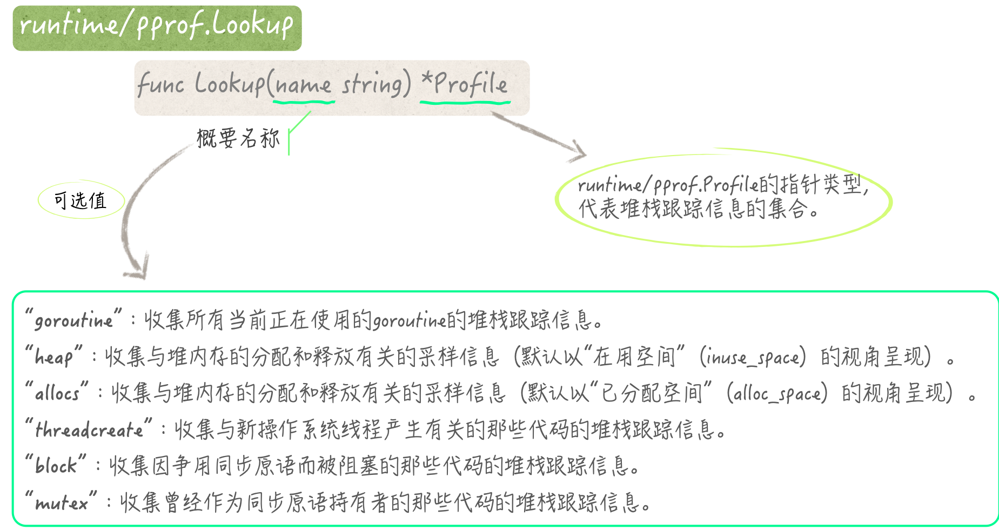

好了，关于这个问题，我们已经谈了不少了。我相信，你已经对Lookup函数的调用方式及其背后的含义有了比较深刻的理解了。demo99.go 文件中包含了一些示例代码，可供你参考。

```go
package main

import (
	"048程序性能分析基础/common"
	"048程序性能分析基础/common/op"
	"fmt"
	"os"
	"path/filepath"
	"runtime"
	"runtime/pprof"
	"time"
)

// profileNames 代表概要信息名称的列表。
var profileNames = []string{
	"goroutine",
	"heap",
	"allocs",
	"threadcreate",
	"block",
	"mutex",
}

// profileOps 代表为了生成不同的概要信息而准备的负载函数的字典。
var profileOps = map[string]common.OpFunc{
	"goroutine":    op.BlockProfile,
	"heap":         op.MemProfile,
	"allocs":       op.MemProfile,
	"threadcreate": op.BlockProfile,
	"block":        op.BlockProfile,
	"mutex":        op.BlockProfile,
}

// debugOpts 代表debug参数的可选值列表。
var debugOpts = []int{
	0,
	1,
	2,
}

func main() {
	prepare()
	dir, err := createDir()
	if err != nil {
		fmt.Printf("dir creation error: %v\n", err)
		return
	}
	for _, name := range profileNames {
		for _, debug := range debugOpts {
			err = genProfile(dir, name, debug)
			if err != nil {
				return
			}
			time.Sleep(time.Millisecond)
		}
	}
}

func genProfile(dir string, name string, debug int) error {
	fmt.Printf("Generate %s profile (debug: %d) ...\n", name, debug)
	fileName := fmt.Sprintf("%s_%d.out", name, debug)
	f, err := common.CreateFile(dir, fileName)
	if err != nil {
		fmt.Printf("create error: %v (%s)\n", err, fileName)
		return err
	}
	defer f.Close()
	if err = common.Execute(profileOps[name], 10); err != nil {
		fmt.Printf("execute error: %v (%s)\n", err, fileName)
		return err
	}
	profile := pprof.Lookup(name)
	err = profile.WriteTo(f, debug)
	if err != nil {
		fmt.Printf("write error: %v (%s)\n", err, fileName)
		return err
	}
	return nil
}

func createDir() (string, error) {
	currDir, err := os.Getwd()
	if err != nil {
		return "", err
	}
	path := filepath.Join(currDir, "profiles")
	err = os.Mkdir(path, 0766)
	if err != nil && !os.IsExist(err) {
		return "", err
	}
	return path, nil
}

func prepare() {
	runtime.MemProfileRate = 8
	runtime.SetBlockProfileRate(2)
}
```

#### 问题 4：如何为基于 HTTP 协议的网络服务添加性能分析接口？

这个问题说起来还是很简单的。这是因为我们在一般情况下只要在程序中导入net/http/pprof代码包就可以了，就像这样：

```
import _ "net/http/pprof"
```

然后，启动网络服务并开始监听，比如：

```
log.Println(http.ListenAndServe("localhost:8082", nil))
```

在运行这个程序之后，我们就可以通过在网络浏览器中访问http://localhost:8082/debug/pprof这个地址看到一个简约的网页。如果你认真地看了上一个问题的话，那么肯定可以快速搞明白这个网页中各个部分的含义。

在/debug/pprof/这个 URL 路径下还有很多可用的子路径，这一点你通过点选网页中的链接就可以了解到。像allocs、block、goroutine、heap、mutex、threadcreate这 6 个子路径，在底层其实都是通过Lookup函数来处理的。关于这个函数，你应该已经很熟悉了。

这些子路径都可以接受查询参数debug。它用于控制概要信息的格式和详细程度。至于它的可选值，我就不再赘述了。它的缺省值是0。另外，还有一个名叫gc的查询参数。它用于控制是否在获取概要信息之前强制地执行一次垃圾回收。只要它的值大于0，程序就会这样做。不过，这个参数仅在/debug/pprof/heap路径下有效。

一旦/debug/pprof/profile路径被访问，程序就会去执行对 CPU 概要信息的采样。它接受一个名为seconds的查询参数。该参数的含义是，采样工作需要持续多少秒。如果这个参数未被显式地指定，那么采样工作会持续30秒。注意，在这个路径下，程序只会响应经 protocol buffers 转换的字节流。我们可以通过go tool pprof工具直接读取这样的 HTTP 响应，例如：

```
go tool pprof http://localhost:6060/debug/pprof/profile?seconds=60
```

除此之外，还有一个值得我们关注的路径，即：/debug/pprof/trace。在这个路径下，程序主要会利用runtime/trace代码包中的 API 来处理我们的请求。

更具体地说，程序会先调用trace.Start函数，然后在查询参数seconds指定的持续时间之后再调用trace.Stop函数。这里的seconds的缺省值是1秒。至于runtime/trace代码包的功用，我就留给你自己去查阅和探索吧。

前面说的这些 URL 路径都是固定不变的。这是默认情况下的访问规则。我们还可以对它们进行定制，就像这样：

```go
mux := http.NewServeMux()
pathPrefix := "/d/pprof/"
mux.HandleFunc(pathPrefix,
  func(w http.ResponseWriter, r *http.Request) {
    name := strings.TrimPrefix(r.URL.Path, pathPrefix)
    if name != "" {
      pprof.Handler(name).ServeHTTP(w, r)
      return
    }
    pprof.Index(w, r)
  })
mux.HandleFunc(pathPrefix+"cmdline", pprof.Cmdline)
mux.HandleFunc(pathPrefix+"profile", pprof.Profile)
mux.HandleFunc(pathPrefix+"symbol", pprof.Symbol)
mux.HandleFunc(pathPrefix+"trace", pprof.Trace)

server := http.Server{
  Addr:    "localhost:8083",
  Handler: mux,
}
```

可以看到，我们几乎只使用了net/http/pprof代码包中的几个程序实体，就完成了这样的定制。这在我们使用第三方的网络服务开发框架时尤其有用。

我们自定义的 HTTP 请求多路复用器mux所包含的访问规则与默认的规则很相似，只不过 URL 路径的前缀更短了一些而已。

我们定制mux的过程与net/http/pprof包中的init函数所做的事情也是类似的。这个init函数的存在，其实就是我们在前面仅仅导入"net/http/pprof"代码包就能够访问相关路径的原因。

在我们编写网络服务程序的时候，使用net/http/pprof包要比直接使用runtime/pprof包方便和实用很多。通过合理运用，这个代码包可以为网络服务的监测提供有力的支撑。关于这个包的知识，我就先介绍到这里。

```go
package main

import (
	"log"
	"net/http"
	_ "net/http/pprof"
)

func main() {
	log.Println(http.ListenAndServe("localhost:8082", nil))
}
package main

import (
	"log"
	"net/http"
	"net/http/pprof"
	"strings"
)

func main() {
	mux := http.NewServeMux()
	pathPrefix := "/d/pprof/"
	mux.HandleFunc(pathPrefix,
		func(w http.ResponseWriter, r *http.Request) {
			name := strings.TrimPrefix(r.URL.Path, pathPrefix)
			if name != "" {
				pprof.Handler(name).ServeHTTP(w, r)
				return
			}
			pprof.Index(w, r)
		})
	mux.HandleFunc(pathPrefix+"cmdline", pprof.Cmdline)
	mux.HandleFunc(pathPrefix+"profile", pprof.Profile)
	mux.HandleFunc(pathPrefix+"symbol", pprof.Symbol)
	mux.HandleFunc(pathPrefix+"trace", pprof.Trace)

	server := http.Server{
		Addr:    "localhost:8083",
		Handler: mux,
	}

	if err := server.ListenAndServe(); err != nil {
		if err == http.ErrServerClosed {
			log.Println("HTTP server closed.")
		} else {
			log.Printf("HTTP server error: %v\n", err)
		}
	}
}
```

### 总结

这两篇文章中，我们主要讲了 Go 程序的性能分析，提到的很多内容都是你必备的知识和技巧。这些有助于你真正地理解以采样、收集、输出为代表的一系列操作步骤。

我提到的几种概要信息有关的问题。你需要记住的是，每一种概要信息都代表了什么，它们分别都包含了什么样的内容。

你还需要知道获取它们的正确方式，包括怎样启动和停止采样、怎样设定采样频率，以及怎样控制输出内容的格式和详细程度。

此外，runtime/pprof包中的Lookup函数的正确调用方式也很重要。对于除了 CPU 概要信息之外的其他概要信息，我们都可以通过调用这个函数获取到。

除此之外，我还提及了一个上层的应用，即：为基于 HTTP 协议的网络服务，添加性能分析接口。这也是很实用的一个部分。

虽然net/http/pprof包提供的程序实体并不多，但是它却能够让我们用不同的方式，实现性能分析接口的嵌入。这些方式有的是极简的、开箱即用的，而有的则用于满足各种定制需求。

以上这些，就是我今天为你讲述的 Go 语言知识，它们是程序性能分析的基础。如果你把 Go 语言程序运用于生产环境，那么肯定会涉及它们。对于这里提到的所有内容和问题，我都希望你能够认真地去思考和领会。这样才能够让你在真正使用它们的时候信手拈来。

### 思考题

我今天留给你的思考题其实在前面已经透露了，那就是：runtime/trace代码包的功用是什么？

## 新年彩蛋 | 完整版思考题答案

### 基础概念篇

1. Go 语言在多个工作区中查找依赖包的时候是以怎样的顺序进行的？

答：你设置的环境变量GOPATH的值决定了这个顺序。如果你在GOPATH中设置了多个工作区，那么这种查找会以从左到右的顺序在这些工作区中进行。

你可以通过试验来确定这个问题的答案。例如：先在一个源码文件中导入一个在你的机器上并不存在的代码包，然后编译这个代码文件。最后，将输出的编译错误信息与GOPATH的值进行对比。

1. 如果在多个工作区中都存在导入路径相同的代码包会产生冲突吗？

答：不会产生冲突。因为代码包的查找是按照已给定的顺序逐一地在多个工作区中进行的。

1. 默认情况下，我们可以让命令源码文件接受哪些类型的参数值？

答：这个问题通过查看flag代码包的文档就可以回答了。概括来讲，有布尔类型、整数类型、浮点数类型、字符串类型，以及time.Duration类型。

1. 我们可以把自定义的数据类型作为参数值的类型吗？如果可以，怎样做？

答：狭义上讲是不可以的，但是广义上讲是可以的。这需要一些定制化的工作，并且被给定的参数值只能是序列化的。具体可参见flag代码包文档中的例子。

1. 如果你需要导入两个代码包，而这两个代码包的导入路径的最后一级是相同的，比如：dep/lib/flag和flag，那么会产生冲突吗？

答：这会产生冲突。因为代表两个代码包的标识符重复了，都是flag。

1. 如果会产生冲突，那么怎样解决这种冲突？有几种方式？

答：接上一个问题。很简单，导入代码包的时候给它起一个别名就可以了，比如： import libflag "dep/lib/flag"。或者，以本地化的方式导入代码包，如：import . "dep/lib/flag"。

1. 如果与当前的变量重名的是外层代码块中的变量，那么意味着什么？

答：这意味着这两个变量成为了“可重名变量”。在内层的变量所处的那个代码块以及更深层次的代码块中，这个变量会“屏蔽”掉外层代码块中的那个变量。

1. 如果通过import . XXX这种方式导入的代码包中的变量与当前代码包中的变量重名了，那么 Go 语言是会把它们当做“可重名变量”看待还是会报错呢？

答：这两个变量会成为“可重名变量”。虽然这两个变量在这种情况下的作用域都是当前代码包的当前文件，但是它们所处的代码块是不同的。

前文件中的变量处在该文件所代表的代码块中，而被导入的代码包中的变量却处在声明它的那个文件所代表的代码块中。当然，我们也可以说被导入的代码包所代表的代码块包含了这个变量。

在当前文件中，本地的变量会“屏蔽”掉被导入的变量。

1. 除了《程序实体的那些事儿 3》一文中提及的那些，你还认为类型转换规则中有哪些值得注意的地方？

答：简单来说，我们在进行类型转换的时候需要注意各种符号的优先级。具体可参见 Go 语言规范中的转换部分。

1. 你能具体说说别名类型在代码重构过程中可以起到的哪些作用吗？

答：简单来说，我们可以通过别名类型实现外界无感知的代码重构。具体可参见 Go 语言官方的文档 Proposal: Type Aliases。

### 数据类型和语句篇

1. 如果有多个切片指向了同一个底层数组，那么你认为应该注意些什么？答：我们需要特别注意的是，当操作其中一个切片的时候是否会影响到其他指向同一个底层数组的切片。

如果是，那么问一下自己，这是你想要的结果吗？无论如何，通过这种方式来组织或共享数据是不正确的。你需要做的是，要么彻底切断这些切片的底层联系，要么立即为所有的相关操作加锁。

1. 怎样沿用“扩容”的思想对切片进行“缩容”？

答：关于切片的“缩容”，可参看官方的相关 wiki。不过，如果你需要频繁的“缩容”，那么就可能需要考虑其他的数据结构了，比如：container/list代码包中的List。

1. container/ring包中的循环链表的适用场景都有哪些？

答：比如：可重用的资源（缓存等）的存储，或者需要灵活组织的资源池，等等。

1. container/heap包中的堆的适用场景又有哪些呢？

答：它最重要的用途就是构建优先级队列，并且这里的“优先级”可以很灵活。所以，想象空间很大。

1. 字典类型的值是并发安全的吗？如果不是，那么在我们只在字典上添加或删除键 - 元素对的情况下，依然不安全吗？

答：字典类型的值不是并发安全的，即使我们只是增减其中的键值对也是如此。其根本原因是，字典值内部有时候会根据需要进行存储方面的调整。

1. 通道的长度代表着什么？

它在什么时候会通道的容量相同？通道的长度代表它当前包含的元素值的个数。当通道已满时，其长度会与容量相同。

1. 元素值在经过通道传递时会被复制，那么这个复制是浅表复制还是深层复制呢？

答：浅表复制。实际上，在 Go 语言中并不存在深层次的复制，除非我们自己来做。

1. 如果在select语句中发现某个通道已关闭，那么应该怎样屏蔽掉它所在的分支？

答：很简单，把nil赋给代表了这个通道的变量就可以了。如此一来，对于这个通道（那个变量）的发送操作和接收操作就会永远被阻塞。

1. 在select语句与for语句联用时，怎样直接退出外层的for语句？

答：这一般会用到goto语句和标签（label），具体请参看 Go 语言规范的这部分。

1. complexArray1被传入函数的话，这个函数中对该参数值的修改会影响到它的原值吗？

答：文中complexArray1变量的声明如下：

```go
complexArray1 := [3][]string{
  []string{"d", "e", "f"},
  []string{"g", "h", "i"},
  []string{"j", "k", "l"},
}
```

这要看怎样修改了。虽然complexArray1本身是一个数组，但是其中的元素却都是切片。如果对complexArray1中的元素进行增减，那么原值就不会受到影响。但若要修改它已有的元素值，那么原值也会跟着改变。

1. 函数真正拿到的参数值其实只是它们的副本，那么函数返回给调用方的结果值也会被复制吗？

答：函数返回给调用方的结果值也会被复制。不过，在一般情况下，我们不用太在意。但如果函数在返回结果值之后依然保持执行并会对结果值进行修改，那么我们就需要注意了。

1. 我们可以在结构体类型中嵌入某个类型的指针类型吗？如果可以，有哪些注意事项？

答：当然可以。在这时，我们依然需要注意各种“屏蔽”现象。由于某个类型的指针类型会包含与前者有关联的所有方法，所以我们更要注意。

另外，我们在嵌入和引用这样的字段的时候还需要注意一些冲突方面的问题，具体请参看 Go 语言规范的这一部分。

1. 字面量struct{}代表了什么？又有什么用处？

答：字面量struct{}代表了空的结构体类型。这样的类型既不包含任何字段也没有任何方法。该类型的值所需的存储空间几乎可以忽略不计。

因此，我们可以把这样的值作为占位值来使用。比如：在同一个应用场景下，map[int] [int]bool类型的值占用更少的存储空间。

1. 如果我们把一个值为nil的某个实现类型的变量赋给了接口变量，那么在这个接口变量上仍然可以调用该接口的方法吗？

如果可以，有哪些注意事项？如果不可以，原因是什么？答：可以调用。但是请注意，这个被调用的方法在此时所持有的接收者的值是nil。因此，如果该方法引用了其接收者的某个字段，那么就会引发 panic！

1. 引用类型的值的指针值是有意义的吗？如果没有意义，为什么？如果有意义，意义在哪里？

答：从存储和传递的角度看，没有意义。因为引用类型的值已经相当于指向某个底层数据结构的指针了。当然，引用类型的值不只是指针那么简单。

1. 用什么手段可以对 goroutine 的启用数量加以限制？

答：一个很简单且很常用的方法是，使用一个通道保存一些令牌。只有先拿到一个令牌，才能启用一个 goroutine。另外在go函数即将执行结束的时候还需要把令牌及时归还给那个通道。

更高级的手段就需要比较完整的设计了。比如，任务分发器 + 任务管道（单层的通道）+ 固定个数的 goroutine。又比如，动态任务池（多层的通道）+ 动态 goroutine 池（可由前述的那个令牌方案演化而来）。等等。

1. runtime包中提供了哪些与模型三要素 G、P 和 M 相关的函数？

答：关于这个问题，我相信你一查文档便知。不过光知道还不够，还要会用。

1. 在类型switch语句中，我们怎样对被判断类型的那个值做相应的类型转换？

答：其实这个事情可以让 Go 语言自己来做，例如：

```
switch t := x.(type) {
// cases
}
```

当流程进入到某个case子句的时候，变量t的值就已经被自动地转换为相应类型的值了。

1. 在if语句中，初始化子句声明的变量的作用域是什么？

答：如果这个变量是新的变量，那么它的作用域就是当前if语句所代表的代码块。注意，后续的else if子句和else子句也包含在当前的if语句代表的代码块之内。

1. 请列举出你经常用到或者看到的 3 个错误类型，它们所在的错误类型体系都是怎样的？你能画出一棵树来描述它们吗？

答：略。这需要你自己去做，我代替不了你。

1. 请列举出你经常用到或者看到的 3 个错误值，它们分别在哪个错误值列表里？这些错误值列表分别包含的是哪个种类的错误？

答：略。这需要你自己去做，我代替不了你。

1. 一个函数怎样才能把 panic 转化为error类型值，并将其作为函数的结果值返回给调用方？

答：可以这样编写：

```go
func doSomething() (err error) {
  defer func() {
    p := recover()
    err = fmt.Errorf("FATAL ERROR: %s", p)
  }()
  panic("Oops!!")
}
```

1. 我们可以在defer函数中恢复 panic，那么可以在其中引发 panic 吗？

答：当然可以。这样做可以把原先的 panic 包装一下再抛出去。Go 程序的测试

1. 除了本文中提到的，你还知道或用过testing.T类型和testing.B类型的哪些方法？它们都是做什么用的？

答：略。这需要你自己去做，我代替不了你。

1. 在编写示例测试函数的时候，我们怎样指定预期的打印内容？

答：这个问题的答案就在testing代码包的文档中。

1. -benchmem标记和-benchtime标记的作用分别是什么？

答：-benchmem标记的作用是在性能测试完成后打印内存分配统计信息。-benchtime标记的作用是设定测试函数的执行时间上限。具体请看这里的文档。

1. 怎样在测试的时候开启测试覆盖度分析？如果开启，会有什么副作用吗？

答：go test命令可以接受-cover标记。该标记的作用就是开启测试覆盖度分析。不过，由于覆盖度分析开启之后go test命令可能会在程序被编译之前注释掉一部分源代码，所以，若程序编译或测试失败，那么错误报告可能会记录下与原始的源代码不对应的行号。

### 标准库的用法

1. 你知道互斥锁和读写锁的指针类型都实现了哪一个接口吗？

答：它们都实现了sync.Locker接口。

1. 怎样获取读写锁中的读锁？

答：sync.RWMutex类型有一个名为RLocker的指针方法可以获取其读锁。

1. *sync.Cond类型的值可以被传递吗？那sync.Cond类型的值呢？

答：sync.Cond类型的值一旦被使用就不应该再被传递了，传递往往意味着拷贝。拷贝一个已经被使用的sync.Cond值会引发 panic。但是它的指针值是可以被拷贝的。

1. sync.Cond类型中的公开字段L是做什么用的？我们可以在使用条件变量的过程中改变这个字段的值吗？

答：这个字段代表的是当前的sync.Cond值所持有的那个锁。我们可以在使用条件变量的过程中改变该字段的值，但是在改变之前一定要搞清楚这样做的影响。

1. 如果要对原子值和互斥锁进行二选一，你认为最重要的三个决策条件应该是什么？

答：我觉得首先需要考虑下面几个问题。

- 被保护的数据是什么类型的
- 是值类型的还是引用类型的？
- 操作被保护数据的方式是怎样的？是简单的读和写还是更复杂的操作？操作被保护数据的代码是集中的还是分散的？如果是分散的，是否可以变为集中的？

在搞清楚上述问题（以及你关注的其他问题）之后，优先使用原子值。

1. 在使用WaitGroup值实现一对多的 goroutine 协作流程时，怎样才能让分发子任务的 goroutine 获得各个子任务的具体执行结果？

答：可以考虑使用锁 + 容器（数组、切片或字典等），也可以考虑使用通道。另外，你或许也可以用上golang.org/x/sync/errgroup代码包中的程序实体，相应的文档在这里。

1. Context值在传达撤销信号的时候是广度优先的还是深度优先的？其优势和劣势都是什么？

答：它是深度优先的。其优势和劣势都是：直接分支的产生时间越早，其中的所有子节点就会越先接收到信号。至于什么时候是优势、什么时候是劣势还要看具体的应用场景。

例如，如果子节点的存续时间与资源的消耗是正相关的，那么这可能就是一个优势。但是，如果每个分支中的子节点都很多，而且各个分支中的子节点的产生顺序并不依从于分支的产生顺序，那么这种优势就很可能会变成劣势。最终的定论还是要看测试的结果。

1. 怎样保证一个临时对象池中总有比较充足的临时对象？

答：首先，我们应该事先向临时对象池中放入足够多的临时对象。其次，在用完临时对象之后，我们需要及时地把它归还给临时对象池。

最后，我们应该保证它的New字段所代表的值是可用的。虽然New函数返回的临时对象并不会被放入池中，但是起码能够保证池的Get方法总能返回一个临时对象。

1. 关于保证并发安全字典中的键和值的类型正确性，你还能想到其他的方案吗？

答：这是一道开放的问题，需要你自己去思考。其实怎样做完全取决于你的应用场景。不过，我们应该尽量避免使用反射，因为它对程序性能还是有一定的影响的。

1. 判断一个 Unicode 字符是否为单字节字符通常有几种方式？

答：unicode/utf8代码包中有几个可以做此判断的函数，比如：RuneLen函数、EncodeRune函数等。我们需要根据输入的不同来选择和使用它们。具体可以查看该代码包的文档。

1. strings.Builder和strings.Reader都分别实现了哪些接口？这样做有什么好处吗？

答：strings.Builder类型实现了 3 个接口，分别是：fmt.Stringer、io.Writer和io.ByteWriter。而strings.Reader类型则实现了 8 个接口，即：io.Reader、io.ReaderAt、io.ByteReader、io.RuneReader、io.Seeker、io.ByteScanner、io.RuneScanner和io.WriterTo。

好处是显而易见的。实现的接口越多，它们的用途就越广。它们会适用于那些要求参数的类型为这些接口类型的地方。

1. 对比strings.Builder和bytes.Buffer的String方法，并判断哪一个更高效？原因是什么？

答：strings.Builder的String方法更高效。因为该方法只对其所属值的内容容器（那个字节切片）做了简单的类型转换，并且直接使用了底层的值（或者说内存空间）。它的源码如下：

```
// String returns the accumulated string.
func (b *Builder) String() string {
    return *(*string)(unsafe.Pointer(&b.buf))
}
```

数组值和字符串值在底层的存储方式其实是一样的。所以从切片值到字符串值的指针值的转换可以是直截了当的。又由于字符串值是不可变的，所以这样做也是安全的。

不过，由于一些历史、结构和功能方面的原因，bytes.Buffer的String方法却不能这样做。

1. io包中的同步内存管道的运作机制是什么？

答：我们实际上已经在正文中做了基本的说明。

io.Pipe函数会返回一个io.PipeReader类型的值和一个io.PipeWriter类型的值，并将它们分别作为管道的两端。而这两个值在底层其实只是代理了同一个*io.pipe类型值的功能而已。

io.pipe类型通过无缓冲的通道实现了读操作与写操作之间的同步，并且通过互斥锁实现了写操作之间的串行化。另外，它还使用原子值来处理错误。这些共同保证了这个同步内存管道的并发安全性。

1. bufio.Scanner类型的主要功用是什么？它有哪些特点？

答：bufio.Scanner类型俗称带缓存的扫描器。它的功能还是比较强大的。

比如，我们可以自定义每次扫描的边界，或者说内容的分段方法。我们在调用它的Scan方法对目标进行扫描之前，可以先调用其Split方法并传入一个函数来自定义分段方法。

在默认情况下，扫描器会以行为单位对目标内容进行扫描。bufio代码包提供了一些现成的分段方法。实际上，扫描器在默认情况下会使用bufio.ScanLines函数作为分段方法。

又比如，我们还可以在扫描之前自定义缓存的载体和缓存的最大容量，这需要调用它的Buffer方法。在默认情况下，扫描器内部设定的最大缓存容量是64K个字节。

换句话说，目标内容中的每一段都不能超过64K个字节。否则，扫描器就会使它的Scan方法返回false，并通过其Err方法给予我们一个表示“token too long”的错误值。这里的“token”代表的就是一段内容。

关于bufio.Scanner类型的更多特点和使用注意事项，你可以通过它的文档获得。

1. 怎样通过os包中的 API 创建和操纵一个系统进程？

答：你可以从os包的FindProcess函数和StartProcess函数开始。前者用于通过进程 ID（pid）查找进程，后者用来基于某个程序启动一个进程。

这两者都会返回一个*os.Process类型的值。该类型提供了一些方法，比如，用于杀掉当前进程的Kill方法，又比如，可以给当前进程发送系统信号的Signal方法，以及会等待当前进程结束的Wait方法。

与此相关的还有os.ProcAttr类型、os.ProcessState类型、os.Signal类型，等等。你可以通过积极的实践去探索更多的玩法。

1. 怎样在net.Conn类型的值上正确地设定针对读操作和写操作的超时时间？

答：net.Conn类型有 3 个可用于设置超时时间的方法，分别是：SetDeadline、SetReadDeadline和SetWriteDeadline。

这三个方法的签名是一模一样的，只是名称不同罢了。它们都接受一个time.Time类型的参数，并都会返回一个error类型的结果。其中的SetDeadline方法是用来同时设置读操作超时和写操作超时的。

有一点需要特别注意，这三个方法都会针对任何正在进行以及未来将要进行的相应操作进行超时设定。

因此，如果你要在一个循环中进行读操作或写操作的话，最好在每次迭代中都进行一次超时设定。

否则，靠后的操作就有可能因触达超时时间而直接失败。另外，如果有必要，你应该再次调用它们并传入time.Time类型的零值来表达不再限定超时时间。

1. 怎样优雅地停止基于 HTTP 协议的网络服务程序？

答：net/http.Server类型有一个名为Shutdown的指针方法可以实现“优雅的停止”。也就是说，它可以在不中断任何正处在活动状态的连接的情况下平滑地关闭当前的服务器。

它会先关闭所有的空闲连接，并一直等待。只有活动的连接变为空闲之后，它才会关闭它们。当所有的连接都被平滑地关闭之后，它会关闭当前的服务器并返回。当有错误发生时，它还会把相应的错误值返回。

另外，你还可以通过调用Server值的RegisterOnShutdown方法来注册可以在服务器即将关闭时被自动调用的函数。

更确切地说，当前服务器的Shutdown方法会以异步的方式调用如此注册的所有函数。我们可以利用这样的函数来通知长连接的客户端“连接即将关闭”。

1. runtime/trace代码包的功用是什么？答：简单来说，这个代码包是用来帮助 Go 程序实现内部跟踪操作的。其中的程序实体可以帮助我们记录程序中各个 goroutine 的状态、各种系统调用的状态，与 GC 有关的各种事件，以及内存相关和 CPU 相关的变化，等等。

通过它们生成的跟踪记录可以通过go tool trace命令来查看。更具体的说明可以参看runtime/trace代码包的文档。

有了runtime/trace代码包，我们就可以为 Go 程序加装上可以满足个性化需求的跟踪器了。Go 语言标准库中有的代码包正是通过使用该包实现了自身的功能，例如net/http/pprof包。

