# Go项目实战之使用Gin开发“开源十年”网站

## 开发前的一些准备

1）下载安装并激活Goland

2）安装MySQL

3）梳理下一阶段的需求

4）设计当前阶段数据库表结构

## 初步功能

这一个阶段的工作是实现一个简单的博客功能，后台可以注册登录并编辑文章，前端用来展示文章列表和文章内容。

这个阶段之所以选择实现这么一个功能是因为我想先做个《开源十年》的网站出来，以后这个项目的更新都搬过去，一个真正的从零开始的并正常运行的项目更有说服力。

**本阶段的思维导图：**

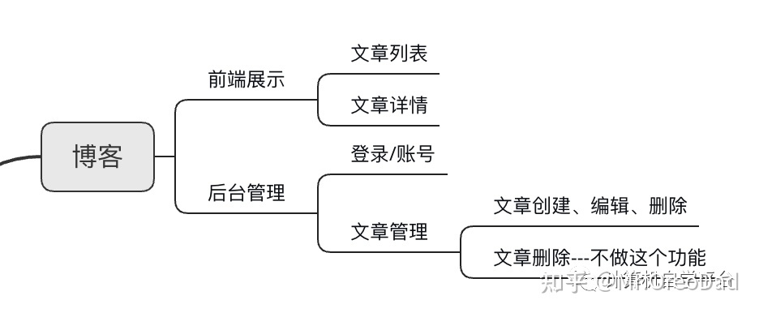


**前端展示分两部分**

1. Web端页面展示
2. H5手机端页面展示

**后端两个模块**

1. 账号管理模块
2. 文章管理模块（增删查改）

**文章相关数据字段**

标题、内容、作者、创建时间、更新时间

**账号相关数据**

账号、密码、手机号、昵称、创建时间

**目前库表设计**


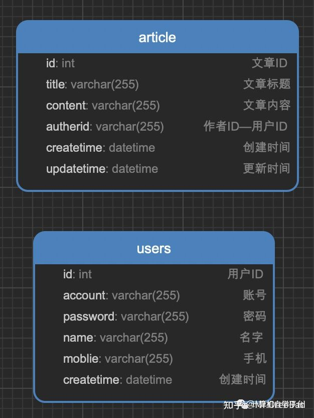


**功能API设计**

- 账号注册 v1/account/register
- 账号登录 v1/account/login
- 密码修改 v1/account/update
- 文章列表 v1/blog/list
- 文章详情 v1/blog/detail
- 创建文章 v1/blog/create
- 修改文章 v1/blog/update

一个简单的博客基础骨架就出来了，下一步就是代码的编写了。目前想到的就这些，没有必要在这个阶段纠结太多，项目中很多问题都是在开发过程中发现的，到时候再去一一应对。如果在这个阶段浪费太多时间，就会导致整个项目的难以推进。

## 第一阶段骨架搭建

今天周六，利用两个多小时的时间把昨天的需求简单梳理了一下，并开始搭建项目，进行了简单的编辑，到目前为止已经实现注册功能了。

这个项目到今天是第三天了，我并不能保证每天都更新日记，但确实每天都会更新项目，时间多久多做点，时间少就少做点，总之这个事情是不可以断的。希望各位也给我助助威，鞭策一下我这颗懒惰的心。

本节主要涉及以下几个知识点：

1）gin web框架

2）viper 配置管理

3）Gorm 数据库连接

这三个知识点我后面单独拉出来介绍，这节仅简单介绍并陈述我都做了什么。

### **一、选择Gin框架**

在 Go语言开发的 Web 框架中，有两款著名 Web 框架分别是 Martini 和 Gin，两款 Web 框架相比较的话，Gin 自己说它比 Martini 要强很多。

Gin 是 Go语言写的一个 web 框架，它具有运行速度快，分组的路由器，良好的崩溃捕获和错误处理，非常好的支持中间件和 json。总之在 Go语言开发领域是一款值得好好研究的 Web 框架

gin安装：go get -u [http://github.com/gin-gonic/gin](https://link.zhihu.com/?target=http%3A//github.com/gin-gonic/gin)

本项目中初始化位置：

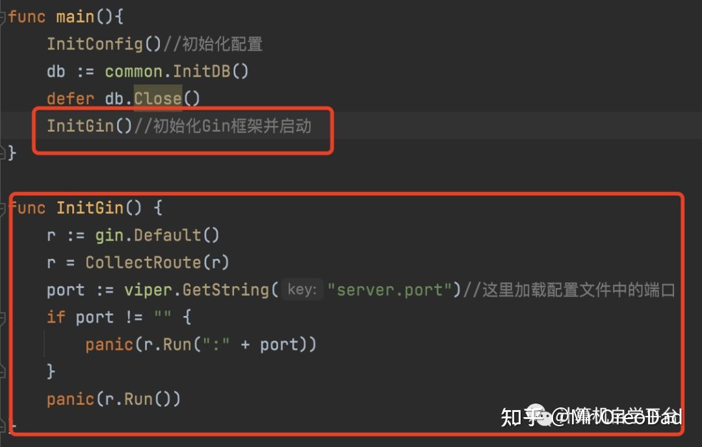

### **二、选自viper做配置管理**

viper 是一个配置解决方案，拥有丰富的特性：

- 支持 JSON/TOML/YAML/HCL/envfile/Java properties 等多种格式的配置文件；
- 可以设置监听配置文件的修改，修改时自动加载新的配置；
- 从环境变量、命令行选项和io.Reader中读取配置；
- 从远程配置系统中读取和监听修改，如 etcd/Consul；
- 代码逻辑中显示设置键值。

Viper安装：go get [http://github.com/spf13/viper](https://link.zhihu.com/?target=http%3A//github.com/spf13/viper)

本项目中初始化位置：

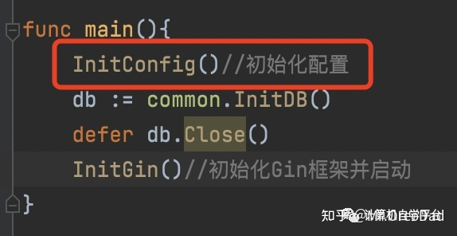

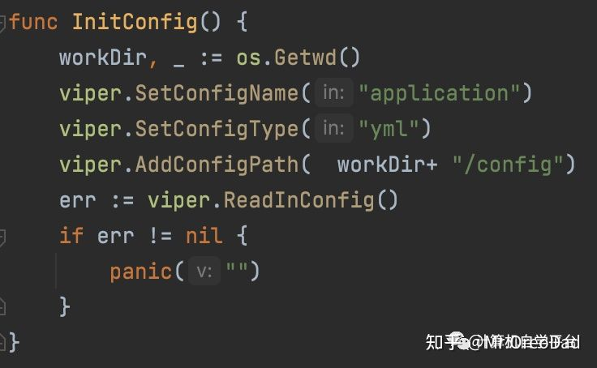

根据以上代码可知，我的配置文件放下项目路径/config下，文件为：application.yml。

### **三、数据库连接使用Gorm库**

gorm是go语言的一个orm框架,具体的原理及思想我也介绍不清楚，你只需要知道它是你操作数据库的桥梁即可、

Gorm安装：go get -u [http://github.com/jinzhu/gorm](https://link.zhihu.com/?target=http%3A//github.com/jinzhu/gorm)

本项目中初始化位置：

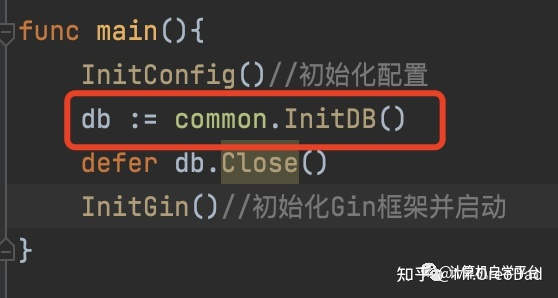

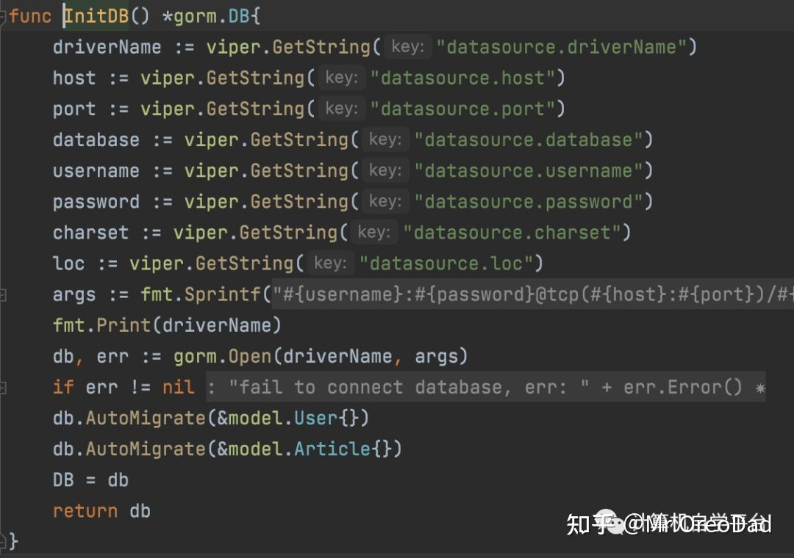

上图中的viper.GetString("datasource.driverName")就是利用前面说过的配置管理viper去配置文件中获取相对应的参数。

具体的配置文件如下：

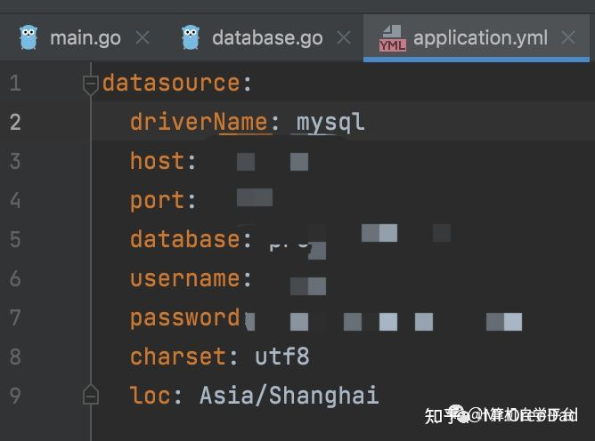

这里留一个小彩蛋，只有在真正运行项目的时候才会发现哦

### **四、创建数据模型**

一共创建了两个数据模型

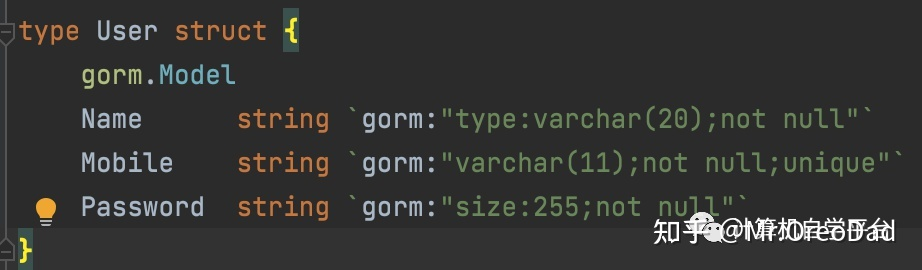

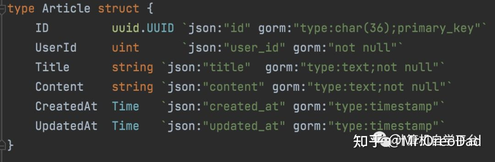

这里一共设计到三个知识点

1）gorm.Model这个标记一个结构中有一个结构中没有，那他是用来干什么的呢？其实这就相当于是继承，加上这个后就相当于继承了Model，不加这个代表不继承Model。而Model结构中有以下四个定义好的字段：

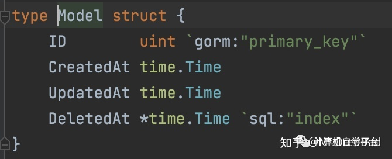

这是Gorm自带的，所以你清楚这一点就行了。

2）上面Article结构体中有一个uuid.UUID标记，这个是哪里来的？其实是引用自：

uuid"[http://github.com/satori/go.uuid](https://link.zhihu.com/?target=http%3A//github.com/satori/go.uuid)"

它的主要功能就是在实际项目中，经常会使用到一个唯一标识的，比如唯一标识一条记录等情况，这个go.uuid项目库就是干这个事情的。

3）在上面Article结构体中还有一个非自带类型：Time，这个是自定义的，其作用就是把时间格式化了而已。如果不格式化的话，它显示的就是时间戳，这个大家应该都知道吧？所以它就是让我们能更方便的查看时间。

### **五、写了一个接口**

账号注册 v1/account/register

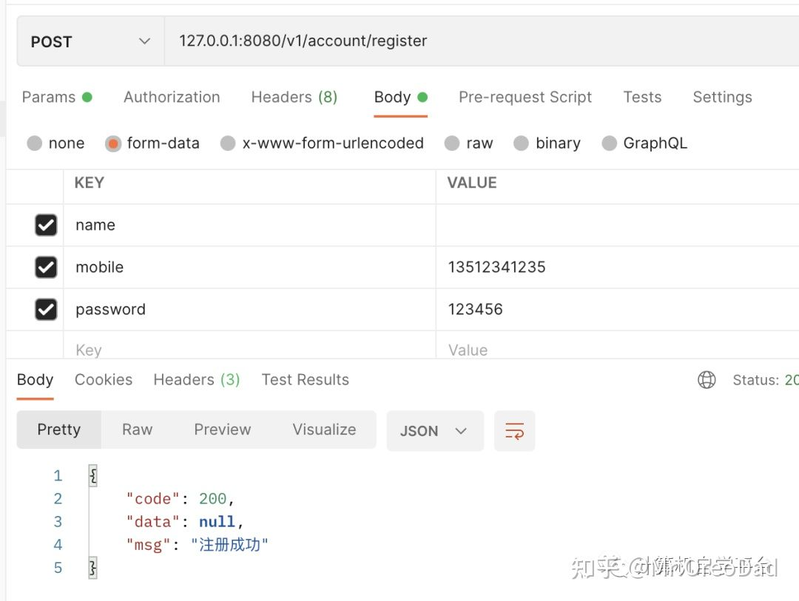

这节就先开这一个接口吧，点到为止。贪多贪快嚼不烂，我们的目的是掌握开发过程中出现的各个知识点，并不是完成功能的开发。所以大家不要慌尽量把这节的内容摸透咽下去再进行下一步的开发。

### 下一节安排

1. Go 项目实战 之 Gin框架的详解
2. Go 项目实战 之 配件管理viper 详解
3. Go 项目实战 之 数据库连接Grom详解

这个项目到目前为止，基本上骨架就出来了，当然项目本身问题还是很多的，我们会在后面一步一步去完善，为的就是在完善中学习。直接一步到位的框架设计只会在外包项目中出现，我们又不赶进度，慢慢来哈。

## Gin框架的详解

今天没有去继续更新开源10年的项目，因为昨天接触到几个新的知识点，所以今天加强一下对他们的认识，下面是本节的一个知识点。

1）Gin Web框架的认识

2）Gin加载静态资源

3）Gin加载动态资源

在学习Gin的过程中动手搞了一个小Demo，把Gin的简单用发都跑了一下，强烈建议各位读者不要只看文章，自己动手写一下效果更佳。

项目在GitHub上的地址：[https://github.com/kaiyuan10nian/GinDemo](https://link.zhihu.com/?target=https%3A//github.com/kaiyuan10nian/GinDemo)

在开始这一节前，希望有兴趣的同学可以先去看下这个开源10年项目前面的故事，虽不会直接提升你的开发能力，但看后确实能了解这个项目的灵魂。

1、[开源10年项目-项目成立，欢迎大家的加入](https://zhuanlan.zhihu.com/p/483008113)

2、[开源10年项目-准备工作，语言的选择和第一阶段的目标](https://zhuanlan.zhihu.com/p/483459598)

3、[开源10年项目-Go项目实战之博客功能开发](https://zhuanlan.zhihu.com/p/483854593)

下面开始我们今天的知识点分享。

### 一、创建一个Go web项目

这里我命名为：GinDemo，方便我们的学习。

项目结构

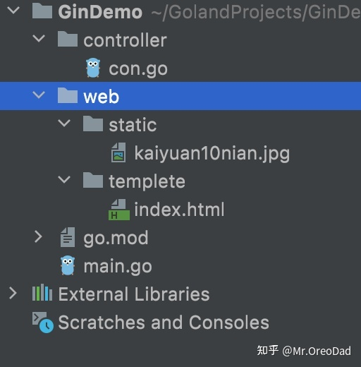

Gin安装：go get -u [http://github.com/gin-gonic/gin](https://link.zhihu.com/?target=http%3A//github.com/gin-gonic/gin)

直接在Goland下面的Terminal中输入就可以了。看到下图就表示你安装成功了

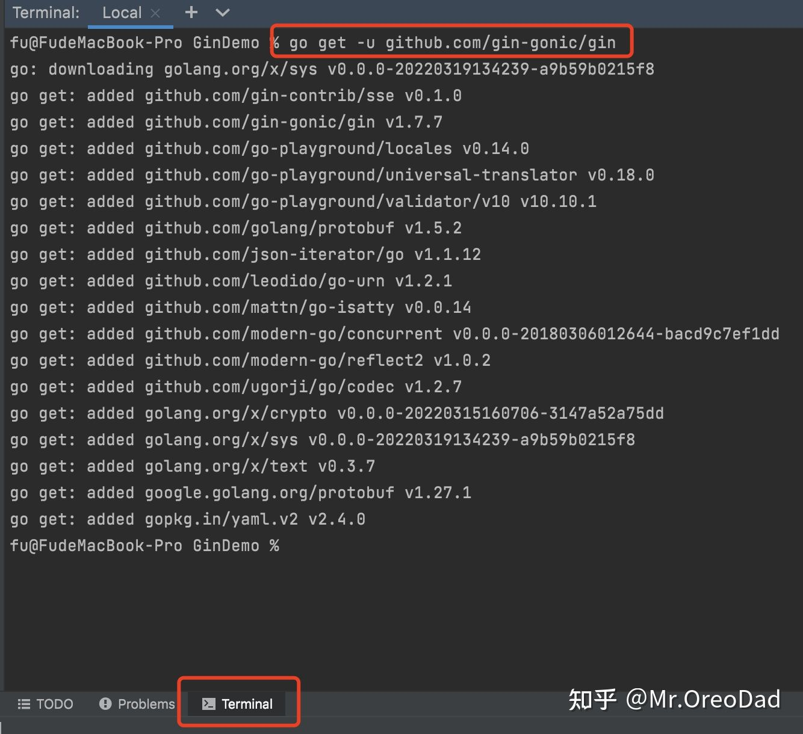

### 二、写一个小案例

并在Postman或者浏览器中打开看下效果。

在GinDemo下面创建一个main.go文件，输入以下内容：

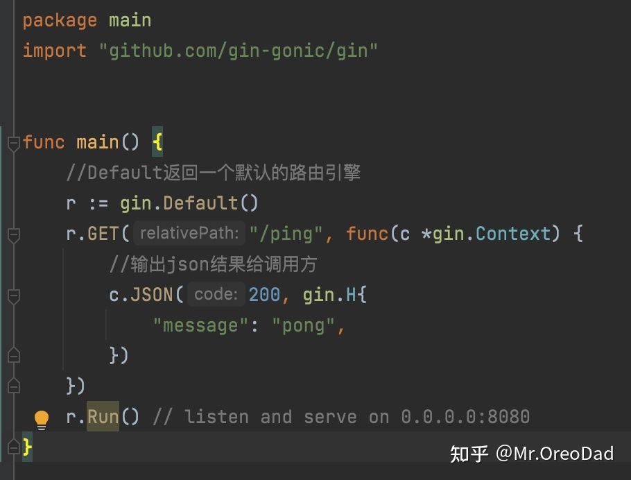

然后在下面的Termonal中输入以下指令运行该项目：

Go run main.go

看到下图即表示你已经运行起来了。

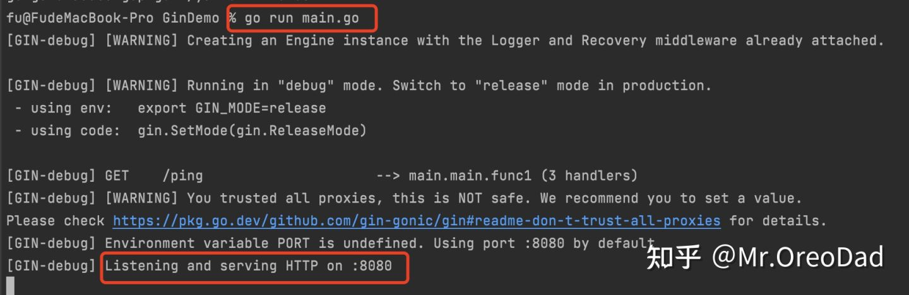

这个时候，打开你的浏览器，输入：localhost:8080/ping,将显示以下内容：

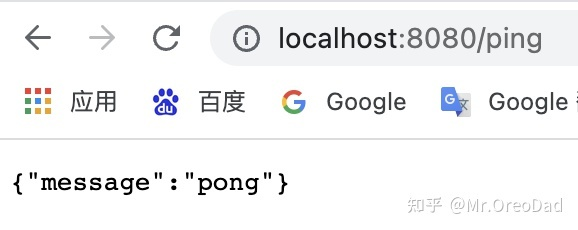

整个Demo中的注释还是比较清楚的，每一行代码是什么意思，有什么作用等都比较简单，运行到这里基本上Gin的精髓就已经学到了。

下面两个知识点是可以解决我们在真正的实际项目中经常会遇到的需求的。所以我这里单独拉了出来写一下。当然，它还有其它别的更多用法，我们就不一一说了，至少掌握了这两个对于普通的开发工作就足以应对了。

### 三、加载静态资源

在实际项目中我们经常会用到很多静态资源，比如：图片、文件等。那Gin是怎么处理的呢？还是看案例，下面我们对上面的main.go进行一下简单修改：

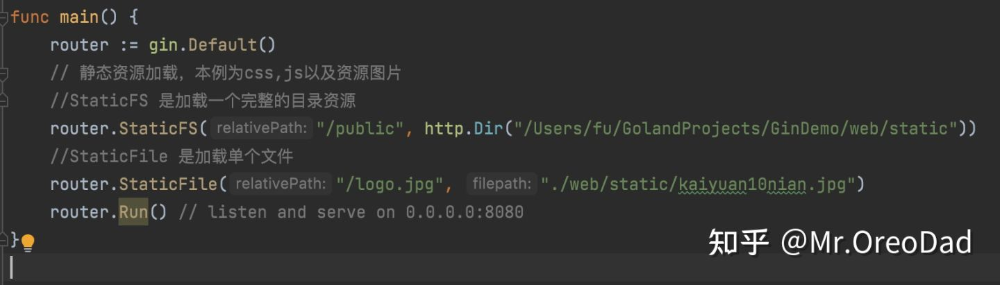

主要加了两行代码，用到两个函数。注释中已经描述的很清楚了，说一下代码中未描述的内容，非常重要，这两个函数的第一个参数就是相对地址，也就是说是用户端访问的时候访问的地址，第二个参数是本地服务器的地址，也就是引用的地址。

比如我们运行上面项目后，若想访问/Users/fu/GolandProjects/GinDemo/web/static里面的图片，那么直接如下操作即可：


若想加载第二种加载形式的，则直接这么访问：


其实，这两种访问形式访问的都是同一张图片。

这就是静态加载资源的方式方法，那么我们做一个web站点肯定不是仅仅有静态资源，肯定还有动态资源，动态资源的加载怎么实现？

四、加载动态资源

首先，在GinDemo-web下新建templete并在其中新增一个index.html文件，文件内容很简单，这里制作演示所以就没有去做接口互动。

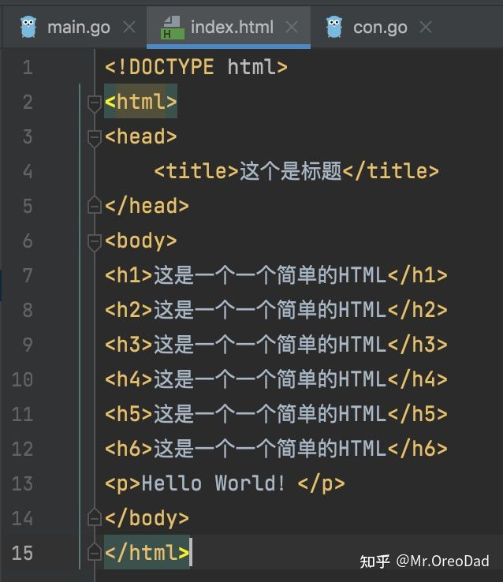

然后，在根目录下创建了controller文件夹并创建con.go，主要用来存放逻辑层的操作，受JAVA开发的影响我这么去做了，你可以随意哈，怎么高兴怎么来。

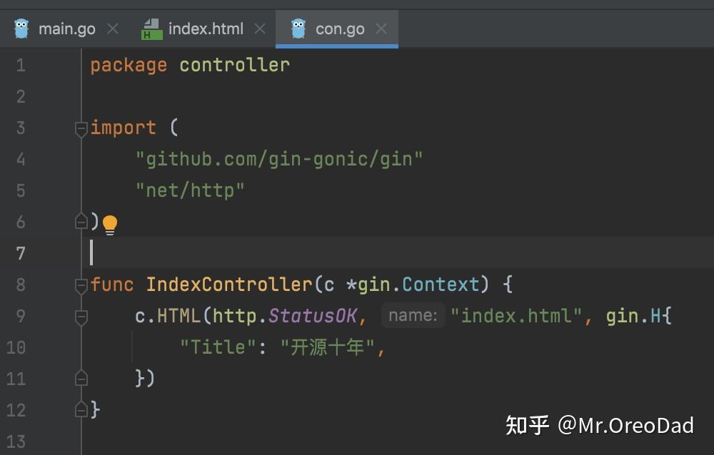

还是在main.go中做修改,并加载trmplete下面的资源，然后做了一个web分组，分组中仅有一个接口，其处理放到了con.go文件中的IndexController函数中。

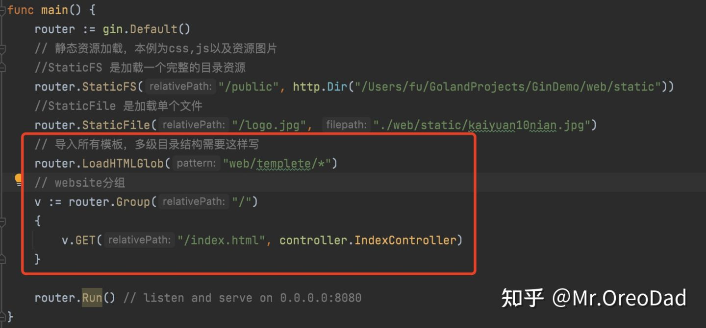

直接运行，然后浏览器中访问index.html看看有什么效果？

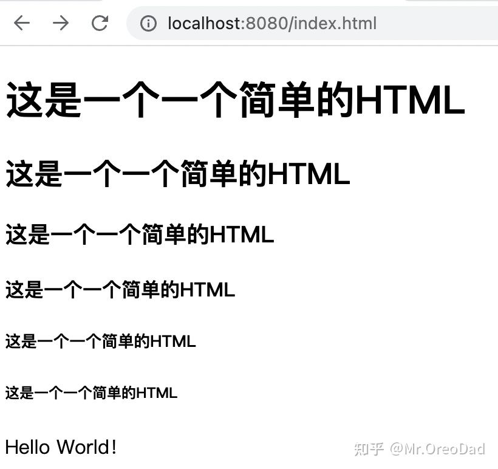

到这里，其实这个项目就算完成了，其中涉及到的知识点我们也都了解了，就这些内容已经完全够现阶段的我们使用了。

## Viper详解

引言：今天还是补充上次我们搭建项目时遇到的知识点Viper，以下内容了解后基本上在使用Viper上已经无压力了，后面进阶的时候我再补充Viper的进阶篇。

Viper 是一个完整的 Go 应用程序配置解决方案，优势就在于开发项目中你不必去操心配置文件的格式而是让你腾出手来专注于项目的开发。其特性如下：

- 支持 JSON/TOML/YAML/HCL/envfile/Java properties 等多种格式的配置文件；
- 可以设置监听配置文件的修改，修改时自动加载新的配置；
- 从环境变量、命令行选项和io.Reader中读取配置；
- 从远程配置系统中读取和监听修改，如 etcd/Consul；
- 代码逻辑中显示设置键值

**注：Viper让需要重启服务器才能使配置生效的日子一去不复返！！！**这才是VIper最大的魅力

### **基础配置**

Viper没有默认的基础配置，所以在使用的过程中我们初始化Viper实例的时候需要告诉Viper你的配置路径、配置格式、配置名称等等信息。Viper虽然支持多配置同时使用，但是一个Viper实例只能寻一个配置路径。

示例：

```go
viper.SetConfigName("config") // 配置文件名 (不带扩展格式)
viper.SetConfigType("yaml") // 如果你的配置文件没有写扩展名，那么这里需要声明你的配置文件属于什么格式
viper.AddConfigPath("/etc/appname/")   // 配置文件的路径

err := viper.ReadInConfig() //找到并读取配置文件
if err != nil { // 捕获读取中遇到的error
    panic(fmt.Errorf("Fatal error config file: %w \n", err))
}
```

如果在项目中你的配置文件找不到或者找的过程中出error了，怎么办？可以参考下面这么做：

```go
if err := viper.ReadInConfig(); err != nil {
    if _, ok := err.(viper.ConfigFileNotFoundError); ok {
        / / 配置文件没有找到，Todo
    } else {
        // 配置文件找到了，但是在这个过程有又出现别的什么error,Todo
    }
}

// 配置文件成功找到，并未再出现什么error则继续往下面执行
```

### **写入运行时配置**

很多时候我们需要记录程序在运行时的一些配置参数，那么Viper也是可以做到的，在Viper中提供了四个运行时记录配置的方法：

- WriteConfig：将当前Viper配置写入指定路径，如果保存路径不存在则报错，存在覆盖
- SafeWriteConfig：将当前Viper配置写入指定路径，如果保存路径不存在则报错，存在则不会覆盖
- WriteConfigAs：将当前Viper配置写入指定路径，覆盖指定文件（如果路径存在的话）
- SafeWriteConfigAs：将当前Viper配置写入指定路径，除指定文件外其他的都覆盖（如果路径存在的话）

```go
viper.WriteConfig() // 写入当前配置到'viper.AddConfigPath()' 和 'viper.SetConfigName'设定的路径
viper.SafeWriteConfig()
viper.WriteConfigAs("/path/to/my/.config")
viper.SafeWriteConfigAs("/path/to/my/.config") // 这里将报错，因为已经写入过了
viper.SafeWriteConfigAs("/path/to/my/.other_config")
```

### **如何让配置实时生效**

Viper支持应用程序在运行时实时读取配置文件的能力，只需要告诉Viper去watchConfig即可。或者直接自己去实现一个函数，每次更改配置文件时都运行。

示例：（该示例运行前请确保你已经设置了configPaths）

```go
viper.OnConfigChange(func(e fsnotify.Event) {
    fmt.Println("Config file changed:", e.Name)
    })
viper.WatchConfig()
```

### **自定义配置源**

虽然Viper自带多种配置源，但是这也不妨碍我们自定义。

示例：

```go
viper.SetConfigType("yaml") // or viper.SetConfigType("YAML")

// 自定义案例
var yamlExample = []byte(`
    Hacker: true
    name: steve
    hobbies:
        - skateboarding
        - snowboarding
        - go
clothing:
     jacket: leather
     trousers: denim
    age: 35
    eyes : brown
    beard: true
`)

viper.ReadConfig(bytes.NewBuffer(yamlExample))

viper.Get("name") // 这里将输出 "steve"
```

### **从Viper中获取配置值**

在Viper中有多个获取配置文件内容的方法，可根据值的类型进行选择：

- `Get(key string) : interface{}`
- `GetBool(key string) : bool`
- `GetFloat64(key string) : float64`
- `GetInt(key string) : int`
- `GetIntSlice(key string) : []int`
- `GetString(key string) : string`
- `GetStringMap(key string) : map[string]interface{}`
- `GetStringMapString(key string) : map[string]string`
- `GetStringSlice(key string) : []string`
- `GetTime(key string) : time.Time`
- `GetDuration(key string) : time.Duration`
- `IsSet(key string) : bool`
- `AllSettings() : map[string]interface{}`

注：所有GET方法在没有找到对应的配置参数时将返回0，判断对应的配置参数是否存在可用IsSet()函数

示例：

```go
viper.GetString("logfile") // 不区分大小写
if viper.GetBool("verbose") {
    fmt.Println("verbose enabled")
}
```

### **访问嵌套类型的配置文件**

Viper默认是支持访问嵌套类型的，例如以下JSON，如果要访问其中的某个被嵌套的Key可如此操作：

```go
{
   "host": {
       "address": "localhost",
       "port": 5799
  },
   "datastore": {
       "metric": {
           "host": "127.0.0.1",
           "port": 3099
      },
       "warehouse": {
           "host": "198.0.0.1",
           "port": 2112
      }
  }
}
GetString("datastore.metric.host") // (返回 "127.0.0.1")
```

可以通过"."进行嵌套key的访问/获取。

如果你有个嵌套key是一个数组，那我们可以直接读取其下标进行访问：

```go
{
   "host": {
       "address": "localhost",
       "ports": [
           5799,
           6029
      ]
  },
   "datastore": {
       "metric": {
           "host": "127.0.0.1",
           "port": 3099
      },
       "warehouse": {
           "host": "198.0.0.1",
           "port": 2112
      }
  }
}
GetInt("host.ports.1") // 返回 6029
```

还有一种极端情况，就是你某个key的名称中就带"."，那么有人就会疑惑会不会无法操作读取呀？放心，Viper已经想到这个问题了，如果有对应的路径则直接取，没有的话才会去嵌套取值：

示例：

```go
{
   "datastore.metric.host": "0.0.0.0",
   "host": {
       "address": "localhost",
       "port": 5799
  },
   "datastore": {
       "metric": {
           "host": "127.0.0.1",
           "port": 3099
      },
       "warehouse": {
           "host": "198.0.0.1",
           "port": 2112
      }
  }
}
GetString("datastore.metric.host") // 返回 "0.0.0.0"
```

看，这里返回的是"0.0.0.0" 而不是“127.0.0.1”，我称之为精准匹配原则（我自己定义的哈哈哈哈哈）

### **以String的形式返回所有配置内容**

很多时候我们需要看某个应用程序的配置时是在服务器运行期间，这个时候我们并不是想把他的配置都写入文件中而仅仅是单纯的看一下，那么这个时候AllSettings()这个函数就排上用场了。

```go
import (
yaml "gopkg.in/yaml.v2"
// ...
)

func yamlStringSettings() string {
    c := viper.AllSettings()
    bs, err := yaml.Marshal(c)
    if err != nil {
        log.Fatalf("unable to marshal config to YAML: %v", err)
    }
    return string(bs)
}
```

AllSettings()会以String类型返回当前配置中的所有配置内容，

### **多个Viper实例的使用**

上面我们说过：

> Viper虽然支持多配置同时使用，但是一个Viper实例只能寻一个配置路径。

所以如果想支持多配置启用，那么你就多实现几个Viper的实例就可以了。

```go
x := viper.New()
y := viper.New()

x.SetDefault("ContentDir", "content")
y.SetDefault("ContentDir", "foobar")
```

## GORM详解

ORM即Object-Relationl Mapping，就是对象关系映射。它的作用就是在对象和关系数据库中间做一个映射，这样我们在操作数据库的时候就不需要直接去和SQL打架。

其在Go圈子中非常火，功能覆盖范围也非常广，这节我们不做太深入的研究，先搞明白怎么用即可。

### **安装**

```go
go get -u gorm.io/gorm
```

如果上面这个你用不了就用下面这个

```go
go get github.com/jinzhu/gorm
```

### **快速开始案例---Sqlite数据库链接**

```go
package main
//导包
import (
  "gorm.io/gorm"
  "gorm.io/driver/sqlite"
)
//定义一个模型
type Product struct {
  gorm.Model
  Code  string
  Price uint
}

func main() {
  //根据配置文件链接名为test.db的数据库
  db, err := gorm.Open(sqlite.Open("test.db"), &gorm.Config{})
  if err != nil {
    panic("failed to connect database")
  }

  // 在数据库中创建对应的Product表
  db.AutoMigrate(&Product{})

  // 创建一条数据
  db.Create(&Product{Code: "D42", Price: 100})

  // 查询数据
  var product Product
  db.First(&product, 1) 
  db.First(&product, "code = ?", "D42") 

  // 更新数据
  db.Model(&product).Update("Price", 200)
  // 更新多条数据
  db.Model(&product).Updates(Product{Price: 200, Code: "F42"}) // non-zero fields
  db.Model(&product).Updates(map[string]interface{}{"Price": 200, "Code": "F42"})

  // 删除数据
  db.Delete(&product, 1)
}
```

### **快速开始案例---MySQL数据库链接**

```go
import (
  "gorm.io/driver/mysql"
  "gorm.io/gorm"
)

func main() {
  // refer https://github.com/go-sql-driver/mysql#dsn-data-source-name for details
  dsn := "user:pass@tcp(127.0.0.1:3306)/dbname?charset=utf8mb4&parseTime=True&loc=Local"
  db, err := gorm.Open(mysql.Open(dsn), &gorm.Config{})
}
```

GORM还为MySQL Driver提供了一些可以在初始化期间使用的高级配置，如下：

```go
db, err := gorm.Open(mysql.New(mysql.Config{
  DSN: "gorm:gorm@tcp(127.0.0.1:3306)/gorm?charset=utf8&parseTime=True&loc=Local", // 数据源
  DefaultStringSize: 256, // 字符串的默认大小
  DisableDatetimePrecision: true, // 在MySQL 5.6版本之前不支持日期时间精度，这里给禁用
  DontSupportRenameIndex: true, // 在MySQL 5.7之前不支持重命名索引
  DontSupportRenameColumn: true, // MySQL 8不支持重命名列
  SkipInitializeWithVersion: false, // 根据当前MySQL版本自动配置
}), &gorm.Config{})
```

### **自定义Driver**

在GORM中允许使用DriverName选项去自定义MySQL Driver，如下：

```go
import (
  _ "example.com/my_mysql_driver"
  "gorm.io/gorm"
)

db, err := gorm.Open(mysql.New(mysql.Config{
  DriverName: "my_mysql_driver",
  DSN: "gorm:gorm@tcp(localhost:9910)/gorm?charset=utf8&parseTime=True&loc=Local", // 数据源
}), &gorm.Config{})
```

GROM允许去初始化*gorm.DB 去持有一个现有的数据库链接，如下：

```go
import (
  "database/sql"
  "gorm.io/driver/mysql"
  "gorm.io/gorm"
)

sqlDB, err := sql.Open("mysql", "mydb_dsn")
gormDB, err := gorm.Open(mysql.New(mysql.Config{
  Conn: sqlDB,
}), &gorm.Config{})
```

除了以上举的这两个数据库外，其实还有PostgreSQL、SQLServer、Clickhouse、Pool 等，这些就自行去查阅吧。

### **创建模型**

模型就是采用Go的基本类型、指针/别名或者其他用户自定义类型等信息去实现Scanner和Valuer接口。

直接看示例：

```go
type User struct {
  ID           uint
  Name         string
  Email        *string
  Age          uint8
  Birthday     *time.Time
  MemberNumber sql.NullString
  ActivatedAt  sql.NullTime
  CreatedAt    time.Time
  UpdatedAt    time.Time
}
```

在GORM中有一个默认的约定，以模型创建的表默认表名就是结构体名称，默认字段就是结构体中的字段，默认的primary key就是ID，并且自带CreateAt和UpdateAt字段去记录创建和更新时间。如果GROM的这个默认约定不满足你的使用，那么你也可以抛弃这个约定去自行定义。

### **gorm.Model**

这个在我们开源十年项目中就用过，且也给大家讲述过，它是GROM默认的结构体，你可以直接把它嵌入进自己的结构体中，然后你的结构体将包含它所自带的几个字段：ID，CreateAt，UpdateAt,DeletedAt

```go
type Model struct {
  ID        uint           `gorm:"primaryKey"`
  CreatedAt time.Time
  UpdatedAt time.Time
  DeletedAt gorm.DeletedAt `gorm:"index"`
}
```

### **字段的权限等级**

使用GROM去做增删查改的时候对所有字段是拥有所有权限的，其实GROM是允许我们通过Tag去修改字段的等级权限的，所以在正常的开发中我们可以去自定义字段的只读、只写、只允许创建、只允许更新或者忽略等权限。

注：这里需要注意的一点是，如果某个字段设置了Tag为忽略，那么在我们去创建这个表的时候也是会忽略这个字段的。

具体设置参考下表：

```go
type User struct {
  Name string `gorm:"<-:create"` // 允许读和创建
  Name string `gorm:"<-:update"` // 允许读和更新
  Name string `gorm:"<-"`        // 允许读写（创建和更新）
  Name string `gorm:"<-:false"`  // 允许读 ，不允许写
  Name string `gorm:"->"`        // 只读（除非有别的特殊配置不然就是禁用写）
  Name string `gorm:"->;<-:create"` // 允许读和创建
  Name string `gorm:"->:false;<-:create"` // 只是创建（禁用从数据库的读取权限）
  Name string `gorm:"-"`            // 在结构体读写时忽略此字段
  Name string `gorm:"-:all"`        // 在结构体读写、甚至是迁移表时忽略此字段
  Name string `gorm:"-:migration"`  // 在结构体迁移表时忽略该字段
}
```

### **默认CreatAt/UpdateAt和默认时间格式的使用**

在GROM中CreatAt和UpdateAt是默认的，且会在我们操作相关数据是自动记录并更新其时间内容。如果我们想自定义同类型的字段只需要加上autoCreateTime和autoUpdateTime的Tag即可。同时GROM默认的时间格式是time.Time,如果你想用秒或者其它类型去记录，只需要把time/Time更改为Int或者对应的其它类型即可。

示例：

```go
type User struct {
  CreatedAt time.Time // 创建时不指定具体指会默认设置为当前时间
  UpdatedAt int       // 在更新时设置为当前unix秒类型的值，创建时此值为0
  Updated   int64 `gorm:"autoUpdateTime:nano"` // 使用unix nano类型为更新时间
  Updated   int64 `gorm:"autoUpdateTime:milli"`// 使用 unix milli 类型为更新时间
  Created   int64 `gorm:"autoCreateTime"`      // 使用unix为创建时间
}
```

### **嵌入式结构**

我喜欢称之为集成式结构，客官们随意哈。对于此结构我们可以实现更多种类型和更复杂的结构，并且便于维护和读写。示例：

```go
type Author struct {
  Name  string
  Email string
}

type Blog struct {
  ID      int
  Author  Author `gorm:"embedded"`
  Upvotes int32
}
// 上面那种写法与下面的这种写法是一样的效果
type Blog struct {
  ID    int64
  Name  string
  Email string
  Upvotes  int32
}
```

同时可以使用embeddedPrefix这个标签为字段在数据库中添加前缀：

```go
type Blog struct {
  ID      int
  Author  Author `gorm:"embedded;embeddedPrefix:author_"`
  Upvotes int32
}
// equals
type Blog struct {
  ID          int64
  AuthorName  string
  AuthorEmail string
  Upvotes     int32
}
```

这么看的话就很方便了是吧。

在GROM中具体有哪些Tag，我这里就不去一一列举了，就像字典一样，你用到了再去查效果会好很多。

```go
column //指定 db 列名

type //列数据类型，推荐使用兼容性好的通用类型，例如：所有数据库都支持 bool、int、uint、float、string、time、bytes 并且可以和其他标签一起使用，例如：not null、size, autoIncrement… 像 varbinary(8) 这样指定数据库数据类型也是支持的。在使用指定数据库数据类型时，它需要是完整的数据库数据类型，如：MEDIUMINT UNSIGNED not NULL AUTO_INSTREMENT

size //指定列大小，例如：size:256

primaryKey //指定列为主键

unique //指定列为唯一

default //指定列的默认值

precision //指定列的精度

scale //指定列大小

not null //指定列为 NOT NULL

autoIncrement //指定列为自动增长

embedded //嵌套字段

embeddedPrefix //嵌入字段的列名前缀

autoCreateTime //创建时追踪当前时间，对于 int 字段，它会追踪时间戳秒数，您可以使用 nano/milli 来追踪纳秒、毫秒时间戳，例如：autoCreateTime:nano

autoUpdateTime //创建 / 更新时追踪当前时间，对于 int 字段，它会追踪时间戳秒数，您可以使用 nano/milli 来追踪纳秒、毫秒时间戳，例如：autoUpdateTime:milli

index //根据参数创建索引，多个字段使用相同的名称则创建复合索引，查看 索引 获取详情

uniqueIndex //与 index 相同，但创建的是唯一索引

check //创建检查约束，例如 check:age > 13，查看 约束 获取详情

<- //设置字段写入的权限， <-:create 只创建、<-:update 只更新、<-:false 无写入权限、<- 创建和更新权限

-> //设置字段读的权限，->:false 无读权限

- //忽略该字段，- 无读写权限
```

### **增删查改。**

在学习GORM的时候，除了上面这些东西是需要我们理解之外，以下内容才是我们需要学的重点。

### **Create**

```go
user := User{Name: "Jinzhu", Age: 18, Birthday: time.Now()}

result := db.Create(&user) // 将数据指针传给Create

user.ID             // 返回数据的ID prinary key 
result.Error        // 返回错误信息
result.RowsAffected // 返回插入的记录数
//创建一条记录并为指定字段赋值
db.Select("Name", "Age", "CreatedAt").Create(&user)//INSERT INTO `users` (`name`,`age`,`created_at`) VALUES ("jinzhu", 18, "2020-07-04 11:05:21.775")
//创建一条记录并忽略掉给省略字段传值
db.Omit("Name", "Age", "CreatedAt").Create(&user)
// INSERT INTO `users` (`birthday`,`updated_at`) VALUES ("2020-01-01 00:00:00.000", "2020-07-04 11:05:21.775")

//批量插入
var users = []User{{Name: "jinzhu1"}, {Name: "jinzhu2"}, {Name: "jinzhu3"}}
db.Create(&users)

for _, user := range users {
  user.ID // 1,2,3
}
//也可以使用CreateInBatches指定批量的范围
var users = []User{{Name: "jinzhu_1"}, ...., {Name: "jinzhu_10000"}}

// batch size 100
db.CreateInBatches(users, 100)

```

### **检索单个对象**

```go
// 获取排在第一的值（以prinary key排序）
db.First(&user)
// SELECT * FROM users ORDER BY id LIMIT 1;

// 随便获取一个值
db.Take(&user)
// SELECT * FROM users LIMIT 1;

// 获取排在最后一个的值（以prinary key排序）
db.Last(&user)
// SELECT * FROM users ORDER BY id DESC LIMIT 1;

result := db.First(&user)
result.RowsAffected // 返回一共查到了多少条记录
result.Error        // 返回错误信息

// 检查是否存在错误 ErrRecordNotFound
errors.Is(result.Error, gorm.ErrRecordNotFound)

```

First和Last这两个只有在目标结构的指针做参数时才起作用，此外，如果这个模型没有primary key那返回的顺序就是按照第一个字段排序的结果去取值。

按照指定主键去检索

```go
db.First(&user, 10)
// SELECT * FROM users WHERE id = 10;

db.First(&user, "10")
// SELECT * FROM users WHERE id = 10;

db.Find(&users, []int{1,2,3})
// SELECT * FROM users WHERE id IN (1,2,3);
//如果主键是字符串（例如，像 uuid），则查询如下：
db.First(&user, "id = ?", "1b74413f-f3b8-409f-ac47-e8c062e3472a")
// SELECT * FROM users WHERE id = "1b74413f-f3b8-409f-ac47-e8c062e3472a";

```

注：在主键是字符串时，请谨防SQL注入安全事故。

```go
//检索所有对象
// 获取所有记录
result := db.Find(&users)
// SELECT * FROM users;

```

条件查询

```go
// 获取第一条匹配的记录
db.Where("name = ?", "jinzhu").First(&user)
// SELECT * FROM users WHERE name = 'jinzhu' ORDER BY id LIMIT 1;

// 获取所有匹配的记录
db.Where("name <> ?", "jinzhu").Find(&users)
// SELECT * FROM users WHERE name <> 'jinzhu';


//以下的IN LIKE AND Time等就跟我们学的SQL语句中的用法是一样的了
// IN
db.Where("name IN ?", []string{"jinzhu", "jinzhu 2"}).Find(&users)
// SELECT * FROM users WHERE name IN ('jinzhu','jinzhu 2');

// LIKE
db.Where("name LIKE ?", "%jin%").Find(&users)
// SELECT * FROM users WHERE name LIKE '%jin%';

// AND
db.Where("name = ? AND age >= ?", "jinzhu", "22").Find(&users)
// SELECT * FROM users WHERE name = 'jinzhu' AND age >= 22;

// Time
db.Where("updated_at > ?", lastWeek).Find(&users)
// SELECT * FROM users WHERE updated_at > '2000-01-01 00:00:00';

// BETWEEN
db.Where("created_at BETWEEN ? AND ?", lastWeek, today).Find(&users)
// SELECT * FROM users WHERE created_at BETWEEN '2000-01-01 00:00:00' AND '2000-01-08 00:00:00';

```

暂时查询就说这么多吧，够现阶段用了。后面还有排序、限制条件、分组、Join等等跟我们之前语言中遇到的基本是一致的。

### **Update**

```go
//Save将会把所有字段都存储
db.First(&user)

user.Name = "jinzhu 2"
user.Age = 100
db.Save(&user)
// UPDATE users SET name='jinzhu 2', age=100, birthday='2016-01-01', updated_at = '2013-11-17 21:34:10' WHERE id=111;


//更新单列
// 按条件更新
db.Model(&User{}).Where("active = ?", true).Update("name", "hello")
// UPDATE users SET name='hello', updated_at='2013-11-17 21:34:10' WHERE active=true;

// 更新指定条件的记录
db.Model(&user).Update("name", "hello")
// UPDATE users SET name='hello', updated_at='2013-11-17 21:34:10' WHERE id=111;

//使用条件+模型值更新
db.Model(&user).Where("active = ?", true).Update("name", "hello")
// UPDATE users SET name='hello', updated_at='2013-11-17 21:34:10' WHERE id=111 AND active=true;


//更新多列
// 使用结构模型更新属性，但是只会更新非0的字段
db.Model(&user).Updates(User{Name: "hello", Age: 18, Active: false})
// UPDATE users SET name='hello', age=18, updated_at = '2013-11-17 21:34:10' WHERE id = 111;

// 使用map更新属性
db.Model(&user).Updates(map[string]interface{}{"name": "hello", "age": 18, "active": false})
// UPDATE users SET name='hello', age=18, active=false, updated_at='2013-11-17 21:34:10' WHERE id=111;


//更新指定的属性

db.Model(&user).Select("name").Updates(map[string]interface{}{"name": "hello", "age": 18, "active": false})
// UPDATE users SET name='hello' WHERE id=111;

db.Model(&user).Omit("name").Updates(map[string]interface{}{"name": "hello", "age": 18, "active": false})
// UPDATE users SET age=18, active=false, updated_at='2013-11-17 21:34:10' WHERE id=111;

// 注意肯定是非0值
db.Model(&user).Select("Name", "Age").Updates(User{Name: "new_name", Age: 0})
// UPDATE users SET name='new_name', age=0 WHERE id=111;

// 选择所有字段包括非0
db.Model(&user).Select("*").Update(User{Name: "jinzhu", Role: "admin", Age: 0})

// 选择所有字段包括非0 但是忽略“Role”
db.Model(&user).Select("*").Omit("Role").Update(User{Name: "jinzhu", Role: "admin", Age: 0})
```

### **Delete**

```go
//删除单条记录
db.Delete(&email)
// DELETE from emails where id = 10;

// 按条件删除
db.Where("name = ?", "jinzhu").Delete(&email)
// DELETE from emails where id = 10 AND name = "jinzhu";

//按primary key去删除
db.Delete(&User{}, 10)
// DELETE FROM users WHERE id = 10;

db.Delete(&User{}, "10")
// DELETE FROM users WHERE id = 10;

db.Delete(&users, []int{1,2,3})
// DELETE FROM users WHERE id IN (1,2,3);

//批量删除
db.Where("email LIKE ?", "%jinzhu%").Delete(&Email{})
// DELETE from emails where email LIKE "%jinzhu%";

db.Delete(&Email{}, "email LIKE ?", "%jinzhu%")
// DELETE from emails where email LIKE "%jinzhu%";

```

好了 ，就先分享这么多吧。其实Gorm的内容非常多，但是其中的很多内容都是百变不离其宗。用到了再来查就是了，目前这些对于我们现阶段的项目来说够用就行。

## blog注册登录及验证权限实战之jwt-go的运用

第一阶段的知识点啃的差不多了，这周继续往下进行。因为我们目前要实现的是一个BLOG系统，那么我们肯定要考虑安全问题。不能说任何一个人上来就能随便发布博文，那我们这个blog系统最后就广告、垃圾横行了。所以我们只允许注册了的用户使用我们的系统，没有经过注册的坚决拒绝其使用。

在系统中怎么判断一个人是否是我们的用户应该怎么做呢？那就是用户拿自己的账号和密码给系统进行验证，系统看看他是不是已经注册的用户，如果账号和密码都能匹配上就允许访问，如果匹配不上就拒绝其访问。

但是在实际项目中，我们不可能在用户每次访问的时候都跟用户去要账号和密码，就算你这么去要也不安全呀。所以这个时候我们就需要采取一种加密手段。通过这种加密手段去处理用户的账号和密码，然后在用户每次访问我们的时候带上这一穿加密字符串就行了。

这样既解决了认证的问题还解决了安全的问题，这就是Token，在Go语言中有一个库已经解决了我们这个问题他就是：jwt-go.

安装go-jwt：go get -u [http://github.com/dgrijalva/jwt-go](https://link.zhihu.com/?target=http%3A//github.com/dgrijalva/jwt-go)

在开始写代码之前我们先回顾一下流程：

1）用户注册账号设置密码，成功后我们把其信息存入我们的库中。

2）用户登录，服务端先校验用户传入的账号和密码，准确无误后生成一个token给用户。

3）用户访问需要权限的接口时携带这个token即可。

下面开始编程，一探jwt-go的用法。

### **1、指定加密秘钥**

```go
var jwtKey = []byte("kai_yuan_shi_nian")
```

这就相当于是一把钥匙，自己保存好，造锁和开锁都是依托这把钥匙进行的。

### **2、创建Claims结构体**

```go
type Claims struct {
  UserId uint
  jwt.StandardClaims
}
```

这个结构体就是用来保存信息的，需要内嵌jwt.StandardClaims，这些信息会被保存在我们生成好的token当中。

### **3、生成token**

```go
func ReleaseToken(user model.User) (string,error){
  expirationTime := time.Now().Add(7 * 24 * time.Hour)
  claims := &Claims{
    UserId : user.ID,
    StandardClaims: jwt.StandardClaims{
      ExpiresAt: expirationTime.Unix(),//设置这个token的有效期
      IssuedAt: time.Now().Unix(),//发放时间
      Issuer: "kaiyuanshinian.tech",//发行方
      Subject: "user token",//主题
    },
  }
  //使用指定的签名方式创建签名对象
  token := jwt.NewWithClaims(jwt.SigningMethodHS256,claims)
  //使用上面指定的钥匙(secret)签名并获取完整的签名后的字符串
  tokenString,err := token.SignedString(jwtKey)

  if err != nil{
    return "",err
  }

  return tokenString,nil
}
```

在上面这段代码中我们分别设置了有效期和发布方信息。除了上面代码中用到的有效期、签发时间、签发人信息外，还有生效时间(NotBefore)、受众(Audience)、编号(JWTID)等等信息看需求你可以自己添加。

### **4、解析token**

```go
func ParseToken(tokenString string)(*jwt.Token,*Claims,error){
  claims := &Claims{}
  //用于解析鉴权声明
  token,err := jwt.ParseWithClaims(tokenString,claims,func(token *jwt.Token)(i interface{},err error){
    return jwtKey,nil
  })

  return token,claims,err
}
```

解析token就是在用户访问我们的时候，我们系统去解析他所携带的token，去验证它是否是我们正确的用户。我们可以直接根据token获取到它所携带的用户信息（上面的结构体）

### **5、编写路由**

上面完成后，我们开始写我们的业务功能，前面我们已经实现注册功能了，这里就不多说了。首先我们去实现登录功能，直接上代码分析：

```go
r.POST("/v1/account/login", controller.Login)
```

先写路由，指向Login去接收处理，那么我们再看看系统收到该接口访问时的处理。

其处理顺序是：

1）先获取用户访问接口是携带的参数

2）拿这些参数去校验我们的库是否准确（手机号、密码等信息）

3）准确的话发放token并返回登录成功

```go
//登录
func Login(ctx *gin.Context){
  DB := common.GetDB()
  //获取参数
  mobile := ctx.PostForm("mobile")
  password := ctx.PostForm("password")
  //数据验证
  if len(mobile) != 11 {
    response.Response(ctx,http.StatusUnprocessableEntity,422,nil,"手机号必须为11位")
    return
  }
  if len(password) < 6 {
    response.Response(ctx,http.StatusUnprocessableEntity,422,nil,"密码不能少于6位")
    return
  }
  //判断手机号是否存在
  var user model.User
  DB.Where("mobile = ?",mobile).First(&user)
  if user.ID == 0 {
    response.Response(ctx,http.StatusUnprocessableEntity,422,nil,"用户不存在")
    return
  }
  //判断密码是否正确
  if err := bcrypt.CompareHashAndPassword([]byte(user.Password),[]byte(password));err != nil{
    response.Response(ctx,http.StatusUnprocessableEntity,400,nil,"密码错误")
    return
  }
  //发放token
  token,err := common.ReleaseToken(user)
  if err != nil{
    response.Response(ctx,http.StatusUnprocessableEntity,500,nil,"系统异常")
    log.Printf("token generate error : %v",err)
    return
  }
  //返回结果
  fmt.Println(token)
  response.Success(ctx,gin.H{"token":token},"登录成功")
}
```

在上面的代码中我们就用到了前面实现的token发放模块（ReleaseToken）。

到此，登录功能就已经实现了，那么这个token怎么使用呢？我们继续往下去实现一个可以获取用户信息的接口。

### **6、token验证及使用**

直接先上路由

```go
r.GET("/v1/account/info", common.AuthMiddleware(),controller.Info)
```

各位发现没有，这次注册路由的时候明显与前面两次不同了，多了一个common.AuthMiddleware()。它就是验证token必不可少的一环。

其AuthMiddleware()函数的主要内容如下：

```go
func AuthMiddleware() gin.HandlerFunc{
  return func(ctx *gin.Context) {
    //先从header中获取token
    tokenString := ctx.GetHeader("Authorization")

    //然后再去验证token不为空和它的类型
    if tokenString == "" || !strings.HasPrefix(tokenString,"Bearer"){
      ctx.JSON(http.StatusUnauthorized,gin.H{"code":401,"msg":"权限不足"})
      ctx.Abort()
      return
    }
    //抛去前面的7个字节不要（其主要内容就是一个bearer类型声明）
    //token示例： ~~Bearer ~~ eyJhbGciOiJIUzI1NiIsInR...Ndafg，前面7位正好是：Bearer <-这里还有一个空格哦

    tokenString = tokenString[7:]

    token,claims,err := ParseToken(tokenString)

    if err != nil || !token.Valid{
      ctx.JSON(http.StatusUnauthorized,gin.H{"code":401,"msg":"权限不足"})
      ctx.Abort()
      return
    }
    //通过验证后获取claims中的userID
    userId := claims.UserId
    DB := GetDB()
    var user model.User
    DB.First(&user,userId)

    //检查用户是否存在
    if user.ID == 0{
      ctx.JSON(http.StatusUnauthorized,gin.H{"code":401,"msg":"用户不存在"})
      ctx.Abort()
      return
    }

    //如果用户存在 将user信息存入上下文
    ctx.Set("user",user)
    ctx.Next()
  }
}

```

这里主要做了几件事情：

1. 校验token的有效性，有效go on ,无效 stop it.
2. 校验完毕后取出token中的claims进行解析，根据上面我们的结构体可知，我们可以得到用户的userID。
3. 拿该userID去我们的库中查询是否存在，存在go on ,不存在 stop it.

完事。

后面的就不用多说了，看下我们调用v1/account/info接口给我们返回了什么数据吧。

```json
{
    "code": 200,
    "data": {
        "user": {
            "name": "张三",
            "telephone": "13523422342"
        }
    },
    "msg": "请求成功"
}
```

目前我们仅仅用到了jwt-go的核心部分，其还有很多可扩展功能有待我们去开发学习，本节就先到这里吧。

## 项目部署实战

我们开发的项目最终都会部署在服务器上去运行供所有人去访问，但是具体怎么部署呢？一直以来很多课程都是只讲项目怎么开发，极少人去讲怎么部署，因为部署又是一个很大的课题。很多公司把项目部署是放在运维下面的，但是我们作为一名开发人员不能被资本家腐蚀呀。不然你永远都是一颗螺丝钉，但凡换个地方你就蒙了。所以我们的目标是全栈，精通不精通的不重要，重要的是要懂每一个步骤中的道道。

那么这一节我们主要学习的就是怎么把项目部署到服务端让他跑起来，本节知识点比较多且杂。

### **1、安装CentOS8**

准备工作：

1）准备一台电脑（可以把自己以前淘汰的电脑拿来用）

2）准备一个U盘

3）下载UItraISO(试用版即可)

第一步：使用UItraISO制作安装盘，这里需要注意一下，最好选择HDD++模式去写入，不然有可能在安装过程中找不到系统。

第二步：把制作好的U盘插电脑上进行系统安装，这里若是遇到安装失败的情况，请参考以下解决方案：

```text
选中第一项后按键盘上的Tab键进行编辑（以前版本按E键进入编辑界面）。
重点来了：将vmlinuzinitrd=initrd.img inst.stage2=hd:LABEL=CentOS\x207\x20x86_64 quiet 

改为vmlinuz initrd=initrd.img inst.stage2=hd:LABEL=U盘名称 quiet

或改为vmlinuz initrd=initrd.img inst.stage2=hd:/dev/sdc4 quiet

Sdc4：使用 linux dd 查看（可不是所有设备的都是sdc4,请直接cd /dev然后ls查看你的U盘属于哪一个）

然后按Esc退出编辑执行安装或Ctrl+x执行安装（不同版本略有不同）。
```

第三步：这一步主要就是设置安装目标，其他什么时间、软件选择、设置密码啥的都很easy。

完成后回到首页，点右下角的安装即可。大概等个5分钟吧，安装完成。

### **2、CentOS源配置**

CentOS 8操作系统版本结束了生命周期（EOL），Linux社区已不再维护该操作系统版本。所以如果你不改的话你会发现什么都是安装失败，直接参考以下配置操作即可：(以下操作只针对CentOS8，其他版本请绕行)

```bash
# 1. 备份
mv /etc/yum.repos.d/CentOS-Base.repo /etc/yum.repos.d/CentOS-Base.repo.backup
# 2. 下载新的 CentOS-Base.repo 到 /etc/yum.repos.d/
# centos8（centos8官方源已下线，建议切换centos-vault源）
wget -O /etc/yum.repos.d/CentOS-Base.repo https://mirrors.aliyun.com/repo/Centos-vault-8.5.2111.repo
# 或者
curl -o /etc/yum.repos.d/CentOS-Base.repo https://mirrors.aliyun.com/repo/Centos-vault-8
```

修改后，yum命令就可以使用了。

1、首先设置自己本地语言系统，不然每次都是几个白色小方块你根本就不知道是什么错误信息

```text
下载的centos8镜像系统默认使用的是ISO/IEC 15897字符集
需要改成UTF-8.
先安装所有的字符集
dnf install langpacks-en glibc-all-langpacks -y
设置字符集
localectl set-locale LANG=en_US.UTF-8

```

2、由于我们安装的系统没有net-tools包所以用不了ifconfig等命令，那肯定不能忍：

```text
yum install net-tools
```

3、后面我们肯定会用到数据库吧，我喜欢用MySQL，直接安装：

```text
sudo dnf install @mysql
```

4、我们后端用的golang，那顺便也安装一下吧；

```text
yum install go -y
```

### **3、编译要部署的Go项目**

因为是demo，所以功能非常简单，整个项目只有一个main.go，其内容如下：

```go
func main() {
  router := gin.Default()
  router.GET("/", func(c *gin.Context) {
    c.String(http.StatusOK, "first example.")
  })

  router.Run()
}
```

先试一下本地是否能跑起来，母庸质疑肯定可以了。

下面直接打包：

```go
env GOOS=linux GOARCH=386 go build main.go
```

这里需要说一下，因为我的开发环境是mac,而我要部署的目标服务器是linux的，所以GOOS这里我选择了linux,不然你编译后会发现根本运行不起来。另外这里的386就是系统环境标识，具体有点复杂后面有机会再讨论。

命令执行后3S吧，你就会在你的项目根目录下看到一个main文件，直接把这个文件传到目标服务器中。

### **4、运行你的go项目**

当你把main文件传到你的服务器后，你直接在命令行输入 ./main 即可。

但是一般这个时候会提示你没有权限，直接使用：chmod 777 main，这样你就有权限了，继续输入上面的命令。

运行后，你会看到一句提示语： Listening and serving HTTP on :8080.这个时候就表示你运行成功了。

### **5、关闭防火墙**

一般这个时候你肯定会迫不及待的去另一台电脑上打开浏览器输入：ip:8080去享受此刻的胜利果实。但不幸的是你发现你访问不了，这是因为centos8自带防火墙且默认是开启的，这个时候只需要去关闭即可。下面是我收集的常用命令请收藏：

```bash
#进程与状态相关
systemctl start firewalld.service            #启动防火墙  
systemctl stop firewalld.service             #停止防火墙  
systemctl status firewalld                   #查看防火墙状态
systemctl enable firewalld             #设置防火墙随系统启动
systemctl disable firewalld                #禁止防火墙随系统启动
firewall-cmd --state                         #查看防火墙状态  
firewall-cmd --reload                        #更新防火墙规则   
firewall-cmd --list-ports                    #查看所有打开的端口  
firewall-cmd --list-services                 #查看所有允许的服务  
firewall-cmd --get-services                  #获取所有支持的服务  

#区域相关
firewall-cmd --list-all-zones                    #查看所有区域信息  
firewall-cmd --get-active-zones                  #查看活动区域信息  
firewall-cmd --set-default-zone=public           #设置public为默认区域  
firewall-cmd --get-default-zone                  #查看默认区域信息  

#接口相关
firewall-cmd --zone=public --add-interface=eth0  #将接口eth0加入区域public
firewall-cmd --zone=public --remove-interface=eth0       #从区域public中删除接口eth0  
firewall-cmd --zone=default --change-interface=eth0      #修改接口eth0所属区域为default  
firewall-cmd --get-zone-of-interface=eth0                #查看接口eth0所属区域  

#端口控制
firewall-cmd --query-port=8080/tcp             # 查询端口是否开放
firewall-cmd --add-port=8080/tcp --permanent               #永久添加8080端口例外(全局)
firewall-cmd --remove-port=8800/tcp --permanent            #永久删除8080端口例外(全局)
firewall-cmd --add-port=65001-65010/tcp --permanent      #永久增加65001-65010例外(全局)  
firewall-cmd  --zone=public --add-port=8080/tcp --permanent            #永久添加8080端口例外(区域public)
firewall-cmd  --zone=public --remove-port=8080/tcp --permanent         #永久删除8080端口例外(区域public)
firewall-cmd  --zone=public --add-port=65001-65010/tcp --permanent   #永久增加65001-65010例外(区域public) 

```

### **6、后台运行配置**

经过以上步骤，其实你已经可以在浏览器对这个服务进行访问了。可这个时候你又发现一个问题，在你关闭当前与服务器的连接后，这个服务又访问不了了。不用担心，请看下面：

```bash
# CentOS后台运行和关闭、查看后台任务命令
# 一、&
# 加在一个命令的最后，可以把这个命令放到后台执行，如
watch -n 10 sh test.sh & #每10s在后台执行一次test.sh脚本
# 二、ctrl + z
# 可以将一个正在前台执行的命令放到后台，并且处于暂停状态。
# 三、jobs
# 查看当前有多少在后台运行的命令
jobs -l # 选项可显示所有任务的PID，jobs的状态可以是running, stopped, Terminated。但是如果任务被终止了（kill），shell 从当前的shell环境已知的列表中删除任务的进程标识。
# 四、fg
# 将后台中的命令调至前台继续运行。如果后台中有多个命令，可以用fg %jobnumber（是命令编号，不是进程号）将选中的命令调出。
# 五、bg
# 将一个在后台暂停的命令，变成在后台继续执行。如果后台中有多个命令，可以用bg %jobnumber将选中的命令调出。
# 六、kill
# 法子1：通过jobs命令查看job号（假设为num），然后执行kill %num
# 法子2：通过ps命令查看job的进程号（PID，假设为pid），然后执行kill pid
# 前台进程的终止：Ctrl+c
# 七、nohup
# 如果让程序始终在后台执行，即使关闭当前的终端也执行（之前的&做不到），这时候需要nohup。该命令可以在你退出帐户/关闭终端之后继续运行相应的进程。关闭中断后，在另一个终端jobs已经无法看到后台跑得程序了，此时利用ps（进程查看命令）
ps -aux | grep “test.sh” #a:显示所有程序 u:以用户为主的格式来显示 x:显示所有程序，不以终端机来区分

```

至此，开始享受最后的胜利果实吧~

## 给项目添加一个邀请码的功能

前面总结里面说过，我要给我们的blog项目添加一个邀请码的功能，因为这个项目做完之后我要部署出去的，虽说不靠这个东西去盈利，但是实战要有实战的样子至少把一个项目从0做到1的过程还是要有的。这里就涉及到一个很严重的问题：怎么控制内容？（在国内不可能不控制内容的）

- 人工去审核（我没那么多时间）
- 接入第三方内容审核（要花钱的）
- 智能审核（没这个技术~后面也许可以考虑在开源十年中去实现它）

所以没有办法了，既然我控制不了内容，那我就从源头控制：直接控制输出内容的人。

所以我想到的办法就是在注册的时候做一个限制，不能让每个人都可以注册成功，只能让那些得到我们这个圈子成员信任的人才可以注册体验。那么实现的逻辑要提前去思考了：

- 邀请码怎么来的？

邀请码是系统生成的，由已注册会员手动生成，没给会员允许生成5个邀请码，每个邀请码只能使用1次。

- 邀请码在哪使用？

邀请码在新会员注册的时候使用（为必填项）

- 邀请码怎么追溯？

因为邀请码的生成是已注册会员手动生成的，所以我会在库里面去拉一张表单独去记录，如果有新会员使用了邀请码那么我也会记录下来，后面若想去追溯就很简单了

根据上面的思路，我们一步一步来实现其功能：

### 1、先写接口路由：

```go
r.GET("/v1/account/invite", common.AuthMiddleware(),controller.Invite)
```

因为邀请码只能是已注册会员去生成，所以必须加上common.AuthMiddleware()权限限制。

### 2、实现邀请码的生成：

```go
func RandomString(n int) string {
  var letters = []byte("23456789qwertyupkjhgfdsazxcvbnmMNBVCXZASDFGHJKPOUYTREWQ")
  result := make([]byte,n)
  rand.Seed(time.Now().Unix())
  for i := range result {
    result[i] = letters[rand.Intn(len(letters))]
  }
  return string(result)
}
```

这个其实就是一个生成随机值的函数，其中我把'0'、'1'、'i'、'l'、'I'、'L'等不容易辨认的字符都去掉了。

### 3、实现邀请码接口功能：

```go
//创建用户邀请码
func Invite(ctx *gin.Context){
  udata ,_:= ctx.Get("user")//首先通过token去获取用户信息
  dto := dto.ToUserDto(udata.(model.User))
  DB := common.GetDB()
  var inviteCodes []model.InviteCode
  DB.Where("userid = ?",dto.ID).Find(&inviteCodes)//根据用户信息去查询这个用户有多少个邀请码
  fmt.Println(len(inviteCodes))
  if len(inviteCodes) < 5{//如果不够5个则允许他继续生成邀请码
    code := RandomString(5)
    newCode := model.InviteCode{
      Userid: dto.ID,
      Code: code,
      Status: 0,
    }
    //生成成功后把它记录进库表里面
    if err := DB.Create(&newCode).Error;err != nil{
      response.Response(ctx,http.StatusInternalServerError,500,nil,err.Error())
      return
    }
    response.Response(ctx,http.StatusOK,6000,gin.H{"inviteCode":code},"邀请码生成成功")
  }else{
    response.Response(ctx,http.StatusOK,60001,nil,"每个人只可以拥有5个邀请码")
    return
  }

}
```

上述提到了邀请码的创建，我们创建了一个表invitecode专门用来存储（下文有model代码）

### 4、去修改注册功能

原本我们的注册只需要手机号并设置密码即可，但是我们要控制注册了，那么要加几个验证条件：

1. 推荐人是否存在？
2. 邀请码是否存在？
3. 邀请码是否和推荐人匹配？
4. 邀请码是否被人使用过了？

这几个条件判断之后，如果都通过那么给予放行，放行后还要做一个操作：

1. 标记该邀请码已被使用
2. 把该邀请码跟注册账号进行关联

针对上述逻辑，首先针对库表进行设计和改造

直接在用户表新增了一个字段invitecode，目的就是把邀请码和注册者进行关联。

```go
type User struct {
  gorm.Model
  Name      string `gorm:"type:varchar(20);not null"`
  Mobile    string `gorm:"varchar(11);not null;unique"`
  Password  string `gorm:"size:255;not null"`
  InviteCode string      `json:"invitecode" gorm:"not null"`
}
```

然后，新建了一个表，专门用来存我们生成的邀请码，以及记录邀请码和生成邀请码的用户进行关联

```go
type InviteCode struct {
  gorm.Model
  Userid  uint      `json:"user_id" gorm:"not null"`
  Code    string      `json:"code" gorm:"not null"`
  Status  uint      `json:"status" gorm:"not null"`
}
```

库表建好了，下面就是在注册时，我们针对以上逻辑的代码实现：（全部代码请查看github）

```go

  if isTelephoneExist(DB,recommender){//查询这个推荐者存不存在
    id := getRecommenderId(DB,recommender)//先获取推荐者的ID
    //判断其邀请码的准确性
    var inviteCodes []model.InviteCode
    DB.Where("userid = ?",id).Find(&inviteCodes)//根据id去查这个推荐者有多少邀请码
    isValid := false
    for _,inviteCode := range inviteCodes{//轮寻他所有邀请码
      isValid = strings.EqualFold(code,inviteCode.Code)//一一对比，查看注册者输入的是否和库里的一致
      if  isValid {
        if inviteCode.Status == 0 {//如果一致，则再验证这个是否已经被用了
          DB.Model(&inviteCode).Update("status",1)
          break
        }else{
          response.Response(ctx,http.StatusOK,60002,nil,"邀请码已使用")
          return
        }
      }
    }
    if !isValid {
      response.Response(ctx,http.StatusOK,60002,nil,"邀请码不存在")
      return
    }
  }else {
    //最后这个提示，我是想避免被人拿这个接口测试用户存在与否
    response.Response(ctx,http.StatusOK,60002,nil,"邀请码不存在")
    return
  }
```

好了，到这里我们基本就完成这个简单的小功能了，直接go run main.go 去亲自体验一下吧。

## 给博客添加标签功能

今天在考虑怎么实现文章分组管理的逻辑，想实现类似于下图这样的一个功能：


左边是文章类型分组，右边是该分组下面的文章。本来想的是创建一个分组然后每个文章都归属到一个组别去，类似一个多对一的关系。但是后面在做的过程中发现这个思路想的太简单了，而且对后期的扩展特别不友好。

比如，我如果后面想扩展一个标签或者关键字的功能的话，这个分组就非常鸡肋了。所以直接放弃了之前的想法，仔细想想的话，分组无非就是按照文章的不同属性去给划分了类别，那么这个不同的属性其实就是标签了，一篇文章可以有很多标签，那么在分组的过程中我们就可以按照标签去实现。

那么思路明确了，下面就开始我们标签功能的开发：

1）创建数据库 两个表 一个是标签表，一个是标签和文章的关系表

2）创建路由，针对标签的增删查改

这一次的功能非常简单就这么多，但是在我实现的过程中有几个知识点我认为应该分享一下：

1）gin的binding and shouldbind2）gorm的软删除3）go 中 interface的使用4）gin route 中group分组使用

我们直接开始去实现功能，到涉及知识点的地方我重点标记一下。

第一步，创建两个model，分别是标签和标签与文章关系

首先是标签的model，其实就是一个标签ID和标签名称就够了

```go
type Tags struct {
gorm.Model
TagName  string      `json:"tagname" gorm:"not null"`
}
```

标签和文章关系表中也不复杂，一个关系ID，一个标签ID，一个文章ID足以

```go
type TagMapArticle struct {
gorm.Model
ArticleID         uuid.UUID `json:"article_id" gorm:"not null"`
TagID  uint      `json:"tag_id" gorm:"not null"`
}
```

好的，完成以上部分就ok了，下面就是启用这两个model，直接在数据库初始化的时候去创建这两张表

```go
db.AutoMigrate(&model.Tags{})
db.AutoMigrate(&model.TagMapArticle{})
```

第一步就算完成了

第二步，开功能接口

标签的管理肯定离不开针对标签的增删查改四个维度，除此之外在需求习惯中我们一般会再额外实现一个展示标签列表的功能

按照之前的逻辑我们是不是应该如下面代码所示去实现呀？

```go
r.POST("/v1/tags/create", controller.Create)
r.POST("/v1/tags/update", controller.Update)
r.GET("/v1/tags/show", controller.Show)
r.DELETE("/v1/tags/delete", controller.Delete)
r.GET("/v1/tags/list", controller.List)
```

这么写可不可以，当然可以了。但是，对于我们后期维护以及扩展也是非常不友好的，因为在实际项目中我们都是分模块的，比如说安全模块、账户管理模块、文章管理模块、标签管理模块等等，另一方面既然是分模块开发，那么我们就不能去把所有处理都去写进同一个controller中。

在大型项目中我们一般都会采取一些架构设计，比如什么MVC、MVVC、MVP等等，如果你上面那种写法很难去实现了。

所以这里GIN给我们提供了一个非常好用的功能：**路由分组**

路由分组就是把同一个模块的或者同一个版本的去放到一个组别中去，然后统一对组内的路由进行管理，如果我们要用路由分组去实现上面的几个路由应该怎么写呢？

```go
tagsRoutes := r.Group("/v1/tags")
tagController := controller.NewTagController()
tagsRoutes.POST("", tagController.Create)
tagsRoutes.PUT("/:id", tagController.Update)
tagsRoutes.GET("/:id", tagController.Show)
tagsRoutes.DELETE("/:id", tagController.Delete)
tagsRoutes.GET("/list", tagController.List)
```

针对Tag的管理路由全部放进了同一个组内，统一设置了前缀“/v1/tags”，后面路由可以再根据自己的功能去做具体区分。

好了，接口功能实现了，但是我们在项目中这个标签的管理肯定不能公开的去放出去，所以借鉴前面讲过的给这几个接口加上权限：

```go
tagsRoutes.Use(common.AuthMiddleware())
```

这样，路由就完成了。

路由完成并不是就完事了，我们要针对不同的路由去实现对应的逻辑，由于我们实现了分组路由管理，那么针对标签管理模块我独立创建了一个controller去专门管理TagsController.go，具体内容我们在代码中标记的非常清楚，下面就是功能逻辑的实现

```go
type ITagsController interface {
RestController
}

type TagsController struct {
DB *gorm.DB
}


func NewTagController() ITagsController {
db := common.GetDB()

return TagsController{DB:db}
}
//创建标签
func (c TagsController) Create(ctx *gin.Context) {
var requestTag vo.CreateTagRequest
//先去取传上来的数据并进行验证
if err := ctx.ShouldBind(&requestTag); err != nil {
response.Fail(ctx, "数据验证错误，标签名称必填", nil)
return
}
//通过验证后再去数据库表中创建对应记录
tag := model.Tags{TagName:requestTag.TagName}
if err := c.DB.Create(&tag).Error;err != nil{
response.Response(ctx,http.StatusInternalServerError,500,nil,err.Error())
return
}
//返回结果
response.Success(ctx, gin.H{"tag": tag}, "")
return
}
//更新标签
func (c TagsController) Update(ctx *gin.Context) {
var requestTag vo.CreateTagRequest
//先去取穿上来的数据并进行验证
if err := ctx.ShouldBind(&requestTag); err != nil {
response.Fail(ctx, "数据验证错误，标签名称必填", nil)
return
}

tagId,_ := strconv.Atoi(ctx.Params.ByName("id"))
//然后查一下要修改的这个标签记录存在不存在
var updateTag model.Tags
if c.DB.First(&updateTag,tagId).RecordNotFound(){
response.Fail(ctx,"标签不存在",nil)
return
}
//存在的话就去修改
if err := c.DB.Model(&updateTag).Update("tag_name",requestTag.TagName).Error;err != nil{
response.Response(ctx,http.StatusInternalServerError,500,nil,err.Error())
return
}
//返回修改结果
response.Success(ctx,gin.H{"tag":updateTag},"修改成功")
return
}
//标签详情
func (c TagsController) Show(ctx *gin.Context) {
tagId,_ := strconv.Atoi(ctx.Params.ByName("id"))
//根据标签ID直接去表中查对应标签
var tag model.Tags
if c.DB.First(&tag,tagId).RecordNotFound(){
response.Fail(ctx,"标签不存在",nil)
return
}
//返回结果
response.Success(ctx,gin.H{"tag":tag},"")
return
}
//标签列表
func (c TagsController) List(ctx *gin.Context) {
var tags []model.Tags
//直接去查询所有标签
c.DB.Find(&tags)
var total int
c.DB.Model(&model.Tags{}).Count(&total)
if total == 0 {
response.Fail(ctx,"标签不存在,请创建",nil)
return
}
//返回结果
response.Success(ctx,gin.H{"tags":tags, "total": total},"")
return
}
//删除标签
func (c TagsController) Delete(ctx *gin.Context) {
tagId,_ := strconv.Atoi(ctx.Params.ByName("id"))

if err := c.DB.Delete(model.Tags{},tagId).Error;err != nil{
response.Fail(ctx,"删除失败请重试",nil)
return
}

response.Success(ctx,nil,"删除成功")
return
}
```

这几行代码中的增删查改逻辑并不复杂，所以我觉得基本大家都看的懂，这里涉及的知识点就是：**interface多态**

很多新手不喜欢用interface，总感觉我实例化一下直接就去调相关函数了整这些花里胡哨的干什么？因为我之前是JAVA出身在最开始就是这种感觉，但是随着我项目经验的日积月累就再次验证了真香定律。

给大家举个例子：

你走在大街上看到一家店的招牌上写着“麦当劳”，那你不用进店就知道它里面卖的是汉堡、薯条、可乐、鸡翅等。而如果你看到一家店的招牌上写着“李二厨”，请问你知道他店里是都有什么菜吗？

”麦当劳“这三个字就类似于代码中的接口，**不管在哪个城市哪条街哪家店只要挂了**这个招牌就相当于是实现了”汉堡、薯条、可乐、鸡翅“这几个函数。

这其实就是**多态**，更多概念这里就不去细讲了，有兴趣可以去自己查查。

它的优点你要记住，后面自己去验证一下，每一个优点都能举100个例子证明，**这是开发人员最重要的知识点之一**：

1. 可替换性
2. 可扩充性
3. 接口性
4. 灵活性
5. 简化性

上面的多态是一个知识点，另外一个你在代码中应该发现了：

```text
//先去取穿上来的数据并进行验证
if err := ctx.ShouldBind(&requestTag); err != nil {
response.Fail(ctx, "数据验证错误，标签名称必填", nil)
return
}
```

怎么直接通过ctx.ShouldBind去获取参数了呢？在前面的项目开发中我们是怎么获取接口传上来的参数的？

```go
	name := ctx.PostForm("name")
	mobile := ctx.PostForm("mobile")
	password := ctx.PostForm("password")
	recommender := ctx.PostForm("recommender")
```

是不是不一样？这就是**Gin框架的参数绑定**。

在实战项目中我们避免不了要写很多接口，肯定会设计参数的传递，无论是path/query/string还是body都是避免不了的事情，那么你是否遇到过如下问题：

1）我写的两个功能接口，第二个接口仅仅比第一个接口多了一个ID的参数，那我能不能复用代码？（不考虑复用的不是一个合格的程序员）

2）model中的Struct能不能跟我的参数绑定？

不用说，你肯定遇到过，没遇到只能说你项目做的还不够多。那么怎么解决？

**Gin参数绑定**来帮你解决！！！

在Gin中，为我们提供了一些列的binding函数让我们可以把这些参数绑定到一个对象中，还可以通过struct tag 来对参数进行校验。

具体知识点内容请自行查询，相信通过自己努力获得的知识点会记得更深，这里我只是告诉你什么东西可以解决什么问题。

接下来就是涉及到的第四个知识点

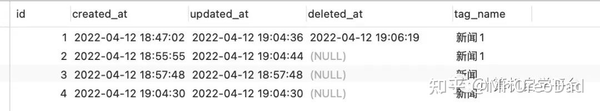

看上面数据库中表记录能看出什么不？

是的，第一条有一个删除时间，其他是没有的。这就是**GORM中的软删除**。

如果你的model中包含了gorm.DeletedAt字段（包含在gorm.Model）,就将自动获得软删除能力！

当你在调用Delete时，记录不会从数据库中删除，但GORM会将DeletedAt字段的值设置为当前时间，并且在你使用正常的Query方法查找数据时将不会返回该记录。

## 日志必备篇

你在某公司技术部经常听到的一句话就是：“稍等，让我查下**日志**再回复你。”

日志---其实就是项目在运行期间留下的痕迹。

就好比你冬天去打兔子，第一件事就是找雪地上兔子留下的脚印，然后顺着脚印去找到兔子的老窝，最后满载而归。

项目开发也是一样的道理，你要在项目开发期间想尽办法去让业务逻辑在运行期间能留下更多的关键信息，这样在项目正常运行后就会留下它运行的痕迹，你就可以通过这个痕迹快速寻找到问题的根源，从而一网打尽。

而在Go语言中只提供了一个标准库log.

不需要安装即可使用，它是一个非常小巧的日志库，大家有空可以去看看。

log只提供了三个简单的接口，对于某些大型项目来说有点太鸡肋，所以本篇我要介绍的不是log而是它的哥哥logrus。

logrus是一个完全兼容log的标准库，目前在GitHub上已经超20K stars了。

它支持两种日志输出格式：文本 And JSON

这对于想通过日志去做更多数据分析的项目来说简直是太爽了。

本篇分两部分：

- 1、logrus的基本用法介绍
- 2、封装logrus用于**开源十年**项目中

2.1)关于使用lumberjack对logrus生成的日志进行分包

1、logrus的基本用法介绍

1）安装

```go
go get -u github.com/sirupsen/logrus
```

2）设置日志输出等级

老程序员都知道，一个项目完整的开发周期分好几个阶段，所以在不同的阶段我们需要的日志信息也是不一样的。所以在使用logrus的时候我们要去设置其日志输出的等级,从而筛选出我们需要的信息内容。

那么在设置日志输出等级之前，我们需要了解logrus共区分了几个等级？

| 级别 | 等级              | 解释                                                 |
| ---- | ----------------- | ---------------------------------------------------- |
| 1    | logrus.TraceLevel | 非常小粒度的信息                                     |
| 2    | logrus.DebusLevel | 一般程序中输出的调试信息                             |
| 3    | logrus.InfoLevel  | 关键操作（核心流程日志）                             |
| 4    | logrus.WarnLevel  | 警告信息                                             |
| 5    | logrus.ErrorLevel | 错误信息                                             |
| 6    | logrus.FatalLevel | 致命错误，出现后程序无法运行，输出日之后程序停止运行 |
| 7    | logrus.PanicLevel | 记录日志，然后panic                                  |

左边有个**级别** 大家一定要记清楚顺序，因为在logrus中，高于设置级别的日志是不会输出的，默认设置级别是InfoLevel

示例：

```go
logrus.SetLevel(logrus.TraceLevel)
logrus.Trace("1---trace---msg")
logrus.Debug("2---debug---msg")
logrus.Info("3---info---msg")
logrus.Warn("4---warn---msg")
logrus.Error("5---error---msg")
logrus.Fatal("6---fatal---msg")
logrus.Panic("7---panic---msg")
```

运行之后我们看下日志输出情况：

```go
TRAC[0000] 1---trace---msg                              
DEBU[0000] 2---debug---msg                              
INFO[0000] 3---info---msg                              
WARN[0000] 4---warn---msg                              
ERRO[0000] 5---error---msg                              
FATA[0000] 6---fatal---msg  
```

如果上面代码中我们把：

```go
logrus.SetLevel(logrus.TraceLevel)
```

修改为：

```go
logrus.SetLevel(logrus.InfoLevel)
```

然后，再运行看下输出情况：

```go
INFO[0000] 3---info---msg                              
WARN[0000] 4---warn---msg                              
ERRO[0000] 5---error---msg                              
FATA[0000] 6---fatal---msg  
```

可以看到，比info级别低的就不再输出了。

3）在日志中输出具体文件和函数位置

为了快速定位问题根源，很多时候我们会在调试阶段直接把文件路径和函数直接输出出来，这样我们就不需要再去定位寻找了，解决问题的效率将会得到大大的提升。

logrus提供了专门的配置，只需要在初始化logrus的时候调用SetReportCaller()函数并设置为true即可。

示例：

```go
logrus.SetReportCaller(true)
logrus.Info("3---info---msg")
```

直接运行看效果：

```go
INFO[0000]/Users/fu/GolandProjects/logrusDemo/main.go:29 main.main() 3---info---msg    
```

4）添加附属信息

我们做为后端开发人员，时刻把并发的问题放在心头是本能。所以在记录日志时，你可能也会思考怎么去区分日志。

比如：

哪些日志是张三留下的？哪些日志是李四留下的？为什么同样的逻辑流程张三和李四输出的结果不一样呢？

这个时候你或许在想，如果我给这些日志打上“张三”“李四”的备注是不是就好找多了？

logrus提供了解决方案，就是WithField和WithFields ,允许在输出中添加一些字段，比如：

```go
logrus.WithFields(logrus.Fields{
		"UUID": "12345678",
	}).Info("info msg")
```

日志输出：

```go
INFO[0000] 3---info---msg                                UUID=12345678
```

这是针对单个的使用方式，如果想批量使用更好办：

```go
requestLogger := logrus.WithFields(logrus.Fields{
		"UUID": "12345678",
	})
requestLogger.Info("3---info---msg")
requestLogger.Error("5---error---msg")
```

日志输出：

```go
INFO[0000] 3---info---msg                                UUID=12345678
ERRO[0000] 5---error---msg                               UUID=12345678
```

5）JSON格式输出日志

上面我们输出日志的时候用的是默认的输出格式，也就是文本格式。但是在很多业务中我们做数据统计或者数据分析的时候依靠的源数据都是日志，如果是文本格式那么用起来就不是那么的顺手，换成json格式的话会不会带来很大的方便呢？

logrus不同于log的最大之处就是提供了json格式的输出，只需要在初始化的时候设置SetFormatter即可。

```go
	logrus.SetLevel(logrus.TraceLevel)
	logrus.SetFormatter(&logrus.JSONFormatter{})
	logrus.Trace("1---trace---msg")
	logrus.Debug("2---debug---msg")
	logrus.Info("3---info---msg")
	logrus.Warn("4---warn---msg")
	logrus.Error("5---error---msg")
	logrus.Fatal("6---fatal---msg")
	logrus.Panic("7---panic---msg")
```

跟1）中的实例一样，只是添加了logrus.SetFormatter(&logrus.JSONFormatter{})，下面我们看下输出的格式：

```go
{"level":"trace","msg":"1---trace---msg","time":"2022-05-14T11:37:56+08:00"}
{"level":"debug","msg":"2---debug---msg","time":"2022-05-14T11:37:56+08:00"}
{"level":"info","msg":"3---info---msg","time":"2022-05-14T11:37:56+08:00"}
{"level":"warning","msg":"4---warn---msg","time":"2022-05-14T11:37:56+08:00"}
{"level":"error","msg":"5---error---msg","time":"2022-05-14T11:37:56+08:00"}
{"level":"fatal","msg":"6---fatal---msg","time":"2022-05-14T11:37:56+08:00"}
```

ok,到这里logrus的基本操作我们就明白了，下面针对在开源十年项目中我们怎么去系统的运用它。

2、封装logrus用于**开源十年**项目中

我封装了一个logger.go的文件，放在了config目录下面，下面我把代码完整放上来，然后在备注中去一一解释一下。

```go
package config

import (
	"github.com/gin-gonic/gin"
	"github.com/natefinch/lumberjack"
	"github.com/sirupsen/logrus"
	"path"
	"time"
)

var logger *logrus.Logger
//日志名称
const (
	//日志文件名
	LOG_NAME = "kaiyuanshinian"
	//日志文件后缀
	LOG_SUFFIX = ".log"
	//单个日志文件大小，单位MB
	LOG_SIZE = 50
	//日志文件个数
	LOG_BACKUP = 10
	//日志文件最大天数
	LOG_DATE = 7
)

//设置日志输出到文件
func setOutPut(log *logrus.Logger, log_file_path string) {
	logconf := &lumberjack.Logger{
		Filename:   log_file_path,
		MaxSize:    LOG_SIZE,   // 日志文件大小，单位是 MB
		MaxBackups: LOG_BACKUP, // 最大过期日志保留个数
		MaxAge:     LOG_DATE,   // 保留过期文件最大时间，单位 天
		Compress:   true,       // 是否压缩日志，默认是不压缩。这里设置为true，压缩日志
	}
	log.SetOutput(logconf)
}

//初始化日志模块
func InitLogger() {
	log_file_path := path.Join("./", LOG_NAME+LOG_SUFFIX)
	logger = logrus.New()
	setOutPut(logger, log_file_path)
	logger.SetLevel(logrus.DebugLevel)
	logger.SetFormatter(&logrus.JSONFormatter{
		TimestampFormat: "2006-01-02 15:04:05",
	})
}
//获取logrus操作对象
func GetLogger() *logrus.Logger {
	return logger
}

//gin请求消息也写入日志
func LoggerToFile() gin.HandlerFunc {
	return func(c *gin.Context) {
		startTime := time.Now()               // 开始时间
		c.Next()                              // 处理请求
		endTime := time.Now()                 // 结束时间
		latencyTime := endTime.Sub(startTime) // 执行时间
		reqMethod := c.Request.Method         // 请求方式
		reqUri := c.Request.RequestURI        // 请求路由
		statusCode := c.Writer.Status()       // 状态码
		clientIP := c.ClientIP()              // 请求IP
		logger.Infof("| %3d | %13v | %15s | %s | %s", statusCode, latencyTime, clientIP, reqMethod, reqUri ) // 日志格式
	}
}
```

上面是对logrus的封装，大家应该都看的明白的我就不一一啰嗦了，那么怎么使用呢？（上面代码中只有lumberjack是我们之前没有提及过得，下面解释）

1）初始化

直接在项目启动的时候把logrus的初始化加进去即可

```go
func InitConfig() {
	config.InitLogger()//初始化logrus
	viper.SetConfigName("application")
	viper.SetConfigType("yml")
	viper.AddConfigPath("./config/")
	err := viper.ReadInConfig()
	if err != nil {
		panic(""+err.Error())
	}
}
```

2）使用

使用就更简单了，直接在项目需要的位置进行调用即可。

2.1）route中的使用

```go
func CollectRoute(r *gin.Engine) *gin.Engine  {
	r.Use(config.LoggerToFile())//添加日志记录
	r.POST("/v1/account/register", controller.Register)
	
	...//省略了一些代码，都是以前写的，项目中有

	return r
}
```

2.2）逻辑中的使用

```go
config.GetLogger().Debugf("aaaaa")
```

3）lumberjack

上面封装的代码中大家发现多了个新东西lumberjack，他是干啥用的呢？

对，切分日志文件的。

有的时候我们的日志需要大量的去记载，如果都记录在一个文件中，万一发生点什么不可描述的事情导致文件丢失了那我们就只有哭的份了。

所以一是为了安全，二是为了方便，我们要针对日志文件进行分割保存。

```go
logconf := &lumberjack.Logger{
		Filename:   log_file_path,
		MaxSize:    LOG_SIZE,   // 日志文件大小，单位是 MB
		MaxBackups: LOG_BACKUP, // 最大过期日志保留个数
		MaxAge:     LOG_DATE,   // 保留过期文件最大时间，单位 天
		Compress:   true,       // 是否压缩日志，默认是不压缩。这里设置为true，压缩日志
	}
	log.SetOutput(logconf)
```

它的使用非常简单，设置好参数，在SetoutPut中传入进去就可以了，当文件大于我们设定的MaxSize时，会自动进行分割保存。

## 部署到云服务器

上次分享过怎么部署Go项目，今天的内容与上次不同，上次部署的服务器是我自己的一台闲置电脑搭建的服务器，这次直接买了一台云服务器，其实部署方法跟上次的并没有什么大的差别，之所以还要另发一篇文章是为了照顾更多的新入坑玩家的意见。

先简单介绍下今天的主要内容：

1. 打包Go项目代码，并上传至云服务器；【上次的内容就不赘述了】
2. 安装mysql；
3. 设置配置文件；
4. 安装nginx；
5. 部署前端代码；【目前还没有前端代码】

在开始以下步骤之前，先登录你的云服务器，我用的是finalshell。然后去云供应商的控制台拿到云服务器的IP和root密码（一般第一次都需要重新设置），拿到以后直接在finalshell进行连接。

### 一、在CentOS安装MySQL并配置

连接并登录后，如下图:

[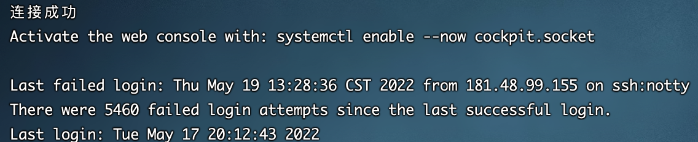](https://camo.githubusercontent.com/623f3e501dce28388a29d32e4cd53e0802ccf95b23906f65d6ce1d69522a54ea/68747470733a2f2f73322e6c6f6c692e6e65742f323032322f30352f31392f746743426f6c73506b474a4946796d2e706e67)

记住是使用root账号登录哦，然后在命令行中输入：

```
sudo dnf install @mysql
```

显示如下内容表示你安装成功：

```
[root@kaiyuanshinian ~]# sudo dnf install @mysql
Failed to set locale, defaulting to C.UTF-8
Last metadata expiration check: 2:31:47 ago on Thu May 19 11:08:56 2022.
Dependencies resolved.
=================================================================================================================================
 Package                              Architecture     Version                                         Repository           Size
=================================================================================================================================
Installing group/module packages:
 mysql-server                         x86_64           8.0.26-1.module_el8.4.0+915+de215114            AppStream            25 M
Installing dependencies:
 mariadb-connector-c-config           noarch           3.1.11-2.el8_3                                  AppStream            15 k
 mecab                                x86_64           0.996-1.module_el8.4.0+589+11e12751.9           AppStream           393 k
 mysql                                x86_64           8.0.26-1.module_el8.4.0+915+de215114            AppStream            12 M
 mysql-common                         x86_64           8.0.26-1.module_el8.4.0+915+de215114            AppStream           134 k
 mysql-errmsg                         x86_64           8.0.26-1.module_el8.4.0+915+de215114            AppStream           598 k
 protobuf-lite                        x86_64           3.5.0-13.el8                                    AppStream           149 k
Installing module profiles:
 mysql/server                                                                                                                   
Enabling module streams:
 mysql                                                 8.0                                                                      

Transaction Summary
=================================================================================================================================
Install  7 Packages

Total download size: 38 M
Installed size: 195 M
Is this ok [y/N]: y
Downloading Packages:
(1/7): mariadb-connector-c-config-3.1.11-2.el8_3.noarch.rpm                                      840 kB/s |  15 kB     00:00    
(2/7): mecab-0.996-1.module_el8.4.0+589+11e12751.9.x86_64.rpm                                    9.1 MB/s | 393 kB     00:00    
(3/7): mysql-common-8.0.26-1.module_el8.4.0+915+de215114.x86_64.rpm                              4.6 MB/s | 134 kB     00:00    
(4/7): mysql-errmsg-8.0.26-1.module_el8.4.0+915+de215114.x86_64.rpm                               14 MB/s | 598 kB     00:00    
(5/7): protobuf-lite-3.5.0-13.el8.x86_64.rpm                                                     6.6 MB/s | 149 kB     00:00    
(6/7): mysql-8.0.26-1.module_el8.4.0+915+de215114.x86_64.rpm                                      31 MB/s |  12 MB     00:00    
(7/7): mysql-server-8.0.26-1.module_el8.4.0+915+de215114.x86_64.rpm                               32 MB/s |  25 MB     00:00    
---------------------------------------------------------------------------------------------------------------------------------
Total                                                                                             46 MB/s |  38 MB     00:00     
...省略
Installed:
  mariadb-connector-c-config-3.1.11-2.el8_3.noarch                mecab-0.996-1.module_el8.4.0+589+11e12751.9.x86_64             
  mysql-8.0.26-1.module_el8.4.0+915+de215114.x86_64               mysql-common-8.0.26-1.module_el8.4.0+915+de215114.x86_64       
  mysql-errmsg-8.0.26-1.module_el8.4.0+915+de215114.x86_64        mysql-server-8.0.26-1.module_el8.4.0+915+de215114.x86_64       
  protobuf-lite-3.5.0-13.el8.x86_64                              

Complete!
```

安装完成后，运行以下命令来保持MySQL在每次开机时自动启动:

```
[root@kaiyuanshinian ~]# sudo systemctl enable --now mysqld
```

然后执行以下命令看下当前mysql的运行状态：

```
[root@kaiyuanshinian ~]# sudo systemctl status mysqld
```

运行后你将看到如下内容：

```
● mysqld.service - MySQL 8.0 database server
   Loaded: loaded (/usr/lib/systemd/system/mysqld.service; enabled; vendor preset: disabled)
   Active: active (running) since Thu 2022-05-19 13:42:00 CST; 10s ago
  Process: 99934 ExecStartPost=/usr/libexec/mysql-check-upgrade (code=exited, status=0/SUCCESS)
  Process: 95613 ExecStartPre=/usr/libexec/mysql-prepare-db-dir mysqld.service (code=exited, status=0/SUCCESS)
  Process: 95578 ExecStartPre=/usr/libexec/mysql-check-socket (code=exited, status=0/SUCCESS)
 Main PID: 99743 (mysqld)
   Status: "Server is operational"
    Tasks: 38 (limit: 12461)
   Memory: 446.3M
   CGroup: /system.slice/mysqld.service
           └─99743 /usr/libexec/mysqld --basedir=/usr

May 19 13:41:50 kaiyuanshinian systemd[1]: Starting MySQL 8.0 database server...
May 19 13:41:50 kaiyuanshinian mysql-prepare-db-dir[95613]: Initializing MySQL database
May 19 13:42:00 kaiyuanshinian systemd[1]: Started MySQL 8.0 database server.
```

至此MySQL就算安装好了，但是仅仅安装完成并不算工作结束，因为我们的MySQL不可能去公开访问，所以还要对它进行一些保护措施，直接运行以下脚本（自带）：

```
sudo mysql_secure_installation
```

然后按照以下提醒一步一步选择就好，除了远程访问我选择的都是yes

```
[root@kaiyuanshinian ~]# sudo mysql_secure_installation

Securing the MySQL server deployment.

Connecting to MySQL using a blank password.

VALIDATE PASSWORD COMPONENT can be used to test passwords
and improve security. It checks the strength of password
and allows the users to set only those passwords which are
secure enough. Would you like to setup VALIDATE PASSWORD component?

Press y|Y for Yes, any other key for No: y

There are three levels of password validation policy:

LOW    Length >= 8
MEDIUM Length >= 8, numeric, mixed case, and special characters
STRONG Length >= 8, numeric, mixed case, special characters and dictionary                  file

Please enter 0 = LOW, 1 = MEDIUM and 2 = STRONG: 2
Please set the password for root here.

New password: 

Re-enter new password: 

Estimated strength of the password: 100 
Do you wish to continue with the password provided?(Press y|Y for Yes, any other key for No) : y
By default, a MySQL installation has an anonymous user,
allowing anyone to log into MySQL without having to have
a user account created for them. This is intended only for
testing, and to make the installation go a bit smoother.
You should remove them before moving into a production
environment.

Remove anonymous users? (Press y|Y for Yes, any other key for No) : y
Success.


Normally, root should only be allowed to connect from
'localhost'. This ensures that someone cannot guess at
the root password from the network.

Disallow root login remotely? (Press y|Y for Yes, any other key for No) : n

 ... skipping.
By default, MySQL comes with a database named 'test' that
anyone can access. This is also intended only for testing,
and should be removed before moving into a production
environment.


Remove test database and access to it? (Press y|Y for Yes, any other key for No) : y
 - Dropping test database...
Success.

 - Removing privileges on test database...
Success.

Reloading the privilege tables will ensure that all changes
made so far will take effect immediately.

Reload privilege tables now? (Press y|Y for Yes, any other key for No) : y
Success.

All done! 
```

直至看到all done表示配置完成，具体每个配置什么意思，我建议大家自己去翻译一下记得比较深。

通过mysql -u root -p命令直接进入MySQL并创建一个database命名为：peoject10nian，MySQL的默认端口是3306我们就用默认的即可。具体命令以及执行结果如下：

```
[root@kaiyuanshinian ~]# mysql -u root -p
Enter password: 
Welcome to the MySQL monitor.  Commands end with ; or \g.
Your MySQL connection id is 10
Server version: 8.0.26 Source distribution

Copyright (c) 2000, 2021, Oracle and/or its affiliates.

Oracle is a registered trademark of Oracle Corporation and/or its
affiliates. Other names may be trademarks of their respective
owners.

Type 'help;' or '\h' for help. Type '\c' to clear the current input statement.

mysql> show databases;
+--------------------+
| Database           |
+--------------------+
| information_schema |
| mysql              |
| performance_schema |
| sys                |
+--------------------+
4 rows in set (0.00 sec)

mysql> create database project10nian;
Query OK, 1 row affected (0.01 sec)

mysql> show databases;
+--------------------+
| Database           |
+--------------------+
| information_schema |
| mysql              |
| performance_schema |
| project10nian      |
| sys                |
+--------------------+
5 rows in set (0.01 sec)

mysql> use project10nian;
Database changed
mysql> show tables;
Empty set (0.01 sec)

mysql> exit;
Bye
```

好的，到这里关于MySQL的设置就够目前的项目使用了。

### 二、设置项目的配置文件

还记得我们项目中的config吗？里面有一个application.yml里面保存了我们对MySQL的一些配置信息：

```
datasource:
  driverName: mysql
  host: 127.0.0.1
  port: 3306
  database: project10nian
  username: <用你自己的账号>
  password: <用你自己设置的密码>
  charset: utf8
  loc: Asia/Shanghai
```

我们直接通过finalshell上传到云服务器去。

**Tips：这里有个小技巧关于本地和服务器之间的文件传输 **

> 1、从服务器上下载文件 scp username@servername:/path/filename /var/www/local_dir（本地目录）
>
> 例如scp root@192.168.0.101:/var/www/test.txt 把192.168.0.101上的/var/www/test.txt 的文件下载到/var/www/local_dir（本地目录） 2、上传本地文件到服务器 scp /path/filename username@servername:/path
>
> 例如scp /var/www/test.php root@192.168.0.101:/var/www/ 把本机/var/www/目录下的test.php文件上传到192.168.0.101这台服务器上的/var/www/目录中
>
> 3、从服务器下载整个目录 scp -r username@servername:/var/www/remote_dir/（远程目录） /var/www/local_dir（本地目录）
>
> 例如:scp -r root@192.168.0.101:/var/www/test /var/www/
>
> 4、上传目录到服务器 scp -r local_dir username@servername:remote_dir 例如：scp -r test root@192.168.0.101:/var/www/ 把当前目录下的test目录上传到服务器的/var/www/ 目录

上传上去后在服务器创建一个config文件夹并把application.yml放进去。

```
[root@kaiyuanshinian ~]# mv application.yml config/
```

然后通过一下命令确认一下里面的内容与上一步我们设置的内容一致：

```yaml
[root@kaiyuanshinian ~]# cd config/
[root@kaiyuanshinian config]# ls
application.yml
[root@kaiyuanshinian config]# cat application.yml 
datasource:
  driverName: mysql
  host: 127.0.0.1
  port: 3306
  database: project10nian
  username: <用你自己的>
  password: <用你自己的>
  charset: utf8
  loc: Asia/Shanghai
```

到这里，配置文件也搞定了。

下面我们直接让项目在服务器后台开始运行即可：

```
[root@kaiyuanshinian ~]# nohup ./main &
```

nohup和'&'还记得是什么意思吗？不记得就翻翻以前的笔记。

那么我们在本地浏览器中访问一下测试接口看一下：

> http://180.76.234.121:8080/test/hello

界面返回Ok表示我们部署工作已经完成了。

### 三、安装nginx

为什么安装nginx，因为我们的需要一个web容器去承载后面的界面展示工作，Nginx是一个轻量级的Web服务器，有的人会问Gin不是也可以吗？确实~ 但是我们实际开发场景中都是前后端分离的，也算是为了适应当前的大环境。

这里重点说一下nginx的配置，请参考下面配置理解：(路径：ngnix-1.18/conf/nginx.conf)

```nginx
user  root;
worker_processes  1;

#error_log  logs/error.log;
#error_log  logs/error.log  notice;
#error_log  logs/error.log  info;

#pid        logs/nginx.pid;

events {
    worker_connections  1024;
}

http {
    include       mime.types;
    default_type  application/octet-stream;
    sendfile        on;
    keepalive_timeout  65;
    gzip on;    #开启gzip压缩功能
    gzip_min_length 1k;          #最小压缩文件为1k
    gzip_buffers 4 16k;                #压缩缓存空间大小
    gzip_comp_level 5;                 #压缩级别为2
    gzip_types text/plain application/javascript application/x-javascript text/javascript text/css application/xml;  #压缩文件类型
    gzip_http_version 1.1; #识别http的协议版本。由于早期的一些浏览器或者http客户端，可能不支持gzip自解压，用户就会看到乱码，所以做一些判断还是有必要的
    gzip_vary on;               #开启压缩表示 
    #gzip_static on;         #开启（在浏览器不支持解压功能，nginx提前解压）解压功能

    server {
         listen 443 ssl;
         server_name 你的域名;
    ssl_certificate /opt/server/nginx1.18/conf/ssl/你的ssl证书.crt;
        ssl_certificate_key /opt/server/nginx1.18/conf/ssl/你的ssl证书.key;
        ssl_session_timeout 5m;
        ssl_ciphers ECDHE-RSA-AES128-GCM-SHA256:ECDHE:ECDH:AES:HIGH:!NULL:!aNULL:!MD5:!ADH:!RC4;
        ssl_protocols TLSv1 TLSv1.1 TLSv1.2;
        ssl_prefer_server_ciphers on;
         location / {
            root 你的项目路径;
            index  beian.html;
         }
    }   
}
```

这里配置的时候可以把location指向你的前端代码。

