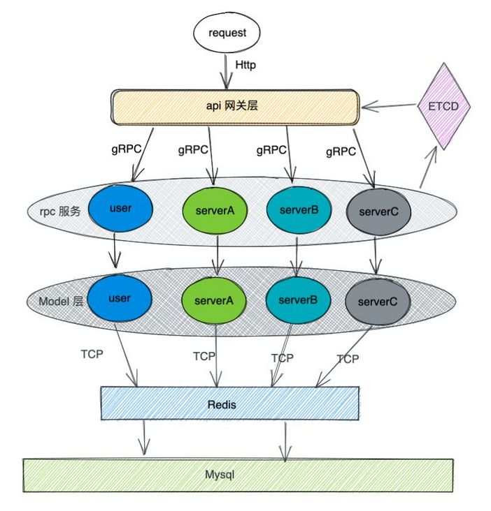
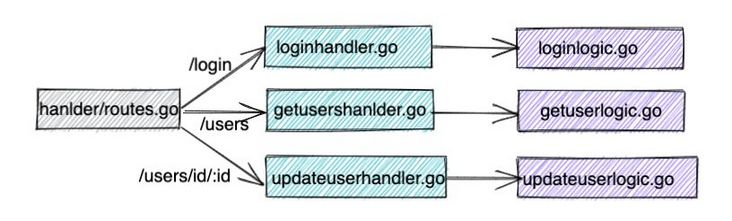

# [go-zero 实战之 blog 系统](https://segmentfault.com/a/1190000040857252)

本文以 `blog` 的网站后台为例，着重介绍一下如何使用 `go-zero` 开发 `blog` 的用户模块。

本文涉及的所有资料都已上传 github 仓库 `kougazhang/go-zero-demo`，感兴趣的同学可以自行下载。

用户模块是后台管理系统常见的模块，它的功能大家也非常熟悉。管理用户涉及到前端操作，用户信息持久化又离不开数据库。所以用户模块可谓是 "麻雀虽小五脏俱全"。本文将详细介绍一下如何使用 go-zero 完成用户模块功能，如：用户登录、添加用户、删除用户、修改用户、查询用户 等（完整的 api 文件请参考仓库代码）。

**blog 整体架构**



最上面是 api 网关层。go-zero 需要 api 网关层来代理请求，把 request 通过 gRPC 转发给对应的 rpc 服务去处理。这块把具体请求转发到对应的 rpc 服务的业务逻辑，需要手写。

接下来是 rpc 服务层。上图 rpc 服务中的 user 就是接下来向大家演示的模块。每个 rpc 服务可以单独部署。服务启动后会把相关信息注册到 ETCD，这样 api 网关层就可以通过 ECTD 发现具体服务的地址。rpc 服务处理具体请求的业务逻辑，需要手写。

最后是 `model` 层。model 层封装的是数据库操作的相关逻辑。如果是查询类的相关操作，会先查询 redis 中是否有对应的缓存。非查询类操作，则会直接操作 MySQL。goctl 能通过 sql 文件生成普通的 CRDU 代码。目前 goctl 这部分功能支持 MySQL、PostgreSQL、MongoDB。

下面演示如何使用 go-zero 开发一个 blog 系统的用户模块。

## api 网关层

**编写 blog.api 文件**

- **生成 blog.api 文件**

执行命令 `goctl api -o blog.api`，创建 blog.api 文件。

- **api 文件的作用**

api 文件的详细语法请参阅文档 [https://go-zero.dev/cn/api-grammar.html](https://link.segmentfault.com/?enc=VuN8snMKYlvzA%2B8Gl6Gdmg%3D%3D.OngQqGn9Za4KiGdwjq8wY%2FTg17ht2sKVMEPkXuLg%2FjWM5uyujOJ3EdlQ8KNMVsgFpsC561FNSfidi9v%2FYu8PeVUfWHglM87E2bHWMz6r5Eg%3D)，本文按照个人理解谈一谈 api 文件的作用和基础语法。

api 文件是用来生成 api 网关层的相关代码的。

- **api 文件的语法**

api 文件的语法和 Golang 语言非常类似，type 关键字用来定义结构体，service 部分用来定义 api 服务。

type 定义的结构体，主要是用来声明请求的入参和返回值的，即 request 和 response.

service 定义的 api 服务，则声明了路由，handler，request 和 response.

具体内容请结合下面的默认的生成的 api 文件进行理解。

```plaintext
// 声明版本，可忽略
syntax = "v1"

// 声明一些项目信息，可忽略
info(
   title: // TODO: add title
   desc: // TODO: add description
   author: "zhao.zhang"
   email: "zhao.zhang@upai.com"
)

// 重要配置
// request 是结构体的名称，可以使用 type 关键词定义新的结构体
type request {
   // TODO: add members here and delete this comment
   // 与 golang 语言一致，这里声明结构体的成员
}

// 语法同上，只是业务含义不同。response 一般用来声明返回值。
type response {
   // TODO: add members here and delete this comment
}

// 重要配置
// blog-api 是 service 的名称.
service blog-api {
   // GetUser 是处理请求的视图函数
   @handler GetUser // TODO: set handler name and delete this comment
   // get 声明了该请求使用 GET 方法
   // /users/id/:userId 是 url，:userId 表明是一个变量
   // request 就是上面 type 定义的那个 request, 是该请求的入参
   // response 就是上面 type 定义的那个 response, 是该请求的返回值。
   get /users/id/:userId(request) returns(response)

   @handler CreateUser // TODO: set handler name and delete this comment
   post /users/create(request)
}
```

- **编写 blog.api 文件**

鉴于文章篇幅考虑完整的 blog.api 文件请参考 gitee 上的仓库。下面生成的代码是按照仓库上的 blog.api 文件生成的。

**api 相关代码**

- **生成相关的代码**

执行命令 goctl api go -api blog.api -dir . ，生成 api 相关代码。

- **目录介绍**

```plaintext
├── blog.api # api 文件
├── blog.go # 程序入口文件
├── etc
│   └── blog-api.yaml # api 网关层配置文件
├── go.mod
├── go.sum
└── internal
    ├── config
    │   └── config.go # 配置文件
    ├── handler # 视图函数层, handler 文件与下面的 logic 文件一一对应
    │   ├── adduserhandler.go
    │   ├── deleteuserhandler.go
    │   ├── getusershandler.go
    │   ├── loginhandler.go
    │   ├── routes.go
    │   └── updateuserhandler.go
    ├── logic # 需要手动填充代码的地方
    │   ├── adduserlogic.go
    │   ├── deleteuserlogic.go
    │   ├── getuserslogic.go
    │   ├── loginlogic.go
    │   └── updateuserlogic.go
    ├── svc # 封装 rpc 对象的地方，后面会将
    │   └── servicecontext.go
    └── types # 把 blog.api 中定义的结构体映射为真正的 golang 结构体
        └── types.go
```

- **文件间的调用关系**



因为到此时还没涉及到 rpc 服务，所以 api 内各模块的调用关系就是非常简单的单体应用间的调用关系。routers.go 是路由，根据 request Method 和 url 把请求分发到对应到的 handler 上，handler 内部会去调用对应的 logic. logic 文件内是我们注入代码逻辑的地方。

**小结**

Api 层相关命令：

- 执行命令 `goctl api -o blog.api`, 创建 blog.api 文件。
- 执行命令 `goctl api go -api blog.api -dir .`，生成 api 相关代码。
- 加参数 goctl 也可以生成其他语言的 api 层的文件，比如 java、ts 等，这里就不展开了。

## rpc 服务

**编写 proto 文件**

- **生成 user.proto 文件**

使用命令 `goctl rpc template -o user.proto`, 生成 user.proto 文件

- **user.proto 文件的作用**

user.proto 的作用是用来生成 rpc 服务的相关代码。

protobuf 的语法已经超出了 go-zero 的范畴了，这里就不详细展开了。

- **编写 user.proto 文件**

鉴于文章篇幅考虑完整的 user.proto 文件请参考 gitee 上的仓库。

**生成 rpc 相关代码**

- **生成 user rpc 服务相关代码**

使用命令 `goctl rpc proto -src user.proto -dir .` 生成 user rpc 服务的代码。

**小结**

rpc 服务相关命令：

- 使用命令 `goctl rpc template -o user.proto`, 生成 user.proto 文件
- 使用命令 `goctl rpc proto -src user.proto -dir .` 生成 user rpc 服务的代码。

## api 服务调用 rpc 服务

**A：为什么本节要安排在 rpc 服务的后面？**

Q：因为 logic 部分的内容主体就是调用对应的 user rpc 服务，所以我们必须要在 user rpc 的代码已经生成后才能开始这部分的内容。

**A：api 网关层调用 rpc 服务的步骤**

Q：对这部分目录结构不清楚的，可以参考前文 “api 网关层-api 相关代码-目录介绍”。

- **编辑配置文件 etc/blog-api.yaml，配置 rpc 服务的相关信息。**

```yaml
Name: blog-api
Host: 0.0.0.0
Port: 8888
# 新增 user rpc 服务.
User:
  Etcd:
    #  Hosts 是 user.rpc 服务在 etcd 中的 value 值  
    Hosts:
      - localhost:2379
    # Key 是 user.rpc 服务在 etcd 中的 key 值
    Key: user.rpc
```

- **编辑文件 config/config.go**

```go
type Config struct {
   rest.RestConf
   // 手动添加
   // RpcClientConf 是 rpc 客户端的配置, 用来解析在 blog-api.yaml 中的配置
   User zrpc.RpcClientConf
}
```

- **编辑文件 internal/svc/servicecontext.go**

```go
type ServiceContext struct {
   Config config.Config
   // 手动添加
   // users.Users 是 user rpc 服务对外暴露的接口
   User   users.Users
}

func NewServiceContext(c config.Config) *ServiceContext {
   return &ServiceContext{
      Config: c,
      // 手动添加
      //  zrpc.MustNewClient(c.User) 创建了一个 grpc 客户端
      User:   users.NewUsers(zrpc.MustNewClient(c.User)),
   }
}
```

- **编辑各个 logic 文件，这里以 internal/logic/loginlogic.go 为例**

```go
func (l *LoginLogic) Login(req types.ReqUser) (*types.RespLogin, error) {
   // 调用 user rpc 的 login 方法
   resp, err := l.svcCtx.User.Login(l.ctx, &users.ReqUser{Username: req.Username, Password: req.Password})
   if err != nil {
      return nil, err
   }
   return &types.RespLogin{Token: resp.Token}, nil
}
```

## model 层

**编写 sql 文件**

编写创建表的 SQL 文件 user.sql, 并在数据库中执行。

```sql
CREATE TABLE `user`
(
  `id` int NOT NULL AUTO_INCREMENT COMMENT 'id',
  `username` varchar(255) NOT NULL UNIQUE COMMENT 'username',
  `password` varchar(255) NOT NULL COMMENT 'password',
  PRIMARY KEY(`id`)
) ENGINE=InnoDB DEFAULT CHARSET=utf8mb4
```

**生成 model 相关代码**

运行命令 `goctl model mysql ddl -c -src user.sql -dir .`, 会生成操作数据库的 CRDU 的代码。

此时的 model 目录：

```plaintext
├── user.sql # 手写
├── usermodel.go # 自动生成
└── vars.go # 自动生成
```

**model 生成的代码注意点**

- model 这块代码使用的是拼接 SQL 语句，可能会存在 SQL 注入的风险。
- 生成 CRUD 的代码比较初级，需要我们手动编辑 usermodel.go 文件，自己拼接业务需要的 SQL。参见 usermdel.go 中的 FindByName 方法。

## rpc 调用 model 层的代码

**rpc 目录结构**

rpc 服务我们只需要关注下面加注释的文件或目录即可。

```plaintext
├── etc
│   └── user.yaml # 配置文件，数据库的配置写在这
├── internal
│   ├── config
│   │   └── config.go # config.go 是 yaml 对应的结构体
│   ├── logic # 填充业务逻辑的地方
│   │   ├── createlogic.go
│   │   ├── deletelogic.go
│   │   ├── getalllogic.go
│   │   ├── getlogic.go
│   │   ├── loginlogic.go
│   │   └── updatelogic.go
│   ├── server
│   │   └── usersserver.go
│   └── svc
│       └── servicecontext.go # 封装各种依赖
├── user
│   └── user.pb.go
├── user.go
├── user.proto
└── users
    └── users.go
```

**rpc 调用 model 层代码的步骤**

- **编辑 etc/user.yaml 文件**

```yaml
Name: user.rpc
ListenOn: 127.0.0.1:8080
Etcd:
  Hosts:
  - 127.0.0.1:2379
  Key: user.rpc
# 以下为手动添加的配置
# mysql 配置
DataSource: root:1234@tcp(localhost:3306)/gozero
# 对应的表
Table: user
# redis 作为换存储
Cache:
  - Host: localhost:6379
```

- **编辑 internal/config/config.go 文件**

```go
type Config struct {
   // zrpc.RpcServerConf 表明继承了 rpc 服务端的配置
   zrpc.RpcServerConf
   DataSource string          // 手动代码
   Cache      cache.CacheConf // 手动代码
}
```

- **编辑 internal/svc/servicecontext.go, 把 model 等依赖封装起来。**

```go
type ServiceContext struct {
   Config config.Config
   Model  model.UserModel // 手动代码
}

func NewServiceContext(c config.Config) *ServiceContext {
   return &ServiceContext{
      Config: c,
      Model:  model.NewUserModel(sqlx.NewMysql(c.DataSource), c.Cache), // 手动代码
   }
}
```

- **编辑对应的 logic 文件，这里以 internal/logic/loginlogic.go 为例：**

```go
func (l *LoginLogic) Login(in *user.ReqUser) (*user.RespLogin, error) {
   // todo: add your logic here and delete this line
   one, err := l.svcCtx.Model.FindByName(in.Username)
   if err != nil {
      return nil, errors.Wrapf(err, "FindUser %s", in.Username)
   }

   if one.Password != in.Password {
      return nil, fmt.Errorf("user or password is invalid")
   }

   token := GenTokenByHmac(one.Username, secretKey)
   return &user.RespLogin{Token: token}, nil
}
```

## 微服务运行演示

我们是在单机环境下运行整个微服务，需要启动以下服务：

- Redis
- Mysql
- Etcd
- go run blog.go -f etc/blog-api.yaml
- go run user.go -f etc/user.yaml

在上述服务中，rpc 服务要先启动，然后网关层再启动。

在仓库中我封装了 start.sh 和 stop.sh 脚本来分别在单机环境下运行和停止微服务。

好了，通过上述六个步骤，blog 用户模块的常见功能就完成了。

最后再帮大家强调下重点，除了 `goctl` 常用的命令需要熟练掌握，`go-zero` 文件命名也是有规律可循的。配置文件是放在 etc 目录下的 yaml 文件，该 yaml 文件对应的结构体在 `internal/config/config.go` 中。依赖管理一般会在 `internal/svc/servicecontext.go` 中进行封装。需要我们填充业务逻辑的地方是 `internal/logic` 目录下的文件。