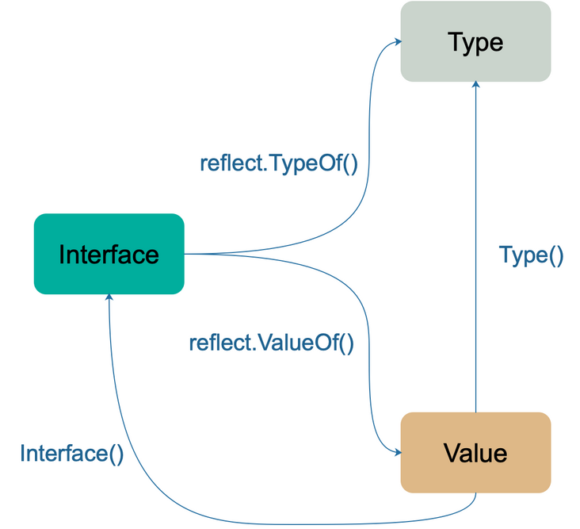

# [【Go进阶—基础特性】反射](https://segmentfault.com/a/1190000041583248)

### **定义**

反射是什么？来自维基百科的定义是：在计算机学中，反射是指计算机程序在运行时可以访问、检测和修改它本身状态或行为的一种能力。用比喻来说，反射就是程序在运行的时候能够 “观察” 并且修改自己的行为。《Go 程序设计语言》中则是这样定义的：Go 语言提供了一种机制在运行时更新变量和检查它们的值、调用它们的方法，但是在编译时并不知道这些变量的具体类型，这称为反射机制。

### **使用场景和缺点**

使用反射的常见场景有两种：

- 函数的参数类型不能确定，需要在运行时处理任意对象。
- 不能确定调用哪个函数，需要根据传入的参数在运行时决定。

反射机制能带给我们很大的灵活性，不过绝大多数情况下还是不推荐使用，主要理由有：

- 与反射相关的代码一般可读性都比较差。
- 反射相关的代码通常在运行时才会暴露错误，这时经常是直接 panic，可能会造成严重的后果。
- 反射对性能影响比较大，比正常代码运行速度慢一到两个数量级。

所以这是一把双刃剑，因此要想使用好，必须得明白其中的基本原理。

### **实现原理**

reflect.TypeOf 和 reflect.ValueOf 是进入反射世界仅有的两扇“大门”。顾名思义，这两个函数返回的分别是接口变量的类型信息和值信息，首先来看一下这两个函数。

#### **reflect.TypeOf**

```go
func TypeOf(i interface{}) Type {
    eface := *(*emptyInterface)(unsafe.Pointer(&i))
    return toType(eface.typ)
}

type emptyInterface struct {
    typ  *rtype
    word unsafe.Pointer
}

func toType(t *rtype) Type {
    if t == nil {
        return nil
    }
    return t
}
```

*注：传入反射函数如 TypeOf 等的参数（interface 类型）是在编译阶段进行类型转换的。*

emptyInterface 和上一篇文章中提到的空接口类型 eface 是一样的，只是属性名不同而已，typ 是接口变量的动态类型，word 是动态值的指针。那么这个函数的逻辑就很明白了：使用 unsafe.Pointer 方法获取接口变量的指针值，将之强制转换为 emptyInterface 类型，并返回它的动态类型。

返回值 Type 实际上是一个接口，定义了很多方法，用来获取类型相关的各种信息，而 *rtype 实现了 Type 接口。Type 定义了很多有关类型的方法，建议都大致过一遍。

```go
type Type interface {
    // 所有的类型都可以调用下面这些函数
    // 此类型的变量对齐后所占用的字节数
    Align() int
    // 如果是 struct 的字段，对齐后占用的字节数
    FieldAlign() int
    // 返回类型方法集里的第 `i` (传入的参数)个方法
    Method(int) Method
    // 通过名称获取方法
    MethodByName(string) (Method, bool)
    // 获取类型方法集里导出的方法个数
    NumMethod() int
    // 类型名称
    Name() string
    // 返回类型所在的路径，如：encoding/base64
    PkgPath() string
    // 返回类型的大小，和 unsafe.Sizeof 功能类似
    Size() uintptr
    // 返回类型的字符串表示形式
    String() string
    // 返回类型的类型值
    Kind() Kind
    // 类型是否实现了接口 u
    Implements(u Type) bool
    // 是否可以赋值给 u
    AssignableTo(u Type) bool
    // 是否可以类型转换成 u
    ConvertibleTo(u Type) bool
    // 类型是否可以比较
    Comparable() bool
    // 下面这些函数只有特定类型可以调用
    // 如：Key, Elem 两个方法就只能是 Map 类型才能调用
    // 类型所占据的位数
    Bits() int
    // 返回通道的方向，只能是 chan 类型调用
    ChanDir() ChanDir
    // 返回类型是否是可变参数，只能是 func 类型调用
    // 比如 t 是类型 func(x int, y ... float64)
    // 那么 t.IsVariadic() == true
    IsVariadic() bool
    // 返回内部子元素类型，只能由类型 Array, Chan, Map, Ptr, or Slice 调用
    Elem() Type
    // 返回结构体类型的第 i 个字段，只能是结构体类型调用
    // 如果 i 超过了总字段数，就会 panic
    Field(i int) StructField
    // 返回嵌套的结构体的字段
    FieldByIndex(index []int) StructField
    // 通过字段名称获取字段
    FieldByName(name string) (StructField, bool)
    // FieldByNameFunc returns the struct field with a name
    // 返回名称符合 func 函数的字段
    FieldByNameFunc(match func(string) bool) (StructField, bool)
    // 获取函数类型的第 i 个参数的类型
    In(i int) Type
    // 返回 map 的 key 类型，只能由类型 map 调用
    Key() Type
    // 返回 Array 的长度，只能由类型 Array 调用
    Len() int
    // 返回类型字段的数量，只能由类型 Struct 调用
    NumField() int
    // 返回函数类型的输入参数个数
    NumIn() int
    // 返回函数类型的返回值个数
    NumOut() int
    // 返回函数类型的第 i 个值的类型
    Out(i int) Type
    // 返回类型结构体的相同部分
    common() *rtype
    // 返回类型结构体的不同部分
    uncommon() *uncommonType
}
```

#### **reflect.ValueOf**

```go
type Value struct {
    typ *rtype
    ptr unsafe.Pointer
    flag
}

func ValueOf(i interface{}) Value {
    if i == nil {
        return Value{}
    }

    escapes(i)

    return unpackEface(i)
}

func unpackEface(i interface{}) Value {
    e := (*emptyInterface)(unsafe.Pointer(&i))
    t := e.typ
    if t == nil {
        return Value{}
    }
    f := flag(t.Kind())
    if ifaceIndir(t) {
        f |= flagIndir
    }
    return Value{t, e.word, f}
}
```

ValueOf 的逻辑也比较简单：首先调用 escapes 让变量 i 逃逸到堆上，然后将变量 i 强制转换为 emptyInterface 类型，最后将所需的信息组装成 reflect.Value 类型后返回。reflect.Value 的结构和 emptyInterface 也很像，只是多个表示元数据的 flag 字段。

reflect.Value 结构体的方法同样很多，建议都大致浏览一下。

#### **reflect.Set**

当我们想要更新 reflect.Value 时，就需要调用 reflect.Value.Set 更新反射对象：

```go
func (v Value) Set(x Value) {
    v.mustBeAssignable()
    x.mustBeExported() 
    var target unsafe.Pointer
    if v.kind() == Interface {
        target = v.ptr
    }
    x = x.assignTo("reflect.Set", v.typ, target)
    if x.flag&flagIndir != 0 {
        if x.ptr == unsafe.Pointer(&zeroVal[0]) {
            typedmemclr(v.typ, v.ptr)
        } else {
            typedmemmove(v.typ, v.ptr, x.ptr)
        }
    } else {
        *(*unsafe.Pointer)(v.ptr) = x.ptr
    }
}
```

代码逻辑可以分为四个步骤：

1. 检查当前反射对象及其字段是否可以被设置。
2. 检查待设置的 Value 对象是否可导出。
3. 调用 assignTo 方法创建一个新的 Value 对象并对原本的 Value 对象进行覆盖。
4. 根据返回的 Value 对象的指针值，对当前反射对象的指针值进行修改。

反射包中还有其他方法，此时就不一一列举了，可以根据下面这张图来串起 interface、Type 和 Value：



### **反射三大定律**

Go 官方关于反射的博客，介绍了反射有三大定律：

1. Reflection goes from interface value to reflection object.
2. Reflection goes from reflection object to interface value.
3. To modify a reflection object, the value must be settable.

反射的第一定律是：“反射可以从接口值（interface）得到反射对象”。当我们执行 reflect.ValueOf(1) 时，虽然看起来是获取了基本类型 int 对应的反射对象，但是由于 reflect.TypeOf、reflect.ValueOf 两个方法的入参都是 interface{} 类型，所以在方法执行的过程中发生了类型转换。

反射的第二定律是：“可以从反射对象得到接口值（interface）”。这是与第一条定律相反的定律，既然能够将接口类型的变量转换成反射对象，那么一定需要其他方法将反射对象还原成接口类型的变量，reflect 中的 reflect.Value.Interface 就能完成这项工作。

反射的第三定律是：“要修改反射对象，该值必须可以修改”。这一条稍微有点复杂，我们来看个例子，新手在使用反射的时候可能会犯下面这种错误：

```go
func main() {
    i := 1
    v := reflect.ValueOf(i)
    v.SetInt(10)
    fmt.Println(i)
}

// 运行结果
// panic: reflect: reflect.Value.SetInt using unaddressable value
```

从错误信息我们可以看出，我们在修改变量 i 的值的时候使用了非可寻址的值，也就是说该值不可以修改。这么做的原因在于，Go 语言中函数的参数都是采用值传递，也就是传递了值的一份副本，此时肯定无法根据这份副本来修改反射对象的值。因此 Go 标准库就对其进行了逻辑判断，避免出现问题。

所以我们只能用间接的方式改变原变量的值：先获取指针对应的 reflect.Value，再通过 reflect.Value.Elem 方法得到可以被设置的变量，最后调用 Set 相关方法来进行设置。