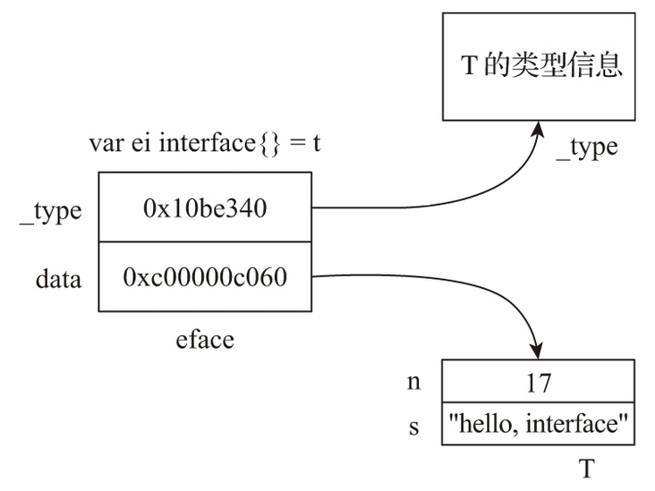
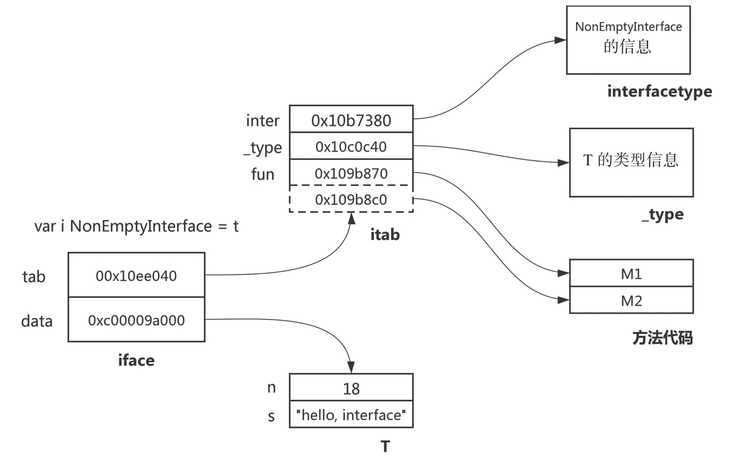

# [【Go进阶—基础特性】接口](https://segmentfault.com/a/1190000041540442)

接口定义了一种规范，描述了类的行为和功能。我们都知道，Go 语言中的接口是所谓的 Duck Typing，实现接口的所有方法也就隐式地实现了接口，那么，它是怎么实现的呢？

### **数据结构**

在 Go 语言中，接口分为两类：

- eface：用于表示没有方法的空接口类型变量，即 interface{} 类型的变量。
- iface：用于表示其余拥有方法的接口类型变量。

#### **eface**

eface 的数据结构如下：

```go
type eface struct {
    _type *_type
    data  unsafe.Pointer
}
```

eface 有两个属性，分别是 _type 和 data，分别指向接口变量的动态类型和动态值。

再进一步看看 type 属性的结构：

```go
type _type struct {
    size       uintptr // 类型大小
    ptrdata    uintptr // 包含所有指针的内存前缀的大小
    hash       uint32  // 类型的 hash 值
    tflag      tflag   // 类型的 flag 标志，主要用于反射
    align      uint8   // 内存对齐相关
    fieldAlign uint8   // 内存对齐相关
    kind       uint8   // 类型的编号，包含 Go 语言中的所有类型，如 kindBool、kindInt 等
    equal func(unsafe.Pointer, unsafe.Pointer) bool // 用于比较此对象的回调函数
    gcdata    *byte    // 存储垃圾收集器的 GC 类型数据
    str       nameOff 
    ptrToThis typeOff
}
```

*注：Go 语言的各种数据类型都是在 _type 字段的基础上，增加一些额外的字段来进行管理的。*

来看一个 eface 变量的例子：

```go
type T struct {
    n int
    s string
}

func main() {
    var t = T {
        n: 17,
        s: "hello, interface",
    }
    var ei interface{} = t
    println(ei)
}           
            
```

ei 变量的结构对应于下图：



#### **iface**

iface 的结构如下：

```go
type iface struct {
    tab  *itab
    data unsafe.Pointer
}
```

与 eface 结构体一样，iface 存储的也是类型和值信息，不过因为 iface 还要存储接口本身的信息以及动态类型所实现的方法的信息，因此 iface 稍显复杂，它的第一个字段指向一个 itab 类型结构：

```go
type itab struct {
    inter *interfacetype // 接口的类型信息
    _type *_type         // 动态类型信息
    hash  uint32         // _type.hash 的副本，当我们想将 interface 类型转换成具体类型时，可以使用该字段快速判断目标类型和具体类型 _type 是否一致
    _     [4]byte    
    fun   [1]uintptr     // 存储接口方法集的具体实现的地址，包含一组函数指针，实现了接口方法的动态分派，且每次在接口发生变更时都会更新
}
```

进一步展开 interfacetype 结构体。源码如下：

```go
type nameOff int32
type typeOff int32

type imethod struct {
    name nameOff
    ityp typeOff
}

type interfacetype struct {
    typ     _type     // 动态类型信息
    pkgpath name      // 包名信息
    mhdr    []imethod // 接口所定义的方法列表
}
```

iface 的示例如下：

```go
type T struct {
    n int
    s string
}

func (T) M1() {}
func (T) M2() {}

type NonEmptyInterface interface {
    M1()
    M2()
}

func main() {
    var t = T{
        n: 18,
        s: "hello, interface",
    }
    var i NonEmptyInterface = t
    println(i)
}            
```

变量 i 对应如下：



### **值接收者和指针接收者**

在使用 Go 语言的过程中，在调用方法的时候，不管方法的接收者是什么类型，该类型的值和指针都可以调用，不必严格符合接收者的类型。

需要记住的一点是：在 Go 语言中，如果实现了接收者是值类型的方法，会隐含实现接收者是指针类型的方法，反之则不成立。之所以可以使用值类型调用指针类型的方法，是语法糖的作用。如果只有指针类型实现了接口，使用值类型调用接口方法则会报错。

### **接口值的比较**

我们看到，所有的接口类型其实底层都包含两个字段：类型和值，也被称为动态类型和动态值。因此接口值包括动态类型和动态值，在比较接口值的时候，我们需要分别对接口值的类型和值进行比较。

#### **nil 接口变量**

```go
package main

func main() {
    var i interface{}
    var err error
    println(i)
    println(err)
    println("i = nil:", i == nil)
    println("err = nil:", err == nil)
    println("i = err:", i == err)
    println("")
}

// 输出结果

(0x0,0x0)
(0x0,0x0)
i = nil: true
err = nil: true
i = err: true
```

我们看到，无论是空接口类型变量还是非空接口类型变量，一旦变量值为 nil，那么它们内部表示均为(0x0,0x0)，即类型信息和数据信息均为空。因此上面的变量 i 和 err 等值判断为 true。

#### **空接口类型变量**

```go
func main() {
    var eif1 interface{}
    var eif2 interface{}
    n, m := 17, 18

    eif1 = n
    eif2 = m

    println("eif1:", eif1)
    println("eif2:", eif2)
    println("eif1 = eif2:", eif1 == eif2)

    eif2 = 17
    println("eif1:", eif1)
    println("eif2:", eif2)
    println("eif1 = eif2:", eif1 == eif2)

    eif2 = int64(17)
    println("eif1:", eif1)
    println("eif2:", eif2)
    println("eif1 = eif2:", eif1 == eif2)
}

// 输出结果

eif1: (0x10ac580,0xc00007ef48)
eif2: (0x10ac580,0xc00007ef40)
eif1 = eif2: false
eif1: (0x10ac580,0xc00007ef48)
eif2: (0x10ac580,0x10eb3d0)
eif1 = eif2: true
eif1: (0x10ac580,0xc00007ef48)
eif2: (0x10ac640,0x10eb3d8)
eif1 = eif2: false
```

从输出结果可以看到：对于空接口类型变量，只有在 _type 和 data 所指数据内容一致（不是数据指针的值一致）的情况下，两个空接口类型变量才相等。

> Go 在创建 eface 时一般会为 data 重新分配内存空间，将动态类型变量的值复制到这块内存空间，并将 data 指针指向这块内存空间。因此我们在多数情况下看到的 data 指针值是不同的。但 Go 对于 data 的分配是有优化的，也不是每次都分配新内存空间，就像上面的 eif2 的 0x10eb3d0 和 0x10eb3d8 两个 data 指针值，显然是直接指向了一块事先创建好的静态数据区。

#### **非空接口类型变量**

```go
func main() {
    var err1 error
    var err2 error
    err1 = (*T)(nil)
    println("err1:", err1)
    println("err1 = nil:", err1 == nil)

    err1 = T(5)
    err2 = T(6)
    println("err1:", err1)
    println("err2:", err2)
    println("err1 = err2:", err1 == err2)

    err2 = fmt.Errorf("%d\n", 5)
    println("err1:", err1)
    println("err2:", err2)
    println("err1 = err2:", err1 == err2)
}

// 输出结果

err1: (0x10ed120,0x0)
err1 = nil: false
err1: (0x10ed1a0,0x10eb310)
err2: (0x10ed1a0,0x10eb318)
err1 = err2: false
err1: (0x10ed1a0,0x10eb310)
err2: (0x10ed0c0,0xc000010050)
err1 = err2: false            
```

与空接口类型变量一样，只有在 tab 和 data 所指数据内容一致的情况下，两个非空接口类型变量之间才能画等号。

#### **空接口类型变量与非空接口类型变量**

```go
func main() {
    var eif interface{} = T(5)
    var err error = T(5)
    println("eif:", eif)
    println("err:", err)
    println("eif = err:", eif == err)

    err = T(6)
    println("eif:", eif)
    println("err:", err)
    println("eif = err:", eif == err)
}

// 输出结果

eif: (0x10b3b00,0x10eb4d0)
err: (0x10ed380,0x10eb4d8)
eif = err: true
eif: (0x10b3b00,0x10eb4d0)
err: (0x10ed380,0x10eb4e0)
eif = err: false                 
```

空接口类型变量和非空接口类型变量内部表示的结构有所不同，似乎一定不能相等。但 Go 在进行等值比较时，类型比较使用的是 eface 的 _type 和 iface 的 tab._type，因此就像我们在这个例子中看到的那样，当 eif 和 err 都被赋值为 T(5) 时，两者之间是相等的。

### **类型转换**

#### **常规变量转换接口变量**

先看代码示例：

```go
import "fmt"

type T struct {
    n int
    s string
}

func (T) M1() {}
func (T) M2() {}

type NonEmptyInterface interface {
    M1()
    M2()
}

func main() {
    var t = T{
        n: 17,
        s: "hello, interface",
    }
    var ei interface{}
    ei = t

    var i NonEmptyInterface
    i = t
    fmt.Println(ei)
    fmt.Println(i)
}
```

使用 `go tool compile -S` 命令查看生成的汇编代码，可以看到这两个转换过程对应了 runtime 包的两个函数：

```asciidoc
......
0x0050 00080 (main.go:24)       CALL    runtime.convT2E(SB)
......
0x0089 00137 (main.go:27)       CALL    runtime.convT2I(SB)
......
```

这两个函数的源码如下：

```go
// $GOROOT/src/runtime/iface.go
func convT2E(t *_type, elem unsafe.Pointer) (e eface) {
    if raceenabled {
        raceReadObjectPC(t, elem, getcallerpc(), funcPC(convT2E))
    }
    if msanenabled {
        msanread(elem, t.size)
    }
    x := mallocgc(t.size, t, true)
    typedmemmove(t, x, elem)
    e._type = t
    e.data = x
    return
}

func convT2I(tab *itab, elem unsafe.Pointer) (i iface) {
    t := tab._type
    if raceenabled {
        raceReadObjectPC(t, elem, getcallerpc(), funcPC(convT2I))
    }
    if msanenabled {
        msanread(elem, t.size)
    }
    x := mallocgc(t.size, t, true)
    typedmemmove(t, x, elem)
    i.tab = tab
    i.data = x
    return
}                        
```

convT2E 用于将任意类型转换为一个 eface，convT2I 用于将任意类型转换为一个 iface。两个函数的实现逻辑相似，主要思路就是根据传入的类型信息（convT2E 的 _type 和 convT2I 的 tab._type）分配一块内存空间，并将 elem 指向的数据复制到这块内存空间中，最后传入的类型信息作为返回值结构中的类型信息，返回值结构中的数据指针指向新分配的那块内存空间。

那么 convT2E 和 convT2I 函数的类型信息从何而来？这些都依赖 Go 编译器的工作。Go 也在不断转换操作进行优化，包括对常见类型（如整型、字符串、切片等）提供一系列快速转换函数：

```go
// $GOROOT/src/cmd/compile/internal/gc/builtin/runtime.go
func convT16(val any) unsafe.Pointer     // val必须是一个 uint-16 相关类型的参数
func convT32(val any) unsafe.Pointer     // val必须是一个 unit-32 相关类型的参数
func convT64(val any) unsafe.Pointer     // val必须是一个 unit-64 相关类型的参数
func convTstring(val any) unsafe.Pointer // val必须是一个字符串类型的参数
func convTslice(val any) unsafe.Pointer  // val必须是一个切片类型的参数                        
```

编译器知道每个要转换为接口类型变量的动态类型变量的类型，会根据这一类型选择适当的 convT2X 函数。

#### **接口变量互相转换**

接口之间互相转换的前提是类型兼容，也就是都实现了接口定义的方法。下面我们来看一下运行时转换接口类型的方法：

```go
func convI2I(inter *interfacetype, i iface) (r iface) {
    tab := i.tab
    if tab == nil {
        return
    }
    if tab.inter == inter {
        r.tab = tab
        r.data = i.data
        return
    }
    r.tab = getitab(inter, tab._type, false)
    r.data = i.data
    return
}
```

代码比较简单，函数参数 inter 表示接口类型，i 表示绑定了动态类型的接口变量，返回值 r 就是需要转换的新的 iface。通过前面的分析，我们知道 iface 是由 tab 和 data 两个字段组成。所以，convI2I 函数真正要做的事就是找到并设置好新 iface 的 tab 和 data，就大功告成了。

我们还知道，tab 是由接口类型 interfacetype 和 实体类型 _type 组成的。所以最关键的语句是 `r.tab = getitab(inter, tab._type, false)`，来看一下 getitab 的核心代码：

```go
func getitab(inter *interfacetype, typ *_type, canfail bool) *itab {
    var m *itab

    t := (*itabTableType)(atomic.Loadp(unsafe.Pointer(&itabTable)))
    if m = t.find(inter, typ); m != nil {
        goto finish
    }

    lock(&itabLock)
    if m = itabTable.find(inter, typ); m != nil {
        unlock(&itabLock)
        goto finish
    }

    m = (*itab)(persistentalloc(unsafe.Sizeof(itab{})+uintptr(len(inter.mhdr)-1)*sys.PtrSize, 0, &memstats.other_sys))
    m.inter = inter
    m._type = typ

    m.hash = 0
    m.init()
    itabAdd(m)
    unlock(&itabLock)
finish:
    if m.fun[0] != 0 {
        return m
    }
    if canfail {
        return nil
    }

    panic(&TypeAssertionError{concrete: typ, asserted: &inter.typ, missingMethod: m.init()})
}
```

- 调用 atomic.Loadp 方法加载并查找现有的 itab hash table，看看是否是否可以找到所需的 itab 元素。
- 若没有找到，则调用 lock 方法对 itabLock 上锁，并再查找一次。
  - 若找到，则跳到 finish 标识的收尾步骤。
  - 若没有找到，则新生成一个 itab 元素，并调用 itabAdd 方法新增到全局的 hash table 中。
- 返回所需的 itab。