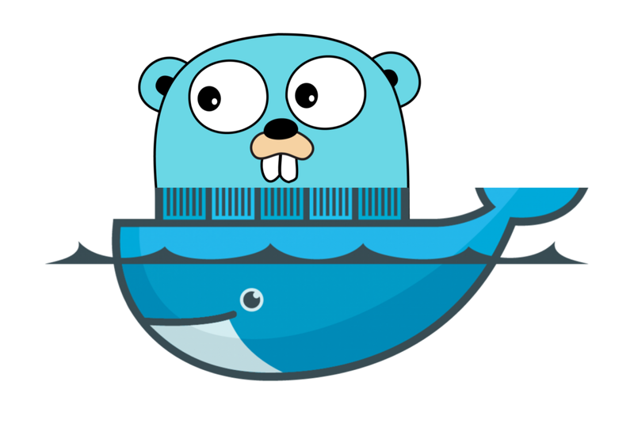
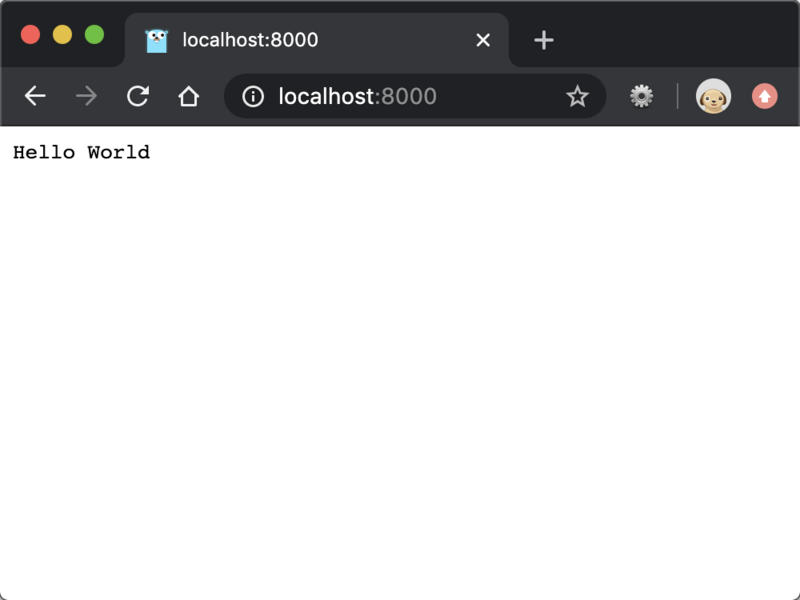

# [五分钟用Docker快速搭建Go开发环境](https://segmentfault.com/a/1190000021660020)

[golang](https://segmentfault.com/t/golang)[docker](https://segmentfault.com/t/docker)[docker-compose](https://segmentfault.com/t/docker-compose)

 阅读约 11 分钟


挺早以前在我写过一篇用 `Docker`搭建LNMP开发环境的文章：[用Docker搭建Laravel开发环境](http://mp.weixin.qq.com/s?__biz=MzUzNTY5MzU2MA==&mid=2247483807&idx=1&sn=061f9a4f6711d7c4550c4f9012d9ad4e&chksm=fa80d008cdf7591edd2373aae91c76b4b13ec8a30a6f55d4f851556a288ca4c25f428910ddd3&scene=21#wechat_redirect)，里面详细介绍了将 `nginx`、 `mysql`和 `php`三个容器用 `docker-compose`编排成 `LNMP`开发环境的步骤，今天来说说怎么用 `Docker`快速搭建 `Go`语言项目的开发环境。

因为靠`Go`本身自带的标准库就能实现高性能的 `HTTP`服务器，不熟悉的同学买它，呃说错了，看它：[深入学习用Go编写HTTP服务器](http://mp.weixin.qq.com/s?__biz=MzUzNTY5MzU2MA==&mid=2247484112&idx=1&sn=79d0d3167d0d962fe41ec00cdafffbb0&chksm=fa80d347cdf75a51183182f14622af766538ca0c5335012e5e1cc50b100e78f2954fa3943770&scene=21#wechat_redirect)。所以用 `Docker` 构建 `Go`的开发环境比构建 LNMP 开发环境要简单很多，如果没有太多定制化要求甚至都不用写 `Dockerfile`自己构建镜像，直接使用官方的 `golang`镜像即可。

### 获取Docker镜像

我们使用官方最新稳定版的镜像 `golang:latest`， 获取镜像前先得确保你电脑上运行了 `Docker` 客户端，没有的去官网下载一下吧这里就不多说了。

下载`dockerHub`上的镜像直接使用命令：

```
docker pull golang
```

下载完镜像后用镜像运行一个容器：

```
docker run --rm -it --name go-http-demo golang bash
```

上面这个命令用镜像 `golang`创建了一个名为 `go-http-demo`的容器，在容器中创建了一个 `Bash`会话。`--rm`选项指定容器退出后自动移除容器。

运行完上面的命令后我们就进入了运行的容器中，运行 `go version` 查看以下 `go`的版本：

```
root@965425c5bdcf:/go# go version 
go version go1.13.6 linux/amd64
root@965425c5bdcf:/go# 
```

你可以根据自己的需要在`https://hub.docker.com/_/golang` 中查找自己需要的版本的 `golang`镜像运行容器。

### 在容器中运行Go项目

我们使用《[深入学习用Go编写HTTP服务器](http://mp.weixin.qq.com/s?__biz=MzUzNTY5MzU2MA==&mid=2247484112&idx=1&sn=79d0d3167d0d962fe41ec00cdafffbb0&chksm=fa80d347cdf75a51183182f14622af766538ca0c5335012e5e1cc50b100e78f2954fa3943770&scene=21#wechat_redirect)》中最后写的支持优雅关停服务的 `HTTPServer`的源码，将它放到 `Docker`容器里伺服宿主机的请求。`HTTP Server`的源码如下，想探究代码具体怎么实现的看链接里的文章就好了。

```
package main

import (
    "context"
    "fmt"
    "log"
    "net/http"
    "os"
    "os/signal"
    "syscall"
)

func main() {
    mux := http.NewServeMux()
    mux.Handle("/", &helloHandler{})

    server := &http.Server{
        Addr:    ":8080",
        Handler: mux,
    }

    // 创建系统信号接收器
    done := make(chan os.Signal)
    signal.Notify(done, os.Interrupt, syscall.SIGINT, syscall.SIGTERM)
    go func() {
        <-done

        if err := server.Shutdown(context.Background()); err != nil {
            log.Fatal("Shutdown server:", err)
        }
    }()

    log.Println("Starting HTTP server...")
    err := server.ListenAndServe()
    if err != nil {
        if err == http.ErrServerClosed {
            log.Print("Server closed under request")
        } else {
            log.Fatal("Server closed unexpected")
        }
    }
}

type helloHandler struct{}

func (*helloHandler) ServeHTTP(w http.ResponseWriter, r *http.Request) {
    fmt.Fprintf(w, "Hello World")
}
```

把源码放在本地电脑的 `/Code/go/src/example.com/http-demo/main.go`中，文件目录你们做的时候根据自己的情况写路径。

接下来就要把这个代码放到容器里去运行了，切到代码目录里执行如下命令：

```
docker run --rm -it --name go-http-demo \
  -v $PWD:/go/src/example.com/go-http-demo \
  -p 8000:8080
  golang
```

`-v`选项允许我们挂载多个本地目录或者数据卷到容器中，更改会在容器内外相互同步，上面的命令将 `/Code/go/src/example.com/go-http-demo/`挂载到了容器的 `/go/src/example.com/go-http-demo`。

`-p`指定主机和容器的端口映射，因为代码里 `HTTP`服务是监听 `8080`端口的，所以我们将主机的 `8000`端口和容器的 `8080`端口做了映射。

执行完上面的命令，我们切换到到容器里的 `Bash`会话，切到代码目录运行 `go run main.go`后，在自己的电脑上打开浏览器访问 `http:localhost:8080`看到下图中的页面就证明服务器在容器里已经正常运行起来了。



### 用 docker-compose 管理容器

通过上面的内容我们已经用 `Docker`构建好了一个 `Go`的开发环境，不过每次打那堆命令，还要进容器执行 `go`命令启动程序太费事了，我们用 `docker-compose`把上面那些流程自动化一下。

在项目代码根目录创建`docker-compose.yml`：

```
version: '3'
services:
  app:
    image: golang:latest
    volumes:
      - $PWD:/go/src/examplecom/http_demo
    ports:
      - "8000:8080"
    command: go run /go/src/examplecom/http_demo/main.go
```

如果你们项目里不允许就找个目录放这个文件，我自己就是单独有个目录里面放了好几个项目的 `Docker`配置文件，有 `PHP`项目的也有 `Go`项目的。

上面的编排文件里只定义了一个叫 `app`的服务，其他的也很容易理解我就不说了，唯一要注意的一点就是如果 `yml`文件在项目外 `volumes`里的配置就换成绝对路径不要用 `$PWD`了

接下来启动 `docker-compose`:

```
docker-compose up -d
```

如果启动不成功先不要在 `daemon`模式下运行把 `-d`去掉，就能看到具体什么错误，等调试正常了再后台启动。

代码有修改后，需要重新编译项目，针对我们的容器执行下面的命令即可

```
docker-compose restart
```

想要进入运行的容器中执行操作使用命令：

```
docker exec -it <container name> bash
```

给我们创建的 `app`发送 `go test`命令让它在容器内执行：

```
docker-compose exec app go test
```

最近想尝试把老项目换成用 `go mod`管理，项目还是在用 `go1.12`所以我就先用 `Docker`搭环境，容器隔离的环境怎么瞎折腾也没事。今天做的这个开发环境还是很简单的，没有用 `Dockerfile`自己创建镜像， `docker-compose`配置文件里的设置也很简单，后面用着不顺手有更新了我再推送。下面的两篇老文章对 `Docker`镜像和 `docker-compose`讲的都比较深入，例子也多，感兴趣的可以看看。

[教你如何做出想要的PHPDocker镜像](http://mp.weixin.qq.com/s?__biz=MzUzNTY5MzU2MA==&mid=2247483850&idx=1&sn=fa469ad6b5688452f0dc46aee7ec042a&chksm=fa80d05dcdf7594ba178189a7f61b0c134fc1274a2012d0fa40512d998bf2b6d5e375cfc9f36#rd)

[用Docker搭建Laravel开发环境](http://mp.weixin.qq.com/s?__biz=MzUzNTY5MzU2MA==&mid=2247483807&idx=1&sn=061f9a4f6711d7c4550c4f9012d9ad4e&chksm=fa80d008cdf7591edd2373aae91c76b4b13ec8a30a6f55d4f851556a288ca4c25f428910ddd3#rd)

