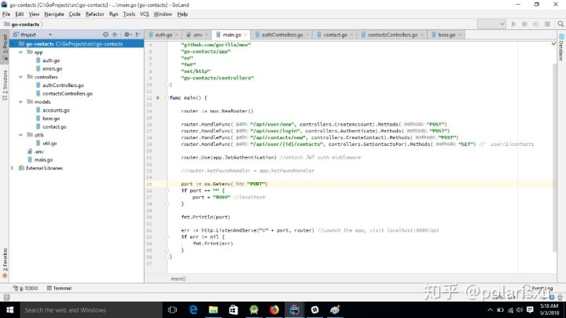
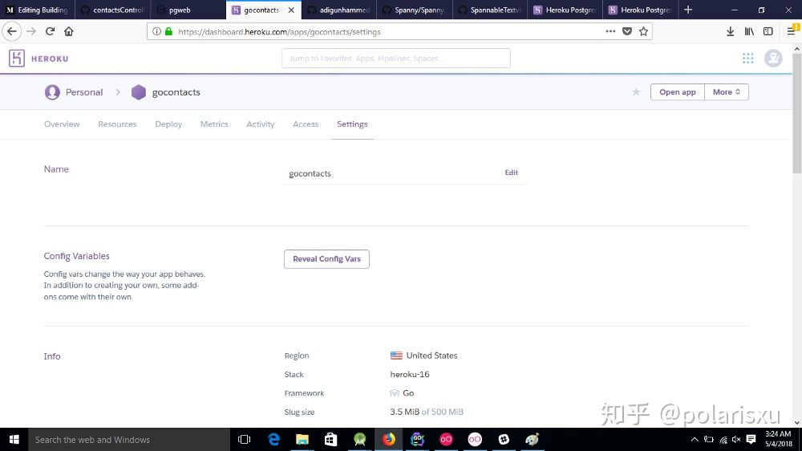
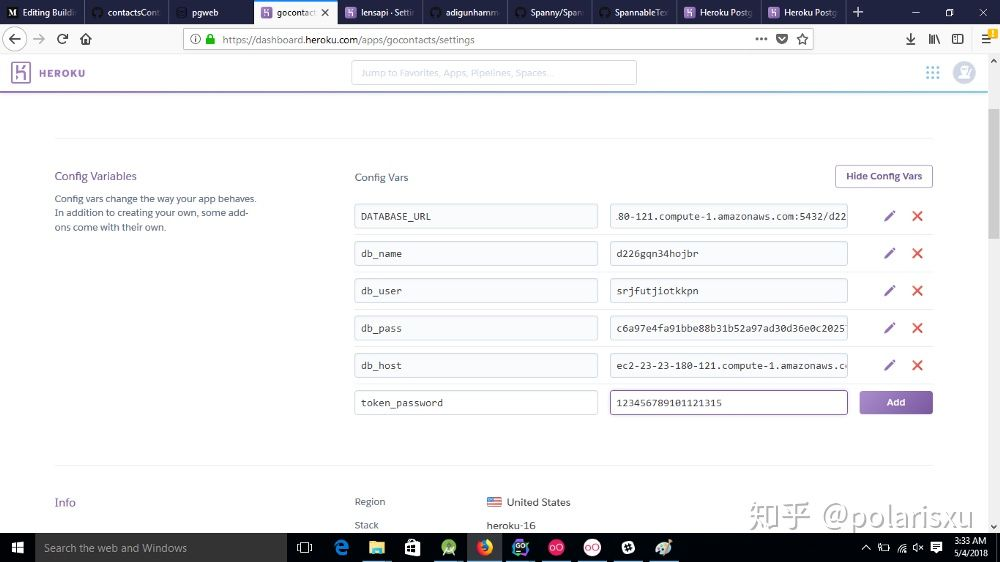
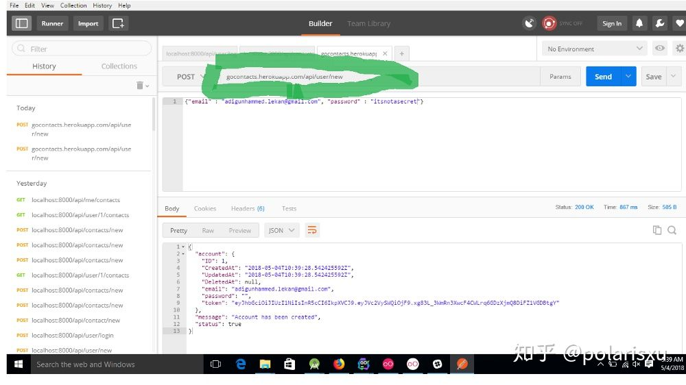

# 使用 Go、Postgresql、JWT 和 GORM 搭建安全的 REST API

## **为什么用 Go**

Go 是一个非常有意思的编程语言，它是一个强类型的语言，并且它编译得非常的快，它的性能可以与 C++ 相比较，Go 还有 goroutine —— 一个更加高效版本的线程——我知道这些特性都不是什么新鲜的东西了，但我就是喜欢 Go 这个样子的。

## **我们将要做个什么东西？**

我们将要写一个通讯录的 APP，我们的 API 允许用户添加以及查看他们的联系人，这样当他们手机丢失了也不会担心找不到联系人的信息了。

## **准备工作**

在本教程中我假定你已经安装了以下的工具：

- Go
- Postgresql
- Goland IDE —— 可选（我将在本教程中使用它）

我还假定你已经设置好了你的 GOPATH，如果你还没有设置好，可以参考**[这篇文章](https://link.zhihu.com/?target=https%3A//github.com/golang/go/wiki/SettingGOPATH)**。

## **什么是 REST?**

REST 是 *Representational State Transfer* （表述性状态转移）的缩写，它是现代客户端程序通过 http 与数据库或服务器通讯时广泛采用的一种机制（[https://en.wikipedia.org/wiki/Representational_state_transfer](https://link.zhihu.com/?target=https%3A//en.wikipedia.org/wiki/Representational_state_transfer)）。所以，如果你有个新的创业想法或者有个很酷的小项目想要做。REST 大概就是你要用到的协议。

## **创建 APP**

我们先来确定要用到哪些第三方的代码包，幸运的是，Go 标准库已经足够我们搭建一个完整网站了（我希望我没说错）——你可以看看 `net.http` 代码包，但是为了让我的工作简单点，我们将需要以下几个代码包：

- gorilla/mux —— 一个强力的 URL 路由器（router）和分发器（dispatcher）。我们使用这个代码包来让 URL 匹配上它们的 handler。
- jinzhu/gorm —— 一个非常棒的 Go 语言的 ORM 库，它的宗旨是成为一个对开发者友好的库。我们使用这个 ORM（Object relational mapper，对象关系映射）代码包来使我们程序与数据库的交互更加简单。
- dgrijalva/jwt-go —— 使用它来签发和验证 JWT token。
- joho/godotenv —— 用来加载 .env 文件到项目中。

要安装这些代码包，只要打开你的终端控制台并运行：

```text
go get github.com/{ 包名称 }
```

这个命令会安装代码包到你的 `GOPATH`。

## **项目结构**



*可以在右边的面板看到项目结构*

utils.go

```go
package utils

import (
    "encoding/json"
    "net/http"
)

func Message(status bool, message string) (map[string]interface{}) {
    return map[string]interface{} {"status" : status, "message" : message}
}

func Respond(w http.ResponseWriter, data map[string] interface{})  {
    w.Header().Add("Content-Type", "application/json")
    json.NewEncoder(w).Encode(data)
}
```

`utils.go` 包含了一些好用的工具函数来构建 `json` 消息并返回一个 `json` 响应包。在我们继续之前，请先关注一下 `Message()` 和 `Respond()` 这两个函数的实现。

## **JWT 介绍**

JWT（JSON Web Tokens ）是一个开放的工业标准（**[RFC 7519](https://link.zhihu.com/?target=https%3A//tools.ietf.org/html/rfc7519)**）方法，用于在双方之间安全的交互。通过 session，我们可以很轻易地验证一个 Web 程序的用户，但是，当你的 Web 程序 API 需要和安卓或 IOS 客户端交互时，session 就不能用了，因为 http 的请求有无状态的特性。使用 JWT，我们可以为每一个用户创建一个特殊的 token，它将会被包含在后续的 API 请求头里面。这个方法能让我们验证每一个调用我们的 API 的用户身份。我们来看看下面的实现：

```text
package app

import (
    "context"
    "fmt"
    "net/http"
    "os"
    "strings"

    jwt "github.com/dgrijalva/jwt-go"
    "go-contacts/models"
    u "go-contacts/utils"
)

var JwtAuthentication = func(next http.Handler) http.Handler {

    return http.HandlerFunc(func(w http.ResponseWriter, r *http.Request) {

        notAuth := []string{"/api/user/new", "/api/user/login"} // 不需要验证用户的 URL 列表
        requestPath := r.URL.Path                               // 当前请求的 path

        // 检查请求是否需要鉴权，如果不需要，直接接受请求
        for _, value := range notAuth {

            if value == requestPath {
                next.ServeHTTP(w, r)
                return
            }
        }

        response := make(map[string]interface{})
        tokenHeader := r.Header.Get("Authorization") // 从请求头中获取 token

        if tokenHeader == "" { // 没有找到 Token，返回 403 未授权错误
            response = u.Message(false, "Missing auth token")
            w.WriteHeader(http.StatusForbidden)
            w.Header().Add("Content-Type", "application/json")
            u.Respond(w, response)
            return
        }

        splitted := strings.Split(tokenHeader, " ") // 通常 token 的格式为 `Bearer {token-body}`, 我们看看获取到的 token 格式是否正确
        if len(splitted) != 2 {
            response = u.Message(false, "Invalid/Malformed auth token")
            w.WriteHeader(http.StatusForbidden)
            w.Header().Add("Content-Type", "application/json")
            u.Respond(w, response)
            return
        }

        tokenPart := splitted[1] // 提取我们需要的 token 部分
        tk := &models.Token{}

        token, err := jwt.ParseWithClaims(tokenPart, tk, func(token *jwt.Token) (interface{}, error) {
            return []byte(os.Getenv("token_password")), nil
        })

        if err != nil { // token 格式不正确，同样返回 403 错误
            response = u.Message(false, "Malformed authentication token")
            w.WriteHeader(http.StatusForbidden)
            w.Header().Add("Content-Type", "application/json")
            u.Respond(w, response)
            return
        }

        if !token.Valid { // token 无效，可能不是本服务器签发的 token
            response = u.Message(false, "Token is not valid.")
            w.WriteHeader(http.StatusForbidden)
            w.Header().Add("Content-Type", "application/json")
            u.Respond(w, response)
            return
        }

        // 一切正常，继续处理请求，并且把调用者设置为 token 对应的用户
        fmt.Sprintf("User %", tk.Username) //Useful for monitoring
        ctx := context.WithValue(r.Context(), "user", tk.UserId)
        r = r.WithContext(ctx)
        next.ServeHTTP(w, r) // 继续执行中间件调用链
    })
}
```

代码中的注释解释了所有需要了解的信息。简单来说，这段代码创建了一个 `Middleware` （中间件）并拦截所有的请求，检查 token 是否存在（JWT token），验证它是否有效，如果有任何不对的地方，立刻返回错误给请求方。如果没有错误，则继续处理请求，待会你将会看到，我们如何处理服务器与请求方的交互。

## **编写用户注册与登录系统**

在用户能够在保存它们的联系人信息到服务器之前，我希望他们可以在我们的系统中注册和登录。所以我们要做的第一件事就是连接到我们的数据库，我们使用 `.env` 文件来保存我们的数据库登录信息，我的 `.env` 文件是这样的：

```text
db_name = Gocontacts
db_pass = **** // Windowss 系统默认情况下，这个是当前用户的 Windowss 登录密码
db_user = postgres
db_type = postgres
db_host = localhost
db_port = 5434
token_password = thisIsTheJwtSecretPassword // 不要上传到代码仓库！
```

然后，我们现在可以使用以下代码来连接数据库

```text
package models

import (
    _ "github.com/jinzhu/gorm/dialects/postgres"
    "github.com/jinzhu/gorm"
    "os"
    "github.com/joho/godotenv"
    "fmt"
)

var db *gorm.DB // 数据库

func INIt() {

    e := Godotenv.Load() // 加载 .env 文件
    if e != nil {
        fmt.Print(e)
    }

    username := os.Getenv("db_user")
    password := os.Getenv("db_pass")
    dbName := os.Getenv("db_name")
    dbHost := os.Getenv("db_host")


    dbUri := fmt.Sprintf("host=%s user=%s dbname=%s sslmode=disable password=%s", dbHost, username, dbName, password) // 构建连接字符串
    fmt.Println(dbUri)

    conn, err := Gorm.Open("postgres", dbUri)
    if err != nil {
        fmt.Print(err)
    }

    db = conn
    db.Debug().AutoMigrate(&Account{}, &Contact{}) // 数据库自动迁移
}

// 返回数据库对象的指针
func GetDB() *gorm.DB {
    return db
}
```

这段代码的作用很简单，在 `init()` 函数（ Go 会自动调用这个函数）中，代码从 `.env` 文件中读取数据库连接信息，然后根据这些信息与数据库建立连接。

## **创建程序入口**

到目前为止，我们已经创建了 JWT 中间件并且连接到我们的数据库中了，下一件要做的事情就是创建程序的入口，详见下面的代码：

```text
package main

import (
    "github.com/gorilla/mux"
    "go-contacts/app"
    "os"
    "fmt"
    "net/http"
)

func main() {

    router := mux.NewRouter()
    router.Use(app.JwtAuthentication) // 添加 JWT 中间件

    port := os.Getenv("PORT") // 从 .env 文件获取端口号 , 在本地测试的时候，我们没有指定任何端口号所以这里将会返回空
    if port == "" {
        port = "8000" // localhost
    }

    fmt.Println(port)

    err := http.ListenAndServe(":" + port, router) // 启动 app, 访问 localhost:8000/api
    if err != nil {
        fmt.Print(err)
    }
}
```

我们在第 13 行创建了一个新的 Router 对象，在第 14 行通过 `Use()` 函数把我们的 JWT 中间件附加到 Router 上，然后我们开始监听来自客户端的请求。

点击 `func main()` 旁边的那个小三角符号来开始编译和运行程序，如果一切正常，你会看的在终端里面没有任何报错，如果有错误的话，你可以检查一下你的数据库连接参数看看它们是否正确。


## **创建和授权用户**

创建一个新文件 `models/accounts.go`

```text
package models

import (
    "github.com/dgrijalva/jwt-go"
    u "lens/utils"
    "strings"
    "github.com/jinzhu/gorm"
    "os"
    "golang.org/x/crypto/bcrypt"
)

/*
JWT claims 结构
*/
type Token struct {
    UserId uint
    jwt.StandardClaims
}

// 代表一个用户账户的结构体
type Account struct {
    gorm.Model
    Email string `json:"email"`
    Password string `json:"password"`
    Token string `json:"token";sql:"-"`
}

// 验证请求的用户信息
func (account *Account) Validate() (map[string] interface{}, bool) {

    if !strings.Contains(account.Email, "@") {
        return u.Message(false, "Email address is required"), false
    }

    if len(account.Password) < 6 {
        return u.Message(false, "Password is required"), false
    }

    // Email 必须是唯一的
    temp := &Account{}

    // 检查是否有错误和 Email 是否唯一
    err := GetDB().Table("accounts").Where("email = ?", account.Email).First(temp).Error
    if err != nil && err != Gorm.ErrRecordNotFound {
        return u.Message(false, "Connection error. Please retry"), false
    }
    if temp.Email != "" {
        return u.Message(false, "Email address already in use by another user."), false
    }

    return u.Message(false, "Requirement passed"), true
}

func (account *Account) Create() (map[string] interface{}) {

    if resp, ok := account.Validate(); !ok {
        return resp
    }

    hashedPassword, _ := bcrypt.GenerateFromPassword([]byte(account.Password), bcrypt.DefaultCost)
    account.Password = string(hashedPassword)

    GetDB().Create(account)

    if account.ID <= 0 {
        return u.Message(false, "Failed to create account, connection error.")
    }

    // 为新创建的用户创建新的 JWT token
    tk := &Token{UserId: account.ID}
    token := jwt.NewWithClaims(jwt.GetSigningMethod("HS256"), tk)
    tokenString, _ := token.SignedString([]byte(os.Getenv("token_password")))
    account.Token = tokenString

    account.Password = "" // 删除 password

    response := u.Message(true, "Account has been created")
    response["account"] = account
    return response
}

func Login(email, password string) (map[string]interface{}) {

    account := &Account{}
    err := GetDB().Table("accounts").Where("email = ?", email).First(account).Error
    if err != nil {
        if err == Gorm.ErrRecordNotFound {
            return u.Message(false, "Email address not found")
        }
        return u.Message(false, "Connection error. Please retry")
    }

    err = bcrypt.CompareHashAndPassword([]byte(account.Password), []byte(password))
    if err != nil && err == bcrypt.ErrMismatchedHashAndPassword { // 密码不匹配
        return u.Message(false, "Invalid login credentials. Please try again")
    }
    // 成功登录
    account.Password = ""

    // 创建 JWT token
    tk := &Token{UserId: account.ID}
    token := jwt.NewWithClaims(jwt.GetSigningMethod("HS256"), tk)
    tokenString, _ := token.SignedString([]byte(os.Getenv("token_password")))
    account.Token = tokenString //Store the token in the response

    resp := u.Message(true, "Logged In")
    resp["account"] = account
    return resp
}

func GetUser(u uint) *Account {

    acc := &Account{}
    GetDB().Table("accounts").Where("id = ?", u).First(acc)
    if acc.Email == "" { // 用户没有找到
        return nil
    }

    acc.Password = ""
    return acc
}
```

accounts.go 文件比较复杂。我们分解一下逐个分析：

第一部分创建了两个结构体 `Token` 和 `Account`，它们分别代表了 JWT token 凭证和用户账号。 `Validate()` 函数验证从客户端发过来的数据，而 `Create()` 函数创建了一个新的用户账号，并生成了一个 JWT token 返回给客户端。`Login(username, password)` 函数负责用户的鉴权验证，如果验证成功的话将会生成一个新的 JWT token 。

## **authController.go**

```text
package controllers

import (
    "net/http"
    u "go-contacts/utils"
    "go-contacts/models"
    "encoding/json"
)

var CreateAccount = func(w http.ResponseWriter, r *http.Request) {

    account := &models.Account{}
    err := JSon.NewDecoder(r.Body).Decode(account) //decode the request body into struct and failed if any error occur
    if err != nil {
        u.Respond(w, u.Message(false, "Invalid request"))
        return
    }

    resp := account.Create() //Create account
    u.Respond(w, resp)
}

var Authenticate = func(w http.ResponseWriter, r *http.Request) {

    account := &models.Account{}
    err := JSon.NewDecoder(r.Body).Decode(account) //decode the request body into struct and failed if any error occur
    if err != nil {
        u.Respond(w, u.Message(false, "Invalid request"))
        return
    }

    resp := models.Login(account.Email, account.Password)
    u.Respond(w, resp)
}
```

这里面的内容非常的直白。它包含了 `/user/new` 和 `/user/login` 这两个入口点的 handler。`

添加如下的代码片段到 `main.go` 来注册我们的新路由。

```text
router.HandleFunc("/api/user/new", controllers.CreateAccount).Methods("POST")
router.HandleFunc("/api/user/login", controllers.Authenticate).Methods("POST")
```

上面的代码注册了 `/user/new` 和 `/user/login` 它们对应的 handler。

现在， 重新编译代码并且通过 postman 访问 `localhost:8000/api/user/new`, 把请求的内容设置为 `application/json`，如下图所示：


如果你尝试调用 `/user/new` 两次并使用相同的调用参数，你会收到一个“ email 已经存在”的提示，一切按照我们的预期运行。

## **创建联系人**

我们 APP 中有一部分功能是让用户可以创建（保存）联系人。联系人会有 `name` 和 `phone` 属性，我们将会把这些东西定义成结构体的属性。下面的代码片段属于 `models/contact.go`

```text
package models

import (
    u "go-contacts/utils"
    "github.com/jinzhu/gorm"
    "fmt"
)

type Contact struct {
    gorm.Model
    Name string `json:"name"`
    Phone string `json:"phone"`
    UserId uint `json:"user_id"` //The user that this contact belongs to
}

/*
 This struct function validate the required parameters sent through the http request body
returns message and true if the requirement is met
*/
func (contact *Contact) Validate() (map[string] interface{}, bool) {

    if contact.Name == "" {
        return u.Message(false, "Contact name should be on the payload"), false
    }

    if contact.Phone == "" {
        return u.Message(false, "Phone number should be on the payload"), false
    }

    if contact.UserId <= 0 {
        return u.Message(false, "User is not recognized"), false
    }

    //All the required parameters are present
    return u.Message(true, "success"), true
}

func (contact *Contact) Create() (map[string] interface{}) {

    if resp, ok := contact.Validate(); !ok {
        return resp
    }

    GetDB().Create(contact)

    resp := u.Message(true, "success")
    resp["contact"] = contact
    return resp
}

func GetContact(id uint) (*Contact) {

    contact := &Contact{}
    err := GetDB().Table("contacts").Where("id = ?", id).First(contact).Error
    if err != nil {
        return nil
    }
    return contact
}

func GetContacts(user uint) ([]*Contact) {

    contacts := make([]*Contact, 0)
    err := GetDB().Table("contacts").Where("user_id = ?", user).Find(&contacts).Error
    if err != nil {
        fmt.Println(err)
        return nil
    }

    return contacts
}
```

正如在 `models/accounts.go` 那样，我们创建 `Validate()` 来验证传递过来的输入，一旦出现错误，我们都会给客户端返回错误信息。然后，我们写了 `Create()` 函数来将这个联系人插入到数据库里面。

最后仅剩下获取联系人这一步啦，让我们来实现它吧！

```text
router.HandleFunc("/api/me/contacts", controllers.GetContactsFor).Methods("GET")
```

添加上面的代码片段到 `main.go` 来告诉 router 注册 `me/contacts` 入口点。然后我们创建 `controllers.GetContactsFor` handler 来处理 API 请求。

## **contactController.go**

下面是 contactsController.go 的内容：

```text
package controllers

import (
    "net/http"
    "go-contacts/models"
    "encoding/json"
    u "go-contacts/utils"
    "strconv"
    "github.com/gorilla/mux"
    "fmt"
)

var CreateContact = func(w http.ResponseWriter, r *http.Request) {

    user := r.Context().Value("user") . (uint) // 获取发送请求的用户 ID
    contact := &models.Contact{}

    err := JSon.NewDecoder(r.Body).Decode(contact)
    if err != nil {
        u.Respond(w, u.Message(false, "Error while decoding request body"))
        return
    }

    contact.UserId = user
    resp := contact.Create()
    u.Respond(w, resp)
}

var GetContactsFor = func(w http.ResponseWriter, r *http.Request) {

    params := mux.Vars(r)
    id, err := strconv.Atoi(params["id"])
    if err != nil {
        // 传递过来的参数不是整型
        u.Respond(w, u.Message(false, "There was an error in your request"))
        return
    }

    data := models.GetContacts(uint(id))
    resp := u.Message(true, "success")
    resp["data"] = data
    u.Respond(w, resp)
}
```

这段代码做的事情跟 `authController.go` 很像，它获取 JSon 内容并解析到 `Contract` 结构体，如果过程中有错误发生，则立刻把错误信息返回给客户端，如果没有错误发生，则将联系人信息插入到数据库。

## **获取用户的联系人**

现在，我们的用户可以正常地保存他们的联系人了，那用户怎么获取他们的联系人信息呢？访问 `/me/contacts` 应该返回一个包含当前用户联系人信息的 `json` 结构给当前的用户。具体的细节可以在源代码里面看到。

通常来说，获取一个用户的联系人的接口应该像是这样的：`/user/{userId}/contacts`，但是在 URL 中指定用户的 ID 非常的危险，因为所有登录过的用户都能伪造一个请求来获取到另外一个用户的联系人，这一点很容易会被黑客发现并利用——注意这个时候 `JWT` 的好处就凸显了。

我们可以通过用 `r.Context().Value("user")` 来获取用户的 ID，还记得之前我们在 `auth.go` 里面把用户 ID 保存到这里了吗：

```text
package controllers

import (
    "net/http"
    "go-contacts/models"
    "encoding/json"
    u "go-contacts/utils"
    "strconv"
    "github.com/gorilla/mux"
    "fmt"
)

var CreateContact = func(w http.ResponseWriter, r *http.Request) {

    user := r.Context().Value("user") . (uint) // 获取发送请求的用户 ID
    contact := &models.Contact{}

    err := JSon.NewDecoder(r.Body).Decode(contact)
    if err != nil {
        u.Respond(w, u.Message(false, "Error while decoding request body"))
        return
    }

    contact.UserId = user
    resp := contact.Create()
    u.Respond(w, resp)
}

var GetContactsFor = func(w http.ResponseWriter, r *http.Request) {

    params := mux.Vars(r)
    id, err := strconv.Atoi(params["id"])
    if err != nil {
        // 传递过来的参数不是整型
        u.Respond(w, u.Message(false, "There was an error in your request"))
        return
    }

    data := models.GetContacts(uint(id))
    resp := u.Message(true, "success")
    resp["data"] = data
    u.Respond(w, resp)
}
```


这个项目的代码我都放在 Github 里面了：

[https://github.com/adigunhammedolalekan/go-contacts](https://link.zhihu.com/?target=https%3A//github.com/adigunhammedolalekan/go-contacts)

## **部署**

我们可以很轻易地把我们的项目部署到 Heroku 上。首先，下载 `godep`。 Godep 是一个 Go 语言的依赖管理工具（译注：当前 Go 1.12 版本中已经内置了 Go module 功能，推荐大家使用 Go module 来管理项目的依赖），它的作用类似 Node.js 的 NPM.

```text
go get -u Github.com/tools/godep
```

- 打开 `Goland terminal` 并运行 `godep save`，它会创建 `Godeps` 和 `vendor` 文件夹。要了解更多关于 Godep 的信息，请访问：[https://github.com/tools/godep](https://link.zhihu.com/?target=https%3A//github.com/tools/godep)
- 在 [http://Heroku.com](https://link.zhihu.com/?target=http%3A//Heroku.com) 创建一个账户，并下载 `Heroku Cli` 并登录自己的账号。
- 登录完成后运行 `heroku create Gocontacts`， 这会在你的 Heroku 个人页创建一个应用程序，并且为它添加一个 Git 仓库，
- 运行下面的指令把代码推送到 Heroku 中：
- `git add .`
- `git commit -m "First commit"`
- `git push Heroku master`


如果一切顺利，你屏幕的输出应该会像我一样。

好啦，你的程序已经部署完毕了，下一件事情就是部署好远程的 Postgresql 数据库。

运行 `heroku addons:create Heroku-postgresql:hobby-dev` 来创建数据库，更多信息可以查看 [https://devcenter.heroku.com/articles/heroku-postgresql](https://link.zhihu.com/?target=https%3A//devcenter.heroku.com/articles/heroku-postgresql)

太棒了，我们差不多搞定了。下一步要做的是连接到我们的远程数据库。

前往 [http://Heroku.com](https://link.zhihu.com/?target=http%3A//Heroku.com) 并登录到你的账号，你应该能看到新建的程序在一的个人首页中，点击它，然后点击 settings，然后点击 `Reveal Config Vars` ，这里会有个名为 `DATABASE_URL` 的变量，当你创建了 PostgreSQL 数据库之后，这些将会自动添加到你的 .env 文件中（注意：Heroku 自动替换你本地的 `.env` 文件）。我们可以从这个变量中提取数据库连接参数。





*我从自动生成的 DATABASE_URL 变量中提取数据库连接参数*

如果一切正常，你的 API 现在应该能正常访问了。



*如你所见，API 成功调用了*

我尽力地让这个教程更加的简单明了。欢迎大家向我反馈任何遇到的问题，我希望能和大家分享我的知识。

项目的代码仓库：[https://github.com/adigunhammed](https://link.zhihu.com/?target=https%3A//github.com/adigunhammedolalekan/go-contacts)