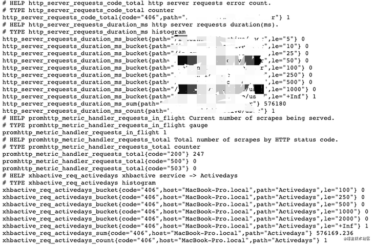

# [使用Prometheus搞定微服务监控](https://segmentfault.com/a/1190000039307250)

最近对服务进行监控，而当前监控最流行的数据库就是 `Prometheus`，同时 `go-zero` 默认接入也是这款数据库。今天就对 `go-zero` 是如何接入 `Prometheus` ，以及开发者如何自己定义自己监控指标。

## 监控接入

`go-zero` 框架中集成了基于 `prometheus` 的服务指标监控。但是没有显式打开，需要开发者在 `config.yaml` 中配置：

```yaml
Prometheus:
  Host: 127.0.0.1
  Port: 9091
  Path: /metrics
```

如果开发者是在本地搭建 `Prometheus`，需要在 `Prometheus` 的配置文件 `prometheus.yaml` 中写入需要收集服务监控信息的配置：

```yaml
- job_name: 'file_ds'
    static_configs:
      - targets: ['your-local-ip:9091']
        labels:
          job: activeuser
          app: activeuser-api
          env: dev
          instance: your-local-ip:service-port
```

因为本地是用 `docker` 运行的。将 `prometheus.yaml` 放置在 `docker-prometheus` 目录下：

```shell
docker run \
    -p 9090:9090 \
    -v dockeryml/docker-prometheus:/etc/prometheus \
    prom/prometheus
```

打开 `localhost:9090` 就可以看到：


点击 `http://service-ip:9091/metrics` 就可以看到该服务的监控信息：



上图我们可以看出有两种 `bucket`，以及 `count/sum` 指标。

那 `go-zero` 是如何集成监控指标？监控的又是什么指标？我们如何定义我们自己的指标？下面就来解释这些问题

> 以上的基本接入，可以参看我们的另外一篇：[https://zeromicro.github.io/g...](https://link.segmentfault.com/?enc=1w7cPq6ZsGJ5kH0PVSfJFg%3D%3D.DHZyDiMYdKPq6kNmjmQaXQdUgoq%2Fjz38wfGCe3V6qRo3DTdrq7cRC8GVPyOxJQjeDOq3scn6XTzS3slFQ8ZYhw%3D%3D)

## 如何集成

上面例子中的请求方式是 `HTTP`，也就是在请求服务端时，监控指标数据不断被搜集。很容易想到是 **中间件** 的功能，具体代码：[https://github.com/tal-tech/g...](https://link.segmentfault.com/?enc=2dChoLjT3Bz0PFbbc1qUjg%3D%3D.WKw52rIyv4Fyg5TPE7xdG4UxKN5vOnZjsSoGynTQ968PGMb3dKgEW1cShtdS8r0aGUdYrAlOf8nbQ0yTFvZ7TwYaITKm8JBoxRiodZnNwqfevtbgQDWx3JFVHXp3yIBD)。

```go
var (
    metricServerReqDur = metric.NewHistogramVec(&metric.HistogramVecOpts{
        ...
    // 监控指标
        Labels:    []string{"path"},
    // 直方图分布中，统计的桶
        Buckets:   []float64{5, 10, 25, 50, 100, 250, 500, 1000},
    })

    metricServerReqCodeTotal = metric.NewCounterVec(&metric.CounterVecOpts{
        ...
    // 监控指标：直接在记录指标 incr() 即可
        Labels:    []string{"path", "code"},
    })
)

func PromethousHandler(path string) func(http.Handler) http.Handler {
    return func(next http.Handler) http.Handler {
        return http.HandlerFunc(func(w http.ResponseWriter, r *http.Request) {
      // 请求进入的时间
            startTime := timex.Now()
            cw := &security.WithCodeResponseWriter{Writer: w}
            defer func() {
        // 请求返回的时间
                metricServerReqDur.Observe(int64(timex.Since(startTime)/time.Millisecond), path)
                metricServerReqCodeTotal.Inc(path, strconv.Itoa(cw.Code))
            }()
            // 中间件放行，执行完后续中间件和业务逻辑。重新回到这，做一个完整请求的指标上报
      // [🧅：洋葱模型]
            next.ServeHTTP(cw, r)
        })
    }
}
```

其实整个很简单：

1. `HistogramVec` 负责请求耗时搜集：
   - `bucket` 存放的就是 `option` 指定的耗时指标。某个请求耗时多少就会被聚集对应的桶，计数。
   - 最终展示的就是一个路由在不同耗时的分布，很直观提供给开发者可以优化的区域。
2. `CounterVec` 负责指定 `labels` 标签搜集：
   - `Labels: []string{"path", "code"}`
   - `labels` 相当一个 `tuple`。`go-zero` 是以`(path, code)`作为整体，记录不同路由不同状态码的返回次数。如果 `4xx,5xx`过多的时候，是不是应该看看你的服务健康程度？

## 如何自定义

`go-zero` 中也提供了 `prometheus metric` 基本封装，供开发者自己开发自己 `prometheus` 中间件。

> 代码：[https://github.com/tal-tech/g...](https://link.segmentfault.com/?enc=RdcLr97AXqiTDDiYWYjMeg%3D%3D.gxRe0Uckjl2OdfCFz77%2FDqn0%2B%2F4yqZKGn21z5QD7Z2tZPVqCPPstJ5rTdmY46r5RmcaJBdj9LjAnJ037l26PDw%3D%3D)

| 名称         | 用途                                                        | 搜集函数                                                     |
| ------------ | ----------------------------------------------------------- | ------------------------------------------------------------ |
| CounterVec   | 单一的计数。用做：QPS统计                                   | `CounterVec.Inc()` 指标+1                                    |
| GuageVec     | 单纯指标记录。适用于磁盘容量，CPU/Mem使用率（可增加可减少） | `GuageVec.Inc()/GuageVec.Add()` 指标+1/指标加N，也可以为负数 |
| HistogramVec | 反应数值的分布情况。适用于：请求耗时、响应大小              | `HistogramVec.Observe(val, labels)` 记录指标当前对应值，并找到值所在的桶，+1 |

> 另外对 `HistogramVec.Observe()` 做一个基本分析：
>
> 我们其实可以看到上图每个 `HistogramVec` 统计都会有3个序列出现：
>
> - `_count`：数据个数
> - `_sum`：全部数据加和
> - `_bucket{le=a1}`：处于 `[-inf, a1]` 的数据个数
>
> 所以我们也猜测在统计过程中，分3种数据进行统计：
>
> ```go
> // 基本上在prometheus的统计都是使用 atomic CAS 方式进行计数的
> // 性能要比使用 Mutex 要高
> func (h *histogram) observe(v float64, bucket int) {
>     n := atomic.AddUint64(&h.countAndHotIdx, 1)
>     hotCounts := h.counts[n>>63]
> 
>     if bucket < len(h.upperBounds) {
>     // val 对应数据桶 +1
>         atomic.AddUint64(&hotCounts.buckets[bucket], 1)
>     }
>     for {
>         oldBits := atomic.LoadUint64(&hotCounts.sumBits)
>         newBits := math.Float64bits(math.Float64frombits(oldBits) + v)
>     // sum指标数值 +v（毕竟是总数sum）
>         if atomic.CompareAndSwapUint64(&hotCounts.sumBits, oldBits, newBits) {
>             break
>         }
>     }
>     // count 统计 +1
>     atomic.AddUint64(&hotCounts.count, 1)
> }
> ```

所以开发者想定义自己的监控指标：

1. 在使用 `goctl` 生成API代码指定要生成的 **中间件**：[https://zeromicro.github.io/g...](https://link.segmentfault.com/?enc=chuI1Z1RvZrXH75hc2NbUw%3D%3D.bVZNnqgwv9og6BZ%2FczuVR45MRRVEsO5S0eQx50hO4Mgm45j%2FrflWogCpUyOUYSMDxoaSWOMM1NriPkG0ltgd%2FQ%3D%3D)
2. 在中间件文件书写自己需要统计的指标逻辑
3. 当然，开发者也可以在业务逻辑中书写统计的指标逻辑。同上。

上述都是针对 `HTTP` 部分逻辑的解析，`RPC` 部分的逻辑类似，你可以在 **拦截器** 部分看到设计。

## 总结

本文分析了 `go-zero` 服务监控指标的逻辑，当然对于一些基础设施的监控，`prometheus` 可以通过引入对应的 `exporter` 来完成。