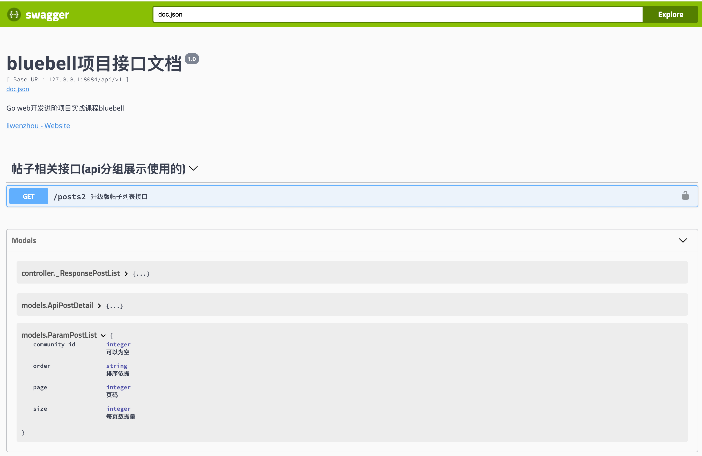

# 使用swagger生成接口文档

有时候一份清晰明了的接口文档能够极大地提高前后端双方的沟通效率和开发效率。本文将介绍如何使用swagger生成接口文档。

# swagger生成接口文档

## swagger介绍

Swagger本质上是一种用于描述使用JSON表示的RESTful API的接口描述语言。Swagger与一组开源软件工具一起使用，以设计、构建、记录和使用RESTful Web服务。Swagger包括自动文档，代码生成和测试用例生成。

在前后端分离的项目开发过程中，如果后端同学能够提供一份清晰明了的接口文档，那么就能极大地提高大家的沟通效率和开发效率。可是编写接口文档历来都是令人头痛的，而且后续接口文档的维护也十分耗费精力。

最好是有一种方案能够既满足我们输出文档的需要又能随代码的变更自动更新，而Swagger正是那种能帮我们解决接口文档问题的工具。

这里以gin框架为例，使用[gin-swagger](https://github.com/swaggo/gin-swagger)库以使用Swagger 2.0自动生成RESTful API文档。

## gin-swagger实战

想要使用`gin-swagger`为你的代码自动生成接口文档，一般需要下面三个步骤：

1. 按照swagger要求给接口代码添加声明式注释，具体参照[声明式注释格式](https://swaggo.github.io/swaggo.io/declarative_comments_format/)。
2. 使用swag工具扫描代码自动生成API接口文档数据
3. 使用gin-swagger渲染在线接口文档页面

### 第一步：添加注释

在程序入口main函数上以注释的方式写下项目相关介绍信息。

```go
package main

// @title 这里写标题
// @version 1.0
// @description 这里写描述信息
// @termsOfService http://swagger.io/terms/

// @contact.name 这里写联系人信息
// @contact.url http://www.swagger.io/support
// @contact.email support@swagger.io

// @license.name Apache 2.0
// @license.url http://www.apache.org/licenses/LICENSE-2.0.html

// @host 这里写接口服务的host
// @BasePath 这里写base path
func main() {
	r := gin.New()

	// liwenzhou.com ...

	r.Run()
}
```

在你代码中处理请求的接口函数（通常位于controller层）按如下方式写上注释：

```go
// GetPostListHandler2 升级版帖子列表接口
// @Summary 升级版帖子列表接口
// @Description 可按社区按时间或分数排序查询帖子列表接口
// @Tags 帖子相关接口
// @Accept application/json
// @Produce application/json
// @Param Authorization header string false "Bearer 用户令牌"
// @Param object query models.ParamPostList false "查询参数"
// @Security ApiKeyAuth
// @Success 200 {object} _ResponsePostList
// @Router /posts2 [get]
func GetPostListHandler2(c *gin.Context) {
	// GET请求参数(query string)：/api/v1/posts2?page=1&size=10&order=time
	// 初始化结构体时指定初始参数
	p := &models.ParamPostList{
		Page:  1,
		Size:  10,
		Order: models.OrderTime,
	}

	if err := c.ShouldBindQuery(p); err != nil {
		zap.L().Error("GetPostListHandler2 with invalid params", zap.Error(err))
		ResponseError(c, CodeInvalidParam)
		return
	}
	data, err := logic.GetPostListNew(p)
	// 获取数据
	if err != nil {
		zap.L().Error("logic.GetPostList() failed", zap.Error(err))
		ResponseError(c, CodeServerBusy)
		return
	}
	ResponseSuccess(c, data)
	// 返回响应
}
```

上面注释中参数类型使用了`object`，`models.ParamPostList`具体定义如下：

```go
// bluebell/models/params.go

// ParamPostList 获取帖子列表query string参数
type ParamPostList struct {
	CommunityID int64  `json:"community_id" form:"community_id"`   // 可以为空
	Page        int64  `json:"page" form:"page" example:"1"`       // 页码
	Size        int64  `json:"size" form:"size" example:"10"`      // 每页数据量
	Order       string `json:"order" form:"order" example:"score"` // 排序依据
}
```

响应数据类型也使用的`object`，我个人习惯在controller层专门定义一个`docs_models.go`文件来存储文档中使用的响应数据model。

```go
// bluebell/controller/docs_models.go

// _ResponsePostList 帖子列表接口响应数据
type _ResponsePostList struct {
	Code    ResCode                 `json:"code"`    // 业务响应状态码
	Message string                  `json:"message"` // 提示信息
	Data    []*models.ApiPostDetail `json:"data"`    // 数据
}
```

### 第二步：生成接口文档数据

编写完注释后，使用以下命令安装swag工具：

```bash
go get -u github.com/swaggo/swag/cmd/swag
```

在项目根目录执行以下命令，使用swag工具生成接口文档数据。

```bash
swag init
```

执行完上述命令后，如果你写的注释格式没问题，此时你的项目根目录下会多出一个`docs`文件夹。

```bash
./docs
├── docs.go
├── swagger.json
└── swagger.yaml
```

### 第三步：引入gin-swagger渲染文档数据

然后在项目代码中注册路由的地方按如下方式引入`gin-swagger`相关内容：

```go
import (
	// liwenzhou.com ...

	_ "bluebell/docs"  // 千万不要忘了导入把你上一步生成的docs

	gs "github.com/swaggo/gin-swagger"
	"github.com/swaggo/gin-swagger/swaggerFiles"

	"github.com/gin-gonic/gin"
)
```

注册swagger api相关路由

```go
r.GET("/swagger/*any", gs.WrapHandler(swaggerFiles.Handler))
```

把你的项目程序运行起来，打开浏览器访问http://localhost:8080/swagger/index.html就能看到Swagger 2.0 Api文档了。



`gin-swagger`同时还提供了`DisablingWrapHandler`函数，方便我们通过设置某些环境变量来禁用Swagger。例如：

```go
r.GET("/swagger/*any", gs.DisablingWrapHandler(swaggerFiles.Handler, "NAME_OF_ENV_VARIABLE"))
```

此时如果将环境变量`NAME_OF_ENV_VARIABLE`设置为任意值，则`/swagger/*any`将返回404响应，就像未指定路由时一样。