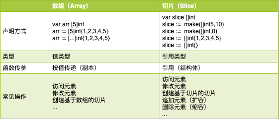
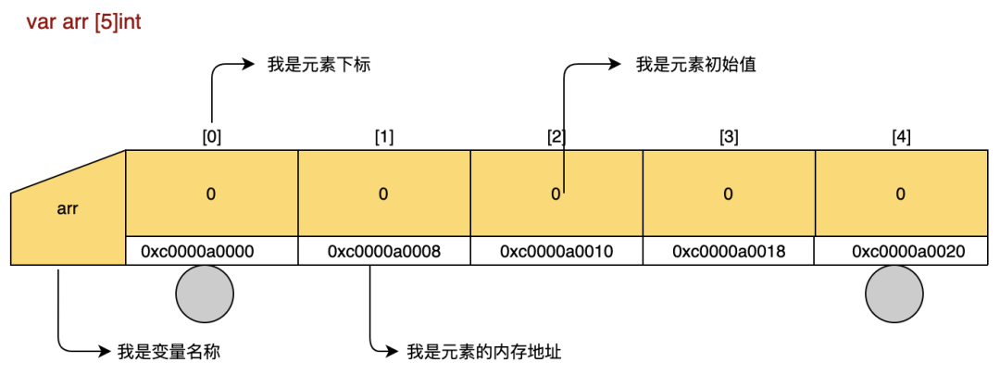
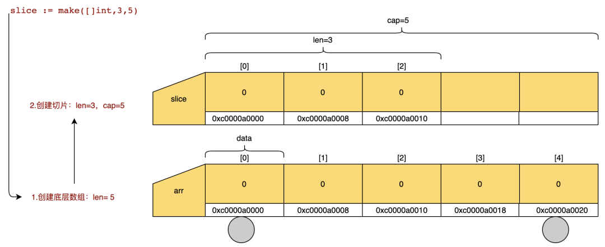

# 再谈Go数组与切片

数组（Array）与切片（Slice）是 Go 语言中的入门知识，其中，切片是我学习 Go 语言后最先使用的一种集合类型，虽然对它的理解还有些似是而非，但可以确定的是，在存放一组类型相同的元素时，不管元素类型是整形还是字符串，都可以使用切片，因此，在最初我将它理解为 PHP 语言里的数组。

但很快我就了解到 Go 语言中也有数组类型，只是在开发中不太常见，切片与数组，两者并不能混为一谈。既然如此，切片究竟是什么呢？在实际应用中，它和数组支持相同的操作方法，都用来存放多个相同类型的元素，但为什么又说切片不是数组呢？两者的使用场景又有什么不同呢？不知道大家是不是和我一样，对二者傻傻分不清楚。

为了方便理解，我整理了一张表格用来参考。



我们知道，在 Go 语言中，声明变量类型的方式有好几种，比如使用关键词 `var` ，又比如使用字面量方式，如果要声明的变量是一个集合类型，则还需要用到 `[]` 操作符，其中，在 `[]` 操作符中设定数值的叫数组，如：`var [5]int`；未设定数值的叫切片，如：`var []int`。

## 认识数组

数组作为集合类型中的一种，它在很多编程语言中都是重要的数据类型，虽然在不同语言中的表现形式有所不同。在 Go 语言中，数组是一个长度固定的序列，用来存放多个相同类型的元素，数组的长度在声明时由 `[]` 操作符中的数值确定，假设 `[]` 中的数值为 5 ，则表示数组长度等于 5 ，最多只能添加 5 个元素，程序会从内存空间中申请长度为 5 的连续内存块供该数组使用。此外，还有一种情况，如果 `[]` 操作符中的数值被 `...` 代替，这时 Go 语言则会根据元素个数计算其长度。需要特别注意的是，数组长度设定后不可更改，也由此说它是固定长度序列。

- 声明与初始化

Go 语言提供不只一种方式声明变量，在声明数组时，使用关键词 `var` 或字面量方式好像区别不大，它们在创建时都需要指定类型及长度，并完成初始化。其长度相同，所占内存大小也相同，区别在于它们的初始值不同。使用 `var` 声明的数组，元素值对应类型的零值，使用字面量声明数组，每个元素对应具体的值。

```go
// var 声明一个包含5个元素的整型数组     
var arr [5]int  

// 字面量方式声明一个包含5个元素的整型数组,并使用1、2、3初始化
arr1 := [5]int{1,2,3}       

// [...]自动计算数组长度
arr2 := [...]int{1,2,3,4,5}     
```

我是使用关键词 `var` 创建的一辆名叫 arr ，有 5 节车厢的数组小火车~



- 基本操作

数组长度固定的特点，注定它操作的方法并不多，它支持简单的访问元素与修改。我们在创建数组前无法预知元素个数，需要新增或删除元素，此时，数组就不支持该操作了。而且数组是值类型，作为参数传递给函数时使用值传递方式，需要在源数组基础上完整复制一个新数组传递给被调用函数，这种方式在传递大数组时成本较高，除非我们使用指针传入数组地址。

```go
arr := [5]string{"Go","语","言","编","程"}

// 1.访问元素
fmt.Println(arr[0])       // 输出：Go

// 2.修改元素值
arr[0] = "PHP"
fmt.Println(arr)          // 输出：[PHP 语 言 编 程]

// 3.基于数组创建切片
// 数据类型
fmt.Printf("%T \n",arr)   // 输出：[5]string
// 从数组中截取一段数据
slice := arr[3:5]
// 类型发生变化
fmt.Println(slice)        // 输出：[编 程]
fmt.Printf("%T \n",slice) // 输出：[]string
```

虽然数组在项目开发中不常直接使用，但某种意义上它也无处不在，最主要的原因是它的切片操作。切片，顾名思义就是从数组上切出的那段数据，数据从数组上切下来，自然就不能再称它为数组了。

## 认识切片

先有数组才有切片，切片是基于数组创建的一种数据结构。结构体的定义在 `reflect.SliceHeader` 中，它由 3 个字段组成，分别表示指向底层数组的指针、长度、容量。切片跟数组最大的不同是其长度可变，可扩容，可缩减，因此大家也叫它“动态数组”。

```go
type SliceHeader struct {
  Data uintptr   // 指向底层数组的指针，也是切片开始位置
  Len  int      // 切片长度
  Cap  int      // 切片容量，表示最多可存储元素个数，与底层数组长度相等
 }
```

- 声明与初始化

```go
// 使用 var 声明一个未初始化的切片，也叫 ni 切片，长度与容量都为 0
var slice []string  
fmt.Println(*(*reflect.SliceHeader)(unsafe.Pointer(&slice))) // 输出：{0 0 0}

// 使用切片字面量创建切片并初始化，切片长度为 5 ，容量与长度相等
slice1 := []string{"Go","语","言","编","程"} 
fmt.Println(*(*reflect.SliceHeader)(unsafe.Pointer(&slice1))) // 输出：{824634354664 5 5}

// 使用 make 声明并初始化切片，切片长度为 5 ，容量为 10
slice2 := make([]string,5,10)  // 没有分配任何内存空间？data指向不为空
fmt.Println(*(*reflect.SliceHeader)(unsafe.Pointer(&slice2))) // 输出：{824634101288 5 10}
```

我是跑在数组上的小切片~



使用关键词 `var` 声明的切片也叫 `nil` 切片，该切片未初始化，长度与容量都为 0，对于未初始化的切片，不能通过下标直接访问或赋值，使用该切片时，需要用到 `append()` 函数修改切片长度再添加元素值。

使用字面量方式创建的切片初始值是我们定义的具体值，长度和容量等于元素个数相等，通过下标访问元素或修改元素值，同样需要通过 `append()` 函数修改切片长度。

关键词 `make` 在函数内使用，我们通过它可以创建带有长度和容量的切片，元素初始值为切片类型的零值，通过下标访问元素或修改元素值，通过 `append()` 函数增加切片长度。如果创建的切片长度等于 0 ，那么它是一个空切片。

当我们想要创建长度为 0 的切片，可以使用 `var` 创建一个 `nil` 切片，也使用 `make` 创建一个空切片，两种方式创建出的切片长度与容量都为 0 。

`nil` 切片、空切片与零切片是切片的三种状态，`nil` 切片是指在声明时未做初始化的切片，不用分配内存空间，一般使用 `var` 创建。使用 `make` 创建的空切片需要分配内存空间，`nil` 切片与空切片的长度、容量都为 0 ，如果我们要创建长度容量为 0 的切片，官方推荐 `nil` 切片。零切片指初始值为类型零值的切片。

```go
// 创建 nil 切片
var slice []int
fmt.Println(slice,*(*reflect.SliceHeader)(unsafe.Pointer(&slice))) // 输出：[] {0 0 0}

// 创建空切片
slice2 := make([]int,0)
slice3 := []int{}
fmt.Println(slice2,*(*reflect.SliceHeader)(unsafe.Pointer(&slice2))) // 输出：[] {18504816 0 0}
fmt.Println(slice3,*(*reflect.SliceHeader)(unsafe.Pointer(&slice3))) // 输出：[] {18504816 0 0}

// 创建零切片
slice4 := make([]int,2,5)
fmt.Println(slice4,*(*reflect.SliceHeader)(unsafe.Pointer(&slice4))) // 输出：[0 0] {824634474496 2 5}
```

- 基本操作

```go
slice := []string{"Go","语","言","编","程"}

// 1.访问元素
fmt.Println(slice[0])         // 输出：Go

// 2.修改元素
slice[0] = "PHP"
fmt.Println(slice[0])         // 输出：[PHP 语 言 编 程]
```

- 特殊操作

1. 追加新元素（扩容操作）

`append()` 函数 是 Go 语言里专为切片类型提供的操作函数。切片长度不足时，使用 `append()` 函数，可在切片头部或尾部追加新元素，但是，由于在头部追加元素会导致内存重新分配，所有元素将复制一次，因此大多数情况下推荐在尾部追加。追加的新元素可以是一个或多个，甚至是一个切片。`append()` 函数能实现切片自动增加长度并按需扩容。

```go
slice := []string{"Go","语","言","编","程"}
// 1.在切片尾部追加一个元素
slice = append(slice, "!")
fmt.Println(slice,len(slice), cap(slice))   // 输出：[Go 语 言 编 程 !] 6 10

// 2.在切片尾部追加多个元素
slice = append(slice,"!","!")
fmt.Println(slice,len(slice), cap(slice)) // 输出：[Go 语 言 编 程 ! ! !] 8 10

// 3.在切片尾部追加切片
slice = append(slice,[]string{"!","!"}...)
fmt.Println(slice,len(slice), cap(slice)) // 输出：[Go 语 言 编 程 ! ! ! ! !] 10 10

// 4.在切片头部追加切片
slice = append([]string{"最","爱"},slice...)
fmt.Println(slice,len(slice), cap(slice)) // 输出：[最 爱 Go 语 言 编 程 ! ! ! ! !] 12 12
```

一个数组包含类型与长度两部分，切片的底层是一个数组，切片容量等于数组长度，在这个前提下，我们创建切片并修改它的长度时，如果长度小于容量（数组长度），那么函数将直接在原底层数组上增加新的元素，如果切片长度超出容量（数组长度），`append()` 函数就会创建一个新的底层数组，再将源数组的值复制过来，我们可以通过对比 `SliceHeader.Data` 字段观察底层数组发生的变化。

```go
// 发生扩容前
slice := []string{"Go","语","言","编","程"}
fmt.Println(*(*reflect.SliceHeader)(unsafe.Pointer(&slice)))    // 输出：{824634458112 5 5}

// 发生扩容后
slice = append(slice, "!") 
fmt.Println(*(*reflect.SliceHeader)(unsafe.Pointer(&slice)))    // 输出：{824634466464 6 10}
```

`append()` 扩容逻辑大概是这样，当 size 小于 1024 字节时，按乘以 2 的长度创建新的底层数组，超过 1024 字节时，按 1/4 增加。

1. 删除切片元素（缩容操作）

前面说到切片是动态的数组，灵活又方便，既能使用 `append()` 函数对它进行扩容，也能使用 `[:]` 运算符在源切片上创建新的切片，实现元素的删除。`:`左边是开始位，右边是结束位，它们表示元素开始与结束的选取范围。

```go
// 创建一个空切片
slice := make([]string,0)
fmt.Println(slice,*(*reflect.SliceHeader)(unsafe.Pointer(&slice)))  // 输出：[] {18541680 0 0}

// 使用 append 函数在切片尾部追加一个切片，触发扩容，内存重新分配
slice = append(slice,[]string{"最","爱","Go","语","言","编","程","!","!"}...)
fmt.Println(slice,*(*reflect.SliceHeader)(unsafe.Pointer(&slice)))  // 输出：[最 爱 Go 语 言 编 程 ! !] {824634204160 8 9}

// 从切片尾部删除元素，赋值给新切片，新切片与源切片共享同一个底层数组
newSlice := slice[0:8]
fmt.Println(newSlice,*(*reflect.SliceHeader)(unsafe.Pointer(&newSlice))) // 输出：[最 爱 Go 语 言 编 程 !] {824634204160 8 9}

// 从切片尾部删除元素，创建新切片和新的底层数组
var newSlice2 []string
newSlice2 = append(newSlice2,slice[0:8]...)
fmt.Println(newSlice2,*(*reflect.SliceHeader)(unsafe.Pointer(&newSlice2))) // 输出：[最 爱 Go 语 言 编 程 !] {824634212352 8 8}

// 从切片头部和尾部删除元素并返回新切片，内存重新分配
slice = slice[2:7]
fmt.Println(slice,*(*reflect.SliceHeader)(unsafe.Pointer(&slice)))  // 输出：[Go 语 言 编 程] {824634204192 5 7}
```

通过上面的代码，我们得出一个结论：从切片尾部删除元素不会触发缩容，仅长度发生变化，从切片头部删除元素则会触发缩容，长度及容量都发生变化。所以删除的元素不再使用后，一般建议申请新的内存空间，创建新的切片来接收要保留的元素，这样可以避免原底层数组内存无效占用，从源切片头部删除不存在此问题。

1. 拷贝切片

Go 语言提供了内置函数 `copy()` 用来拷贝切片。在前面的代码里用 `append()` 函数演示了如何从切片头部或尾部删除元素，那如果想从中间删除应该怎么做？还有，前面说到当切片容量不足以添加新元素时，`append()` 函数会依据规则创建新的大容量底层数组，在此基础创建新切片，再将源切片的内容拷贝到新切片中，那它是如何操作的呢？

```go
// 源切片
slice := []string{"Go","语","言","言","言","编","程","!"}
// 创建新切片
newSlice := make([]string,6)
// 选择范围拷贝到新切片
at := copy(newSlice,slice[0:3])
copy(newSlice[at:],slice[5:8])
fmt.Println(newSlice)  // 输出：[Go 语 言 编 程 !]
```

`copy()` 函数的操作使用 `append()` 函数也能实现，只不过 `append()` 函数每次复制数据都需要创建临时切片，相比性能上 `copy()` 函数更胜一筹。

说到拷贝，它可分为深拷贝与浅拷贝，我们一般默认值类型的数据是深拷贝，引用类型的数据是浅拷贝，那深拷贝与浅拷贝有什么区别呢？深拷贝是指使用数据时，基于原始数据创建一个副本，有独立的底层数据空间，之后的操作都在副本上进行，对原始数据没有任何影响。反之，操作对原始数据有影响的叫做浅拷贝，比如拷贝原始数组地址。我们可以回想一下，在前面的切片操作中，哪些是深拷贝，哪些是浅拷贝。

1. 判断 2 个字符串切片是否相等

Go 语言标准库中有专门的方法判断两个字节切片是否相等，却没有针对字符串切片的，当我们要判断两个字符串切片是否相等时，可以使用 `reflect` 包提供的 `DeepEqual()` 方法，或者自定义。但不管哪种，在使用前都要先定义什么是相等，一个切片包含类型、长度、容量和元素值，按照以往的经验，当类型、元素值、长度一致时，我们便认为这两个切片是相等的。只是，使用自定义方法需要先确定类型再比较，而使用 `reflect.DeepEqual()` 可以比较两个不确定类型的值，但是需要付出很大的性能代价，所以通常我们还是使用前者。

```go
// 创建两个长度相同、容量不同的切片
slice1 := make([]string,2,5)
slice1[0] = "Go"
slice1[1] = "语"
slice2 := make([]string,2,6)
slice2[0] = "Go"
slice2[1] = "语"
// 方法1：自定义方法
status := true
if len(slice1) != len(slice2){
   status = false
}else{
   for k,_ := range slice1 {
    if slice1[k] != slice2[k] {
     status = false
    }
   }
}
fmt.Println(status)     // 输出：true
// 方法2：使用 reflect.DeepEqual
fmt.Println(reflect.DeepEqual(slice1,slice2))  // 输出：true
```

## 总结

数组跟切片是 `Go` 语言中很基础的内容，它们的操作也不仅限于前面介绍的那些。切片在某种程度上是来源于数组的，所以他们可以支持相同的操作方法，但切片的形式更为动态，操作方法和使用场景也更加丰富。

这次总结 `Go` 语言数组跟切片的内容花费了很长时间，尽管如此，仍然有一些”未解之谜“，对于已了解的内容也不敢说都理解恰当，我将带着这些问题，继续 Go 语言学习之路。