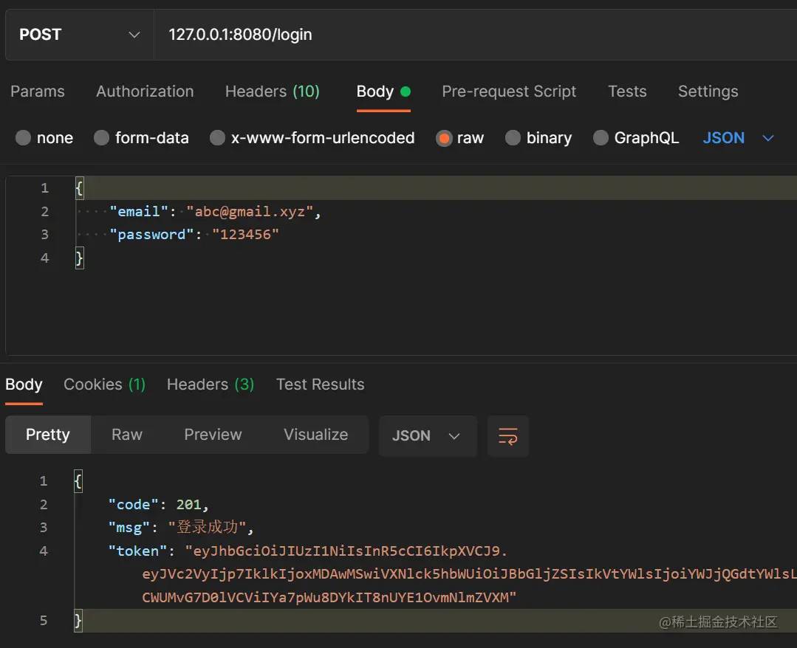
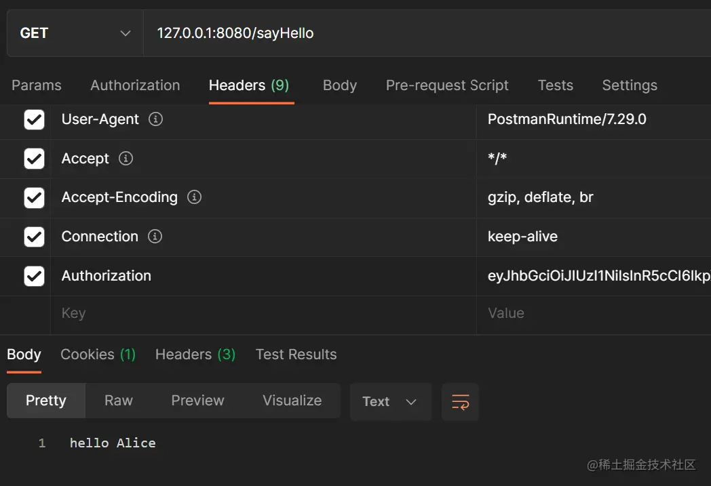
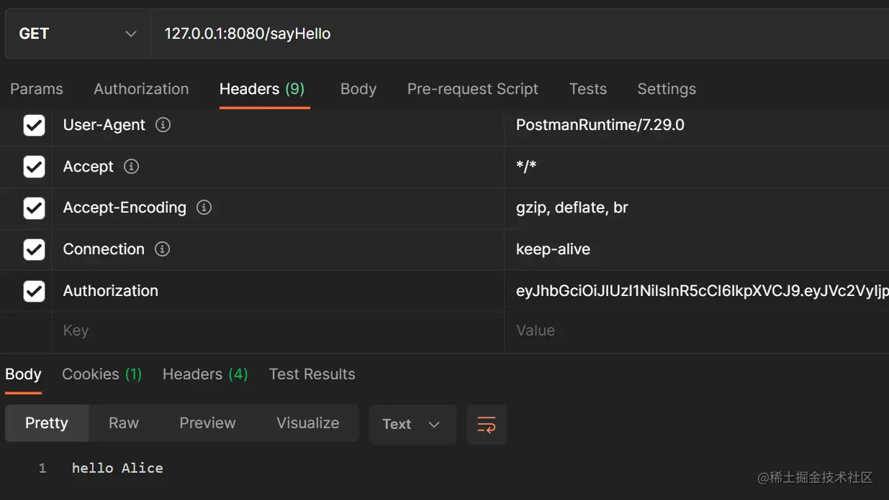
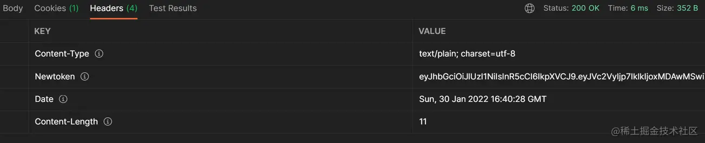

# 在Gin中使用JWT做认证以及JWT的续签方案

本文已参与「新人创作礼」活动，一起开启掘金创作之路。

## 1 需求

之前做后台都是用的Session机制来做认证，最近在用Gin重构之前SpringBoot项目，网上看了几个开源Gin项目发现都是用的JWT来做认证，所以打算尝试一下在Gin中使用JWT做认证。Token机制相对于Session机制来说有许多优点，不需要服务端存储数据可以减小服务端的开销；但Token也有一些问题，在签发后服务端就不能改变其状态，不能主动让其失效、不能延长有效期。这里记录一下Gin中JWT的基本使用、以及一个简单的续签方案。
本文的完整demo结构如下（完整示例代码见[Github](https://link.juejin.cn/?target=https%3A%2F%2Fgithub.com%2Fyafeng-Soong%2Fblog-example)），middleware中拦截请求验证Token有效性，utils中对jwt的生成、续签和验证做封装：

```
|——gin_jwt
|    |——middleware
|        |——jwt.go
|    |——model
|        |——user.go
|    |——utils
|        |——jwt.go
|    |——go.mod
|    |——main.go
复制代码
```

## 2 Gin中使用JWT

看了几个开源Gin项目和一些博客都使用的是[dgrijalva/jwt-go](https://link.juejin.cn/?target=https%3A%2F%2Fgithub.com%2Fdgrijalva%2Fjwt-go)这个jwt库，但是这个库4年前就停止维护了，目前相关人员维护了一个新的jwt库[golang-jwt/jwt](https://link.juejin.cn/?target=https%3A%2F%2Fgithub.com%2Fgolang-jwt%2Fjwt)，这里使用这个新的jwt库。首先使用如下命令下载jwt库：
`go get -u github.com/golang-jwt/jwt/v4`
假设我需要在Token中保存用户ID、用户名和Email，自定义如下Claims结构体：

```go
type UserInfo struct {
	Id       int
	UserName string
	Email    string
}

type MyClaims struct {
	User model.UserInfo
	jwt.StandardClaims // 标准Claims结构体，可设置8个标准字段
}
复制代码
```

### 2.1 生成Token

生成标准claim时过期时间一般不用太长，这里设置的两个小时后过期。生成Token时调用jwt库的NewWithClaims即可，传入签名算法和claims结构体，签名算法用得最多的是HS256。

```go
const TokenExpireDuration = time.Hour * 2

var MySecret = []byte("yoursecret") // 生成签名的密钥
// 登录成功后调用，传入UserInfo结构体
func GenerateToken(userInfo model.UserInfo) (string, error) {
	expirationTime := time.Now().Add(TokenExpireDuration)  // 两个小时有效期
	claims := &MyClaims{
		User: userInfo,
		StandardClaims: jwt.StandardClaims{
			ExpiresAt: expirationTime.Unix(),
			Issuer:    "yourname",
		},
	}
	// 生成Token，指定签名算法和claims
	token := jwt.NewWithClaims(jwt.SigningMethodHS256, claims)
	// 签名
	if tokenString, err := token.SignedString(MySecret); err != nil {
		return "", err
	} else {
		return tokenString, nil
	}

}
复制代码
```

### 2.2 校验Token

将前端传来的token字符串传入解析校验函数，校验函数调用ParseWithClaims进行解析，此时有两种解析方法，一种是将解析结果保存到claims变量中，另一种是从ParseWithClaims返回的Token结构体中取出Claims结构体。这里选择第一种，若token字符串合法但过期claims也会有数据，err会提示token过期。

```go
func ParseToken(tokenString string) (*MyClaims, error) {
	claims := &MyClaims{}
	_, err := jwt.ParseWithClaims(tokenString, claims, func(t *jwt.Token) (interface{}, error) {
		return MySecret, nil
	})
	// 若token只是过期claims是有数据的，若token无法解析claims无数据
	return claims, err
}

// 第二种方法通过jwt.ParseWithClaims返回的Token结构体取出Claims结构体
func ParseToken2(tokenString string) (*MyClaims, error) {
	token, err := jwt.ParseWithClaims(tokenString, &MyClaims{}, func(t *jwt.Token) (interface{}, error) {
		return MySecret, nil
	})
	if err != nil {
		return nil, err
	}
	if claims, ok := token.Claims.(*MyClaims); ok && token.Valid {
		return claims, nil
	}
	return nil, errors.New("token无法解析")
}
复制代码
```

### 2.3 中间件拦截请求并校验Token

这里的中间件逻辑没有续签功能，当Token校验失败，无论是过期还是不合法直接拒绝用户请求。

```go
func JWTAuth() gin.HandlerFunc {
	return func(context *gin.Context) {
		auth := context.Request.Header.Get("Authorization")
		if len(auth) == 0 {
			context.Abort()
			context.String(http.StatusOK, "未登录无权限")
			return
		}
		// 校验token，只要出错直接拒绝请求
		_, err := utils.ParseToken(auth)
		if err != nil {
			context.Abort()
			message := err.Error()
			context.JSON(http.StatusOK, message)
                        return
		} else {
			println("token 正确")
		}
		context.Next()
	}
}
复制代码
```

### 2.4 主函数逻辑

这里简单编写了一下主函数，只有两个接口：一个是登录接口，另一个是需要验证Token的sayHello接口，若用户登录了此接口会返回Hello + 用户名。

```go
package main

import (
	"gin_jwt/middleware"
	"gin_jwt/model"
	"gin_jwt/utils"
	"log"
	"net/http"

	"github.com/gin-gonic/gin"
)

// 不访问数据，写死用户数据
var db = &model.User{Id: 10001, Email: "abc@gmail.xyz", UserName: "Alice", Password: "123456"}

func setupRouter() *gin.Engine {
	r := gin.Default()

	r.POST("login", func(c *gin.Context) {
		var userVo model.User
		if c.ShouldBindJSON(&userVo) != nil {
			c.String(http.StatusOK, "参数错误")
			return
		}
		if userVo.Email == db.Email && userVo.Password == db.Password {
			info := model.NewInfo(*db)
			tokenString, _ := utils.GenerateToken(*info)
			c.JSON(http.StatusOK, gin.H{
				"code":  201,
				"token": tokenString,
				"msg":   "登录成功",
			})
			return
		}
		c.String(http.StatusOK, "登录失败")
		return
	})

	authorized := r.Group("/", middleware.JWTAuth())

	authorized.GET("/sayHello", func(c *gin.Context) {
		auth := c.Request.Header.Get("Authorization")
		claims, _ := utils.ParseToken(auth)
		log.Println(claims)
		c.String(http.StatusOK, "hello "+claims.User.UserName)
	})

	return r
}

func main() {
	r := setupRouter()
	r.Run(":8080")
}
复制代码
```

## 3 续签Token

按照JWT标准，Token就应该是无状态的，过期后重新給客户端发布新Token即可。但Token过期时间一般比较短，若没有自动续签机制的话，让用户频繁重新登录会造成比较糟糕的体验。目前网上提的比较多的方案是结合redis维持Token黑名单或白名单，原理和session有点类似了，服务端保存了Token的状态有点违背了Token的无状态原则；还有的方案是使用两个Token，一个access_token用于访问资源，一个过期时间较长的refresh_token用于获取新的access_token。这里想了一个比较简单的方案，当Token过期但不超过10分钟时放行请求并为其生成一个新的Token，将新token放在一个名为newtoken的自定义header中；前端拦截器中判断response的header是否有newtoken，若有的话则刷新本地保存的token字符串。

### 3.1 封装续签函数

判断claims的过期时间是否超过指定时间，若还未超过指定时间则生成一个新的token字符串，否则返回空字符串。

```go
func RenewToken(claims *MyClaims) (string, error) {
	// 若token过期不超过10分钟则给它续签
	if withinLimit(claims.ExpiresAt, 600) {
		return GenerateToken(claims.User)
	}
	return "", errors.New("登录已过期")
}
// 计算过期时间是否超过l
func withinLimit(s int64, l int64) bool {
	e := time.Now().Unix()
	return e-s < l
}
复制代码
```

### 3.2 修改jwt的中间件逻辑

当Token校验失败时判断一下是否是过期错误，若是过期错误则将Claims结构体传给续签函数，若续签成功则将新的token字符串放到response的指定header中，并修改request的header值。

```go
func JWTAuth() gin.HandlerFunc {
	return func(c *gin.Context) {
		auth := c.Request.Header.Get("Authorization")
		if len(auth) == 0 {
			// 无token直接拒绝
			c.Abort()
			c.String(http.StatusOK, "未登录无权限")
			return
		}
		// 校验token
		claims, err := utils.ParseToken(auth)
		if err != nil {
			if strings.Contains(err.Error(), "expired") {
				// 若过期，调用续签函数
				newToken, _ := utils.RenewToken(claims)
				if newToken != "" {
					// 续签成功給返回头设置一个newtoken字段
					c.Header("newtoken", newToken)
					c.Request.Header.Set("Authorization", newToken)
					c.Next()
					return
				}
			}
			// Token验证失败或续签失败直接拒绝请求
			c.Abort()
			c.String(http.StatusOK, err.Error())
			return
		}
		// token未过期继续执行1其他中间件
		c.Next()
	}
}
复制代码
```

### 3.3 前端添加拦截器

这里以Vue常用的axios为例，在response的拦截器中判断是否有自定义的header，若有则从中取出新的token字符串用以刷新本地旧的token字符串。

```js
axios.interceptors.response.use(
    res => {
        let newToken = res.headers["newtoken"]
        if (res.headers["newtoken"]) {
            // 若有newtoken则刷新token
            sessionStorage.setItem('tokenString', newToken)
            console.log('token refreshed~~~')
        }
        return res
    },
    err =>{
        return Promise.reject(err)
    })
复制代码
```

## 4 测试运行

这里使用Postman进行测试，首先发起登录请求，登录成功后得到服务端返回的token字符串。 

在header的Authorization中加入token字符串访问sayHello接口可以得到响应 

Token过期10分钟内访问sayHello接口，可以看到依然有响应，并且response的header中多了newtoken字段，编写前端时保存这个新的token即可。  