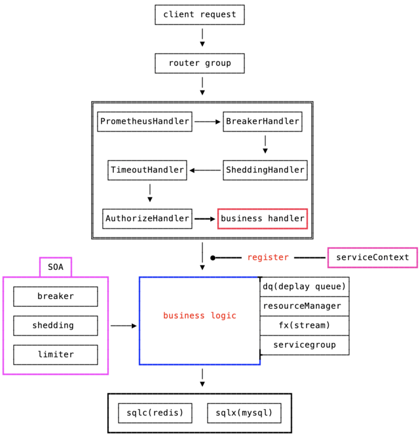
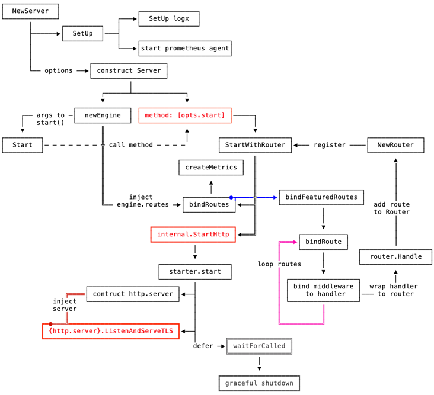
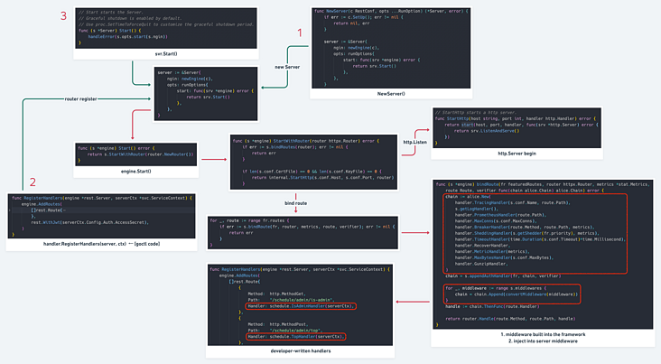
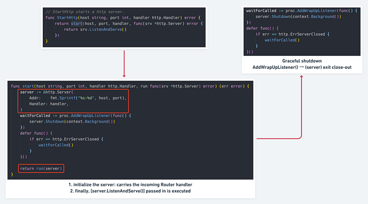
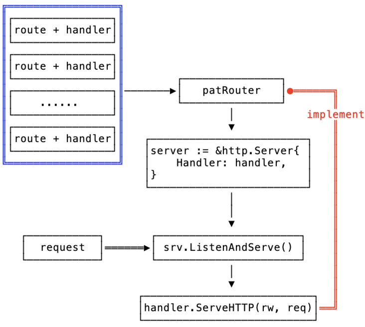

# [多图详解go-zero Restful 框架原理与实现](https://segmentfault.com/a/1190000040791035)

## rest框架概览

我们先通过 `go-zero` 自带的命令行工具 `goctl` 来生成一个 `api service`，其 `main` 函数如下：

```go
func main() {
    flag.Parse()

    var c config.Config
    conf.MustLoad(*configFile, &c)

    ctx := svc.NewServiceContext(c)
    server := rest.MustNewServer(c.RestConf)
    defer server.Stop()

    handler.RegisterHandlers(server, ctx)

    fmt.Printf("Starting server at %s:%d...\n", c.Host, c.Port)
    server.Start()
}
```

1. 解析配置文件
2. 将配置文件传入，初始化 `serviceContext`
3. 初始化 `rest server`
4. 将 `context` 注入 `server` 中：
   1. 注册路由
   2. **将 `context` 中的启动的 `endpoint` 同时注入到 `router` 当中**
5. 启动 `server`

接下来我们来一步步讲解其设计原理！Let's Go!

## web框架

从日常开发经验来说，一个好的 web 框架大致需要满足以下特性：

1. 路由匹配/多路由支持
2. 支持自定义中间件
3. 框架和业务开发完全解耦，方便开发者快速开发
4. 参数校验/匹配
5. 监控/日志/指标等服务自查功能
6. 服务自保护(熔断/限流)

## go-zero rest设计

> [https://github.com/zeromicro/go-zero/tree/master/rest](https://link.segmentfault.com/?enc=iam5xJajSisY70XsXlQN4w%3D%3D.wQJ1C8ikmjL%2F4AATMZ6KYI2pJdEuvyfR%2Fcx5ejnquNVv6MM5WuX2sLI%2F6w3wAkjeK4U2jOyfsO9xaYN7Nf9FNg%3D%3D)

### 概览

1. 借助 context (不同于 gin 的 context)，将资源初始化好 → 保存在 `serviveCtx` 中，在 handler 中共享（至于资源池化，交给资源自己处理，`serviveCtx` 只是入口和共享点）
2. 独立 router 声明文件，**同时加入 router group 的概念，方便开发者整理代码结构**
3. 内置若干中间件：监控/熔断/鉴权等
4. 利用 **goctl codegen + option 设计模式**，方便开发者自己控制部分中间件的接入



上图描述了 rest 处理请求的模式和大部分处理路径。

1. 框架内置的中间件已经帮开发者解决了大部分服务自处理的逻辑
2. 同时 go-zero 在 `business logic` 处也给予开发者开箱即用的组件(dq、fx 等)
3. **从开发模式上帮助开发者只需要关注自己的 `business logic` 以及所需资源准备**

下面我们来细说一下整个 rest 是如何启动的？

## 启动流程



上图描述了整体 server 启动经过的模块和大致流程。准备按照如下流程分析 rest 实现：

1. 基于 http.server 封装以及改造：把 **engine(web框架核心)** 和 option 隔离开
2. 多路由匹配采取 radix-tree 构造
3. 中间件采用洋葱模型 → `[]Middleware`
4. http parse 解析以及匹配校验 → `httpx.Parse()`
5. 在请求过程会收集指标 (`createMetrics()`) 以及监控埋点 (prometheus)

### server engine封装



> 点开大图观看

engine 贯穿整个 server 生命周期中：

1. router 会携带开发者定义的 path/handler，**会在最后的 router.handle() 执行**
2. 注册的自定义中间件 + 框架中间件，在 router handler logic 前执行

**在这里：go-zero 处理的粒度在 route 上，封装和处理都在 route 一层层执行**

### 路由匹配

那么当 request 到来，首先是如何到路由这一层的？

首先在开发最原始的 http server ，都有这么一段代码：

```go
type helloHandler struct{}

func (h *helloHandler) ServeHTTP(w http.ResponseWriter, r *http.Request) {
    w.Write([]byte("Hello, world!"))
}

func main() {
    http.Handle("/", &helloHandler{})
    http.ListenAndServe(":12345", nil)
}
http.ListenAndServe()` 内部会执行到：`server.ListenAndServe()
```

我们看看在 rest 里面是怎么运用的：



而传入的 handler 其实就是：router.NewRouter() 生成的 router。这个 router 承载了整个 server 的处理函数集合。

同时 http.Server 结构在初始化时，是把 handler 注入到里面的：

```go
type Server struct {
    ...
    Handler Handler
}

func start(..., handler http.Handler, run func(srv *http.Server) error) (err error) {
    server := &http.Server{
        Addr:    fmt.Sprintf("%s:%d", host, port),
        Handler: handler,
    }
    ...
    return run(server)
}
```

在 http.Server 接收 req 后，最终执行的也是：**`handler.ServeHTTP(rw, req)`**



**所以内置的 router 也需要实现 `ServeHTTP` 。至于 router 自己是怎么实现 `ServeHTTP` :无外乎就是寻找匹配路由，然后执行路由对应的 handle logic。**

## 解析参数

解析参数是 http 框架需要提供的基本能力。在 goctl code gen 生成的代码中，**handler** 层已经集成了 req argument parse 函数：

```go
// generate by goctl
func QueryAllTaskHandler(ctx *svc.ServiceContext) http.HandlerFunc {
    return func(w http.ResponseWriter, r *http.Request) {
        // custom request in .api file
        var req types.QueryAllTaskRequest
        // parse http request
        if err := httpx.Parse(r, &req); err != nil {
            httpx.Error(w, err)
            return
        }

        l := logic.NewEventLogic(r.Context(), ctx)
        resp, err := l.QueryAllTask(req)
        baseresponse.FormatResponseWithRequest(resp, err, w, r)
    }
}
```

进入到 `httpx.Parse()` ，主要解析以下几块：

> [https://github.com/zeromicro/go-zero/blob/master/rest/httpx/requests.go#L32:6](https://link.segmentfault.com/?enc=AxCh3Hqu4Gk3R1x2MVWzNA%3D%3D.1K1PcXSk3Hy8lnNKSnlRGEd%2F34igYeOBnLuVAGffZwCN1GcVpbBPJxCn%2FYZ4VfpPMi1L%2FiqDpEFtQ1iaWrb4MC8MBuDcEKwavIAwizdlmgE%3D)

1. 解析path
2. 解析form表单
3. 解析http header
4. 解析json

> Parse() 中的 **参数校验** 的功能见：
>
> [https://go-zero.dev/cn/api-grammar.html](https://link.segmentfault.com/?enc=ZeL9zLcTi5JSz%2FvCwSIM9g%3D%3D.4jXo%2B0wWyCsauqrfyG%2FVCS6QcYb3ILcia01VH0%2BtJxg0rklo4hxVJ21ayif2Lt8y) 中的 `tag修饰符`

## Tips

学习源码推荐 fork 出来边看边写注释和心得，可以加深理解，以后用到这块功能的时候也可以回头翻阅。