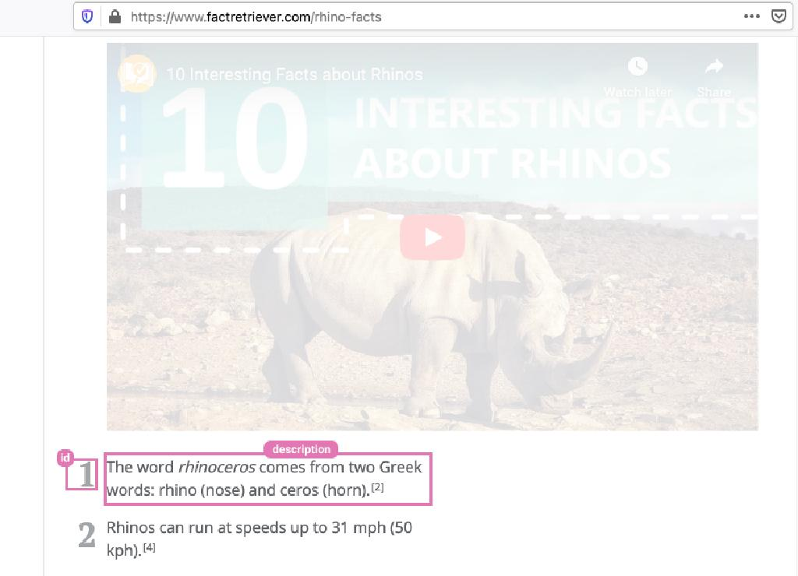
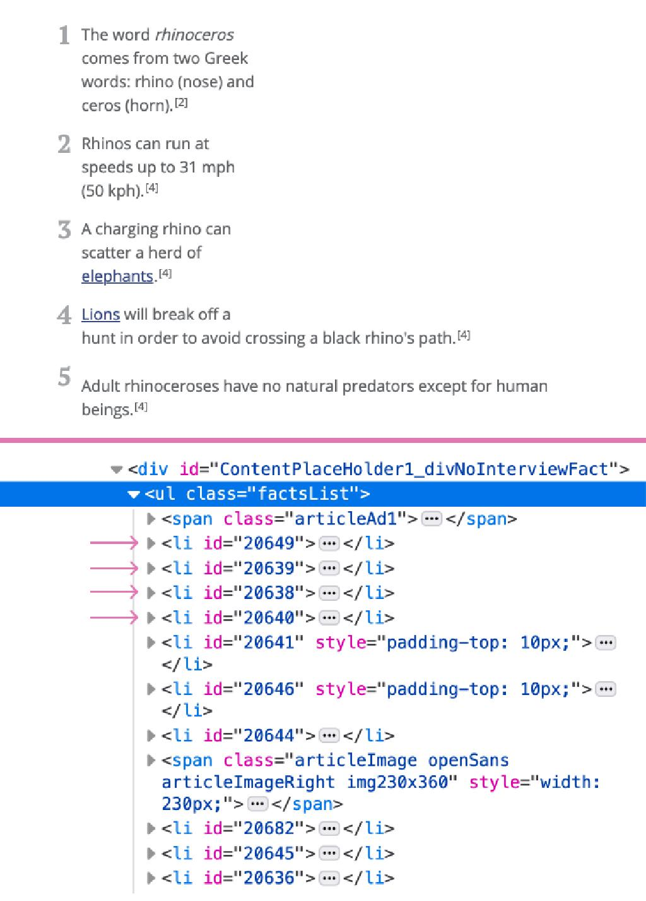

# 如何使用 Go 和 Colly 包构建网页爬虫

[英文版链接](https://divrhino.com/articles/build-webscraper-with-go-and-colly/)：https://divrhino.com/articles/build-webscraper-with-go-and-colly/

在本教程中，我们将学习如何使用 Go 和 Colly 构建网页爬虫。我们还将学习如何将抓取的数据保存到 JSON 文件中。有时候我们想要的数据就是没有查询该数据 API ，在类似情况下，你始终只需要编写一个小的网页爬虫程序来获取你所需的数据。我们将使用 Colly 包进行爬虫，处理 DOM。

## 先决条件

要继续构建，您需要安装Go。

## 设置项目目录

让我们开始吧。首先，更改为存储项目的目录。就我而言，这将是 “站点” 文件夹，对您来说可能有所不同。在这里，我们将创建名为「rhino-scraper」

```go
cd Sites
mkdir rhino-scraper
cd rhino-scraper
```

在我们的「rhino-scraper」项目文件夹，我们将创建我们的 `main.go` 文件。这将是我们应用程序的切入点。

```go
touch main.go
```

## 初始化go模块

我们将使用 `go modules` 处理项目中的依赖关系。运行以下命令将创建一个 `go.mod` 文件：

```go
go mod init example.com/rhino-scraper
```

我们将使用 colly 包来构建我们的网络抓取工具，所以现在让我们通过运行来安装它:

```go
go get github.com/gocolly/colly
```

您会注意到，运行上述命令会创建一个 `go.sum` 文件。该文件包含列表_校验和_以及我们直接和间接依赖关系的版本。它用于验证每个依赖项的校验和，以确认它们均未被修改。

在 `main.go` 我们之前创建的文件，让我们设置一个基本的 `package main` 和 `func main()` 。

```go
package main
func main() {
}
```

## 分析目标页面结构

在本教程中，我们将从 [FactRetriever.com](https://www.factretriever.com/rhino-facts) 上进行爬虫获取数据。

以下是从目标页面获取的屏幕截图。我们可以看到每个事实都有一个简单的结构，包括一个 id 和一个描述。



图片: FactRetriever.com Rhino Facts

## 创建 Fact 结构体

在我们的 `main.go` 文件，我们可以编写一个事实结构类型来表示犀牛事实的结构。一个事实将有:

- 一个 `int` 类型的 `**ID**` 字段，以及
- 一个 `string` 类型的** **`**description**` 字段

在这个结构体中 `ID` 字段和 `Description`字段都要大些，因为我们需要它们能够在包外可以访问。

```go
package main

type Fact struct {
	ID          int    `json:"id"`
	Description string `json:"description"`
}

func main() {}
```

在 func main 内部，我们将创建一个空切片来保存我们的结构体实例。我们将使用零长度初始化它，并在运行时附加到它。这切片只能保存该类型的结构体实例。

```go
package main

type Fact struct {
	ID          int    `json:"id"`
	Description string `json:"description"`
}

func main() {
	allFacts := make([]Fact, 0)
}
```

## 使用 Colly 包

我们将导入一个名为 colly 的包，为我们提供构建网页抓取工具所需的方法和功能。

```go
package main

import "github.com/gocolly/colly"

type Fact struct {
	ID          int    `json:"id"`
	Description string `json:"description"`
}

func main() {
	allFacts := make([]Fact, 0)
}
```

使用 colly 包，我们创建一个新的收集器，并将它设置为允许访问 factretriever.com 域名，即设置成白名单(whitelist)。

```go
package main

import "github.com/gocolly/colly"

type Fact struct {
	ID          int    `json:"id"`
	Description string `json:"description"`
}

func main() {
	allFacts := make([]Fact, 0)

	collector := colly.NewCollector(
		colly.AllowedDomains("factretriever.com", "www.factretriever.com"),
	)
}
```

## HTML结构体实例列表

如果我们检查 HTML 结构，我们将看到实例是无序列表中的列表项，其类为 `factsList` 。每个 fact 的实例表项已被分配一个 `id` 。稍后我们将使用这个 `id` 。



图片: HTML structure of Facts list

现在我们知道了 HTML 结构是什么样的，我们可以编写一些代码来遍历 DOM 。colly 包使用一个名为 goQuery 的库来与 DOM 交互。goQuery 类似于 jQuery，但适用于 Golang。

下面是到目前为止的代码。我们将逐步越过新生产线

```go
package main

import (
	"fmt"
	"log"
	"strconv"

	"github.com/gocolly/colly"
)

type Fact struct {
	ID          int    `json:"id"`
	Description string `json:"description"`
}

func main() {
	allFacts := make([]Fact, 0)
	collector := colly.NewCollector(
		colly.AllowedDomains("factretriever.com", "www.factretriever.com"),
	)

	collector.OnHTML(".factsList li", func(element *colly.HTMLElement) {
		factId, err := strconv.Atoi(element.Attr("id"))
		if err != nil {
			log.Println("Could not get id")
		}

		factDesc := element.Text
		fact := Fact{
			ID:          factId,
			Description: factDesc,
		}

		allFacts = append(allFacts, fact)
	})
}
```

- 3-6 行：引入了 `fmt` ,`log` ,`strconv` 包。
- 23 行：我们正在使用 `OnHTML` 方法。这需要两个论点。第一个参数是目标选择器，第二个参数是每次遇到目标选择器时调用的回调函数。
- 24 行：
  - 在 `OnHTML` 主体中，我们创建一个变量来存储迭代的对象 ID。
  - ID 当前为 `string` 类型，所以我们使用 `strconv.Atoi` 将其转换为类型 `int` 。
- 25-27 行： `strconv.Atoi` 方法返回一个错误作为它的第二个返回值，所以做一些基本的错误处理。
- 29 行：我们创建一个名为 `factDesc` 存储 `description` 每个实例的文本。基于我们之前建立的事实结构类型，我们期望实例描述是 `string` 类型。
- 31-34 行：在这里，我们为我们迭代的每个列表项创建一个新的结构体实例。
- Line 36：然后我们将结构体实例附加到所有切片中。

## 开始爬虫

我们希望得到一些视觉反馈，让我们知道我们的刮刀实际上正在访问该页面。现在就开始吧。

```go
package main

import (
	"fmt"
	"log"
	"strconv"

	"github.com/gocolly/colly"
)

type Fact struct {
	ID          int    `json:"id"`
	Description string `json:"description"`
}

func main() {
	allFacts := make([]Fact, 0)
	collector := colly.NewCollector(
		colly.AllowedDomains("factretriever.com", "www.factretriever.com"),
	)

	collector.OnHTML(".factsList li", func(element *colly.HTMLElement) {
		factId, err := strconv.Atoi(element.Attr("id"))
		if err != nil {
			log.Println("Could not get id")
		}
		
		factDesc := element.Text
		fact := Fact{
			ID:          factId,
			Description: factDesc,
        }
		allFacts = append(allFacts, fact)
	})
	
	collector.OnRequest(func(request *colly.Request) {
		fmt.Println("Visiting", request.URL.String())
	})
	collector.Visit("https://www.factretriever.com/rhino-facts")
}
```

- 39-41 行：我们使用 `fmt.Println` 输出`Visiting` 每当我们请求URL时发送消息。
- 43 行：我们使用`Visit()` 方法给我们的程序一个起点。

如果我们现在在终端中运行程序，通过使用命令：

```go
go run main.go
```

它会告诉我们，我们的收集器访问了实例 [http://retriever.com](http://retriever.com/) 的 fact 实例页面。

## 将数据保存到 JSON****

We may want to use our scraped data in another place. So let’s save it to a JSON file.

```go
package main

import (
	"fmt"
	"io/ioutil"
	"log"
	"os"
	"strconv"

	"github.com/gocolly/colly"
)

type Fact struct {
	ID          int    `json:"id"`
	Description string `json:"description"`
}

func main() {
	allFacts := make([]Fact, 0)

	collector := colly.NewCollector(
		colly.AllowedDomains("factretriever.com", "www.factretriever.com"),
	)

	collector.OnHTML(".factsList li", func(element *colly.HTMLElement) {
		factId, err := strconv.Atoi(element.Attr("id"))
		if err != nil {
			log.Println("Could not get id")
		}
		factDesc := element.Text

		fact := Fact{
			ID:          factId,
			Description: factDesc,
		}

		allFacts = append(allFacts, fact)
	})

	collector.OnRequest(func(request *colly.Request) {
		fmt.Println("Visiting", request.URL.String())
	})

	collector.Visit("https://www.factretriever.com/rhino-facts")
	writeJSON(allFacts)
}


func writeJSON(data []Fact) {
	file, err := json.MarshalIndent(data, "", " ")
	if err != nil {
		log.Println("Unable to create json file")
		return
	}
	_ = ioutil.WriteFile("rhinofacts.json", file, 0644)
}
```

- 5 行：我们导入 `ioutil` 包，这样我们就可以写入文件。
- 7 行：
  - 我们导入 `os` 包
  - 操作系统包提供操作系统功能的接口
- 49 行：让我们创建一个名为 `writeJSON` 的函数，该函数采用事实切片类型的一个参数
- 50 行：
  - 在函数体内部，让我们使用 `MarshalIndent` 整理我们传递的数据
  - `MarshalIndent` 方法返回数据的JSON编码，并返回错误
- 51-54 行：一些错误处理。如果此处出现错误，我们将只打印一条日志消息，说明我们无法创建JSON文件
- 56 行：
  - 然后我们可以使用 `WriteFile`方法它为我们提供了将JSON编码的数据写入名为`rhinofacts.json` 。
  - 此文件尚不存在，因此 `WriteFile` 方法将使用 [permissions code of 0644](http://permissions-calculator.org/decode/0644/) 。

我们的 `WriteJSON` 函数可以使用了。我们可以在第 8 行调用它并传递给它。

现在，如果我们返回终端并运行命令执行 `go run main.go` 我们所有爬虫得到的实例都将保存在一个名为 `rhinofacts.json` 的文件中。