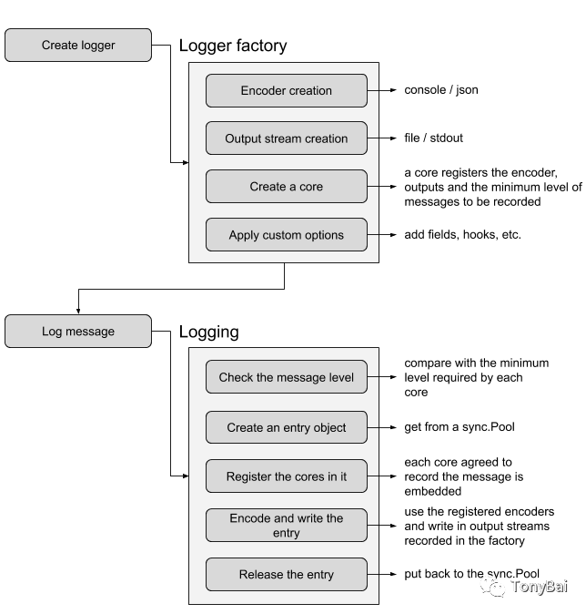

# 如何用好uber开源的zap日志库

## **1. 引子**

日志在后端系统中有着重要的地位，通过日志不仅可以直观看到程序的当前运行状态，更重要的是日志可以在程序发生问题时为开发人员提供线索。

在Go生态中，**logrus**[2]可能是使用最多的Go日志库，它不仅提供结构化的日志，更重要的是与标准库log包在api层面兼容。在性能不敏感的领域，logrus确实是不二之选。

但在性能敏感的领域和场景下，logrus便不那么香了，出镜更多的是大厂uber开源的名为**zap的日志库**[3]。之所以在这些场景下zap更香，虽与其以高性能著称不无关系，但其背后的大厂uber背书也是极其重要的。uber大厂有着太多性能和延迟敏感的场景，其生产环境现存数千个Go语言开发的微服务，这些微服务估计大多使用的都是zap，经历过大厂性能敏感场景考验的log库信誉有保障，后续有人持续维护，自然被大家青睐。

关于zap高性能的原理，在网络上已经有不少高质量的资料（参见本文末的参考资料）做过详尽的分析了。zap的主要优化点包括：

- 避免使用interface{}带来的开销（拆装箱、[对象逃逸到堆上](https://mp.weixin.qq.com/s?__biz=MzIyNzM0MDk0Mg==&mid=2247488771&idx=1&sn=8ab8754faa36a62cc46fcdf087c3c3b4&scene=21#wechat_redirect)）
- 坚决不用反射，每个要输出的字段（field）在传入时都携带类型信息（这虽然降低了开发者使用zap的体验，但相对于其获得的性能提升，这点体验下降似乎也算不得什么）：

```go
logger.Info("failed to fetch URL",
 // Structured context as strongly typed Field values.
 zap.String("url", `http://foo.com`),
 zap.Int("attempt", 3),
 zap.Duration("backoff", time.Second),
)
```

- 使用sync.Pool减少堆内存分配（针对代表一条完整日志消息的zapcore.Entry），降低对GC压力。

下面是一个简单zap与logrus的性能基准benchmark对比：

```go
// github.com/bigwhite/experiments/tree/master/uber-zap-advanced-usage/benchmark/log_lib_test.go 
package main

import (
 "io"
 "testing"
 "time"

 "github.com/sirupsen/logrus"
 "go.uber.org/zap"
 "go.uber.org/zap/zapcore"
)

func BenchmarkLogrus(b *testing.B) {
 b.ReportAllocs()
 b.StopTimer()
 logger := logrus.New()
 logger.SetOutput(io.Discard)
 b.StartTimer()
 for i := 0; i < b.N; i++ {
  logger.WithFields(logrus.Fields{
   "url":     "http://foo.com",
   "attempt": 3,
   "backoff": time.Second,
  }).Info("failed to fetch URL")
 }
}

func BenchmarkZap(b *testing.B) {
 b.ReportAllocs()
 b.StopTimer()
 cfg := zap.NewProductionConfig()
 core := zapcore.NewCore(
  zapcore.NewJSONEncoder(cfg.EncoderConfig),
  zapcore.AddSync(io.Discard),
  zapcore.InfoLevel,
 )
 logger := zap.New(core)
 b.StartTimer()
 for i := 0; i < b.N; i++ {
  logger.Info("failed to fetch URL",
   zap.String("url", `http://foo.com`),
   zap.Int("attempt", 3),
   zap.Duration("backoff", time.Second),
  )
 }
}
```

在上面的基准测试中，我们使用logrus和zap分别向io.Discard写入相同内容的日志，基准测试的运行结果如下：

```bash
$go test -bench .
goos: darwin
goarch: amd64
pkg: github.com/bigwhite/zap-usage
cpu: Intel(R) Core(TM) i5-8257U CPU @ 1.40GHz
BenchmarkLogrus-8      281667       4001 ns/op     1365 B/op       25 allocs/op
BenchmarkZap-8        1319922        901.1 ns/op      192 B/op        1 allocs/op
PASS
ok   github.com/bigwhite/zap-usage 3.296s
```

我们看到zap的写日志性能是logrus的4倍，且每op仅一次内存分配，相比之下，logrus在性能和内存分配方面的确逊色不少。

有优点，就有不足。前面也说过，虽然zap在性能方面一骑绝尘，但是在使用体验方面却给开发者留下“阴影”。就比如在上面的性能基准测试中，考虑测试过程中的日志输出，我们没有采用默认的向stdout或stderr写入，而是将output设置为io.Discard。这样的改变在logrus中仅需一行：

```
logger.SetOutput(io.Discard)
```

而在zap项目的官方首页中，我居然没有找到进行这一变更的操作方法，在一阵查询和阅读后，才找到正确的方法(注：方法不唯一)：

```go
cfg := zap.NewProductionConfig()
core := zapcore.NewCore(
  zapcore.NewJSONEncoder(cfg.EncoderConfig),
  zapcore.AddSync(io.Discard),
  zapcore.InfoLevel,
)
logger := zap.New(core)
```

上面的logrus和zap在创建写向io.Discard的logger时的方法对比很直观地反映出两者在使用体验上的差异。

那么选择了zap后，我们如何能更好地使用zap以尽量弥合与logrus等log库在体验方面的差距呢？这就是本文想要和大家分享的内容。

## 2. 对zap进行封装，让其更好用

进入Go世界后，大家使用的第一个log库想必是Go标准库自带的log包，log包可谓是“开箱即用”：

```go
// github.com/bigwhite/experiments/tree/master/uber-zap-advanced-usage/stdlog/demo1.go 
import "log"

func main() {
 log.Println("this is go standard log package")
}
```

上面的示例代码直接向标准错误(stderr)输出一行日志内容，而我们居然连一个logger变量都没有创建。即便是将日志写入文件，在log包看来也是十分easy的事情，看下面代码段：

```go
// github.com/bigwhite/experiments/tree/master/uber-zap-advanced-usage/stdlog/demo2.go 
package main

import (
 "log"
 "os"
)

func main() {
 file, err := os.OpenFile("./demo2.log", os.O_CREATE|os.O_APPEND|os.O_WRONLY, 0644)
 if err != nil {
  panic(err)
 }
 log.SetOutput(file)
 log.Println("this is go standard log package")
}
```

我们仅需要将实现了io.Writer的os.File传给log包的SetOutput函数即可。这种无需创建logger变量而是直接使用包名+函数的方式写日志的方式减少了传递和管理logger变量的复杂性，这种使用者体验是我们对zap进行封装的目标。不过，我们也要做到心里有数：zap是一个通用的log库，我们封装后，只需提供我们所需的特性即可，没有必要再封装成一个像zap一样通用的库。另外用户只需依赖我们封装后的log包，而无需显式依赖zap/zapcore。

下面我们就来建立demo1：

```
// github.com/bigwhite/experiments/tree/master/uber-zap-advanced-usage/demo1 
$tree demo1
demo1
├── go.mod
├── go.sum
├── main.go
└── pkg
    ├── log
    │   └── log.go
    └── pkg1
        └── pkg1.go
```

我们对zap的封装在pkg/log/log.go中：

```go
// github.com/bigwhite/experiments/tree/master/uber-zap-advanced-usage/demo1/pkg/log/log.go
package log

import (
 "io"
 "os"

 "go.uber.org/zap"
 "go.uber.org/zap/zapcore"
)

type Level = zapcore.Level

const (
 InfoLevel   Level = zap.InfoLevel   // 0, default level
 WarnLevel   Level = zap.WarnLevel   // 1
 ErrorLevel  Level = zap.ErrorLevel  // 2
 DPanicLevel Level = zap.DPanicLevel // 3, used in development log
 // PanicLevel logs a message, then panics
 PanicLevel Level = zap.PanicLevel // 4
 // FatalLevel logs a message, then calls os.Exit(1).
 FatalLevel Level = zap.FatalLevel // 5
 DebugLevel Level = zap.DebugLevel // -1
)


type Field = zap.Field

func (l *Logger) Debug(msg string, fields ...Field) {
 l.l.Debug(msg, fields...)
}

func (l *Logger) Info(msg string, fields ...Field) {
 l.l.Info(msg, fields...)
}

func (l *Logger) Warn(msg string, fields ...Field) {
 l.l.Warn(msg, fields...)
}

func (l *Logger) Error(msg string, fields ...Field) {
 l.l.Error(msg, fields...)
}
func (l *Logger) DPanic(msg string, fields ...Field) {
 l.l.DPanic(msg, fields...)
}
func (l *Logger) Panic(msg string, fields ...Field) {
 l.l.Panic(msg, fields...)
}
func (l *Logger) Fatal(msg string, fields ...Field) {
 l.l.Fatal(msg, fields...)
}

// function variables for all field types
// in github.com/uber-go/zap/field.go

var (
 Skip        = zap.Skip
 Binary      = zap.Binary
 Bool        = zap.Bool
 Boolp       = zap.Boolp
 ByteString  = zap.ByteString
 ... ...
 Float64     = zap.Float64
 Float64p    = zap.Float64p
 Float32     = zap.Float32
 Float32p    = zap.Float32p
 Durationp   = zap.Durationp
 ... ...
 Any         = zap.Any

 Info   = std.Info
 Warn   = std.Warn
 Error  = std.Error
 DPanic = std.DPanic
 Panic  = std.Panic
 Fatal  = std.Fatal
 Debug  = std.Debug
)

// not safe for concurrent use
func ResetDefault(l *Logger) {
 std = l
 Info = std.Info
 Warn = std.Warn
 Error = std.Error
 DPanic = std.DPanic
 Panic = std.Panic
 Fatal = std.Fatal
 Debug = std.Debug
}

type Logger struct {
 l     *zap.Logger // zap ensure that zap.Logger is safe for concurrent use
 level Level
}

var std = New(os.Stderr, int8(InfoLevel))

func Default() *Logger {
 return std
}

// New create a new logger (not support log rotating).
func New(writer io.Writer, level Level) *Logger {
 if writer == nil {
  panic("the writer is nil")
 }
 cfg := zap.NewProductionConfig()
 core := zapcore.NewCore(
  zapcore.NewJSONEncoder(cfg.EncoderConfig),
  zapcore.AddSync(writer),
  zapcore.Level(level),
 )
 logger := &Logger{
  l:     zap.New(core),
  level: level,
 }
 return logger
}

func (l *Logger) Sync() error {
 return l.l.Sync()
}

func Sync() error {
 if std != nil {
  return std.Sync()
 }
 return nil
}
```

在这个封装中，我们有如下几点说明：

- 参考标准库log包，我们提供包级函数接口，底层是创建的默认Logger: std；
- 你可以使用New函数创建了自己的Logger变量，但此时只能使用该实例的方法实现log输出，如果期望使用包级函数接口输出log，需要调用ResetDefault替换更新std实例的值，这样后续调用包级函数(Info、Debug）等就会输出到新实例的目标io.Writer中了。不过最好在输出任何日志前调用ResetDefault换掉std；
- 由于zap在输出log时要告知具体类型，zap封装出了Field以及一些sugar函数(Int、String等)，这里为了不暴露zap给用户，我们使用**type alias语法**[4]定义了我们自己的等价于zap.Field的类型log.Field：

```
type Field = zap.Field
```

- 我们基于**“函数是一等公民”**[5]的特性，将zap的一些配合log输出的sugar函数（Int、String等）暴露给用户（这也是**Go单元测试在export_test.go经常用到的方法**[6]）：

```
var (
 Skip        = zap.Skip
 Binary      = zap.Binary
 Bool        = zap.Bool
 Boolp       = zap.Boolp
 ByteString  = zap.ByteString
 ... ...
)
```

- 我们使用**method value语法**[7]将std实例的各个方法以包级函数的形式暴露给用户，简化用户对logger实例的获取：

```
var (
 Info   = std.Info
 Warn   = std.Warn
 Error  = std.Error
 DPanic = std.DPanic
 Panic  = std.Panic
 Fatal  = std.Fatal
 Debug  = std.Debug
)
```

下面是我们利用默认std使用包级函数直接输出日志到stderr的示例：

```go
// github.com/bigwhite/experiments/tree/master/uber-zap-advanced-usage/demo1/main.go
package main

import (
 "github.com/bigwhite/zap-usage/pkg/log"
 "github.com/bigwhite/zap-usage/pkg/pkg1"
)

func main() {
 defer log.Sync()
 log.Info("demo1:", log.String("app", "start ok"),
  log.Int("major version", 2))
 pkg1.Foo()
}
```

在这个main.go中，我们像标准库log包那样直接使用包级函数实现日志输出，同时我们无需创建logger实例，也无需管理和传递logger实例，在log包的另外一个用户pkg1包中，我们同样可以直接使用包级函数输出log：

```go
// github.com/bigwhite/experiments/tree/master/uber-zap-advanced-usage/demo1/pkg/pkg1/pkg1.go

package pkg1

import "github.com/bigwhite/zap-usage/pkg/log"

func Foo() {
 log.Info("call foo", log.String("url", "https://tonybai.com"),
  log.Int("attempt", 3))
}
```

如果你不想使用默认的std，而是要创建一个写入文件系统文件的logger，我们可以这样处理：

```go
// github.com/bigwhite/experiments/tree/master/uber-zap-advanced-usage/demo1/main_new_logger.go
package main

import (
 "os"

 "github.com/bigwhite/zap-usage/pkg/log"
 "github.com/bigwhite/zap-usage/pkg/pkg1"
)

func main() {
 file, err := os.OpenFile("./demo1.log", os.O_CREATE|os.O_APPEND|os.O_WRONLY, 0644)
 if err != nil {
  panic(err)
 }
 logger := log.New(file, log.InfoLevel)
 log.ResetDefault(logger)
 defer log.Sync()
 log.Info("demo1:", log.String("app", "start ok"),
  log.Int("major version", 2))
 pkg1.Foo()
}
```

我们使用log.New创建一个新的Logger实例，然后通过log.ResetDefault用其替换掉std，这样后续的包级函数调用(log.Info)就会使用新创建的Logger实例了。

## 3. 自定义encoder

运行上面的demo1，我们会得到类似于下面格式的日志内容：

```
{"level":"info","ts":1625954037.630399,"msg":"demo1:","app":"start ok","major version":2}
{"level":"info","ts":1625954037.630462,"msg":"call foo","url":"https://tonybai.com","attempt":3}
```

我们可以定制zap的输出内容格式。

在定制之前，我们先来看看zap的内部结构：



图来自Go: How Zap Package is Optimized(见参考资料)

和其他log库相似，zap也是由创建logger与写log两个关键过程组成。其中zap的核心是名为zapcore.Core抽象，Core是zap定义的一个log接口，正如其名，围绕着这个Core，zap提供上层log对象以及相应的方法(zap.Logger就组合了zapcore.Core)，开发者同样可以基于该接口定制自己的log包（比如：前面我们在New函数的实现）。

我们一般通过zapcore.NewCore函数创建一个实现了zapcore.Core的实例，NewCore接收三个参数，也是Core的主要组成部分，它们如下图：

```
                                 ┌───────────────┐
                                 │               │
                                 │               │
                      ┌─────────►│     Encoder   │
                      │          │               │
                      │          │               │
                      │          └───────────────┘
┌────────────────┐    │
│                ├────┘
│                │               ┌───────────────┐
│                │               │               │
│      Core      ├──────────────►│  WriteSyncer  │
│                │               │               │
│                ├─────┐         │               │
└────────────────┘     │         └───────────────┘
                       │
                       │
                       │         ┌───────────────┐
                       │         │               │
                       └────────►│  LevelEnabler │
                                 │               │
                                 │               │
                                 └───────────────┘
```

- Encoder是日志消息的编码器；
- WriteSyncer是支持Sync方法的io.Writer，含义是日志输出的地方，我们可以很方便的通过zap.AddSync将一个io.Writer转换为支持Sync方法的WriteSyncer；
- LevelEnabler则是日志级别相关的参数。

由此我们看到要定制日志的输出格式，我们的重点是Encoder。

从大类别上分，zap内置了两类编码器，一个是ConsoleEncoder，另一个是JSONEncoder。ConsoleEncoder更适合人类阅读，而JSONEncoder更适合机器处理。zap提供的两个最常用创建Logger的函数：NewProduction和NewDevelopment则分别使用了JSONEncoder和ConsoleEncoder。两个编码器默认输出的内容对比如下：

```
// ConsoleEncoder（NewDevelopment创建)
2021-07-11T09:39:04.418+0800 INFO zap/testzap2.go:12 failed to fetch URL {"url": "localhost:8080", "attempt": 3, "backoff": "1s"}

// JSONEncoder (NewProduction创建)
{"level":"info","ts":1625968332.269727,"caller":"zap/testzap1.go:12","msg":"failed to fetch URL","url":"localhost:8080","attempt":3,"backoff":1}
```

我们可以看到两者差异巨大！ConsoleEncoder输出的内容跟适合我们阅读，而JSONEncoder输出的结构化日志更适合机器/程序处理。前面我们说了，我们封装的log包不是要做通用log包，我们无需同时支持这两大类Encoder，于是我们在上面的示例选择采用的JSONEncoder：

```go
 core := zapcore.NewCore(
  zapcore.NewJSONEncoder(cfg.EncoderConfig),
  zapcore.AddSync(writer),
  zapcore.Level(level),
 )
```

基于Encoder，我们可以定制的内容有很多，多数开发人员可能都会对日期格式、是否显示此条日志的caller信息等定制感兴趣。

`zap.AddCaller()`与`zap.WithCaller(true)`等价。有时我们稍微封装了一下记录日志的方法，但是我们希望输出的文件名和行号是调用封装函数的位置。这时可以使用`zap.AddCallerSkip(skip int)`向上跳 1 层：

```
zap.NewProduction(zap.AddCaller(), zap.AddCallerSkip(1))
```

zap库自身也提供了**基于功能选项模式**[8]的Option接口：

```go
// zap options.go
type Option interface {
    apply(*Logger)
}

func WithCaller(enabled bool) Option {
    return optionFunc(func(log *Logger) {
        log.addCaller = enabled
    })
}
```

我们的log库如果要提供一定的Encoder定制能力，我们也需要像Field那样通过type alias语法将zap.Option暴露给用户，同时以函数类型变量的形式将zap的部分option导出给用户。至于时间戳，我们选择一种适合我们的格式后可固定下来。下面是demo1的log的基础上增加了一些对encoder的定制功能而形成的demo2 log包：

```go
// github.com/bigwhite/experiments/tree/master/uber-zap-advanced-usage/demo2/pkg/log/log.go

var std = New(os.Stderr, InfoLevel, WithCaller(true))

type Option = zap.Option

var (
    WithCaller    = zap.WithCaller
    AddStacktrace = zap.AddStacktrace
)

// New create a new logger (not support log rotating).
func New(writer io.Writer, level Level, opts ...Option) *Logger {
    if writer == nil {
        panic("the writer is nil")
    }
    cfg := zap.NewProductionConfig()
    cfg.EncoderConfig.EncodeTime = func(t time.Time, enc zapcore.PrimitiveArrayEncoder) {
        enc.AppendString(t.Format("2006-01-02T15:04:05.000Z0700"))
    }

    core := zapcore.NewCore(
        zapcore.NewJSONEncoder(cfg.EncoderConfig),
        zapcore.AddSync(writer),
        zapcore.Level(level),
    )
    logger := &Logger{
        l:     zap.New(core, opts...),
        level: level,
    }
    return logger
}
```

定制后，我们的log包输出的内容就变成了如下这样了：

```
// github.com/bigwhite/experiments/tree/master/uber-zap-advanced-usage/demo2/
$go run main.go
{"level":"info","ts":"2021-07-11T10:45:38.858+0800","caller":"log/log.go:33","msg":"demo1:","app":"start ok"}
```

## 4. 写入多log文件

定制完encoder，我们再来看看writeSyncer。nginx想必没人没用过，nginx有两个重要的日志文件：access.log和error.log，前者是正常的访问日志，后者则是报错日志。如果我们也要学习nginx，为业务系统建立两类日志文件，一类类似于access.log，记录正常业务吹的日志，另外一类则类似error.log，记录系统的出错日志，我们该如何设计和实现？有人可能会说，那就建立两个logger呗。没错，这的确是一个方案。但如果我就想使用包级函数来写多个log文件，并且无需传递logger实例呢？zap提供了NewTee这个导出函数就是用来写多个日志文件的。

下面我们就来用demo3来实现这个功能，我们也对外提供一个NewTee的函数，用于创建写多个log文件的logger：

```go
// github.com/bigwhite/experiments/tree/master/uber-zap-advanced-usage/demo3/pkg/log/log.go
type LevelEnablerFunc func(lvl Level) bool

type TeeOption struct {
    W   io.Writer
    Lef LevelEnablerFunc
}

func NewTee(tops []TeeOption, opts ...Option) *Logger {
    var cores []zapcore.Core
    cfg := zap.NewProductionConfig()
    cfg.EncoderConfig.EncodeTime = func(t time.Time, enc zapcore.PrimitiveArrayEncoder) {
        enc.AppendString(t.Format("2006-01-02T15:04:05.000Z0700"))
    }
    for _, top := range tops {
        top := top 
        if top.W == nil {
            panic("the writer is nil")
        }         
                  
        lv := zap.LevelEnablerFunc(func(lvl zapcore.Level) bool {
            return top.Lef(Level(lvl))
        })        
                  
        core := zapcore.NewCore(
            zapcore.NewJSONEncoder(cfg.EncoderConfig),
            zapcore.AddSync(top.W),
            lv,
        )
        cores = append(cores, core)
    }

    logger := &Logger{
        l: zap.New(zapcore.NewTee(cores...), opts...),
    }
    return logger
}
```

我们看到由于多个日志文件可能会根据写入的日志级别选择是否落入文件，于是我们提供了一个TeeOption类型，类型定义中包含一个io.Writer以及一个level enabler func，我们来看一下如何使用这个NewTee函数：

```go
// github.com/bigwhite/experiments/tree/master/uber-zap-advanced-usage/demo3/main.go
package main

import (
 "os"

 "github.com/bigwhite/zap-usage/pkg/log"
)

func main() {
 file1, err := os.OpenFile("./access.log", os.O_CREATE|os.O_APPEND|os.O_WRONLY, 0644)
 if err != nil {
  panic(err)
 }
 file2, err := os.OpenFile("./error.log", os.O_CREATE|os.O_APPEND|os.O_WRONLY, 0644)
 if err != nil {
  panic(err)
 }

 var tops = []log.TeeOption{
  {
   W: file1,
   Lef: func(lvl log.Level) bool {
    return lvl <= log.InfoLevel
   },
  },
  {
   W: file2,
   Lef: func(lvl log.Level) bool {
    return lvl > log.InfoLevel
   },
  },
 }

 logger := log.NewTee(tops)
 log.ResetDefault(logger)

 log.Info("demo3:", log.String("app", "start ok"),
  log.Int("major version", 3))
 log.Error("demo3:", log.String("app", "crash"),
  log.Int("reason", -1))

}
```

我们建立两个TeeOption，分别对应access.log和error.log，前者接受level<=info级别的日志，后者接受level>error级别的日志。我们运行一下该程序：

```
$go run main.go
$cat access.log
{"level":"info","ts":"2021-07-11T12:09:47.736+0800","msg":"demo3:","app":"start ok","major version":3}
$cat error.log
{"level":"error","ts":"2021-07-11T12:09:47.737+0800","msg":"demo3:","app":"crash","reason":-1}
```

如我们预期，不同level的日志写入到不同文件中了，而我们只需调用包级函数即可，无需管理和传递不同logger。

## 5. 让日志文件支持自动rotate（轮转）

如果log写入文件，那么文件迟早会被写满！我们不能坐视不管！业内通用的方案是log rotate（轮转），即当log文件size到达一定大小时，会归档该文件，并重新创建一个新文件继续写入，这个过程对应用是透明无感知的。

而log rotate方案通常有两种，一种是基于logrotate工具的外部方案，一种是log库自身支持轮转。**zap库与logrotate工具的兼容性似乎有些问题**[9]，zap**官方FAQ也推荐第二种方案**[10]。

不过zap并不是原生支持rotate，而是通过外部包来支持，zap提供了WriteSyncer接口可以方便我们为zap加入rotate功能。目前在支持logrotate方面，natefinch的lumberjack是应用最为官方的包，下面我们来看看如何为demo3的多日志文件增加logrotate：

```go
// github.com/bigwhite/experiments/tree/master/uber-zap-advanced-usage/demo4/pkg/log/log.go

type RotateOptions struct {
 MaxSize    int
 MaxAge     int
 MaxBackups int
 Compress   bool
}

type TeeOption struct {
 Filename string
 Ropt     RotateOptions
 Lef      LevelEnablerFunc
}

func NewTeeWithRotate(tops []TeeOption, opts ...Option) *Logger {
 var cores []zapcore.Core
 cfg := zap.NewProductionConfig()
 cfg.EncoderConfig.EncodeTime = func(t time.Time, enc zapcore.PrimitiveArrayEncoder) {
  enc.AppendString(t.Format("2006-01-02T15:04:05.000Z0700"))
 }

 for _, top := range tops {
  top := top

  lv := zap.LevelEnablerFunc(func(lvl zapcore.Level) bool {
   return top.Lef(Level(lvl))
  })

  w := zapcore.AddSync(&lumberjack.Logger{
   Filename:   top.Filename,
   MaxSize:    top.Ropt.MaxSize,
   MaxBackups: top.Ropt.MaxBackups,
   MaxAge:     top.Ropt.MaxAge,
   Compress:   top.Ropt.Compress,
  })

  core := zapcore.NewCore(
   zapcore.NewJSONEncoder(cfg.EncoderConfig),
   zapcore.AddSync(w),
   lv,
  )
  cores = append(cores, core)
 }

 logger := &Logger{
  l: zap.New(zapcore.NewTee(cores...), opts...),
 }
 return logger
}
```

我们在TeeOption中加入了RotateOptions（当然这种绑定并非必须)，并使用lumberjack.Logger作为io.Writer传给zapcore.AddSync，这样创建出来的logger既有写多日志文件的能力，又让每种日志文件具备了自动rotate的功能。

我们在main中使用该log：

```go
// github.com/bigwhite/experiments/tree/master/uber-zap-advanced-usage/main.go
package main

import (
 "github.com/bigwhite/zap-usage/pkg/log"
)

func main() {
 var tops = []log.TeeOption{
  {
   Filename: "access.log",
   Ropt: log.RotateOptions{
    MaxSize:    1,
    MaxAge:     1,
    MaxBackups: 3,
    Compress:   true,
   },
   Lef: func(lvl log.Level) bool {
    return lvl <= log.InfoLevel
   },
  },
  {
   Filename: "error.log",
   Ropt: log.RotateOptions{
    MaxSize:    1,
    MaxAge:     1,
    MaxBackups: 3,
    Compress:   true,
   },
   Lef: func(lvl log.Level) bool {
    return lvl > log.InfoLevel
   },
  },
 }

 logger := log.NewTeeWithRotate(tops)
 log.ResetDefault(logger)

 // 为了演示自动rotate效果，这里多次调用log输出
 for i := 0; i < 20000; i++ {
  log.Info("demo3:", log.String("app", "start ok"),
   log.Int("major version", 3))
  log.Error("demo3:", log.String("app", "crash"),
   log.Int("reason", -1))
 }
}
```

运行上述main包，我们将看到如下输出：

```
// demo4

$go run main.go
$ls -l
total 3680
drwxr-xr-x  10 tonybai  staff      320  7 11 12:54 ./
drwxr-xr-x   8 tonybai  staff      256  7 11 12:23 ../
-rw-r--r--   1 tonybai  staff     3938  7 11 12:54 access-2021-07-11T04-54-04.697.log.gz
-rw-r--r--   1 tonybai  staff  1011563  7 11 12:54 access.log
-rw-r--r--   1 tonybai  staff     3963  7 11 12:54 error-2021-07-11T04-54-04.708.log.gz
-rw-r--r--   1 tonybai  staff   851580  7 11 12:54 error.log
```

我们看到access.log和error.log都在size超过1M后完成了一次自动轮转，归档的日志也按照之前的配置(compress)进行了压缩。

## 6. 小结

本文对zap日志库的使用方法做了深度说明，包括对zap进行封装的一种方法，使得我们可以像标准库log包那样通过包级函数直接输出log而无需管理和传递logger变量；我们可以自定义zap encoder（时间、是否输出caller等）；通过NewTee可以创建一次性写入多个日志文件的logger，并且可以通过log level判断是否接受写入；最后，我们让zap日志支持了自动轮转。

如果说有不足，那就是**zap不支持动态设置全局logger的日志级别**[11]，不过似乎有第三方方案，这里就不深入了，作为遗留问题留给大家了。

本文涉及到的代码可以在**这里下载**[12]：https://github.com/bigwhite/experiments/tree/master/uber-zap-advanced-usage

## 7. 参考资料

- Go: How Zap Package is Optimized - https://medium.com/@blanchon.vincent/go-how-zap-package-is-optimized-dbf72ef48f2d
- 深度 | 从Go高性能日志库zap看如何实现高性能Go组件 - https://mp.weixin.qq.com/s/i0bMh_gLLrdnhAEWlF-xDw

Gopher Daily(Gopher每日新闻)归档仓库 - https://github.com/bigwhite/gopherdaily

我的联系方式：

- 微博：https://weibo.com/bigwhite20xx
- 微信公众号：iamtonybai
- 博客：tonybai.com
- github: https://github.com/bigwhite

[1] 本文永久链接: *https://tonybai.com/2021/07/14/uber-zap-advanced-usage*

[2] logrus: *https://tonybai.com/2018/01/13/the-problems-i-encountered-when-writing-go-code-issue-1st*

[3] zap的日志库: *https://github.com/uber-go/zap*

[4] type alias语法: *https://tip.golang.org/ref/spec#Type_declarations*

[5] “函数是一等公民”: *https://www.imooc.com/read/87/article/2420*

[6] Go单元测试在export_test.go经常用到的方法: *https://www.imooc.com/read/87/article/2436*

[7] method value语法: *https://tip.golang.org/ref/spec#Method_values*

[8] 基于功能选项模式: *https://www.imooc.com/read/87/article/2424*

[9] zap库与logrotate工具的兼容性似乎有些问题: *https://github.com/uber-go/zap/issues/797*

[10] 官方FAQ也推荐第二种方案: *https://github.com/uber-go/zap/blob/master/FAQ.md#does-zap-support-log-rotation*

[11] zap不支持动态设置全局logger的日志级别: *https://github.com/uber-go/zap/issues/870*

[12] 这里下载: *https://github.com/bigwhite/experiments/tree/master/uber-zap-advanced-usage*

[13] 改善Go语⾔编程质量的50个有效实践: *https://www.imooc.com/read/87*

[14] Kubernetes实战：高可用集群搭建、配置、运维与应用: *https://coding.imooc.com/class/284.html*