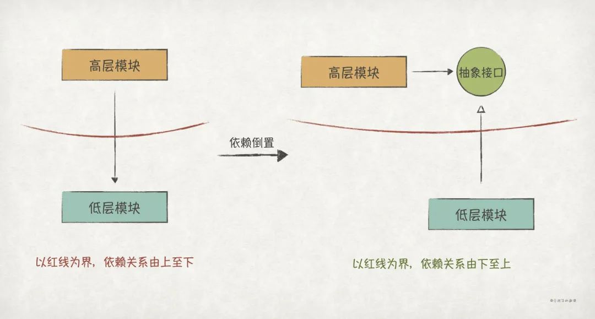

# 实践GoF的23种设计模式

## 前言

从1995年GoF提出23种**设计模式**到现在，25年过去了，设计模式依旧是软件领域的热门话题。设计模式通常被定义为：

> 设计模式（Design Pattern）是一套被反复使用、多数人知晓的、经过分类编目的、代码设计经验的总结，使用设计模式是为了可重用代码、让代码更容易被他人理解并且保证代码可靠性。

从定义上看，**设计模式其实是一种经验的总结，是针对特定问题的简洁而优雅的解决方案**。既然是经验总结，那么学习设计模式最直接的好处就在于可以站在巨人的肩膀上解决软件开发过程中的一些特定问题。

学习设计模式的最高境界是吃透它们本质思想，可以做到**即使已经忘掉某个设计模式的名称和结构，也能在解决特定问题时信手拈来**。

## SOLID原则

设计模式背后的本质思想，就是我们熟知的**SOLID原则**。如果把设计模式类比为武侠世界里的武功招式，那么SOLID原则就是内功内力。通常来说，先把内功练好，再来学习招式，会达到事半功倍的效果。因此，在介绍设计模式之前，很有必要先介绍一下SOLID原则。

本文首先会介绍本系列文章中用到的示例代码demo的整体结构，然后开始逐一介绍SOLID原则，也即单一职责原则、开闭原则、里氏替换原则、接口隔离原则和依赖倒置原则。

### 一个简单的分布式应用系统

> 本系列示例代码demo获取地址：https://github.com/ruanrunxue/Practice-Design-Pattern--Go-Implementation

示例代码demo工程实现了一个简单的分布式应用系统（单机版），该系统主要由以下几个模块组成：

- **网络 Network**，网络功能模块，模拟实现了报文转发、socket通信、http通信等功能。
- **数据库 Db**，数据库功能模块，模拟实现了表、事务、dsl等功能。
- **消息队列 Mq**，消息队列模块，模拟实现了基于topic的生产者/消费者的消息队列。
- **监控系统 Monitor**，监控系统模块，模拟实现了服务日志的收集、分析、存储等功能。
- **边车 Sidecar**，边车模块，模拟对网络报文进行拦截，实现access log上报、消息流控等功能。
- **服务 Service**，运行服务，当前模拟实现了服务注册中心、在线商城服务集群、服务消息中介等服务。


示例代码demo工程的主要目录结构如下：

```
├── db # 数据库模块，定义Db、Table、TableVisitor等抽象接口和实现
├── monitor # 监控系统模块，采用插件式的架构风格，当前实现access log日志etl功能
│   ├── config  # 监控系统插件配置模块
│   ├── filter # 过滤插件的实现定义
│   ├── input # 输入插件的实现定义
│   ├── output # 输出插件的实现定义
│   ├── pipeline # Pipeline插件的实现定义，一个pipeline表示一个ETL处理流程
│   ├── plugin # 插件抽象接口的定义，比如Plugin、Config等
│   └── model # 监控系统模型对象定义
├── mq # 消息队列模块
├── network  # 网络模块，模拟网络通信，定义了socket、packet等通用类型/接口 
│   └── http # 模拟实现了http通信等服务端、客户端能力
├── service # 服务模块，定义了服务的基本接口
│   ├── mediator # 服务消息中介，作为服务通信的中转方，实现了服务发现，消息转发的能力
│   ├── registry # 服务注册中心，提供服务注册、去注册、更新、 发现、订阅、去订阅、通知等功能
│   │   └── model # 服务注册/发现相关的模型定义
│   └── shopping # 模拟在线商城服务群的定义，包含订单服务、库存服务、支付服务、发货服务
└── sidecar # 边车模块，对socket进行拦截，提供http access log、流控功能
    └── flowctrl # 流控模块，基于消息速率进行随机流控
```

### SRP：单一职责原则

**单一职责原则**（The **S**ingle **R**esponsibility **P**rinciple，**SRP**）应该是SOLID原则中，最容易被理解的一个，但同时也是最容易被误解的一个。很多人会把“将大函数重构成一个个职责单一的小函数”这一重构手法等价为SRP，这是不对的，小函数固然体现了职责单一，但这并不是SRP。

SRP传播最广的定义应该是*Uncle Bob*给出的：

> A module should have one, and only one, reason to change.

也即，**一个模块应该有且只有一个导致其变化的原因**。

这个解释里有2个需要理解的地方：

***（1）如何定义一个模块***

我们通常会把一个源文件定义为最小粒度的模块。

***（2）如何找到这个原因***

一个软件的变化往往是为了满足某个用户的需求，那么这个**用户**就是导致变化的原因。但是，一个模块的用户/客户端程序往往不只一个，比如Java中的ArrayList类，它可能会被成千上万的程序使用，但我们不能说ArrayList职责不单一。因此，我们应该把“一个用户”改为“一类角色”，比如ArrayList的客户端程序都可以归类为“需要链表/数组功能”的角色。

于是，*Uncle Bob*给出了SRP的另一个解释：

> A module should be responsible to one, and only one, actor.

有了这个解释，我们就可以理解**函数职责单一并不等同于SRP**，比如在一个模块有A和B两个函数，它们都是职责单一的，但是函数A的使用者是A类用户，函数B的使用者是B类用户，而且A类用户和B类用户变化的原因都是不一样的，那么这个模块就不满足SRP了。

下面，以我们的分布式应用系统demo为例进一步探讨。对于`Registry`类（服务注册中心）来说，它对外提供的基本能力有服务注册、更新、去注册和发现功能，那么，我们可以这么实现：

```go
// Registry 服务注册中心
type Registry struct {
 db            db.Db
 server        *http.Server
 localIp       string
}

func (r *Registry) register(req *http.Request) *http.Response {...}
func (r *Registry) deregister(req *http.Request) *http.Response {...}
func (r *Registry) update(req *http.Request) *http.Response {...}
func (r *Registry) discovery(req *http.Request) *http.Response {...}

...
```

上述实现中，`Registry`包含了`register`、`update`、`deregister`、`discovery`等4个主要方法，正好对应了`Registry`对外提供的能力，看起来已经是职责单一了。

但是在仔细思考一下就会发现，服务注册、更新和去注册是给专门给**服务提供者**使用的功能，而服务发现则是专门给**服务消费者**使用的功能。**服务提供者和服务消费者是两类不同的角色，它们产生变化的时间和方向都可能不同**。比如：

> 当前服务发现功能是这么实现的：`Registry`从满足查询条件的所有`ServiceProfile`中挑选一个返回给服务消费者（也即`Registry`自己做了负载均衡）。
>
> 假设现在服务消费者提出**新的需求**：`Registry`把所有满足查询条件的`ServiceProfile`都返回，由服务消费者自己来做负载均衡。
>
> 为了实现这样的功能，我们就要修改`Registry`的代码。按理，服务注册、更新、去注册等功能并不应该受到影响，但因为它们和服务发现功能都在同一个模块（`Registry`）里，于是被迫也受到影响了，比如可能会代码冲突。

因此，更好的设计是将`register`、`update`、`deregister`内聚到一个**服务管理**模块`SvcManagement`，`discovery`则放到另一个**服务发现模块**`SvcDiscovery`，服务注册中心`Registry`再组合`svcManagement`和`svcDiscovery`。


具体实现如下：

```go
// demo/service/registry/svc_management.go
type svcManagement struct {
 db db.Db
 ...
}

func (s *svcManagement) register(req *http.Request) *http.Response {...}
func (s *svcManagement) deregister(req *http.Request) *http.Response {...}
func (s *svcManagement) update(req *http.Request) *http.Response {...}


// demo/service/registry/svc_discovery.go
type svcDiscovery struct {
 db db.Db
}

func (s *svcDiscovery) discovery(req *http.Request) *http.Response {...}

// demo/service/registry/registry.go
type Registry struct {
 db            db.Db
 server        *http.Server
 localIp       string
 svcManagement *svcManagement // 组合svcManagement
 svcDiscovery  *svcDiscovery // 组合svcDiscovery
}

func (r *Registry) Run() error {
  ...
  // 调用svcManagement和svcDiscovery完成服务
 return r.server.Put("/api/v1/service-profile", r.svcManagement.register).
  Post("/api/v1/service-profile", r.svcManagement.update).
  Delete("/api/v1/service-profile", r.svcManagement.deregister).
  Get("/api/v1/service-profile", r.svcDiscovery.discovery).
  Put("/api/v1/subscription", r.svcManagement.subscribe).
  Delete("/api/v1/subscription", r.svcManagement.unsubscribe).
  Start()
}
```

除了重复的代码编译，违反SRP还会带来以下2个常见的问题：

1、**代码冲突**。程序员A修改了模块的A功能，而程序员B在不知情的情况下也在修改该模块的B功能（因为A功能和B功能面向不同的用户，完全可能由2位不同的程序员来维护），当他们同时提交修改时，代码冲突就会发生（修改了同一个源文件）。

2、**A功能的修改影响了B功能**。如果A功能和B功能都使用了模块里的一个公共函数C，现在A功能有新的需求需要修改函数C，那么如果修改人没有考虑到B功能，那么B功能的原有逻辑就会受到影响。

由此可见，违反SRP会导致软件的可维护性变得极差。但是，我们也**不能盲目地进行模块拆分，这样会导致代码过于碎片化**，同样也会提升软件的复杂性。比如，在前面的例子中，我们就没有必要再对服务管理模块进行拆分为服务注册模块、服务更新模块和服务去注册模块，一是因为它们面向的用户是一致的；二是在可预见的未来它们要么同时变化，要么都不变。

因此，我们可以得出这样的结论：

1. **如果一个模块面向的都是同一类用户（变化原因一致），那么就没必要进行拆分**。
2. **如果缺乏用户归类的判断，那么最好的拆分时机是变化发生时**。

SRP是聚合和拆分的一个平衡，**太过聚合会导致牵一发动全身，拆分过细又会提升复杂性**。要从用户的视角来把握拆分的度，把面向不同用户的功能拆分开。如果实在无法判断/预测，那就等变化发生时再拆分，避免过度的设计。

### OCP：开闭原则

开闭原则（The **O**pen-**C**lose **P**rinciple，**OCP**）中，“开”指的是对**扩展**开放，“闭”指的是对**修改**封闭，它的完整解释为：

> A software artifact should be open for extension but closed for modification.

通俗地讲就是，**一个软件系统应该具备良好的可扩展性，新增功能应当通过扩展的方式实现，而不是在已有的代码基础上修改**。

然而，从字面意思上看，OCP貌似又是自相矛盾的：想要给一个模块新增功能，但是又不能修改它。

*如何才能打破这个困境呢？*关键是**抽象**！优秀的软件系统总是建立在良好的抽象的基础上，抽象化可以降低软件系统的复杂性。

*那么什么是抽象呢？*抽象不仅存在于软件领域，在我们的生活中也随处可见。下面以《语言学的邀请》中的一个例子来解释抽象的含义：

> 假设某农庄有一头叫“阿花”的母牛，那么：
>
> 1、当把它称为“**阿花**”时，我们看到的是它独一无二的一些特征：身上有很多斑点花纹、额头上还有一个闪电形状的伤疤。
>
> 2、当把它称为**母牛**时，我们忽略了它的独有特征，看到的是它与母牛“阿黑”，母牛“阿黄”的共同点：是一头牛、雌性的。
>
> 3、当把它称为**家畜**时，我们又忽略了它作为母牛的特征，而是看到了它和猪、鸡、羊一样的特点：是一个动物，在农庄里圈养。
>
> 4、当把它称为**农庄财产**时，我们只关注了它和农庄上其他可售对象的共同点：可以卖钱、转让。
>
> 从“阿花”，到母牛，到家畜，再到农庄财产，这就是一个不断抽象化的过程。

从上述例子中，我们可以得出这样的结论：

1. **抽象就是不断忽略细节，找到事物间共同点的过程**。
2. **抽象是分层的，抽象层次越高，细节也就越少**。

再回到软件领域，我们也可以把上述的例子类比到**数据库**上，数据库的抽象层次从低至高可以是这样的：`MySQL 8.0版本 -> MySQL -> 关系型数据库 -> 数据库`。现在假设有一个需求，需要业务模块将业务数据保存到数据库上，那么就有以下几种设计方案：

- 方案一：把业务模块设计为直接依赖**MySQL 8.0版本**。因为版本总是经常变化的，如果哪天MySQL升级了版本，那么我们就得修改业务模块进行适配，所以方案一违反了OCP。
- 方案二：把业务模块设计为依赖**MySQL**。相比于方案一，方案二消除了MySQL版本升级带来的影响。现在考虑另一种场景，如果因为某些原因公司禁止使用MySQL，必须切换到PostgreSQL，这时我们还是得修改业务模块进行数据库的切换适配。因此，在这种场景下，方案二也违反了OCP。
- 方案三：把业务模块设计为依赖**关系型数据库**。到了这个方案，我们基本消除了关系型数据库切换的影响，可以随时在MySQL、PostgreSQL、Oracle等关系型数据库上进行切换，而无须修改业务模块。但是，熟悉业务的你预测未来随着用户量的迅速上涨，关系型数据库很有可能无法满足高并发写的业务场景，于是就有了下面的最终方案。
- 方案四：把业务模块设计为依赖**数据库**。这样，不管以后使用MySQL还是PostgreSQL，关系型数据库还是非关系型数据库，业务模块都不需要再改动。到这里，我们基本可以认为业务模块是稳定的，不会受到底层数据库变化带来的影响，满足了OCP。

我们可以发现，上述方案的演进过程，就是我们不断对业务依赖的数据库模块进行抽象的过程，最终设计出稳定的、服务OCP的软件。

那么，在编程语言中，我们用什么来表示“数据库”这一抽象呢？是**接口**！

数据库最常见的几个操作就是CRUD，因此我们可以设计这么一个Db接口来表示“数据库”：

```go
type Db interface {
    Query(tableName string, cond Condition) (*Record, error)
    Insert(tableName string, record *Record) error
    Update(tableName string, record *Record) error
    Delete(tableName string, record *Record) error
}
```

这样，业务模块和数据库模块之间的依赖关系就变成如下图所示：


满足OCP的另一个关键点就是**分离变化**，只有先把变化点识别分离出来，我们才能对它进行抽象化。下面以我们的分布式应用系统demo为例，解释如何实现变化点的分离和抽象。

在demo中，监控系统主要负责对服务的access log进行ETL操作，也即涉及如下3个操作：1）从消息队列中获取日志数据；2）对数据进行加工；3）将加工后的数据存储在数据库上。

我们把整一个日志数据的处理流程称为pipeline，那么我们可以这么实现：

```go
type Pipeline struct {
    mq Mq
    db Db 
    ...
}

func (p *Pipeline) Run() {
 for atomic.LoadUint32(&p.isClose) != 1 {
    // 1、从消息队列中获取数据
    msg := p.mq.Consume("monitor.topic")
    log := msg.Payload()
    
    // 2、对数据进行字段提取操作
    matches := p.pattern.FindStringSubmatch(log)
   if len(matches) != 3 {
    return event
   }
   record := model.NewMonitoryRecord()
   record.Endpoint = matches[1]
   record.Type = model.Type(matches[2])
    
    // 3.存储到数据库上
    p.db.Insert("logs_table", record.Id, record)
    ...
 }
}
```

现在考虑新上线一个服务，但是这个服务不支持对接消息队列了，只支持socket传输数据，于是我们得在`Pipeline`上新增一个`InputType`来判断是否使用socket输入源：

```go
func (p *Pipeline) Run() {
 for atomic.LoadUint32(&p.isClose) != 1 {
    if inputType == input.MqType {
        // 从消息队列中获取数据
        msg := p.mq.Consume("monitor.topic")
        log := msg.Payload()
    } else {
      // 使用socket为消息来源
      packet := socket.Receice()
      log := packet.PayLoad().(string)
    }
    ...
 }
}
```

过一段时间，有需求需要给access log打上一个时间戳，方便后续的日志分析，于是我们需要修改`Pipeline`的数据加工逻辑：

```go
func (p *Pipeline) Run() {
 for atomic.LoadUint32(&p.isClose) != 1 {
    ...
    // 对数据进行字段提取操作
    matches := p.pattern.FindStringSubmatch(log)
   if len(matches) != 3 {
    return event
   }
   record := model.NewMonitoryRecord()
   record.Endpoint = matches[1]
   record.Type = model.Type(matches[2])
    // 新增一个时间戳字段
    record.Timestamp = time.Now().Unix()
    ...
 }
}
```

很快，又有一个需求，需要将加工后的数据存储到ES上，方便后续的日志检索，于是我们再次修改了`Pipeline`的数据存储逻辑：

```go
func (p *Pipeline) Run() {
 for atomic.LoadUint32(&p.isClose) != 1 {
    ...
    if outputType == output.Db {
        // 存储到ES上
        p.db.Insert("logs_table", record.Id, record)
    } else {
        // 存储到ES上
        p.es.Store(record.Id, record)
    }
    ...
 }
}
```

在上述的pipeline例子中，每次新增需求都需要修改`Pipeline`模块，明显违反了OCP。下面，我们来对它进行优化，使它满足OCP。

第一步是**分离变化点**，根据pipeline的业务处理逻辑，我们可以发现3个独立的变化点，数据的获取、加工和存储。第二步，我们对这3个变化点进行抽象，设计出以下3个抽象接口：

```go
// demo/monitor/input/input_plugin.go
// 数据获取抽象接口
type InputPlugin interface {
 plugin.Plugin
 Input() (*plugin.Event, error)
}

// demo/monitor/filter/filter_plugin.go
// 数据加工抽象接口
type FilterPlugin interface {
 plugin.Plugin
 Filter(event *plugin.Event) *plugin.Event
}

// demo/monitor/output/output_plugin.go
// 数据存储抽象接口
type OutputPlugin interface {
 plugin.Plugin
 Output(event *plugin.Event) error
}
```

最后，`Pipeline`的实现如下，只依赖于`InputPlugin`、`FilterPlugin`和`OutputPlugin`三个抽象接口。后续再有需求变更，只需扩展对应的接口即可，`Pipeline`无须再变更：

```go
// demo/monitor/pipeline/pipeline_plugin.go
// ETL流程定义
type pipelineTemplate struct {
 input   input.Plugin
 filter  filter.Plugin
 output  output.Plugin
  ...
}

func (p *pipelineTemplate) doRun() {
  ...
 for atomic.LoadUint32(&p.isClose) != 1 {
  event, err := p.input.Input()
  event = p.filter.Filter(event)
  p.output.Output(event)
 }
  ...
}
```


**OCP是软件设计的终极目标**，我们都希望能设计出可以新增功能却不用动老代码的软件。但是100%的对修改封闭肯定是做不到的，另外，遵循OCP的代价也是巨大的。它需要软件设计人员能够根据具体的业务场景识别出那些最有可能变化的点，然后分离出去，抽象成稳定的接口。这要求设计人员必须具备丰富的实战经验，以及非常熟悉该领域的业务场景。否则，**盲目地分离变化点、过度地抽象，都会导致软件系统变得更加复杂**。

### LSP：里氏替换原则

上一节介绍中，OCP的一个关键点就是**抽象**，而如何判断一个抽象是否合理，这是**里氏替换原则**（The **L**iskov **S**ubstitution **P**rinciple，**LSP**）需要回答的问题。

LSP的最初定义如下：

> If for each object o1 of type S there is an object o2 of type T such that for all programs P defined in terms of T, the behavior of P is unchanged when o1 is substituted for o2 then S is a subtype of T.

简单地讲就是，**子类型必须能够替换掉它们的基类型**，也即基类中的所有性质，在子类中仍能成立。一个简单的例子：假设有一个函数f，它的入参类型是基类B。同时，基类B有一个派生类D，如果把D的实例传递给函数f，那么函数f的行为功能应该是不变的。

由此可以看出，违反LSP的后果很严重，会导致程序出现不在预期之内的行为错误。最典型的就是正方形继承自长方形的例子。

> 长方形和正方形例子的详细介绍，请参考[【Java实现】实践GoF的23种设计模式：SOLID原则](https://mp.weixin.qq.com/s?__biz=Mzg3MjAyNjUyMQ==&mid=2247484264&idx=1&sn=84f7a075d910975c1e0e2d0c08397ae0&scene=21#wechat_redirect) 中的“LSP：里氏替换原则”一节

出现违反LSP的设计，主要原因还是我们**孤立地进行模型设计**，没有从客户端程序的角度来审视该设计是否正确。我们孤立地认为在数学上成立的关系（正方形 IS-A 矩形），在程序中也一定成立，而忽略了客户端程序的使用方法。

该例子告诉我们：**一个模型的正确性或有效性，只能通过客户端程序来体现**。

下面，我们总结一下在继承体系（IS-A）下，要想设计出符合LSP的模型所需要遵循的一些约束：

1. **基类应该设计为一个抽象类**（不能直接实例化，只能被继承）。
2. **子类应该实现基类的抽象接口，而不是重写基类已经实现的具体方法**。
3. **子类可以新增功能，但不能改变基类的功能**。
4. **子类不能新增约束**，包括抛出基类没有声明的异常。

前面的矩形和正方形的例子中，几乎把这些约束都打破了，从而导致了程序的异常行为：1）`Square`的基类`Rectangle`不是一个抽象类，打破`约束1`；2）`Square`重写了基类的`setWidth`和`setLength`方法，打破`约束2`；3）`Square`新增了`Rectangle`没有的约束，长宽相等，打破`约束4`。

**因为Go天然就不支持继承，实现多态只能通过接口的方式**，所以，对Go语言来说，上述的`约束1～3`其实已经满足了：1）接口本身不具备实例化能力，满足`约束1`；2）接口没有具体的实现方法，也就不会被重写，满足`约束2`；3）接口本身只定义了行为契约，并没有实际的功能，因此也不会被改变，满足`约束3`。

虽然Go语言中使用接口替代继承来实现多态和抽象，能够减少很多不经意的错误。但是面向接口设计仍然需要遵循`约束4`，下面我们以分布式应用系统demo为例，介绍一个比较隐晦地打破`约束4`，从而违反了LSP的实现。

还是以监控系统为例，为例实现ETL流程的灵活配置，我们需要通过配置文件定义pipeline的流程功能（数据从哪获取、需要经过哪些加工、加工后存储到哪里）。当前需要支持json和yaml两种配置文件格式，以yaml配置为例，配置内容是这样的：

```yaml
# src/main/resources/pipelines/pipeline_0.yaml
name: pipeline_0 # pipeline名称
type: single_thread # pipeline类型
input: # input插件定义（数据从哪里来）
  name: input_0 # input插件名称
  type: memory_mq # input插件类型
  context: # input插件的初始化上下文
    topic: access_log.topic
filter: # filter插件定义（需要经过哪些加工）
  - name: filter_0 # 加工流程filter_0定义，类型为log_to_json
    type: log_to_json
  - name: filter_1 # 加工流程filter_1定义，类型为add_timestamp
    type: add_timestamp
  - name: filter_2 # 加工流程filter_2定义，类型为json_to_monitor_event
    type: json_to_monitor_event
output: # output插件定义（加工后存储到哪里）
  name: output_0 # output插件名称
  type: memory_db # output插件类型
  context: # output插件的初始化上下文
    tableName: monitor_event_0
```

首先我们定义一个`Config`接口来表示“配置”这一抽象:

```go
// demo/monitor/plugin/plugin.go
packet plugin
// Config 插件配置抽象接口
type Config interface {
 Load(conf string) error
}
```

另外，上述配置中的`input`、`filter`、`output`子项，可以认为是`input.Plugin`、`filter.Plugin`、`output.Plugin`插件的配置项，由`Pipeline`插件的配置项组合在一起，因此我们定义了如下几个`Config`的实现类：

```go
// demo/monitor/config/config.go
package config

type item struct {
 Name       string         `json:"name" yaml:"name"`
 PluginType string         `json:"type" yaml:"type"`
 Ctx        plugin.Context `json:"context" yaml:"context"`
 loadConf   func(conf string, item interface{}) error // 区分yaml和json的加载方式
}

// 输入插件配置
type Input item
func (i *Input) Load(conf string) error {
 return i.loadConf(conf, i)
}

// 过滤插件配置
type Filter item
func (f *Filter) Load(conf string) error {
 return f.loadConf(conf, f)
}

// 输出插件配置
type Output item
func (o *Output) Load(conf string) error {
 return o.loadConf(conf, o)
}

// Pipeline插件配置
type Pipeline struct {
 item    `yaml:",inline"` // yaml嵌套时需要加上,inline
 Input   Input            `json:"input" yaml:"input"`
 Filters []Filter         `json:"filters" yaml:"filters,flow"`
 Output  Output           `json:"output" yaml:"output"`
}
func (p *Pipeline) Load(conf string) error {
 return p.loadConf(conf, p)
}
```

因为涉及到从配置到对象的实例化过程，自然会想到使用***工厂方法模式***来创建对象。另外因为`pipeline.Pipeline`、`input.Plugin`、`filter.Plugin`和`output.Plugin`都实现了`Plugin`接口，我们也很容易想到定义一个`PluginFactory`接口来表示“插件工厂”这一抽象，具体的插件工厂再实现该接口：

```go
// 插件工厂接口，根据配置实例化插件
type PluginFactory interface {
    Create(config plugin.Config) plugin.Plugin
}

// input插件工厂
type InputPluginFactory struct {}
func (i *InputPluginFactory) Create(config plugin.Config) plugin.Plugin {
    conf := config.(*config.Input)
    ... // input插件实例化过程
}
// filter插件工厂
type FilterPluginFactory struct {}
func (f *FilterPluginFactory) Create(config plugin.Config) plugin.Plugin {
    conf := config.(*config.Filter)
    ... // filter插件实例化过程
}

// output插件工厂
type OutputPluginFactory struct {}
func (o *OutputPluginFactory) Create(config plugin.Config) plugin.Plugin {
    conf := config.(*config.Output)
    ... // output插件实例化过程
}

// pipeline插件工厂
type PipelinePluginFactory struct {}
func (p *PipelinePluginFactory) Create(config plugin.Config) plugin.Plugin {
    conf := config.(*config.Pipeline)
    ... // pipeline插件实例化过程
}
```

最后，通过`PipelineFactory`来创建`Pipline`对象：

```go
conf := &config.Pipeline{...}
pipeline := NewPipelinePluginFactory().Create(conf)
...
```

到目前为止，上述的设计看起来是合理的，运行也没有问题。

但是，细心的读者可能会发现，每个插件工厂子类的`Create`方法的第一行代码都是一个转型语句，比如`PipelineFactory`的是`conf := config.(*config.Pipeline)`。所以，上一段代码能够正常运行的前提是：传入`PipelineFactory.Create`方法的入参必须是`*config.Pipeline` 。如果客户端程序传入`*config.Input`的实例，`PipelineFactory.Create`方法将会抛出转型失败的异常。

上述这个例子就是一个违反LSP的典型场景，虽然在约定好的前提下，程序可以运行正确，但是如果有客户端不小心破坏了这个约定，就会带来程序行为异常（我们永远无法预知客户端的所有行为）。

要纠正这个问题也很简单，就是去掉`PluginFactory`这一层抽象，让`PipelineFactory.Create`等工厂方法的入参声明为具体的配置类，比如`PipelineFactory`可以这么实现：

```go
// pipeline插件工厂
type PipelinePluginFactory struct {}
func (p *PipelinePluginFactory) Create(config *config.Pipeline) plugin.Plugin {
    ... // pipeline插件实例化过程
}
```


从上述几个例子中，我们可以看出遵循LSP的重要性，而设计出符合LSP的软件的要点就是，**根据该软件的使用者行为作出的合理假设，以此来审视它是否具备有效性和正确性**。

### ISP：接口隔离原则

**接口隔离原则**（The **I**nterface **S**egregation **P**rinciple，**ISP**）是关于接口设计的一项原则，这里的“接口”并不单指Java或Go上使用interface声明的狭义接口，而是包含了狭义接口、抽象类、具象类等在内的广义接口。它的定义如下：

> Client should not be forced to depend on methods it does not use.

也即，**一个模块不应该强迫客户程序依赖它们不想使用的接口**，模块间的关系应该建立在最小的接口集上。

下面，我们通过一个例子来详细介绍ISP。


上图中，`Client1`、`Client2`、`Client3`都依赖了`Class1`，但实际上，`Client1`只需使用`Class1.func1`方法，`Client2`只需使用`Class1.func2`，`Client3`只需使用`Class1.func3`，那么这时候我们就可以说该设计违反了ISP。

违反ISP主要会带来如下2个问题：

1. **增加模块与客户端程序的依赖**，比如在上述例子中，虽然`Client2`和`Client3`都没有调用`func1`，但是当`Class1`修改`func1`还是必须通知`Client1～3`，因为`Class1`并不知道它们是否使用了`func1`。
2. **产生接口污染**，假设开发`Client1`的程序员，在写代码时不小心把`func1`打成了`func2`，那么就会带来`Client1`的行为异常。也即`Client1`被`func2`给污染了。

为了解决上述2个问题，我们可以把`func1`、`func2`、`func3`通过接口隔离开：


接口隔离之后，`Client1`只依赖了`Interface1`，而`Interface1`上只有`func1`一个方法，也即`Client1`不会受到`func2`和`func3`的污染；另外，当`Class1`修改`func1`之后，它只需通知依赖了`Interface1`的客户端即可，大大降低了模块间耦合。

实现ISP的关键是**将大接口拆分成小接口**，而拆分的关键就是**接口粒度的把握**。想要拆分得好，就要求接口设计人员对业务场景非常熟悉，对接口使用的场景了如指掌。否则孤立地设计接口，很难满足ISP。

下面，我们以分布式应用系统demo为例，来进一步介绍ISP的实现。

一个消息队列模块通常包含生产（produce）和消费（consumer）两种行为，因此我们设计了`Mq`消息队列抽象接口，包含`Produce`和`Consume`两个方法：

```go
// Mq 消息队列接口
type Mq interface {
 Consume(topic Topic) (*Message, error)
 Produce(message *Message) error
}

// 当前提供MemoryMq内存消息队列的实现
type MemoryMq struct {...}
func (m *memoryMq) Consume(topic Topic) (*Message, error) {...}
func (m *memoryMq) Produce(message *Message) error {...}
```

当前demo中使用接口的模块有2个，分别是作为消费者的`MemoryMqInput`和作为生产者的`AccessLogSidecar`：

```go
type MemoryMqInput struct {
 topic    mq.Topic
 consumer mq.Mq // 同时依赖了Consume和Produce
}

type AccessLogSidecar struct {
 socket   network.Socket
 producer mq.Mq // 同时依赖了Consume和Produce
 topic    mq.Topic
}
```

**从领域模型上看**，`Mq`接口的设计确实没有问题，它就应该包含`consume`和`produce`两个方法。但是**从客户端程序的角度上看**，它却违反了ISP，对`MemoryMqInput`来说，它只需要`consume`方法；对`AccessLogSidecar`来说，它只需要`produce`方法。

一种设计方案是把`Mq`接口拆分成2个子接口`Consumable`和`Producible`，让`MemoryMq`直接实现`Consumable`和`Producible`：

```go
// Consumable 消费接口，从消息队列中消费数据
type Consumable interface {
 Consume(topic Topic) (*Message, error)
}

// Producible 生产接口，向消息队列生产消费数据
type Producible interface {
 Produce(message *Message) error
}
```

仔细思考一下，就会发现上面的设计不太符合消息队列的领域模型，因为`Mq`的这个抽象确实应该存在的。

更好的设计应该是保留`Mq`抽象接口，让`Mq`继承自`Consumable`和`Producible`，这样的**分层设计**之后，既能满足ISP，又能让实现符合消息队列的领域模型：


具体实现如下：

```go
// Mq 消息队列接口，继承了Consumable和Producible，同时又consume和produce两种行为
type Mq interface {
 Consumable
 Producible
}

type MemoryMqInput struct {
 topic    mq.Topic
 consumer mq.Consumable // 只依赖Consumable
}

type AccessLogSidecar struct {
 socket   network.Socket
 producer mq.Producible // 只依赖Producible
 topic    mq.Topic
}
```

接口隔离可以减少模块间耦合，提升系统稳定性，但是**过度地细化和拆分接口，也会导致系统的接口数量的上涨，从而产生更大的维护成本**。接口的粒度需要根据具体的业务场景来定，可以参考单一职责原则，**将那些为同一类客户端程序提供服务的接口合并在一起**。

### DIP：依赖倒置原则

《Clean Architecture》中介绍OCP时有提过：**如果要模块A免于模块B变化的影响，那么就要模块B依赖于模块A**。这句话貌似是矛盾的，模块A需要使用模块B的功能，怎么会让模块B反过来依赖模块A呢？这就是**依赖倒置原则**（The **D**ependency **I**nversion **P**rinciple，**DIP**）所要解答的问题。

DIP的定义如下：

> 1. High-level modules should not import anything from low-level modules. Both should depend on abstractions.
> 2. Abstractions should not depend on details. Details (concrete implementations) should depend on abstractions.

翻译过来，就是：

> 1、高层模块不应该依赖低层模块，两者都应该依赖抽象
>
> 2、抽象不应该依赖细节，细节应该依赖抽象

在DIP的定义里，出现了**高层模块**、**低层模块**、**抽象**、**细节**等4个关键字，要弄清楚DIP的含义，理解这4个关键字至关重要。

***（1）高层模块和低层模块***

一般地，我们认为**高层模块是包含了应用程序核心业务逻辑、策略的模块**，是整个应用程序的灵魂所在；**低层模块通常是一些基础设施**，比如数据库、Web框架等，它们主要为了辅助高层模块完成业务而存在。

***（2）抽象和细节***

在前文“OCP：开闭原则”一节中，我们可以知道，**抽象就是众多细节中的共同点**，抽象就是不断忽略细节的出来的。

现在再来看DIP的定义，对于第2点我们不难理解，从抽象的定义来看，抽象是不会依赖细节的，否则那就不是抽象了；而细节依赖抽象往往都是成立的。

**理解DIP的关键在于第1点**，按照我们正向的思维，高层模块要借助低层模块来完成业务，这必然会导致高层模块依赖低层模块。但是在软件领域里，我们可以把这个依赖关系**倒置**过来，这其中的关键就是**抽象**。我们可以忽略掉低层模块的细节，抽象出一个稳定的接口，然后让高层模块依赖该接口，同时让低层模块实现该接口，从而实现了依赖关系的倒置：



之所以要把高层模块和底层模块的依赖关系倒置过来，主要是因为作为核心的高层模块不应该受到低层模块变化的影响。**高层模块的变化原因应当只能有一个，那就是来自软件用户的业务变更需求**。

下面，我们通过分布式应用系统demo来介绍DIP的实现。

对于服务注册中心`Registry`来说，当有新的服务注册上来时，它需要把服务信息（如服务ID、服务类型等）保存下来，以便在后续的服务发现中能够返回给客户端。因此，`Registry`需要一个数据库来辅助它完成业务。刚好，我们的数据库模块实现了一个内存数据库`MemoryDb`，于是我们可以这么实现`Registry`：

```go
type Registry struct {
 db            db.MemoryDb // 直接依赖MemoryDb
 server        *http.Server
 localIp       string
 svcManagement *svcManagement
 svcDiscovery  *svcDiscovery
}
```

按照上面的设计，模块间的依赖关系是`Registry`依赖于`MemoryDb`，也即高层模块依赖于低层模块。这种依赖关系是脆弱的，如果哪天需要把存储服务信息的数据库从`MemoryDb`改成`DiskDb`，那么我们也得改`Registry`的代码：

```go
type Registry struct {
 db            db.DiskDb // 改成依赖DiskDb
 server        *http.Server
 localIp       string
 svcManagement *svcManagement
 svcDiscovery  *svcDiscovery
}
```

更好的设计应该是把`Registry`和`MemoryDb`的依赖关系倒置过来，首先我们需要从细节`MemoryDb`抽象出一个稳定的接口`Db`：

```go
// Db 数据库抽象接口
type Db interface {
 Query(tableName string, primaryKey interface{}, result interface{}) error
 Insert(tableName string, primaryKey interface{}, record interface{}) error
 Update(tableName string, primaryKey interface{}, record interface{}) error
 Delete(tableName string, primaryKey interface{}) error
 ...
}
```

接着，我们让`Registry`依赖`Db`接口，而`MemoryDb`实现`Db`接口，以此来完成依赖倒置：

```go
type Registry struct {
 db            db.Db // 依赖Db抽象接口
 server        *http.Server
 localIp       string
 svcManagement *svcManagement
 svcDiscovery  *svcDiscovery
}

// MemoryDb 实现Db接口
type MemoryDb struct {
 tables sync.Map // key为tableName，value为table
}
func (m *memoryDb) Query(tableName string, primaryKey interface{}, result interface{}) error {...}
func (m *memoryDb) Insert(tableName string, primaryKey interface{}, record interface{}) error {...}
func (m *memoryDb) Update(tableName string, primaryKey interface{}, record interface{}) error {...}
func (m *memoryDb) Delete(tableName string, primaryKey interface{}) error {...}
```

当高层模块依赖抽象接口时，总得在某个时候，某个地方把实现细节（低层模块）**注入**到高层模块上。在上述例子中，我们选择在main函数上，在创建`Registry`对象时，把`MemoryDb`注入进去。


一般地，我们都会在main/启动函数上完成依赖注入，常见的注入的方式有以下几种：

- 构造函数注入（`Registry`所使用的方法）
- setter方法注入
- 提供依赖注入的接口，客户端直调用该接口即可
- 通过框架进行注入，比如Spring框架中的注解注入能力

另外，DIP不仅仅适用于模块/类/接口设计，在架构层面也同样适用，比如DDD的分层架构和Uncle Bob的整洁架构，都是运用了DIP：


当然，DIP并不是说高层模块是只能依赖抽象接口，它的本意应该是依赖**稳定**的接口/抽象类/具象类。如果一个具象类是稳定的，比如Java中的`String`，那么高层模块依赖它也没有问题；相反，如果一个抽象接口是不稳定的，经常变化，那么高层模块依赖该接口也是违反DIP的，这时候应该思考下接口是否抽象合理。

### 最后

本文花了很长的篇幅讨论了23种设计模式背后的核心思想 —— **SOLID原则**，它能指导我们设计出高内聚、低耦合的软件系统。但是它毕竟只是**原则**，如何落地到实际的工程项目上，还是需要参考成功的实践经验。而这些实践经验正是接下来我们要探讨的**设计模式**。

学习设计模式最好的方法就是**实践**，在《实践GoF的23种设计模式》后续的文章，我们将以本文介绍的分布式应用系统demo作为实践示范，介绍23种设计模式的程序结构、适用场景、实现方法、优缺点等，让大家对设计模式有个更深入的理解，能够**用对**、**不滥用**设计模式。

> **参考**
>
> 1. Clean Architecture, Robert C. Martin (“Uncle Bob”)
> 2. 敏捷软件开发：原则、模式与实践, Robert C. Martin (“Uncle Bob”)
> 3. [使用Go实现GoF的23种设计模式](https://mp.weixin.qq.com/mp/appmsgalbum?__biz=Mzg3MjAyNjUyMQ==&action=getalbum&album_id=2280784755992526856#wechat_redirect), 元闰子
> 4. [【Java实现】实践GoF的23种设计模式：SOLID原则](https://mp.weixin.qq.com/s?__biz=Mzg3MjAyNjUyMQ==&mid=2247484264&idx=1&sn=84f7a075d910975c1e0e2d0c08397ae0&scene=21#wechat_redirect) , 元闰子
> 5. SOLID原则精解之里氏替换原则LSP, 人民副首席码仔

## 单例模式

### 简述

GoF 对单例模式（Singleton）的定义如下：

> Ensure a class only has one instance, and provide a global point of access to it.

也即，**保证一个类只有一个实例，并且为它提供一个全局访问点**。

在程序设计中，有些对象通常只需要一个共享的实例，比如线程池、全局缓存、对象池等。实现共享实例最简单直接的方式就是**全局变量**。但是，使用全局变量会带来一些问题，比如：

1. 客户端程序可以创建同类实例，从而无法保证在整系统上只有一个共享实例。
2. 难以控制对象的访问，比如想增加一个“访问次数统计”的功能就很难，可扩展性较低。
3. 把实现细节暴露给客户端程序，加深了耦合，容易产生霰弹式修改。

对这种全局唯一的场景，更好的是使用单例模式去实现。**单例模式能够限制客户端程序创建同类实例，并且可以在全局访问点上扩展或修改功能，而不影响客户端程序**。

但是，并非所有的**全局唯一**都适用单例模式。比如下面这种场景：

> 考虑需要统计一个API调用的情况，有两个指标，成功调用次数和失败调用次数。这两个指标都是全局唯一的，所以有人可能会将其建模成两个单例SuccessApiMetric和FailApiMetric。按照这个思路，随着指标数量的增多，你会发现代码里类的定义会越来越多，也越来越臃肿。这也是单例模式最常见的误用场景，更好的方法是将两个指标设计成一个对象ApiMetric下的两个实例ApiMetic success和ApiMetic fail。

那么，如何判断一个对象是否应该被建模成单例？通常，被建模成单例的对象都有“**中心点**”的含义，比如线程池就是管理所有线程的中心。所以，**在判断一个对象是否适合单例模式时，先思考下，是一个中心点吗**？

### UML结构


### 代码实现

根据单例模式的定义，实现的关键点有两个：

1. **限制调用者直接实例化该对象**；
2. **为该对象的单例提供一个全局唯一的访问方法**。

对于 C++ / Java 而言，只需把对象的构造函数设计成私有的，并提供一个 static 方法去访问该对象的唯一实例即可。但 Go 语言并没有构造函数的概念，也没有 static 方法，所以需要另寻出路。

我们可以利用 Go 语言 package 的访问规则来实现，将单例对象设计成首字母小写，这样就能限定它的访问范围只在当前`package`下，模拟了 C++ / Java 的私有构造函数；然后，在当前 package 下实现一个首字母大写的访问函数，也就相当于 static 方法的作用了。

#### 示例

在简单的分布式应用系统（示例代码工程）中，我们定义了一个网络模块 network，模拟实现了网络报文转发功能。network 的设计也很简单，通过一个哈希表维持了 `Endpoint` 到 `Socket` 的映射，报文转发时，通过 `Endpoint` 寻址到 `Socket`，再调用 `Socket` 的 `Receive` 方法完成转发。


因为整系统只需一个 network 对象，而且它在领域模型中具有**中心点**的语义，所以我们很自然地使用单例模式来实现它。单例模式大致可以分成两类，“饿汉模式”和“懒汉模式”。前者是在系统初始化期间就完成了单例对象的实例化；后者则是在调用时才进行延迟实例化，从而一定程度上节省了内存。

#### “饿汉模式”实现

```go
// demo/network/network.go
package network

// 1、设计为小写字母开头，表示只在network包内可见，限制客户端程序的实例化
type network struct {
 sockets sync.Mapvar instancevar instance
}

// 2、定义一个包内可见的实例对象，也即单例
var instance = &network{sockets: sync.Map{}}

// 3、定义一个全局可见的唯一访问方法
func Instance() *network {
 return instance
}

func (n *network) Listen(endpoint Endpoint, socket Socket) error {
 if _, ok := n.sockets.Load(endpoint); ok {
  return ErrEndpointAlreadyListened
 }
 n.sockets.Store(endpoint, socket)
 return nil
}

func (n *network) Send(packet *Packet) error {
 record, rOk := n.sockets.Load(packet.Dest())
 socket, sOk := record.(Socket)
 if !rOk || !sOk {
  return ErrConnectionRefuse
 }
 go socket.Receive(packet)
 return nil
}
```

那么，客户端就可以通过 `network.Instance()` 引用该单例了：

```go
// demo/sidecar/flowctrl_sidecar.go
package sidecar

type FlowCtrlSidecar struct {...}

// 通过 network.Instance() 直接引用单例
func (f *FlowCtrlSidecar) Listen(endpoint network.Endpoint) error {
 return network.Instance().Listen(endpoint, f)
}
...
```

#### “懒汉模式”实现

众所周知，“懒汉模式”会带来线程安全问题，可以通过**普通加锁**，或者更高效的**双重检验加锁**来优化。不管是哪种方法，都是为了**保证单例只会被初始化一次**。

```go
type network struct {...}

// 单例
var instance *network
// 定义互斥锁
var mutex = sync.Mutex{}

// 普通加锁，缺点是每次调用 Instance() 都需要加锁
func Instance() *network {
 mutex.Lock()
 if instance == nil {
  instance = &network{sockets: sync.Map{}}
 }
 mutex.Unlock()
 return instance
}

// 双重检验后加锁，实例化后无需加锁
func Instance() *network {
 if instance == nil {
        mutex.Lock()
        if instance == nil {
           instance = &network{sockets: sync.Map{}}
        }
        mutex.Unlock()
 }
 return instance
}
```

对于“懒汉模式”，Go 语言还有一个更优雅的实现方式，那就是利用 sync.Once。它有一个 Do 方法，方法声明为 `func (o *Once) Do(f func())`，其中入参是 `func()` 的方法类型，Go 会保证该方法仅会被调用一次。利用这个特性，我们就能够实现单例只被初始化一次了。

```go
type network struct {...}
// 单例
var instance *network
// 定义 once 对象
var once = sync.Once{}

// 通过once对象确保instance只被初始化一次
func Instance() *network {
 once.Do(func() {
        // 只会被调用一次
  instance = &network{sockets: sync.Map{}}
 })
 return instance
}
```

### 扩展

#### 提供多个实例

虽然单例模式从定义上表示每个对象只能有一个实例，但是我们不应该被该定义限制住，还得从模式本身的动机来去理解它。单例模式的一大动机是**限制客户端程序对对象进行实例化**，至于实例有多少个其实并不重要，根据具体场景来进行建模、设计即可。

比如在前面的 network 模块中，现在新增一个这样的需求，将网络拆分为互联网和局域网。那么，我们可以这么设计：

```go
type network struct {...}

// 定义互联网单例
var inetInstance = &network{sockets: sync.Map{}}
// 定义局域网单例
var lanInstance = &network{sockets: sync.Map{}}


// 定义互联网全局可见的唯一访问方法
func Internet() *network {
 return inetInstance
}
// 定义局域网全局可见的唯一访问方法
func Lan() *network {
 return lanInstance
}
```

虽然上述例子中，`network` 结构有两个实例，但是本质上还是单例模式，因为它做到了限制客户端实例化，以及为每个单例提供了全局唯一的访问方法。

#### 提供多种实现

单例模式也可以实现多态，如果你预测该单例未来可能会扩展，那么就可以将它设计成抽象的接口，**让客户端依赖抽象，这样，未来扩展时就无需改动客户端程序了**。

比如，我们可以 `network` 设计为一个抽象接口：

```go
// network 抽象接口
type network interface {
 Listen(endpoint Endpoint, socket Socket) error
 Send(packet *Packet) error
}

// network 的实现1
type networkImpl1 struct {
 sockets sync.Map
}
func (n *networkImpl1) Listen(endpoint Endpoint, socket Socket) error {...}
func (n *networkImpl1) Send(packet *Packet) error {...}

// networkImpl1 实现的单例
var instance = &networkImpl1{sockets: sync.Map{}}

// 定义全局可见的唯一访问方法，注意返回值时network抽象接口！
func Instance() network {
 return instance
}

// 客户端使用示例
func client() {
    packet := network.NewPacket(srcEndpoint, destEndpoint, payload)
    network.Instance().Send(packet)
}
```

如果未来需要新增一种 `networkImpl2` 实现，那么我们只需修改 `instance` 的初始化逻辑即可，客户端程序无需改动：

```go
// 新增network 的实现2
type networkImpl2 struct {...}
func (n *networkImpl2) Listen(endpoint Endpoint, socket Socket) error {...}
func (n *networkImpl2) Send(packet *Packet) error {...}

// 将单例 instance 修改为 networkImpl2 实现
var instance = &networkImpl2{...}

// 单例全局访问方法无需改动
func Instance() network {
 return instance
}

// 客户端使用也无需改动
func client() {
    packet := network.NewPacket(srcEndpoint, destEndpoint, payload)
    network.Instance().Send(packet)
}
```

有时候，我们还可能需要通过读取配置来决定使用哪种单例实现，那么，我们可以通过 `map` 来维护所有的实现，然后根据具体配置来选取对应的实现：

```go
// network 抽象接口
type network interface {
 Listen(endpoint Endpoint, socket Socket) error
 Send(packet *Packet) error
}

// network 具体实现
type networkImpl1 struct {...}
type networkImpl2 struct {...}
type networkImpl3 struct {...}
type networkImpl4 struct {...}

// 单例 map
var instances = make(map[string]network)

// 初始化所有的单例
func init() {
 instances["impl1"] = &networkImpl1{...}
 instances["impl2"] = &networkImpl2{...}
 instances["impl3"] = &networkImpl3{...}
 instances["impl4"] = &networkImpl4{...}
}

// 全局单例访问方法，通过读取配置决定使用哪种实现
func Instance() network {
    impl := readConf()
    instance, ok := instances[impl]
    if !ok {
        panic("instance not found")
    }
    return instance
}
```

### 典型应用场景

1. **日志**。每个服务通常都会需要一个全局的日志对象来记录本服务产生的日志。
2. **全局配置**。对于一些全局的配置，可以通过定义一个单例来供客户端使用。
3. **唯一序列号生成**。唯一序列号生成必然要求整系统只能有一个生成实例，非常合适使用单例模式。
4. **线程池、对象池、连接池等**。xxx池的本质就是**共享**，也是单例模式的常见场景。
5. **全局缓存**
6. ......

### 优缺点

#### 优点

在合适的场景，使用单例模式有如下的**优点**：

1. 整系统只有一个或几个实例，有效节省了内存和对象创建的开销。
2. 通过全局访问点，可以方便地扩展功能，比如新增加访问次数的统计。
3. 对客户端隐藏实现细节，可避免霰弹式修改。

#### 缺点

虽然单例模式相比全局变量有诸多的优点，但它本质上还是一个“全局变量”，还是避免不了全局变量的一些**缺点**：

1. **函数调用的隐式耦合**。通常我们都期望从函数的声明中就能知道该函数做了什么、依赖了什么、返回了什么。使用使用单例模式就意味着，无需通过函数传参，就能够在函数中使用该实例。也即将依赖/耦合隐式化了，不利于更好地理解代码。
2. **对测试不友好**。通常对一个方法/函数进行测试，我们并不需要知道它的具体实现。但如果方法/函数中有使用单例对象，我们就不得不考虑单例状态的变化了，也即需要考虑方法/函数的具体实现了。
3. **并发问题**。共享就意味着可能存在并发问题，我们不仅需要在初始化阶段考虑并发问题，在初始化后更是要时刻注意。因此，在高并发的场景，单例模式也可能存在锁冲突问题。

***单例模式虽然简单易用，但也是最容易被滥用的设计模式。它并不是“银弹”，在实际使用时，还需根据具体的业务场景谨慎使用。\***

### 与其他模式的关联

**工厂方法模式**、**抽象工厂模式**很多时候都会以单例模式来实现，因为**工厂类**通常是无状态的，而且全局只需一个实例即可，能够有效避免对象的频繁创建和销毁。

## 建造者模式

### 简述

在程序设计中，我们会经常遇到一些复杂的对象，其中有很多成员属性，甚至嵌套着多个复杂的对象。这种情况下，创建这个复杂对象就会变得很繁琐。对于 C++/Java 而言，最常见的表现就是构造函数有着长长的参数列表：

```go
MyObject obj = new MyObject(param1, param2, param3, param4, param5, param6, ...)
```

对于 Go 语言来说，最常见的表现就是多层的嵌套实例化：

```go
obj := &MyObject{
  Field1: &Field1 {
    Param1: &Param1 {
      Val: 0,
    },
    Param2: &Param2 {
      Val: 1,
    },
    ...
  },
  Field2: &Field2 {
    Param3: &Param3 {
      Val: 2,
    },
    ...
  },
  ...
}
```

上述的对象创建方法有两个明显的缺点：（1）**对使用者不友好**，使用者在创建对象时需要知道的细节太多；（2）**代码可读性很差**。

*针对这种对象成员较多，创建对象逻辑较为繁琐的场景，非常适合使用建造者模式来进行优化。*

建造者模式的作用有如下几个：

1、封装复杂对象的创建过程，使对象使用者不感知复杂的创建逻辑。
2、可以一步步按照顺序对成员进行赋值，或者创建嵌套对象，并最终完成目标对象的创建。
3、对多个对象复用同样的对象创建逻辑。
其中，第1和第2点比较常用，下面对建造者模式的实现也主要是针对这两点进行示例。

### UML 结构


### 代码实现

#### 示例

在简单的分布式应用系统（示例代码工程）中，我们定义了服务注册中心，提供服务注册、去注册、更新、 发现等功能。要实现这些功能，服务注册中心就必须保存服务的信息，我们把这些信息放在了 `ServiceProfile` 这个数据结构上，定义如下：

```go
// demo/service/registry/model/service_profile.go
// ServiceProfile 服务档案，其中服务ID唯一标识一个服务实例，一种服务类型可以有多个服务实例
type ServiceProfile struct {
    Id       string           // 服务ID
    Type     ServiceType      // 服务类型
    Status   ServiceStatus    // 服务状态
    Endpoint network.Endpoint // 服务Endpoint
    Region   *Region          // 服务所属region
    Priority int              // 服务优先级，范围0～100，值越低，优先级越高
    Load     int              // 服务负载，负载越高表示服务处理的业务压力越大
}

// demo/service/registry/model/region.go
// Region 值对象，每个服务都唯一属于一个Region
type Region struct {
 Id      string
 Name    string
 Country string
}

// demo/network/endpoint.go
// Endpoint 值对象，其中ip和port属性为不可变，如果需要变更，需要整对象替换
type Endpoint struct {
 ip   string
 port int
}
```

#### 实现

如果按照直接实例化方式应该是这样的：

```go
// 多层的嵌套实例化
profile := &ServiceProfile{
 Id:       "service1",
 Type:     "order",
 Status:   Normal,
 Endpoint: network.EndpointOf("192.168.0.1", 8080),
 Region: &Region{ // 需要知道对象的实现细节
  Id:      "region1",
  Name:    "beijing",
  Country: "China",
 },
 Priority: 1,
 Load:     100,
}
```

虽然 `ServiceProfile` 结构体嵌套的层次不多，但是从上述直接实例化的代码来看，确实存在**对使用者不友好**和**代码可读性较差**的缺点。比如，使用者必须先对 `Endpoint` 和 `Region` 进行实例化，这实际上是将 `ServiceProfile` 的实现细节暴露给使用者了。
下面我们引入建造者模式对代码进行优化重构：

```go
// demo/service/registry/model/service_profile.go
// 关键点1: 为ServiceProfile定义一个Builder对象
type serviceProfileBuild struct {
    // 关键点2: 将ServiceProfile作为Builder的成员属性
 profile *ServiceProfile
}

// 关键点3: 定义构建ServiceProfile的方法
func (s *serviceProfileBuild) WithId(id string) *serviceProfileBuild {
 s.profile.Id = id
    // 关键点4: 返回Builder接收者指针，支持链式调用
 return s
}

func (s *serviceProfileBuild) WithType(serviceType ServiceType) *serviceProfileBuild {
 s.profile.Type = serviceType
 return s
}

func (s *serviceProfileBuild) WithStatus(status ServiceStatus) *serviceProfileBuild {
 s.profile.Status = status
 return s
}

func (s *serviceProfileBuild) WithEndpoint(ip string, port int) *serviceProfileBuild {
 s.profile.Endpoint = network.EndpointOf(ip, port)
 return s
}

func (s *serviceProfileBuild) WithRegion(regionId, regionName, regionCountry) *serviceProfileBuild {
    s.profile.Region = &Region{Id: regionId, Name: regionName, Country: regionCountry}
 return s
}

func (s *serviceProfileBuild) WithPriority(priority int) *serviceProfileBuild {
 s.profile.Priority = priority
 return s
}

func (s *serviceProfileBuild) WithLoad(load int) *serviceProfileBuild {
 s.profile.Load = load
 return s
}

// 关键点5: 定义Build方法，在链式调用的最后调用，返回构建好的ServiceProfile
func (s *serviceProfileBuild) Build() *ServiceProfile {
 return s.profile
}

// 关键点6: 定义一个实例化Builder对象的工厂方法
func NewServiceProfileBuilder() *serviceProfileBuild {
 return &serviceProfileBuild{profile: &ServiceProfile{}}
}
```

实现建造者模式有 6 个关键点：

1. 为 `ServiceProfile` 定义一个 Builder 对象 `serviceProfileBuild`，通常我们将它设计为包内可见，来限制客户端的滥用。
2. 把需要构建的 `ServiceProfile` 作为 Builder 对象 `serviceProfileBuild` 的成员属性，用来存储构建过程中的状态。
3. 为 Builder 对象 `serviceProfileBuild` 定义用来构建 `ServiceProfile` 的一系列方法，上述代码中我们使用了 `WithXXX` 的风格。
4. 在构建方法中返回 Builder 对象指针本身，也即接收者指针，用来支持链式调用，提升客户端代码的简洁性。
5. 为 Builder 对象定义 **Build()** 方法，返回构建好的 `ServiceProfile` 实例，在链式调用的最后调用。
6. 定义一个实例化 Builder 对象的工厂方法 `NewServiceProfileBuilder()`。

那么，使用建造者模式实例化逻辑是这样的：

```go
// 建造者模式的实例化方法
profile := NewServiceProfileBuilder().
                WithId("service1").
                WithType("order").
                WithStatus(Normal).
                WithEndpoint("192.168.0.1", 8080).
                WithRegion("region1", "beijing", "China").
                WithPriority(1).
                WithLoad(100).
                Build()
```

当使用建造者模式来进行对象创建时，使用者不再需要知道对象具体的实现细节（这里体现为无须预先实例化 `Endpoint` 和 `Region` 对象），代码可读性、简洁性也更好了。

### 扩展

#### Functional Options 模式

进一步思考，其实前文提到的建造者实现方式，还有 2 个待改进点：

1. 我们额外新增了一个 Builder 对象，如果能够把 Builder 对象省略掉，同时又能避免长长的入参列表就更好了。
2. 熟悉 Java 的同学应该能够感觉出来，这种实现具有很强的“**Java 风格**”。并非说这种风格不好，而是在 Go 中理应有更具“**Go 风格**”的建造者模式实现。

针对这两点，我们可以通过 **Functional Options 模式 \**来优化。Functional Options 模式也是用来构建对象的，这里我们也把它看成是建造者模式的一种扩展。它利用了 Go 语言中\**函数作为一等公民**的特点，结合**函数的可变参数**，达到了优化上述 2 个改进点的目的。
使用 **Functional Options** 模式的实现是这样的：

```go
// demo/service/registry/model/service_profile_functional_options.go
// 关键点1: 定义构建ServiceProfile的functional option，以*ServiceProfile作为入参的函数
type ServiceProfileOption func(profile *ServiceProfile)

// 关键点2: 定义实例化ServiceProfile的工厂方法，使用ServiceProfileOption作为可变入参
func NewServiceProfile(svcId string, svcType ServiceType, options ...ServiceProfileOption) *ServiceProfile {
    // 关键点3: 可为特定的字段提供默认值
 profile := &ServiceProfile{
  Id:       svcId,
  Type:     svcType,
  Status:   Normal,
  Endpoint: network.EndpointOf("192.168.0.1", 80),
  Region:   &Region{Id: "region1", Name: "beijing", Country: "China"},
  Priority: 1,
  Load:     100,
 }
    // 关键点4: 通过ServiceProfileOption来修改字段
 for _, option := range options {
  option(profile)
 }
 return profile
}

// 关键点5: 定义一系列构建ServiceProfile的方法，在ServiceProfileOption实现构建逻辑，并返回ServiceProfileOption
func Status(status ServiceStatus) ServiceProfileOption {
 return func(profile *ServiceProfile) {
  profile.Status = status
 }
}

func Endpoint(ip string, port int) ServiceProfileOption {
 return func(profile *ServiceProfile) {
  profile.Endpoint = network.EndpointOf(ip, port)
 }
}

func SvcRegion(svcId, svcName, svcCountry string) ServiceProfileOption {
 return func(profile *ServiceProfile) {
  profile.Region = &Region{
   Id:      svcId,
   Name:    svcName,
   Country: svcCountry,
  }
 }
}

func Priority(priority int) ServiceProfileOption {
 return func(profile *ServiceProfile) {
  profile.Priority = priority
 }
}

func Load(load int) ServiceProfileOption {
 return func(profile *ServiceProfile) {
  profile.Load = load
 }
}
```

实现 Functional Options 模式有 5 个关键点：

1. 定义 Functional Option 类型 `ServiceProfileOption`，本质上是一个入参为构建对象 `ServiceProfile` 的**指针类型**。（注意必须是指针类型，值类型无法达到修改目的）
2. 定义构建 `ServiceProfile` 的工厂方法，以 `ServiceProfileOption` 的可变参数作为入参。函数的可变参数就意味着可以不传参，因此一些必须赋值的属性建议还是定义对应的函数入参。
3. 可为特定的属性提供默认值，这种做法在 **为配置对象赋值的场景** 比较常见。
4. 在工厂方法中，通过 `for` 循环利用 `ServiceProfileOption` 完成构建对象的赋值。
5. 定义一系列的构建方法，以需要构建的属性作为入参，返回 `ServiceProfileOption` 对象，并在`ServiceProfileOption` 中实现属性赋值。

Functional Options 模式 的实例化逻辑是这样的：

```go
// Functional Options 模式的实例化逻辑
profile := NewServiceProfile("service1", "order",
 Status(Normal),
 Endpoint("192.168.0.1", 8080),
 SvcRegion("region1", "beijing", "China"),
 Priority(1),
 Load(100))
```

相比于传统的建造者模式，Functional Options 模式的使用方式明显更加的简洁，也更具“Go 风格”了。

#### Fluent API 模式

前文中，不管是传统的建造者模式，还是 Functional Options 模式，我们都没有限定属性的构建顺序，比如：

```go
// 传统建造者模式不限定属性的构建顺序
profile := NewServiceProfileBuilder().
                WithPriority(1).  // 先构建Priority也完全没问题
                WithId("service1").
                ...
// Functional Options 模式也不限定属性的构建顺序
profile := NewServiceProfile("service1", "order",
    Priority(1),  // 先构建Priority也完全没问题
 Status(Normal),
    ...
```

但是在一些特定的场景，对象的属性是要求有一定的构建顺序的，如果违反了顺序，可能会导致一些隐藏的错误。
当然，我们可以与使用者的约定好属性构建的顺序，但这种约定是不可靠的，你很难保证使用者会一直遵守该约定。所以，更好的方法应该是通过接口的设计来解决问题， **Fluent API 模式** 诞生了。
下面，我们使用 Fluent API 模式进行实现：

```go
// demo/service/registry/model/service_profile_fluent_api.go
type (
    // 关键点1: 为ServiceProfile定义一个Builder对象
 fluentServiceProfileBuilder struct {
        // 关键点2: 将ServiceProfile作为Builder的成员属性
  profile *ServiceProfile
 }
    // 关键点3: 定义一系列构建属性的fluent接口，通过方法的返回值控制属性的构建顺序
 idBuilder interface {
  WithId(id string) typeBuilder
 }
 typeBuilder interface {
  WithType(svcType ServiceType) statusBuilder
 }
 statusBuilder interface {
  WithStatus(status ServiceStatus) endpointBuilder
 }
 endpointBuilder interface {
  WithEndpoint(ip string, port int) regionBuilder
 }
 regionBuilder interface {
  WithRegion(regionId, regionName, regionCountry string) priorityBuilder
 }
 priorityBuilder interface {
  WithPriority(priority int) loadBuilder
 }
 loadBuilder interface {
  WithLoad(load int) endBuilder
 }
 // 关键点4: 定义一个fluent接口返回完成构建的ServiceProfile，在最后调用链的最后调用
 endBuilder interface {
  Build() *ServiceProfile
 }
)

// 关键点5: 为Builder定义一系列构建方法，也即实现关键点3中定义的Fluent接口
func (f *fluentServiceProfileBuilder) WithId(id string) typeBuilder {
 f.profile.Id = id
 return f
}

func (f *fluentServiceProfileBuilder) WithType(svcType ServiceType) statusBuilder {
 f.profile.Type = svcType
 return f
}

func (f *fluentServiceProfileBuilder) WithStatus(status ServiceStatus) endpointBuilder {
 f.profile.Status = status
 return f
}

func (f *fluentServiceProfileBuilder) WithEndpoint(ip string, port int) regionBuilder {
 f.profile.Endpoint = network.EndpointOf(ip, port)
 return f
}

func (f *fluentServiceProfileBuilder) WithRegion(regionId, regionName, regionCountry string) priorityBuilder {
 f.profile.Region = &Region{
  Id:      regionId,
  Name:    regionName,
  Country: regionCountry,
 }
 return f
}

func (f *fluentServiceProfileBuilder) WithPriority(priority int) loadBuilder {
 f.profile.Priority = priority
 return f
}

func (f *fluentServiceProfileBuilder) WithLoad(load int) endBuilder {
 f.profile.Load = load
 return f
}

func (f *fluentServiceProfileBuilder) Build() *ServiceProfile {
 return f.profile
}

// 关键点6: 定义一个实例化Builder对象的工厂方法
func NewFluentServiceProfileBuilder() idBuilder {
 return &fluentServiceProfileBuilder{profile: &ServiceProfile{}}
}
```

实现 Fluent API 模式有 6 个关键点，大部分与传统的建造者模式类似：

1. 为 `ServiceProfile` 定义一个 Builder 对象 `fluentServiceProfileBuilder`。
2. 把需要构建的 `ServiceProfile` 设计为 Builder 对象 `fluentServiceProfileBuilder` 的成员属性。
3. 定义一系列构建属性的 Fluent 接口，**通过方法的返回值控制属性的构建顺序**，这是实现 Fluent API 的关键。比如 `WithId` 方法的返回值是 `typeBuilder` 类型，表示紧随其后的就是 `WithType` 方法。
4. 定义一个 Fluent 接口（这里是 `endBuilder`）返回完成构建的 `ServiceProfile`，在最后调用链的最后调用。
5. 为 Builder 定义一系列构建方法，也即实现关键点 3 中定义的 Fluent 接口，并在构建方法中返回 Builder 对象指针本身。
6. 定义一个实例化 Builder 对象的工厂方法 `NewFluentServiceProfileBuilder()`，返回第一个 Fluent 接口，这里是 `idBuilder`，表示首先构建的是 `Id` 属性。

Fluent API 的使用与传统的建造者实现使用类似，但是它限定了方法调用的顺序。如果顺序不对，在编译期就报错了，这样就能提前把问题暴露在编译器，减少了不必要的错误使用。

```go
// Fluent API的使用方法
profile := NewFluentServiceProfileBuilder().
 WithId("service1").
 WithType("order").
 WithStatus(Normal).
 WithEndpoint("192.168.0.1", 8080).
 WithRegion("region1", "beijing", "China").
 WithPriority(1).
 WithLoad(100).
 Build()

// 如果方法调用不按照预定的顺序，编译器就会报错
profile := NewFluentServiceProfileBuilder().
 WithType("order").
 WithId("service1").
 WithStatus(Normal).
 WithEndpoint("192.168.0.1", 8080).
 WithRegion("region1", "beijing", "China").
 WithPriority(1).
 WithLoad(100).
 Build()
// 上述代码片段把WithType和WithId的调用顺序调换了，编译器会报如下错误
// NewFluentServiceProfileBuilder().WithType undefined (type idBuilder has no field or method WithType)
```

### 典型应用场景

建造者模式主要应用在实例化复杂对象的场景，常见的有：

- **配置对象**。比如创建 HTTP Server 时需要多个配置项，这种场景通过 Functional Options 模式就能够很优雅地实现配置功能。
- **SQL 语句对象**。一些 ORM 框架在构造 SQL 语句时也经常会用到 Builder 模式。比如 xorm 框架中构建一个 SQL 对象是这样的：`builder.Insert().Into("table1").Select().From("table2").ToBoundSQL()`
- **复杂的 DTO 对象**。
- ......

### 优缺点

#### 优点

1、将复杂的构建逻辑从业务逻辑中分离出来，遵循了**单一职责原则**。
2、可以将复杂对象的构建过程拆分成多个步骤，**提升了代码的可读性**，并且可以控制属性构建的顺序。
3、对于有多种构建方式的场景，**可以将 Builder 设计为一个接口来提升可扩展性**。
4、Go 语言中，利用 Functional Options 模式可以更为简洁优雅地完成复杂对象的构建。

#### 缺点

1、传统的建造者模式需要新增一个 Builder 对象来完成对象的构造，Fluent API 模式下甚至还要额外增加多个 Fluent 接口，一定程度上让代码更加复杂了。

### 与其他模式的关联

**抽象工厂模式**和建造者模式类似，两者都是用来构建复杂的对象，但前者的侧重点是**构建对象/产品族**，后者的侧重点是**对象的分步构建过程**。

> #### **参考**
>
> [1] [【Go实现】实践GoF的23种设计模式：SOLID原则](https://mp.weixin.qq.com/s?__biz=Mzg3MjAyNjUyMQ==&mid=2247484390&idx=1&sn=b9bc063243139d1df166a55feb6c6092&scene=21#wechat_redirect), 元闰子
>
> [2] Design Patterns, Chapter 3. Creational Patterns, GoF
>
> [3] GO 编程模式：FUNCTIONAL OPTIONS, 酷壳 CoolShell
>
> [4] Fluent API: Practice and Theory, Ori Roth
>
> [5] XORM BUILDER, xorm
>
> [6] 生成器模式, refactoringguru.cn

## 工厂方法模式

### 简述

**工厂方法模式**（Factory Method Pattern）跟上一篇讨论的建造者模式类似，都是**将对象创建的逻辑封装起来，为使用者提供一个简单易用的对象创建接口**。两者在应用场景上稍有区别，建造者模式常用于需要传递多个参数来进行实例化的场景；工厂方法模式常用于**不指定对象具体类型的情况下创建对象**的场景。

### UML 结构


### 代码实现

#### 示例

在简单的分布式应用系统（示例代码工程）中，我们设计了 `Sidecar` 边车模块， `Sidecar` 的作用是为了给原生的 `Socket` 增加额外的功能，比如流控、日志等。


`Sidecar` 模块的设计运用了**装饰者模式**，修饰的是 `Socket` 。所以客户端其实是把 `Sidecar` 当成是 `Socket` 来使用了，比如：

```go
// demo/network/http/http_client.go
package http

// 创建一个新的HTTP客户端，以Socket接口作为入参
func NewClient(socket network.Socket, ip string) (*Client, error) {
  ... // 一些初始化逻辑
 return client, nil
}

// 使用NewClient时，我们可以传入Sidecar来给Http客户端附加额外的流控功能
client, err := http.NewClient(sidecar.NewFlowCtrlSidecar(network.DefaultSocket()), "192.168.0.1")
```

在服务消息中介中，每次收到上游服务的 HTTP 请求，都会调用 `http.NewClient` 来创建一个 HTTP 客户端，并通过它将请求转发给下游服务：

```go
type ServiceMediator struct {
  ...
 server *http.Server
}

// Forward 转发请求，请求URL为 /{serviceType}+ServiceUri 的形式，如/serviceA/api/v1/task
func (s *ServiceMediator) Forward(req *http.Request) *http.Response {
    ...
    // 发现下游服务的目的IP地址
    dest, err := s.discovery(svcType)
    // 创建HTTP客户端，硬编码sidecar.NewFlowCtrlSidecar(network.DefaultSocket())
    client, err := http.NewClient(sidecar.NewFlowCtrlSidecar(network.DefaultSocket()), s.localIp)
    // 通过HTTP客户端转发请求
    resp, err := client.Send(dest, forwardReq)
    ...
}
```

在上述实现中，我们在调用 `http.NewClient` 时把 `sidecar.NewFlowCtrlSidecar(network.DefaultSocket())` 硬编码进去了，那么如果以后要扩展 `Sidecar` ，就得修改这段代码逻辑，这违反了[开闭原则 OCP](https://mp.weixin.qq.com/s?__biz=Mzg3MjAyNjUyMQ==&mid=2247484390&idx=1&sn=b9bc063243139d1df166a55feb6c6092&scene=21#wechat_redirect)。

有经验的同学可能会想到，可以通过让 `ServiceMediator` 依赖 `Socket` 接口，在 `Forward` 方法调用 `http.NewClient` 时把 `Socket` 接口作为入参；然后在 `ServiceMediator` 初始化时，将具体类型的 `Sidecar` 注入到 `ServiceMediator` 中：

```go
type ServiceMediator struct {
  ...
 server *http.Server
  // 依赖Socket抽象接口
  socket network.Socket
}

// Forward 转发请求，请求URL为 /{serviceType}+ServiceUri 的形式，如/serviceA/api/v1/task
func (s *ServiceMediator) Forward(req *http.Request) *http.Response {
    ...
    // 发现下游服务的目的IP地址
    dest, err := s.discovery(svcType)
    // 创建HTTP客户端，将s.socket抽象接口作为入参
    client, err := http.NewClient(s.socket, s.localIp)
    // 通过HTTP客户端转发请求
    resp, err := client.Send(dest, forwardReq)
    ...
}

// 在ServiceMediator初始化时，将具体类型的Sidecar注入到ServiceMediator中
mediator := &ServiceMediator{
  socket: sidecar.NewFlowCtrlSidecar(network.DefaultSocket())
}
```

上述的修改，从原来依赖具体，改成了依赖抽象，符合了开闭原则。

但是， `Forward` 方法存在并发调用的场景，因此它希望每次被调用时都创建一个新的 `Socket/Sidecar` 来完成网络通信，否则就需要加锁来保证并发安全。而上述的修改会导致在 `ServiceMediator` 的生命周期内都使用同一个 `Socket/Sidecar`，显然不符合要求。

因此，我们需要一个方法，既能够满足开闭原则，而且在每次调用`Forward` 方法时也能够创建新的 `Socket/Sidecar` 实例。工厂方法模式恰好就能满足这两点要求，下面我们通过它来完成代码的优化。

#### 实现

```go
// demo/sidecar/sidecar_factory.go

// 关键点1: 定义一个Sidecar工厂抽象接口
type Factory interface {
  // 关键点2: 工厂方法返回Socket抽象接口
 Create() network.Socket
}

// 关键点3: 按照需要实现具体的工厂


// demo/sidecar/raw_socket_sidecar_factory.go
// RawSocketFactory 只具备原生socket功能的sidecar，实现了Factory接口
type RawSocketFactory struct {
}
func (r RawSocketFactory) Create() network.Socket {
 return network.DefaultSocket()
}

// demo/sidecar/all_in_one_sidecar_factory.go
// AllInOneFactory 具备所有功能的sidecar工厂，实现了Factory接口
type AllInOneFactory struct {
 producer mq.Producible
}
func (a AllInOneFactory) Create() network.Socket {
 return NewAccessLogSidecar(NewFlowCtrlSidecar(network.DefaultSocket()), a.producer)
}
```

上述代码中，我们定义了一个工厂抽象接口 `Factory` ，并有了 2 个具体的实现 `RawSocketFactory` 和 `AllInOneFactory`。最后， `ServiceMediator` 依赖 `Factory` ，并在 `Forward` 方法中通过 `Factory` 来创建新的 `Socket/Sidecar` ：

```go
// demo/service/mediator/service_mediator.go

type ServiceMediator struct {
  ...
 server *http.Server
  // 关键点4: 客户端依赖Factory抽象接口
  sidecarFactory sidecar.Factory
}

// Forward 转发请求，请求URL为 /{serviceType}+ServiceUri 的形式，如/serviceA/api/v1/task
func (s *ServiceMediator) Forward(req *http.Request) *http.Response {
    ...
    // 发现下游服务的目的IP地址
    dest, err := s.discovery(svcType)
    // 创建HTTP客户端，调用sidecarFactory.Create()生成Socket作为入参
    client, err := http.NewClient(s.sidecarFactory.Create(), s.localIp)
    // 通过HTTP客户端转发请求
    resp, err := client.Send(dest, forwardReq)
    ...
}

// 关键点5: 在ServiceMediator初始化时，将具体类型的sidecar.Factory注入到ServiceMediator中
mediator := &ServiceMediator{
  sidecarFactory: &AllInOneFactory{}
  // sidecarFactory: &RawSocketFactory{}
}
```

下面总结实现工厂方法模式的几个关键点：

1. 定义一个工厂方法抽象接口，比如前文中的 `sidecar.Factory`。
2. 工厂方法中，返回需要创建的对象/接口，比如 `network.Socket`。其中，工厂方法通常命名为 `Create`。
3. 按照具体需要，定义工厂方法抽象接口的具体实现对象，比如 `RawSocketFactory` 和 `AllInOneFactory`。
4. 客户端使用时，依赖工厂方法抽象接口。
5. 在客户端初始化阶段，完成具体工厂对象的依赖注入。

### 扩展

#### Go 风格的实现

前文的工厂方法模式实现，是非常典型的**面向对象风格**，下面我们给出一个更具 Go 风格的实现。

```go
// demo/sidecar/sidecar_factory_func.go

// 关键点1: 定义Sidecar工厂方法类型
type FactoryFunc func() network.Socket

// 关键点2: 按需定义具体的工厂方法实现，注意这里定义的是工厂方法的工厂方法，返回的是FactoryFunc工厂方法类型
func RawSocketFactoryFunc() FactoryFunc {
 return func() network.Socket {
  return network.DefaultSocket()
 }
}

func AllInOneFactoryFunc(producer mq.Producible) FactoryFunc {
 return func() network.Socket {
  return NewAccessLogSidecar(NewFlowCtrlSidecar(network.DefaultSocket()), producer)
 }
}

type ServiceMediator struct {
  ...
 server *http.Server
  // 关键点3: 客户端依赖FactoryFunc工厂方法类型
  sidecarFactoryFunc FactoryFunc
}

func (s *ServiceMediator) Forward(req *http.Request) *http.Response {
    ...
    dest, err := s.discovery(svcType)
    // 关键点4: 创建HTTP客户端，调用sidecarFactoryFunc()生成Socket作为入参
    client, err := http.NewClient(s.sidecarFactoryFunc(), s.localIp)
    resp, err := client.Send(dest, forwardReq)
    ...
}

// 关键点5: 在ServiceMediator初始化时，将具体类型的FactoryFunc注入到ServiceMediator中
mediator := &ServiceMediator{
  sidecarFactoryFunc: RawSocketFactoryFunc()
  // sidecarFactory: AllInOneFactoryFunc(producer)
}
```

上述的实现，利用了 Go 语言中**函数作为一等公民**的特点，少定义了几个 `interface` 和 `struct`，代码更加的简洁。

几个实现的关键点与面向对象风格的实现类似。值得注意的是 `关键点2` ，我们相当于定义了一个**工厂方法的工厂方法**，这么做是为了利用函数闭包的特点来**传递参数**。如果直接定义工厂方法，那么 `AllInOneFactoryFunc` 的实现是下面这样的，无法实现多态：

```go
// 并非FactoryFunc类型，无法实现多态
func AllInOneFactoryFunc(producer mq.Producible) network.Socket {
    return NewAccessLogSidecar(NewFlowCtrlSidecar(network.DefaultSocket()), producer)
}
```

#### 简单工厂

工厂方法模式的另一个变种是**简单工厂**，它并不通过多态，而是通过简单的 `switch-case/if-else` 条件判断来决定创建哪种产品：

```go
// demo/sidecar/sidecar_simple_factory.go

// 关键点1: 定义sidecar类型
type Type uint8

// 关键点2: 按照需要定义sidecar具体类型
const (
 Raw Type = iota
 AllInOne
)

// 关键点3: 定义简单工厂对象
type SimpleFactory struct {
 producer mq.Producible
}

// 关键点4: 定义工厂方法，入参为sidecar类型，根据switch-case或者if-else来创建产品
func (s SimpleFactory) Create(sidecarType Type) network.Socket {
 switch sidecarType {
 case Raw:
  return network.DefaultSocket()
 case AllInOne:
  return NewAccessLogSidecar(NewFlowCtrlSidecar(network.DefaultSocket()), s.producer)
 default:
  return nil
 }
}

// 关键点5: 创建产品时传入具体的sidecar类型，比如sidecar.AllInOne
simpleFactory := &sidecar.SimpleFactory{producer: producer}
sidecar := simpleFactory.Create(sidecar.AllInOne)
```

#### 静态工厂方法

静态工厂方法是 Java/C++ 的说法，主要用于替代构造函数来完成对象的实例化，能够让代码的可读性更好，而且起到了与客户端解耦的作用。比如 Java 的静态工厂方法实现如下：

```go
public class Packet {
    private final Endpoint src;
    private final Endpoint dest;
    private final Object payload;

    private Packet(Endpoint src, Endpoint dest, Object payload) {
        this.src = src;
        this.dest = dest;
        this.payload = payload;
    }

    // 静态工厂方法
    public static Packet of(Endpoint src, Endpoint dest, Object payload) {
        return new Packet(src, dest, payload);
    }
  ...
}

// 用法
packet = Packet.of(src, dest, payload)
```

Go 中并没有**静态**一说，直接通过普通函数来完成对象的构造即可，比如：

```go
// demo/network/packet.go
type Packet struct {
 src     Endpoint
 dest    Endpoint
 payload interface{}
}

// 工厂方法
func NewPacket(src, dest Endpoint, payload interface{}) *Packet {
 return &Packet{
  src:     src,
  dest:    dest,
  payload: payload,
 }
}

// 用法
packet := NewPacket(src, dest, payload)
```

### 典型应用场景

1. **对象实例化逻辑较为复杂**时，可选择使用工厂方法模式/简单工厂/静态工厂方法来进行封装，为客户端提供一个易用的接口。
2. 如果**实例化的对象/接口涉及多种实现**，可以使用工厂方法模式实现多态。
3. **普通对象的创建，推荐使用静态工厂方法**，比直接的实例化（比如 `&Packet{src: src, dest: dest, payload: payload}`）具备更好的可读性和低耦合。

### 优缺点

#### 优点

1. 代码的可读性更好。
2. 与客户端程序解耦，当实例化逻辑变更时，只需改动工厂方法即可，避免了霰弹式修改。

#### 缺点

1. 引入工厂方法模式会新增一些对象/接口的定义，滥用会导致代码更加复杂。

### 与其他模式的关联

很多同学容易将工厂方法模式和**抽象工厂模式**混淆，抽象工厂模式主要运用在实例化“**产品族**”的场景，可以看成是工厂方法模式的一种演进。

> #### 参考
>
> [1] [【Go实现】实践GoF的23种设计模式：SOLID原则](https://mp.weixin.qq.com/s?__biz=Mzg3MjAyNjUyMQ==&mid=2247484390&idx=1&sn=b9bc063243139d1df166a55feb6c6092&scene=21#wechat_redirect), 元闰子
>
> [2] Design Patterns, Chapter 3. Creational Patterns, GoF
>
> [3] Factory patterns in Go (Golang), Soham Kamani
>
> [4] 工厂方法, 维基百科

## 抽象工厂模式

### 简述

上一篇我们介绍了[工厂方法模式](https://mp.weixin.qq.com/s?__biz=Mzg3MjAyNjUyMQ==&mid=2247484505&idx=1&sn=5b69ae639f1d5ae24d247d8e08da995c&scene=21#wechat_redirect)，本文，我们继续介绍它的兄弟，**抽象工厂模式**（Abstract Factory Pattern）。

在工厂方法模式中，我们通过一个工厂方法接口来创建产品，而创建哪类产品，由具体的工厂对象来决定。抽象工厂模式和工厂方法模式的功能很类似，只是把“产品”，变成了“**产品族**”。**产品族就意味着这是一系列有关联的、一起使用的对象**。我们当然也可以为产品族中的每个产品定义一个工厂方法接口，但这显得有些冗余，因为一起使用通常也意味着同时创建，所以把它们放到同一个抽象工厂来创建会更合适。

### UML 结构


### 场景上下文

在简单的分布式应用系统（示例代码工程）中，我们有一个 Monitor 监控系统模块，该模块可以看成是一个简单的 ETL 系统，负责对监控数据的采集、处理、输出。整个模块被设计为插件化风格的架构，`Pipeline`是数据处理的流水线，其中包含了 `Input`、`Filter` 和 `Output` 三类插件，`Input` 负责从各类数据源中获取监控数据，`Filter` 负责数据处理，`Output` 负责将处理后的数据输出。更详细的设计思想我们在**桥接模式**一篇再做介绍，本文主要聚焦如何使用抽象工厂模式来解决各类插件的配置加载问题。


作为 ETL 系统，Monitor 模块应该具备灵活的扩展能力来应对不同的监控数据类型，因此，我们希望能够通过配置文件来定义 `Pipeline` 的行为。比如，下面就是一个 yaml 格式的配置内容：

```yaml
name: pipeline_0 # pipeline名称
type: simple # pipeline类型
input: # input插件定义
  name: input_0 # input插件名称
  type: memory_mq # input插件类型，这里使用的是MemoryMQ作为输入
  context: # input插件的配置上下文
    topic: access_log.topic # 这里配置的是订阅的MemoryMQ主题
filters: # filter插件链定义，多个filter插件组成一个filters插件链
  - name: filter_0 # filter插件名称
    type: extract_log # filter插件类型
  - name: filter_1
    type: add_timestamp
output: # output插件定义
  name: output_0 # output插件名称
  type: memory_db # output插件类型，这里使用的是MemoryDB作为输出
  context: # output插件上下文
    tableName: monitor_record_0 # 这里配置的是MemoryDB表名
```

另外，我们也希望 Monitor 模块支持多种类型的配置文件格式，比如，json 配置内容应该也支持：

```json
{
  "name": "pipeline_0",
  "type": "simple",
  "input": {
    "name": "input_0",
    "type": "memory_mq",
    "context": {
      "topic": "access_log.topic"
    }
  },
  "filters": [
    {
      "name": "filter_0",
      "type": "extract_log"
    },
    {
      "name": "filter_1",
      "type": "add_timestamp"
    }
  ],
  "output": {
    "name": "output_0",
    "type": "memory_db",
    "context": {
      "tableName": "monitor_record_0"
    }
  }
}
```

所以，整体的效果是这样的：


可以看出，配置管理子模块中对象之间的关系，很符合抽象工厂模式的 UML 的结构，其中产品族就是 4 个插件配置对象，`conf.Input`、`conf.Filter`、`conf.Output`、`conf.Pipeline`，因此，我们下面使用抽象工厂模式来实现该子模块。

### 代码实现

首先，我们先把各个配置对象（产品）定义好：

```go
// demo/monitor/config/config.go
package config

// 配置基础结构
type item struct {
   Name       string         `json:"name" yaml:"name"`
   PluginType string         `json:"type" yaml:"type"`
   Ctx        plugin.Context `json:"context" yaml:"context"`
   loadConf   func(conf string, item interface{}) error // 封装不同配置文件的加载逻辑，实现多态的关键
}

// Input配置对象
type Input item

func (i *Input) Load(conf string) error {
   return i.loadConf(conf, i)
}

// Filter配置对象
type Filter item

func (f *Filter) Load(conf string) error {
   return f.loadConf(conf, f)
}

// Output配置对象
type Output item

func (o *Output) Load(conf string) error {
   return o.loadConf(conf, o)
}

// Pipeline配置对象
type Pipeline struct {
   item    `yaml:",inline"` // yaml嵌套时需要加上,inline
   Input   Input            `json:"input" yaml:"input"`
   Filters []Filter         `json:"filters" yaml:"filters,flow"`
   Output  Output           `json:"output" yaml:"output"`
}

func (p *Pipeline) Load(conf string) error {
   return p.loadConf(conf, p)
}
```

在 Java/C++ 等面向对象的编程语言中，我们定义一个产品的不同实现的时，通常采用继承的方式，也即先定义一个基类封装好公共逻辑，再定义不同的继承自该基类的不同子类来实现具体的逻辑。比如，对于 `Input` 配置对象，在 Java 中可能是这样定义的：

```go
// 基类
public abstract class InputConfig implements Config {
    protected String name;
    protected InputType type;
    protected Context ctx;

    // 子类实现具体加载逻辑
    @Override
    public abstract void load(String conf);
    ...
}
// Json子类
public class JsonInputConfig extends InputConfig {
    @Override
    public void load(String conf) {
        ... // Json配置文件加载逻辑
    }
}
// yaml子类
public class YamlInputConfig extends InputConfig {
    @Override
    public void load(String conf) {
        ... // Yaml配置文件加载逻辑
    }
}
```

但是在 Go 语言中并没有**继承**的概念，也无法定义抽象基类，因此，我们通过**定义一个函数对象 `loadConf` 来实现多态**，它的类型是 `func(conf string, item interface{}) error`，具体做的事情就是解析 `conf` 字符串（配置文件内容），然后完成 `item` 的赋值。

> Go 语言中通过函数对象来实现多态的技巧，我们在介绍**模板方法模式**时也会用到。

接下来，我们定义抽象工厂接口：

```go
// demo/monitor/config/config_factory.go

// 关键点1: 定义抽象工厂接口，里面定义了产品族中各个产品的工厂方法
type Factory interface {
   CreateInputConfig() Input
   CreateFilterConfig() Filter
   CreateOutputConfig() Output
   CreatePipelineConfig() Pipeline
}
```

然后是不同的实现：

```go
// demo/monitor/config/json_config_factory.go

// loadJson 加载json配置
func loadJson(conf string, item interface{}) error {
   return json.Unmarshal([]byte(conf), item)
}

// 关键点2: 实现抽象工厂接口
type JsonFactory struct {}

func NewJsonFactory() *JsonFactory {
   return &JsonFactory{}
}

// CreateInputConfig 例子 {"name":"input1", "type":"memory_mq", "context":{"topic":"monitor",...}}
func (j JsonFactory) CreateInputConfig() Input {
   return Input{loadConf: loadJson}
}

// CreateFilterConfig 例子 [{"name":"filter1", "type":"to_json"},{"name":"filter2", "type":"add_timestamp"},...]
func (j JsonFactory) CreateFilterConfig() Filter {
   return Filter{loadConf: loadJson}
}

// CreateOutputConfig 例子 {"name":"output1", "type":"memory_db", "context":{"tableName":"test",...}}
func (j JsonFactory) CreateOutputConfig() Output {
   return Output{loadConf: loadJson}
}

// CreatePipelineConfig 例子 {"name":"pipline1", "type":"simple", "input":{...}, "filter":{...}, "output":{...}}
func (j JsonFactory) CreatePipelineConfig() Pipeline {
   pipeline := Pipeline{}
   pipeline.loadConf = loadJson
   return pipeline
}


// demo/monitor/config/yaml_config_factory.go
// loadYaml 加载yaml配置
func loadYaml(conf string, item interface{}) error {
    return yaml.Unmarshal([]byte(conf), item)
}

// YamlFactory Yaml配置工厂
type YamlFactory struct {
}

func NewYamlFactory() *YamlFactory {
   return &YamlFactory{}
}

func (y YamlFactory) CreateInputConfig() Input {
   return Input{loadConf: loadYaml}
}

func (y YamlFactory) CreateFilterConfig() Filter {
   return Filter{loadConf: loadYaml}
}

func (y YamlFactory) CreateOutputConfig() Output {
   return Output{loadConf: loadYaml}
}

func (y YamlFactory) CreatePipelineConfig() Pipeline {
   pipeline := Pipeline{}
   pipeline.loadConf = loadYaml
   return pipeline
}
```

使用方法如下；

```go
// demo/monitor/monitor_system.go
type System struct {
   plugins       map[string]plugin.Plugin
    // 关键点3: 在使用时依赖抽象工厂接口
   configFactory config.Factory
}

func NewSystem(configFactory config.Factory) *System {
   return &System{
    plugins:       make(map[string]plugin.Plugin),
    configFactory: configFactory,
   }
}

func (s *System) LoadConf(conf string) error {
   pipelineConf := s.configFactory.CreatePipelineConfig()
   if err := pipelineConf.Load(conf); err != nil {
    return err
   }
   ...
}


// demo/example.go
func main() {
    // 关键点4: 在初始化是依赖注入具体的工厂实现
   monitorSys := monitor.NewSystem(config.NewYamlFactory())
   conf, _ := ioutil.ReadFile("monitor_pipeline.yaml")
   monitorSys.LoadConf(string(conf))
    ...
}
```

总结实现抽象工厂模式的几个关键点：

1. 定义抽象工厂接口，里面包含创建各个产品的工厂方法定义。
2. 定义抽象工厂接口的实现类。
3. 在客户端程序中依赖抽象工厂接口，通过接口来完成产品的创建。
4. 在客户端程序初始化时，将抽象工厂接口的具体实现依赖注入进去。

### 典型应用场景

1. 系统中有产品族，产品有不同的实现，且需要支持扩展。
2. 希望产品的创建逻辑和业务逻辑分离。

### 优缺点

#### 优点

1. 产品创建逻辑和业务逻辑分离，符合单一职责原理。
2. 具有较高的可扩展性，新增一种产品族实现，只需新增一个抽象工厂实现即可。

#### 缺点

1. 新增一些对象/接口的定义，滥用会导致代码更加复杂。

### 与其他模式的关联

很多同学容易将工厂方法模式和抽象工厂模式混淆，工厂方法模式主要应用在单个产品的实例化场景；抽象工厂模式则应用在“**产品族**”的实例化场景，可以看成是工厂方法模式的一种演进。

另外，抽象工厂接口的实现类，有时也会通过**单例模式**来实现。

> #### 参考
>
> [1] [【Go实现】实践GoF的23种设计模式：SOLID原则](https://mp.weixin.qq.com/s?__biz=Mzg3MjAyNjUyMQ==&mid=2247484390&idx=1&sn=b9bc063243139d1df166a55feb6c6092&scene=21#wechat_redirect), 元闰子
>
> [2] [【Go实现】实践GoF的23种设计模式：工厂方法模式](https://mp.weixin.qq.com/s?__biz=Mzg3MjAyNjUyMQ==&mid=2247484505&idx=1&sn=5b69ae639f1d5ae24d247d8e08da995c&scene=21#wechat_redirect), 元闰子
>
> [3] Design Patterns, Chapter 3. Creational Patterns, GoF

