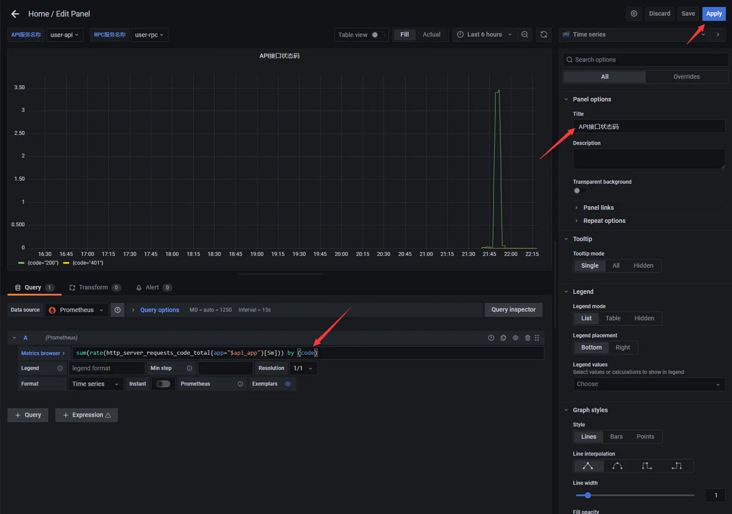

# [带你十天轻松搞定 Go 微服务系列](https://segmentfault.com/a/1190000041405814)

本文开始，我们会出一个系列文章跟大家详细展示一个 go-zero 微服务示例，整个系列分十篇文章，目录结构如下：

1. 环境搭建
2. 服务拆分
3. 用户服务
4. 产品服务
5. 订单服务
6. 支付服务
7. RPC 服务 Auth 验证
8. 服务监控
9. 链路追踪
10. 分布式事务

期望通过本系列带你在本机利用 Docker 环境利用 go-zero 快速开发一个商城系统，让你快速上手微服务。

完整示例代码：[https://github.com/nivin-studio/go-zero-mall](https://link.segmentfault.com/?enc=ogzf62Fy4I3hCE8orhcE2w%3D%3D.uddiqfQI9JY%2BgyPL4sPXxmxHr%2FDqnnygs701mM9CG%2FTGYQ%2Bbr2L%2FnavpA12%2Fut9%2F)

## 一、环境搭建

### 1 环境要求

- `Golang` 1.15+
- `Etcd`
- `Redis`
- `Mysql`
- `Prometheus`
- `Grafana`
- `Jaeger`
- `DTM`

### 2 `Docker` 本地开发环境搭建

为了方便开发调试，我们使用 `Docker` 构建本地开发环境。`Windows` 和 `macOS` 系统可下载 `Docker Desktop` 安装使用，具体下载安装方法可自行搜索相关教程。

这里我们使用 `Docker Compose` 来编排管理我们的容器，创建如下目录：

```mipsasm
gonivinck
├── dtm                   # DTM 分布式事务管理器
│   ├── config.yml        # DTM 配置文件
│   └── Dockerfile
├── etcd                  # Etcd 服务注册发现
│   └── Dockerfile
├── golang                # Golang 运行环境
│   └── Dockerfile
├── grafana               # Grafana 可视化数据监控
│   └── Dockerfile
├── jaeger                # Jaeger 链路追踪
│   └── Dockerfile
├── mysql                 # Mysql 服务
│   └── Dockerfile
├── mysql-manage          # Mysql 可视化管理
│   └── Dockerfile
├── prometheus            # Prometheus 服务监控
│   ├── Dockerfile
│   └── prometheus.yml    # Prometheus 配置文件
├── redis                 # Redis 服务
│   └── Dockerfile
├── redis-manage          # Redis 可视化管理
│   └── Dockerfile
├── .env                  # env 配置
└── docker-compose.yml
```

#### 2.1 编写 `Dockerfile`

在 `go-zero` 的微服务中采用 `grpc` 进行服务间的通信，而 `grpc` 的编写就需要用到 `protoc` 和翻译成 `go` 语言 `rpc stub` 代码的插件 `protoc-gen-go`。

为了提高开发效率，减少代码的出错率，缩短业务开发的工作量，`go-zero` 还提供了 `goctl` 代码生成工具。

因此，我们需要将 `protoc`, `protoc-gen-go`, `goctl`, 给提前安装到 `golang` 的容器中，以便后续使用。

所以 `golang` 容器的 `Dockerfile` 代码如下：

```awk
FROM golang:1.17

LABEL maintainer="Ving <ving@nivin.cn>"

ENV GOPROXY https://goproxy.cn,direct

# 安装必要的软件包和依赖包
USER root
RUN sed -i 's/deb.debian.org/mirrors.tuna.tsinghua.edu.cn/' /etc/apt/sources.list && \
    sed -i 's/security.debian.org/mirrors.tuna.tsinghua.edu.cn/' /etc/apt/sources.list && \
    sed -i 's/security-cdn.debian.org/mirrors.tuna.tsinghua.edu.cn/' /etc/apt/sources.list && \
    apt-get update && \
    apt-get upgrade -y && \
    apt-get install -y --no-install-recommends \
    curl \
    zip \
    unzip \
    git \
    vim 

# 安装 goctl
USER root
RUN GOPROXY=https://goproxy.cn/,direct go install github.com/tal-tech/go-zero/tools/goctl@cli

# 安装 protoc
USER root
RUN curl -L -o /tmp/protoc.zip https://github.com/protocolbuffers/protobuf/releases/download/v3.19.1/protoc-3.19.1-linux-x86_64.zip && \
    unzip -d /tmp/protoc /tmp/protoc.zip && \
    mv /tmp/protoc/bin/protoc $GOPATH/bin

# 安装 protoc-gen-go
USER root
RUN go get -u github.com/golang/protobuf/protoc-gen-go@v1.4.0

# $GOPATH/bin添加到环境变量中
ENV PATH $GOPATH/bin:$PATH

# 清理垃圾
USER root
RUN apt-get clean && \
    rm -rf /var/lib/apt/lists/* /tmp/* /var/tmp/* && \
    rm /var/log/lastlog /var/log/faillog

# 设置工作目录
WORKDIR /usr/src/code

EXPOSE 8000
EXPOSE 8001
EXPOSE 8002
EXPOSE 8003
EXPOSE 9000
EXPOSE 9001
EXPOSE 9002
EXPOSE 9003
```

其他服务容器 `Dockerfile` 无需特殊处理，只要基于现有的镜像即可。

| 服务         | 基于的镜像                                                   |
| ------------ | ------------------------------------------------------------ |
| DTM          | [yedf/dtm](https://link.segmentfault.com/?enc=e9lpMcUL6NDKY8m3PKjeYg%3D%3D.K3qb5Hcl0ELgrNni0faURJdFcAc%2BVdt0RlHpfugb9A4bNrxWhUV8qao1j6GrHFiK) |
| Etcd         | [bitnami/etcd](https://link.segmentfault.com/?enc=1re65ucef11Ecbuej7zbOQ%3D%3D.uWBEhwfZTvyAOTJnG2pYCeUI74jVTFiGomViljz6OB8Di4%2FAQvyXW5%2BA%2FZEhrSbL) |
| Mysql        | [mysql:5.7](https://link.segmentfault.com/?enc=Wx5gqfX1rzC3WQXcniI%2BRA%3D%3D.C0mrBCJAJRsu%2FFXJqatHgSG0P0GimVtzCqZMZU93%2BUg%3D) |
| Redis        | [redis:5.0](https://link.segmentfault.com/?enc=m35tu9rOXIoDCihQTVMjGg%3D%3D.6DB96fuyP76BCtiDQGhPL8T9I5TzAz8%2Fbx175kNd5IM%3D) |
| Mysql Manage | [phpmyadmin/phpmyadmin](https://link.segmentfault.com/?enc=68DFwcSvdvx2EOl9A7%2BaYw%3D%3D.DkryJ5FY4lS%2BvWAQ8t%2BH8xHHKZ5Nye1leikiQMLtpODbQFPaH2tLm2RVB7305qmW) |
| Redis Manage | [erikdubbelboer/phpredisadmin](https://link.segmentfault.com/?enc=GvIiToBVHWibRCuTWS2Bjg%3D%3D.LtBnH60gC36qGNmPETYtsKRA5fL3NKb8sbrln9cX3gzJM1AmWJTdA78%2B8gl4UQvRYH0jorKUACNyvgM2yJ5frQ%3D%3D) |
| Prometheus   | [bitnami/prometheus](https://link.segmentfault.com/?enc=OqYBzm%2FnD6Auo9DhtGQSBw%3D%3D.WxQeT%2Fy0AHFAw2RMTkMQV6bxgqHuoA1C%2Fq0SjmeOoMMuEcjJ5EMvzuhjG4jOQ1rw) |
| Grafana      | [grafana/grafana](https://link.segmentfault.com/?enc=E1fsStAJFaubhEfpKiCAkA%3D%3D.ByBVkPzNztoo87oSardxFt1jNbjVUgsn2dNGsGZevbdB8dJ64kuzxAaJ%2BTnqkXW6) |
| Jaeger       | [jaegertracing/all-in-one:1.28](https://link.segmentfault.com/?enc=2rY04W3StexpDZjyMltH0Q%3D%3D.%2FBH3pNwtun7sx%2FbqLRcj19BuH%2F93GryWOWmvkn0jnHe8JVSawhl8fhU%2FEw%2FHCLxHuaBGGWrblMGPCyHc4GLNiw%3D%3D) |

#### 2.2 编写 `.env` 配置文件

```clean
# 设置时区
TZ=Asia/Shanghai
# 设置网络模式
NETWORKS_DRIVER=bridge


# PATHS ##########################################
# 宿主机上代码存放的目录路径
CODE_PATH_HOST=./code
# 宿主机上Mysql Reids数据存放的目录路径
DATA_PATH_HOST=./data


# MYSQL ##########################################
# Mysql 服务映射宿主机端口号，可在宿主机127.0.0.1:3306访问
MYSQL_PORT=3306
MYSQL_USERNAME=admin
MYSQL_PASSWORD=123456
MYSQL_ROOT_PASSWORD=123456

# Mysql 可视化管理用户名称，同 MYSQL_USERNAME
MYSQL_MANAGE_USERNAME=admin
# Mysql 可视化管理用户密码，同 MYSQL_PASSWORD
MYSQL_MANAGE_PASSWORD=123456
# Mysql 可视化管理ROOT用户密码，同 MYSQL_ROOT_PASSWORD
MYSQL_MANAGE_ROOT_PASSWORD=123456
# Mysql 服务地址
MYSQL_MANAGE_CONNECT_HOST=mysql
# Mysql 服务端口号
MYSQL_MANAGE_CONNECT_PORT=3306
# Mysql 可视化管理映射宿主机端口号，可在宿主机127.0.0.1:1000访问
MYSQL_MANAGE_PORT=1000


# REDIS ##########################################
# Redis 服务映射宿主机端口号，可在宿主机127.0.0.1:6379访问
REDIS_PORT=6379

# Redis 可视化管理用户名称
REDIS_MANAGE_USERNAME=admin
# Redis 可视化管理用户密码
REDIS_MANAGE_PASSWORD=123456
# Redis 服务地址
REDIS_MANAGE_CONNECT_HOST=redis
# Redis 服务端口号
REDIS_MANAGE_CONNECT_PORT=6379
# Redis 可视化管理映射宿主机端口号，可在宿主机127.0.0.1:2000访问
REDIS_MANAGE_PORT=2000


# ETCD ###########################################
# Etcd 服务映射宿主机端口号，可在宿主机127.0.0.1:2379访问
ETCD_PORT=2379


# PROMETHEUS #####################################
# Prometheus 服务映射宿主机端口号，可在宿主机127.0.0.1:3000访问
PROMETHEUS_PORT=3000


# GRAFANA ########################################
# Grafana 服务映射宿主机端口号，可在宿主机127.0.0.1:4000访问
GRAFANA_PORT=4000


# JAEGER #########################################
# Jaeger 服务映射宿主机端口号，可在宿主机127.0.0.1:5000访问
JAEGER_PORT=5000


# DTM #########################################
# DTM HTTP 协议端口号
DTM_HTTP_PORT=36789
# DTM gRPC 协议端口号
DTM_GRPC_PORT=36790
```

#### 2.3 编写 `docker-compose.yml` 配置文件

```yaml
version: '3.5'
# 网络配置
networks:
  backend:
    driver: ${NETWORKS_DRIVER}

# 服务容器配置
services:
  golang:                                # 自定义容器名称
    build:
      context: ./golang                  # 指定构建使用的 Dockerfile 文件
    environment:                         # 设置环境变量
      - TZ=${TZ}
    volumes:                             # 设置挂载目录
      - ${CODE_PATH_HOST}:/usr/src/code  # 引用 .env 配置中 CODE_PATH_HOST 变量，将宿主机上代码存放的目录挂载到容器中 /usr/src/code 目录
    ports:                               # 设置端口映射
      - "8000:8000"
      - "8001:8001"
      - "8002:8002"
      - "8003:8003"
      - "9000:9000"
      - "9001:9001"
      - "9002:9002"
      - "9003:9003"
    stdin_open: true                     # 打开标准输入，可以接受外部输入
    tty: true
    networks:
      - backend
    restart: always                      # 指定容器退出后的重启策略为始终重启

  etcd:                                  # 自定义容器名称
    build:
      context: ./etcd                    # 指定构建使用的 Dockerfile 文件
    environment:
      - TZ=${TZ}
      - ALLOW_NONE_AUTHENTICATION=yes
      - ETCD_ADVERTISE_CLIENT_URLS=http://etcd:2379
    ports:                               # 设置端口映射
      - "${ETCD_PORT}:2379"
    networks:
      - backend
    restart: always

  mysql:
    build:
      context: ./mysql
    environment:
      - TZ=${TZ}
      - MYSQL_USER=${MYSQL_USERNAME}                  # 设置 Mysql 用户名称
      - MYSQL_PASSWORD=${MYSQL_PASSWORD}              # 设置 Mysql 用户密码
      - MYSQL_ROOT_PASSWORD=${MYSQL_ROOT_PASSWORD}    # 设置 Mysql root 用户密码
    volumes:
      - ${DATA_PATH_HOST}/mysql:/var/lib/mysql        # 引用 .env 配置中 DATA_PATH_HOST 变量，将宿主机上存放 Mysql 数据的目录挂载到容器中 /var/lib/mysql 目录
    ports:
      - "${MYSQL_PORT}:3306"                          # 设置容器3306端口映射指定宿主机端口
    networks:
      - backend
    restart: always

  redis:
    build:
      context: ./redis
    environment:
      - TZ=${TZ}
    volumes:
      - ${DATA_PATH_HOST}/redis:/data                 # 引用 .env 配置中 DATA_PATH_HOST 变量，将宿主机上存放 Redis 数据的目录挂载到容器中 /data 目录
    ports:
      - "${REDIS_PORT}:6379"                          # 设置容器6379端口映射指定宿主机端口
    networks:
      - backend
    restart: always

  mysql-manage:
    build:
      context: ./mysql-manage
    environment:
      - TZ=${TZ}
      - PMA_ARBITRARY=1
      - MYSQL_USER=${MYSQL_MANAGE_USERNAME}               # 设置连接的 Mysql 服务用户名称
      - MYSQL_PASSWORD=${MYSQL_MANAGE_PASSWORD}           # 设置连接的 Mysql 服务用户密码
      - MYSQL_ROOT_PASSWORD=${MYSQL_MANAGE_ROOT_PASSWORD} # 设置连接的 Mysql 服务 root 用户密码
      - PMA_HOST=${MYSQL_MANAGE_CONNECT_HOST}             # 设置连接的 Mysql 服务 host，可以是 Mysql 服务容器的名称，也可以是 Mysql 服务容器的 ip 地址
      - PMA_PORT=${MYSQL_MANAGE_CONNECT_PORT}             # 设置连接的 Mysql 服务端口号
    ports:
      - "${MYSQL_MANAGE_PORT}:80"                         # 设置容器80端口映射指定宿主机端口，用于宿主机访问可视化web
    depends_on:                                           # 依赖容器
      - mysql                                             # 在 Mysql 服务容器启动后启动
    networks:
      - backend
    restart: always

  redis-manage:
    build:
      context: ./redis-manage
    environment:
      - TZ=${TZ}
      - ADMIN_USER=${REDIS_MANAGE_USERNAME}           # 设置 Redis 可视化管理的用户名称
      - ADMIN_PASS=${REDIS_MANAGE_PASSWORD}           # 设置 Redis 可视化管理的用户密码
      - REDIS_1_HOST=${REDIS_MANAGE_CONNECT_HOST}     # 设置连接的 Redis 服务 host，可以是 Redis 服务容器的名称，也可以是 Redis 服务容器的 ip 地址
      - REDIS_1_PORT=${REDIS_MANAGE_CONNECT_PORT}     # 设置连接的 Redis 服务端口号
    ports:
      - "${REDIS_MANAGE_PORT}:80"                     # 设置容器80端口映射指定宿主机端口，用于宿主机访问可视化web
    depends_on:                                       # 依赖容器
      - redis                                         # 在 Redis 服务容器启动后启动
    networks:
      - backend
    restart: always

  prometheus:
    build:
      context: ./prometheus
    environment:
      - TZ=${TZ}
    volumes:
      - ./prometheus/prometheus.yml:/opt/bitnami/prometheus/conf/prometheus.yml  # 将 prometheus 配置文件挂载到容器里
    ports:
      - "${PROMETHEUS_PORT}:9090"                     # 设置容器9090端口映射指定宿主机端口，用于宿主机访问可视化web
    networks:
      - backend
    restart: always

  grafana:
    build:
      context: ./grafana
    environment:
      - TZ=${TZ}
    ports:
      - "${GRAFANA_PORT}:3000"                        # 设置容器3000端口映射指定宿主机端口，用于宿主机访问可视化web
    networks:
      - backend
    restart: always

  jaeger:
    build:
      context: ./jaeger
    environment:
      - TZ=${TZ}
    ports:
      - "${JAEGER_PORT}:16686"                        # 设置容器16686端口映射指定宿主机端口，用于宿主机访问可视化web
    networks:
      - backend
    restart: always

  dtm:
    build:
      context: ./dtm
    environment:
      - TZ=${TZ}
    entrypoint:
      - "/app/dtm/dtm"
      - "-c=/app/dtm/configs/config.yaml"
    volumes:
      - ./dtm/config.yml:/app/dtm/configs/config.yaml # 将 dtm 配置文件挂载到容器里
    ports:
      - "${DTM_HTTP_PORT}:36789"
      - "${DTM_GRPC_PORT}:36790"
    networks:
      - backend
    restart: always
```

#### 2.4 构建与运行

- 使用 `docker-compose` 命令来构建和启动运行我们的服务容器，在根目录执行如下命令：

```bash
$ docker-compose up -d
```

- 容器构建中
  

- 在 `Windows` 系统容器构建中出现如下图所示，请选择 `Share it` 这将允许 `Windows` 的文件目录挂载到容器目录中。
  

- 容器已启动运行
  

  

#### 2.5 容器说明

| 容器名称     | 暴露端口                                                     | host地址     | 说明                                                         |
| ------------ | ------------------------------------------------------------ | ------------ | ------------------------------------------------------------ |
| golang       | 8000:8000 8001:8001 8002:8002 8003:8003 9000:9000 9001:9001 9002:9002 9003:9003 | golang       | 在生产环境中微服务一般都是集群部署，可能一个微服务一台服务器，也可能一个微服务一个容器。为了方便开发调试，我们将在 `golang` 容器中启动所有微服务，并为它们分配监听不同的端口号以示区分。 80：开头的端口号我们将用于 `api` 服务 90：开头的端口号我们将用于 `rpc` 服务 |
| dtm          | 36789:36789 36790:36790                                      | dtm          | `dtm` 的 `http` 协议和 `grpc` 协议服务端口号，供客户端交互使用。 此项目中我们只在 `Docker` 内部容器之间访问使用，所以也可以不暴露端口号给宿主机 |
| etcd         | 2379:2379                                                    | etcd         | `Etcd` `http api` 服务端口号，供客户端交互使用。 此项目中我们只在 `Docker` 内部容器之间访问使用，所以也可以不暴露端口号给宿主机 |
| mysql        | 3306:3306                                                    | mysql        | `Mysql` 服务默认端口号，宿主机可通过 `127.0.0.1:3306` 进行数据库的连接 |
| redis        | 6379:6379                                                    | redis        | `Redis` 服务默认端口号，宿主机可通过 `127.0.0.1:6379` 进行数据库的连接 |
| mysql-manage | 1000:80                                                      | mysql-manage | `phpMyAdmin` `web` 服务端口号，可以在宿主机 `127.0.0.1:1000` 访问 |
| redis-manage | 2000:80                                                      | redis-manage | `phpRedisAdmin` `web` 服务端口号，可以在宿主机 `127.0.0.1:2000` 访问 |
| prometheus   | 3000:9090                                                    | prometheus   | `Prometheus` `web` 服务端口号，可以在宿主机 `127.0.0.1:3000` 访问 |
| grafana      | 4000:3000                                                    | grafana      | `Grafana` `web` 服务端口号，可以在宿主机 `127.0.0.1:4000` 访问 |
| jaeger       | 5000:16686                                                   | jaeger       | `Jaeger` `web` 服务端口号，可以在宿主机 `127.0.0.1:5000` 访问 |

#### 2.6 访问验证

- `Mysql` 访问验证
  
- `Redis` 访问验证
  
- `Prometheus` 访问验证
  
- `Grafana` 访问验证
  
- `Jaeger` 访问验证
  

## 二、服务拆分

一个商城项目可拆分用户服务（user）、订单服务（order）、产品服务（product）、支付服务（pay）、售后服务（afterSale）...

每个服务都可以再分为 `api` 服务和 `rpc` 服务。`api` 服务对外，可提供给 `app` 调用。`rpc` 服务是对内的，可提供给内部 `api` 服务或者其他 `rpc` 服务调用。整个项目服务依赖流程图大致如下：


### 1 用户服务（user）

| `api` 服务 | 端口：8000   | `rpc` 服务 | 端口：9000   |
| ---------- | ------------ | ---------- | ------------ |
| login      | 用户登录接口 | login      | 用户登录接口 |
| register   | 用户注册接口 | register   | 用户注册接口 |
| userinfo   | 用户信息接口 | userinfo   | 用户信息接口 |
| ...        | ...          | ...        | ...          |

### 2 产品服务（product）

| `api` 服务 | 端口：8001   | `rpc` 服务 | 端口：9001   |
| ---------- | ------------ | ---------- | ------------ |
| create     | 产品创建接口 | create     | 产品创建接口 |
| update     | 产品修改接口 | update     | 产品修改接口 |
| remove     | 产品删除接口 | remove     | 产品删除接口 |
| detail     | 产品详情接口 | detail     | 产品详情接口 |
| ...        | ...          | ...        | ...          |

### 3 订单服务（order）

| `api` 服务 | 端口：8002   | `rpc` 服务 | 端口：9002   |
| ---------- | ------------ | ---------- | ------------ |
| create     | 订单创建接口 | create     | 订单创建接口 |
| update     | 订单修改接口 | update     | 订单修改接口 |
| remove     | 订单删除接口 | remove     | 订单删除接口 |
| detail     | 订单详情接口 | detail     | 订单详情接口 |
| list       | 订单列表接口 | list       | 订单列表接口 |
|            |              | paid       | 订单支付接口 |
| ...        | ...          | ...        | ...          |

### 4 支付服务（pay）

| `api` 服务 | 端口：8003   | `rpc` 服务 | 端口：9003   |
| ---------- | ------------ | ---------- | ------------ |
| create     | 支付创建接口 | create     | 支付创建接口 |
| detail     | 支付详情接口 | detail     | 支付详情接口 |
| callback   | 支付回调接口 | callback   | 支付回调接口 |
| ...        | ...          | ...        | ...          |

### 5 创建项目目录

- 创建 `mall` 工程

```bash
$ mkdir mall && cd mall
$ go mod init mall
```

- 创建 `common` 目录

```bash
$ mkdir common
```

- 创建 `service` 目录

```bash
$ mkdir service && cd service
```

- 创建 `user api`，`user rpc`，`user model` 目录

```bash
$ mkdir -p user/api
$ mkdir -p user/rpc
$ mkdir -p user/model
```

- 创建 `product api`，`product rpc`，`product model` 目录

```bash
$ mkdir -p product/api
$ mkdir -p product/rpc
$ mkdir -p product/model
```

- 创建 `order api`，`order rpc`，`order model` 目录

```bash
$ mkdir -p order/api
$ mkdir -p order/rpc
$ mkdir -p order/model
```

- 创建 `pay api`，`pay rpc`，`pay model` 目录

```bash
$ mkdir -p pay/api
$ mkdir -p pay/rpc
$ mkdir -p pay/model
```

- 最终项目目录

```crmsh
├── common           # 通用库
├── service          # 服务
│   ├── order
│   │   ├── api      # order api 服务
│   │   ├── model    # order 数据模型
│   │   └── rpc      # order rpc 服务
│   ├── pay
│   │   ├── api      # pay api 服务
│   │   ├── model    # pay 数据模型
│   │   └── rpc      # pay rpc 服务
│   ├── product
│   │   ├── api      # product api 服务
│   │   ├── model    # product 数据模型
│   │   └── rpc      # product rpc 服务
│   └── user
│       ├── api      # user api 服务
│       ├── model    # user 数据模型
│       └── rpc      # user rpc 服务
└── go.mod
```

### 一些思考

微服务拆分并没有统一的标准，相同的业务在不同的公司很可能拆分方式会有所区别，用户规模、团队大小、组员能力等都会是考虑因素。但我们还是有一些基本原则可以遵循：

- 由粗到细，避免过度拆分，遵循渐进式演进的原则
- 不同服务之间应该是正交的，不要你中有我我中有你
- 避免环形依赖，服务依赖关系应该是有向无环图
- 避免不同服务之间共享同一个数据库

go-zero 也是一个渐进式微服务框架，你可以在业务早期使用单体来快速满足业务，当业务增长并有需要的时候，做最小的改动即可做到渐进式的服务拆分。

此类话题也可以在 go-zero 社区群里一起讨论。

## 三、用户服务

首先，我们来看一下整体的服务拆分图：


- 进入服务工作区

```bash
$ cd mall/service/user
```

### 3.1 生成 user model 模型

- 创建 sql 文件

```bash
$ vim model/user.sql
```

- 编写 sql 文件

```sql
CREATE TABLE `user` (
  `id` bigint unsigned NOT NULL AUTO_INCREMENT,
  `name` varchar(255)  NOT NULL DEFAULT '' COMMENT '用户姓名',
  `gender` tinyint(3) unsigned NOT NULL DEFAULT '0' COMMENT '用户性别',
  `mobile` varchar(255)  NOT NULL DEFAULT '' COMMENT '用户电话',
  `password` varchar(255)  NOT NULL DEFAULT '' COMMENT '用户密码',
  `create_time` timestamp NULL DEFAULT CURRENT_TIMESTAMP,
  `update_time` timestamp NULL DEFAULT CURRENT_TIMESTAMP ON UPDATE CURRENT_TIMESTAMP,
  PRIMARY KEY (`id`),
  UNIQUE KEY `idx_mobile_unique` (`mobile`)
) ENGINE=InnoDB  DEFAULT CHARSET=utf8mb4;
```

- 运行模板生成命令

```bash
$ goctl model mysql ddl -src ./model/user.sql -dir ./model -c
```

### 3.2 生成 user api 服务

- 创建 api 文件

```bash
$ vim api/user.api
```

- 编写 api 文件

```go
type (
  // 用户登录
  LoginRequest {
    Mobile   string `json:"mobile"`
    Password string `json:"password"`
  }
  LoginResponse {
    AccessToken  string `json:"accessToken"`
    AccessExpire int64  `json:"accessExpire"`
  }
  // 用户登录

  // 用户注册
  RegisterRequest {
    Name     string `json:"name"`
    Gender   int64  `json:"gender"`
    Mobile   string `json:"mobile"`
    Password string `json:"password"`
  }
  RegisterResponse {
    Id     int64  `json:"id"`
    Name   string `json:"name"`
    Gender int64  `json:"gender"`
    Mobile string `json:"mobile"`
  }
  // 用户注册

  // 用户信息
  UserInfoResponse {
    Id     int64  `json:"id"`
    Name   string `json:"name"`
    Gender int64  `json:"gender"`
    Mobile string `json:"mobile"`
  }
  // 用户信息
)

service User {
  @handler Login
  post /api/user/login(LoginRequest) returns (LoginResponse)
  
  @handler Register
  post /api/user/register(RegisterRequest) returns (RegisterResponse)
}

@server(
  jwt: Auth
)
service User {
  @handler UserInfo
  post /api/user/userinfo() returns (UserInfoResponse)
}
```

- 运行模板生成命令

```bash
$ goctl api go -api ./api/user.api -dir ./api
```

### 3.3 生成 user rpc 服务

- 创建 proto 文件

```bash
$ vim rpc/user.proto
```

- 编写 proto 文件

```protobuf
syntax = "proto3";

package userclient;

option go_package = "user";

// 用户登录
message LoginRequest {
    string Mobile = 1;
    string Password = 2;
}
message LoginResponse {
    int64 Id = 1;
    string Name = 2;
    int64 Gender = 3;
    string Mobile = 4;
}
// 用户登录

// 用户注册
message RegisterRequest {
    string Name = 1;
    int64 Gender = 2;
    string Mobile = 3;
    string Password = 4;
}
message RegisterResponse {
    int64 Id = 1;
    string Name = 2;
    int64 Gender = 3;
    string Mobile = 4;
}
// 用户注册

// 用户信息
message UserInfoRequest {
    int64 Id = 1;
}
message UserInfoResponse {
    int64 Id = 1;
    string Name = 2;
    int64 Gender = 3;
    string Mobile = 4;
}
// 用户信息

service User {
    rpc Login(LoginRequest) returns(LoginResponse);
    rpc Register(RegisterRequest) returns(RegisterResponse);
    rpc UserInfo(UserInfoRequest) returns(UserInfoResponse);
}
```

- 运行模板生成命令

```bash
$ goctl rpc proto -src ./rpc/user.proto -dir ./rpc
```

- 添加下载依赖包

  回到 `mall` 项目根目录执行如下命令：

```bash
$ go mod tidy
```

### 3.4 编写 user rpc 服务

#### 3.4.1 修改配置文件

- 修改 user.yaml 配置文件

```bash
$ vim rpc/etc/user.yaml
```

- 修改服务监听地址，端口号为0.0.0.0:9000，`Etcd` 服务配置，`Mysql` 服务配置，`CacheRedis` 服务配置

```yaml
Name: user.rpc
ListenOn: 0.0.0.0:9000

Etcd:
  Hosts:
  - etcd:2379
  Key: user.rpc

Mysql:
  DataSource: root:123456@tcp(mysql:3306)/mall?charset=utf8mb4&parseTime=true&loc=Asia%2FShanghai

CacheRedis:
- Host: redis:6379
  Type: node
  Pass:
```

#### 3.4.2 添加 user model 依赖

- 添加 `Mysql` 服务配置，`CacheRedis` 服务配置的实例化

```bash
$ vim rpc/internal/config/config.go
package config

import (
  "github.com/tal-tech/go-zero/core/stores/cache"
  "github.com/tal-tech/go-zero/zrpc"
)

type Config struct {
  zrpc.RpcServerConf

  Mysql struct {
    DataSource string
  }
  
  CacheRedis cache.CacheConf
}
```

- 注册服务上下文 `user model` 的依赖

```bash
$ vim rpc/internal/svc/servicecontext.go
package svc

import (
  "mall/service/user/model"
  "mall/service/user/rpc/internal/config"

  "github.com/tal-tech/go-zero/core/stores/sqlx"
)

type ServiceContext struct {
  Config config.Config
    
  UserModel model.UserModel
}

func NewServiceContext(c config.Config) *ServiceContext {
  conn := sqlx.NewMysql(c.Mysql.DataSource)
  return &ServiceContext{
    Config:    c,
    UserModel: model.NewUserModel(conn, c.CacheRedis),
  }
}
```

#### 3.4.3 添加用户注册逻辑 Register

- 添加密码加密工具

  在根目录 `common` 新建 `crypt` 工具库，此工具方法主要用于密码的加密处理。

```bash
$ vim common/cryptx/crypt.go
package cryptx

import (
  "fmt"

  "golang.org/x/crypto/scrypt"
)

func PasswordEncrypt(salt, password string) string {
  dk, _ := scrypt.Key([]byte(password), []byte(salt), 32768, 8, 1, 32)
  return fmt.Sprintf("%x", string(dk))
}
```

- 添加密码加密 `Salt` 配置

```bash
$ vim rpc/etc/user.yaml
Name: user.rpc
ListenOn: 0.0.0.0:9000

...

Salt: HWVOFkGgPTryzICwd7qnJaZR9KQ2i8xe
$ vim rpc/internal/config/config.go
package config

import (
  "github.com/tal-tech/go-zero/core/stores/cache"
  "github.com/tal-tech/go-zero/zrpc"
)

type Config struct {
  ...
  Salt string
}
```

- 添加用户注册逻辑

  用户注册流程，先判断注册手机号是否已经被注册，手机号未被注册，将用户信息写入数据库，用户密码需要进行加密存储。

```bash
$ vim rpc/internal/logic/registerlogic.go
package logic

import (
  "context"

  "mall/common/cryptx"
  "mall/service/user/model"
  "mall/service/user/rpc/internal/svc"
  "mall/service/user/rpc/user"

  "github.com/tal-tech/go-zero/core/logx"
  "google.golang.org/grpc/status"
)

type RegisterLogic struct {
  ctx    context.Context
  svcCtx *svc.ServiceContext
  logx.Logger
}

func NewRegisterLogic(ctx context.Context, svcCtx *svc.ServiceContext) *RegisterLogic {
  return &RegisterLogic{
    ctx:    ctx,
    svcCtx: svcCtx,
    Logger: logx.WithContext(ctx),
  }
}

func (l *RegisterLogic) Register(in *user.RegisterRequest) (*user.RegisterResponse, error) {
  // 判断手机号是否已经注册
  _, err := l.svcCtx.UserModel.FindOneByMobile(in.Mobile)
  if err == nil {
    return nil, status.Error(100, "该用户已存在")
  }

  if err == model.ErrNotFound {

    newUser := model.User{
      Name:     in.Name,
      Gender:   in.Gender,
      Mobile:   in.Mobile,
      Password: cryptx.PasswordEncrypt(l.svcCtx.Config.Salt, in.Password),
    }

    res, err := l.svcCtx.UserModel.Insert(&newUser)
    if err != nil {
      return nil, status.Error(500, err.Error())
    }

    newUser.Id, err = res.LastInsertId()
    if err != nil {
      return nil, status.Error(500, err.Error())
    }

    return &user.RegisterResponse{
      Id:     newUser.Id,
      Name:   newUser.Name,
      Gender: newUser.Gender,
      Mobile: newUser.Mobile,
    }, nil

  }

  return nil, status.Error(500, err.Error())
}
```

#### 3.4.4 添加用户登录逻辑 Login

用户登录流程，通过手机号查询判断用户是否是注册用户，如果是注册用户，需要将用户输入的密码进行加密与数据库中用户加密密码进行对比验证。

```bash
$ vim rpc/internal/logic/loginlogic.go
package logic

import (
  "context"

  "mall/common/cryptx"
  "mall/service/user/model"
  "mall/service/user/rpc/internal/svc"
  "mall/service/user/rpc/user"

  "github.com/tal-tech/go-zero/core/logx"
  "google.golang.org/grpc/status"
)

type LoginLogic struct {
  ctx    context.Context
  svcCtx *svc.ServiceContext
  logx.Logger
}

func NewLoginLogic(ctx context.Context, svcCtx *svc.ServiceContext) *LoginLogic {
  return &LoginLogic{
    ctx:    ctx,
    svcCtx: svcCtx,
    Logger: logx.WithContext(ctx),
  }
}

func (l *LoginLogic) Login(in *user.LoginRequest) (*user.LoginResponse, error) {
  // 查询用户是否存在
  res, err := l.svcCtx.UserModel.FindOneByMobile(in.Mobile)
  if err != nil {
    if err == model.ErrNotFound {
      return nil, status.Error(100, "用户不存在")
    }
    return nil, status.Error(500, err.Error())
  }

  // 判断密码是否正确
  password := cryptx.PasswordEncrypt(l.svcCtx.Config.Salt, in.Password)
  if password != res.Password {
    return nil, status.Error(100, "密码错误")
  }

  return &user.LoginResponse{
    Id:     res.Id,
    Name:   res.Name,
    Gender: res.Gender,
    Mobile: res.Mobile,
  }, nil
}
```

#### 3.4.5 添加用户信息逻辑 UserInfo

```bash
$ vim rpc/internal/logic/userinfologic.go
package logic

import (
  "context"

  "mall/service/user/model"
  "mall/service/user/rpc/internal/svc"
  "mall/service/user/rpc/user"

  "github.com/tal-tech/go-zero/core/logx"
  "google.golang.org/grpc/status"
)

type UserInfoLogic struct {
  ctx    context.Context
  svcCtx *svc.ServiceContext
  logx.Logger
}

func NewUserInfoLogic(ctx context.Context, svcCtx *svc.ServiceContext) *UserInfoLogic {
  return &UserInfoLogic{
    ctx:    ctx,
    svcCtx: svcCtx,
    Logger: logx.WithContext(ctx),
  }
}

func (l *UserInfoLogic) UserInfo(in *user.UserInfoRequest) (*user.UserInfoResponse, error) {
  // 查询用户是否存在
  res, err := l.svcCtx.UserModel.FindOne(in.Id)
  if err != nil {
    if err == model.ErrNotFound {
      return nil, status.Error(100, "用户不存在")
    }
    return nil, status.Error(500, err.Error())
  }

  return &user.UserInfoResponse{
    Id:     res.Id,
    Name:   res.Name,
    Gender: res.Gender,
    Mobile: res.Mobile,
  }, nil
}
```

### 3.5 编写 user api 服务

#### 3.5.1 修改配置文件

- 修改 user.yaml 配置文件

```bash
$ vim api/etc/user.yaml
```

- 修改服务地址，端口号为0.0.0.0:8000，`Mysql` 服务配置，`CacheRedis` 服务配置，`Auth` 验证配置

```yaml
Name: User
Host: 0.0.0.0
Port: 8000

Mysql:
  DataSource: root:123456@tcp(mysql:3306)/mall?charset=utf8mb4&parseTime=true&loc=Asia%2FShanghai

CacheRedis:
- Host: redis:6379
  Pass:
  Type: node

Auth:
  AccessSecret: uOvKLmVfztaXGpNYd4Z0I1SiT7MweJhl
  AccessExpire: 86400
```

#### 3.5.2 添加 user rpc 依赖

- 添加 `user rpc` 服务配置

```bash
$ vim api/etc/user.yaml
Name: User
Host: 0.0.0.0
Port: 8000

......

UserRpc:
  Etcd:
    Hosts:
    - etcd:2379
    Key: user.rpc
```

- 添加 `user rpc` 服务配置的实例化

```bash
$ vim api/internal/config/config.go
package config

import (
  "github.com/tal-tech/go-zero/rest"
  "github.com/tal-tech/go-zero/zrpc"
)

type Config struct {
  rest.RestConf

  Auth struct {
    AccessSecret string
    AccessExpire int64
  }

  UserRpc zrpc.RpcClientConf
}
```

- 注册服务上下文 `user rpc` 的依赖

```bash
$ vim api/internal/svc/servicecontext.go
package svc

import (
  "mall/service/user/api/internal/config"
  "mall/service/user/rpc/userclient"

  "github.com/tal-tech/go-zero/zrpc"
)

type ServiceContext struct {
  Config config.Config
    
  UserRpc userclient.User
}

func NewServiceContext(c config.Config) *ServiceContext {
  return &ServiceContext{
    Config:  c,
    UserRpc: userclient.NewUser(zrpc.MustNewClient(c.UserRpc)),
  }
}
```

#### 3.5.3 添加用户注册逻辑 Register

```bash
$ vim api/internal/logic/registerlogic.go
package logic

import (
  "context"

  "mall/service/user/api/internal/svc"
  "mall/service/user/api/internal/types"
  "mall/service/user/rpc/userclient"

  "github.com/tal-tech/go-zero/core/logx"
)

type RegisterLogic struct {
  logx.Logger
  ctx    context.Context
  svcCtx *svc.ServiceContext
}

func NewRegisterLogic(ctx context.Context, svcCtx *svc.ServiceContext) RegisterLogic {
  return RegisterLogic{
    Logger: logx.WithContext(ctx),
    ctx:    ctx,
    svcCtx: svcCtx,
  }
}

func (l *RegisterLogic) Register(req types.RegisterRequest) (resp *types.RegisterResponse, err error) {
  res, err := l.svcCtx.UserRpc.Register(l.ctx, &userclient.RegisterRequest{
    Name:     req.Name,
    Gender:   req.Gender,
    Mobile:   req.Mobile,
    Password: req.Password,
  })
  if err != nil {
    return nil, err
  }

  return &types.RegisterResponse{
    Id:     res.Id,
    Name:   res.Name,
    Gender: res.Gender,
    Mobile: res.Mobile,
  }, nil
}
```

#### 3.5.4 添加用户登录逻辑 Login

- 添加 `JWT` 工具

  在根目录 `common` 新建 `jwtx` 工具库，用于生成用户 `token`。

```bash
$ vim common/jwtx/jwt.go
package jwtx

import "github.com/golang-jwt/jwt"

func GetToken(secretKey string, iat, seconds, uid int64) (string, error) {
  claims := make(jwt.MapClaims)
  claims["exp"] = iat + seconds
  claims["iat"] = iat
  claims["uid"] = uid
  token := jwt.New(jwt.SigningMethodHS256)
  token.Claims = claims
  return token.SignedString([]byte(secretKey))
}
```

- 添加用户登录逻辑

  通过调用 `user rpc` 服务进行登录验证，登录成功后，使用用户信息生成对应的 `token` 以及 `token` 的有效期。

```bash
$ vim api/internal/logic/loginlogic.go
package logic

import (
  "context"
  "time"

  "mall/common/jwtx"
  "mall/service/user/api/internal/svc"
  "mall/service/user/api/internal/types"
  "mall/service/user/rpc/userclient"

  "github.com/tal-tech/go-zero/core/logx"
)

type LoginLogic struct {
  logx.Logger
  ctx    context.Context
  svcCtx *svc.ServiceContext
}

func NewLoginLogic(ctx context.Context, svcCtx *svc.ServiceContext) LoginLogic {
  return LoginLogic{
    Logger: logx.WithContext(ctx),
    ctx:    ctx,
    svcCtx: svcCtx,
  }
}

func (l *LoginLogic) Login(req types.LoginRequest) (resp *types.LoginResponse, err error) {
  res, err := l.svcCtx.UserRpc.Login(l.ctx, &userclient.LoginRequest{
    Mobile:   req.Mobile,
    Password: req.Password,
  })
  if err != nil {
    return nil, err
  }

  now := time.Now().Unix()
  accessExpire := l.svcCtx.Config.Auth.AccessExpire

  accessToken, err := jwtx.GetToken(l.svcCtx.Config.Auth.AccessSecret, now, accessExpire, res.Id)
  if err != nil {
    return nil, err
  }

  return &types.LoginResponse{
    AccessToken:  accessToken,
    AccessExpire: now + accessExpire,
  }, nil
}
```

#### 3.5.5 添加用户信息逻辑 UserInfo

```bash
$ vim api/internal/logic/userinfologic.go
package logic

import (
  "context"
  "encoding/json"

  "mall/service/user/api/internal/svc"
  "mall/service/user/api/internal/types"
  "mall/service/user/rpc/userclient"

  "github.com/tal-tech/go-zero/core/logx"
)

type UserInfoLogic struct {
  logx.Logger
  ctx    context.Context
  svcCtx *svc.ServiceContext
}

func NewUserInfoLogic(ctx context.Context, svcCtx *svc.ServiceContext) UserInfoLogic {
  return UserInfoLogic{
    Logger: logx.WithContext(ctx),
    ctx:    ctx,
    svcCtx: svcCtx,
  }
}

func (l *UserInfoLogic) UserInfo() (resp *types.UserInfoResponse, err error) {
  uid, _ := l.ctx.Value("uid").(json.Number).Int64()
  res, err := l.svcCtx.UserRpc.UserInfo(l.ctx, &userclient.UserInfoRequest{
    Id: uid,
  })
  if err != nil {
    return nil, err
  }

  return &types.UserInfoResponse{
    Id:     res.Id,
    Name:   res.Name,
    Gender: res.Gender,
    Mobile: res.Mobile,
  }, nil
}
```

> 通过 `l.ctx.Value("uid")` 可获取 jwt token 中自定义的参数

### 3.6 启动 user rpc 服务

> 提示：启动服务需要在 `golang` 容器中启动

```bash
$ cd mall/service/user/rpc
$ go run user.go -f etc/user.yaml
Starting rpc server at 127.0.0.1:9000...
```

### 3.7 启动 user api 服务

> 提示：启动服务需要在 `golang` 容器中启动

```bash
$ cd mall/service/user/api
$ go run user.go -f etc/user.yaml
Starting server at 0.0.0.0:8000...
```

## 四、产品服务

- 进入服务工作区

```bash
$ cd mall/service/product
```

### 4.1 生成 product model 模型

- 创建 sql 文件

```bash
$ vim model/product.sql
```

- 编写 sql 文件

```sql
CREATE TABLE `product` (
    `id` bigint unsigned NOT NULL AUTO_INCREMENT,
    `name` varchar(255)  NOT NULL DEFAULT '' COMMENT '产品名称',
    `desc` varchar(255)  NOT NULL DEFAULT '' COMMENT '产品描述',
        `stock` int(10) unsigned NOT NULL DEFAULT '0' COMMENT '产品库存',
    `amount` int(10) unsigned NOT NULL DEFAULT '0'  COMMENT '产品金额',
    `status` tinyint(3) unsigned NOT NULL DEFAULT '0' COMMENT '产品状态',
    `create_time` timestamp NULL DEFAULT CURRENT_TIMESTAMP,
    `update_time` timestamp NULL DEFAULT CURRENT_TIMESTAMP ON UPDATE CURRENT_TIMESTAMP,
    PRIMARY KEY (`id`)
) ENGINE=InnoDB  DEFAULT CHARSET=utf8mb4;
```

- 运行模板生成命令

```bash
$ goctl model mysql ddl -src ./model/product.sql -dir ./model -c
```

### 4.2 生成 product api 服务

- 创建 api 文件

```bash
$ vim api/product.api
```

- 编写 api 文件

```go
type (
    // 产品创建
    CreateRequest {
        Name   string `json:"name"`
        Desc   string `json:"desc"`
        Stock  int64  `json:"stock"`
        Amount int64  `json:"amount"`
        Status int64  `json:"status"`
    }
    CreateResponse {
        Id int64 `json:"id"`
    }
    // 产品创建

    // 产品修改
    UpdateRequest {
        Id     int64  `json:"id"`
        Name   string `json:"name,optional"`
        Desc   string `json:"desc,optional"`
        Stock  int64  `json:"stock"`
        Amount int64  `json:"amount,optional"`
        Status int64  `json:"status,optional"`
    }
    UpdateResponse {
    }
    // 产品修改

    // 产品删除
    RemoveRequest {
        Id int64 `json:"id"`
    }
    RemoveResponse {
    }
    // 产品删除

    // 产品详情
    DetailRequest {
        Id int64 `json:"id"`
    }
    DetailResponse {
        Id     int64  `json:"id"`
        Name   string `json:"name"`
        Desc   string `json:"desc"`
        Stock  int64  `json:"stock"`
        Amount int64  `json:"amount"`
        Status int64  `json:"status"`
    }
    // 产品详情
)

@server(
    jwt: Auth
)
service Product {
    @handler Create
    post /api/product/create(CreateRequest) returns (CreateResponse)
    
    @handler Update
    post /api/product/update(UpdateRequest) returns (UpdateResponse)
    
    @handler Remove
    post /api/product/remove(RemoveRequest) returns (RemoveResponse)
    
    @handler Detail
    post /api/product/detail(DetailRequest) returns (DetailResponse)
}
```

- 运行模板生成命令

```bash
$ goctl api go -api ./api/product.api -dir ./api
```

### 4.3 生成 product rpc 服务

- 创建 proto 文件

```bash
$ vim rpc/product.proto
```

- 编写 proto 文件

```protobuf
syntax = "proto3";

package productclient;

option go_package = "product";

// 产品创建
message CreateRequest {
    string Name = 1;
    string Desc = 2;
    int64 Stock = 3;
    int64 Amount = 4;
    int64 Status = 5;
}
message CreateResponse {
    int64 id = 1;
}
// 产品创建

// 产品修改
message UpdateRequest {
    int64 id = 1;
    string Name = 2;
    string Desc = 3;
    int64 Stock = 4;
    int64 Amount = 5;
    int64 Status = 6;
}
message UpdateResponse {
}
// 产品修改

// 产品删除
message RemoveRequest {
    int64 id = 1;
}
message RemoveResponse {
}
// 产品删除

// 产品详情
message DetailRequest {
    int64 id = 1;
}
message DetailResponse {
    int64 id = 1;
    string Name = 2;
    string Desc = 3;
    int64 Stock = 4;
    int64 Amount = 5;
    int64 Status = 6;
}
// 产品详情

service Product {
    rpc Create(CreateRequest) returns(CreateResponse);
    rpc Update(UpdateRequest) returns(UpdateResponse);
    rpc Remove(RemoveRequest) returns(RemoveResponse);
    rpc Detail(DetailRequest) returns(DetailResponse);
}
```

- 运行模板生成命令

```bash
$ goctl rpc proto -src ./rpc/product.proto -dir ./rpc
```

### 4.4 编写 product rpc 服务

#### 4.4.1 修改配置文件

- 修改 product.yaml 配置文件

```bash
$ vim rpc/etc/product.yaml
```

- 修改服务监听地址，端口号为0.0.0.0:9001，`Etcd` 服务配置，`Mysql` 服务配置，`CacheRedis` 服务配置

```yaml
Name: product.rpc
ListenOn: 0.0.0.0:9001

Etcd:
  Hosts:
  - etcd:2379
  Key: product.rpc

Mysql:
  DataSource: root:123456@tcp(mysql:3306)/mall?charset=utf8mb4&parseTime=true&loc=Asia%2FShanghai

CacheRedis:
- Host: redis:6379
  Type: node # node可以不写，可以设为cluster
  # Pass: xxx # 如果有密码
```

### 4.4.2 添加 product model 依赖

- 添加 `Mysql` 服务配置，`CacheRedis` 服务配置的实例化

```bash
$ vim rpc/internal/config/config.go
package config

import (
    "github.com/tal-tech/go-zero/core/stores/cache"
    "github.com/tal-tech/go-zero/zrpc"
)

type Config struct {
    zrpc.RpcServerConf

    Mysql struct {
        DataSource string
    }
  
    CacheRedis cache.CacheConf
}
```

- 注册服务上下文 `product model` 的依赖

```bash
$ vim rpc/internal/svc/servicecontext.go
package svc

import (
    "mall/service/product/model"
    "mall/service/product/rpc/internal/config"

    "github.com/tal-tech/go-zero/core/stores/sqlx"
)

type ServiceContext struct {
    Config config.Config
    
    ProductModel model.ProductModel
}

func NewServiceContext(c config.Config) *ServiceContext {
    conn := sqlx.NewMysql(c.Mysql.DataSource)
    return &ServiceContext{
        Config:       c,
        ProductModel: model.NewProductModel(conn, c.CacheRedis),
    }
}
```

### 4.4.3 添加产品创建逻辑 Create

```bash
$ vim rpc/internal/logic/createlogic.go
package logic

import (
    "context"

    "mall/service/product/model"
    "mall/service/product/rpc/internal/svc"
    "mall/service/product/rpc/product"

    "github.com/tal-tech/go-zero/core/logx"
    "google.golang.org/grpc/status"
)

type CreateLogic struct {
    ctx    context.Context
    svcCtx *svc.ServiceContext
    logx.Logger
}

func NewCreateLogic(ctx context.Context, svcCtx *svc.ServiceContext) *CreateLogic {
    return &CreateLogic{
        ctx:    ctx,
        svcCtx: svcCtx,
        Logger: logx.WithContext(ctx),
    }
}

func (l *CreateLogic) Create(in *product.CreateRequest) (*product.CreateResponse, error) {
    newProduct := model.Product{
        Name:   in.Name,
        Desc:   in.Desc,
        Stock:  in.Stock,
        Amount: in.Amount,
        Status: in.Status,
    }

    res, err := l.svcCtx.ProductModel.Insert(&newProduct)
    if err != nil {
        return nil, status.Error(500, err.Error())
    }

    newProduct.Id, err = res.LastInsertId()
    if err != nil {
        return nil, status.Error(500, err.Error())
    }

    return &product.CreateResponse{
        Id: newProduct.Id,
    }, nil
}
```

### 4.4.4 添加产品详情逻辑 Detail

```bash
$ vim rpc/internal/logic/detaillogic.go
package logic

import (
    "context"

    "mall/service/product/model"
    "mall/service/product/rpc/internal/svc"
    "mall/service/product/rpc/product"

    "github.com/tal-tech/go-zero/core/logx"
    "google.golang.org/grpc/status"
)

type DetailLogic struct {
    ctx    context.Context
    svcCtx *svc.ServiceContext
    logx.Logger
}

func NewDetailLogic(ctx context.Context, svcCtx *svc.ServiceContext) *DetailLogic {
    return &DetailLogic{
        ctx:    ctx,
        svcCtx: svcCtx,
        Logger: logx.WithContext(ctx),
    }
}

func (l *DetailLogic) Detail(in *product.DetailRequest) (*product.DetailResponse, error) {
    // 查询产品是否存在
    res, err := l.svcCtx.ProductModel.FindOne(in.Id)
    if err != nil {
        if err == model.ErrNotFound {
            return nil, status.Error(100, "产品不存在")
        }
        return nil, status.Error(500, err.Error())
    }

    return &product.DetailResponse{
        Id:     res.Id,
        Name:   res.Name,
        Desc:   res.Desc,
        Stock:  res.Stock,
        Amount: res.Amount,
        Status: res.Status,
    }, nil
}
```

### 4.4.5 添加产品更新逻辑 Update

```bash
$ vim rpc/internal/logic/updatelogic.go
package logic

import (
    "context"

    "mall/service/product/model"
    "mall/service/product/rpc/internal/svc"
    "mall/service/product/rpc/product"

    "github.com/tal-tech/go-zero/core/logx"
    "google.golang.org/grpc/status"
)

type UpdateLogic struct {
    ctx    context.Context
    svcCtx *svc.ServiceContext
    logx.Logger
}

func NewUpdateLogic(ctx context.Context, svcCtx *svc.ServiceContext) *UpdateLogic {
    return &UpdateLogic{
        ctx:    ctx,
        svcCtx: svcCtx,
        Logger: logx.WithContext(ctx),
    }
}

func (l *UpdateLogic) Update(in *product.UpdateRequest) (*product.UpdateResponse, error) {
    // 查询产品是否存在
    res, err := l.svcCtx.ProductModel.FindOne(in.Id)
    if err != nil {
        if err == model.ErrNotFound {
            return nil, status.Error(100, "产品不存在")
        }
        return nil, status.Error(500, err.Error())
    }

    if in.Name != "" {
        res.Name = in.Name
    }
    if in.Desc != "" {
        res.Desc = in.Desc
    }
    if in.Stock != 0 {
        res.Stock = in.Stock
    }
    if in.Amount != 0 {
        res.Amount = in.Amount
    }
    if in.Status != 0 {
        res.Status = in.Status
    }

    err = l.svcCtx.ProductModel.Update(res)
    if err != nil {
        return nil, status.Error(500, err.Error())
    }

    return &product.UpdateResponse{}, nil
}
```

#### 4.4.6 添加产品删除逻辑 Remove

```bash
$ vim rpc/internal/logic/removelogic.go
package logic

import (
    "context"

    "mall/service/product/model"
    "mall/service/product/rpc/internal/svc"
    "mall/service/product/rpc/product"

    "github.com/tal-tech/go-zero/core/logx"
    "google.golang.org/grpc/status"
)

type RemoveLogic struct {
    ctx    context.Context
    svcCtx *svc.ServiceContext
    logx.Logger
}

func NewRemoveLogic(ctx context.Context, svcCtx *svc.ServiceContext) *RemoveLogic {
    return &RemoveLogic{
        ctx:    ctx,
        svcCtx: svcCtx,
        Logger: logx.WithContext(ctx),
    }
}

func (l *RemoveLogic) Remove(in *product.RemoveRequest) (*product.RemoveResponse, error) {
    // 查询产品是否存在
    res, err := l.svcCtx.ProductModel.FindOne(in.Id)
    if err != nil {
        if err == model.ErrNotFound {
            return nil, status.Error(100, "产品不存在")
        }
        return nil, status.Error(500, err.Error())
    }

    err = l.svcCtx.ProductModel.Delete(res.Id)
    if err != nil {
        return nil, status.Error(500, err.Error())
    }

    return &product.RemoveResponse{}, nil
}
```

### 4.5 编写 product api 服务

#### 4.5.1 修改配置文件

- 修改 product.yaml 配置文件

```bash
$ vim api/etc/product.yaml
```

- 修改服务地址，端口号为0.0.0.0:8001，`Mysql` 服务配置，`CacheRedis` 服务配置，`Auth` 验证配置

```yaml
Name: Product
Host: 0.0.0.0
Port: 8001

Mysql:
  DataSource: root:123456@tcp(mysql:3306)/mall?charset=utf8mb4&parseTime=true&loc=Asia%2FShanghai

CacheRedis:
- Host: redis:6379
  Type: node # node可以不写，可以设为cluster
  # Pass: xxx # 如果有密码

Auth:
  AccessSecret: uOvKLmVfztaXGpNYd4Z0I1SiT7MweJhl
  AccessExpire: 86400
```

### 4.5.2 添加 product rpc 依赖

- 添加 `product rpc` 服务配置

```bash
$ vim api/etc/product.yaml
Name: Product
Host: 0.0.0.0
Port: 8001
...
ProductRpc:
  Etcd:
    Hosts:
    - etcd:2379
    Key: product.rpc
```

- 添加 `product rpc` 服务配置的实例化

```bash
$ vim api/internal/config/config.go
package config

import (
    "github.com/tal-tech/go-zero/rest"
    "github.com/tal-tech/go-zero/zrpc"
)

type Config struct {
    rest.RestConf

    Auth struct {
        AccessSecret string
        AccessExpire int64
    }

    ProductRpc zrpc.RpcClientConf
}
```

- 注册服务上下文 `product rpc` 的依赖

```bash
$ vim api/internal/svc/servicecontext.go
package svc

import (
    "mall/service/product/api/internal/config"
    "mall/service/product/rpc/productclient"

    "github.com/tal-tech/go-zero/zrpc"
)

type ServiceContext struct {
    Config config.Config
    
    ProductRpc productclient.Product
}

func NewServiceContext(c config.Config) *ServiceContext {
    return &ServiceContext{
        Config:     c,
        ProductRpc: productclient.NewProduct(zrpc.MustNewClient(c.ProductRpc)),
    }
}
```

### 4.5.3 添加产品创建逻辑 Create

```bash
$ vim api/internal/logic/createlogic.go
package logic

import (
    "context"

    "mall/service/product/api/internal/svc"
    "mall/service/product/api/internal/types"
    "mall/service/product/rpc/product"

    "github.com/tal-tech/go-zero/core/logx"
)

type CreateLogic struct {
    logx.Logger
    ctx    context.Context
    svcCtx *svc.ServiceContext
}

func NewCreateLogic(ctx context.Context, svcCtx *svc.ServiceContext) CreateLogic {
    return CreateLogic{
        Logger: logx.WithContext(ctx),
        ctx:    ctx,
        svcCtx: svcCtx,
    }
}

func (l *CreateLogic) Create(req types.CreateRequest) (resp *types.CreateResponse, err error) {
    res, err := l.svcCtx.ProductRpc.Create(l.ctx, &product.CreateRequest{
        Name:   req.Name,
        Desc:   req.Desc,
        Stock:  req.Stock,
        Amount: req.Amount,
        Status: req.Status,
    })
    if err != nil {
        return nil, err
    }

    return &types.CreateResponse{
        Id: res.Id,
    }, nil
}
```

### 4.5.4 添加产品详情逻辑 Detail

```bash
$ vim api/internal/logic/detaillogic.go
package logic

import (
    "context"

    "mall/service/product/api/internal/svc"
    "mall/service/product/api/internal/types"
    "mall/service/product/rpc/product"

    "github.com/tal-tech/go-zero/core/logx"
)

type DetailLogic struct {
    logx.Logger
    ctx    context.Context
    svcCtx *svc.ServiceContext
}

func NewDetailLogic(ctx context.Context, svcCtx *svc.ServiceContext) DetailLogic {
    return DetailLogic{
        Logger: logx.WithContext(ctx),
        ctx:    ctx,
        svcCtx: svcCtx,
    }
}

func (l *DetailLogic) Detail(req types.DetailRequest) (resp *types.DetailResponse, err error) {
    res, err := l.svcCtx.ProductRpc.Detail(l.ctx, &product.DetailRequest{
        Id: req.Id,
    })
    if err != nil {
        return nil, err
    }

    return &types.DetailResponse{
        Id:     res.Id,
        Name:   res.Name,
        Desc:   res.Desc,
        Stock:  res.Stock,
        Amount: res.Amount,
        Status: res.Status,
    }, nil
}
```

### 4.5.5 添加产品更新逻辑 Update

```bash
$ vim api/internal/logic/updatelogic.go
package logic

import (
    "context"

    "mall/service/product/api/internal/svc"
    "mall/service/product/api/internal/types"
    "mall/service/product/rpc/product"

    "github.com/tal-tech/go-zero/core/logx"
)

type UpdateLogic struct {
    logx.Logger
    ctx    context.Context
    svcCtx *svc.ServiceContext
}

func NewUpdateLogic(ctx context.Context, svcCtx *svc.ServiceContext) UpdateLogic {
    return UpdateLogic{
        Logger: logx.WithContext(ctx),
        ctx:    ctx,
        svcCtx: svcCtx,
    }
}

func (l *UpdateLogic) Update(req types.UpdateRequest) (resp *types.UpdateResponse, err error) {
    _, err = l.svcCtx.ProductRpc.Update(l.ctx, &product.UpdateRequest{
        Id:     req.Id,
        Name:   req.Name,
        Desc:   req.Desc,
        Stock:  req.Stock,
        Amount: req.Amount,
        Status: req.Status,
    })
    if err != nil {
        return nil, err
    }

    return &types.UpdateResponse{}, nil
}
```

#### 4.5.6 添加产品删除逻辑 Remove

```bash
$ vim api/internal/logic/removelogic.go
package logic

import (
    "context"

    "mall/service/product/api/internal/svc"
    "mall/service/product/api/internal/types"
    "mall/service/product/rpc/product"

    "github.com/tal-tech/go-zero/core/logx"
)

type RemoveLogic struct {
    logx.Logger
    ctx    context.Context
    svcCtx *svc.ServiceContext
}

func NewRemoveLogic(ctx context.Context, svcCtx *svc.ServiceContext) RemoveLogic {
    return RemoveLogic{
        Logger: logx.WithContext(ctx),
        ctx:    ctx,
        svcCtx: svcCtx,
    }
}

func (l *RemoveLogic) Remove(req types.RemoveRequest) (resp *types.RemoveResponse, err error) {
    _, err = l.svcCtx.ProductRpc.Remove(l.ctx, &product.RemoveRequest{
        Id: req.Id,
    })
    if err != nil {
        return nil, err
    }

    return &types.RemoveResponse{}, nil
}
```

### 4.6 启动 product rpc 服务

> 提示：启动服务需要在 `golang` 容器中启动

```bash
$ cd mall/service/product/rpc
$ go run product.go -f etc/product.yaml
Starting rpc server at 127.0.0.1:9001...
```

### 4.7 启动 product api 服务

> 提示：启动服务需要在 `golang` 容器中启动

```bash
$ cd mall/service/product/api
$ go run product.go -f etc/product.yaml
Starting server at 0.0.0.0:8001...
```

## 五、订单服务

- 进入服务工作区

```bash
$ cd mall/service/order
```

### 5.1 生成 order model 模型

- 创建 sql 文件

```bash
$ vim model/order.sql
```

- 编写 sql 文件

```sql
CREATE TABLE `order` (
    `id` bigint unsigned NOT NULL AUTO_INCREMENT,
    `uid` bigint unsigned NOT NULL DEFAULT '0' COMMENT '用户ID',
    `pid` bigint unsigned NOT NULL DEFAULT '0' COMMENT '产品ID',
    `amount` int(10) unsigned NOT NULL DEFAULT '0'  COMMENT '订单金额',
    `status` tinyint(3) unsigned NOT NULL DEFAULT '0' COMMENT '订单状态',
    `create_time` timestamp NULL DEFAULT CURRENT_TIMESTAMP,
    `update_time` timestamp NULL DEFAULT CURRENT_TIMESTAMP ON UPDATE CURRENT_TIMESTAMP,
    PRIMARY KEY (`id`),
    KEY `idx_uid` (`uid`),
    KEY `idx_pid` (`pid`)
) ENGINE=InnoDB  DEFAULT CHARSET=utf8mb4;
```

- 运行模板生成命令

```bash
$ goctl model mysql ddl -src ./model/order.sql -dir ./model -c
```

### 5.2 生成 order api 服务

- 创建 api 文件

```bash
$ vim api/order.api
```

- 编写 api 文件

```go
type (
    // 订单创建
    CreateRequest {
        Uid    int64 `json:"uid"`
        Pid    int64 `json:"pid"`
        Amount int64 `json:"amount"`
        Status int64 `json:"status"`
    }
    CreateResponse {
        Id int64 `json:"id"`
    }
    // 订单创建

    // 订单修改
    UpdateRequest {
        Id     int64 `json:"id"`
        Uid    int64 `json:"uid,optional"`
        Pid    int64 `json:"pid,optional"`
        Amount int64 `json:"amount,optional"`
        Status int64 `json:"status,optional"`
    }
    UpdateResponse {
    }
    // 订单修改

    // 订单删除
    RemoveRequest {
        Id int64 `json:"id"`
    }
    RemoveResponse {
    }
    // 订单删除

    // 订单详情
    DetailRequest {
        Id int64 `json:"id"`
    }
    DetailResponse {
        Id     int64 `json:"id"`
        Uid    int64 `json:"uid"`
        Pid    int64 `json:"pid"`
        Amount int64 `json:"amount"`
        Status int64 `json:"status"`
    }
    // 订单详情

    // 订单列表
    ListRequest {
        Uid int64 `json:"uid"`
    }
    ListResponse {
        Id     int64 `json:"id"`
        Uid    int64 `json:"uid"`
        Pid    int64 `json:"pid"`
        Amount int64 `json:"amount"`
        Status int64 `json:"status"`
    }
    // 订单列表
)

@server(
    jwt: Auth
)
service Order {
    @handler Create
    post /api/order/create(CreateRequest) returns (CreateResponse)
    
    @handler Update
    post /api/order/update(UpdateRequest) returns (UpdateResponse)
    
    @handler Remove
    post /api/order/remove(RemoveRequest) returns (RemoveResponse)
    
    @handler Detail
    post /api/order/detail(DetailRequest) returns (DetailResponse)
    
    @handler List
    post /api/order/list(ListRequest) returns (ListResponse)
}
```

- 运行模板生成命令

```bash
$ goctl api go -api ./api/order.api -dir ./api
```

### 5.3 生成 order rpc 服务

- 创建 proto 文件

```bash
$ vim rpc/order.proto
```

- 编写 proto 文件

```protobuf
syntax = "proto3";

package orderclient;

option go_package = "order";

// 订单创建
message CreateRequest {
    int64 Uid = 1;
    int64 Pid = 2;
    int64 Amount = 3;
    int64 Status = 4;
}
message CreateResponse {
    int64 id = 1;
}
// 订单创建

// 订单修改
message UpdateRequest {
    int64 id = 1;
    int64 Uid = 2;
    int64 Pid = 3;
    int64 Amount = 4;
    int64 Status = 5;
}
message UpdateResponse {
}
// 订单修改

// 订单删除
message RemoveRequest {
    int64 id = 1;
}
message RemoveResponse {
}
// 订单删除

// 订单详情
message DetailRequest {
    int64 id = 1;
}
message DetailResponse {
    int64 id = 1;
    int64 Uid = 2;
    int64 Pid = 3;
    int64 Amount = 4;
    int64 Status = 5;
}
// 订单详情

// 订单列表
message ListRequest {
    int64 uid = 1;
}
message ListResponse {
    repeated DetailResponse data = 1;
}
// 订单列表

// 订单支付
message PaidRequest {
    int64 id = 1;
}
message PaidResponse {
}
// 订单支付

service Order {
    rpc Create(CreateRequest) returns(CreateResponse);
    rpc Update(UpdateRequest) returns(UpdateResponse);
    rpc Remove(RemoveRequest) returns(RemoveResponse);
    rpc Detail(DetailRequest) returns(DetailResponse);
    rpc List(ListRequest) returns(ListResponse);
    rpc Paid(PaidRequest) returns(PaidResponse);
}
```

- 运行模板生成命令

```bash
$ goctl rpc proto -src ./rpc/order.proto -dir ./rpc
```

### 5.4 编写 order rpc 服务

#### 5.4.1 修改配置文件

- 修改 order.yaml 配置文件

```bash
$ vim rpc/etc/order.yaml
```

- 修改服务监听地址，端口号为0.0.0.0:9002，`Etcd` 服务配置，`Mysql` 服务配置，`CacheRedis` 服务配置

```yaml
Name: order.rpc
ListenOn: 0.0.0.0:9002

Etcd:
  Hosts:
  - etcd:2379
  Key: order.rpc

Mysql:
  DataSource: root:123456@tcp(mysql:3306)/mall?charset=utf8mb4&parseTime=true&loc=Asia%2FShanghai

CacheRedis:
- Host: redis:6379
  Type: node
  Pass:
```

### 5.4.2 添加 order model 依赖

- 添加 `Mysql` 服务配置，`CacheRedis` 服务配置的实例化

```bash
$ vim rpc/internal/config/config.go
package config

import (
    "github.com/tal-tech/go-zero/core/stores/cache"
    "github.com/tal-tech/go-zero/zrpc"
)

type Config struct {
    zrpc.RpcServerConf

    Mysql struct {
        DataSource string
    }
    
    CacheRedis cache.CacheConf
}
```

- 注册服务上下文 `order model` 的依赖

```bash
$ vim rpc/internal/svc/servicecontext.go
package svc

import (
    "mall/service/order/model"
    "mall/service/order/rpc/internal/config"

    "github.com/tal-tech/go-zero/core/stores/sqlx"
)

type ServiceContext struct {
    Config config.Config

    OrderModel model.OrderModel
}

func NewServiceContext(c config.Config) *ServiceContext {
    conn := sqlx.NewMysql(c.Mysql.DataSource)
    return &ServiceContext{
        Config:     c,
        OrderModel: model.NewOrderModel(conn, c.CacheRedis),
    }
}
```

### 5.4.3 添加 user rpc，product rpc 依赖

- 添加 `user rpc, product rpc` 服务配置

```bash
$ vim rpc/etc/order.yaml
Name: order.rpc
ListenOn: 0.0.0.0:9002
Etcd:
  Hosts:
  - etcd:2379
  Key: order.rpc
  
......

UserRpc:
  Etcd:
    Hosts:
    - etcd:2379
    Key: user.rpc

ProductRpc:
  Etcd:
    Hosts:
    - etcd:2379
    Key: product.rpc
```

- 添加 `user rpc, product rpc` 服务配置的实例化

```bash
$ vim rpc/internal/config/config.go
package config

import (
    "github.com/tal-tech/go-zero/core/stores/cache"
    "github.com/tal-tech/go-zero/zrpc"
)

type Config struct {
    zrpc.RpcServerConf

    Mysql struct {
        DataSource string
    }
    
    CacheRedis cache.CacheConf

    UserRpc    zrpc.RpcClientConf
    ProductRpc zrpc.RpcClientConf
}
```

- 注册服务上下文 `user rpc, product rpc` 的依赖

```bash
$ vim rpc/internal/svc/servicecontext.go
package svc

import (
    "mall/service/order/model"
    "mall/service/order/rpc/internal/config"
    "mall/service/product/rpc/productclient"
    "mall/service/user/rpc/userclient"

    "github.com/tal-tech/go-zero/core/stores/sqlx"
    "github.com/tal-tech/go-zero/zrpc"
)

type ServiceContext struct {
    Config config.Config

    OrderModel model.OrderModel

    UserRpc    userclient.User
    ProductRpc productclient.Product
}

func NewServiceContext(c config.Config) *ServiceContext {
    conn := sqlx.NewMysql(c.Mysql.DataSource)
    return &ServiceContext{
        Config:     c,
        OrderModel: model.NewOrderModel(conn, c.CacheRedis),
        UserRpc:    userclient.NewUser(zrpc.MustNewClient(c.UserRpc)),
        ProductRpc: productclient.NewProduct(zrpc.MustNewClient(c.ProductRpc)),
    }
}
```

### 5.4.4 添加订单创建逻辑 Create

订单创建流程，通过调用 `user rpc` 服务查询验证用户是否存在，再通过调用 `product rpc` 服务查询验证产品是否存在，以及判断产品库存是否充足。验证通过后，创建用户订单，并通过调用 `product rpc` 服务更新产品库存。

```bash
$ vim rpc/internal/logic/createlogic.go
package logic

import (
    "context"

    "mall/service/order/model"
    "mall/service/order/rpc/internal/svc"
    "mall/service/order/rpc/order"
    "mall/service/product/rpc/product"
    "mall/service/user/rpc/user"

    "github.com/tal-tech/go-zero/core/logx"
    "google.golang.org/grpc/status"
)

type CreateLogic struct {
    ctx    context.Context
    svcCtx *svc.ServiceContext
    logx.Logger
}

func NewCreateLogic(ctx context.Context, svcCtx *svc.ServiceContext) *CreateLogic {
    return &CreateLogic{
        ctx:    ctx,
        svcCtx: svcCtx,
        Logger: logx.WithContext(ctx),
    }
}

func (l *CreateLogic) Create(in *order.CreateRequest) (*order.CreateResponse, error) {
    // 查询用户是否存在
    _, err := l.svcCtx.UserRpc.UserInfo(l.ctx, &user.UserInfoRequest{
        Id: in.Uid,
    })
    if err != nil {
        return nil, err
    }

    // 查询产品是否存在
    productRes, err := l.svcCtx.ProductRpc.Detail(l.ctx, &product.DetailRequest{
        Id: in.Pid,
    })
    if err != nil {
        return nil, err
    }
    // 判断产品库存是否充足
    if productRes.Stock <= 0 {
        return nil, status.Error(500, "产品库存不足")
    }

    newOrder := model.Order{
        Uid:    in.Uid,
        Pid:    in.Pid,
        Amount: in.Amount,
        Status: 0,
    }
        // 创建订单
    res, err := l.svcCtx.OrderModel.Insert(&newOrder)
    if err != nil {
        return nil, status.Error(500, err.Error())
    }

    newOrder.Id, err = res.LastInsertId()
    if err != nil {
        return nil, status.Error(500, err.Error())
    }
        // 更新产品库存
    _, err = l.svcCtx.ProductRpc.Update(l.ctx, &product.UpdateRequest{
        Id:     productRes.Id,
        Name:   productRes.Name,
        Desc:   productRes.Desc,
                Stock:  productRes.Stock - 1,
        Amount: productRes.Amount,
        Status: productRes.Status,
    })
    if err != nil {
        return nil, err
    }

    return &order.CreateResponse{
        Id: newOrder.Id,
    }, nil
}
```

> !注意：这里的产品库存更新存在数据一致性问题，在以往的项目中我们会使用数据库的事务进行这一系列的操作来保证数据的一致性。但是因为我们这边把“订单”和“产品”分成了不同的微服务，在实际的项目中他们可能拥有不同的数据库，所以我们要考虑在跨服务的情况下还能保证数据的一致性，这就涉及到了分布式事务的使用，在后面的章节中我们将介绍使用分布式事务来修改这个下单的逻辑。

### 5.4.5 添加订单详情逻辑 Detail

```bash
$ vim rpc/internal/logic/detaillogic.go
package logic

import (
    "context"

    "mall/service/order/model"
    "mall/service/order/rpc/internal/svc"
    "mall/service/order/rpc/order"

    "github.com/tal-tech/go-zero/core/logx"
    "google.golang.org/grpc/status"
)

type DetailLogic struct {
    ctx    context.Context
    svcCtx *svc.ServiceContext
    logx.Logger
}

func NewDetailLogic(ctx context.Context, svcCtx *svc.ServiceContext) *DetailLogic {
    return &DetailLogic{
        ctx:    ctx,
        svcCtx: svcCtx,
        Logger: logx.WithContext(ctx),
    }
}

func (l *DetailLogic) Detail(in *order.DetailRequest) (*order.DetailResponse, error) {
    // 查询订单是否存在
    res, err := l.svcCtx.OrderModel.FindOne(in.Id)
    if err != nil {
        if err == model.ErrNotFound {
            return nil, status.Error(100, "订单不存在")
        }
        return nil, status.Error(500, err.Error())
    }

    return &order.DetailResponse{
        Id:     res.Id,
        Uid:    res.Uid,
        Pid:    res.Pid,
        Amount: res.Amount,
        Status: res.Status,
    }, nil
}
```

### 5.4.6 添加订单更新逻辑 Update

```bash
$ vim rpc/internal/logic/updatelogic.go
package logic

import (
    "context"

    "mall/service/order/model"
    "mall/service/order/rpc/internal/svc"
    "mall/service/order/rpc/order"

    "github.com/tal-tech/go-zero/core/logx"
    "google.golang.org/grpc/status"
)

type UpdateLogic struct {
    ctx    context.Context
    svcCtx *svc.ServiceContext
    logx.Logger
}

func NewUpdateLogic(ctx context.Context, svcCtx *svc.ServiceContext) *UpdateLogic {
    return &UpdateLogic{
        ctx:    ctx,
        svcCtx: svcCtx,
        Logger: logx.WithContext(ctx),
    }
}

func (l *UpdateLogic) Update(in *order.UpdateRequest) (*order.UpdateResponse, error) {
    // 查询订单是否存在
    res, err := l.svcCtx.OrderModel.FindOne(in.Id)
    if err != nil {
        if err == model.ErrNotFound {
            return nil, status.Error(100, "订单不存在")
        }
        return nil, status.Error(500, err.Error())
    }

    if in.Uid != 0 {
        res.Uid = in.Uid
    }
    if in.Pid != 0 {
        res.Pid = in.Pid
    }
    if in.Amount != 0 {
        res.Amount = in.Amount
    }
    if in.Status != 0 {
        res.Status = in.Status
    }

    err = l.svcCtx.OrderModel.Update(res)
    if err != nil {
        return nil, status.Error(500, err.Error())
    }

    return &order.UpdateResponse{}, nil
}
```

### 5.4.7 添加订单删除逻辑 Remove

```bash
$ vim rpc/internal/logic/removelogic.go
package logic

import (
    "context"

    "mall/service/order/model"
    "mall/service/order/rpc/internal/svc"
    "mall/service/order/rpc/order"

    "github.com/tal-tech/go-zero/core/logx"
    "google.golang.org/grpc/status"
)

type RemoveLogic struct {
    ctx    context.Context
    svcCtx *svc.ServiceContext
    logx.Logger
}

func NewRemoveLogic(ctx context.Context, svcCtx *svc.ServiceContext) *RemoveLogic {
    return &RemoveLogic{
        ctx:    ctx,
        svcCtx: svcCtx,
        Logger: logx.WithContext(ctx),
    }
}

func (l *RemoveLogic) Remove(in *order.RemoveRequest) (*order.RemoveResponse, error) {
    // 查询订单是否存在
    res, err := l.svcCtx.OrderModel.FindOne(in.Id)
    if err != nil {
        if err == model.ErrNotFound {
            return nil, status.Error(100, "订单不存在")
        }
        return nil, status.Error(500, err.Error())
    }

    err = l.svcCtx.OrderModel.Delete(res.Id)
    if err != nil {
        return nil, status.Error(500, err.Error())
    }

    return &order.RemoveResponse{}, nil
}
```

### 5.4.8 添加订单列表逻辑 List

- 添加根据 `uid` 查询用户所有订单的 `OrderModel` 方法 `FindAllByUid`

```bash
$ vim model/ordermodel.go
package model

......

type (
    OrderModel interface {
        Insert(data *Order) (sql.Result, error)
        FindOne(id int64) (*Order, error)
        FindAllByUid(uid int64) ([]*Order, error)
        Update(data *Order) error
        Delete(id int64) error
    }

    ......
)

......

func (m *defaultOrderModel) FindAllByUid(uid int64) ([]*Order, error) {
    var resp []*Order

    query := fmt.Sprintf("select %s from %s where `uid` = ?", orderRows, m.table)
    err := m.QueryRowsNoCache(&resp, query, uid)

    switch err {
    case nil:
        return resp, nil
    case sqlc.ErrNotFound:
        return nil, ErrNotFound
    default:
        return nil, err
    }
}

......
```

- 添加订单列表逻辑

```bash
$ vim rpc/internal/logic/listlogic.go
package logic

import (
    "context"

    "mall/service/order/model"
    "mall/service/order/rpc/internal/svc"
    "mall/service/order/rpc/order"
    "mall/service/user/rpc/user"

    "github.com/tal-tech/go-zero/core/logx"
    "google.golang.org/grpc/status"
)

type ListLogic struct {
    ctx    context.Context
    svcCtx *svc.ServiceContext
    logx.Logger
}

func NewListLogic(ctx context.Context, svcCtx *svc.ServiceContext) *ListLogic {
    return &ListLogic{
        ctx:    ctx,
        svcCtx: svcCtx,
        Logger: logx.WithContext(ctx),
    }
}

func (l *ListLogic) List(in *order.ListRequest) (*order.ListResponse, error) {
    // 查询用户是否存在
    _, err := l.svcCtx.UserRpc.UserInfo(l.ctx, &user.UserInfoRequest{
        Id: in.Uid,
    })
    if err != nil {
        return nil, err
    }

    // 查询订单是否存在
    list, err := l.svcCtx.OrderModel.FindAllByUid(in.Uid)
    if err != nil {
        if err == model.ErrNotFound {
            return nil, status.Error(100, "订单不存在")
        }
        return nil, status.Error(500, err.Error())
    }

    orderList := make([]*order.DetailResponse, 0)
    for _, item := range list {
        orderList = append(orderList, &order.DetailResponse{
            Id:     item.Id,
            Uid:    item.Uid,
            Pid:    item.Pid,
            Amount: item.Amount,
            Status: item.Status,
        })
    }

    return &order.ListResponse{
        Data: orderList,
    }, nil
}
```

### 5.4.9 添加订单支付逻辑 Paid

```bash
$ vim rpc/internal/logic/paidlogic.go
package logic

import (
    "context"

    "mall/service/order/model"
    "mall/service/order/rpc/internal/svc"
    "mall/service/order/rpc/order"

    "github.com/tal-tech/go-zero/core/logx"
    "google.golang.org/grpc/status"
)

type PaidLogic struct {
    ctx    context.Context
    svcCtx *svc.ServiceContext
    logx.Logger
}

func NewPaidLogic(ctx context.Context, svcCtx *svc.ServiceContext) *PaidLogic {
    return &PaidLogic{
        ctx:    ctx,
        svcCtx: svcCtx,
        Logger: logx.WithContext(ctx),
    }
}

func (l *PaidLogic) Paid(in *order.PaidRequest) (*order.PaidResponse, error) {
    // 查询订单是否存在
    res, err := l.svcCtx.OrderModel.FindOne(in.Id)
    if err != nil {
        if err == model.ErrNotFound {
            return nil, status.Error(100, "订单不存在")
        }
        return nil, status.Error(500, err.Error())
    }

    res.Status = 1

    err = l.svcCtx.OrderModel.Update(res)
    if err != nil {
        return nil, status.Error(500, err.Error())
    }

    return &order.PaidResponse{}, nil
}
```

### 5.5 编写 order api 服务

#### 5.5.1 修改配置文件

- 修改 order.yaml 配置文件

```bash
$ vim api/etc/order.yaml
```

- 修改服务地址，端口号为0.0.0.0:8002，`Mysql` 服务配置，`CacheRedis` 服务配置，`Auth` 验证配置

```yaml
Name: Order
Host: 0.0.0.0
Port: 8002

Mysql:
  DataSource: root:123456@tcp(mysql:3306)/mall?charset=utf8mb4&parseTime=true&loc=Asia%2FShanghai

CacheRedis:
- Host: redis:6379
  Type: node
  Pass:

Auth:
  AccessSecret: uOvKLmVfztaXGpNYd4Z0I1SiT7MweJhl
  AccessExpire: 86400
```

### 5.5.2 添加 order rpc 依赖

- 添加 `order rpc` 服务配置

```bash
$ vim api/etc/order.yaml
Name: Order
Host: 0.0.0.0
Port: 8002

......

OrderRpc:
  Etcd:
    Hosts:
    - etcd:2379
    Key: order.rpc
```

- 添加 `order rpc` 服务配置的实例化

```bash
$ vim api/internal/config/config.go
package config

import (
    "github.com/tal-tech/go-zero/rest"
    "github.com/tal-tech/go-zero/zrpc"
)

type Config struct {
    rest.RestConf

    Auth struct {
        AccessSecret string
        AccessExpire int64
    }

    OrderRpc zrpc.RpcClientConf
}
```

- 注册服务上下文 `user rpc` 的依赖

```bash
$ vim api/internal/svc/servicecontext.go
package svc

import (
    "mall/service/order/api/internal/config"
    "mall/service/order/rpc/orderclient"

    "github.com/tal-tech/go-zero/zrpc"
)

type ServiceContext struct {
    Config config.Config

    OrderRpc orderclient.Order
}

func NewServiceContext(c config.Config) *ServiceContext {
    return &ServiceContext{
        Config:   c,
        OrderRpc: orderclient.NewOrder(zrpc.MustNewClient(c.OrderRpc)),
    }
}
```

### 5.5.3 添加订单创建逻辑 Create

```bash
$ vim api/internal/logic/createlogic.go
package logic

import (
    "context"

    "mall/service/order/api/internal/svc"
    "mall/service/order/api/internal/types"
    "mall/service/order/rpc/orderclient"

    "github.com/tal-tech/go-zero/core/logx"
)

type CreateLogic struct {
    logx.Logger
    ctx    context.Context
    svcCtx *svc.ServiceContext
}

func NewCreateLogic(ctx context.Context, svcCtx *svc.ServiceContext) CreateLogic {
    return CreateLogic{
        Logger: logx.WithContext(ctx),
        ctx:    ctx,
        svcCtx: svcCtx,
    }
}

func (l *CreateLogic) Create(req types.CreateRequest) (resp *types.CreateResponse, err error) {
    res, err := l.svcCtx.OrderRpc.Create(l.ctx, &orderclient.CreateRequest{
        Uid:    req.Uid,
        Pid:    req.Pid,
        Amount: req.Amount,
        Status: req.Status,
    })
    if err != nil {
        return nil, err
    }

    return &types.CreateResponse{
        Id: res.Id,
    }, nil
}
```

### 5.5.4 添加订单详情逻辑 Detail

```bash
$ vim api/internal/logic/detaillogic.go
package logic

import (
    "context"

    "mall/service/order/api/internal/svc"
    "mall/service/order/api/internal/types"
    "mall/service/order/rpc/orderclient"

    "github.com/tal-tech/go-zero/core/logx"
)

type DetailLogic struct {
    logx.Logger
    ctx    context.Context
    svcCtx *svc.ServiceContext
}

func NewDetailLogic(ctx context.Context, svcCtx *svc.ServiceContext) DetailLogic {
    return DetailLogic{
        Logger: logx.WithContext(ctx),
        ctx:    ctx,
        svcCtx: svcCtx,
    }
}

func (l *DetailLogic) Detail(req types.DetailRequest) (resp *types.DetailResponse, err error) {
    res, err := l.svcCtx.OrderRpc.Detail(l.ctx, &orderclient.DetailRequest{
        Id: req.Id,
    })
    if err != nil {
        return nil, err
    }

    return &types.DetailResponse{
        Id:     res.Id,
        Uid:    res.Uid,
        Pid:    res.Pid,
        Amount: res.Amount,
        Status: res.Status,
    }, nil
}
```

### 5.5.5 添加订单更新逻辑 Update

```bash
$ vim api/internal/logic/updatelogic.go
package logic

import (
    "context"

    "mall/service/order/api/internal/svc"
    "mall/service/order/api/internal/types"
    "mall/service/order/rpc/orderclient"

    "github.com/tal-tech/go-zero/core/logx"
)

type UpdateLogic struct {
    logx.Logger
    ctx    context.Context
    svcCtx *svc.ServiceContext
}

func NewUpdateLogic(ctx context.Context, svcCtx *svc.ServiceContext) UpdateLogic {
    return UpdateLogic{
        Logger: logx.WithContext(ctx),
        ctx:    ctx,
        svcCtx: svcCtx,
    }
}

func (l *UpdateLogic) Update(req types.UpdateRequest) (resp *types.UpdateResponse, err error) {
    _, err = l.svcCtx.OrderRpc.Update(l.ctx, &orderclient.UpdateRequest{
        Id:     req.Id,
        Uid:    req.Uid,
        Pid:    req.Pid,
        Amount: req.Amount,
        Status: req.Status,
    })
    if err != nil {
        return nil, err
    }

    return &types.UpdateResponse{}, nil
}
```

### 5.5.6 添加订单删除逻辑 Remove

```bash
$ vim api/internal/logic/removelogic.go
package logic

import (
    "context"

    "mall/service/order/api/internal/svc"
    "mall/service/order/api/internal/types"
    "mall/service/order/rpc/orderclient"

    "github.com/tal-tech/go-zero/core/logx"
)

type RemoveLogic struct {
    logx.Logger
    ctx    context.Context
    svcCtx *svc.ServiceContext
}

func NewRemoveLogic(ctx context.Context, svcCtx *svc.ServiceContext) RemoveLogic {
    return RemoveLogic{
        Logger: logx.WithContext(ctx),
        ctx:    ctx,
        svcCtx: svcCtx,
    }
}

func (l *RemoveLogic) Remove(req types.RemoveRequest) (resp *types.RemoveResponse, err error) {
    _, err = l.svcCtx.OrderRpc.Remove(l.ctx, &orderclient.RemoveRequest{
        Id: req.Id,
    })
    if err != nil {
        return nil, err
    }

    return &types.RemoveResponse{}, nil
}
```

#### 5.5.7 添加订单列表逻辑 List

```bash
$ vim api/internal/logic/listlogic.go
package logic

import (
    "context"

    "mall/service/order/api/internal/svc"
    "mall/service/order/api/internal/types"
    "mall/service/order/rpc/orderclient"

    "github.com/tal-tech/go-zero/core/logx"
)

type ListLogic struct {
    logx.Logger
    ctx    context.Context
    svcCtx *svc.ServiceContext
}

func NewListLogic(ctx context.Context, svcCtx *svc.ServiceContext) ListLogic {
    return ListLogic{
        Logger: logx.WithContext(ctx),
        ctx:    ctx,
        svcCtx: svcCtx,
    }
}

func (l *ListLogic) List(req types.ListRequest) (resp []*types.ListResponse, err error) {
    res, err := l.svcCtx.OrderRpc.List(l.ctx, &orderclient.ListRequest{
        Uid: req.Uid,
    })
    if err != nil {
        return nil, err
    }

    orderList := make([]*types.ListResponse, 0)
    for _, item := range res.Data {
        orderList = append(orderList, &types.ListResponse{
            Id:     item.Id,
            Uid:    item.Uid,
            Pid:    item.Pid,
            Amount: item.Amount,
            Status: item.Status,
        })
    }

    return orderList, nil
}
```

### 5.6 启动 order rpc 服务

> !提示：启动服务需要在 `golang` 容器中启动

```bash
$ cd mall/service/order/rpc
$ go run order.go -f etc/order.yaml
Starting rpc server at 127.0.0.1:9002...
```

### 5.7 启动 order api 服务

> !提示：启动服务需要在 `golang` 容器中启动

```bash
$ cd mall/service/order/api
$ go run order.go -f etc/order.yaml
Starting server at 0.0.0.0:8002...
```

## 六、支付服务

- 进入服务工作区

```bash
$ cd mall/service/pay
```

### 6.1 生成 pay model 模型

- 创建 sql 文件

```bash
$ vim model/pay.sql
```

- 编写 sql 文件

```sql
CREATE TABLE `pay` (
    `id` bigint unsigned NOT NULL AUTO_INCREMENT,
    `uid` bigint unsigned NOT NULL DEFAULT '0' COMMENT '用户ID',
    `oid` bigint unsigned NOT NULL DEFAULT '0' COMMENT '订单ID',
    `amount` int(10) unsigned NOT NULL DEFAULT '0'  COMMENT '产品金额',
    `source` tinyint(3) unsigned NOT NULL DEFAULT '0' COMMENT '支付方式',
    `status` tinyint(3) unsigned NOT NULL DEFAULT '0' COMMENT '支付状态',
    `create_time` timestamp NULL DEFAULT CURRENT_TIMESTAMP,
    `update_time` timestamp NULL DEFAULT CURRENT_TIMESTAMP ON UPDATE CURRENT_TIMESTAMP,
    PRIMARY KEY (`id`),
    KEY `idx_uid` (`uid`),
    KEY `idx_oid` (`oid`)
) ENGINE=InnoDB  DEFAULT CHARSET=utf8mb4;
```

- 运行模板生成命令

```bash
$ goctl model mysql ddl -src ./model/pay.sql -dir ./model -c
```

## 6.2 生成 pay api 服务

- 创建 api 文件

```bash
$ vim api/pay.api
```

- 编写 api 文件

```go
type (
    // 支付创建
    CreateRequest {
        Uid    int64 `json:"uid"`
        Oid    int64 `json:"oid"`
        Amount int64 `json:"amount"`
    }
    CreateResponse {
        Id int64 `json:"id"`
    }
    // 支付创建

    // 支付详情
    DetailRequest {
        Id int64 `json:"id"`
    }
    DetailResponse {
        Id     int64 `json:"id"`
        Uid    int64 `json:"uid"`
        Oid    int64 `json:"oid"`
        Amount int64 `json:"amount"`
        Source int64 `json:"source"`
        Status int64 `json:"status"`
    }
    // 支付详情

    // 支付回调
    CallbackRequest {
        Id     int64 `json:"id"`
        Uid    int64 `json:"uid"`
        Oid    int64 `json:"oid"`
        Amount int64 `json:"amount"`
        Source int64 `json:"source"`
        Status int64 `json:"status"`
    }
    CallbackResponse {
    }
    // 支付回调

)

@server(
    jwt: Auth
)
service Pay {
    @handler Create
    post /api/pay/create(CreateRequest) returns (CreateResponse)
    
    @handler Detail
    post /api/pay/detail(DetailRequest) returns (DetailResponse)
    
    @handler Callback
    post /api/pay/callback(CallbackRequest) returns (CallbackResponse)
}
```

- 运行模板生成命令

```bash
$ goctl api go -api ./api/pay.api -dir ./api
```

## 6.3 生成 pay rpc 服务

- 创建 proto 文件

```bash
$ vim rpc/pay.proto
```

- 编写 proto 文件

```protobuf
syntax = "proto3";

package payclient;

option go_package = "pay";

// 支付创建
message CreateRequest {
    int64 Uid = 1;
    int64 Oid = 2;
    int64 Amount = 3;
}
message CreateResponse {
    int64 id = 1;
}
// 支付创建

// 支付详情
message DetailRequest {
    int64 id = 1;
}
message DetailResponse {
    int64 id = 1;
    int64 Uid = 2;
    int64 Oid = 3;
    int64 Amount = 4;
    int64 Source = 5;
    int64 Status = 6;
}
// 支付详情

// 支付详情
message CallbackRequest {
    int64 id = 1;
    int64 Uid = 2;
    int64 Oid = 3;
    int64 Amount = 4;
    int64 Source = 5;
    int64 Status = 6;
}
message CallbackResponse {
}
// 支付详情


service Pay {
    rpc Create(CreateRequest) returns(CreateResponse);
    rpc Detail(DetailRequest) returns(DetailResponse);
    rpc Callback(CallbackRequest) returns(CallbackResponse);
}
```

- 运行模板生成命令

```bash
$ goctl rpc proto -src ./rpc/pay.proto -dir ./rpc
```

## 6.4 编写 pay rpc 服务

### 6.4.1 修改配置文件

- 修改 pay.yaml 配置文件

```bash
$ vim rpc/etc/pay.yaml
```

- 修改服务监听地址，端口号为0.0.0.0:9003，`Etcd` 服务配置，`Mysql` 服务配置，`CacheRedis` 服务配置

```yaml
Name: pay.rpc
ListenOn: 0.0.0.0:9003

Etcd:
  Hosts:
  - etcd:2379
  Key: pay.rpc

Mysql:
  DataSource: root:123456@tcp(mysql:3306)/mall?charset=utf8mb4&parseTime=true&loc=Asia%2FShanghai

CacheRedis:
- Host: redis:6379
  Type: node
  Pass:
```

### 6.4.2 添加 pay model 依赖

- 添加 `Mysql` 服务配置，`CacheRedis` 服务配置的实例化

```bash
$ vim rpc/internal/config/config.go
package config

import (
    "github.com/tal-tech/go-zero/core/stores/cache"
    "github.com/tal-tech/go-zero/zrpc"
)

type Config struct {
    zrpc.RpcServerConf

    Mysql struct {
        DataSource string
    }
    
    CacheRedis cache.CacheConf
}
```

- 注册服务上下文 `pay model` 的依赖

```bash
$ vim rpc/internal/svc/servicecontext.go
package svc

import (
    "mall/service/pay/model"
    "mall/service/pay/rpc/internal/config"

    "github.com/tal-tech/go-zero/core/stores/sqlx"
)

type ServiceContext struct {
    Config config.Config
    
    PayModel model.PayModel
}

func NewServiceContext(c config.Config) *ServiceContext {
    conn := sqlx.NewMysql(c.Mysql.DataSource)
    return &ServiceContext{
        Config:   c,
        PayModel: model.NewPayModel(conn, c.CacheRedis),
    }
}
```

### 6.4.3 添加 user rpc，order rpc 依赖

- 添加 `user rpc, order rpc` 服务配置

```bash
$ vim rpc/etc/pay.yaml
Name: pay.rpc
ListenOn: 0.0.0.0:9003
Etcd:
  Hosts:
  - etcd:2379
  Key: pay.rpc

...

UserRpc:
  Etcd:
    Hosts:
    - etcd:2379
    Key: user.rpc

OrderRpc:
  Etcd:
    Hosts:
    - etcd:2379
    Key: order.rpc
```

- 添加 `user rpc, order rpc` 服务配置的实例化

```bash
$ vim rpc/internal/config/config.go
package config

import (
    "github.com/tal-tech/go-zero/core/stores/cache"
    "github.com/tal-tech/go-zero/zrpc"
)

type Config struct {
    zrpc.RpcServerConf

    Mysql struct {
        DataSource string
    }
    
    CacheRedis cache.CacheConf

    UserRpc  zrpc.RpcClientConf
    OrderRpc zrpc.RpcClientConf
}
```

- 注册服务上下文 `user rpc, order rpc` 的依赖

```go
$ vim rpc/internal/svc/servicecontext.go
package svc

import (
    "mall/service/order/rpc/orderclient"
    "mall/service/pay/model"
    "mall/service/pay/rpc/internal/config"
    "mall/service/user/rpc/userclient"

    "github.com/tal-tech/go-zero/core/stores/sqlx"
    "github.com/tal-tech/go-zero/zrpc"
)

type ServiceContext struct {
    Config config.Config
    
    PayModel model.PayModel

    UserRpc  userclient.User
    OrderRpc orderclient.Order
}

func NewServiceContext(c config.Config) *ServiceContext {
    conn := sqlx.NewMysql(c.Mysql.DataSource)
    return &ServiceContext{
        Config:   c,
        PayModel: model.NewPayModel(conn, c.CacheRedis),
        UserRpc:  userclient.NewUser(zrpc.MustNewClient(c.UserRpc)),
        OrderRpc: orderclient.NewOrder(zrpc.MustNewClient(c.OrderRpc)),
    }
}
```

### 6.4.4 添加支付创建逻辑 Create

- 添加根据 `oid` 查询订单支付记录 `PayModel` 方法 `FindOneByOid`

```bash
$ vim model/paymodel.go
package model

...

var (
    ...

    cachePayIdPrefix  = "cache:pay:id:"
    cachePayOidPrefix = "cache:pay:oid:"
)

type (
    PayModel interface {
        Insert(data *Pay) (sql.Result, error)
        FindOne(id int64) (*Pay, error)
        FindOneByOid(oid int64) (*Pay, error)
        Update(data *Pay) error
        Delete(id int64) error
    }

    ...
)

...

func (m *defaultPayModel) FindOneByOid(oid int64) (*Pay, error) {
    payOidKey := fmt.Sprintf("%s%v", cachePayOidPrefix, oid)
    var resp Pay
    err := m.QueryRow(&resp, payOidKey, func(conn sqlx.SqlConn, v interface{}) error {
        query := fmt.Sprintf("select %s from %s where `oid` = ? limit 1", payRows, m.table)
        return conn.QueryRow(v, query, oid)
    })
    switch err {
    case nil:
        return &resp, nil
    case sqlc.ErrNotFound:
        return nil, ErrNotFound
    default:
        return nil, err
    }
}

......
```

- 添加支付创建逻辑

  支付流水创建流程，通过调用 `user rpc` 服务查询验证用户是否存在，再通过调用 `order rpc` 服务查询验证订单是否存在，然后通过查询库判断此订单是否已经创建过支付流水，最后创建落库。

```bash
$ vim rpc/internal/logic/createlogic.go
package logic

import (
    "context"

    "mall/service/order/rpc/order"
    "mall/service/pay/model"
    "mall/service/pay/rpc/internal/svc"
    "mall/service/pay/rpc/pay"
    "mall/service/user/rpc/user"

    "github.com/tal-tech/go-zero/core/logx"
    "google.golang.org/grpc/status"
)

type CreateLogic struct {
    ctx    context.Context
    svcCtx *svc.ServiceContext
    logx.Logger
}

func NewCreateLogic(ctx context.Context, svcCtx *svc.ServiceContext) *CreateLogic {
    return &CreateLogic{
        ctx:    ctx,
        svcCtx: svcCtx,
        Logger: logx.WithContext(ctx),
    }
}

func (l *CreateLogic) Create(in *pay.CreateRequest) (*pay.CreateResponse, error) {
    // 查询用户是否存在
    _, err := l.svcCtx.UserRpc.UserInfo(l.ctx, &user.UserInfoRequest{
        Id: in.Uid,
    })
    if err != nil {
        return nil, err
    }

    // 查询订单是否存在
    _, err = l.svcCtx.OrderRpc.Detail(l.ctx, &order.DetailRequest{
        Id: in.Oid,
    })
    if err != nil {
        return nil, err
    }

    // 查询订单是否已经创建支付
    _, err = l.svcCtx.PayModel.FindOneByOid(in.Oid)
    if err == nil {
        return nil, status.Error(100, "订单已创建支付")
    }

    newPay := model.Pay{
        Uid:    in.Uid,
        Oid:    in.Oid,
        Amount: in.Amount,
        Source: 0,
        Status: 0,
    }

    res, err := l.svcCtx.PayModel.Insert(&newPay)
    if err != nil {
        return nil, status.Error(500, err.Error())
    }

    newPay.Id, err = res.LastInsertId()
    if err != nil {
        return nil, status.Error(500, err.Error())
    }

    return &pay.CreateResponse{
        Id: newPay.Id,
    }, nil
}
```

### 6.4.5 添加支付详情逻辑 Detail

```bash
$ vim rpc/internal/logic/detaillogic.go
package logic

import (
    "context"

    "mall/service/pay/model"
    "mall/service/pay/rpc/internal/svc"
    "mall/service/pay/rpc/pay"

    "github.com/tal-tech/go-zero/core/logx"
    "google.golang.org/grpc/status"
)

type DetailLogic struct {
    ctx    context.Context
    svcCtx *svc.ServiceContext
    logx.Logger
}

func NewDetailLogic(ctx context.Context, svcCtx *svc.ServiceContext) *DetailLogic {
    return &DetailLogic{
        ctx:    ctx,
        svcCtx: svcCtx,
        Logger: logx.WithContext(ctx),
    }
}

func (l *DetailLogic) Detail(in *pay.DetailRequest) (*pay.DetailResponse, error) {
    // 查询支付是否存在
    res, err := l.svcCtx.PayModel.FindOne(in.Id)
    if err != nil {
        if err == model.ErrNotFound {
            return nil, status.Error(100, "支付不存在")
        }
        return nil, status.Error(500, err.Error())
    }

    return &pay.DetailResponse{
        Id:     res.Id,
        Uid:    res.Uid,
        Oid:    res.Oid,
        Amount: res.Amount,
        Source: res.Source,
        Status: res.Status,
    }, nil
}
```

### 6.4.6 添加支付回调逻辑 Callback

支付流水回调流程，通过调用 `user rpc` 服务查询验证用户是否存在，再通过调用 `order rpc` 服务查询验证订单是否存在，然后通过查询库判断此订单支付流水是否存在，以及回调支付金额和库中流水支付金额是否一致，最后更新支付流水状态和通过调用 `order rpc` 服务更新订单状态。

```bash
$ vim rpc/internal/logic/callbacklogic.go
package logic

import (
    "context"

    "mall/service/order/rpc/order"
    "mall/service/pay/model"
    "mall/service/pay/rpc/internal/svc"
    "mall/service/pay/rpc/pay"
    "mall/service/user/rpc/user"

    "github.com/tal-tech/go-zero/core/logx"
    "google.golang.org/grpc/status"
)

type CallbackLogic struct {
    ctx    context.Context
    svcCtx *svc.ServiceContext
    logx.Logger
}

func NewCallbackLogic(ctx context.Context, svcCtx *svc.ServiceContext) *CallbackLogic {
    return &CallbackLogic{
        ctx:    ctx,
        svcCtx: svcCtx,
        Logger: logx.WithContext(ctx),
    }
}

func (l *CallbackLogic) Callback(in *pay.CallbackRequest) (*pay.CallbackResponse, error) {
    // 查询用户是否存在
    _, err := l.svcCtx.UserRpc.UserInfo(l.ctx, &user.UserInfoRequest{
        Id: in.Uid,
    })
    if err != nil {
        return nil, err
    }

    // 查询订单是否存在
    _, err = l.svcCtx.OrderRpc.Detail(l.ctx, &order.DetailRequest{
        Id: in.Oid,
    })
    if err != nil {
        return nil, err
    }

    // 查询支付是否存在
    res, err := l.svcCtx.PayModel.FindOne(in.Id)
    if err != nil {
        if err == model.ErrNotFound {
            return nil, status.Error(100, "支付不存在")
        }
        return nil, status.Error(500, err.Error())
    }
    // 支付金额与订单金额不符
    if in.Amount != res.Amount {
        return nil, status.Error(100, "支付金额与订单金额不符")
    }

    res.Source = in.Source
    res.Status = in.Status

    err = l.svcCtx.PayModel.Update(res)
    if err != nil {
        return nil, status.Error(500, err.Error())
    }

    // 更新订单支付状态
    _, err = l.svcCtx.OrderRpc.Paid(l.ctx, &order.PaidRequest{
        Id: in.Oid,
    })
    if err != nil {
        return nil, status.Error(500, err.Error())
    }

    return &pay.CallbackResponse{}, nil
}
```

## 6.5 编写 pay api 服务

### 6.5.1 修改配置文件

- 修改 pay.yaml 配置文件

```bash
$ vim api/etc/pay.yaml
```

- 修改服务地址，端口号为0.0.0.0:8003，`Mysql` 服务配置，`CacheRedis` 服务配置，`Auth` 验证配置

```yaml
Name: Pay
Host: 0.0.0.0
Port: 8003

Mysql:
  DataSource: root:123456@tcp(mysql:3306)/mall?charset=utf8mb4&parseTime=true&loc=Asia%2FShanghai

CacheRedis:
- Host: redis:6379
  Type: node
  Pass:

Auth:
  AccessSecret: uOvKLmVfztaXGpNYd4Z0I1SiT7MweJhl
  AccessExpire: 86400
```

### 6.5.2 添加 pay rpc 依赖

- 添加 `pay rpc` 服务配置

```bash
$ vim api/etc/pay.yaml
Name: Pay
Host: 0.0.0.0
Port: 8003

......

PayRpc:
  Etcd:
    Hosts:
    - etcd:2379
    Key: pay.rpc
```

- 添加 `pay rpc` 服务配置的实例化

```bash
$ vim api/internal/config/config.go
package config

import (
    "github.com/tal-tech/go-zero/rest"
    "github.com/tal-tech/go-zero/zrpc"
)

type Config struct {
    rest.RestConf

    Auth struct {
        AccessSecret string
        AccessExpire int64
    }

    PayRpc zrpc.RpcClientConf
}
```

- 注册服务上下文 `pay rpc` 的依赖

```bash
$ vim api/internal/svc/servicecontext.go
package svc

import (
    "mall/service/pay/api/internal/config"
    "mall/service/pay/rpc/payclient"

    "github.com/tal-tech/go-zero/zrpc"
)

type ServiceContext struct {
    Config config.Config
    
    PayRpc payclient.Pay
}

func NewServiceContext(c config.Config) *ServiceContext {
    return &ServiceContext{
        Config: c,
        PayRpc: payclient.NewPay(zrpc.MustNewClient(c.PayRpc)),
    }
}
```

### 6.5.3 添加支付创建逻辑 Create

```bash
$ vim api/internal/logic/createlogic.go
package logic

import (
    "context"

    "mall/service/pay/api/internal/svc"
    "mall/service/pay/api/internal/types"
    "mall/service/pay/rpc/pay"

    "github.com/tal-tech/go-zero/core/logx"
)

type CreateLogic struct {
    logx.Logger
    ctx    context.Context
    svcCtx *svc.ServiceContext
}

func NewCreateLogic(ctx context.Context, svcCtx *svc.ServiceContext) CreateLogic {
    return CreateLogic{
        Logger: logx.WithContext(ctx),
        ctx:    ctx,
        svcCtx: svcCtx,
    }
}

func (l *CreateLogic) Create(req types.CreateRequest) (resp *types.CreateResponse, err error) {
    res, err := l.svcCtx.PayRpc.Create(l.ctx, &pay.CreateRequest{
        Uid:    req.Uid,
        Oid:    req.Oid,
        Amount: req.Amount,
    })
    if err != nil {
        return nil, err
    }

    return &types.CreateResponse{
        Id: res.Id,
    }, nil
}
```

### 6.5.4 添加支付详情逻辑 Detail

```bash
$ vim api/internal/logic/detaillogic.go
package logic

import (
    "context"

    "mall/service/pay/api/internal/svc"
    "mall/service/pay/api/internal/types"
    "mall/service/pay/rpc/pay"

    "github.com/tal-tech/go-zero/core/logx"
)

type DetailLogic struct {
    logx.Logger
    ctx    context.Context
    svcCtx *svc.ServiceContext
}

func NewDetailLogic(ctx context.Context, svcCtx *svc.ServiceContext) DetailLogic {
    return DetailLogic{
        Logger: logx.WithContext(ctx),
        ctx:    ctx,
        svcCtx: svcCtx,
    }
}

func (l *DetailLogic) Detail(req types.DetailRequest) (resp *types.DetailResponse, err error) {
    res, err := l.svcCtx.PayRpc.Detail(l.ctx, &pay.DetailRequest{
        Id: req.Id,
    })
    if err != nil {
        return nil, err
    }

    return &types.DetailResponse{
        Id:     req.Id,
        Uid:    res.Uid,
        Oid:    res.Oid,
        Amount: res.Amount,
        Source: res.Source,
        Status: res.Status,
    }, nil
}
```

#### 6.5.5 添加支付回调逻辑 Callback

```bash
$ vim api/internal/logic/callbacklogic.go
package logic

import (
    "context"

    "mall/service/pay/api/internal/svc"
    "mall/service/pay/api/internal/types"
    "mall/service/pay/rpc/pay"

    "github.com/tal-tech/go-zero/core/logx"
)

type CallbackLogic struct {
    logx.Logger
    ctx    context.Context
    svcCtx *svc.ServiceContext
}

func NewCallbackLogic(ctx context.Context, svcCtx *svc.ServiceContext) CallbackLogic {
    return CallbackLogic{
        Logger: logx.WithContext(ctx),
        ctx:    ctx,
        svcCtx: svcCtx,
    }
}

func (l *CallbackLogic) Callback(req types.CallbackRequest) (resp *types.CallbackResponse, err error) {
    _, err = l.svcCtx.PayRpc.Callback(l.ctx, &pay.CallbackRequest{
        Id:     req.Id,
        Uid:    req.Uid,
        Oid:    req.Oid,
        Amount: req.Amount,
        Source: req.Source,
        Status: req.Status,
    })
    if err != nil {
        return nil, err
    }

    return &types.CallbackResponse{}, nil
}
```

### 6.6 启动 pay rpc 服务

> 提示：启动服务需要在 `golang` 容器中启动

```bash
$ cd mall/service/pay/rpc
$ go run pay.go -f etc/pay.yaml
Starting rpc server at 127.0.0.1:9003...
```

### 6.7 启动 pay api 服务

> 提示：启动服务需要在 `golang` 容器中启动

```bash
$ cd mall/service/pay/api
$ go run pay.go -f etc/pay.yaml
Starting server at 0.0.0.0:8003...
```

## 七、RPC 服务 Auth 验证

在前面几章我们已经分别实现了 `user` `product` `order` `pay` 的 `rpc` 服务和 `api` 服务。在 `api` 服务中我们使用 `go-zero` 框架自带的 `jwt` 实现鉴权验证。那么接下里我们就说说 `rpc` 服务的 `auth` 验证。

`go-zero` 框架 `rpc` 服务的 `auth` 验证原理是，客户端访问 `rpc` 服务需要携带 `App` 标识以及 `Token` 值，`rpc` 服务会从指定的 `Redis` 服务中验证 `App` 标识和 `Token` 值是否正确。所以客户端的 `App` 标识，`Token` 值，是需要提前打入 `Redis` 服务中。

### 7.1 开启 `rpc` 服务 `auth` 验证

下面我们以 `user rpc` 服务，和 `user api` 服务为例，来开启并使用 `rpc` 服务的 `auth` 验证

- 进入服务工作区

```bash
$ cd mall/service/user
```

- 修改 `user rpc` user.yaml 配置文件

```bash
$ vim rpc/etc/user.yaml
Name: user.rpc
ListenOn: 0.0.0.0:9000

...

Auth: true               # 是否开启 Auth 验证
StrictControl: true      # 是否开启严格模式
Redis:                   # 指定 Redis 服务
  Key: rpc:auth:user     # 指定 Key 应为 hash 类型
  Host: redis:6379
  Type: node
  Pass:
```

- 修改 `user api` user.yaml 配置文件

```bash
$ vim api/etc/user.yaml
Name: User
Host: 0.0.0.0
Port: 8000

...

UserRpc:
  App: userapi                          # App 标识
  Token: 6jKNZbEpYGeUMAifz10gOnmoty3TV  # Token 值
  Etcd:
    Hosts:
    - etcd:2379
    Key: user.rpc
```

- 将 `App` 标识， `Token` 值写入 `Redis` 服务

  `App` 标识作为 `rpc` 指定 `key` 的 `hash key`，`Token` 值作为 `hash key` 的值。


- 重启 user rpc 服务

```bash
$ cd mall/service/user/rpc
$ go run user.go -f etc/user.yaml
Starting rpc server at 127.0.0.1:9000...
```

- 重启 user api 服务

```bash
$ cd mall/service/user/api
$ go run user.go -f etc/user.yaml
Starting server at 0.0.0.0:8000...
```

### 7.2 调试 `rpc` 服务 `auth` 验证

访问 `user api` 的 `login` 接口，我们可以看到接口能正常的返回结果值。


那么我们修改，`user api` user.yaml 配置文件中的 `Token` 值再次请求接口试试。

> 提示：修改 yaml 配置文件需要重启服务才有效


我们可以从返回的结果中看出，`rpc` 服务报错了，未经认证，拒绝访问。

大家可以自己再尝试修改 `user rpc` user.yaml 配置文件中 `StrictControl` 为 `false` 看看效果。

## 八、服务监控

## 8.1 `Prometheus` 介绍

`Prometheus` 是一款基于时序数据库的开源监控告警系统，基本原理是通过 `HTTP` 协议周期性抓取被监控服务的状态，任意服务只要提供对应的 `HTTP` 接口就可以接入监控。不需要任何 `SDK` 或者其他的集成过程，输出被监控服务信息的 `HTTP` 接口被叫做 `exporter` 。目前互联网公司常用的服务大部分都有 `exporter` 可以直接使用，比如 `Varnish`、`Haproxy`、`Nginx`、`MySQL`、`Linux` 系统信息(包括磁盘、内存、`CPU`、网络等等)。`Promethus` 有以下特点：

- 支持多维数据模型(由度量名和键值对组成的时间序列数据)
- 支持 `PromQL` 查询语言，可以完成非常复杂的查询和分析，对图表展示和告警非常有意义
- 不依赖分布式存储，单点服务器也可以使用
- 支持 `HTTP` 协议主动拉取方式采集时间序列数据
- 支持 `PushGateway` 推送时间序列数据
- 支持服务发现和静态配置两种方式获取监控目标
- 支持接入 `Grafana`


## 8.2 `go-zero` 使用 `Prometheus` 监控服务

`go-zero` 框架中集成了基于 `Prometheus` 的服务指标监控，`go-zero` 目前在 `http` 的中间件和 `rpc` 的拦截器中添加了对请求指标的监控。

主要从 `请求耗时` 和 `请求错误` 两个维度，请求耗时采用了 `Histogram` 指标类型定义了多个 `Buckets` 方便进行分位统计，请求错误采用了 `Counter` 类型，并在 `http metric` 中添加了 `path` 标签，`rpc metric` 中添加了 `method` 标签以便进行细分监控。

接下来我们分别为前面几章实现的服务添加 `Prometheus` 监控，首先我们先回顾下 **第二章 服务拆分**，为了模拟服务的分布式部署，我们是在一个容器里启动了所有的服务，并为其分配了不同的端口号。下面我们再为这些服务分配一个 `Prometheus` 采集指标数据的端口号。

| 服务      | `api` 服务端口号 | `rpc` 服务端口号 | `api` 指标采集端口号 | `rpc` 指标采集端口号 |
| --------- | ---------------- | ---------------- | -------------------- | -------------------- |
| `user`    | 8000             | 9000             | 9080                 | 9090                 |
| `product` | 8001             | 9001             | 9081                 | 9091                 |
| `order`   | 8002             | 9002             | 9082                 | 9092                 |
| `pay`     | 8003             | 9003             | 9083                 | 9093                 |

### 8.2.1 添加 `user api` 服务 `Prometheus` 配置

```bash
$ vim mall/service/user/api/etc/user.yaml
Name: User
Host: 0.0.0.0
Port: 8000

...

Prometheus:
  Host: 0.0.0.0
  Port: 9080
  Path: /metrics
```

### 8.2.2 添加 `user rpc` 服务 `Prometheus` 配置

```bash
$ vim mall/service/user/rpc/etc/user.yaml
Name: user.rpc
ListenOn: 0.0.0.0:9000

...

Prometheus:
  Host: 0.0.0.0
  Port: 9090
  Path: /metrics
```

### 8.2.3 添加 `product api` 服务 `Prometheus` 配置

```bash
$ vim mall/service/product/api/etc/product.yaml
Name: Product
Host: 0.0.0.0
Port: 8001

...

Prometheus:
  Host: 0.0.0.0
  Port: 9081
  Path: /metrics
```

### 8.2.4 添加 `product rpc` 服务 `Prometheus` 配置

```bash
$ vim mall/service/product/rpc/etc/product.yaml
Name: product.rpc
ListenOn: 0.0.0.0:9001

...

Prometheus:
  Host: 0.0.0.0
  Port: 9091
  Path: /metrics
```

### 8.2.5 添加 `order api` 服务 `Prometheus` 配置

```bash
$ vim mall/service/order/api/etc/order.yaml
Name: Order
Host: 0.0.0.0
Port: 8002

...

Prometheus:
  Host: 0.0.0.0
  Port: 9082
  Path: /metrics
```

### 8.2.6 添加 `order rpc` 服务 `Prometheus` 配置

```bash
$ vim mall/service/order/rpc/etc/order.yaml
Name: order.rpc
ListenOn: 0.0.0.0:9002

...

Prometheus:
  Host: 0.0.0.0
  Port: 9092
  Path: /metrics
```

### 8.2.7 添加 `pay api` 服务 `Prometheus` 配置

```bash
$ vim mall/service/pay/api/etc/pay.yaml
Name: Pay
Host: 0.0.0.0
Port: 8003

...

Prometheus:
  Host: 0.0.0.0
  Port: 9083
  Path: /metrics
```

### 8.2.8 添加 `pay rpc` 服务 `Prometheus` 配置

```bash
$ vim mall/service/pay/rpc/etc/pay.yaml
Name: pay.rpc
ListenOn: 0.0.0.0:9003

...

Prometheus:
  Host: 0.0.0.0
  Port: 9093
  Path: /metrics
```

> 提示：配置修改后，需要重启服务才会生效。

### 8.2.9 修改 `Prometheus` 配置

在 **第一章 环境搭建** 中我们集成了 `Prometheus` 服务，在`prometheus` 目录下有个 `prometheus.yml` 的配置文件，我们现在需要修改这个配置文件。

```yaml
# my global config
global:
  scrape_interval: 15s # Set the scrape interval to every 15 seconds. Default is every 1 minute. 
  evaluation_interval: 15s # Evaluate rules every 15 seconds. The default is every 1 minute.     
  # scrape_timeout is set to the global default (10s).

# Alertmanager configuration
alerting:
  alertmanagers:
    - static_configs:
        - targets:
          # - alertmanager:9093

# Load rules once and periodically evaluate them according to the global 'evaluation_interval'.  
rule_files:
  # - "first_rules.yml"
  # - "second_rules.yml"

# A scrape configuration containing exactly one endpoint to scrape:
# Here it's Prometheus itself.
scrape_configs:
  # The job name is added as a label `job=<job_name>` to any timeseries scraped from this config.
  - job_name: "prometheus"

    # metrics_path defaults to '/metrics'
    # scheme defaults to 'http'.

    static_configs:
      - targets: ["localhost:9090"]

  # 我们自己的商城项目配置
  - job_name: 'mall'
    static_configs:
      # 目标的采集地址
      - targets: ['golang:9080']
        labels:
          # 自定义标签
          app: 'user-api'
          env: 'test'

      - targets: ['golang:9090']
        labels:
          app: 'user-rpc'
          env: 'test'

      - targets: ['golang:9081']
        labels:
          app: 'product-api'
          env: 'test'

      - targets: ['golang:9091']
        labels:
          app: 'product-rpc'
          env: 'test'

      - targets: ['golang:9082']
        labels:
          app: 'order-api'
          env: 'test'

      - targets: ['golang:9092']
        labels:
          app: 'order-rpc'
          env: 'test'

      - targets: ['golang:9083']
        labels:
          app: 'pay-api'
          env: 'test'

      - targets: ['golang:9093']
        labels:
          app: 'pay-rpc'
          env: 'test'
```

> 提示：配置文件修改好后，需要重启 `Prometheus` 服务容器才能生效。

### 8.2.10 访问 `Prometheus` 可视化界面

- 在 **第一章 环境搭建** 中我们集成了 `Prometheus` 服务，并为其端口号`9090` 做了宿主机端口 `3000` 的映射关系，所以在浏览器中输入 `http://127.0.0.1:3000/` 访问 `Prometheus` 界面。


- 选择 `Status` -> `Targets` 菜单，即可看到我们配置的采集目标的状态和自定义的标签。


- 我们多次访问 `api` 服务的接口后，选择 `Graph` 菜单，在查询输入框中输入 `{path="api接口地址"}` 或者 `{method="rpc接口方法"}` 指令，即可查看监控指标。


### 8.3 使用 `Grafana` 可视化 `Prometheus` 指标数据

#### 8.3.1 添加 `Prometheus` 数据源

- 在 **第一章 环境搭建** 中我们集成了 `Grafana` 服务，并为其端口号`3000` 做了宿主机端口 `4000` 的映射关系，所以在浏览器中输入 `http://127.0.0.1:4000/` 访问 `Grafana` 界面。点击左侧边栏 `Configuration` -> `Data Source` -> `Add data source` 进行数据源添加。


- 然后选择 `Prometheus` 数据源


- 填写 `HTTP` 配置中 `URL` 地址（我这里的 `IP地址` 是 `Prometheus` 所在容器的 `IP地址`），然后点击 `Save & test` 按，上方会提示 `Data source is working`，说明我们数据源添加成功且正常工作。


#### 8.3.2 添加 `Variables` 用于服务筛选

- 点击左侧边栏 `Dashboard` 选择右上角 `Dashboard settings` 按钮，在 `Settings` 页面选择 `Variables` -> `Add variable` 添加变量，方便针对不同的标签进行过滤筛选。


- 分别添加 `api_app` API服务名称，`rpc_app` RPC服务名称变量，用于不同服务的筛选。变量数据源选择 `Prometheus` 数据源，使用正则表达式提取出对应的 `app` 标签。


#### 8.3.3 添加 `api` 接口 `qps` 仪表盘

- 回到 `Dashboard` 页面选择右上角 `Add panel` 按钮，然后再选择 `Add an empty panel` 添加一个空的面板。


- 面板编辑页，修改面板标题为 `API接口QPS`，在 `Metrics` 中输入 `sum(rate(http_server_requests_duration_ms_count{app="$api_app"}[5m])) by (path)` 以 `path` 维度统计 `api` 接口的 `qps`


#### 8.3.4 添加 `rpc` 接口 `qps` 仪表盘

- 再新建一个面板，修改面板标题为 `RPC接口QPS`，在 `Metrics` 中输入 `sum(rate(rpc_server_requests_duration_ms_count{app="$rpc_app"}[5m])) by (method)` 以 `method` 维度统计 `rpc` 接口的 `qps`


#### 8.3.5 添加 `api` 接口状态码仪表盘

- 再新建一个面板，修改面板标题为 `API接口状态码`，在 `Metrics` 中输入 `sum(rate(http_server_requests_code_total{app="$api_app"}[5m])) by (code)` 以 `code` 维度统计 `api` 接口的状态码



#### 8.3.6 添加 `rpc` 接口状态码仪表盘

- 再新建一个面板，修改面板标题为 `RPC接口状态码`，在 `Metrics` 中输入 `sum(rate(rpc_server_requests_code_total{app="$rpc_app"}[5m])) by (code)` 以 `code` 维度统计 `rpc` 接口的状态码


#### 8.3.7 保存仪表盘

- 调整下面板位置，选择右上角 `Save dashboard` 按钮保存仪表盘。


## 九、链路追踪

### 9.1 `Jaeger` 介绍

`Jaeger` 是 `Uber` 开发并开源的一款分布式追踪系统，兼容 `OpenTracing API`，适用于以下场景：

- 分布式跟踪信息传递
- 分布式事务监控
- 问题分析
- 服务依赖性分析
- 性能优化

`Jaeger` 的全链路追踪功能主要由三个角色完成:

- `client`：负责全链路上各个调用点的计时、采样，并将 `tracing` 数据发往本地 `agent`。
- `agent`：负责收集 `client` 发来的 `tracing` 数据，并以 `thrift` 协议转发给 `collector`。
- `collector`：负责搜集所有 `agent` 上报的 `tracing` 数据，统一存储。

### 9.2 `go-zero` 使用 `Jaeger` 链路追踪

`go-zero` 框架已经帮我们实现了链路追踪（详见：[go-zero链路追踪](https://link.segmentfault.com/?enc=hyQI0V3dK2A7I85a9N6mvQ%3D%3D.rOLUOctDSuf9hCjy2R4mx6ZAWERLBNr7YWDLyVRwdIZdbqWwXbKLGC%2ByQfqx%2FlJP)），并且集成支持了 `Jaeger`， `Zipkin` 这两种链路追踪上报工具，我们只要简单配置下，就可以可视化的查看到一个请求的完整的调用链，以及每一个环节的调用情况及性能。

#### 9.2.1 添加 `user api` 服务 `Telemetry` 配置

```bash
$ vim mall/service/user/api/etc/user.yaml
Name: User
Host: 0.0.0.0
Port: 8000

...

Telemetry:
  Name: user.api
  Endpoint: http://jaeger:14268/api/traces
  Sampler: 1.0
  Batcher: jaeger
```

### 9.2.2 添加 `user rpc` 服务 `Telemetry` 配置

```bash
$ vim mall/service/user/rpc/etc/user.yaml
Name: user.rpc
ListenOn: 0.0.0.0:9000

...

Telemetry:
  Name: user.rpc
  Endpoint: http://jaeger:14268/api/traces
  Sampler: 1.0
  Batcher: jaeger
```

### 9.2.3 添加 `product api` 服务 `Telemetry` 配置

```bash
$ vim mall/service/product/api/etc/product.yaml
Name: Product
Host: 0.0.0.0
Port: 8001

...

Telemetry:
  Name: product.api
  Endpoint: http://jaeger:14268/api/traces
  Sampler: 1.0
  Batcher: jaeger
```

### 9.2.4 添加 `product rpc` 服务 `Telemetry` 配置

```bash
$ vim mall/service/product/rpc/etc/product.yaml
Name: product.rpc
ListenOn: 0.0.0.0:9001

...

Telemetry:
  Name: product.rpc
  Endpoint: http://jaeger:14268/api/traces
  Sampler: 1.0
  Batcher: jaeger
```

### 9.2.5 添加 `order api` 服务 `Telemetry` 配置

```bash
$ vim mall/service/order/api/etc/order.yaml
Name: Order
Host: 0.0.0.0
Port: 8002

...

Telemetry:
  Name: order.api
  Endpoint: http://jaeger:14268/api/traces
  Sampler: 1.0
  Batcher: jaeger
```

### 9.2.6 添加 `order rpc` 服务 `Telemetry` 配置

```bash
$ vim mall/service/order/rpc/etc/order.yaml
Name: order.rpc
ListenOn: 0.0.0.0:9002

...

Telemetry:
  Name: order.rpc
  Endpoint: http://jaeger:14268/api/traces
  Sampler: 1.0
  Batcher: jaeger
```

#### 9.2.7 添加 `pay api` 服务 `Telemetry` 配置

```bash
$ vim mall/service/pay/api/etc/pay.yaml
Name: Pay
Host: 0.0.0.0
Port: 8003

...

Telemetry:
  Name: pay.api
  Endpoint: http://jaeger:14268/api/traces
  Sampler: 1.0
  Batcher: jaeger
```

#### 9.2.8 添加 `pay rpc` 服务 `Telemetry` 配置

```bash
$ vim mall/service/pay/rpc/etc/pay.yaml
Name: pay.rpc
ListenOn: 0.0.0.0:9003

...

Telemetry:
  Name: pay.rpc
  Endpoint: http://jaeger:14268/api/traces
  Sampler: 1.0
  Batcher: jaeger
```

> 提示：配置修改后，需要重启服务才会生效。

### 9.3 使用 `Jaeger UI` 查看链路

- 访问 `/api/user/userinfo` `api接口`


- 在 **第一章 环境搭建** 中我们集成了 `Jaeger` 服务，并为其 `Jaeger UI` 端口号`16686` 做了宿主机端口 `5000` 的映射关系，所以在浏览器中输入 `http://127.0.0.1:5000/` 访问 `Jaeger UI` 界面。选择 `Search` 菜单，在 `Service` 下拉框中选择 `user.api`，最后点击 `Find Traces` 按钮，可以查询到刚刚访问的 `/api/user/userinfo` 接口的链路追踪数据。


- 点击进去，就可以看到这个 `/api/user/userinfo` 接口的链路时序图，以及服务依赖关系，和耗时情况。


- 右上角的下拉菜单可以选择不同的数据展示样式。


- 其他接口链路追踪效果图


## 十、分布式事务

### 10.1 `DTM` 介绍

[DTM](https://link.segmentfault.com/?enc=a73ROUNHGXNKbXRyVjtbfQ%3D%3D.gHxWesl%2FtaYX%2BkJSBlY%2FsJsxt6urT8M8MA2xQAIb14Y%3D) 是一款 `golang `开发的分布式事务管理器，解决了跨数据库、跨服务、跨语言栈更新数据的一致性问题。

绝大多数的订单系统的事务都会跨服务，因此都有更新数据一致性的需求，都可以通过 DTM 大幅简化架构，形成一个优雅的解决方案。

而且 DTM 已经深度合作，原生的支持go-zero中的分布式事务，下面就来详细的讲解如何用 DTM 来帮助我们的订单系统解决一致性问题

### 10.2 `go-zero` 使用 `DTM`

首先我们回顾下 [第五章 订单服务](https://link.segmentfault.com/?enc=xhbATABxlSR%2B0%2BNflXXFvA%3D%3D.le4J0u9XWdrVX0ArIMTePYDIOTy3Ksp%2BQqF6Su8QrSgu%2B74BLYJtI%2BUZ3nYLNsKu) 中 `order rpc` 服务中 `Create` 接口处理逻辑。方法里判断了用户和产品的合法性，以及产品库存是否充足，最后通过 `OrderModel` 创建了一个新的订单，以及调用 `product rpc` 服务 `Update` 的接口更新了产品的库存。

```go
func (l *CreateLogic) Create(in *order.CreateRequest) (*order.CreateResponse, error) {
    // 查询用户是否存在
    _, err := l.svcCtx.UserRpc.UserInfo(l.ctx, &user.UserInfoRequest{
        Id: in.Uid,
    })
    if err != nil {
        return nil, err
    }

    // 查询产品是否存在
    productRes, err := l.svcCtx.ProductRpc.Detail(l.ctx, &product.DetailRequest{
        Id: in.Pid,
    })
    if err != nil {
        return nil, err
    }
    // 判断产品库存是否充足
    if productRes.Stock <= 0 {
        return nil, status.Error(500, "产品库存不足")
    }

    newOrder := model.Order{
        Uid:    in.Uid,
        Pid:    in.Pid,
        Amount: in.Amount,
        Status: 0,
    }

    res, err := l.svcCtx.OrderModel.Insert(&newOrder)
    if err != nil {
        return nil, status.Error(500, err.Error())
    }

    newOrder.Id, err = res.LastInsertId()
    if err != nil {
        return nil, status.Error(500, err.Error())
    }

    _, err = l.svcCtx.ProductRpc.Update(l.ctx, &product.UpdateRequest{
        Id:     productRes.Id,
        Name:   productRes.Name,
        Desc:   productRes.Desc,
        Stock:  productRes.Stock - 1,
        Amount: productRes.Amount,
        Status: productRes.Status,
    })
    if err != nil {
        return nil, err
    }

    return &order.CreateResponse{
        Id: newOrder.Id,
    }, nil
}
```

之前我们说过，这里处理逻辑存在数据一致性问题，有可能订单创建成功了，但是在更新产品库存的时候可能会发生失败，这时候就会存在订单创建成功，产品库存没有减少的情况。

因为这里的产品库存更新是跨服务操作的，也没有办法使用本地事务来处理，所以我们需要使用分布式事务来处理它。这里我们需要借助 `DTM` 的 `SAGA` 协议来实现订单创建和产品库存更新的跨服务分布式事务操作。

大家可以先移步到 `DTM` 的文档先了接下 [SAGA事务模式](https://link.segmentfault.com/?enc=zP0gy0FDssUQEnxDmnA0rA%3D%3D.SN2YgZJ3ezX1DIbis%2FaaS8K4w735N9CZvCuktwW4aG6fAWsmhmiTSjJpbcjR0lMF)。

#### 10.2.1 添加 `DTM` 服务配置

参见 **第一章 环境搭建**，修改 `dtm->config.yml` 配置文件。我们只要修改 `MicroService` 中的 `Target`，`EndPoint` 配置即可，将 `dtm` 注册到 `etcd` 中。

```yaml
# ......

# 微服务
MicroService:
  Driver: 'dtm-driver-gozero'           # 要处理注册/发现的驱动程序的名称
  Target: 'etcd://etcd:2379/dtmservice' # 注册 dtm 服务的 etcd 地址
  EndPoint: 'dtm:36790'

# ......
```

#### 10.2.2 添加 `dtm_barrier` 数据表

微服务是一个分布式系统，因此可能发生各种异常，例如网络抖动导致重复请求，这类的异常会让业务处理异常复杂。而 `DTM` 中，首创了 [子事务屏障](https://link.segmentfault.com/?enc=d817y7Ka8nbzDXQhOW%2FB4Q%3D%3D.dDkvqz51OiCUJPhBBNPYY4Ub5ZCGDCYBRYP3JeGlOqAgqzKODXC8fXPwKQZVETf0) 技术，使用该技术，能够非常便捷的解决异常问题，极大的降低了分布式事务的使用门槛。

使用 `DTM` 提供的子事务屏障技术则需要在业务数据库中创建子事务屏障相关的表，建表语句如下：

```sql
create database if not exists dtm_barrier
/*!40100 DEFAULT CHARACTER SET utf8mb4 */
;
drop table if exists dtm_barrier.barrier;
create table if not exists dtm_barrier.barrier(
  id bigint(22) PRIMARY KEY AUTO_INCREMENT,
  trans_type varchar(45) default '',
  gid varchar(128) default '',
  branch_id varchar(128) default '',
  op varchar(45) default '',
  barrier_id varchar(45) default '',
  reason varchar(45) default '' comment 'the branch type who insert this record',
  create_time datetime DEFAULT now(),
  update_time datetime DEFAULT now(),
  key(create_time),
  key(update_time),
  UNIQUE key(gid, branch_id, op, barrier_id)
);
```

> 注意：库名和表名请勿修改，如果您自定义了表名，请在使用前调用 `dtmcli.SetBarrierTableName`。

### 10.2.3 修改 `OrderModel` 和 `ProductModel`

在每一个子事务中，很多操作逻辑，需要使用到本地事务，所以我们添加一些 `model` 方法兼容 `DTM` 的子事务屏障

```bash
$ vim mall/service/order/model/ordermodel.go
package model

......

type (
    OrderModel interface {
        TxInsert(tx *sql.Tx, data *Order) (sql.Result, error)
        TxUpdate(tx *sql.Tx, data *Order) error
    FindOneByUid(uid int64) (*Order, error)
    }
)

......

func (m *defaultOrderModel) TxInsert(tx *sql.Tx, data *Order) (sql.Result, error) {
    query := fmt.Sprintf("insert into %s (%s) values (?, ?, ?, ?)", m.table, orderRowsExpectAutoSet)
    ret, err := tx.Exec(query, data.Uid, data.Pid, data.Amount, data.Status)

    return ret, err
}

func (m *defaultOrderModel) TxUpdate(tx *sql.Tx, data *Order) error {
    productIdKey := fmt.Sprintf("%s%v", cacheOrderIdPrefix, data.Id)
    _, err := m.Exec(func(conn sqlx.SqlConn) (result sql.Result, err error) {
        query := fmt.Sprintf("update %s set %s where `id` = ?", m.table, orderRowsWithPlaceHolder)
        return tx.Exec(query, data.Uid, data.Pid, data.Amount, data.Status, data.Id)
    }, productIdKey)
    return err
}

func (m *defaultOrderModel) FindOneByUid(uid int64) (*Order, error) {
    var resp Order

    query := fmt.Sprintf("select %s from %s where `uid` = ? order by create_time desc limit 1", orderRows, m.table)
    err := m.QueryRowNoCache(&resp, query, uid)

    switch err {
    case nil:
        return &resp, nil
    case sqlc.ErrNotFound:
        return nil, ErrNotFound
    default:
        return nil, err
    }
}
$ vim mall/service/product/model/productmodel.go
package model

......

type (
    ProductModel interface {
        TxAdjustStock(tx *sql.Tx, id int64, delta int) (sql.Result, error)
    }
)

......

func (m *defaultProductModel) TxAdjustStock(tx *sql.Tx, id int64, delta int) (sql.Result, error) {
    productIdKey := fmt.Sprintf("%s%v", cacheProductIdPrefix, id)
    return m.Exec(func(conn sqlx.SqlConn) (result sql.Result, err error) {
        query := fmt.Sprintf("update %s set stock=stock+? where stock >= -? and id=?", m.table)
        return tx.Exec(query, delta, delta, id)
    }, productIdKey)
}
```

### 10.2.4 修改 `product rpc` 服务

- 添加 `DecrStock`, `DecrStockRevert` 接口方法

  我们需要为 `product rpc` 服务添加 `DecrStock`、`DecrStockRevert` 两个接口方法，分别用于产品库存更新 和 产品库存更新的补偿。

```bash
$ vim mall/service/product/rpc/product.proto
syntax = "proto3";

package productclient;

option go_package = "product";

......

// 减产品库存
message DecrStockRequest {
    int64 id = 1;
    int64 num = 2;
}
message DecrStockResponse {
}
// 减产品库存

service Product {
    ......
    rpc DecrStock(DecrStockRequest) returns(DecrStockResponse);
    rpc DecrStockRevert(DecrStockRequest) returns(DecrStockResponse);
}
```

> 提示：修改后使用 goctl 工具重新生成下代码。

- 实现 `DecrStock` 接口方法

  在这里只有库存不足时，我们不需要再重试，直接回滚。

```bash
$ vim mall/service/product/rpc/internal/logic/decrstocklogic.go
package logic

import (
    "context"
    "database/sql"

    "mall/service/product/rpc/internal/svc"
    "mall/service/product/rpc/product"

    "github.com/dtm-labs/dtmcli"
    "github.com/dtm-labs/dtmgrpc"
    "github.com/tal-tech/go-zero/core/logx"
    "github.com/tal-tech/go-zero/core/stores/sqlx"
    "google.golang.org/grpc/codes"
    "google.golang.org/grpc/status"
)

type DecrStockLogic struct {
    ctx    context.Context
    svcCtx *svc.ServiceContext
    logx.Logger
}

func NewDecrStockLogic(ctx context.Context, svcCtx *svc.ServiceContext) *DecrStockLogic {
    return &DecrStockLogic{
        ctx:    ctx,
        svcCtx: svcCtx,
        Logger: logx.WithContext(ctx),
    }
}

func (l *DecrStockLogic) DecrStock(in *product.DecrStockRequest) (*product.DecrStockResponse, error) {
    // 获取 RawDB
    db, err := sqlx.NewMysql(l.svcCtx.Config.Mysql.DataSource).RawDB()
    if err != nil {
        return nil, status.Error(500, err.Error())
    }

    // 获取子事务屏障对象
    barrier, err := dtmgrpc.BarrierFromGrpc(l.ctx)
    if err != nil {
        return nil, status.Error(500, err.Error())
    }
    // 开启子事务屏障
    err = barrier.CallWithDB(db, func(tx *sql.Tx) error {
        // 更新产品库存
        result, err := l.svcCtx.ProductModel.TxAdjustStock(tx, in.Id, -1)
        if err != nil {
            return err
        }

        affected, err := result.RowsAffected()
        // 库存不足，返回子事务失败
        if err == nil && affected == 0 {
            return dtmcli.ErrFailure
        }

        return err
    })

    // 这种情况是库存不足，不再重试，走回滚
    if err == dtmcli.ErrFailure {
        return nil, status.Error(codes.Aborted, dtmcli.ResultFailure)
    }

    if err != nil {
        return nil, err
    }

    return &product.DecrStockResponse{}, nil
}
```

- 实现 `DecrStockRevert` 接口方法

  在 `DecrStock` 接口方法中，产品库存是减去指定的数量，在这里我们把它给加回来。这样产品库存就回到在 `DecrStock` 接口方法减去之前的数量。

```bash
$ vim mall/service/product/rpc/internal/logic/decrstockrevertlogic.go
package logic

import (
    "context"
    "database/sql"

    "mall/service/product/rpc/internal/svc"
    "mall/service/product/rpc/product"

    "github.com/dtm-labs/dtmcli"
    "github.com/dtm-labs/dtmgrpc"
    "github.com/tal-tech/go-zero/core/logx"
    "github.com/tal-tech/go-zero/core/stores/sqlx"
    "google.golang.org/grpc/status"
)

type DecrStockRevertLogic struct {
    ctx    context.Context
    svcCtx *svc.ServiceContext
    logx.Logger
}

func NewDecrStockRevertLogic(ctx context.Context, svcCtx *svc.ServiceContext) *DecrStockRevertLogic {
    return &DecrStockRevertLogic{
        ctx:    ctx,
        svcCtx: svcCtx,
        Logger: logx.WithContext(ctx),
    }
}

func (l *DecrStockRevertLogic) DecrStockRevert(in *product.DecrStockRequest) (*product.DecrStockResponse, error) {
    // 获取 RawDB
    db, err := sqlx.NewMysql(l.svcCtx.Config.Mysql.DataSource).RawDB()
    if err != nil {
        return nil, status.Error(500, err.Error())
    }

    // 获取子事务屏障对象
    barrier, err := dtmgrpc.BarrierFromGrpc(l.ctx)
    if err != nil {
        return nil, status.Error(500, err.Error())
    }
    // 开启子事务屏障
    err = barrier.CallWithDB(db, func(tx *sql.Tx) error {
        // 更新产品库存
        _, err := l.svcCtx.ProductModel.TxAdjustStock(tx, in.Id, 1)
        return err
    })

    if err != nil {
        return nil, err
    }

    return &product.DecrStockResponse{}, nil
}
```

### 10.2.5 修改 `order rpc` 服务

- 添加 `CreateRevert` 接口方法

  `order rpc` 服务中已经有 `Create` 接口方法、我们需要创建它的补偿接口方法 `CreateRevert`。

```bash
$ vim mall/service/order/rpc/order.proto
syntax = "proto3";

package orderclient;

option go_package = "order";

......

service Order {
    rpc Create(CreateRequest) returns(CreateResponse);
    rpc CreateRevert(CreateRequest) returns(CreateResponse);
    ......
}
```

> 提示：修改后使用 goctl 工具重新生成下代码。

- 修改 `Create` 接口方法

  原来 `Create` 接口方法中产品库存判断和更新操作，我们已经在 `product rpc` `DecrStock` 接口方法中实现了，所以我们这里只要创建订单一个操作即可。

```bash
$ vim mall/service/order/rpc/internal/logic/createlogic.go
package logic

import (
    "context"
    "database/sql"
    "fmt"

    "mall/service/order/model"
    "mall/service/order/rpc/internal/svc"
    "mall/service/order/rpc/order"
    "mall/service/user/rpc/user"

    "github.com/dtm-labs/dtmgrpc"
    "github.com/tal-tech/go-zero/core/logx"
    "github.com/tal-tech/go-zero/core/stores/sqlx"
    "google.golang.org/grpc/status"
)

type CreateLogic struct {
    ctx    context.Context
    svcCtx *svc.ServiceContext
    logx.Logger
}

func NewCreateLogic(ctx context.Context, svcCtx *svc.ServiceContext) *CreateLogic {
    return &CreateLogic{
        ctx:    ctx,
        svcCtx: svcCtx,
        Logger: logx.WithContext(ctx),
    }
}

func (l *CreateLogic) Create(in *order.CreateRequest) (*order.CreateResponse, error) {
    // 获取 RawDB
    db, err := sqlx.NewMysql(l.svcCtx.Config.Mysql.DataSource).RawDB()
    if err != nil {
        return nil, status.Error(500, err.Error())
    }

    // 获取子事务屏障对象
    barrier, err := dtmgrpc.BarrierFromGrpc(l.ctx)
    if err != nil {
        return nil, status.Error(500, err.Error())
    }
    // 开启子事务屏障
    if err := barrier.CallWithDB(db, func(tx *sql.Tx) error {
        // 查询用户是否存在
        _, err := l.svcCtx.UserRpc.UserInfo(l.ctx, &user.UserInfoRequest{
            Id: in.Uid,
        })
        if err != nil {
            return fmt.Errorf("用户不存在")
        }

        newOrder := model.Order{
            Uid:    in.Uid,
            Pid:    in.Pid,
            Amount: in.Amount,
            Status: 0,
        }
        // 创建订单
        _, err = l.svcCtx.OrderModel.TxInsert(tx, &newOrder)
        if err != nil {
            return fmt.Errorf("订单创建失败")
        }

        return nil
    }); err != nil {
        return nil, status.Error(500, err.Error())
    }

    return &order.CreateResponse{}, nil
}
```

- 实现 `CreateRevert` 接口方法

  在这个接口中我们查询用户刚刚创建的订单，把订单的状态改为 `9（无效状态）`。

```bash
$ vim mall/service/order/rpc/internal/logic/createrevertlogic.go
package logic

import (
    "context"
    "database/sql"
    "fmt"

    "mall/service/order/rpc/internal/svc"
    "mall/service/order/rpc/order"
    "mall/service/user/rpc/user"

    "github.com/dtm-labs/dtmgrpc"
    "github.com/tal-tech/go-zero/core/logx"
    "github.com/tal-tech/go-zero/core/stores/sqlx"
    "google.golang.org/grpc/status"
)

type CreateRevertLogic struct {
    ctx    context.Context
    svcCtx *svc.ServiceContext
    logx.Logger
}

func NewCreateRevertLogic(ctx context.Context, svcCtx *svc.ServiceContext) *CreateRevertLogic {
    return &CreateRevertLogic{
        ctx:    ctx,
        svcCtx: svcCtx,
        Logger: logx.WithContext(ctx),
    }
}

func (l *CreateRevertLogic) CreateRevert(in *order.CreateRequest) (*order.CreateResponse, error) {
    // 获取 RawDB
    db, err := sqlx.NewMysql(l.svcCtx.Config.Mysql.DataSource).RawDB()
    if err != nil {
        return nil, status.Error(500, err.Error())
    }

    // 获取子事务屏障对象
    barrier, err := dtmgrpc.BarrierFromGrpc(l.ctx)
    if err != nil {
        return nil, status.Error(500, err.Error())
    }
    // 开启子事务屏障
    if err := barrier.CallWithDB(db, func(tx *sql.Tx) error {
        // 查询用户是否存在
        _, err := l.svcCtx.UserRpc.UserInfo(l.ctx, &user.UserInfoRequest{
            Id: in.Uid,
        })
        if err != nil {
            return fmt.Errorf("用户不存在")
        }
        // 查询用户最新创建的订单
        resOrder, err := l.svcCtx.OrderModel.FindOneByUid(in.Uid)
        if err != nil {
            return fmt.Errorf("订单不存在")
        }
        // 修改订单状态9，标识订单已失效，并更新订单
        resOrder.Status = 9
        err = l.svcCtx.OrderModel.TxUpdate(tx, resOrder)
        if err != nil {
            return fmt.Errorf("订单更新失败")
        }

        return nil
    }); err != nil {
        return nil, status.Error(500, err.Error())
    }

    return &order.CreateResponse{}, nil
}
```

### 10.2.6 修改 `order api` 服务

我们把 `order rpc` 服务 `Create`、`CreateRevert` 接口方法，`product rpc` 服务 `DecrStock`、`DecrStockRevert` 接口方法，提到 `order api` 服务中做成一个以 `SAGA事务模式` 的分布式事务操作。

- 添加 `pproduct rpc` 依赖配置

  ```bash
  $ vim mall/service/order/api/etc/order.yaml
  ```

```yaml
Name: Order
Host: 0.0.0.0
Port: 8002

......

OrderRpc:
  Etcd:
    Hosts:
    - etcd:2379
    Key: order.rpc

ProductRpc:
  Etcd:
    Hosts:
    - etcd:2379
    Key: product.rpc
```

- 添加 `pproduct rpc` 服务配置的实例化

  ```bash
  $ vim mall/service/order/api/internal/config/config.go
  ```

```go
package config

import (
    "github.com/tal-tech/go-zero/rest"
    "github.com/tal-tech/go-zero/zrpc"
)

type Config struct {
    rest.RestConf

    Auth struct {
        AccessSecret string
        AccessExpire int64
    }

    OrderRpc   zrpc.RpcClientConf
    ProductRpc zrpc.RpcClientConf
}
```

- 注册服务上下文 `pproduct rpc` 的依赖

  ```bash
  $ vim mall/service/order/api/internal/svc/servicecontext.go
  ```

```go
package svc

import (
    "mall/service/order/api/internal/config"
    "mall/service/order/rpc/orderclient"
    "mall/service/product/rpc/productclient"

    "github.com/tal-tech/go-zero/zrpc"
)

type ServiceContext struct {
    Config config.Config

    OrderRpc   orderclient.Order
    ProductRpc productclient.Product
}

func NewServiceContext(c config.Config) *ServiceContext {
    return &ServiceContext{
        Config:     c,
        OrderRpc:   orderclient.NewOrder(zrpc.MustNewClient(c.OrderRpc)),
        ProductRpc: productclient.NewProduct(zrpc.MustNewClient(c.ProductRpc)),
    }
}
```

- 添加导入 `gozero` 的 `dtm` 驱动

  ```bash
  $ vim mall/service/order/api/order.go
  ```

```go
package main

import (
    ......

    _ "github.com/dtm-labs/driver-gozero" // 添加导入 `gozero` 的 `dtm` 驱动
)

var configFile = flag.String("f", "etc/order.yaml", "the config file")

func main() {
    ......
}
```

- 修改 `order api` `Create` 接口方法

  ```bash
  $ vim mall/service/order/api/internal/logic/createlogic.go
  ```

```go
package logic

import (
    "context"

    "mall/service/order/api/internal/svc"
    "mall/service/order/api/internal/types"
    "mall/service/order/rpc/order"
    "mall/service/product/rpc/product"

    "github.com/dtm-labs/dtmgrpc"
    "github.com/tal-tech/go-zero/core/logx"
    "google.golang.org/grpc/status"
)

type CreateLogic struct {
    logx.Logger
    ctx    context.Context
    svcCtx *svc.ServiceContext
}

func NewCreateLogic(ctx context.Context, svcCtx *svc.ServiceContext) CreateLogic {
    return CreateLogic{
        Logger: logx.WithContext(ctx),
        ctx:    ctx,
        svcCtx: svcCtx,
    }
}

func (l *CreateLogic) Create(req types.CreateRequest) (resp *types.CreateResponse, err error) {
    // 获取 OrderRpc BuildTarget
    orderRpcBusiServer, err := l.svcCtx.Config.OrderRpc.BuildTarget()
    if err != nil {
        return nil, status.Error(100, "订单创建异常")
    }

    // 获取 ProductRpc BuildTarget
    productRpcBusiServer, err := l.svcCtx.Config.ProductRpc.BuildTarget()
    if err != nil {
        return nil, status.Error(100, "订单创建异常")
    }

    // dtm 服务的 etcd 注册地址
    var dtmServer = "etcd://etcd:2379/dtmservice"
    // 创建一个gid
    gid := dtmgrpc.MustGenGid(dtmServer)
    // 创建一个saga协议的事务
    saga := dtmgrpc.NewSagaGrpc(dtmServer, gid).
        Add(orderRpcBusiServer+"/orderclient.Order/Create", orderRpcBusiServer+"/orderclient.Order/CreateRevert", &order.CreateRequest{
            Uid:    req.Uid,
            Pid:    req.Pid,
            Amount: req.Amount,
            Status: 0,
        }).
        Add(productRpcBusiServer+"/productclient.Product/DecrStock", productRpcBusiServer+"/productclient.Product/DecrStockRevert", &product.DecrStockRequest{
            Id:  req.Pid,
            Num: 1,
        })

    // 事务提交
    err = saga.Submit()
    if err != nil {
        return nil, status.Error(500, err.Error())
    }

    return &types.CreateResponse{}, nil
}
```

> 提示：`SagaGrpc.Add` 方法第一个参数 `action` 是微服务 `grpc` 访问的方法路径，这个方法路径需要分别去以下文件中寻找。
>
> ```
> mall/service/order/rpc/order/order.pb.go
> mall/service/product/rpc/product/product.pb.go
> ```
>
> 按关键字 `Invoke` 搜索即可找到。


### 10.3 测试 `go-zero` + `DTM`

#### 10.3.1 测试分布式事务正常流程

- 使用 `postman` 调用 `/api/product/create` 接口，创建一个产品，库存 `stock` 为 `1`。


- 使用 `postman` 调用 `/api/order/create` 接口，创建一个订单，产品ID `pid` 为 `1`。


- 我们可以看出，产品的库存从原来的 `1` 已经变成了 `0`。


- 我们再看下子事务屏障表 `barrier` 里的数据，我们可以看出两个服务的操作均已经完成。


#### 10.3.2 测试分布式事务失败流程1

- 接着上面测试结果，此时的产品ID为 `1` 的库存已经是 `0`了, 使用 `postman` 调用 `/api/order/create` 接口，再创建一个订单。


- 我们看下订单数据表里有一条ID为 `2` 产品ID为 `1` 的数据，它的订单数据状态为 `9`。


- 我们再看下子事务屏障表 `barrier` 里的数据，我们可以看出`（gid = fqYS8CbYbK8GkL8SCuTRUF）`第一个服务`（branch_id = 01）`子事务屏障操作是正常，第二个服务`（branch_id = 02）`子事务屏障操作失败，要求补偿。于是两个服务都发生了补偿的操作记录。


- 这个分布式事务的操作流程
  1. 首先 `DTM` 服务会调 `order rpc` `Create` 接口进行创建订单处理。
  2. 创建订单完成后 `DTM` 服务再调 `product rpc` `DecrStock` 接口，这个接口的里通过 `pid` 更新产品库存，因产品库存不足，抛出事务失败。
  3. `DTM` 服务发起补偿机制，调 `order rpc` `CreateRevert` 接口进行订单的补偿处理。
  4. `DTM` 服务发起补偿机制，调 `product rpc` `DecrStockRevert` 接口进行产品库存更新的补偿处理。但是因为在 `product rpc` `DecrStock` 接口的子事务屏障内，业务处理并未成功。所以在 `DecrStockRevert` 接口里不会执行子事务屏障内的业务逻辑。

#### 10.3.3 测试分布式事务失败流程2

- 我们在数据库中手动将产品ID为 `1` 库存修改为100，然后在 `product rpc` `DecrStock` 接口方法中子事务屏障外，人为的制造异常失败。


- 使用 `postman` 调用 `/api/order/create` 接口，再创建一个订单，产品ID `pid` 为 `1`。


- 我们分别来看下订单数据表和产品数据表，订单数据表ID为 `3` 的订单，它的订单数据状态为 `9`。产品数据表ID为 `1` 的产品，它的库存还是 `100` 且数据更新时间也发生了变化。


- 我们再看下子事务屏障表 `barrier` 里的数据，我们可以看出`（gid = ZbjYHv2jNra7RMwyWjB5Lc）`第一个服务`（branch_id = 01）`子事务屏障操作是正常，第二个服务`（branch_id = 02）`子事务屏障操作也是正常。因为在 `product rpc` `DecrStock` 接口方法中子事务屏障外，我们人为的制造异常失败，所以两个服务发生了补偿的操作记录。


大家可以对比下 测试分布式事务失败流程1 与 测试分布式事务失败流程2 不同之处，是不是能发现和体会到 `DTM` 的这个子事务屏障技术的强大之处。

> 子事务屏障会自动识别正向操作是否已执行，失败流程1未执行业务操作，所以补偿时，也不会执行补偿的业务操作；失败流程2执行了业务操作，所以补偿时，也会执行补偿的业务操作。

## 微信交流群

关注『**微服务实践**』公众号并点击 **交流群** 获取社区群二维码。