# [手把手，带你从零封装Gin框架](https://juejin.cn/post/7016742808560074783)

[TOC]

项目源码地址: [github.com/jassue/jassue-gin](https://link.juejin.cn/?target=https%3A%2F%2Fgithub.com%2Fjassue%2Fjassue-gin)

### 前言

我是一名 phper，由于各方面因素，决定转战 Go，PHP 基本都是用来开发 Web 项目的，所以这次就使用 Go 中最流行的 Web 框架 Gin 来进行二次封装，由于它自由度很高，没办法像 PHP 框架 Laravel 开箱即用，所以就诞生了这个系列的文章，带你一步步将基础服务封装到 Gin 中，方便以后更愉快的 CURD

## [一、开篇 & 项目初始化](https://juejin.cn/post/7016742808560074783)

### 目录结构

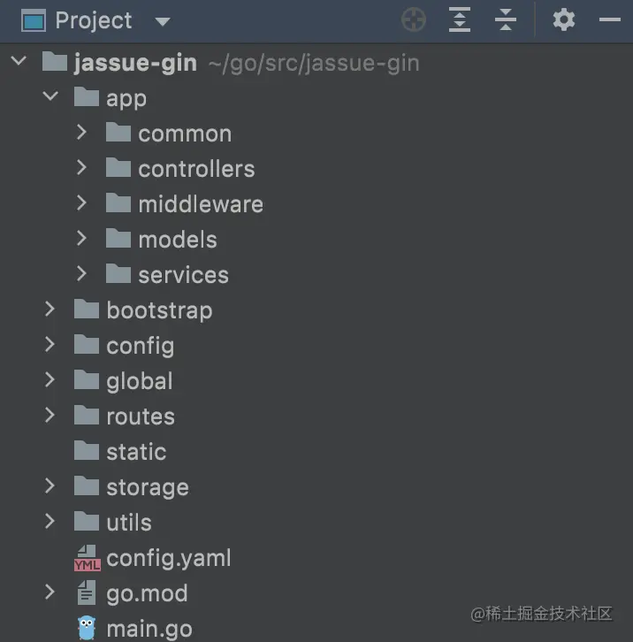

| 文件/目录名称   | 说明                           |
| --------------- | ------------------------------ |
| app/common      | 公共模块（请求、响应结构体等） |
| app/controllers | 业务调度器                     |
| app/middleware  | 中间件                         |
| app/models      | 数据库结构体                   |
| app/services    | 业务层                         |
| bootstrap       | 项目启动初始化                 |
| config          | 配置结构体                     |
| global          | 全局变量                       |
| routes          | 路由定义                       |
| static          | 静态资源（允许外部访问）       |
| storage         | 系统日志、文件等静态资源）     |
| utils           | 工具函数                       |
| config.yaml     | 配置文件                       |
| main.go         | 项目启动文件                   |

### 初始化项目

1. 先在 `~/go/src` 目录下创建一个目录 `jassue-gin` 用来存放项目代码

```shell
mkdir ~/go/src/jassue-gin

```

1. 在项目根目录下，初始化 `go.mod` 文件

```shell
go mod init jassue-gin
```

1. 安装 Gin

```shell
go get -u github.com/gin-gonic/gin
```

1. 在项目根目录下编写 `main.go` 文件

```go
package main

import (
    "github.com/gin-gonic/gin"
    "net/http"
)

func main() {
    r := gin.Default()

    // 测试路由
    r.GET("/ping", func(c *gin.Context) {
        c.String(http.StatusOK, "pong")
    })

    // 启动服务器
    r.Run(":8080")
}
```

### 启动应用 & 测试

执行 `go run main.go` 启动应用

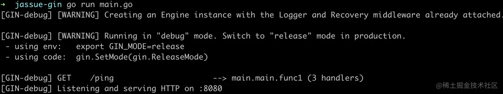

可以看到 HTTP 服务器启动成功，打开 [http://127.0.0.1:8080/ping](https://link.juejin.cn?target=http%3A%2F%2F127.0.0.1%3A8080%2Fping) 测试路由


## 二、配置初始化 & 全局变量

### 前言

配置文件是每个项目必不可少的部分，用来保存应用基本数据、数据库配置等信息，避免要修改一个配置项需要到处找的尴尬。这里我使用 [viper](https://link.juejin.cn?target=https%3A%2F%2Fgithub.com%2Fspf13%2Fviper) 作为配置管理方案，它支持 JSON、TOML、YAML、HCL、envfile、Java properties 等多种格式的配置文件，并且能够监听配置文件的修改，进行热重载，详细介绍大家可以去官方文档查看

### 安装

```shell
go get -u github.com/spf13/viper
```

### 编写配置文件

在项目根目录下新建一个文件 `config.yaml` ，初期先将项目的基本配置放入，后续我们会添加更多配置信息

```yaml
app: # 应用基本配置
  env: local # 环境名称
  port: 8888 # 服务监听端口号
  app_name: gin-app # 应用名称
  app_url: http://localhost # 应用域名
```

### 编写配置结构体

在项目根目录下新建文件夹 `config`，用于存放所有配置对应的结构体

新建 `config.go` 文件，定义 `Configuration` 结构体，其 `App` 属性对应 `config.yaml` 中的 `app`

```go
package config

type Configuration struct {
    App App `mapstructure:"app" json:"app" yaml:"app"`
}
```

新建 `app.go` 文件，定义 `App` 结构体，其所有属性分别对应 `config.yaml` 中 `app` 下的所有配置

```go
package config

type App struct {
    Env string `mapstructure:"env" json:"env" yaml:"env"`
    Port string `mapstructure:"port" json:"port" yaml:"port"`
    AppName string `mapstructure:"app_name" json:"app_name" yaml:"app_name"`
    AppUrl string `mapstructure:"app_url" json:"app_url" yaml:"app_url"`
}
```

注意：配置结构体中 `mapstructure`  标签需对应 `config.ymal` 中的配置名称， `viper` 会根据标签 value 值把 `config.yaml` 的数据赋予给结构体

### 全局变量

新建 `global/app.go` 文件，定义 `Application` 结构体，用来存放一些项目启动时的变量，便于调用，目前先将 `viper` 结构体和 `Configuration` 结构体放入，后续会添加其他成员属性

```go
package global

import (
    "github.com/spf13/viper"
    "jassue-gin/config"
)

type Application struct {
    ConfigViper *viper.Viper
    Config config.Configuration
}

var App = new(Application)
```

### 使用 viper 载入配置

新建 `bootstrap/config.go` 文件，编写代码：

```go
package bootstrap

import (
    "fmt"
    "github.com/fsnotify/fsnotify"
    "github.com/spf13/viper"
    "jassue-gin/global"
    "os"
)

func InitializeConfig() *viper.Viper {
    // 设置配置文件路径
    config := "config.yaml"
    // 生产环境可以通过设置环境变量来改变配置文件路径
    if configEnv := os.Getenv("VIPER_CONFIG"); configEnv != "" {
        config = configEnv
    }

    // 初始化 viper
    v := viper.New()
    v.SetConfigFile(config)
    v.SetConfigType("yaml")
    if err := v.ReadInConfig(); err != nil {
        panic(fmt.Errorf("read config failed: %s \n", err))
    }

    // 监听配置文件
    v.WatchConfig()
    v.OnConfigChange(func(in fsnotify.Event) {
        fmt.Println("config file changed:", in.Name)
        // 重载配置
        if err := v.Unmarshal(&global.App.Config); err != nil {
            fmt.Println(err)
        }
    })
    // 将配置赋值给全局变量
    if err := v.Unmarshal(&global.App.Config); err != nil {
       fmt.Println(err)
    }

    return v
}

```

### 初始化配置

修改 `main.go` 文件

```go
package main

import (
    "github.com/gin-gonic/gin"
    "jassue-gin/bootstrap"
    "jassue-gin/global"
    "net/http"
)

func main() {
    // 初始化配置
    bootstrap.InitializeConfig()

    r := gin.Default()

    // 测试路由
    r.GET("/ping", func(c *gin.Context) {
        c.String(http.StatusOK, "pong")
    })

    // 启动服务器
    r.Run(":" + global.App.Config.App.Port)
}

```

执行 `go run main.go` ，启动应用，服务器监听的端口是已经是配置文件里的端口号了

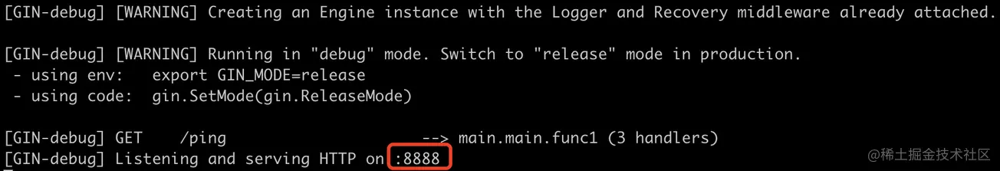

## 三、日志初始化

### 前言

本篇来讲一下怎么将日志服务集成到项目中，它也是框架中必不可少的，平时代码调试，线上 Bug 分析都离不开它。这里将使用 [zap](https://link.juejin.cn?target=https%3A%2F%2Fgithub.com%2Fuber-go%2Fzap) 作为日志库，一般来说，日志都是需要写入到文件保存的，这也是 zap 唯一缺少的部分，所以我将结合 [lumberjack](https://link.juejin.cn?target=https%3A%2F%2Fgithub.com%2Fnatefinch%2Flumberjack) 来使用，实现日志切割归档的功能

### 安装

```shell
go get -u go.uber.org/zap

go get -u gopkg.in/natefinch/lumberjack.v2

```

### 定义日志配置项

新建 `config/log.go` 文件，定义 `zap` 和 `lumberjack` 初始化需要使用的配置项，大家可以根据自己的喜好去定制

```go
package config

type Log struct {
    Level string `mapstructure:"level" json:"level" yaml:"level"`
    RootDir string `mapstructure:"root_dir" json:"root_dir" yaml:"root_dir"`
    Filename string `mapstructure:"filename" json:"filename" yaml:"filename"`
    Format string `mapstructure:"format" json:"format" yaml:"format"`
    ShowLine bool `mapstructure:"show_line" json:"show_line" yaml:"show_line"`
    MaxBackups int `mapstructure:"max_backups" json:"max_backups" yaml:"max_backups"`
    MaxSize int `mapstructure:"max_size" json:"max_size" yaml:"max_size"` // MB
    MaxAge int `mapstructure:"max_age" json:"max_age" yaml:"max_age"` // day
    Compress bool `mapstructure:"compress" json:"compress" yaml:"compress"`
}

```

`config/config.go` 添加 `Log` 成员属性

```go
package config

type Configuration struct {
    App App `mapstructure:"app" json:"app" yaml:"app"`
    Log Log `mapstructure:"log" json:"log" yaml:"log"`
}

```

`config.yaml` 增加对应配置项

```yaml
log:
  level: info # 日志等级
  root_dir: ./storage/logs # 日志根目录
  filename: app.log # 日志文件名称
  format: # 写入格式 可选json
  show_line: true # 是否显示调用行
  max_backups: 3 # 旧文件的最大个数
  max_size: 500 # 日志文件最大大小（MB）
  max_age: 28 # 旧文件的最大保留天数
  compress: true # 是否压缩

```

### 定义 utils 工具函数

新建 `utils/directory.go` 文件，编写 `PathExists` 函数，用于判断路径是否存在

```go
package utils

import "os"

func PathExists(path string) (bool, error) {
    _, err := os.Stat(path)
    if err == nil {
        return true, nil
    }
    if os.IsNotExist(err) {
        return false, nil
    }
    return false, err
}

```

### 初始化 zap

`zap` 的具体使用说明可查看[官方文档](https://link.juejin.cn?target=https%3A%2F%2Fpkg.go.dev%2Fgo.uber.org%2Fzap)

新建 `bootstrap/log.go` 文件，编写：

```go
package bootstrap

import (
    "go.uber.org/zap"
    "go.uber.org/zap/zapcore"
    "gopkg.in/natefinch/lumberjack.v2"
    "jassue-gin/global"
    "jassue-gin/utils"
    "os"
    "time"
)

var (
    level zapcore.Level // zap 日志等级
    options []zap.Option // zap 配置项
)

func InitializeLog() *zap.Logger {
    // 创建根目录
    createRootDir()

    // 设置日志等级
    setLogLevel()

    if global.App.Config.Log.ShowLine {
        options = append(options, zap.AddCaller())
    }

    // 初始化 zap
    return zap.New(getZapCore(), options...)
}

func createRootDir() {
    if ok, _ := utils.PathExists(global.App.Config.Log.RootDir); !ok {
        _ = os.Mkdir(global.App.Config.Log.RootDir, os.ModePerm)
    }
}

func setLogLevel() {
    switch global.App.Config.Log.Level {
    case "debug":
        level = zap.DebugLevel
        options = append(options, zap.AddStacktrace(level))
    case "info":
        level = zap.InfoLevel
    case "warn":
        level = zap.WarnLevel
    case "error":
        level = zap.ErrorLevel
        options = append(options, zap.AddStacktrace(level))
    case "dpanic":
        level = zap.DPanicLevel
    case "panic":
        level = zap.PanicLevel
    case "fatal":
        level = zap.FatalLevel
    default:
        level = zap.InfoLevel
    }
}

// 扩展 Zap
func getZapCore() zapcore.Core {
    var encoder zapcore.Encoder

    // 调整编码器默认配置
    encoderConfig := zap.NewProductionEncoderConfig()
    encoderConfig.EncodeTime = func(time time.Time, encoder zapcore.PrimitiveArrayEncoder) {
        encoder.AppendString(time.Format("[" + "2006-01-02 15:04:05.000" + "]"))
    }
    encoderConfig.EncodeLevel = func(l zapcore.Level, encoder zapcore.PrimitiveArrayEncoder) {
        encoder.AppendString(global.App.Config.App.Env + "." + l.String())
    }

    // 设置编码器
    if global.App.Config.Log.Format == "json" {
        encoder = zapcore.NewJSONEncoder(encoderConfig)
    } else {
        encoder = zapcore.NewConsoleEncoder(encoderConfig)
    }

    return zapcore.NewCore(encoder, getLogWriter(), level)
}

// 使用 lumberjack 作为日志写入器
func getLogWriter() zapcore.WriteSyncer {
    file := &lumberjack.Logger{
        Filename:   global.App.Config.Log.RootDir + "/" + global.App.Config.Log.Filename,
        MaxSize:    global.App.Config.Log.MaxSize,
        MaxBackups: global.App.Config.Log.MaxBackups,
        MaxAge:     global.App.Config.Log.MaxAge,
        Compress:   global.App.Config.Log.Compress,
    }

    return zapcore.AddSync(file)
}
```

### 定义全局变量 Log

在 `global/app.go` 中，添加 `Log` 成员属性

```go
package global

import (
    "github.com/spf13/viper"
    "go.uber.org/zap"
    "jassue-gin/config"
)

type Application struct {
    ConfigViper *viper.Viper
    Config config.Configuration
    Log *zap.Logger
}

var App = new(Application)
```

### 测试

在 `main.go` 中调用日志初始化函数，并尝试写入日志

```go
package main

import (
    "github.com/gin-gonic/gin"
    "jassue-gin/bootstrap"
    "jassue-gin/global"
    "net/http"
)

func main() {
    // 初始化配置
    bootstrap.InitializeConfig()

    // 初始化日志
    global.App.Log = bootstrap.InitializeLog()
    global.App.Log.Info("log init success!")

    r := gin.Default()

    // 测试路由
    r.GET("/ping", func(c *gin.Context) {
        c.String(http.StatusOK, "pong")
    })

    // 启动服务器
    r.Run(":" + global.App.Config.App.Port)
}
```

启动 `main.go` ，生成 `storage/logs/app.log` 文件，表示日志初始化成功，文件内容显示如下：

```
[2021-10-12 19:17:46.997]	local.info	jassue-gin/main.go:16	log init success!
```

## 四、数据库初始化（GORM)

### 前言

许多框架都会引入 ORM 模型来表示模型类和数据库表的映射关系，这一篇将使用 [gorm](https://link.juejin.cn?target=https%3A%2F%2Fgithub.com%2Fgo-gorm%2Fgorm) 作为 ORM 库，它遵循了 ActiveRecord（模型与数据库表一一对应） 模式，并且提供了强大的功能，例如模型关联、关联预加载、数据库迁移等，更多内容查看[官方文档](https://link.juejin.cn?target=https%3A%2F%2Fgorm.io%2Fdocs%2F)

### 安装

```shell
go get -u gorm.io/gorm

# GORM 官方支持 sqlite、mysql、postgres、sqlserver
go get -u gorm.io/driver/mysql
```

### 定义配置项

新建 `config/database.go` 文件，自定义配置项

```go
package config

type Database struct {
    Driver string `mapstructure:"driver" json:"driver" yaml:"driver"`
    Host string `mapstructure:"host" json:"host" yaml:"host"`
    Port int `mapstructure:"port" json:"port" yaml:"port"`
    Database string `mapstructure:"database" json:"database" yaml:"database"`
    UserName string `mapstructure:"username" json:"username" yaml:"username"`
    Password string `mapstructure:"password" json:"password" yaml:"password"`
    Charset string `mapstructure:"charset" json:"charset" yaml:"charset"`
    MaxIdleConns int `mapstructure:"max_idle_conns" json:"max_idle_conns" yaml:"max_idle_conns"`
    MaxOpenConns int `mapstructure:"max_open_conns" json:"max_open_conns" yaml:"max_open_conns"`
    LogMode string `mapstructure:"log_mode" json:"log_mode" yaml:"log_mode"`
    EnableFileLogWriter bool `mapstructure:"enable_file_log_writer" json:"enable_file_log_writer" yaml:"enable_file_log_writer"`
    LogFilename string `mapstructure:"log_filename" json:"log_filename" yaml:"log_filename"`
}
```

`config/config.go` 添加 `Database` 成员属性

```go
package config

type Configuration struct {
    App App `mapstructure:"app" json:"app" yaml:"app"`
    Log Log `mapstructure:"log" json:"log" yaml:"log"`
    Database Database `mapstructure:"database" json:"database" yaml:"database"`
}
```

`config.yaml` 增加对应配置项

```yaml
database:
  driver: mysql # 数据库驱动
  host: 127.0.0.1 # 域名
  port: 8306 # 端口号
  database: go-test # 数据库名称
  username: root # 用户名
  password: root # 密码
  charset: utf8mb4 # 编码格式
  max_idle_conns: 10 # 空闲连接池中连接的最大数量
  max_open_conns: 100 # 打开数据库连接的最大数量
  log_mode: info # 日志级别
  enable_file_log_writer: true # 是否启用日志文件
  log_filename: sql.log # 日志文件名称
```

### 自定义 Logger（使用文件记录日志）

`gorm` 有一个默认的 [logger](https://link.juejin.cn?target=https%3A%2F%2Fgithub.com%2Fgo-gorm%2Fgorm%2Fblob%2Fmaster%2Flogger%2Flogger.go) ，由于日志内容是输出到控制台的，我们需要自定义一个写入器，将默认`logger.Writer` 接口的实现切换为自定义的写入器，上一篇引入了 `lumberjack` ，将继续使用它

新建 `bootstrap/db.go` 文件，编写 `getGormLogWriter` 函数：

```go
package bootstrap

import (
    "gopkg.in/natefinch/lumberjack.v2"
    "gorm.io/gorm/logger"
    "io"
    "jassue-gin/global"
    "log"
    "os"
)

// 自定义 gorm Writer
func getGormLogWriter() logger.Writer {
    var writer io.Writer
    
    // 是否启用日志文件
    if global.App.Config.Database.EnableFileLogWriter {
        // 自定义 Writer
        writer = &lumberjack.Logger{
            Filename:   global.App.Config.Log.RootDir + "/" + global.App.Config.Database.LogFilename,
            MaxSize:    global.App.Config.Log.MaxSize,
            MaxBackups: global.App.Config.Log.MaxBackups,
            MaxAge:     global.App.Config.Log.MaxAge,
            Compress:   global.App.Config.Log.Compress,
        }
    } else {
        // 默认 Writer
        writer = os.Stdout
    }
    return log.New(writer, "\r\n", log.LstdFlags)
}
```

接下来，编写 `getGormLogger` 函数， 切换默认 `Logger` 使用的 `Writer`

```go
func getGormLogger() logger.Interface {
    var logMode logger.LogLevel

    switch global.App.Config.Database.LogMode {
    case "silent":
        logMode = logger.Silent
    case "error":
        logMode = logger.Error
    case "warn":
        logMode = logger.Warn
    case "info":
        logMode = logger.Info
    default:
        logMode = logger.Info
    }

    return logger.New(getGormLogWriter(), logger.Config{
        SlowThreshold:             200 * time.Millisecond, // 慢 SQL 阈值
        LogLevel:                  logMode, // 日志级别
        IgnoreRecordNotFoundError: false, // 忽略ErrRecordNotFound（记录未找到）错误
        Colorful:                  !global.App.Config.Database.EnableFileLogWriter, // 禁用彩色打印
    })
}
```

至此，自定义 Logger 就已经实现了，这里只简单替换了 `logger.Writer` 的实现，大家可以根据各自的需求做其它定制化配置

### 初始化数据库

在 `bootstrap/db.go` 文件中，编写 `InitializeDB` 初始化数据库函数，以便于在 `main.go` 中调用

```go
package bootstrap

import (
    "gopkg.in/natefinch/lumberjack.v2"
    "gorm.io/driver/mysql"
    "gorm.io/gorm"
    "gorm.io/gorm/logger"
    "io"
    "jassue-gin/global"
    "log"
    "os"
    "strconv"
    "time"
)

func InitializeDB() *gorm.DB {
    // 根据驱动配置进行初始化
    switch global.App.Config.Database.Driver {
    case "mysql":
       return initMySqlGorm()
    default:
       return initMySqlGorm()
    }
}

// 初始化 mysql gorm.DB
func initMySqlGorm() *gorm.DB {
    dbConfig := global.App.Config.Database

    if dbConfig.Database == "" {
        return nil
    }
    dsn := dbConfig.UserName + ":" + dbConfig.Password + "@tcp(" + dbConfig.Host + ":" + strconv.Itoa(dbConfig.Port) + ")/" +
        dbConfig.Database + "?charset=" + dbConfig.Charset +"&parseTime=True&loc=Local"
    mysqlConfig := mysql.Config{
        DSN:                       dsn,   // DSN data source name
        DefaultStringSize:         191,   // string 类型字段的默认长度
        DisableDatetimePrecision:  true,  // 禁用 datetime 精度，MySQL 5.6 之前的数据库不支持
        DontSupportRenameIndex:    true,  // 重命名索引时采用删除并新建的方式，MySQL 5.7 之前的数据库和 MariaDB 不支持重命名索引
        DontSupportRenameColumn:   true,  // 用 `change` 重命名列，MySQL 8 之前的数据库和 MariaDB 不支持重命名列
        SkipInitializeWithVersion: false, // 根据版本自动配置
    }
    if db, err := gorm.Open(mysql.New(mysqlConfig), &gorm.Config{
        DisableForeignKeyConstraintWhenMigrating: true, // 禁用自动创建外键约束
        Logger: getGormLogger(), // 使用自定义 Logger
    }); err != nil {
        global.App.Log.Error("mysql connect failed, err:", zap.Any("err", err))
        return nil
    } else {
        sqlDB, _ := db.DB()
        sqlDB.SetMaxIdleConns(dbConfig.MaxIdleConns)
        sqlDB.SetMaxOpenConns(dbConfig.MaxOpenConns)
        return db
    }
}

func getGormLogger() logger.Interface {
    var logMode logger.LogLevel

    switch global.App.Config.Database.LogMode {
    case "silent":
        logMode = logger.Silent
    case "error":
        logMode = logger.Error
    case "warn":
        logMode = logger.Warn
    case "info":
        logMode = logger.Info
    default:
        logMode = logger.Info
    }

    return logger.New(getGormLogWriter(), logger.Config{
        SlowThreshold:             200 * time.Millisecond, // 慢 SQL 阈值
        LogLevel:                  logMode, // 日志级别
        IgnoreRecordNotFoundError: false, // 忽略ErrRecordNotFound（记录未找到）错误
        Colorful:                  !global.App.Config.Database.EnableFileLogWriter, // 禁用彩色打印
    })
}

// 自定义 gorm Writer
func getGormLogWriter() logger.Writer {
    var writer io.Writer

    // 是否启用日志文件
    if global.App.Config.Database.EnableFileLogWriter {
        // 自定义 Writer
        writer = &lumberjack.Logger{
            Filename:   global.App.Config.Log.RootDir + "/" + global.App.Config.Database.LogFilename,
            MaxSize:    global.App.Config.Log.MaxSize,
            MaxBackups: global.App.Config.Log.MaxBackups,
            MaxAge:     global.App.Config.Log.MaxAge,
            Compress:   global.App.Config.Log.Compress,
        }
    } else {
        // 默认 Writer
        writer = os.Stdout
    }
    return log.New(writer, "\r\n", log.LstdFlags)
}
```

### 编写模型文件进行数据库迁移

新建 `app/models/common.go` 文件，定义公用模型字段

```go
package models

import (
    "gorm.io/gorm"
    "time"
)

// 自增ID主键
type ID struct {
    ID uint `json:"id" gorm:"primaryKey"`
}

// 创建、更新时间
type Timestamps struct {
    CreatedAt time.Time `json:"created_at"`
    UpdatedAt time.Time `json:"updated_at"`
}

// 软删除
type SoftDeletes struct {
    DeletedAt gorm.DeletedAt `json:"deleted_at" gorm:"index"`
}
```

新建 `app/models/user.go` 文件，定义 `User` 模型

```go
package models

type User struct {
    ID
    Name string `json:"name" gorm:"not null;comment:用户名称"`
    Mobile string `json:"mobile" gorm:"not null;index;comment:用户手机号"`
    Password string `json:"password" gorm:"not null;default:'';comment:用户密码"`
    Timestamps
    SoftDeletes
}
```

在 `bootstrap/db.go` 文件中，编写数据库表初始化代码

```go
func initMySqlGorm() *gorm.DB {
    // ...
    if db, err := gorm.Open(mysql.New(mysqlConfig), &gorm.Config{
        DisableForeignKeyConstraintWhenMigrating: true, // 禁用自动创建外键约束
        Logger: getGormLogger(), // 使用自定义 Logger
    }); err != nil {
        return nil
    } else {
        sqlDB, _ := db.DB()
        sqlDB.SetMaxIdleConns(dbConfig.MaxIdleConns)
        sqlDB.SetMaxOpenConns(dbConfig.MaxOpenConns)
        initMySqlTables(db)
        return db
    }
}

// 数据库表初始化
func initMySqlTables(db *gorm.DB) {
    err := db.AutoMigrate(
        models.User{},
    )
    if err != nil {
        global.App.Log.Error("migrate table failed", zap.Any("err", err))
        os.Exit(0)
    }
}
```

### 定义全局变量 DB

在 `global/app.go` 中，编写：

```go
package global

import (
    "github.com/spf13/viper"
    "go.uber.org/zap"
    "gorm.io/gorm"
    "jassue-gin/config"
)

type Application struct {
    ConfigViper *viper.Viper
    Config config.Configuration
    Log *zap.Logger
    DB *gorm.DB
}

var App = new(Application)
```

### 测试

在 `main.go` 中调用数据库初始化函数

```go
package main

import (
    "github.com/gin-gonic/gin"
    "jassue-gin/bootstrap"
    "jassue-gin/global"
    "net/http"
)

func main() {
    // 初始化配置
    bootstrap.InitializeConfig()

    // 初始化日志
    global.App.Log = bootstrap.InitializeLog()
    global.App.Log.Info("log init success!")

    // 初始化数据库
    global.App.DB = bootstrap.InitializeDB()
    // 程序关闭前，释放数据库连接
    defer func() {
        if global.App.DB != nil {
            db, _ := global.App.DB.DB()
            db.Close()
        }
    }()

    r := gin.Default()

    // 测试路由
    r.GET("/ping", func(c *gin.Context) {
        c.String(http.StatusOK, "pong")
    })

    // 启动服务器
    r.Run(":" + global.App.Config.App.Port)
}
```

启动 `main.go` ，由于我还没有创建 `go-test` 数据库，并且调整了 `logger.Writer` 为 `lumberjack`，所以会生成 `storage/logs/sql.log` 文件，文件内容如下：

```
2021/10/13 19:17:47 /Users/sujunjie/go/src/jassue-gin/bootstrap/db.go:44
[error] failed to initialize database, got error Error 1049: Unknown database 'go-test'
```

创建 `go-test` 数据库，重新启动 `main.go` ，`users` 表创建成功

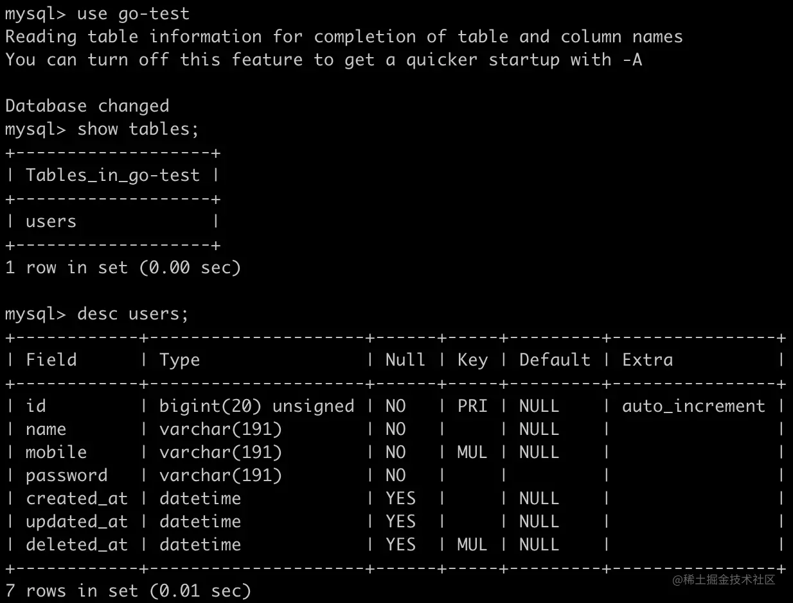

## 五、静态资源处理 & 优雅重启服务器

### 前言

这一篇将对路由进行分组调整，把定义路由的文件集中到同一个目录下，并处理前端项目打包后的静态文件。在 Go 1.8 及以上版本中，内置的 `http.Server` 提供了 `Shutdown()` 方法，支持平滑重启服务器，本次将使用它调整项目启动代码，若 Go 版本低于 1.8 可以使用 [fvbock/endless](https://link.juejin.cn?target=https%3A%2F%2Fgithub.com%2Ffvbock%2Fendless) 来替代

### 路由分组调整

新建 `routes/api.go` 文件，用来存放 `api` 分组路由

```go
package routes

import (
    "github.com/gin-gonic/gin"
    "net/http"
)

// SetApiGroupRoutes 定义 api 分组路由
func SetApiGroupRoutes(router *gin.RouterGroup) {
    router.GET("/ping", func(c *gin.Context) {
        c.String(http.StatusOK, "pong")
    })
}
```

新建 `bootstrap/router.go` 文件，编写

```go
package bootstrap

import (
    "github.com/gin-gonic/gin"
    "jassue-gin/global"
    "jassue-gin/routes"
)

func setupRouter() *gin.Engine {
    router := gin.Default()

    // 注册 api 分组路由
    apiGroup := router.Group("/api")
    routes.SetApiGroupRoutes(apiGroup)

    return router
}

// RunServer 启动服务器
func RunServer() {
    r := setupRouter()
    r.Run(":" + global.App.Config.App.Port)
}
```

若之后还有其它的分组路由，可以先在 `routes` 目录下新建一个文件，编写定义路由的方法，然后再到 `bootstrap/router.go` 调用注册

在 `main.go` 文件中调用 `RunServer()` 方法

```go
package main

import (
    "jassue-gin/bootstrap"
    "jassue-gin/global"
)

func main() {
    // 初始化配置
    bootstrap.InitializeConfig()

    // 初始化日志
    global.App.Log = bootstrap.InitializeLog()
    global.App.Log.Info("log init success!")

    // 初始化数据库
    global.App.DB = bootstrap.InitializeDB()
    // 程序关闭前，释放数据库连接
    defer func() {
        if global.App.DB != nil {
            db, _ := global.App.DB.DB()
            db.Close()
        }
    }()

    // 启动服务器
    bootstrap.RunServer()
}
```

### 静态资源处理

在  `bootstrap/router.go`  文件，`setupRouter()` 方法中编写：

```go
func setupRouter() *gin.Engine {
    router := gin.Default()

    // 前端项目静态资源
    router.StaticFile("/", "./static/dist/index.html")
    router.Static("/assets", "./static/dist/assets")
    router.StaticFile("/favicon.ico", "./static/dist/favicon.ico")
    // 其他静态资源
    router.Static("/public", "./static")
    router.Static("/storage", "./storage/app/public")

    // 注册 api 分组路由
    apiGroup := router.Group("/api")
    routes.SetApiGroupRoutes(apiGroup)

    return router
}
```

使用 `docker` 快速打包一份前端项目文件：

```shell
# 创建 node环境 容器
docker run -idt --name vue-app jassue/node
# 进入容器
docker exec -it vue-app bash
# 初始化 vue 模板
npm init @vitejs/app . --template vue-ts
# 安装项目依赖
npm install
# 打包
npm run build
# 退出容器
exit
# 拷贝前端文件到 go 项目静态资源文件夹
docker cp vue-app:/app/dist ~/go/src/jassue-gin/static
```

启动 `main.go` ，访问 [http://localhost:8888/](https://link.juejin.cn?target=http%3A%2F%2Flocalhost%3A8888%2F) ，前端资源处理成功

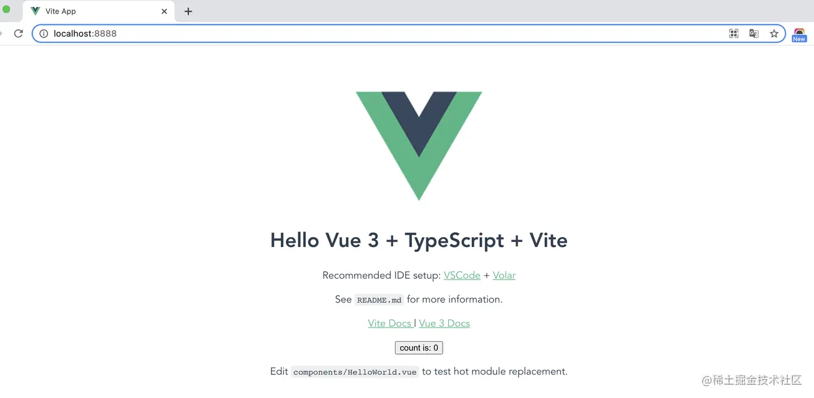

### 优雅重启/停止服务器

在 `bootstrap/router.go` 文件中，调整 `RunServer()` 方法

```go
package bootstrap

import (
    "context"
    "github.com/gin-gonic/gin"
    "jassue-gin/global"
    "jassue-gin/routes"
    "log"
    "net/http"
    "os"
    "os/signal"
    "syscall"
    "time"
)

//...

func RunServer() {
   r := setupRouter()

   srv := &http.Server{
       Addr:    ":" + global.App.Config.App.Port,
       Handler: r,
   }

   go func() {
       if err := srv.ListenAndServe(); err != nil && err != http.ErrServerClosed {
           log.Fatalf("listen: %s\n", err)
       }
   }()

   // 等待中断信号以优雅地关闭服务器（设置 5 秒的超时时间）
   quit := make(chan os.Signal)
   signal.Notify(quit, syscall.SIGINT, syscall.SIGTERM)
   <-quit
   log.Println("Shutdown Server ...")

   ctx, cancel := context.WithTimeout(context.Background(), 5*time.Second)
   defer cancel()
   if err := srv.Shutdown(ctx); err != nil {
       log.Fatal("Server Shutdown:", err)
   }
   log.Println("Server exiting")
}
```

在 `routes/api.go` 中，添加一条测试路由：

```go
router.GET("/test", func(c *gin.Context) {
    time.Sleep(5*time.Second)
    c.String(http.StatusOK, "success")
})
```

启动 `main.go`，访问 [http://localhost:8888/api/test](https://link.juejin.cn?target=http%3A%2F%2Flocalhost%3A8888%2Fapi%2Ftest) ，使用 `CTRL + C` 停止服务器，如下图所示：

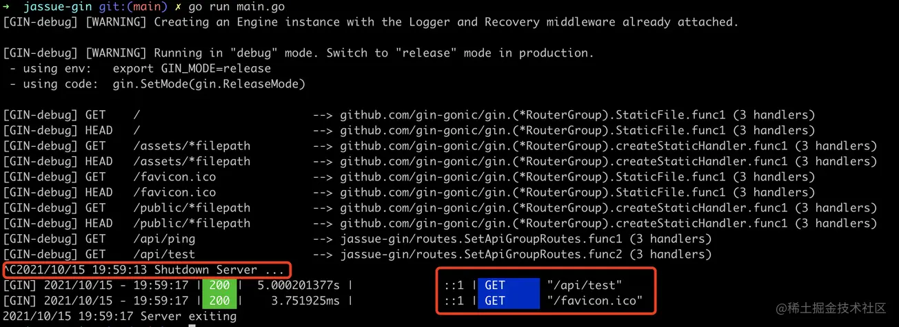

服务器接收到中止命令后，依旧等待 `/api/test` 接口完成响应后才停止服务器

## 六、初始化 Validator & 封装 Response & 实现第一个接口

### 前言

`Gin ` 自带验证器返回的错误信息格式不太友好，本篇将进行调整，实现自定义错误信息，并规范接口返回的数据格式，分别为每种类型的错误定义错误码，前端可以根据对应的错误码实现后续不同的逻辑操作，篇末会使用自定义的 Validator 和 Response 实现第一个接口

### 自定义验证器错误信息

新建 `app/common/request/validator.go` 文件，编写：

```go
package request

import (
   "github.com/go-playground/validator/v10"
)

type Validator interface {
   GetMessages() ValidatorMessages
}

type ValidatorMessages map[string]string

// GetErrorMsg 获取错误信息
func GetErrorMsg(request interface{}, err error) string {
   if _, isValidatorErrors := err.(validator.ValidationErrors); isValidatorErrors {
      _, isValidator := request.(Validator)

      for _, v := range err.(validator.ValidationErrors) {
         // 若 request 结构体实现 Validator 接口即可实现自定义错误信息
         if isValidator {
            if message, exist := request.(Validator).GetMessages()[v.Field() + "." + v.Tag()]; exist {
               return message
            }
         }
         return v.Error()
      }
   }

   return "Parameter error"
}
```

新建 `app/common/request/user.go` 文件，用来存放所有用户相关的请求结构体，并实现 `Validator` 接口

```go
package request

type Register struct {
    Name string `form:"name" json:"name" binding:"required"`
    Mobile string `form:"mobile" json:"mobile" binding:"required"`
    Password string `form:"password" json:"password" binding:"required"`
}

// 自定义错误信息
func (register Register) GetMessages() ValidatorMessages {
    return ValidatorMessages{
        "Name.required": "用户名称不能为空",
        "Mobile.required": "手机号码不能为空",
        "Password.required": "用户密码不能为空",
    }
}
```

在 `routes/api.go` 中编写测试代码

```go
package routes

import (
    "github.com/gin-gonic/gin"
    "jassue-gin/app/common/request"
    "net/http"
    "time"
)

// SetApiGroupRoutes 定义 api 分组路由
func SetApiGroupRoutes(router *gin.RouterGroup) {
    //...
    router.POST("/user/register", func(c *gin.Context) {
        var form request.Register
        if err := c.ShouldBindJSON(&form); err != nil {
           c.JSON(http.StatusOK, gin.H{
               "error": request.GetErrorMsg(form, err),
           })
           return
        }
        c.JSON(http.StatusOK, gin.H{
            "message": "success",
        })
    })
}
```

启动服务器，使用 `Postman` 测试，如下图所示，自定义错误信息成功

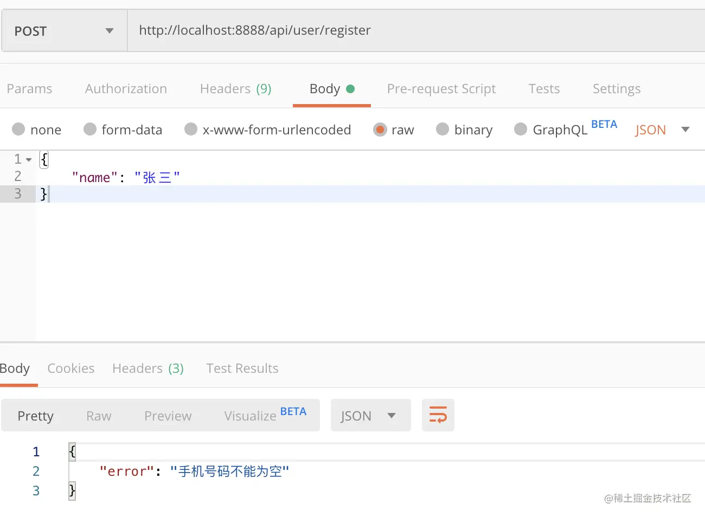

### 自定义验证器

有一些验证规则在 `Gin` 框架中是没有的，这个时候我们就需要自定义验证器

新建 `utils/validator.go` 文件，定义验证规则，后续有其他的验证规则将统一存放在这里

```go
package utils

import (
    "github.com/go-playground/validator/v10"
    "regexp"
)

// ValidateMobile 校验手机号
func ValidateMobile(fl validator.FieldLevel) bool {
    mobile := fl.Field().String()
    ok, _ := regexp.MatchString(`^(13[0-9]|14[01456879]|15[0-35-9]|16[2567]|17[0-8]|18[0-9]|19[0-35-9])\d{8}$`, mobile)
    if !ok {
        return false
    }
    return true
}
```

新建 `bootstrap/validator.go` 文件，定制 `Gin` 框架 `Validator` 的属性

```go
package bootstrap

import (
    "github.com/gin-gonic/gin/binding"
    "github.com/go-playground/validator/v10"
    "jassue-gin/utils"
    "reflect"
    "strings"
)

func InitializeValidator() {
    if v, ok := binding.Validator.Engine().(*validator.Validate); ok {
        // 注册自定义验证器
        _ = v.RegisterValidation("mobile", utils.ValidateMobile)

        // 注册自定义 json tag 函数
        v.RegisterTagNameFunc(func(fld reflect.StructField) string {
            name := strings.SplitN(fld.Tag.Get("json"), ",", 2)[0]
            if name == "-" {
                return ""
            }
            return name
        })
    }
}
```

在 `main.go` 中调用

```go
package main

import (
    "jassue-gin/bootstrap"
    "jassue-gin/global"
)

func main() {
    // ...
    
    // 初始化验证器
    bootstrap.InitializeValidator()

    // 启动服务器
    bootstrap.RunServer()
}
```

在 `app/common/request/user.go` 文件，增加 `Resister` 请求结构体中 `Mobile` 属性的验证 tag

**注：由于在 `InitializeValidator()`  方法中，使用 `RegisterTagNameFunc()` 注册了自定义 json tag， 所以在 `GetMessages()` 中自定义错误信息 key 值时，需使用 json tag 名称**

```go
package request

type Register struct {
    Name string `form:"name" json:"name" binding:"required"`
    Mobile string `form:"mobile" json:"mobile" binding:"required,mobile"`
    Password string `form:"password" json:"password" binding:"required"`
}


func (register Register) GetMessages() ValidatorMessages {
    return ValidatorMessages{
        "name.required": "用户名称不能为空",
        "mobile.required": "手机号码不能为空",
        "mobile.mobile": "手机号码格式不正确",
        "password.required": "用户密码不能为空",
    }
}
```

重启服务器，使用 `PostMan` 测试，如下图所示，自定义验证器成功

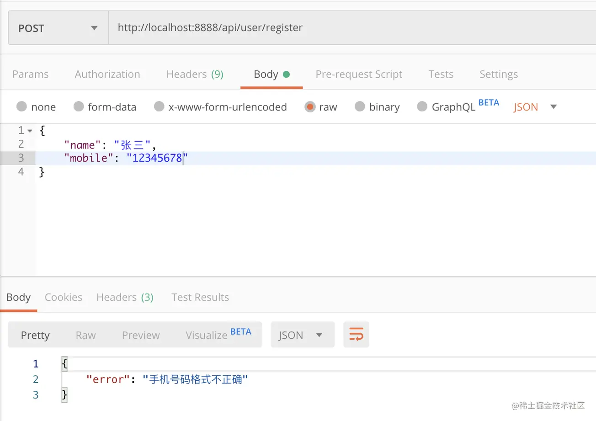

### 自定义错误码

新建 `global/error.go` 文件，将项目中可能存在的错误都统一存放到这里，为每一种类型错误都定义一个错误码，便于在开发过程快速定位错误，前端也可以根据不同错误码实现不同逻辑的页面交互

```go
package global

type CustomError struct {
    ErrorCode int
    ErrorMsg string
}

type CustomErrors struct {
    BusinessError CustomError
    ValidateError CustomError
}

var Errors = CustomErrors{
    BusinessError: CustomError{40000, "业务错误"},
    ValidateError: CustomError{42200, "请求参数错误"},
}
```

### 封装 Response

新建 `app/common/response/response.go` 文件，编写：

```go
package response

import (
    "github.com/gin-gonic/gin"
    "jassue-gin/global"
    "net/http"
)

// 响应结构体
type Response struct {
    ErrorCode int `json:"error_code"` // 自定义错误码
    Data interface{} `json:"data"` // 数据
    Message string `json:"message"` // 信息
}

// Success 响应成功 ErrorCode 为 0 表示成功
func Success(c *gin.Context, data interface{}) {
    c.JSON(http.StatusOK, Response{
        0,
        data,
        "ok",
    })
}

// Fail 响应失败 ErrorCode 不为 0 表示失败
func Fail(c *gin.Context, errorCode int, msg string) {
    c.JSON(http.StatusOK, Response{
        errorCode,
        nil,
        msg,
    })
}

// FailByError 失败响应 返回自定义错误的错误码、错误信息
func FailByError(c *gin.Context, error global.CustomError) {
    Fail(c, error.ErrorCode, error.ErrorMsg)
}

// ValidateFail 请求参数验证失败
func ValidateFail(c *gin.Context, msg string)  {
    Fail(c, global.Errors.ValidateError.ErrorCode, msg)
}

// BusinessFail 业务逻辑失败
func BusinessFail(c *gin.Context, msg string) {
    Fail(c, global.Errors.BusinessError.ErrorCode, msg)
}
```

### 实现用户注册接口

新建 `utils/bcrypt.go` 文件，编写密码加密及验证密码的方法

```go
package utils

import (
    "golang.org/x/crypto/bcrypt"
    "log"
)

func BcryptMake(pwd []byte) string {
    hash, err := bcrypt.GenerateFromPassword(pwd, bcrypt.MinCost)
    if err != nil {
        log.Println(err)
    }
    return string(hash)
}

func BcryptMakeCheck(pwd []byte, hashedPwd string) bool {
    byteHash := []byte(hashedPwd)
    err := bcrypt.CompareHashAndPassword(byteHash, pwd)
    if err != nil {
        return false
    }
    return true
}
```

新建 `app/services/user.go` 文件，编写用户注册逻辑

```go
package services

import (
    "errors"
    "jassue-gin/app/common/request"
    "jassue-gin/app/models"
    "jassue-gin/global"
    "jassue-gin/utils"
)

type userService struct {
}

var UserService = new(userService)

// Register 注册
func (userService *userService) Register(params request.Register) (err error, user models.User) {
    var result = global.App.DB.Where("mobile = ?", params.Mobile).Select("id").First(&models.User{})
    if result.RowsAffected != 0 {
        err = errors.New("手机号已存在")
        return
    }
    user = models.User{Name: params.Name, Mobile: params.Mobile, Password: utils.BcryptMake([]byte(params.Password))}
    err = global.App.DB.Create(&user).Error
    return
}
```

新建 `app/controllers/app/user.go` 文件，校验入参，调用 `UserService` 注册逻辑

```go
package app

import (
    "github.com/gin-gonic/gin"
    "jassue-gin/app/common/request"
    "jassue-gin/app/common/response"
    "jassue-gin/app/services"
)

// Register 用户注册
func Register(c *gin.Context) {
    var form request.Register
    if err := c.ShouldBindJSON(&form); err != nil {
        response.ValidateFail(c, request.GetErrorMsg(form, err))
        return
    }

    if err, user := services.UserService.Register(form); err != nil {
       response.BusinessFail(c, err.Error())
    } else {
       response.Success(c, user)
    }
}
```

在 `routes/api.go` 中，添加路由

```go
package routes

import (
    "github.com/gin-gonic/gin"
    "jassue-gin/app/controllers/app"
)

// SetApiGroupRoutes 定义 api 分组路由
func SetApiGroupRoutes(router *gin.RouterGroup) {
    router.POST("/auth/register", app.Register)
}
```

使用 `Postman` 调用接口 [http://localhost:8888/api/auth/register](https://link.juejin.cn?target=http%3A%2F%2Flocalhost%3A8888%2Fapi%2Fauth%2Fregister) ，如下图所示，接口返回成功

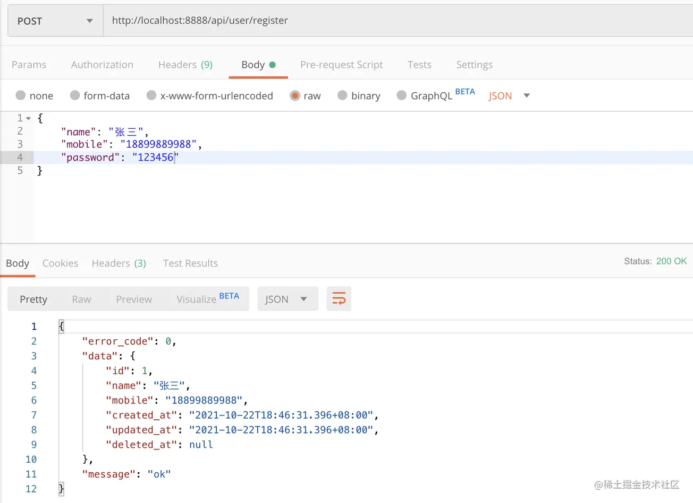

查看数据库 `users` 表，数据已成功写入

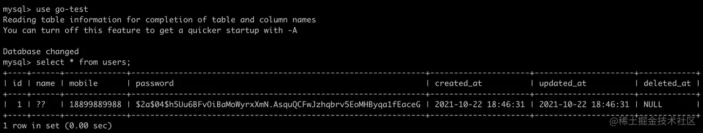

## 七、实现登录接口 & jwt 鉴权中间件

### 前言

这一篇将使用 [jwt-go](https://link.juejin.cn?target=https%3A%2F%2Fgithub.com%2Fdgrijalva%2Fjwt-go) 包来完成登录接口，颁发 `token` 令牌，并编写 jwt 中间件对 `token` 统一鉴权，避免在各个 `controller` 重复编写鉴权逻辑

### 安装

```shell
go get -u github.com/dgrijalva/jwt-go

```

### 定义配置项

新建 `config/jwt.go` 文件，编写配置

```go
package config

type Jwt struct {
    Secret string `mapstructure:"secret" json:"secret" yaml:"secret"`
    JwtTtl int64 `mapstructure:"jwt_ttl" json:"jwt_ttl" yaml:"jwt_ttl"` // token 有效期（秒）
}
```

在 `config/config.go` 中，添加 `Jwt` 属性

```go
package config

type Configuration struct {
    App App `mapstructure:"app" json:"app" yaml:"app"`
    Log Log `mapstructure:"log" json:"log" yaml:"log"`
    Database Database `mapstructure:"database" json:"database" yaml:"database"`
    Jwt Jwt `mapstructure:"jwt" json:"jwt" yaml:"jwt"`
}
```

`config.yaml` 添加对应配置

```yaml
jwt:
  secret: 3Bde3BGEbYqtqyEUzW3ry8jKFcaPH17fRmTmqE7MDr05Lwj95uruRKrrkb44TJ4s
  jwt_ttl: 43200

```

### 编写颁发 Token 逻辑

新建 `app/services/jwt.go` 文件，编写

```go
package services

import (
    "github.com/dgrijalva/jwt-go"
    "jassue-gin/global"
    "time"
)

type jwtService struct {
}

var JwtService = new(jwtService)

// 所有需要颁发 token 的用户模型必须实现这个接口
type JwtUser interface {
    GetUid() string
}

// CustomClaims 自定义 Claims
type CustomClaims struct {
    jwt.StandardClaims
}

const (
    TokenType = "bearer"
    AppGuardName = "app"
)

type TokenOutPut struct {
    AccessToken string `json:"access_token"`
    ExpiresIn int `json:"expires_in"`
    TokenType string `json:"token_type"`
}

// CreateToken 生成 Token
func (jwtService *jwtService) CreateToken(GuardName string, user JwtUser) (tokenData TokenOutPut, err error, token *jwt.Token) {
    token = jwt.NewWithClaims(
        jwt.SigningMethodHS256,
        CustomClaims{
            StandardClaims: jwt.StandardClaims{
                ExpiresAt: time.Now().Unix() + global.App.Config.Jwt.JwtTtl,
                Id:        user.GetUid(),
                Issuer:    GuardName, // 用于在中间件中区分不同客户端颁发的 token，避免 token 跨端使用
                NotBefore: time.Now().Unix() - 1000,
            },
        },
    )

    tokenStr, err := token.SignedString([]byte(global.App.Config.Jwt.Secret))

    tokenData = TokenOutPut{
        tokenStr,
        int(global.App.Config.Jwt.JwtTtl),
        TokenType,
    }
    return
}
```

CreateToken` 方法需要接收一个 `JwtUser` 实例对象，我们需要将 `app/models/user.go` 用户模型实现 `JwtUser` 接口， 后续其他的用户模型都可以通过实现 `JwtUser` 接口，来调用 `CreateToken()` 颁发 `Token`

```go
package models

import "strconv"

type User struct {
    ID
    Name string `json:"name" gorm:"not null;comment:用户名称"`
    Mobile string `json:"mobile" gorm:"not null;index;comment:用户手机号"`
    Password string `json:"-" gorm:"not null;default:'';comment:用户密码"`
    Timestamps
    SoftDeletes
}

func (user User) GetUid() string {
    return strconv.Itoa(int(user.ID.ID))
}
```

### 实现登录接口

在 `app/common/request/user.go` 中，新增 `Login` 验证器结构体

```go
type Login struct {
    Mobile string `form:"mobile" json:"mobile" binding:"required,mobile"`
    Password string `form:"password" json:"password" binding:"required"`
}

func (login Login) GetMessages() ValidatorMessages {
    return ValidatorMessages{
        "mobile.required": "手机号码不能为空",
        "mobile.mobile": "手机号码格式不正确",
        "password.required": "用户密码不能为空",
    }
}
```

在 `app/services/user.go` 中，编写 `Login()` 登录逻辑

```go
// Login 登录
func (userService *userService) Login(params request.Login) (err error, user *models.User) {
    err = global.App.DB.Where("mobile = ?", params.Mobile).First(&user).Error
    if err != nil || !utils.BcryptMakeCheck([]byte(params.Password), user.Password) {
        err = errors.New("用户名不存在或密码错误")
    }
    return
}
```

新建 `app/controllers/app/auth.go` 文件，编写 `Login()` 进行入参校验，并调用 `UserService` 和 `JwtService` 服务，颁发 `Token`

```go
package app

import (
    "github.com/gin-gonic/gin"
    "jassue-gin/app/common/request"
    "jassue-gin/app/common/response"
    "jassue-gin/app/services"
)

func Login(c *gin.Context) {
    var form request.Login
    if err := c.ShouldBindJSON(&form); err != nil {
        response.ValidateFail(c, request.GetErrorMsg(form, err))
        return
    }

    if err, user := services.UserService.Login(form); err != nil {
        response.BusinessFail(c, err.Error())
    } else {
        tokenData, err, _ := services.JwtService.CreateToken(services.AppGuardName, user)
        if err != nil {
            response.BusinessFail(c, err.Error())
            return
        }
        response.Success(c, tokenData)
    }
}
```

在 `routes/api.go` 中，添加路由

```go
router.POST("/auth/login", app.Login)
```

使用 `Postman` 调用 [http://localhost:8888/api/auth/login](https://link.juejin.cn?target=http%3A%2F%2Flocalhost%3A8888%2Fapi%2Fauth%2Flogin) ，如下图，成功返回 `Token`，登录成功

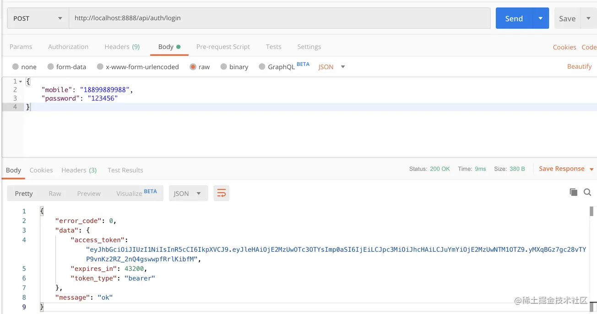

### 编写 jwt 鉴权中间件

在 `global/error.go` 中，定义 `TokenError` 错误

```go
type CustomErrors struct {
    // ...
    TokenError CustomError
}

var Errors = CustomErrors{
    // ...
    TokenError: CustomError{40100, "登录授权失效"},
}
```

在 `app/common/response/response.go` 中，编写 `TokenFail()` ，用于 token 鉴权失败统一返回

```go
func TokenFail(c *gin.Context) {
    FailByError(c, global.Errors.TokenError)
}

```

新建 `app/middleware/jwt.go` 文件，编写

```go
package middleware

import (
    "github.com/dgrijalva/jwt-go"
    "github.com/gin-gonic/gin"
    "jassue-gin/app/common/response"
    "jassue-gin/app/services"
    "jassue-gin/global"
)

func JWTAuth(GuardName string) gin.HandlerFunc {
    return func(c *gin.Context) {
        tokenStr := c.Request.Header.Get("Authorization")
        if tokenStr == "" {
            response.TokenFail(c)
            c.Abort()
            return
        }
        tokenStr = tokenStr[len(services.TokenType)+1:]

        // Token 解析校验
        token, err := jwt.ParseWithClaims(tokenStr, &services.CustomClaims{}, func(token *jwt.Token) (interface{}, error) {
            return []byte(global.App.Config.Jwt.Secret), nil
        })
        if err != nil {
            response.TokenFail(c)
            c.Abort()
            return
        }

        claims := token.Claims.(*services.CustomClaims)
        // Token 发布者校验
        if claims.Issuer != GuardName {
            response.TokenFail(c)
            c.Abort()
            return
        }

        c.Set("token", token)
        c.Set("id", claims.Id)
    }
}
```

### 使用 jwt 中间件，实现获取用户信息接口

在 `routes/api.go` 中，使用 `JWTAuth` 中间件，这样一来，客户端需要使用正确的 `Token` 才能访问在 `authRouter` 分组下的路由

```go
func SetApiGroupRoutes(router *gin.RouterGroup) {
    router.POST("/auth/register", app.Register)
    router.POST("/auth/login", app.Login)

    authRouter := router.Group("").Use(middleware.JWTAuth(services.AppGuardName))
    {
        authRouter.POST("/auth/info", app.Info)
    }
}
```

在 `app/services/user.go` 中，编写

```go
// GetUserInfo 获取用户信息
func (userService *userService) GetUserInfo(id string) (err error, user models.User) {
    intId, err := strconv.Atoi(id)
    err = global.App.DB.First(&user, intId).Error
    if err != nil {
        err = errors.New("数据不存在")
    }
    return
}
```

在 `app/controllers/auth.go`中，编写 `Info()`，通过 `JWTAuth` 中间件校验 `Token` 识别的用户 ID 来获取用户信息

```go
func Info(c *gin.Context) {
    err, user := services.UserService.GetUserInfo(c.Keys["id"].(string))
    if err != nil {
        response.BusinessFail(c, err.Error())
        return
    }
    response.Success(c, user)
}
```

使用 `Postman`，先将调用登录接口获取 `Token` 放入 `Authorization` 头，再调用接口 [http://localhost:8888/api/auth/info](https://link.juejin.cn?target=http%3A%2F%2Flocalhost%3A8888%2Fapi%2Fauth%2Finfo)

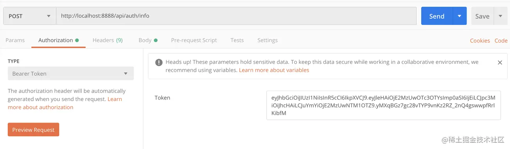

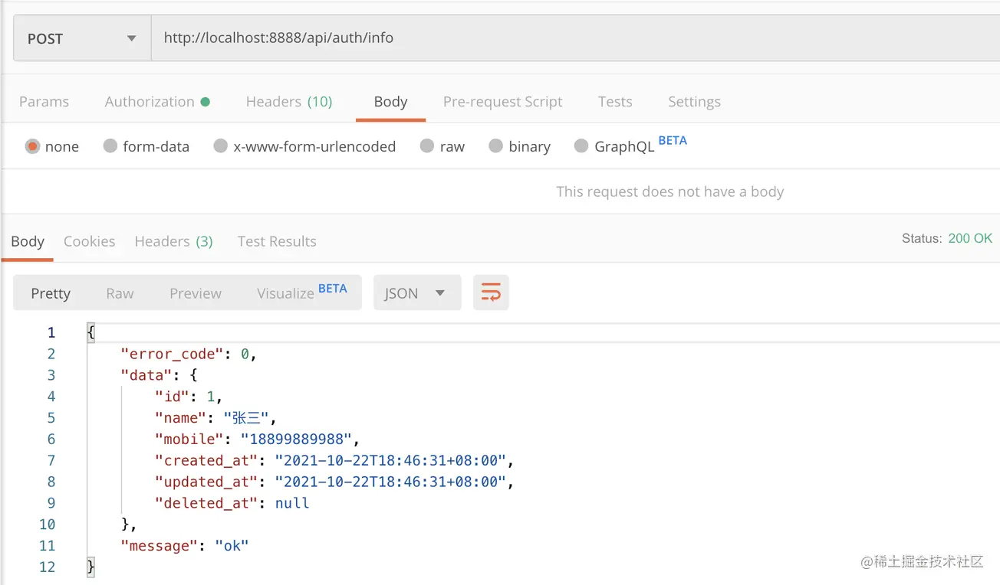

## 八、引入Redis & 解决 JWT 注销问题（黑名单策略）

### 前言

由于 JWT 是无状态的，只能等到它的有效期过了才会失效，服务端无法主动让一个 token 失效，为了解决这个问题，我这里使用黑名单策略来解决 JWT 的注销问题，简单来说就将用户主动注销的 token 加入到黑名单（Redis）中，并且必须设置有效期，否则将导致黑名单巨大的问题，然后在 Jwt 中间件鉴权时判断 token 是否在黑名单中

### 安装

```shell
go get -u github.com/go-redis/redis/v8
```

### 定义配置项

新建 `config/redis.go` 文件，编写配置

```go
package config

type Redis struct {
    Host string `mapstructure:"host" json:"host" yaml:"host"`
    Port int `mapstructure:"port" json:"port" yaml:"port"`
    DB int `mapstructure:"db" json:"db" yaml:"db"`
    Password string `mapstructure:"password" json:"password" yaml:"password"`
}
```

在 `config/config.go` 中，添加 `Redis` 属性

```go
package config

type Configuration struct {
    App App `mapstructure:"app" json:"app" yaml:"app"`
    Log Log `mapstructure:"log" json:"log" yaml:"log"`
    Database Database `mapstructure:"database" json:"database" yaml:"database"`
    Jwt Jwt `mapstructure:"jwt" json:"jwt" yaml:"jwt"`
    Redis Redis `mapstructure:"redis" json:"redis" yaml:"redis"`
}
```

在 `config/jwt.go` 中，添加 `JwtBlacklistGracePeriod` 属性

```go
package config

type Jwt struct {
    Secret string `mapstructure:"secret" json:"secret" yaml:"secret"`
    JwtTtl int64 `mapstructure:"jwt_ttl" json:"jwt_ttl" yaml:"jwt_ttl"` // token 有效期（秒）
    JwtBlacklistGracePeriod int64 `mapstructure:"jwt_blacklist_grace_period" json:"jwt_blacklist_grace_period" yaml:"jwt_blacklist_grace_period"` // 黑名单宽限时间（秒）
}
```

`config.yaml` 添加对应配置

```yaml
redis:
  host: 127.0.0.1
  port: 6379
  db: 0
  password:

jwt:
  jwt_blacklist_grace_period: 10
```

### 初始化 Redis

新建 `bootstrap/redis.go` 文件，编写

```go
package bootstrap

import (
    "context"
    "github.com/go-redis/redis/v8"
    "go.uber.org/zap"
    "jassue-gin/global"
)

func InitializeRedis() *redis.Client {
    client := redis.NewClient(&redis.Options{
        Addr:     global.App.Config.Redis.Host + ":" + global.App.Config.Redis.Port,
        Password: global.App.Config.Redis.Password, // no password set
        DB:       global.App.Config.Redis.DB,       // use default DB
    })
    _, err := client.Ping(context.Background()).Result()
    if err != nil {
        global.App.Log.Error("Redis connect ping failed, err:", zap.Any("err", err))
        return nil
    }
    return client
}
```

在 `global/app.go` 中，`Application` 结构体添加 `Redis` 属性

```go
type Application struct {
    // ...
    Redis *redis.Client
}
```

在 `main.go` 中，调用 `InitializeRedis()`

```go
func main() {
    // ...

    // 初始化验证器
    bootstrap.InitializeValidator()

    // 初始化Redis
    global.App.Redis = bootstrap.InitializeRedis()

    // 启动服务器
    bootstrap.RunServer()
}
```

### 编写黑名单相关逻辑

新建 `utils/md5.go` 文件，编写 `MD5()` 用于 token 编码

```go
package utils

import (
    "crypto/md5"
    "encoding/hex"
)

func MD5(str []byte, b ...byte) string {
    h := md5.New()
    h.Write(str)
    return hex.EncodeToString(h.Sum(b))
}
```

在 `app/services/jwt.go` 中，编写：

```go
// 获取黑名单缓存 key
func (jwtService *jwtService) getBlackListKey(tokenStr string) string {
    return "jwt_black_list:" + utils.MD5([]byte(tokenStr))
}

// JoinBlackList token 加入黑名单
func (jwtService *jwtService) JoinBlackList(token *jwt.Token) (err error) {
    nowUnix := time.Now().Unix()
    timer := time.Duration(token.Claims.(*CustomClaims).ExpiresAt - nowUnix) * time.Second
    // 将 token 剩余时间设置为缓存有效期，并将当前时间作为缓存 value 值
    err = global.App.Redis.SetNX(context.Background(), jwtService.getBlackListKey(token.Raw), nowUnix, timer).Err()
    return
}

// IsInBlacklist token 是否在黑名单中
func (jwtService *jwtService) IsInBlacklist(tokenStr string) bool {
    joinUnixStr, err := global.App.Redis.Get(context.Background(), jwtService.getBlackListKey(tokenStr)).Result()
    joinUnix, err := strconv.ParseInt(joinUnixStr, 10, 64)
    if joinUnixStr == "" || err != nil {
        return false
    }
    // JwtBlacklistGracePeriod 为黑名单宽限时间，避免并发请求失效
    if time.Now().Unix()-joinUnix < global.App.Config.Jwt.JwtBlacklistGracePeriod {
        return false
    }
    return true
}
```

在 `app/middleware/jwt.go` 中，增加黑名单校验

```go
func JWTAuth(GuardName string) gin.HandlerFunc {
    return func(c *gin.Context) {
        // ...
        token, err := jwt.ParseWithClaims(tokenStr, &services.CustomClaims{}, func(token *jwt.Token) (interface{}, error) {
            return []byte(global.App.Config.Jwt.Secret), nil
        })
        if err != nil || services.JwtService.IsInBlacklist(tokenStr) {
            response.TokenFail(c)
            c.Abort()
            return
        }

        claims := token.Claims.(*services.CustomClaims)
        // ...
    }
}
```

### 实现登出接口

添加路由

```go
func SetApiGroupRoutes(router *gin.RouterGroup) {
    // ...
    authRouter := router.Group("").Use(middleware.JWTAuth(services.AppGuardName))
    {
        authRouter.POST("/auth/info", app.Info)
        authRouter.POST("/auth/logout", app.Logout)
    }
}
```

在 `app/controllers/app/auth.go` 中，编写

```go
func Logout(c *gin.Context) {
    err := services.JwtService.JoinBlackList(c.Keys["token"].(*jwt.Token))
    if err != nil {
        response.BusinessFail(c, "登出失败")
        return
    }
    response.Success(c, nil)
}
```

### 测试

调用登录接口获取 token

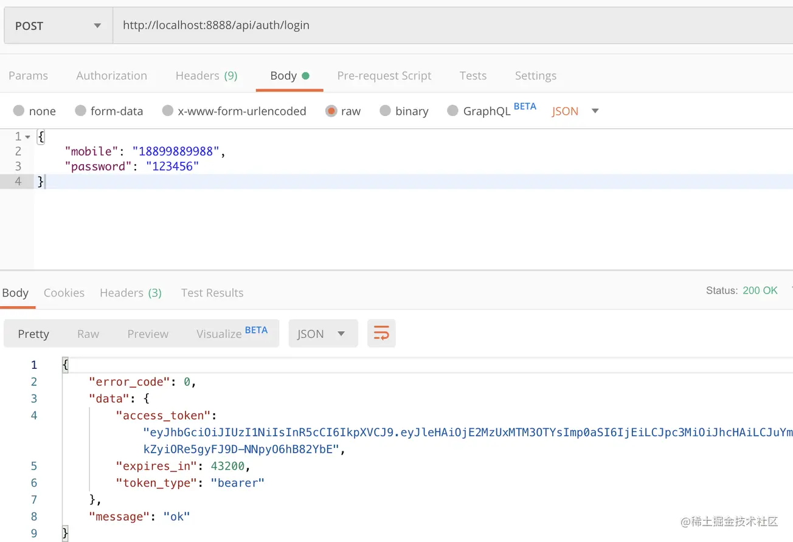

将 token 加入 `Authorization` 头，调用登出接口 [http://localhost:8888/api/auth/logout](https://link.juejin.cn?target=http%3A%2F%2Flocalhost%3A8888%2Fapi%2Fauth%2Flogout)

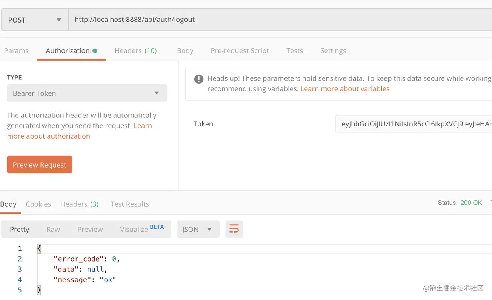

在 `JwtBlacklistGracePeriod` 黑名单宽限时间结束之后，继续调用登出接口将无法成功响应

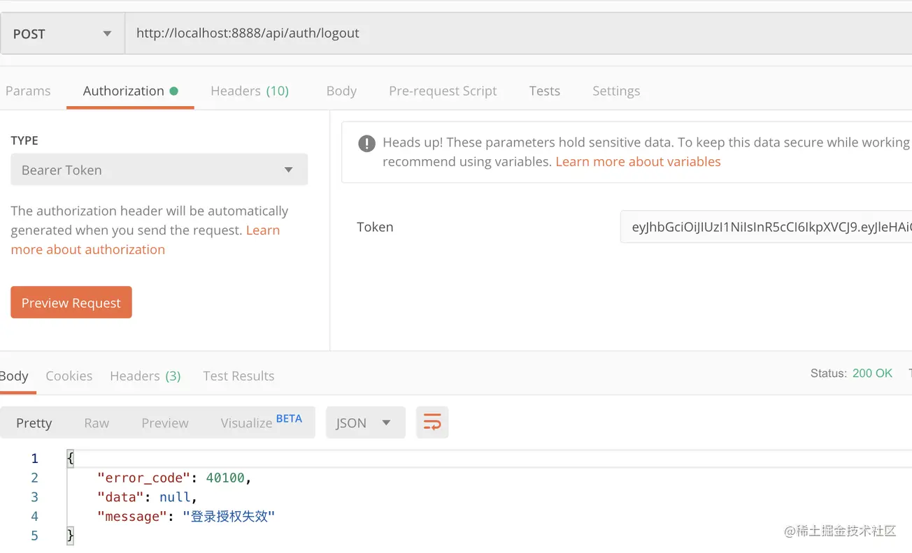

## 九、Token 续签 & 封装分布式锁

### 前言

如果将 token 的有效期时间设置过短，到期后用户需要重新登录，过于繁琐且体验感差，这里我将采用服务端刷新 token 的方式来处理。先规定一个时间点，比如在过期前的 2 小时内，如果用户访问了接口，就颁发新的 token 给客户端（设置响应头），同时把旧 token 加入黑名单，在上一篇中，设置了一个黑名单宽限时间，目的就是避免并发请求中，刷新了 token ，导致部分请求失败的情况；同时，我们也要避免并发请求导致 token 重复刷新的情况，这时候就需要上锁了，这里使用了 Redis 来实现，考虑到以后项目中可能会频繁使用锁，在篇头将简单做个封装

### 封装分布式锁

新建 `utils/str.go` ，编写 `RandString()` 用于生成锁标识，防止任何客户端都能解锁

```go
package utils

import (
    "math/rand"
    "time"
)

func RandString(len int) string {
    r := rand.New(rand.NewSource(time.Now().UnixNano()))
    bytes := make([]byte, len)
    for i := 0; i < len; i++ {
        b := r.Intn(26) + 65
        bytes[i] = byte(b)
    }
    return string(bytes)
}
```

新建 `global/lock.go` ，编写

```go
package global

import (
    "context"
    "github.com/go-redis/redis/v8"
    "jassue-gin/utils"
    "time"
)

type Interface interface {
    Get() bool
    Block(seconds int64) bool
    Release() bool
    ForceRelease()
}

type lock struct {
    context context.Context
    name string // 锁名称
    owner string // 锁标识
    seconds int64 // 有效期
}

// 释放锁 Lua 脚本，防止任何客户端都能解锁
const releaseLockLuaScript = `
if redis.call("get",KEYS[1]) == ARGV[1] then
    return redis.call("del",KEYS[1])
else
    return 0
end
`

// 生成锁
func Lock(name string, seconds int64) Interface {
    return &lock{
        context.Background(),
        name,
        utils.RandString(16),
        seconds,
    }
}

// 获取锁
func (l *lock) Get() bool {
    return App.Redis.SetNX(l.context, l.name, l.owner, time.Duration(l.seconds)*time.Second).Val()
}

// 阻塞一段时间，尝试获取锁
func (l *lock) Block(seconds int64) bool {
    starting := time.Now().Unix()
    for {
        if !l.Get() {
            time.Sleep(time.Duration(1) * time.Second)
            if time.Now().Unix()-seconds >= starting {
                return false
            }
        } else {
            return true
        }
    }
}

// 释放锁
func (l *lock) Release() bool {
    luaScript := redis.NewScript(releaseLockLuaScript)
    result := luaScript.Run(l.context, App.Redis, []string{l.name}, l.owner).Val().(int64)
    return result != 0
}

// 强制释放锁
func (l *lock) ForceRelease() {
    App.Redis.Del(l.context, l.name).Val()
}
```

### 定义配置项

在 `config/jwt.go` 中，增加 `RefreshGracePeriod` 属性

```go
package config

type Jwt struct {
    Secret string `mapstructure:"secret" json:"secret" yaml:"secret"`
    JwtTtl int64 `mapstructure:"jwt_ttl" json:"jwt_ttl" yaml:"jwt_ttl"` // token 有效期（秒）
    JwtBlacklistGracePeriod int64 `mapstructure:"jwt_blacklist_grace_period" json:"jwt_blacklist_grace_period" yaml:"jwt_blacklist_grace_period"` // 黑名单宽限时间（秒）
    RefreshGracePeriod int64 `mapstructure:"refresh_grace_period" json:"refresh_grace_period" yaml:"refresh_grace_period"` // token 自动刷新宽限时间（秒）
}
```

`config.yaml` 添加对应配置

```yaml
jwt:
  refresh_grace_period: 1800
```

### 在 jwt 中间件中增加续签机制

在 `app/services/jwt.go` 中，编写 `GetUserInfo()`， 根据不同客户端 token ，查询不同用户表数据

```go
func (jwtService *jwtService) GetUserInfo(GuardName string, id string) (err error, user JwtUser) {
    switch GuardName {
    case AppGuardName:
        return UserService.GetUserInfo(id)
    default:
        err = errors.New("guard " + GuardName +" does not exist")
    }
    return
}
```

在 `app/middleware/jwt.go` 中，编写

```go
package middleware

import (
    "github.com/dgrijalva/jwt-go"
    "github.com/gin-gonic/gin"
    "jassue-gin/app/common/response"
    "jassue-gin/app/services"
    "jassue-gin/global"
    "strconv"
    "time"
)

func JWTAuth(GuardName string) gin.HandlerFunc {
    return func(c *gin.Context) {
      
        //...
        claims := token.Claims.(*services.CustomClaims)
        if claims.Issuer != GuardName {
            response.TokenFail(c)
            c.Abort()
            return
        }

        // token 续签
        if claims.ExpiresAt-time.Now().Unix() < global.App.Config.Jwt.RefreshGracePeriod {
            lock := global.Lock("refresh_token_lock", global.App.Config.Jwt.JwtBlacklistGracePeriod)
            if lock.Get() {
                err, user := services.JwtService.GetUserInfo(GuardName, claims.Id)
                if err != nil {
                    global.App.Log.Error(err.Error())
                    lock.Release()
                } else {
                    tokenData, _, _ := services.JwtService.CreateToken(GuardName, user)
                    c.Header("new-token", tokenData.AccessToken)
                    c.Header("new-expires-in", strconv.Itoa(tokenData.ExpiresIn))
                    _ = services.JwtService.JoinBlackList(token)
                }
            }
        }

        c.Set("token", token)
        c.Set("id", claims.Id)
    }
}
```

### 测试

修改 `config.yaml` 配置，暂时将 `refresh_grace_period` 设置一个较大的值，确保能满足续签条件

```yaml
jwt:
  secret: 3Bde3BGEbYqtqyEUzW3ry8jKFcaPH17fRmTmqE7MDr05Lwj95uruRKrrkb44TJ4s
  jwt_ttl: 43200
  jwt_blacklist_grace_period: 10
  refresh_grace_period: 43200
```

调用 [http://localhost:8888/api/auth/login](https://link.juejin.cn?target=http%3A%2F%2Flocalhost%3A8888%2Fapi%2Fauth%2Flogin) ，获取 token

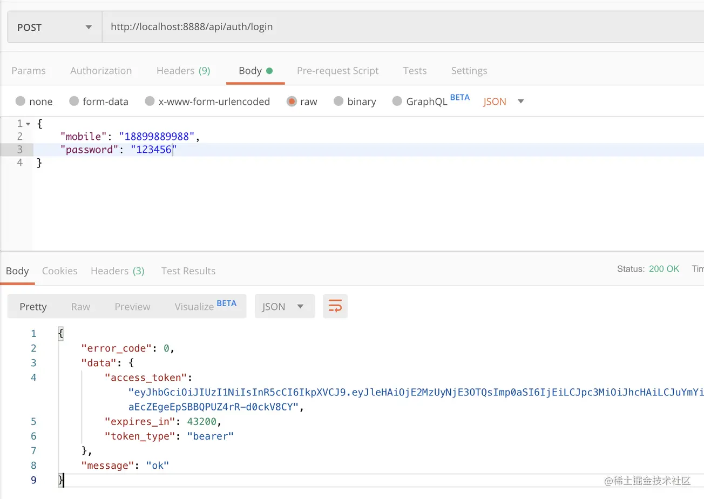

添加 token 到请求头，调用 [http://localhost:8888/api/auth/info](https://link.juejin.cn?target=http%3A%2F%2Flocalhost%3A8888%2Fapi%2Fauth%2Finfo) ，查看响应头，`New-Token` 为新 token，`New-Expires-In` 为新 token 的有效期

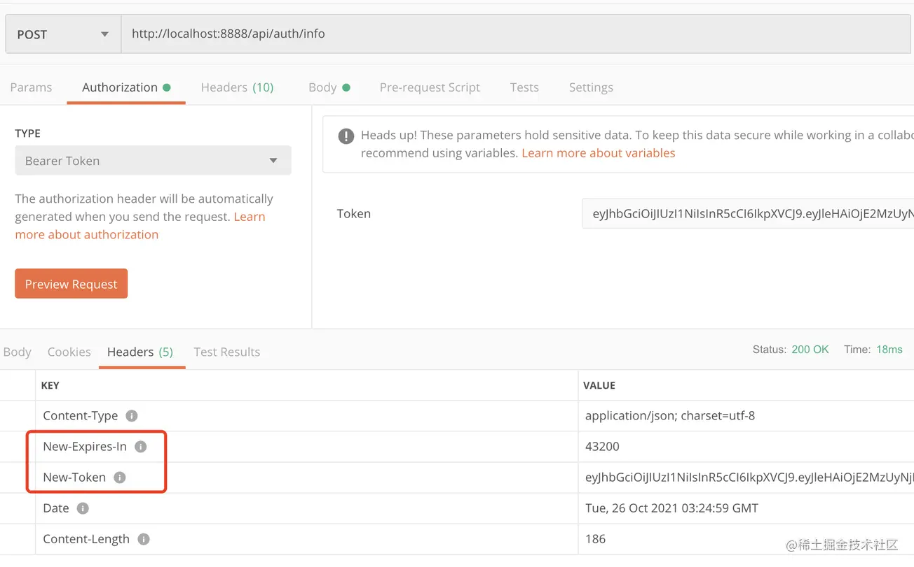

## 十、初始化多驱动文件系统 & 实现图片上传接口

### 前言

在项目中有时会需要用到不同驱动的文件系统，为了简化不同驱动间的操作，需要将操作 API 统一，这几天我简单封装了 [go-storage](https://link.juejin.cn?target=https%3A%2F%2Fgithub.com%2Fjassue%2Fgo-storage) 包，支持的驱动有本地存储、七牛云存储（kodo）、阿里云存储（oss），也支持自定义储存，该包代码比较简单，这里不过多赘述，本篇主要讲的如何在 Gin 框架中集成并使用它

### 安装

```shell
go get -u github.com/jassue/go-storage
```

### 定义配置项

新建 `config/storage.go`，定义各个驱动的配置项

```go
package config

import (
    "github.com/jassue/go-storage/kodo"
    "github.com/jassue/go-storage/local"
    "github.com/jassue/go-storage/oss"
    "github.com/jassue/go-storage/storage"
)

type Storage struct {
    Default storage.DiskName `mapstructure:"default" json:"default" yaml:"default"` // local本地 oss阿里云 kodo七牛云
    Disks Disks `mapstructure:"disks" json:"disks" yaml:"disks"`
}

type Disks struct {
    Local local.Config `mapstructure:"local" json:"local" yaml:"local"`
    AliOss oss.Config `mapstructure:"ali_oss" json:"ali_oss" yaml:"ali_oss"`
    QiNiu kodo.Config `mapstructure:"qi_niu" json:"qi_niu" yaml:"qi_niu"`
}
```

`config/config.go` 添加 `Storage` 成员属性

```go
package config

type Configuration struct {
    App App `mapstructure:"app" json:"app" yaml:"app"`
    Log Log `mapstructure:"log" json:"log" yaml:"log"`
    Database Database `mapstructure:"database" json:"database" yaml:"database"`
    Jwt Jwt `mapstructure:"jwt" json:"jwt" yaml:"jwt"`
    Redis Redis `mapstructure:"redis" json:"redis" yaml:"redis"`
    Storage Storage `mapstructure:"storage" json:"storage" yaml:"storage"`
}
```

`config.yaml` 添加对应配置

```yaml
storage:
  default: local # 默认驱动
  disks:
    local:
      root_dir: ./storage/app # 本地存储根目录
      app_url: http://localhost:8888/storage # 本地图片 url 前部
    ali_oss:
      access_key_id:
      access_key_secret:
      bucket:
      endpoint:
      is_ssl: true # 是否使用 https 协议
      is_private: false # 是否私有读
    qi_niu:
      access_key:
      bucket:
      domain:
      secret_key:
      is_ssl: true
      is_private: false

```

### 初始化 Storage

新建 `bootstrap/storage.go` 文件，编写：

```go
package bootstrap

import (
    "github.com/jassue/go-storage/kodo"
    "github.com/jassue/go-storage/local"
    "github.com/jassue/go-storage/oss"
    "jassue-gin/global"
)

func InitializeStorage() {
    _, _ = local.Init(global.App.Config.Storage.Disks.Local)
    _, _ = kodo.Init(global.App.Config.Storage.Disks.QiNiu)
    _, _ = oss.Init(global.App.Config.Storage.Disks.AliOss)
}
```

在 `global/app.go` 中，为 `Application` 结构体添加成员方法 `Disk()` ，作为获取文件系统实例的统一入口

```go
package global

import (
    "github.com/go-redis/redis/v8"
    "github.com/jassue/go-storage/storage"
    "github.com/spf13/viper"
    "go.uber.org/zap"
    "gorm.io/gorm"
    "jassue-gin/config"
)

type Application struct {
    ConfigViper *viper.Viper
    Config config.Configuration
    Log *zap.Logger
    DB *gorm.DB
    Redis *redis.Client
}

var App = new(Application)

func (app *Application) Disk(disk... string) storage.Storage {
    // 若未传参，默认使用配置文件驱动
    diskName := app.Config.Storage.Default
    if len(disk) > 0 {
        diskName = storage.DiskName(disk[0])
    }
    s, err := storage.Disk(diskName)
    if err != nil {
        panic(err)
    }
    return s
}
```

在 `main.go` 中调用

```go
package main

import (
    "jassue-gin/bootstrap"
    "jassue-gin/global"
)

func main() {
    // ...

    // 初始化Redis
    global.App.Redis = bootstrap.InitializeRedis()

    // 初始化文件系统
    bootstrap.InitializeStorage()

    // 启动服务器
    bootstrap.RunServer()
}
```

### 实现图片上传接口

为了统一管理文件的 url，我这里将把 url 存到 mysql 中

新建 `app/models/media.go` 模型文件

```go
package models

type Media struct {
    ID
    DiskType string `json:"disk_type" gorm:"size:20;index;not null;comment:存储类型"`
    SrcType int8 `json:"src_type" gorm:"not null;comment:链接类型 1相对路径 2外链"`
    Src string `json:"src" gorm:"not null;comment:资源链接"`
    Timestamps
}
```

在 `bootstrap/db.go` 中，初始化 `media` 数据表

```go
func initMySqlTables(db *gorm.DB) {
    err := db.AutoMigrate(
        models.User{},
        models.Media{},
    )
    if err != nil {
        global.App.Log.Error("migrate table failed", zap.Any("err", err))
        os.Exit(0)
    }
}
```

新建 `app/common/request/upload.go` 文件，编写表单验证器

```go
package request

import "mime/multipart"

type ImageUpload struct {
    Business string `form:"business" json:"business" binding:"required"`
    Image *multipart.FileHeader `form:"image" json:"image" binding:"required"`
}

func (imageUpload ImageUpload) GetMessages() ValidatorMessages {
    return ValidatorMessages{
        "business.required": "业务类型不能为空",
        "image.required": "请选择图片",
    }
}
```

新建 `app/services/media.go` 文件，编写图片上传相关逻辑

```go
package services

import (
    "context"
    "errors"
    "github.com/jassue/go-storage/storage"
    "github.com/satori/go.uuid"
    "jassue-gin/app/common/request"
    "jassue-gin/app/models"
    "jassue-gin/global"
    "path"
    "strconv"
    "time"
)

type mediaService struct {
}

var MediaService = new(mediaService)

type outPut struct {
    Id int64 `json:"id"`
    Path string `json:"path"`
    Url string `json:"url"`
}

const mediaCacheKeyPre = "media:"

// 文件存储目录
func (mediaService *mediaService) makeFaceDir(business string) string {
    return global.App.Config.App.Env + "/" + business
}

// HashName 生成文件名称（使用 uuid）
func (mediaService *mediaService) HashName(fileName string) string {
    fileSuffix := path.Ext(fileName)
    return uuid.NewV4().String() + fileSuffix
}

// SaveImage 保存图片（公共读）
func (mediaService *mediaService) SaveImage(params request.ImageUpload) (result outPut, err error) {
    file, err := params.Image.Open()
    defer file.Close()
    if err != nil {
        err = errors.New("上传失败")
        return
    }

    localPrefix := ""
    // 本地文件存放路径为 storage/app/public，由于在『（五）静态资源处理 & 优雅重启服务器』中，
    // 配置了静态资源处理路由 router.Static("/storage", "./storage/app/public")
    // 所以此处不需要将 public/ 存入到 mysql 中，防止后续拼接文件 Url 错误
    if global.App.Config.Storage.Default == storage.Local {
        localPrefix = "public" + "/"
    }
    key := mediaService.makeFaceDir(params.Business) + "/" + mediaService.HashName(params.Image.Filename)
    disk := global.App.Disk()
    err = disk.Put(localPrefix + key, file, params.Image.Size)
    if err != nil {
        return
    }

    image := models.Media{
        DiskType: string(global.App.Config.Storage.Default),
        SrcType:    1,
        Src:        key,
    }
    err = global.App.DB.Create(&image).Error
    if err != nil {
        return
    }

    result = outPut{int64(image.ID.ID), key, disk.Url(key)}
    return
}

// GetUrlById 通过 id 获取文件 url
func (mediaService *mediaService) GetUrlById(id int64) string {
    if id == 0 {
        return ""
    }

    var url string
    cacheKey := mediaCacheKeyPre + strconv.FormatInt(id,10)

    exist := global.App.Redis.Exists(context.Background(), cacheKey).Val()
    if exist == 1 {
        url = global.App.Redis.Get(context.Background(), cacheKey).Val()
    } else {
        media := models.Media{}
        err := global.App.DB.First(&media, id).Error
        if err != nil {
            return ""
        }
        url = global.App.Disk(media.DiskType).Url(media.Src)
        global.App.Redis.Set(context.Background(), cacheKey, url, time.Second*3*24*3600)
    }

    return url
}
```

新建 `app/controllers/common/upload.go` 文件，校验入参，调用 `MediaService`

```go
package common

import (
    "github.com/gin-gonic/gin"
    "jassue-gin/app/common/request"
    "jassue-gin/app/common/response"
    "jassue-gin/app/services"
)

func ImageUpload(c *gin.Context) {
    var form request.ImageUpload
    if err := c.ShouldBind(&form); err != nil {
        response.ValidateFail(c, request.GetErrorMsg(form, err))
        return
    }

    outPut, err := services.MediaService.SaveImage(form)
    if err != nil {
        response.BusinessFail(c, err.Error())
        return
    }
    response.Success(c, outPut)
}
```

在 `routes/api.go` 文件添加路由

```go
package routes

import (
    "github.com/gin-gonic/gin"
    "jassue-gin/app/controllers/app"
    "jassue-gin/app/controllers/common"
    "jassue-gin/app/middleware"
    "jassue-gin/app/services"
)

func SetApiGroupRoutes(router *gin.RouterGroup) {
    // ...
    authRouter := router.Group("").Use(middleware.JWTAuth(services.AppGuardName))
    {
        authRouter.POST("/auth/info", app.Info)
        authRouter.POST("/auth/logout", app.Logout)
        authRouter.POST("/image_upload", common.ImageUpload)
    }
}
```

### 测试

调用 [http://localhost:8888/api/auth/login](https://link.juejin.cn?target=http%3A%2F%2Flocalhost%3A8888%2Fapi%2Fauth%2Flogin) ，获取 token


添加 token 到请求头，调用 [http://localhost:8888/api/image_upload](https://link.juejin.cn?target=http%3A%2F%2Flocalhost%3A8888%2Fapi%2Fimage_upload) ，上传成功

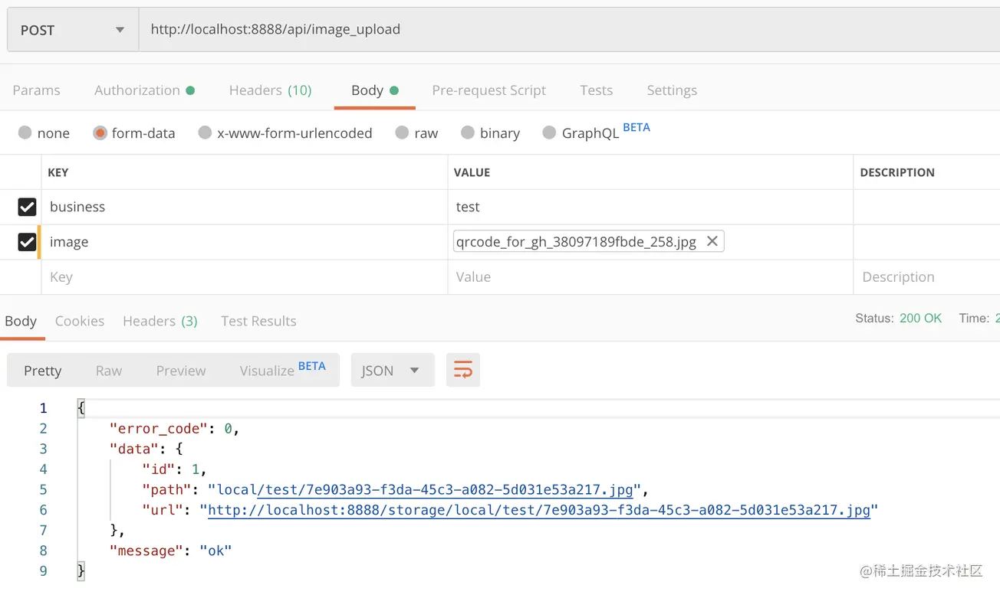

修改 `config.yaml` 默认驱动配置项，依次修改为本地、阿里云、七牛云，并同时调用接口，如下图，文件都成功上传了

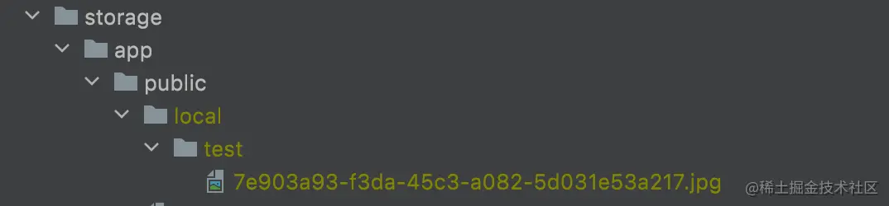

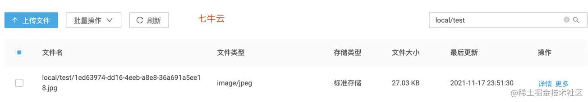

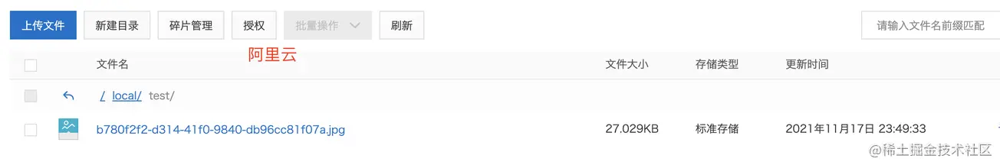

## 十一、使用文件记录错误日志 & 跨域处理

### 前言

Gin 框架的日志默认是在控制台输出，本篇将使用 Gin 提供的 `RecoveryWithWriter()` 方法，封装一个中间件，使用 `lumberjack` 作为的写入器，将错误日志写入文件中；同时使用 `github.com/gin-contrib/cors` ，作下跨域处理。

### 安装

```shell
go get -u gopkg.in/natefinch/lumberjack.v2
go get github.com/gin-contrib/cors
```

### Recovery 中间件

在 `app/common/response/response.go` 文件中，添加 `ServerError()` 方法，作为 `RecoveryFunc`

```go
package response

import (
    "github.com/gin-gonic/gin"
    "jassue-gin/global"
    "net/http"
    "os"
)

// ...

func ServerError(c *gin.Context, err interface{}) {
    msg := "Internal Server Error"
    // 非生产环境显示具体错误信息
    if global.App.Config.App.Env != "production" && os.Getenv(gin.EnvGinMode) != gin.ReleaseMode {
        if _, ok := err.(error); ok {
            msg = err.(error).Error()
        }
    }
    c.JSON(http.StatusInternalServerError, Response{
        http.StatusInternalServerError,
        nil,
        msg,
    })
    c.Abort()
}
// ...
```

新建 `app/middleware/recovery.go` 文件，编写：

```go
package middleware

import (
    "github.com/gin-gonic/gin"
    "gopkg.in/natefinch/lumberjack.v2"
    "jassue-gin/app/common/response"
    "jassue-gin/global"
)

func CustomRecovery() gin.HandlerFunc {
    return gin.RecoveryWithWriter(
        &lumberjack.Logger{
            Filename:   global.App.Config.Log.RootDir + "/" + global.App.Config.Log.Filename,
            MaxSize:    global.App.Config.Log.MaxSize,
            MaxBackups: global.App.Config.Log.MaxBackups,
            MaxAge:     global.App.Config.Log.MaxAge,
            Compress:   global.App.Config.Log.Compress,
        },
        response.ServerError)
}
```

### CORS 跨域处理

新建 `app/middleware/cors.go` 文件，编写：

```go
package middleware

import (
    "github.com/gin-contrib/cors"
    "github.com/gin-gonic/gin"
)

func Cors() gin.HandlerFunc {
    config := cors.DefaultConfig()
    config.AllowAllOrigins = true
    config.AllowHeaders = []string{"Origin", "Content-Length", "Content-Type", "Authorization"}
    config.AllowCredentials = true
    config.ExposeHeaders = []string{"New-Token", "New-Expires-In", "Content-Disposition"}

    return cors.New(config)
}
```

### 使用中间件

在 `bootstrap/router.go` 文件，编写：

```go
func setupRouter() *gin.Engine {
    if global.App.Config.App.Env == "production" {
        gin.SetMode(gin.ReleaseMode)
    }
    router := gin.New()
    router.Use(gin.Logger(), middleware.CustomRecovery())

    // 跨域处理
    // router.Use(middleware.Cors())
}
```

### 测试

为了演示，这里我故意将数据库配置写错，请求登录接口，中间件成功生效

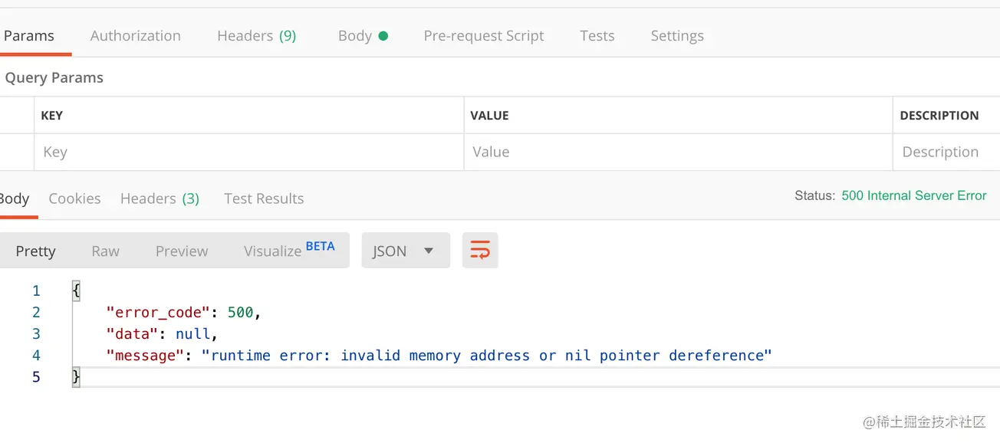

接着查看 `storage/logs/app.log` 文件，错误信息成功写入到文件，内容如下：

```
[31m2021/11/21 20:40:18 [Recovery] 2021/11/21 - 20:40:18 panic recovered:
POST /api/auth/login HTTP/1.1
Host: localhost:8888
Accept: */*
Accept-Encoding: gzip, deflate
Cache-Control: no-cache
Connection: keep-alive
Content-Length: 51
Content-Type: application/json
Postman-Token: 30136d3a-9a7d-43ff-bd6e-8f408dd20a7e
User-Agent: PostmanRuntime/7.18.0

runtime error: invalid memory address or nil pointer dereference
/usr/local/go/src/runtime/panic.go:221 (0x104a9c6)
	panicmem: panic(memoryError)
/usr/local/go/src/runtime/signal_unix.go:735 (0x104a996)
	sigpanic: panicmem()
/Users/sjj/go/pkg/mod/gorm.io/gorm@v1.21.16/gorm.go:355 (0x1537ed8)
	(*DB).getInstance: if db.clone > 0 {
/Users/sjj/go/pkg/mod/gorm.io/gorm@v1.21.16/chainable_api.go:146 (0x152efdb)
	(*DB).Where: tx = db.getInstance()
/Users/sjj/go/src/jassue-gin/app/services/user.go:31 (0x17a963e)
	(*userService).Login: err = global.App.DB.Where("mobile = ?", params.Mobile).First(&user).Error
/Users/sjj/go/src/jassue-gin/app/controllers/app/auth.go:37 (0x17aab7b)
...
```

