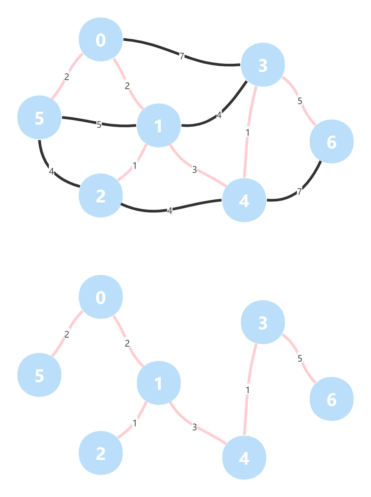

# 最小生成树问题

> 接上回，本次介绍另一类问题的相关算法。

在图论领域，有权图（Weight Graph）最经典的问题是最小生成树问题（Minimum Spanning Tree）：对于一个 n 个节点的 **连通图**，求出包含原图 n 个节点、且确保所有边权值之和最小的连通子图，则为 **最小生成树（MST）**。

有权图与其最小生成树：

[](https://ywh-oss.oss-cn-shenzhen.aliyuncs.com/MST.png)

先给出有权图的 Java 实现（省略细节），有权边 `WeightedEdge`（兼容有向、无向）：

```
public class WeightedEdge implements Comparable<WeightedEdge> {
    
    // 起点，终点，权值
    private final int v, w, weight;
    
    public WeightedEdge(int v, int w, int weight) {
        this.v = v;
        this.w = w;
        this.weight = weight;
    }
    
    // ...
}
```

有权图 `WeightedGraph`：

```go
public class WeightedGraph {
    
    // 顶点数，边数
    private int V, E;
    
    /**
     * 邻接表：使用红黑树描述
     * [
     *      0: {1: 3, 2: 2, 3: -2},
     *      1: (2: 2, 3: 2, 4: 1)
     * ]
     */
    private TreeMap<Integer, Integer>[] adj;
    
    // 获取权值
    public int getWeight(int v, int w) {
        if (hasEdge(v, w)) {
            return adj[v].get(w);
        }
        throw new IllegalArgumentException(String.format("No edge %d-%d", v, w));
    }
    
     // 边是否存在
    public boolean hasEdge(int v, int w) {
        return adj[v].containsKey(w);
    }
    
    // ...
}
```

## 连通性判断

对于一个图，可求解出最小生成树的前提是该图为 **连通图**，即图中任意两个节点之间都能找到至少一条路径相连。

对于非连通图，每个连通子图都称为一个 **连通分量**。

因此判断图是否连通可使用以下深度优先遍历（DFS）算法：

- 使用变量 `int left` 记录待访问节点数（初始化为图节点总数 `V`），数组 `boolean[] visited` 记录节点访问状态（避免重复访问）。
- 从任意一个节点 `v` 出发深度优先遍历图，每经过一个未被访问的邻接节点 `w` 即标记为已访问 `visited[w] = true;`，并把待访问节点数 -1 `left--`，否则跳过。
- 当从 `v` 出发的深度优先遍历结束，表示已找到一个连通分量。此时判断待访问节点数 `left` 是否为 0，是则表示刚才已完成整图遍历，该图为连通图，否则为非连通图。

基本实现如下：

```go
Stack<Integer> stack = new Stack<>();
boolean[] visited = new boolean[V];

// 从 0 出发遍历图，判断图是否联通。
stack.push(0);
int left = V - 1;
visited[0] = true;
while (!stack.empty()) {
    int v = stack.pop();
    for (int w : adj(v)) {
        if (visited[w]) {
            continue;
        }
        // 每遇到一个未访问的邻接顶点，则 left--。
        left--;
        visited[w] = true;
        stack.push(w);
    }
}

return left == 0;
```

## 切分定理（Bipartite）

将一个图中的顶点分为两部分，称为一个 **切分**。其中一条边的两个端点属于切分不同的两边，则该边称为 **横切边**。

如果考虑边的权值，横切边的最短边就属于最小生成树（**切分定理**）。

> ### 二分图
>
> 基于切分的定义引入二分图的概念：在图中能找到一个切分，其所有的边都是横切边，则该图为 **二分图（Bipartite Graph）**：所有顶点可以分成边不相交的两部分（A 部分的点只于 B 部分相连，不与内部的点相连），所有的边的两个端点隶属于不同的部分。
>
> 二分图的概念常见于无权图的匹配问题（Matching）、最大流问题（Max Flow），经典的算法有 Hungarian 算法。

介绍切分的概念，是为了引入在遍历图的过程中，把节点划归到不同子集的技巧，这种做法在介绍 Prim 算法时再做具体说明。

## 并查集（Union Find）

并查集是一种多叉树，其包含两种基本操作：合并和查询。假设待加入并查集的节点共 n 个。

- 初始化：对于所有的 n 个点 [0, n-1]，代表每个点的集合都初始化为自身，比如 0 => {0}, 1 => {1}, …, n-1 => {n-1}。
- 合并：将两个节点所表示的集合（表示为树）合并为一个集合，即将代表其中一个节点的树的根，嫁接到另一个节点表示的树的孩子上。
- 查找：查找节点所在的集合，即根节点。

由于本文旨在总结最小生成树相关算法，并查集不是重点，只做简要说明并直接给出实现代码。

```go
public class UnionFind {

    // 父节点：parent[p] 即 p 的父节点。
    private final int[] parent;

    // 集合大小（优化树结构）
    private final int[] size;

    // 初始化：[0, n) 所有节点的父节点都是它自身，集合大小都为 1。
    public UnionFind(int n) {
        parent = new int[n];
        size = new int[n];
        for (int i = 0; i < n; i++) {
            parent[i] = i;
            size[i] = 1;
        }
    }

    // 查询：从给定节点迭代向其父节点查询，直到根节点。并更新沿途访问节点的根节点。
    public int find(int p) {
        if (p != parent[p]) {
            parent[p] = find(parent[p]);
        }
        return parent[p];
    }

    // 判断两个点是否相连。
    public boolean isConnected(int p, int q) {
        return find(p) == find(q);
    }

    // 合并：两个给定的节点迭代查询到根节点，如果它们有共同根节点则直接返回，否则把其中的一个的根节点接到另一个根节点上（节点数更多的作为根节点）。
    public void union(int p, int q) {
        // 不去重（根的值相同也合并）。
        // parent[find(parent, p)] = find(parent, q);

        // 去重（根的值相同不合并）。
        int pRoot = find(p), qRoot = find(q);
        if (pRoot == qRoot) {
            return;
        }
        if (size[p] > size [q]) {
            parent[qRoot] = pRoot;
            size[pRoot] += size[qRoot];
        } else {
            parent[pRoot] = qRoot;
            size[qRoot] += size[pRoot];
        }
    }
    
    // 求大小：某个节点的大小等于其根节点的节点数。
    public int size(int p) {
        return size[find(p)];
    }

    // 联通分量个数：父节点为其自身的点的数量。
    public int cc() {
        int cnt = 0;
        for (int i = 0; i < parent.length; i++) {
            if (parent[i] == i) {
                cnt++;
            }
        }
        return cnt;
    }
}
```

有了以上基础，就可以开始进入最小生成树的求解了。

## Kruskal 算法

Kruskal 算法本质是贪心算法：每次尽量使用短边。

每次按权值从小到大选取图上不会构成环的短边，直到覆盖所有顶点。

- 每次选择一个最短边，如果这个边没有形成环，则相当于对一个切分选择了最短横切边。
- 判断是否成环：可以使用 **DFS**（O(V+E)）或 **并查集**（接近 O(E)）。

并查集用于存放图的节点，并判断节点是否直接或间接相连。

比如 **1-2**、**2-3** 被添加到 `uf`，当 **1-3** 被尝试添加到 `uf` 时，会被判断为 1 和 3 已通过 2 相连，因此不再处理。

```
   [3]
 X    \ ✔
[1]---[2]
    ✔
```

在这里直接给出使用并查集可在判断路径是成环时，优化节点查找效率的结论（接近 O(E)），感兴趣的话可以自己探究一下。

基本实现：

```go
public class WeightedGraph {
    // ...
    public Iterable<WeightedEdge> mstKruskal() {
        // 省略环的判断，以下代码仅在连通图中有效。

        // 把所有边添加到 edges。
        List<WeightedEdge> edges = new ArrayList<>(E);
        for (int v = 0; v < V; v++) {
            for (int w : adj(v)) {
                // 不重复添加。
                if (v < w) {
                    edges.add(new WeightedEdge(v, w, getWeight(v, w)));
                }
            }
        }
        
        // 按权值从小到大排序。
        Collections.sort(edges);

        // 使用并查集判断每次取出的边是否与先前已取出的边形成环，不成环则收集。
        
        List<WeightedEdge> mst = new ArrayList<>(V - 1);
        UnionFind uf = new UnionFind(V);
        for (WeightedEdge edge : edges) {
            
            // 比如 1-2 与 2-3 都已添加到 uf 中，则下次通过 uf 可判断 1 和 3 已相连，不需要再添加到 mst。
            if (uf.isConnected(edge.getV(), edge.getW())) {
                continue;
            }
            mst.add(edge);
            uf.union(edge.getV(), edge.getW());
        }
        return mst;
    }
}
```

实现细节：

- 使用一个数组 `edges` 记录所有的边，并按权值从小到大排列。
- 初始化一个大小为 `V` 的并查集 `uf`，默认所有的边都不成环（表示为并查集中的点都不相连）。
- 遍历集合 `edges`，如果该边的两个顶点（`v` 和 `w`）在 `uf` 中没有相连，则添加到 `mst` 集合中，并在 `uf` 中连接 `v` 和 `w`。

时间复杂度：O(E*log(E))

> 点击链接可查看动图：[Kruskal MST Visualzation (usfca.edu)](https://www.cs.usfca.edu/~galles/visualization/Kruskal.html)

## Prim 算法

Prim 算法将图中的顶点分为两部分，其核心是不断操作更新切分：

- 从边数之比为 1: V-1 开始，选取两个顶点（切分 from）、与其他点（切分 to）分别组成两个切分。
- 选取这两个切分的最短横切边，添加到 MST 集合，并把顶点更新到切分 from（由于切分更新，此时横切边可能发生改变）。
- 循环执行，直到切分 to 的所有节点都被转移到切分 from（不存在切分），即得到 MST。

先直接给出基本实现，再进一步分析实现的细节：

```go
public class WeightedGraph {
    // ...
    public Iterable<WeightedEdge> mstPrim() {
        // 省略环的判断，以下代码仅在连通图中有效。

        // 标记节点当前归属的切分。
        boolean[] visited = new boolean[V];
        visited[0] = true;

        // 使用最小堆（堆顶元素必然是最短边），初始化添加顶点 0 的所有邻接边。
        Queue<WeightedEdge> pq = new PriorityQueue<>();
        for (int w : adj(0)) {
            pq.add(new WeightedEdge(0, w, getWeight(0, w)));
        }

        List<WeightedEdge> mst = new ArrayList<>();
        while (!pq.isEmpty()) {
            // 每轮循环取出最短边，如果边的两点已归属于 true 切分，表示该边非横切边，跳过。
            WeightedEdge minEdge = pq.remove();
            if (visited[minEdge.getV()] && visited[minEdge.getW()]) {
                continue;
            }
            // 收集最短横切边，并把该边当前归属于 false 切分的点划归 true。
            mst.add(minEdge);
            int newV = visited[minEdge.getV()] ? minEdge.getW() : minEdge.getV();
            visited[newV] = true;

            // 遍历新加入的 true 切分的点的邻接顶点，把未访问（即归属于 false 切分）的顶点添加到最小堆。
            for (int w : adj(newV)) {
                if (!visited[w]) {
                    pq.add(new WeightedEdge(newV, w, getWeight(newV, w)));
                }
            }
        }
        return mst;
    }
}
```

与其他 DFS、BFS 算法的实现类似，Prim 算法的实现也是基于 `boolean[] visited` 数组，只是数组的值有了另一层面的意义：用于表示节点划归到不同的切分。对于初始节点 0，划归到 `true` 切分，其余节点为 `false` 切分。

使用最小堆存放节点 0 的所有邻边，判断条件为权值的大小，使得随时可以 O(log(E)) 的代价取出最短边。

循环执行以下步骤直到最小堆为空，其间使用 `mst` 集合收集最小生成树的边，最终返回即可：

- 遍历最小堆，每轮循环取出堆顶的最短边，如果该边的两点已归属于 `true` 切分，表示该边非横切边，因此跳过。
- 否则收集最短边到 `mst` 集，并把改横切边上，当前归属于 `false` 切分的端点 v 划归到 `true` 切分。
- 遍历新加入 `true` 的节点 `v` 的所有邻接节点 `w`，把其中未访问（即还属于 `false` 切分）的节点添加到最小堆。

时间复杂度：由于使用了最小堆，可快速找到最短横切边，时间复杂度从 O(V*E) 优化到 O(E*log(E))，如改用索引堆（Index Heap）则可以进一步优化到 O(E*log(V))。

> 点击链接可查看动图：[Prim MST Visualzation (usfca.edu)](https://www.cs.usfca.edu/~galles/visualization/Prim.html)

## 总结

本文介绍了最小生成树问题两种最经典的算法，实际上除此之外还有 Fredman-Tarjan 算法（Time: O(E+V*log(V))）、Chazelle 算法（Time: O(E*)），限于篇幅就不再一一介绍了，感兴趣的话可以自行查阅相关资料。

## 参考

- [Kruskal’s algorithm - Wikipedia](https://en.wikipedia.org/wiki/Kruskal's_algorithm)
- [Prim’s algorithm - Wikipedia](https://en.wikipedia.org/wiki/Prim's_algorithm)
- [Data Structure Visualization (usfca.edu)](https://www.cs.usfca.edu/~galles/visualization/Algorithms.html)